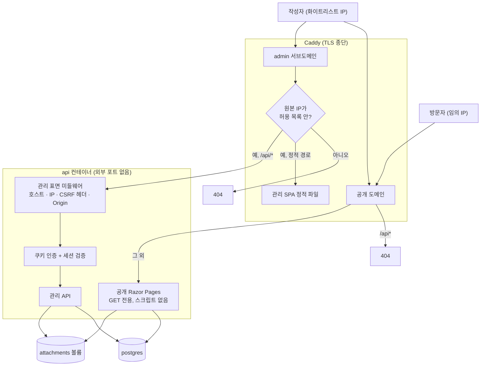
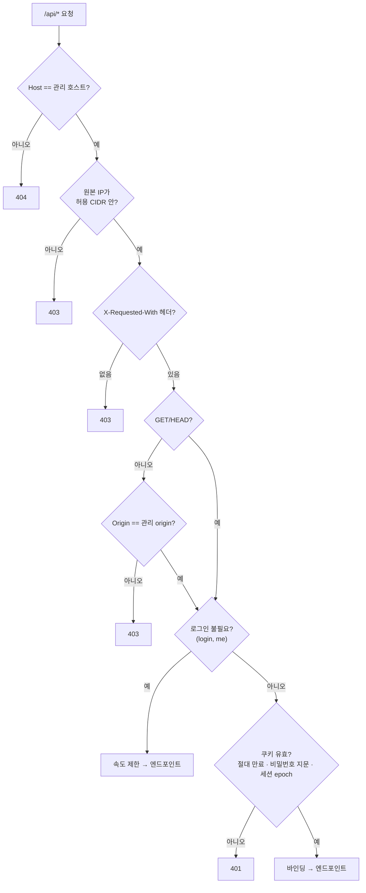
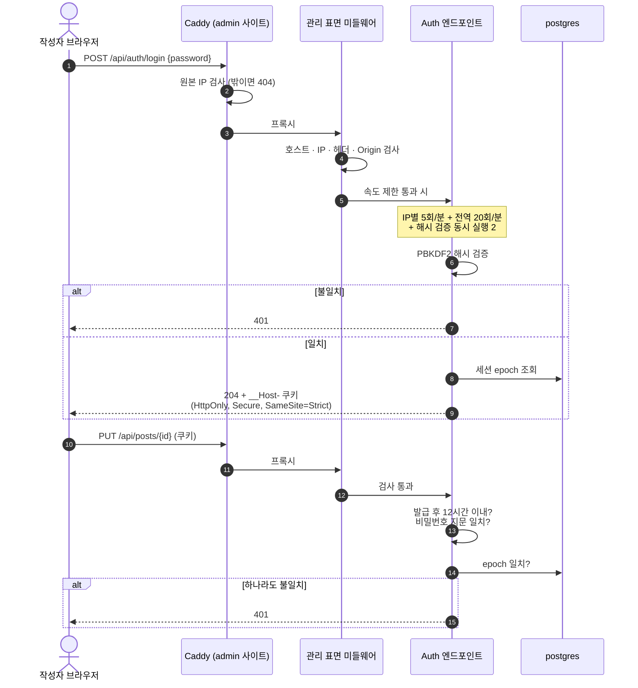
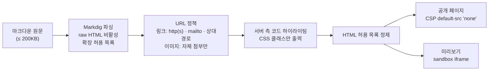
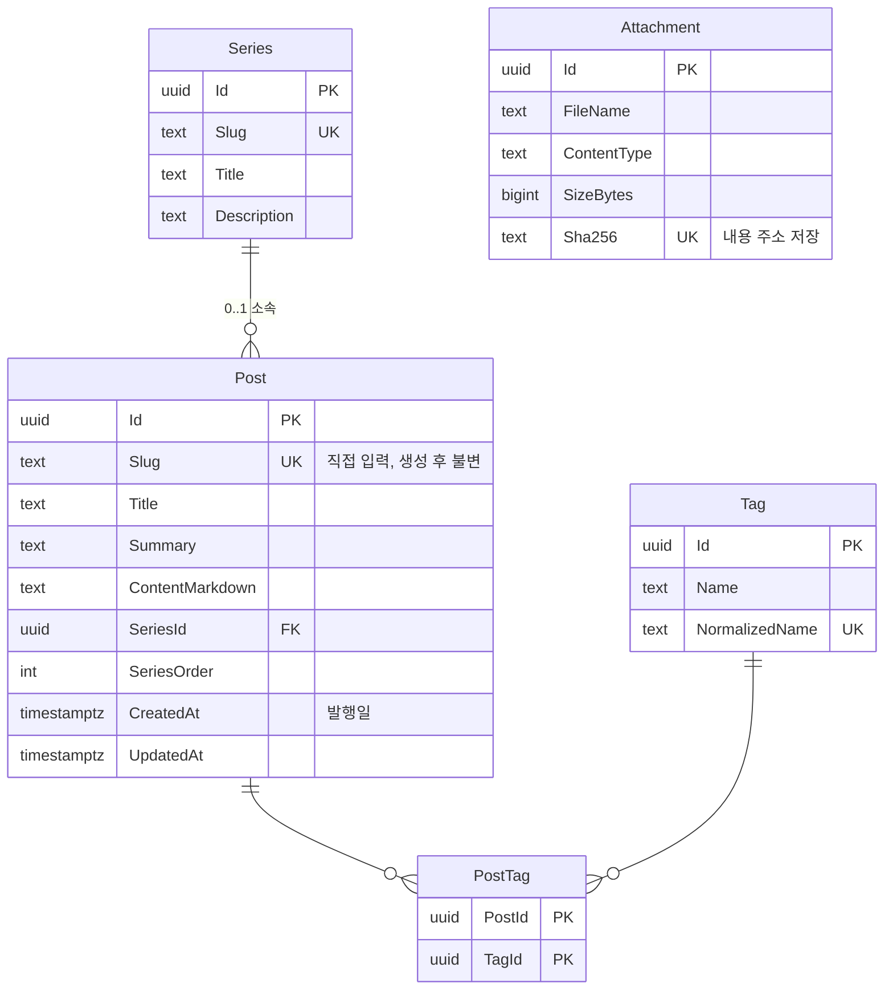

# PortfolioBlog — 보안 최우선 기술 블로그

단일 작성자용 기술 블로그입니다. 방문자에게는 **스크립트 없는 서버 렌더링 HTML**만 내보내고, 글쓰기는 **별도 서브도메인 + IP 화이트리스트 + 비밀번호 세션** 뒤에 둡니다.

> **현재 상태: 1단계(관리 API·접근 제어)·2A단계(마크다운 파이프라인·미리보기·이미지 첨부) 완료, 공개 페이지·에디터는 구현 전.** 도메인·DB 제약, 접근 제어(호스트·IP·CSRF), 비밀번호 로그인·세션, 글·시리즈·태그 관리 API, 마크다운 렌더링·미리보기·이미지 첨부가 구현·테스트되었습니다. 방문자용 공개 페이지, 관리 에디터 SPA, 배포 구성은 아직 없습니다. 전체 스펙은 [`plan/tech_blog_0920.md`](plan/tech_blog_0920.md)에 있습니다.

## 무엇을 만드나

| | |
|---|---|
| 기능 | 글 CRUD, 태그, 시리즈(연재 묶음), 이미지 첨부, 마크다운 에디터, 코드 하이라이팅, 검색, Atom 피드, SEO(Open Graph·sitemap) |
| 발행 모델 | 초안 상태 없음. **명시적 저장 = 즉시 공개** |
| 사용자 | 작성자 1명. 회원·댓글 없음 |
| 스택 | ASP.NET Core 10(최소 API + Razor Pages), EF Core 10 + PostgreSQL, Markdig, ColorCode.HTML(코드 하이라이팅), HtmlSanitizer, React 19 + Vite + CodeMirror 6(관리 에디터 전용), Caddy, Docker Compose |

## 보안 설계 요약

설계 선택이 갈릴 때마다 편의보다 공격 표면 축소를 택했습니다.

| 결정 | 이유 |
|---|---|
| 공개 페이지는 서버 렌더링, JS 없음 | CSP를 `default-src 'none'`까지 조일 수 있어 저장형 XSS가 들어와도 실행되지 않습니다. npm 공급망 사고가 나도 방문자는 영향을 받지 않습니다 |
| 관리 화면은 `admin.<도메인>`으로 분리 | 경로 분리(`/admin`)는 origin 격리가 아닙니다. 서브도메인으로 나누면 세션 쿠키가 공개 호스트로 전송되지 않고, 공개 도메인에는 `/api` 자체가 존재하지 않습니다 |
| 쓰기 = 화이트리스트 IP **AND** 비밀번호 세션 | 네트워크 위치 단일 요소에 의존하지 않습니다. 로그인 엔드포인트가 허용 IP에서만 열리므로 비밀번호 대입 표면이 없습니다 |
| 접근 검사는 요청 본문을 읽기 전에 완료 | 미인증 요청이 10MB 업로드 본문을 서버에 버퍼링시키지 못합니다 |
| 마크다운은 3겹으로 정제 | raw HTML 비활성 + URL 정책 → 최종 HTML 허용 목록 정제 → CSP |
| HTML을 저장하지 않고 요청마다 렌더링 | 렌더러 보안 수정이 과거 글 전체에 즉시 적용됩니다 |
| 세션 폐기 | 절대 수명 12시간. 비밀번호를 바꾸면 기존 세션이 자동 폐기되고, 로그아웃은 모든 세션을 폐기합니다 |

설계 초안은 OpenAI Codex CLI로 교차 검토했고(지적 23건), 수용한 항목과 의견이 갈린 4건의 근거를 스펙 2.6절에 기록했습니다.

## 아키텍처

### 신뢰 경계



| | 공개 표면 (`<도메인>`) | 관리 표면 (`admin.<도메인>`) |
|---|---|---|
| 경로 | `/`, `/posts/{slug}`, `/tags/{tag}`, `/series/{slug}`, `/search`, `/feed.xml`, `/sitemap.xml`, `/attachments/…` | `/`(에디터 SPA), `/api/*`, `/attachments/…`(GET/HEAD, 읽기 전용) |
| 누가 | 누구나, GET만 | 화이트리스트 IP AND 로그인 세션 |
| JS | 없음 | `script-src 'self'` |
| 상태 변경 | 불가능(엔드포인트가 이 호스트에 없음) | 전부 여기에만 |

### 관리 API 접근 판정

방어선은 3겹입니다: Caddy의 IP 차단 → 앱의 호스트·IP·CSRF 검사 → 로그인 세션. 아래 판정은 전부 요청 본문을 읽기 전에 끝납니다.



### 로그인과 세션

아이디 없이 비밀번호만 받습니다. 서버에는 해시만 환경변수로 주입합니다.



### 마크다운 파이프라인

공개 페이지와 에디터 미리보기가 같은 파이프라인을 씁니다. 전체가 DB 의존 없는 순수 함수라 XSS 공격 코퍼스를 단위 테스트로 돌립니다.



### 데이터 모델



첨부는 파일 시그니처로 PNG/JPEG/GIF/WebP만 허용하고(SVG 불가), EXIF·GPS 메타데이터를 제거한 뒤 저장합니다. 동시 수정은 PostgreSQL `xmin` 동시성 토큰으로 감지합니다(409).

## 저장소 구조

```
PortfolioBlog.slnx
├─ PortfolioBlog.Api/          # ASP.NET Core 10 — 관리 API(최소 API) + 공개 페이지(Razor Pages)
├─ PortfolioBlog.Api.Tests/    # xUnit + WebApplicationFactory + Testcontainers PostgreSQL
├─ PortfolioBlog.Web/          # 관리 에디터 SPA — React 19 + Vite (예정)
├─ deploy/                  # docker-compose · Caddyfile · 운영 절차 (예정)
├─ plan/                    # 설계 문서
└─ .claude/ .agents/ .codex/ scripts/   # 개발 하네스
```

## 로드맵

| 단계 | 내용 | 상태 |
|---|---|---|
| 설계 | 스펙 작성, Codex 교차 검토 반영 | 완료 |
| 0 | 솔루션 정리(`PortfolioBlog`로 개명, `.slnx` 전환, 템플릿 잔재·샘플 프로젝트 제거) | 완료 |
| 1 | 도메인·DB 제약, 접근 제어(호스트·IP·CSRF), 비밀번호 로그인·세션 폐기, 글·시리즈·태그 관리 API | 완료 |
| 2 | 마크다운 파이프라인, 첨부, 공개 Razor 페이지, 검색, Atom, sitemap, 보안 헤더, 속도 제한 | 2A 완료(마크다운 파이프라인·미리보기·첨부) / 2B 예정(공개 페이지·검색·피드·보안 헤더) |
| 3 | 관리 에디터 SPA | 예정 |
| 4 | Docker Compose · Caddy · CI · 백업/복원 절차 | 예정 |

## 시작하기

```powershell
git clone https://github.com/BerryBless/WebProject.git
cd WebProject
Copy-Item scripts/git-hooks/commit-msg .git/hooks/
dotnet build PortfolioBlog.slnx
dotnet test  PortfolioBlog.slnx
```

.NET 10 SDK가 필요합니다. 1단계부터는 통합 테스트가 Testcontainers로 실제 PostgreSQL을 띄우므로 Docker도 필요합니다.

### 로컬 실행 (API)

관리 API를 직접 띄워보려면(공개 페이지·에디터는 아직 없으므로 `.http` 요청이나 REST 클라이언트로 호출합니다):

1. 개발용 Postgres를 띄웁니다(`appsettings.Development.json`의 연결 문자열과 맞춤): `docker run -d --name blog-dev-pg -e POSTGRES_PASSWORD=changeme -e POSTGRES_DB=blog_dev -p 5432:5432 postgres:17-alpine`
2. 관리자 비밀번호 해시를 user-secrets에 저장합니다(저장소에는 남지 않습니다): `dotnet user-secrets init --project PortfolioBlog.Api` 후 `dotnet run --project PortfolioBlog.Api -- hash-password`로 해시를 뽑아 `dotnet user-secrets set "Admin:PasswordHash" "<해시>" --project PortfolioBlog.Api`.
3. `dotnet dev-certs https --trust`로 개발 인증서를 신뢰한 뒤 `dotnet run --project PortfolioBlog.Api --launch-profile https`로 실행합니다(세션 쿠키가 Secure라 https 프로필이 필요합니다).

`PortfolioBlog.Api/PortfolioBlog.Api.http`에 상태 확인·로그인·글 생성·글 목록 예시 요청이 있습니다.

## 문서

| 문서 | 내용 |
|---|---|
| [`plan/tech_blog_0920.md`](plan/tech_blog_0920.md) | 전체 설계 스펙: 설계 결정과 대안 비교, 접근 계약, 응답 헤더·CSP, 자원 제한, 배포, 필수 테스트, Codex 검토 반영표 |
| [`docs/superpowers/plans/2026-09-20-tech-blog-backend-core.md`](docs/superpowers/plans/2026-09-20-tech-blog-backend-core.md) | 1단계 구현 계획: TDD 단계별 작업 7개(도메인·접근 제어·로그인·관리 API) |
| [`docs/superpowers/plans/2026-09-21-tech-blog-content-pipeline.md`](docs/superpowers/plans/2026-09-21-tech-blog-content-pipeline.md) | 2A단계 구현 계획: 마크다운 파이프라인·미리보기·이미지 첨부 |
| [`plan/para_notes_0917.md`](plan/para_notes_0917.md) | 폐기된 이전 설계(PARA 노트앱). 결정 이력 보존용 |
| [`plan/harness_changelog.md`](plan/harness_changelog.md) | 개발 하네스 변경 이력 |
| [`CLAUDE.md`](CLAUDE.md) / [`AGENTS.md`](AGENTS.md) | 프로젝트 규칙 (Claude Code / Codex) |

## 개발 하네스

이 저장소는 `ClaudeCodeStudy`의 AI 협업 하네스를 이식해 시작했습니다. 설계와 구현을 Claude Code가 진행하고 OpenAI Codex CLI가 read-only로 교차 검증합니다.

| 구성 | 위치 | 역할 |
|------|------|------|
| Claude 에이전트 25종 | `.claude/agents/` | 코드 리뷰·동시성·GC·파이프라인·TDD·교차 검증 전문 에이전트 |
| Claude 스킬 26종 | `.claude/skills/` | `/commitandpush`, `code-review-orchestrator`, `cross-verify`, `codex` 등 |
| Codex 미러 | `.agents/skills/`, `.codex/` | Codex CLI가 동일 규칙을 읽도록 한 미러(`cross-verify`·`codex`는 의도적으로 제외) |
| Stop 훅 자동 커밋 | `.claude/settings.json`, `scripts/auto-commit.ps1` | 턴 종료 시 `.git/auto_commit_msg.txt`를 읽어 커밋·푸시 |
| 커밋 메시지 훅 | `scripts/git-hooks/commit-msg` | `{접두사}: {제목}` 형식 강제 (클론 후 `.git/hooks/`에 복사) |
| 쓰기 범위 훅 | `scripts/hooks/guard-write-scope.ps1` | 감사·리뷰 전용 에이전트가 자기 작업 디렉터리 밖에 쓰지 못하게 차단 |
| 하네스 감사 | `scripts/harness-audit.ps1` | 에이전트·스킬·미러 구조 8개 항목 검사 |
| CI | `.github/workflows/ci.yml` | push/PR 시 restore → build → test (.NET 10) |
