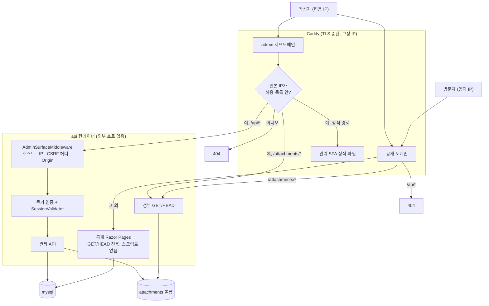
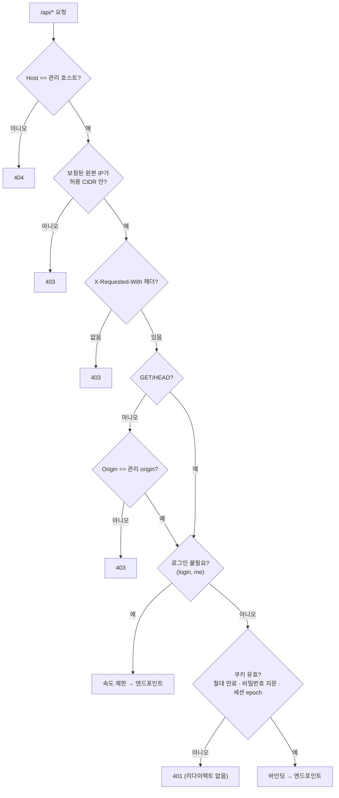
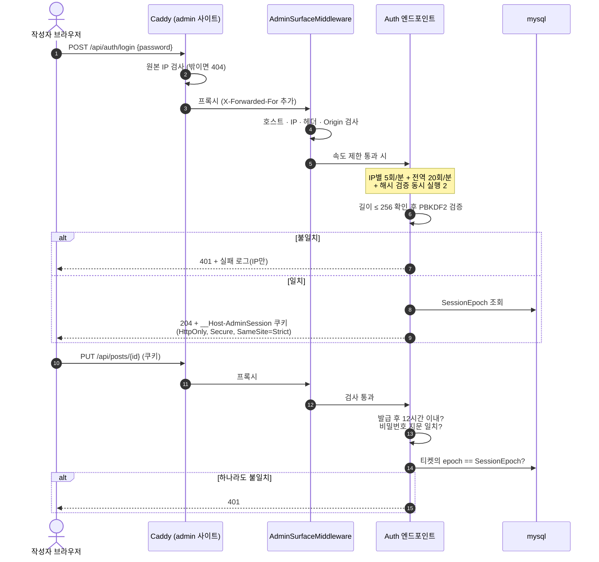
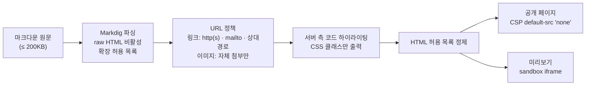
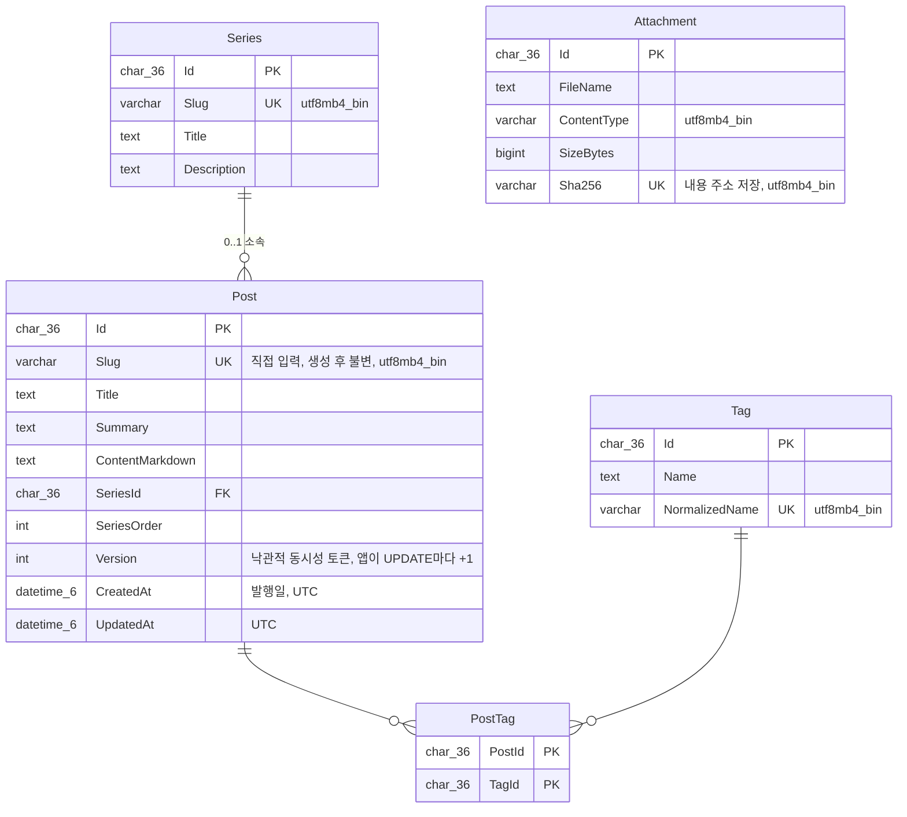

# 아키텍처

방문자 표면과 작성자 표면을 **호스트 단위로 나눈 것**이 이 구조의 전부입니다. 공개 도메인에는 상태를 바꾸는 엔드포인트가 아예 존재하지 않고, 관리 도메인은 IP 허용 목록 뒤에 있습니다.

관련 문서: [보안 설계](security.md) · [설정 키](configuration.md) · [배포 구성](deployment.md) · [전체 스펙](../plan/tech_blog_0920.md)

## 신뢰 경계와 요청 라우팅



| | 공개 표면 (`<도메인>`) | 관리 표면 (`admin.<도메인>`) |
|---|---|---|
| 경로 | `/`, `/posts/{slug}`, `/tags/{tag}`, `/series/{slug}`, `/search?q=`, `/feed.xml`, `/sitemap.xml`, `/robots.txt`, `/css/site.css`, `/css/highlight.css`, `/attachments/{id}/{fileName}`, `/health` | `/`(SPA), `/api/*`, `/attachments/*`(미리보기 이미지) |
| 누가 | 누구나, GET·HEAD만 | 허용 IP **AND** 로그인 세션 |
| JS | 없음 | `script-src 'self'` |
| 상태 변경 | 불가능(엔드포인트가 이 호스트에 없다) | 전부 여기에만 |

허용되지 않은 `Host` 헤더로 접속하면 **본문 없는 400**입니다(설정된 두 origin — `Site:PublicOrigin`·`Site:AdminOrigin` — 의 호스트만 받습니다). 프레임워크 기본값은 이 400에 HTML 본문을 실었는데, 그 응답은 앱 미들웨어 바깥에서 만들어져 보안 헤더가 붙지 않으므로 본문을 아예 껐습니다.

## 미들웨어 순서

`Program.cs`의 파이프라인은 순서 자체가 보안 결정입니다.

```
호스트 필터(설정된 두 호스트) → 보안 헤더 → ForwardedHeaders(신뢰 프록시)
  → 예외 처리(과부하 503) → 상태 코드 본문 → 정적 파일
  → AdminSurfaceMiddleware(호스트·IP·CSRF·Origin) → 속도 제한
  → 쿠키 인증 → 인가 → /api JSON 본문 상한 → 엔드포인트
```

- **IP 검사가 속도 제한보다 앞**입니다. 반대로 두면 허용 IP 밖의 요청이 로그인 전역 한도를 소진해 작성자를 잠글 수 있습니다.
- **본문 상한이 인가보다 뒤**입니다. 세션 없는 요청은 크기와 무관하게 401이 먼저 나가고, 본문은 읽히지 않습니다.
- 보안 헤더는 전송 직전(`OnStarting`)에 붙으므로 라우트 제약 실패 404와 예외 500에도 실립니다.

## 관리 API 접근 판정

방어선은 3겹입니다: Caddy의 IP 차단 → 앱의 호스트·IP·CSRF 검사 → 로그인 세션. 아래 판정은 전부 **요청 본문을 읽기 전에** 끝납니다.



**IP 판정의 전제**

- 관리자 허용 목록(`Admin:AllowedCidrs`)과 신뢰 프록시(`Proxy:TrustedIp`)는 **별도 설정**입니다. Caddy 주소를 허용 목록에 넣어 우회하지 않습니다.
- `X-Forwarded-For`는 신뢰 프록시가 붙인 맨 오른쪽 한 홉(`ForwardLimit = 1`)만 봅니다. ASP.NET의 ForwardedHeaders 미들웨어는 신뢰 목록이 **비어 있으면 모든 헤더를 믿으므로**, Production에서 `Proxy:TrustedIp`가 비면 시작을 실패시키고 Development에서는 미들웨어를 아예 등록하지 않습니다.
- IPv4-mapped IPv6(`::ffff:a.b.c.d`)는 IPv4로 정규화한 뒤 비교합니다.

## 로그인과 세션

아이디 없이 비밀번호만 받고, 서버에는 **해시만** 환경변수로 주입합니다.



쿠키 티켓에는 발급 시각, 비밀번호 해시 지문(SHA-256 앞 16바이트), `SessionEpoch`가 들어갑니다. 그래서 **비밀번호를 바꾸면 기존 세션이 자동 폐기**되고, **로그아웃은 epoch를 올려 모든 기기의 세션을 폐기**합니다. 절대 수명 12시간, sliding 연장 없음, 기기별 세션 관리 없음.

## 마크다운 파이프라인

공개 페이지와 에디터 미리보기가 **같은 렌더러**를 씁니다. 전체가 DB 의존 없는 순수 함수라 XSS 공격 코퍼스를 단위 테스트로 돌립니다.



- HTML을 **저장하지 않고 요청마다 렌더링**합니다 — 렌더러의 보안 수정이 과거 글 전체에 즉시 적용됩니다.
- 렌더 비용은 입력 크기가 아니라 **시간**으로 제한합니다: 줄 400자·문서 60,000자 강조 예산, 정규식 매치 타임아웃 250ms, 렌더당 강조 2,000ms. 예산을 넘긴 블록은 이스케이프한 일반 코드블록으로 떨어집니다.
- Markdig 파서 자체의 비용(적대적 200KB 입력에서 수 초)은 **렌더 게이트**(프로세스 전역 동시 2, 슬롯 대기 5초 초과 시 503)와 **렌더 결과 캐시**(`(PostId, Version)` 키, 64MB, 단일 비행)로 덮습니다. 글 저장 경로도 같은 게이트 안에 있습니다.
- 글은 저장 전에 한 번 렌더링합니다 — "저장은 됐는데 공개 페이지가 열리지 않는" 상태를 막습니다.

## 데이터 모델



- 발행 모델에 **초안 상태가 없습니다**. 저장 = 즉시 공개.
- 동시 수정은 앱이 관리하는 `Version`(`int`) 동시성 토큰으로 감지합니다(409). Posts를 UPDATE하는 모든 경로(SaveChanges 인터셉터·`ExecuteUpdateAsync`)가 반드시 `Version`을 1 올려야 하며, 아키텍처 테스트로 이를 강제합니다. 에디터는 409를 받으면 서버본과 내 본문을 나란히 보여 줍니다.
- 앱의 검증 규칙은 **DB 제약의 부분집합**이어야 한다는 것을 테스트가 강제합니다(앱을 우회해도 DB가 막습니다).
- 공개 조회는 별도 `PublicDbContext`가 담당합니다: `NoTracking`, 연결을 열 때마다 `PublicSessionInterceptor`가 `SET SESSION transaction_read_only = ON, max_execution_time = <ms>`를 보냅니다(MySqlConnector에는 PG의 시작 매개변수가 없어 연결마다 1회 왕복이 든다). 진짜 경계는 5개 테이블 SELECT만 가진 DB 사용자(`blog_public`)이며, 앱이 기동마다 GRANT를 적용하고 `SHOW GRANTS`로 스스로 검증합니다(불일치 시 기동 실패). 그 구현은 4단계(배포)에 있습니다 → [배포 구성](deployment.md).

## 코드 지도

```
PortfolioBlog.Api/
├─ Program.cs                      # 미들웨어 순서 + Map* 호출 + CLI 경로(hash-password)
├─ Domain/                         # Post · Series · Tag · PostTag · AdminState · Attachment
├─ Contracts/                      # DTO(record) · TextRules(NUL 거부) · ValidationErrors
├─ Features/                       # 관리 API 수직 슬라이스
│  ├─ ApiEndpoints.cs              # 보호된 /api 그룹(RequireHost + RequireAuthorization)
│  ├─ Auth/ Posts/ Series/ Tags/   # 로그인·세션, 글·시리즈·태그 CRUD
│  ├─ Preview/                     # POST /api/preview
│  └─ Attachments/                 # 관리 업로드·목록·삭제 + 공개 GET/HEAD
├─ Pages/                          # 공개 Razor 페이지: Index · Post · Tag · Series · Search
│                                  # + SiteEndpoints(feed.xml · sitemap.xml · robots.txt · highlight.css)
│                                  # + PublicPageConvention(GET/HEAD · 공개 호스트 · 속도 제한)
├─ wwwroot/css/site.css            # 유일한 정적 파일
└─ Infrastructure/
   ├─ Access/                      # CidrList · AdminSurfaceMiddleware · SessionValidator · StartupValidation
   ├─ Data/                        # AppDbContext(관리) · PublicDbContext(읽기 전용) · PublicQueries · 마이그레이션
   ├─ Markdown/                    # MarkdownRenderer · RenderGate · RenderedPostCache · UrlPolicy · HtmlAllowlist
   ├─ Storage/                     # ImageSignature · MetadataStripper · FileSystemAttachmentStore · AttachmentJanitor
   └─ Web/                         # ClientIp · RateLimit* · SecurityHeadersMiddleware · ErrorResponses · PublicUrls

PortfolioBlog.Web/                 # 관리 에디터 SPA (admin 서브도메인 전용)
├─ admin-headers.ts                # 보안 헤더의 정본(미리보기 서버와 배포 Caddyfile이 같은 값을 쓴다)
├─ src/api/                        # client(fetch의 유일한 자리) · errors · endpoints · types
├─ src/lib/                        # safeNext · validation · drafts(localStorage의 유일한 자리) · previewDoc
├─ src/components/                 # PreviewPane(sandbox iframe — 서버 HTML의 유일한 자리) · MarkdownEditor · ConflictPanel
├─ src/pages/                      # Posts · PostEditor · Series · Tags · Attachments
└─ e2e/admin.spec.ts               # 실제 백엔드 + 배포용 CSP로 도는 Playwright 시나리오
```

의존 방향은 `Features`·`Pages` → `Infrastructure` → `Contracts` → `Domain`이며, `Features`끼리와 `Features`↔`Pages`는 서로 참조하지 않습니다.
