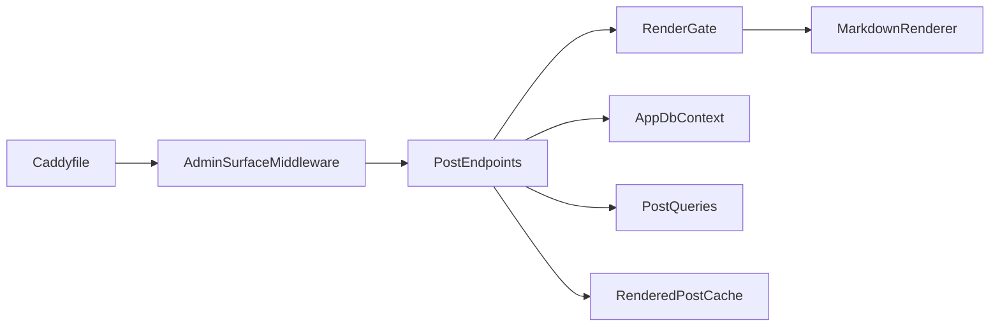

# 경영진 요약(Executive Summary)

<!-- doc-harness:section id="one-liner" hash="9db23003b18dc6f05aececda33015abfcab7fd69156c0224f141132262c2d538" -->
PortfolioBlog는 단일 작성자용 보안 중심 기술 블로그로, JS 없는 SSR 공개 사이트와 IP 허용 목록·세션 뒤의 React 관리 SPA를 ASP.NET Core 10 + PostgreSQL 17 + Caddy(Docker Compose)로 분리 운영한다.
<!-- /doc-harness:section -->

<!-- doc-harness:section id="summary" hash="6e2ca948d76bd8d335364021bd60d0de211524475fc3abef7a1579d21a730ba6" -->
## 한 줄 요약

**PortfolioBlog는 한 명의 작성자가 쓰는 보안 중심 기술 블로그다.** 공개 사이트는 JS 없는 서버 렌더링 Razor Pages이고, 글 작성은 별도 서브도메인의 React SPA(IP 허용 목록 + 비밀번호 세션)에서 한다. 목적 서술은 README 기준이라 `INFERRED`이며, 구조와 스택은 코드·설정으로 확인했다.
<!-- /doc-harness:section -->

<!-- doc-harness:section id="key-points" hash="5e9b737070b1c9fa21abd4921acc3e243b00544b50250bb94dda5aa9e8ea3dad" -->
## 핵심 내용

**공개 읽기와 관리 쓰기를 호스트·네트워크·DB 롤 세 겹으로 분리한 구조가 핵심이다.**

| 항목 | 내용 |
|---|---|
| 핵심 기능 | [F001 관리자 로그인](features/F001_ADMIN_AUTH_SESSION.md), [F003 글 작성·수정](features/F003_ADMIN_POST_EDITOR.md), [F009 첨부 업로드·관리](features/F009_ADMIN_ATTACHMENT_MANAGEMENT.md), [F010 첨부 공개 제공](features/F010_PUBLIC_ATTACHMENT_SERVING.md), [F011 마크다운 렌더링·캐시](features/F011_MARKDOWN_RENDERING_CACHE.md), [F012 공개 홈](features/F012_PUBLIC_HOME_LIST.md), [F013 공개 글 상세](features/F013_PUBLIC_POST_DETAIL.md), [F018 관리 표면 접근 통제](features/F018_ADMIN_SURFACE_ACCESS_CONTROL.md) |
| 백엔드 | ASP.NET Core 10(최소 API + Razor Pages), EF Core 10, Markdig·ColorCode.HTML·HtmlSanitizer |
| 프런트엔드 | React 19, Vite 8, TypeScript, react-query, react-router, CodeMirror 6, Tailwind CSS 4 |
| 런타임 구조 | Docker Compose의 caddy·api·postgres 3개 서비스(+ 백업용 tools 프로필), public/edge/db 3개 네트워크 |
| 핵심 DB | PostgreSQL 17, 롤 분리(`blog_app` 관리, `blog_public` SELECT 전용), 엔티티 Post·Series·Tag·PostTag·AdminState·Attachment |
| 외부 시스템 | ACME(Caddy 자동 TLS)만 확인됨. 그 밖의 외부 서비스 연동은 `UNKNOWN`(코드에서 확인 못 함) |

전체 기능 목록은 [09_FEATURES](09_FEATURES.md), 의존성은 [06_DEPENDENCIES](06_DEPENDENCIES.md)에 있다.
<!-- /doc-harness:section -->

<!-- doc-harness:section id="architecture" hash="f08d4618a19e4f1f888db3b6f88443d5887252267c52d18a58c0f4a7b7105a18" -->
## 전체 Architecture

**Caddy가 유일한 외부 진입점이고, 뒤의 단일 ASP.NET Core 프로세스가 공개 SSR과 관리 API를 모두 처리한다.** Caddy는 공개 도메인(GET·HEAD만, `/api`는 404)과 관리 도메인(허용 CIDR 밖은 404, `/api/*`·`/attachments/*`만 백엔드로, 나머지는 SPA 정적 파일)을 나눈다. api는 `AppDbContext`(관리)와 `PublicDbContext`(읽기 전용·statement_timeout) 두 컨텍스트로 PostgreSQL에 붙고, 첨부는 파일 시스템 볼륨에 SHA-256 내용 주소로 저장한다. 다이어그램은 [02_ARCHITECTURE](02_ARCHITECTURE.md)의 ARCH_SYSTEM을 참고한다.
<!-- /doc-harness:section -->

<!-- doc-harness:section id="dataflow" hash="e64f7063b3cf8c21c426dbb295ae43b76bc590dfae0d5f02afcb21b283162c82" -->
## 핵심 Data Flow

## 핵심 Data Flow

**가장 중요한 흐름은 '글 저장 → 렌더 가능성 확인 → DB 저장 → 재조회 → 조건부 렌더 캐시 선채움 → 공개 열람'이다.** 이 조율은 `PostEndpoints.CreateAsync`/`UpdateAsync`가 각 단계를 차례로 직접 호출하는 방식이다. 렌더된 HTML은 DB에 저장되지 않고(DB에는 마크다운 원문만 저장), 지역 변수 `rendered`로 들고 있다가 캐시에만 넣는다.

| 단계 | 동작 | 근거 |
|---|---|---|
| 1 | 관리자가 SPA에서 저장하면 Caddy 관리 도메인이 `/api/*`를 api로 전달한다 | [F003](features/F003_ADMIN_POST_EDITOR.md), [F025](features/F025_EDGE_PROXY_TLS.md) |
| 2 | `AdminSurfaceMiddleware`가 호스트·IP·CSRF 헤더·Origin을 검사한다 | [F018](features/F018_ADMIN_SURFACE_ACCESS_CONTROL.md) |
| 3 | `PostEndpoints`가 `RenderGate.RenderAsync`(내부에서 `MarkdownRenderer.RenderDetailed`)로 렌더 가능성을 확인하고 결과를 `rendered`에 보관한다. 수정 시에는 이에 앞서 version 검사를 하며 불일치면 409다 | [F006](features/F006_POST_EDIT_CONFLICT.md), [F011](features/F011_MARKDOWN_RENDERING_CACHE.md) |
| 4 | `AppDbContext.SaveChangesAsync`로 마크다운 원문만 저장한다(수정은 version=xmin 낙관적 동시성) | [F003](features/F003_ADMIN_POST_EDITOR.md) |
| 5 | `PostQueries.GetDetailAsync`로 재조회하고, `CanCacheRenderedResult`가 참일 때만 `RenderedPostCache.Store`를 호출한다(그 사이 다른 요청이 같은 글을 저장했다면 캐시하지 않음) | [F011](features/F011_MARKDOWN_RENDERING_CACHE.md) |
| 6 | 방문자가 `/posts/{slug}`를 열면 `PublicDbContext`로 조회하고 캐시 미스일 때만 렌더한다 | [F013](features/F013_PUBLIC_POST_DETAIL.md) |
<!-- /doc-harness:section -->

<!-- doc-harness:section id="EXEC_DATAFLOW" hash="2e63c0d7ac58e210758f4e0d6c1696c27661c500c8233c6fb53e35ea208bef96" -->
### 글 저장과 렌더 캐시 흐름 (Data Flow Diagram) (Flowchart)

PostEndpoints가 RenderGate 렌더, AppDbContext 저장, PostQueries 재조회, 조건부 RenderedPostCache 저장을 차례로 직접 호출한다.

Caddyfile이 관리 도메인 요청을 api로 넘기고 AdminSurfaceMiddleware가 본문을 읽기 전에 접근을 거른다. PostEndpoints(CreateAsync/UpdateAsync)가 조율자다. 먼저 RenderGate.RenderAsync가 MarkdownRenderer.RenderDetailed로 HTML을 만들고 결과는 지역 변수로 보관된다. 이어 AppDbContext.SaveChangesAsync가 마크다운 원문만 저장한다. 그다음 PostQueries.GetDetailAsync로 재조회하고, CanCacheRenderedResult가 참일 때만 (PostId, xmin) 키로 RenderedPostCache.Store를 호출한다. 렌더 HTML은 DB로 가지 않으며 AppDbContext는 캐시를 호출하지 않는다.

#### 코드 근거

| 구성 요소 | 코드 |
|---|---|
| Caddyfile | `Caddyfile` |
| AdminSurfaceMiddleware | `PortfolioBlog.Api/Program.cs` |
| PostEndpoints | `PortfolioBlog.Api/Features/Posts/PostEndpoints.cs` (PostEndpoints.CreateAsync/UpdateAsync) |
| RenderGate | `PortfolioBlog.Api/Infrastructure/Markdown/RenderGate.cs` (RenderGate) |
| MarkdownRenderer | `PortfolioBlog.Api/Infrastructure/Markdown/RenderGate.cs` (MarkdownRenderer) |
| AppDbContext | `PortfolioBlog.Api/Features/Posts/PostEndpoints.cs` (AppDbContext) |
| PostQueries | `PortfolioBlog.Api/Infrastructure/Data/PostQueries.cs` (PostQueries.GetDetailAsync) |
| RenderedPostCache | `PortfolioBlog.Api/Infrastructure/Markdown/RenderedPostCache.cs` (RenderedPostCache) |
<!-- /doc-harness:section -->

<!-- doc-harness:section id="status" hash="4f9657886f3a70c8914db88c306f656dbc1520d7c16a5a27ab8aa39b780e928d" -->
## 현재 상태

## 현재 상태

**1~4단계 기능(공개 열람, 관리 SPA, 첨부, 배포·스모크)이 코드에 구현돼 있고, 알려진 확정 문제는 검색 성능 한 건이다.**

| 구분 | 내용 |
|---|---|
| 동작 | 관리자 인증·글/시리즈/태그/첨부 관리, 미리보기, 공개 홈·상세·검색·시리즈·태그·피드·사이트맵, 백업·복원, 배포 스모크 |
| 알려진 문제 | PERF001: 검색이 `ContentMarkdown`까지 `ILIKE '%term%'`로 전표 스캔한다([14_PERFORMANCE](14_PERFORMANCE.md)) |
| 기술 부채 | [17_TECH_DEBT](17_TECH_DEBT.md) 참고 |
| 주요 workaround | FAIL005: `deploy/docker-compose.yml`의 `public` 네트워크에 ipam 설정이 없어 서브넷이 자동 할당되므로 호스트 LAN과 겹치면 기동이 실패할 수 있다(이 겹침 서술은 `docs/worklog.md`·`plan/tech_blog_4_report_0923.md` 기록에서 옮긴 것이며 `deploy/OPERATIONS.md`에는 없다). FAIL007: 이 PC의 Hyper-V 포트 예약 때문에 `SMOKE_HTTP_BIND`로 로컬만 치환하고 최종 판정은 CI(Linux). FAIL008: Firefox 첨부 이미지 로드 전 새로고침 레이스는 후속 과제 |

실패 이력 전체는 [11_FAILURE_HISTORY](11_FAILURE_HISTORY.md), 미확인 항목은 [19_UNKNOWN_AND_TODO](19_UNKNOWN_AND_TODO.md)에 있다.
<!-- /doc-harness:section -->

<!-- doc-harness:section id="before-you-change" hash="973eaf05062a419edf0058af0ba43e9bf633ba104917fbd7dce39314fe90fa80" -->
## 수정 전 반드시 알아야 하는 것

**보안 경계가 여러 층에 중복돼 있으므로 한 층만 고치면 다른 층과 어긋난다.**

1. 관리·공개 분리는 Caddy와 앱(`HostFiltering`, `RequireHost`, `AdminSurfaceMiddleware`)에 이중으로 걸려 있다. 한쪽만 바꾸지 않는다. → [13_SECURITY](13_SECURITY.md), [F018](features/F018_ADMIN_SURFACE_ACCESS_CONTROL.md)
2. 프록시 신뢰는 `Proxy:TrustedIp` 하나(ForwardLimit=1)뿐이고, 비어 있으면 ForwardedHeaders 미들웨어가 등록되지 않는다. edge 네트워크 고정 IP(172.30.0.2)와 짝이다. → [05_CONFIGURATION](05_CONFIGURATION.md)
3. 미들웨어 순서(SecurityHeaders → … → AdminSurface → RateLimiter → Authentication → Authorization → ApiBodyLimit)는 의도된 배치다. 특히 ApiBodyLimit은 401이 크기 검사보다 먼저 나오게 인가 뒤에 있다. → [02_ARCHITECTURE](02_ARCHITECTURE.md)
4. 공개 DB 롤은 `PublicRoleGrants.Apply`가 기동마다 권한을 재계산하며 `ReadableTables`에만 SELECT를 준다. 새 테이블을 공개 조회에 쓰려면 이 목록에 추가해야 한다. → [07_DATA_MODEL](07_DATA_MODEL.md), [F021](features/F021_STARTUP_BOOTSTRAP.md)
5. `PublicDbContext`의 `SaveChanges`는 항상 예외를 던진다. 공개 경로에서 쓰기를 시도하지 않는다. `ConnectionStrings:Public`이 없으면 관리 연결로 폴백하므로 운영에서는 시작 검증이 필수로 요구하는지 확인한다. → [07_DATA_MODEL](07_DATA_MODEL.md)
6. 렌더링은 `RenderGate` 동시성 제한과 `RenderedPostCache`((PostId, xmin) 키)에 의존한다. 슬롯을 얻은 뒤의 렌더는 동기 CPU 작업이라 취소되지 않는다. → [14_PERFORMANCE](14_PERFORMANCE.md), [F011](features/F011_MARKDOWN_RENDERING_CACHE.md)
7. 첨부 업로드·삭제·청소는 sha256 키 `AttachmentLock`(DB 세션 잠금)으로 직렬화된다. 파일 저장 로직을 바꾸면 Janitor의 재확인 로직과 함께 본다. → [F009](features/F009_ADMIN_ATTACHMENT_MANAGEMENT.md), [F024](features/F024_ATTACHMENT_JANITOR.md)
8. api 이미지는 셸·curl이 없는 chiseled 이미지라 헬스체크는 `dotnet PortfolioBlog.Api.dll healthcheck`로만 한다. → [F022](features/F022_HEALTH_CHECK.md)
9. 이 PC는 Hyper-V 포트 예약과 광고 차단기 때문에 스모크를 로컬에서 그대로 돌리기 어렵다. → [12_TROUBLESHOOTING](12_TROUBLESHOOTING.md), [11_FAILURE_HISTORY](11_FAILURE_HISTORY.md)
10. 관리 SPA의 API 클라이언트는 `/api/` 같은 출처 경로만 허용하고 `X-Requested-With` 헤더를 항상 붙인다. 서버의 CSRF 검사와 짝이므로 우회 호출을 만들지 않는다. → [F029](features/F029_ADMIN_SPA_SHELL.md)
<!-- /doc-harness:section -->

<!-- doc-harness:section id="related" hash="17870c04fde25ebcb08c68b465a5b15aff85feb8a32b8aab1e5f2c375977dc36" -->
## 관련 문서

- [01_PROJECT_OVERVIEW](01_PROJECT_OVERVIEW.md)
- [02_ARCHITECTURE](02_ARCHITECTURE.md)
- [04_SETUP_AND_RUN](04_SETUP_AND_RUN.md)
- [05_CONFIGURATION](05_CONFIGURATION.md)
- [07_DATA_MODEL](07_DATA_MODEL.md)
- [08_API](08_API.md)
- [09_FEATURES](09_FEATURES.md)
- [10_ERROR_HANDLING](10_ERROR_HANDLING.md)
- [11_FAILURE_HISTORY](11_FAILURE_HISTORY.md)
- [13_SECURITY](13_SECURITY.md)
- [14_PERFORMANCE](14_PERFORMANCE.md)
- [15_TESTING](15_TESTING.md)
- [16_DEPLOYMENT](16_DEPLOYMENT.md)
- [17_TECH_DEBT](17_TECH_DEBT.md)
- [18_GLOSSARY](18_GLOSSARY.md)
- [19_UNKNOWN_AND_TODO](19_UNKNOWN_AND_TODO.md)
<!-- /doc-harness:section -->

<!-- doc-harness:section id="unknowns" hash="1842e82e9320676eef5fdb5b57dbe7c42ec1b16c931766419668cef600863ea9" -->
## 확인하지 못한 것

- 코드에서 확인된 외부 서비스 연동은 ACME 외에 없음(이메일·분석·결제 등은 확인 못 함)
- ApiBodyLimitMiddleware의 구체적 한도 값은 이 단계에서 확인하지 않음
- 확인함: 글 수정(UpdateAsync)은 version 검사 → RenderGate 렌더 → 트랜잭션 저장(xmin) → 재조회 → 조건부 캐시 저장 순서이고, 생성(CreateAsync)은 version 검사 없이 같은 순서(렌더 → 저장 → 재조회 → 조건부 캐시 저장)다
- 프로젝트 목적 서술은 README 기준이라 INFERRED
<!-- /doc-harness:section -->
