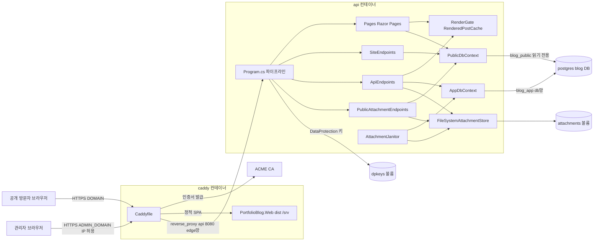
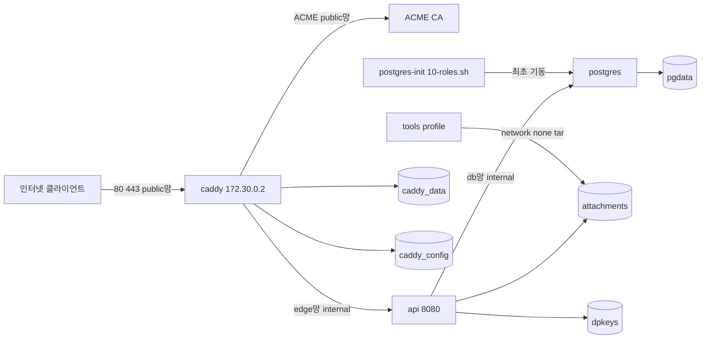
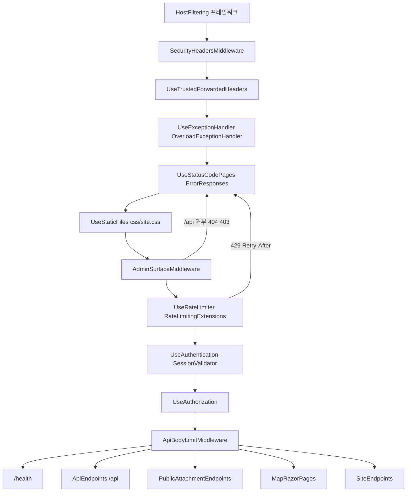

# 아키텍처

<!-- doc-harness:section id="one-liner" hash="53e525194bb3a7f54b3a26a6c2b5b345cb67226b809d6ec0dc946761d7c07426" -->
caddy(엣지)·api(ASP.NET Core 단일 프로세스)·postgres 세 컨테이너 구조이며, 공개 SSR과 관리 API를 한 api 프로세스가 호스팅하고 관리 SPA는 Caddy가 정적으로 서빙한다.
<!-- /doc-harness:section -->

<!-- doc-harness:section id="summary" hash="6434e7deedd401c60cb19250abce9735773cd8b2698203c6250c51e05ee0d7fb" -->
## 한 줄 요약

애플리케이션 로직은 전부 `PortfolioBlog.Api` 한 프로세스에 있다. 앞단 Caddy가 공개 도메인과 관리 도메인을 나누고, 공개 경로는 읽기 전용 `PublicDbContext`(blog_public 롤), 관리 경로와 백그라운드 `AttachmentJanitor`는 `AppDbContext`(blog_app 롤)로 같은 PostgreSQL에 접근한다. 관리 SPA(`PortfolioBlog.Web`)는 빌드 산출물이 caddy 이미지의 `/srv`에 구워진다.
<!-- /doc-harness:section -->

<!-- doc-harness:section id="components" hash="0bc879d12f87f6610ded872126d933b4615394c8651ea44747e61b919fd91bb3" -->
## 컴포넌트와 계층

결론: 엣지(Caddy) → 호스트/미들웨어 → 기능(관리 API·공개 SSR) → 도메인 서비스(렌더링·저장소) → 데이터(PostgreSQL·볼륨) 계층이다.

| 이름 | 경로 | 계층 | 책임 |
|---|---|---|---|
| Caddyfile | `deploy/Caddyfile` | edge | TLS·ACME, 공개/관리 도메인 분기, 관리 도메인 IP 허용 목록, 본문 상한, 보안 헤더 |
| AdminSpa | `PortfolioBlog.Web/src` | 관리 SPA | React 19, `App.tsx`·`routes.tsx`, 라우트 /login·RequireAuth 아래 Layout |
| AdminApiClient | `PortfolioBlog.Web/src/api/client.ts` | SPA API 클라이언트 | `/api/` 같은 출처 경로만 허용, `X-Requested-With` 부착, `ApiError` 변환 |
| ProgramHost | `PortfolioBlog.Api/Program.cs` | 조합 루트 | CLI 분기, DI 등록, 시작 단계, 미들웨어 순서, 엔드포인트 매핑 |
| CliCommands | `PortfolioBlog.Api/Infrastructure` | CLI | `HashPasswordCommand`, `HealthCheckCommand` |
| WebPipelineInfra | `PortfolioBlog.Api/Infrastructure/Web` | 횡단 인프라 | `SecurityHeadersMiddleware`, `ErrorResponses`, `OverloadExceptionHandler`, `ApiBodyLimitMiddleware` |
| RateLimiting | `Infrastructure/Web/RateLimitingExtensions.cs` | 횡단 인프라 | 전역 `PartitionedRateLimiter` 체인, 429 + Retry-After |
| AdminAccess / AdminAuth | `Infrastructure/Access` | 보안 | `AdminSurfaceMiddleware`, IP 허용 정책, ForwardedHeaders, 쿠키 인증, `SessionValidator` |
| AdminApiEndpoints | `PortfolioBlog.Api/Features` | 관리 최소 API | auth·posts·series·tags·preview·attachments |
| PublicAttachmentEndpoints | `Features/Attachments/PublicAttachmentEndpoints.cs` | 공개 읽기 | `/attachments/{id}/{fileName}` GET·HEAD |
| PublicRazorPages | `PortfolioBlog.Api/Pages` | 공개 SSR | Index·Post·Search·Series·Tag 페이지, `PublicPageConvention` |
| SiteEndpoints | `Pages/SiteEndpoints.cs` | 공개 비HTML | highlight.css, robots.txt, feed.xml, sitemap.xml |
| MarkdownRendering | `Infrastructure/Markdown` | 도메인 서비스 | `MarkdownRenderer`, `RenderGate`, `RenderedPostCache` |
| AppDbContext / PublicDbContext | `Infrastructure/Data` | 데이터 접근 | 관리 쓰기용 / 읽기 전용(statement_timeout, read-only, SaveChanges 금지) |
| StartupBootstrap | `Infrastructure/Access/StartupValidation.cs`, `Infrastructure/Data/PublicRoleGrants.cs` | 시작 단계 | 설정 검증, 공개 롤 권한 재계산 |
| AttachmentStorage | `Infrastructure/Storage` | 파일 저장소 | `FileSystemAttachmentStore`, `AttachmentLock` |
| AttachmentJanitor | `Infrastructure/Storage/AttachmentJanitor.cs` | 백그라운드 | 6시간 주기 임시·고아 파일 청소 |
| PostgresDb | `deploy/docker-compose.yml` | 저장소 | PostgreSQL 17.11-alpine, pgdata 볼륨 |
| BackupRestoreTools | `deploy/backup.sh`, `deploy/restore.sh` | 운영 | pg_dump·tar 백업/복원 |
<!-- /doc-harness:section -->

<!-- doc-harness:section id="ARCH_SYSTEM" hash="1aef67cd209704470266834c549d63e13bb83ac00a3e61dc64703b776a4aee88" -->
### 시스템 수준 아키텍처 (컨테이너·주요 컴포넌트·저장소) (Architecture)

단일 api 프로세스(PortfolioBlog.Api)가 공개 SSR 페이지와 관리 API를 함께 호스팅한다. 앞단 Caddy가 두 도메인을 가르고 관리 SPA는 Caddy가 정적으로 서빙한다. 공개 경로는 읽기 전용 PublicDbContext, 관리 경로는 AppDbContext로 같은 PostgreSQL에 접근한다.

결론: 프로세스는 caddy·api·postgres 셋이고, 애플리케이션 로직은 전부 api 한 프로세스 안에 있다. Caddyfile은 공개 도메인({$DOMAIN})과 관리 도메인({$ADMIN_DOMAIN})을 나눈다. 관리 도메인에서는 IP 허용 목록 밖을 404로 끊고, /api/*와 /attachments/*만 api로, 나머지는 caddy 이미지에 구워진 SPA(/srv)로 보낸다. api 안에서 공개 표면(Razor Pages, SiteEndpoints, 공개 첨부)은 statement_timeout과 read-only 트랜잭션이 걸린 PublicDbContext(blog_public 롤)로만 읽는다. 관리 표면(ApiEndpoints)과 백그라운드 AttachmentJanitor는 AppDbContext(blog_app 롤)를 쓴다. 렌더링은 공개 페이지와 관리 미리보기·저장 경로가 같은 MarkdownRenderer를 RenderGate 뒤에서 공유하고, 공개 쪽은 RenderedPostCache로 결과를 재사용한다. 첨부 파일은 attachments 볼륨, 세션 쿠키 키는 dpkeys 볼륨에 영속화된다.

#### 코드 근거

| 구성 요소 | 코드 |
|---|---|
| Caddyfile | `deploy/Caddyfile` |
| AdminSpa | `PortfolioBlog.Web/src/App.tsx` (App) |
| ProgramHost | `PortfolioBlog.Api/Program.cs` |
| PublicRazorPages | `PortfolioBlog.Api/Pages/Post.cshtml.cs` (PostModel) |
| SiteEndpoints | `PortfolioBlog.Api/Pages/SiteEndpoints.cs` (SiteEndpoints.MapPublicSiteEndpoints) |
| ApiEndpoints | `PortfolioBlog.Api/Features/ApiEndpoints.cs` (ApiEndpoints.MapApiEndpoints) |
| PublicAttachmentEndpoints | `PortfolioBlog.Api/Features/Attachments/PublicAttachmentEndpoints.cs` (PublicAttachmentEndpoints.GetAsync) |
| MarkdownRendering | `PortfolioBlog.Api/Infrastructure/Markdown/RenderedPostCache.cs` (RenderedPostCache) |
| AttachmentJanitor | `PortfolioBlog.Api/Infrastructure/Storage/AttachmentJanitor.cs` (AttachmentJanitor) |
| AppDbContext | `PortfolioBlog.Api/Infrastructure/Data/AppDbContext.cs` (AppDbContext) |
| PublicDbContext | `PortfolioBlog.Api/Infrastructure/Data/PublicDbContext.cs` (PublicDbContext) |
| FileSystemAttachmentStore | `PortfolioBlog.Api/Infrastructure/Storage/FileSystemAttachmentStore.cs` (FileSystemAttachmentStore) |
| Postgres | `deploy/docker-compose.yml` (services.postgres) |
| AttachmentsVolume | `deploy/docker-compose.yml` (volumes.attachments) |
| DpkeysVolume | `PortfolioBlog.Api/Infrastructure/Access/AuthServiceCollectionExtensions.cs` (AddAdminAuth) |
<!-- /doc-harness:section -->

<!-- doc-harness:section id="runtime" hash="209f5f963d2316ed7cc1b18bdae160e8ae4af36e05a1e70b5ff682d77c17ae81" -->
## 런타임 구조

결론: 상시 프로세스는 caddy·api·postgres 3개이고, 나머지는 일회성 프로세스다. 인터넷에 노출되는 것은 caddy뿐이다.

| 대상 | 내용 | 근거 |
|---|---|---|
| caddy 컨테이너 | `caddy:2.11.4-alpine`, uid 1654, read_only, cap_drop ALL + NET_BIND_SERVICE, 80·443 게시, api healthy 후 기동, admin API off | `deploy/docker-compose.yml` 16-48 |
| api 컨테이너 | `dotnet PortfolioBlog.Api.dll`, chiseled 이미지(셸 없음), Production, `ASPNETCORE_HTTP_PORTS=8080`, read_only, /tmp 64m tmpfs | `PortfolioBlog.Api/Dockerfile` 23-33 |
| postgres 컨테이너 | 17.11-alpine, pg_isready 헬스체크, pgdata 볼륨 | `deploy/docker-compose.yml` 88-110 |
| 헬스체크 프로세스 | Docker가 30초마다 `dotnet PortfolioBlog.Api.dll healthcheck`를 새 프로세스로 실행 | `Program.cs` 22-26 |
| 일회성 CLI | `hash-password` 인자로 `HashPasswordCommand`만 실행 | `Program.cs` 16-19 |
| tools 컨테이너 | profile tools, network_mode none, backup.sh·restore.sh가 `docker compose run`으로만 기동 | `deploy/docker-compose.yml` 113-125 |
| 백그라운드 | `AttachmentJanitor`(BackgroundService, PeriodicTimer 6시간) | `AttachmentJanitor.cs` 28-67 |
| 동시성 제한 | `RenderGate`(SemaphoreSlim)가 동시 렌더 수 제한. 슬롯 획득 후 렌더는 동기 CPU 작업이라 취소되지 않음 | `RenderGate.cs` 16-67 |
| public 네트워크 | caddy만 연결, 포트 게시·ACME 아웃바운드 | `docker-compose.yml` 28-30,39-41,127-129 |
| edge 네트워크 | internal, 172.30.0.0/24, caddy 고정 IP 172.30.0.2, api의 `Proxy__TrustedIp`가 이 값만 신뢰 | `docker-compose.yml` 42-45,70,130-138 |
| db 네트워크 | internal, api↔postgres 전용 | `docker-compose.yml` 61-62,139-140 |

신뢰 경계는 두 겹이다. 1) Caddy: 공개 도메인은 /api를 404, GET·HEAD 외 메서드를 405로 막고(본문 상한 64KB), 관리 도메인은 `ADMIN_ALLOWED_CIDRS` 밖을 모두 404, /api/*·/attachments/*만 백엔드로 보낸다(본문 상한 11MiB). 2) 앱: HostFiltering이 두 origin 호스트만 허용하고, /api는 `RequireHost`와 `AdminSurfaceMiddleware`로 이중으로 막힌다. `PublicAttachmentEndpoints`와 /health에는 호스트 제약이 없다.
<!-- /doc-harness:section -->

<!-- doc-harness:section id="ARCH_DEPLOY_NETWORK" hash="990185814d7a00a8a724ea7face350d9e683a2cf48e4d615f72018baba685beb" -->
### 배포 네트워크·볼륨 구성 (docker-compose) (Architecture)

인터넷에 노출되는 것은 caddy뿐이다. api와 postgres는 internal 네트워크(edge, db)에만 붙어 인터넷으로 나가지 못한다. api는 edge망의 caddy 고정 IP 172.30.0.2만 프록시로 신뢰한다.

결론: 3계층 네트워크 분리다. public 네트워크에는 caddy만 있어 포트 게시와 ACME 아웃바운드를 맡는다. edge 네트워크(172.30.0.0/24, internal)는 caddy↔api 전용이고, caddy는 고정 IP 172.30.0.2를 가진다. 이 값이 api의 Proxy__TrustedIp와 같아 ForwardedHeaders가 그 홉만 신뢰한다. db 네트워크(internal)는 api↔postgres 전용이다. 모든 서비스는 x-hardening(no-new-privileges, cap_drop ALL, restart unless-stopped, json-file 로그 10m×5)을 공유한다. caddy와 api는 read_only 루트 파일시스템이다. tools 서비스는 평소에는 뜨지 않고, backup.sh·restore.sh가 network_mode none으로만 띄워 attachments 볼륨을 tar로 떠내거나 되돌린다. 의존 순서는 postgres(healthy) → api(healthy, dotnet healthcheck) → caddy다.

#### 코드 근거

| 구성 요소 | 코드 |
|---|---|
| caddy | `deploy/docker-compose.yml` (services.caddy) |
| api | `deploy/docker-compose.yml` (services.api) |
| postgres | `deploy/docker-compose.yml` (services.postgres) |
| tools | `deploy/docker-compose.yml` (services.tools) |
| attachments | `deploy/docker-compose.yml` (volumes.attachments) |
| dpkeys | `deploy/docker-compose.yml` (volumes.dpkeys) |
| pgdata | `deploy/docker-compose.yml` (volumes.pgdata) |
| caddy_data | `deploy/docker-compose.yml` (volumes.caddy_data) |
| caddy_config | `deploy/docker-compose.yml` (volumes.caddy_config) |
| postgresInit | `deploy/postgres-init/10-roles.sh` |
<!-- /doc-harness:section -->

<!-- doc-harness:section id="control-flows" hash="c19c69ed3b9acab9ab9b25aafb500916d6b1d2391844c7c5d3e32d943aec9133" -->
## 주요 제어 흐름

결론: 모든 요청은 Caddy → api 미들웨어 순서(보안 헤더 → 신뢰 프록시 → 예외·상태 코드 → 정적 파일 → 관리 표면 필터 → 속도 제한 → 인증 → 인가 → 본문 한도)를 거친다.

**1. 공개 글 상세 (GET /posts/{slug})**
1. Caddy 공개 route가 /api면 404, GET·HEAD 외면 405, 나머지는 `api:8080`으로 프록시.
2. HostFiltering이 허용 호스트가 아니면 본문 없는 400.
3. `SecurityHeadersMiddleware`, `UseTrustedForwardedHeaders`(172.30.0.2의 XFF 하나만 반영).
4. `AdminSurfaceMiddleware`는 /api가 아니므로 통과.
5. RateLimiter가 `PublicPageConvention`이 건 PublicPage 메타데이터로 page-ip 창 적용(초과 시 429).
6. `PostModel.OnGetAsync`: `SlugRules.IsValid` 실패 시 404, `PublicQueries.GetPostAsync`(`PublicDbContext`)로 메타 조회.
7. `RenderedPostCache.TryGet`이 적중하면 사용, 미스면 `GetContentAsync` → `GetOrRenderAsync` → `RenderGate.RenderAsync` → `MarkdownRenderer.RenderDetailed` → Store.
8. 실패 경로: `MarkdownTooComplexException`은 본문 없이 렌더, `RenderBusyException`·PostgresException 57014는 `OverloadExceptionHandler`가 503 + Retry-After 5.

**2. 관리 API 호출 (PUT /api/posts/{id})**
1. SPA `request()`가 경로 검사 후 `X-Requested-With`를 붙여 fetch.
2. Caddy 관리 사이트가 IP 허용 목록 밖이면 404, `@backend`면 11MiB 상한 후 프록시.
3. `AdminSurfaceMiddleware`: 호스트→IP→CSRF 헤더→Origin 순으로 본문 읽기 전에 거부(404/403).
4. 인증: `__Host-AdminSession` 복호화 후 `SessionValidator.ValidateAsync`가 `AdminStates.SessionEpoch` 검증, 실패 시 RejectPrincipal + SignOut.
5. 인가(Admin 정책, 미인증 401) 후 `ApiBodyLimitMiddleware`.
6. `PostEndpoints.UpdateAsync`: 검증 오류 400, `RenderGate`로 렌더 가능성 확인, `SaveChangesAsync`(동시성 충돌 409), 성공 시 `RenderedPostCache.Store`.
7. 실패 경로: 57014·55P03·`RenderBusyException`은 503 + Retry-After, 그 외 예외는 500 ProblemDetails.

**3. api 기동 (`dotnet PortfolioBlog.Api.dll`)**
1. 인자가 hash-password·healthcheck면 해당 명령만 실행 후 종료.
2. 서비스 등록 후 `StartupValidation.Validate`(I/O 없는 설정 검증).
3. `FileSystemAttachmentStore.EnsureRootIsWritable`.
4. `AppDbContext.Database.Migrate()` 후 `PublicRoleGrants.Apply`(한 트랜잭션, 실패 시 기동 실패).
5. `MarkdownRenderer` 워밍업, 미들웨어·엔드포인트 매핑, `app.Run()`, `AttachmentJanitor` 시작.

**4. 헬스체크**: `HealthCheckCommand`가 `Site__PublicOrigin` 호스트를 Host 헤더에 실어 `http://127.0.0.1:{포트}/health`를 3초 타임아웃으로 호출, 2xx면 0, 그 외 1. /health는 DB를 점검하지 않는다.

관리 SPA 정적 서빙과 공개 첨부 조회 흐름은 각각 [F029_ADMIN_SPA_SHELL](features/F029_ADMIN_SPA_SHELL.md), [F010_PUBLIC_ATTACHMENT_SERVING](features/F010_PUBLIC_ATTACHMENT_SERVING.md)를 참고.
<!-- /doc-harness:section -->

<!-- doc-harness:section id="ARCH_API_PIPELINE" hash="e40c85b6eff3b831b52457d208de4298a37d76f83ced3aceb2f6708a514bbf4e" -->
### api 요청 파이프라인 (미들웨어 순서와 엔드포인트) (Flowchart)

Program.cs의 미들웨어는 보안 헤더 → 신뢰 프록시 헤더 → 예외·상태 코드 처리 → 정적 파일 → 관리 표면 필터 → 속도 제한 → 인증 → 인가 → 본문 한도 순서다. 관리 요청은 인증 전에 호스트·IP·CSRF 검사로 먼저 걸러진다.

결론: 순서 자체가 보안 설계다. (1) HostFiltering은 앱 미들웨어보다 바깥이라 거부된 400에는 보안 헤더가 붙지 않는다. 그래서 IncludeFailureMessage=false로 본문도 없앴다. (2) SecurityHeadersMiddleware는 OnStarting 콜백이라 예외 처리기가 Response.Clear()를 해도 500에 헤더가 남는다. (3) UseTrustedForwardedHeaders는 Proxy:TrustedIp가 비어 있으면 아예 등록되지 않는다. (4) AdminSurfaceMiddleware는 /api 요청을 본문 바인딩 전에 호스트→IP→CSRF 헤더→Origin 순서로 거부한다. 속도 제한보다 앞에 있어 외부 IP가 로그인 한도를 소진하지 못한다. (5) RateLimiter는 라우팅이 먼저 채운 엔드포인트의 RateLimitMetadata로 정책을 판정한다. (6) ApiBodyLimitMiddleware는 인가 뒤라 세션 없는 요청은 크기와 무관하게 401이 먼저다. 다이어그램에서 거부 화살표가 UseStatusCodePages로 가는 것은 본문 없는 응답이 ErrorResponses 형식(ProblemDetails 또는 고정 HTML)으로 채워지는 경로를 단순화해 표현한 것이다. AdminSurfaceMiddleware는 ProblemDetails를 직접 쓴다. OverloadExceptionHandler는 57014·55P03·RenderBusyException을 503으로 바꾼다.

#### 코드 근거

| 구성 요소 | 코드 |
|---|---|
| HostFiltering | `PortfolioBlog.Api/Program.cs` (HostFilteringOptions (34-42)) |
| SecurityHeadersMiddleware | `PortfolioBlog.Api/Infrastructure/Web/SecurityHeadersMiddleware.cs` (SecurityHeadersMiddleware.InvokeAsync) |
| UseTrustedForwardedHeaders | `PortfolioBlog.Api/Infrastructure/Access/AccessServiceCollectionExtensions.cs` (UseTrustedForwardedHeaders) |
| UseExceptionHandler | `PortfolioBlog.Api/Infrastructure/Web/OverloadExceptionHandler.cs` (OverloadExceptionHandler.TryHandleAsync) |
| UseStatusCodePages | `PortfolioBlog.Api/Infrastructure/Web/ErrorResponses.cs` (ErrorResponses.HandleStatusCodeAsync) |
| UseStaticFiles | `PortfolioBlog.Api/Program.cs` (UseStaticFiles (103)) |
| AdminSurfaceMiddleware | `PortfolioBlog.Api/Infrastructure/Access/AdminSurfaceMiddleware.cs` (AdminSurfaceMiddleware.InvokeAsync) |
| UseRateLimiter | `PortfolioBlog.Api/Infrastructure/Web/RateLimitingExtensions.cs` (BuildChain) |
| UseAuthentication | `PortfolioBlog.Api/Infrastructure/Access/SessionValidator.cs` (SessionValidator.ValidateAsync) |
| UseAuthorization | `PortfolioBlog.Api/Infrastructure/Access/AuthServiceCollectionExtensions.cs` (AddAuthorizationBuilder Admin) |
| ApiBodyLimitMiddleware | `PortfolioBlog.Api/Infrastructure/Web/ApiBodyLimitMiddleware.cs` (ApiBodyLimitMiddleware) |
| Health | `PortfolioBlog.Api/Program.cs` (MapGet /health (115-120)) |
| ApiEndpoints | `PortfolioBlog.Api/Features/ApiEndpoints.cs` (MapApiEndpoints) |
| PublicAttachmentEndpoints | `PortfolioBlog.Api/Features/Attachments/PublicAttachmentEndpoints.cs` (MapPublicAttachmentEndpoints) |
| RazorPages | `PortfolioBlog.Api/Pages/PublicPageConvention.cs` (PublicPageConvention) |
| SiteEndpoints | `PortfolioBlog.Api/Pages/SiteEndpoints.cs` (MapPublicSiteEndpoints) |
<!-- /doc-harness:section -->

<!-- doc-harness:section id="decisions" hash="9598f8128325ec0ef908190f96f3c4decb24c04ad79f87027e544589f4c58c9a" -->
## 설계 결정

결론: 결정은 모두 코드로 확인되며, 공통 방향은 공격 표면 축소와 과부하 시 우아한 실패다. 별도 ADR 문서 링크는 이 단계 입력에 파일명이 없어 생략한다.

| 결정 | 내용 | 근거 |
|---|---|---|
| 공개 SSR + 관리 SPA 분리 | 공개는 Razor Pages·`SiteEndpoints`(공개 호스트, GET/HEAD 전용), 관리는 별도 서브도메인 SPA. 공개 CSP에 script-src 없음 | `SecurityHeadersMiddleware.cs` 15-16, `PublicPageConvention.cs` 32-41 |
| 관리 표면 다층 방어 | Caddy remote_ip 404 + `AdminSurfaceMiddleware`(호스트·IP·X-Requested-With·Origin) + `RequireHost` + Admin 정책 + `SessionValidator`. IP 허용만으로는 CSRF를 막지 못한다는 코드 주석에 근거 | `AdminSurfaceMiddleware.cs` 5-18,67-96 |
| 공개 전용 읽기 DB 컨텍스트 | `PublicDbContext`: blog_public 롤, statement_timeout, default_transaction_read_only=on, SaveChanges 금지, 별도 Npgsql 풀. 기동마다 `PublicRoleGrants`가 SELECT 권한 재계산 | `PublicDbContext.cs` 6-28,46-62 |
| 시작 시 마이그레이션 | 단일 인스턴스 전제로 `Database.Migrate()` 직접 호출, 설정 검증은 그보다 먼저 | `Program.cs` 75-88 |
| 렌더 HTML은 메모리 캐시만 | `RenderedPostCache`, 키 (PostId, xmin), 정상 24시간·강조 누락 2분, 재배포 시 비워져 렌더러 보안 수정이 즉시 반영 | `RenderedPostCache.cs` 7-23,95-101 |
| 과부하는 503 + Retry-After | `RenderGate` 전역 동시 렌더 제한, 속도 제한 대기열 0, 57014·55P03·`RenderBusyException`은 503 | `OverloadExceptionHandler.cs` 8-70 |
| 신뢰 프록시는 Caddy 고정 IP 하나 | `KnownProxies`에 `Proxy:TrustedIp`만, ForwardLimit=1, 비어 있으면 미들웨어 미등록(목록이 비면 송신자 검사가 생략되어 XFF 위조 가능) | `AccessServiceCollectionExtensions.cs` 37-75 |
| 내용 주소 첨부 + DB 세션 잠금 | SHA-256 파일, `AttachmentLock.HoldAsync(sha256)`로 업로드·삭제·청소 직렬화, `AttachmentJanitor`가 잔여물 회수 | `AttachmentJanitor.cs` 14,95-115 |
| 하드닝 컨테이너 + 앱 내장 헬스체크 | chiseled·read_only·cap_drop ALL, curl 대신 `dotnet ... healthcheck`(HostFiltering 때문에 공개 호스트를 Host 헤더로 전달) | `HealthCheckCommand.cs` 11-13 |
| 본문 있는 응답에 보안 헤더 | 앱 응답은 `SecurityHeadersMiddleware`(OnStarting)가 부착. 헤더를 붙일 수 없는 HostFiltering 실패 응답은 `IncludeFailureMessage=false`로 본문을 없앤다. Caddy는 공개 사이트 route와 `handle_errors`에서 같은 계열 헤더를 붙이고 Server·Via를 지운다. 예외: 관리 도메인 IP 거부 404와 두 도메인 밖 Host용 :80/:443 폴백 404는 본문이 없고 Server 제거 외 보안 헤더를 붙이지 않는다 | `Program.cs` 38-41,93-98, `Caddyfile` 23-35,49-61,144-159,163-173,181-195 |
<!-- /doc-harness:section -->

<!-- doc-harness:section id="evidence" hash="2e7d4284bb82d12bf4b7614ccd45fcfbb90a21348ef7ac57860467cf48b8c3f7" -->
## 코드 근거

결론: 아래 파일·심볼이 이 문서의 주장 근거다.

| 파일 | 심볼/줄 | 뒷받침하는 주장 |
|---|---|---|
| `PortfolioBlog.Api/Program.cs` | 16-126 | CLI 분기, 서비스 등록, 시작 단계, 미들웨어 순서 |
| `deploy/Caddyfile` | 3-195 | 도메인 분기, 관리 IP 게이트, 폴백 404 |
| `deploy/docker-compose.yml` | 16-147 | 서비스·네트워크·볼륨·헬스체크 |
| `PortfolioBlog.Api/Dockerfile` | 23-33 | api 이미지·포트·권한 |
| `PortfolioBlog.Web/Dockerfile` | 4-21 | SPA 빌드와 caddy 이미지 |
| `PortfolioBlog.Web/src/api/client.ts` | `request` 17-76 | 같은 출처 경로 제한, CSRF 헤더 |
| `PortfolioBlog.Web/src/app/routes.tsx` | `routes` 13-39 | SPA 라우트 |
| `PortfolioBlog.Api/Infrastructure/Access/AdminSurfaceMiddleware.cs` | `InvokeAsync` 67-96 | 관리 표면 검사 순서 |
| `PortfolioBlog.Api/Infrastructure/Access/AccessServiceCollectionExtensions.cs` | 30-75 | ForwardedHeaders 신뢰 |
| `PortfolioBlog.Api/Infrastructure/Access/SessionValidator.cs` | `ValidateAsync` 33-54 | 세션 epoch 검증 |
| `PortfolioBlog.Api/Infrastructure/Access/AuthServiceCollectionExtensions.cs` | `AddAdminAuth` 42-86 | 쿠키·Data Protection |
| `PortfolioBlog.Api/Infrastructure/Web/SecurityHeadersMiddleware.cs` | 12-56 | 보안 헤더 |
| `PortfolioBlog.Api/Infrastructure/Web/OverloadExceptionHandler.cs` | 17-70 | 503 변환 |
| `PortfolioBlog.Api/Infrastructure/Web/RateLimitingExtensions.cs` | 42-170 | 속도 제한 체인 |
| `PortfolioBlog.Api/Infrastructure/Markdown/RenderGate.cs` | 14-67 | 동시 렌더 제한 |
| `PortfolioBlog.Api/Infrastructure/Markdown/RenderedPostCache.cs` | 17-151 | 캐시·단일 비행 |
| `PortfolioBlog.Api/Infrastructure/Data/PublicDbContext.cs` | 29-95 | 읽기 전용 컨텍스트 |
| `PortfolioBlog.Api/Infrastructure/Data/PublicRoleGrants.cs` | 21,39-138 | 공개 롤 권한 |
| `PortfolioBlog.Api/Infrastructure/Storage/AttachmentJanitor.cs` | 28-137 | 청소 루프 |
| `PortfolioBlog.Api/Infrastructure/Storage/AttachmentLock.cs` | `HoldAsync` 27-69 | 세션 잠금 |
| `PortfolioBlog.Api/Infrastructure/Web/HealthCheckCommand.cs` | `RunAsync` 14-63 | 헬스체크 |
| `PortfolioBlog.Api/Pages/Post.cshtml.cs` | `OnGetAsync` 22-74 | 공개 글 상세 |
| `deploy/backup.sh` | 24-28 | pg_dump·tar 백업 |
| `deploy/restore.sh` | 18,33-40 | caddy·api 중단, postgres 복원(pg_restore 35행), tools tar 복원(40행) |
<!-- /doc-harness:section -->

<!-- doc-harness:section id="caveats" hash="e2b5caad5f70ff63c5c437f40c667fa393cd133f39f99060b6e932ef32194c5e" -->
## 주의사항

결론: 수정 전에 아래를 확인한다.

- 미들웨어 순서를 바꾸면 보안 불변식이 깨진다. `AdminSurfaceMiddleware`는 속도 제한·인증보다 앞, `ApiBodyLimitMiddleware`는 인가 뒤여야 한다.
- `Proxy__TrustedIp`(172.30.0.2)와 compose의 caddy 고정 IP는 짝이다. 한쪽만 바꾸면 클라이언트 IP 판정과 IP 허용 목록이 어긋난다. 값이 비면 ForwardedHeaders가 등록되지 않는다.
- `ConnectionStrings:Public`이 없으면 `PublicDbContext`가 관리 연결로 물러난다(개발·테스트용). 운영 필수 여부는 `StartupValidation` 주석에 근거한다.
- 마이그레이션이 기동 시 실행되므로 다중 인스턴스 배포는 전제 밖이다.
- 렌더는 슬롯 획득 후 취소되지 않는 동기 CPU 작업이다.
- /health는 DB 등 외부 의존성을 점검하지 않는다.
- 렌더 캐시는 프로세스 메모리라 재시작 시 비워진다.
- `PortfolioBlog.Web/src/lib/drafts.ts`의 브라우저 저장 내용은 이 단계에서 확인하지 못했다(UNKNOWN). CI 워크플로 본문도 재검증하지 않았다.
<!-- /doc-harness:section -->

<!-- doc-harness:section id="related" hash="fa11f8ff8e002218c8f131904f6d7b86e05060e83c8169a3f2658b62479bd37d" -->
## 관련 문서

- [00_EXECUTIVE_SUMMARY](00_EXECUTIVE_SUMMARY.md)
- [05_CONFIGURATION](05_CONFIGURATION.md)
- [07_DATA_MODEL](07_DATA_MODEL.md)
- [08_API](08_API.md)
- [10_ERROR_HANDLING](10_ERROR_HANDLING.md)
- [13_SECURITY](13_SECURITY.md)
- [14_PERFORMANCE](14_PERFORMANCE.md)
- [16_DEPLOYMENT](16_DEPLOYMENT.md)
<!-- /doc-harness:section -->

<!-- doc-harness:section id="unknowns" hash="8d9582321b80d3d9ab1abb148675a655a9b9b2b1e73fb47b631c2683951580d5" -->
## 확인하지 못한 것

- PortfolioBlog.Web/src/lib/drafts.ts가 보관하는 브라우저 측 저장 내용은 확인하지 못했다.
- ACME CA 종류는 Caddyfile에 명시되지 않아 Caddy 기본값을 따르는 것 외에는 알 수 없다.
- .github/workflows/ci.yml 본문은 재검증하지 않았다.
- ApiBodyLimitMiddleware의 구체적 한도 값은 확인하지 않았다.
- 메일·분석·외부 로그 수집 등 외부 API 연동은 코드·compose에서 찾지 못했다.
<!-- /doc-harness:section -->
