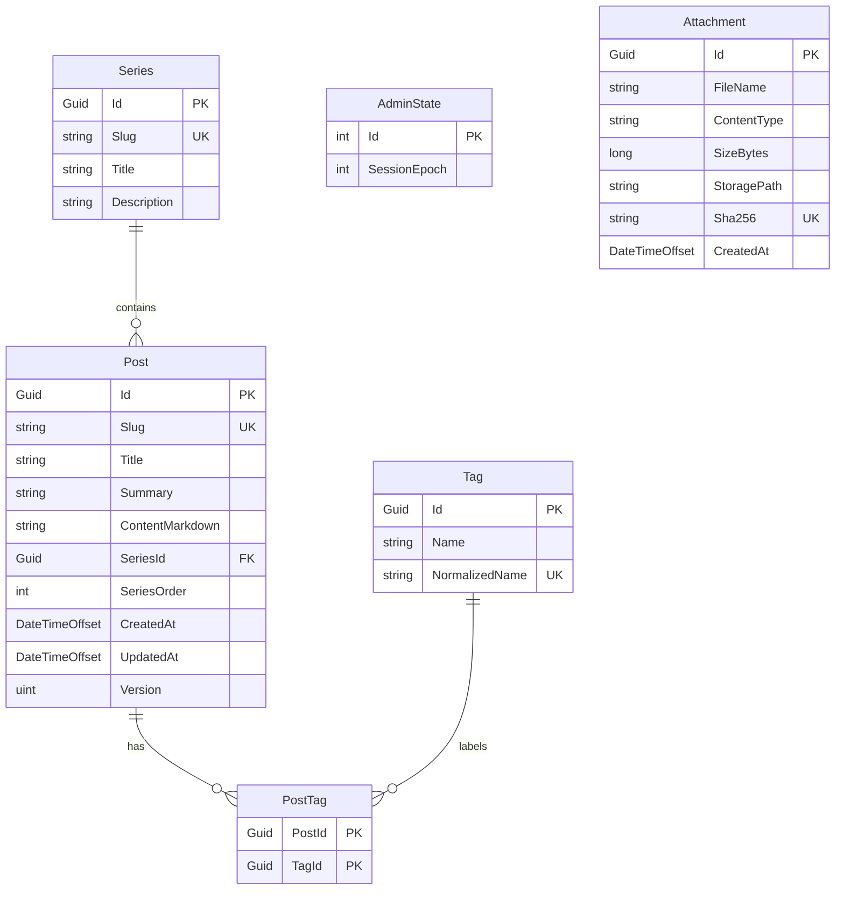

# 데이터 모델

<!-- doc-harness:section id="summary" hash="5f60fcbe33f8e2bb8c5ca94d6d08bda06153111c70918af40585dbdd464a4fd5" -->
## 한 줄 요약

엔티티 6개, 관계 5개, DTO 17개.
<!-- /doc-harness:section -->

<!-- doc-harness:section id="DATA_ER" hash="beee77a4f342432f7ced6c8aea8f14c7865e71197d4e32eb1778c6650d817be4" -->
## 데이터 모델 ER (ER Diagram)

6개 엔티티: Posts가 중심이며 Series와는 1:N(Restrict), Tags와는 PostTags를 통한 M:N(Cascade). Attachments·AdminState는 독립 테이블이다.

Post.Version은 PostgreSQL xmin에 매핑된 낙관적 동시성 토큰이다. Post→PostTag, Tag→PostTag는 Cascade, Series→Post는 Restrict라 시리즈 삭제 전 앱이 SeriesId·SeriesOrder를 함께 비운다(CK_Posts_Series_Pair). AdminState는 CHECK(Id=1)로 단일 행을 강제하며 공개 롤에는 SELECT가 부여되지 않는다. Attachment는 Post와 FK가 없고 본문 참조는 마크다운 URL뿐이다(INFERRED).

### 코드 근거

| 구성 요소 | 코드 |
|---|---|
| Post | `PortfolioBlog.Api/Domain/Post.cs` (Post) |
| Series | `PortfolioBlog.Api/Domain/Series.cs` (Series) |
| Tag | `PortfolioBlog.Api/Domain/Tag.cs` (Tag) |
| PostTag | `PortfolioBlog.Api/Domain/PostTag.cs` (PostTag) |
| AdminState | `PortfolioBlog.Api/Domain/AdminState.cs` (AdminState) |
| Attachment | `PortfolioBlog.Api/Domain/Attachment.cs` (Attachment) |
<!-- /doc-harness:section -->

<!-- doc-harness:section id="entities" hash="bbc015598795aa3d22ca34402ff1ffefcd58ab58a90a08acb6e11a5d90c68872" -->
## 엔티티

### Post (Posts)

코드: `PortfolioBlog.Api/Domain/Post.cs` · 키: PK(Id), FK(SeriesId)->Series · 인덱스: UNIQUE(Slug), (CreatedAt DESC, Id ASC), (SeriesId, SeriesOrder, CreatedAt, Id) · 상태: CONFIRMED

| 필드 | 타입 | 제약 |
|---|---|---|
| Id | Guid | PK, Guid.CreateVersion7() |
| Slug | string | max 100, UNIQUE, CK_Posts_Slug_Format |
| Title | string | max 200, CK_Posts_Title_NotBlank |
| Summary | string | max 300 |
| ContentMarkdown | string | CK_Posts_Content_Size (octet_length <= 204800) |
| SeriesId | Guid? | FK -> Series.Id (Restrict), CK_Posts_Series_Pair |
| SeriesOrder | int? | CK_Posts_Series_Pair, CK_Posts_SeriesOrder_Positive |
| CreatedAt | DateTimeOffset |  |
| UpdatedAt | DateTimeOffset |  |
| Version | uint | IsRowVersion -> PostgreSQL xmin 시스템 컬럼(낙관적 동시성 토큰) |

### Series (Series)

코드: `PortfolioBlog.Api/Domain/Series.cs` · 키: PK(Id) · 인덱스: UNIQUE(Slug) · 상태: CONFIRMED

| 필드 | 타입 | 제약 |
|---|---|---|
| Id | Guid | PK, UUIDv7 |
| Slug | string | max 100, UNIQUE, CK_Series_Slug_Format |
| Title | string | max 200, CK_Series_Title_NotBlank |
| Description | string | max 1000 |

### Tag (Tags)

코드: `PortfolioBlog.Api/Domain/Tag.cs` · 키: PK(Id) · 인덱스: UNIQUE(NormalizedName) · 상태: CONFIRMED

| 필드 | 타입 | 제약 |
|---|---|---|
| Id | Guid | PK, UUIDv7 |
| Name | string | max 50, CK_Tags_Name_NotBlank, CK_Tags_Name_NoSlash |
| NormalizedName | string | max 50, UNIQUE |

### PostTag (PostTags)

코드: `PortfolioBlog.Api/Domain/PostTag.cs` · 키: PK(PostId, TagId), FK(PostId)->Posts, FK(TagId)->Tags · 인덱스: (TagId, PostId) · 상태: CONFIRMED

| 필드 | 타입 | 제약 |
|---|---|---|
| PostId | Guid | PK(복합), FK -> Posts.Id (Cascade) |
| TagId | Guid | PK(복합), FK -> Tags.Id (Cascade) |

### AdminState (AdminState)

코드: `PortfolioBlog.Api/Domain/AdminState.cs` · 키: PK(Id) · 인덱스: - · 상태: CONFIRMED

| 필드 | 타입 | 제약 |
|---|---|---|
| Id | int | PK, ValueGeneratedNever, CK_AdminState_Single (Id = 1) |
| SessionEpoch | int | 시드 값 1 |

### Attachment (Attachments)

코드: `PortfolioBlog.Api/Domain/Attachment.cs` · 키: PK(Id) · 인덱스: UNIQUE(Sha256), (CreatedAt DESC, Id ASC) · 상태: CONFIRMED

| 필드 | 타입 | 제약 |
|---|---|---|
| Id | Guid | PK, UUIDv7 |
| FileName | string | max 255, CK_Attachments_FileName_NotBlank |
| ContentType | string | max 20, CK_Attachments_ContentType (png/jpeg/gif/webp) |
| SizeBytes | long | CK_Attachments_Size (1..10485760) |
| StoragePath | string | max 80 |
| Sha256 | string | max 64, UNIQUE, CK_Attachments_Sha256 (^[0-9a-f]{64}$) |
| CreatedAt | DateTimeOffset |  |
<!-- /doc-harness:section -->

<!-- doc-harness:section id="relations" hash="d43bfa6415f2a4410416eae5893f4227bbc5c1dc45ad7c3079ffbf35a33ee4e3" -->
## 관계

| From | To | 카디널리티 | 상태 |
|---|---|---|---|
| Series | Post | 1:N (Post.SeriesId nullable, OnDelete Restrict; 시리즈 삭제는 앱이 SeriesId·SeriesOrder를 함께 비운 뒤 수행) | CONFIRMED |
| Post | PostTag | 1:N (Cascade) | CONFIRMED |
| Tag | PostTag | 1:N (Cascade) | CONFIRMED |
| Post | Tag | M:N (PostTag 조인 엔티티 경유) | CONFIRMED |
| PublicDbContext | AppDbContext | 상속(같은 모델 공유). 연결 문자열은 ConnectionStrings:Public이 비어 있지 않으면 그것, 비어 있으면 ConnectionStrings:Default로 폴백. 어느 쪽이든 BuildConnectionString이 statement_timeout·default_transaction_read_only=on을 붙임 | CONFIRMED |
<!-- /doc-harness:section -->

<!-- doc-harness:section id="dtos" hash="78efc60ff7fa24e42b76f71c816b3830c15d75d144104b7b91608447802a248a" -->
## DTO

| 이름 | 파일 | 사용 기능 | 상태 |
|---|---|---|---|
| PostSummaryDto / PostDetailDto / PagedPostsDto / UpsertPostRequest | `PortfolioBlog.Api/Contracts/PostDtos.cs` | F002, F003, F006, F011 | CONFIRMED |
| SeriesDto / SeriesPostDto / SeriesDetailDto / UpsertSeriesRequest | `PortfolioBlog.Api/Contracts/SeriesDtos.cs` | F007 | CONFIRMED |
| TagDto | `PortfolioBlog.Api/Contracts/TagDtos.cs` | F008 | CONFIRMED |
| AttachmentDto / PagedAttachmentsDto | `PortfolioBlog.Api/Contracts/AttachmentDtos.cs` | F009 | CONFIRMED |
| PreviewRequest / PreviewResponse | `PortfolioBlog.Api/Contracts/PreviewDtos.cs` | F004, F011 | CONFIRMED |
| AuthStatusDto / LoginRequest | `PortfolioBlog.Api/Contracts/AuthDtos.cs` | F001 | CONFIRMED |
| PublicTag | `PortfolioBlog.Api/Infrastructure/Data/PublicModels.cs` | F012, F013, F014, F015, F016 | CONFIRMED |
| PublicPostSummary | `PortfolioBlog.Api/Infrastructure/Data/PublicModels.cs` | F012, F014, F016 | CONFIRMED |
| PublicPage<T> | `PortfolioBlog.Api/Infrastructure/Data/PublicModels.cs` | F012, F014, F016 | CONFIRMED |
| PublicLink | `PortfolioBlog.Api/Infrastructure/Data/PublicModels.cs` | F013 | CONFIRMED |
| PublicPostMeta | `PortfolioBlog.Api/Infrastructure/Data/PublicModels.cs` | F013, F011 | CONFIRMED |
| PublicContent | `PortfolioBlog.Api/Infrastructure/Data/PublicModels.cs` | F013, F011 | CONFIRMED |
| PublicSeriesEntry | `PortfolioBlog.Api/Infrastructure/Data/PublicModels.cs` | F015 | CONFIRMED |
| PublicSeries | `PortfolioBlog.Api/Infrastructure/Data/PublicModels.cs` | F015 | CONFIRMED |
| PublicFeedEntry | `PortfolioBlog.Api/Infrastructure/Data/PublicModels.cs` | F017 | CONFIRMED |
| PublicSitemap | `PortfolioBlog.Api/Infrastructure/Data/PublicModels.cs` | F017 | CONFIRMED |
| HealthResponse | `PortfolioBlog.Api/Program.cs` | F022 | CONFIRMED |
<!-- /doc-harness:section -->

<!-- doc-harness:section id="migrations" hash="adf90f0f3525c97a50171327f2e3641ef6be9600a83d92bee2ef3dbd36ebf8a7" -->
## 마이그레이션·트랜잭션

### 마이그레이션

| 내용 | 상태 | 근거 |
|---|---|---|
| 20260920142630_InitialCreate: Posts, Series, Tags, PostTags, AdminState 테이블과 위 인덱스·CHECK 제약, AdminState 시드(Id=1, SessionEpoch=1)를 만든다(본 세션에서는 Designer·ModelSnapshot의 모델 정의와 AppDbContext로 확인, 마이그레이션 본문 전체는 재열람하지 않음). | INFERRED | `PortfolioBlog.Api/Infrastructure/Data/Migrations/20260920142630_InitialCreate.cs` |
| 20260920233704_AddAttachments: Attachments 테이블 생성(CreateTable), 인덱스 IX_Attachments_CreatedAt_Id·IX_Attachments_Sha256(유일) 추가, Down은 DropTable. | CONFIRMED | `PortfolioBlog.Api/Infrastructure/Data/Migrations/20260920233704_AddAttachments.cs` (14-51) |
| 마이그레이션은 AppDbContext에만 속한다. 앱 기동 시 adminDb.Database.Migrate() 실행 후, ConnectionStrings:Public이 비어 있지 않을 때에만 PublicRoleGrants.Apply(adminDb, publicConnection)를 호출한다. Public이 비어 있으면 Apply는 건너뛰고 권한 조정이 없다. | CONFIRMED | `PortfolioBlog.Api/Program.cs` top-level (82-88) |
| PublicDbContext 연결: ConnectionStrings:Public이 공백이면 ConnectionStrings:Default(관리 롤)로 폴백한다(Development·테스트 편의; 비-Development에서는 StartupValidation이 Public을 필수로 요구). 폴백 시 공개 컨텍스트는 관리 롤로 접속하며 grants가 적용되지 않으므로 방어는 default_transaction_read_only=on·SaveChanges 차단 2겹뿐이다. 둘 다 비면 InvalidOperationException. | CONFIRMED | `PortfolioBlog.Api/Infrastructure/Data/DataServiceCollectionExtensions.cs` PublicOrDefaultConnectionString (40-49), `PortfolioBlog.Api/Infrastructure/Data/PublicDbContext.cs` BuildConnectionString (46-62) |
| PublicRoleGrants.Apply(Public 설정 시): 롤 이름 검증(RoleOf), Public 롤=Default 사용자와 같으면 예외, 한 트랜잭션에서 관리 롤 소유 public 테이블마다 REVOKE ALL FROM PUBLIC·FROM 롤 → GRANT USAGE ON SCHEMA → 허용 테이블(Posts, Series, Tags, PostTags, Attachments)에만 GRANT SELECT. AdminState는 부여하지 않는다. | CONFIRMED | `PortfolioBlog.Api/Infrastructure/Data/PublicRoleGrants.cs` PublicRoleGrants.Apply / BuildStatements (21,76-138) |

### 트랜잭션

| 내용 | 상태 | 근거 |
|---|---|---|
| 글 생성(PostEndpoints.CreateAsync): slug 사전 AnyAsync 검사 → 트랜잭션 시작 → TagResolver.ResolveIdsAsync(태그 upsert) + Post·PostTags 추가 → SaveChangesAsync → Commit. 유니크/FK 경쟁(DbConflict.IsConstraintRace)은 409. | CONFIRMED | `PortfolioBlog.Api/Features/Posts/PostEndpoints.cs` PostEndpoints.CreateAsync (124-164) |
| 글 수정(UpdateAsync): Include(PostTags) 로드, 사전 version 비교(불일치 시 렌더 전 409), Entry(post).Property(Version).OriginalValue=req.Version로 xmin 고정, 트랜잭션 안에서 태그 upsert·PostTags 차집합 갱신·UpdatedAt 갱신 후 SaveChanges. DbUpdateConcurrencyException→409(StaleVersion), 제약 경쟁→409. | CONFIRMED | `PortfolioBlog.Api/Features/Posts/PostEndpoints.cs` PostEndpoints.UpdateAsync (187-245) |
| 글 삭제(PostEndpoints.DeleteAsync): version 쿼리 필수(없으면 400) → 글 조회(없으면 404) → post.Version != version이면 사전 409 → Entry(post).Property(Version).OriginalValue=version으로 xmin 고정 → Posts.Remove → SaveChangesAsync(명시 트랜잭션 없이 단일 SaveChanges). DbUpdateConcurrencyException→409(StaleVersion). PostTags 행은 FK Cascade로 DB가 삭제하고 Tags 행은 남는다. 성공 시 204. | CONFIRMED | `PortfolioBlog.Api/Features/Posts/PostEndpoints.cs` PostEndpoints.DeleteAsync (263-285), `PortfolioBlog.Api/Infrastructure/Data/AppDbContext.cs` OnModelCreating (138-139) |
| 첨부 업로드 sha256 경쟁 처리(AttachmentEndpoints.UploadAsync): 수신·메타데이터 제거·해시는 잠금 밖에서 수행 → AttachmentLock.HoldAsync(db, sha256) 세션 잠금 안에서 store.Exists 재확인(없으면 IFormFile을 다시 열어 재저장) → Sha256으로 기존 행 조회, 있으면 200으로 기존 행 반환 → 없으면 Attachment 추가 후 SaveChanges(201). INSERT가 UniqueViolation(PostgresException SqlState)이면 ChangeTracker.Clear() 후 기존 행을 조회해 200으로 반환(잠금 밖 경로 방어). 잠금 대기 10초 초과(55P03)는 OverloadExceptionHandler가 503으로 변환. | CONFIRMED | `PortfolioBlog.Api/Features/Attachments/AttachmentEndpoints.cs` AttachmentEndpoints.UploadAsync (113-179) |
| 첨부 삭제(DeleteAsync): AttachmentLock 세션 잠금 안에서 ExecuteDeleteAsync(자동 커밋 단일 DELETE, 0행이면 404) 후 파일 삭제. 행을 먼저 지우고 파일 삭제 실패는 고아 파일로 남겨 AttachmentJanitor가 정리. | CONFIRMED | `PortfolioBlog.Api/Features/Attachments/AttachmentEndpoints.cs` AttachmentEndpoints.DeleteAsync (198-213) |
| 두 DbContext: AppDbContext(관리 읽기·쓰기, 마이그레이션 소유, 기본 추적)와 PublicDbContext(AppDbContext 상속, NoTracking, SaveChanges(Async)는 InvalidOperationException, 연결 옵션으로 statement_timeout과 default_transaction_read_only=on, ApplicationName=PortfolioBlog.Public). 별도 Public 롤이 있을 때만 테이블 SELECT 권한 제한이 DB 수준에서 적용된다. | CONFIRMED | `PortfolioBlog.Api/Infrastructure/Data/PublicDbContext.cs` PublicDbContext (29-95), `PortfolioBlog.Api/Infrastructure/Data/DataServiceCollectionExtensions.cs` AddBlogData (30-38) |
<!-- /doc-harness:section -->

<!-- doc-harness:section id="unknowns" hash="339d4fa9ae1a9fcb934c40ba5d46bbc014a8ce154b2757b423be98aceb285778" -->
## 확인하지 못한 것

- Attachment와 Post 사이의 참조는 FK가 아니라 마크다운 본문 URL이다. 고아 판정 기준의 세부(AttachmentJanitor)는 이 분석에서 다시 읽지 않았다.
- InitialCreate 마이그레이션 본문 전체와 AppDbContextModelSnapshot은 이번 재검증에서 줄 단위로 대조하지 않았다(AppDbContext 모델 정의 기준으로 기술).
- Public 롤의 실제 DB 권한 상태는 런타임 DB에 의존하므로 코드만으로 확인할 수 없다(테스트 PublicRoleGrantsTests가 검증하는 것으로 추정).
<!-- /doc-harness:section -->

<!-- doc-harness:section id="related" hash="b00407f06741e07f226d411a5c055a7fd31c0a41bafd0417e5f42d42b328cc70" -->
## 관련 문서

- [08_API](08_API.md)
- [09_FEATURES](09_FEATURES.md)
- [02_ARCHITECTURE](02_ARCHITECTURE.md)
<!-- /doc-harness:section -->
