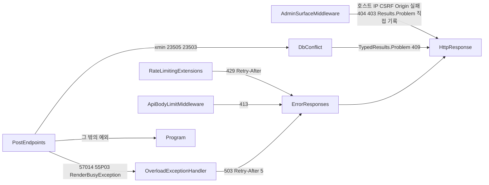

# 오류 처리

<!-- doc-harness:section id="one-liner" hash="2b2ff3a6c84abb344222a1e4a0cc9f27dd5b65641fb099a0224847ff91fe4f6e" -->
과부하(57014·55P03·RenderBusyException)는 전역 OverloadExceptionHandler가 503+Retry-After 5로, 동시성 충돌은 엔드포인트가 409로, 관리 표면·본문 상한·속도 제한은 핸들러 앞에서 거부하며, 서버 재시도는 없고 그 밖의 예외는 기본 500으로 흐르며 기동 검증 실패는 프로세스를 종료시킨다.
<!-- /doc-harness:section -->

<!-- doc-harness:section id="summary" hash="536d30faa4ebd616024b9f5fd63a136ae82c6635ad6e58200698e7516aec3766" -->
## 한 줄 요약

## 한 줄 요약

오류 처리는 **앞단 거부 → 엔드포인트 지역 매핑(400/404/409/413/415) → 전역 핸들러(503) → 기본 500** 순서의 계층 구조다. 서버는 재시도하지 않고 클라이언트(SPA `describeError`)에 맡긴다. 기동 시 설정·저장소·마이그레이션 실패는 예외를 잡지 않고 프로세스를 종료시킨다. 가장 큰 남은 위험은 '처리 없음 → 기본 500' 경로의 본문 형식·로깅이 확정되지 않았다는 점이다(ERR001).
<!-- /doc-harness:section -->

<!-- doc-harness:section id="key-points" hash="82045e63b6c3af40160960bd8fd42f4b108b65c97bb82b233c5b1c6ccc2c4425" -->
## 핵심 내용

### 전역 핸들러

| 구성 요소 | 역할 | 근거 |
|---|---|---|
| `UseExceptionHandler` + `OverloadExceptionHandler` | 예외 InnerException 체인에서 SqlState 57014·55P03 또는 `RenderBusyException`을 찾아 503 + `Retry-After: 5`로 응답 | `Program.cs` 43·47·100행, `OverloadExceptionHandler.cs` 35-42, 63-70행 |
| `UseStatusCodePages` → `ErrorResponses` | 본문 없는 상태 코드에 대해 `/api`는 ProblemDetails, 공개 경로는 요청 값을 반사하지 않는 고정 HTML을 쓴다 | `Program.cs` 101행, `ErrorResponses.cs` |
| `RouteHandlerOptions.ThrowOnBadRequest=false` | 바인딩 실패를 예외 없이 프레임워크 400으로 응답 | `Program.cs` 48-49행 |
| `StartupValidation` | 기동 시 설정 오류를 설정 키 이름과 함께 중단 | `Program.cs` 76행 |

### 오류 응답 형식

| 상태 | 발생 조건 | 형식 |
|---|---|---|
| 400 | 필드 검증 실패 | `ValidationProblem`(필드별 errors) |
| 400 | 바인딩 실패(잘못된 JSON·타입 불일치) | 프레임워크 기본 400, errors 키 없음(추론) |
| 401 | 세션 없음·만료, 로그인 실패 | 401 + ProblemDetails(로그인 실패 title '로그인 실패') |
| 403/404 | 관리 표면 게이트(IP·CSRF·Origin / 호스트) | `AdminSurfaceMiddleware`가 ProblemDetails를 직접 기록 |
| 404 | 대상 없음, 잘못된 slug·page | `/api`는 ProblemDetails, 공개는 고정 HTML |
| 409 | version 불일치(xmin), slug 중복, FK·유니크 경쟁(23505·23503) | `DbConflict.Problem`(본문 포함) |
| 413 | 본문 256KB 초과, 첨부 10MB 초과 | `ApiBodyLimitMiddleware` / `AttachmentEndpoints.TooLarge` |
| 415 | 이미지 시그니처 불일치·구조 손상 | `TrySaveAsync`가 매핑 |
| 429 | 속도·동시성 제한 초과 | 대기열 없이 즉시 거부 + `Retry-After` |
| 503 | 57014·55P03·`RenderBusyException` | `OverloadExceptionHandler` |
| 500 | 그 밖의 예외 | 프레임워크 기본(본문 형식 미확정) |

### 재시도·타임아웃·롤백

| 항목 | 동작 |
|---|---|
| 서버 재시도 | 없음(409·503·429 모두). `DbConflict` 주석에 이유 기재 |
| 클라이언트 재시도 | 자동 재시도 없음. `describeError`가 `Retry-After` 초를 안내 |
| 렌더 슬롯 대기 | `RenderGate` `QueueTimeoutMs` 기본 5000ms 초과 시 `RenderBusyException`→503 |
| 429 | `QueueLimit=0`. 고정 창은 창 종료까지 1~60초, 동시성 제한은 5초 |
| DB 문장 | `statement_timeout`(57014)·`lock_timeout`(55P03)→503. 첨부 잠금 대기 10초 |
| 롤백 | 트랜잭션은 `await using` dispose로 롤백. `TagResolver`가 만든 Tags 행도 함께 롤백 |
| 강조 표시 | 정규식 250ms·누적 2,000ms 초과 시 해당 블록만 이스케이프 `<pre><code>`로 폴백 |
| 첨부 청소 | `AttachmentJanitor` 스윕 실패는 `LogError` 후 다음 주기에 재시도 |
<!-- /doc-harness:section -->

<!-- doc-harness:section id="details" hash="50860b2c24bca36f845850f79bfcaf55d9e122c804e5b7e80c723edf1cd6a825" -->
## 상세 내용

## 상세 내용

분류: **CONFIRMED_ISSUE**는 코드로 확정된 결함, **POTENTIAL_RISK**는 관찰된 위험(재현 없음), **IMPROVEMENT**는 결함은 아니지만 개선 여지가 있는 항목이다.

### CONFIRMED_ISSUE

| ID | 요약 | 영향 기능 |
|---|---|---|
| ERR004 | `Editor.save.onError`가 409를 status만 보고 ConflictPanel로 처리하고 서버 detail(ErrorNotice)을 숨긴다. FK 경쟁 409에서도 '먼저 수정되었습니다'가 나오고, '내 내용 유지' 뒤 재저장이 같은 원인으로 다시 실패할 수 있다. 새 글의 409는 패널 없이 ErrorNotice만 보인다 | F003·F006·F008 |

### POTENTIAL_RISK

| ID | 요약 | 영향 기능 |
|---|---|---|
| ERR001 | `IsOverload`가 57014·55P03·`RenderBusyException` 외에는 false라 기본 500이 된다. `UseExceptionHandler`가 `UseStatusCodePages`보다 바깥이라 공개 경로 500 본문이 HTML인지 ProblemDetails인지 미확정. `ErrorPipelineTests`는 상태만 검사. 쿠키가 붙은 관리 요청은 `SessionValidator`의 DB 예외로 실패할 수 있다 | F001·F002·F008·F012~F017 |
| ERR002 | `CreateAsync`/`UpdateAsync`가 `CommitAsync` 뒤 `PostQueries.GetDetailAsync`로 재조회한다. 이 재조회가 실패하면 저장됐는데 클라이언트는 오류를 받고, 생성 재시도는 slug 409가 된다 | F003 |
| ERR003 | `UpdateAsync`의 `TagResolver.ResolveIdsAsync`(213행 부근)가 try(226행) 밖이라 DB 오류가 409 매핑을 받지 못하고 전역 처리로 간다. 트랜잭션은 dispose로 롤백 | F006·F008 |
| ERR005 | `LogoutAsync`의 `ExecuteUpdateAsync`가 0행이어도 204를 준다. 로그인은 `SingleAsync`가 행 부재 시 `InvalidOperationException` | F001 |
| ERR007 | 슬롯을 얻은 뒤 Markdig 렌더는 취소·타임아웃이 없는 동기 CPU 작업이다(적대적 입력 시 문서상 최대 약 8.5초). 방어는 동시성 제한과 분당 한도뿐 | F003·F004·F011·F013 |
| ERR008 | 첨부 업로드는 INSERT 없이 끝나면 보상 삭제가 없다(`AttachmentJanitor`가 1시간 경과분을 6시간 주기로 정리). 23505 폴백의 `SingleAsync`는 행이 사라지면 `InvalidOperationException` 500 | F009 |
| ERR009 | `PublicAttachmentEndpoints.GetAsync`는 `FileNotFoundException`·`DirectoryNotFoundException`만 404로 바꾼다. 그 밖의 I/O 예외와 `PhysicalPath`의 루트 이탈 `InvalidOperationException`(try 밖)은 500. 헤더 전송 후 오류 동작은 UNKNOWN | F010 |
| ERR011 | `drafts.ts` 기본 인자 `window.localStorage`가 try 밖에서 평가된다(추론). `previewCsp`는 origin 형식이 틀리면 렌더 중 Error를 던지고 `PreviewPane`에 catch가 없다 | F004·F005 |
| ERR012 | `HighlightCss.Value`가 Lazy 기본 모드라 첫 Build 예외가 캐시되어 재시작 전까지 `/css/highlight.css`가 500일 수 있다(추론) | F017 |
| ERR015 | `MarkdownRenderer.RenderDetailed`의 null·UTF-8 한도 검사(113-117행: `ThrowIfNull`, `GetByteCount > MaxInputBytes` → `ArgumentException`)는 try 밖이라 `MarkdownTooComplexException`이 아닌 일반 예외가 된다. 저장·미리보기는 사전 검증하지만 공개 `PostModel.RenderAsync`는 DB CHECK(`CK_Posts_Content_Size`)에 의존하므로 우회 시 500. 138-143행은 try 안 `ArgumentException`을 `MarkdownTooComplexException`으로 감싸는 catch다 | F011·F013 |

### IMPROVEMENT

| ID | 요약 |
|---|---|
| ERR006 | 로그 없이 삼키는 지점: `AttachmentLock.Releaser.DisposeAsync`(unlock 실패), `RenderedPostCache.Store`(SizeLimit 초과 거부), `PostModel.RenderAsync`의 `MarkdownTooComplexException` 폴백, `HighlightingCodeBlockRenderer` 타임아웃 폴백, 클라이언트 `clearDraft` |
| ERR010 | `OperationCanceledException` 전용 처리가 없다. 최종 상태·로그 수준은 프레임워크 동작이며 UNKNOWN |
| ERR013 | `CreateAsync`의 slug 사전 검사(136행)가 렌더(133행) 뒤라 중복 slug 요청도 렌더 슬롯을 쓴다 |
| ERR014 | 오류 형식이 계층별로 다르다(`/api`는 ProblemDetails, 공개는 고정 HTML, `HostFiltering`은 본문 없는 400). 바인딩 400은 errors 키가 없고, 검색 q 오류는 400 상태로 `Page()`를 직접 렌더링한다. 내부 정보 누출은 확인되지 않았다 |

### 기동 실패 경로

`Program.cs`의 기동 시퀀스는 try/catch 없이 진행되므로 실패하면 예외가 그대로 전파되어 프로세스가 시작되지 못한다.

| 단계 | 위치 | 실패 시 |
|---|---|---|
| 설정 검증 | `StartupValidation.Validate`(`Program.cs` 76행) | 잘못된 설정을 설정 키 이름만 담아 예외로 중단 |
| 저장 루트 쓰기 확인 | `FileSystemAttachmentStore.EnsureRootIsWritable`(79행) | 설정 키를 명시한 실패로 중단 |
| 마이그레이션 | `adminDb.Database.Migrate()`(85행) | 예외 전파, 종료 |
| 공개 롤 GRANT | `PublicRoleGrants.Apply`(87행, `Public` 연결 문자열이 있을 때) | 예외 전파, 종료 |

`StartupValidation`은 I/O가 없다는 계약이라 저장 루트 확인이 별도 단계로 분리돼 있다(`Program.cs` 77-79행 주석).

### 백그라운드 작업

`AttachmentJanitor`는 `PeriodicTimer` 루프에서 `OperationCanceledException`을 제외한 예외를 잡아 `LogError("첨부 청소 실패. 다음 주기에 다시 시도한다.")` 후 다음 틱에 다시 시도한다(`AttachmentJanitor.cs` 61-63행). 스윕 내부에는 `IOException`·`UnauthorizedAccessException`(147행)과 잠금 타임아웃(109행)을 위한 별도 catch가 있다. 알림 체계는 확인하지 못했다.

### 계층별 실패 경로 예

- **F001 로그인**: 게이트 실패(404/403)는 속도 제한 예산을 쓰지 않는다. 비밀번호 불일치는 `LogWarning`(RemoteIp만) 후 401, 쿠키 미발급.
- **F003/F006 저장**: version 불일치는 렌더 전에 409, `DbUpdateConcurrencyException`과 23505·23503은 catch되어 409, `MarkdownTooComplexException`은 contentMarkdown 400, `RenderBusyException`은 503.
- **F009 첨부**: 0바이트·필드 없음 400, 크기 초과 413, 시그니처 불일치·구조 손상 415, 잠금 대기 초과 503.
- **공개 페이지**: 잘못된 slug·page는 DB 조회 전에 404, 빈 쪽은 COUNT·SELECT 후 404. 검색 q 검증 실패는 400 상태로 직접 렌더링해 StatusCodePages가 덮어쓰지 않는다.

### 개선 제안(분석과 분리)

- ERR001: 일시적 DB 장애를 `IsOverload`에 포함할지 검토하고 500 본문 형식을 경로 접두사별 테스트로 고정한다.
- ERR004: 409에 원인 구분 코드(extensions)를 넣는다.
- ERR002: 재조회 실패 시 저장 성공을 알리는 폴백 응답을 준다.
- ERR005: 0행이면 오류 처리하거나 경고 로그를 남긴다.
- ERR008: 폴백 조회를 `SingleOrDefault`로 바꾸고 INSERT 실패 시 보상 삭제를 검토한다.
- ERR012: `LazyThreadSafetyMode.PublicationOnly` 또는 기동 시 Build 검증.
<!-- /doc-harness:section -->

<!-- doc-harness:section id="ERR_FLOW" hash="e6a7e5b737f6c2c857e0df9850d58b52d8bfeff26338f2ceadf31f3ba6fc981b" -->
### 오류가 응답으로 바뀌는 경로 (Flowchart)

본문을 직접 쓰는 경로(관리 표면 게이트, DbConflict)와 ErrorResponses를 거치는 경로(413, 본문 없는 429, 503)가 갈라진다.

AdminSurfaceMiddleware는 `Results.Problem(...).ExecuteAsync`로 ProblemDetails를 직접 쓰므로 ErrorResponses·UseStatusCodePages가 관여하지 않는다. DbConflict.Problem도 `TypedResults.Problem`으로 본문이 있는 409를 돌려줘 StatusCodePages가 덮어쓰지 않는다. ErrorResponses를 거치는 것은 ApiBodyLimitMiddleware의 413(직접 WriteAsync 호출), 본문 없는 상태 코드(429 등, UseStatusCodePages 경유), OverloadExceptionHandler의 503이다. AdminSurfaceMiddleware는 UseRateLimiter보다 앞이라 게이트에서 걸린 요청은 속도 제한 예산을 쓰지 않는다. ApiBodyLimitMiddleware는 UseAuthorization 뒤라 세션이 필요한 경로에서는 401이 먼저다. PostEndpoints는 대표 예이며 다른 엔드포인트와 Razor 페이지도 같은 전역 경로를 탄다. Program 노드는 UseExceptionHandler 기본 처리(500)이며 본문 형식은 미확정이다. HttpResponse는 ASP.NET 응답 자체를 가리키는 노드다.

#### 코드 근거

| 구성 요소 | 코드 |
|---|---|
| AdminSurfaceMiddleware | `PortfolioBlog.Api/Infrastructure/Access/AdminSurfaceMiddleware.cs` (AdminSurfaceMiddleware.Reject) |
| ErrorResponses | `PortfolioBlog.Api/Infrastructure/Web/ErrorResponses.cs` (ErrorResponses.WriteAsync) |
| ApiBodyLimitMiddleware | `PortfolioBlog.Api/Infrastructure/Web/ApiBodyLimitMiddleware.cs` (ApiBodyLimitMiddleware) |
| DbConflict | `PortfolioBlog.Api/Infrastructure/Data/DbConflict.cs` (DbConflict) |
| OverloadExceptionHandler | `PortfolioBlog.Api/Infrastructure/Web/OverloadExceptionHandler.cs` (OverloadExceptionHandler) |
| Program | `PortfolioBlog.Api/Program.cs` (UseStatusCodePages) |
| HttpResponse | `PortfolioBlog.Api/Infrastructure/Web/ErrorResponses.cs` |
<!-- /doc-harness:section -->

<!-- doc-harness:section id="evidence" hash="4711441283be595254a224038390b0d0a0e0b9c1bc0a4dee49b4e35d562442a2" -->
## 코드 근거

## 코드 근거

| 주장 | 파일 | 심볼·줄 |
|---|---|---|
| 전역 핸들러 등록 | `PortfolioBlog.Api/Program.cs` | 43·47·100·101행 |
| 바인딩 실패를 예외 없이 400 | `PortfolioBlog.Api/Program.cs` | 48-49행 |
| 기동 검증·마이그레이션 | `PortfolioBlog.Api/Program.cs` | 76·79·85·87행 |
| 과부하 판정과 503 | `PortfolioBlog.Api/Infrastructure/Web/OverloadExceptionHandler.cs` | `TryHandleAsync` 35-42, `IsOverload` 63-70 |
| 상태 코드 본문 | `PortfolioBlog.Api/Infrastructure/Web/ErrorResponses.cs` | `HandleStatusCodeAsync`/`WriteAsync` |
| 관리 표면 게이트 | `PortfolioBlog.Api/Infrastructure/Access/AdminSurfaceMiddleware.cs` | `InvokeAsync` 67-96 |
| 기동 설정 검증 | `PortfolioBlog.Api/Infrastructure/Access/StartupValidation.cs` | `StartupValidation.Validate` |
| 저장 루트 확인·경로 이탈 | `PortfolioBlog.Api/Infrastructure/Storage/FileSystemAttachmentStore.cs` | `EnsureRootIsWritable` 93, `PhysicalPath` 136-147 |
| 본문 상한 | `PortfolioBlog.Api/Infrastructure/Web/ApiBodyLimitMiddleware.cs` | 21, 47-55, 84 |
| 속도 제한 429 | `PortfolioBlog.Api/Infrastructure/Web/RateLimitingExtensions.cs` | 44-72, 88-101 |
| 409 매핑 | `PortfolioBlog.Api/Infrastructure/Data/DbConflict.cs` | `Problem`, `IsConstraintRace` |
| 글 수정 충돌 처리 | `PortfolioBlog.Api/Features/Posts/PostEndpoints.cs` | `UpdateAsync` 199-238, `RenderOrAddErrorAsync` 323-334 |
| 렌더 슬롯 대기 | `PortfolioBlog.Api/Infrastructure/Markdown/RenderGate.cs` | `RenderAsync` 86-98 |
| 렌더 입력 검사·예외 래핑 | `PortfolioBlog.Api/Infrastructure/Markdown/MarkdownRenderer.cs` | `RenderDetailed` 113-117, 138-143 |
| 첨부 잠금 | `PortfolioBlog.Api/Infrastructure/Storage/AttachmentLock.cs` | `HoldAsync` 52-62 |
| 첨부 청소 실패 | `PortfolioBlog.Api/Infrastructure/Storage/AttachmentJanitor.cs` | 61-63행 |
| SPA 오류 안내 | `PortfolioBlog.Web/src/api/errors.ts` | `describeError` |
| SPA 401 처리 | `PortfolioBlog.Web/src/app/queryClient.ts` | `noteAuthFailure` 11-18 |
| SPA 임시본 | `PortfolioBlog.Web/src/lib/drafts.ts` | `loadDraft`/`saveDraft`/`clearDraft` |
| 에러 파이프라인 테스트 | `PortfolioBlog.Api.Tests/Features/ErrorPipelineTests.cs` | `PostgresOverload_MapsTo503`, `RenderBusy_MapsTo503` |

> 이번에 직접 재확인한 코드는 `Program.cs` 기동 시퀀스와 `AttachmentJanitor`의 catch뿐이다. 나머지는 워크스페이스 기능 분석을 인용했다.
<!-- /doc-harness:section -->

<!-- doc-harness:section id="caveats" hash="2dc7d5c2bc1aae6f80e1e7ba4a150a7519fb9706dc53474be11670d9ffded19f" -->
## 주의사항

## 주의사항

- 409는 원인이 여러 가지다(version 충돌, slug 중복, 참조 삭제 경쟁). 클라이언트가 status만으로 분기하므로 문구를 바꿀 때 `Editor.save.onError`를 함께 본다.
- `UseExceptionHandler`는 `UseStatusCodePages`보다 바깥이다. 500 본문 형식은 확정되지 않았으니 바꾸기 전에 실측한다.
- 서버는 재시도하지 않는다. 트랜잭션은 dispose 롤백에 의존하므로 `await using` 구조를 깨지 않는다.
- `IsOverload`는 InnerException 체인 전체를 본다. 너무 넓히면 오탐이 생기므로 `ErrorPipelineTests`의 과확장 방지 테스트를 유지한다.
- `TagResolver.ResolveIdsAsync`는 엔드포인트 try 밖에서 호출된다.
- 기동 시퀀스(`StartupValidation`·`EnsureRootIsWritable`·`Migrate`·`PublicRoleGrants.Apply`)는 try/catch가 없어 실패가 곧 프로세스 종료다.
- 관리 표면 게이트의 4xx와 `DbConflict` 409는 본문을 직접 쓰므로 `ErrorResponses`를 고쳐도 이들 형식은 바뀌지 않는다.
- 검색의 q 검증 실패는 400 상태로 본문을 직접 렌더링해 StatusCodePages가 덮어쓰지 않는다.
<!-- /doc-harness:section -->

<!-- doc-harness:section id="related" hash="ebeefd3297fac03e332bca514ec734afba2ec2bc88faa80d943ae216a7033824" -->
## 관련 문서

## 관련 문서

- [08_API](08_API.md)
- [13_SECURITY](13_SECURITY.md)
- [14_PERFORMANCE](14_PERFORMANCE.md)
- [12_TROUBLESHOOTING](12_TROUBLESHOOTING.md)
- [17_TECH_DEBT](17_TECH_DEBT.md)
- [19_UNKNOWN_AND_TODO](19_UNKNOWN_AND_TODO.md)
- [F003 글 편집기](features/F003_ADMIN_POST_EDITOR.md)
- [F006 글 수정 충돌](features/F006_POST_EDIT_CONFLICT.md)
- [F009 첨부 관리](features/F009_ADMIN_ATTACHMENT_MANAGEMENT.md)
- [F019 속도 제한](features/F019_RATE_LIMITING.md)
- [F021 기동 부트스트랩](features/F021_STARTUP_BOOTSTRAP.md)
- [F024 첨부 청소](features/F024_ATTACHMENT_JANITOR.md)
<!-- /doc-harness:section -->

<!-- doc-harness:section id="unknowns" hash="0b1d24eee5a209ac9946096590b0ac20dbf6da7f50225b871d686061f14e5c94" -->
## 확인하지 못한 것

- 500 응답 본문이 공개 HTML 경로에서 ProblemDetails인지 고정 HTML인지(ErrorPipelineTests는 상태 코드만 검사)
- 클라이언트 취소(OperationCanceledException)의 최종 상태 코드와 로그 수준
- FileStreamHttpResult가 헤더 전송 후 I/O 오류를 만났을 때의 동작
- 태그 삭제 경쟁 시 DbUpdateConcurrencyException 보고 여부(재현 없음)
- window.localStorage 접근 실패 시 Editor가 RouteError로 가는지
- 워크스페이스 발췌가 F016에서 잘려 F017 이후 기능의 실패 경로는 반영하지 못함
- 전역 로깅 구성과 알림 체계(기동 실패·청소 실패 신호의 수신처)
<!-- /doc-harness:section -->
