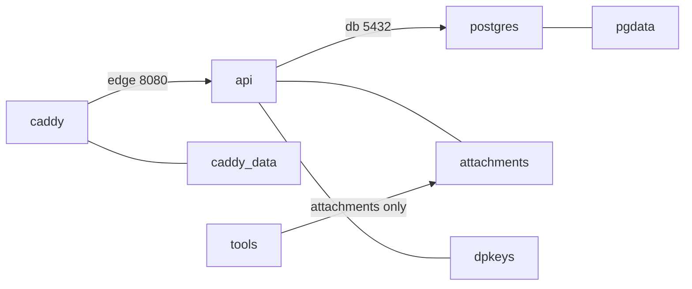

# 배포

<!-- doc-harness:section id="one-liner" hash="e28d7e8f72c45a3783742db6f9f14ad9bc5faf282825389791b862f32eb6d7f0" -->
단일 호스트 Docker Compose(caddy·api·postgres + 백업/복원용 tools)로 배포하며, 기동은 postgres(healthy) → api(healthy) → caddy 순이고 요청은 caddy → api → postgres로 흐른다.
<!-- /doc-harness:section -->

<!-- doc-harness:section id="summary" hash="10e76304995a205c2716eede4e40cafa0f5f35ef8300d00b7e409ab1b099a1d6" -->
## 한 줄 요약

deploy/docker-compose.yml 하나로 caddy(TLS·정적 SPA·리버스 프록시), api(ASP.NET Core), postgres 3개 서비스를 띄운다. **기동 순서**는 depends_on service_healthy 때문에 postgres(healthy) → api(healthy) → caddy다. caddy → api → postgres는 기동 순서가 아니라 **요청 흐름**이다. 백업·복원은 profile tools 컨테이너가 맡는다.
<!-- /doc-harness:section -->

<!-- doc-harness:section id="key-points" hash="a9934533a0b432560ffd68d9dde9b521a02842370602fbc1fab68cd99f66fbae" -->
## 핵심 내용

### 컨테이너

| 서비스 | 이미지/빌드 | 기동 조건 | 비고 |
|---|---|---|---|
| caddy | PortfolioBlog.Web/Dockerfile(node:24.21.0-alpine 빌드 → caddy:2.11.4-alpine) | api healthy 이후 | user 1654, read_only, cap_drop ALL + NET_BIND_SERVICE, 80·443 게시, admin off |
| api | PortfolioBlog.Api/Dockerfile(sdk:10.0.401 → aspnet:10.0.12-noble-chiseled-extra) | postgres healthy 이후 | 셸 없음, uid 1654, read_only, /tmp tmpfs 64m, 8080 평문 |
| postgres | postgres:17.11-alpine | 없음 | pg_isready 헬스체크(10초 간격, 12회), postgres-init 읽기 전용 마운트 |
| tools | profile tools | 수동(docker compose run) | network_mode none, read_only, uid 1654, attachments 볼륨만 마운트 |

api 헬스체크는 30초마다(시작 구간 2초) `dotnet PortfolioBlog.Api.dll healthcheck`를 새 프로세스로 실행하고 종료 코드로 답한다.

### 네트워크

| 네트워크 | 구성원 | 역할 |
|---|---|---|
| public | caddy | 호스트 포트 게시(HTTP_BIND 기본 0.0.0.0:80, HTTPS_BIND 기본 0.0.0.0:443), ACME 아웃바운드. h1·h2만 사용, h3 미광고 |
| edge (internal, 172.30.0.0/24) | caddy(172.30.0.2), api | api의 Proxy__TrustedIp가 caddy IP만 신뢰(ForwardLimit=1) |
| db (internal) | api, postgres | Host=postgres, Command Timeout=30 |

### 볼륨

| 볼륨 | 마운트 | 내용 |
|---|---|---|
| pgdata | postgres 데이터 | 테이블 Posts, Series, Tags, PostTags, AdminState(세션 epoch 단일 행; DbSet 이름은 AdminStates), Attachments. 앱 시작 시 Database.Migrate()로 스키마 적용 |
| attachments | /data/attachments | SHA-256 내용 주소 이미지와 .tmp 업로드 파일, 디렉터리 권한 700 |
| dpkeys | /data/dpkeys | Data Protection 키(세션 쿠키 암호화) |
| caddy_data | /data | ACME 인증서 |
| caddy_config | /config | Caddy 설정 상태 |

### DB 롤

- blog_app(ConnectionStrings:Default): 스키마 소유·쓰기.
- blog_public(ConnectionStrings:Public): Posts/Series/Tags/PostTags/Attachments에만 SELECT. AdminState 테이블은 부여 대상에서 제외. 공개 연결에는 statement_timeout과 default_transaction_read_only=on이 붙는다.

### 신뢰 경계

- Caddy: 공개 도메인은 /api·/api/*를 404, GET·HEAD 외 메서드를 405로 막고 본문 상한 64KB. 관리 도메인은 ADMIN_ALLOWED_CIDRS 밖이면 404(평문 HTTP 포함), /api/*·/attachments/*만 백엔드로 보내며 본문 상한 11MiB. 두 도메인 밖 Host는 본문 없는 404.
- 앱: HostFiltering이 PublicOrigin·AdminOrigin 호스트만 허용, /api는 RequireHost와 AdminSurfaceMiddleware로 이중 차단.

### 기타

렌더 캐시(RenderedPostCache)는 프로세스 내 MemoryCache라 재배포하면 비워진다. 외부 캐시 서버는 없다.
<!-- /doc-harness:section -->

<!-- doc-harness:section id="DEPLOY_TOPOLOGY" hash="00d567c741a748566b401bf608f4409dfa3a257a4cefb35e3d87fc580a5eb6df" -->
### 배포 토폴로지(요청 흐름) (Architecture)

요청은 caddy → api → postgres로 흐르고 기동은 그 반대 순서다.

화살표는 트래픽 흐름이다. 기동은 postgres healthy → api healthy → caddy. tools는 network_mode none이라 어떤 망에도 붙지 않는다.

#### 코드 근거

| 구성 요소 | 코드 |
|---|---|
| caddy | `deploy/docker-compose.yml` |
| api | `deploy/docker-compose.yml` |
| postgres | `deploy/docker-compose.yml` |
| tools | `deploy/docker-compose.yml` |
| pgdata | `deploy/docker-compose.yml` |
| attachments | `deploy/docker-compose.yml` |
| dpkeys | `deploy/docker-compose.yml` |
| caddy_data | `deploy/docker-compose.yml` |
<!-- /doc-harness:section -->

<!-- doc-harness:section id="procedure" hash="17b3f5684b6393d1fafd3add32a9220a6a5db952b3819f71a3de5fc98425a72b" -->
## 절차

| 작업 | 명령 | 비고 |
|---|---|---|
| 기동 | `docker compose -f deploy/docker-compose.yml up -d --build` | 환경값은 deploy/.env.example 참고 |
| 관리자 해시 생성 | `dotnet PortfolioBlog.Api.dll hash-password` | Admin__PasswordHash용 일회성 CLI |
| 백업 | `./deploy/backup.sh [백업 루트]` | 서비스 무중단. DB 덤프 후 첨부 묶음. 마지막 줄에 디렉터리 경로 출력. dpkeys·caddy_data는 제외 |
| 복원 | `./deploy/restore.sh --yes <백업 디렉터리>` | 현재 DB·첨부를 전부 덮어씀. 쓰는 쪽을 먼저 멈춤 |
| 스모크 | `SMOKE_E2E=1 deploy/smoke/run.sh` | 운영과 같은 이미지·Caddyfile·compose 오버레이(docker-compose.smoke.yml)로 접근 통제·헤더·백업/복원 검증 |

스모크 순서: 기동 → 허용·거부 검사 → api 중단 시 오류 검사 → seed → down -v → 복원 검증. CI는 .github/workflows/ci.yml의 deploy-smoke 잡이 같은 스크립트를 실행한다. 자세한 운영 절차는 deploy/OPERATIONS.md(이 문서에서는 내용을 확인하지 않음).
<!-- /doc-harness:section -->

<!-- doc-harness:section id="evidence" hash="006d26a8ef06b93379277ecf1ede05758b098b64b59e6c5300943f0a1efc20b2" -->
## 코드 근거

| 주장 | 파일 |
|---|---|
| 서비스·망·볼륨 정의 | deploy/docker-compose.yml |
| API 이미지 | PortfolioBlog.Api/Dockerfile |
| Caddy 이미지 | PortfolioBlog.Web/Dockerfile |
| 프록시 규칙 | deploy/Caddyfile |
| 스모크 오버레이 | deploy/docker-compose.smoke.yml, deploy/smoke/run.sh |
| 백업·복원 | deploy/backup.sh, deploy/restore.sh |
| DB 롤 초기화 | deploy/postgres-init/10-roles.sh |
| 헬스체크·CLI 분기 | PortfolioBlog.Api/Program.cs |
| 공개 롤 권한 | PortfolioBlog.Api/Infrastructure/Data/PublicRoleGrants.cs |
| 스키마 | PortfolioBlog.Api/Infrastructure/Data/AppDbContext.cs |
| CI | .github/workflows/ci.yml |
<!-- /doc-harness:section -->

<!-- doc-harness:section id="caveats" hash="1e98edfad06330ad2b2462bd3d7116095de85ba41ea7f032b73cf587c67b0af0" -->
## 주의사항

- 복원은 파괴적이다. 현재 DB와 첨부를 모두 지운다.
- 백업에는 dpkeys가 없으므로 복원 후 관리자는 다시 로그인해야 하고 인증서는 재발급된다.
- api는 read_only이고 /tmp가 64m tmpfs다. 업로드 동시성(Admin__UploadConcurrency=2)×11MiB를 전제로 한 크기이니 바꿀 때 함께 조정한다.
- edge 망의 caddy 고정 IP(172.30.0.2)와 Proxy__TrustedIp는 일치해야 한다.
- 빈 attachments 볼륨은 api 컨테이너 생성 시 이미지 권한(1654, 0700)으로 초기화된다. restore.sh가 이를 위해 api를 먼저 만든다.
- api 이미지는 셸이 없어 docker exec로 셸 진입이 불가능하다.
- 재배포 시 렌더 캐시가 비워진다.
<!-- /doc-harness:section -->

<!-- doc-harness:section id="related" hash="56d04951b35dea0c8b3d4868928f163b98925592eb6093259f458da971e23ca8" -->
## 관련 문서

- [04_SETUP_AND_RUN](04_SETUP_AND_RUN.md)
- [05_CONFIGURATION](05_CONFIGURATION.md)
- [13_SECURITY](13_SECURITY.md)
- [15_TESTING](15_TESTING.md)
- [features/F026_COMPOSE_DEPLOYMENT](features/F026_COMPOSE_DEPLOYMENT.md)
- [features/F027_BACKUP_RESTORE](features/F027_BACKUP_RESTORE.md)
- [features/F028_DEPLOY_SMOKE_TEST](features/F028_DEPLOY_SMOKE_TEST.md)
<!-- /doc-harness:section -->

<!-- doc-harness:section id="unknowns" hash="e499acb22408f6a5829b3dffcd5ea513b191c7e69176da8f95837b8b2f3e3e5e" -->
## 확인하지 못한 것

- deploy/OPERATIONS.md 내용은 이 단계에서 확인하지 않았다.
- up 명령의 정확한 옵션(.env 필수 키)은 deploy/.env.example로 확인해야 한다.
<!-- /doc-harness:section -->
