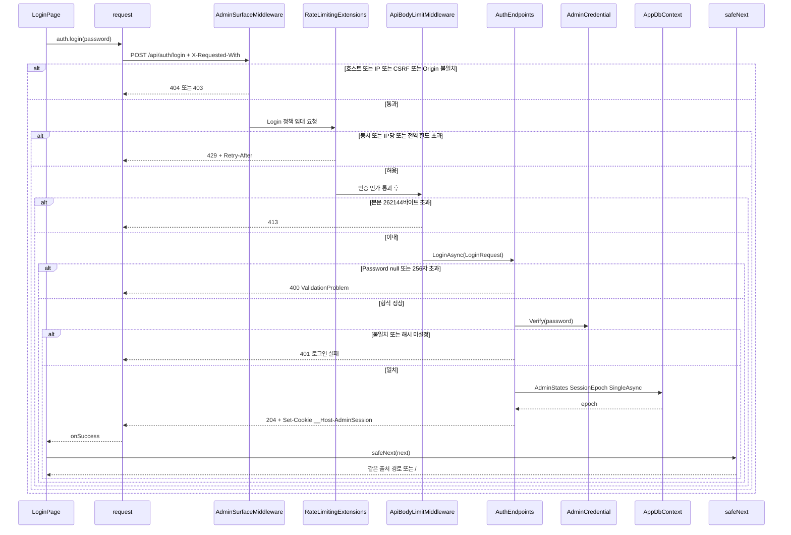
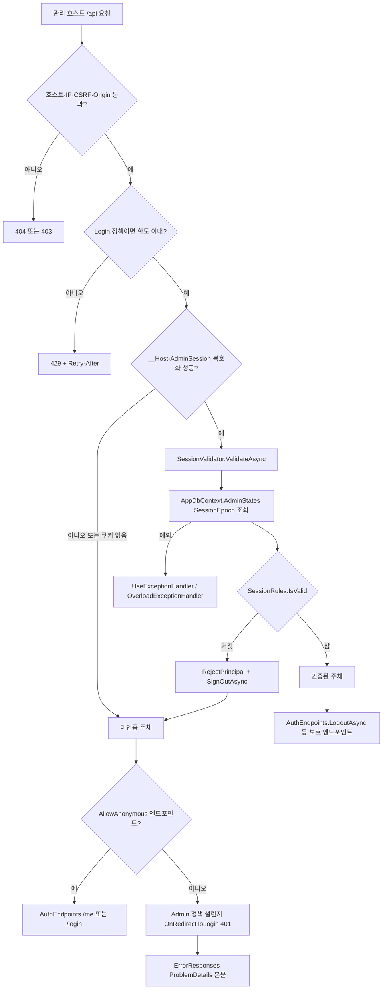
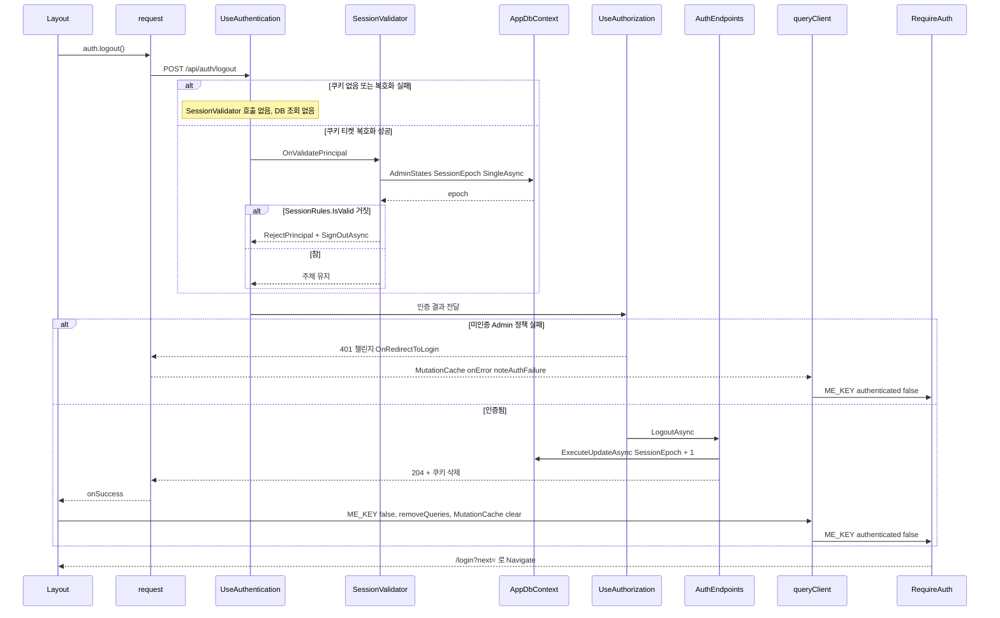
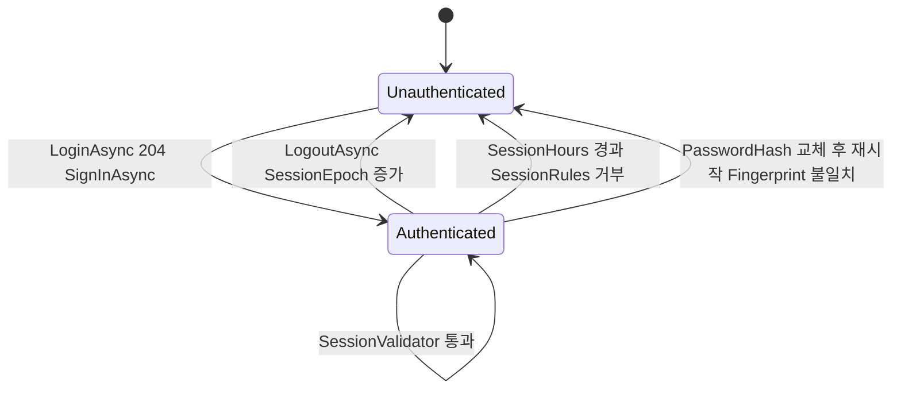

# F001 관리자 로그인·세션 확인·로그아웃

<!-- doc-harness:section id="summary" hash="866c2008cca1ab9e63d53ac8121f82fc2a74331be0de3657dcf0f4dbc46c8048" -->
## 한 줄 요약

결론: F001은 관리자 인증을 쿠키 세션 하나로 처리하고, 쿠키가 붙은 요청마다 DB로 세션을 다시 검증한다. POST /api/auth/login(AuthEndpoints.LoginAsync)은 AdminCredential.Verify(ASP.NET Core Identity PasswordHasher, PBKDF2)가 통과하면 __Host-AdminSession 쿠키를 발급한다. 쿠키에는 ClaimTypes.Name=admin, pwd 클레임=AdminCredential.Fingerprint, epoch=AdminState.SessionEpoch 클레임이 들어 있다. 쿠키 속성은 HttpOnly, Secure, SameSite=Strict이고 비영속이다. IssuedUtc는 TimeProvider 기준이다. 요청 파이프라인 순서는 UseExceptionHandler → UseStatusCodePages → AdminSurfaceMiddleware → UseRateLimiter → UseAuthentication → UseAuthorization → ApiBodyLimitMiddleware다. UseAuthentication 단계에서 쿠키 티켓이 복호화될 때만 OnValidatePrincipal(SessionValidator.ValidateAsync)이 AdminStates 1행을 조회한다. SessionRules.IsValid는 세 조건을 모두 요구한다. 발급 후 SessionHours(기본 12시간) 미만이어야 하고(sliding 없음), 지문과 epoch가 일치해야 한다. 조건이 어긋나면 SessionValidator는 RejectPrincipal과 SignOutAsync만 한다. 401은 UseAuthorization 단계에서 Admin 정책 챌린지(OnRedirectToLogin)가 설정하고, UseStatusCodePages(ErrorResponses)가 ProblemDetails 본문을 붙인다. GET /api/auth/me는 익명을 허용하고 AuthenticateAsync(AdminCookie) 결과를 AuthStatusDto로 돌려준다. POST /api/auth/logout은 /api 그룹의 Admin 정책으로 보호된다. ExecuteUpdateAsync로 SessionEpoch를 원자적으로 +1 해 복사된 쿠키를 포함한 모든 세션을 폐기한다. SPA에서는 RequireAuth가 ME_KEY 쿼리로 접근을 가른다. LoginPage는 로그인에 성공하면 ME_KEY를 true로 두고 safeNext로 검증한 경로로 이동한다. Layout은 로그아웃에 성공하면 ME_KEY를 false로 두고 캐시를 비운다. 어느 호출에서든 401이 오면 noteAuthFailure가 ME_KEY를 false로 바꾼다. 관찰한 잠재 문제는 셋이다. AdminState를 조회하는 SingleAsync의 예외가 처리 없이 전파된다. 로그아웃이 갱신된 행 수를 확인하지 않는다. 세션이 이미 무효인 상태에서 로그아웃하면 Layout의 캐시 정리가 실행되지 않는다. 이번 재검증에서 동작 변경은 없었다. OverloadExceptionHandler 서술은 코드에 맞게 고쳤다. 이 핸들러는 예외 체인에서 PostgresException 57014·55P03과 RenderBusyException을 503으로 바꾸며, 인증 경로에서 해당하는 것은 57014·55P03이다.

| 항목 | 값 |
|---|---|
| 중요도 | CORE |
| 상태 | ACTIVE |
| 진입점 | `SPA /login (LoginPage)`, `SPA 보호 라우트 (RequireAuth → GET /api/auth/me)`, `SPA Layout 로그아웃 버튼 (POST /api/auth/logout)`, `GET /api/auth/me`, `POST /api/auth/login`, `POST /api/auth/logout` |
| 의존 기능 | [F018](../09_FEATURES.md#f018), [F019](../09_FEATURES.md#f019), [F020](../09_FEATURES.md#f020), [F021](../09_FEATURES.md#f021), [F029](../09_FEATURES.md#f029) |

### 진입점 근거

| 내용 | 상태 | 근거 |
|---|---|---|
| SPA 라우트 /login은 LoginPage를 렌더한다. RequireAuth 바깥에 있어 로그인 없이 접근할 수 있다. | CONFIRMED | `PortfolioBlog.Web/src/app/routes.tsx` routes (22), `PortfolioBlog.Web/src/auth/LoginPage.tsx` LoginPage (12-58) |
| SPA 보호 라우트(/, /posts/*, /series, /tags, /attachments)는 RequireAuth 아래에 있다. RequireAuth는 useQuery(ME_KEY, auth.me)로 GET /api/auth/me를 호출한다. | CONFIRMED | `PortfolioBlog.Web/src/app/routes.tsx` routes (23-36), `PortfolioBlog.Web/src/auth/RequireAuth.tsx` RequireAuth (11-21) |
| SPA Layout 헤더의 로그아웃 버튼이 auth.logout()으로 POST /api/auth/logout을 호출한다. | CONFIRMED | `PortfolioBlog.Web/src/components/Layout.tsx` Layout (12-23,35-37), `PortfolioBlog.Web/src/api/endpoints.ts` auth (10-14) |
| GET /api/auth/me(이름 GetAuthStatus)는 AllowAnonymous다. AdminCookie 스킴을 명시해 인증하고 AuthStatusDto(Authenticated)를 200으로 돌려준다. | CONFIRMED | `PortfolioBlog.Api/Features/Auth/AuthEndpoints.cs` AuthEndpoints.MapAuthEndpoints (40-46) |
| POST /api/auth/login(이름 Login)은 AllowAnonymous이고 RateLimitMetadata(RateLimitPolicy.Login)가 붙어 있다. | CONFIRMED | `PortfolioBlog.Api/Features/Auth/AuthEndpoints.cs` AuthEndpoints.LoginAsync (48,69-99) |
| POST /api/auth/logout(이름 Logout)은 /api 그룹의 RequireHost(관리 호스트)와 RequireAuthorization("Admin")을 그대로 받는다. 따라서 유효한 세션이 있어야 핸들러에 도달한다. | CONFIRMED | `PortfolioBlog.Api/Features/Auth/AuthEndpoints.cs` AuthEndpoints.LogoutAsync (49,115-123), `PortfolioBlog.Api/Features/ApiEndpoints.cs` ApiEndpoints.MapApiEndpoints (39-40) |
<!-- /doc-harness:section -->

<!-- doc-harness:section id="flow" hash="58427694b6c6ea55470d766d891f5aae8066a066ea84782065de52cd0c151d3b" -->
## 처리 흐름

| 단계 | 컴포넌트 | 코드 | 설명 |
|---|---|---|---|
| 1 | LoginPage | `PortfolioBlog.Web/src/auth/LoginPage.tsx` LoginPage.submit | 폼을 제출할 때 비밀번호가 비었거나 요청이 진행 중이면 무시한다. 그 외에는 login.mutate()를 인자 없이 호출하고, mutationFn 클로저가 제출 시점의 password 상태를 읽는다. 비밀번호를 mutation 변수로 넘기지 않으므로 MutationCache에 남지 않는다. |
| 2 | request | `PortfolioBlog.Web/src/api/client.ts` request | auth.login(password)은 request('POST','/api/auth/login',{json:{password}})를 호출한다. request는 buildUrl로 경로를 검사한 뒤 CSRF 헤더(X-Requested-With)를 붙이고 credentials 'same-origin', cache 'no-store', redirect 'error'로 fetch한다. |
| 3 | AdminSurfaceMiddleware | `PortfolioBlog.Api/Infrastructure/Access/AdminSurfaceMiddleware.cs` AdminSurfaceMiddleware.InvokeAsync | /api 경로에 Cache-Control: no-store를 설정하고 네 조건을 차례로 검사한다. 관리 호스트가 아니면 404, IP 허용 정책 밖이면 403, CSRF 헤더가 없으면 403, GET/HEAD가 아닌데 Origin이 관리 origin과 다르면 403이다. |
| 4 | RateLimitingExtensions | `PortfolioBlog.Api/Infrastructure/Web/RateLimitingExtensions.cs` RateLimitingExtensions (Login 체인) | 엔드포인트 메타데이터가 RateLimitPolicy.Login이면 login-concurrency(LoginConcurrency), login-ip:{IP}(LoginPerIpPerMinute), login-global(LoginGlobalPerMinute)을 모두 통과해야 한다. 하나라도 초과하면 429와 Retry-After를 돌려준다. |
| 5 | CookieAuthenticationHandler(AdminCookie) | `PortfolioBlog.Api/Program.cs` UseAuthentication | 기본 스킴 AdminCookie가 __Host-AdminSession 쿠키를 복호화한다. 복호화에 성공한 경우에만 OnValidatePrincipal(SessionValidator.ValidateAsync)을 호출한다. 로그인 요청에 쿠키가 없으면 이 단계는 미인증으로 지나간다. |
| 6 | ApiBodyLimitMiddleware | `PortfolioBlog.Api/Infrastructure/Web/ApiBodyLimitMiddleware.cs` ApiBodyLimitMiddleware.InvokeAsync | UseAuthorization 뒤에 실행된다. 매칭된 /api 엔드포인트에 자체 크기 상한 메타데이터가 없으면 본문을 JsonLimitBytes(262144)로 제한한다. Content-Length가 이를 넘으면 413이고, 길이를 선언하지 않은 본문은 LengthLimitedStream으로 센다. |
| 7 | AuthEndpoints | `PortfolioBlog.Api/Features/Auth/AuthEndpoints.cs` AuthEndpoints.LoginAsync | LoginRequest를 바인딩한다. request.Password가 null이거나 256자를 넘으면 ValidationProblem(400)을 돌려준다. |
| 8 | AdminCredential | `PortfolioBlog.Api/Infrastructure/Access/AdminCredential.cs` AdminCredential.Verify | 설정 해시가 비어 있으면 false다(fail closed). 해시가 있으면 PasswordHasher.VerifyHashedPassword 결과가 Failed가 아닐 때 true다. 검증에 실패하면 LoginAsync가 LogWarning을 남기고 401 Problem을 돌려준다. |
| 9 | AppDbContext | `PortfolioBlog.Api/Features/Auth/AuthEndpoints.cs` AuthEndpoints.LoginAsync | db.AdminStates.AsNoTracking()으로 Id=1 행의 SessionEpoch를 SingleAsync(ct)로 읽는다. |
| 10 | AuthEndpoints | `PortfolioBlog.Api/Features/Auth/AuthEndpoints.cs` AuthEndpoints.LoginAsync | Name=admin, pwd 클레임=Fingerprint, epoch 클레임으로 ClaimsIdentity를 만든다. SignInAsync(AdminCookie, IsPersistent=false, IssuedUtc=clock.GetUtcNow())로 __Host-AdminSession 쿠키를 발급하고, LogInformation을 남긴 뒤 204를 돌려준다. |
| 11 | LoginPage | `PortfolioBlog.Web/src/auth/LoginPage.tsx` LoginPage.login.onSuccess | onSettled는 성공 여부와 관계없이 입력을 비운다. onSuccess는 ME_KEY를 {authenticated:true}로 설정하고 navigate(safeNext(next), {replace:true})로 이동한다. |
| 12 | safeNext | `PortfolioBlog.Web/src/lib/safeNext.ts` safeNext | 같은 출처의 절대 경로만 통과시킨다. 다음 값은 모두 '/'로 바꾼다: 비었거나 2048자 초과, '/'로 시작하지 않거나 '//' 또는 '/\'로 시작, 제어 문자 포함, URL 파싱 실패, 다른 origin, /login 자신(대소문자·끝 슬래시 무시), 정규화 뒤 '//' 또는 '/\'로 시작하는 값. |
| 13 | RequireAuth | `PortfolioBlog.Web/src/auth/RequireAuth.tsx` RequireAuth | 보호 라우트에 진입하면 useQuery(ME_KEY, auth.me)를 실행한다. 대기 중이면 Loading을, 오류면 재시도 버튼이 있는 ErrorNotice를 보여 준다. authenticated=false면 /login?next=현재경로로 이동하고, true면 Outlet을 렌더한다. |
| 14 | SessionValidator | `PortfolioBlog.Api/Infrastructure/Access/SessionValidator.cs` SessionValidator.ValidateAsync | 쿠키 티켓이 복호화된 요청에서만 호출된다. TimeProvider, AdminOptions.SessionHours, AdminCredential.Fingerprint를 읽고 AdminStates.SessionEpoch를 SingleAsync(RequestAborted)로 조회해 SessionRules.IsValid에 넘긴다. 결과가 false면 RejectPrincipal과 SignOutAsync만 하고 상태 코드는 설정하지 않는다. |
| 15 | SessionRules | `PortfolioBlog.Api/Infrastructure/Access/SessionRules.cs` SessionRules.IsValid | 순수 함수다. IssuedUtc가 없거나, 미래 시각이거나, 발급 후 lifetime 이상 지났으면 false다. 지문이 Ordinal 비교로 다르면 false다. epoch는 NumberStyles.None으로 파싱하며 현재 epoch와 같아야 true다. |
| 16 | AuthEndpoints | `PortfolioBlog.Api/Features/Auth/AuthEndpoints.cs` AuthEndpoints.MapAuthEndpoints (/me) | ctx.AuthenticateAsync("AdminCookie")의 result.Succeeded를 AuthStatusDto에 담아 200으로 돌려준다. AllowAnonymous이므로 세션이 거부되어도 401이 아니라 Authenticated=false다. |
| 17 | AuthServiceCollectionExtensions | `PortfolioBlog.Api/Infrastructure/Access/AuthServiceCollectionExtensions.cs` CookieAuthenticationOptions.Events.OnRedirectToLogin | UseAuthorization 단계에서 Admin 정책(RequireAuthenticatedUser)이 실패하면 AdminCookie 챌린지가 일어난다. OnRedirectToLogin은 리다이렉트하지 않고 상태 코드 401만 설정한다. 본문이 빈 이 응답에는 UseStatusCodePages(ErrorResponses.HandleStatusCodeAsync)가 /api용 ProblemDetails 본문을 쓴다. |
| 18 | Layout | `PortfolioBlog.Web/src/components/Layout.tsx` Layout.logout | 로그아웃 버튼이 auth.logout()을 호출한다. 성공하면 ME_KEY를 false로 설정하고, ME_KEY 외 쿼리를 removeQueries로 제거하고, MutationCache를 비운다. 실패하면 ErrorNotice를 보여 준다. |
| 19 | AuthEndpoints | `PortfolioBlog.Api/Features/Auth/AuthEndpoints.cs` AuthEndpoints.LogoutAsync | 인가를 통과한 요청만 이 핸들러에 도달한다. AdminStates(Id=1)에 ExecuteUpdateAsync(SessionEpoch = SessionEpoch + 1)를 실행하고, SignOutAsync로 쿠키를 삭제하고, LogInformation을 남긴 뒤 204를 돌려준다. |
| 20 | queryClient | `PortfolioBlog.Web/src/app/queryClient.ts` noteAuthFailure | QueryCache와 MutationCache의 onError가 ApiError 401을 받으면 ME_KEY를 {authenticated:false}로 설정한다. 그러면 RequireAuth가 로그인 화면으로 보낸다. |
<!-- /doc-harness:section -->

<!-- doc-harness:section id="F001_SEQUENCE" hash="0a14763c0d2969631820434ab178e7a5d7138df25a368d3a43d115a67563abc5" -->
## 관리자 로그인 시퀀스(POST /api/auth/login) (Sequence Diagram)

로그인 요청은 AdminSurfaceMiddleware, RateLimitingExtensions, ApiBodyLimitMiddleware를 차례로 통과해야 AuthEndpoints.LoginAsync에 닿는다. 비밀번호가 맞으면 AdminStates의 epoch를 읽어 __Host-AdminSession 쿠키를 발급하고, SPA는 safeNext로 검증한 경로로 이동한다.

Program.cs의 미들웨어 순서(AdminSurfaceMiddleware → UseRateLimiter → UseAuthentication → UseAuthorization → ApiBodyLimitMiddleware)를 따라 그렸다. IP 거부가 속도 제한보다 앞이라 외부 요청은 로그인 예산을 쓰지 않는다. 로그인 엔드포인트는 AllowAnonymous라 인가 단계에서 막히지 않는다. 비밀번호 검증(PBKDF2)은 동기 CPU 작업이며 login-concurrency 파티션이 동시 실행 수를 묶는다. epoch 조회 중 DB 예외는 처리 없이 전파되어 UseExceptionHandler로 간다. 이 경로에서 OverloadExceptionHandler가 503으로 바꾸는 것은 PostgresException 57014·55P03이다. 이 핸들러는 RenderBusyException도 503으로 바꾸지만, 로그인 경로에서는 나오지 않는다. 성공 뒤 SPA는 ME_KEY를 true로 설정한다.

### 코드 근거

| 구성 요소 | 코드 |
|---|---|
| LoginPage | `PortfolioBlog.Web/src/auth/LoginPage.tsx` (LoginPage) |
| request | `PortfolioBlog.Web/src/api/client.ts` (request) |
| AdminSurfaceMiddleware | `PortfolioBlog.Api/Infrastructure/Access/AdminSurfaceMiddleware.cs` (AdminSurfaceMiddleware.InvokeAsync) |
| RateLimitingExtensions | `PortfolioBlog.Api/Infrastructure/Web/RateLimitingExtensions.cs` (RateLimitingExtensions) |
| ApiBodyLimitMiddleware | `PortfolioBlog.Api/Infrastructure/Web/ApiBodyLimitMiddleware.cs` (ApiBodyLimitMiddleware.InvokeAsync) |
| AuthEndpoints | `PortfolioBlog.Api/Features/Auth/AuthEndpoints.cs` (AuthEndpoints.LoginAsync) |
| AdminCredential | `PortfolioBlog.Api/Infrastructure/Access/AdminCredential.cs` (AdminCredential.Verify) |
| AppDbContext | `PortfolioBlog.Api/Infrastructure/Data/AppDbContext.cs` (AppDbContext.AdminStates) |
| safeNext | `PortfolioBlog.Web/src/lib/safeNext.ts` (safeNext) |
<!-- /doc-harness:section -->

<!-- doc-harness:section id="F001_FLOW" hash="a14d30e21d05ff539153f6f28aaf72a8d682cc2f806ba9f8724c006baacd1caf" -->
## 관리 /api 요청의 인증·인가 분기(SessionValidator·SessionRules) (Flowchart)

쿠키 티켓이 복호화된 요청만 SessionValidator가 DB epoch로 재검증하고, 실패하면 미인증 주체가 된다. 미인증 주체가 보호 엔드포인트에 가면 Admin 정책 챌린지가 401 ProblemDetails를 만든다.

AdminSurfaceMiddleware가 가장 먼저 호스트, IP 허용 목록, CSRF 헤더, Origin을 검사한다. 그다음 UseRateLimiter가 Login 정책 엔드포인트에만 로그인 한도를 적용한다. UseAuthentication에서는 쿠키가 없거나 복호화에 실패하면 SessionValidator를 건너뛰고 미인증 주체가 된다. 복호화에 성공하면 SessionValidator가 AdminStates 1행을 조회하고 SessionRules.IsValid로 절대 수명, 지문, epoch를 검사한다. 검사가 실패하면 RejectPrincipal과 SignOutAsync만 하고 상태 코드는 설정하지 않는다. 조회 중 예외는 처리 없이 전파되어 UseExceptionHandler로 간다. OverloadExceptionHandler.IsOverload는 InnerException 체인에서 PostgresException(SqlState 57014·55P03)이나 RenderBusyException을 찾으면 503과 Retry-After 5를 쓴다. 이 인증 경로에서 해당하는 것은 57014·55P03이고, 그 밖의 예외는 기본 예외 처리로 넘어간다. 미인증 주체라도 /me와 /login은 AllowAnonymous라 핸들러에 도달한다. /me는 이때 Authenticated=false를 돌려준다. 그 밖의 /api 엔드포인트(로그아웃 포함)는 Admin 정책 챌린지를 받는다. OnRedirectToLogin이 401만 설정하고, UseStatusCodePages가 ErrorResponses로 ProblemDetails 본문을 쓴다.

### 코드 근거

| 구성 요소 | 코드 |
|---|---|
| AdminSurfaceMiddleware | `PortfolioBlog.Api/Infrastructure/Access/AdminSurfaceMiddleware.cs` (AdminSurfaceMiddleware.InvokeAsync) |
| RateLimitingExtensions | `PortfolioBlog.Api/Infrastructure/Web/RateLimitingExtensions.cs` (RateLimitingExtensions) |
| CookieTicket | `PortfolioBlog.Api/Infrastructure/Access/AuthServiceCollectionExtensions.cs` (AddCookie(AdminCookie)) |
| SessionValidator | `PortfolioBlog.Api/Infrastructure/Access/SessionValidator.cs` (SessionValidator.ValidateAsync) |
| AppDbContext | `PortfolioBlog.Api/Infrastructure/Data/AppDbContext.cs` (AppDbContext.AdminStates) |
| OverloadExceptionHandler | `PortfolioBlog.Api/Infrastructure/Web/OverloadExceptionHandler.cs` (OverloadExceptionHandler.TryHandleAsync / IsOverload) |
| SessionRules | `PortfolioBlog.Api/Infrastructure/Access/SessionRules.cs` (SessionRules.IsValid) |
| OnRedirectToLogin | `PortfolioBlog.Api/Infrastructure/Access/AuthServiceCollectionExtensions.cs` (Events.OnRedirectToLogin) |
| ErrorResponses | `PortfolioBlog.Api/Infrastructure/Web/ErrorResponses.cs` (ErrorResponses.HandleStatusCodeAsync) |
| AuthEndpoints | `PortfolioBlog.Api/Features/Auth/AuthEndpoints.cs` (AuthEndpoints.MapAuthEndpoints) |
| LogoutAsync | `PortfolioBlog.Api/Features/Auth/AuthEndpoints.cs` (AuthEndpoints.LogoutAsync) |
<!-- /doc-harness:section -->

<!-- doc-harness:section id="F001_SEQUENCE_LOGOUT" hash="5f73c3ddd0308f9f84db42170aa9cf0384cbe684b84833d824a4ed62ab62279f" -->
## 로그아웃과 SPA 세션 상태 전환 (Sequence Diagram)

로그아웃은 유효한 세션이 있을 때만 LogoutAsync에 닿고, SessionEpoch를 +1 해 모든 세션을 폐기한 뒤 쿠키를 지운다. 세션이 이미 무효면 401이 나고, SPA는 noteAuthFailure로만 로그인 화면으로 간다.

LogoutAsync는 /api 그룹의 Admin 정책으로 보호되므로 세션이 유효한 요청만 도달한다. 도달하면 ExecuteUpdateAsync로 SessionEpoch를 원자적으로 +1 하고 SignOutAsync로 호출 브라우저의 쿠키를 지운다. 이 때문에 다른 기기와 복사된 쿠키도 다음 요청의 SessionValidator 검사에서 거부된다. 세션이 이미 만료되었거나 폐기된 상태면 인가 단계에서 401이 나고, Layout의 onSuccess가 실행되지 않는다. 이때 noteAuthFailure가 ME_KEY만 false로 바꾸고, removeQueries와 MutationCache clear는 일어나지 않는다(POTENTIAL_ISSUE). UPDATE 중 DB 예외가 나면 쿠키가 남는다. 이 경로에서는 57014·55P03만 OverloadExceptionHandler가 503으로 바꾸고, 그 외 예외는 기본 예외 처리 응답이 된다.

### 코드 근거

| 구성 요소 | 코드 |
|---|---|
| Layout | `PortfolioBlog.Web/src/components/Layout.tsx` (Layout.logout) |
| request | `PortfolioBlog.Web/src/api/client.ts` (request) |
| UseAuthentication | `PortfolioBlog.Api/Program.cs` (UseAuthentication) |
| SessionValidator | `PortfolioBlog.Api/Infrastructure/Access/SessionValidator.cs` (SessionValidator.ValidateAsync) |
| AppDbContext | `PortfolioBlog.Api/Infrastructure/Data/AppDbContext.cs` (AppDbContext.AdminStates) |
| UseAuthorization | `PortfolioBlog.Api/Program.cs` (UseAuthorization) |
| AuthEndpoints | `PortfolioBlog.Api/Features/Auth/AuthEndpoints.cs` (AuthEndpoints.LogoutAsync) |
| queryClient | `PortfolioBlog.Web/src/app/queryClient.ts` (noteAuthFailure) |
| RequireAuth | `PortfolioBlog.Web/src/auth/RequireAuth.tsx` (RequireAuth) |
<!-- /doc-harness:section -->

<!-- doc-harness:section id="F001_STATE" hash="d28fd503abef25a132df6c56c50e4ff48df354a2e7b3c2a891ee9eb4f5a44fc6" -->
## 관리자 세션 상태 (State Diagram)

세션은 로그인으로 생기고, 로그아웃(epoch 증가), 절대 수명 경과, 비밀번호 해시 교체 중 하나로 끝난다. 요청 중에 연장되는 경로는 없다.

Unauthenticated는 쿠키가 없거나 무효인 상태이고, Authenticated는 SessionRules.IsValid를 통과하는 __Host-AdminSession 쿠키를 가진 상태다. SessionValidator를 통과해도 SlidingExpiration=false라 수명은 늘지 않는다. 로그아웃은 서버의 AdminState.SessionEpoch를 올리므로 모든 기기의 Authenticated 상태를 한꺼번에 끝낸다. 무효가 된 쿠키는 다음 요청에서 SessionValidator가 SignOutAsync로 지운다.

### 코드 근거

| 구성 요소 | 코드 |
|---|---|
| Unauthenticated | `PortfolioBlog.Api/Infrastructure/Access/SessionValidator.cs` (SessionValidator.ValidateAsync) |
| Authenticated | `PortfolioBlog.Api/Features/Auth/AuthEndpoints.cs` (AuthEndpoints.LoginAsync) |
| LogoutAsync | `PortfolioBlog.Api/Features/Auth/AuthEndpoints.cs` (AuthEndpoints.LogoutAsync) |
| SessionRules | `PortfolioBlog.Api/Infrastructure/Access/SessionRules.cs` (SessionRules.IsValid) |
<!-- /doc-harness:section -->

<!-- doc-harness:section id="data" hash="fadd15a9a7b751a566f6024bbfb700a874726c8884727db6b7976e297500267c" -->
## 데이터

### 데이터 흐름

| 내용 | 상태 | 근거 |
|---|---|---|
| 로그인 입력은 LoginPage의 password 상태(최대 256자) → JSON {password} → LoginRequest(string? Password) 순서로 바인딩된다. 비밀번호는 mutation 변수로 넘기지 않아 MutationCache에 남지 않고, onSettled에서 입력이 비워진다. | CONFIRMED | `PortfolioBlog.Web/src/auth/LoginPage.tsx` (18-30,48), `PortfolioBlog.Web/src/api/endpoints.ts` (12), `PortfolioBlog.Api/Contracts/AuthDtos.cs` LoginRequest, `PortfolioBlog.Web/src/test/auth.test.tsx` (52) |
| 자격 증명은 설정 Admin:PasswordHash → AdminCredential._hash(싱글턴, 생성 시 1회 읽음) → Fingerprint 순서로 만들어진다. Fingerprint는 해시 문자열 SHA-256의 앞 16바이트를 소문자 hex 32자로 쓴 값이다. 해시 원문은 쿠키에 들어가지 않는다. | CONFIRMED | `PortfolioBlog.Api/Infrastructure/Access/AdminCredential.cs` AdminCredential..ctor (37-45), `PortfolioBlog.Api/Infrastructure/Access/AuthServiceCollectionExtensions.cs` (45), `PortfolioBlog.Api.Tests/Infrastructure/AdminCredentialTests.cs` Fingerprint_ChangesWhenHashChanges_AndDoesNotRevealHash (85) |
| 세션 티켓은 클레임(Name=admin, pwd 클레임=Fingerprint, epoch=SessionEpoch의 InvariantCulture 문자열)과 AuthenticationProperties(IsPersistent=false, IssuedUtc)로 이루어진다. 쿠키 핸들러가 이를 Data Protection으로 보호해 __Host-AdminSession 쿠키에 싣는다. 쿠키 속성은 Path=/, HttpOnly, Secure(Always), SameSite=Strict, IsEssential이다. ExpireTimeSpan=SessionHours, SlidingExpiration=false다. | CONFIRMED | `PortfolioBlog.Api/Features/Auth/AuthEndpoints.cs` AuthEndpoints.LoginAsync (87-96), `PortfolioBlog.Api/Infrastructure/Access/AuthServiceCollectionExtensions.cs` (55-71), `PortfolioBlog.Api.Tests/Features/AuthEndpointsTests.cs` Login_CorrectPassword_Returns204_AndHardenedCookie (65) |
| 세션 재검증은 쿠키 티켓 값(IssuedUtc, pwd, epoch)과 현재 서버 상태(TimeProvider.GetUtcNow, AdminOptions.SessionHours, AdminCredential.Fingerprint, DB의 AdminState.SessionEpoch)를 SessionRules.IsValid에 넣어 bool을 얻는다. 이 계산은 티켓이 복호화된 요청에서만 일어난다. | CONFIRMED | `PortfolioBlog.Api/Infrastructure/Access/SessionValidator.cs` (33-53), `PortfolioBlog.Api/Infrastructure/Access/SessionRules.cs` (39-51) |
| 세션 상태 출력은 다음 순서로 흐른다. /me가 AuthStatusDto(bool Authenticated)를 JSON으로 돌려준다. SPA가 이 값을 TanStack Query 캐시 ME_KEY=['auth','me']에 저장한다. RequireAuth가 이 값으로 라우팅을 가른다. | CONFIRMED | `PortfolioBlog.Api/Contracts/AuthDtos.cs` AuthStatusDto, `PortfolioBlog.Web/src/app/queryClient.ts` (5), `PortfolioBlog.Web/src/auth/RequireAuth.tsx` (13-20) |
| SPA는 서버에 다시 묻지 않고 ME_KEY를 직접 바꾼다. 로그인에 성공하면 true, 로그아웃에 성공하면 false, 어느 쿼리나 mutation에서든 401을 받으면 false가 된다. | CONFIRMED | `PortfolioBlog.Web/src/auth/LoginPage.tsx` (26-29), `PortfolioBlog.Web/src/components/Layout.tsx` (14-22), `PortfolioBlog.Web/src/app/queryClient.ts` (11-13,17-18) |
| 로그인 후 이동 경로: RequireAuth가 location.pathname+search를 encodeURIComponent해 ?next=로 넘긴다. LoginPage는 safeNext(params.get('next'))로 검증한 값으로 이동한다. | CONFIRMED | `PortfolioBlog.Web/src/auth/RequireAuth.tsx` (16-19), `PortfolioBlog.Web/src/auth/LoginPage.tsx` (28), `PortfolioBlog.Web/src/lib/safeNext.ts` (18-34) |
| 오류 응답 본문: OnRedirectToLogin의 401처럼 본문 없이 상태 코드만 설정된 /api 응답에는 UseStatusCodePages → ErrorResponses.WriteAsync가 IProblemDetailsService로 ProblemDetails{Status}를 쓴다. LoginAsync의 401과 AdminSurfaceMiddleware의 거부 응답은 핸들러나 미들웨어가 ProblemDetails를 직접 쓴다. 처리되지 않은 예외는 UseExceptionHandler로 가며, OverloadExceptionHandler가 과부하 예외(PostgresException 57014·55P03, RenderBusyException)를 503 + Retry-After 5와 ProblemDetails로 바꾼다. | CONFIRMED | `PortfolioBlog.Api/Program.cs` (43,100-101), `PortfolioBlog.Api/Infrastructure/Web/ErrorResponses.cs` (17,30-52), `PortfolioBlog.Api/Features/Auth/AuthEndpoints.cs` (84), `PortfolioBlog.Api/Infrastructure/Web/OverloadExceptionHandler.cs` OverloadExceptionHandler.TryHandleAsync / IsOverload (35-42,63-70) |
| Data Protection 키: DataProtection:KeysPath가 설정되어 있으면 그 디렉터리에 FileSystemXmlRepository로 영속화하고, 없으면 프레임워크 기본 위치를 쓴다. 애플리케이션 이름은 PortfolioBlog.Api로 고정이다. | CONFIRMED | `PortfolioBlog.Api/Infrastructure/Access/AuthServiceCollectionExtensions.cs` (75-84) |

### DB 접근

| 엔티티 | 작업 | 코드 |
|---|---|---|
| AdminState (테이블 AdminState, Id=1 단일 행) | SELECT | `PortfolioBlog.Api/Features/Auth/AuthEndpoints.cs` AuthEndpoints.LoginAsync |
| AdminState (테이블 AdminState, Id=1 단일 행) | SELECT | `PortfolioBlog.Api/Infrastructure/Access/SessionValidator.cs` SessionValidator.ValidateAsync |
| AdminState (테이블 AdminState, Id=1 단일 행) | UPDATE | `PortfolioBlog.Api/Features/Auth/AuthEndpoints.cs` AuthEndpoints.LogoutAsync |
| AdminState (CHECK CK_AdminState_Single, 시드 SessionEpoch=1) | DDL | `PortfolioBlog.Api/Infrastructure/Data/AppDbContext.cs` AppDbContext (AdminState 모델 구성·HasData) |

### 상태 전이

| 이전 | 다음 | 트리거 | 근거 |
|---|---|---|---|
| 미인증(쿠키 없음) | 인증됨(__Host-AdminSession 발급) | POST /api/auth/login 성공(204). 티켓에 현재 epoch와 지문이 담긴다. | `PortfolioBlog.Api/Features/Auth/AuthEndpoints.cs` AuthEndpoints.LoginAsync (87-98) |
| 인증됨 | 미인증(모든 세션 폐기) | POST /api/auth/logout. AdminState.SessionEpoch가 +1 되어 이전에 발급된 모든 쿠키(복사본 포함)의 epoch가 어긋난다. 호출한 브라우저의 쿠키는 SignOutAsync로 삭제된다. | `PortfolioBlog.Api/Features/Auth/AuthEndpoints.cs` AuthEndpoints.LogoutAsync (115-123), `PortfolioBlog.Api.Tests/Features/AuthEndpointsTests.cs` Logout_RevokesEverySession_IncludingCopiedCookies (168) |
| 인증됨 | 미인증(쿠키 삭제) | 발급 후 SessionHours(기본 12시간)가 지난다. sliding 연장이 없어 활동이 있어도 수명이 늘지 않는다. | `PortfolioBlog.Api/Infrastructure/Access/SessionRules.cs` (42-45), `PortfolioBlog.Api/Infrastructure/Access/AuthServiceCollectionExtensions.cs` (65-66), `PortfolioBlog.Api/Infrastructure/Access/AdminOptions.cs` (32-33), `PortfolioBlog.Api.Tests/Features/AuthEndpointsTests.cs` Session_ExpiresAfterAbsoluteLifetime_NoSliding (224) |
| 인증됨 | 미인증(쿠키 삭제) | Admin:PasswordHash를 교체하고 재시작하면 AdminCredential.Fingerprint가 달라진다. | `PortfolioBlog.Api/Infrastructure/Access/SessionRules.cs` (46-49), `PortfolioBlog.Api.Tests/Features/AuthEndpointsTests.cs` HashRotation_RevokesSessions_ButControlFactoryWithSameHashStillAccepts (196) |
| AdminState.SessionEpoch = N | AdminState.SessionEpoch = N+1 | LogoutAsync의 ExecuteUpdateAsync(SessionEpoch + 1). 초기값은 시드 데이터의 1이다. | `PortfolioBlog.Api/Features/Auth/AuthEndpoints.cs` (118-119), `PortfolioBlog.Api/Infrastructure/Data/AppDbContext.cs` (141-145) |
| SPA ME_KEY authenticated=true | SPA ME_KEY authenticated=false → /login?next= 이동 | 로그아웃 성공(Layout.onSuccess) 또는 어느 API 호출에서든 받은 401(noteAuthFailure) | `PortfolioBlog.Web/src/components/Layout.tsx` (14-17), `PortfolioBlog.Web/src/app/queryClient.ts` (11-13), `PortfolioBlog.Web/src/auth/RequireAuth.tsx` (16-19) |
| SPA ME_KEY authenticated=false | SPA ME_KEY authenticated=true → safeNext(next) 이동 | LoginPage 로그인 성공(onSuccess setQueryData) | `PortfolioBlog.Web/src/auth/LoginPage.tsx` (26-29) |

### 외부 의존

| 내용 | 상태 | 근거 |
|---|---|---|
| ASP.NET Core 쿠키 인증(AddAuthentication("AdminCookie").AddCookie)과 인가 정책 Admin(RequireAuthenticatedUser) | CONFIRMED | `PortfolioBlog.Api/Infrastructure/Access/AuthServiceCollectionExtensions.cs` (54-72) |
| ASP.NET Core Data Protection. 운영에서는 DataProtection:KeysPath의 FileSystemXmlRepository를 쓴다. 개발 외 환경에서는 StartupValidation이 이 경로가 절대 경로로 설정되어 있는지 강제한다. | CONFIRMED | `PortfolioBlog.Api/Infrastructure/Access/AuthServiceCollectionExtensions.cs` (75-84), `PortfolioBlog.Api/Infrastructure/Access/StartupValidation.cs` (116-134) |
| 비밀번호 검증에는 Microsoft.AspNetCore.Identity.PasswordHasher<object>(PBKDF2-HMAC-SHA512)를 쓴다. 프레임워크 내장이라 추가 패키지가 없다. | CONFIRMED | `PortfolioBlog.Api/Infrastructure/Access/AdminCredential.cs` (12-24,58-65) |
| PostgreSQL(EF Core AppDbContext)의 AdminState 테이블 | CONFIRMED | `PortfolioBlog.Api/Infrastructure/Data/AppDbContext.cs` (84,141-145) |
| System.Threading.RateLimiting 기반 ASP.NET Core 속도 제한기(F019)가 로그인 엔드포인트에 적용된다. | CONFIRMED | `PortfolioBlog.Api/Infrastructure/Web/RateLimitingExtensions.cs` (88-95) |
| SPA는 @tanstack/react-query(useQuery, useMutation, QueryClient), react-router(Navigate, useSearchParams, useNavigate), 브라우저 fetch에 의존한다. | CONFIRMED | `PortfolioBlog.Web/src/auth/LoginPage.tsx` (1-3), `PortfolioBlog.Web/src/auth/RequireAuth.tsx` (1-2), `PortfolioBlog.Web/src/api/client.ts` (60-62) |
<!-- /doc-harness:section -->

<!-- doc-harness:section id="failures" hash="5fde6bdcc91a05e36d620d9439843a0d94f17d29a5b9ff3e3264937dab648d8e" -->
## 실패 지점

| 위치 | 조건 | 처리 | 상태 | 근거 |
|---|---|---|---|---|
| AdminSurfaceMiddleware.InvokeAsync(/api/auth/* 전부) | 관리 호스트가 아니거나, IP가 허용 정책 밖이거나, X-Requested-With 헤더가 없거나, GET/HEAD가 아닌 요청의 Origin이 다름 | 핸들러에 닿기 전에 ProblemDetails로 거부한다(각각 404, 403, 403, 403). UseRateLimiter보다 앞이므로 여기서 걸린 요청은 로그인 속도 제한 예산을 쓰지 않는다. | CONFIRMED | `PortfolioBlog.Api/Infrastructure/Access/AdminSurfaceMiddleware.cs` (67-96), `PortfolioBlog.Api/Program.cs` (104-105), `PortfolioBlog.Api.Tests/Features/AuthEndpointsTests.cs` Login_FromOutsiderIp_Returns403_AndDoesNotConsumeRateLimit (323) |
| RateLimitingExtensions(POST /api/auth/login) | 동시 검증 수가 LoginConcurrency를 넘거나 IP당·전역 분당 한도를 넘음. 경로의 대소문자·끝 슬래시 변형과 IPv4-mapped 주소도 같은 예산으로 센다. | 429와 Retry-After를 돌려준다. Retry-After는 고정 창이면 창 종료까지 남은 1~60초, 동시성 제한이면 5초다. QueueLimit=0이라 초과 요청은 기다리지 않는다. SPA는 describeError로 안내 문구를 보여 준다. | CONFIRMED | `PortfolioBlog.Api/Infrastructure/Web/RateLimitingExtensions.cs` (26,47-50,69-72,88-95,148,169), `PortfolioBlog.Api.Tests/Features/AuthEndpointsTests.cs` (246-377) |
| ApiBodyLimitMiddleware.InvokeAsync(POST /api/auth/login 등) | 본문의 Content-Length가 JsonLimitBytes(262144)를 넘거나, 길이를 선언하지 않은 본문이 읽는 도중 상한을 넘음 | 선언 길이 초과는 LoginAsync에 닿기 전에 413과 ErrorResponses의 ProblemDetails로 거부한다. 미선언 길이는 LengthLimitedStream이 BadHttpRequestException(413)을 던지고, 바인딩이 이를 413으로 응답한다. 이 미들웨어는 UseAuthorization 뒤에 있으므로 로그아웃처럼 세션이 필요한 경로에서는 401이 먼저다. | CONFIRMED | `PortfolioBlog.Api/Infrastructure/Web/ApiBodyLimitMiddleware.cs` (21,43-55,84), `PortfolioBlog.Api/Program.cs` (108) |
| LoginAsync 바인딩 | JSON 파싱 실패 또는 본문이 JSON null | RouteHandlerOptions.ThrowOnBadRequest=false이므로 예외를 던지지 않고 400을 돌려준다. | CONFIRMED | `PortfolioBlog.Api/Program.cs` (49), `PortfolioBlog.Api.Tests/Features/AuthEndpointsTests.cs` Login_NullJsonBody_Returns400 (380) |
| AuthEndpoints.LoginAsync | Password가 null이거나 256자 초과 | 해싱 전에 TypedResults.ValidationProblem(400, password 필드 오류)을 돌려준다. | CONFIRMED | `PortfolioBlog.Api/Features/Auth/AuthEndpoints.cs` (72-79), `PortfolioBlog.Api.Tests/Features/AuthEndpointsTests.cs` Login_MissingOrOversizedPassword_Returns400 (112) |
| AdminCredential.Verify → AuthEndpoints.LoginAsync | 비밀번호 불일치(빈 문자열 포함) 또는 설정 해시가 비어 있음 | LogWarning(RemoteIp만 기록)을 남기고 401 Problem(title '로그인 실패')을 돌려준다. 쿠키는 발급하지 않는다. SPA는 '비밀번호가 맞지 않습니다.'를 표시한다. | CONFIRMED | `PortfolioBlog.Api/Features/Auth/AuthEndpoints.cs` (81-85), `PortfolioBlog.Api/Infrastructure/Access/AdminCredential.cs` (58-65), `PortfolioBlog.Web/src/auth/LoginPage.tsx` (32-34), `PortfolioBlog.Api.Tests/Features/AuthEndpointsTests.cs` Login_WrongPassword_Returns401_NoCookie (94), `PortfolioBlog.Api.Tests/Infrastructure/AdminCredentialTests.cs` (42-60) |
| AuthEndpoints.LoginAsync의 AdminStates SingleAsync | AdminState 행이 없거나 여러 개, DB 연결 실패, 요청 취소 | 처리 없음(예외 전파). UseExceptionHandler가 예외를 받는다. OverloadExceptionHandler.IsOverload는 InnerException 체인에서 과부하 예외를 찾는다. 대상은 PostgresException(SqlState 57014·55P03)과 RenderBusyException이고, 찾으면 503과 Retry-After 5를 쓴다. 이 경로에서 해당할 수 있는 것은 57014·55P03뿐이다. RenderBusyException은 렌더 경로의 예외라 로그인에서는 나오지 않는다. 그 밖의 예외(행 부재의 InvalidOperationException, 연결 실패 등)는 기본 예외 처리로 넘어간다. 행 부재 가능성은 CHECK 제약과 HasData 시드로 줄여 두었다. | POTENTIAL_ISSUE | `PortfolioBlog.Api/Features/Auth/AuthEndpoints.cs` (87), `PortfolioBlog.Api/Program.cs` (43,100), `PortfolioBlog.Api/Infrastructure/Web/OverloadExceptionHandler.cs` OverloadExceptionHandler.IsOverload (8,35-42,63-70), `PortfolioBlog.Api/Infrastructure/Data/AppDbContext.cs` (141-145) |
| SessionValidator.ValidateAsync의 AdminStates SingleAsync | DB 장애나 행 부재 상태에서 쿠키가 붙은 요청이 들어옴(/me도 해당) | 처리 없음(예외 전파). 쿠키가 있는 관리 요청은 모두 인증 단계(UseAuthentication)에서 실패하고, UseExceptionHandler가 오류 응답을 만든다. 이 경로에서는 57014·55P03 PostgresException만 OverloadExceptionHandler의 503 대상이다. /me는 원래 항상 200을 내는 계약이지만 이때는 오류 응답이 될 수 있다. | POTENTIAL_ISSUE | `PortfolioBlog.Api/Infrastructure/Access/SessionValidator.cs` (39-42), `PortfolioBlog.Api/Features/Auth/AuthEndpoints.cs` (40-46), `PortfolioBlog.Api/Program.cs` (100,106), `PortfolioBlog.Api/Infrastructure/Web/OverloadExceptionHandler.cs` (63-70) |
| SessionValidator.ValidateAsync | SessionRules.IsValid가 false: 만료, 미래 발급 시각, IssuedUtc 없음, 지문 불일치·누락, epoch 불일치·비숫자·누락 | context.RejectPrincipal()과 SignOutAsync(쿠키 삭제)만 하고 상태 코드는 설정하지 않는다. 그 결과 /me는 Authenticated=false로 200을 돌려주고, 보호 엔드포인트는 인가 단계의 챌린지로 401을 받는다. | CONFIRMED | `PortfolioBlog.Api/Infrastructure/Access/SessionValidator.cs` (44-53), `PortfolioBlog.Api/Infrastructure/Access/SessionRules.cs` (39-51), `PortfolioBlog.Api.Tests/Infrastructure/SessionRulesTests.cs` SessionRulesTests (49-150) |
| 쿠키 인증 핸들러(AdminCookie) | Data Protection이 복호화할 수 없는 쿠키 값 | 미인증으로 처리하고 SessionValidator는 호출하지 않는다. /me는 500이 아니라 Authenticated=false를 돌려준다. | CONFIRMED | `PortfolioBlog.Api.Tests/Features/AuthEndpointsTests.cs` Me_WithMalformedCookie_ReturnsNotAuthenticated_NotServerError (399) |
| 인가 정책 Admin(UseAuthorization, POST /api/auth/logout 등 보호 엔드포인트) | 쿠키 없음, 복호화 실패, 또는 SessionValidator가 주체를 거부함 | AdminCookie 챌린지의 OnRedirectToLogin이 리다이렉트 대신 401만 설정한다(AccessDenied는 403). 그 뒤 UseStatusCodePages → ErrorResponses가 ProblemDetails 본문을 붙인다. | CONFIRMED | `PortfolioBlog.Api/Infrastructure/Access/AuthServiceCollectionExtensions.cs` (67-69,72), `PortfolioBlog.Api/Infrastructure/Web/ErrorResponses.cs` (30-52), `PortfolioBlog.Api.Tests/Features/AuthEndpointsTests.cs` ProtectedEndpoint_WithoutSession_Returns401_NotRedirect (149) |
| AuthEndpoints.LogoutAsync | ExecuteUpdateAsync가 0행을 갱신함(AdminState 행 부재) | 영향받은 행 수를 확인하지 않는다. epoch가 오르지 않아 다른 세션은 폐기되지 않았는데도 호출한 브라우저의 쿠키만 지우고 204를 돌려준다. | POTENTIAL_ISSUE | `PortfolioBlog.Api/Features/Auth/AuthEndpoints.cs` (118-122) |
| AuthEndpoints.LogoutAsync | epoch UPDATE 중 DB 예외 또는 취소 | 처리 없음(예외 전파). SignOutAsync까지 가지 못해 쿠키가 남는다. 이 경로에서는 57014·55P03 PostgresException만 OverloadExceptionHandler가 503으로 바꾸고, 그 외 예외는 기본 예외 처리 응답이 된다. SPA는 Layout에서 ErrorNotice를 보여 준다. UPDATE와 쿠키 삭제는 한 단위로 묶여 있지 않다. | POTENTIAL_ISSUE | `PortfolioBlog.Api/Features/Auth/AuthEndpoints.cs` (118-120), `PortfolioBlog.Api/Infrastructure/Web/OverloadExceptionHandler.cs` (63-70), `PortfolioBlog.Web/src/components/Layout.tsx` (39) |
| Layout.logout(SPA) | 세션이 이미 만료·폐기된 상태에서 로그아웃을 눌러 401을 받음 | MutationCache.onError의 noteAuthFailure가 ME_KEY를 false로 바꿔 로그인 화면으로 보낸다. 하지만 onSuccess가 실행되지 않으므로 removeQueries와 getMutationCache().clear()도 실행되지 않는다. 그 결과 앞 사용자의 쿼리 캐시와 mutation 기록이 남는다. | POTENTIAL_ISSUE | `PortfolioBlog.Web/src/components/Layout.tsx` (12-23), `PortfolioBlog.Web/src/app/queryClient.ts` (11-13,17-18) |
| request(SPA API 클라이언트) | fetch 네트워크 실패, 리다이렉트 응답(redirect:'error'), 2xx인데 JSON이 아닌 본문, AbortError | 네트워크 실패와 리다이렉트는 ApiError(0,'네트워크 오류')가 된다. JSON 파싱 실패는 ApiError(status,'응답을 해석할 수 없습니다')가 된다. AbortError는 그대로 다시 던진다. RequireAuth는 오류가 나면 재시도 버튼이 있는 ErrorNotice를 보여 준다. | CONFIRMED | `PortfolioBlog.Web/src/api/client.ts` (57-75), `PortfolioBlog.Web/src/auth/RequireAuth.tsx` (15) |
| StartupValidation.Validate(기동 시) | 다음 중 하나: PasswordHash가 base64가 아님, LoginPerIpPerMinute·LoginGlobalPerMinute·LoginConcurrency·SessionHours 중 하나가 1 미만, 개발 외 환경에서 PasswordHash 누락, 개발 외 환경에서 DataProtection:KeysPath가 절대 경로가 아님 | 예외로 기동을 중단한다. 개발 환경에서는 빈 해시가 허용되며, 이때 로그인은 항상 401이다. | CONFIRMED | `PortfolioBlog.Api/Infrastructure/Access/StartupValidation.cs` (58-64,116-134), `PortfolioBlog.Api/Infrastructure/Access/AdminCredential.cs` (60-63), `PortfolioBlog.Api/Program.cs` (76) |
| 재시도·타임아웃 | 로그인, /me, 로그아웃 실패 | 자동 재시도가 없다(queries·mutations 모두 retry:false). 사용자가 버튼으로 다시 시도한다. 인증 경로에는 명시적 타임아웃이 없고 취소 토큰(ct, RequestAborted)만 전달된다. | CONFIRMED | `PortfolioBlog.Web/src/app/queryClient.ts` (19-24), `PortfolioBlog.Api/Infrastructure/Access/SessionValidator.cs` (42) |

### 엣지 케이스

| 내용 | 상태 | 근거 |
|---|---|---|
| 빈 비밀번호: SPA는 password.length===0이면 제출하지 않는다. 서버에 빈 문자열이 오면 길이 검사는 통과하지만 Verify가 false라 401이 된다. | CONFIRMED | `PortfolioBlog.Web/src/auth/LoginPage.tsx` (38), `PortfolioBlog.Api.Tests/Infrastructure/AdminCredentialTests.cs` (42) |
| 길이 상한 256: 클라이언트 input maxLength와 서버 PasswordMaxLength가 같은 값이며, 단위는 UTF-16 코드 단위다. 257자는 400이다. | CONFIRMED | `PortfolioBlog.Web/src/auth/LoginPage.tsx` (10,48), `PortfolioBlog.Api/Features/Auth/AuthEndpoints.cs` (25,72) |
| 적대적인 next 값(다른 origin, //host, /\host, 제어 문자, /login, 정규화 뒤 '//'가 되는 경로)은 모두 '/'로 바뀐다. /login은 대소문자와 끝 슬래시를 무시하고 거부해 이동 루프를 막는다. '/loginx'처럼 접두사만 같은 경로는 통과한다. | CONFIRMED | `PortfolioBlog.Web/src/lib/safeNext.ts` (18-34), `PortfolioBlog.Web/src/lib/lib.test.ts` describe('safeNext') (11-45) |
| 복사된 쿠키: 로그아웃이 epoch를 올리므로 다른 곳에 복사된 쿠키도 다음 요청부터 거부된다. | CONFIRMED | `PortfolioBlog.Api.Tests/Features/AuthEndpointsTests.cs` Logout_RevokesEverySession_IncludingCopiedCookies (168) |
| 로그인은 epoch를 올리지 않는다. 따라서 로그아웃 전까지는 여러 브라우저·기기의 세션이 동시에 유효하다. | CONFIRMED | `PortfolioBlog.Api/Features/Auth/AuthEndpoints.cs` (87-96) |
| 로그인·로그아웃 경합: 로그인이 epoch N을 읽은 직후 동시 로그아웃이 epoch를 N+1로 올리면, 새로 발급된 쿠키는 발급 직후부터 무효다. | INFERRED | `PortfolioBlog.Api/Features/Auth/AuthEndpoints.cs` (87,118-119) |
| IssuedUtc가 현재보다 미래(시계 역행 등)면 무효다. 수명 경계(now-issued == lifetime)도 >= 비교라 무효다. 숫자가 아니거나 없는 epoch도 무효다. | CONFIRMED | `PortfolioBlog.Api/Infrastructure/Access/SessionRules.cs` (42-50), `PortfolioBlog.Api.Tests/Infrastructure/SessionRulesTests.cs` ExactlyAtLifetime_IsInvalid / IssuedInFuture_IsInvalid / NonNumericEpoch_IsInvalid / MissingEpoch_IsInvalid (60,82,139,150) |
| PasswordVerificationResult.SuccessRehashNeeded도 성공으로 본다(!= Failed). 해시는 설정 값이라 재해시 결과를 저장하는 경로가 없다. | CONFIRMED | `PortfolioBlog.Api/Infrastructure/Access/AdminCredential.cs` (64) |
| 이미 로그인한 상태로 /login에 들어가도 LoginPage는 ME_KEY를 확인하지 않고 로그인 폼을 그대로 보여 준다. | CONFIRMED | `PortfolioBlog.Web/src/auth/LoginPage.tsx` (12-58) |
| 비밀번호가 틀려 401이 오면 이 오류도 MutationCache.onError → noteAuthFailure를 거쳐 ME_KEY를 false로 설정한다. 사용자는 이미 /login에 있어 화면 변화는 없다. '모든 401은 세션 종료'라는 규칙이 로그인 시도에도 똑같이 적용된다. | CONFIRMED | `PortfolioBlog.Web/src/app/queryClient.ts` (11-13,18), `PortfolioBlog.Api/Features/Auth/AuthEndpoints.cs` (84) |
| /me에는 RateLimitMetadata가 없어 로그인 한도가 적용되지 않는다. 쿠키가 붙은 /me 요청마다 SessionValidator의 DB 조회가 일어난다. | CONFIRMED | `PortfolioBlog.Api/Features/Auth/AuthEndpoints.cs` (40-46), `PortfolioBlog.Api/Infrastructure/Access/SessionValidator.cs` (39-42) |
| 쿠키가 없는 요청(로그인 전 /me, 쿠키 없는 로그아웃 호출 등)에서는 SessionValidator가 호출되지 않아 AdminStates 조회도 없다. 쿠키 없는 로그아웃 호출은 인가 단계에서 바로 401이 된다. | CONFIRMED | `PortfolioBlog.Api/Infrastructure/Access/SessionValidator.cs` (14), `PortfolioBlog.Api/Infrastructure/Access/AuthServiceCollectionExtensions.cs` (68,70,72) |
| 쿠키 인증이 기본 스킴이므로, 인가 정책이 없는 경로(/health 등)에서도 쿠키가 붙어 있으면 SessionValidator의 DB 조회가 실행된다. 이 동작은 코드 주석에 실측으로 적혀 있다. __Host- 쿠키는 공개 호스트로 전송되지 않는다. | INFERRED | `PortfolioBlog.Api/Infrastructure/Access/AuthServiceCollectionExtensions.cs` (47-54) |
| SPA는 모든 호출의 401을 세션 종료로 본다. 편집 중 401이 오면 로그인 화면으로 가고, next에 현재 경로가 유지된다. | CONFIRMED | `PortfolioBlog.Web/src/app/queryClient.ts` (7-13), `PortfolioBlog.Web/src/test/auth.test.tsx` (73-90) |

### 로깅

| 내용 | 상태 | 근거 |
|---|---|---|
| 로그인 실패: 로거 카테고리 PortfolioBlog.Api.Auth에 LogWarning "관리자 로그인 실패. RemoteIp={RemoteIp}"를 남긴다. 비밀번호와 본문은 기록하지 않는다. | CONFIRMED | `PortfolioBlog.Api/Features/Auth/AuthEndpoints.cs` (80-83) |
| 로그인 성공: LogInformation "관리자 로그인 성공. RemoteIp={RemoteIp}" | CONFIRMED | `PortfolioBlog.Api/Features/Auth/AuthEndpoints.cs` (97) |
| 로그아웃: LogInformation "관리자 로그아웃(전 세션 폐기). RemoteIp={RemoteIp}" | CONFIRMED | `PortfolioBlog.Api/Features/Auth/AuthEndpoints.cs` (121) |
| SessionValidator는 만료나 지문·epoch 불일치로 세션을 거부해도 로그를 남기지 않는다. 따라서 폐기된 쿠키를 재사용하려는 시도가 기록되지 않는다(관찰). | POTENTIAL_ISSUE | `PortfolioBlog.Api/Infrastructure/Access/SessionValidator.cs` (49-53) |
| Data Protection FileSystemXmlRepository는 NullLoggerFactory.Instance로 생성되므로 키 저장소 로그가 나오지 않는다. | CONFIRMED | `PortfolioBlog.Api/Infrastructure/Access/AuthServiceCollectionExtensions.cs` (81-82) |
<!-- /doc-harness:section -->

<!-- doc-harness:section id="code" hash="8358cbb3b64a9df9bd1376241bf96f83a42a4dafe00a5a8df1b5262318447eb3" -->
## 관련 코드

| 파일 | 심볼 | 역할 |
|---|---|---|
| `PortfolioBlog.Api/Features/Auth/AuthEndpoints.cs` | AuthEndpoints.MapAuthEndpoints / LoginAsync / LogoutAsync | entry |
| `PortfolioBlog.Api/Features/ApiEndpoints.cs` | ApiEndpoints.MapApiEndpoints | config |
| `PortfolioBlog.Api/Infrastructure/Access/AuthServiceCollectionExtensions.cs` | AuthServiceCollectionExtensions.AddAdminAuth | config |
| `PortfolioBlog.Api/Infrastructure/Access/SessionValidator.cs` | SessionValidator.ValidateAsync | validation |
| `PortfolioBlog.Api/Infrastructure/Access/SessionRules.cs` | SessionRules.IsValid | validation |
| `PortfolioBlog.Api/Infrastructure/Access/AdminCredential.cs` | AdminCredential.Verify / Fingerprint | service |
| `PortfolioBlog.Api/Infrastructure/Access/AdminOptions.cs` | AdminOptions | config |
| `PortfolioBlog.Api/Infrastructure/Access/StartupValidation.cs` | StartupValidation.Validate | validation |
| `PortfolioBlog.Api/Infrastructure/Access/AdminSurfaceMiddleware.cs` | AdminSurfaceMiddleware.InvokeAsync | validation |
| `PortfolioBlog.Api/Infrastructure/Web/RateLimitingExtensions.cs` | RateLimitingExtensions (login-concurrency / login-ip / login-global) | config |
| `PortfolioBlog.Api/Infrastructure/Web/ApiBodyLimitMiddleware.cs` | ApiBodyLimitMiddleware.InvokeAsync | validation |
| `PortfolioBlog.Api/Infrastructure/Web/ErrorResponses.cs` | ErrorResponses.HandleStatusCodeAsync / WriteAsync | render |
| `PortfolioBlog.Api/Infrastructure/Web/OverloadExceptionHandler.cs` | OverloadExceptionHandler.TryHandleAsync / IsOverload | service |
| `PortfolioBlog.Api/Program.cs` | AddAdminAuth / AddExceptionHandler / UseExceptionHandler / UseStatusCodePages / UseAuthentication / UseAuthorization | config |
| `PortfolioBlog.Api/Contracts/AuthDtos.cs` | AuthStatusDto / LoginRequest | dto |
| `PortfolioBlog.Api/Domain/AdminState.cs` | AdminState | data |
| `PortfolioBlog.Api/Infrastructure/Data/AppDbContext.cs` | AppDbContext.AdminStates | data |
| `PortfolioBlog.Web/src/auth/LoginPage.tsx` | LoginPage | render |
| `PortfolioBlog.Web/src/auth/RequireAuth.tsx` | RequireAuth | render |
| `PortfolioBlog.Web/src/components/Layout.tsx` | Layout | render |
| `PortfolioBlog.Web/src/app/queryClient.ts` | ME_KEY / noteAuthFailure / createQueryClient | service |
| `PortfolioBlog.Web/src/app/routes.tsx` | routes | config |
| `PortfolioBlog.Web/src/lib/safeNext.ts` | safeNext / hasControlChar | validation |
| `PortfolioBlog.Web/src/api/endpoints.ts` | auth | service |
| `PortfolioBlog.Web/src/api/client.ts` | request / buildUrl | service |
| `PortfolioBlog.Web/src/api/errors.ts` | ApiError / toApiError / describeError | service |
| `PortfolioBlog.Api.Tests/Features/AuthEndpointsTests.cs` | AuthEndpointsTests | test |
| `PortfolioBlog.Api.Tests/Infrastructure/SessionRulesTests.cs` | SessionRulesTests | test |
| `PortfolioBlog.Api.Tests/Infrastructure/AdminCredentialTests.cs` | AdminCredentialTests | test |
| `PortfolioBlog.Web/src/test/auth.test.tsx` | describe('인증 흐름') | test |
| `PortfolioBlog.Web/src/lib/lib.test.ts` | describe('safeNext') | test |

근거: `PortfolioBlog.Api/Features/Auth/AuthEndpoints.cs` AuthEndpoints (37-123), `PortfolioBlog.Api/Infrastructure/Access/AuthServiceCollectionExtensions.cs` AuthServiceCollectionExtensions.AddAdminAuth (42-86), `PortfolioBlog.Api/Infrastructure/Access/SessionValidator.cs` SessionValidator.ValidateAsync (33-54), `PortfolioBlog.Api/Infrastructure/Access/SessionRules.cs` SessionRules.IsValid (39-51), `PortfolioBlog.Api/Infrastructure/Access/AdminCredential.cs` AdminCredential (37-65), `PortfolioBlog.Api/Infrastructure/Web/OverloadExceptionHandler.cs` OverloadExceptionHandler.IsOverload (8,35-42,63-70), `PortfolioBlog.Api/Program.cs` (43,49,100-108), `PortfolioBlog.Api/Features/ApiEndpoints.cs` ApiEndpoints.MapApiEndpoints (39-40), `PortfolioBlog.Web/src/auth/LoginPage.tsx` LoginPage (12-58), `PortfolioBlog.Web/src/auth/RequireAuth.tsx` RequireAuth (11-21), `PortfolioBlog.Web/src/components/Layout.tsx` Layout (10-43), `PortfolioBlog.Web/src/app/queryClient.ts` noteAuthFailure (5-27), `PortfolioBlog.Web/src/lib/safeNext.ts` safeNext (18-34), `PortfolioBlog.Web/src/api/endpoints.ts` auth (10-14)
<!-- /doc-harness:section -->

<!-- doc-harness:section id="unknowns" hash="dc82c5aa92c21b3f1ac982682f786f6ebd34a5ab0d846617b64e54e1ae7afc28" -->
## 확인하지 못한 것

- OverloadExceptionHandler가 처리하지 않는 예외(행 부재의 InvalidOperationException, DB 연결 실패 등)에 UseExceptionHandler가 쓰는 기본 응답의 정확한 형태(500 ProblemDetails 여부)는 코드로 직접 확인하지 않았다. AddProblemDetails 등록(Program.cs 47)으로 볼 때 500 ProblemDetails일 것으로 추정한다.
- /health 등 인가 정책이 없는 경로에서도 쿠키가 붙으면 SessionValidator가 실행된다는 사실은 AuthServiceCollectionExtensions.cs 49-51의 주석(실측 기록)에만 근거한다. 테스트로는 확인하지 않았다.
- 로그인과 로그아웃이 동시에 일어날 때 새 쿠키가 발급 직후부터 무효가 되는 경합은 코드 구조에서 추론한 것이다. 이를 검증하는 테스트는 찾지 못했다.
<!-- /doc-harness:section -->

<!-- doc-harness:section id="related" hash="e6b04ee08cc1bd1a2625cbb81ca24992b9da0467258ba6539a8ab5b4aeff04d8" -->
## 관련 문서

- [../09_FEATURES](../09_FEATURES.md)
- [../08_API](../08_API.md)
- [../07_DATA_MODEL](../07_DATA_MODEL.md)
- [../11_FAILURE_HISTORY](../11_FAILURE_HISTORY.md)
<!-- /doc-harness:section -->
