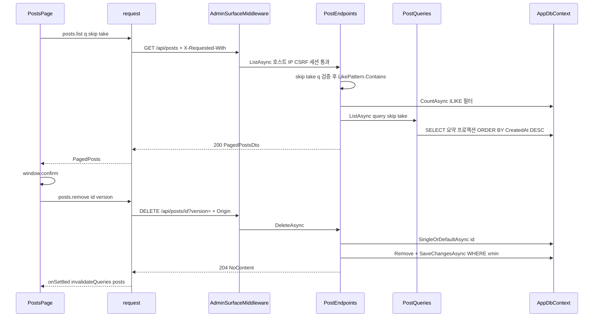
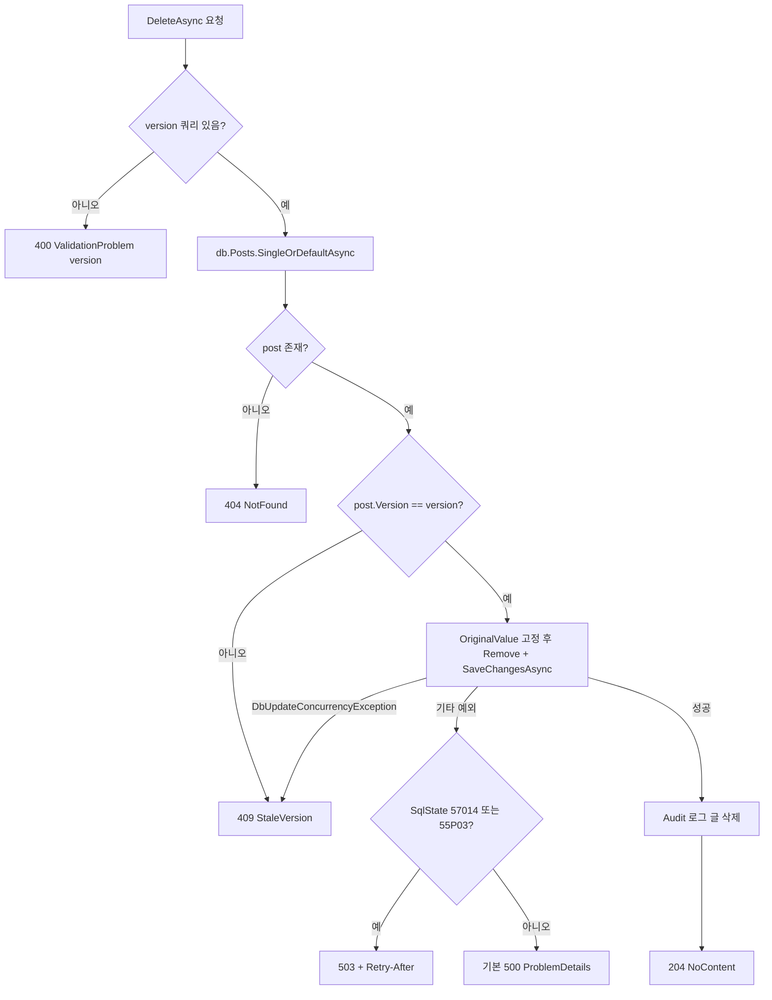
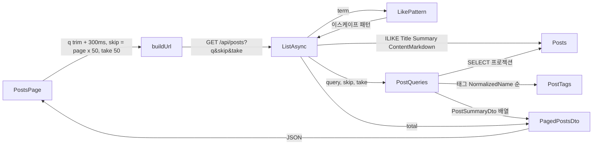

# F002 관리 글 목록 조회·삭제

<!-- doc-harness:section id="summary" hash="32fe22c0165f337a9cc2cf62c143d2bcd89ad4f86d208de095f241d211ebf48a" -->
## 한 줄 요약

결론: F002는 실제로 동작하는 핵심 기능이다. 이번 재검증에서도 이전 분석의 동작 서술·줄 번호가 현재 코드와 일치했다. 의존 목록(F001·F018·F020·F029)은 코드로 다시 확인해 그대로 유지했다. PostsPage(TanStack Query)는 posts.list·posts.remove를 거쳐 request()로 /api/posts를 호출한다. 요청이 PostEndpoints에 닿으려면 네 단계를 차례로 통과해야 한다. AdminSurfaceMiddleware(F018: 호스트·IP·CSRF 헤더·Origin), 전역 속도 제한 체인(이 엔드포인트는 무제한 파티션), /api 그룹의 RequireHost·RequireAuthorization(F001), ApiBodyLimitMiddleware다. ListAsync는 skip·take·q를 검증한다. 이어 ILIKE 검색(LikePattern으로 메타문자 이스케이프), CountAsync, PostQueries.ListAsync(본문 제외 프로젝션, CreatedAt 내림차순·Id 오름차순)를 거쳐 PagedPostsDto를 반환한다. DeleteAsync는 version 쿼리를 필수로 요구한다. 낙관적 동시성은 두 겹이다. 먼저 사전 비교(404/409)를 하고, 이어 xmin OriginalValue를 고정한다(DbUpdateConcurrencyException은 409). 삭제에 성공하면 PostTags는 DB Cascade로 함께 지워지고 Tags는 남는다. 핸들러가 잡지 않는 DB 예외는 전역 UseExceptionHandler로 전파된다. 거기서 OverloadExceptionHandler가 SqlState 57014·55P03을 503+Retry-After로 바꾸고, 나머지는 기본 500이 된다(F020). 관리용 AppDbContext 연결에는 코드상 statement_timeout 옵션이 없다. 감사 로그는 삭제에 성공했을 때만 남는다.

| 항목 | 값 |
|---|---|
| 중요도 | CORE |
| 상태 | ACTIVE |
| 진입점 | `SPA / (routes.tsx → PostsPage)`, `GET /api/posts (PostEndpoints.ListAsync, ListPosts)`, `DELETE /api/posts/{id:guid}?version= (PostEndpoints.DeleteAsync, DeletePost)` |
| 의존 기능 | [F001](../09_FEATURES.md#f001), [F018](../09_FEATURES.md#f018), [F020](../09_FEATURES.md#f020), [F029](../09_FEATURES.md#f029) |

### 진입점 근거

| 내용 | 상태 | 근거 |
|---|---|---|
| SPA 경로 '/'는 RequireAuth → Layout 아래에서 PostsPage를 렌더한다(로그인 필요). | CONFIRMED | `PortfolioBlog.Web/src/app/routes.tsx` routes (23-28) |
| GET /api/posts는 /api 그룹 아래 /posts 그룹에 ListAsync로 등록된다(이름 ListPosts). /api 그룹에는 RequireHost(adminHost)와 RequireAuthorization(PolicyName)이 걸려 있다. | CONFIRMED | `PortfolioBlog.Api/Features/ApiEndpoints.cs` ApiEndpoints.MapApiEndpoints (34-47), `PortfolioBlog.Api/Features/Posts/PostEndpoints.cs` PostEndpoints.MapPostEndpoints (39-47) |
| DELETE /api/posts/{id:guid}는 DeleteAsync로 등록된다(이름 DeletePost). version은 쿼리 매개변수(uint?)다. | CONFIRMED | `PortfolioBlog.Api/Features/Posts/PostEndpoints.cs` PostEndpoints.MapPostEndpoints (46), `PortfolioBlog.Api/Features/Posts/PostEndpoints.cs` PostEndpoints.DeleteAsync (263) |
<!-- /doc-harness:section -->

<!-- doc-harness:section id="flow" hash="8976c278403fd952bb0641638874985bc8f88db6d06c0f70c2b831fa7a507869" -->
## 처리 흐름

| 단계 | 컴포넌트 | 코드 | 설명 |
|---|---|---|---|
| 1 | routes | `PortfolioBlog.Web/src/app/routes.tsx` routes | '/' 경로가 RequireAuth·Layout 아래에서 PostsPage를 렌더한다. |
| 2 | PostsPage | `PortfolioBlog.Web/src/pages/PostsPage.tsx` PostsPage | search 상태를 trim한 뒤 useDebounced(300ms)로 q를 만든다. useQuery(queryKey ['posts','list',q,page], placeholderData keepPreviousData)로 posts.list(q, page*50, 50, signal)를 호출한다. |
| 3 | posts (endpoints.ts) | `PortfolioBlog.Web/src/api/endpoints.ts` posts.list | request<PagedPosts>('GET','/api/posts',{query:{q,skip,take},signal})를 호출한다. |
| 4 | request (client.ts) | `PortfolioBlog.Web/src/api/client.ts` request / buildUrl | buildUrl이 경로를 검사한다(/api/로 시작해야 하고, //·\·..·%2e·제어 문자는 거부). null·undefined·'' 쿼리 값을 빼고 URL을 조립한다. X-Requested-With: XMLHttpRequest 헤더를 붙이고 credentials same-origin, cache no-store, redirect error로 fetch한다. |
| 5 | AdminSurfaceMiddleware | `PortfolioBlog.Api/Infrastructure/Access/AdminSurfaceMiddleware.cs` AdminSurfaceMiddleware.InvokeAsync | /api 요청에 Cache-Control no-store를 붙인다. 이어 호스트(404)·IP 정책(403)·CSRF 헤더(403)·GET/HEAD가 아닌 메서드의 Origin(403)을 순서대로 검사한다. 파이프라인상 UseRateLimiter·UseAuthentication·UseAuthorization보다 앞이다(Program.cs 104-107). |
| 6 | RateLimitingExtensions | `PortfolioBlog.Api/Infrastructure/Web/RateLimitingExtensions.cs` BuildChain / Matches | 전역 제한 체인이 돌지만 ListPosts·DeletePost에는 RateLimitMetadata가 없다. 따라서 모든 제한기가 GetNoLimiter("none")로 통과시킨다. |
| 7 | ApiEndpoints | `PortfolioBlog.Api/Features/ApiEndpoints.cs` MapApiEndpoints | 라우팅 단계에서 RequireHost(adminHost)를 적용하고, UseAuthorization에서 세션 정책(RequireAuthorization)을 적용한다. 세션이 없으면 401이다(F001). |
| 8 | ApiBodyLimitMiddleware | `PortfolioBlog.Api/Infrastructure/Web/ApiBodyLimitMiddleware.cs` ApiBodyLimitMiddleware.InvokeAsync | 인가 뒤에 실행된다. /api 엔드포인트의 Content-Length가 JSON 상한을 넘으면 413을 준다. 그렇지 않으면 본문 스트림을 LengthLimitedStream으로 감싸고 통과시킨다. GET·DELETE는 보통 본문이 없어 그대로 통과한다. |
| 9 | PostEndpoints | `PortfolioBlog.Api/Features/Posts/PostEndpoints.cs` PostEndpoints.ListAsync | skip<0, take∉[1,200], q의 NUL 포함, trim한 q 길이>100을 ValidationErrors에 모은다. 오류가 있으면 400 ValidationProblem을 돌려준다. |
| 10 | PostEndpoints | `PortfolioBlog.Api/Features/Posts/PostEndpoints.cs` PostEndpoints.ListAsync | term이 비어 있지 않으면 LikePattern.Contains로 이스케이프한 패턴을 만든다. 이 패턴으로 Title·Summary·ContentMarkdown에 EF.Functions.ILike(…, LikePattern.Escape) OR 필터를 건다. |
| 11 | PostEndpoints | `PortfolioBlog.Api/Features/Posts/PostEndpoints.cs` PostEndpoints.ListAsync | query.CountAsync(ct)로 필터를 적용한 전체 건수를 먼저 구한다. |
| 12 | PostQueries | `PortfolioBlog.Api/Infrastructure/Data/PostQueries.cs` PostQueries.ListAsync | AsNoTracking, OrderByDescending(CreatedAt).ThenBy(Id), Skip/Take, 본문을 뺀 익명 프로젝션(태그는 NormalizedName 순의 Tag.Name)을 거쳐 PostSummaryDto[]를 만든다. |
| 13 | PostEndpoints | `PortfolioBlog.Api/Features/Posts/PostEndpoints.cs` PostEndpoints.ListAsync | TypedResults.Ok(new PagedPostsDto(items, total))로 200을 반환한다. |
| 14 | PostsPage | `PortfolioBlog.Web/src/pages/PostsPage.tsx` PostsPage | 표에 제목(편집 링크 /posts/{id})·/posts/{slug}·태그·수정 시각을 그리고, total로 lastPage를 계산한다. list.data가 있고 page>lastPage이면 렌더 중에 setPage(lastPage)로 보정한다. |
| 15 | PostsPage | `PortfolioBlog.Web/src/pages/PostsPage.tsx` confirmRemove | 삭제 버튼을 누르면 window.confirm으로 확인한 뒤 remove.mutate(post)를 실행한다. 취소하면 요청하지 않는다. |
| 16 | posts (endpoints.ts) | `PortfolioBlog.Web/src/api/endpoints.ts` posts.remove | request<void>('DELETE', `/api/posts/${encodeURIComponent(id)}`, {query:{version}})를 호출한다. 이 요청도 5~8단계를 거친다. GET이 아니므로 AdminSurfaceMiddleware의 Origin 검사도 받는다. |
| 17 | PostEndpoints | `PortfolioBlog.Api/Features/Posts/PostEndpoints.cs` PostEndpoints.DeleteAsync | version이 null이면 400(키 version)을 돌려준다. db.Posts.SingleOrDefaultAsync로 글을 읽어 없으면 404, post.Version != version이면 409(StaleVersion)를 돌려준다. |
| 18 | PostEndpoints | `PortfolioBlog.Api/Features/Posts/PostEndpoints.cs` PostEndpoints.DeleteAsync | Version의 OriginalValue를 요청 version으로 고정한 뒤 db.Posts.Remove와 SaveChangesAsync를 실행한다(DELETE … WHERE xmin = version). DbUpdateConcurrencyException이 나면 409를 돌려준다. |
| 19 | AppDbContext | `PortfolioBlog.Api/Infrastructure/Data/AppDbContext.cs` AppDbContext.OnModelCreating | PostTag→Post FK의 OnDelete(Cascade)로 링크 행이 DB에서 함께 지워진다. Tags 행은 남는다. |
| 20 | PostEndpoints | `PortfolioBlog.Api/Features/Posts/PostEndpoints.cs` PostEndpoints.DeleteAsync | PortfolioBlog.Api.Audit 로거에 '글 삭제. PostId Slug'를 남기고 204를 반환한다. |
| 21 | PostsPage | `PortfolioBlog.Web/src/pages/PostsPage.tsx` remove.onSettled | 성공·실패와 관계없이 invalidateQueries(['posts'])로 목록을 다시 조회한다. 실패는 ErrorNotice(remove.error)로 표시한다. |
<!-- /doc-harness:section -->

<!-- doc-harness:section id="F002_SEQUENCE" hash="f6a5a0ae37d3b55fae89e9b9a5c0ae19a813510aedfac40665de1a8baeabd693" -->
## 관리 글 목록 조회와 삭제 호출 순서 (Sequence Diagram)

목록과 삭제 모두 PostsPage → request → AdminSurfaceMiddleware → PostEndpoints → AppDbContext 순으로 흐른다. 삭제에 성공하면 onSettled가 목록을 다시 조회한다.

AdminSurfaceMiddleware와 PostEndpoints 사이에는 UseRateLimiter(무제한 파티션), UseAuthentication/UseAuthorization(세션 정책), ApiBodyLimitMiddleware가 있다. 다이어그램을 단순하게 두려고 이들을 한 화살표로 묶었다. 목록 조회는 CountAsync와 PostQueries.ListAsync, 두 번의 SELECT를 순차로 실행한다. 삭제는 사전 SELECT로 존재와 version을 비교한 뒤, OriginalValue를 고정한 DELETE를 실행한다. 이 DELETE가 WHERE xmin 조건으로 경쟁을 잡는다.

### 코드 근거

| 구성 요소 | 코드 |
|---|---|
| PostsPage | `PortfolioBlog.Web/src/pages/PostsPage.tsx` (PostsPage) |
| request | `PortfolioBlog.Web/src/api/client.ts` (request) |
| AdminSurfaceMiddleware | `PortfolioBlog.Api/Infrastructure/Access/AdminSurfaceMiddleware.cs` (AdminSurfaceMiddleware.InvokeAsync) |
| PostEndpoints | `PortfolioBlog.Api/Features/Posts/PostEndpoints.cs` (ListAsync / DeleteAsync) |
| PostQueries | `PortfolioBlog.Api/Infrastructure/Data/PostQueries.cs` (PostQueries.ListAsync) |
| AppDbContext | `PortfolioBlog.Api/Infrastructure/Data/AppDbContext.cs` (AppDbContext) |
<!-- /doc-harness:section -->

<!-- doc-harness:section id="F002_FLOW_DELETE" hash="94c7dce19628d57d9815528efef3e3877e5dba4630c2aad219497b17489c4a6b" -->
## DeleteAsync 분기(400/404/409/204/503/500) (Flowchart)

DeleteAsync는 version 누락(400), 글 없음(404), version 불일치 또는 동시성 예외(409), 성공(204)으로 갈린다. 그 밖의 DB 예외는 전역 처리기에서 503이나 500이 된다.

400·404·409·204는 PostEndpoints.DeleteAsync 안에서 결정된다(263-285행). StaleVersion은 DbConflict.Problem으로 409 ProblemDetails를 만든다. 동시성 외의 예외는 핸들러에서 잡지 않는다. 이 예외는 Program.cs의 UseExceptionHandler로 전파되고, OverloadExceptionHandler.IsOverload가 InnerException 체인을 훑어 57014·55P03이면 503을 쓴다. 500 분기는 AddProblemDetails 기본 동작에서 추론한 것이다.

### 코드 근거

| 구성 요소 | 코드 |
|---|---|
| DeleteAsync | `PortfolioBlog.Api/Features/Posts/PostEndpoints.cs` (PostEndpoints.DeleteAsync) |
| StaleVersion | `PortfolioBlog.Api/Features/Posts/PostEndpoints.cs` (PostEndpoints.StaleVersion) |
| SaveChangesAsync | `PortfolioBlog.Api/Features/Posts/PostEndpoints.cs` (PostEndpoints.DeleteAsync) |
| OverloadExceptionHandler | `PortfolioBlog.Api/Infrastructure/Web/OverloadExceptionHandler.cs` (OverloadExceptionHandler.IsOverload) |
<!-- /doc-harness:section -->

<!-- doc-harness:section id="F002_DATAFLOW" hash="64506faf6f1a903517567fbe3852cae1825af0c51dda083e7889fa1ac2f51e34" -->
## 목록 조회 데이터 변환 (Data Flow Diagram)

검색어와 쪽 번호가 쿼리 문자열이 되고, 서버에서 이스케이프된 ILIKE 필터와 본문 제외 프로젝션을 거쳐 PagedPostsDto JSON으로 돌아온다.

buildUrl은 빈 q를 쿼리에서 뺀다. ListAsync는 q를 Trim한 뒤 LikePattern.Contains로 \·%·_를 이스케이프하고, Title·Summary·ContentMarkdown에 OR ILIKE를 건다. PostQueries.ListAsync는 ContentMarkdown을 프로젝션에서 빼고 PostTags→Tags를 NormalizedName 순으로 Name 배열로 만든다. total은 같은 필터 쿼리의 CountAsync 결과다.

### 코드 근거

| 구성 요소 | 코드 |
|---|---|
| PostsPage | `PortfolioBlog.Web/src/pages/PostsPage.tsx` (PostsPage) |
| buildUrl | `PortfolioBlog.Web/src/api/client.ts` (buildUrl) |
| ListAsync | `PortfolioBlog.Api/Features/Posts/PostEndpoints.cs` (PostEndpoints.ListAsync) |
| LikePattern | `PortfolioBlog.Api/Infrastructure/Data/LikePattern.cs` (LikePattern.Contains) |
| PostQueries | `PortfolioBlog.Api/Infrastructure/Data/PostQueries.cs` (PostQueries.ListAsync) |
| Posts | `PortfolioBlog.Api/Infrastructure/Data/AppDbContext.cs` (AppDbContext.Posts) |
| PostTags | `PortfolioBlog.Api/Infrastructure/Data/AppDbContext.cs` (PostTag) |
| PagedPostsDto | `PortfolioBlog.Api/Contracts/PostDtos.cs` (PagedPostsDto) |
<!-- /doc-harness:section -->

<!-- doc-harness:section id="data" hash="067b6e93848b5217cbdf8b5dc70d47121242c9dcf37579c0cc1ccffc65a733dd" -->
## 데이터

### 데이터 흐름

| 내용 | 상태 | 근거 |
|---|---|---|
| 목록 입력: 검색창 값은 trim과 300ms 디바운스를 거쳐 q가 되고, page는 skip=page*50·take=50이 된다. buildUrl은 값이 ''·null·undefined인 쿼리를 빼므로 빈 검색어는 q 없이 전송된다. | CONFIRMED | `PortfolioBlog.Web/src/pages/PostsPage.tsx` (10-22), `PortfolioBlog.Web/src/api/client.ts` buildUrl (31-37) |
| 서버 목록 변환: q는 Trim을 거쳐 LikePattern.Contains(\ → \\, % → \%, _ → \_, 앞뒤 %)로 이스케이프된 뒤 ILIKE 매개변수가 된다. Post 엔티티는 본문을 뺀 익명 프로젝션을 거쳐 PostSummaryDto 배열이 된다(필드: Id, Slug, Title, Summary, Tags[], SeriesId, SeriesOrder, CreatedAt, UpdatedAt, Version). 이 배열은 total과 함께 PagedPostsDto로 직렬화된다. | CONFIRMED | `PortfolioBlog.Api/Features/Posts/PostEndpoints.cs` PostEndpoints.ListAsync (69-85), `PortfolioBlog.Api/Infrastructure/Data/LikePattern.cs` LikePattern.Contains (30-33), `PortfolioBlog.Api/Infrastructure/Data/PostQueries.cs` PostQueries.ListAsync (59-71), `PortfolioBlog.Api/Contracts/PostDtos.cs` |
| Version은 PostgreSQL xmin 시스템 컬럼이다(uint, IsRowVersion). 클라이언트는 목록 응답의 version을 PostSummary.version(number)으로 보관한다. 삭제할 때 이 값이 ?version= 쿼리로 돌아와 DELETE의 WHERE xmin 비교값이 된다. | CONFIRMED | `PortfolioBlog.Api/Infrastructure/Data/AppDbContext.cs` (96), `PortfolioBlog.Web/src/pages/PostsPage.tsx` (23-26), `PortfolioBlog.Web/src/api/endpoints.ts` posts.remove (22), `PortfolioBlog.Api/Features/Posts/PostEndpoints.cs` PostEndpoints.DeleteAsync (271-277), `PortfolioBlog.Web/src/test/lists.test.tsx` (11-20) |
| 오류 응답(ProblemDetails/ValidationProblem)은 toApiError가 ApiError(status, title, detail, fieldErrors, retryAfterSeconds)로 바꾼다. describeError가 이를 상태별 한국어 문구로 바꾸고, ErrorNotice가 텍스트 노드로 표시한다. | CONFIRMED | `PortfolioBlog.Web/src/api/errors.ts` (54-84), `PortfolioBlog.Web/src/components/notices.tsx` |
| 핸들러가 결과 본문 없이 끝낸 /api 오류(상태 코드만 설정된 응답)도 ProblemDetails 본문을 받는다. 경로는 UseStatusCodePages(ErrorResponses.HandleStatusCodeAsync) → ErrorResponses.WriteAsync → IProblemDetailsService.TryWriteAsync다(/api는 MachinePrefixes에 속한다). | CONFIRMED | `PortfolioBlog.Api/Program.cs` (101), `PortfolioBlog.Api/Infrastructure/Web/ErrorResponses.cs` ErrorResponses.HandleStatusCodeAsync / WriteAsync (17, 30, 45-50) |

### DB 접근

| 엔티티 | 작업 | 코드 |
|---|---|---|
| Posts | SELECT | `PortfolioBlog.Api/Features/Posts/PostEndpoints.cs` PostEndpoints.ListAsync (query.CountAsync) |
| Posts, PostTags, Tags | SELECT | `PortfolioBlog.Api/Infrastructure/Data/PostQueries.cs` PostQueries.ListAsync |
| Posts | SELECT | `PortfolioBlog.Api/Features/Posts/PostEndpoints.cs` PostEndpoints.DeleteAsync (SingleOrDefaultAsync) |
| Posts | DELETE | `PortfolioBlog.Api/Features/Posts/PostEndpoints.cs` PostEndpoints.DeleteAsync (SaveChangesAsync, WHERE xmin) |
| PostTags | DELETE | `PortfolioBlog.Api/Infrastructure/Data/AppDbContext.cs` AppDbContext.OnModelCreating (PostTag→Post OnDelete Cascade) |

### 상태 전이

| 이전 | 다음 | 트리거 | 근거 |
|---|---|---|---|
| Post 행 존재(xmin = v) | Post 행 삭제 + PostTags 링크 Cascade 삭제(Tags 유지) | DELETE /api/posts/{id}?version=v에서 version이 현재 xmin과 일치 | `PortfolioBlog.Api/Features/Posts/PostEndpoints.cs` PostEndpoints.DeleteAsync (263-285), `PortfolioBlog.Api/Infrastructure/Data/AppDbContext.cs` (134-140), `PortfolioBlog.Api.Tests/Features/PostEndpointsTests.cs` Delete_RequiresCurrentVersion_ThenReturns204_AndKeepsTags (235-255) |
| PostsPage page = N | page = lastPage | list.data가 있고 page > lastPage(마지막 쪽 삭제 등으로 total 감소) | `PortfolioBlog.Web/src/pages/PostsPage.tsx` (33-38), `PortfolioBlog.Web/src/test/lists.test.tsx` (29-54) |
| PostsPage page = N | page = 0 | 검색 입력 onChange | `PortfolioBlog.Web/src/pages/PostsPage.tsx` (44-45) |
| PostsPage page = N | page = N±1 | '이전'(page>0)·'다음'(page<lastPage) 버튼 | `PortfolioBlog.Web/src/pages/PostsPage.tsx` (66-70) |
| ME_KEY authenticated=true | ME_KEY authenticated=false(RequireAuth가 로그인 화면으로 전환) | 목록 조회나 삭제에서 ApiError 401 수신(QueryCache/MutationCache onError) | `PortfolioBlog.Web/src/app/queryClient.ts` noteAuthFailure (11-18) |

### 외부 의존

| 내용 | 상태 | 근거 |
|---|---|---|
| PostgreSQL(Npgsql EF Core): EF.Functions.ILike, xmin 행 버전, FK Cascade에 의존한다. 관리 컨텍스트 AppDbContext는 ConnectionStrings:Default로 UseNpgsql만 설정하고 statement_timeout 옵션은 붙이지 않는다. 시간 제한 옵션은 공개 PublicDbContext만 BuildConnectionString(StatementTimeoutMs)으로 붙인다. | CONFIRMED | `PortfolioBlog.Api/Features/Posts/PostEndpoints.cs` (79-81), `PortfolioBlog.Api/Infrastructure/Data/AppDbContext.cs` (96, 138), `PortfolioBlog.Api/Infrastructure/Data/DataServiceCollectionExtensions.cs` AddBlogData (32-36) |
| 클라이언트는 @tanstack/react-query(useQuery/useMutation/keepPreviousData)와 react-router(Link)를 쓰고, 브라우저 fetch와 window.confirm에 의존한다. | CONFIRMED | `PortfolioBlog.Web/src/pages/PostsPage.tsx` (1-3, 30), `PortfolioBlog.Web/src/api/client.ts` (60-62) |
<!-- /doc-harness:section -->

<!-- doc-harness:section id="failures" hash="0dcae82dc90cec2411f557dc762eab44b27a01ecdecffe6e9b39946ad92c514a" -->
## 실패 지점

| 위치 | 조건 | 처리 | 상태 | 근거 |
|---|---|---|---|---|
| PostEndpoints.ListAsync | skip<0, take<1 또는 >200, q에 NUL 포함, trim한 q 길이>100 | ValidationErrors에 필드별로 모아 400 ValidationProblem(키 skip/take/q)을 반환한다. | CONFIRMED | `PortfolioBlog.Api/Features/Posts/PostEndpoints.cs` (66-73), `PortfolioBlog.Api.Tests/Features/PostEndpointsTests.cs` (291-319) |
| GET /api/posts · DELETE /api/posts/{id} 매개변수 바인딩 | take=abc처럼 int/uint로 해석할 수 없는 쿼리 값(version=abc 포함) | RouteHandlerOptions.ThrowOnBadRequest=false라서 예외 대신 프레임워크가 400으로 응답한다. take=abc는 테스트로 확인했다. version 비숫자 값도 같은 규칙을 따를 것으로 추론한다(전용 테스트 없음). | CONFIRMED | `PortfolioBlog.Api/Program.cs` (48-49), `PortfolioBlog.Api.Tests/Features/PostEndpointsTests.cs` List_InvalidPaging_Returns400 (286-296) |
| PostEndpoints.ListAsync (CountAsync / PostQueries.ListAsync) | DB 연결 실패·타임아웃 등 DB 예외 | 핸들러에서는 처리하지 않고 전역 UseExceptionHandler로 전파된다. 예외 체인에 PostgresException 57014·55P03이 있으면 OverloadExceptionHandler가 503과 Retry-After를 쓴다. 그 밖의 예외는 AddProblemDetails 기반의 기본 500 응답이 된다(프레임워크 기본 동작 추론). | POTENTIAL_ISSUE | `PortfolioBlog.Api/Features/Posts/PostEndpoints.cs` (83-85), `PortfolioBlog.Api/Program.cs` (43, 47, 100), `PortfolioBlog.Api/Infrastructure/Web/OverloadExceptionHandler.cs` OverloadExceptionHandler.TryHandleAsync (35-42, 63-70) |
| PostEndpoints.DeleteAsync | version 쿼리가 없음 | 400 ValidationProblem(키 version)을 반환한다. | CONFIRMED | `PortfolioBlog.Api/Features/Posts/PostEndpoints.cs` (265-268), `PortfolioBlog.Api.Tests/Features/PostEndpointsTests.cs` (235-255) |
| PostEndpoints.DeleteAsync | id에 해당하는 글이 없음(이미 삭제됨) | 404 NotFound를 반환한다(본문은 UseStatusCodePages가 ProblemDetails로 채운다). 클라이언트는 '대상을 찾을 수 없습니다. 이미 삭제되었을 수 있습니다.'를 표시한다. | CONFIRMED | `PortfolioBlog.Api/Features/Posts/PostEndpoints.cs` (269-270), `PortfolioBlog.Web/src/api/errors.ts` (76), `PortfolioBlog.Api.Tests/Features/PostEndpointsTests.cs` (235-255) |
| PostEndpoints.DeleteAsync (사전 비교) | post.Version != version(목록 조회 뒤 다른 곳에서 수정됨) | StaleVersion()이 DbConflict.Problem으로 409 ProblemDetails를 반환한다(title '충돌', detail '다른 곳에서 이 글이 먼저 수정되었습니다…'). | CONFIRMED | `PortfolioBlog.Api/Features/Posts/PostEndpoints.cs` (271, 366-367), `PortfolioBlog.Api/Infrastructure/Data/DbConflict.cs` (50-51), `PortfolioBlog.Api.Tests/Features/PostEndpointsTests.cs` (235-255) |
| PostEndpoints.DeleteAsync (SaveChangesAsync) | 사전 비교와 저장 사이에 다른 요청이 글을 수정·삭제해 WHERE xmin 조건에 맞는 행이 0개임 → DbUpdateConcurrencyException | catch해서 StaleVersion() 409를 반환한다. | CONFIRMED | `PortfolioBlog.Api/Features/Posts/PostEndpoints.cs` (273-282) |
| PostEndpoints.DeleteAsync (SaveChangesAsync) | 동시성 외의 DbUpdateException 또는 DB 연결 예외 | 처리 없음(예외 전파). 전역 예외 처리기가 받아, 체인에 57014·55P03이 있으면 503+Retry-After, 없으면 기본 500이 된다. 명시적 트랜잭션이 없으므로 SaveChangesAsync 내부 트랜잭션이 롤백되는 것으로 추론한다(EF 기본 동작). | POTENTIAL_ISSUE | `PortfolioBlog.Api/Features/Posts/PostEndpoints.cs` (275-282), `PortfolioBlog.Api/Infrastructure/Web/OverloadExceptionHandler.cs` OverloadExceptionHandler.IsOverload (56-70) |
| AdminSurfaceMiddleware | 관리 호스트가 아님(404), 허용되지 않은 IP(403), X-Requested-With 헤더 누락(403), DELETE 요청의 Origin이 관리 origin과 다름(403) | 본문을 읽지 않고 즉시 Reject(Results.Problem)로 응답한다. client.ts는 CSRF 헤더를 항상 붙인다. | CONFIRMED | `PortfolioBlog.Api/Infrastructure/Access/AdminSurfaceMiddleware.cs` AdminSurfaceMiddleware.InvokeAsync (67-96, 112-113), `PortfolioBlog.Web/src/api/client.ts` (16-18, 47) |
| /api 그룹 RequireAuthorization | 세션이 없거나 만료됨 → 401 | noteAuthFailure가 ME_KEY를 authenticated=false로 바꾸고, RequireAuth가 로그인 화면으로 전환한다. | CONFIRMED | `PortfolioBlog.Api/Features/ApiEndpoints.cs` (39), `PortfolioBlog.Web/src/app/queryClient.ts` (11-18) |
| ApiBodyLimitMiddleware | /api 요청의 Content-Length가 JSON 상한을 넘음(GET·DELETE에 비정상적으로 큰 본문을 붙인 경우) | 413을 설정하고 ErrorResponses.WriteAsync로 ProblemDetails를 쓴다. SPA의 목록·삭제 호출은 본문을 보내지 않으므로 정상 경로에서는 발생하지 않는다. | CONFIRMED | `PortfolioBlog.Api/Infrastructure/Web/ApiBodyLimitMiddleware.cs` ApiBodyLimitMiddleware.InvokeAsync (36-56), `PortfolioBlog.Api/Program.cs` (108) |
| request (client.ts) | fetch 자체 실패(네트워크) | ApiError(0,'네트워크 오류')로 바꾼다. AbortError(쿼리 취소)는 그대로 다시 던진다. | CONFIRMED | `PortfolioBlog.Web/src/api/client.ts` (59-67) |
| request (client.ts) | 2xx인데 본문이 JSON이 아님 | ApiError(status,'응답을 해석할 수 없습니다')를 던진다. | CONFIRMED | `PortfolioBlog.Web/src/api/client.ts` (69-75) |
| PostsPage list 조회 실패 | list.error 존재 | ErrorNotice에 메시지와 '다시 시도'(list.refetch) 버튼을 보여 준다. 자동 재시도는 없다(retry:false). 503·429이면 Retry-After 초를 문구에 붙인다. | CONFIRMED | `PortfolioBlog.Web/src/pages/PostsPage.tsx` (48), `PortfolioBlog.Web/src/app/queryClient.ts` (19-24), `PortfolioBlog.Web/src/api/errors.ts` (70, 80-81) |
| PostsPage remove 실패 | remove.error 존재(400/404/409 등) | ErrorNotice로 표시하고, onSettled에서 ['posts']를 무효화해 목록(새 version)을 다시 받는다. 재시도 버튼은 없다(mutations retry:false). | CONFIRMED | `PortfolioBlog.Web/src/pages/PostsPage.tsx` (23-26, 49), `PortfolioBlog.Web/src/app/queryClient.ts` (23) |

### 엣지 케이스

| 내용 | 상태 | 근거 |
|---|---|---|
| 두 탭이 같은 version으로 동시에 삭제하면 둘 다 사전 비교를 통과할 수 있다. 이때 늦은 쪽의 DELETE … WHERE xmin은 0행에 맞아 DbUpdateConcurrencyException → 409('먼저 수정되었습니다')가 된다. 이미 삭제된 상황인데도 404가 아니라 409 문구가 나온다. 테스트는 순차 재삭제(404)만 다룬다. | INFERRED | `PortfolioBlog.Api/Features/Posts/PostEndpoints.cs` (269-282), `PortfolioBlog.Api.Tests/Features/PostEndpointsTests.cs` (235-255) |
| CountAsync와 PostQueries.ListAsync는 한 트랜잭션·스냅샷으로 묶이지 않은 별도 쿼리다. 그 사이에 글이 생성·삭제되면 total과 items가 어긋날 수 있다. 쪽 범위를 넘는 경우 일부는 클라이언트의 page>lastPage 보정이 흡수한다. | POTENTIAL_ISSUE | `PortfolioBlog.Api/Features/Posts/PostEndpoints.cs` (83-84), `PortfolioBlog.Web/src/pages/PostsPage.tsx` (33-38) |
| 마지막 쪽의 마지막 글을 지워 total이 줄면 서버는 그 skip에 빈 목록을 준다. PostsPage는 list.data가 있을 때만 page>lastPage를 검사하고, 렌더 중에 setPage(lastPage)로 되돌린다(첫 로딩 때 total=0으로 오탐하는 것을 막는다). | CONFIRMED | `PortfolioBlog.Web/src/pages/PostsPage.tsx` (35-38), `PortfolioBlog.Web/src/test/lists.test.tsx` (29-54) |
| LikePattern이 검색어의 %, _, \를 이스케이프하므로 이 문자들은 리터럴로만 매칭된다(와일드카드 전체 매칭과 의도하지 않은 매칭을 막는다). | CONFIRMED | `PortfolioBlog.Api/Infrastructure/Data/LikePattern.cs` (30-33), `PortfolioBlog.Api.Tests/Features/PostEndpointsTests.cs` List_PagesNewestFirst_SearchesTitleSummaryContent_AndTreatsWildcardsLiterally (259-281) |
| 검색 입력은 onChange 즉시 page를 0으로 되돌리지만, q는 300ms 뒤에야 바뀐다. 그 사이 ['posts','list',이전 q,0] 조회가 한 번 더 나갈 수 있다. keepPreviousData라서 화면은 이전 데이터를 유지한다. | INFERRED | `PortfolioBlog.Web/src/pages/PostsPage.tsx` (15-22, 44-45), `PortfolioBlog.Web/src/lib/useDebounced.ts` |
| remove.isPending 동안에는 모든 행의 삭제 버튼이 비활성화되어 한 번에 한 건만 삭제할 수 있다. remove.error는 다음 mutation 전까지 계속 표시된다. | CONFIRMED | `PortfolioBlog.Web/src/pages/PostsPage.tsx` (49, 59) |
| 클라이언트 입력창 maxLength=LIMITS.queryMax와 서버 MaxQueryLength(100)는 같은 상한을 쓴다. 서버는 trim한 뒤 길이를 잰다. | CONFIRMED | `PortfolioBlog.Web/src/lib/validation.ts`, `PortfolioBlog.Web/src/pages/PostsPage.tsx` (44), `PortfolioBlog.Api/Features/Posts/PostEndpoints.cs` (27, 69-72) |
| skip에는 상한이 없다. 매우 큰 skip은 빈 items와 정상 total로 200을 반환한다(int 범위 안). | INFERRED | `PortfolioBlog.Api/Features/Posts/PostEndpoints.cs` (67, 84) |
| 삭제는 RenderedPostCache를 건드리지 않는다. 그러나 공개 PostModel이 PublicQueries.GetPostAsync로 DB를 먼저 조회하고 없으면 NotFound를 반환한다. 따라서 삭제된 글은 공개 페이지에서 즉시 404가 되고, 남은 캐시 항목은 쓰이지 않는다. | CONFIRMED | `PortfolioBlog.Api/Features/Posts/PostEndpoints.cs` (263-285), `PortfolioBlog.Api/Pages/Post.cshtml.cs` PostModel (48-49) |
| 삭제 확인 수단은 window.confirm뿐이다. 되돌리기(휴지통·소프트 삭제)는 없고 Posts 행을 물리 삭제한다. 확인 문구도 되돌릴 수 없다고 알린다. confirm을 취소하면 DELETE를 보내지 않는다(테스트). | CONFIRMED | `PortfolioBlog.Web/src/pages/PostsPage.tsx` (28-31), `PortfolioBlog.Api/Features/Posts/PostEndpoints.cs` (274), `PortfolioBlog.Web/src/test/lists.test.tsx` (11-20) |
| 서버가 준 제목 등의 문자열은 JSX 텍스트로만 들어가고 HTML로 해석되지 않는다(XSS 문자열 제목 테스트가 있다). | CONFIRMED | `PortfolioBlog.Web/src/pages/PostsPage.tsx` (56), `PortfolioBlog.Web/src/test/lists.test.tsx` (22-27) |
| ContentMarkdown ILIKE 검색용 trigram/GIN 인덱스가 없다. Posts의 인덱스는 Slug, (CreatedAt,Id), (SeriesId,SeriesOrder,CreatedAt,Id)뿐이다. 관리 연결에는 코드상 statement_timeout도 없고 /api/posts에 속도 제한도 없다. 그래서 본문 검색 비용을 코드로 제한하는 장치가 보이지 않는다(관찰). | POTENTIAL_ISSUE | `PortfolioBlog.Api/Infrastructure/Data/AppDbContext.cs` (96-99), `PortfolioBlog.Api/Infrastructure/Data/DataServiceCollectionExtensions.cs` (32), `PortfolioBlog.Api/Infrastructure/Web/RateLimitingExtensions.cs` (88, 128-129) |
| ListPosts·DeletePost 엔드포인트에는 RateLimitMetadata가 없다. 따라서 전역 제한 체인(BuildChain)의 파티션 선택기가 GetNoLimiter("none")를 고르고, 이 기능은 429를 받지 않는다. | CONFIRMED | `PortfolioBlog.Api/Infrastructure/Web/RateLimitingExtensions.cs` (128-129, 150, 170), `PortfolioBlog.Api/Features/Posts/PostEndpoints.cs` (39-47) |

### 로깅

| 내용 | 상태 | 근거 |
|---|---|---|
| 삭제에 성공했을 때만 'PortfolioBlog.Api.Audit' 카테고리에 Information 로그 '글 삭제. PostId={PostId} Slug={Slug}'를 남긴다(본문은 기록하지 않는다). | CONFIRMED | `PortfolioBlog.Api/Features/Posts/PostEndpoints.cs` (283) |
| 목록 조회와 삭제의 400/404/409 경로에는 핸들러 수준 로그가 없다. 잡지 않은 예외의 로깅은 전역 UseExceptionHandler(프레임워크) 소관이다. OverloadExceptionHandler는 로그를 남기지 않고 503 응답만 쓴다. | CONFIRMED | `PortfolioBlog.Api/Features/Posts/PostEndpoints.cs` (64-86, 263-282), `PortfolioBlog.Api/Program.cs` (100), `PortfolioBlog.Api/Infrastructure/Web/OverloadExceptionHandler.cs` (35-42) |
<!-- /doc-harness:section -->

<!-- doc-harness:section id="code" hash="5e7ef5170ca2e6af4e0325cd64150074a42cae9aa66db80fbc396db6f4d6addc" -->
## 관련 코드

| 파일 | 심볼 | 역할 |
|---|---|---|
| `PortfolioBlog.Web/src/app/routes.tsx` | routes | entry |
| `PortfolioBlog.Web/src/pages/PostsPage.tsx` | PostsPage | render |
| `PortfolioBlog.Web/src/api/endpoints.ts` | posts.list / posts.remove | service |
| `PortfolioBlog.Web/src/api/client.ts` | request / buildUrl | service |
| `PortfolioBlog.Web/src/api/errors.ts` | ApiError / toApiError / describeError | validation |
| `PortfolioBlog.Web/src/app/queryClient.ts` | createQueryClient / noteAuthFailure | config |
| `PortfolioBlog.Web/src/components/notices.tsx` | ErrorNotice / Loading | render |
| `PortfolioBlog.Web/src/lib/useDebounced.ts` | useDebounced / formatDateTime | service |
| `PortfolioBlog.Web/src/lib/validation.ts` | LIMITS.queryMax | validation |
| `PortfolioBlog.Web/src/api/types.ts` | PostSummary / PagedPosts | dto |
| `PortfolioBlog.Api/Program.cs` | 미들웨어 파이프라인(UseExceptionHandler·UseStatusCodePages·AdminSurfaceMiddleware·UseRateLimiter·UseAuthorization·ApiBodyLimitMiddleware) | config |
| `PortfolioBlog.Api/Features/ApiEndpoints.cs` | ApiEndpoints.MapApiEndpoints | entry |
| `PortfolioBlog.Api/Features/Posts/PostEndpoints.cs` | PostEndpoints.ListAsync | entry |
| `PortfolioBlog.Api/Features/Posts/PostEndpoints.cs` | PostEndpoints.DeleteAsync | entry |
| `PortfolioBlog.Api/Features/Posts/PostEndpoints.cs` | PostEndpoints.StaleVersion | validation |
| `PortfolioBlog.Api/Infrastructure/Data/PostQueries.cs` | PostQueries.ListAsync | data |
| `PortfolioBlog.Api/Infrastructure/Data/LikePattern.cs` | LikePattern.Contains | data |
| `PortfolioBlog.Api/Infrastructure/Data/DbConflict.cs` | DbConflict.Problem | validation |
| `PortfolioBlog.Api/Contracts/TextRules.cs` | TextRules.ContainsNul | validation |
| `PortfolioBlog.Api/Contracts/PostDtos.cs` | PostSummaryDto / PagedPostsDto | dto |
| `PortfolioBlog.Api/Infrastructure/Data/AppDbContext.cs` | AppDbContext.OnModelCreating | data |
| `PortfolioBlog.Api/Infrastructure/Data/DataServiceCollectionExtensions.cs` | AddBlogData | config |
| `PortfolioBlog.Api/Infrastructure/Access/AdminSurfaceMiddleware.cs` | AdminSurfaceMiddleware.InvokeAsync | validation |
| `PortfolioBlog.Api/Infrastructure/Web/ApiBodyLimitMiddleware.cs` | ApiBodyLimitMiddleware.InvokeAsync | validation |
| `PortfolioBlog.Api/Infrastructure/Web/OverloadExceptionHandler.cs` | OverloadExceptionHandler.TryHandleAsync / IsOverload | validation |
| `PortfolioBlog.Api/Infrastructure/Web/ErrorResponses.cs` | ErrorResponses.HandleStatusCodeAsync / WriteAsync | render |
| `PortfolioBlog.Api/Infrastructure/Web/RateLimitingExtensions.cs` | BuildChain / Matches | config |
| `PortfolioBlog.Api.Tests/Features/PostEndpointsTests.cs` | Delete_RequiresCurrentVersion_ThenReturns204_AndKeepsTags / List_PagesNewestFirst_* / List_InvalidPaging_Returns400 / List_QueryTooLong_Returns400 / List_NulInQuery_Returns400_NotServerError | test |
| `PortfolioBlog.Web/src/test/lists.test.tsx` | describe('글 목록') | test |

근거: `PortfolioBlog.Web/src/pages/PostsPage.tsx` PostsPage (1-73), `PortfolioBlog.Api/Features/Posts/PostEndpoints.cs` PostEndpoints.ListAsync (39-86), `PortfolioBlog.Api/Features/Posts/PostEndpoints.cs` PostEndpoints.DeleteAsync (263-285), `PortfolioBlog.Api/Infrastructure/Data/PostQueries.cs` PostQueries.ListAsync (59-71), `PortfolioBlog.Web/src/api/endpoints.ts` posts (16-23), `PortfolioBlog.Web/src/api/client.ts` request (20-76), `PortfolioBlog.Api/Features/ApiEndpoints.cs` ApiEndpoints.MapApiEndpoints (34-47), `PortfolioBlog.Api/Program.cs` (43-49, 98-108), `PortfolioBlog.Api/Infrastructure/Access/AdminSurfaceMiddleware.cs` AdminSurfaceMiddleware.InvokeAsync (67-96), `PortfolioBlog.Api/Infrastructure/Web/ApiBodyLimitMiddleware.cs` ApiBodyLimitMiddleware.InvokeAsync (36-56), `PortfolioBlog.Api/Infrastructure/Web/OverloadExceptionHandler.cs` OverloadExceptionHandler (35-70), `PortfolioBlog.Api/Infrastructure/Web/ErrorResponses.cs` ErrorResponses (17-50), `PortfolioBlog.Api/Infrastructure/Web/RateLimitingExtensions.cs` (88-170), `PortfolioBlog.Api/Infrastructure/Data/AppDbContext.cs` AppDbContext.OnModelCreating (89-140), `PortfolioBlog.Api/Infrastructure/Data/DataServiceCollectionExtensions.cs` AddBlogData (30-38), `PortfolioBlog.Api.Tests/Features/PostEndpointsTests.cs` (235-319), `PortfolioBlog.Web/src/test/lists.test.tsx` (8-55)
<!-- /doc-harness:section -->

<!-- doc-harness:section id="unknowns" hash="4c458921e86e204e99e8628ffd4bc5648c88313291dd1561ce99d513c656c025" -->
## 확인하지 못한 것

- 관리 연결(ConnectionStrings:Default)에 statement_timeout 같은 서버·연결 옵션이 들어 있는지는 설정 값을 보지 않는 규칙 때문에 확인하지 않았다. 코드상 AppDbContext 등록에는 timeout 옵션이 없다. 그래서 OverloadExceptionHandler의 57014 → 503 경로가 관리 목록 조회에서 실제로 발생할 수 있는지는 알 수 없다.
- 처리되지 않은 비과부하 DB 예외의 최종 응답이 500 ProblemDetails라는 것은 AddProblemDetails + UseExceptionHandler의 프레임워크 기본 동작에서 추론한 것이다. 이 기능을 대상으로 한 테스트는 찾지 못했다.
- DELETE의 version=abc처럼 uint로 해석할 수 없는 값이 400이 된다는 것은 ThrowOnBadRequest=false 설정에서 추론했다. 이 경우를 직접 검증하는 테스트는 찾지 못했다.
- ContentMarkdown ILIKE 검색의 실제 실행 계획(순차 스캔 여부)과 글 수에 따른 응답 시간은 확인하지 못했다.
- 검증 지적(의존 표의 F002 행에 F018·F020 누락)을 코드로 다시 확인했다. 모든 /api 요청은 Program.cs 104행의 UseMiddleware<AdminSurfaceMiddleware>(F018)를 거친다. 잡지 않은 예외는 Program.cs 100행 UseExceptionHandler와 43행 AddExceptionHandler<OverloadExceptionHandler>(F020)가 처리한다. 따라서 이 문서의 F002 의존은 F001·F018·F020·F029로 유지했다. 기능 간 의존 표도 이 목록에 맞춰야 한다. /api/posts에는 RateLimitMetadata가 없어 F019는 넣지 않았다. F001·F003 행의 정합은 이 세션(F002 단일 기능)의 범위 밖이다.
<!-- /doc-harness:section -->

<!-- doc-harness:section id="related" hash="e6b04ee08cc1bd1a2625cbb81ca24992b9da0467258ba6539a8ab5b4aeff04d8" -->
## 관련 문서

- [../09_FEATURES](../09_FEATURES.md)
- [../08_API](../08_API.md)
- [../07_DATA_MODEL](../07_DATA_MODEL.md)
- [../11_FAILURE_HISTORY](../11_FAILURE_HISTORY.md)
<!-- /doc-harness:section -->
