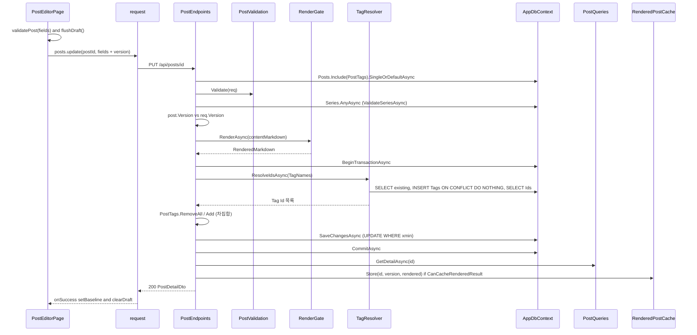
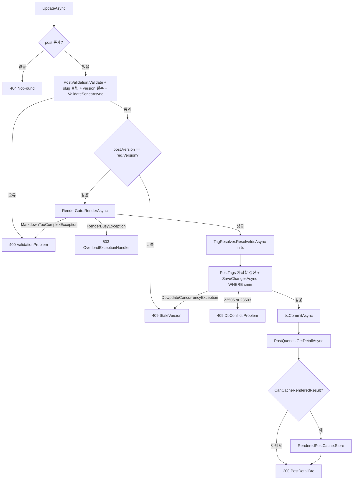
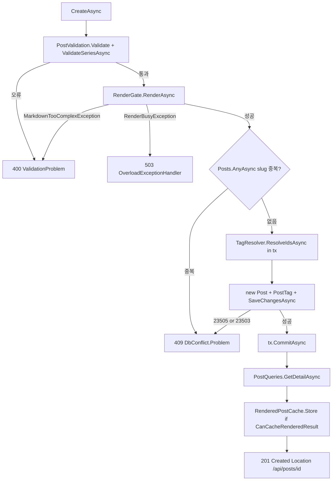
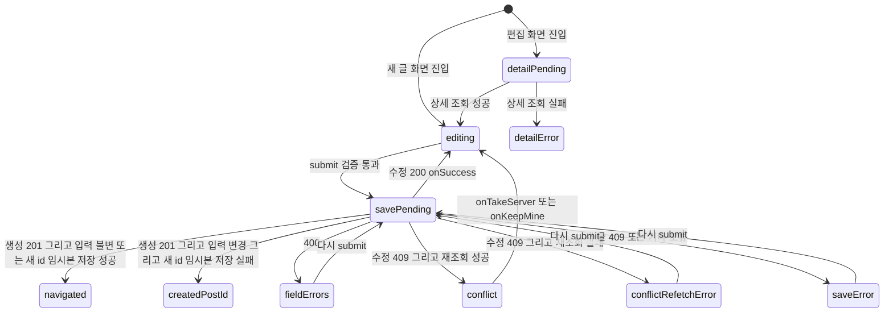
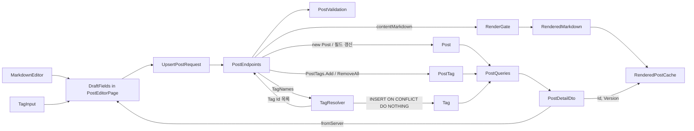

# F003 글 작성·수정(마크다운 에디터)

<!-- doc-harness:section id="summary" hash="e2e9afa3619e20a5d8489f58f34f0e586a724181608cad088c2e7513116e2fd3" -->
## 한 줄 요약

결론부터: F003은 실제로 동작하는 핵심 기능이며(CONFIRMED), 이번 재검증에서 이전 분석과 다른 동작 변경은 발견되지 않았다. SPA의 PostEditorPage는 validatePost로 클라이언트 편의 검증을 하고 flushDraft로 임시본을 즉시 기록한다. 그다음 useMutation으로 posts.create(POST /api/posts)나 posts.update(PUT /api/posts/{id}, baseline.version 포함)를 호출한다. 서버 PostEndpoints.UpdateAsync의 검사 순서는 다음과 같다. ① 글이 없으면 404. ② PostValidation, slug 불변, version 필수, 시리즈 존재 검사 중 하나라도 어기면 400. ③ version 사전 비교가 어긋나면 409. ④ RenderGate에서 중첩이 너무 깊으면 400, 슬롯 대기가 시간을 넘기면 503(Retry-After 5초). ⑤ 트랜잭션 안에서 TagResolver upsert를 하고 PostTags를 차집합만큼 갱신한 뒤 SaveChanges를 UPDATE ... WHERE xmin으로 실행. ⑥ 커밋 뒤 재조회하고 캐시를 조건부로 선채운 다음 200. CreateAsync의 순서는 검증 400 → 렌더 → slug 중복 사전 검사 409 → 트랜잭션 저장(유니크·FK 경쟁이면 409) → 201과 Location이다. 서버는 재시도하지 않는다. 모든 /api 요청은 AdminSurfaceMiddleware(F018), UseExceptionHandler와 OverloadExceptionHandler, ApiBodyLimitMiddleware(F020)를 거친다. 편집 화면은 GET /api/series(F007)와 GET /api/tags(F008)로 선택 목록을 불러온다. 이번 재검증에서 의존 목록을 코드 근거와 함께 F007·F008·F018·F020을 포함한 11개로 확정했다. 새로 확인한 사실은 네 가지다. (1) toApiError는 서버 필드 키를 그대로 fieldErrors로 옮긴다. (2) saveDraft는 용량 초과·비공개 모드에서 false를 돌려준다. (3) RenderingOptions 코드 기본값은 Concurrency 2, QueueTimeoutMs 5000, CacheMegabytes 64다. (4) POST/PUT /api/posts에는 RateLimitMetadata가 없어 전역 속도 제한 체인이 적용되지 않는다. 문제 가능성으로 관찰한 것은 세 가지다. 커밋 뒤 재조회·응답 단계가 실패하면 저장은 됐는데 화면에는 실패로 보인다. 새 글 화면의 409에는 ConflictPanel이 없다. version 필드의 400 오류를 표시할 자리가 없다.

| 항목 | 값 |
|---|---|
| 중요도 | CORE |
| 상태 | ACTIVE |
| 진입점 | `SPA /posts/new`, `SPA /posts/:id`, `GET /api/posts/{id:guid}`, `POST /api/posts`, `PUT /api/posts/{id:guid}` |
| 의존 기능 | [F001](../09_FEATURES.md#f001), [F004](../09_FEATURES.md#f004), [F005](../09_FEATURES.md#f005), [F006](../09_FEATURES.md#f006), [F007](../09_FEATURES.md#f007), [F008](../09_FEATURES.md#f008), [F009](../09_FEATURES.md#f009), [F011](../09_FEATURES.md#f011), [F018](../09_FEATURES.md#f018), [F020](../09_FEATURES.md#f020), [F029](../09_FEATURES.md#f029) |

### 진입점 근거

| 내용 | 상태 | 근거 |
|---|---|---|
| SPA 라우트 /posts/new와 /posts/:id는 같은 lazy 모듈 PostEditorPage를 쓴다. 이 모듈은 route.lazy가 찾는 이름(Component)으로 export한다. | CONFIRMED | `PortfolioBlog.Web/src/app/routes.tsx` (13-30), `PortfolioBlog.Web/src/pages/PostEditorPage.tsx` PostEditorPage (34-48) |
| GET /api/posts/{id:guid}(GetPost)는 편집 화면을 처음 불러올 때와 409 뒤 최신본을 다시 조회할 때 쓰인다. 응답은 PostQueries.GetDetailAsync가 만든 DTO이고, 글이 없으면 404다. | CONFIRMED | `PortfolioBlog.Api/Features/Posts/PostEndpoints.cs` PostEndpoints.GetAsync (43,101-102), `PortfolioBlog.Web/src/pages/PostEditorPage.tsx` (37-42,222) |
| POST /api/posts(CreatePost)는 새 글을 만든다. 응답은 201과 Location /api/posts/{id}, PostDetailDto다. | CONFIRMED | `PortfolioBlog.Api/Features/Posts/PostEndpoints.cs` PostEndpoints.CreateAsync (44,124-164) |
| PUT /api/posts/{id:guid}(UpdatePost)는 요청 내용으로 글 전체를 교체하는 방식으로 수정한다. version이 필수다. | CONFIRMED | `PortfolioBlog.Api/Features/Posts/PostEndpoints.cs` PostEndpoints.UpdateAsync (45,187-245) |
| 모든 /api 엔드포인트는 RequireHost(adminHost)와 RequireAuthorization(세션 정책)이 걸린 그룹 아래 등록된다(F001·F018). 파이프라인에서는 UseExceptionHandler(OverloadExceptionHandler 등록), AdminSurfaceMiddleware, ApiBodyLimitMiddleware를 거친다(F018·F020). | CONFIRMED | `PortfolioBlog.Api/Features/ApiEndpoints.cs` ApiEndpoints.MapApiEndpoints (34-47), `PortfolioBlog.Api/Program.cs` (43,100,104,108,121) |
<!-- /doc-harness:section -->

<!-- doc-harness:section id="flow" hash="750e8680955f77288a9e20a4ef0be0e881a453f2df6a998289fcad5193279a22" -->
## 처리 흐름

| 단계 | 컴포넌트 | 코드 | 설명 |
|---|---|---|---|
| 1 | PostEditorPage | `PortfolioBlog.Web/src/pages/PostEditorPage.tsx` PostEditorPage | postId가 있으면 useQuery(['posts','detail',id])로 posts.get을 호출한다(staleTime Infinity, gcTime 0). 대기 중이면 Loading을, 실패하면 ErrorNotice와 재시도 버튼, '목록으로' 링크를 보인다. 조회가 끝나면 key={postId ?? NEW_POST_KEY}로 Editor를 마운트한다. |
| 2 | Editor | `PortfolioBlog.Web/src/pages/PostEditorPage.tsx` Editor | 서버 DTO(fromServer)나 EMPTY로 baseline(fields, version)을 만든다. loadDraft로 읽은 임시본이 기준선과 다르면 pendingDraft로 복원을 제안한다. seriesApi.list(GET /api/series)와 tagsApi.list(GET /api/tags)로 시리즈 선택지와 태그 제안 목록을 조회한다. |
| 3 | MarkdownEditor | `PortfolioBlog.Web/src/components/MarkdownEditor.tsx` MarkdownEditor | initialValue로 CodeMirror EditorView를 한 번만 만든다(비제어). docChanged 때마다 onChange로 본문을 올려 보낸다. paste·drop에 image/* 파일이 있으면 기본 동작을 막고 onImageFiles를 호출한다. 외부에서 본문을 바꿀 때는 editorKey를 바꿔 다시 마운트한다. |
| 4 | TagInput | `PortfolioBlog.Web/src/components/TagInput.tsx` TagInput | Enter·쉼표·blur 때 입력을 쉼표로 나누고 displayTag로 정리한다. 대소문자만 다른 중복은 빼고 추가한다. 한글 조합 중 Enter는 무시한다. |
| 5 | Editor | `PortfolioBlog.Web/src/pages/PostEditorPage.tsx` Editor.uploadImages | uploadingRef로 동시 업로드를 막는다. 이미지마다 validateImageFile로 편의 검사를 한 뒤 attachments.upload(POST /api/attachments)로 하나씩 순서대로 업로드한다. 성공하면 을 editor.insertAtCursor로 넣는다. 서버 호출이 실패하면 남은 파일은 올리지 않고 멈춘다. |
| 6 | Editor | `PortfolioBlog.Web/src/pages/PostEditorPage.tsx` Editor.submit | validatePost(fields)로 클라이언트 검증을 한다. 오류가 없으면 flushDraft()로 임시본을 즉시 기록하고 save.mutate(fields)를 호출한다. mutationFn은 postId가 null이면 posts.create를, 아니면 posts.update(postId, {...submitted, version: baseline.version})를 호출한다. |
| 7 | request | `PortfolioBlog.Web/src/api/client.ts` request | fetch를 보낸다. 옵션은 credentials same-origin, cache no-store, redirect error이고 CSRF 헤더 X-Requested-With를 붙인다. 응답이 !res.ok면 toApiError로 만든 ApiError를 던지고, 네트워크 실패는 ApiError(0)이다. |
| 8 | PostEndpoints | `PortfolioBlog.Api/Features/Posts/PostEndpoints.cs` PostEndpoints.UpdateAsync | (수정) Posts.Include(PostTags).SingleOrDefaultAsync로 글을 변경 추적 상태로 불러온다. 글이 없으면 404다. |
| 9 | PostValidation | `PortfolioBlog.Api/Features/Posts/PostValidation.cs` PostValidation.Validate | slug(필수·NUL 금지·SlugRules.IsValid), 제목(필수·200자), 요약(300자), 본문(null 불가·NUL 금지·UTF-8 204800바이트), 태그(TagResolver.Validate), seriesId·seriesOrder 쌍(순서 1 이상)을 검사한다. 수정이면 엔드포인트가 slug 불변과 version 필수를 추가로 검사한다. ValidateSeriesAsync는 Series 존재를 AnyAsync로 확인한다. 오류가 있으면 400 ValidationProblem이다. |
| 10 | PostEndpoints | `PortfolioBlog.Api/Features/Posts/PostEndpoints.cs` PostEndpoints.UpdateAsync | (수정) 렌더하기 전에 post.Version != req.Version이면 StaleVersion(409)을 돌려준다. |
| 11 | RenderGate | `PortfolioBlog.Api/Infrastructure/Markdown/RenderGate.cs` RenderGate.RenderAsync | PostEndpoints.RenderOrAddErrorAsync를 거쳐 호출된다. QueueTimeout(기본 5000ms) 안에 슬롯(기본 동시 2)을 얻으면 동기로 렌더한다. MarkdownTooComplexException이면 contentMarkdown 필드 오류로 400이다. 슬롯을 얻지 못하면 RenderBusyException이 나고 OverloadExceptionHandler가 503으로 바꾼다. |
| 12 | PostEndpoints | `PortfolioBlog.Api/Features/Posts/PostEndpoints.cs` PostEndpoints.CreateAsync | (생성) 렌더 뒤 Posts.AnyAsync(Slug==req.Slug)로 slug 중복을 확인한다. 중복이면 DbConflict.Problem으로 409다. |
| 13 | TagResolver | `PortfolioBlog.Api/Infrastructure/Data/TagResolver.cs` TagResolver.ResolveIdsAsync | BeginTransactionAsync 뒤에 호출된다. 태그 이름을 Display와 ToLowerInvariant로 정규화하고, 이미 있는 NormalizedName을 SELECT한다. 없는 태그는 서수 순서로 INSERT ... ON CONFLICT (NormalizedName) DO NOTHING 한다. 마지막으로 Tag Id 목록을 SELECT해 돌려준다. |
| 14 | PostEndpoints | `PortfolioBlog.Api/Features/Posts/PostEndpoints.cs` PostEndpoints.UpdateAsync / CreateAsync | (수정) Version의 OriginalValue를 req.Version으로 고정한다(트랜잭션 시작 전). post.PostTags는 차집합만 RemoveAll·Add하고, 제목(Trim)·요약(Trim, null이면 빈 문자열)·본문·시리즈·UpdatedAt을 갱신한다. (생성) new Post를 만들고 PostTag 링크를 붙인다. 이어서 SaveChangesAsync를 호출한다. |
| 15 | DbConflict | `PortfolioBlog.Api/Infrastructure/Data/DbConflict.cs` DbConflict.IsConstraintRace | SaveChanges 실패는 이렇게 처리한다. (수정) DbUpdateConcurrencyException이면 409 StaleVersion을 돌려준다. SQLSTATE 23505·23503인 DbUpdateException이면 409 DbConflict.Problem을 돌려준다. 저장에 성공하면 tx.CommitAsync를 호출한다. |
| 16 | PostQueries | `PortfolioBlog.Api/Infrastructure/Data/PostQueries.cs` PostQueries.GetDetailAsync | 커밋 뒤 'PortfolioBlog.Api.Audit' 로거에 PostId·Slug를 기록하고, AsNoTracking 프로젝션으로 상세 DTO를 다시 조회한다. |
| 17 | RenderedPostCache | `PortfolioBlog.Api/Infrastructure/Markdown/RenderedPostCache.cs` RenderedPostCache.Store | CanCacheRenderedResult가 참일 때만(재조회 DTO가 있고 그 본문이 요청 본문과 서수 비교로 같을 때) 렌더 결과를 (Id, Version) 키로 캐시에 넣는다. 그 뒤 201 Created나 200 Ok를 돌려준다. |
| 18 | Editor | `PortfolioBlog.Web/src/pages/PostEditorPage.tsx` Editor.save.onSuccess | baseline과 version을 서버값으로 맞추고, detail 캐시를 설정하고, posts list·tags·series 쿼리를 무효화한다. 새 글이면 두 경우로 나뉜다. (a) 응답을 기다리는 동안 입력이 그대로면 clearDraft('new') 뒤 /posts/{id}로 replace 이동한다. (b) 입력이 바뀌었으면 saveDraft(saved.id, …)를 시도한다. true면 clearDraft('new') 뒤 이동하고, false면 이동하지 않고 createdPostId·draftFailed로 화면을 잠근다. 수정이면 입력이 바뀌지 않았을 때만 서버값을 대입하고 임시본을 지운다. 바뀌었으면 새 version으로 임시본을 다시 쓴다. |
| 19 | Editor | `PortfolioBlog.Web/src/pages/PostEditorPage.tsx` Editor.save.onError | 400이면 fieldErrors를 설정한다. 409이고 수정 화면이면 posts.get으로 최신본을 받아 ConflictPanel을 연다. 재조회가 실패하면 noteAuthFailure를 기록하고 conflictRefetchError를 보여 준다. 그 밖의 오류는 ErrorNotice로 표시한다. |
<!-- /doc-harness:section -->

<!-- doc-harness:section id="F003_SEQUENCE" hash="653dd1904258795cd3b8223f33cf7e03c1ef6f5b7b425858165e4869f9cc0f7f" -->
## 글 수정 저장(PUT /api/posts/{id}) 정상 경로 (Sequence Diagram)

수정 저장은 클라이언트 검증 → PUT → 서버 검증 → version 사전 비교 → RenderGate 렌더 → 트랜잭션(태그 upsert·링크·UPDATE WHERE xmin) → 커밋 뒤 재조회·캐시 선채움 순서로 진행된다.

PostEditorPage(Editor)는 validatePost와 flushDraft 뒤 posts.update를 호출한다. request(client.ts)가 CSRF 헤더를 붙여 PUT을 보낸다. PostEndpoints.UpdateAsync는 AppDbContext로 글을 추적 조회하고, PostValidation과 ValidateSeriesAsync로 검증한다. 그다음 version을 먼저 비교하고 RenderGate로 렌더 가능성을 확인한다. 트랜잭션 안에서 TagResolver가 Tag를 upsert하고 Id를 돌려주면, PostEndpoints가 PostTags를 차집합만큼 갱신하고 SaveChangesAsync를 호출한다. 커밋 뒤 PostQueries.GetDetailAsync로 재조회하고, CanCacheRenderedResult가 참이면 RenderedPostCache.Store를 호출한 뒤 200을 돌려준다. 실패 분기는 F003_FLOW에 있다.

### 코드 근거

| 구성 요소 | 코드 |
|---|---|
| PostEditorPage | `PortfolioBlog.Web/src/pages/PostEditorPage.tsx` (Editor.submit / save) |
| request | `PortfolioBlog.Web/src/api/client.ts` (request) |
| PostEndpoints | `PortfolioBlog.Api/Features/Posts/PostEndpoints.cs` (PostEndpoints.UpdateAsync) |
| PostValidation | `PortfolioBlog.Api/Features/Posts/PostValidation.cs` (PostValidation.Validate) |
| RenderGate | `PortfolioBlog.Api/Infrastructure/Markdown/RenderGate.cs` (RenderGate.RenderAsync) |
| TagResolver | `PortfolioBlog.Api/Infrastructure/Data/TagResolver.cs` (TagResolver.ResolveIdsAsync) |
| AppDbContext | `PortfolioBlog.Api/Infrastructure/Data/AppDbContext.cs` (AppDbContext) |
| PostQueries | `PortfolioBlog.Api/Infrastructure/Data/PostQueries.cs` (PostQueries.GetDetailAsync) |
| RenderedPostCache | `PortfolioBlog.Api/Infrastructure/Markdown/RenderedPostCache.cs` (RenderedPostCache.Store) |
<!-- /doc-harness:section -->

<!-- doc-harness:section id="F003_FLOW" hash="0acc990106e3bfd3b52de899f5f032b83082d86479d778f602892b57670017a6" -->
## UpdateAsync 분기와 실패 경로 (Flowchart)

수정 요청은 404 → 400(검증) → 409(version 사전 비교) → 400/503(렌더) → 409(xmin 경쟁·제약 경쟁) 순서로 걸러지고, 모두 통과하면 커밋 뒤 200을 돌려준다.

UpdateAsync는 글이 없으면 먼저 404를 돌려준다. 이어서 PostValidation, slug 불변, version 필수, 시리즈 존재 검사 중 하나라도 걸리면 400 ValidationProblem이다. version이 어긋나면 렌더 전에 409 StaleVersion이다. RenderGate에서 MarkdownTooComplexException이 나면 400, 슬롯 대기가 시간을 넘기면 RenderBusyException이 나고 OverloadExceptionHandler가 503으로 바꾼다. SaveChangesAsync에서 DbUpdateConcurrencyException이 나면 409 StaleVersion이고, SQLSTATE 23505·23503이면 409 DbConflict.Problem이다. 그 밖의 DbUpdateException은 처리 없이 전파된다(다이어그램에서 생략). 커밋 뒤 재조회 DTO의 본문이 요청과 같을 때만 캐시를 선채운다.

### 코드 근거

| 구성 요소 | 코드 |
|---|---|
| UpdateAsync | `PortfolioBlog.Api/Features/Posts/PostEndpoints.cs` (PostEndpoints.UpdateAsync) |
| PostValidation | `PortfolioBlog.Api/Features/Posts/PostValidation.cs` (PostValidation.Validate) |
| VersionCheck | `PortfolioBlog.Api/Features/Posts/PostEndpoints.cs` (PostEndpoints.UpdateAsync) |
| StaleVersion | `PortfolioBlog.Api/Features/Posts/PostEndpoints.cs` (PostEndpoints.StaleVersion) |
| RenderGate | `PortfolioBlog.Api/Infrastructure/Markdown/RenderGate.cs` (RenderGate.RenderAsync) |
| OverloadExceptionHandler | `PortfolioBlog.Api/Infrastructure/Web/OverloadExceptionHandler.cs` (OverloadExceptionHandler.TryHandleAsync) |
| TagResolver | `PortfolioBlog.Api/Infrastructure/Data/TagResolver.cs` (TagResolver.ResolveIdsAsync) |
| DbConflict | `PortfolioBlog.Api/Infrastructure/Data/DbConflict.cs` (DbConflict.Problem) |
| PostQueries | `PortfolioBlog.Api/Infrastructure/Data/PostQueries.cs` (PostQueries.GetDetailAsync) |
| CanCache | `PortfolioBlog.Api/Features/Posts/PostEndpoints.cs` (PostEndpoints.CanCacheRenderedResult) |
| RenderedPostCache | `PortfolioBlog.Api/Infrastructure/Markdown/RenderedPostCache.cs` (RenderedPostCache.Store) |
<!-- /doc-harness:section -->

<!-- doc-harness:section id="F003_FLOW_CREATE" hash="7e2e22a0d932be47a3f935c26f13d967c0f389c09477436ae0f6ea023ef6964e" -->
## CreateAsync 분기와 실패 경로 (Flowchart)

생성 요청은 검증 400 → 렌더(400/503) → slug 사전 검사 409 → 트랜잭션 저장(경쟁 409) 순서로 걸러지고, 모두 통과하면 201과 Location을 돌려준다.

CreateAsync에는 version 검사가 없다. slug 중복 사전 검사는 렌더 뒤에 실행된다. 그래서 중복 slug 요청도 렌더 슬롯과 CPU를 먼저 쓴다. 사전 검사를 통과한 동시 생성은 SaveChangesAsync의 유니크 위반(23505)으로, 검증 뒤 삭제된 시리즈 참조는 FK 위반(23503)으로 409가 된다. 커밋 뒤 재조회와 캐시 선채움은 수정 경로와 같다.

### 코드 근거

| 구성 요소 | 코드 |
|---|---|
| CreateAsync | `PortfolioBlog.Api/Features/Posts/PostEndpoints.cs` (PostEndpoints.CreateAsync) |
| PostValidation | `PortfolioBlog.Api/Features/Posts/PostValidation.cs` (PostValidation.Validate) |
| RenderGate | `PortfolioBlog.Api/Infrastructure/Markdown/RenderGate.cs` (RenderGate.RenderAsync) |
| OverloadExceptionHandler | `PortfolioBlog.Api/Infrastructure/Web/OverloadExceptionHandler.cs` (OverloadExceptionHandler) |
| SlugCheck | `PortfolioBlog.Api/Features/Posts/PostEndpoints.cs` (PostEndpoints.CreateAsync) |
| DbConflict | `PortfolioBlog.Api/Infrastructure/Data/DbConflict.cs` (DbConflict.Problem) |
| TagResolver | `PortfolioBlog.Api/Infrastructure/Data/TagResolver.cs` (TagResolver.ResolveIdsAsync) |
| PostQueries | `PortfolioBlog.Api/Infrastructure/Data/PostQueries.cs` (PostQueries.GetDetailAsync) |
| RenderedPostCache | `PortfolioBlog.Api/Infrastructure/Markdown/RenderedPostCache.cs` (RenderedPostCache.Store) |
<!-- /doc-harness:section -->

<!-- doc-harness:section id="F003_STATE" hash="d6fa062ea041c5abe0bdc8deacd417478a9a10fb8b2ea1d0396c19e995595b25" -->
## 편집 화면(Editor) 저장 상태 전이 (State Diagram)

편집 화면은 editing에서 저장을 시작해 결과에 따라 편집 복귀, 새 글 이동, 잠금, 필드 오류, 충돌, 충돌 재조회 실패로 갈라진다.

수정 화면은 상세 조회(detailPending)를 거쳐 editing에 들어가고, 새 글 화면은 곧바로 editing이다. 저장 요청이 성공하면 두 갈래다. 수정은 editing으로 돌아간다. 새 글은 입력이 그대로이거나 새 id 임시본 저장에 성공했을 때만 /posts/{id}로 이동하고(navigated), 그렇지 않으면 createdPostId 잠금 상태가 된다. 400은 fieldErrors로 간다. 409는 수정 화면에서만 재조회 결과에 따라 conflict 또는 conflictRefetchError로 가고, 새 글 화면의 409는 일반 오류 표시(saveError)에 머문다. conflict에서는 ConflictPanel의 onTakeServer·onKeepMine으로 editing에 돌아간다.

### 코드 근거

| 구성 요소 | 코드 |
|---|---|
| detailPending | `PortfolioBlog.Web/src/pages/PostEditorPage.tsx` (PostEditorPage) |
| editing | `PortfolioBlog.Web/src/pages/PostEditorPage.tsx` (Editor) |
| savePending | `PortfolioBlog.Web/src/pages/PostEditorPage.tsx` (Editor.save) |
| navigated | `PortfolioBlog.Web/src/pages/PostEditorPage.tsx` (Editor.save.onSuccess) |
| createdPostId | `PortfolioBlog.Web/src/pages/PostEditorPage.tsx` (Editor.save.onSuccess) |
| fieldErrors | `PortfolioBlog.Web/src/pages/PostEditorPage.tsx` (Editor.save.onError) |
| conflict | `PortfolioBlog.Web/src/components/ConflictPanel.tsx` (ConflictPanel) |
| conflictRefetchError | `PortfolioBlog.Web/src/pages/PostEditorPage.tsx` (conflictRefetchMessage) |
| saveError | `PortfolioBlog.Web/src/pages/PostEditorPage.tsx` (ErrorNotice) |
<!-- /doc-harness:section -->

<!-- doc-harness:section id="F003_DATAFLOW" hash="b7baad345dad3356501b9e0a98d1e7dd024dc12faa1804105ba967af3c959888" -->
## 입력에서 DB·캐시·화면까지 데이터 이동 (Data Flow Diagram)

편집기 입력(DraftFields)은 UpsertPostRequest로 서버에 가서 Post·PostTag·Tag 행과 렌더 캐시가 되고, 재조회한 PostDetailDto가 다시 화면의 기준선이 된다.

MarkdownEditor와 TagInput이 DraftFields를 채우고, 이 값이 UpsertPostRequest 본문이 된다. PostEndpoints는 PostValidation을 거친 뒤 본문을 RenderGate에 넘겨 RenderedMarkdown을 얻는다. TagNames는 TagResolver로 Tag 행 upsert와 Id 목록 반환을 거쳐 PostTag 링크가 된다. Post는 새로 만들거나 필드를 갱신한다. 커밋 뒤 PostQueries가 PostDetailDto를 만든다. RenderedMarkdown은 그 DTO의 Id·Version 키로 RenderedPostCache에 들어가고(본문 일치 시), DTO는 fromServer로 DraftFields 기준선이 된다.

### 코드 근거

| 구성 요소 | 코드 |
|---|---|
| MarkdownEditor | `PortfolioBlog.Web/src/components/MarkdownEditor.tsx` (MarkdownEditor) |
| TagInput | `PortfolioBlog.Web/src/components/TagInput.tsx` (TagInput) |
| DraftFields | `PortfolioBlog.Web/src/lib/drafts.ts` (DraftFields) |
| UpsertPostRequest | `PortfolioBlog.Api/Contracts/PostDtos.cs` (UpsertPostRequest) |
| PostEndpoints | `PortfolioBlog.Api/Features/Posts/PostEndpoints.cs` (PostEndpoints) |
| PostValidation | `PortfolioBlog.Api/Features/Posts/PostValidation.cs` (PostValidation.Validate) |
| RenderGate | `PortfolioBlog.Api/Infrastructure/Markdown/RenderGate.cs` (RenderGate.RenderAsync) |
| RenderedMarkdown | `PortfolioBlog.Api/Infrastructure/Markdown/MarkdownRenderer.cs` (RenderedMarkdown) |
| TagResolver | `PortfolioBlog.Api/Infrastructure/Data/TagResolver.cs` (TagResolver.ResolveIdsAsync) |
| Tag | `PortfolioBlog.Api/Domain/Tag.cs` (Tag) |
| PostTag | `PortfolioBlog.Api/Domain/PostTag.cs` (PostTag) |
| Post | `PortfolioBlog.Api/Domain/Post.cs` (Post) |
| PostQueries | `PortfolioBlog.Api/Infrastructure/Data/PostQueries.cs` (PostQueries.GetDetailAsync) |
| PostDetailDto | `PortfolioBlog.Api/Contracts/PostDtos.cs` (PostDetailDto) |
| RenderedPostCache | `PortfolioBlog.Api/Infrastructure/Markdown/RenderedPostCache.cs` (RenderedPostCache.Store) |
<!-- /doc-harness:section -->

<!-- doc-harness:section id="data" hash="a5f45add7d8453122197c91deafa7f6a8094f1af8768352bf13ba092af4144c9" -->
## 데이터

### 데이터 흐름

| 내용 | 상태 | 근거 |
|---|---|---|
| 입력: 화면 상태 DraftFields(slug, title, summary, contentMarkdown, tagNames, seriesId, seriesOrder)는 제출 시점 값 그대로 요청 본문이 된다. 수정이면 baseline.version을 version으로 붙이고, 값이 없으면 undefined라 요청에서 빠진다. | CONFIRMED | `PortfolioBlog.Web/src/pages/PostEditorPage.tsx` Editor.save.mutationFn (152-155), `PortfolioBlog.Web/src/lib/drafts.ts` DraftFields (4-13) |
| 서버 DTO UpsertPostRequest(Slug, Title, Summary, ContentMarkdown, TagNames, SeriesId, SeriesOrder, uint? Version)는 모든 필드가 nullable이다. 어떤 필드가 필수인지는 PostValidation과 UpdateAsync가 판정한다. | CONFIRMED | `PortfolioBlog.Api/Contracts/PostDtos.cs` UpsertPostRequest (47-48), `PortfolioBlog.Api/Features/Posts/PostValidation.cs` PostValidation.Validate (29-56), `PortfolioBlog.Api/Features/Posts/PostEndpoints.cs` PostEndpoints.UpdateAsync (192-197) |
| 요청이 엔티티로 바뀔 때: Title은 Trim하고, Summary는 Trim하되 null이면 빈 문자열이 된다. ContentMarkdown은 원문 그대로 저장한다. CreatedAt/UpdatedAt에는 DbClock.UtcNow()가 들어간다. TagResolver는 Tag 행을 upsert하고 Tag Id 목록만 돌려준다. PostEndpoints는 그 목록으로 post.PostTags.Add/RemoveAll 해 PostTag 링크를 만든다. | CONFIRMED | `PortfolioBlog.Api/Features/Posts/PostEndpoints.cs` PostEndpoints.CreateAsync (139-148), `PortfolioBlog.Api/Features/Posts/PostEndpoints.cs` PostEndpoints.UpdateAsync (213-225), `PortfolioBlog.Api/Infrastructure/Data/TagResolver.cs` TagResolver.ResolveIdsAsync (92-116) |
| 출력: PostDetailDto(Id, Slug, Title, Summary, ContentMarkdown, Tags[], SeriesId, SeriesOrder, CreatedAt, UpdatedAt, uint Version)는 커밋 뒤 AsNoTracking으로 다시 조회한 결과다. Version은 PostgreSQL의 xmin 시스템 컬럼이다. | CONFIRMED | `PortfolioBlog.Api/Infrastructure/Data/PostQueries.cs` PostQueries.GetDetailAsync (32-43), `PortfolioBlog.Api/Contracts/PostDtos.cs` PostDetailDto (29-30), `PortfolioBlog.Api/Infrastructure/Data/AppDbContext.cs` (96) |
| 렌더 결과 RenderedMarkdown은 저장 전에 렌더 가능 여부를 확인하려고 만든다. 이 결과는 버리지 않는다. 재조회한 DTO의 본문이 요청 본문과 같을 때만 RenderedPostCache에 (Id, Version) 키로 저장된다. | CONFIRMED | `PortfolioBlog.Api/Features/Posts/PostEndpoints.cs` CanCacheRenderedResult (160-163,241-244,353-354), `PortfolioBlog.Api/Infrastructure/Markdown/RenderedPostCache.cs` RenderedPostCache.Store (115-122) |
| 응답이 화면에 반영될 때: 응답(saved)을 fromServer로 DraftFields로 바꿔 baseline으로 삼는다. 수정 화면에서는 응답을 기다리는 동안 입력이 바뀌지 않았을 때만 화면 fields도 서버값으로 바꾼다. 서버 본문이 제출 본문과 다르면 editorKey를 올려 CodeMirror를 다시 마운트한다. 새 글 화면에서 입력이 바뀌었으면 현재 입력을 saved.id 키 임시본(localStorage 'pb.draft.v1:' 접두)으로 옮긴다. 이때 slug는 서버값, baseVersion은 saved.version으로 둔다. | CONFIRMED | `PortfolioBlog.Web/src/pages/PostEditorPage.tsx` Editor.save.onSuccess (156-216), `PortfolioBlog.Web/src/lib/drafts.ts` (1,15-17,41-43) |
| 오류가 화면에 반영될 때: toApiError는 ProblemDetails의 errors 객체를 parseFieldErrors로 옮긴다. 키는 변환 없이 그대로 쓰고, 위험 키(__proto__·constructor·prototype)만 건너뛴다. 따라서 서버 키(slug·title·contentMarkdown·tagNames·seriesId·seriesOrder·version)가 그대로 fieldErrors 키가 된다. | CONFIRMED | `PortfolioBlog.Web/src/api/errors.ts` parseFieldErrors / toApiError (38-48,54-65) |
| 선택 목록: 편집 화면은 GET /api/series(F007 시리즈 관리 API)로 시리즈 드롭다운을 채운다. GET /api/tags(F008 태그 관리 API)로 TagInput 제안 목록을 채운다. 저장에 성공하면 ['tags']·['series'] 쿼리를 무효화한다. 서버는 저장할 때 Series 존재를 다시 확인한다(ValidateSeriesAsync). | CONFIRMED | `PortfolioBlog.Web/src/pages/PostEditorPage.tsx` (95-96,166-168,329,338), `PortfolioBlog.Web/src/api/endpoints.ts` series.list / tags.list (26,34), `PortfolioBlog.Api/Features/Posts/PostEndpoints.cs` PostEndpoints.ValidateSeriesAsync (300-306) |
| 이미지 흐름: File은 FormData('file')에 담겨 POST /api/attachments(F009)로 전송된다. 응답의 fileName·url은 `\n` 형태로 본문 커서 위치에 삽입된다. | CONFIRMED | `PortfolioBlog.Web/src/api/endpoints.ts` attachments.upload (42-46), `PortfolioBlog.Web/src/pages/PostEditorPage.tsx` Editor.uploadImages (257-259), `PortfolioBlog.Web/src/lib/markdownImage.ts` altTextOf (4-11) |

### DB 접근

| 엔티티 | 작업 | 코드 |
|---|---|---|
| Post | SELECT | `PortfolioBlog.Api/Infrastructure/Data/PostQueries.cs` PostQueries.GetDetailAsync |
| Post | SELECT | `PortfolioBlog.Api/Features/Posts/PostEndpoints.cs` PostEndpoints.UpdateAsync (Include PostTags, tracked) |
| Post | SELECT | `PortfolioBlog.Api/Features/Posts/PostEndpoints.cs` PostEndpoints.CreateAsync (slug 중복 AnyAsync) |
| Series | SELECT | `PortfolioBlog.Api/Features/Posts/PostEndpoints.cs` PostEndpoints.ValidateSeriesAsync |
| Tag | SELECT | `PortfolioBlog.Api/Infrastructure/Data/TagResolver.cs` TagResolver.ResolveIdsAsync (기존 NormalizedName 조회, 최종 Id 조회) |
| Tag | INSERT | `PortfolioBlog.Api/Infrastructure/Data/TagResolver.cs` TagResolver.ResolveIdsAsync (ON CONFLICT DO NOTHING) |
| Post | INSERT | `PortfolioBlog.Api/Features/Posts/PostEndpoints.cs` PostEndpoints.CreateAsync |
| PostTag | INSERT | `PortfolioBlog.Api/Features/Posts/PostEndpoints.cs` PostEndpoints.CreateAsync / UpdateAsync (post.PostTags.Add) |
| Post | UPDATE | `PortfolioBlog.Api/Features/Posts/PostEndpoints.cs` PostEndpoints.UpdateAsync (WHERE xmin = req.Version) |
| PostTag | DELETE | `PortfolioBlog.Api/Features/Posts/PostEndpoints.cs` PostEndpoints.UpdateAsync (차집합 RemoveAll) |

### 상태 전이

| 이전 | 다음 | 트리거 | 근거 |
|---|---|---|---|
| (행 없음) | Post 행 생성·즉시 공개 | POST /api/posts가 성공해 커밋될 때. 초안 상태가 없어 저장이 곧 공개다. | `PortfolioBlog.Api/Features/Posts/PostEndpoints.cs` PostEndpoints.CreateAsync (138-163), `PortfolioBlog.Web/src/pages/PostEditorPage.tsx` (282-283) |
| Post.Version = v | Post.Version = v'(새 xmin) | PUT이 성공할 때. UpdatedAt을 항상 바꾸므로 태그만 고쳐도 Posts 행이 갱신되어 xmin이 바뀐다. | `PortfolioBlog.Api/Features/Posts/PostEndpoints.cs` PostEndpoints.UpdateAsync (210,225-228) |
| 화면: 새 글 저장 중 | 화면: /posts/{id} 편집(replace 이동) | 생성 201을 받고 두 조건 중 하나일 때. (a) 응답을 기다리는 동안 입력이 그대로다. 이때는 clearDraft('new') 결과와 무관하게 이동한다(clearDraft는 void). (b) 입력이 바뀌었고 saveDraft(saved.id, …)가 true를 반환했다. | `PortfolioBlog.Web/src/pages/PostEditorPage.tsx` Editor.save.onSuccess (169-188), `PortfolioBlog.Web/src/lib/drafts.ts` saveDraft / clearDraft (41-47) |
| 화면: 새 글 저장 중 | 화면: 잠금(createdPostId 설정, 저장 버튼 비활성, 경고 배너, draftFailed=true) | 생성 201을 받았고 응답을 기다리는 동안 입력이 바뀌었는데, saveDraft(saved.id, …)가 false를 반환했을 때 | `PortfolioBlog.Web/src/pages/PostEditorPage.tsx` Editor.save.onSuccess (182,189-202,284,308-314) |
| 화면: 저장 중(save.isPending) | 화면: 충돌(conflict 설정, 저장 버튼 비활성) | 수정 화면에서 409 응답을 받고 posts.get 재조회에 성공했을 때 | `PortfolioBlog.Web/src/pages/PostEditorPage.tsx` Editor.save.onError (217-228,284) |
| 화면: 저장 중 | 화면: 충돌 재조회 실패 배너(conflictRefetchError) | 수정 화면에서 409를 받았고 posts.get 재조회가 실패했을 때(404는 고정 문구, 401은 noteAuthFailure) | `PortfolioBlog.Web/src/pages/PostEditorPage.tsx` Editor.save.onError (221-227,301-305) |
| 화면: 충돌 | 화면: 편집(baseline을 서버 version으로 갱신) | ConflictPanel에서 onTakeServer(서버본으로 교체하고 임시본 삭제)나 onKeepMine(내 입력은 유지하고 기준만 갱신)을 고를 때 | `PortfolioBlog.Web/src/pages/PostEditorPage.tsx` (296-300) |
| 화면: 저장 중 | 화면: 필드 오류 표시 | 400 응답을 받을 때(error.fieldErrors) | `PortfolioBlog.Web/src/pages/PostEditorPage.tsx` Editor.save.onError (219) |

### 외부 의존

| 내용 | 상태 | 근거 |
|---|---|---|
| PostgreSQL(Npgsql)에 대한 의존: xmin 시스템 컬럼을 낙관적 동시성 토큰으로 쓴다. 태그 upsert에는 ON CONFLICT를 쓴다. 경쟁 여부는 SQLSTATE 23505·23503으로 판정한다. 관련 제약은 Slug 유니크, NormalizedName 유니크, CK_Posts_* CHECK다. | CONFIRMED | `PortfolioBlog.Api/Infrastructure/Data/AppDbContext.cs` (96-109,127), `PortfolioBlog.Api/Infrastructure/Data/DbConflict.cs` DbConflict.IsConstraintRace (20-23,36-37), `PortfolioBlog.Api/Infrastructure/Data/TagResolver.cs` (112-113) |
| Entity Framework Core에 대한 의존: 명시적 트랜잭션(BeginTransactionAsync/CommitAsync)을 쓰고, SaveChangesAsync가 던지는 DbUpdateConcurrencyException·DbUpdateException을 처리한다. | CONFIRMED | `PortfolioBlog.Api/Features/Posts/PostEndpoints.cs` (138-157,212-238) |
| CodeMirror 6(codemirror basicSetup, @codemirror/lang-markdown)을 편집기로 쓴다. 코드 주석에 따르면 CodeMirror가 <style>을 주입하므로 관리 SPA CSP에 style-src-elem 'unsafe-inline'이 필요하다. | CONFIRMED | `PortfolioBlog.Web/src/components/MarkdownEditor.tsx` (1-3,22-25) |
| @tanstack/react-query(useQuery/useMutation/useQueryClient)와 react-router(route.lazy, useParams, useNavigate)를 쓴다. | CONFIRMED | `PortfolioBlog.Web/src/pages/PostEditorPage.tsx` (1-3) |
| Markdig 기반 MarkdownRenderer가 RenderGate를 거쳐 호출된다. 중첩이 한도를 넘으면 MarkdownTooComplexException을 던진다. RenderingOptions의 코드 기본값은 Concurrency 2, QueueTimeoutMs 5000, CacheMegabytes 64다. StartupValidation이 허용 범위(1~64, 1~60000, 1~1024)를 검사한다. | CONFIRMED | `PortfolioBlog.Api/Infrastructure/Markdown/RenderGate.cs` RenderGate.RenderAsync (47-48,86-88), `PortfolioBlog.Api/Infrastructure/Markdown/RenderingOptions.cs` RenderingOptions (12-25), `PortfolioBlog.Api/Infrastructure/Access/StartupValidation.cs` (103-104) |
| 임시본 보관에는 브라우저 localStorage('pb.draft.v1:' 접두 키)를 쓴다(F005 소관). saveDraft는 용량 초과·비공개 모드 등으로 setItem이 예외를 던지면 false를 돌려준다. clearDraft는 예외를 삼키는 void다. | CONFIRMED | `PortfolioBlog.Web/src/lib/drafts.ts` saveDraft / clearDraft (1,15-17,40-47) |
<!-- /doc-harness:section -->

<!-- doc-harness:section id="failures" hash="114a2482a802039756739b8d4b60d88b191dff3128b9529c3ed9fdb654affecd" -->
## 실패 지점

| 위치 | 조건 | 처리 | 상태 | 근거 |
|---|---|---|---|---|
| PostEndpoints.UpdateAsync | id에 해당하는 글이 없음 | 404 NotFound. 검증보다 먼저 판정된다. | CONFIRMED | `PortfolioBlog.Api/Features/Posts/PostEndpoints.cs` (189-190) |
| PostValidation.Validate / PostEndpoints.ValidateSeriesAsync | 형식 위반(slug·제목·요약·본문·태그·시리즈 쌍), 수정 시 slug 변경 시도나 version 누락, 존재하지 않는 seriesId | 400 ValidationProblem(필드별 오류). 수정에서는 이 검사가 version 비교(409)보다 먼저 실행된다. 그래서 오래된 탭에서 보낸 요청이라도 시리즈가 삭제됐으면 400 seriesId가 나온다. | CONFIRMED | `PortfolioBlog.Api/Features/Posts/PostEndpoints.cs` (126-128,192-197,300-306), `PortfolioBlog.Api/Features/Posts/PostValidation.cs` (29-56) |
| PostEndpoints.UpdateAsync (사전 version 비교) | post.Version != req.Version | 렌더하기 전에 409 StaleVersion을 돌려준다. | CONFIRMED | `PortfolioBlog.Api/Features/Posts/PostEndpoints.cs` (199-201,366-367) |
| PostEndpoints.RenderOrAddErrorAsync | 본문 중첩이 한도를 넘어 MarkdownTooComplexException이 발생함 | contentMarkdown 필드 오류로 400 | CONFIRMED | `PortfolioBlog.Api/Features/Posts/PostEndpoints.cs` (323-334) |
| RenderGate.RenderAsync | QueueTimeout(기본 5000ms) 안에 렌더 슬롯을 얻지 못함 | RenderBusyException을 던진다. OverloadExceptionHandler가 503과 Retry-After 5초로 바꾼다. 서버는 재시도하지 않는다. 클라이언트 describeError는 'N초 뒤에 다시 시도하세요'를 표시한다. | CONFIRMED | `PortfolioBlog.Api/Infrastructure/Markdown/RenderGate.cs` (88), `PortfolioBlog.Api/Infrastructure/Web/OverloadExceptionHandler.cs` (20,35-42,63-70), `PortfolioBlog.Web/src/api/errors.ts` describeError (70,81) |
| PostEndpoints.CreateAsync (slug 사전 검사) | 같은 slug가 이미 있음 | 409 DbConflict.Problem을 돌려준다. 이 검사는 렌더 뒤에 실행되므로 slug가 중복된 요청도 렌더 CPU를 먼저 쓴다(관찰). | CONFIRMED | `PortfolioBlog.Api/Features/Posts/PostEndpoints.cs` (133-136) |
| PostEndpoints.CreateAsync / UpdateAsync SaveChangesAsync | 검증 통과 뒤 경쟁으로 유니크 위반(23505)이나 FK 위반(23503)이 남 | 409 DbConflict.Problem을 돌려준다. 서버는 재시도하지 않는다(DbConflict 주석이 이유를 설명한다). | CONFIRMED | `PortfolioBlog.Api/Features/Posts/PostEndpoints.cs` (149-156,234-237), `PortfolioBlog.Api/Infrastructure/Data/DbConflict.cs` (15,36-37) |
| PostEndpoints.UpdateAsync SaveChangesAsync | 조회와 저장 사이에 다른 요청이 행을 바꿔 UPDATE ... WHERE xmin의 영향 행이 0개 | DbUpdateConcurrencyException을 잡아 409 StaleVersion을 돌려준다. | CONFIRMED | `PortfolioBlog.Api/Features/Posts/PostEndpoints.cs` (209-210,226-233) |
| PostEndpoints 트랜잭션(await using var tx) | SaveChanges가 실패해 409를 반환하거나 예외가 전파되어 CommitAsync에 도달하지 못함 | 명시적 롤백 코드는 없다. await using 해제 때 커밋되지 않은 트랜잭션이 롤백되는 EF Core 동작에 의존한다. TagResolver가 이미 INSERT한 태그도 함께 취소되는 것으로 보인다. | INFERRED | `PortfolioBlog.Api/Features/Posts/PostEndpoints.cs` (138,157,212,238) |
| PostEndpoints.CreateAsync / UpdateAsync SaveChangesAsync | 23505·23503·동시성 충돌이 아닌 DbUpdateException(예: CHECK 위반 23514) | 처리 없음(예외 전파). SQLSTATE가 57014·55P03이면 OverloadExceptionHandler가 503으로 바꾸고, 그 밖에는 기본 예외 처리로 넘어간다. | POTENTIAL_ISSUE | `PortfolioBlog.Api/Features/Posts/PostEndpoints.cs` (149-156,226-237), `PortfolioBlog.Api/Infrastructure/Web/OverloadExceptionHandler.cs` (63-70) |
| PostEndpoints.CreateAsync / UpdateAsync (커밋 이후) | tx.CommitAsync 뒤 PostQueries.GetDetailAsync 재조회가 예외를 던지거나(연결 끊김·ct 취소) null을 반환함 | 처리 없음. 행은 이미 저장·공개됐는데 클라이언트는 실패 응답이나 빈 본문을 받을 수 있다. 생성의 경우 다시 저장하면 slug 사전 검사에서 409가 난다. | POTENTIAL_ISSUE | `PortfolioBlog.Api/Features/Posts/PostEndpoints.cs` (157-163,238-244) |
| Editor.save.onError | 새 글 화면(postId null)에서 409(slug 중복·경쟁)를 받음 | 재조회도 ConflictPanel도 없이 일반 ErrorNotice(describeError의 409 문구 또는 서버 detail)로만 표시한다. 409 분기에 postId !== null 조건이 걸려 있기 때문이다. | CONFIRMED | `PortfolioBlog.Web/src/pages/PostEditorPage.tsx` (217-228,307) |
| Editor.save.onError / 렌더 | 서버 400의 필드 키가 version이거나, 화면에 FieldError 자리가 없는 키임 | parseFieldErrors가 키를 그대로 옮기므로 오류는 fieldErrors.version에 들어간다. 그런데 400이면 ErrorNotice가 숨겨지고 version용 FieldError도 없어 아무 안내가 보이지 않는다. 다만 baseline.version이 서버값이라 실제로 일어날 가능성은 낮다. | POTENTIAL_ISSUE | `PortfolioBlog.Web/src/pages/PostEditorPage.tsx` (155,219,307,318-368), `PortfolioBlog.Web/src/api/errors.ts` parseFieldErrors (40-48) |
| Editor.save.onError (409 뒤 재조회) | posts.get이 404(그사이 삭제됨), 네트워크 오류, 401로 실패함 | 401은 noteAuthFailure가 기록해 로그인 흐름으로 보낸다. 그 밖의 오류는 conflictRefetchError 배너로 보여 준다(404는 고정 문구). | CONFIRMED | `PortfolioBlog.Web/src/pages/PostEditorPage.tsx` (29-32,221-227,301-305) |
| Editor.save.onSuccess (새 글, 입력 변경) | 생성 성공 뒤 saveDraft(saved.id, …)가 false(용량 초과·비공개 모드) | 이동하지 않는다. clearDraft('new'), skipFlushRef=true, createdPostId 설정, draftFailed=true, pendingDraft 해제를 거쳐 저장 버튼을 잠그고 경고 배너에 '방금 만든 글 열기' 링크를 띄운다. | CONFIRMED | `PortfolioBlog.Web/src/pages/PostEditorPage.tsx` (182-202,308-314), `PortfolioBlog.Web/src/lib/drafts.ts` (40-43) |
| Editor.uploadImages | 편의 검사 실패(빈 파일, 10MB 초과, 허용되지 않는 MIME)나 서버 업로드 실패 | 편의 검사에 실패한 파일은 그 파일만 건너뛴다. 서버 업로드가 실패하면 noteAuthFailure를 기록하고 '나머지 N개는 올리지 않았습니다'를 붙여 멈춘다. 이미 업로드 중이면 uploadingRef로 새 업로드를 막고 안내를 띄운다. | CONFIRMED | `PortfolioBlog.Web/src/pages/PostEditorPage.tsx` (241-270), `PortfolioBlog.Web/src/lib/validation.ts` validateImageFile (71-76) |
| request (client.ts) / toApiError | fetch 실패, 2xx가 아닌 응답, 2xx인데 JSON이 아님 | 각각 ApiError(0,'네트워크 오류'), toApiError(res), ApiError(status,'응답을 해석할 수 없습니다')를 던진다. AbortError는 그대로 전파한다. toApiError는 본문이 ProblemDetails가 아니거나 64KB를 넘어도 예외 없이 상태 코드만으로 ApiError를 만든다. | CONFIRMED | `PortfolioBlog.Web/src/api/client.ts` request (58-75), `PortfolioBlog.Web/src/api/errors.ts` toApiError (54-65) |
| ApiBodyLimitMiddleware | JSON 요청 본문이 262144바이트(256KB)를 넘음 | 413 PayloadTooLarge(ErrorResponses.WriteAsync) | CONFIRMED | `PortfolioBlog.Api/Infrastructure/Web/ApiBodyLimitMiddleware.cs` (21,49-50,84) |
| PostEditorPage (초기 상세 조회) | GET /api/posts/{id}가 실패함(404 포함) | ErrorNotice와 onRetry(refetch), '목록으로' 링크를 표시한다. | CONFIRMED | `PortfolioBlog.Web/src/pages/PostEditorPage.tsx` (43-44) |

### 엣지 케이스

| 내용 | 상태 | 근거 |
|---|---|---|
| 본문 상한은 서버와 클라이언트 모두 글자 수가 아니라 UTF-8 바이트 수(204800)로 잰다. 화면의 KB 카운터는 상한을 넘으면 빨간색이 된다. | CONFIRMED | `PortfolioBlog.Api/Features/Posts/PostValidation.cs` (47-48), `PortfolioBlog.Web/src/lib/validation.ts` (7,17,44), `PortfolioBlog.Web/src/pages/PostEditorPage.tsx` (272,356) |
| 본문이 200KB 이하여도 JSON 이스케이프로 크기가 불어나 256KB JSON 상한을 넘으면, PostValidation에 닿기 전에 413이 난다. 클라이언트 검증은 이 경우를 미리 잡지 않는다. | INFERRED | `PortfolioBlog.Web/src/lib/validation.ts` (43-44), `PortfolioBlog.Api/Infrastructure/Web/ApiBodyLimitMiddleware.cs` (21) |
| NUL(U+0000)은 JSON 유니코드 이스케이프로 들어올 수 있다. 서버는 slug·제목·요약·본문·태그 모두에서 NUL을 400으로 걸러 DB 단계의 500을 막는다. 클라이언트도 같은 검사를 한다. | CONFIRMED | `PortfolioBlog.Api/Features/Posts/PostValidation.cs` (33-46), `PortfolioBlog.Api/Infrastructure/Data/TagResolver.cs` (70-71), `PortfolioBlog.Web/src/lib/validation.ts` (19-20,31,34,41,43,50) |
| slug 정규식은 \A...\z 앵커를 쓴다. $를 쓰면 'abc\n'이 정규식을 통과한 뒤 DB CHECK에서만 걸려 500이 될 수 있는데, 이 앵커가 그 경우를 막는다. | CONFIRMED | `PortfolioBlog.Api/Infrastructure/Data/SlugRules.cs` (13-24,38) |
| slug는 생성 뒤 바꿀 수 없다. 수정 화면의 slug 입력은 readOnly이고, 서버도 req.Slug가 기존 값과 다르면 400을 돌려준다. 수정 요청에서도 slug는 필수다. | CONFIRMED | `PortfolioBlog.Api/Features/Posts/PostEndpoints.cs` (193-194), `PortfolioBlog.Api/Features/Posts/PostValidation.cs` (34), `PortfolioBlog.Web/src/pages/PostEditorPage.tsx` (322) |
| 태그는 대소문자만 다르면 같은 태그로 취급하고 먼저 나온 표기를 쓴다. 이미 있는 태그면 기존 Name을 유지한다. 같은 새 태그를 동시에 만들면 ON CONFLICT가 흡수한다. 삽입을 서수 순서로 해서 데드락(40P01)도 피한다. | CONFIRMED | `PortfolioBlog.Api/Infrastructure/Data/TagResolver.cs` (94-115), `PortfolioBlog.Web/src/components/TagInput.tsx` (11-21) |
| 태그 링크는 차집합만 바꾼다. 전부 지우고 다시 넣으면 같은 복합 키의 Deleted·Added 엔티티가 변경 추적기에서 충돌하기 때문이다. | CONFIRMED | `PortfolioBlog.Api/Features/Posts/PostEndpoints.cs` (214-219) |
| 저장 응답을 기다리는 동안에도 입력을 막지 않는다. 응답이 왔을 때 입력이 제출값과 다르면 화면 값을 덮어쓰지 않는다. 대신 새 version을 baseVersion으로 삼아 임시본을 다시 쓴다. | CONFIRMED | `PortfolioBlog.Web/src/pages/PostEditorPage.tsx` (78-82,204-215) |
| 새 글 생성 뒤 서버가 제목 공백을 다듬으면 입력과 기준선이 달라진다. 이때 언마운트 flush가 'new' 임시본을 되살리면 같은 글이 두 번 발행될 수 있다. skipFlushRef가 이를 막는다. | CONFIRMED | `PortfolioBlog.Web/src/pages/PostEditorPage.tsx` (126,170-176,185,196) |
| 새 글 생성 뒤 'new' 임시본을 지우는 clearDraft는 예외를 삼키므로 조용히 실패할 수 있다(스토리지가 완전히 막힌 경우). 그러면 임시본을 복원한 뒤 다시 저장해 POST가 중복될 경로가 남는다. 코드 주석은 이를 미검증 잔여 위험으로 적어 두었다. | POTENTIAL_ISSUE | `PortfolioBlog.Web/src/pages/PostEditorPage.tsx` (189-195), `PortfolioBlog.Web/src/lib/drafts.ts` clearDraft (45-47) |
| 수정 화면은 dirty가 아니면 저장 버튼이 비활성이다. 새 글 화면은 항상 활성이고, 빈 입력은 검증에서 걸린다. 저장 중·충돌 중·createdPostId 잠금 중에도 비활성이다. | CONFIRMED | `PortfolioBlog.Web/src/pages/PostEditorPage.tsx` (284) |
| 시리즈를 고르면 seriesOrder 기본값이 1이 되고, (없음)을 고르면 seriesOrder도 null로 비운다. 이렇게 쌍 제약(CK_Posts_Series_Pair)을 맞춘다. | CONFIRMED | `PortfolioBlog.Web/src/pages/PostEditorPage.tsx` (333-336), `PortfolioBlog.Api/Infrastructure/Data/AppDbContext.cs` (107) |
| 커밋과 재조회 사이에 다른 저장이 끼어들면 재조회 DTO의 본문이 요청 본문과 다를 수 있다. 이때는 캐시 선채움을 건너뛴다. 이번 요청의 HTML이 다른 요청의 최신 버전 키에 들어가는 오염을 막기 위해서다. | CONFIRMED | `PortfolioBlog.Api/Features/Posts/PostEndpoints.cs` CanCacheRenderedResult (336-354) |
| POST/PUT /api/posts에는 RateLimitMetadata가 붙어 있지 않다. 전역 속도 제한 체인은 모든 창·동시성 제한기가 엔드포인트 메타데이터의 정책으로만 적용 여부를 판정하고, 해당하지 않으면 무제한 파티션('none')으로 보낸다. 그래서 글 저장에는 속도 제한이 적용되지 않는다. 대신 렌더 부하는 RenderGate 동시성(기본 2)이 묶는다. | CONFIRMED | `PortfolioBlog.Api/Features/Posts/PostEndpoints.cs` PostEndpoints.MapPostEndpoints (39-47), `PortfolioBlog.Api/Infrastructure/Web/RateLimitingExtensions.cs` RateLimitingExtensions.BuildChain / Matches / Window (88-101,128-129,144-150) |
| altTextOf는 파일 이름에서 확장자·대괄호·괄호·제어문자를 빼고 코드포인트 기준 100자로 자른다. 결과가 비면 'image'를 쓴다. | CONFIRMED | `PortfolioBlog.Web/src/lib/markdownImage.ts` (4-11) |
| TagInput은 한글 IME 조합 중에 누른 Enter를 태그 추가로 처리하지 않는다. 쉼표로 구분된 문자열을 붙여 넣으면 여러 태그로 나눈다. | CONFIRMED | `PortfolioBlog.Web/src/components/TagInput.tsx` (12-25) |

### 로깅

| 내용 | 상태 | 근거 |
|---|---|---|
| 생성·수정에 성공하면 커밋 뒤 'PortfolioBlog.Api.Audit' 카테고리 로거에 '글 생성/글 수정. PostId={PostId} Slug={Slug}'를 Information 수준으로 남긴다. 본문은 기록하지 않는다. | CONFIRMED | `PortfolioBlog.Api/Features/Posts/PostEndpoints.cs` (159,240) |
| 검증 실패(400)·충돌(409)·렌더 거부 경로에는 이 기능 코드 안에 별도 로그 호출이 없다. | CONFIRMED | `PortfolioBlog.Api/Features/Posts/PostEndpoints.cs` (124-245) |
| 클라이언트(PostEditorPage)는 콘솔 로그를 남기지 않는다. 실패는 화면 표시(ErrorNotice, FieldError, 업로드 오류, 임시본 저장 실패 표시)로만 알린다. | CONFIRMED | `PortfolioBlog.Web/src/pages/PostEditorPage.tsx` (281,296-314,358-368) |
<!-- /doc-harness:section -->

<!-- doc-harness:section id="code" hash="bf9b0a50a6dd42df3316da79d8f1f8d532ff55ad089160facc8636f23b541899" -->
## 관련 코드

| 파일 | 심볼 | 역할 |
|---|---|---|
| `PortfolioBlog.Web/src/pages/PostEditorPage.tsx` | PostEditorPage / Editor | entry |
| `PortfolioBlog.Web/src/components/MarkdownEditor.tsx` | MarkdownEditor | render |
| `PortfolioBlog.Web/src/components/TagInput.tsx` | TagInput | render |
| `PortfolioBlog.Web/src/components/ConflictPanel.tsx` | ConflictPanel | render |
| `PortfolioBlog.Web/src/components/PreviewPane.tsx` | PreviewPane | render |
| `PortfolioBlog.Web/src/lib/validation.ts` | validatePost / validateImageFile / LIMITS / utf8ByteLength | validation |
| `PortfolioBlog.Web/src/lib/markdownImage.ts` | altTextOf | service |
| `PortfolioBlog.Web/src/lib/drafts.ts` | NEW_POST_KEY / loadDraft / saveDraft / clearDraft / sameFields | service |
| `PortfolioBlog.Web/src/api/endpoints.ts` | posts / series / tags / attachments | service |
| `PortfolioBlog.Web/src/api/client.ts` | request | service |
| `PortfolioBlog.Web/src/api/errors.ts` | ApiError / toApiError / parseFieldErrors / describeError | service |
| `PortfolioBlog.Web/src/app/routes.tsx` | - | config |
| `PortfolioBlog.Web/src/app/queryClient.ts` | noteAuthFailure | service |
| `PortfolioBlog.Api/Features/Posts/PostEndpoints.cs` | PostEndpoints.CreateAsync / UpdateAsync / GetAsync / ValidateSeriesAsync / RenderOrAddErrorAsync / CanCacheRenderedResult | entry |
| `PortfolioBlog.Api/Features/Posts/PostValidation.cs` | PostValidation.Validate | validation |
| `PortfolioBlog.Api/Infrastructure/Data/SlugRules.cs` | SlugRules.IsValid | validation |
| `PortfolioBlog.Api/Infrastructure/Data/TagResolver.cs` | TagResolver.Validate / ResolveIdsAsync | data |
| `PortfolioBlog.Api/Infrastructure/Data/DbConflict.cs` | DbConflict.IsConstraintRace / Problem | service |
| `PortfolioBlog.Api/Infrastructure/Data/PostQueries.cs` | PostQueries.GetDetailAsync | data |
| `PortfolioBlog.Api/Infrastructure/Data/AppDbContext.cs` | AppDbContext.OnModelCreating (Post) | data |
| `PortfolioBlog.Api/Contracts/PostDtos.cs` | UpsertPostRequest / PostDetailDto | dto |
| `PortfolioBlog.Api/Domain/Post.cs` | Post | data |
| `PortfolioBlog.Api/Domain/PostTag.cs` | PostTag | data |
| `PortfolioBlog.Api/Domain/Tag.cs` | Tag | data |
| `PortfolioBlog.Api/Infrastructure/Markdown/RenderGate.cs` | RenderGate.RenderAsync / RenderBusyException | render |
| `PortfolioBlog.Api/Infrastructure/Markdown/RenderingOptions.cs` | RenderingOptions | config |
| `PortfolioBlog.Api/Infrastructure/Markdown/MarkdownRenderer.cs` | RenderedMarkdown / MarkdownTooComplexException | render |
| `PortfolioBlog.Api/Infrastructure/Markdown/RenderedPostCache.cs` | RenderedPostCache.Store | service |
| `PortfolioBlog.Api/Infrastructure/Web/OverloadExceptionHandler.cs` | OverloadExceptionHandler | service |
| `PortfolioBlog.Api/Infrastructure/Web/ApiBodyLimitMiddleware.cs` | ApiBodyLimitMiddleware | config |
| `PortfolioBlog.Api/Infrastructure/Web/RateLimitingExtensions.cs` | RateLimitingExtensions.BuildChain / Matches | config |
| `PortfolioBlog.Api/Features/ApiEndpoints.cs` | ApiEndpoints.MapApiEndpoints | config |
| `PortfolioBlog.Api/Program.cs` | - | config |
| `PortfolioBlog.Api.Tests/Features/PostEndpointsTests.cs` | - | test |
| `PortfolioBlog.Api.Tests/Features/PostEndpointsCacheGuardTests.cs` | - | test |
| `PortfolioBlog.Web/src/test/editor.test.tsx` | - | test |

근거: `PortfolioBlog.Api/Features/Posts/PostEndpoints.cs` PostEndpoints (39-47,124-245,300-367), `PortfolioBlog.Api/Features/Posts/PostValidation.cs` PostValidation.Validate (29-56), `PortfolioBlog.Api/Infrastructure/Data/TagResolver.cs` TagResolver (62-116), `PortfolioBlog.Api/Infrastructure/Data/DbConflict.cs` DbConflict (17-51), `PortfolioBlog.Api/Infrastructure/Data/SlugRules.cs` SlugRules.IsValid (24-38), `PortfolioBlog.Api/Infrastructure/Data/PostQueries.cs` PostQueries.GetDetailAsync (32-43), `PortfolioBlog.Api/Infrastructure/Data/AppDbContext.cs` (91-110), `PortfolioBlog.Api/Infrastructure/Markdown/RenderGate.cs` RenderGate.RenderAsync (47-48,86-88), `PortfolioBlog.Api/Infrastructure/Markdown/RenderingOptions.cs` RenderingOptions (12-25), `PortfolioBlog.Api/Infrastructure/Markdown/RenderedPostCache.cs` RenderedPostCache.Store (115-122), `PortfolioBlog.Api/Infrastructure/Web/OverloadExceptionHandler.cs` (20,35-70), `PortfolioBlog.Api/Infrastructure/Web/ApiBodyLimitMiddleware.cs` (21,49-50), `PortfolioBlog.Api/Infrastructure/Web/RateLimitingExtensions.cs` BuildChain / Matches / Window (88-101,128-129,144-150), `PortfolioBlog.Api/Features/ApiEndpoints.cs` ApiEndpoints.MapApiEndpoints (34-47), `PortfolioBlog.Api/Program.cs` (43,56-61,100,104-108,121), `PortfolioBlog.Api/Contracts/PostDtos.cs` (29-30,47-48), `PortfolioBlog.Web/src/pages/PostEditorPage.tsx` PostEditorPage / Editor (34-374), `PortfolioBlog.Web/src/components/MarkdownEditor.tsx` MarkdownEditor (26-72), `PortfolioBlog.Web/src/components/TagInput.tsx` TagInput (7-42), `PortfolioBlog.Web/src/lib/validation.ts` validatePost / validateImageFile (6-78), `PortfolioBlog.Web/src/lib/markdownImage.ts` altTextOf (4-11), `PortfolioBlog.Web/src/lib/drafts.ts` saveDraft / clearDraft / sameFields (1-54), `PortfolioBlog.Web/src/api/endpoints.ts` (16-48), `PortfolioBlog.Web/src/api/errors.ts` toApiError / parseFieldErrors / describeError (38-84), `PortfolioBlog.Web/src/api/client.ts` request (46-76), `PortfolioBlog.Web/src/app/routes.tsx` (13-30)
<!-- /doc-harness:section -->

<!-- doc-harness:section id="unknowns" hash="ed1bafe8c88231b06c85b0cf03d25b13b785834dea7895991e4f2c505413dae6" -->
## 확인하지 못한 것

- 커밋 뒤 PostQueries.GetDetailAsync가 null을 반환하는 경우는 실행해서 확인하지 않았다. TypedResults.Created(..., null)/Ok(null)의 실제 응답 본문도, 그때 클라이언트 onSuccess(fromServer(saved))가 어떻게 실패하는지도 모른다.
- RenderGate 슬롯을 기다리는 중에 클라이언트가 요청을 취소하면 OperationCanceledException이 난다. 이 예외의 최종 응답 처리는 확인하지 않았다.
- RenderingOptions(Concurrency·QueueTimeoutMs·CacheMegabytes)의 코드 기본값은 확인했다. 배포 설정(appsettings·환경 변수)에서 이 값들을 덮어쓰는지는 확인하지 않았다.
- PostgreSQL CHECK 제약 위반(23514) 같은 예외가 전파될 때의 최종 상태 코드(기본 예외 처리기와 ErrorResponses.HandleStatusCodeAsync의 500 처리)는 실행으로 확인하지 않았다.
<!-- /doc-harness:section -->

<!-- doc-harness:section id="related" hash="e6b04ee08cc1bd1a2625cbb81ca24992b9da0467258ba6539a8ab5b4aeff04d8" -->
## 관련 문서

- [../09_FEATURES](../09_FEATURES.md)
- [../08_API](../08_API.md)
- [../07_DATA_MODEL](../07_DATA_MODEL.md)
- [../11_FAILURE_HISTORY](../11_FAILURE_HISTORY.md)
<!-- /doc-harness:section -->
