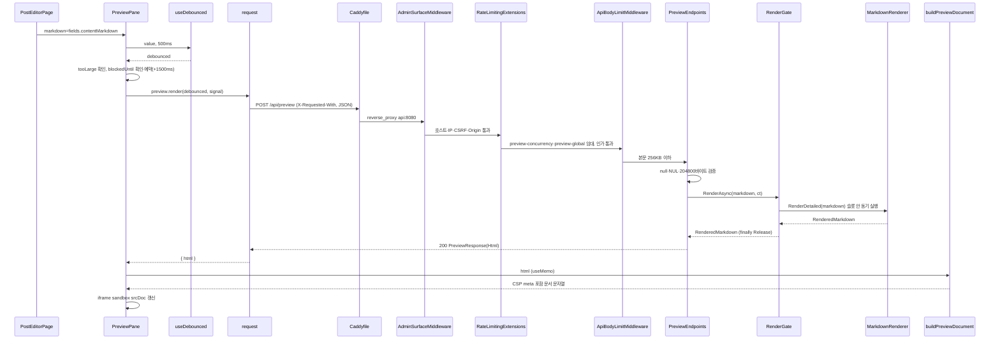
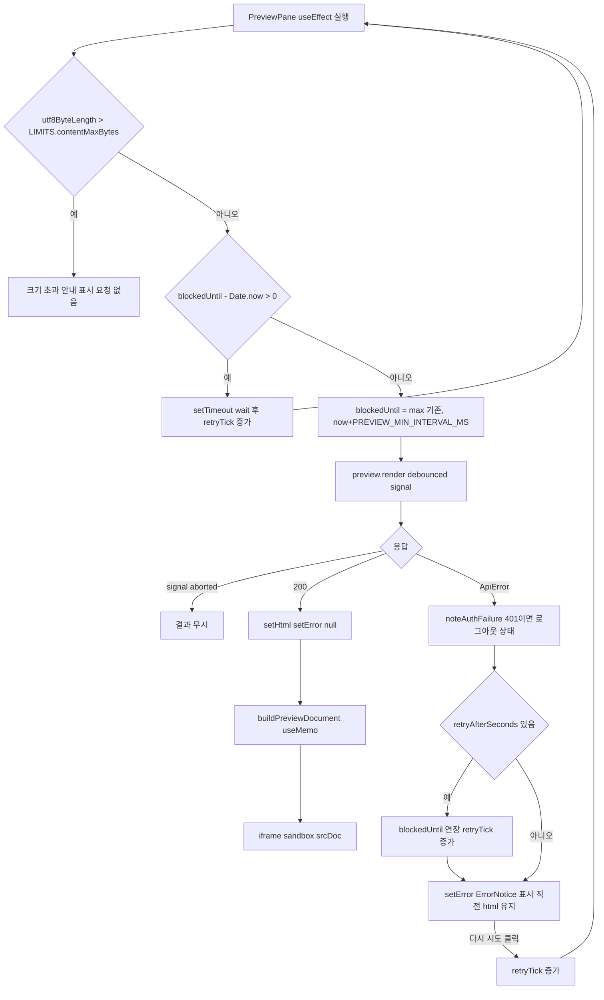
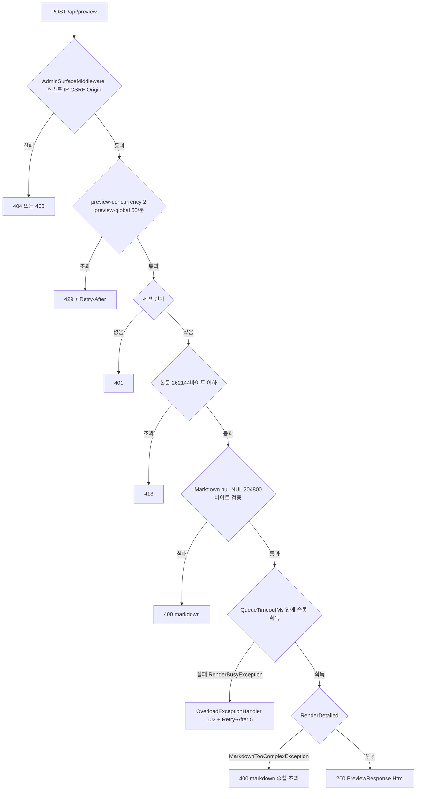

# F004 마크다운 실시간 미리보기

<!-- doc-harness:section id="summary" hash="f550eb7306330e4fef3d0c339b946abe8037dd00ad78f00fbc60a28f288f2563" -->
## 한 줄 요약

결론: 미리보기는 SPA 쪽 호출 조절과 서버 쪽 방어가 겹친 구조다. 서버 방어는 클라이언트 조절 없이도 스스로 성립한다. 서버에는 아무것도 저장하지 않는다.

SPA의 PreviewPane이 하는 일:
- 500ms 디바운스
- 요청 사이 최소 1500ms 간격
- Retry-After 존중
- 204,800바이트 초과 시 요청 생략
- AbortController로 늦게 온 응답 무시

서버는 다음을 차례로 거친다.
1. AdminSurfaceMiddleware(호스트·IP·CSRF·Origin)
2. 속도 제한(동시성 2, 전역 분당 60)
3. 세션 인가
4. 256KB 본문 상한
5. 엔드포인트 입력 검증

그다음 전역 RenderGate(기본 동시 2, 대기 5000ms) 아래에서 MarkdownRenderer.RenderDetailed가 동기로 렌더링하고, 결과를 PreviewResponse(Html)로 돌려준다.

실패는 이렇게 변환된다.
- 중첩 초과(MarkdownTooComplexException): 400
- 게이트 대기 초과(RenderBusyException): OverloadExceptionHandler가 503과 Retry-After 5초
- 속도 제한 초과: 429와 Retry-After
- 바인딩 실패(잘못된 JSON 등): ThrowOnBadRequest=false에 따라 프레임워크의 400

DB·렌더 결과 캐시(RenderedPostCache)·파일 I/O를 쓰지 않는다. 받은 HTML은 React DOM에 넣지 않는다. CSP meta(default-src 'none', img/style은 현재 출처만 허용)를 담은 sandbox="" iframe의 srcDoc 문서로만 보여 준다. 스타일시트 2개 적용, 첨부 이미지 로드, 스크립트 부재는 E2E(admin.spec.ts, Chromium·Firefox)가 확인한다. 이전 분석을 코드로 재검증한 결과 동작 변경은 없었다. 증거 줄 범위와 해소된 미확인 항목(vite 프록시, CSS 스냅숏 테스트, E2E)만 보정했다.

| 항목 | 값 |
|---|---|
| 중요도 | SUPPORTING |
| 상태 | ACTIVE |
| 진입점 | `POST /api/preview`, `SPA /posts/new`, `SPA /posts/:id` |
| 의존 기능 | [F001](../09_FEATURES.md#f001), [F003](../09_FEATURES.md#f003), [F010](../09_FEATURES.md#f010), [F011](../09_FEATURES.md#f011), [F018](../09_FEATURES.md#f018), [F019](../09_FEATURES.md#f019), [F020](../09_FEATURES.md#f020), [F021](../09_FEATURES.md#f021), [F029](../09_FEATURES.md#f029) |

### 진입점 근거

| 내용 | 상태 | 근거 |
|---|---|---|
| POST /api/preview: PreviewEndpoints.MapPreviewEndpoints가 /api 그룹에 MapPost("/preview", Render)로 등록한다. RateLimitMetadata(RateLimitPolicy.Preview)와 이름 PreviewMarkdown을 붙인다. /api 그룹에는 RequireHost(관리 호스트)와 RequireAuthorization(세션 정책)이 걸려 있다. | CONFIRMED | `PortfolioBlog.Api/Features/Preview/PreviewEndpoints.cs` PreviewEndpoints.MapPreviewEndpoints (36-41), `PortfolioBlog.Api/Features/ApiEndpoints.cs` ApiEndpoints.MapApiEndpoints (34-47) |
| SPA 경로 /posts/new와 /posts/:id는 PostEditorPage를 지연 로드(route.lazy)한다. PostEditorPage는 편집 중인 fields.contentMarkdown을 <PreviewPane markdown=...>으로 넘긴다. | CONFIRMED | `PortfolioBlog.Web/src/app/routes.tsx` (13, 29-30), `PortfolioBlog.Web/src/pages/PostEditorPage.tsx` (370) |
| 클라이언트 호출 함수는 preview.render(markdown, signal)이다. 내부에서 request<PreviewResponse>('POST', '/api/preview', { json: { markdown }, signal })를 호출한다. | CONFIRMED | `PortfolioBlog.Web/src/api/endpoints.ts` preview.render (50-51) |
<!-- /doc-harness:section -->

<!-- doc-harness:section id="flow" hash="031fb9739478be328cbf69437fe3ea8c55ff521294a5296dc72e8d4c65b3a0f0" -->
## 처리 흐름

| 단계 | 컴포넌트 | 코드 | 설명 |
|---|---|---|---|
| 1 | PostEditorPage | `PortfolioBlog.Web/src/pages/PostEditorPage.tsx` PostEditorPage | 에디터 onChange가 fields.contentMarkdown을 갱신한다. 그 값이 <PreviewPane markdown={fields.contentMarkdown} />으로 넘어간다(370행). |
| 2 | useDebounced | `PortfolioBlog.Web/src/lib/useDebounced.ts` useDebounced | 값이 500ms(PREVIEW_DEBOUNCE_MS) 동안 바뀌지 않았을 때만 debounced 값을 갱신한다. 값이 바뀌면 effect 정리에서 이전 setTimeout을 clearTimeout으로 취소한다. |
| 3 | PreviewPane | `PortfolioBlog.Web/src/components/PreviewPane.tsx` PreviewPane (useEffect) | debounced의 UTF-8 바이트가 LIMITS.contentMaxBytes(204,800)를 넘으면 요청하지 않고 경고만 렌더링한다. blockedUntil이 아직 미래면 남은 시간만큼 window.setTimeout을 건다. 타이머가 끝나면 retryTick을 올려 effect를 다시 실행한다. |
| 4 | PreviewPane | `PortfolioBlog.Web/src/components/PreviewPane.tsx` PreviewPane (useEffect) | 요청 직전에 blockedUntil을 max(기존값, now+1500ms)로 예약한다. 새 AbortController를 만들고 preview.render(debounced, signal)을 호출한다. |
| 5 | request | `PortfolioBlog.Web/src/api/client.ts` request | buildUrl로 /api 경로 형태를 검사한 뒤 fetch를 호출한다. 헤더는 X-Requested-With: XMLHttpRequest, Accept·Content-Type: application/json이다. 옵션은 credentials same-origin, cache no-store, redirect error다. 2xx가 아니면 toApiError로 ApiError(Retry-After 파싱 포함)를 던진다. |
| 6 | Caddyfile / vite.config.ts | `deploy/Caddyfile` {$ADMIN_DOMAIN} @backend | 운영에서는 관리 도메인의 /api/* 요청이 허용 CIDR 검사(밖이면 404)와 request_body 11MiB 상한을 거쳐 reverse_proxy api:8080으로 간다. 개발과 E2E(vite dev·preview)에서는 vite.config.ts의 proxy가 '^/api/'·'^/attachments/'를 API_ORIGIN으로 넘긴다(changeOrigin: false). |
| 7 | AdminSurfaceMiddleware | `PortfolioBlog.Api/Infrastructure/Access/AdminSurfaceMiddleware.cs` AdminSurfaceMiddleware | /api 요청의 호스트, IP 허용 목록, X-Requested-With 헤더, 안전하지 않은 메서드의 Origin을 차례로 검사한다. 실패하면 본문을 읽기 전에 404 또는 403으로 거부한다. |
| 8 | RateLimitingExtensions | `PortfolioBlog.Api/Infrastructure/Web/RateLimitingExtensions.cs` BuildChain | 엔드포인트 메타데이터가 Preview인 요청에 두 제한을 차례로 적용한다. 먼저 동시성 제한 preview-concurrency(Admin:PreviewConcurrency, 기본 2), 그다음 전역 고정 창 preview-global(Admin:PreviewPerMinute, 기본 60/분)이다. 대기열은 0이고, 초과하면 즉시 429와 Retry-After를 돌려준다. |
| 9 | Program | `PortfolioBlog.Api/Program.cs` UseAuthentication/UseAuthorization | 세션 정책 인가를 거친다. 세션이 없으면 401이다(테스트 Preview_WithoutSession_Returns401). |
| 10 | ApiBodyLimitMiddleware | `PortfolioBlog.Api/Infrastructure/Web/ApiBodyLimitMiddleware.cs` ApiBodyLimitMiddleware.InvokeAsync | JSON 본문을 262,144바이트로 제한한다. 선언한 Content-Length가 넘으면 413을 돌려준다. 길이를 선언하지 않은 본문은 LengthLimitedStream이 읽는 도중 BadHttpRequestException(413)을 던진다. |
| 11 | PreviewEndpoints | `PortfolioBlog.Api/Features/Preview/PreviewEndpoints.cs` PreviewEndpoints.Render | 최소 API 바인딩으로 PreviewRequest를 받는다. 바인딩 실패는 ThrowOnBadRequest=false라 프레임워크가 400으로 처리한다. 이어서 Markdown이 null이거나, NUL을 포함하거나(TextRules.ContainsNul), UTF-8 204,800바이트를 넘으면 ValidationProblem(키 markdown, 400)을 돌려준다. |
| 12 | RenderGate | `PortfolioBlog.Api/Infrastructure/Markdown/RenderGate.cs` RenderGate.RenderAsync | SemaphoreSlim.WaitAsync(QueueTimeoutMs, ct)로 전역 렌더 슬롯을 기다린다. 이 슬롯은 미리보기·저장·공개 페이지가 함께 쓴다. 슬롯을 얻지 못하면 RenderBusyException을 던지고, 이 예외는 UseExceptionHandler를 거쳐 OverloadExceptionHandler로 간다. 슬롯을 얻으면 렌더 함수를 동기로 호출하고 finally에서 Release한다. |
| 13 | MarkdownRenderer | `PortfolioBlog.Api/Infrastructure/Markdown/MarkdownRenderer.cs` MarkdownRenderer.RenderDetailed | Markdig로 파싱한다(DisableHtml, 허용 확장만 사용). ApplyUrlPolicy(UrlPolicy.IsAllowedImage/IsAllowedLink)와 HeadingIds.Assign을 적용하고, HighlightingCodeBlockRenderer로 HTML을 만든다. HtmlSanitizer로 정제해 RenderedMarkdown을 돌려준다. 중첩 한도를 넘으면 MarkdownTooComplexException을 던진다. |
| 14 | PreviewEndpoints | `PortfolioBlog.Api/Features/Preview/PreviewEndpoints.cs` PreviewEndpoints.Render | TypedResults.Ok(new PreviewResponse(Html))를 돌려준다. MarkdownTooComplexException은 잡아서 ValidationProblem(키 markdown, 400)으로 바꾼다. |
| 15 | PreviewPane | `PortfolioBlog.Web/src/components/PreviewPane.tsx` PreviewPane (then 콜백) | signal.aborted면 결과를 버린다. 성공하면 setHtml과 setError(null)을 호출한다. 실패하면 먼저 noteAuthFailure를 호출한다(401이면 로그인 상태를 끈다). Retry-After가 있으면 blockedUntil을 연장하고 retryTick을 올린다. 마지막으로 setError를 호출한다. |
| 16 | buildPreviewDocument | `PortfolioBlog.Web/src/lib/previewDoc.ts` buildPreviewDocument | useMemo 안에서 html을 문서 문자열로 감싼다. head의 첫 요소로 CSP meta(previewCsp(window.location.origin))를 넣고, /preview/site.css·/preview/highlight.css 링크와 
를 붙인다. 이 문서는 sandbox="" iframe의 srcDoc에만 들어간다. |
<!-- /doc-harness:section -->

<!-- doc-harness:section id="F004_SEQUENCE" hash="6e622d6ab2becb8786887807b3ab85e059d0e365fa46ad796a26e0f81c263a7b" -->
## 미리보기 정상 경로 호출 순서 (Sequence Diagram)

편집 본문은 PreviewPane의 디바운스와 간격 조절을 거친다. 이어 서버의 접근 통제·속도 제한·본문 상한·입력 검증을 지나 RenderGate 슬롯 안에서 MarkdownRenderer로 렌더링된다. 결과 HTML은 buildPreviewDocument가 sandbox iframe 문서로 감싼다.

1. PostEditorPage가 편집 중인 본문을 PreviewPane에 넘긴다. useDebounced가 500ms 동안 입력이 멈출 때까지 기다린다.
2. PreviewPane은 크기 초과 여부와 blockedUntil을 확인한 뒤, 다음 요청 하한을 1500ms 뒤로 예약하고 preview.render를 부른다. request는 CSRF 헤더와 JSON 본문을 붙여 fetch한다.
3. 운영에서는 Caddyfile의 @backend가 api:8080으로 프록시한다. 개발·E2E에서는 vite.config.ts의 proxy가 같은 역할을 한다.
4. 서버 파이프라인은 Program.cs 순서를 따른다: AdminSurfaceMiddleware → UseRateLimiter(RateLimitingExtensions.BuildChain) → 인증·인가 → ApiBodyLimitMiddleware → PreviewEndpoints.Render.
5. Render는 입력을 검증한 뒤 RenderGate.RenderAsync로 전역 슬롯을 얻는다. 슬롯 안에서 MarkdownRenderer.RenderDetailed를 동기로 실행하고, 슬롯은 finally에서 반납한다.
6. 응답의 Html만 PreviewResponse로 돌아온다. PreviewPane은 이를 buildPreviewDocument로 CSP meta와 스타일시트가 든 문서로 감싸 sandbox="" iframe의 srcDoc에 넣는다.

실패 분기는 F004_FLOW와 F004_FLOW_ERROR에 따로 그렸다.

### 코드 근거

| 구성 요소 | 코드 |
|---|---|
| PostEditorPage | `PortfolioBlog.Web/src/pages/PostEditorPage.tsx` (PostEditorPage) |
| PreviewPane | `PortfolioBlog.Web/src/components/PreviewPane.tsx` (PreviewPane) |
| useDebounced | `PortfolioBlog.Web/src/lib/useDebounced.ts` (useDebounced) |
| request | `PortfolioBlog.Web/src/api/client.ts` (request) |
| Caddyfile | `deploy/Caddyfile` ({$ADMIN_DOMAIN} @backend) |
| AdminSurfaceMiddleware | `PortfolioBlog.Api/Infrastructure/Access/AdminSurfaceMiddleware.cs` (AdminSurfaceMiddleware) |
| RateLimitingExtensions | `PortfolioBlog.Api/Infrastructure/Web/RateLimitingExtensions.cs` (BuildChain) |
| ApiBodyLimitMiddleware | `PortfolioBlog.Api/Infrastructure/Web/ApiBodyLimitMiddleware.cs` (InvokeAsync) |
| PreviewEndpoints | `PortfolioBlog.Api/Features/Preview/PreviewEndpoints.cs` (PreviewEndpoints.Render) |
| RenderGate | `PortfolioBlog.Api/Infrastructure/Markdown/RenderGate.cs` (RenderGate.RenderAsync) |
| MarkdownRenderer | `PortfolioBlog.Api/Infrastructure/Markdown/MarkdownRenderer.cs` (MarkdownRenderer.RenderDetailed) |
| buildPreviewDocument | `PortfolioBlog.Web/src/lib/previewDoc.ts` (buildPreviewDocument) |
<!-- /doc-harness:section -->

<!-- doc-harness:section id="F004_FLOW" hash="7b7cb52a2010614d45d6e99ad87648878e697606c659ce692ba8b479d7eef621" -->
## PreviewPane 요청 스케줄링과 실패 처리(클라이언트) (Flowchart)

PreviewPane은 크기 초과 시 요청하지 않는다. blockedUntil(최소 간격·Retry-After)이 지날 때까지 타이머로 기다리며, abort된 응답은 버린다. 실패해도 직전 HTML은 유지한다.

effect는 [debounced, tooLarge, retryTick, client]가 바뀔 때마다 다시 실행된다.

- 크기 초과: utf8ByteLength가 LIMITS.contentMaxBytes(204,800)를 넘으면 요청 없이 안내 문단만 렌더링한다.
- 대기: blockedUntil이 미래면 남은 시간만큼 타이머를 걸고, 만료되면 retryTick을 올려 effect를 다시 돈다.
- 요청: 보내기 직전에 PREVIEW_MIN_INTERVAL_MS(1500ms)만큼 하한을 예약한다. Math.max를 쓰므로 이미 더 먼 시각이 잡혀 있으면 앞당기지 않는다.
- 성공: html을 갱신하고 error를 지운다.
- 실패: noteAuthFailure로 401을 처리한다. Retry-After가 있으면 blockedUntil을 연장하고 retryTick을 올린 뒤 error를 설정한다.
- 다시 시도: 버튼은 retryTick만 올리므로 대기 규칙을 우회하지 못한다.
- 폐기: effect 정리에서 controller.abort()를 호출하고, 이후 도착한 응답은 signal.aborted 가드가 버린다.

html이 바뀌면 buildPreviewDocument(useMemo)가 새 srcDoc을 만든다.

### 코드 근거

| 구성 요소 | 코드 |
|---|---|
| PreviewPane | `PortfolioBlog.Web/src/components/PreviewPane.tsx` (PreviewPane useEffect) |
| LIMITS.contentMaxBytes | `PortfolioBlog.Web/src/lib/validation.ts` (LIMITS) |
| PREVIEW_MIN_INTERVAL_MS | `PortfolioBlog.Web/src/components/PreviewPane.tsx` (PREVIEW_MIN_INTERVAL_MS) |
| preview.render | `PortfolioBlog.Web/src/api/endpoints.ts` (preview.render) |
| noteAuthFailure | `PortfolioBlog.Web/src/app/queryClient.ts` (noteAuthFailure) |
| ErrorNotice | `PortfolioBlog.Web/src/components/notices.tsx` (ErrorNotice) |
| buildPreviewDocument | `PortfolioBlog.Web/src/lib/previewDoc.ts` (buildPreviewDocument) |
<!-- /doc-harness:section -->

<!-- doc-harness:section id="F004_FLOW_ERROR" hash="01f13033ffe2d76c9dde05ead0caf30a94da68a0a1f09ab94e9cacd04883cda5" -->
## 서버 측 POST /api/preview 거부·실패 분기 (Flowchart)

POST /api/preview는 접근 통제(404/403), 속도 제한(429), 인가(401), 본문 상한(413), 입력 검증(400), 렌더 게이트(503), 중첩 한도(400)를 차례로 통과해야 200을 받는다.

분기 순서는 Program.cs의 미들웨어 등록 순서(104-108행)와 PreviewEndpoints.Render의 본문 순서를 따른다.

- AdminSurfaceMiddleware: 호스트 불일치는 404, IP·CSRF 헤더·Origin 실패는 403이다.
- RateLimitingExtensions: 동시성 제한을 창 제한보다 먼저 적용한다. 거부 시 429와 Retry-After(창 거부 1~60초, 동시성 거부 5초)를 준다.
- 인가: 세션이 없으면 401이다. Program.cs 주석대로, 본문 크기와 무관하게 401이 413보다 먼저다.
- ApiBodyLimitMiddleware: 본문이 262,144바이트를 넘으면 413이다.
- 바인딩 실패: 그림에는 없다. ThrowOnBadRequest=false라 프레임워크가 400을 준다(failurePoints 참조).
- Render 입력 검증: 실패하면 400 ValidationProblem이다.
- RenderGate: 슬롯 대기 초과 시 RenderBusyException이 나고, UseExceptionHandler에 등록된 OverloadExceptionHandler가 503과 Retry-After 5를 준다.
- 렌더: 중첩 초과는 Render가 잡아 400으로 바꾼다.

### 코드 근거

| 구성 요소 | 코드 |
|---|---|
| AdminSurfaceMiddleware | `PortfolioBlog.Api/Infrastructure/Access/AdminSurfaceMiddleware.cs` (AdminSurfaceMiddleware) |
| RateLimitingExtensions | `PortfolioBlog.Api/Infrastructure/Web/RateLimitingExtensions.cs` (BuildChain) |
| Authorization | `PortfolioBlog.Api/Features/ApiEndpoints.cs` (RequireAuthorization) |
| ApiBodyLimitMiddleware | `PortfolioBlog.Api/Infrastructure/Web/ApiBodyLimitMiddleware.cs` (InvokeAsync) |
| PreviewEndpoints | `PortfolioBlog.Api/Features/Preview/PreviewEndpoints.cs` (PreviewEndpoints.Render) |
| RenderGate | `PortfolioBlog.Api/Infrastructure/Markdown/RenderGate.cs` (RenderGate.RenderAsync) |
| OverloadExceptionHandler | `PortfolioBlog.Api/Infrastructure/Web/OverloadExceptionHandler.cs` (TryHandleAsync) |
| MarkdownRenderer | `PortfolioBlog.Api/Infrastructure/Markdown/MarkdownRenderer.cs` (RenderDetailed) |
| PreviewResponse | `PortfolioBlog.Api/Contracts/PreviewDtos.cs` (PreviewResponse) |
<!-- /doc-harness:section -->

<!-- doc-harness:section id="data" hash="2da6afd18b67d635afaa75c6b6b6b57345cf2caae96e282589d1f1847e69dad2" -->
## 데이터

### 데이터 흐름

| 내용 | 상태 | 근거 |
|---|---|---|
| 입력: 에디터 본문 문자열이 fields.contentMarkdown과 useDebounced(500ms)를 거쳐 JSON { markdown }이 되고, POST /api/preview 본문에 실린다. 직렬화는 JSON.stringify이며 비 ASCII를 이스케이프하지 않는다. | CONFIRMED | `PortfolioBlog.Web/src/components/PreviewPane.tsx` (27-46), `PortfolioBlog.Web/src/api/endpoints.ts` (50-51), `PortfolioBlog.Web/src/api/client.ts` request (46-62) |
| 서버 DTO: 입력은 PreviewRequest(string? Markdown)로 바인딩한다. 누락을 필드별 400으로 돌려주려고 nullable로 받는다. 출력 DTO는 PreviewResponse(string Html)이고, SPA 타입은 PreviewResponse { html: string }이다. | CONFIRMED | `PortfolioBlog.Api/Contracts/PreviewDtos.cs` (1-9), `PortfolioBlog.Web/src/api/types.ts` (32) |
| 변환: 마크다운이 RenderGate.RenderAsync와 MarkdownRenderer.RenderDetailed를 거쳐 RenderedMarkdown(Html, FirstImageUrl, HighlightTimedOut)이 된다. 미리보기는 그중 Html만 PreviewResponse에 싣고 FirstImageUrl·HighlightTimedOut은 버린다. | CONFIRMED | `PortfolioBlog.Api/Features/Preview/PreviewEndpoints.cs` Render (69), `PortfolioBlog.Api/Infrastructure/Markdown/MarkdownRenderer.cs` RenderDetailed (16, 111-144) |
| 저장 없음: 미리보기 결과는 서버에 보관하지 않는다. DB·RenderedPostCache·파일 I/O를 쓰지 않는다. 엔드포인트가 주입받는 의존성은 RenderGate 하나뿐이다. | CONFIRMED | `PortfolioBlog.Api/Features/Preview/PreviewEndpoints.cs` Render (52, 56) |
| 출력 표시: html 상태가 buildPreviewDocument를 거쳐 문서 문자열이 된다. 문서에는 CSP meta, 스타일시트 링크 2개, <main><article>
 래퍼가 들어간다. 이 문자열은 <iframe sandbox="" srcDoc>에만 들어가고 React DOM에는 넣지 않는다. | CONFIRMED | `PortfolioBlog.Web/src/lib/previewDoc.ts` buildPreviewDocument (30-37), `PortfolioBlog.Web/src/components/PreviewPane.tsx` (64-73) |
| iframe 문서는 관리 출처에서 /preview/site.css·/preview/highlight.css(SPA public 정적 파일)와 본문 이미지를 불러온다. 이미지는 UrlPolicy.IsAllowedImage가 허용하는 /attachments/{guid}/{name} 자체 첨부만 남는다. 운영에서는 관리 도메인의 /attachments/*가 Caddy @backend를 거쳐, /api 그룹 밖에 등록된 PublicAttachmentEndpoints(AllowAnonymous)로 간다. 개발·E2E에서는 vite proxy '^/attachments/'가 같은 경계를 쓴다. E2E가 iframe 안 styleSheets.length === 2와 이미지 naturalWidth === 1을 확인한다. | CONFIRMED | `PortfolioBlog.Web/src/lib/previewDoc.ts` PREVIEW_STYLESHEETS (22), `PortfolioBlog.Api/Infrastructure/Markdown/UrlPolicy.cs` IsAllowedImage (20-21, 55-57), `deploy/Caddyfile` (92-99), `PortfolioBlog.Web/vite.config.ts` proxy (18-21), `PortfolioBlog.Api/Features/Attachments/PublicAttachmentEndpoints.cs` MapPublicAttachmentEndpoints (50-54), `PortfolioBlog.Web/e2e/admin.spec.ts` (139-152) |
| CSS 사본 동기화: public/preview/site.css는 PortfolioBlog.Api/wwwroot/css/site.css와, highlight.css는 서버의 HighlightCss.Value와 같아야 한다. PreviewCssSnapshotTests가 줄 끝을 정규화한 뒤 비교해 이를 강제한다. | CONFIRMED | `PortfolioBlog.Api.Tests/Infrastructure/PreviewCssSnapshotTests.cs` (23-56) |
| 오류 데이터: 실패 응답(ProblemDetails 또는 본문 없음)은 toApiError에서 ApiError(status, title, detail, fieldErrors, retryAfterSeconds)가 된다. 화면에는 ErrorNotice가 describeError의 한 줄 문구를 텍스트로만 표시한다. | CONFIRMED | `PortfolioBlog.Web/src/api/errors.ts` toApiError/describeError (54-84), `PortfolioBlog.Web/src/components/notices.tsx` ErrorNotice (4) |

### DB 접근

_(없음)_

### 상태 전이

| 이전 | 다음 | 트리거 | 근거 |
|---|---|---|---|
| idle(요청 가능, blockedUntil <= now) | 요청 중(blockedUntil = max(기존, now+1500ms)) | debounced 값 변경 또는 retryTick 증가로 effect가 실행되고 tooLarge가 false | `PortfolioBlog.Web/src/components/PreviewPane.tsx` PreviewPane useEffect (35-46) |
| 요청 중 | 성공 표시(html 갱신, error=null) | 200 응답이고 signal이 abort되지 않음 | `PortfolioBlog.Web/src/components/PreviewPane.tsx` (47-50) |
| 요청 중 | 오류 표시(error 설정, 직전 html 유지) | ApiError 등 실패이고 signal이 abort되지 않음 | `PortfolioBlog.Web/src/components/PreviewPane.tsx` (51-60) |
| 요청 중 | 차단 대기(blockedUntil = max(기존, now+Retry-After초)) | 실패 응답에 Retry-After가 있음(429·503). retryTick이 증가한다 | `PortfolioBlog.Web/src/components/PreviewPane.tsx` (54-58) |
| 차단 대기 | idle | window.setTimeout(wait)이 만료되어 retryTick이 증가하고 effect가 다시 실행됨 | `PortfolioBlog.Web/src/components/PreviewPane.tsx` (37-41) |
| 요청 중 | 폐기(abort) | effect 정리: debounced·retryTick이 바뀌거나 언마운트되면 controller.abort() | `PortfolioBlog.Web/src/components/PreviewPane.tsx` (61) |
| any | 크기 초과 안내(요청 없음) | utf8ByteLength(debounced) > LIMITS.contentMaxBytes | `PortfolioBlog.Web/src/components/PreviewPane.tsx` (33-36, 67-68) |
| RenderGate 슬롯 대기 | 렌더 실행(슬롯 점유) | SemaphoreSlim.WaitAsync가 QueueTimeoutMs 안에 성공 | `PortfolioBlog.Api/Infrastructure/Markdown/RenderGate.cs` RenderAsync (86-98) |
| RenderGate 슬롯 대기 | 거부(RenderBusyException → 503) | QueueTimeoutMs 안에 슬롯을 얻지 못함 | `PortfolioBlog.Api/Infrastructure/Markdown/RenderGate.cs` RenderAsync (88), `PortfolioBlog.Api/Infrastructure/Web/OverloadExceptionHandler.cs` TryHandleAsync (35-42) |

### 외부 의존

| 내용 | 상태 | 근거 |
|---|---|---|
| MarkdownRenderer 안에서 세 가지를 쓴다. Markdig(파싱·HTML 렌더), Ganss.Xss HtmlSanitizer(HtmlAllowlist.Create로 구성한 정제기), 코드 강조(HighlightingCodeBlockRenderer, ColorCode 계열)다. | CONFIRMED | `PortfolioBlog.Api/Infrastructure/Markdown/MarkdownRenderer.cs` (1-9, 44-54, 111-144) |
| ASP.NET Core Rate Limiting(System.Threading.RateLimiting의 PartitionedRateLimiter.CreateChained)으로 Preview 정책의 동시성 제한과 고정 창 제한을 구현한다. | CONFIRMED | `PortfolioBlog.Api/Infrastructure/Web/RateLimitingExtensions.cs` BuildChain (88-101) |
| 프런트엔드는 React(useEffect/useMemo/useRef/useState), @tanstack/react-query의 useQueryClient, 브라우저 fetch와 AbortController를 쓴다. useQueryClient는 401 처리에만 쓰고, 미리보기 요청 자체는 react-query 쿼리가 아니다. | CONFIRMED | `PortfolioBlog.Web/src/components/PreviewPane.tsx` (1-9, 42-62) |
| 운영에서는 앞단 Caddy가 관리 도메인의 /api/*·/attachments/*를 api:8080으로 프록시하고, SPA 정적 파일(/preview/*.css 포함)을 /srv에서 서빙한다. 관리 SPA 응답 CSP의 frame-src 'self'가 iframe의 이동을 제한한다. | CONFIRMED | `deploy/Caddyfile` (79-143) |
| 개발·E2E에서는 Vite 서버(dev 5173, preview 4173)가 '^/api/'·'^/attachments/'를 API_ORIGIN(기본 https://localhost:7198)으로 프록시하고, public/preview/*.css를 정적 파일로 서빙한다. vite preview에는 ADMIN_SECURITY_HEADERS가 붙는다. | CONFIRMED | `PortfolioBlog.Web/vite.config.ts` (8, 18-21, 33-35) |
<!-- /doc-harness:section -->

<!-- doc-harness:section id="failures" hash="d0d94a721d462b5271b148b509c623f82faa0e6b56c61487c58a32904c4a49e1" -->
## 실패 지점

| 위치 | 조건 | 처리 | 상태 | 근거 |
|---|---|---|---|---|
| PreviewEndpoints.Render (입력 검증) | Markdown이 null이거나, NUL 문자를 포함하거나, UTF-8 204,800바이트를 넘음 | TypedResults.ValidationProblem으로 400을 돌려준다(키 markdown). 렌더러는 호출하지 않는다. | CONFIRMED | `PortfolioBlog.Api/Features/Preview/PreviewEndpoints.cs` (58-63), `PortfolioBlog.Api.Tests/Features/PreviewEndpointsTests.cs` Preview_InvalidInput_Returns400 (37-51) |
| 최소 API 바인딩(PreviewRequest) | 본문이 잘못된 JSON이거나 markdown이 문자열이 아님(예: 숫자). 또는 Content-Type이 JSON이 아님 | RouteHandlerOptions.ThrowOnBadRequest=false이므로 예외가 아니라 프레임워크가 400을 돌려준다. 이 400에는 Render의 errors.markdown 키가 없다. JSON이 아닌 Content-Type은 프레임워크가 415를 돌려줄 것으로 보이며, SPA의 describeError에 415 문구가 있다. SPA는 항상 JSON.stringify({ markdown: string })를 보내므로 이 경로는 직접 호출자만 밟는다. 설정 자체는 코드로 확인했지만, 응답 본문 형태와 415는 프레임워크 동작이라 추론이다. | INFERRED | `PortfolioBlog.Api/Program.cs` (48-49), `PortfolioBlog.Web/src/api/errors.ts` describeError (79) |
| MarkdownRenderer.RenderDetailed → PreviewEndpoints.Render | Markdig 중첩 한도(128)를 넘어 ArgumentException이 나고, 이것이 MarkdownTooComplexException으로 감싸짐 | 엔드포인트가 잡아 400 ValidationProblem('마크다운 구조가 너무 깊게 중첩됐습니다...')으로 바꾼다. | CONFIRMED | `PortfolioBlog.Api/Infrastructure/Markdown/MarkdownRenderer.cs` (138-143), `PortfolioBlog.Api/Features/Preview/PreviewEndpoints.cs` (71-76), `PortfolioBlog.Api.Tests/Features/PreviewEndpointsTests.cs` Preview_TooDeeplyNested_Returns400 (89-99) |
| RenderGate.RenderAsync | QueueTimeoutMs(기본 5000ms) 안에 전역 렌더 슬롯(Rendering:Concurrency, 기본 2)을 얻지 못함 | RenderBusyException이 전파된다. UseExceptionHandler에 등록된 OverloadExceptionHandler가 IsOverload로 이를 판정해 503과 Retry-After: 5로 응답한다. | CONFIRMED | `PortfolioBlog.Api/Infrastructure/Markdown/RenderGate.cs` (88), `PortfolioBlog.Api/Infrastructure/Web/OverloadExceptionHandler.cs` (20, 35-42, 63-70), `PortfolioBlog.Api/Program.cs` (43, 100) |
| RateLimitingExtensions (UseRateLimiter) | Preview 동시 실행이 PreviewConcurrency(기본 2)를 넘거나, 전역 분당 요청이 PreviewPerMinute(기본 60)를 넘음 | 대기열 없이 즉시 429를 돌려준다. Retry-After는 고정 창 거부면 창이 끝날 때까지(1~60초), 동시성 거부면 5초다. 판정은 엔드포인트 메타데이터로 하므로, 경로의 대소문자나 후행 슬래시를 바꿔도 같은 예산을 쓴다. | CONFIRMED | `PortfolioBlog.Api/Infrastructure/Web/RateLimitingExtensions.cs` (44-72, 88-101), `PortfolioBlog.Api.Tests/Features/PreviewEndpointsTests.cs` Preview_IsRateLimited_AndPathVariantsShareTheBudget (73-86) |
| 인가 미들웨어(/api 그룹 RequireAuthorization) | 세션 쿠키가 없거나 만료됨 | 401을 돌려준다. SPA에서는 noteAuthFailure가 로그인 상태를 해제한다. | CONFIRMED | `PortfolioBlog.Api/Features/ApiEndpoints.cs` (39), `PortfolioBlog.Web/src/app/queryClient.ts` noteAuthFailure (11), `PortfolioBlog.Api.Tests/Features/PreviewEndpointsTests.cs` Preview_WithoutSession_Returns401 (64-70) |
| AdminSurfaceMiddleware | 관리 호스트가 아니거나, IP 허용 목록 밖이거나, X-Requested-With가 없거나, Origin이 관리 origin과 다름 | 본문을 읽기 전에 404(호스트) 또는 403(IP·CSRF·Origin)으로 거부한다. | CONFIRMED | `PortfolioBlog.Api/Infrastructure/Access/AdminSurfaceMiddleware.cs` (56-95) |
| ApiBodyLimitMiddleware | JSON 본문이 262,144바이트를 넘음(선언 길이 또는 스트리밍 누적) | 413을 돌려준다. 선언 길이 초과는 ErrorResponses.WriteAsync가, 스트리밍 누적 초과는 LengthLimitedStream의 BadHttpRequestException(413)이 처리한다. | CONFIRMED | `PortfolioBlog.Api/Infrastructure/Web/ApiBodyLimitMiddleware.cs` (47-56, 80-86) |
| RenderGate.RenderAsync (슬롯 대기 중 취소) | 클라이언트가 요청을 abort해 RequestAborted 토큰이 슬롯 대기 중에 취소됨 | WaitAsync가 OperationCanceledException을 던진다. 엔드포인트와 게이트는 이를 잡지 않고, OverloadExceptionHandler.IsOverload도 이를 과부하로 분류하지 않는다. 앱 코드에 OperationCanceledException 전용 처리는 없으므로 프레임워크 기본 예외 처리 경로로 간다. 클라이언트는 이미 연결을 끊어 응답을 받지 않는다. | INFERRED | `PortfolioBlog.Api/Infrastructure/Markdown/RenderGate.cs` (86-98), `PortfolioBlog.Api/Infrastructure/Web/OverloadExceptionHandler.cs` IsOverload (63-70) |
| RenderGate.RenderAsync (렌더 실행 중) | 적대적 입력 때문에 Markdig 파서가 초선형 시간을 씀(문서상 최대 약 8.5초) | 렌더 자체는 취소할 수 없는 동기 CPU 작업이고 타임아웃도 없다. 그동안 슬롯과 요청 스레드를 점유한다. 방어 수단은 동시성 제한(미리보기 2, 전역 게이트)과 분당 한도뿐이다. | POTENTIAL_ISSUE | `PortfolioBlog.Api/Features/Preview/PreviewEndpoints.cs` (14-20), `PortfolioBlog.Api/Infrastructure/Markdown/MarkdownRenderer.cs` (24-30) |
| request (client.ts) | fetch 네트워크 실패, 비-2xx 응답, 또는 2xx인데 JSON 파싱 실패 | 각각 ApiError(0, '네트워크 오류'), toApiError 결과, ApiError(status, '응답을 해석할 수 없습니다')를 던진다. AbortError는 그대로 다시 던진다. PreviewPane은 abort된 경우를 무시하고, 나머지는 ErrorNotice에 표시한다. 직전에 성공한 HTML은 유지한다. | CONFIRMED | `PortfolioBlog.Web/src/api/client.ts` (58-75), `PortfolioBlog.Web/src/components/PreviewPane.tsx` (51-60) |
| previewCsp (previewDoc.ts) | window.location.origin이 ORIGIN_PATTERN에 맞지 않음. 허용 형태는 http/https, 영숫자·점·하이픈 호스트 또는 IPv6 리터럴, 선택 포트다 | Error를 던진다. PreviewPane의 useMemo 안에서 호출되므로 렌더 중 예외가 된다. 컴포넌트에 별도 catch가 없어 React 오류 경계로 전파된다. | POTENTIAL_ISSUE | `PortfolioBlog.Web/src/lib/previewDoc.ts` previewCsp (16, 24-28), `PortfolioBlog.Web/src/components/PreviewPane.tsx` (64) |
| MarkdownRenderer.RenderDetailed (크기 검사) | 204,800바이트를 넘는 입력이 렌더러에 도달 | ArgumentException을 던진다(호출부 버그로 취급). 미리보기 경로에서는 엔드포인트가 먼저 400으로 걸러 여기까지 오지 않는다. | CONFIRMED | `PortfolioBlog.Api/Infrastructure/Markdown/MarkdownRenderer.cs` (113-117), `PortfolioBlog.Api/Features/Preview/PreviewEndpoints.cs` (61-62) |
| StartupValidation.Validate (기동 시) | Admin:PreviewPerMinute 또는 PreviewConcurrency가 1 미만. 또는 Rendering:Concurrency(1~64)·QueueTimeoutMs(1~60000)가 범위를 벗어남 | InvalidOperationException으로 앱 기동을 중단한다. 잘못된 설정으로는 미리보기가 동작하는 상태에 도달하지 않는다. | CONFIRMED | `PortfolioBlog.Api/Infrastructure/Access/StartupValidation.cs` (66-68, 103-106), `PortfolioBlog.Api/Program.cs` (76) |

### 엣지 케이스

| 내용 | 상태 | 근거 |
|---|---|---|
| 빈 문자열 markdown은 허용되며 빈 HTML과 200을 돌려준다. 에디터를 막 열었을 때의 경우다. | CONFIRMED | `PortfolioBlog.Api/Features/Preview/PreviewEndpoints.cs` (59), `PortfolioBlog.Api.Tests/Features/PreviewEndpointsTests.cs` Preview_EmptyMarkdown_ReturnsEmptyHtml (54-61) |
| SPA는 정확히 204,800바이트면 요청을 보내고, 204,801바이트면 보내지 않고 안내만 한다. 크기 판정 기준은 즉시 값이 아니라 디바운스된 값이다. | CONFIRMED | `PortfolioBlog.Web/src/components/PreviewPane.tsx` (33-36), `PortfolioBlog.Web/src/lib/validation.ts` (7, 17), `PortfolioBlog.Web/src/test/preview.test.tsx` (82-95) |
| 늦게 도착한 옛 응답은 controller.signal.aborted 가드에 걸려 버려지므로 최신 결과를 덮지 않는다. | CONFIRMED | `PortfolioBlog.Web/src/components/PreviewPane.tsx` (48, 52, 61), `PortfolioBlog.Web/src/test/preview.test.tsx` (128-153) |
| '다시 시도' 버튼은 retryTick만 올린다. 그래서 Retry-After나 최소 간격(1500ms)을 건너뛰지 못한다. Retry-After가 없는 500도 최소 간격이 지난 뒤에 재요청한다. | CONFIRMED | `PortfolioBlog.Web/src/components/PreviewPane.tsx` (69-71), `PortfolioBlog.Web/src/test/preview.test.tsx` (97-126) |
| Retry-After가 최소 간격보다 짧아도 Math.max 때문에 이미 예약한 하한을 앞당기지 않는다. 클라이언트는 Retry-After를 초 단위 정수로만 읽고 1~3600초로 클램프한다. | CONFIRMED | `PortfolioBlog.Web/src/components/PreviewPane.tsx` (45, 56), `PortfolioBlog.Web/src/api/errors.ts` parseRetryAfter (30-33) |
| 속도 제한 파티션은 IP나 사용자별이 아니라 전역이다(preview-global, preview-concurrency). 여러 탭과 관리자가 같은 예산을 나눠 쓴다. 클라이언트 주석은 1500ms 간격이면 한 탭이 분당 40건을 넘지 않는다고 설명한다. | CONFIRMED | `PortfolioBlog.Api/Infrastructure/Web/RateLimitingExtensions.cs` (91, 96), `PortfolioBlog.Web/src/components/PreviewPane.tsx` (12-18) |
| RenderGate는 미리보기·글 저장·공개 페이지가 함께 쓰는 싱글턴이다. 그래서 미리보기 부하가 공개 페이지의 렌더 대기(503)에 영향을 줄 수 있고, 그 반대도 마찬가지다. | INFERRED | `PortfolioBlog.Api/Infrastructure/Markdown/RenderGate.cs` (16-25), `PortfolioBlog.Api/Program.cs` (60), `PortfolioBlog.Api/Infrastructure/Markdown/RenderingOptions.cs` (17-21) |
| 테스트에 쓰는 .NET 기본 JSON 인코더는 비 ASCII를 \uXXXX로 부풀린다. 그래서 200KB 마크다운이 256KB 본문 상한(413)에 먼저 걸릴 수 있어, 테스트는 RelaxedOptions를 쓴다. 브라우저의 JSON.stringify는 이스케이프하지 않으므로 운영 트래픽과는 무관하다고 문서화돼 있다. | CONFIRMED | `PortfolioBlog.Api/Infrastructure/Web/ApiBodyLimitMiddleware.cs` (14-16), `PortfolioBlog.Api.Tests/Features/PreviewEndpointsTests.cs` (44-46) |
| 첫 성공 전(html='')에는 iframe이 빈 문서를 보여 준다. 오류 뒤에는 직전에 성공한 HTML을 계속 보여 준다. 한 번의 429·503으로 화면이 비지 않는다. | CONFIRMED | `PortfolioBlog.Web/src/components/PreviewPane.tsx` (22-23, 29, 64) |
| 위험 입력(javascript: 링크, <script>)은 공개 페이지와 같은 렌더러에서 중화된다. 링크 노드는 제거되고 script는 출력에 없다. E2E도 iframe 안에 script가 0개이고 부모 창 전역(__pwned)이 오염되지 않았음을 확인한다. | CONFIRMED | `PortfolioBlog.Api.Tests/Features/PreviewEndpointsTests.cs` Preview_RendersSanitizedHtml (22-34), `PortfolioBlog.Web/e2e/admin.spec.ts` (133, 145, 152) |
| previewDoc의 CSP는 'self' 대신 명시 출처를 쓴다. Firefox는 about:srcdoc 문서에서 'self'를 부모 출처로 해석하지 않기 때문이다. E2E는 chromium과 firefox 두 프로젝트로 실행된다. | CONFIRMED | `PortfolioBlog.Web/src/lib/previewDoc.ts` (10-13, 24-28), `PortfolioBlog.Web/playwright.config.ts` (30-32) |
| CSS 스냅숏 갱신 모드(UPDATE_PREVIEW_SNAPSHOTS=1)는 저장소의 public/preview/*.css를 덮어쓴 뒤 의도적으로 실패한다. 환경변수를 켠 채로 두면 드리프트 검사가 늘 통과해 버리는 것을 막기 위해서다. | CONFIRMED | `PortfolioBlog.Api.Tests/Infrastructure/PreviewCssSnapshotTests.cs` (37-52) |
| iframe은 코드베이스에서 PreviewPane 한 곳에만 있고, sandbox 토큰은 비어 있어야 한다. source-guards 테스트가 이를 고정한다. | CONFIRMED | `PortfolioBlog.Web/src/test/source-guards.test.ts` (92-94) |

### 로깅

| 내용 | 상태 | 근거 |
|---|---|---|
| PreviewEndpoints에는 ILogger 주입도, 로그 호출도 없다. 클래스 문서에 '본문은 로그에 남기지 않는다'고 명시돼 있다. | CONFIRMED | `PortfolioBlog.Api/Features/Preview/PreviewEndpoints.cs` (22, 56-77) |
| RenderGate는 로그를 남기지 않는다. 대신 테스트 관측용 카운터(_renderCount, Interlocked)만 둔다. | CONFIRMED | `PortfolioBlog.Api/Infrastructure/Markdown/RenderGate.cs` (33-34, 70, 91) |
| SPA의 PreviewPane·previewDoc·useDebounced에는 console 로깅이 없다. 실패는 ErrorNotice(또는 크기 초과 시 role=alert 문단)로만 사용자에게 보인다. | CONFIRMED | `PortfolioBlog.Web/src/components/PreviewPane.tsx` (65-75) |
| 운영에서는 Caddy 관리 사이트 블록의 log 지시어가 요청 접근 로그를 남긴다. | CONFIRMED | `deploy/Caddyfile` (79-80) |
<!-- /doc-harness:section -->

<!-- doc-harness:section id="code" hash="a182c3c7e691cf8373057306afd883590edf8dd454491d40f38f937a68e0a4d9" -->
## 관련 코드

| 파일 | 심볼 | 역할 |
|---|---|---|
| `PortfolioBlog.Api/Features/Preview/PreviewEndpoints.cs` | PreviewEndpoints.Render | entry |
| `PortfolioBlog.Api/Features/Preview/PreviewEndpoints.cs` | PreviewEndpoints.MapPreviewEndpoints | entry |
| `PortfolioBlog.Api/Features/ApiEndpoints.cs` | ApiEndpoints.MapApiEndpoints | config |
| `PortfolioBlog.Api/Contracts/PreviewDtos.cs` | PreviewRequest | dto |
| `PortfolioBlog.Api/Contracts/PreviewDtos.cs` | PreviewResponse | dto |
| `PortfolioBlog.Api/Contracts/TextRules.cs` | TextRules.ContainsNul | validation |
| `PortfolioBlog.Api/Contracts/ValidationErrors.cs` | ValidationErrors | validation |
| `PortfolioBlog.Api/Infrastructure/Markdown/RenderGate.cs` | RenderGate.RenderAsync | service |
| `PortfolioBlog.Api/Infrastructure/Markdown/RenderGate.cs` | RenderBusyException | service |
| `PortfolioBlog.Api/Infrastructure/Markdown/MarkdownRenderer.cs` | MarkdownRenderer.RenderDetailed | render |
| `PortfolioBlog.Api/Infrastructure/Markdown/MarkdownTooComplexException.cs` | MarkdownTooComplexException | render |
| `PortfolioBlog.Api/Infrastructure/Markdown/UrlPolicy.cs` | UrlPolicy.IsAllowedImage | validation |
| `PortfolioBlog.Api/Infrastructure/Markdown/RenderingOptions.cs` | RenderingOptions | config |
| `PortfolioBlog.Api/Infrastructure/Web/RateLimitingExtensions.cs` | RateLimitingExtensions.BuildChain | validation |
| `PortfolioBlog.Api/Infrastructure/Access/AdminOptions.cs` | AdminOptions.PreviewPerMinute/PreviewConcurrency | config |
| `PortfolioBlog.Api/Infrastructure/Access/StartupValidation.cs` | PreviewPerMinute·PreviewConcurrency >= 1, Rendering:Concurrency·QueueTimeoutMs 범위 검사 | validation |
| `PortfolioBlog.Api/Infrastructure/Web/OverloadExceptionHandler.cs` | OverloadExceptionHandler.TryHandleAsync | service |
| `PortfolioBlog.Api/Infrastructure/Web/ApiBodyLimitMiddleware.cs` | ApiBodyLimitMiddleware.InvokeAsync | validation |
| `PortfolioBlog.Api/Infrastructure/Access/AdminSurfaceMiddleware.cs` | AdminSurfaceMiddleware | validation |
| `PortfolioBlog.Api/Program.cs` | 미들웨어 파이프라인·AddSingleton<RenderGate>·ThrowOnBadRequest=false | config |
| `PortfolioBlog.Web/src/components/PreviewPane.tsx` | PreviewPane | entry |
| `PortfolioBlog.Web/src/lib/useDebounced.ts` | useDebounced | service |
| `PortfolioBlog.Web/src/lib/previewDoc.ts` | buildPreviewDocument | render |
| `PortfolioBlog.Web/src/lib/previewDoc.ts` | previewCsp | validation |
| `PortfolioBlog.Web/src/api/endpoints.ts` | preview.render | service |
| `PortfolioBlog.Web/src/api/client.ts` | request | service |
| `PortfolioBlog.Web/src/api/errors.ts` | toApiError/parseRetryAfter/describeError | service |
| `PortfolioBlog.Web/src/app/queryClient.ts` | noteAuthFailure | service |
| `PortfolioBlog.Web/src/components/notices.tsx` | ErrorNotice | render |
| `PortfolioBlog.Web/src/lib/validation.ts` | LIMITS.contentMaxBytes/utf8ByteLength | validation |
| `PortfolioBlog.Web/src/api/types.ts` | PreviewResponse | dto |
| `PortfolioBlog.Web/public/preview/site.css` | - | render |
| `PortfolioBlog.Web/public/preview/highlight.css` | - | render |
| `PortfolioBlog.Web/vite.config.ts` | proxy | config |
| `deploy/Caddyfile` | {$ADMIN_DOMAIN} @backend | config |
| `PortfolioBlog.Api.Tests/Features/PreviewEndpointsTests.cs` | PreviewEndpointsTests | test |
| `PortfolioBlog.Api.Tests/Infrastructure/PreviewCssSnapshotTests.cs` | PreviewCssSnapshotTests | test |
| `PortfolioBlog.Web/src/test/preview.test.tsx` | - | test |
| `PortfolioBlog.Web/src/lib/lib.test.ts` | describe('previewDoc') | test |
| `PortfolioBlog.Web/src/test/source-guards.test.ts` | iframe은 PreviewPane 한 곳이고 sandbox 토큰이 비어 있다 | test |
| `PortfolioBlog.Web/e2e/admin.spec.ts` | 미리보기 iframe 검사 | test |

근거: `PortfolioBlog.Api/Features/Preview/PreviewEndpoints.cs` PreviewEndpoints (1-78), `PortfolioBlog.Api/Contracts/PreviewDtos.cs` (1-9), `PortfolioBlog.Api/Infrastructure/Markdown/RenderGate.cs` RenderGate.RenderAsync (86-98), `PortfolioBlog.Api/Infrastructure/Markdown/MarkdownRenderer.cs` MarkdownRenderer.RenderDetailed (111-144), `PortfolioBlog.Api/Infrastructure/Web/RateLimitingExtensions.cs` BuildChain (88-101), `PortfolioBlog.Api/Infrastructure/Web/OverloadExceptionHandler.cs` IsOverload (63-70), `PortfolioBlog.Api/Program.cs` (43-60, 98-108), `PortfolioBlog.Api/Infrastructure/Access/StartupValidation.cs` (66-68, 103-106), `PortfolioBlog.Web/src/components/PreviewPane.tsx` PreviewPane (26-76), `PortfolioBlog.Web/src/lib/previewDoc.ts` buildPreviewDocument (16-37), `PortfolioBlog.Web/src/lib/useDebounced.ts` useDebounced (4-11), `PortfolioBlog.Web/vite.config.ts` (18-35), `PortfolioBlog.Api.Tests/Features/PreviewEndpointsTests.cs` (18-100), `PortfolioBlog.Api.Tests/Infrastructure/PreviewCssSnapshotTests.cs` (18-67), `PortfolioBlog.Web/src/test/preview.test.tsx` (16-154), `PortfolioBlog.Web/e2e/admin.spec.ts` (139-152)
<!-- /doc-harness:section -->

<!-- doc-harness:section id="unknowns" hash="46f8a2e408cd2b252afc0a49f4474f45f5a8da182f6b6327f45f5fd70d329ad0" -->
## 확인하지 못한 것

- RenderGate 슬롯을 기다리는 중 클라이언트가 abort하면 OperationCanceledException이 난다. 앱 코드에는 이를 전용으로 처리하는 곳이 없으므로(grep 확인) 프레임워크 기본 예외 처리로 간다. 이때 서버가 최종적으로 기록하는 상태 코드와 로그 수준은 실측 근거가 없어 알 수 없다.
- 운영 환경에서 Rendering:Concurrency·QueueTimeoutMs와 Admin:PreviewPerMinute·PreviewConcurrency의 실제 값(appsettings·환경변수)은 확인하지 않았다. 코드 기본값은 각각 2, 5000ms, 60, 2다.
- 잘못된 JSON이나 비 JSON Content-Type에 대해 프레임워크가 돌려주는 정확한 응답 본문(ProblemDetails 여부)과 415 여부는 테스트로 확인하지 않았다.
- 검증 지적(기능 간 의존 표 불일치)은 F001~F003 문서의 의존 목록과 색인 표를 대상으로 한다. 이 세션의 출력 범위(F004) 밖이라 여기서 고칠 수 없다. F004의 의존 목록은 코드로 다시 확인했다: F001 세션 인가·noteAuthFailure, F003 PostEditorPage가 호스트, F010 iframe 이미지 로드(E2E), F011 RenderGate·MarkdownRenderer, F018 AdminSurfaceMiddleware·CSRF 헤더, F019 Preview 속도 제한, F020 OverloadExceptionHandler·ApiBodyLimitMiddleware, F021 StartupValidation의 Preview·Rendering 설정 검사, F029 request·ErrorNotice.
<!-- /doc-harness:section -->

<!-- doc-harness:section id="related" hash="e6b04ee08cc1bd1a2625cbb81ca24992b9da0467258ba6539a8ab5b4aeff04d8" -->
## 관련 문서

- [../09_FEATURES](../09_FEATURES.md)
- [../08_API](../08_API.md)
- [../07_DATA_MODEL](../07_DATA_MODEL.md)
- [../11_FAILURE_HISTORY](../11_FAILURE_HISTORY.md)
<!-- /doc-harness:section -->
