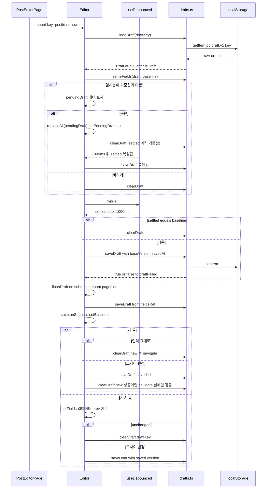
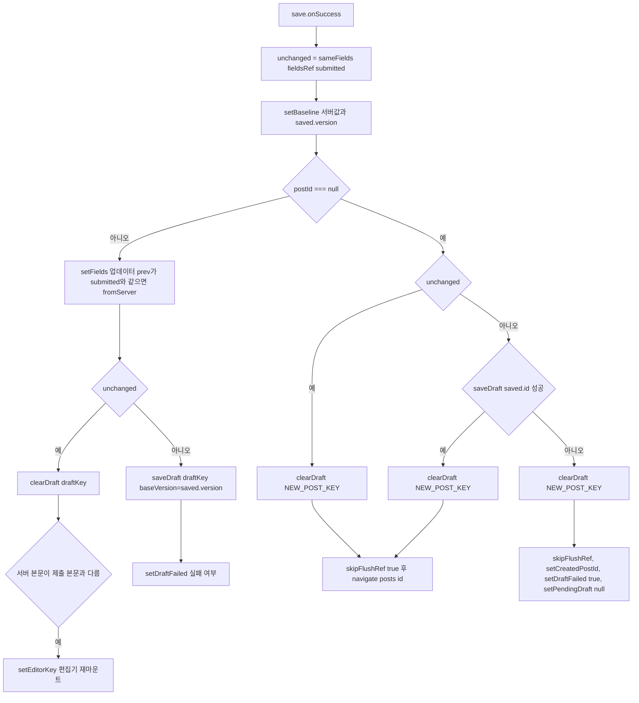
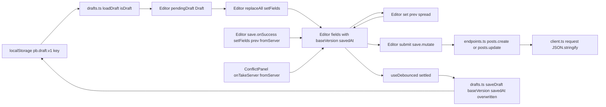
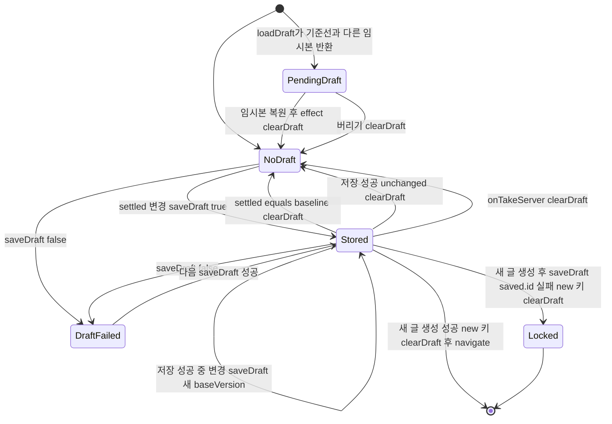

# F005 편집 임시본 자동 보관·복원

<!-- doc-harness:section id="summary" hash="5d84930436860ee05441abb154e1a76ab40a0b7da8c0f08f5d688525325c5f0d" -->
## 한 줄 요약

결론: F005는 서버 없이 브라우저 안에서만 동작한다. 기능 전체를 `lib/drafts.ts`(load·save·clear·sameFields와 모양 검사)와 `PostEditorPage.tsx`의 `Editor` 컴포넌트가 맡는다.

임시본을 쓰는 시점은 네 가지다.
① `useDebounced(fields, 1000)`을 받는 자동 저장 effect
② `flushDraft`(언마운트, `pagehide`, 저장 요청 직전)
③ 기존 글 저장 성공 `onSuccess`에서 그사이 입력이 바뀌었을 때 새 version으로 다시 쓰기
④ 새 글 생성 뒤 새 id 키로 옮겨 쓰기

임시본을 지우는 시점은 여섯 가지다.
① 입력(settled)이 기준선과 같아졌을 때
② 저장 성공 뒤 그사이 바뀐 입력이 없을 때. 기존 글은 draftKey를, 새 글은 'new' 키를 지운다.
③ '버리기'를 눌렀을 때
④ 충돌 해결에서 '서버본으로 바꾸기'를 골랐을 때
⑤ 새 글 생성 뒤 새 id 키로 옮겨 쓰기에 성공했을 때. 'new' 키를 지운다(184행).
⑥ 새 글 생성 뒤 옮겨 쓰기에 실패해 화면을 잠글 때. 이때도 'new' 키를 지운다(195행).
⑤·⑥은 입력이 바뀌었어도 'new' 키를 지운다.

기존 글 저장 onSuccess는 두 판단을 일부러 분리한다. 첫째, `setFields(prev => sameFields(prev, submitted) ? next : prev)`를 unchanged 분기보다 먼저, 두 경우 모두에서 부른다. 화면 입력을 서버값으로 바꿀지는 React가 넘겨주는 prev로 정한다. 둘째, 임시본을 지울지 다시 쓸지와 편집기를 재마운트할지는 fieldsRef로 계산한 `unchanged`로 정한다.

복원 여부를 고르기 전(pendingDraft)에는 자동 저장과 flush가 모두 멈춰 기존 임시본을 보존한다. '임시본 복원'을 눌러도 곧바로 저장소에 쓰지 않는다. pendingDraft가 null이 되면 자동 저장 effect가 다시 도는데, 이때 settled는 아직 디바운스 전 값(보통 기준선)이다. 그래서 먼저 clearDraft가 실행되고, 1초 뒤에야 saveDraft로 다시 쓴다(PendingDraft → NoDraft → Stored).

drafts 함수는 저장소 예외를 모두 삼키고 boolean이나 null로 바꾼다. 다만 기본 인자 `storage = window.localStorage`는 try 블록 밖에서 평가된다. 그래서 저장소 접근 자체가 예외를 던지는 환경에서는 렌더가 깨질 수 있다(POTENTIAL_ISSUE).

복원하면 `replaceAll(pendingDraft)`가 Draft 객체 전체를 fields에 넣는다. 그래서 `baseVersion`·`savedAt`이 다음 저장 요청 JSON에 함께 실린다.

이 기능에는 서버 API·DB 접근이 없다. 서버 호출은 F003(저장)과 F006(충돌)에 속하고, 이 기능은 그 결과에 반응해 임시본을 정리한다.

| 항목 | 값 |
|---|---|
| 중요도 | SUPPORTING |
| 상태 | ACTIVE |
| 진입점 | `SPA /posts/new`, `SPA /posts/:id` |
| 의존 기능 | [F003](../09_FEATURES.md#f003), [F006](../09_FEATURES.md#f006), [F029](../09_FEATURES.md#f029) |

### 진입점 근거

| 내용 | 상태 | 근거 |
|---|---|---|
| SPA 라우트 `/posts/new`·`/posts/:id`가 `PostEditorPage`를 지연 로딩한다. `PostEditorPage`는 `Editor`를 `key={postId ?? NEW_POST_KEY}`로 마운트하므로 글마다 임시본 키(`draftKey`)가 고정된다. | CONFIRMED | `PortfolioBlog.Web/src/app/routes.tsx` routes (13,29-30), `PortfolioBlog.Web/src/pages/PostEditorPage.tsx` PostEditorPage (34-47), `PortfolioBlog.Web/src/pages/PostEditorPage.tsx` Editor (50-51) |
| 마운트할 때 `useState` 초기화 함수가 `loadDraft(draftKey)`를 부른다. 임시본이 기준선(서버본 또는 EMPTY)과 다를 때만 `pendingDraft`로 두고 복원 배너를 띄운다. | CONFIRMED | `PortfolioBlog.Web/src/pages/PostEditorPage.tsx` Editor.pendingDraft (59-62), `PortfolioBlog.Web/src/pages/PostEditorPage.tsx` (288-295) |
| 브라우저 이벤트 진입점은 두 가지다. `pagehide`(탭·창 닫기, bfcache 진입)와 `beforeunload`(임시본 저장이 실패했고 dirty일 때만 등록)다. | CONFIRMED | `PortfolioBlog.Web/src/pages/PostEditorPage.tsx` (136-148) |
<!-- /doc-harness:section -->

<!-- doc-harness:section id="flow" hash="8e0d845943a6be2b28acb65589090a494c4cd2bdce9ec58b89d241cd1361139d" -->
## 처리 흐름

| 단계 | 컴포넌트 | 코드 | 설명 |
|---|---|---|---|
| 1 | PostEditorPage | `PortfolioBlog.Web/src/pages/PostEditorPage.tsx` PostEditorPage | `/posts/:id`이면 `posts.get`으로 상세를 불러온다(staleTime Infinity, gcTime 0). 불러오는 중이거나 오류면 Editor를 그리지 않는다. 불러온 결과를 `server` prop으로 넘겨 `Editor`를 마운트한다. 새 글이면 server=null이다. |
| 2 | Editor | `PortfolioBlog.Web/src/pages/PostEditorPage.tsx` Editor (baseline/fields 초기화) | `draftKey = postId ?? 'new'`로 정한다. 기준선은 `fromServer(server)` 또는 `EMPTY`이고 version은 `server?.version ?? null`이다. `fields`를 이 기준선으로 초기화한다. |
| 3 | drafts.ts | `PortfolioBlog.Web/src/lib/drafts.ts` loadDraft | `localStorage.getItem('pb.draft.v1:'+postId)`로 읽는다. 값이 없으면 null이다. 값이 있으면 `JSON.parse`한 뒤 `isDraft`로 모양을 검사하고, 검사에 실패하면 null을 돌려준다. 예외가 나도 null이다. |
| 4 | Editor | `PortfolioBlog.Web/src/pages/PostEditorPage.tsx` Editor.pendingDraft | 임시본이 있고 `sameFields(draft, baseline.fields)`가 false면 `pendingDraft`로 둔다. 배너에는 `formatDateTime(savedAt)`을 보여 준다. `baseVersion !== baseline.version`이면 '서버본이 바뀌었습니다' 경고를 덧붙인다. |
| 5 | Editor | `PortfolioBlog.Web/src/pages/PostEditorPage.tsx` 임시본 복원 / 버리기 버튼 | '복원'을 누르면 `replaceAll(pendingDraft)`가 Draft 객체 전체(baseVersion·savedAt 포함)로 fields를 바꾸고, editorKey를 올려 비제어 편집기를 재마운트한다. 이어서 `setPendingDraft(null)`한다. 이 버튼은 saveDraft를 부르지 않는다. '버리기'를 누르면 `clearDraft(draftKey)`한 뒤 `setPendingDraft(null)`한다. |
| 6 | useDebounced | `PortfolioBlog.Web/src/lib/useDebounced.ts` useDebounced | `useState(value)`의 초기값은 첫 렌더의 fields(기준선)다. fields가 1000ms 동안 바뀌지 않으면 그 값을 `settled`로 넘긴다(setTimeout/clearTimeout). 값이 바뀌면 타이머를 다시 시작한다. |
| 7 | Editor | `PortfolioBlog.Web/src/pages/PostEditorPage.tsx` 자동 저장 useEffect | 의존성은 [settled, pendingDraft, draftKey, createdPostId]다. `pendingDraft`나 `createdPostId`가 있으면 아무것도 하지 않는다. settled가 기준선(baselineRef)과 같으면 `clearDraft`하고 draftFailed를 false로 둔다. 다르면 `saveDraft(draftKey, {...settled, baseVersion, savedAt: now})`를 부르고 실패 여부를 `draftFailed`에 반영한다. baseline은 의존성에서 일부러 뺐다. |
| 8 | drafts.ts | `PortfolioBlog.Web/src/lib/drafts.ts` saveDraft | `setItem(key, JSON.stringify(draft))`로 쓰고 true를 돌려준다. 예외(용량 초과·비공개 모드)가 나면 false를 돌려준다. |
| 9 | Editor | `PortfolioBlog.Web/src/pages/PostEditorPage.tsx` flushDraft | 디바운스를 기다리지 않고 ref(fieldsRef·baselineRef)의 최신값으로 즉시 한 번 쓴다. `skipFlushRef`, `pendingDraftRef`, `createdPostIdRef` 중 하나라도 걸리거나 입력이 기준선과 같으면 쓰지 않는다. 언마운트 cleanup, `pagehide`, `submit` 직전에 호출되며 반환값은 무시한다. |
| 10 | Editor | `PortfolioBlog.Web/src/pages/PostEditorPage.tsx` submit | `validatePost`를 통과하면 `flushDraft()`를 부른 뒤 `save.mutate(fields)`한다. 저장 요청이 401로 돌아와 화면이 언마운트돼도 입력이 남게 하려는 순서다. |
| 11 | Editor | `PortfolioBlog.Web/src/pages/PostEditorPage.tsx` save.onSuccess (공통 + 기존 글) | 공통: 먼저 fieldsRef로 `unchanged = sameFields(fieldsRef.current, submitted)`를 계산한다. 이어서 `setBaseline({ fields: fromServer(saved), version: saved.version })`와 쿼리 캐시 갱신을 한다. 기존 글이면 `setFields(prev => sameFields(prev, submitted) ? next : prev)`를 unchanged 판정보다 먼저, 두 경우 모두에서 호출한다. 화면 입력을 서버값으로 바꿀지는 React가 넘겨주는 prev로 정한다. 그다음 unchanged면 `clearDraft(draftKey)`를 부르고, 서버 본문이 제출 본문과 다를 때만 editorKey를 올려 편집기를 재마운트한다. unchanged가 아니면 `saveDraft(draftKey, {...fieldsRef.current, baseVersion: saved.version, savedAt})`로 즉시 다시 쓰고 실패 여부를 draftFailed에 반영한다. |
| 12 | Editor | `PortfolioBlog.Web/src/pages/PostEditorPage.tsx` save.onSuccess (새 글) | unchanged면 `clearDraft('new')`하고 skipFlushRef=true로 둔 뒤 `/posts/{id}`로 replace 이동한다. 그사이 친 내용이 있으면 `saveDraft(saved.id, {...현재, slug: saved.slug, baseVersion})`로 새 id 키에 옮겨 쓴다. 옮겨 쓰기에 성공하면 'new'를 지우고(184행) 이동한다. 실패하면 'new'를 지우고(195행) 화면을 잠근다. 잠글 때는 skipFlushRef를 켜고, `createdPostId`를 채우고, `draftFailed=true`, pendingDraft=null로 둔 뒤 경고를 띄운다. |
| 13 | ConflictPanel | `PortfolioBlog.Web/src/components/ConflictPanel.tsx` onTakeServer / onKeepMine | 409 충돌에서 '서버본으로 바꾸기'를 고르면 Editor 콜백이 기준선과 fields를 `fromServer(conflict)`로 바꾸고 `clearDraft(draftKey)`한다. '내 내용 유지'를 고르면 기준선만 서버본·서버 version으로 바꾸고 fields와 임시본은 그대로 둔다. |
| 14 | Editor | `PortfolioBlog.Web/src/pages/PostEditorPage.tsx` beforeunload useEffect | `dirty && draftFailed`일 때만 beforeunload에서 `preventDefault`를 호출해 창을 닫기 전에 확인을 받는다. |
<!-- /doc-harness:section -->

<!-- doc-harness:section id="F005_SEQUENCE" hash="d4cd3d0103ec91cb073c573e4d6f13448852ef57c82c1f32dcdf4702e42f872c" -->
## 임시본 로드·복원·자동 저장·저장 후 정리 (Sequence Diagram)

Editor가 drafts.ts를 거쳐 localStorage를 읽고 쓴다. 쓰는 계기는 마운트, 디바운스 틱, flush, 저장 성공 콜백이다.

마운트할 때 loadDraft와 sameFields로 복원 제안 여부를 정한다. 복원하면 곧바로 쓰지 않는다. settled가 따라잡기 전의 effect가 clearDraft를 먼저 하고, 1초 뒤 saveDraft가 실행된다. 평소 편집은 useDebounced가 1초 뒤 넘긴 settled로 saveDraft 또는 clearDraft한다. submit·언마운트·pagehide에서는 flushDraft가 fieldsRef로 즉시 쓴다. 저장 성공 뒤 처리는 두 갈래다. 새 글이면 'new' 키를 지우거나, 새 id 키로 옮긴 뒤 'new' 키를 지운다. 기존 글이면 먼저 setFields 업데이터(prev 기준)를 부르고, 그다음 unchanged에 따라 clearDraft 또는 saveDraft한다.

### 코드 근거

| 구성 요소 | 코드 |
|---|---|
| PostEditorPage | `PortfolioBlog.Web/src/pages/PostEditorPage.tsx` (PostEditorPage) |
| Editor | `PortfolioBlog.Web/src/pages/PostEditorPage.tsx` (Editor) |
| useDebounced | `PortfolioBlog.Web/src/lib/useDebounced.ts` (useDebounced) |
| drafts.ts | `PortfolioBlog.Web/src/lib/drafts.ts` (loadDraft/saveDraft/clearDraft/sameFields) |
| localStorage | `PortfolioBlog.Web/src/lib/drafts.ts` (storage = window.localStorage) |
<!-- /doc-harness:section -->

<!-- doc-harness:section id="F005_FLOW" hash="57c9afa05605871b2eeb04580b7bb313c69034e4fa27b9cd67d50259075713e9" -->
## 저장 성공(onSuccess) 뒤 임시본 처리 분기 (Flowchart)

onSuccess는 unchanged 계산과 setBaseline을 공통으로 먼저 한다. 기존 글은 setFields 업데이터를 unchanged 판정 앞에서 항상 호출하고, 그 뒤 unchanged로 임시본 삭제·재작성만 가른다. 새 글은 세 갈래(삭제 후 이동, 옮겨 쓰기 후 이동, 잠금) 모두에서 'new' 키를 지운다.

unchanged는 fieldsRef.current와 submitted를 비교한 값이다(162행). setBaseline은 분기와 무관하게 서버값과 saved.version으로 맞춘다(164행). 기존 글에서는 206행 setFields(prev => sameFields(prev, submitted) ? next : prev)가 if (unchanged)보다 먼저 두 경우 모두에서 실행된다. 화면 입력을 바꿀지는 prev가 정한다. unchanged '예' 분기는 clearDraft(draftKey)를 부르고, 서버 본문이 제출 본문과 다를 때만 편집기를 재마운트한다(209-210행). '아니오' 분기는 saved.version으로 임시본을 다시 쓰고 실패 여부를 draftFailed에 반영한다(214행). 새 글에서 unchanged면 clearDraft('new'), skipFlushRef, navigate 순서다(171-175행). 그렇지 않으면 saveDraft(saved.id)를 시도한다. 성공하면 clearDraft('new') 뒤 이동하고(184-186행), 실패하면 clearDraft('new') 뒤 화면을 잠근다(195-201행).

### 코드 근거

| 구성 요소 | 코드 |
|---|---|
| save.onSuccess | `PortfolioBlog.Web/src/pages/PostEditorPage.tsx` (save.onSuccess) |
| unchanged = sameFields fieldsRef submitted | `PortfolioBlog.Web/src/pages/PostEditorPage.tsx` (save.onSuccess) |
| setBaseline 서버값과 saved.version | `PortfolioBlog.Web/src/pages/PostEditorPage.tsx` (setBaseline) |
| setFields 업데이터 prev가 submitted와 같으면 fromServer | `PortfolioBlog.Web/src/pages/PostEditorPage.tsx` (setFields) |
| clearDraft draftKey | `PortfolioBlog.Web/src/lib/drafts.ts` (clearDraft) |
| setEditorKey 편집기 재마운트 | `PortfolioBlog.Web/src/pages/PostEditorPage.tsx` (setEditorKey) |
| saveDraft draftKey baseVersion=saved.version | `PortfolioBlog.Web/src/lib/drafts.ts` (saveDraft) |
| saveDraft saved.id 성공 | `PortfolioBlog.Web/src/lib/drafts.ts` (saveDraft) |
| clearDraft NEW_POST_KEY | `PortfolioBlog.Web/src/lib/drafts.ts` (clearDraft / NEW_POST_KEY) |
| skipFlushRef true 후 navigate posts id | `PortfolioBlog.Web/src/pages/PostEditorPage.tsx` (skipFlushRef / navigate) |
| skipFlushRef, setCreatedPostId, setDraftFailed true, setPendingDraft null | `PortfolioBlog.Web/src/pages/PostEditorPage.tsx` (createdPostId) |
<!-- /doc-harness:section -->

<!-- doc-harness:section id="F005_DATAFLOW" hash="ca7055da318d94d2643573e3a602a9744bd548609447178c3c2dcc5f9c0151af" -->
## 복원된 Draft 속성이 저장 요청 본문까지 가는 경로 (Data Flow Diagram)

복원된 Draft 객체의 baseVersion·savedAt은 fields에 남아 저장 요청 JSON까지 간다. 임시본에 쓸 때는 현재 값으로 덮인다.

localStorage 값은 loadDraft(isDraft)를 거쳐 pendingDraft가 되고, replaceAll로 fields에 통째로 들어간다. set()은 prev를 펼치므로 두 속성이 유지되고, submit → posts.create/update → request의 JSON.stringify로 요청 본문에 실린다. settled 경로의 saveDraft는 두 값을 현재 값으로 덮어쓴다. fields에서 두 속성을 없애는 경로는 두 가지다. 기존 글 onSuccess의 prev 기준 setFields(fromServer)와 ConflictPanel onTakeServer의 replaceAll(fromServer)다.

### 코드 근거

| 구성 요소 | 코드 |
|---|---|
| loadDraft | `PortfolioBlog.Web/src/lib/drafts.ts` (loadDraft) |
| pendingDraft | `PortfolioBlog.Web/src/pages/PostEditorPage.tsx` (Editor.pendingDraft) |
| replaceAll | `PortfolioBlog.Web/src/pages/PostEditorPage.tsx` (replaceAll) |
| fields | `PortfolioBlog.Web/src/pages/PostEditorPage.tsx` (fields) |
| submit | `PortfolioBlog.Web/src/pages/PostEditorPage.tsx` (submit) |
| endpoints | `PortfolioBlog.Web/src/api/endpoints.ts` (posts.create / posts.update) |
| request | `PortfolioBlog.Web/src/api/client.ts` (request) |
| settled | `PortfolioBlog.Web/src/lib/useDebounced.ts` (useDebounced) |
| saveDraft | `PortfolioBlog.Web/src/lib/drafts.ts` (saveDraft) |
| onTakeServer | `PortfolioBlog.Web/src/components/ConflictPanel.tsx` (onTakeServer) |
<!-- /doc-harness:section -->

<!-- doc-harness:section id="F005_STATE" hash="60ffdcf419a35bc39ed1c655b4b912799f05f30800d5649b7e12d75706e2c52a" -->
## 편집 화면의 임시본 상태 (State Diagram)

임시본은 NoDraft·PendingDraft·Stored·DraftFailed·Locked 사이를 오간다. 저장 성공과 충돌 해결이 삭제 전이를 만든다.

PendingDraft에서 복원하면 effect가 clearDraft해 NoDraft를 거친 뒤 Stored가 된다. 버리기는 곧바로 NoDraft로 간다. Stored에서 NoDraft로 가는 계기는 네 가지다. settled가 기준선과 같아질 때, 저장 성공 뒤 unchanged일 때, onTakeServer, 그리고 새 글 생성 뒤 'new' 키를 삭제할 때다. 마지막 경우 화면은 이동하며 끝난다. 새 id 키로 옮겨 쓰기에 실패하면 'new' 키를 지우고 Locked가 된다.

### 코드 근거

| 구성 요소 | 코드 |
|---|---|
| PendingDraft | `PortfolioBlog.Web/src/pages/PostEditorPage.tsx` (pendingDraft) |
| Stored | `PortfolioBlog.Web/src/lib/drafts.ts` (saveDraft) |
| NoDraft | `PortfolioBlog.Web/src/lib/drafts.ts` (clearDraft) |
| DraftFailed | `PortfolioBlog.Web/src/pages/PostEditorPage.tsx` (draftFailed) |
| Locked | `PortfolioBlog.Web/src/pages/PostEditorPage.tsx` (createdPostId) |
<!-- /doc-harness:section -->

<!-- doc-harness:section id="data" hash="ae792c525f12facc33b59d9ecc06a2ba3465f5399f132e9bd937d809bb28af21" -->
## 데이터

### 데이터 흐름

| 내용 | 상태 | 근거 |
|---|---|---|
| 입력 쪽 흐름이다. 편집 필드(slug·title·summary·contentMarkdown·tagNames·seriesId·seriesOrder)는 `DraftFields` state `fields`에 담긴다. 1초 디바운스 뒤 `settled`가 되고, `{...settled, baseVersion: baseline.version, savedAt: ISO}` 형태의 `Draft` 객체가 된다. 이 객체를 `JSON.stringify`해 localStorage 키 `pb.draft.v1:<postId\|new>`에 문자열로 저장한다. 이때 fields에 남아 있던 옛 baseVersion·savedAt은 뒤에 오는 값으로 덮인다. | CONFIRMED | `PortfolioBlog.Web/src/pages/PostEditorPage.tsx` (104-113,131), `PortfolioBlog.Web/src/lib/drafts.ts` (4-17,41-43) |
| 출력 쪽 흐름이다. localStorage 문자열을 `JSON.parse`하고 `isDraft`로 모양을 검사해 `Draft \| null`을 얻는다. 이 값이 `pendingDraft`가 되고, 복원하면 `replaceAll`을 거쳐 `fields`와 편집기 initialValue에 들어간다. | CONFIRMED | `PortfolioBlog.Web/src/lib/drafts.ts` loadDraft (31-38), `PortfolioBlog.Web/src/pages/PostEditorPage.tsx` (150,292,366) |
| 복원을 눌러도 저장소에 곧바로 쓰지 않는다. 복원값이 저장소에 다시 들어가는 경로는 두 가지다. 1초 뒤 디바운스된 `settled`를 받은 자동 저장 effect의 `saveDraft`, 그리고 그 전에 화면을 떠날 때의 `flushDraft`다. 그보다 먼저 pendingDraft가 null로 바뀌면서 effect가 한 번 더 돈다. 이때 settled가 기준선과 같으면 기존 임시본이 먼저 `clearDraft`로 지워진다. | CONFIRMED | `PortfolioBlog.Web/src/pages/PostEditorPage.tsx` (104-113,125-140,292), `PortfolioBlog.Web/src/lib/useDebounced.ts` useDebounced (4-11) |
| 복원하면 `replaceAll(pendingDraft)`가 `Draft` 객체 전체를 그대로 `fields` state에 넣는다(`setFields(next)`). 여기에는 `baseVersion`·`savedAt`도 들어간다. `set()`과 시리즈 select는 둘 다 prev를 펼쳐 쓰므로 편집해도 두 속성이 사라지지 않는다. 그래서 다음 `submit`의 `save.mutate(fields)`에서 두 속성이 요청 JSON 본문에 함께 실린다. 요청은 `posts.create(submitted)` 또는 `posts.update(postId, { ...submitted, version })`을 거쳐 `request`의 `JSON.stringify`로 직렬화된다.  두 속성이 fields에서 사라지는 경우는 네 가지다. ① 기존 글 저장 onSuccess의 `setFields(prev => sameFields(prev, submitted) ? next : prev)` 업데이터가 prev와 submitted를 같다고 보고 `fromServer(saved)`로 바꿀 때. 이 업데이터는 unchanged 분기와 관계없이 항상 호출된다. ② 충돌 해결 `onTakeServer`가 `replaceAll(fromServer(conflict))`할 때 ③ 새 글 생성 뒤 `navigate`로 Editor가 다른 key로 재마운트될 때 ④ 화면을 떠났다가 다시 열 때  `onKeepMine`을 고른 뒤, 저장 중 prev가 바뀐 뒤, 저장 실패 뒤에는 두 속성이 그대로 남는다. | CONFIRMED | `PortfolioBlog.Web/src/pages/PostEditorPage.tsx` replaceAll (150,292), `PortfolioBlog.Web/src/pages/PostEditorPage.tsx` set (76), `PortfolioBlog.Web/src/pages/PostEditorPage.tsx` 시리즈 select onChange (333-336), `PortfolioBlog.Web/src/pages/PostEditorPage.tsx` save.mutationFn / submit (155,236), `PortfolioBlog.Web/src/pages/PostEditorPage.tsx` save.onSuccess (175,186,204-206), `PortfolioBlog.Web/src/pages/PostEditorPage.tsx` onTakeServer / onKeepMine (298-299), `PortfolioBlog.Web/src/api/endpoints.ts` posts.create / posts.update (20-21), `PortfolioBlog.Web/src/api/client.ts` request (51) |
| 요청에 딸려 간 `baseVersion`·`savedAt`은 서버가 무시할 것으로 추론한다. System.Text.Json 기본값이 알 수 없는 속성을 무시하기 때문이다. 이 세션에서는 서버 역직렬화 설정을 다시 확인하지 않았다. | INFERRED | `PortfolioBlog.Web/src/api/client.ts` (51), `PortfolioBlog.Web/src/api/endpoints.ts` (20-21) |
| 저장이 성공하면 서버 응답의 `PostDetail.version`이 기준선 version이 된다. 이후 임시본의 `baseVersion`으로 기록되고, 다음에 열 때 서버 version과 비교해 경고를 띄우는 데 쓰인다. | CONFIRMED | `PortfolioBlog.Web/src/pages/PostEditorPage.tsx` (164,182,214,291) |
| 임시본에는 인증 정보를 넣지 않는다. 저장소 접근은 `lib/drafts.ts` 하나로 제한되고, 소스 가드 테스트가 이를 강제한다. | CONFIRMED | `PortfolioBlog.Web/src/test/source-guards.test.ts` (114), `PortfolioBlog.Web/src/lib/drafts.ts` (1-2) |

### DB 접근

_(없음)_

### 상태 전이

| 이전 | 다음 | 트리거 | 근거 |
|---|---|---|---|
| 임시본 없음 | 복원 대기(pendingDraft) | 마운트할 때 `loadDraft`가 기준선과 다른 유효한 임시본을 돌려준다 | `PortfolioBlog.Web/src/pages/PostEditorPage.tsx` (59-62) |
| 복원 대기(pendingDraft) | 임시본 없음(복원값은 화면에만 있음) | '임시본 복원' 클릭: replaceAll(pendingDraft)와 setPendingDraft(null)가 실행된다. 이어서 자동 저장 effect가 다시 도는데, settled가 아직 기준선이라 clearDraft(draftKey)가 실행된다 | `PortfolioBlog.Web/src/pages/PostEditorPage.tsx` (104-113,292), `PortfolioBlog.Web/src/lib/useDebounced.ts` (4-11) |
| 임시본 없음(복원값은 화면에만 있음) | 임시본 저장됨 | 1000ms 뒤 settled가 복원값이 되면 saveDraft가 실행된다. 그 전에 떠나면 flushDraft가 fieldsRef의 복원값으로 쓴다 | `PortfolioBlog.Web/src/pages/PostEditorPage.tsx` (110-112,125-140) |
| 복원 대기(pendingDraft) | 편집 중(임시본 삭제됨) | '버리기' 클릭: clearDraft(draftKey) 후 setPendingDraft(null) | `PortfolioBlog.Web/src/pages/PostEditorPage.tsx` (293) |
| 편집 중(기준선과 같음) | 임시본 저장됨 | 디바운스된 settled가 기준선과 다르고 saveDraft가 true를 돌려준다 | `PortfolioBlog.Web/src/pages/PostEditorPage.tsx` (110-112) |
| 임시본 저장됨 | 임시본 없음 | settled가 기준선과 같아짐(clearDraft) | `PortfolioBlog.Web/src/pages/PostEditorPage.tsx` (110) |
| 임시본 저장됨 | 저장 실패 표시(draftFailed=true) | saveDraft가 false를 돌려준다(용량 초과·비공개 모드). 경고 문구가 뜨고 beforeunload 확인이 켜진다 | `PortfolioBlog.Web/src/pages/PostEditorPage.tsx` (112,143-148,281) |
| 저장 실패 표시(draftFailed=true) | 임시본 저장됨 | 다음 자동 저장에서 saveDraft가 true를 돌려준다(setDraftFailed(false)) | `PortfolioBlog.Web/src/pages/PostEditorPage.tsx` (112) |
| 임시본 저장됨 | 임시본 없음 | 기존 글 저장이 성공했고 unchanged(fieldsRef 기준)다: clearDraft(draftKey)를 부르고, 본문이 다르면 편집기를 재마운트한다. fields 대입은 그보다 앞선 setFields 업데이터가 prev 기준으로 따로 정한다 | `PortfolioBlog.Web/src/pages/PostEditorPage.tsx` (204-210) |
| 임시본 저장됨 | 임시본 저장됨(새 baseVersion) | 저장은 성공했지만 응답을 기다리는 동안 입력이 더 바뀜: saveDraft(draftKey, baseVersion=saved.version) | `PortfolioBlog.Web/src/pages/PostEditorPage.tsx` (211-215) |
| 'new' 임시본 | 임시본 없음('new' 삭제, 새 글 화면으로 이동) | 새 글 생성이 성공했고 unchanged다: clearDraft('new'), skipFlushRef=true, navigate | `PortfolioBlog.Web/src/pages/PostEditorPage.tsx` (169-176) |
| 'new' 임시본 | 새 글 id 키 임시본 | 새 글 생성이 성공했고 그사이 입력이 바뀌었다. saveDraft(saved.id)가 성공하면 clearDraft('new')(184행)한 뒤 /posts/{id}로 이동한다 | `PortfolioBlog.Web/src/pages/PostEditorPage.tsx` (178-188) |
| 'new' 임시본 | 잠김(createdPostId 설정, 임시본 없음) | 새 글 생성은 성공했으나 새 id 키로 saveDraft하지 못했다. clearDraft('new')(195행), skipFlush, draftFailed=true, pendingDraft=null로 둔다 | `PortfolioBlog.Web/src/pages/PostEditorPage.tsx` (189-202,308-314) |
| 충돌(conflict) | 임시본 없음 | ConflictPanel의 '서버본으로 바꾸기'(onTakeServer)가 clearDraft(draftKey)를 호출 | `PortfolioBlog.Web/src/pages/PostEditorPage.tsx` (298), `PortfolioBlog.Web/src/components/ConflictPanel.tsx` (7-8,25) |

### 외부 의존

| 내용 | 상태 | 근거 |
|---|---|---|
| 브라우저 Web Storage API(`window.localStorage`의 getItem·setItem·removeItem)를 쓴다. 키 접두사는 `pb.draft.v1:`이다. 이 기능 안에는 서버·DB와의 네트워크 통신이 없다. | CONFIRMED | `PortfolioBlog.Web/src/lib/drafts.ts` (15-17,31-47) |
| 브라우저 생명주기 이벤트 `pagehide`와 `beforeunload`를 쓴다. | CONFIRMED | `PortfolioBlog.Web/src/pages/PostEditorPage.tsx` (136-148) |
| 비동기 디바운스는 React의 useState·useEffect·useRef·useCallback과 `window.setTimeout`(useDebounced)으로 구현한다. 저장 뒤 임시본 정리는 react-query `useMutation`의 onSuccess 콜백에서 시작된다. 전역 mutation 설정이 `retry: false`라 자동 재시도는 없다. | CONFIRMED | `PortfolioBlog.Web/src/lib/useDebounced.ts` (4-11), `PortfolioBlog.Web/src/pages/PostEditorPage.tsx` (152-216), `PortfolioBlog.Web/src/app/queryClient.ts` (22-23) |
<!-- /doc-harness:section -->

<!-- doc-harness:section id="failures" hash="1959950e112196a192186fd5c005a4b5101b7bf9db47384f79a8c26ecd4000a8" -->
## 실패 지점

| 위치 | 조건 | 처리 | 상태 | 근거 |
|---|---|---|---|---|
| drafts.ts loadDraft | getItem 예외, JSON.parse 실패, 모양 검사(isDraft) 실패(필드 타입 불일치·배열 아님·null 등) | try/catch와 isDraft로 null을 돌려준다. 임시본이 없는 것으로 보고 복원 배너를 띄우지 않는다. | CONFIRMED | `PortfolioBlog.Web/src/lib/drafts.ts` loadDraft (21-38), `PortfolioBlog.Web/src/lib/lib.test.ts` (87-90) |
| drafts.ts saveDraft | setItem 예외(QuotaExceededError·비공개 모드) | false를 돌려준다. 호출부가 `draftFailed`를 true로 두어 '임시본을 저장하지 못했습니다' 문구를 보여 준다. 입력이 dirty면 beforeunload 확인도 건다. | CONFIRMED | `PortfolioBlog.Web/src/lib/drafts.ts` (40-43), `PortfolioBlog.Web/src/pages/PostEditorPage.tsx` (112,143-148,214,281), `PortfolioBlog.Web/src/lib/lib.test.ts` (91-94) |
| drafts.ts clearDraft | removeItem 예외 | 예외를 삼키고 임시본을 그대로 둔다. 새 글 생성 뒤 'new' 임시본이 남으면, 그것을 복원해 다시 저장할 때 중복 생성(slug 409)으로 이어질 수 있다. 코드 주석도 이를 '미검증 잔여 위험'으로 인정한다. | POTENTIAL_ISSUE | `PortfolioBlog.Web/src/lib/drafts.ts` (45-47), `PortfolioBlog.Web/src/pages/PostEditorPage.tsx` (189-195) |
| drafts.ts loadDraft/saveDraft/clearDraft의 기본 인자 `storage = window.localStorage` | `window.localStorage` 속성 접근 자체가 예외를 던지는 환경(예: 저장소 접근이 차단된 브라우저 설정) | 처리 없음(예외 전파). 기본 인자는 try 블록 밖에서 평가된다. 그래서 `Editor`의 useState 초기화에서 부르는 loadDraft가 예외를 던지면 렌더가 실패하고, 루트 errorElement(RouteError) 화면으로 갈 것으로 추론한다. 실제로 재현하지는 않았다. | POTENTIAL_ISSUE | `PortfolioBlog.Web/src/lib/drafts.ts` (31-47), `PortfolioBlog.Web/src/pages/PostEditorPage.tsx` (59-62), `PortfolioBlog.Web/src/app/routes.tsx` (18-20) |
| PostEditorPage.tsx flushDraft | 떠나는 중(언마운트·pagehide)이거나 submit 직전에 saveDraft가 실패함 | 반환값을 무시한다. submit 경로의 실패도 화면에 따로 표시되지 않는다. draftFailed에는 자동 저장 effect와 onSuccess의 결과만 반영된다. | CONFIRMED | `PortfolioBlog.Web/src/pages/PostEditorPage.tsx` (125-132,236) |
| PostEditorPage.tsx save.onSuccess(새 글) | 글은 서버에 생성됐으나 그사이 친 내용을 새 id 키로 saveDraft하지 못함 | 이동하지 않는다. 'new' 임시본을 지우고 createdPostId로 화면을 잠근다(저장 버튼 비활성, 자동 저장·flush 중단). draftFailed=true로 beforeunload 경고를 켜고, '복사해 두고 방금 만든 글 열기' 안내를 띄운다. | CONFIRMED | `PortfolioBlog.Web/src/pages/PostEditorPage.tsx` (182-202,284,308-314), `PortfolioBlog.Web/src/test/editor.test.tsx` (226-257) |
| PostEditorPage.tsx save.onError | 저장 실패(400·409·네트워크·401 등) | 임시본은 건드리지 않는다. submit 직전 flushDraft로 남긴 임시본이 그대로 유지된다. 409 화면(ConflictPanel)은 '내 변경은 임시본으로 보관되어 있습니다'라고 안내한다. 자동 재시도는 없다(mutations retry: false). | CONFIRMED | `PortfolioBlog.Web/src/pages/PostEditorPage.tsx` (217-236), `PortfolioBlog.Web/src/components/ConflictPanel.tsx` (17), `PortfolioBlog.Web/src/app/queryClient.ts` (23) |
| PostEditorPage.tsx 409 재조회 404 | 충돌 뒤 최신본 재조회가 404(다른 곳에서 삭제됨) | '화면의 내용은 그대로 있으니 복사해 새 글로 저장하라'는 고정 문구로 안내한다. 임시본이 남아 있다고 단정하지 않는다. | CONFIRMED | `PortfolioBlog.Web/src/pages/PostEditorPage.tsx` (25-32) |

### 엣지 케이스

| 내용 | 상태 | 근거 |
|---|---|---|
| 복원 여부를 고르기 전(pendingDraft가 있음)에는 자동 저장 effect와 flushDraft가 모두 쓰지 않아 기존 임시본이 보존된다. 하지만 그 상태에서 편집한 내용은 고르지 않고 떠나면 임시본에 남지 않는다. | CONFIRMED | `PortfolioBlog.Web/src/pages/PostEditorPage.tsx` (108,126), `PortfolioBlog.Web/src/test/editor.test.tsx` (326-335) |
| '임시본 복원' 직후 pendingDraft가 null이 되면 자동 저장 effect가 다시 돈다. 이때 `settled`는 아직 이전 값(보통 baseline.fields)이라 `clearDraft(draftKey)`가 먼저 실행된다. 1초 뒤 settled가 복원값으로 바뀌면 saveDraft로 다시 쓴다. 그 1초 안에 떠나도 언마운트·pagehide flush가 fieldsRef의 복원값으로 쓴다. 다만 pagehide가 오지 않는 종료(프로세스 강제 종료 등)에서는 이 구간에 임시본이 없다. | CONFIRMED | `PortfolioBlog.Web/src/pages/PostEditorPage.tsx` (88-89,104-113,125-140,292), `PortfolioBlog.Web/src/lib/useDebounced.ts` (4-11) |
| pendingDraft가 떠 있는 동안 입력을 바꾼 뒤 '임시본 복원'을 누르면 경로가 달라진다. settled가 복원 전 편집값이라 기준선과 다르므로, 자동 저장 effect가 clearDraft 대신 그 편집값을 saveDraft로 먼저 쓴다. 1초 뒤 복원값으로 다시 덮인다. | CONFIRMED | `PortfolioBlog.Web/src/pages/PostEditorPage.tsx` (104-113,292) |
| 기존 글 onSuccess는 두 판단을 서로 다른 값으로 한다. 임시본 삭제·재작성과 편집기 재마운트는 fieldsRef로 계산한 `unchanged`로 정하고, 화면 입력에 서버값을 넣을지는 `setFields` 업데이터의 prev로 정한다. 주석은 fieldsRef가 한 렌더 뒤처질 수 있다고 밝힌다. 두 값이 갈라지면 결과가 어긋날 수 있다. 예를 들어 unchanged=true인데 prev는 이미 바뀌었다면, 임시본은 지워지고 fields는 사용자 입력 그대로 남는다. 이 경우 임시본은 다음 settled 변화의 자동 저장이나 떠날 때의 flush에서만 다시 쓰일 것으로 추론한다. 실제로 재현하지는 않았다. | INFERRED | `PortfolioBlog.Web/src/pages/PostEditorPage.tsx` save.onSuccess (156-162,204-215), `PortfolioBlog.Web/src/pages/PostEditorPage.tsx` (81-82) |
| 복원된 fields에 딸려 온 `baseVersion`·`savedAt`은 편집해도 사라지지 않는다. 그래서 복원 뒤 첫 저장은 두 속성을 요청 본문에 싣는다. 반면 임시본에 쓸 때는 두 값이 현재 값으로 덮이므로 저장된 임시본이 낡은 값으로 오염되지는 않는다. | CONFIRMED | `PortfolioBlog.Web/src/pages/PostEditorPage.tsx` (76,112,131,150,155,206,214,292,299,335) |
| 임시본의 baseVersion이 현재 서버 version과 달라도 복원할 수 있다. 이때 배너가 '복원 후 저장하면 서버의 변경을 덮어씁니다'라고 경고한다. 저장 요청은 현재 서버 version(`baseline.version`)을 싣기 때문에 409 없이 덮어쓴다. | CONFIRMED | `PortfolioBlog.Web/src/pages/PostEditorPage.tsx` (155,291), `PortfolioBlog.Web/src/test/editor.test.tsx` (122-132) |
| 임시본의 모든 필드가 기준선과 같으면(sameFields) 복원을 제안하지 않는다. sameFields는 태그 순서까지 비교하므로 순서만 달라도 '다름'으로 본다. | CONFIRMED | `PortfolioBlog.Web/src/lib/drafts.ts` (49-54), `PortfolioBlog.Web/src/pages/PostEditorPage.tsx` (61), `PortfolioBlog.Web/src/lib/lib.test.ts` (95-99) |
| 새 글 임시본 키는 'new' 하나뿐이다. 여러 탭에서 각각 새 글을 쓰거나 같은 글을 여러 탭에서 편집하면 같은 키를 서로 덮어쓴다(마지막 쓰기 우선). 탭 사이 동기화(storage 이벤트)는 없다. | POTENTIAL_ISSUE | `PortfolioBlog.Web/src/lib/drafts.ts` (16-17), `PortfolioBlog.Web/src/pages/PostEditorPage.tsx` (51) |
| 임시본에는 만료·정리 로직이 없다. drafts 모듈을 쓰는 화면이 PostEditorPage뿐이라 글 삭제나 로그아웃에서도 임시본을 지우지 않는다. 삭제된 글의 임시본은 상세 조회가 404라 다시 열 방법이 없는 채 남는다. | POTENTIAL_ISSUE | `PortfolioBlog.Web/src/pages/PostEditorPage.tsx` (13,44), `PortfolioBlog.Web/src/test/source-guards.test.ts` (114) |
| 새 글 생성이 성공한 뒤 서버가 제목 공백을 다듬는 등의 이유로 입력이 기준선과 달라질 수 있다. 그래도 `skipFlushRef`가 언마운트 flush를 막으므로 'new' 임시본이 되살아나지 않는다. | CONFIRMED | `PortfolioBlog.Web/src/pages/PostEditorPage.tsx` (170-176), `PortfolioBlog.Web/src/test/editor.test.tsx` (337-350) |
| 새 글 id 키로 옮겨 쓸 때 slug는 서버가 확정한 `saved.slug`로 고정한다. 기존 글 편집에서는 slug 입력이 readOnly다. | CONFIRMED | `PortfolioBlog.Web/src/pages/PostEditorPage.tsx` (179-182,322) |
| 자동 저장 effect의 의존성에서 baseline을 뺐다. 저장 성공 직후 낡은 settled 값이 새 baseVersion과 함께 다시 쓰이던 결함을 막기 위해서다(주석: 실측 결함). 회귀 테스트가 있다. | CONFIRMED | `PortfolioBlog.Web/src/pages/PostEditorPage.tsx` (98-113), `PortfolioBlog.Web/src/test/editor.test.tsx` (73-86,352-362) |
| savedAt은 문자열인지만 검사한다. 날짜로 해석되지 않으면 `formatDateTime`이 원문 문자열을 그대로 보여 준다. | CONFIRMED | `PortfolioBlog.Web/src/lib/drafts.ts` (24), `PortfolioBlog.Web/src/lib/useDebounced.ts` (13-16) |
| 디바운스가 끝나기 전에 떠나도 언마운트·pagehide flush가 마지막 입력을 남긴다(401 전환, 링크 이동, 탭 닫기). 401 처리는 location을 직접 바꾸지 않고 RequireAuth가 화면을 바꾼다. 그래서 로그인 뒤 같은 편집 화면을 열면 복원을 제안받는다. | CONFIRMED | `PortfolioBlog.Web/src/pages/PostEditorPage.tsx` (115-140), `PortfolioBlog.Web/src/test/editor.test.tsx` (308-324), `PortfolioBlog.Web/src/app/queryClient.ts` noteAuthFailure (7-13) |

### 로깅

| 내용 | 상태 | 근거 |
|---|---|---|
| 이 기능에는 console 로그나 원격 로깅이 없다. 실패는 모두 화면으로만 알린다: `draftFailed` 경고 문구, createdPostId 잠금 안내, beforeunload 확인. | CONFIRMED | `PortfolioBlog.Web/src/lib/drafts.ts` (31-47), `PortfolioBlog.Web/src/pages/PostEditorPage.tsx` (281,308-314) |
<!-- /doc-harness:section -->

<!-- doc-harness:section id="code" hash="94d83e0b10da9228df6c64524f6c6fafbf410ec809a99ab9093904fe35f697a9" -->
## 관련 코드

| 파일 | 심볼 | 역할 |
|---|---|---|
| `PortfolioBlog.Web/src/lib/drafts.ts` | Draft / DraftFields | dto |
| `PortfolioBlog.Web/src/lib/drafts.ts` | isDraft | validation |
| `PortfolioBlog.Web/src/lib/drafts.ts` | loadDraft | data |
| `PortfolioBlog.Web/src/lib/drafts.ts` | saveDraft | data |
| `PortfolioBlog.Web/src/lib/drafts.ts` | clearDraft | data |
| `PortfolioBlog.Web/src/lib/drafts.ts` | sameFields | service |
| `PortfolioBlog.Web/src/pages/PostEditorPage.tsx` | PostEditorPage | entry |
| `PortfolioBlog.Web/src/pages/PostEditorPage.tsx` | Editor (pendingDraft·자동 저장 effect·flushDraft·replaceAll·set·save.onSuccess) | service |
| `PortfolioBlog.Web/src/pages/PostEditorPage.tsx` | Editor 복원 배너·draftFailed 경고·createdPostId 경고 | render |
| `PortfolioBlog.Web/src/lib/useDebounced.ts` | useDebounced / formatDateTime | service |
| `PortfolioBlog.Web/src/components/ConflictPanel.tsx` | ConflictPanel | render |
| `PortfolioBlog.Web/src/app/routes.tsx` | routes | config |
| `PortfolioBlog.Web/src/app/queryClient.ts` | noteAuthFailure / createQueryClient | service |
| `PortfolioBlog.Web/src/api/endpoints.ts` | posts.create / posts.update | data |
| `PortfolioBlog.Web/src/api/client.ts` | request | data |
| `PortfolioBlog.Web/src/lib/lib.test.ts` | describe('drafts') | test |
| `PortfolioBlog.Web/src/test/editor.test.tsx` | 임시본 관련 it 블록 | test |
| `PortfolioBlog.Web/src/test/source-guards.test.ts` | 저장소 접근은 임시본 모듈뿐이다 | test |

근거: `PortfolioBlog.Web/src/lib/drafts.ts` Draft/isDraft/loadDraft/saveDraft/clearDraft/sameFields (1-54), `PortfolioBlog.Web/src/pages/PostEditorPage.tsx` Editor (50-237), `PortfolioBlog.Web/src/pages/PostEditorPage.tsx` save.onSuccess (156-216), `PortfolioBlog.Web/src/pages/PostEditorPage.tsx` 복원 배너·경고·입력 핸들러 (281-342), `PortfolioBlog.Web/src/lib/useDebounced.ts` useDebounced (4-16), `PortfolioBlog.Web/src/components/ConflictPanel.tsx` ConflictPanel (7-26), `PortfolioBlog.Web/src/app/routes.tsx` routes (13,18-30), `PortfolioBlog.Web/src/app/queryClient.ts` noteAuthFailure / createQueryClient (7-27), `PortfolioBlog.Web/src/api/endpoints.ts` posts (20-21), `PortfolioBlog.Web/src/api/client.ts` request (51), `PortfolioBlog.Web/src/lib/lib.test.ts` describe('drafts') (71-99), `PortfolioBlog.Web/src/test/editor.test.tsx` (73-86,97-132,201-362), `PortfolioBlog.Web/src/test/source-guards.test.ts` (114)
<!-- /doc-harness:section -->

<!-- doc-harness:section id="unknowns" hash="18bf44a18001e49bde1e9e7c941f49e5c1afd57de1de09330f9c7286ebbd011e" -->
## 확인하지 못한 것

- 기존 글 임시본을 복원하면 draft의 slug가 fields에 들어간다. 조작된 localStorage 값으로 slug가 서버본과 다른 채 PUT할 때 서버가 slug 변경을 거부하는지는 확인하지 않았다(F003 서버 쪽 검증 영역).
- 복원된 fields에 딸려 요청 본문에 실리는 `baseVersion`·`savedAt`을 서버 역직렬화가 무시하는지는 실제 요청이나 테스트로 확인하지 않았다.
- `window.localStorage` 접근 자체가 예외를 던지는 브라우저 환경에서 편집 화면이 실제로 오류 화면(RouteError)으로 가는지는 재현하지 않았다.
- 여러 탭에서 같은 키로 동시에 편집할 때 실제 사용자에게 미치는 영향은 측정하지 않았다.
- 기존 글 onSuccess에서 fieldsRef 기준 `unchanged`와 setFields 업데이터의 prev 기준 판단이 실제로 갈라지는 타이밍이 생기는지는 재현하지 않았다.
<!-- /doc-harness:section -->

<!-- doc-harness:section id="related" hash="e6b04ee08cc1bd1a2625cbb81ca24992b9da0467258ba6539a8ab5b4aeff04d8" -->
## 관련 문서

- [../09_FEATURES](../09_FEATURES.md)
- [../08_API](../08_API.md)
- [../07_DATA_MODEL](../07_DATA_MODEL.md)
- [../11_FAILURE_HISTORY](../11_FAILURE_HISTORY.md)
<!-- /doc-harness:section -->
