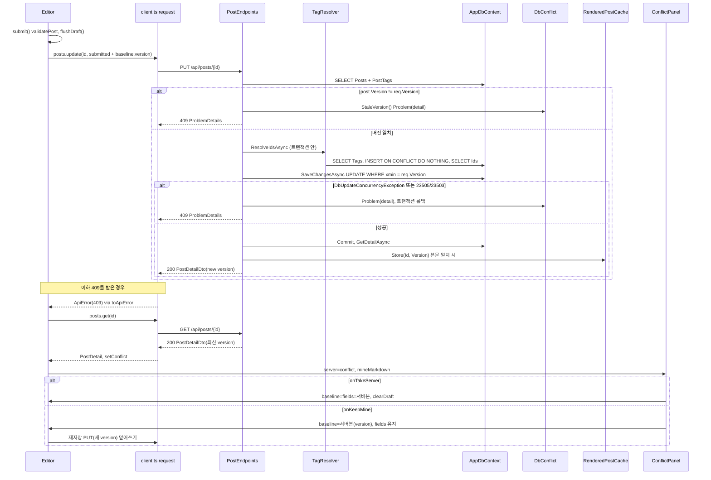
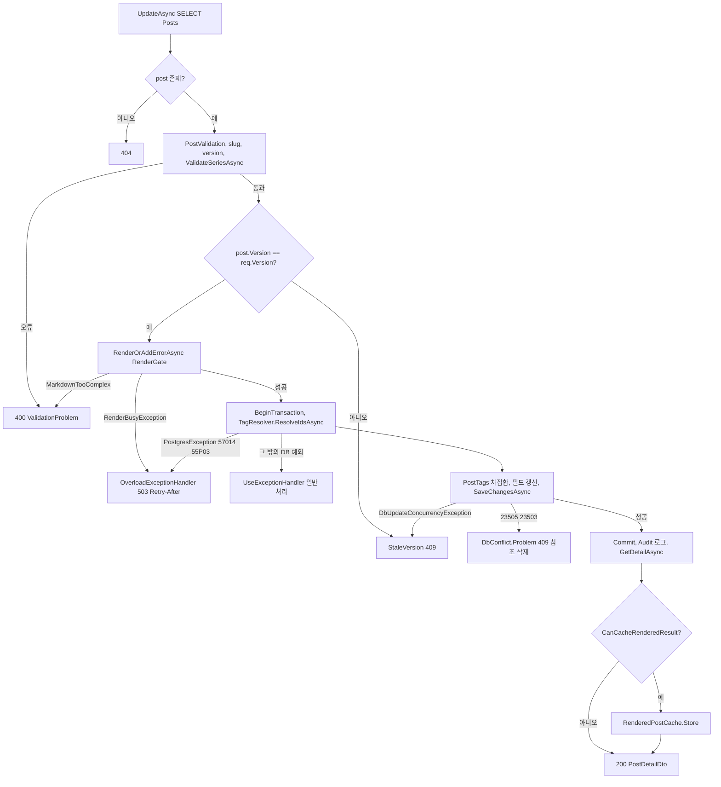
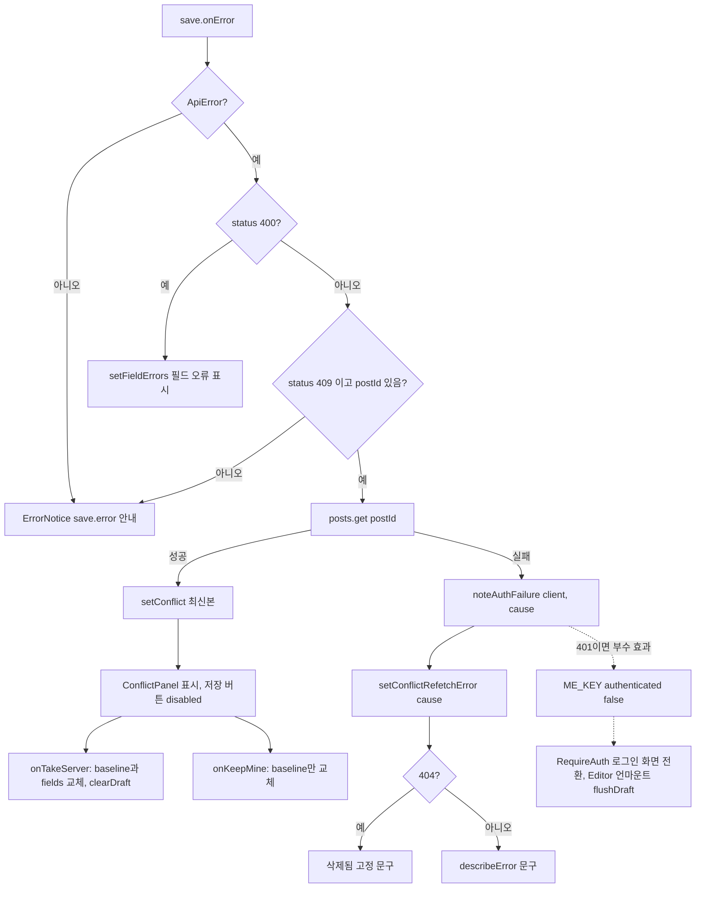
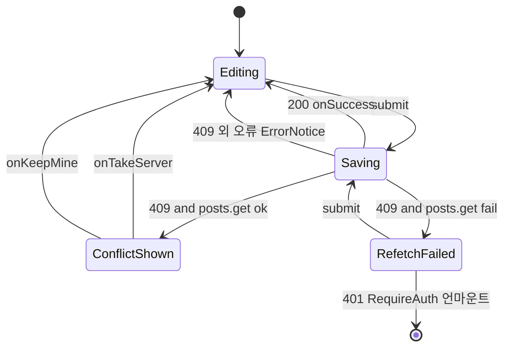

# F006 글 저장 충돌 감지·비교 해결

<!-- doc-harness:section id="summary" hash="456b4331f7d15d1aaf2f4496482cd58184bca823c37e20977622dad8b5c45506" -->
## 한 줄 요약

결론: 충돌 감지는 서버의 낙관적 동시성이 맡고, 해결은 클라이언트에서 사람이 직접 고른다. 이번 재검증에서 이 기능의 동작 변화는 확인되지 않았다. PostEndpoints.UpdateAsync, DbConflict, PostEditorPage, ConflictPanel의 줄 번호와 동작을 현재 코드와 다시 대조했고 모두 일치했다. 겹치는 변경은 TagEndpoints.cs 5행의 임시 주석('doc-harness incremental check (temporary, reverted after the test)') 한 줄뿐이다. 이 문서에 적은 TagEndpoints 줄 번호는 그 임시 주석이 5행에 있는 현재 파일 기준이다. 태그 삭제가 글 Version을 바꾸지 않는다는 클래스 문서 주석은 14-15행, DeleteTag는 37-42행이다. 임시 주석을 되돌리면 각각 13-14행과 36-41행이 된다. 이 문서 주석이 언제 생겼는지는 이력으로 확인하지 않았다. 동시성 토큰은 Post.Version이며, PostgreSQL xmin을 IsRowVersion으로 매핑한 값이다. 서버 UpdateAsync는 다음 순서로 처리한다. (1) 글이 없으면 404를 낸다. (2) 입력·slug 불변·version 누락·시리즈 존재 검증에 걸리면 400을 낸다. (3) post.Version != req.Version이면 StaleVersion()으로 409를 낸다. (4) RenderGate로 렌더할 수 있는지 확인한다. 중첩이 너무 깊으면 400이고, 슬롯 대기가 초과되면 OverloadExceptionHandler가 503을 낸다. (5) OriginalValue를 req.Version으로 고정하고 트랜잭션을 연다. (6) TagResolver.ResolveIdsAsync가 Tags를 SELECT하고, 없는 태그는 INSERT ... ON CONFLICT DO NOTHING으로 만든다. (7) PostTags 차집합과 필드를 반영하고 SaveChangesAsync를 호출한다. 여기서 DbUpdateConcurrencyException이면 StaleVersion() 409, 23505·23503이면 DbConflict.Problem 409를 낸다. 두 경우 모두 커밋하지 않고 dispose되므로 롤백된다. (8) 성공하면 커밋하고 Audit 로그를 남긴 뒤 GetDetailAsync로 다시 조회한다. 본문이 같을 때만 RenderedPostCache를 미리 채우고 200을 준다. 서버는 재시도하지 않는다. PUT /api/posts에는 RateLimitMetadata가 없어서 전역 제한기 체인에서 'none' 파티션으로 빠진다. 즉 속도 제한이 없다. 클라이언트 request()에도 타임아웃이 없고, posts.update는 signal을 넘기지 않는다. 클라이언트에서는 Editor.save.onError가 409를 받고, postId가 있으면 posts.get으로 최신본을 받아 conflict state에 넣는다. 그러면 ConflictPanel이 뜨고 저장 버튼이 막힌다. 재조회가 실패하면 noteAuthFailure를 부른 다음 setConflictRefetchError를 부른다. '서버본으로 바꾸기'는 baseline과 fields를 서버본으로 바꾸고 임시본을 지운다. '내 내용 유지'는 baseline(version 포함)만 바꾸므로, 다음 PUT이 서버본을 덮어쓴다(last-writer-wins). 시리즈 삭제는 글 행을 갱신해 Version을 바꾼다. 태그 삭제는 Tags ExecuteDeleteAsync와 PostTags cascade만 일으키므로 Version을 바꾸지 않는다. 문제 가능성은 다섯 가지를 관찰했다. 첫째, 제약 경쟁으로 난 409도 같은 충돌 패널로 간다. 둘째, 패널은 본문만 비교한다. 셋째, '임시본으로 보관' 문구가 항상 참은 아니다. 넷째, TagResolver 예외는 엔드포인트의 catch 밖에 있다. 다섯째, 충돌 로그가 없다.

| 항목 | 값 |
|---|---|
| 중요도 | SUPPORTING |
| 상태 | ACTIVE |
| 진입점 | `PUT /api/posts/{id:guid}`, `SPA /posts/:id` |
| 의존 기능 | [F001](../09_FEATURES.md#f001), [F003](../09_FEATURES.md#f003), [F005](../09_FEATURES.md#f005), [F007](../09_FEATURES.md#f007), [F008](../09_FEATURES.md#f008), [F011](../09_FEATURES.md#f011), [F018](../09_FEATURES.md#f018), [F020](../09_FEATURES.md#f020), [F029](../09_FEATURES.md#f029) |

### 진입점 근거

| 내용 | 상태 | 근거 |
|---|---|---|
| PUT /api/posts/{id:guid}는 PostEndpoints.UpdateAsync(라우트 이름 UpdatePost)로 들어간다. /api 그룹은 RequireHost(adminHost)·RequireAuthorization을 걸고, 요청은 AdminSurfaceMiddleware를 거친다. version이 맞지 않으면 StaleVersion()이 DbConflict.Problem으로 409 ProblemDetails(title '충돌')를 돌려준다. | CONFIRMED | `PortfolioBlog.Api/Features/Posts/PostEndpoints.cs` PostEndpoints.MapPostEndpoints (39-47), `PortfolioBlog.Api/Features/Posts/PostEndpoints.cs` PostEndpoints.UpdateAsync (187-245), `PortfolioBlog.Api/Features/ApiEndpoints.cs` (39-41), `PortfolioBlog.Api/Program.cs` (104) |
| SPA /posts/:id 편집 화면(PostEditorPage → Editor)에서 '저장' 버튼을 누르면 submit이 save.mutate를 부르고, save.mutate가 posts.update(PUT)를 보낸다. 응답이 409이면 onError가 충돌 처리를 시작한다. | CONFIRMED | `PortfolioBlog.Web/src/pages/PostEditorPage.tsx` Editor.submit / save (152-237), `PortfolioBlog.Web/src/api/endpoints.ts` posts.update (21) |
| 충돌을 해결하는 사용자 진입점은 ConflictPanel의 두 버튼(onTakeServer·onKeepMine)이다. | CONFIRMED | `PortfolioBlog.Web/src/components/ConflictPanel.tsx` ConflictPanel (14-30), `PortfolioBlog.Web/src/pages/PostEditorPage.tsx` Editor (ConflictPanel props) (296-300) |
<!-- /doc-harness:section -->

<!-- doc-harness:section id="flow" hash="6325e39cf76ead75910188dfa83e1f011a9c62b6298894a4cc7f36d79d0c25d7" -->
## 처리 흐름

| 단계 | 컴포넌트 | 코드 | 설명 |
|---|---|---|---|
| 1 | Editor | `PortfolioBlog.Web/src/pages/PostEditorPage.tsx` Editor (useState baseline) | 마운트할 때 GET으로 받은 PostDetail의 version을 baseline.version에 담는다. 상세 쿼리는 staleTime Infinity·gcTime 0이라 편집 중에는 다시 조회하지 않는다. 최신본은 저장 응답과 409 처리에서만 받는다. |
| 2 | Editor | `PortfolioBlog.Web/src/pages/PostEditorPage.tsx` submit | validatePost로 클라이언트 검증을 하고 conflictRefetchError를 null로 비운다. 오류가 없으면 flushDraft()로 현재 입력을 임시본에 바로 쓴 뒤 save.mutate(fields)를 부른다. |
| 3 | Editor | `PortfolioBlog.Web/src/pages/PostEditorPage.tsx` save.mutationFn | postId가 있으면 posts.update(postId, { ...submitted, version: baseline.version ?? undefined })를 부른다. request()가 PUT /api/posts/{id}로 JSON을 보낸다. signal과 타임아웃은 없다. |
| 4 | PostEndpoints | `PortfolioBlog.Api/Features/Posts/PostEndpoints.cs` UpdateAsync | db.Posts.Include(PostTags).SingleOrDefaultAsync로 글을 읽는다. 글이 없으면 404를 돌려준다. |
| 5 | PostEndpoints | `PortfolioBlog.Api/Features/Posts/PostEndpoints.cs` UpdateAsync / ValidateSeriesAsync | PostValidation.Validate, slug 불변 검사, version 누락 검사, ValidateSeriesAsync(Series 존재 확인)를 거친다. 오류가 있으면 400 ValidationProblem을 돌려준다. 이 400은 version 비교보다 먼저 온다. |
| 6 | PostEndpoints | `PortfolioBlog.Api/Features/Posts/PostEndpoints.cs` UpdateAsync / StaleVersion | 사전 비교를 한다. post.Version != req.Version이면 렌더 게이트를 쓰기 전에 StaleVersion()으로 409를 돌려준다. |
| 7 | PostEndpoints | `PortfolioBlog.Api/Features/Posts/PostEndpoints.cs` RenderOrAddErrorAsync | RenderGate.RenderAsync로 렌더할 수 있는지 확인하고, 결과(RenderedMarkdown)를 보관한다. MarkdownTooComplexException이면 400이다. RenderBusyException은 전파되고, OverloadExceptionHandler가 503으로 바꾼다. |
| 8 | PostEndpoints | `PortfolioBlog.Api/Features/Posts/PostEndpoints.cs` UpdateAsync | db.Entry(post).Property(Version).OriginalValue = req.Version으로 비교값을 고정하고 BeginTransactionAsync로 트랜잭션을 연다. |
| 9 | TagResolver | `PortfolioBlog.Api/Infrastructure/Data/TagResolver.cs` TagResolver.ResolveIdsAsync | 트랜잭션 안에서 태그 이름을 정규화하고 중복을 없앤다. 기존 NormalizedName을 SELECT한 뒤, 없는 태그는 INSERT INTO "Tags" ... ON CONFLICT ("NormalizedName") DO NOTHING을 실행한다. 마지막으로 Id 목록을 다시 SELECT한다. |
| 10 | PostEndpoints | `PortfolioBlog.Api/Features/Posts/PostEndpoints.cs` UpdateAsync | PostTags는 차집합만 지우고 더한다. Title·Summary·ContentMarkdown·SeriesId·SeriesOrder·UpdatedAt을 갱신하고 SaveChangesAsync를 부른다. 이때 UPDATE ... WHERE xmin = req.Version이 실행된다. |
| 11 | PostEndpoints | `PortfolioBlog.Api/Features/Posts/PostEndpoints.cs` UpdateAsync (catch) | 영향 행이 0이면 DbUpdateConcurrencyException이 나고 StaleVersion() 409를 돌려준다. 23505·23503 제약 위반이면 DbConflict.Problem('참조한 시리즈·태그가 방금 삭제…') 409를 돌려준다. 두 경우 모두 트랜잭션을 커밋하지 않고 await using으로 dispose하므로 롤백된다. TagResolver가 만든 태그도 함께 롤백된다. |
| 12 | DbConflict | `PortfolioBlog.Api/Infrastructure/Data/DbConflict.cs` DbConflict.Problem | TypedResults.Problem(statusCode 409, title '충돌', detail)으로 ProblemDetails 응답을 만든다. |
| 13 | PostEndpoints | `PortfolioBlog.Api/Features/Posts/PostEndpoints.cs` UpdateAsync (성공) | 성공하면 커밋하고 'PortfolioBlog.Api.Audit' 로그를 남긴다. PostQueries.GetDetailAsync로 다시 조회하고, CanCacheRenderedResult가 참이면 RenderedPostCache.Store(updated.Id, updated.Version, rendered)를 부른다. 그다음 새 version이 담긴 DTO와 함께 200을 돌려준다. |
| 14 | toApiError | `PortfolioBlog.Web/src/api/errors.ts` toApiError | 실패 응답을 ApiError(status 409, title, detail)로 바꾼다. MutationCache.onError가 noteAuthFailure를 부르지만, 409에는 아무 동작도 하지 않는다. |
| 15 | Editor | `PortfolioBlog.Web/src/pages/PostEditorPage.tsx` save.onError | error.status === 409이고 postId !== null이면 await posts.get(postId)로 최신본을 받아 setConflict(latest)를 부른다. 재조회가 실패하면 catch에서 noteAuthFailure(client, cause)를 부르고, 원인과 상관없이 setConflictRefetchError(cause)를 부른다. |
| 16 | ConflictPanel | `PortfolioBlog.Web/src/components/ConflictPanel.tsx` ConflictPanel | role=alertdialog 영역에 서버본의 updatedAt을 표시한다. 서버본과 내 본문의 contentMarkdown을 읽기 전용 textarea 두 개에 나란히 보여 준다. conflict !== null인 동안 저장 버튼은 disabled이고 ErrorNotice는 숨긴다. |
| 17 | Editor | `PortfolioBlog.Web/src/pages/PostEditorPage.tsx` onTakeServer | fromServer(conflict)로 baseline(fields·version)과 fields를 바꾸고, replaceAll로 편집기를 다시 마운트한다. 이어서 clearDraft(draftKey)·setConflict(null)·save.reset()을 부른다. |
| 18 | Editor | `PortfolioBlog.Web/src/pages/PostEditorPage.tsx` onKeepMine | baseline만 서버본(fields·version)으로 바꾸고 fields는 그대로 둔다. 이어서 setConflict(null)·save.reset()을 부른다. 다시 저장하면 새 version을 실은 PUT이 서버본을 덮어쓴다. |
<!-- /doc-harness:section -->

<!-- doc-harness:section id="F006_SEQUENCE" hash="302d9c513dad51fb346ab050f8adc8025879a0ddc5b476286858ef2e903ec977" -->
## 저장 충돌 감지와 해결 시퀀스 (Sequence Diagram)

서버는 version을 사전 비교와 xmin 조건 UPDATE로 두 번 검사해 409를 낸다. 클라이언트는 409를 받으면 최신본을 따로 GET해 ConflictPanel에서 사람이 해결 방법을 고르게 한다.

Editor.submit이 posts.update로 PUT을 보낸다. PostEndpoints.UpdateAsync는 Posts를 읽고 version을 미리 비교한다. 다르면 DbConflict를 거쳐 409를 돌려준다. 같으면 트랜잭션 안에서 TagResolver로 태그를 확정하고, SaveChangesAsync의 UPDATE ... WHERE xmin으로 경쟁을 한 번 더 잡는다. 409 응답에는 최신본이 없으므로 Editor가 posts.get으로 최신본을 받아 ConflictPanel에 넘긴다. onTakeServer는 서버본으로 교체하고, onKeepMine은 version만 갱신한 뒤 다음 저장에서 덮어쓴다.

### 코드 근거

| 구성 요소 | 코드 |
|---|---|
| Editor | `PortfolioBlog.Web/src/pages/PostEditorPage.tsx` (Editor) |
| client_ts | `PortfolioBlog.Web/src/api/client.ts` (request) |
| PostEndpoints | `PortfolioBlog.Api/Features/Posts/PostEndpoints.cs` (UpdateAsync) |
| TagResolver | `PortfolioBlog.Api/Infrastructure/Data/TagResolver.cs` (ResolveIdsAsync) |
| AppDbContext | `PortfolioBlog.Api/Infrastructure/Data/AppDbContext.cs` |
| DbConflict | `PortfolioBlog.Api/Infrastructure/Data/DbConflict.cs` (Problem) |
| RenderedPostCache | `PortfolioBlog.Api/Infrastructure/Markdown/RenderedPostCache.cs` (Store) |
| ConflictPanel | `PortfolioBlog.Web/src/components/ConflictPanel.tsx` (ConflictPanel) |
<!-- /doc-harness:section -->

<!-- doc-harness:section id="F006_FLOW_SERVER" hash="d4b4bec17d6fad0db87a1be93f869e1f19a420fb5bed9dcb90ee5b1928ef956e" -->
## PostEndpoints.UpdateAsync 분기(404·400·409·503·200) (Flowchart)

UpdateAsync는 404와 400 검증을 먼저 하고, version 사전 비교로 409를 낸 뒤 렌더와 저장으로 넘어간다. 저장 단계에서도 동시성 예외와 제약 경쟁은 409로, 과부하는 503으로 끝난다.

순서는 존재 확인 → 입력 검증 → version 비교 → 렌더 확인 → 트랜잭션·태그 확정 → SaveChanges → 커밋·재조회·캐시이다. TagResolver 호출은 try 블록 밖에 있어서, 여기서 난 DB 예외는 엔드포인트 catch가 아니라 전역 예외 처리기로 간다. 57014·55P03이면 OverloadExceptionHandler가 503을 내고, 나머지는 UseExceptionHandler가 일반 처리한다.

### 코드 근거

| 구성 요소 | 코드 |
|---|---|
| UpdateAsync | `PortfolioBlog.Api/Features/Posts/PostEndpoints.cs` (UpdateAsync) |
| ValidateSeriesAsync | `PortfolioBlog.Api/Features/Posts/PostEndpoints.cs` (ValidateSeriesAsync) |
| StaleVersion | `PortfolioBlog.Api/Features/Posts/PostEndpoints.cs` (StaleVersion) |
| RenderOrAddErrorAsync | `PortfolioBlog.Api/Features/Posts/PostEndpoints.cs` (RenderOrAddErrorAsync) |
| OverloadExceptionHandler | `PortfolioBlog.Api/Infrastructure/Web/OverloadExceptionHandler.cs` |
| TagResolver | `PortfolioBlog.Api/Infrastructure/Data/TagResolver.cs` (ResolveIdsAsync) |
| UseExceptionHandler | `PortfolioBlog.Api/Program.cs` |
| DbConflict | `PortfolioBlog.Api/Infrastructure/Data/DbConflict.cs` (Problem) |
| GetDetailAsync | `PortfolioBlog.Api/Infrastructure/Data/PostQueries.cs` (GetDetailAsync) |
| CanCacheRenderedResult | `PortfolioBlog.Api/Features/Posts/PostEndpoints.cs` (CanCacheRenderedResult) |
| RenderedPostCache | `PortfolioBlog.Api/Infrastructure/Markdown/RenderedPostCache.cs` (Store) |
<!-- /doc-harness:section -->

<!-- doc-harness:section id="F006_FLOW" hash="064978366d8771c277d497cc29389bd42722ee9da6fdad3d8e8098658c738677" -->
## Editor.save.onError 409 분기와 재조회 실패 처리 (Flowchart)

클라이언트는 status 409이고 postId가 있을 때만 최신본을 다시 조회해 충돌 패널을 띄운다. 재조회가 실패하면 원인과 상관없이 실패 안내로 간다.

onError는 ApiError가 아니면 아무것도 하지 않는다. 400이면 필드 오류를 표시한다. 409이고 postId가 있으면 posts.get을 부른다. 성공하면 setConflict로 ConflictPanel을 띄운다. 실패하면 noteAuthFailure를 부른 뒤 setConflictRefetchError를 부르고, conflictRefetchMessage가 404에는 고정 문구, 나머지에는 describeError 문구를 보여 준다. 401이면 부수 효과로 RequireAuth가 로그인 화면으로 전환한다. 409 원인(stale version / 참조 삭제)은 구분하지 않는다.

### 코드 근거

| 구성 요소 | 코드 |
|---|---|
| onError | `PortfolioBlog.Web/src/pages/PostEditorPage.tsx` (save.onError) |
| postsGet | `PortfolioBlog.Web/src/api/endpoints.ts` (posts.get) |
| ConflictPanel | `PortfolioBlog.Web/src/components/ConflictPanel.tsx` (ConflictPanel) |
| noteAuthFailure | `PortfolioBlog.Web/src/app/queryClient.ts` (noteAuthFailure) |
| RequireAuth | `PortfolioBlog.Web/src/auth/RequireAuth.tsx` (RequireAuth) |
| conflictRefetchMessage | `PortfolioBlog.Web/src/pages/PostEditorPage.tsx` (conflictRefetchMessage) |
| describeError | `PortfolioBlog.Web/src/api/errors.ts` (describeError) |
| onTakeServer | `PortfolioBlog.Web/src/pages/PostEditorPage.tsx` |
| onKeepMine | `PortfolioBlog.Web/src/pages/PostEditorPage.tsx` |
<!-- /doc-harness:section -->

<!-- doc-harness:section id="F006_STATE" hash="364b43310c00b5714d4b6664a2ad4540d2ad3bb17e34e1de932d76e430d3108b" -->
## 편집 화면 충돌 상태 (State Diagram)

편집 화면은 편집 중·저장 중·충돌 표시·재조회 실패의 네 상태를 오간다. 충돌은 두 버튼 중 하나를 눌러야만 해소된다.

conflict state가 null이 아니면 ConflictPanel이 뜨고 저장 버튼이 막힌다. onTakeServer나 onKeepMine이 conflict를 null로 돌려야 다시 저장할 수 있다. 재조회에 실패한 상태에서는 다시 submit할 수 있고, 401이면 RequireAuth가 Editor를 언마운트한다.

### 코드 근거

| 구성 요소 | 코드 |
|---|---|
| Editing | `PortfolioBlog.Web/src/pages/PostEditorPage.tsx` (Editor) |
| Saving | `PortfolioBlog.Web/src/pages/PostEditorPage.tsx` (save.isPending) |
| ConflictShown | `PortfolioBlog.Web/src/components/ConflictPanel.tsx` (ConflictPanel) |
| RefetchFailed | `PortfolioBlog.Web/src/pages/PostEditorPage.tsx` (conflictRefetchError) |
<!-- /doc-harness:section -->

<!-- doc-harness:section id="data" hash="9bde1f58226c92eff84c9b05e80f1d32f406ea0e9ee42ac42d03fe127f2da668" -->
## 데이터

### 데이터 흐름

| 내용 | 상태 | 근거 |
|---|---|---|
| version의 원천은 PostgreSQL 시스템 컬럼 xmin이다. Post.Version(uint)은 IsRowVersion으로 매핑된다. 이 값은 PostDetailDto.Version을 통해 클라이언트로 전달되고, Editor.baseline.version에 보관된다. | CONFIRMED | `PortfolioBlog.Api/Infrastructure/Data/AppDbContext.cs` (96), `PortfolioBlog.Api/Domain/Post.cs` Post.Version (45), `PortfolioBlog.Api/Contracts/PostDtos.cs` PostDetailDto (28-30), `PortfolioBlog.Web/src/pages/PostEditorPage.tsx` (56) |
| 저장 요청은 DraftFields(submitted)에 version(baseline.version)을 더한 UpsertPostRequest JSON이다. UpdateAsync는 req.Version을 post.Version과 비교한다. 같은 값을 OriginalValue에도 넣어 UPDATE의 WHERE 비교값으로 쓴다. | CONFIRMED | `PortfolioBlog.Web/src/pages/PostEditorPage.tsx` (155), `PortfolioBlog.Api/Features/Posts/PostEndpoints.cs` (201-228), `PortfolioBlog.Api/Contracts/PostDtos.cs` UpsertPostRequest (46-48) |
| req.TagNames는 트랜잭션 안에서 TagResolver.ResolveIdsAsync를 거쳐 Tag Id 목록(wanted)이 된다. 이때 없는 태그는 Tags 행으로 새로 만들어진다. 이 목록과의 차집합을 기준으로 PostTags 링크를 지우거나 더한다. | CONFIRMED | `PortfolioBlog.Api/Features/Posts/PostEndpoints.cs` (212-219), `PortfolioBlog.Api/Infrastructure/Data/TagResolver.cs` TagResolver.ResolveIdsAsync (92-116) |
| 저장 전 렌더 확인의 결과 RenderedMarkdown은 버리지 않는다. 저장에 성공하고, 다시 조회한 DTO 본문이 요청 본문과 서수 비교로 같을 때만 RenderedPostCache.Store((Id, Version))로 메모리 캐시를 미리 채운다. 409·400·503 경로에서는 캐시를 건드리지 않는다. | CONFIRMED | `PortfolioBlog.Api/Features/Posts/PostEndpoints.cs` UpdateAsync / CanCacheRenderedResult (206, 241-243, 353-354), `PortfolioBlog.Api/Infrastructure/Markdown/RenderedPostCache.cs` RenderedPostCache.Store (115-122) |
| 충돌 응답은 ProblemDetails(409, title '충돌', detail)이고, toApiError를 거쳐 ApiError가 된다. 409 응답에는 최신본이 들어 있지 않다. 그래서 클라이언트가 GET /api/posts/{id}를 따로 호출해 PostDetail을 받는다. 받은 값은 conflict state를 거쳐 ConflictPanel.server로 전달된다. | CONFIRMED | `PortfolioBlog.Api/Infrastructure/Data/DbConflict.cs` (50-51), `PortfolioBlog.Web/src/api/errors.ts` toApiError (54-65), `PortfolioBlog.Web/src/pages/PostEditorPage.tsx` (221-227) |
| 재조회가 실패하면 원인 객체(cause)가 conflictRefetchError state에 들어간다. 401도 마찬가지다. 화면 문구는 conflictRefetchMessage가 만든다. 404이면 고정 문구를 쓰고, 나머지는 describeError를 쓴다. 401이면 이와 별도로 ME_KEY 캐시가 { authenticated: false }로 바뀐다. | CONFIRMED | `PortfolioBlog.Web/src/pages/PostEditorPage.tsx` (29-32, 223-226, 301-305), `PortfolioBlog.Web/src/app/queryClient.ts` noteAuthFailure (11-13) |
| 충돌 해결 뒤의 데이터 흐름은 버튼마다 다르다. onTakeServer는 서버본을 baseline과 fields 모두에 넣고, onKeepMine은 baseline에만 넣는다. 어느 쪽이든 dirty는 서버본을 기준으로 다시 계산되고, 다음 PUT에는 conflict.version이 실린다. | CONFIRMED | `PortfolioBlog.Web/src/pages/PostEditorPage.tsx` (75, 296-300) |
| ConflictPanel이 비교해 보여 주는 것은 contentMarkdown(서버본과 fields.contentMarkdown)과 서버의 updatedAt뿐이다. 제목·요약·태그·시리즈의 차이는 화면에 드러나지 않는다. | CONFIRMED | `PortfolioBlog.Web/src/components/ConflictPanel.tsx` (4-27), `PortfolioBlog.Web/src/pages/PostEditorPage.tsx` (297) |
| PUT 요청은 앱 전역 속도 제한기 체인(GlobalLimiter = BuildChain)을 거치지만 실제로 제한되지는 않는다. 각 제한기는 엔드포인트의 RateLimitMetadata를 보고 대상을 고르는데(Matches), PostEndpoints 라우트에는 RateLimitMetadata가 없다. 그래서 모든 제한기에서 GetNoLimiter("none") 파티션으로 빠진다. | CONFIRMED | `PortfolioBlog.Api/Infrastructure/Web/RateLimitingExtensions.cs` AddAppRateLimiting / BuildChain / Matches (53, 128-129, 150, 170), `PortfolioBlog.Api/Features/Posts/PostEndpoints.cs` MapPostEndpoints (39-47), `PortfolioBlog.Api/Program.cs` (56, 105) |

### DB 접근

| 엔티티 | 작업 | 코드 |
|---|---|---|
| Posts (+PostTags Include) | SELECT | `PortfolioBlog.Api/Features/Posts/PostEndpoints.cs` UpdateAsync |
| Series | SELECT | `PortfolioBlog.Api/Features/Posts/PostEndpoints.cs` ValidateSeriesAsync (AnyAsync) |
| Tags | SELECT | `PortfolioBlog.Api/Infrastructure/Data/TagResolver.cs` TagResolver.ResolveIdsAsync (기존 NormalizedName 조회, 104행) |
| Tags | INSERT | `PortfolioBlog.Api/Infrastructure/Data/TagResolver.cs` TagResolver.ResolveIdsAsync (INSERT ... ON CONFLICT ("NormalizedName") DO NOTHING, 112-113행) |
| Tags | SELECT | `PortfolioBlog.Api/Infrastructure/Data/TagResolver.cs` TagResolver.ResolveIdsAsync (Id 재조회, 115행) |
| Posts | UPDATE | `PortfolioBlog.Api/Features/Posts/PostEndpoints.cs` UpdateAsync (SaveChangesAsync, WHERE xmin = req.Version) |
| PostTags | DELETE | `PortfolioBlog.Api/Features/Posts/PostEndpoints.cs` UpdateAsync (RemoveAll 차집합) |
| PostTags | INSERT | `PortfolioBlog.Api/Features/Posts/PostEndpoints.cs` UpdateAsync (차집합 추가) |
| Posts (저장 후 상세 재조회) | SELECT | `PortfolioBlog.Api/Infrastructure/Data/PostQueries.cs` PostQueries.GetDetailAsync |
| Posts (409 뒤 클라이언트 재조회 GET) | SELECT | `PortfolioBlog.Api/Features/Posts/PostEndpoints.cs` GetAsync / PostQueries.GetDetailAsync |

### 상태 전이

| 이전 | 다음 | 트리거 | 근거 |
|---|---|---|---|
| 편집 중(conflict=null) | 저장 중(save.isPending) | submit → save.mutate(fields) | `PortfolioBlog.Web/src/pages/PostEditorPage.tsx` submit (231-237) |
| 저장 중 | 충돌 표시(conflict=최신 PostDetail, 저장 버튼 disabled) | PUT 409 + posts.get 성공 | `PortfolioBlog.Web/src/pages/PostEditorPage.tsx` save.onError (217-228, 284, 296) |
| 저장 중 | 재조회 실패 안내(conflictRefetchError≠null, conflict=null) | PUT 409 + posts.get 실패(401·404·네트워크 등 모든 원인) | `PortfolioBlog.Web/src/pages/PostEditorPage.tsx` (222-226, 301-305) |
| 재조회 실패 안내(401) | 로그인 화면(Editor 언마운트) | noteAuthFailure가 ME_KEY를 authenticated=false로 기록하고, 그 부수 효과로 RequireAuth가 /login으로 전환한다 | `PortfolioBlog.Web/src/app/queryClient.ts` (11-13), `PortfolioBlog.Web/src/auth/RequireAuth.tsx` RequireAuth (11-20) |
| 충돌 표시 | 편집 중(서버본으로 교체, 임시본 삭제, dirty=false) | ConflictPanel onTakeServer | `PortfolioBlog.Web/src/pages/PostEditorPage.tsx` (298) |
| 충돌 표시 | 편집 중(내 내용 유지, baseline.version=서버 최신) | ConflictPanel onKeepMine | `PortfolioBlog.Web/src/pages/PostEditorPage.tsx` (299) |
| 재조회 실패 안내 | 저장 중 | 다시 submit(conflictRefetchError를 null로 초기화) | `PortfolioBlog.Web/src/pages/PostEditorPage.tsx` (234-236) |
| Posts 행 xmin=N | Posts 행 xmin=N' | UpdateAsync가 성공해 커밋할 때(UpdatedAt을 항상 갱신하므로 태그만 바꿔도 행이 바뀐다), 또는 시리즈 삭제로 SeriesId·SeriesOrder가 비워질 때. 태그 삭제는 cascade로 PostTags만 지우므로 여기에 해당하지 않는다. 이 동작은 TagEndpoints 클래스 문서 주석에도 적혀 있다. 줄 번호는 5행 임시 주석이 있는 현재 파일 기준으로 14-15행이며, 임시 주석을 되돌리면 13-14행이 된다. | `PortfolioBlog.Api/Features/Posts/PostEndpoints.cs` (225-238), `PortfolioBlog.Api.Tests/Features/SeriesEndpointsTests.cs` (134-149), `PortfolioBlog.Api/Features/Tags/TagEndpoints.cs` TagEndpoints / DeleteTag (14-15, 37-42) |
| 트랜잭션 열림(태그 INSERT 가능) | 롤백(커밋 없이 dispose) | SaveChangesAsync의 DbUpdateConcurrencyException 또는 23505/23503 → 409 반환 | `PortfolioBlog.Api/Features/Posts/PostEndpoints.cs` (212-238) |

### 외부 의존

| 내용 | 상태 | 근거 |
|---|---|---|
| PostgreSQL xmin 시스템 컬럼과 Npgsql의 uint + IsRowVersion 매핑에 의존한다. 앱이 동시성 토큰을 따로 만들지 않고 DB 트랜잭션 ID를 그대로 쓴다. | CONFIRMED | `PortfolioBlog.Api/Infrastructure/Data/AppDbContext.cs` (96) |
| EF Core의 DbUpdateConcurrencyException(영향 행 0)과 Npgsql PostgresException의 SqlState 23505·23503 판정에 의존한다. | CONFIRMED | `PortfolioBlog.Api/Infrastructure/Data/DbConflict.cs` IsConstraintRace (36-37), `PortfolioBlog.Api/Features/Posts/PostEndpoints.cs` (230-237) |
| TagResolver는 PostgreSQL의 INSERT ... ON CONFLICT DO NOTHING 구문에 의존한다. 이 구문은 ExecuteSqlInterpolatedAsync로 보내는 원시 SQL이다. | CONFIRMED | `PortfolioBlog.Api/Infrastructure/Data/TagResolver.cs` (112-113) |
| 렌더 캐시는 Microsoft.Extensions.Caching.Memory의 MemoryCache.Set을 쓴다(RenderedPostCache.Store). | CONFIRMED | `PortfolioBlog.Api/Infrastructure/Markdown/RenderedPostCache.cs` (115-122) |
| 클라이언트는 @tanstack/react-query useMutation의 onError·reset을 쓴다. mutations의 retry 기본값이 false라서 409를 자동으로 재시도하지 않는다. | CONFIRMED | `PortfolioBlog.Web/src/app/queryClient.ts` (15-25) |
| 클라이언트 HTTP는 브라우저 fetch(request())를 쓴다. 옵션은 credentials 'same-origin', cache 'no-store', redirect 'error'이고, CSRF 헤더(X-Requested-With)가 붙는다. 타임아웃은 없고, 취소는 호출자가 넘긴 options.signal에만 의존한다. | CONFIRMED | `PortfolioBlog.Web/src/api/client.ts` request (46-76) |
<!-- /doc-harness:section -->

<!-- doc-harness:section id="failures" hash="21ecbe2b4a5eff1c8e144e41a16d07a0ada7788b6648f1e52d42d3990db96f23" -->
## 실패 지점

| 위치 | 조건 | 처리 | 상태 | 근거 |
|---|---|---|---|---|
| PostEndpoints.UpdateAsync | post.Version != req.Version(사전 비교) | StaleVersion()으로 409를 돌려준다. 렌더 게이트와 트랜잭션을 쓰기 전에 반환한다. | CONFIRMED | `PortfolioBlog.Api/Features/Posts/PostEndpoints.cs` (199-201, 366-367), `PortfolioBlog.Api.Tests/Features/PostEndpointsTests.cs` (211-231) |
| PostEndpoints.UpdateAsync SaveChangesAsync | 조회와 저장 사이에 다른 커밋이 xmin을 바꿔 UPDATE 영향 행이 0이 되어 DbUpdateConcurrencyException이 난다 | catch해서 StaleVersion()으로 409를 돌려준다. 트랜잭션은 커밋되지 않고 await using으로 dispose되어 롤백된다. TagResolver가 만든 Tags 행도 함께 롤백된다. | CONFIRMED | `PortfolioBlog.Api/Features/Posts/PostEndpoints.cs` (210-238) |
| PostEndpoints.UpdateAsync SaveChangesAsync | 23505/23503 제약 위반(검증 직후 시리즈·태그가 삭제된 경우) | DbConflict.Problem('참조한 시리즈·태그가 방금 삭제되었습니다…')으로 409를 돌려준다. 트랜잭션은 롤백되고, 서버는 재시도하지 않는다. 재시도하지 않는 이유는 DbConflict 문서 주석에 적혀 있다. | CONFIRMED | `PortfolioBlog.Api/Features/Posts/PostEndpoints.cs` (234-237), `PortfolioBlog.Api/Infrastructure/Data/DbConflict.cs` (15, 36-37) |
| PostEndpoints.RenderOrAddErrorAsync | RenderGate 슬롯을 제때 얻지 못함(RenderBusyException) | 엔드포인트는 MarkdownTooComplexException만 잡는다. RenderBusyException은 전파되고, OverloadExceptionHandler가 Retry-After와 함께 503으로 바꾼다. 클라이언트는 충돌 흐름으로 가지 않고 ErrorNotice에 describeError(503) 문구를 띄운다. | CONFIRMED | `PortfolioBlog.Api/Features/Posts/PostEndpoints.cs` (314, 323-334), `PortfolioBlog.Api/Infrastructure/Web/OverloadExceptionHandler.cs` (8, 38-40, 67), `PortfolioBlog.Api/Program.cs` (43, 100), `PortfolioBlog.Web/src/api/errors.ts` (81) |
| TagResolver.ResolveIdsAsync (UpdateAsync 213행) | 태그 SELECT·INSERT 중 PostgresException(타임아웃 57014, 잠금 대기 55P03, 그 밖의 DB 오류) | 이 호출은 try 블록(226행)보다 앞에 있어 엔드포인트의 catch 두 개 어디에도 걸리지 않는다. 57014·55P03은 OverloadExceptionHandler가 503으로 바꾼다. 그 밖의 오류는 UseExceptionHandler의 일반 처리로 넘어간다(엔드포인트 차원의 처리는 없고 예외가 전파된다). 트랜잭션은 dispose되면서 롤백된다. | POTENTIAL_ISSUE | `PortfolioBlog.Api/Features/Posts/PostEndpoints.cs` (212-237), `PortfolioBlog.Api/Infrastructure/Data/TagResolver.cs` (104-115), `PortfolioBlog.Api/Infrastructure/Web/OverloadExceptionHandler.cs` (67) |
| Editor.save.onError | 409의 원인이 version 불일치가 아니라 제약 경쟁(참조 삭제)인 경우 | status만 보고 똑같이 최신본을 다시 조회해 ConflictPanel('다른 곳에서 이 글이 먼저 수정되었습니다')을 띄운다. conflict가 있으면 ErrorNotice가 숨겨지므로 서버의 detail 문구는 화면에 나오지 않는다. '내 내용 유지' 뒤 다시 저장하면 같은 FK 원인으로 또 실패할 수 있다. | POTENTIAL_ISSUE | `PortfolioBlog.Web/src/pages/PostEditorPage.tsx` (221-227, 307), `PortfolioBlog.Api/Features/Posts/PostEndpoints.cs` (234-237) |
| Editor.save.onError posts.get | 409 뒤 최신본 재조회가 404(그사이 글이 삭제됨) | setConflictRefetchError(cause)가 호출되고, conflictRefetchMessage가 고정 문구를 role=alert로 보여 준다. 충돌 패널은 뜨지 않는다. | CONFIRMED | `PortfolioBlog.Web/src/pages/PostEditorPage.tsx` (29-32, 222-226, 301-305), `PortfolioBlog.Web/src/test/editor.test.tsx` (364-375) |
| Editor.save.onError posts.get | 재조회가 401 | noteAuthFailure가 ME_KEY를 { authenticated: false }로 기록한다. 이어서 다른 원인과 똑같이 setConflictRefetchError(cause)가 호출된다. RequireAuth가 로그인 화면으로 전환하면서 Editor가 언마운트되고, 언마운트 cleanup의 flushDraft가 임시본을 남긴다. | CONFIRMED | `PortfolioBlog.Web/src/pages/PostEditorPage.tsx` (223-226, 134), `PortfolioBlog.Web/src/app/queryClient.ts` (11-13), `PortfolioBlog.Web/src/auth/RequireAuth.tsx` (16-19) |
| Editor.save.onError posts.get | 재조회가 네트워크 실패(status 0)·503 등으로 실패 | conflictRefetchError에 담아 describeError 문구로 보여 준다. 자동 재시도는 없다. 사용자가 다시 저장하면 또 409를 받고 재조회를 다시 시도한다. | CONFIRMED | `PortfolioBlog.Web/src/pages/PostEditorPage.tsx` (225, 301-305), `PortfolioBlog.Web/src/api/errors.ts` describeError (68-84) |
| PostEndpoints.UpdateAsync | 글이 이미 삭제됨 | version 비교 전에 404를 돌려준다. 클라이언트는 ErrorNotice에 describeError(404) 문구를 보여 준다. | CONFIRMED | `PortfolioBlog.Api/Features/Posts/PostEndpoints.cs` (189-190), `PortfolioBlog.Web/src/pages/PostEditorPage.tsx` (307) |
| PostEndpoints.UpdateAsync | version 누락(req.Version null) | errors에 'version' 키를 추가하고 400 ValidationProblem을 돌려준다. | CONFIRMED | `PortfolioBlog.Api/Features/Posts/PostEndpoints.cs` (195-197), `PortfolioBlog.Api.Tests/Features/PostEndpointsTests.cs` (211-231) |
| Editor.save.onError | 409이지만 postId === null(새 글 생성 중 slug 중복·제약 경쟁) | 충돌 패널로 가지 않는다. ErrorNotice가 서버 detail(409)을 보여 준다. | CONFIRMED | `PortfolioBlog.Web/src/pages/PostEditorPage.tsx` (221, 307), `PortfolioBlog.Api/Features/Posts/PostEndpoints.cs` (136, 153-156) |
| client.ts request (posts.update 경유) | PUT 응답이 오래 오지 않음 | request()에는 타임아웃이 없다. fetch에 전달되는 것은 호출자의 options.signal뿐인데, posts.update는 signal을 넘기지 않는다. 그래서 저장 PUT에는 클라이언트 쪽 시간 제한이 없다. 응답이 올 때까지 save.isPending이 유지되고 저장 버튼도 막힌 채로 남는다. | CONFIRMED | `PortfolioBlog.Web/src/api/client.ts` request (46-67), `PortfolioBlog.Web/src/api/endpoints.ts` posts.update (21), `PortfolioBlog.Web/src/pages/PostEditorPage.tsx` (284) |

### 엣지 케이스

| 내용 | 상태 | 근거 |
|---|---|---|
| '내 내용 유지'는 병합이 아니다. 다음 저장이 서버본 전체를 교체해 덮어쓴다. 다른 탭이 바꾼 제목·태그·본문도 모두 덮인다. | CONFIRMED | `PortfolioBlog.Web/src/components/ConflictPanel.tsx` (9-10, 26), `PortfolioBlog.Web/e2e/admin.spec.ts` (160-180) |
| ConflictPanel은 본문만 나란히 보여 준다. 다른 탭이 제목만 바꿨다면 두 본문이 같아 보여서 차이를 확인할 수 없다. 이 상태에서 '내 내용 유지'를 고르면 다른 탭의 제목 변경을 덮어쓴다. | POTENTIAL_ISSUE | `PortfolioBlog.Web/src/components/ConflictPanel.tsx` (18-23) |
| 패널 문구 '내 변경은 임시본으로 보관되어 있습니다'는 항상 참이 아니다. 두 가지 경우에 틀린다. 첫째, 임시본 복원 여부를 아직 고르지 않은 상태(pendingDraft≠null)이면 flushDraft가 임시본을 쓰지 않는다. 둘째, localStorage 저장이 실패하면(draftFailed) 쓰기 자체가 실패한다. 게다가 저장 버튼은 pendingDraft 상태에서도 막히지 않는다. | POTENTIAL_ISSUE | `PortfolioBlog.Web/src/components/ConflictPanel.tsx` (17), `PortfolioBlog.Web/src/pages/PostEditorPage.tsx` (125-132, 236, 284) |
| conflictRefetchMessage 주석(25-26행)에는 '401은 여기까지 오지 않는다'고 적혀 있다. 실제로는 401도 setConflictRefetchError에 담긴다. 다만 RequireAuth가 화면을 전환하면서 Editor가 곧 언마운트되므로 그 문구가 화면에 남지는 않을 것으로 추론한다. | INFERRED | `PortfolioBlog.Web/src/pages/PostEditorPage.tsx` (25-28, 223-226), `PortfolioBlog.Web/src/auth/RequireAuth.tsx` (16-19) |
| onKeepMine은 baseline만 바꾸고 임시본을 다시 쓰지 않는다. 자동 저장 effect는 baseline을 의존성으로 두지 않아서 settled가 바뀔 때만 돈다. 그래서 입력을 더 하기 전까지는 임시본의 baseVersion이 옛 값으로 남는다. 언마운트·pagehide 때의 flush는 baselineRef를 읽으므로 새 version을 쓴다. | INFERRED | `PortfolioBlog.Web/src/pages/PostEditorPage.tsx` (104-113, 125-140, 299) |
| 입력 검증 400은 version 비교보다 먼저 온다. version 비교 뒤에 올 수 있는 400은 렌더 복잡도(MarkdownTooComplex) 하나뿐이다. 따라서 클라이언트 주석 '409는 본문 검증(400)보다 먼저 올 수 있다'는 렌더 검증에만 들어맞는다. | CONFIRMED | `PortfolioBlog.Api/Features/Posts/PostEndpoints.cs` (192-207), `PortfolioBlog.Web/src/pages/PostEditorPage.tsx` (219-220) |
| 시리즈를 삭제하면 소속 글의 SeriesId·SeriesOrder가 비워지면서 글 행이 갱신된다. 그래서 Version이 바뀌고, 열려 있던 편집 탭은 다음 저장에서 409를 받는다. 태그 삭제는 다르다. TagEndpoints의 DELETE는 db.Tags.Where(...).ExecuteDeleteAsync만 실행하고, PostTag→Tag FK가 OnDelete(Cascade)라서 DB가 PostTags 행만 지운다. Posts 행은 갱신되지 않으므로 글의 xmin(Version)은 그대로다. 현재 TagEndpoints 클래스 문서 주석도 같은 내용을 적고 있다. 줄 번호는 5행 임시 주석이 있는 현재 파일 기준으로 14-15행이며, 되돌리면 13-14행이다. 따라서 열린 편집 탭에는 409가 나지 않는다. 그 탭이 삭제된 태그 이름을 그대로 다시 보내면 TagResolver가 태그를 새로 만든다. | CONFIRMED | `PortfolioBlog.Api.Tests/Features/SeriesEndpointsTests.cs` Delete_KeepsPosts_AndClearsBothSeriesFields (134-149), `PortfolioBlog.Api/Features/Tags/TagEndpoints.cs` TagEndpoints / DeleteTag (14-15, 37-42), `PortfolioBlog.Api/Infrastructure/Data/AppDbContext.cs` (138-139), `PortfolioBlog.Api/Infrastructure/Data/TagResolver.cs` (104-115) |
| 저장을 커밋한 뒤, 응답용 재조회를 하기 전에 다른 요청이 같은 글을 저장할 수 있다. 그러면 재조회 DTO에는 다른 요청의 본문과 version이 담기고, CanCacheRenderedResult가 false가 되어 캐시 선채움을 건너뛴다. 이때 응답 DTO의 version은 이 요청이 쓴 값보다 최신일 수 있다. | CONFIRMED | `PortfolioBlog.Api/Features/Posts/PostEndpoints.cs` (241-243, 347-354) |
| 409를 처리하면서 부르는 재조회(posts.get)에는 AbortSignal을 넘기지 않는다. 그래서 재조회 도중 화면이 언마운트되면, 이미 언마운트된 컴포넌트에 setConflict가 호출될 수 있다. | INFERRED | `PortfolioBlog.Web/src/pages/PostEditorPage.tsx` (222), `PortfolioBlog.Web/src/api/endpoints.ts` (19) |
| 충돌 패널이 떠 있는 동안에도 입력란과 편집기는 막히지 않는다. 이 상태에서 '서버본으로 바꾸기'를 누르면, 패널이 뜬 뒤에 입력한 내용도 함께 버려진다. | CONFIRMED | `PortfolioBlog.Web/src/pages/PostEditorPage.tsx` (297-298, 316-371) |
| PUT /api/posts에는 속도 제한이 없다. 앱은 RequireRateLimiting을 쓰지 않고, GlobalLimiter 체인의 각 제한기가 RateLimitMetadata를 보고 대상을 고른다. PostEndpoints 라우트에는 RateLimitMetadata가 없어서 모든 제한기에서 'none' 파티션으로 빠진다. 따라서 저장을 반복해서 보내도 429가 나지 않는다. | CONFIRMED | `PortfolioBlog.Api/Infrastructure/Web/RateLimitingExtensions.cs` (53, 128-129, 150, 170), `PortfolioBlog.Api/Features/Posts/PostEndpoints.cs` (39-47) |

### 로깅

| 내용 | 상태 | 근거 |
|---|---|---|
| 충돌(409)에 대한 서버 로그는 없다. StaleVersion과 DbConflict.Problem 경로에는 로깅 호출이 없다. 성공한 수정만 'PortfolioBlog.Api.Audit' 로거가 PostId·Slug를 Information 수준으로 남기며, 본문은 기록하지 않는다. | CONFIRMED | `PortfolioBlog.Api/Features/Posts/PostEndpoints.cs` (230-240, 366-367), `PortfolioBlog.Api/Infrastructure/Data/DbConflict.cs` (50-51) |
| 클라이언트는 충돌을 콘솔에도, 원격에도 기록하지 않는다. 화면(role=alertdialog / role=alert)으로만 알린다. | CONFIRMED | `PortfolioBlog.Web/src/components/ConflictPanel.tsx` (16), `PortfolioBlog.Web/src/pages/PostEditorPage.tsx` (301-305) |
<!-- /doc-harness:section -->

<!-- doc-harness:section id="code" hash="fc4df7ffac8fe1c3387f237911a085b17e1b0d9ef1a05244a0185764f80f25c5" -->
## 관련 코드

| 파일 | 심볼 | 역할 |
|---|---|---|
| `PortfolioBlog.Api/Features/Posts/PostEndpoints.cs` | PostEndpoints.UpdateAsync | entry |
| `PortfolioBlog.Api/Features/Posts/PostEndpoints.cs` | PostEndpoints.StaleVersion | service |
| `PortfolioBlog.Api/Features/Posts/PostEndpoints.cs` | PostEndpoints.GetAsync | service |
| `PortfolioBlog.Api/Features/Posts/PostEndpoints.cs` | PostEndpoints.ValidateSeriesAsync | validation |
| `PortfolioBlog.Api/Features/Posts/PostEndpoints.cs` | PostEndpoints.RenderOrAddErrorAsync / CanCacheRenderedResult | validation |
| `PortfolioBlog.Api/Infrastructure/Data/DbConflict.cs` | DbConflict.Problem / DbConflict.IsConstraintRace | service |
| `PortfolioBlog.Api/Infrastructure/Data/TagResolver.cs` | TagResolver.ResolveIdsAsync | data |
| `PortfolioBlog.Api/Infrastructure/Data/PostQueries.cs` | PostQueries.GetDetailAsync | data |
| `PortfolioBlog.Api/Infrastructure/Markdown/RenderedPostCache.cs` | RenderedPostCache.Store | service |
| `PortfolioBlog.Api/Infrastructure/Web/OverloadExceptionHandler.cs` | OverloadExceptionHandler | service |
| `PortfolioBlog.Api/Infrastructure/Web/RateLimitingExtensions.cs` | AddAppRateLimiting / BuildChain / Matches | config |
| `PortfolioBlog.Api/Infrastructure/Data/AppDbContext.cs` | Post.Version IsRowVersion / PostTag→Tag OnDelete(Cascade) | config |
| `PortfolioBlog.Api/Features/Tags/TagEndpoints.cs` | MapTagEndpoints (DeleteTag) | data |
| `PortfolioBlog.Api/Domain/Post.cs` | Post.Version | data |
| `PortfolioBlog.Api/Contracts/PostDtos.cs` | PostDetailDto.Version / UpsertPostRequest.Version | dto |
| `PortfolioBlog.Web/src/pages/PostEditorPage.tsx` | Editor.save / onError / ConflictPanel 연결 | entry |
| `PortfolioBlog.Web/src/pages/PostEditorPage.tsx` | conflictRefetchMessage | render |
| `PortfolioBlog.Web/src/components/ConflictPanel.tsx` | ConflictPanel | render |
| `PortfolioBlog.Web/src/api/endpoints.ts` | posts.update / posts.get | service |
| `PortfolioBlog.Web/src/api/client.ts` | request | service |
| `PortfolioBlog.Web/src/api/errors.ts` | ApiError / toApiError / describeError | validation |
| `PortfolioBlog.Web/src/api/types.ts` | PostDetail.version | dto |
| `PortfolioBlog.Web/src/app/queryClient.ts` | noteAuthFailure / createQueryClient | service |
| `PortfolioBlog.Web/src/auth/RequireAuth.tsx` | RequireAuth | render |
| `PortfolioBlog.Api.Tests/Features/PostEndpointsTests.cs` | Update_SlugChange_MissingVersion_Return400_StaleVersion_Returns409 | test |
| `PortfolioBlog.Api.Tests/Features/SeriesEndpointsTests.cs` | Delete_KeepsPosts_AndClearsBothSeriesFields | test |
| `PortfolioBlog.Web/src/test/editor.test.tsx` | 409: 최신 서버본을 받아… / 409 뒤 최신본 재조회가 404면… | test |
| `PortfolioBlog.Web/e2e/admin.spec.ts` | 다른 탭 수정 → 409 → 내 내용 유지 | test |

근거: `PortfolioBlog.Api/Features/Posts/PostEndpoints.cs` PostEndpoints.UpdateAsync (187-245), `PortfolioBlog.Api/Features/Posts/PostEndpoints.cs` PostEndpoints.StaleVersion (366-367), `PortfolioBlog.Api/Features/Posts/PostEndpoints.cs` PostEndpoints.CanCacheRenderedResult (353-354), `PortfolioBlog.Api/Infrastructure/Data/DbConflict.cs` DbConflict (17-52), `PortfolioBlog.Api/Infrastructure/Data/TagResolver.cs` TagResolver.ResolveIdsAsync (92-116), `PortfolioBlog.Api/Infrastructure/Markdown/RenderedPostCache.cs` RenderedPostCache.Store (115-122), `PortfolioBlog.Api/Infrastructure/Web/OverloadExceptionHandler.cs` OverloadExceptionHandler (8, 67), `PortfolioBlog.Api/Infrastructure/Web/RateLimitingExtensions.cs` AddAppRateLimiting / BuildChain / Matches (53, 128-129, 150, 170), `PortfolioBlog.Api/Program.cs` (43, 56, 100, 104-105), `PortfolioBlog.Api/Features/ApiEndpoints.cs` (39-41), `PortfolioBlog.Api/Features/Tags/TagEndpoints.cs` TagEndpoints / DeleteTag (5, 14-15, 37-42), `PortfolioBlog.Api/Infrastructure/Data/AppDbContext.cs` (96, 138-139), `PortfolioBlog.Api/Domain/Post.cs` Post.Version (45), `PortfolioBlog.Api/Contracts/PostDtos.cs` PostDetailDto / UpsertPostRequest (28-30, 46-48), `PortfolioBlog.Web/src/pages/PostEditorPage.tsx` Editor (152-307), `PortfolioBlog.Web/src/components/ConflictPanel.tsx` ConflictPanel (1-30), `PortfolioBlog.Web/src/api/client.ts` request (46-76), `PortfolioBlog.Web/src/api/endpoints.ts` posts (16-23), `PortfolioBlog.Web/src/api/errors.ts` toApiError / describeError (54-84), `PortfolioBlog.Web/src/app/queryClient.ts` noteAuthFailure / createQueryClient (11-27), `PortfolioBlog.Web/src/auth/RequireAuth.tsx` RequireAuth (11-20), `PortfolioBlog.Api.Tests/Features/PostEndpointsTests.cs` Update_SlugChange_MissingVersion_Return400_StaleVersion_Returns409 (211-231), `PortfolioBlog.Api.Tests/Features/SeriesEndpointsTests.cs` Delete_KeepsPosts_AndClearsBothSeriesFields (134-149), `PortfolioBlog.Web/src/test/editor.test.tsx` (97-128, 364-375), `PortfolioBlog.Web/e2e/admin.spec.ts` (160-180)
<!-- /doc-harness:section -->

<!-- doc-harness:section id="unknowns" hash="557611238ba646daf9d6cb566838a51907b82301a94a0c8e83704098245fd3b9" -->
## 확인하지 못한 것

- 409 응답의 detail을 클라이언트가 원인별(stale version / 참조 삭제)로 구분하려는 의도가 있었는지는 코드와 문서로 확인하지 못했다.
- 시리즈 수정·순서 변경 같은 다른 시리즈 작업이 Posts 행을 갱신하는지(Version을 바꾸는지)는 SeriesEndpoints 핸들러를 읽지 않아 확인하지 못했다. 시리즈 삭제는 테스트로, 태그 삭제는 코드와 문서 주석으로 확인했다.
- TagEndpoints 클래스 문서 주석(현재 14-15행)이 언제 추가됐는지는 Git 이력을 볼 수 없어 확인하지 못했다. 이 문서의 TagEndpoints 줄 번호는 5행 임시 주석('temporary, reverted after the test')이 있는 현재 파일 기준이다. 임시 주석을 되돌리면 문서 주석은 13-14행, DeleteTag는 36-41행이 된다.
<!-- /doc-harness:section -->

<!-- doc-harness:section id="related" hash="e6b04ee08cc1bd1a2625cbb81ca24992b9da0467258ba6539a8ab5b4aeff04d8" -->
## 관련 문서

- [../09_FEATURES](../09_FEATURES.md)
- [../08_API](../08_API.md)
- [../07_DATA_MODEL](../07_DATA_MODEL.md)
- [../11_FAILURE_HISTORY](../11_FAILURE_HISTORY.md)
<!-- /doc-harness:section -->
