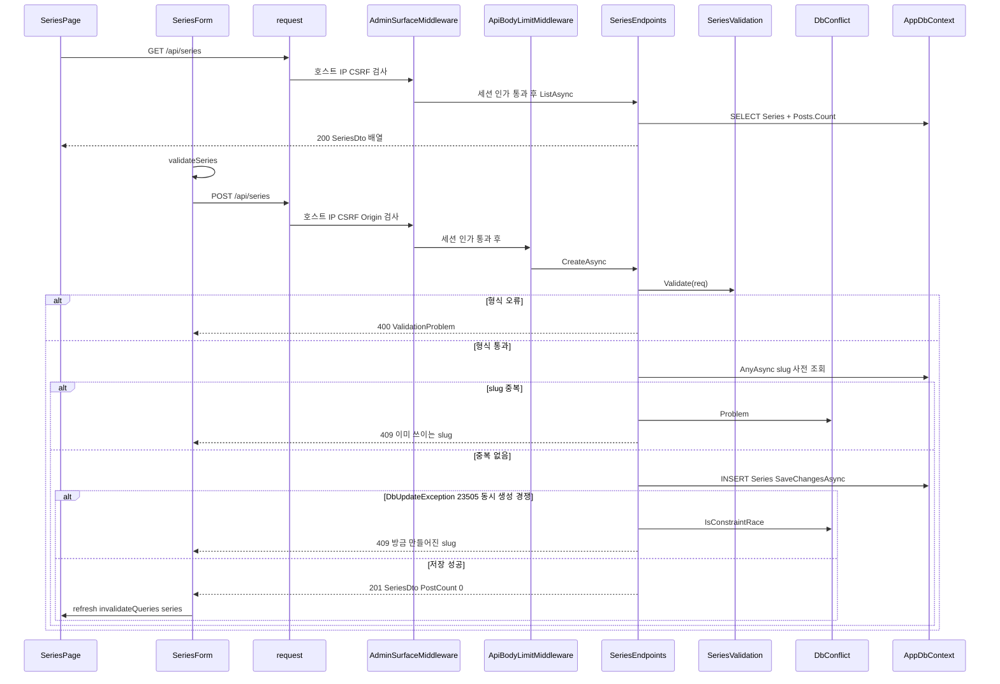
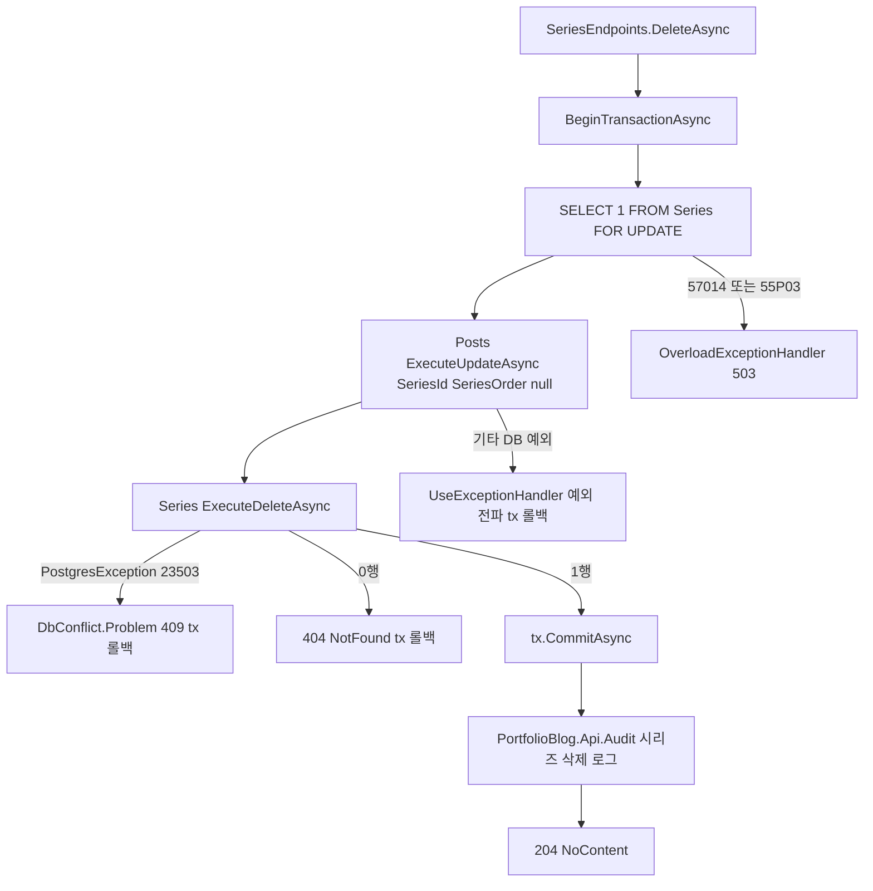
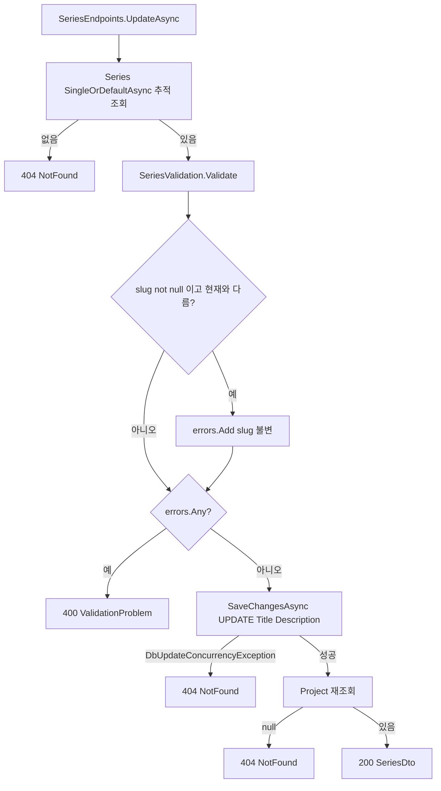
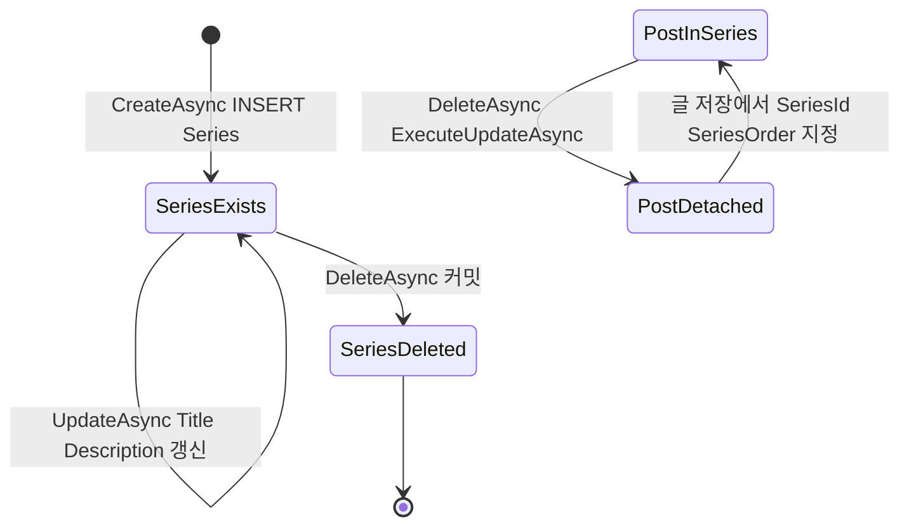

# F007 시리즈 관리

<!-- doc-harness:section id="summary" hash="43c3630b85139aa1388c1199ce0f09a6e3f374f690e53dded4a68abb903a033a" -->
## 한 줄 요약

결론: 시리즈 관리는 현재 동작하는 관리용 CRUD 기능이다. 서버는 SeriesEndpoints의 정적 핸들러 5개(List/Get/Create/Update/Delete)로 이루어지고, SPA에서는 SeriesPage 한 화면이 이를 쓴다. 형식 검증은 SeriesValidation이 맡는다. SPA의 validateSeries가 같은 규칙을 먼저 검사하지만 편의용이고, 최종 판정은 서버가 한다. 생성할 때는 형식 검증 뒤 AnyAsync로 slug 중복을 먼저 조회한다(중복이면 409). 사전 조회를 통과한 뒤 같은 slug가 동시에 만들어지는 경쟁은 SaveChangesAsync의 유니크 위반(23505)을 DbConflict.IsConstraintRace가 409로 바꿔 막는다. slug는 만든 뒤 바꿀 수 없어서, PUT 요청의 slug가 현재 값과 다르면 400이다. 가장 복잡한 경로는 삭제다. 한 트랜잭션 안에서 FOR UPDATE 잠금, Posts의 SeriesId·SeriesOrder 동시 비우기(CK_Posts_Series_Pair 준수), Series ExecuteDeleteAsync를 차례로 실행한다. FK 위반(23503)은 409, 0행 삭제는 404가 된다. 모든 /api/series 요청은 Program.cs 98-108행 파이프라인을 거친다: SecurityHeadersMiddleware → UseTrustedForwardedHeaders → UseExceptionHandler → UseStatusCodePages(ErrorResponses) → UseStaticFiles → AdminSurfaceMiddleware(F018) → UseRateLimiter → UseAuthentication/UseAuthorization(F001) → ApiBodyLimitMiddleware(F020, 256KB). 시리즈 엔드포인트에는 RateLimitMetadata가 없어 속도 제한(F019)을 받지 않는다. 서버와 클라이언트 모두 자동 재시도를 하지 않는다. Audit 로그는 생성·수정·삭제가 성공했을 때만 남는다. 목록 쿼리 키 ['series','list']는 PostEditorPage의 시리즈 선택 목록과 공유한다. PostEditorPage는 글을 저장한 뒤에도 ['series']를 무효화해 소속 글 수를 다시 불러오게 한다. 이번 재검증에서 코드는 이전 분석과 일치했다. 추가로 확인한 것은 PostEditorPage의 ['series'] 무효화, Layout 내비게이션 링크, 401 처리 테스트, sitemap의 시리즈 URL 캐시 헤더다.

| 항목 | 값 |
|---|---|
| 중요도 | SUPPORTING |
| 상태 | ACTIVE |
| 진입점 | `SPA /series`, `GET /api/series`, `GET /api/series/{id:guid}`, `POST /api/series`, `PUT /api/series/{id:guid}`, `DELETE /api/series/{id:guid}` |
| 의존 기능 | [F001](../09_FEATURES.md#f001), [F018](../09_FEATURES.md#f018), [F020](../09_FEATURES.md#f020), [F029](../09_FEATURES.md#f029) |

### 진입점 근거

| 내용 | 상태 | 근거 |
|---|---|---|
| SPA 라우트 /series는 RequireAuth → Layout 아래에서 SeriesPage를 렌더링한다(F029 셸). Layout 상단 내비게이션의 '시리즈' 링크로 들어간다. | CONFIRMED | `PortfolioBlog.Web/src/app/routes.tsx` (23-31), `PortfolioBlog.Web/src/components/Layout.tsx` LINKS (8), `PortfolioBlog.Web/src/pages/SeriesPage.tsx` SeriesPage (53-93) |
| /api/series 그룹은 MapSeriesEndpoints가 등록한다. GET ''(ListSeries), GET /{id:guid}(GetSeries), POST ''(CreateSeries), PUT /{id:guid}(UpdateSeries), DELETE /{id:guid}(DeleteSeries)다. | CONFIRMED | `PortfolioBlog.Api/Features/Series/SeriesEndpoints.cs` SeriesEndpoints.MapSeriesEndpoints (29-37) |
| /api 그룹 전체에 RequireHost(관리 호스트)와 RequireAuthorization(세션 정책)이 걸려 있다. 따라서 시리즈 엔드포인트는 관리 호스트로 들어오고 로그인 세션이 있는 요청만 받는다. | CONFIRMED | `PortfolioBlog.Api/Features/ApiEndpoints.cs` ApiEndpoints.MapApiEndpoints (34-47) |
| 요청은 엔드포인트에 닿기 전에 Program.cs 파이프라인을 이 순서로 지난다: SecurityHeadersMiddleware(98) → UseTrustedForwardedHeaders(99) → UseExceptionHandler(100) → UseStatusCodePages(ErrorResponses.HandleStatusCodeAsync)(101) → UseStaticFiles(103) → AdminSurfaceMiddleware(104) → UseRateLimiter(105) → UseAuthentication(106) → UseAuthorization(107) → ApiBodyLimitMiddleware(108). | CONFIRMED | `PortfolioBlog.Api/Program.cs` (98-108), `PortfolioBlog.Api/Infrastructure/Access/AccessServiceCollectionExtensions.cs` AccessServiceCollectionExtensions.UseTrustedForwardedHeaders |
| GET /api/series/{id}(상세+소속 글 목록)는 서버 라우트로 살아 있고 테스트가 호출한다. 그러나 SPA의 series.get 헬퍼를 호출하는 곳은 SPA에 없다. SeriesPage는 list/create/update/remove만, PostEditorPage는 list만 쓴다. | CONFIRMED | `PortfolioBlog.Api.Tests/Features/SeriesEndpointsTests.cs` Detail_OrdersPostsBySeriesOrder_ThenCreatedAt_AllowingDuplicateOrders (84), `PortfolioBlog.Web/src/api/endpoints.ts` series.get (27), `PortfolioBlog.Web/src/pages/PostEditorPage.tsx` (95) |
<!-- /doc-harness:section -->

<!-- doc-harness:section id="flow" hash="25ce532d558879a1a9e250a65a9ff566b8ad03b11cdc29897a1d50b3d89a8232" -->
## 처리 흐름

| 단계 | 컴포넌트 | 코드 | 설명 |
|---|---|---|---|
| 1 | SeriesPage | `PortfolioBlog.Web/src/pages/SeriesPage.tsx` SeriesPage | 화면이 마운트되면 useQuery(['series','list'])로 api.list(signal)를 호출한다. 로딩 중에는 Loading을 보여 주고, 실패하면 ErrorNotice와 다시 시도 버튼(list.refetch)을 보여 준다. |
| 2 | request | `PortfolioBlog.Web/src/api/client.ts` request | /api 경로 요청에 X-Requested-With: XMLHttpRequest(CSRF 헤더)를 붙여 fetch한다. 응답이 2xx가 아니면 toApiError로 ApiError(status, title, detail, fieldErrors, retryAfter)를 던진다. |
| 3 | UseTrustedForwardedHeaders | `PortfolioBlog.Api/Infrastructure/Access/AccessServiceCollectionExtensions.cs` AccessServiceCollectionExtensions.UseTrustedForwardedHeaders | SecurityHeadersMiddleware 바로 뒤에서 실행된다. 신뢰 프록시가 설정된 경우에만 ForwardedHeaders 미들웨어가 원격 IP를 정한다. 이어서 UseExceptionHandler, UseStatusCodePages, UseStaticFiles를 지난다. |
| 4 | AdminSurfaceMiddleware | `PortfolioBlog.Api/Infrastructure/Access/AdminSurfaceMiddleware.cs` AdminSurfaceMiddleware.InvokeAsync | /api 요청에 Cache-Control: no-store를 단다. 관리 호스트가 아니면 404, 허용 IP가 아니면 403, CSRF 헤더가 없으면 403, GET/HEAD가 아닌데 Origin이 관리 origin과 다르면 403으로 거부한다. 통과하면 UseRateLimiter(시리즈는 메타데이터가 없어 제한 없음)와 UseAuthentication/UseAuthorization(세션이 없으면 401)을 지난다. |
| 5 | ApiBodyLimitMiddleware | `PortfolioBlog.Api/Infrastructure/Web/ApiBodyLimitMiddleware.cs` ApiBodyLimitMiddleware.InvokeAsync | 자체 크기 상한(IRequestSizeLimitMetadata)이 없는 /api 엔드포인트(시리즈 포함)의 본문을 256KB(JsonLimitBytes)로 제한한다. Content-Length가 상한을 넘으면 즉시 413이다. 길이 선언 없는 본문은 LengthLimitedStream이 읽는 도중 BadHttpRequestException(413)을 던진다. |
| 6 | SeriesEndpoints | `PortfolioBlog.Api/Features/Series/SeriesEndpoints.cs` SeriesEndpoints.ListAsync | AsNoTracking으로 Series를 Title, Id 순으로 정렬하고, Project로 SeriesDto 배열(Posts.Count 서브쿼리 포함)을 만들어 200으로 응답한다. |
| 7 | SeriesForm | `PortfolioBlog.Web/src/pages/SeriesPage.tsx` SeriesForm.submit | 만들기나 수정 저장을 누르면 validateSeries로 로컬 검증을 한다. 오류가 있으면 필드 오류만 표시하고 요청은 보내지 않는다. 오류가 없으면 busy=true로 바꾸고 onSubmit(api.create 또는 api.update)을 직접 await한다. useMutation은 쓰지 않는다. |
| 8 | SeriesEndpoints | `PortfolioBlog.Api/Features/Series/SeriesEndpoints.cs` SeriesEndpoints.CreateAsync | SeriesValidation.Validate가 실패하면 400 ValidationProblem이다. 통과하면 db.Series.AnyAsync로 slug 중복을 조회하고, 중복이면 DbConflict.Problem으로 409를 준다. 중복이 없으면 Domain.Series(Slug 원문, Title은 Trim, Description은 Trim하고 null이면 빈 문자열)를 Add하고 SaveChangesAsync한다. |
| 9 | DbConflict | `PortfolioBlog.Api/Infrastructure/Data/DbConflict.cs` DbConflict.IsConstraintRace | SaveChangesAsync가 DbUpdateException을 던지고 InnerException이 PostgresException 23505/23503이면 409 '같은 slug의 시리즈가 방금 만들어졌습니다.'로 응답한다. 저장에 성공하면 Audit 로그를 남기고 201 Created(Location /api/series/{id}, PostCount 0)를 준다. |
| 10 | SeriesEndpoints | `PortfolioBlog.Api/Features/Series/SeriesEndpoints.cs` SeriesEndpoints.UpdateAsync | 먼저 추적 조회를 해서 시리즈가 없으면 404다. 있으면 Validate를 실행하고, req.Slug가 null이 아니면서 현재 slug와 다르면 slug 불변 오류를 추가한다. 오류가 하나라도 있으면 400이다. 통과하면 Title·Description만 바꿔 SaveChangesAsync한다. DbUpdateConcurrencyException이면 404다. 성공하면 Audit 로그를 남기고 Project로 다시 조회해 200을 준다(재조회 결과가 null이면 404). |
| 11 | SeriesPage | `PortfolioBlog.Web/src/pages/SeriesPage.tsx` SeriesPage.confirmRemove | 삭제를 누르면 window.confirm이 제목과 소속 글 수를 보여 준다. 확인하면 remove.mutate가 api.remove(DELETE)를 호출한다. onSettled에서 성공·실패와 관계없이 ['series'] 쿼리를 무효화한다. |
| 12 | SeriesEndpoints | `PortfolioBlog.Api/Features/Series/SeriesEndpoints.cs` SeriesEndpoints.DeleteAsync | BeginTransactionAsync 다음 첫 문장으로 SELECT 1 FROM "Series" WHERE "Id" = id FOR UPDATE를 실행해 행을 잠근다. 이어서 Posts.Where(SeriesId==id).ExecuteUpdateAsync로 SeriesId·SeriesOrder를 한 UPDATE에서 함께 null로 만들고, Series.Where(Id==id).ExecuteDeleteAsync를 실행한다. |
| 13 | SeriesEndpoints | `PortfolioBlog.Api/Features/Series/SeriesEndpoints.cs` SeriesEndpoints.DeleteAsync | PostgresException 23503이면 409를 주고 커밋하지 않는다. 트랜잭션은 await using dispose에서 롤백된다. 삭제된 행이 0이면 404를 주고 마찬가지로 dispose에서 롤백된다. 1행이면 CommitAsync한 뒤 Audit 로그를 남기고 204를 준다. |
| 14 | ErrorResponses | `PortfolioBlog.Api/Infrastructure/Web/ErrorResponses.cs` ErrorResponses.HandleStatusCodeAsync | TypedResults.NotFound()처럼 본문 없는 오류 응답이 /api 경로이면, UseStatusCodePages 콜백이 ProblemDetails 본문을 채운다. |
| 15 | SeriesPage | `PortfolioBlog.Web/src/pages/SeriesPage.tsx` SeriesPage.refresh | 생성·수정이 성공하면 refresh(invalidateQueries ['series'])로 목록을 다시 불러온다. 생성 폼은 입력을 EMPTY로 비우고, 수정 폼은 setEditing(null)로 닫는다. |
<!-- /doc-harness:section -->

<!-- doc-harness:section id="F007_SEQUENCE" hash="a6dac1b70730822f881d4ee3012be4bd6fddc1fd9540ef41096e7c70749a4dee" -->
## 시리즈 목록 조회와 생성 호출 순서 (Sequence Diagram)

목록 조회와 생성 모두 SeriesPage/SeriesForm → request → AdminSurfaceMiddleware → (세션 인가) → SeriesEndpoints → AppDbContext 순서로 흐른다. 생성은 형식 검증, slug 사전 조회, INSERT 유니크 위반 방어를 차례로 거친다.

GET 목록은 Origin 검사를 받지 않고, 본문이 없어 ApiBodyLimitMiddleware 제한도 사실상 의미가 없다. POST 생성은 AdminSurfaceMiddleware의 Origin 검사와 ApiBodyLimitMiddleware의 256KB 제한을 거친다. SeriesEndpoints.CreateAsync는 SeriesValidation.Validate로 형식을 검사하고(400), AnyAsync로 slug 중복을 사전 조회한 뒤(409), SaveChangesAsync에서 유니크 위반이 나면 DbConflict.IsConstraintRace로 409를 준다. 성공하면 201을 돌려주고, SeriesForm은 SeriesPage의 refresh로 ['series'] 쿼리를 무효화한다.

### 코드 근거

| 구성 요소 | 코드 |
|---|---|
| SeriesPage | `PortfolioBlog.Web/src/pages/SeriesPage.tsx` (SeriesPage) |
| SeriesForm | `PortfolioBlog.Web/src/pages/SeriesPage.tsx` (SeriesForm) |
| request | `PortfolioBlog.Web/src/api/client.ts` (request) |
| AdminSurfaceMiddleware | `PortfolioBlog.Api/Infrastructure/Access/AdminSurfaceMiddleware.cs` (AdminSurfaceMiddleware.InvokeAsync) |
| ApiBodyLimitMiddleware | `PortfolioBlog.Api/Infrastructure/Web/ApiBodyLimitMiddleware.cs` (ApiBodyLimitMiddleware.InvokeAsync) |
| SeriesEndpoints | `PortfolioBlog.Api/Features/Series/SeriesEndpoints.cs` (SeriesEndpoints) |
| SeriesValidation | `PortfolioBlog.Api/Features/Series/SeriesValidation.cs` (SeriesValidation.Validate) |
| DbConflict | `PortfolioBlog.Api/Infrastructure/Data/DbConflict.cs` (DbConflict) |
| AppDbContext | `PortfolioBlog.Api/Infrastructure/Data/AppDbContext.cs` (AppDbContext) |
<!-- /doc-harness:section -->

<!-- doc-harness:section id="F007_FLOW" hash="99013d6597b70e96de4562293c6f6da2096325c3859415e6b20aed0c7959d925" -->
## 시리즈 삭제 트랜잭션 분기(DeleteAsync) (Flowchart)

삭제는 한 트랜잭션에서 잠금 → 글 연결 해제 → 시리즈 삭제 순으로 진행한다. 커밋하는 경로는 1행 삭제뿐이고, 나머지 경로는 모두 dispose에서 롤백된다.

BeginTransactionAsync 직후 FOR UPDATE로 Series 행을 잠가 동시에 들어오는 글 INSERT/UPDATE의 FK 검사(FOR KEY SHARE)를 막는다. CK_Posts_Series_Pair를 지키기 위해 Posts의 SeriesId와 SeriesOrder를 한 ExecuteUpdateAsync로 함께 비운다. ExecuteDeleteAsync에서 23503이 나면 409, 0행이면 404이며, 두 경우 모두 커밋하지 않아 await using dispose에서 롤백된다. DB 예외 중 57014·55P03은 OverloadExceptionHandler가 503으로 바꾸고, 그 밖의 예외는 UseExceptionHandler로 전파된다.

### 코드 근거

| 구성 요소 | 코드 |
|---|---|
| SeriesEndpoints.DeleteAsync | `PortfolioBlog.Api/Features/Series/SeriesEndpoints.cs` (SeriesEndpoints.DeleteAsync) |
| DbConflict.Problem 409 tx 롤백 | `PortfolioBlog.Api/Infrastructure/Data/DbConflict.cs` (DbConflict.Problem) |
| OverloadExceptionHandler 503 | `PortfolioBlog.Api/Infrastructure/Web/OverloadExceptionHandler.cs` (OverloadExceptionHandler) |
| UseExceptionHandler 예외 전파 tx 롤백 | `PortfolioBlog.Api/Program.cs` |
<!-- /doc-harness:section -->

<!-- doc-harness:section id="F007_FLOW_UPDATE" hash="f944b6daf6e61349e23ddb22aebb235505842b85fd3fd12923a8590f2a9c409f" -->
## 시리즈 수정 분기(UpdateAsync) (Flowchart)

수정은 존재 확인 → 형식 검증 + slug 불변 검사 → 저장 → 재조회 순으로 진행한다. 동시 삭제로 생기는 경쟁은 모두 404로 수렴한다.

존재 확인을 검증보다 먼저 하므로 없는 Id에는 본문과 관계없이 404를 준다. SeriesValidation 오류에 slug 불변 오류가 더해지면 400이다. 저장 직전에 동시 삭제가 일어나면 DbUpdateConcurrencyException이 나서 404이고, 저장 후 재조회 직전에 삭제되면 SingleOrDefaultAsync가 null을 돌려줘 404다.

### 코드 근거

| 구성 요소 | 코드 |
|---|---|
| SeriesEndpoints.UpdateAsync | `PortfolioBlog.Api/Features/Series/SeriesEndpoints.cs` (SeriesEndpoints.UpdateAsync) |
| SeriesValidation.Validate | `PortfolioBlog.Api/Features/Series/SeriesValidation.cs` (SeriesValidation.Validate) |
| Project 재조회 | `PortfolioBlog.Api/Features/Series/SeriesEndpoints.cs` (SeriesEndpoints.Project) |
<!-- /doc-harness:section -->

<!-- doc-harness:section id="F007_STATE" hash="6b11fd7bd9266b3d9551620a5361157954ef8ec1fc9f89b36c8cacdbf08d3b58" -->
## Series 행과 Posts 시리즈 소속 상태 (State Diagram)

Series 행은 생성 → (수정 반복) → 삭제의 단순한 생명주기를 가진다. 삭제 트랜잭션은 소속 글을 '미소속' 상태로 함께 옮긴다.

CreateAsync의 INSERT가 SeriesExists 상태를 만들고, UpdateAsync는 Slug를 제외한 Title·Description만 바꾼다. DeleteAsync가 커밋되면 행이 사라지고, 같은 트랜잭션의 ExecuteUpdateAsync가 소속 글의 SeriesId·SeriesOrder를 함께 null로 만든다. 글을 다시 시리즈에 넣는 일은 글 저장 경로(F003)에서 SeriesId·SeriesOrder를 지정할 때 일어난다.

### 코드 근거

| 구성 요소 | 코드 |
|---|---|
| SeriesExists | `PortfolioBlog.Api/Domain/Series.cs` (Series) |
| SeriesDeleted | `PortfolioBlog.Api/Features/Series/SeriesEndpoints.cs` (SeriesEndpoints.DeleteAsync) |
| PostDetached | `PortfolioBlog.Api/Features/Series/SeriesEndpoints.cs` (SeriesEndpoints.DeleteAsync) |
| PostInSeries | `PortfolioBlog.Api/Infrastructure/Data/AppDbContext.cs` (CK_Posts_Series_Pair) |
<!-- /doc-harness:section -->

<!-- doc-harness:section id="data" hash="b2e0337f758e5243f680762784aa62a2486d20d1b21d1dda9248986d37569b47" -->
## 데이터

### 데이터 흐름

| 내용 | 상태 | 근거 |
|---|---|---|
| 입력: SeriesForm 상태 {slug,title,description}(TS UpsertSeriesRequest)가 JSON 본문으로 전송되고, 서버의 UpsertSeriesRequest record에 바인딩된다. ThrowOnBadRequest=false 설정 때문에 바인딩 실패는 예외가 아니라 400이 된다. | CONFIRMED | `PortfolioBlog.Web/src/api/endpoints.ts` series.create / series.update (28-29), `PortfolioBlog.Api/Contracts/SeriesDtos.cs` UpsertSeriesRequest, `PortfolioBlog.Api/Program.cs` (48-49) |
| 생성 시 Slug는 받은 값 그대로 저장한다(공백·대문자는 형식 검증에서 이미 거부된다). Title은 Trim해서 저장한다. Description도 Trim하되 null이면 빈 문자열로 저장한다. Id는 Domain.Series 기본값으로 정해진다. | CONFIRMED | `PortfolioBlog.Api/Features/Series/SeriesEndpoints.cs` SeriesEndpoints.CreateAsync (114), `PortfolioBlog.Api/Domain/Series.cs` |
| 출력: 목록·수정 응답은 Project()가 만드는 SeriesDto(Id, Slug, Title, Description, PostCount=Posts.Count 서브쿼리)다. 생성 응답은 PostCount를 0으로 고정해 직접 만든다. 상세 응답은 SeriesDetailDto(SeriesDto, SeriesPostDto[])다. | CONFIRMED | `PortfolioBlog.Api/Features/Series/SeriesEndpoints.cs` SeriesEndpoints.Project (50-51), `PortfolioBlog.Api/Features/Series/SeriesEndpoints.cs` SeriesEndpoints.CreateAsync (125), `PortfolioBlog.Api/Contracts/SeriesDtos.cs` |
| 상세의 소속 글 목록은 SeriesPostDto(Id, Slug, Title, SeriesOrder!.Value) 배열이다. (SeriesOrder, CreatedAt, Id) 순으로 안정 정렬하며, 순서값 중복을 허용한다. | CONFIRMED | `PortfolioBlog.Api/Features/Series/SeriesEndpoints.cs` SeriesEndpoints.GetAsync (85-89) |
| 클라이언트 캐시: 목록은 TanStack Query 키 ['series','list']에 둔다. 시리즈 생성·수정·삭제 뒤에는 ['series'] 접두로 무효화해 다시 조회한다. PostEditorPage도 같은 키로 시리즈 선택 목록을 읽는다. 글 저장 성공(onSuccess) 때도 ['series']를 무효화하므로 소속 글 수(postCount)가 다시 조회된다. | CONFIRMED | `PortfolioBlog.Web/src/pages/SeriesPage.tsx` (56-58,75,90), `PortfolioBlog.Web/src/pages/PostEditorPage.tsx` (95,168) |
| 400 응답 본문의 ValidationProblem errors(필드 키 slug/title/description)는 ValidationErrors.ToDictionary가 만든다. SPA에서는 toApiError→parseFieldErrors를 거쳐 ApiError.fieldErrors가 되고, SeriesForm이 FieldError로 해당 필드 아래에 표시한다. | CONFIRMED | `PortfolioBlog.Api/Contracts/ValidationErrors.cs` ValidationErrors.Add / ToDictionary, `PortfolioBlog.Web/src/api/errors.ts` parseFieldErrors / toApiError, `PortfolioBlog.Web/src/pages/SeriesPage.tsx` SeriesForm.submit (34,40-43) |
| 본문 없는 404(TypedResults.NotFound)는 /api 경로에서 ErrorResponses가 ProblemDetails로 채운다. 413은 ApiBodyLimitMiddleware가 ErrorResponses.WriteAsync로 직접 쓴다. 409는 DbConflict.Problem이 title '충돌'과 detail을 직접 담는다. | CONFIRMED | `PortfolioBlog.Api/Infrastructure/Web/ErrorResponses.cs` ErrorResponses.WriteAsync, `PortfolioBlog.Api/Infrastructure/Web/ApiBodyLimitMiddleware.cs` (47-51), `PortfolioBlog.Api/Infrastructure/Data/DbConflict.cs` DbConflict.Problem (50-51) |

### DB 접근

| 엔티티 | 작업 | 코드 |
|---|---|---|
| Series | SELECT | `PortfolioBlog.Api/Features/Series/SeriesEndpoints.cs` SeriesEndpoints.ListAsync (Project, Posts.Count 서브쿼리) |
| Series | SELECT | `PortfolioBlog.Api/Features/Series/SeriesEndpoints.cs` SeriesEndpoints.GetAsync |
| Posts | SELECT | `PortfolioBlog.Api/Features/Series/SeriesEndpoints.cs` SeriesEndpoints.GetAsync (SeriesId 필터, SeriesOrder·CreatedAt·Id 정렬) |
| Series | SELECT | `PortfolioBlog.Api/Features/Series/SeriesEndpoints.cs` SeriesEndpoints.CreateAsync (slug 중복 AnyAsync) |
| Series | INSERT | `PortfolioBlog.Api/Features/Series/SeriesEndpoints.cs` SeriesEndpoints.CreateAsync |
| Series | SELECT | `PortfolioBlog.Api/Features/Series/SeriesEndpoints.cs` SeriesEndpoints.UpdateAsync (추적 조회·저장 후 재조회) |
| Series | UPDATE | `PortfolioBlog.Api/Features/Series/SeriesEndpoints.cs` SeriesEndpoints.UpdateAsync |
| Series | SELECT | `PortfolioBlog.Api/Features/Series/SeriesEndpoints.cs` SeriesEndpoints.DeleteAsync (SELECT 1 ... FOR UPDATE 행 잠금) |
| Posts | UPDATE | `PortfolioBlog.Api/Features/Series/SeriesEndpoints.cs` SeriesEndpoints.DeleteAsync (ExecuteUpdateAsync SeriesId·SeriesOrder=null) |
| Series | DELETE | `PortfolioBlog.Api/Features/Series/SeriesEndpoints.cs` SeriesEndpoints.DeleteAsync (ExecuteDeleteAsync) |

### 상태 전이

| 이전 | 다음 | 트리거 | 근거 |
|---|---|---|---|
| (없음) | Series 행 존재 | POST /api/series 성공(CreateAsync SaveChangesAsync) | `PortfolioBlog.Api/Features/Series/SeriesEndpoints.cs` SeriesEndpoints.CreateAsync (114-125) |
| Series 행 존재 | Series 행 존재(Title·Description 갱신, Slug 불변) | PUT /api/series/{id} 성공(UpdateAsync) | `PortfolioBlog.Api/Features/Series/SeriesEndpoints.cs` SeriesEndpoints.UpdateAsync (153-160) |
| Series 행 존재 | Series 행 삭제 | DELETE /api/series/{id} 트랜잭션 커밋(DeleteAsync) | `PortfolioBlog.Api/Features/Series/SeriesEndpoints.cs` SeriesEndpoints.DeleteAsync (211-222) |
| Post 시리즈 소속(SeriesId·SeriesOrder non-null) | Post 시리즈 미소속(SeriesId·SeriesOrder 모두 null, UpdatedAt 유지) | 시리즈 삭제 트랜잭션의 ExecuteUpdateAsync(커밋 시 확정) | `PortfolioBlog.Api/Features/Series/SeriesEndpoints.cs` SeriesEndpoints.DeleteAsync (204-206), `PortfolioBlog.Api.Tests/Features/SeriesEndpointsTests.cs` Delete_KeepsPosts_AndClearsBothSeriesFields (137) |
| SeriesPage 목록 항목 보기 | 항목 인라인 수정 폼(editing=item.id) | '수정' 버튼 클릭 | `PortfolioBlog.Web/src/pages/SeriesPage.tsx` (55,73-80) |
| 항목 인라인 수정 폼 | SeriesPage 목록 항목 보기 | 수정 저장 성공(setEditing(null)) 또는 '취소' 클릭 | `PortfolioBlog.Web/src/pages/SeriesPage.tsx` (75) |

### 외부 의존

| 내용 | 상태 | 근거 |
|---|---|---|
| PostgreSQL(Npgsql + EF Core)을 쓴다. Series 테이블에는 Slug 길이 제한(SlugMax 100)·Title 길이 제한(TitleMax 200)·Description 길이 제한(SeriesDescriptionMax 1000), CK_Series_Slug_Format과 CK_Series_Title_NotBlank CHECK 제약이 있다. Posts→Series FK는 Restrict이고, Posts에는 CK_Posts_Series_Pair가 있다. | CONFIRMED | `PortfolioBlog.Api/Infrastructure/Data/AppDbContext.cs` AppDbContext.OnModelCreating (51-63,99-120) |
| 삭제와 글 저장의 경쟁은 PostgreSQL 행 잠금 의미론(FOR UPDATE가 FK 검사의 FOR KEY SHARE와 충돌)과 READ COMMITTED 격리 수준을 전제로 막는다. | CONFIRMED | `PortfolioBlog.Api/Features/Series/SeriesEndpoints.cs` SeriesEndpoints.DeleteAsync (195-202) |
| SPA는 @tanstack/react-query(useQuery·useMutation·useQueryClient), 브라우저 fetch, window.confirm을 쓴다. | CONFIRMED | `PortfolioBlog.Web/src/pages/SeriesPage.tsx` (1-2,56-62) |
| /api 요청에는 AdminSurfaceMiddleware가 요구하는 CSRF 헤더 X-Requested-With: XMLHttpRequest가 붙는다. 서버 상수 CsrfHeaderName·CsrfHeaderValue와 클라이언트가 보내는 값이 같다. | CONFIRMED | `PortfolioBlog.Api/Infrastructure/Access/AdminSurfaceMiddleware.cs` (85-88), `PortfolioBlog.Web/src/api/client.ts` request |
| 리버스 프록시 뒤에서 운영할 때 AdminSurfaceMiddleware의 IP 허용 판정은 UseTrustedForwardedHeaders가 등록하는 ForwardedHeaders 처리에 의존한다. | CONFIRMED | `PortfolioBlog.Api/Infrastructure/Access/AccessServiceCollectionExtensions.cs` AccessServiceCollectionExtensions.UseTrustedForwardedHeaders, `PortfolioBlog.Api/Program.cs` (99) |
<!-- /doc-harness:section -->

<!-- doc-harness:section id="failures" hash="e51c9e88aa24bafee4af0b9427013439ddebd736a9cea2aa26af8514180794c0" -->
## 실패 지점

| 위치 | 조건 | 처리 | 상태 | 근거 |
|---|---|---|---|---|
| AdminSurfaceMiddleware.InvokeAsync | 관리 호스트가 아님 / 허용 IP가 아님 / X-Requested-With 누락 / GET·HEAD가 아닌데 Origin 불일치 | 본문을 읽기 전에 404 또는 403 ProblemDetails로 거부하므로 시리즈 핸들러까지 가지 않는다. | CONFIRMED | `PortfolioBlog.Api/Infrastructure/Access/AdminSurfaceMiddleware.cs` (75-94) |
| UseAuthorization(/api 그룹 RequireAuthorization) | 세션이 없거나 만료됨 | 401을 준다. SPA에서는 noteAuthFailure가 ME_KEY를 authenticated:false로 기록하고, RequireAuth가 로그인 화면으로 보낸다. SeriesForm은 noteAuthFailure를 직접 호출하고, remove·list는 MutationCache/QueryCache.onError를 거친다. SeriesForm 경로는 auth.test.tsx가 검증한다. | CONFIRMED | `PortfolioBlog.Api/Features/ApiEndpoints.cs` (39), `PortfolioBlog.Web/src/pages/SeriesPage.tsx` SeriesForm.submit (29-33), `PortfolioBlog.Web/src/app/queryClient.ts` noteAuthFailure (11-18), `PortfolioBlog.Web/src/test/auth.test.tsx` (81-89) |
| ApiBodyLimitMiddleware.InvokeAsync | POST/PUT 본문이 256KB(JsonLimitBytes)를 넘음 | Content-Length가 선언돼 있으면 ErrorResponses로 413 ProblemDetails를 준다. 선언이 없는 본문은 LengthLimitedStream이 읽는 도중 BadHttpRequestException(413)을 던진다. | CONFIRMED | `PortfolioBlog.Api/Infrastructure/Web/ApiBodyLimitMiddleware.cs` (41-56,80-86) |
| SeriesEndpoints.CreateAsync / UpdateAsync | SeriesValidation.Validate 실패: slug 비었음·NUL·형식/길이 위반, 제목 공백·NUL·길이 초과, 설명 NUL·길이 초과 | TypedResults.ValidationProblem(errors.ToDictionary())으로 필드별 400을 준다. SPA는 fieldErrors를 해당 필드 아래에 표시한다. | CONFIRMED | `PortfolioBlog.Api/Features/Series/SeriesValidation.cs` SeriesValidation.Validate (28-45), `PortfolioBlog.Api/Features/Series/SeriesEndpoints.cs` (110-111,151-154), `PortfolioBlog.Api.Tests/Features/SeriesEndpointsTests.cs` Create_Invalid_Returns400_Duplicate_Returns409 (99) |
| SeriesEndpoints.CreateAsync | AnyAsync 사전 조회에서 같은 slug가 이미 있음 | DbConflict.Problem으로 409 'slug ...는 이미 쓰이고 있습니다.'를 준다. SPA는 이를 ErrorNotice(failure)로 표시한다. | CONFIRMED | `PortfolioBlog.Api/Features/Series/SeriesEndpoints.cs` (112), `PortfolioBlog.Web/src/pages/SeriesPage.tsx` (34,44) |
| SeriesEndpoints.CreateAsync SaveChangesAsync | 사전 검사를 통과한 뒤 같은 slug가 동시에 만들어져 INSERT에서 유니크 위반(23505)이 남 | catch (DbUpdateException) when DbConflict.IsConstraintRace에서 409 '같은 slug의 시리즈가 방금 만들어졌습니다.'를 준다. 서버는 재시도하지 않는다. DbConflict 주석에 그 이유(변경 추적기 정리가 복잡하고, 클라이언트 재시도가 더 투명함)가 적혀 있다. | CONFIRMED | `PortfolioBlog.Api/Features/Series/SeriesEndpoints.cs` (116-123), `PortfolioBlog.Api/Infrastructure/Data/DbConflict.cs` DbConflict.IsConstraintRace (15,36-37) |
| SeriesEndpoints.UpdateAsync / GetAsync | 대상 시리즈 Id가 없음 | 404 NotFound를 주고 ErrorResponses가 ProblemDetails 본문을 채운다. UpdateAsync는 검증보다 존재 확인을 먼저 하므로, 없는 Id에 잘못된 본문을 보내도 404다. | CONFIRMED | `PortfolioBlog.Api/Features/Series/SeriesEndpoints.cs` (83-84,148-149) |
| SeriesEndpoints.UpdateAsync | 요청 slug가 null이 아니면서 현재 slug와 다름 | errors.Add('slug', 'slug는 생성 후 바꿀 수 없습니다.')를 추가하고 400을 준다. | CONFIRMED | `PortfolioBlog.Api/Features/Series/SeriesEndpoints.cs` (152-154), `PortfolioBlog.Api.Tests/Features/SeriesEndpointsTests.cs` Update_ChangesTitleAndDescription_ButNotSlug (116) |
| SeriesEndpoints.UpdateAsync SaveChangesAsync | 조회 뒤 저장 직전에 다른 요청이 시리즈를 삭제해 UPDATE가 0행에 적용됨 | catch DbUpdateConcurrencyException에서 404를 준다. | CONFIRMED | `PortfolioBlog.Api/Features/Series/SeriesEndpoints.cs` (158-166) |
| SeriesEndpoints.UpdateAsync 재조회 | 저장은 성공했지만 재조회 직전에 시리즈가 삭제됨 | SingleOrDefaultAsync 결과가 null이면 404를 준다. SingleAsync를 썼다면 예외로 500이 났을 경우를 피한다. | CONFIRMED | `PortfolioBlog.Api/Features/Series/SeriesEndpoints.cs` (169-171) |
| SeriesEndpoints.DeleteAsync ExecuteDeleteAsync | FOR UPDATE 선점으로도 막지 못한 경쟁으로 FK 위반(PostgresException 23503)이 남 | catch PostgresException when SqlState==23503에서 409 '참조하는 글이 방금 추가되었습니다...'를 준다. 커밋하지 않으므로 await using dispose에서 롤백되고, 앞서 실행한 글 UPDATE도 원래대로 돌아간다. | CONFIRMED | `PortfolioBlog.Api/Features/Series/SeriesEndpoints.cs` (209-218) |
| SeriesEndpoints.DeleteAsync | 삭제 대상 시리즈가 없음(ExecuteDeleteAsync 0행) | 404를 준다. 커밋하지 않은 트랜잭션은 dispose에서 롤백된다. FK가 Restrict라 없는 시리즈를 참조하는 글은 있을 수 없으므로, 직전 ExecuteUpdateAsync도 0행이었을 것으로 본다. | INFERRED | `PortfolioBlog.Api/Features/Series/SeriesEndpoints.cs` (205-206,219), `PortfolioBlog.Api/Infrastructure/Data/AppDbContext.cs` (100-101) |
| SeriesEndpoints 전 핸들러 DB 호출 | 예외 체인에 PostgresException 57014(statement_timeout) 또는 55P03(잠금 대기 초과)이 있음 | OverloadExceptionHandler가 503과 Retry-After(5초)를 준다. SPA는 retryAfter 값을 읽지만 자동 재시도는 하지 않는다(queryClient 기본값 retry:false). | CONFIRMED | `PortfolioBlog.Api/Infrastructure/Web/OverloadExceptionHandler.cs` OverloadExceptionHandler.IsOverload (20,39,67), `PortfolioBlog.Api/Program.cs` (43,100), `PortfolioBlog.Web/src/app/queryClient.ts` (20-23) |
| SeriesEndpoints.CreateAsync / UpdateAsync / DeleteAsync / ListAsync / GetAsync | 유니크·FK·동시성·과부하가 아닌 기타 DbUpdateException, 23503이 아닌 PostgresException, DB 연결 오류 | 처리 없음(예외 전파). UseExceptionHandler와 AddProblemDetails가 최종 처리하며, 과부하가 아니면 500 ProblemDetails가 될 것으로 본다. DeleteAsync에서 커밋 전에 난 예외는 await using tx dispose로 롤백된다. | POTENTIAL_ISSUE | `PortfolioBlog.Api/Features/Series/SeriesEndpoints.cs` (65-66,81-91,116-123,158-166,194-220), `PortfolioBlog.Api/Program.cs` (47,100) |
| SeriesForm.submit (SPA) | 요청 실패(400·401·403·404·409·413·503·네트워크 등) | 401이면 noteAuthFailure로 기록한다. 400이면 필드 오류로 표시하고, 그 밖의 오류는 setFailure로 ErrorNotice에 표시한다. 실패하면 refresh를 호출하지 않는다. | CONFIRMED | `PortfolioBlog.Web/src/pages/SeriesPage.tsx` SeriesForm.submit (23-37) |
| SeriesPage remove 뮤테이션 (SPA) | DELETE 실패(404·409·401·503·네트워크) | remove.error를 ErrorNotice로 표시한다. onSettled에서 항상 목록을 다시 조회한다. | CONFIRMED | `PortfolioBlog.Web/src/pages/SeriesPage.tsx` (58,68) |
| SeriesPage 목록 조회 (SPA) | GET /api/series 실패 | ErrorNotice와 다시 시도 버튼(list.refetch)을 보여 준다. queryClient 기본 설정이 retry:false라 자동 재시도는 없다. | CONFIRMED | `PortfolioBlog.Web/src/pages/SeriesPage.tsx` (67), `PortfolioBlog.Web/src/app/queryClient.ts` (22-23) |

### 엣지 케이스

| 내용 | 상태 | 근거 |
|---|---|---|
| PUT에서 slug를 생략(null)하면 SeriesValidation이 'slug는 필수입니다.'로 400을 준다. UpdateAsync에는 'req.Slug is not null' 가드가 있어 null slug에 불변 오류가 겹쳐 붙지 않는다. 반면 빈 문자열('')은 이 가드를 지나므로, 현재 slug와 다르면 필수 오류와 불변 오류가 함께 쌓인다. SPA는 slugLocked(readOnly) 폼으로 기존 slug를 그대로 보낸다. | CONFIRMED | `PortfolioBlog.Api/Features/Series/SeriesValidation.cs` (33), `PortfolioBlog.Api/Features/Series/SeriesEndpoints.cs` (151-154), `PortfolioBlog.Web/src/pages/SeriesPage.tsx` (42,74) |
| PUT에서 형식이 틀린 slug를 현재와 다른 값으로 보내면, 'slug' 키 하나에 형식 오류와 불변 오류 메시지가 함께 쌓인다. | CONFIRMED | `PortfolioBlog.Api/Features/Series/SeriesEndpoints.cs` (151-153), `PortfolioBlog.Api/Features/Series/SeriesValidation.cs` (35) |
| 끝에 개행이 붙은 slug('abc\n')는 SlugRules 판정에서 400이 된다. 이 판정은 DB CHECK와 결과를 맞춘 것이다. | CONFIRMED | `PortfolioBlog.Api/Infrastructure/Data/SlugRules.cs`, `PortfolioBlog.Api.Tests/Features/SeriesEndpointsTests.cs` Create_SlugWithTrailingNewline_Returns400 (178) |
| slug·제목·설명의 NUL(U+0000)은 PostgreSQL text에 저장할 수 없다. 검증 단계에서 필드별 400으로 걸러 DB에서 500이 나는 것을 막는다. | CONFIRMED | `PortfolioBlog.Api/Features/Series/SeriesValidation.cs` (32-41), `PortfolioBlog.Api.Tests/Features/SeriesEndpointsTests.cs` Create_NulCharacter_Returns400_NotServerError (160) |
| 시리즈를 삭제하면 소속 글 행이 UPDATE되므로, xmin 기반 Version이 바뀔 것으로 본다. 그 글을 열어 둔 에디터 탭에서 저장하면 버전 충돌이 날 수 있다. UpdatedAt은 의도적으로 바꾸지 않는다(주석 204행). | INFERRED | `PortfolioBlog.Api/Features/Series/SeriesEndpoints.cs` (204-206) |
| 같은 시리즈를 참조하는 글 저장과 시리즈 삭제가 동시에 일어나도 500은 나오지 않는다. 삭제는 204나 409로 끝나고, 204로 끝나면 매달린 참조가 남지 않는다. 테스트로 검증되어 있다. | CONFIRMED | `PortfolioBlog.Api.Tests/Features/SeriesEndpointsTests.cs` Delete_ConcurrentWithPostSaves_NeverReturns500_AndLeavesNoDanglingReference (191), `PortfolioBlog.Api/Features/Series/SeriesEndpoints.cs` (195-202) |
| 삭제 트랜잭션이 FOR UPDATE 잠금을 쥐고 있는 동안, 같은 시리즈를 참조하는 글 저장은 삭제가 커밋되거나 롤백될 때까지 블로킹된다. Infrastructure/Data에서 lock_timeout이나 statement_timeout을 설정하는 코드는 공개용 PublicDbContext에만 있고, 관리용 AppDbContext 쪽에서는 보이지 않는다. | INFERRED | `PortfolioBlog.Api/Infrastructure/Data/PublicDbContext.cs` (46-59), `PortfolioBlog.Api/Infrastructure/Data/DataServiceCollectionExtensions.cs`, `PortfolioBlog.Api/Features/Series/SeriesEndpoints.cs` (197-202) |
| 생성 응답의 PostCount는 DB를 조회하지 않고 0으로 고정한다. 새 시리즈이므로 이 값은 정확하다. | CONFIRMED | `PortfolioBlog.Api/Features/Series/SeriesEndpoints.cs` (125) |
| 목록 API에는 페이지네이션이 없어 모든 시리즈를 한 번에 돌려준다. | CONFIRMED | `PortfolioBlog.Api/Features/Series/SeriesEndpoints.cs` SeriesEndpoints.ListAsync (65-66) |
| 시리즈 엔드포인트에는 RateLimitMetadata가 없어 속도 제한을 받지 않는다. | CONFIRMED | `PortfolioBlog.Api/Infrastructure/Web/RateLimitingExtensions.cs`, `PortfolioBlog.Api/Features/Series/SeriesEndpoints.cs` SeriesEndpoints.MapSeriesEndpoints (29-37) |
| SPA의 remove는 뮤테이션 하나를 모든 항목이 공유한다. 그래서 삭제가 진행 중이면(remove.isPending) 모든 항목의 삭제 버튼이 비활성화된다. | CONFIRMED | `PortfolioBlog.Web/src/pages/SeriesPage.tsx` (58,81) |
| SeriesForm이 404·409 등으로 실패하면 refresh를 호출하지 않는다. 다른 탭에서 삭제된 시리즈를 수정하다가 404가 나도, 사용자가 다시 조회하기 전까지 목록은 이전 상태로 남는다. | CONFIRMED | `PortfolioBlog.Web/src/pages/SeriesPage.tsx` (28-35,75) |
| 인라인 수정 폼은 editing 상태(문자열 하나)로 관리되어 한 번에 한 항목만 열린다. 수정 중인 입력값은 폼 로컬 상태라 취소하면 버려진다. | CONFIRMED | `PortfolioBlog.Web/src/pages/SeriesPage.tsx` (18,55,73-75) |
| SeriesPage의 목록 쿼리 키 ['series','list']를 PostEditorPage도 시리즈 선택 목록에 쓴다. 따라서 시리즈를 생성·수정·삭제한 뒤의 ['series'] 무효화는 에디터의 선택 목록도 갱신한다. 반대로 글을 저장하면 PostEditorPage가 ['series']를 무효화해 시리즈 화면의 소속 글 수가 다시 조회된다. | CONFIRMED | `PortfolioBlog.Web/src/pages/SeriesPage.tsx` (56-57), `PortfolioBlog.Web/src/pages/PostEditorPage.tsx` (95,168) |
| SPA 헬퍼 series.get(GET /api/series/{id})을 호출하는 곳은 SPA에 없다. 서버 엔드포인트를 호출하는 것은 테스트뿐인 것으로 확인된다. | POSSIBLE_LEGACY | `PortfolioBlog.Web/src/api/endpoints.ts` series.get (27) |
| 클라이언트 검증 validateSeries는 서버 SeriesValidation과 AppDbContext 상수(slugMax 100, titleMax 200, seriesDescriptionMax 1000)를 옮겨 놓은 편의 검사다. 권한 있는 판정은 서버가 한다고 주석에 명시되어 있다. | CONFIRMED | `PortfolioBlog.Web/src/lib/validation.ts` validateSeries / LIMITS (4-12,29-36,62-68), `PortfolioBlog.Api/Features/Series/SeriesValidation.cs` (33-42) |
| 공개 sitemap.xml에는 시리즈 URL(map.SeriesSlugs)이 들어가고 Cache-Control: public, max-age=300이 붙는다. 그래서 시리즈를 생성하거나 삭제한 뒤 HTTP 캐시를 거치는 클라이언트에는 최대 5분 동안 이전 목록이 보일 수 있다. | INFERRED | `PortfolioBlog.Api/Pages/SiteEndpoints.cs` (176-179) |

### 로깅

| 내용 | 상태 | 근거 |
|---|---|---|
| 생성에 성공하면 'PortfolioBlog.Api.Audit' 카테고리에 Information 로그 '시리즈 생성. SeriesId={SeriesId} Slug={Slug}'를 남긴다. | CONFIRMED | `PortfolioBlog.Api/Features/Series/SeriesEndpoints.cs` SeriesEndpoints.CreateAsync (124) |
| 수정에 성공하면 Audit 로그 '시리즈 수정. SeriesId={SeriesId}'를 남긴다. 제목·설명 값은 기록하지 않는다. | CONFIRMED | `PortfolioBlog.Api/Features/Series/SeriesEndpoints.cs` SeriesEndpoints.UpdateAsync (167) |
| 삭제 Audit 로그 '시리즈 삭제. SeriesId={SeriesId}'는 CommitAsync가 끝난 뒤에만 남긴다. | CONFIRMED | `PortfolioBlog.Api/Features/Series/SeriesEndpoints.cs` SeriesEndpoints.DeleteAsync (220-221) |
| 400·404·409 같은 실패 경로에서는 SeriesEndpoints가 별도 로그를 남기지 않는다. | CONFIRMED | `PortfolioBlog.Api/Features/Series/SeriesEndpoints.cs` (108-223) |
<!-- /doc-harness:section -->

<!-- doc-harness:section id="code" hash="572a4ebde4779292f33977005a96e4db740efdffc671c661ee1900161f6e2669" -->
## 관련 코드

| 파일 | 심볼 | 역할 |
|---|---|---|
| `PortfolioBlog.Web/src/pages/SeriesPage.tsx` | SeriesPage | entry |
| `PortfolioBlog.Web/src/pages/SeriesPage.tsx` | SeriesForm | render |
| `PortfolioBlog.Web/src/app/routes.tsx` | routes | entry |
| `PortfolioBlog.Web/src/components/Layout.tsx` | LINKS | render |
| `PortfolioBlog.Web/src/api/endpoints.ts` | series | service |
| `PortfolioBlog.Web/src/api/client.ts` | request | service |
| `PortfolioBlog.Web/src/api/errors.ts` | toApiError / parseFieldErrors | service |
| `PortfolioBlog.Web/src/api/types.ts` | Series / SeriesPost / SeriesDetail / UpsertSeriesRequest | dto |
| `PortfolioBlog.Web/src/lib/validation.ts` | validateSeries / validateSlugAndTitle / LIMITS | validation |
| `PortfolioBlog.Web/src/app/queryClient.ts` | noteAuthFailure / createQueryClient | service |
| `PortfolioBlog.Web/src/pages/PostEditorPage.tsx` | seriesList (['series','list'] 공유) / 저장 onSuccess의 ['series'] 무효화 | render |
| `PortfolioBlog.Api/Features/ApiEndpoints.cs` | ApiEndpoints.MapApiEndpoints | config |
| `PortfolioBlog.Api/Program.cs` | 미들웨어 파이프라인 | config |
| `PortfolioBlog.Api/Infrastructure/Access/AccessServiceCollectionExtensions.cs` | AccessServiceCollectionExtensions.UseTrustedForwardedHeaders | config |
| `PortfolioBlog.Api/Infrastructure/Access/AdminSurfaceMiddleware.cs` | AdminSurfaceMiddleware.InvokeAsync | validation |
| `PortfolioBlog.Api/Infrastructure/Web/ApiBodyLimitMiddleware.cs` | ApiBodyLimitMiddleware | validation |
| `PortfolioBlog.Api/Infrastructure/Web/ErrorResponses.cs` | ErrorResponses.HandleStatusCodeAsync / WriteAsync | service |
| `PortfolioBlog.Api/Infrastructure/Web/OverloadExceptionHandler.cs` | OverloadExceptionHandler | service |
| `PortfolioBlog.Api/Features/Series/SeriesEndpoints.cs` | SeriesEndpoints | entry |
| `PortfolioBlog.Api/Features/Series/SeriesValidation.cs` | SeriesValidation.Validate | validation |
| `PortfolioBlog.Api/Infrastructure/Data/SlugRules.cs` | SlugRules.IsValid | validation |
| `PortfolioBlog.Api/Contracts/TextRules.cs` | TextRules.ContainsNul | validation |
| `PortfolioBlog.Api/Contracts/ValidationErrors.cs` | ValidationErrors | validation |
| `PortfolioBlog.Api/Contracts/SeriesDtos.cs` | SeriesDto / SeriesPostDto / SeriesDetailDto / UpsertSeriesRequest | dto |
| `PortfolioBlog.Api/Domain/Series.cs` | Series | data |
| `PortfolioBlog.Api/Infrastructure/Data/AppDbContext.cs` | AppDbContext.OnModelCreating | data |
| `PortfolioBlog.Api/Infrastructure/Data/DbConflict.cs` | DbConflict | service |
| `PortfolioBlog.Api.Tests/Features/SeriesEndpointsTests.cs` | SeriesEndpointsTests | test |
| `PortfolioBlog.Web/src/test/auth.test.tsx` | SeriesForm 401 처리 테스트 | test |

근거: `PortfolioBlog.Api/Features/Series/SeriesEndpoints.cs` SeriesEndpoints (1-224), `PortfolioBlog.Api/Features/Series/SeriesValidation.cs` SeriesValidation.Validate (28-45), `PortfolioBlog.Web/src/pages/SeriesPage.tsx` SeriesPage / SeriesForm (13-93), `PortfolioBlog.Api/Features/ApiEndpoints.cs` ApiEndpoints.MapApiEndpoints (34-47), `PortfolioBlog.Api/Program.cs` (43-49,98-108), `PortfolioBlog.Api/Infrastructure/Access/AdminSurfaceMiddleware.cs` AdminSurfaceMiddleware.InvokeAsync (67-96), `PortfolioBlog.Api/Infrastructure/Web/ApiBodyLimitMiddleware.cs` ApiBodyLimitMiddleware.InvokeAsync (36-57), `PortfolioBlog.Api/Infrastructure/Data/DbConflict.cs` DbConflict (17-52), `PortfolioBlog.Api/Infrastructure/Data/AppDbContext.cs` AppDbContext.OnModelCreating (51-120), `PortfolioBlog.Web/src/api/endpoints.ts` series (25-31), `PortfolioBlog.Web/src/app/queryClient.ts` noteAuthFailure / createQueryClient (11-27), `PortfolioBlog.Web/src/lib/validation.ts` validateSeries (62-68), `PortfolioBlog.Web/src/pages/PostEditorPage.tsx` (95,168), `PortfolioBlog.Web/src/app/routes.tsx` (23-31), `PortfolioBlog.Api.Tests/Features/SeriesEndpointsTests.cs` SeriesEndpointsTests (72-191)
<!-- /doc-harness:section -->

<!-- doc-harness:section id="unknowns" hash="c830eb110ea2744720156d784ebefe93197695f309e879999b3d7930329f71dc" -->
## 확인하지 못한 것

- 처리되지 않은 일반 예외(과부하가 아닌 DB 오류)가 UseExceptionHandler와 AddProblemDetails 조합에서 정확히 어떤 500 본문이 되는지는 프레임워크 기본 동작에 달려 있어, 이 저장소 코드로는 확인하지 못했다.
- 관리용 AppDbContext 연결에 lock_timeout이나 statement_timeout을 설정하는 코드는 찾지 못했다. Infrastructure/Data에서 이를 설정하는 곳은 PublicDbContext.BuildConnectionString뿐이다. 따라서 삭제의 FOR UPDATE 잠금 대기에 상한이 있는지는 운영 DB 설정에 달려 있으며, 확인하지 못했다.
- 시리즈 삭제·수정이 공개 측에 얼마나 늦게 반영되는지는 부분적으로만 확인했다. sitemap.xml에 max-age=300 캐시 헤더가 있는 것은 확인했다. 공개 시리즈 페이지(F015)와 RenderedPostCache가 시리즈 정보를 서버 쪽에 캐시하는지는 조사하지 않았다.
- 검증 지적(F001에 F020·F021, F002에 F018·F020, F003에 F007·F008·F018·F020 추가)은 다른 기능의 의존 목록과 기능 간 의존 표에 관한 것이다. 이 세션은 F007 feature 객체만 출력할 수 있어 반영하지 못했다. 다만 F003→F007 의존은 이전 분석에서 코드로 확인했다: PostEndpoints.ValidateSeriesAsync가 시리즈 데이터를 조회한다. 또 이번에는 PostEditorPage가 ['series','list']를 읽고 저장 후 ['series']를 무효화하는 것을 확인했다(PostEditorPage.tsx 95·168행). F007 자신의 의존은 코드로 확인한 F001·F018·F020·F029로 둔다. F019는 시리즈 엔드포인트에 RateLimitMetadata가 없어 넣지 않았다. F021(마이그레이션)은 앱 기동의 전제일 뿐 이 기능의 호출 경로에 있는 의존으로 보지 않았다.
<!-- /doc-harness:section -->

<!-- doc-harness:section id="related" hash="e6b04ee08cc1bd1a2625cbb81ca24992b9da0467258ba6539a8ab5b4aeff04d8" -->
## 관련 문서

- [../09_FEATURES](../09_FEATURES.md)
- [../08_API](../08_API.md)
- [../07_DATA_MODEL](../07_DATA_MODEL.md)
- [../11_FAILURE_HISTORY](../11_FAILURE_HISTORY.md)
<!-- /doc-harness:section -->
