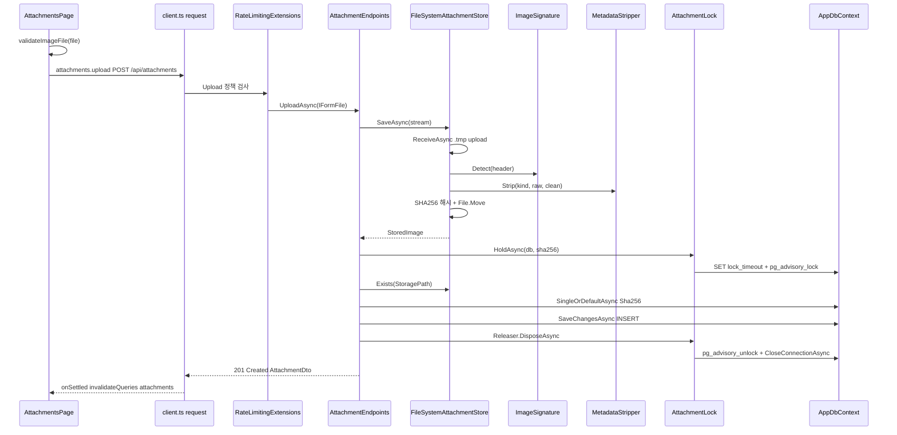
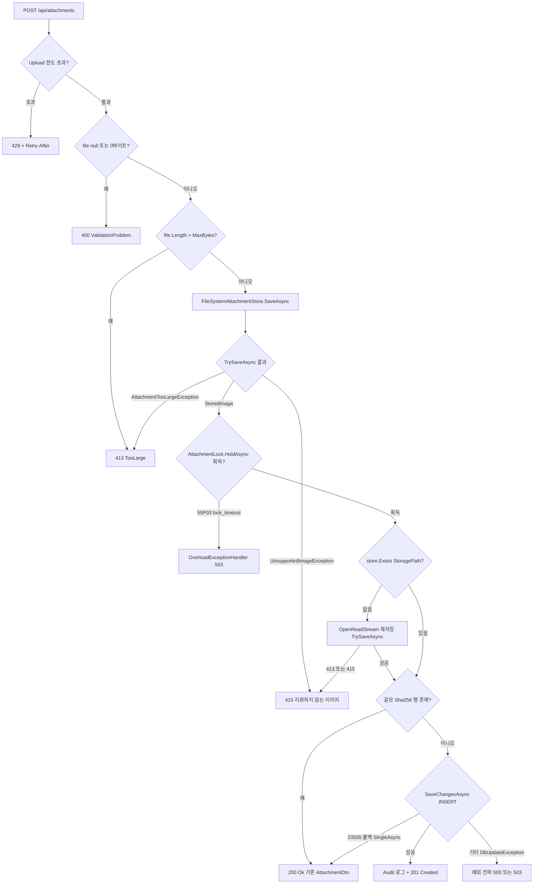
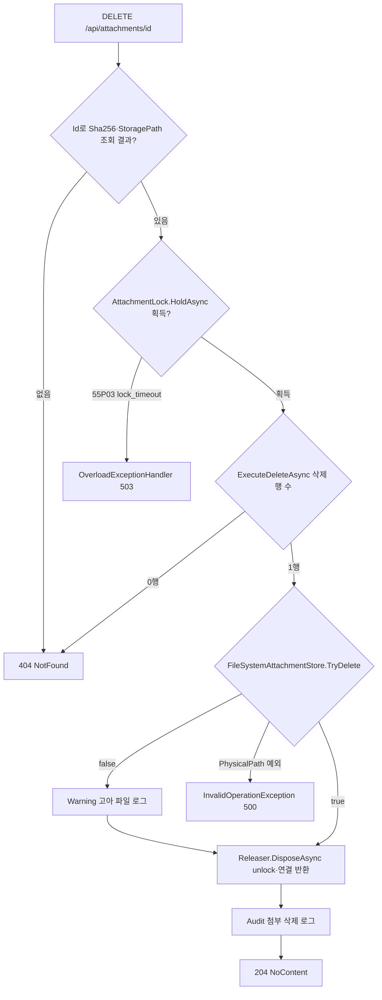
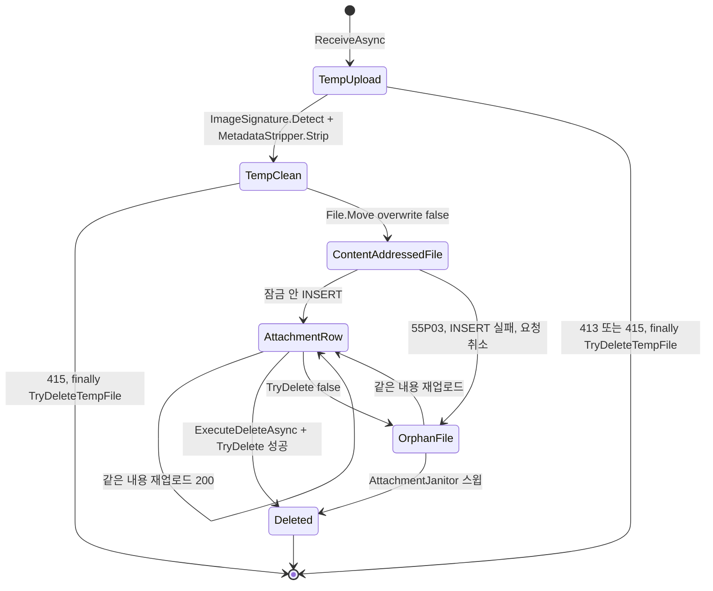

# F009 첨부 이미지 업로드·목록·삭제

<!-- doc-harness:section id="summary" hash="c37e55f52ead594b6a72d2f0a05484c252c0be67a8e62f26c0d23addf8cc9f04" -->
## 한 줄 요약

결론: F009는 실제로 동작하는 관리 전용 첨부 기능이다. 이전 분석을 현재 코드로 다시 확인했고, 동작상 달라진 점은 없다. 검증에서 지적된 F009_FLOW 과복잡(간선 42개) 문제는 다이어그램을 업로드 흐름(F009_FLOW)과 삭제 흐름(F009_FLOW_DELETE)으로 나눠 해결했다.

업로드는 두 구간으로 나뉜다.
- 잠금 밖: 수신, 시그니처 판정, 메타데이터 제거, SHA-256 해시, 내용 주소 파일 이동처럼 무거운 일을 한다.
- 잠금 안: sha256별 PostgreSQL 세션 advisory lock(AttachmentLock)을 잡고 파일 존재 재확인과 행 조회·삽입만 한다.

같은 내용을 다시 올리면 기존 행을 200으로 돌려준다(멱등 업로드). 핸들러의 return은 `await using (await AttachmentLock.HoldAsync(...))` 블록 안에 있다. 그래서 unlock과 연결 반환이 끝난 뒤에 최소 API가 IResult로 응답을 쓴다.

삭제는 같은 잠금 안에서 행을 먼저 지우고(ExecuteDeleteAsync) 파일을 지운다. 파일 삭제가 실패해도 참조 없는 파일만 남고, 이 파일은 AttachmentJanitor가 정리한다.

오류 매핑:
- 400: 필드 누락, 빈 파일, 잘못된 쿼리 값
- 413: 10MB 초과(재저장 경로 포함)
- 415: 시그니처 불일치, 구조 손상
- 404: 없는 id
- 429: Upload 속도 제한
- 503: SqlState 55P03·57014일 때 OverloadExceptionHandler가 반환
- 500: 그 밖의 DB 예외

잔여 위험(관찰):
1. 잠금 대기 초과, INSERT 실패, 요청 취소 때 이미 옮겨진 내용 주소 파일이 행 없이 남는다(Janitor가 정리한다).
2. UNLOCK 실패를 로그 없이 삼킨다.
3. 삭제 경로에서 PhysicalPath 예외가 나면 행이 지워진 뒤 500이 된다.
4. 23505 폴백의 SingleAsync가 실패할 수 있다.
5. 글↔첨부 참조를 추적하지 않는다. 글에서 쓰던 이미지를 지우면 그 글의 이미지가 깨진다(UI 경고로만 안내한다).

| 항목 | 값 |
|---|---|
| 중요도 | CORE |
| 상태 | ACTIVE |
| 진입점 | `SPA /attachments (AttachmentsPage)`, `SPA 글 편집 화면 이미지 업로드 (PostEditorPage.uploadImages)`, `GET /api/attachments`, `POST /api/attachments`, `DELETE /api/attachments/{id:guid}` |
| 의존 기능 | [F001](../09_FEATURES.md#f001), [F010](../09_FEATURES.md#f010), [F018](../09_FEATURES.md#f018), [F019](../09_FEATURES.md#f019), [F020](../09_FEATURES.md#f020), [F021](../09_FEATURES.md#f021), [F024](../09_FEATURES.md#f024), [F029](../09_FEATURES.md#f029) |

### 진입점 근거

| 내용 | 상태 | 근거 |
|---|---|---|
| SPA 라우트 /attachments가 AttachmentsPage를 렌더링한다. Layout 상단 링크 '첨부'로 들어간다. | CONFIRMED | `PortfolioBlog.Web/src/app/routes.tsx` (7,33), `PortfolioBlog.Web/src/components/Layout.tsx` LINKS (8) |
| 글 편집 화면에서도 붙여넣기·드롭·파일 선택으로 같은 업로드 API(attachments.upload)를 호출한다. useMutation 없이 직접 await하며, 성공하면  마크다운을 커서 위치에 삽입한다. | CONFIRMED | `PortfolioBlog.Web/src/pages/PostEditorPage.tsx` uploadImages (241-270) |
| /api/attachments 그룹 아래에 엔드포인트 세 개가 등록된다: GET /api/attachments(ListAttachments), POST /api/attachments(UploadAttachment: DisableAntiforgery·RequestSizeLimit 10MB+1MB·RateLimitPolicy.Upload), DELETE /api/attachments/{id:guid}(DeleteAttachment). | CONFIRMED | `PortfolioBlog.Api/Features/Attachments/AttachmentEndpoints.cs` AttachmentEndpoints.MapAttachmentEndpoints (42-51), `PortfolioBlog.Api/Features/ApiEndpoints.cs` ApiEndpoints.MapApiEndpoints (39,45) |
| /api 그룹에는 관리 호스트 제한(RequireHost)과 세션 인가 정책(RequireAuthorization)이 기본으로 걸린다. 따라서 세 엔드포인트 모두 로그인 세션이 필요하다. | CONFIRMED | `PortfolioBlog.Api/Features/ApiEndpoints.cs` (36-39) |
<!-- /doc-harness:section -->

<!-- doc-harness:section id="flow" hash="4352eb2ec31f2477ab8e297fcf19f71cf60026467f83386515c643d70935e800" -->
## 처리 흐름

| 단계 | 컴포넌트 | 코드 | 설명 |
|---|---|---|---|
| 1 | AttachmentsPage | `PortfolioBlog.Web/src/pages/AttachmentsPage.tsx` AttachmentsPage (input onChange → upload.mutate) | 파일을 고르면(accept=png/jpeg/gif/webp, multiple) 입력값을 비우고 upload 뮤테이션을 시작한다. 업로드 중에는 input이 disabled라 다시 들어올 수 없다. |
| 2 | validateImageFile | `PortfolioBlog.Web/src/lib/validation.ts` validateImageFile | 파일을 하나씩 차례로 편의 검사한다(0바이트, 10MB 초과, MIME 목록 밖). AttachmentsPage에서는 검사에 실패하면 ApiError(400)을 던지고 남은 파일 업로드를 멈춘다. |
| 3 | attachments.upload / request | `PortfolioBlog.Web/src/api/endpoints.ts` attachments.upload | FormData의 'file' 필드에 파일을 담아 client.ts의 request('POST','/api/attachments',{form})를 호출한다. |
| 4 | Program 미들웨어 파이프라인 | `PortfolioBlog.Api/Program.cs` UseExceptionHandler → AdminSurfaceMiddleware → UseRateLimiter → UseAuthentication/UseAuthorization → ApiBodyLimitMiddleware | 요청은 예외 처리기 → 관리 표면 검사 → 속도 제한 → 인증·인가(세션) → API 본문 제한 순서로 지나간다. ApiBodyLimitMiddleware는 엔드포인트에 IRequestSizeLimitMetadata가 있으면 256KB 제한을 건너뛴다. |
| 5 | RateLimitingExtensions | `PortfolioBlog.Api/Infrastructure/Web/RateLimitingExtensions.cs` BuildChain / Concurrency / Window | Upload 정책에는 대기열이 0인 제한 두 개가 걸린다. 전역 동시 실행 제한(upload-concurrency, 기본 2)과 전역 분당 고정 창(upload-global, 기본 30)이다. 한도를 넘으면 곧바로 429와 Retry-After를 돌려준다. |
| 6 | AttachmentEndpoints | `PortfolioBlog.Api/Features/Attachments/AttachmentEndpoints.cs` UploadAsync | IFormFile이 바인딩된 뒤 file이 null이거나 0바이트면 400, Length가 10MB를 넘으면 413을 반환한다. |
| 7 | FileSystemAttachmentStore | `PortfolioBlog.Api/Infrastructure/Storage/FileSystemAttachmentStore.cs` SaveAsync / ReceiveAsync | 잠금 밖에서 .tmp/{guid}.upload에 64KB 풀 버퍼로 비동기 수신한다. 누적 바이트가 MaxBytes를 넘으면 AttachmentTooLargeException을 던진다. |
| 8 | ImageSignature | `PortfolioBlog.Api/Infrastructure/Storage/ImageSignature.cs` Detect | 임시 파일의 앞부분 헤더로 PNG·JPEG·GIF·WebP를 판정한다. 판정하지 못하면 SaveAsync가 UnsupportedImageException을 던진다. |
| 9 | MetadataStripper | `PortfolioBlog.Api/Infrastructure/Storage/MetadataStripper.cs` Strip | 디코딩하지 않고 컨테이너 구조를 허용 목록 기준으로 따라가며 메타데이터를 버리고, 결과를 .tmp/{guid}.clean에 쓴다. InvalidDataException은 UnsupportedImageException('이미지 파일 구조가 손상됐습니다.')으로 바뀐다. |
| 10 | FileSystemAttachmentStore | `PortfolioBlog.Api/Infrastructure/Storage/FileSystemAttachmentStore.cs` SaveAsync | clean 파일을 SHA256.HashDataAsync로 해시하고, PhysicalPath 봉쇄 검사를 거친 {sha[..2]}/{sha}.{ext} 경로로 File.Move(overwrite:false)한다. 파일이 이미 있으면 옮기지 않는다. finally에서 임시 파일 두 개를 최선형으로 지운다. |
| 11 | AttachmentLock | `PortfolioBlog.Api/Infrastructure/Storage/AttachmentLock.cs` HoldAsync | 연결을 명시적으로 열고 SET lock_timeout='10s'를 실행한 뒤, SELECT pg_advisory_lock(hashtextextended('attachment:'+sha256,0))로 세션 잠금을 잡는다. 실패하면 연결을 닫고 예외를 다시 던진다. |
| 12 | AttachmentEndpoints | `PortfolioBlog.Api/Features/Attachments/AttachmentEndpoints.cs` UploadAsync (잠금 안 재확인) | store.Exists(StoragePath)가 false면 file.OpenReadStream()을 다시 열어 TrySaveAsync로 재저장한다. 413·415 매핑은 최초 저장과 같다. |
| 13 | AppDbContext | `PortfolioBlog.Api/Features/Attachments/AttachmentEndpoints.cs` UploadAsync (SingleOrDefaultAsync Sha256) | 같은 Sha256 행이 있으면 기존 AttachmentDto를 TypedResults.Ok로 반환한다. 기존 FileName은 그대로 둔다. |
| 14 | AppDbContext | `PortfolioBlog.Api/Features/Attachments/AttachmentEndpoints.cs` UploadAsync (SaveChangesAsync) | DisplayName, ContentType, SizeBytes, StoragePath, Sha256, DbClock.UtcNow()로 Attachment를 INSERT한다. 23505 유니크 위반이면 ChangeTracker.Clear 후 기존 행을 조회해 Ok로 반환한다. |
| 15 | AttachmentEndpoints | `PortfolioBlog.Api/Features/Attachments/AttachmentEndpoints.cs` UploadAsync (Audit 로그 + Created) | 잠금 블록 안에서 PortfolioBlog.Api.Audit 로거로 기록한 뒤 TypedResults.Created(Location=/attachments/{id}/{인코딩된 파일명})를 반환한다. |
| 16 | AttachmentLock.Releaser | `PortfolioBlog.Api/Infrastructure/Storage/AttachmentLock.cs` Releaser.DisposeAsync | await using 블록을 빠져나가면서 CancellationToken.None으로 pg_advisory_unlock을 실행한다(실패는 삼킨다). finally에서 CloseConnectionAsync로 연결을 반환한다. |
| 17 | AttachmentEndpoints (최소 API 결과 실행) | `PortfolioBlog.Api/Features/Attachments/AttachmentEndpoints.cs` UploadAsync 반환 IResult | 핸들러가 끝난 뒤 프레임워크가 IResult를 실행해 응답(200·201·413·415)을 쓴다. 잠금 해제가 응답 전송보다 먼저다. |
| 18 | AttachmentsPage | `PortfolioBlog.Web/src/pages/AttachmentsPage.tsx` refresh (onSettled) | 업로드·삭제가 성공하든 실패하든 invalidateQueries(['attachments'])로 목록을 다시 불러온다. 편집 화면은 목록을 갱신하지 않고, 마크다운 이미지를 커서 위치에 삽입한다. |
| 19 | AttachmentEndpoints | `PortfolioBlog.Api/Features/Attachments/AttachmentEndpoints.cs` ListAsync | GET /api/attachments?skip=page*50&take=50을 처리한다. skip<0이거나 take가 [1,200] 밖이면 400을 반환한다. 아니면 COUNT를 조회한 뒤 CreatedAt DESC, Id ASC 순서의 페이지를 조회해 PagedAttachmentsDto를 반환한다. |
| 20 | AttachmentsPage | `PortfolioBlog.Web/src/pages/AttachmentsPage.tsx` confirmRemove | window.confirm으로 두 가지를 경고한다. 이 이미지를 쓰는 글에서 이미지가 깨질 수 있고, 브라우저 캐시에 남은 사본은 회수되지 않는다. 사용자가 확인하면 attachments.remove(id)로 DELETE를 보낸다. |
| 21 | AttachmentEndpoints | `PortfolioBlog.Api/Features/Attachments/AttachmentEndpoints.cs` DeleteAsync | Id로 Sha256·StoragePath만 프로젝션해 조회한다(없으면 404). AttachmentLock.HoldAsync(row.Sha256)를 잡고 ExecuteDeleteAsync를 실행한다(0행이면 404). 이어서 store.TryDelete를 호출하고, false면 고아 파일 경고를 남긴다. 잠금을 푼 뒤 감사 로그를 남기고 204를 반환한다. |
<!-- /doc-harness:section -->

<!-- doc-harness:section id="F009_SEQUENCE" hash="3d0459e8da19b9ce31bdae976d79b3982cd7e90ae839af5a09161d2da4f8e004" -->
## 첨부 업로드 정상 경로(SPA → API → 저장소 → 잠금 → DB → 응답) (Sequence Diagram)

무거운 저장 작업은 잠금 전에 끝나고, AttachmentLock 안에서는 파일 확인과 행 조회·삽입만 한다. 잠금 해제가 응답 전송보다 먼저다.

AttachmentsPage는 파일을 순차로 검사하고 올린다. 서버에서는 UseRateLimiter의 Upload 정책(동시 2·분당 30)을 통과해야 UploadAsync에 도달한다. SaveAsync는 수신, 시그니처 판정, 메타데이터 제거, 해시, 내용 주소 이동을 잠금 밖에서 끝낸다. 그 뒤 HoldAsync가 연결을 열어 세션 advisory lock을 잡는다. 잠금 안에서는 파일 존재를 재확인하고(없으면 재저장), 같은 Sha256 행이 있으면 200, 없으면 INSERT 후 201을 반환한다. await using 블록을 빠져나갈 때 Releaser가 unlock과 연결 반환을 끝낸 뒤 IResult가 실행된다. 편의상 AdminSurfaceMiddleware와 인증·인가 단계는 생략했다.

### 코드 근거

| 구성 요소 | 코드 |
|---|---|
| AttachmentsPage | `PortfolioBlog.Web/src/pages/AttachmentsPage.tsx` (AttachmentsPage) |
| request | `PortfolioBlog.Web/src/api/client.ts` (request) |
| RateLimitingExtensions | `PortfolioBlog.Api/Infrastructure/Web/RateLimitingExtensions.cs` (BuildChain) |
| AttachmentEndpoints | `PortfolioBlog.Api/Features/Attachments/AttachmentEndpoints.cs` (UploadAsync) |
| FileSystemAttachmentStore | `PortfolioBlog.Api/Infrastructure/Storage/FileSystemAttachmentStore.cs` (SaveAsync) |
| ImageSignature | `PortfolioBlog.Api/Infrastructure/Storage/ImageSignature.cs` (Detect) |
| MetadataStripper | `PortfolioBlog.Api/Infrastructure/Storage/MetadataStripper.cs` (Strip) |
| AttachmentLock | `PortfolioBlog.Api/Infrastructure/Storage/AttachmentLock.cs` (HoldAsync / Releaser) |
| AppDbContext | `PortfolioBlog.Api/Infrastructure/Data/AppDbContext.cs` (Attachments) |
<!-- /doc-harness:section -->

<!-- doc-harness:section id="F009_FLOW" hash="fed488f56e7249b66d5a74f688bad14808e9bace8e28322ba62d231c2524af15" -->
## 업로드 분기 흐름(Level 1: POST /api/attachments 응답 결정) (Flowchart)

업로드 응답은 429·400·413·415·503·200·201·500 중 하나로 갈린다. 크기 검사가 형식 검사보다 먼저이고, 잠금 안 재저장도 같은 413·415 매핑을 쓴다.

검증에서 노드 22·간선 42로 지적된 이전 F009_FLOW를 업로드 전용으로 줄였다(노드 19·간선 22). 삭제 분기는 F009_FLOW_DELETE로 분리했다. RateLimitingExtensions는 UseRateLimiter 단계를 뜻하며, 실제로는 인증·인가보다 먼저 실행된다. ReSave의 '413 또는 415' 간선은 재저장에서 TooLarge·415 매핑이 모두 가능함을 한 간선으로 묶은 것이다. 잠금을 잡은 뒤의 모든 종료(200·201·413·415·예외)는 Releaser.DisposeAsync의 unlock·연결 반환을 거친다. 잠금 대기 초과·기타 예외로 끝나면 이미 옮겨진 내용 주소 파일이 고아 파일로 남아 AttachmentJanitor에 맡겨진다.

### 코드 근거

| 구성 요소 | 코드 |
|---|---|
| RateLimitingExtensions | `PortfolioBlog.Api/Infrastructure/Web/RateLimitingExtensions.cs` (BuildChain) |
| FileFieldCheck | `PortfolioBlog.Api/Features/Attachments/AttachmentEndpoints.cs` (UploadAsync) |
| LengthCheck | `PortfolioBlog.Api/Features/Attachments/AttachmentEndpoints.cs` (UploadAsync) |
| SaveAsync | `PortfolioBlog.Api/Infrastructure/Storage/FileSystemAttachmentStore.cs` (SaveAsync) |
| TrySaveAsync | `PortfolioBlog.Api/Features/Attachments/AttachmentEndpoints.cs` (UploadAsync.TrySaveAsync) |
| HoldAsync | `PortfolioBlog.Api/Infrastructure/Storage/AttachmentLock.cs` (HoldAsync) |
| Overload503 | `PortfolioBlog.Api/Infrastructure/Web/OverloadExceptionHandler.cs` (IsOverload) |
| ExistsCheck | `PortfolioBlog.Api/Infrastructure/Storage/FileSystemAttachmentStore.cs` (Exists) |
| ExistingRow | `PortfolioBlog.Api/Features/Attachments/AttachmentEndpoints.cs` (UploadAsync) |
| SaveChangesAsync | `PortfolioBlog.Api/Features/Attachments/AttachmentEndpoints.cs` (UploadAsync) |
| Reject413 | `PortfolioBlog.Api/Features/Attachments/AttachmentEndpoints.cs` (TooLarge) |
<!-- /doc-harness:section -->

<!-- doc-harness:section id="F009_FLOW_DELETE" hash="c96b93d2fb8bc7eb889582a68bb969e14aefd7dc2028b107bc344cfa87d33f70" -->
## 삭제 분기 흐름(Level 1: DELETE /api/attachments/{id:guid}) (Flowchart)

삭제는 같은 sha256 잠금 안에서 행을 먼저 지우고 파일을 지운다. 파일 삭제 실패는 204로 끝나지만 고아 파일이 남는다.

DeleteAsync는 행 조회를 잠금 밖에서 한 번 하고, 잠금 안에서 ExecuteDeleteAsync의 영향 행 수로 다시 확인한다. 다른 탭이 먼저 지웠으면 404다. 행을 먼저 지우므로 파일 삭제가 실패해도 깨진 링크는 생기지 않고 참조 없는 파일만 남는다. 이 파일은 AttachmentJanitor가 정리한다. 반면 StoragePath가 루트를 벗어나 PhysicalPath가 InvalidOperationException을 던지면, TryDelete가 잡지 않아 행이 지워진 뒤 500이 된다. 잠금 안 404·예외 경로도 Releaser를 거쳐 잠금이 풀린다(다이어그램에서는 생략).

### 코드 근거

| 구성 요소 | 코드 |
|---|---|
| ProjectRow | `PortfolioBlog.Api/Features/Attachments/AttachmentEndpoints.cs` (DeleteAsync) |
| HoldAsync | `PortfolioBlog.Api/Infrastructure/Storage/AttachmentLock.cs` (HoldAsync) |
| Overload503 | `PortfolioBlog.Api/Infrastructure/Web/OverloadExceptionHandler.cs` (IsOverload) |
| ExecuteDeleteAsync | `PortfolioBlog.Api/Features/Attachments/AttachmentEndpoints.cs` (DeleteAsync) |
| TryDelete | `PortfolioBlog.Api/Infrastructure/Storage/FileSystemAttachmentStore.cs` (TryDelete / PhysicalPath) |
| Releaser | `PortfolioBlog.Api/Infrastructure/Storage/AttachmentLock.cs` (Releaser.DisposeAsync) |
| AuditLog | `PortfolioBlog.Api/Features/Attachments/AttachmentEndpoints.cs` (DeleteAsync) |
<!-- /doc-harness:section -->

<!-- doc-harness:section id="F009_STATE" hash="680faae3802925839d6bf40e7cb8a4771925a547c64598ada9b673e9b113e7ab" -->
## 첨부 파일·행 상태 변화 (State Diagram)

첨부는 임시 파일 → 내용 주소 파일 → 행+파일 순서로 상태가 바뀐다. 실패하거나 파일 삭제에 실패하면 고아 파일이 남고, AttachmentJanitor나 재업로드가 이를 해소한다.

TempUpload·TempClean은 .tmp/{guid}.upload·.clean 파일이다. 정상이든 실패든 SaveAsync의 finally에서 지운다. 지우지 못하면 Janitor의 EnumerateTempFiles 정리 대상이 된다. ContentAddressedFile은 {sha[..2]}/{sha}.{ext}에 있지만 아직 행이 없는 상태다. OrphanFile은 AttachmentJanitor가 최소 경과 1시간 뒤, 잠금 안에서 행이 없음을 다시 확인한 다음 지운다. 같은 내용을 다시 올리면 SaveAsync가 기존 파일을 재사용하고 행을 INSERT하므로 AttachmentRow가 된다.

### 코드 근거

| 구성 요소 | 코드 |
|---|---|
| TempUpload | `PortfolioBlog.Api/Infrastructure/Storage/FileSystemAttachmentStore.cs` (ReceiveAsync) |
| TempClean | `PortfolioBlog.Api/Infrastructure/Storage/MetadataStripper.cs` (Strip) |
| ContentAddressedFile | `PortfolioBlog.Api/Infrastructure/Storage/FileSystemAttachmentStore.cs` (SaveAsync) |
| AttachmentRow | `PortfolioBlog.Api/Features/Attachments/AttachmentEndpoints.cs` (UploadAsync) |
| OrphanFile | `PortfolioBlog.Api/Infrastructure/Storage/AttachmentJanitor.cs` (SweepOnceAsync) |
| Deleted | `PortfolioBlog.Api/Features/Attachments/AttachmentEndpoints.cs` (DeleteAsync) |
<!-- /doc-harness:section -->

<!-- doc-harness:section id="data" hash="70ccbc36a0282d33e29c1d00f24d06a7b1ed461b924adf4dc16d5e087a1c343f" -->
## 데이터

### 데이터 흐름

| 내용 | 상태 | 근거 |
|---|---|---|
| 입력은 multipart 필드 'file'(IFormFile)과 원본 파일 이름이다. 파일 이름과 클라이언트 Content-Type은 형식 판정이나 저장 경로에 쓰이지 않는다. 표시 이름(DisplayName)을 만들 때만 쓴다. | CONFIRMED | `PortfolioBlog.Api/Features/Attachments/AttachmentEndpoints.cs` UploadAsync / DisplayName (113,159-160,230-259) |
| 변환 순서: 업로드 스트림 → .tmp/{guid}.upload → ImageSignature.Detect(ImageKind) → MetadataStripper.Strip → .tmp/{guid}.clean → SHA-256(소문자 hex) → {sha[..2]}/{sha}.{ext} 내용 주소 파일 → StoredImage(Kind, Sha256, SizeBytes, StoragePath). | CONFIRMED | `PortfolioBlog.Api/Infrastructure/Storage/FileSystemAttachmentStore.cs` FileSystemAttachmentStore.SaveAsync (191-242) |
| 저장: Attachment 엔티티를 Attachments 테이블에 INSERT한다. DB에는 Sha256 UNIQUE 인덱스와 CHECK 제약(SizeBytes 1~10485760, Sha256 정규식, ContentType 4종, FileName 비공백)이 있다. | CONFIRMED | `PortfolioBlog.Api/Features/Attachments/AttachmentEndpoints.cs` UploadAsync (157-166), `PortfolioBlog.Api/Infrastructure/Data/AppDbContext.cs` (147-160) |
| 출력은 AttachmentDto(Id, Url='/attachments/{id}/{Uri.EscapeDataString(FileName)}', FileName, ContentType, SizeBytes, Sha256, CreatedAt)다. 목록 응답은 PagedAttachmentsDto(Items, Total)다. URL은 공개 첨부 엔드포인트(F010) 패턴과 맞물린다. | CONFIRMED | `PortfolioBlog.Api/Features/Attachments/AttachmentEndpoints.cs` ToDto (64-65), `PortfolioBlog.Api/Features/Attachments/PublicAttachmentEndpoints.cs` PublicAttachmentEndpoints.Pattern |
| SPA 소비: AttachmentsPage는 url이 '/attachments/'로 시작하고 '//'로 시작하지 않을 때만 로 그리고 마크다운 복사를 허용한다. altTextOf는 확장자·대괄호·괄호·제어 문자를 빼고 코드 포인트 100개로 자르며, 결과가 비면 'image'를 쓴다. | CONFIRMED | `PortfolioBlog.Web/src/pages/AttachmentsPage.tsx` (16-18,46-51,82-94), `PortfolioBlog.Web/src/lib/markdownImage.ts` altTextOf (4-11) |
| 삭제 데이터 흐름: Id → (Sha256, StoragePath) 프로젝션 → 같은 Sha256 잠금 → 행 DELETE(자동 커밋) → 파일 삭제 → 잠금 해제 → 감사 로그. 글 본문이 해당 URL을 참조하는지는 확인하지 않는다. | CONFIRMED | `PortfolioBlog.Api/Features/Attachments/AttachmentEndpoints.cs` DeleteAsync (198-213) |
| 캐시: 서버 측 캐시는 없다. SPA는 TanStack Query 키 ['attachments','list',page]로 캐시하고 keepPreviousData를 쓴다. 업로드·삭제의 onSettled에서 ['attachments']를 무효화한다. | CONFIRMED | `PortfolioBlog.Web/src/pages/AttachmentsPage.tsx` (25-40) |
| 스레드/비동기: 수신·DB·잠금은 비동기다. 시그니처 판정, MetadataStripper.Strip, 임시 파일 삭제, TryDelete, Exists는 요청 스레드에서 동기 파일 I/O로 돈다. 코드 주석은 최대 10MB이고 관리 표면 전용이라 괜찮다고 판단한다. | CONFIRMED | `PortfolioBlog.Api/Infrastructure/Storage/FileSystemAttachmentStore.cs` (188,200-213,254-259,272) |

### DB 접근

| 엔티티 | 작업 | 코드 |
|---|---|---|
| Attachments (COUNT) | SELECT | `PortfolioBlog.Api/Features/Attachments/AttachmentEndpoints.cs` ListAsync |
| Attachments (ORDER BY CreatedAt DESC, Id / OFFSET·LIMIT, AsNoTracking) | SELECT | `PortfolioBlog.Api/Features/Attachments/AttachmentEndpoints.cs` ListAsync |
| Attachments (WHERE Sha256, SingleOrDefault) | SELECT | `PortfolioBlog.Api/Features/Attachments/AttachmentEndpoints.cs` UploadAsync |
| Attachments | INSERT | `PortfolioBlog.Api/Features/Attachments/AttachmentEndpoints.cs` UploadAsync (SaveChangesAsync) |
| Attachments (23505 폴백, WHERE Sha256, Single) | SELECT | `PortfolioBlog.Api/Features/Attachments/AttachmentEndpoints.cs` UploadAsync |
| Attachments (WHERE Id, Sha256·StoragePath 프로젝션) | SELECT | `PortfolioBlog.Api/Features/Attachments/AttachmentEndpoints.cs` DeleteAsync |
| Attachments (WHERE Id, ExecuteDeleteAsync 자동 커밋) | DELETE | `PortfolioBlog.Api/Features/Attachments/AttachmentEndpoints.cs` DeleteAsync |
| 세션 설정 SET lock_timeout='10s' | UPDATE | `PortfolioBlog.Api/Infrastructure/Storage/AttachmentLock.cs` AttachmentLock.HoldAsync |
| pg_advisory_lock(hashtextextended('attachment:'\|\|sha256, 0)) 세션 advisory lock 획득 | SELECT | `PortfolioBlog.Api/Infrastructure/Storage/AttachmentLock.cs` AttachmentLock.HoldAsync |
| pg_advisory_unlock(hashtextextended('attachment:'\|\|sha256, 0)) 세션 advisory lock 해제 | SELECT | `PortfolioBlog.Api/Infrastructure/Storage/AttachmentLock.cs` Releaser.DisposeAsync |

### 상태 전이

| 이전 | 다음 | 트리거 | 근거 |
|---|---|---|---|
| 없음 | 임시 업로드 파일(.tmp/{guid}.upload) | SaveAsync → ReceiveAsync 수신 시작 | `PortfolioBlog.Api/Infrastructure/Storage/FileSystemAttachmentStore.cs` (193-198,350-372) |
| 임시 업로드 파일 | 정제 파일(.tmp/{guid}.clean) | ImageSignature.Detect 성공 후 MetadataStripper.Strip | `PortfolioBlog.Api/Infrastructure/Storage/FileSystemAttachmentStore.cs` (202-213) |
| 임시 업로드 파일/정제 파일 | 삭제(거부) | 모든 경로에서 finally의 TryDeleteTempFile | `PortfolioBlog.Api/Infrastructure/Storage/FileSystemAttachmentStore.cs` (235-241) |
| 정제 파일 | 내용 주소 파일(행 없음) | File.Move(cleanPath, final, overwrite:false). 이미 있으면 옮기지 않는다 | `PortfolioBlog.Api/Infrastructure/Storage/FileSystemAttachmentStore.cs` (225-233) |
| 내용 주소 파일(행 없음) | 행 + 파일(첨부 존재) | AttachmentLock 안에서 SELECT 결과가 없어 INSERT 성공 | `PortfolioBlog.Api/Features/Attachments/AttachmentEndpoints.cs` (142-177) |
| 내용 주소 파일(행 없음) | 고아 파일 | 잠금 대기 초과(55P03)·INSERT 기타 예외·요청 취소로 행 없이 요청이 끝남 | `PortfolioBlog.Api/Features/Attachments/AttachmentEndpoints.cs` (133-166) |
| 내용 주소 파일(행 없음) | 내용 주소 파일(재저장) | 잠금 대기 중 파일이 지워져 store.Exists=false → OpenReadStream으로 다시 열어 재저장 | `PortfolioBlog.Api/Features/Attachments/AttachmentEndpoints.cs` (144-152), `PortfolioBlog.Api.Tests/Features/AttachmentIntegrityTests.cs` Upload_WhenFileVanishesWhileWaitingForTheLock_ReSavesItFromTheReopenedFormFile (128) |
| 행 + 파일 | 행 + 파일(변화 없음) | 같은 내용 재업로드 → 기존 행 200 | `PortfolioBlog.Api/Features/Attachments/AttachmentEndpoints.cs` (154-155), `PortfolioBlog.Api.Tests/Features/AttachmentEndpointsTests.cs` Upload_SameContent_ReturnsExisting (143) |
| 행 + 파일 | 없음 | DeleteAsync: ExecuteDeleteAsync 1행 + TryDelete 성공 | `PortfolioBlog.Api/Features/Attachments/AttachmentEndpoints.cs` (204-212) |
| 행 + 파일 | 고아 파일 | DeleteAsync: 행 삭제 후 TryDelete가 IOException/UnauthorizedAccessException으로 false | `PortfolioBlog.Api/Features/Attachments/AttachmentEndpoints.cs` (207-209), `PortfolioBlog.Api/Infrastructure/Storage/FileSystemAttachmentStore.cs` (166-175) |
| 고아 파일 | 없음 | AttachmentJanitor 스윕(최소 경과 1시간, 6시간 간격, 잠금 안에서 행 없음을 재확인한 뒤 삭제) | `PortfolioBlog.Api/Infrastructure/Storage/AttachmentJanitor.cs` (32,35,95-107) |
| 고아 파일 | 행 + 파일 | 같은 내용 재업로드: SaveAsync가 기존 파일을 재사용하고 잠금 안에서 INSERT | `PortfolioBlog.Api/Infrastructure/Storage/FileSystemAttachmentStore.cs` (228-232), `PortfolioBlog.Api/Features/Attachments/AttachmentEndpoints.cs` (154-166) |

### 외부 의존

| 내용 | 상태 | 근거 |
|---|---|---|
| PostgreSQL(Npgsql/EF Core): Attachments 테이블, 세션 advisory lock, SET lock_timeout='10s', SqlState 23505·55P03·57014에 의존한다. | CONFIRMED | `PortfolioBlog.Api/Infrastructure/Storage/AttachmentLock.cs` (48-64), `PortfolioBlog.Api/Features/Attachments/AttachmentEndpoints.cs` (168), `PortfolioBlog.Api/Infrastructure/Web/OverloadExceptionHandler.cs` (63-67) |
| 로컬 파일 시스템 볼륨: 설정 키 Attachments:RootPath 아래에 저장한다(상대 경로면 ContentRootPath 기준). 저장 위치는 .tmp 임시 폴더와 2자 버킷 디렉터리다. 앱 시작 때 StartupValidation 직후 EnsureRootIsWritable로 쓰기 가능 여부를 검증한다. | CONFIRMED | `PortfolioBlog.Api/Infrastructure/Storage/FileSystemAttachmentStore.cs` (55-78,93-122), `PortfolioBlog.Api/Program.cs` (62-63,76-79) |
| ASP.NET Core 프레임워크 기능: IFormFile 바인딩, FormOptions.MultipartBodyLengthLimit, RequestSizeLimitAttribute, 내장 RateLimiter, IExceptionHandler, RouteHandlerOptions.ThrowOnBadRequest=false. | CONFIRMED | `PortfolioBlog.Api/Program.cs` (49,65,100-108), `PortfolioBlog.Api/Features/Attachments/AttachmentEndpoints.cs` (46-48) |
| System.Security.Cryptography.SHA256.HashDataAsync(스트리밍 해시)와 ArrayPool<byte>.Shared를 쓴다. | CONFIRMED | `PortfolioBlog.Api/Infrastructure/Storage/FileSystemAttachmentStore.cs` (222,353) |
| 브라우저 API와 SPA 라이브러리: fetch/FormData, navigator.clipboard.writeText, window.confirm, @tanstack/react-query. | CONFIRMED | `PortfolioBlog.Web/src/pages/AttachmentsPage.tsx` (2,25-51), `PortfolioBlog.Web/src/api/endpoints.ts` attachments (38-47) |
<!-- /doc-harness:section -->

<!-- doc-harness:section id="failures" hash="d1fd4ae6a3faef0a21bab85b8d914e4a1970d9e64bac09749086066c48cc337f" -->
## 실패 지점

| 위치 | 조건 | 처리 | 상태 | 근거 |
|---|---|---|---|---|
| AttachmentEndpoints.UploadAsync | file 필드가 없거나 0바이트 | 400 ValidationProblem({file: ...}) | CONFIRMED | `PortfolioBlog.Api/Features/Attachments/AttachmentEndpoints.cs` (115-118), `PortfolioBlog.Api.Tests/Features/AttachmentEndpointsTests.cs` Upload_MissingFileField_Returns400_WithFileFieldMessage (182) |
| AttachmentEndpoints.UploadAsync / FileSystemAttachmentStore.ReceiveAsync | IFormFile.Length > 10MB 또는 누적 수신 바이트가 10MB 초과(AttachmentTooLargeException) | TooLarge()가 413 ProblemDetails를 반환한다. 크기 검사가 형식 검사보다 먼저 실행된다. | CONFIRMED | `PortfolioBlog.Api/Features/Attachments/AttachmentEndpoints.cs` (119,126,330-331), `PortfolioBlog.Api/Infrastructure/Storage/FileSystemAttachmentStore.cs` (364) |
| FileSystemAttachmentStore.SaveAsync (ImageSignature.Detect) | PNG·JPEG·GIF·WebP 시그니처가 아님 | UnsupportedImageException이 발생하고 TrySaveAsync가 415 ProblemDetails('지원하지 않는 이미지')로 매핑한다. | CONFIRMED | `PortfolioBlog.Api/Infrastructure/Storage/FileSystemAttachmentStore.cs` (209), `PortfolioBlog.Api/Features/Attachments/AttachmentEndpoints.cs` (127-130), `PortfolioBlog.Api.Tests/Features/AttachmentEndpointsTests.cs` Upload_RejectsBadInput_WithSpecificStatus (159) |
| MetadataStripper.Strip | 잘린 파일·길이 필드 범위 초과·허용 목록 밖 구조 | InvalidDataException → UnsupportedImageException('이미지 파일 구조가 손상됐습니다.') → 415. 부분 출력은 finally에서 지워진다 | CONFIRMED | `PortfolioBlog.Api/Infrastructure/Storage/FileSystemAttachmentStore.cs` (211-212,235-241) |
| AttachmentEndpoints.UploadAsync (잠금 안 재저장) | 잠금 대기 중 같은 내용의 파일이 삭제·청소로 사라짐 | file.OpenReadStream()을 다시 열어 TrySaveAsync로 재저장한다. 413·415 매핑은 최초 저장과 같다. | CONFIRMED | `PortfolioBlog.Api/Features/Attachments/AttachmentEndpoints.cs` (121-131,144-152), `PortfolioBlog.Api.Tests/Features/AttachmentIntegrityTests.cs` (128) |
| AttachmentLock.HoldAsync | 같은 sha256의 잠금 대기가 lock_timeout 10초 초과(55P03) 또는 대기 중 요청 취소 | 연결을 닫고 예외를 다시 던진다. 55P03이면 OverloadExceptionHandler.IsOverload가 InnerException 체인에서 찾아 503과 Retry-After: 5를 반환한다. | CONFIRMED | `PortfolioBlog.Api/Infrastructure/Storage/AttachmentLock.cs` (52-62), `PortfolioBlog.Api/Infrastructure/Web/OverloadExceptionHandler.cs` (20,37-40,63-67), `PortfolioBlog.Api.Tests/Features/AttachmentIntegrityTests.cs` SessionAdvisoryLock_WithShortLockTimeout_FailsWith55P03_WhileHeldByAnotherSession (211) |
| AttachmentEndpoints.UploadAsync (잠금 대기 초과·INSERT 실패·요청 취소 이후) | 잠금 밖에서 내용 주소 파일을 옮긴 뒤 행 INSERT 없이 요청이 끝남 | 보상 삭제가 없어 참조 없는 파일로 남는다. AttachmentJanitor(최소 1시간 경과, 6시간 주기)가 정리하거나, 같은 내용을 다시 올리면 그 파일을 재사용한다. | POTENTIAL_ISSUE | `PortfolioBlog.Api/Features/Attachments/AttachmentEndpoints.cs` (133-166), `PortfolioBlog.Api/Infrastructure/Storage/AttachmentJanitor.cs` (32,35) |
| AttachmentEndpoints.UploadAsync (SaveChangesAsync 23505 폴백) | Sha256 유니크 위반(잠금을 거치지 않는 경로에 대한 방어) | ChangeTracker.Clear 후 SingleAsync로 기존 행을 조회해 200을 반환한다. 그 사이 행이 사라지면 InvalidOperationException으로 500이 된다(처리 없음) | POTENTIAL_ISSUE | `PortfolioBlog.Api/Features/Attachments/AttachmentEndpoints.cs` (164-173) |
| AttachmentEndpoints.UploadAsync (SaveChangesAsync 기타 예외) | 23505가 아닌 DbUpdateException(CHECK 위반·연결 오류·statement_timeout 등) | 처리 없음(예외 전파). 내부 예외가 57014·55P03이면 503, 그 밖에는 500이 된다 | POTENTIAL_ISSUE | `PortfolioBlog.Api/Features/Attachments/AttachmentEndpoints.cs` (164-173), `PortfolioBlog.Api/Infrastructure/Web/OverloadExceptionHandler.cs` (37,63-67) |
| AttachmentLock.Releaser.DisposeAsync | pg_advisory_unlock 실행 실패 | 원래 예외를 보존하려고 로그 없이 삼키고 CloseConnectionAsync를 호출한다. 연결이 건강하면 그 물리 연결이 다시 쓰일 때까지 잠금 해제가 늦어진다. 그동안 같은 sha256 요청은 503을 받을 수 있다(코드 주석의 측정과 추론). | POTENTIAL_ISSUE | `PortfolioBlog.Api/Infrastructure/Storage/AttachmentLock.cs` (69-100), `PortfolioBlog.Api.Tests/Features/AttachmentIntegrityTests.cs` ClosingAPooledConnection_WithoutAnExplicitUnlock_DelaysReleaseUntilThePhysicalConnectionIsNextUsed (279) |
| AttachmentEndpoints.DeleteAsync | id에 해당하는 행이 없거나 잠금 대기 중 다른 탭이 먼저 지움(ExecuteDeleteAsync == 0) | 404 NotFound | CONFIRMED | `PortfolioBlog.Api/Features/Attachments/AttachmentEndpoints.cs` (200-201,207) |
| AttachmentEndpoints.DeleteAsync (ExecuteDeleteAsync) | DELETE 실행 중 57014·55P03 등 PostgresException | 처리 없음(예외 전파). Releaser가 잠금을 풀고, 57014·55P03이면 503, 그 밖에는 500이 된다 | INFERRED | `PortfolioBlog.Api/Features/Attachments/AttachmentEndpoints.cs` (204-210), `PortfolioBlog.Api/Infrastructure/Web/OverloadExceptionHandler.cs` (57,63-67) |
| FileSystemAttachmentStore.TryDelete | IOException·UnauthorizedAccessException | false를 반환한다. DeleteAsync는 '첨부 파일 삭제 실패(고아 파일)' 경고를 남기고 204를 반환한다. 남은 파일은 AttachmentJanitor가 정리한다 | CONFIRMED | `PortfolioBlog.Api/Infrastructure/Storage/FileSystemAttachmentStore.cs` (166-175), `PortfolioBlog.Api/Features/Attachments/AttachmentEndpoints.cs` (209) |
| FileSystemAttachmentStore.PhysicalPath (TryDelete·Exists·SaveAsync 경유) | StoragePath가 저장 루트를 벗어남(DB 값 손상) | InvalidOperationException을 던진다. TryDelete는 이 예외를 잡지 않으므로, 삭제 경로에서는 행이 이미 지워진 뒤 500으로 전파된다(처리 없음) | POTENTIAL_ISSUE | `PortfolioBlog.Api/Infrastructure/Storage/FileSystemAttachmentStore.cs` (136-147,166-175), `PortfolioBlog.Api/Features/Attachments/AttachmentEndpoints.cs` (207-209) |
| FileSystemAttachmentStore.TryDeleteTempFile | 임시 파일 정리 실패(잠김·권한) | 경고 로그만 남기고 원래 결과·예외를 가리지 않는다. 남은 임시 파일은 AttachmentJanitor가 EnumerateTempFiles로 정리한다 | CONFIRMED | `PortfolioBlog.Api/Infrastructure/Storage/FileSystemAttachmentStore.cs` (254-259,284-294), `PortfolioBlog.Api/Infrastructure/Storage/AttachmentJanitor.cs` (87-90) |
| AttachmentEndpoints.ListAsync | skip < 0 또는 take ∉ [1, 200], 혹은 정수로 바인딩할 수 없는 쿼리 값 | 400 ValidationProblem을 반환한다. 바인딩 실패도 ThrowOnBadRequest=false 설정으로 400이 된다 | CONFIRMED | `PortfolioBlog.Api/Features/Attachments/AttachmentEndpoints.cs` (83-86), `PortfolioBlog.Api/Program.cs` (49) |
| RateLimitingExtensions (Upload 정책) | 동시 업로드 2 초과 또는 분당 30 초과(기본값) | 대기열 없이 곧바로 429를 반환한다. Retry-After는 동시성 제한이면 5초, 고정 창이면 1~60초다 | CONFIRMED | `PortfolioBlog.Api/Infrastructure/Web/RateLimitingExtensions.cs` (26,50,69-72,92,97,148,169), `PortfolioBlog.Api/Infrastructure/Access/AdminOptions.cs` (42,45) |
| FileSystemAttachmentStore 생성자·EnsureRootIsWritable | Attachments:RootPath가 비었거나 경로로 쓸 수 없음, 또는 디렉터리 생성·쓰기 불가 | InvalidOperationException으로 앱 시작이 실패한다(부팅 시점) | CONFIRMED | `PortfolioBlog.Api/Infrastructure/Storage/FileSystemAttachmentStore.cs` (58,69-75,105-112), `PortfolioBlog.Api/Program.cs` (79) |
| AttachmentsPage upload 뮤테이션 | 여러 파일 중 하나가 클라이언트 검사에 실패하거나 서버 오류를 받음 | 예외를 던져 남은 파일 업로드를 멈추고 ErrorNotice로 오류 하나만 표시한다. onSettled에서 목록을 갱신한다 | CONFIRMED | `PortfolioBlog.Web/src/pages/AttachmentsPage.tsx` (31-40,76) |
| PostEditorPage.uploadImages | 업로드 중 재호출, 또는 서버 호출 실패 | 재호출은 uploadingRef로 막고 안내 문구를 띄운다. 서버 오류면 noteAuthFailure로 401을 기록하고, 남은 파일 개수를 알린 뒤 중단한다 | CONFIRMED | `PortfolioBlog.Web/src/pages/PostEditorPage.tsx` uploadImages (241-270) |
| AttachmentsPage copyMarkdown | navigator.clipboard.writeText 실패 | copyFailed 상태가 되고 '클립보드에 복사하지 못했습니다' 경고를 표시한다 | CONFIRMED | `PortfolioBlog.Web/src/pages/AttachmentsPage.tsx` (46-51,78) |

### 엣지 케이스

| 내용 | 상태 | 근거 |
|---|---|---|
| 메타데이터를 제거한 뒤의 바이트가 같은 파일을 다른 이름으로 다시 올리면 200과 기존 행이 반환된다. 새 파일 이름은 버려진다. | CONFIRMED | `PortfolioBlog.Api/Features/Attachments/AttachmentEndpoints.cs` (154-155), `PortfolioBlog.Api.Tests/Features/AttachmentEndpointsTests.cs` (143) |
| 같은 내용이 동시에 올라오면 File.Move(overwrite:false) 경쟁에서 먼저 옮긴 쪽이 이긴다. 진 쪽은 File.Exists(final) 조건으로 IOException을 삼키고 같은 파일을 쓴다. 행 삽입은 잠금으로 직렬화되므로 두 번째 요청은 200을 받는다. | CONFIRMED | `PortfolioBlog.Api/Infrastructure/Storage/FileSystemAttachmentStore.cs` (228-232), `PortfolioBlog.Api/Features/Attachments/AttachmentEndpoints.cs` (142-155) |
| 삭제와 같은 내용의 재업로드가 겹치면, 재업로드가 잠금 안에서 파일이 없음을 감지하고 다시 저장한다. 테스트는 '행은 있는데 파일은 없는 상태'가 남지 않음을 검증한다. | CONFIRMED | `PortfolioBlog.Api.Tests/Features/AttachmentIntegrityTests.cs` (60,95,128) |
| 표시 파일 이름 정리 규칙: 경로 조각·제어 문자·짝 없는 서러게이트·'..'를 제거하고, 끝의 마침표·공백을 반복해서 제거한다. 확장자는 시그니처 기준으로 바꾸고, 255자로 자를 때 서러게이트 쌍을 보존한다. 결과가 비면 'image'를 쓴다. | CONFIRMED | `PortfolioBlog.Api/Features/Attachments/AttachmentEndpoints.cs` (230-318), `PortfolioBlog.Api.Tests/Features/AttachmentEndpointsTests.cs` Upload_FileNameTruncationSplitsSurrogatePair_Returns201_NotServerError (262) |
| 서버는 시그니처로만 형식을 판정한다. 클라이언트의 file.type 검사는 편의 검사일 뿐이다. | CONFIRMED | `PortfolioBlog.Api/Infrastructure/Storage/FileSystemAttachmentStore.cs` (207-209), `PortfolioBlog.Web/src/lib/validation.ts` (71-76) |
| MetadataStripper는 디코딩하지 않는다. 그래서 ICC 프로파일 바이트, WebP ANMF 페이로드 같은 잔여 표면은 검사하지 않는다(코드 주석이 명시). 방어는 크기 상한, 시그니처 기반 Content-Type, nosniff에 맡긴다. | CONFIRMED | `PortfolioBlog.Api/Infrastructure/Storage/MetadataStripper.cs` (18-27) |
| 글↔첨부 참조를 추적하지 않는다. 글에서 쓰는 이미지를 지우면 그 글의 이미지가 깨진다. SPA는 confirm 대화상자로 경고만 한다. | CONFIRMED | `PortfolioBlog.Web/src/pages/AttachmentsPage.tsx` (42-45) |
| 마지막 페이지에서 지워 총 개수가 줄면 렌더 중 setPage(lastPage)로 페이지를 보정한다(list.data가 있을 때만). | CONFIRMED | `PortfolioBlog.Web/src/pages/AttachmentsPage.tsx` (53-58) |
| ListAsync는 COUNT와 페이지 조회를 트랜잭션 없이 차례로 실행한다. 그래서 total과 items가 서로 다른 시점의 값일 수 있다. | INFERRED | `PortfolioBlog.Api/Features/Attachments/AttachmentEndpoints.cs` (88-92) |
| 두 화면은 여러 파일 처리 방식이 다르다. AttachmentsPage는 검사 실패에도 전체를 멈추고, 편집 화면은 검사 실패 파일만 건너뛴 뒤 서버 오류에서만 멈춘다. | CONFIRMED | `PortfolioBlog.Web/src/pages/AttachmentsPage.tsx` (31-38), `PortfolioBlog.Web/src/pages/PostEditorPage.tsx` (253-265) |
| 클라이언트는 파일을 순차로 올린다. 하지만 서버 한도는 전역 파티션이라 여러 탭에서 동시에 올리면 429가 날 수 있다. | INFERRED | `PortfolioBlog.Web/src/pages/AttachmentsPage.tsx` (33), `PortfolioBlog.Api/Infrastructure/Web/RateLimitingExtensions.cs` (92,97) |
| UseRateLimiter가 인증·인가보다 먼저 실행된다. 그래서 허용 IP에서 온 세션 없는 POST도 업로드 허용량을 소비하고, 401 대신 429를 받을 수 있다. | INFERRED | `PortfolioBlog.Api/Program.cs` (104-108) |
| 공개 GET이 파일을 스트리밍하는 중에도 삭제는 성공하고, 이미 열린 핸들은 원래 바이트를 계속 읽는다. 코드 주석에 따르면 Windows에서만 실측했다. | INFERRED | `PortfolioBlog.Api/Infrastructure/Storage/FileSystemAttachmentStore.cs` (157-163) |
| GET·DELETE /api/attachments에는 RateLimitMetadata가 없어 속도 제한을 받지 않는다. | CONFIRMED | `PortfolioBlog.Api/Features/Attachments/AttachmentEndpoints.cs` (45-50) |
| 잠금 블록 안에서 return해도 Releaser.DisposeAsync가 먼저 끝난 뒤 응답이 쓰인다. 삭제 감사 로그는 잠금 블록 밖에서 남는다. | CONFIRMED | `PortfolioBlog.Api/Features/Attachments/AttachmentEndpoints.cs` (142-178,204-212) |

### 로깅

| 내용 | 상태 | 근거 |
|---|---|---|
| 업로드 성공(201) 시 'PortfolioBlog.Api.Audit' Information '첨부 업로드. AttachmentId Sha256 SizeBytes'를 남긴다. 파일 이름은 기록하지 않는다. 기존 행을 돌려주는 200 경로에는 로그가 없다. | CONFIRMED | `PortfolioBlog.Api/Features/Attachments/AttachmentEndpoints.cs` (174-175) |
| 삭제에 성공하면 잠금을 푼 뒤 Audit Information '첨부 삭제'를 남긴다. 파일 삭제에 실패하면 Warning '첨부 파일 삭제 실패(고아 파일)'를 남긴다. | CONFIRMED | `PortfolioBlog.Api/Features/Attachments/AttachmentEndpoints.cs` (203,209,211) |
| FileSystemAttachmentStore는 임시 파일 정리 실패와 시작 확인 파일 정리 실패를 Warning으로 남긴다. 서버가 만든 파일 이름만 기록한다. | CONFIRMED | `PortfolioBlog.Api/Infrastructure/Storage/FileSystemAttachmentStore.cs` (119,257-258) |
| 400·413·415 거부와 잠금 대기 초과(503)는 이 기능 코드에서 따로 로그를 남기지 않는다. AttachmentLock에는 로거가 없어 UNLOCK 실패도 기록되지 않는다. | POTENTIAL_ISSUE | `PortfolioBlog.Api/Features/Attachments/AttachmentEndpoints.cs` (123-131), `PortfolioBlog.Api/Infrastructure/Storage/AttachmentLock.cs` (78-94) |
<!-- /doc-harness:section -->

<!-- doc-harness:section id="code" hash="ef8b97feba6bea2b417c07541d59b51551d79f6b48b96f3b7257d31f5527310b" -->
## 관련 코드

| 파일 | 심볼 | 역할 |
|---|---|---|
| `PortfolioBlog.Web/src/pages/AttachmentsPage.tsx` | AttachmentsPage | entry |
| `PortfolioBlog.Web/src/pages/AttachmentsPage.tsx` | isAttachmentUrl | validation |
| `PortfolioBlog.Web/src/pages/PostEditorPage.tsx` | uploadImages | entry |
| `PortfolioBlog.Web/src/lib/markdownImage.ts` | altTextOf | render |
| `PortfolioBlog.Web/src/lib/validation.ts` | validateImageFile / IMAGE_TYPES | validation |
| `PortfolioBlog.Web/src/api/endpoints.ts` | attachments | service |
| `PortfolioBlog.Web/src/api/client.ts` | request | service |
| `PortfolioBlog.Web/src/api/types.ts` | Attachment / PagedAttachments | dto |
| `PortfolioBlog.Web/src/app/routes.tsx` | /attachments 라우트 | config |
| `PortfolioBlog.Api/Features/ApiEndpoints.cs` | ApiEndpoints.MapApiEndpoints | config |
| `PortfolioBlog.Api/Features/Attachments/AttachmentEndpoints.cs` | AttachmentEndpoints.MapAttachmentEndpoints | entry |
| `PortfolioBlog.Api/Features/Attachments/AttachmentEndpoints.cs` | AttachmentEndpoints.UploadAsync | entry |
| `PortfolioBlog.Api/Features/Attachments/AttachmentEndpoints.cs` | AttachmentEndpoints.ListAsync | entry |
| `PortfolioBlog.Api/Features/Attachments/AttachmentEndpoints.cs` | AttachmentEndpoints.DeleteAsync | entry |
| `PortfolioBlog.Api/Features/Attachments/AttachmentEndpoints.cs` | AttachmentEndpoints.DisplayName / RemoveUnpairedSurrogates / TrimTrailingDotsAndWhitespace | validation |
| `PortfolioBlog.Api/Features/Attachments/AttachmentEndpoints.cs` | AttachmentEndpoints.ToDto / TooLarge | dto |
| `PortfolioBlog.Api/Features/Attachments/PublicAttachmentEndpoints.cs` | PublicAttachmentEndpoints.Pattern | config |
| `PortfolioBlog.Api/Contracts/AttachmentDtos.cs` | AttachmentDto / PagedAttachmentsDto | dto |
| `PortfolioBlog.Api/Domain/Attachment.cs` | Attachment | data |
| `PortfolioBlog.Api/Infrastructure/Data/AppDbContext.cs` | AppDbContext.Attachments / OnModelCreating(Attachment) / FileNameMax | data |
| `PortfolioBlog.Api/Infrastructure/Data/DbClock.cs` | DbClock.UtcNow | data |
| `PortfolioBlog.Api/Infrastructure/Data/DbConflict.cs` | DbConflict.UniqueViolation | data |
| `PortfolioBlog.Api/Infrastructure/Storage/FileSystemAttachmentStore.cs` | FileSystemAttachmentStore.SaveAsync / ReceiveAsync | service |
| `PortfolioBlog.Api/Infrastructure/Storage/FileSystemAttachmentStore.cs` | FileSystemAttachmentStore.TryDelete / Exists / PhysicalPath | service |
| `PortfolioBlog.Api/Infrastructure/Storage/FileSystemAttachmentStore.cs` | FileSystemAttachmentStore.EnsureRootIsWritable | config |
| `PortfolioBlog.Api/Infrastructure/Storage/AttachmentLock.cs` | AttachmentLock.HoldAsync / Releaser | service |
| `PortfolioBlog.Api/Infrastructure/Storage/ImageSignature.cs` | ImageSignature.Detect / Extension / ContentType | validation |
| `PortfolioBlog.Api/Infrastructure/Storage/ImageKind.cs` | ImageKind | dto |
| `PortfolioBlog.Api/Infrastructure/Storage/MetadataStripper.cs` | MetadataStripper.Strip | validation |
| `PortfolioBlog.Api/Infrastructure/Storage/AttachmentOptions.cs` | AttachmentOptions | config |
| `PortfolioBlog.Api/Infrastructure/Storage/AttachmentJanitor.cs` | AttachmentJanitor.SweepOnceAsync | service |
| `PortfolioBlog.Api/Infrastructure/Web/RateLimitingExtensions.cs` | RateLimitingExtensions.BuildChain / RetryAfterSeconds | config |
| `PortfolioBlog.Api/Infrastructure/Access/AdminOptions.cs` | AdminOptions.UploadPerMinute / UploadConcurrency | config |
| `PortfolioBlog.Api/Infrastructure/Web/OverloadExceptionHandler.cs` | OverloadExceptionHandler.IsOverload | service |
| `PortfolioBlog.Api/Infrastructure/Web/ApiBodyLimitMiddleware.cs` | ApiBodyLimitMiddleware.InvokeAsync | config |
| `PortfolioBlog.Api/Program.cs` | Configure<AttachmentOptions> / AddSingleton<FileSystemAttachmentStore> / Configure<FormOptions> / EnsureRootIsWritable | config |
| `PortfolioBlog.Api.Tests/Features/AttachmentEndpointsTests.cs` | AttachmentEndpointsTests | test |
| `PortfolioBlog.Api.Tests/Features/AttachmentIntegrityTests.cs` | AttachmentIntegrityTests | test |
| `PortfolioBlog.Web/src/test/attachments.test.tsx` | - | test |

근거: `PortfolioBlog.Api/Features/Attachments/AttachmentEndpoints.cs` AttachmentEndpoints (42-213), `PortfolioBlog.Api/Infrastructure/Storage/FileSystemAttachmentStore.cs` FileSystemAttachmentStore (136-372), `PortfolioBlog.Api/Infrastructure/Storage/AttachmentLock.cs` AttachmentLock (48-100), `PortfolioBlog.Web/src/pages/AttachmentsPage.tsx` AttachmentsPage (16-110), `PortfolioBlog.Web/src/pages/PostEditorPage.tsx` uploadImages (241-270), `PortfolioBlog.Api/Features/ApiEndpoints.cs` (36-45), `PortfolioBlog.Api/Program.cs` (49,62-67,76-79,100-108), `PortfolioBlog.Api/Infrastructure/Storage/AttachmentJanitor.cs` (32,35,84-107), `PortfolioBlog.Api/Infrastructure/Web/OverloadExceptionHandler.cs` (20,37-40,63-67)
<!-- /doc-harness:section -->

<!-- doc-harness:section id="unknowns" hash="db68610b7ad8c910dec900bbdd3267a95b91c61d4d4208df683455fae22b0f7d" -->
## 확인하지 못한 것

- 이전 분석 입력이 diagrams 중간에서 잘려 이전 history 항목과 원래 F009_FLOW 본문을 볼 수 없었다. 현재 코드에서 동작 변경은 확인되지 않아 history에 새 항목을 추가하지 않았다. 검증이 지적한 과복잡(간선 42/40) 문제는 업로드용 F009_FLOW와 삭제용 F009_FLOW_DELETE로 나눠 해소했다.
- Linux에서 서빙 중인 파일을 삭제할 때의 동작은 코드 주석상 측정되지 않았다(Windows에서만 실측).
- UNLOCK 실패 시 잠금 해제가 늦어지는 원인이 Npgsql 내부 세션 리셋 지연이라는 설명은 코드 주석의 추론이다. Npgsql 내부는 확인하지 않았다.
- 운영 배포에서 Admin:UploadPerMinute·UploadConcurrency를 기본값(30·2)에서 바꾸는지는 이 세션에서 확인하지 않았다.
- ImageSignature.Detect와 MetadataStripper의 형식별 세부 파싱 규칙은 이번 세션에서 줄 단위로 다시 읽지 않았다(이전 분석과 코드 주석 기준).
<!-- /doc-harness:section -->

<!-- doc-harness:section id="related" hash="e6b04ee08cc1bd1a2625cbb81ca24992b9da0467258ba6539a8ab5b4aeff04d8" -->
## 관련 문서

- [../09_FEATURES](../09_FEATURES.md)
- [../08_API](../08_API.md)
- [../07_DATA_MODEL](../07_DATA_MODEL.md)
- [../11_FAILURE_HISTORY](../11_FAILURE_HISTORY.md)
<!-- /doc-harness:section -->
