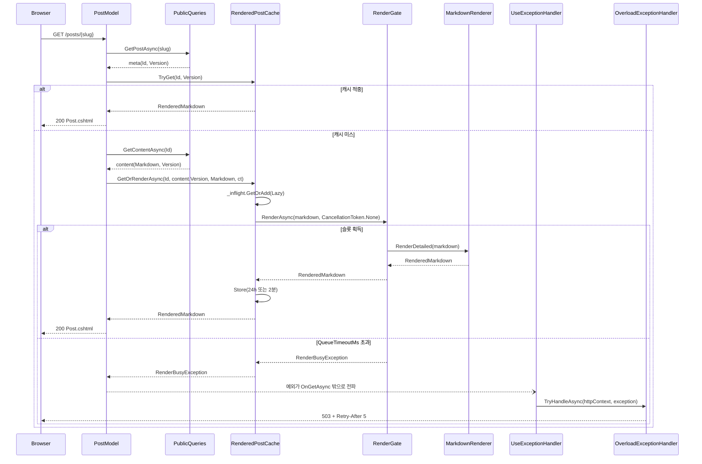
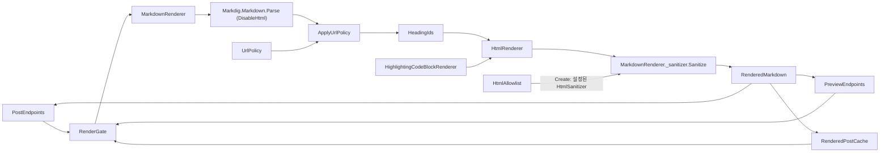
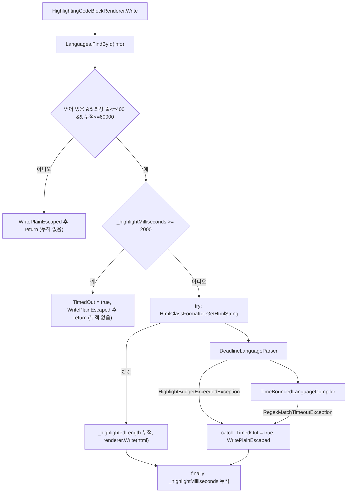

# F011 마크다운 렌더링·렌더 결과 캐시

<!-- doc-harness:section id="summary" hash="21f47b32a31412ffe69ed69ac67df7e029557df6f47b076ce506532f60435cdd" -->
## 한 줄 요약

결론: F011은 공용 렌더링 인프라다. 렌더링은 MarkdownRenderer.RenderDetailed 한 곳에서 동기로 실행되며 도중에 취소할 수 없다. 요청 경로는 모두 RenderGate(SemaphoreSlim, 기본 동시 2·대기 5000ms)를 거친다. 공개 상세 페이지는 RenderedPostCache에서 (PostId, xmin) 키로 조회하고, 적중하면 렌더를 건너뛴다. 방어는 세 겹이다. (1) Markdig DisableHtml. (2) UrlPolicy 허용 목록: 링크는 http/https/mailto·루트 상대·#앵커만, 이미지는 /attachments/{guid}/{파일명}만 허용한다. (3) HTML 정제: RenderDetailed가 마지막에 _sanitizer.Sanitize를 호출한다. _sanitizer는 MarkdownRenderer 필드 초기화 때 HtmlAllowlist.Create가 한 번 만든 HtmlSanitizer로, 태그·속성·클래스·스킴을 허용 목록만 남긴다. 코드 강조에는 한도가 있다. 한 줄 400자, 문서 전체 60,000자, 누적 2,000ms, 정규식 매치당 250ms다. 한도를 넘으면 그 블록만 이스케이프한 <pre><code>로 대체한다. 시간 때문에 강조를 포기한 결과(HighlightTimedOut)는 캐시에 24시간이 아니라 2분만 남는다. 실패 경로는 이렇다. 중첩 한도를 넘으면 RenderDetailed가 ArgumentException을 MarkdownTooComplexException으로 감싼다. 이때 저장·미리보기는 400을 내고, 공개 페이지는 본문 없이 '표시할 수 없습니다'를 보여 준다. 게이트 대기가 한도를 넘으면 RenderBusyException이 요청 처리 밖으로 전파되고, UseExceptionHandler 파이프라인의 OverloadExceptionHandler가 503과 Retry-After: 5를 쓴다. 실패한 렌더는 캐시하지 않으며, 진행 중 항목은 finally에서 제거한다. HTML은 DB에 저장하지 않으므로 재배포하면 캐시가 비고, 렌더러 수정이 과거 글 전체에 바로 반영된다. 외부 라이브러리 버전은 Directory.Packages.props에서 확인했다: Markdig 1.4.0, ColorCode.HTML 2.0.15, HtmlSanitizer 9.2.1039.

| 항목 | 값 |
|---|---|
| 중요도 | CORE |
| 상태 | ACTIVE |
| 진입점 | `POST /api/posts`, `PUT /api/posts/{id:guid}`, `POST /api/preview`, `Razor /posts/{slug}` |
| 의존 기능 | [F020](../09_FEATURES.md#f020), [F021](../09_FEATURES.md#f021) |

### 진입점 근거

| 내용 | 상태 | 근거 |
|---|---|---|
| POST /api/posts → PostEndpoints.CreateAsync: 검증 뒤 RenderOrAddErrorAsync(gate)로 저장 전에 렌더가 되는지 확인한다. 커밋 뒤 CanCacheRenderedResult가 참이면 cache.Store로 캐시를 미리 채운다. | CONFIRMED | `PortfolioBlog.Api/Features/Posts/PostEndpoints.cs` PostEndpoints.CreateAsync (124-164) |
| PUT /api/posts/{id:guid} → PostEndpoints.UpdateAsync: 버전 검사(201행)를 렌더(206행)보다 먼저 하고, 렌더로 확인한 뒤 저장한다. 저장 뒤에는 캐시를 미리 채운다(243행). | CONFIRMED | `PortfolioBlog.Api/Features/Posts/PostEndpoints.cs` PostEndpoints.UpdateAsync (187-245) |
| POST /api/preview → PreviewEndpoints.Render: 입력을 검증한 뒤 gate.RenderAsync 결과 중 Html만 PreviewResponse로 반환한다. 캐시는 쓰지 않는다. | CONFIRMED | `PortfolioBlog.Api/Features/Preview/PreviewEndpoints.cs` PreviewEndpoints.Render (56-77) |
| Razor /posts/{slug} → PostModel.OnGetAsync: 먼저 cache.TryGet(meta.Id, meta.Version)으로 조회한다. 미스면 PublicQueries.GetContentAsync로 본문을 읽고 cache.GetOrRenderAsync를 호출한다. | CONFIRMED | `PortfolioBlog.Api/Pages/Post.cshtml.cs` PostModel.OnGetAsync (43-74), `PortfolioBlog.Api/Pages/Post.cshtml` (1) |
| 앱 시작 시 워밍업: Program.cs가 게이트를 거치지 않고 MarkdownRenderer.Render로 csharp 코드블록 1개를 렌더한다. ColorCode 정적 초기화 비용(주석상 약 185ms)을 미리 치르기 위해서다. | CONFIRMED | `PortfolioBlog.Api/Program.cs` (91), `PortfolioBlog.Api/Infrastructure/Markdown/MarkdownRenderer.cs` (30) |
<!-- /doc-harness:section -->

<!-- doc-harness:section id="flow" hash="943bbd76c1fabbb3d5b62e1fb46779ad22df659266727e6f1ab331fec294bfd1" -->
## 처리 흐름

| 단계 | 컴포넌트 | 코드 | 설명 |
|---|---|---|---|
| 1 | Program | `PortfolioBlog.Api/Program.cs` (top-level) | MarkdownRenderer(TimeProvider.System)·RenderGate·RenderedPostCache를 싱글턴으로 등록하고(58-61행), RenderingOptions를 'Rendering' 섹션에 바인딩한다. OverloadExceptionHandler는 AddExceptionHandler로 등록하고(43행) app.UseExceptionHandler로 파이프라인에 붙인다(100행). |
| 2 | StartupValidation | `PortfolioBlog.Api/Infrastructure/Access/StartupValidation.cs` StartupValidation.Validate | RenderingOptions가 범위(Concurrency 1~64, QueueTimeoutMs 1~60000, CacheMegabytes 1~1024)를 벗어나면 InvalidOperationException으로 기동을 중단한다. |
| 3 | MarkdownRenderer | `PortfolioBlog.Api/Infrastructure/Markdown/MarkdownRenderer.cs` MarkdownRenderer._pipeline/_sanitizer (필드 초기화) | 싱글턴 인스턴스를 만들 때 Markdig 파이프라인을 Build하고(44-51행), HtmlAllowlist.Create()를 한 번 호출해 _sanitizer에 보관한다(54행). HtmlAllowlist.Create의 역할은 설정을 마친 HtmlSanitizer 인스턴스를 만들어 반환하는 것뿐이다. 허용 태그·속성, 스킴 http/https/mailto, CSS·at-rule 비움, data 속성 금지, 클래스 허용 목록, checkbox가 아닌 input을 지우는 PostProcessNode를 설정한다(HtmlAllowlist.cs 46-73행). |
| 4 | Program | `PortfolioBlog.Api/Program.cs` (warm-up) | GetRequiredService<MarkdownRenderer>().Render로 워밍업 렌더를 1회 한다(91행). 게이트를 거치지 않는다. |
| 5 | PostModel | `PortfolioBlog.Api/Pages/Post.cshtml.cs` PostModel.OnGetAsync | 공개 상세 요청이 오면 slug 형식을 검사하고 PublicQueries.GetPostAsync로 메타데이터(Id, Version=xmin)를 조회한다. 이어서 RenderedPostCache.TryGet으로 캐시를 조회한다. |
| 6 | PostModel | `PortfolioBlog.Api/Pages/Post.cshtml.cs` PostModel.RenderAsync | 캐시 미스면 PublicQueries.GetContentAsync로 본문과 그 시점의 버전을 읽는다. 그런 다음 RenderedPostCache.GetOrRenderAsync(id, content.Version, markdown, ct)를 호출한다. MarkdownTooComplexException만 잡아 null을 반환한다. |
| 7 | RenderedPostCache | `PortfolioBlog.Api/Infrastructure/Markdown/RenderedPostCache.cs` RenderedPostCache.GetOrRenderAsync | TryGet을 다시 확인한다. 미스면 _inflight.GetOrAdd로 키마다 Lazy<Task> 하나를 공유한다. 호출자는 lazy.Value.WaitAsync(ct)로 기다리므로 자기 대기만 취소할 수 있다. |
| 8 | RenderedPostCache | `PortfolioBlog.Api/Infrastructure/Markdown/RenderedPostCache.cs` RenderedPostCache.RenderAndStoreAsync | Task.Yield로 스레드를 양보한 뒤 RenderGate.RenderAsync(markdown, CancellationToken.None)를 호출한다. 성공하면 Store로 캐시에 넣고, finally에서 _inflight 항목을 제거한다. |
| 9 | RenderGate | `PortfolioBlog.Api/Infrastructure/Markdown/RenderGate.cs` RenderGate.RenderAsync | _slots.WaitAsync(_queueTimeout, ct)로 슬롯을 기다린다. 한도 안에 얻지 못하면 RenderBusyException을 던진다. 슬롯을 얻으면 _renderCount를 늘리고 _render(=MarkdownRenderer.RenderDetailed)를 동기로 실행한 뒤 finally에서 Release한다. |
| 10 | MarkdownRenderer | `PortfolioBlog.Api/Infrastructure/Markdown/MarkdownRenderer.cs` MarkdownRenderer.RenderDetailed | null 검사와 UTF-8 MaxInputBytes(204,800) 상한 검사를 한다. 둘 다 try 밖이며, 초과하면 ArgumentException을 던진다. 이어서 try 안에서 Markdig.Markdown.Parse(markdown, _pipeline)를 실행한다. |
| 11 | MarkdownRenderer | `PortfolioBlog.Api/Infrastructure/Markdown/MarkdownRenderer.cs` MarkdownRenderer.ApplyUrlPolicy | LinkInline마다 이미지는 UrlPolicy.IsAllowedImage, 링크는 UrlPolicy.IsAllowedLink로 판정한다. 통과하지 못하면 자식은 남기고 링크 노드만 제거한다. 허용되지 않은 AutolinkInline은 LiteralInline으로 바꾼다. |
| 12 | HeadingIds | `PortfolioBlog.Api/Infrastructure/Markdown/HeadingIds.cs` HeadingIds.Assign | HeadingBlock마다 slug id를 부여하고, 중복은 선형 접미사로 해소한다. |
| 13 | MarkdownRenderer | `PortfolioBlog.Api/Infrastructure/Markdown/MarkdownRenderer.cs` MarkdownRenderer.RenderDetailed | 정책을 통과한 첫 이미지 URL을 firstImage로 뽑는다. HtmlRenderer에서 기본 CodeBlockRenderer를 빼고, 렌더마다 새 HighlightingCodeBlockRenderer를 붙여 StringWriter에 렌더링한다(126-135행). |
| 14 | HighlightingCodeBlockRenderer | `PortfolioBlog.Api/Infrastructure/Markdown/HighlightingCodeBlockRenderer.cs` HighlightingCodeBlockRenderer.Write | 코드블록마다 순서대로 판정한다. 먼저 언어·한 줄 400자·누적 60,000자 길이 예산을 보고, 넘으면 WritePlainEscaped 후 return한다. 다음으로 누적 2,000ms 시간 예산을 보고, 이미 소진됐으면 TimedOut=true, WritePlainEscaped 후 return한다. 두 조기 반환은 모두 try 밖이라 시간을 누적하지 않는다. 통과하면 try에서 DeadlineLanguageParser와 TimeBoundedLanguageCompiler로 HtmlClassFormatter.GetHtmlString을 호출한다. RegexMatchTimeoutException이나 HighlightBudgetExceededException이 나면 catch에서 TimedOut=true, WritePlainEscaped를 하고, finally에서 _highlightMilliseconds를 누적한다. |
| 15 | MarkdownRenderer | `PortfolioBlog.Api/Infrastructure/Markdown/MarkdownRenderer.cs` MarkdownRenderer.RenderDetailed | 중간 HTML(writer.ToString())을 _sanitizer.Sanitize로 정제한다. _sanitizer는 3단계에서 HtmlAllowlist.Create가 만든 인스턴스다. 그 결과로 RenderedMarkdown(Html, firstImage, highlighter.TimedOut)을 만들어 반환한다(136행). try 블록 안에서 난 ArgumentException(Markdig 중첩 한도 128 초과)은 catch에서 MarkdownTooComplexException으로 감싸 다시 던진다(138-143행). |
| 16 | RenderedPostCache | `PortfolioBlog.Api/Infrastructure/Markdown/RenderedPostCache.cs` RenderedPostCache.Store | Size(Html·FirstImageUrl 길이×2 + 512)와 수명(HighlightTimedOut이면 2분, 아니면 24시간)을 붙여 MemoryCache.Set을 호출한다. |
| 17 | PostModel | `PortfolioBlog.Api/Pages/Post.cshtml.cs` PostModel.OnGetAsync | BodyHtml과 OG 이미지(FirstImageUrl)를 설정한다. Post.cshtml이 Html.Raw로 본문을 출력하고, BodyHtml이 null이면 안내 문구를 보여 준다. |
| 18 | OverloadExceptionHandler | `PortfolioBlog.Api/Infrastructure/Web/OverloadExceptionHandler.cs` OverloadExceptionHandler.TryHandleAsync | (실패 경로) RenderBusyException이 엔드포인트·페이지 밖으로 전파되면 UseExceptionHandler 파이프라인이 이 핸들러를 호출한다. IsOverload가 참이면 핸들러가 503과 Retry-After: 5, 오류 본문(ErrorResponses.WriteAsync)을 쓴다. |
<!-- /doc-harness:section -->

<!-- doc-harness:section id="F011_SEQUENCE" hash="911979558864c5ef587e6e8fa9af701179049d1b5f8fc55473ba4276babd3d0b" -->
## 공개 글 상세 렌더(캐시 적중·미스·단일 비행·게이트 거부) (Sequence Diagram)

공개 상세는 캐시 적중이면 렌더 없이 응답한다. 미스면 RenderedPostCache가 키당 한 번만 RenderGate를 거쳐 MarkdownRenderer를 호출하고, 게이트 대기가 한도를 넘으면 OverloadExceptionHandler가 503을 낸다.

PostModel.OnGetAsync는 메타 조회 뒤 TryGet으로 캐시를 먼저 본다. 미스면 RenderAsync가 본문과 그 시점의 Version을 다시 읽어 GetOrRenderAsync에 넘긴다. RenderedPostCache는 _inflight.GetOrAdd로 같은 키의 동시 미스를 Lazy 하나로 합치고, RenderAndStoreAsync에서 CancellationToken.None으로 게이트를 호출해 렌더가 끝까지 가게 한다. 성공하면 Store가 HighlightTimedOut에 따라 24시간 또는 2분 수명으로 넣는다. 게이트 대기가 QueueTimeoutMs를 넘으면 RenderBusyException이 PostModel 밖으로 전파되고, UseExceptionHandler에 등록된 OverloadExceptionHandler가 503과 Retry-After: 5를 쓴다. MarkdownTooComplexException은 PostModel.RenderAsync가 잡아 null로 바꾸므로 이 다이어그램의 예외 분기에 오지 않는다.

### 코드 근거

| 구성 요소 | 코드 |
|---|---|
| PostModel | `PortfolioBlog.Api/Pages/Post.cshtml.cs` (PostModel.OnGetAsync/RenderAsync) |
| PublicQueries | `PortfolioBlog.Api/Infrastructure/Data/PublicQueries.cs` (PublicQueries.GetPostAsync/GetContentAsync) |
| RenderedPostCache | `PortfolioBlog.Api/Infrastructure/Markdown/RenderedPostCache.cs` (RenderedPostCache.GetOrRenderAsync/RenderAndStoreAsync/Store) |
| RenderGate | `PortfolioBlog.Api/Infrastructure/Markdown/RenderGate.cs` (RenderGate.RenderAsync) |
| MarkdownRenderer | `PortfolioBlog.Api/Infrastructure/Markdown/MarkdownRenderer.cs` (MarkdownRenderer.RenderDetailed) |
| UseExceptionHandler | `PortfolioBlog.Api/Program.cs` (app.UseExceptionHandler) |
| OverloadExceptionHandler | `PortfolioBlog.Api/Infrastructure/Web/OverloadExceptionHandler.cs` (OverloadExceptionHandler.TryHandleAsync) |
<!-- /doc-harness:section -->

<!-- doc-harness:section id="F011_DATAFLOW" hash="e2ebe3e4d179f691861b332409ffc0ab9ccd3d0d84ea1c7c18348c67b3356075" -->
## MarkdownRenderer.RenderDetailed 내부 변환 파이프라인 (Data Flow Diagram)

세 호출 경로는 모두 RenderGate를 거쳐 MarkdownRenderer.RenderDetailed에 모인다. 여기서 파싱→URL 정책→제목 id→HTML 출력(코드 강조)→_sanitizer.Sanitize 순으로 변환되어 RenderedMarkdown이 된다. HtmlAllowlist는 정제 단계에 쓸 HtmlSanitizer를 만들어 주는 역할만 한다.

입력 마크다운은 Markdig.Markdown.Parse로 AST가 된다(DisableHtml 파이프라인). ApplyUrlPolicy는 UrlPolicy로 링크·이미지를 판정해 AST를 고치고, HeadingIds.Assign이 제목 id를 붙인다. HtmlRenderer는 기본 CodeBlockRenderer 대신 렌더마다 새로 만든 HighlightingCodeBlockRenderer로 코드블록을 출력한다. 그 중간 HTML을 MarkdownRenderer가 자신의 _sanitizer 필드로 Sanitize해 RenderedMarkdown을 만든다(MarkdownRenderer.cs 136행). _sanitizer는 필드 초기화 때 HtmlAllowlist.Create()가 한 번 만든 HtmlSanitizer다(54행). HtmlAllowlist 자체는 정제를 실행하지 않는다. 결과는 PostEndpoints(검증·캐시 선채움), PreviewEndpoints(Html만 응답), RenderedPostCache(캐시 저장)로 돌아간다. 중첩 한도 초과로 난 ArgumentException은 이 파이프라인 안에서 RenderDetailed가 MarkdownTooComplexException으로 바꾼다.

### 코드 근거

| 구성 요소 | 코드 |
|---|---|
| PostEndpoints | `PortfolioBlog.Api/Features/Posts/PostEndpoints.cs` (PostEndpoints.RenderOrAddErrorAsync) |
| PreviewEndpoints | `PortfolioBlog.Api/Features/Preview/PreviewEndpoints.cs` (PreviewEndpoints.Render) |
| RenderedPostCache | `PortfolioBlog.Api/Infrastructure/Markdown/RenderedPostCache.cs` (RenderedPostCache.RenderAndStoreAsync) |
| RenderGate | `PortfolioBlog.Api/Infrastructure/Markdown/RenderGate.cs` (RenderGate.RenderAsync) |
| MarkdownRenderer | `PortfolioBlog.Api/Infrastructure/Markdown/MarkdownRenderer.cs` (MarkdownRenderer.RenderDetailed) |
| MarkdigParse | `PortfolioBlog.Api/Infrastructure/Markdown/MarkdownRenderer.cs` (Markdig.Markdown.Parse) |
| ApplyUrlPolicy | `PortfolioBlog.Api/Infrastructure/Markdown/MarkdownRenderer.cs` (MarkdownRenderer.ApplyUrlPolicy) |
| UrlPolicy | `PortfolioBlog.Api/Infrastructure/Markdown/UrlPolicy.cs` (UrlPolicy.IsAllowedLink/IsAllowedImage) |
| HeadingIds | `PortfolioBlog.Api/Infrastructure/Markdown/HeadingIds.cs` (HeadingIds.Assign) |
| HighlightingCodeBlockRenderer | `PortfolioBlog.Api/Infrastructure/Markdown/HighlightingCodeBlockRenderer.cs` (HighlightingCodeBlockRenderer.Write) |
| HtmlRenderer | `PortfolioBlog.Api/Infrastructure/Markdown/MarkdownRenderer.cs` (Markdig.Renderers.HtmlRenderer) |
| SanitizerSanitize | `PortfolioBlog.Api/Infrastructure/Markdown/MarkdownRenderer.cs` (MarkdownRenderer.RenderDetailed (_sanitizer.Sanitize)) |
| HtmlAllowlist | `PortfolioBlog.Api/Infrastructure/Markdown/HtmlAllowlist.cs` (HtmlAllowlist.Create) |
| RenderedMarkdown | `PortfolioBlog.Api/Infrastructure/Markdown/MarkdownRenderer.cs` (RenderedMarkdown) |
<!-- /doc-harness:section -->

<!-- doc-harness:section id="F011_FLOW" hash="78d8885e02843811fca81af45ef3ca0010a832f5f6d0f9427365803d6ec29a89" -->
## 코드블록 강조 판정과 폴백(HighlightingCodeBlockRenderer.Write) (Flowchart)

코드블록은 길이 예산→시간 예산→강조 시도 순으로 판정된다. 어느 단계에서 실패해도 그 블록만 이스케이프한 일반 코드블록으로 떨어진다. 시간 때문에 떨어질 때만 TimedOut이 선다.

Write는 먼저 블록 원문과 최장 줄 길이를 모은다. 그리고 info 문자열로 Languages.FindById를 호출한다. 언어가 없거나 줄·누적 길이 예산을 넘으면 결정적 폴백이므로 TimedOut 없이 WritePlainEscaped로 끝낸다. 누적 시간이 이미 2,000ms 이상이면 TimedOut=true로 두고 폴백한다. 두 경로 모두 try 밖이라 시간을 누적하지 않는다. 그 외에는 DeadlineLanguageParser(누적 시간 기준 마감 검사)와 TimeBoundedLanguageCompiler(정규식 매치 250ms 제한)로 로컬 문자열을 완성한 뒤에만 출력한다. 예외가 나면 catch에서 폴백하므로 부분 출력이 없다. finally는 성공·실패 모두 경과 시간을 누적한다. TimedOut은 MarkdownRenderer.RenderDetailed가 RenderedMarkdown.HighlightTimedOut으로 넘기고, RenderedPostCache.Store는 이를 보고 캐시 수명을 2분으로 줄인다.

### 코드 근거

| 구성 요소 | 코드 |
|---|---|
| WriteStart | `PortfolioBlog.Api/Infrastructure/Markdown/HighlightingCodeBlockRenderer.cs` (HighlightingCodeBlockRenderer.Write) |
| LengthBudget | `PortfolioBlog.Api/Infrastructure/Markdown/HighlightingCodeBlockRenderer.cs` (MaxHighlightLineLength/MaxHighlightDocumentLength) |
| TimeBudget | `PortfolioBlog.Api/Infrastructure/Markdown/HighlightingCodeBlockRenderer.cs` (MaxHighlightMilliseconds) |
| DeadlineLanguageParser | `PortfolioBlog.Api/Infrastructure/Markdown/BoundedHighlighting.cs` (DeadlineLanguageParser) |
| TimeBoundedLanguageCompiler | `PortfolioBlog.Api/Infrastructure/Markdown/BoundedHighlighting.cs` (TimeBoundedLanguageCompiler) |
| CatchPlain | `PortfolioBlog.Api/Infrastructure/Markdown/HighlightingCodeBlockRenderer.cs` (WritePlainEscaped) |
| AccumulateTime | `PortfolioBlog.Api/Infrastructure/Markdown/HighlightingCodeBlockRenderer.cs` (_highlightMilliseconds) |
<!-- /doc-harness:section -->

<!-- doc-harness:section id="data" hash="8e9ec6e8df8e3f879ab0548c28c8b313f622e221b156a846794ae0bd9d370323" -->
## 데이터

### 데이터 흐름

| 내용 | 상태 | 근거 |
|---|---|---|
| 입력은 마크다운 원문 문자열이다. 경로마다 출처가 다르다: 저장 요청은 UpsertPostRequest.ContentMarkdown, 미리보기는 PreviewRequest.Markdown, 공개 페이지는 DB에서 읽은 content.Markdown이다. 출력은 RenderedMarkdown(Html, FirstImageUrl, HighlightTimedOut)이다. | CONFIRMED | `PortfolioBlog.Api/Infrastructure/Markdown/MarkdownRenderer.cs` MarkdownRenderer.RenderDetailed (16,111-136) |
| 변환 순서는 Markdig AST → ApplyUrlPolicy(AST 변형) → HeadingIds.Assign → HtmlRenderer 출력(StringWriter) → MarkdownRenderer._sanitizer.Sanitize → 최종 Html이다. 정제와 RenderedMarkdown 생성은 RenderDetailed 안에서 일어난다(136행). HtmlAllowlist.Create는 그 _sanitizer 인스턴스를 필드 초기화 때 한 번 만들어 줄 뿐이다(54행). FirstImageUrl은 URL 정책을 적용한 뒤의 AST에서 뽑는다. | CONFIRMED | `PortfolioBlog.Api/Infrastructure/Markdown/MarkdownRenderer.cs` MarkdownRenderer.RenderDetailed (54,119-136), `PortfolioBlog.Api/Infrastructure/Markdown/HtmlAllowlist.cs` HtmlAllowlist.Create (46-73) |
| 캐시 키는 (Guid PostId, uint Version=xmin) 튜플이다. 공개 페이지는 메타 조회로 얻은 Version으로 TryGet한다. 미스일 때는 본문과 함께 읽은 content.Version으로 GetOrRenderAsync를 호출하므로, 메타 조회 뒤 글이 수정돼도 키와 내용이 어긋나지 않는다. | CONFIRMED | `PortfolioBlog.Api/Pages/Post.cshtml.cs` PostModel.OnGetAsync/RenderAsync (51,64-68), `PortfolioBlog.Api/Infrastructure/Markdown/RenderedPostCache.cs` RenderedPostCache.GetOrRenderAsync (95-101) |
| 글 저장 경로는 저장 전에 렌더한 결과를 버리지 않는다. 커밋 뒤 재조회한 DTO의 본문이 요청 본문과 같을 때만(CanCacheRenderedResult) (dto.Id, dto.Version) 키로 Store한다. 재조회 사이에 다른 저장이 끼어들어 남의 HTML이 최신 버전 키에 들어가는 오염을 막기 위해서다. | CONFIRMED | `PortfolioBlog.Api/Features/Posts/PostEndpoints.cs` PostEndpoints.CreateAsync/UpdateAsync/CanCacheRenderedResult (161-162,242-243,348-354) |
| 미리보기 결과는 캐시에 넣지 않고 Html만 PreviewResponse로 응답한다. | CONFIRMED | `PortfolioBlog.Api/Features/Preview/PreviewEndpoints.cs` PreviewEndpoints.Render (69) |
| FirstImageUrl은 공개 상세 페이지의 OG 이미지로 쓰인다(SetHead의 마지막 인자). | CONFIRMED | `PortfolioBlog.Api/Pages/Post.cshtml.cs` PostModel.OnGetAsync (54) |
| 렌더된 HTML은 DB에 저장하지 않고 프로세스 메모리의 전용 MemoryCache에만 둔다. 재배포하면 캐시가 비므로 렌더러 보안 수정이 과거 글 전체에 반영된다. | CONFIRMED | `PortfolioBlog.Api/Infrastructure/Markdown/RenderedPostCache.cs` (15,35,54) |

### DB 접근

| 엔티티 | 작업 | 코드 |
|---|---|---|
| Posts (PublicDbContext, 본문 제외 메타·Version=xmin·태그·시리즈 이웃) | SELECT | `PortfolioBlog.Api/Infrastructure/Data/PublicQueries.cs` PublicQueries.GetPostAsync |
| Posts (PublicDbContext, ContentMarkdown·Version) — 캐시 미스일 때만 | SELECT | `PortfolioBlog.Api/Infrastructure/Data/PublicQueries.cs` PublicQueries.GetContentAsync |

### 상태 전이

| 이전 | 다음 | 트리거 | 근거 |
|---|---|---|---|
| 캐시 없음(미스) | 진행 중(_inflight에 Lazy<Task> 등록) | GetOrRenderAsync에서 TryGet이 미스한 뒤 _inflight.GetOrAdd | `PortfolioBlog.Api/Infrastructure/Markdown/RenderedPostCache.cs` RenderedPostCache.GetOrRenderAsync (95-101) |
| 진행 중 | 캐시됨(정상, 24시간) | RenderGate.RenderAsync 성공, HighlightTimedOut=false → Store. finally에서 _inflight 제거 | `PortfolioBlog.Api/Infrastructure/Markdown/RenderedPostCache.cs` RenderedPostCache.RenderAndStoreAsync/Store (115-122,136-151) |
| 진행 중 | 캐시됨(강조 포기, 2분) | 렌더 성공, HighlightTimedOut=true → DegradedLifetime으로 Store | `PortfolioBlog.Api/Infrastructure/Markdown/RenderedPostCache.cs` RenderedPostCache.Store (20-23,121) |
| 진행 중 | 캐시 없음 | 렌더 예외(RenderBusyException·MarkdownTooComplexException 등) → Store 없이 finally에서 _inflight 제거. 기다리던 모든 호출자에게 예외 전파 | `PortfolioBlog.Api/Infrastructure/Markdown/RenderedPostCache.cs` RenderedPostCache.RenderAndStoreAsync (141-150) |
| 캐시됨 | 캐시 없음 | AbsoluteExpiration 만료, SizeLimit 초과 시 압축(축출), 프로세스 재시작 | `PortfolioBlog.Api/Infrastructure/Markdown/RenderedPostCache.cs` (27-35,115-122) |
| 캐시 없음 | 캐시됨(선채움) | 글 생성·수정을 커밋한 뒤 CanCacheRenderedResult가 참이면 PostEndpoints가 cache.Store 호출 | `PortfolioBlog.Api/Features/Posts/PostEndpoints.cs` PostEndpoints.CreateAsync/UpdateAsync (162,243) |
| 슬롯 대기 | 렌더 중(슬롯 점유) | SemaphoreSlim.WaitAsync가 queueTimeout 안에 true를 반환 | `PortfolioBlog.Api/Infrastructure/Markdown/RenderGate.cs` RenderGate.RenderAsync (86-98) |
| 슬롯 대기 | 거부(RenderBusyException) | WaitAsync가 false를 반환(대기 한도 초과) | `PortfolioBlog.Api/Infrastructure/Markdown/RenderGate.cs` RenderGate.RenderAsync (88) |

### 외부 의존

| 내용 | 상태 | 근거 |
|---|---|---|
| Markdig 1.4.0(NuGet, Directory.Packages.props의 중앙 패키지 관리로 고정): 마크다운 파싱과 HTML 렌더링. DisableHtml·PipeTables·TaskLists·Footnotes·EmphasisExtras(Strikethrough)·AutoLinks만 켠다. | CONFIRMED | `Directory.Packages.props` (9), `PortfolioBlog.Api/Infrastructure/Markdown/MarkdownRenderer.cs` (44-51,140-141) |
| ColorCode.HTML 2.0.15(NuGet, Directory.Packages.props): 코드 강조. HtmlClassFormatter·LanguageParser·LanguageRepository·Languages를 쓰며, 인라인 style 없이 CSS 클래스만 출력한다. | CONFIRMED | `Directory.Packages.props` (10), `PortfolioBlog.Api/Infrastructure/Markdown/HighlightingCodeBlockRenderer.cs` (52-61,112) |
| HtmlSanitizer 9.2.1039(NuGet, Directory.Packages.props): HtmlAllowlist.Create가 허용 목록을 설정한 인스턴스를 만든다. MarkdownRenderer.RenderDetailed는 그 인스턴스(_sanitizer)로 최종 HTML을 정제한다. | CONFIRMED | `Directory.Packages.props` (11), `PortfolioBlog.Api/Infrastructure/Markdown/HtmlAllowlist.cs` HtmlAllowlist.Create (46-73), `PortfolioBlog.Api/Infrastructure/Markdown/MarkdownRenderer.cs` (54,136) |
| Microsoft.Extensions.Caching.Memory.MemoryCache: 공용 IMemoryCache가 아니라 SizeLimit이 걸린 전용 인스턴스를 쓴다. | CONFIRMED | `PortfolioBlog.Api/Infrastructure/Markdown/RenderedPostCache.cs` (2,35,54) |
| 네트워크·외부 API 호출은 없다. UrlPolicy는 문자열 규칙으로만 판정하고, 첨부 파일이 실제로 있는지는 확인하지 않는다. | CONFIRMED | `PortfolioBlog.Api/Infrastructure/Markdown/UrlPolicy.cs` |
<!-- /doc-harness:section -->

<!-- doc-harness:section id="failures" hash="8676cc81484954ed8ae3b1df9802d84f72047c3a78e37a5cdc8202d0487ca591" -->
## 실패 지점

| 위치 | 조건 | 처리 | 상태 | 근거 |
|---|---|---|---|---|
| RenderGate.RenderAsync | QueueTimeoutMs(기본 5000ms) 안에 렌더 슬롯을 얻지 못함 | RenderBusyException을 던진다. 어느 호출부도 잡지 않으므로 엔드포인트·Razor 페이지 밖으로 전파된다. 그러면 app.UseExceptionHandler 파이프라인이 등록된 OverloadExceptionHandler.TryHandleAsync를 호출하고, IsOverload가 InnerException 체인에서 이 예외를 찾으면 503과 Retry-After: 5를 쓴다. | CONFIRMED | `PortfolioBlog.Api/Infrastructure/Markdown/RenderGate.cs` RenderGate.RenderAsync (88), `PortfolioBlog.Api/Infrastructure/Web/OverloadExceptionHandler.cs` OverloadExceptionHandler.TryHandleAsync/IsOverload (35-42,63-70), `PortfolioBlog.Api/Program.cs` (43,100) |
| RenderGate.RenderAsync | 슬롯 대기 중 요청 취소(ct) | SemaphoreSlim.WaitAsync가 OperationCanceledException을 던진다. 슬롯을 얻기 전이라 반납할 것이 없다. 슬롯을 얻은 뒤에는 렌더를 취소할 수 없고, finally에서 슬롯을 반납한다. | CONFIRMED | `PortfolioBlog.Api/Infrastructure/Markdown/RenderGate.cs` RenderGate.RenderAsync (86-98) |
| MarkdownRenderer.RenderDetailed | Markdig 중첩 한도(128단계)를 넘어 파싱·렌더 중 ArgumentException 발생 | RenderDetailed의 catch(138-143행)가 MarkdownTooComplexException으로 감싼다. 저장 경로(RenderOrAddErrorAsync)는 contentMarkdown 키로, 미리보기는 markdown 키로 400을 낸다. 공개 PostModel.RenderAsync는 null을 반환해 본문 없이 안내 문구를 보여 준다. | CONFIRMED | `PortfolioBlog.Api/Infrastructure/Markdown/MarkdownRenderer.cs` MarkdownRenderer.RenderDetailed (138-143), `PortfolioBlog.Api/Features/Posts/PostEndpoints.cs` PostEndpoints.RenderOrAddErrorAsync (323-334), `PortfolioBlog.Api/Features/Preview/PreviewEndpoints.cs` PreviewEndpoints.Render (71-76), `PortfolioBlog.Api/Pages/Post.cshtml.cs` PostModel.RenderAsync (70-73) |
| MarkdownRenderer.RenderDetailed | 입력이 null이거나 UTF-8 MaxInputBytes를 넘음 | try 블록 밖에서 ArgumentNullException/ArgumentException을 던지고 MarkdownTooComplexException으로 바꾸지 않는다(예외 전파). 저장·미리보기는 사전 검증으로 막는다. 공개 경로는 DB 제약(CK_Posts_Content_Size)에 의존하며 PostModel이 이 예외를 잡지 않는다. 따라서 제약을 우회한 데이터가 있으면 500이 된다. | POTENTIAL_ISSUE | `PortfolioBlog.Api/Infrastructure/Markdown/MarkdownRenderer.cs` MarkdownRenderer.RenderDetailed (36-39,113-117), `PortfolioBlog.Api/Features/Preview/PreviewEndpoints.cs` (59-63), `PortfolioBlog.Api/Pages/Post.cshtml.cs` PostModel.RenderAsync (66-73) |
| HighlightingCodeBlockRenderer.Write | 정규식 매치 1건이 250ms를 넘거나(RegexMatchTimeoutException), 강조 중 누적 시간이 2,000ms에 이름(DeadlineLanguageParser의 HighlightBudgetExceededException) | catch에서 TimedOut=true로 두고 해당 블록만 이스케이프한 <pre><code>로 대체한다. finally에서 쓴 시간을 _highlightMilliseconds에 누적한다. 부분 강조 결과는 로컬 문자열에 있으므로 출력에 섞이지 않는다. | CONFIRMED | `PortfolioBlog.Api/Infrastructure/Markdown/HighlightingCodeBlockRenderer.cs` HighlightingCodeBlockRenderer.Write (104-131), `PortfolioBlog.Api/Infrastructure/Markdown/BoundedHighlighting.cs` DeadlineLanguageParser (68-82) |
| HighlightingCodeBlockRenderer.Write | 블록 진입 시 누적 강조 시간이 이미 2,000ms 이상 | TimedOut=true, WritePlainEscaped 후 try 밖에서 바로 return한다. 시간 측정·누적은 하지 않는다. | CONFIRMED | `PortfolioBlog.Api/Infrastructure/Markdown/HighlightingCodeBlockRenderer.cs` HighlightingCodeBlockRenderer.Write (96-101) |
| HighlightingCodeBlockRenderer.Write | 언어를 모르거나 지정하지 않음, 한 줄이 400자 초과, 문서 누적 강조 문자가 60,000자 초과 | 강조 없이 이스케이프한 일반 코드블록을 쓰고 바로 return한다. 결과가 결정적이라 TimedOut을 세우지 않고 시간도 누적하지 않는다. | CONFIRMED | `PortfolioBlog.Api/Infrastructure/Markdown/HighlightingCodeBlockRenderer.cs` HighlightingCodeBlockRenderer.Write (84-95) |
| RenderedPostCache.RenderAndStoreAsync | 공유 렌더가 예외로 끝남 | Store하지 않고 finally에서 _inflight 항목을 제거해 다음 요청이 다시 시도하게 한다. 같은 키로 기다리던 호출자 전원에게 같은 예외가 전파된다. | CONFIRMED | `PortfolioBlog.Api/Infrastructure/Markdown/RenderedPostCache.cs` RenderedPostCache.RenderAndStoreAsync (141-150) |
| RenderedPostCache.GetOrRenderAsync | 기다리던 호출자의 요청 취소 | lazy.Value.WaitAsync(ct)이므로 그 호출자의 대기만 OperationCanceledException으로 끝난다. 공유 렌더는 CancellationToken.None으로 계속 돌고 결과를 캐시에 넣는다. | CONFIRMED | `PortfolioBlog.Api/Infrastructure/Markdown/RenderedPostCache.cs` RenderedPostCache.GetOrRenderAsync/RenderAndStoreAsync (100,143) |
| RenderedPostCache.Store | MemoryCache SizeLimit(CacheMegabytes)을 넘은 상태에서 Set | 예외 없이 조용히 거부된다(주석에 적힌 실측). 다음 요청이 다시 렌더하며, 그 비용은 RenderGate가 제한한다. 로그는 남지 않는다. | CONFIRMED | `PortfolioBlog.Api/Infrastructure/Markdown/RenderedPostCache.cs` (27-35) |
| StartupValidation.Validate | Rendering:Concurrency·QueueTimeoutMs·CacheMegabytes가 허용 범위를 벗어남 | InvalidOperationException으로 기동을 중단한다. | CONFIRMED | `PortfolioBlog.Api/Infrastructure/Access/StartupValidation.cs` StartupValidation.Validate (103-107) |
| PostModel.RenderAsync | 메타 조회 직후 글이 삭제돼 GetContentAsync가 null을 반환 | null을 반환해 본문 없이 페이지를 그린다. 다음 요청부터는 404가 된다. | CONFIRMED | `PortfolioBlog.Api/Pages/Post.cshtml.cs` PostModel.RenderAsync (64-65) |

### 엣지 케이스

| 내용 | 상태 | 근거 |
|---|---|---|
| 빈 문자열 입력은 허용된다(미리보기는 null만 거부한다). 렌더 결과는 빈 HTML이다. | CONFIRMED | `PortfolioBlog.Api/Features/Preview/PreviewEndpoints.cs` (59), `PortfolioBlog.Api/Infrastructure/Markdown/MarkdownRenderer.cs` (85) |
| 정책을 통과하지 못한 링크·이미지는 노드만 제거되고, 링크 텍스트와 대체 텍스트는 남는다. 허용되지 않은 자동 링크는 평문(LiteralInline)이 된다. 이메일 자동 링크는 'mailto:'를 붙여서 판정한다. | CONFIRMED | `PortfolioBlog.Api/Infrastructure/Markdown/MarkdownRenderer.cs` MarkdownRenderer.ApplyUrlPolicy (147-163) |
| HtmlSanitizer 인스턴스는 MarkdownRenderer마다 하나만 만들어 모든 렌더가 공유한다. 주석에 따르면 Sanitize는 호출마다 독립 DOM을 만들므로, 구성만 고정돼 있으면 동시 사용이 안전하다. | INFERRED | `PortfolioBlog.Api/Infrastructure/Markdown/MarkdownRenderer.cs` (53-54) |
| 조기 반환 경로(길이 예산 초과·언어 없음, 시간 예산 소진)는 _highlightMilliseconds를 누적하지 않는다. 시간은 try/finally 안의 강조 시도 경로에서만 누적된다. | CONFIRMED | `PortfolioBlog.Api/Infrastructure/Markdown/HighlightingCodeBlockRenderer.cs` HighlightingCodeBlockRenderer.Write (91-131) |
| 강조 결과는 서버 부하에 따라 달라진다. 같은 글도 바쁠 때는 일반 코드블록이 될 수 있고, 그런 결과는 캐시에 2분만 머문다. | CONFIRMED | `PortfolioBlog.Api/Infrastructure/Markdown/HighlightingCodeBlockRenderer.cs` (32-34), `PortfolioBlog.Api/Infrastructure/Markdown/RenderedPostCache.cs` (22-23,121) |
| 같은 키로 GetOrRenderAsync를 동시에 호출하면 ConcurrentDictionary.GetOrAdd가 Lazy를 하나만 저장하므로 렌더는 한 번만 실행된다. 나중 호출자가 넘긴 markdown 인자는 무시된다(키가 같으면 내용도 같다는 전제). | CONFIRMED | `PortfolioBlog.Api/Infrastructure/Markdown/RenderedPostCache.cs` RenderedPostCache.GetOrRenderAsync (37-38,95-101) |
| 글 수정은 버전 검사를 렌더보다 먼저 한다. 그래서 오래된 탭의 요청은 렌더 슬롯을 쓰지 않고 409로 끝난다. | CONFIRMED | `PortfolioBlog.Api/Features/Posts/PostEndpoints.cs` PostEndpoints.UpdateAsync (201,206) |
| 게이트 밖에서 렌더하는 앱 코드는 Program.cs의 워밍업 한 곳뿐이다. | CONFIRMED | `PortfolioBlog.Api/Program.cs` (91) |
| Markdig 파서는 적대적인 약 200KB 입력에서 초선형으로 느려진다고 주석에 적혀 있다(인라인·블록 파서 둘 다). 라이브러리 밖에서는 고칠 수 없어 RenderGate로 동시 실행 수만 제한한다. | INFERRED | `PortfolioBlog.Api/Infrastructure/Markdown/MarkdownRenderer.cs` (24-30) |

### 로깅

| 내용 | 상태 | 근거 |
|---|---|---|
| F011 컴포넌트(MarkdownRenderer, RenderGate, RenderedPostCache, HighlightingCodeBlockRenderer, HtmlAllowlist)에는 로깅 코드가 없다. 게이트 거부, 캐시 Set 거부, 강조 타임아웃은 기록되지 않는다. RenderGate._renderCount는 internal RenderCount로 테스트에서만 관측한다. | CONFIRMED | `PortfolioBlog.Api/Infrastructure/Markdown/RenderGate.cs` (69-70), `PortfolioBlog.Api/Infrastructure/Markdown/RenderedPostCache.cs` |
| 호출부인 PostEndpoints는 저장에 성공하면 'PortfolioBlog.Api.Audit' 로거에 PostId와 Slug만 남기고 본문은 기록하지 않는다. | CONFIRMED | `PortfolioBlog.Api/Features/Posts/PostEndpoints.cs` (159,240) |
<!-- /doc-harness:section -->

<!-- doc-harness:section id="code" hash="645f5a7bcc0564b42dbbb0f0e39af09396e75c37f27e983939c3e3d19861af52" -->
## 관련 코드

| 파일 | 심볼 | 역할 |
|---|---|---|
| `PortfolioBlog.Api/Infrastructure/Markdown/MarkdownRenderer.cs` | MarkdownRenderer.RenderDetailed | render |
| `PortfolioBlog.Api/Infrastructure/Markdown/MarkdownRenderer.cs` | RenderedMarkdown | dto |
| `PortfolioBlog.Api/Infrastructure/Markdown/RenderGate.cs` | RenderGate.RenderAsync | service |
| `PortfolioBlog.Api/Infrastructure/Markdown/RenderGate.cs` | RenderBusyException | service |
| `PortfolioBlog.Api/Infrastructure/Markdown/RenderedPostCache.cs` | RenderedPostCache | data |
| `PortfolioBlog.Api/Infrastructure/Markdown/RenderingOptions.cs` | RenderingOptions | config |
| `PortfolioBlog.Api/Infrastructure/Markdown/HtmlAllowlist.cs` | HtmlAllowlist.Create (설정된 HtmlSanitizer 생성) | validation |
| `PortfolioBlog.Api/Infrastructure/Markdown/UrlPolicy.cs` | UrlPolicy.IsAllowedLink/IsAllowedImage | validation |
| `PortfolioBlog.Api/Infrastructure/Markdown/BoundedHighlighting.cs` | TimeBoundedLanguageCompiler/DeadlineLanguageParser/HighlightBudgetExceededException | render |
| `PortfolioBlog.Api/Infrastructure/Markdown/HighlightingCodeBlockRenderer.cs` | HighlightingCodeBlockRenderer.Write | render |
| `PortfolioBlog.Api/Infrastructure/Markdown/HeadingIds.cs` | HeadingIds.Assign | render |
| `PortfolioBlog.Api/Infrastructure/Markdown/MarkdownTooComplexException.cs` | MarkdownTooComplexException | validation |
| `PortfolioBlog.Api/Program.cs` | DI 등록·워밍업·UseExceptionHandler | config |
| `Directory.Packages.props` | PackageVersion(Markdig/ColorCode.HTML/HtmlSanitizer) | config |
| `PortfolioBlog.Api/Infrastructure/Access/StartupValidation.cs` | StartupValidation.Validate | config |
| `PortfolioBlog.Api/Features/Posts/PostEndpoints.cs` | PostEndpoints.RenderOrAddErrorAsync/CanCacheRenderedResult | entry |
| `PortfolioBlog.Api/Features/Preview/PreviewEndpoints.cs` | PreviewEndpoints.Render | entry |
| `PortfolioBlog.Api/Pages/Post.cshtml.cs` | PostModel.OnGetAsync/RenderAsync | entry |
| `PortfolioBlog.Api/Pages/Post.cshtml` | Html.Raw(Model.BodyHtml) | render |
| `PortfolioBlog.Api/Infrastructure/Web/OverloadExceptionHandler.cs` | OverloadExceptionHandler.TryHandleAsync/IsOverload | service |
| `PortfolioBlog.Api/Infrastructure/Data/PublicQueries.cs` | PublicQueries.GetPostAsync/GetContentAsync | data |
| `PortfolioBlog.Api.Tests/Infrastructure/MarkdownRendererTests.cs` | - | test |
| `PortfolioBlog.Api.Tests/Infrastructure/RenderGateTests.cs` | - | test |
| `PortfolioBlog.Api.Tests/Infrastructure/RenderedPostCacheTests.cs` | - | test |
| `PortfolioBlog.Api.Tests/Infrastructure/UrlPolicyTests.cs` | - | test |
| `PortfolioBlog.Api.Tests/Features/PreviewEndpointsTests.cs` | - | test |

근거: `PortfolioBlog.Api/Infrastructure/Markdown/MarkdownRenderer.cs` MarkdownRenderer.RenderDetailed (54,111-144), `PortfolioBlog.Api/Infrastructure/Markdown/RenderGate.cs` RenderGate.RenderAsync (86-98), `PortfolioBlog.Api/Infrastructure/Markdown/RenderedPostCache.cs` RenderedPostCache.GetOrRenderAsync (95-151), `PortfolioBlog.Api/Infrastructure/Markdown/HighlightingCodeBlockRenderer.cs` HighlightingCodeBlockRenderer.Write (74-132), `PortfolioBlog.Api/Infrastructure/Markdown/BoundedHighlighting.cs` (20-82), `PortfolioBlog.Api/Infrastructure/Markdown/HtmlAllowlist.cs` HtmlAllowlist.Create (46-73), `PortfolioBlog.Api/Infrastructure/Markdown/RenderingOptions.cs` RenderingOptions (15-24), `PortfolioBlog.Api/Program.cs` (43,58-61,91,100), `Directory.Packages.props` (9-11), `PortfolioBlog.Api/Infrastructure/Access/StartupValidation.cs` (103-107), `PortfolioBlog.Api/Pages/Post.cshtml.cs` PostModel.OnGetAsync (43-74), `PortfolioBlog.Api/Features/Posts/PostEndpoints.cs` PostEndpoints.RenderOrAddErrorAsync/CanCacheRenderedResult (323-354), `PortfolioBlog.Api/Features/Preview/PreviewEndpoints.cs` PreviewEndpoints.Render (56-77), `PortfolioBlog.Api/Infrastructure/Web/OverloadExceptionHandler.cs` OverloadExceptionHandler.TryHandleAsync/IsOverload (35-42,63-70)
<!-- /doc-harness:section -->

<!-- doc-harness:section id="unknowns" hash="18297cfe64e6f4a45b450660446ab83b30faed4e85e6c9bb032e8a518b1deb7b" -->
## 확인하지 못한 것

- 배포 설정(appsettings*.json, deploy/)에서 'Rendering' 섹션을 찾지 못했다. 코드 검색 결과 Program.cs의 바인딩(59행)과 StartupValidation 외에는 참조가 없다. 운영에서도 기본값(Concurrency=2, QueueTimeoutMs=5000, CacheMegabytes=64)을 쓰는지, 환경 변수로 덮어쓰는지는 확인하지 못했다.
- 주석에 적힌 성능 실측값(인라인 파서 약 8,486ms, 블록 파서 약 6,567ms, ColorCode 초기화 약 185ms, 캐시 항목 오버헤드 약 290바이트 등)은 코드로 재현·검증하지 않았다.
- RenderedPostCache에는 글을 삭제할 때 명시적으로 무효화하는 경로가 없다. 삭제된 글의 항목은 만료(최대 24시간)나 압축 전까지 메모리에 남는다. 다만 메타 조회가 404를 내므로 노출되지는 않는다(PostModel 흐름에서 추론).
- 검증 지적 중 '기능 간 의존 표' 항목(F001·F002·F003의 의존 보정)은 색인 문서에 대한 것이라 이 F011 분석의 범위 밖이다. F011 자체의 의존은 코드로 다시 확인해 F020(Program.cs 43·100행의 OverloadExceptionHandler가 RenderBusyException을 503으로 바꿈)과 F021(StartupValidation.cs 103-107행의 Rendering 옵션 검증)로 유지했다.
<!-- /doc-harness:section -->

<!-- doc-harness:section id="related" hash="e6b04ee08cc1bd1a2625cbb81ca24992b9da0467258ba6539a8ab5b4aeff04d8" -->
## 관련 문서

- [../09_FEATURES](../09_FEATURES.md)
- [../08_API](../08_API.md)
- [../07_DATA_MODEL](../07_DATA_MODEL.md)
- [../11_FAILURE_HISTORY](../11_FAILURE_HISTORY.md)
<!-- /doc-harness:section -->
