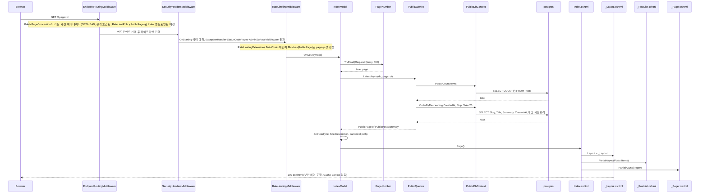
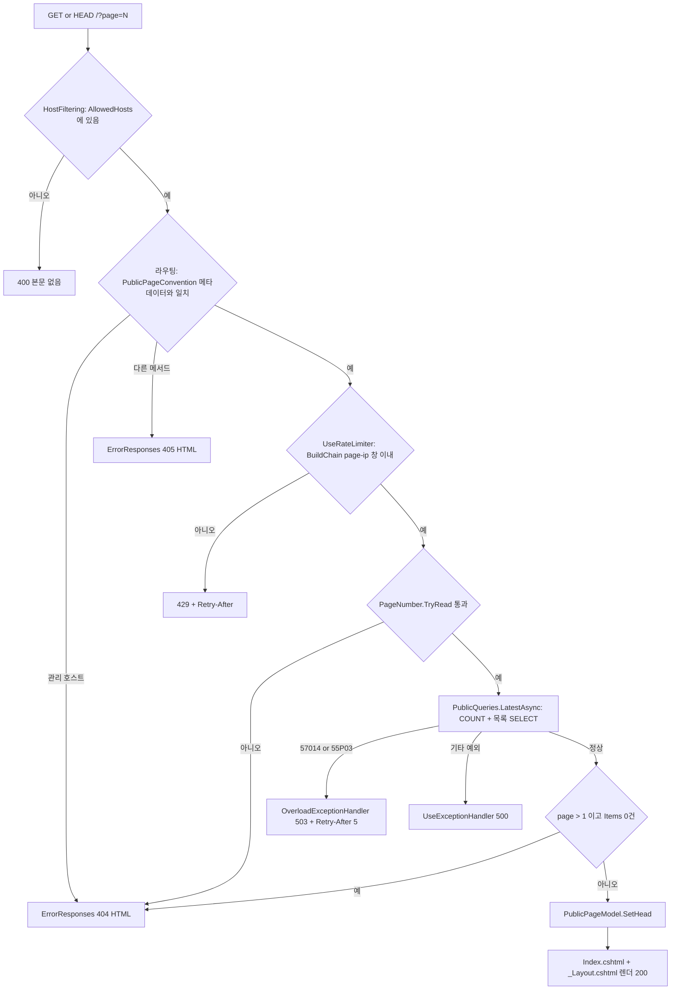

# F012 공개 홈(최신 글 목록)

<!-- doc-harness:section id="summary" hash="5893ffcfcbbf09f8e5a2623eb020e85373b1f0913ff60fca17c642fd9ce73839" -->
## 한 줄 요약

결론: F012는 요청마다 DB 문장 2개(COUNT + OFFSET/LIMIT SELECT)를 실행하는 무상태·무캐시 SSR 목록 페이지입니다. 입력은 `?page` 하나뿐이고, 기본 거부 방식으로 검증합니다(ASCII 숫자 1~4자리, 값 1개, 1..500). 실패 응답은 대부분 4xx·503으로 매핑됩니다. 형식 오류나 범위를 넘은 쪽은 404, statement_timeout은 503 + Retry-After, 속도 제한 초과는 429입니다. 예외는 예상하지 못한 DB 오류로, 이때는 500이 되며 본문 형식은 확인하지 못했습니다.

- `PublicPageConvention`은 **앱 시작 시 한 번만** 모든 Razor 페이지 엔드포인트에 메타데이터 세 가지를 겁니다: GET/HEAD 전용, 공개 호스트 전용, `RateLimitPolicy.PublicPage`. 요청 시점에 이 메타데이터를 읽어 집행하는 쪽은 프레임워크 라우팅과 `UseRateLimiter`(체인은 `RateLimitingExtensions.BuildChain`)입니다.
- 조회는 `PublicDbContext`로만 합니다. `default_transaction_read_only=on`·`statement_timeout`·NoTracking이 걸려 있고 SaveChanges는 금지됩니다. 운영 공개 롤에는 `PublicRoleGrants`가 Posts·Tags·PostTags 등의 SELECT를 부여합니다.
- 목록은 본문(ContentMarkdown)을 빼고 Slug·Title·Summary·CreatedAt·태그만 투영합니다.
- 홈 HTML 응답에는 Cache-Control이 없습니다. 레이아웃이 참조하는 자원은 따로 설정됩니다:
  - site.css: 3600초(UseStaticFiles)
  - highlight.css: 86400초(SiteEndpoints)
  - feed.xml: 300초(SiteEndpoints)
- 관찰된 잠재 문제 두 가지:
  - COUNT와 SELECT가 별도 문장이라, 그 사이에 쓰기가 일어나면 Total과 Items가 어긋날 수 있습니다.
  - 글이 10,000건을 넘으면 500쪽 상한 때문에 홈 페이저로는 도달할 수 없는 글이 생깁니다.

| 항목 | 값 |
|---|---|
| 중요도 | CORE |
| 상태 | ACTIVE |
| 진입점 | `Razor / (Pages/Index.cshtml, @page "/", GET/HEAD, ?page=1..500)` |
| 의존 기능 | [F019](../09_FEATURES.md#f019), [F020](../09_FEATURES.md#f020), [F021](../09_FEATURES.md#f021) |

### 진입점 근거

| 내용 | 상태 | 근거 |
|---|---|---|
| Razor 페이지 `/`가 진입점입니다. `Index.cshtml`의 `@page "/"`와 `IndexModel.OnGetAsync`로 처리하며, `app.MapRazorPages()`로 매핑됩니다. | CONFIRMED | `PortfolioBlog.Api/Pages/Index.cshtml` (1-5), `PortfolioBlog.Api/Pages/Index.cshtml.cs` IndexModel.OnGetAsync (49-56), `PortfolioBlog.Api/Program.cs` (123) |
| 쿼리 `?page=N`은 모델 바인딩이 아니라 `PageNumber.TryRead(Request.Query, 500, out page)`로 직접 읽습니다. Razor Pages에서 `page`가 예약 라우트 키이기 때문입니다. | CONFIRMED | `PortfolioBlog.Api/Pages/PageNumber.cs` PageNumber.TryRead (5,30-43), `PortfolioBlog.Api/Pages/Index.cshtml.cs` (51) |
| GET과 HEAD만 허용합니다(HEAD도 200). POST는 405, 관리 호스트로 온 요청은 404입니다. 테스트로 검증되어 있습니다. | CONFIRMED | `PortfolioBlog.Api/Pages/PublicPageConvention.cs` PublicPageConvention.Apply (32-41), `PortfolioBlog.Api.Tests/Features/PublicPagesTests.cs` Pages_AreReadOnly_AndBoundToThePublicHost (127-140) |
<!-- /doc-harness:section -->

<!-- doc-harness:section id="flow" hash="cb822d4aef3597b8dbfcb9f38ae859d1c596c3010298f60e00891659b4b5d243" -->
## 처리 흐름

| 단계 | 컴포넌트 | 코드 | 설명 |
|---|---|---|---|
| 1 | Program | `PortfolioBlog.Api/Program.cs` HostFilteringOptions / AddOptions<RazorPagesOptions> / AddBlogData | [기동 시] 세 가지를 설정합니다. ① HostFiltering의 AllowedHosts를 PublicOrigin·AdminOrigin 호스트로 제한합니다(IncludeFailureMessage=false). ② `PublicPageConvention(SiteOptions.HostOf(PublicOrigin))`을 Razor Pages 규약으로 등록합니다. ③ `AddBlogData`로 `PublicDbContext`를 등록합니다. |
| 2 | PublicPageConvention | `PortfolioBlog.Api/Pages/PublicPageConvention.cs` PublicPageConvention.Apply | [기동 시 1회] Index 페이지 선택자에 `HttpMethodMetadata([GET, HEAD])`, `HostAttribute(publicHost)`, `RateLimitMetadata(RateLimitPolicy.PublicPage)`를 추가합니다. ViewEnginePath가 /Search가 아니므로 정책은 PublicPage입니다. 클래스 주석대로 요청을 처리할 때는 이 클래스가 다시 실행되지 않습니다. |
| 3 | Program | `PortfolioBlog.Api/Program.cs` 미들웨어 파이프라인(98-108행) | [요청] 명시된 미들웨어 순서는 SecurityHeaders → TrustedForwardedHeaders → ExceptionHandler → StatusCodePages(ErrorResponses) → StaticFiles → AdminSurfaceMiddleware → RateLimiter → Authentication/Authorization → ApiBodyLimit → 엔드포인트입니다. `UseRouting`을 명시적으로 호출하지 않으므로, 엔드포인트 매칭은 WebApplication이 암묵적으로 넣는 라우팅이 파이프라인 앞쪽에서 수행하는 것으로 추론합니다. 이때 Step 2의 메타데이터로 메서드(405)와 호스트(404)를 가립니다. |
| 4 | SecurityHeadersMiddleware | `PortfolioBlog.Api/Infrastructure/Web/SecurityHeadersMiddleware.cs` SecurityHeadersMiddleware.InvokeAsync | 응답 직전(OnStarting)에 보안 헤더를 붙이도록 예약하고 다음 단계로 넘깁니다. 붙는 헤더는 nosniff, 스크립트 출처가 없는 CSP, Referrer-Policy 등이며 비개발 환경에서는 HSTS도 붙습니다. |
| 5 | AdminSurfaceMiddleware | `PortfolioBlog.Api/Infrastructure/Access/AdminSurfaceMiddleware.cs` AdminSurfaceMiddleware.InvokeAsync | 경로가 `/api`로 시작하지 않으므로 아무 검사 없이 `_next`로 통과시킵니다. Cache-Control no-store도 설정하지 않습니다. |
| 6 | RateLimitingExtensions | `PortfolioBlog.Api/Infrastructure/Web/RateLimitingExtensions.cs` BuildChain / Window / Matches | `UseRateLimiter`가 GlobalLimiter(`BuildChain` 체인)로 판정합니다. `Matches`는 `ctx.GetEndpoint()`의 `RateLimitMetadata`가 PublicPage인지 확인하고, 해당하면 IP별 1분 고정 창 `page-ip:{IP}`를 적용합니다(기본 `PagePerIpPerMinute`=120, 대기열 0). 초과하면 즉시 429를 반환하고 Retry-After(1~60초)를 붙입니다. |
| 7 | IndexModel | `PortfolioBlog.Api/Pages/Index.cshtml.cs` IndexModel.OnGetAsync | `PageNumber.TryRead(Request.Query, MaxPage=500, out page)`가 false면 `NotFound()`를 반환합니다. `page` 키가 없으면 1쪽입니다. |
| 8 | PageNumber | `PortfolioBlog.Api/Pages/PageNumber.cs` PageNumber.TryRead | 다음을 모두 검사합니다: 값이 정확히 1개, 빈 값이 아님, 길이 4 이하, 모든 문자가 ASCII '0'~'9'(전각 숫자 거부), `int.Parse(NumberStyles.None, InvariantCulture)` 결과가 1..max. |
| 9 | PublicQueries | `PortfolioBlog.Api/Infrastructure/Data/PublicQueries.cs` PublicQueries.LatestAsync → PageAsync | `PageAsync(db.Posts, page, ct)`로 필터 없이 전체 Posts를 대상으로 합니다. 가드 두 개(page ≥ 1, page ≤ int.MaxValue/20)를 통과하면 `CountAsync`를 1회 await합니다. |
| 10 | PublicQueries | `PortfolioBlog.Api/Infrastructure/Data/PublicQueries.cs` PublicQueries.PageAsync | `OrderByDescending(CreatedAt).ThenBy(Id).Skip((page-1)*20).Take(20)`으로 Slug·Title·Summary·CreatedAt와 태그 배열(NormalizedName 순, 서브쿼리 내장)을 투영해 `ToListAsync`를 1회 실행합니다. 메모리에서 `PublicPostSummary`/`PublicTag` record로 바꿔 `PublicPage<PublicPostSummary>(Items, page, total)`을 만듭니다. |
| 11 | PublicDbContext | `PortfolioBlog.Api/Infrastructure/Data/PublicDbContext.cs` PublicDbContext.BuildConnectionString | 두 문장 모두 공개 연결에서 실행됩니다. 연결에는 `-c statement_timeout={StatementTimeoutMs} -c default_transaction_read_only=on`과 ApplicationName=PortfolioBlog.Public이 걸리고 NoTracking입니다. `ConnectionStrings:Public`이 없으면 Default를 씁니다. |
| 12 | IndexModel | `PortfolioBlog.Api/Pages/Index.cshtml.cs` IndexModel.OnGetAsync | `page > 1`인데 `Posts.Items.Count == 0`이면 `NotFound()`를 반환합니다. 1쪽은 비어 있어도 200입니다. |
| 13 | PublicPageModel | `PortfolioBlog.Api/Pages/PublicPageModel.cs` PublicPageModel.SetHead | `SetHead(page==1 ? null : "{page}쪽", Site.Description, page==1 ? "/" : "/?page={page}")`를 호출합니다. 제목·설명(공백이면 null)·canonical(PublicOrigin+경로)·og:type=website를 담은 `PageHead`를 `ViewData["Head"]`에 넣습니다. |
| 14 | Index.cshtml | `PortfolioBlog.Api/Pages/Index.cshtml` Index.cshtml | `_ViewStart`로 `_Layout`을 적용합니다. h1 '최신 글' 아래에 `_PostList`(Model.Posts.Items)와 `_Pager`(Model.Pager)를 부분 렌더링합니다. |
| 15 | _Layout.cshtml | `PortfolioBlog.Api/Pages/Shared/_Layout.cshtml` _Layout.cshtml | `ViewData[HeadKey]`의 PageHead로 head를 출력합니다: title, description/og:description, canonical, og:*, Atom 링크(/feed.xml), CSS(/css/site.css, /css/highlight.css). 헤더 링크는 /search와 /feed.xml이고 스크립트는 없습니다. |
| 16 | _PostList.cshtml | `PortfolioBlog.Api/Pages/Shared/_PostList.cshtml` _PostList.cshtml | 0건이면 '글이 없습니다.'를 출력합니다. 그 밖에는 글마다 다음을 출력합니다: `/posts/{slug}` 링크, UTC 기준 `time[datetime]`(RFC3339)과 표시 날짜(yyyy-MM-dd), 비어 있지 않은 요약, `_TagList`(`/tags/{EscapeDataString}`). |
| 17 | PagerModel | `PortfolioBlog.Api/Pages/PagerModel.cs` IndexModel.Pager / PagerModel.Href | `new PagerModel("/", null, Posts.Page, Math.Min(Posts.LastPage, 500))`을 만듭니다. `_Pager`는 LastPage > 1일 때만 이전/다음 링크를 그립니다. 1쪽 링크는 `/`, 나머지는 `/?page=N`입니다. |
<!-- /doc-harness:section -->

<!-- doc-harness:section id="F012_SEQUENCE" hash="436584671f860e208ba5f5fff660b9452d477ac96cca49a745519897487cc2fa" -->
## 공개 홈 `/` 요청 처리 순서(정상 경로) (Sequence Diagram)

요청 시점에는 프레임워크 라우팅이 기동 시 걸린 메타데이터로 엔드포인트를 고르고, UseRateLimiter가 page-ip 창을 판정한 뒤 IndexModel이 PublicQueries로 DB 문장 2개를 실행해 Razor 뷰를 렌더링합니다.

`PublicPageConvention.Apply`는 앱 시작 때 라우트 모델을 구성하면서 한 번만 실행됩니다(클래스 remarks 11-12행). 그래서 요청 흐름에는 participant로 넣지 않고 Note로만 표시했습니다.

요청 흐름은 다음과 같습니다.
1. 요청 시점에 엔드포인트를 매칭하는 것은 프레임워크 라우팅(EndpointRoutingMiddleware)입니다. Program.cs가 `UseRouting`을 명시하지 않으므로 WebApplication이 암묵적으로 넣은 라우팅이 앞쪽에서 동작하는 것으로 추론했습니다.
2. `UseRateLimiter`가 추가한 RateLimitingMiddleware가 `BuildChain`으로 만든 GlobalLimiter를 호출합니다. 이 리미터가 `ctx.GetEndpoint()` 메타데이터를 읽어 page-ip 창을 적용합니다.
3. `IndexModel`은 `PageNumber.TryRead`로 쪽 번호를 검증합니다.
4. `PublicQueries.PageAsync`가 COUNT와 목록 SELECT를 순서대로 await합니다. 두 문장 모두 `PublicDbContext`의 읽기 전용·statement_timeout 연결로 실행됩니다.
5. `SetHead` 뒤에 `Index.cshtml`이 `_Layout`·`_PostList`·`_Pager`를 조합해 HTML을 만듭니다.

### 코드 근거

| 구성 요소 | 코드 |
|---|---|
| EndpointRoutingMiddleware | `PortfolioBlog.Api/Pages/PublicPageConvention.cs` (PublicPageConvention.Apply (라우팅이 읽는 메타데이터)) |
| SecurityHeadersMiddleware | `PortfolioBlog.Api/Infrastructure/Web/SecurityHeadersMiddleware.cs` (SecurityHeadersMiddleware.InvokeAsync) |
| RateLimitingMiddleware | `PortfolioBlog.Api/Infrastructure/Web/RateLimitingExtensions.cs` (AddAppRateLimiting / BuildChain / Matches) |
| IndexModel | `PortfolioBlog.Api/Pages/Index.cshtml.cs` (IndexModel.OnGetAsync) |
| PageNumber | `PortfolioBlog.Api/Pages/PageNumber.cs` (PageNumber.TryRead) |
| PublicQueries | `PortfolioBlog.Api/Infrastructure/Data/PublicQueries.cs` (PublicQueries.LatestAsync / PageAsync) |
| PublicDbContext | `PortfolioBlog.Api/Infrastructure/Data/PublicDbContext.cs` (PublicDbContext.BuildConnectionString) |
| Index.cshtml | `PortfolioBlog.Api/Pages/Index.cshtml` |
| _Layout.cshtml | `PortfolioBlog.Api/Pages/Shared/_Layout.cshtml` |
| _PostList.cshtml | `PortfolioBlog.Api/Pages/Shared/_PostList.cshtml` |
| _Pager.cshtml | `PortfolioBlog.Api/Pages/Shared/_Pager.cshtml` |
<!-- /doc-harness:section -->

<!-- doc-harness:section id="F012_FLOW" hash="ace7e5e51744b97e9e78f0d2f832a54cd71ced541fff3e6b5309a5e4af407afa" -->
## 공개 홈 `/` 분기와 실패 경로 (Flowchart)

`/` 요청은 호스트 필터 → 라우팅 메타데이터 → page-ip 속도 제한 → 쪽 번호 검증 → DB 조회 → 마지막 쪽 초과 검사를 차례로 거칩니다. 실패는 400/404/405/429/503/500으로 갈립니다.

각 분기의 처리는 다음과 같습니다.
- 호스트 필터(Program.cs 34-42): AllowedHosts에 없는 Host는 앱 미들웨어보다 바깥에서 본문 없는 400이 됩니다.
- 라우팅: 기동 시 `PublicPageConvention`이 건 `HostAttribute`·`HttpMethodMetadata`로 판정합니다. 관리 호스트는 404, 다른 메서드는 405입니다(테스트 127-140).
- 속도 제한: `UseRateLimiter`가 `BuildChain`의 page-ip 창(기본 120/분, 대기열 0)을 넘으면 429 + Retry-After입니다.
- 쪽 번호: `PageNumber.TryRead`는 값 1개, ASCII 숫자 1~4자리, 1..500만 통과시킵니다.
- DB 오류: 57014·55P03은 `OverloadExceptionHandler`가 503 + Retry-After 5로 바꿉니다. 그 밖의 예외는 처리 코드가 없어 500이 됩니다(본문 형식 미확인).
- 마지막 쪽 초과: 쿼리를 모두 실행한 뒤 page > 1이고 Items가 0건이면 404입니다.
- 404·405·429·503 본문은 `ErrorResponses.WriteAsync`의 고정 HTML입니다.

### 코드 근거

| 구성 요소 | 코드 |
|---|---|
| HostAllowed | `PortfolioBlog.Api/Program.cs` (HostFilteringOptions) |
| RouteMatch | `PortfolioBlog.Api/Pages/PublicPageConvention.cs` (PublicPageConvention.Apply) |
| RateOk | `PortfolioBlog.Api/Infrastructure/Web/RateLimitingExtensions.cs` (BuildChain) |
| TryReadOk | `PortfolioBlog.Api/Pages/PageNumber.cs` (PageNumber.TryRead) |
| Latest | `PortfolioBlog.Api/Infrastructure/Data/PublicQueries.cs` (PublicQueries.LatestAsync) |
| Overload | `PortfolioBlog.Api/Infrastructure/Web/OverloadExceptionHandler.cs` (OverloadExceptionHandler.TryHandleAsync) |
| ServerError | `PortfolioBlog.Api/Program.cs` (app.UseExceptionHandler) |
| BeyondLast | `PortfolioBlog.Api/Pages/Index.cshtml.cs` (IndexModel.OnGetAsync) |
| NotFoundHtml | `PortfolioBlog.Api/Infrastructure/Web/ErrorResponses.cs` (ErrorResponses.WriteAsync) |
| SetHead | `PortfolioBlog.Api/Pages/PublicPageModel.cs` (PublicPageModel.SetHead) |
| Render | `PortfolioBlog.Api/Pages/Index.cshtml` |
<!-- /doc-harness:section -->

<!-- doc-harness:section id="data" hash="43b4a2f604ab00b7f760cf64eaced2f966a32666d14abcf7d04543c505494863" -->
## 데이터

### 데이터 흐름

| 내용 | 상태 | 근거 |
|---|---|---|
| 입력은 쿼리 문자열의 `page` 하나뿐입니다. `PageNumber.TryRead`가 이 문자열을 int로 바꾸며, 다른 쿼리 키는 읽지 않고 무시합니다. | CONFIRMED | `PortfolioBlog.Api/Pages/PageNumber.cs` (30-43), `PortfolioBlog.Api/Pages/Index.cshtml.cs` (51) |
| DB에서 익명 형식(Slug, Title, Summary, CreatedAt, Tags[{Name, NormalizedName}])으로 투영하고, 메모리에서 `PublicPostSummary`·`PublicTag` record로 바꿔 `PublicPage<PublicPostSummary>(Items, Page, Total)`을 만듭니다. 본문 ContentMarkdown은 조회하지 않습니다. | CONFIRMED | `PortfolioBlog.Api/Infrastructure/Data/PublicQueries.cs` PublicQueries.PageAsync (250-261), `PortfolioBlog.Api/Infrastructure/Data/PublicModels.cs` (6-24) |
| `PublicPage.LastPage`는 `Math.Max(1, ceil(Total/20))`입니다. `IndexModel.Pager`가 이 값을 500으로 잘라 `PagerModel`에 넘깁니다. | CONFIRMED | `PortfolioBlog.Api/Infrastructure/Data/PublicModels.cs` (23), `PortfolioBlog.Api/Pages/Index.cshtml.cs` (36) |
| 머리 정보 흐름: `SiteOptions`(Title, Description, PublicOrigin) → `PageHead`(Title, SiteTitle, Description, CanonicalUrl, OgType, OgImageUrl=null, NoIndex=false) → `ViewData["Head"]` → `_Layout` head 태그. 절대 URL은 요청 Host가 아니라 `Site:PublicOrigin`으로 만듭니다. | CONFIRMED | `PortfolioBlog.Api/Pages/PublicPageModel.cs` (39-43), `PortfolioBlog.Api/Pages/Shared/_Layout.cshtml` (1-31) |
| 출력은 서버에서 렌더링한 HTML뿐입니다. 제목·요약·태그명은 Razor `@` 표현식으로 HTML 인코딩됩니다. 글 링크는 `/posts/{slug}`, 태그 링크는 `/tags/{Uri.EscapeDataString}`이고, 날짜는 UTC 기준으로 서식화합니다. | CONFIRMED | `PortfolioBlog.Api/Pages/Shared/_PostList.cshtml` (9-19), `PortfolioBlog.Api/Pages/Shared/_TagList.cshtml` (5-17), `PortfolioBlog.Api/Infrastructure/Web/PublicUrls.cs` (26,52-53), `PortfolioBlog.Api/Infrastructure/Web/PublicFormat.cs` (27,40) |
| 캐시: 이 기능은 목록 결과를 메모리에 두지 않고, 홈 HTML 응답에 Cache-Control도 설정하지 않습니다. 따라서 요청마다 DB 문장 2개가 실행됩니다. `/` 경로는 `/api`가 아니므로 AdminSurfaceMiddleware의 `no-store`도 붙지 않습니다. 레이아웃이 참조하는 자원의 캐시 헤더는 각자 따로 설정됩니다: `/css/site.css`는 `UseStaticFiles`의 OnPrepareResponse로 `public, max-age=3600`, `/css/highlight.css`는 SiteEndpoints가 `public, max-age=86400`, `/feed.xml`·`/sitemap.xml`은 SiteEndpoints가 `public, max-age=300`입니다. | CONFIRMED | `PortfolioBlog.Api/Pages/Index.cshtml.cs` (49-56), `PortfolioBlog.Api/Program.cs` (103), `PortfolioBlog.Api/Pages/SiteEndpoints.cs` MapPublicSiteEndpoints (highlight.css) (66-72), `PortfolioBlog.Api/Pages/SiteEndpoints.cs` FeedAsync / SitemapAsync (141,179), `PortfolioBlog.Api/Infrastructure/Access/AdminSurfaceMiddleware.cs` (70-75) |
| 비동기 처리: `OnGetAsync`가 COUNT와 목록 SELECT를 순서대로 await하고, 요청 CancellationToken을 끝까지 넘깁니다. 병렬 실행은 없습니다. | CONFIRMED | `PortfolioBlog.Api/Infrastructure/Data/PublicQueries.cs` (250-258), `PortfolioBlog.Api/Pages/Index.cshtml.cs` (49-52) |

### DB 접근

| 엔티티 | 작업 | 코드 |
|---|---|---|
| Posts | SELECT | `PortfolioBlog.Api/Infrastructure/Data/PublicQueries.cs` PublicQueries.PageAsync (query.CountAsync) |
| Posts | SELECT | `PortfolioBlog.Api/Infrastructure/Data/PublicQueries.cs` PublicQueries.PageAsync (OrderByDescending CreatedAt, ThenBy Id, Skip/Take 20, ToListAsync) |
| PostTags | SELECT | `PortfolioBlog.Api/Infrastructure/Data/PublicQueries.cs` PublicQueries.PageAsync (p.PostTags 서브쿼리 투영) |
| Tags | SELECT | `PortfolioBlog.Api/Infrastructure/Data/PublicQueries.cs` PublicQueries.PageAsync (pt.Tag.Name, pt.Tag.NormalizedName) |

### 상태 전이

_(상태 없음)_

### 외부 의존

| 내용 | 상태 | 근거 |
|---|---|---|
| PostgreSQL을 Npgsql + EF Core로 씁니다. 공개 연결은 `ConnectionStrings:Public`(없으면 Default)이며, 시작 옵션으로 statement_timeout과 default_transaction_read_only=on을 겁니다. | CONFIRMED | `PortfolioBlog.Api/Infrastructure/Data/DataServiceCollectionExtensions.cs` (33-36,47,58), `PortfolioBlog.Api/Infrastructure/Data/PublicDbContext.cs` (46-61) |
| ASP.NET Core 프레임워크 기능에 의존합니다: Razor Pages, 엔드포인트 라우팅(HttpMethodMetadata·HostAttribute), System.Threading.RateLimiting(PartitionedRateLimiter). | CONFIRMED | `PortfolioBlog.Api/Pages/PublicPageConvention.cs` (37-39), `PortfolioBlog.Api/Infrastructure/Web/RateLimitingExtensions.cs` (144-150) |
| 운영에서 `ConnectionStrings:Public`을 설정하면 앱 기동 시 `PublicRoleGrants.Apply`가 공개 롤에 권한을 부여합니다. 대상은 `ReadableTables`(Posts, Series, Tags, PostTags, Attachments)의 SELECT와 schema USAGE입니다(F021). 이 기능이 읽는 Posts·PostTags·Tags는 모두 이 목록에 들어 있습니다. | CONFIRMED | `PortfolioBlog.Api/Program.cs` (84-87), `PortfolioBlog.Api/Infrastructure/Data/PublicRoleGrants.cs` PublicRoleGrants.ReadableTables (21,86-93) |
| 레이아웃이 참조하는 자원 중 `/css/highlight.css`·`/feed.xml`은 SiteEndpoints(F017)가 제공하고, `/css/site.css`는 wwwroot 정적 파일입니다. 페이지 HTML 자체는 이들이 없어도 렌더링됩니다. | CONFIRMED | `PortfolioBlog.Api/Pages/Shared/_Layout.cshtml` (20,29-30), `PortfolioBlog.Api/Pages/SiteEndpoints.cs` (62-82), `PortfolioBlog.Api/Program.cs` (103,124) |
<!-- /doc-harness:section -->

<!-- doc-harness:section id="failures" hash="02b301bbea0c888113cefc12ffc5c7b2d10cfdb00bde9857ea481af3d07729ae" -->
## 실패 지점

| 위치 | 조건 | 처리 | 상태 | 근거 |
|---|---|---|---|---|
| PageNumber.TryRead (IndexModel.OnGetAsync 51행) | `page` 값이 여러 개, 빈 값, 5자리 이상, ASCII 숫자가 아닌 문자(부호·소수점·공백·전각 숫자) 포함, 0, 500 초과 중 하나에 해당 | `NotFound()`를 반환하고, `UseStatusCodePages`의 `ErrorResponses.WriteAsync`가 고정 HTML 404 본문을 씁니다. 요청 값은 본문에 반사하지 않으며, 쪽 번호를 보정하지도 않습니다. | CONFIRMED | `PortfolioBlog.Api/Pages/PageNumber.cs` (30-43), `PortfolioBlog.Api/Infrastructure/Web/ErrorResponses.cs` (45-76), `PortfolioBlog.Api.Tests/Features/PublicPagesTests.cs` (50-54) |
| IndexModel.OnGetAsync 53행 | 형식은 유효하지만 마지막 쪽을 넘는 쪽(page > 1이고 Items 0건). 예: 글 21개일 때 `/?page=3` | COUNT와 목록 SELECT를 모두 실행한 뒤 `NotFound()`를 반환하고 고정 HTML 404를 씁니다. | CONFIRMED | `PortfolioBlog.Api/Pages/Index.cshtml.cs` (53), `PortfolioBlog.Api.Tests/Features/PublicPagesTests.cs` (50) |
| PublicQueries.PageAsync 가드(241, 249행) | page < 1 또는 page > int.MaxValue/20 | `ArgumentOutOfRangeException`을 던집니다. Index 경로에서는 TryRead가 1..500으로 제한하므로 도달하지 않습니다. 만약 도달하면 처리 없이 전파되어 500이 됩니다. | CONFIRMED | `PortfolioBlog.Api/Infrastructure/Data/PublicQueries.cs` (239-249) |
| PublicQueries.PageAsync의 CountAsync / ToListAsync | PostgreSQL statement_timeout 초과(SqlState 57014) 또는 잠금 대기 초과(55P03) | `OverloadExceptionHandler.IsOverload`가 InnerException 체인을 따라가며 판정합니다. 과부하로 판정되면 503과 `Retry-After: 5`를 설정하고 `ErrorResponses.WriteAsync`로 고정 HTML을 씁니다. 서버는 재시도하지 않고 클라이언트에 맡깁니다. | CONFIRMED | `PortfolioBlog.Api/Infrastructure/Web/OverloadExceptionHandler.cs` (35-42,63-70), `PortfolioBlog.Api/Program.cs` (43,100) |
| PublicQueries.PageAsync의 DB 접근 | 57014/55P03이 아닌 Npgsql·EF 예외. 예: DB 연결 실패, 공개 롤 GRANT 누락으로 인한 권한 부족 | 처리 없음(예외 전파). `UseExceptionHandler()`의 기본 처리로 500이 됩니다. `AddProblemDetails()`가 등록돼 있고 `UseExceptionHandler`가 `UseStatusCodePages`보다 바깥에 있으므로, 본문은 고정 HTML이 아니라 ProblemDetails일 가능성이 있습니다(미확인). | POTENTIAL_ISSUE | `PortfolioBlog.Api/Program.cs` (47,100-101), `PortfolioBlog.Api/Infrastructure/Web/OverloadExceptionHandler.cs` (37) |
| RateLimitingExtensions.BuildChain의 page-ip 창(UseRateLimiter) | 같은 IP에서 1분 안에 공개 페이지 요청이 PagePerIpPerMinute(기본 120)를 넘은 경우. 검색 요청도 같은 page-ip 창을 소모합니다. | 대기열이 0이라 즉시 429를 반환하고, OnRejected가 Retry-After(창이 끝날 때까지 1~60초)를 설정합니다. 본문은 UseStatusCodePages가 고정 HTML '요청이 너무 많습니다'로 채울 것으로 추론합니다. | INFERRED | `PortfolioBlog.Api/Infrastructure/Web/RateLimitingExtensions.cs` (47-52,69-72,100), `PortfolioBlog.Api/Infrastructure/Web/PublicOptions.cs` (18), `PortfolioBlog.Api/Program.cs` (101,105) |
| 엔드포인트 라우팅(PublicPageConvention이 기동 시 건 메타데이터) | GET/HEAD가 아닌 메서드, 또는 관리 호스트로 들어온 `/` 요청 | POST 등은 405, 관리 호스트는 404입니다. 테스트로 확인됐습니다. | CONFIRMED | `PortfolioBlog.Api/Pages/PublicPageConvention.cs` (16-18,32-41), `PortfolioBlog.Api.Tests/Features/PublicPagesTests.cs` (127-140) |
| HostFiltering(Program 34-42행) | Host 헤더가 AllowedHosts(Public/Admin origin의 호스트)에 없는 경우 | 프레임워크 HostFiltering이 본문 없는 400을 반환합니다(IncludeFailureMessage=false). 앱 미들웨어보다 바깥에서 처리되므로 보안 헤더는 붙지 않습니다. | CONFIRMED | `PortfolioBlog.Api/Program.cs` (34-42,93-97) |
| IndexModel.OnGetAsync의 await 지점 | 클라이언트 연결이 끊겨 요청 CancellationToken이 취소된 경우 | ct를 CountAsync/ToListAsync에 넘기므로 OperationCanceledException으로 중단됩니다. 이 기능 코드에는 별도 처리가 없고 프레임워크 예외 처리에 맡깁니다. | INFERRED | `PortfolioBlog.Api/Pages/Index.cshtml.cs` (49-52), `PortfolioBlog.Api/Infrastructure/Data/PublicQueries.cs` (250-258) |
| PublicDbContext 해석 시 BuildConnectionString | 연결 문자열에 이미 `Options`가 들어 있는 경우 | `InvalidOperationException`을 던집니다(메시지에 연결 문자열 값은 넣지 않음). `StartupValidation`이 기동 시 같은 조건을 먼저 검사하므로 요청 시점에는 도달하지 않는 것으로 보입니다. | INFERRED | `PortfolioBlog.Api/Infrastructure/Data/PublicDbContext.cs` (46-55), `PortfolioBlog.Api/Infrastructure/Access/StartupValidation.cs` (31,142-159) |

### 엣지 케이스

| 내용 | 상태 | 근거 |
|---|---|---|
| 글이 0건이어도 1쪽은 404가 아니라 200입니다. `_PostList`가 '글이 없습니다.'를 출력하고, LastPage=1이라 `_Pager`는 아무것도 그리지 않습니다. | CONFIRMED | `PortfolioBlog.Api/Pages/Index.cshtml.cs` (53), `PortfolioBlog.Api/Pages/Shared/_PostList.cshtml` (2-5), `PortfolioBlog.Api/Pages/Shared/_Pager.cshtml` (2) |
| 마지막 쪽을 넘는 쪽(예: `/?page=499`)도 COUNT와 OFFSET 9960 SELECT를 모두 실행한 뒤에야 404가 됩니다. 이 비용의 상한은 page-ip 속도 제한과 statement_timeout뿐입니다. | CONFIRMED | `PortfolioBlog.Api/Pages/Index.cshtml.cs` (51-53), `PortfolioBlog.Api/Infrastructure/Data/PublicQueries.cs` (250-252) |
| COUNT와 목록 SELECT는 트랜잭션으로 묶이지 않은 별도 문장입니다. 그 사이에 글이 생성·삭제되면 Total(페이저의 LastPage)과 Items가 어긋날 수 있습니다. 예: 다음 링크가 보이지만 그 쪽은 404. | POTENTIAL_ISSUE | `PortfolioBlog.Api/Infrastructure/Data/PublicQueries.cs` (250-261) |
| statement_timeout은 문장 하나의 상한이고 LatestAsync는 문장 2개를 순서대로 실행합니다. 따라서 요청 하나가 DB에서 쓸 수 있는 시간은 최대 약 2배입니다. | INFERRED | `PortfolioBlog.Api/Infrastructure/Data/PublicQueries.cs` (12,250-258) |
| 쪽 번호 상한이 500이고 쪽당 20건이라, 글이 10,000건을 넘으면 오래된 글은 홈 페이저로 도달할 수 없습니다. `Pager`의 LastPage도 500에서 잘립니다. | POTENTIAL_ISSUE | `PortfolioBlog.Api/Pages/Index.cshtml.cs` (21-22,36), `PortfolioBlog.Api/Infrastructure/Data/PublicQueries.cs` (20) |
| canonical 정규화: `?page=007`은 7쪽으로 읽혀 canonical이 `/?page=7`이 됩니다. `?page=1`·`?page=0001`은 canonical이 `/`이고, 1쪽 제목에는 'N쪽'이 붙지 않습니다. | CONFIRMED | `PortfolioBlog.Api/Pages/Index.cshtml.cs` (54), `PortfolioBlog.Api/Pages/PageNumber.cs` (36-41) |
| `page` 외의 쿼리 키(`?q=x`, `?utm=...` 등)는 무시되고 200입니다. 홈 PagerModel의 Query가 null이라 이런 키는 페이저 링크에도 실리지 않습니다. | CONFIRMED | `PortfolioBlog.Api/Pages/PageNumber.cs` (33), `PortfolioBlog.Api/Pages/Index.cshtml.cs` (36), `PortfolioBlog.Api/Pages/PagerModel.cs` (21-25) |
| HEAD 요청은 OnGetAsync로 처리되어 200입니다(DB 조회도 GET과 똑같이 수행). HEAD로 오류 쪽을 요청하면 ErrorResponses가 Content-Type만 설정하고 본문은 쓰지 않습니다. | CONFIRMED | `PortfolioBlog.Api.Tests/Features/PublicPagesTests.cs` (134-135), `PortfolioBlog.Api/Infrastructure/Web/ErrorResponses.cs` (53-54) |
| 정규화 이름이 정확히 `.` 또는 `..`인 태그는 링크(`a`)가 아니라 `span`으로 렌더링됩니다. | CONFIRMED | `PortfolioBlog.Api/Infrastructure/Web/PublicUrls.cs` (52-53), `PortfolioBlog.Api/Pages/Shared/_TagList.cshtml` (7-16) |
| 요약이 빈 문자열이면 `p.post-summary`를 출력하지 않습니다. `Site:Description`이 공백이면 meta description·og:description을 생략합니다. | CONFIRMED | `PortfolioBlog.Api/Pages/Shared/_PostList.cshtml` (14-17), `PortfolioBlog.Api/Pages/PublicPageModel.cs` (42), `PortfolioBlog.Api/Pages/Shared/_Layout.cshtml` (10-14) |
| 날짜를 UTC 기준(yyyy-MM-dd)으로 표시하므로, KST 자정 전후에 쓴 글은 표시 날짜가 로컬 날짜와 하루 다를 수 있습니다. | CONFIRMED | `PortfolioBlog.Api/Infrastructure/Web/PublicFormat.cs` (27,40) |
| CreatedAt이 같으면 Id 오름차순으로 정렬하므로 쪽 경계가 결정적입니다. LatestAsync에는 Where가 없어 저장된 모든 글이 목록에 나옵니다. | CONFIRMED | `PortfolioBlog.Api/Infrastructure/Data/PublicQueries.cs` (44-45,251) |
| XSS 방어: 제목·요약·태그명은 Razor 기본 HTML 인코딩으로 출력되고, CSP에 스크립트 출처가 없습니다. 다만 목록 쪽 자체의 인코딩 테스트는 없고, 인코딩 검증은 글 상세 테스트에만 있습니다. | INFERRED | `PortfolioBlog.Api/Pages/Shared/_PostList.cshtml` (12-16), `PortfolioBlog.Api/Infrastructure/Web/SecurityHeadersMiddleware.cs` (42-52), `PortfolioBlog.Api.Tests/Features/PublicPagesTests.cs` (57-91) |

### 로깅

| 내용 | 상태 | 근거 |
|---|---|---|
| `IndexModel`·`PublicQueries`·`PageNumber`·`PagerModel`에는 명시적 로깅(ILogger 사용)이 없습니다. | CONFIRMED | `PortfolioBlog.Api/Pages/Index.cshtml.cs` (19-57), `PortfolioBlog.Api/Infrastructure/Data/PublicQueries.cs` (17-263) |
| 공개 연결은 `ApplicationName=PortfolioBlog.Public`으로 접속하므로, DB 쪽(pg_stat_activity, 로그)에서 공개 조회를 관리 연결과 구분할 수 있습니다. | CONFIRMED | `PortfolioBlog.Api/Infrastructure/Data/PublicDbContext.cs` (60) |
| 처리되지 않은 예외(503으로 매핑되는 과부하 예외 포함)와 EF Core SQL 명령의 로그는 프레임워크 기본 로깅에 맡깁니다. 로그 수준은 코드에서 설정하지 않습니다. | INFERRED | `PortfolioBlog.Api/Program.cs` (43,100) |
<!-- /doc-harness:section -->

<!-- doc-harness:section id="code" hash="54288d0d9c5ceb4a1cc49d3ddf8042413664d8bdc4785c9d5a55c56632508853" -->
## 관련 코드

| 파일 | 심볼 | 역할 |
|---|---|---|
| `PortfolioBlog.Api/Pages/Index.cshtml` | Index.cshtml | render |
| `PortfolioBlog.Api/Pages/Index.cshtml.cs` | IndexModel.OnGetAsync / IndexModel.Pager / IndexModel.MaxPage | entry |
| `PortfolioBlog.Api/Pages/PublicPageModel.cs` | PublicPageModel.SetHead | service |
| `PortfolioBlog.Api/Pages/PageHead.cs` | PageHead | dto |
| `PortfolioBlog.Api/Pages/PublicPageConvention.cs` | PublicPageConvention.Apply | config |
| `PortfolioBlog.Api/Pages/PageNumber.cs` | PageNumber.TryRead | validation |
| `PortfolioBlog.Api/Pages/PagerModel.cs` | PagerModel.Href | dto |
| `PortfolioBlog.Api/Pages/_ViewStart.cshtml` | - | render |
| `PortfolioBlog.Api/Pages/_ViewImports.cshtml` | - | render |
| `PortfolioBlog.Api/Pages/Shared/_Layout.cshtml` | - | render |
| `PortfolioBlog.Api/Pages/Shared/_PostList.cshtml` | - | render |
| `PortfolioBlog.Api/Pages/Shared/_TagList.cshtml` | - | render |
| `PortfolioBlog.Api/Pages/Shared/_Pager.cshtml` | - | render |
| `PortfolioBlog.Api/Infrastructure/Data/PublicQueries.cs` | PublicQueries.LatestAsync / PublicQueries.PageAsync | data |
| `PortfolioBlog.Api/Infrastructure/Data/PublicModels.cs` | PublicPage<T> / PublicPostSummary / PublicTag | dto |
| `PortfolioBlog.Api/Infrastructure/Data/PublicDbContext.cs` | PublicDbContext.BuildConnectionString / SaveChanges | data |
| `PortfolioBlog.Api/Infrastructure/Data/DataServiceCollectionExtensions.cs` | DataServiceCollectionExtensions.AddBlogData | config |
| `PortfolioBlog.Api/Infrastructure/Data/PublicRoleGrants.cs` | PublicRoleGrants.ReadableTables | config |
| `PortfolioBlog.Api/Infrastructure/Data/AppDbContext.cs` | AppDbContext.OnModelCreating (Posts 모델) | data |
| `PortfolioBlog.Api/Domain/Post.cs` | Post | data |
| `PortfolioBlog.Api/Infrastructure/Web/PublicUrls.cs` | PublicUrls.Post / PublicUrls.Tag | render |
| `PortfolioBlog.Api/Infrastructure/Web/PublicFormat.cs` | PublicFormat.Rfc3339 / PublicFormat.DisplayDate | render |
| `PortfolioBlog.Api/Infrastructure/Web/ErrorResponses.cs` | ErrorResponses.WriteAsync | render |
| `PortfolioBlog.Api/Infrastructure/Web/OverloadExceptionHandler.cs` | OverloadExceptionHandler.TryHandleAsync / IsOverload | service |
| `PortfolioBlog.Api/Infrastructure/Web/RateLimitingExtensions.cs` | RateLimitingExtensions.BuildChain / Matches | config |
| `PortfolioBlog.Api/Infrastructure/Web/SecurityHeadersMiddleware.cs` | SecurityHeadersMiddleware.InvokeAsync | config |
| `PortfolioBlog.Api/Infrastructure/Access/AdminSurfaceMiddleware.cs` | AdminSurfaceMiddleware.InvokeAsync (/api 외 통과) | config |
| `PortfolioBlog.Api/Infrastructure/Web/PublicOptions.cs` | PublicOptions.PagePerIpPerMinute / StatementTimeoutMs | config |
| `PortfolioBlog.Api/Infrastructure/Access/SiteOptions.cs` | SiteOptions (Title/Description/PublicOrigin) | config |
| `PortfolioBlog.Api/Pages/SiteEndpoints.cs` | MapPublicSiteEndpoints (레이아웃이 참조하는 highlight.css·feed.xml 제공) | config |
| `PortfolioBlog.Api/Program.cs` | - | config |
| `PortfolioBlog.Api.Tests/Features/PublicPagesTests.cs` | Index_ListsNewestFirst_Paginates_AndRejectsBadPages / Pages_AreReadOnly_AndBoundToThePublicHost | test |
| `PortfolioBlog.Api.Tests/Infrastructure/PageNumberTests.cs` | - | test |
| `PortfolioBlog.Api.Tests/Infrastructure/PublicQueriesTests.cs` | - | test |

근거: `PortfolioBlog.Api/Pages/Index.cshtml` (1-5), `PortfolioBlog.Api/Pages/Index.cshtml.cs` IndexModel (19-56), `PortfolioBlog.Api/Pages/PageNumber.cs` PageNumber.TryRead (30-43), `PortfolioBlog.Api/Pages/PublicPageModel.cs` PublicPageModel.SetHead (39-43), `PortfolioBlog.Api/Pages/PublicPageConvention.cs` PublicPageConvention.Apply (11-12,32-41), `PortfolioBlog.Api/Pages/PagerModel.cs` PagerModel.Href (8-25), `PortfolioBlog.Api/Infrastructure/Data/PublicQueries.cs` PublicQueries.LatestAsync / PageAsync (44-45,239-262), `PortfolioBlog.Api/Infrastructure/Data/PublicModels.cs` PublicPage<T> (14-24), `PortfolioBlog.Api/Infrastructure/Data/PublicDbContext.cs` PublicDbContext.BuildConnectionString (46-61,76-95), `PortfolioBlog.Api/Infrastructure/Data/DataServiceCollectionExtensions.cs` AddBlogData (33-36), `PortfolioBlog.Api/Infrastructure/Data/PublicRoleGrants.cs` PublicRoleGrants.ReadableTables (21,86-93), `PortfolioBlog.Api/Program.cs` (34-43,55,68-71,84-87,98-108,123-124), `PortfolioBlog.Api/Pages/SiteEndpoints.cs` MapPublicSiteEndpoints (66-72,141,179), `PortfolioBlog.Api/Infrastructure/Access/AdminSurfaceMiddleware.cs` AdminSurfaceMiddleware.InvokeAsync (67-96), `PortfolioBlog.Api/Infrastructure/Web/ErrorResponses.cs` ErrorResponses.WriteAsync (45-76), `PortfolioBlog.Api/Infrastructure/Web/OverloadExceptionHandler.cs` OverloadExceptionHandler (35-70), `PortfolioBlog.Api/Infrastructure/Web/RateLimitingExtensions.cs` BuildChain / Matches (88-101,128-129), `PortfolioBlog.Api.Tests/Features/PublicPagesTests.cs` Index_ListsNewestFirst_Paginates_AndRejectsBadPages (31-55)
<!-- /doc-harness:section -->

<!-- doc-harness:section id="unknowns" hash="3c6d59893b46f1e10e225a190a38b7a8eebc7819a6f9038d7e2809d08477bf27" -->
## 확인하지 못한 것

- `/`에서 과부하가 아닌 예외(DB 연결 실패, 공개 롤 권한 부족 등)가 났을 때 500 응답의 본문 형식. `AddProblemDetails()`가 등록돼 있고 `UseExceptionHandler()`가 `UseStatusCodePages`보다 바깥이라 고정 HTML이 아니라 ProblemDetails일 수 있지만, 실제 결과는 확인하지 못했습니다.
- WebApplication이 암묵적으로 추가하는 라우팅(UseRouting)의 파이프라인 내 정확한 위치. Program.cs에는 `UseRouting` 호출이 없고, `RateLimitingExtensions.Matches`가 `ctx.GetEndpoint()`에 의존하므로 속도 제한보다 앞에서 매칭된다고 추론만 했습니다.
- `OperationCanceledException`(클라이언트 연결 중단)이 났을 때의 최종 응답 코드와 로그 수준. 프레임워크 동작에 맡겨져 있습니다.
- COUNT(*)와 OFFSET 쿼리의 실제 실행 계획. `(CreatedAt DESC, Id)` 인덱스를 실제로 쓰는지, 행 수가 커질 때 비용이 어떻게 되는지 측정 근거를 찾지 못했습니다.
- 운영 환경에 설정된 `Public:PagePerIpPerMinute`·`Public:StatementTimeoutMs` 값. 코드 기본값(PagePerIpPerMinute=120)만 확인했고 설정 파일 값은 확인하지 않았습니다.
<!-- /doc-harness:section -->

<!-- doc-harness:section id="related" hash="e6b04ee08cc1bd1a2625cbb81ca24992b9da0467258ba6539a8ab5b4aeff04d8" -->
## 관련 문서

- [../09_FEATURES](../09_FEATURES.md)
- [../08_API](../08_API.md)
- [../07_DATA_MODEL](../07_DATA_MODEL.md)
- [../11_FAILURE_HISTORY](../11_FAILURE_HISTORY.md)
<!-- /doc-harness:section -->
