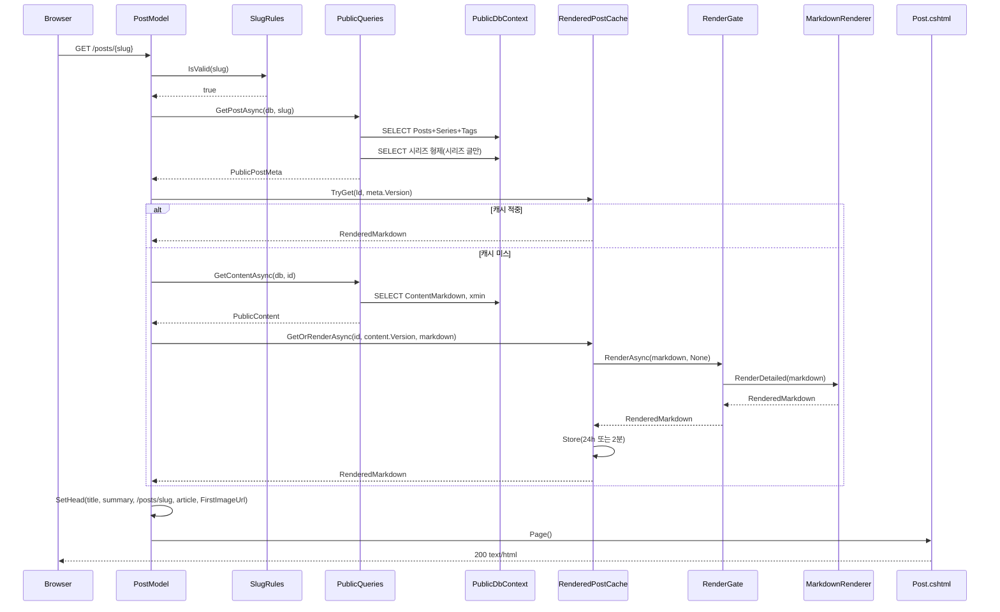
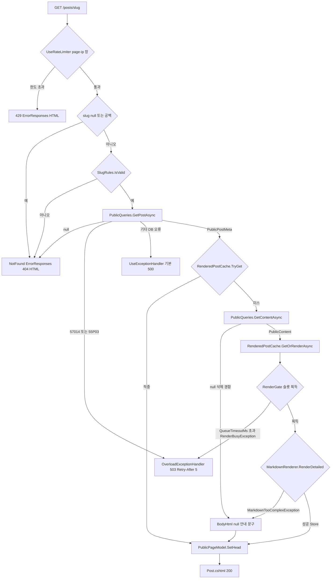

# F013 공개 글 상세 보기

<!-- doc-harness:section id="summary" hash="1fa57506504ada6fef545362dc2184a633371d2021037c45b6a3e9434cb230da" -->
## 한 줄 요약

결론: F013은 동작 중인 기능이며, PostModel.OnGetAsync 하나가 모든 처리를 맡는다. 처리는 다섯 단계로 진행된다. (1) slug 검증: null·공백 여부와 SlugRules 형식을 본다. (2) 메타 조회: PublicQueries.GetPostAsync가 SELECT를 1회 하고, 시리즈에 속한 글이면 형제 글 SELECT를 1회 더 한다. (3) 캐시 조회: RenderedPostCache.TryGet(Id, meta.Version). (4) 캐시 미스일 때만 본문을 읽고 단일 비행으로 렌더한다(GetContentAsync → GetOrRenderAsync → RenderGate → MarkdownRenderer). (5) SetHead로 머리 정보를 채우고 Post.cshtml을 렌더한다.

실패 경로는 다음과 같다.
- slug가 공백이거나 형식이 틀리거나 글이 없으면 고정 HTML 404다.
- 두 조회 사이에 본문이 삭제됐거나 MarkdownTooComplexException이 나면, 200 응답에 본문 대신 '이 글의 본문을 표시할 수 없습니다'를 보여 준다.
- statement_timeout(57014), 잠금 대기 초과(55P03), 렌더 슬롯 대기 초과(RenderBusyException)는 OverloadExceptionHandler가 503 + Retry-After 5로 바꾼다.
- 속도 제한을 넘으면 429다.
- 그 밖의 DB 오류는 처리하지 않아 500이 된다.

이 기능의 코드(PostModel, PublicQueries, RenderedPostCache, RenderGate, OverloadExceptionHandler, ErrorResponses)는 로그를 전혀 남기지 않는다. 관찰된 잠재 문제는 세 가지다.
- 너무 복잡한 글은 캐시되지 않는다. 그래서 방문할 때마다 전역 RenderGate(기본 2슬롯)를 거쳐 다시 렌더된다.
- 그 예외는 로그 없이 조용히 삼켜진다.
- 메타와 본문을 서로 다른 SQL 문으로 읽는다. 그래서 동시 수정이 있으면 한 요청 안에서 옛 제목과 새 본문이 섞일 수 있다.

| 항목 | 값 |
|---|---|
| 중요도 | CORE |
| 상태 | ACTIVE |
| 진입점 | `Razor GET/HEAD /posts/{slug} (PostModel.OnGetAsync)` |
| 의존 기능 | [F011](../09_FEATURES.md#f011), [F019](../09_FEATURES.md#f019), [F020](../09_FEATURES.md#f020) |

### 진입점 근거

| 내용 | 상태 | 근거 |
|---|---|---|
| 진입점은 Razor 페이지 라우트 `@page "/posts/{slug}"`와 핸들러 PostModel.OnGetAsync(string? slug, CancellationToken ct)다. | CONFIRMED | `PortfolioBlog.Api/Pages/Post.cshtml` (1-2), `PortfolioBlog.Api/Pages/Post.cshtml.cs` PostModel.OnGetAsync (43-56) |
| PublicPageConvention은 모든 Razor 페이지 선택자에 메타데이터 세 가지를 단다. GET/HEAD 전용(HttpMethodMetadata), 공개 호스트 전용(HostAttribute), 속도 제한 정책이다. 정책은 /Search만 RateLimitPolicy.Search이고, /posts/{slug}를 비롯한 나머지는 RateLimitPolicy.PublicPage다. 이 규약은 Program.cs에서 RazorPagesOptions 지연 구성으로 등록되고 MapRazorPages로 매핑된다. | CONFIRMED | `PortfolioBlog.Api/Pages/PublicPageConvention.cs` PublicPageConvention.Apply (32-41), `PortfolioBlog.Api/Program.cs` (68-71,123) |
<!-- /doc-harness:section -->

<!-- doc-harness:section id="flow" hash="332fc5356f1f8b9fbd4aad814229c141ea80436f83ee3a971ae20ef99455aad5" -->
## 처리 흐름

| 단계 | 컴포넌트 | 코드 | 설명 |
|---|---|---|---|
| 1 | PublicPageConvention | `PortfolioBlog.Api/Pages/PublicPageConvention.cs` PublicPageConvention.Apply | 라우팅이 엔드포인트 메타데이터로 요청을 거른다. GET/HEAD가 아닌 메서드는 405, 공개 호스트가 아닌 요청은 404를 받는다. 이 메타데이터에는 RateLimitPolicy.PublicPage 태그도 들어 있다. |
| 2 | RateLimitingExtensions | `PortfolioBlog.Api/Infrastructure/Web/RateLimitingExtensions.cs` RateLimitingExtensions.BuildChain | UseRateLimiter는 AdminSurfaceMiddleware 다음에 실행된다. page-ip:{IP} 파티션에 1분 고정 창을 적용하며, 한도는 PagePerIpPerMinute(기본 120), QueueLimit은 0이다. 이 창은 PublicPage 정책과 Search 정책이 함께 쓴다. 한도를 넘으면 429다. |
| 3 | PostModel | `PortfolioBlog.Api/Pages/Post.cshtml.cs` PostModel.OnGetAsync | slug가 null이거나 공백이면 NotFound()를 돌려준다. 모델 바인딩이 공백뿐인 값을 null로 바꾸기 때문에 두 경우를 함께 검사한다. |
| 4 | SlugRules | `PortfolioBlog.Api/Infrastructure/Data/SlugRules.cs` SlugRules.IsValid | 길이가 AppDbContext.SlugMax(100) 이하이고 \A[a-z0-9]+(-[a-z0-9]+)*\z 형식인지 검사한다. 어긋나면 DB를 조회하지 않고 NotFound()를 돌려준다. |
| 5 | PublicQueries | `PortfolioBlog.Api/Infrastructure/Data/PublicQueries.cs` PublicQueries.GetPostAsync | PublicDbContext에서 slug가 일치하는 글을 SingleOrDefaultAsync 1회로 조회한다. 읽는 값은 Id, Version(xmin), Slug, Title, Summary, CreatedAt, UpdatedAt, SeriesId, 시리즈 slug·제목, 정규화명 순으로 정렬한 태그이며 본문은 읽지 않는다. 결과가 null이면 PostModel이 NotFound()를 돌려준다. |
| 6 | PublicQueries | `PortfolioBlog.Api/Infrastructure/Data/PublicQueries.cs` PublicQueries.GetPostAsync | 시리즈에 속한 글이면 같은 SeriesId의 형제 글을 (SeriesOrder, CreatedAt, Id) 순으로 최대 SeriesMax(500)건 조회한다. 현재 글의 인덱스로 이전 편·다음 편 PublicLink를 계산해 PublicPostMeta를 만든다. |
| 7 | RenderedPostCache | `PortfolioBlog.Api/Infrastructure/Markdown/RenderedPostCache.cs` RenderedPostCache.TryGet | (meta.Id, meta.Version) 키로 전용 MemoryCache를 조회한다. 적중하면 렌더 결과를 그대로 쓰고 본문은 DB에서 읽지 않는다. |
| 8 | PostModel | `PortfolioBlog.Api/Pages/Post.cshtml.cs` PostModel.RenderAsync | 캐시 미스면 PublicQueries.GetContentAsync(db, id)로 ContentMarkdown과 Version을 한 번의 SQL 문으로 읽는다. 결과가 null이면(그사이 삭제됐으면) null을 돌려준다. |
| 9 | RenderedPostCache | `PortfolioBlog.Api/Infrastructure/Markdown/RenderedPostCache.cs` RenderedPostCache.GetOrRenderAsync | (id, content.Version)으로 TryGet을 다시 시도한다. 그래도 없으면 _inflight(ConcurrentDictionary<key, Lazy<Task>>)가 같은 키의 동시 미스를 렌더 1회로 합친다. 호출자의 ct는 WaitAsync에만 전달된다. |
| 10 | RenderGate | `PortfolioBlog.Api/Infrastructure/Markdown/RenderGate.cs` RenderGate.RenderAsync | RenderAndStoreAsync는 Task.Yield 뒤 CancellationToken.None으로 렌더 슬롯을 기다린다. 슬롯은 SemaphoreSlim이며 Concurrency 기본값은 2, QueueTimeoutMs 기본값은 5000이다. 제한 시간 안에 슬롯을 얻지 못하면 RenderBusyException을 던진다. |
| 11 | MarkdownRenderer | `PortfolioBlog.Api/Infrastructure/Markdown/MarkdownRenderer.cs` MarkdownRenderer.RenderDetailed | Markdig 파싱, UrlPolicy 적용, 제목 id 부여, 첫 이미지 URL 추출, 코드 강조, HtmlAllowlist 정제를 차례로 거쳐 RenderedMarkdown(Html, FirstImageUrl, HighlightTimedOut)을 만든다. 중첩 한도를 넘으면 MarkdownTooComplexException을 던진다. |
| 12 | RenderedPostCache | `PortfolioBlog.Api/Infrastructure/Markdown/RenderedPostCache.cs` RenderedPostCache.Store | 렌더에 성공하면 결과를 캐시에 넣는다. 항목 Size는 (Html + FirstImageUrl 길이)×2 + 512이고, 수명은 24시간이다(강조가 시간 초과로 빠졌으면 2분). 성공하든 실패하든 finally에서 _inflight 항목을 지운다. |
| 13 | PostModel | `PortfolioBlog.Api/Pages/Post.cshtml.cs` PostModel.RenderAsync | MarkdownTooComplexException만 잡아서 null을 돌려준다. RenderBusyException 같은 다른 예외는 잡지 않고 그대로 전파한다. |
| 14 | PublicPageModel | `PortfolioBlog.Api/Pages/PublicPageModel.cs` PublicPageModel.SetHead | BodyHtml과 Meta를 채운 다음 SetHead(title, summary, PublicUrls.Post(meta.Slug), "article", FirstImageUrl)를 호출한다. SetHead는 Site.PublicOrigin을 기준으로 절대 URL을 만든 PageHead를 ViewData["Head"]에 넣는다. |
| 15 | Post.cshtml | `PortfolioBlog.Api/Pages/Post.cshtml` | 제목, 작성일·수정일(PublicFormat), _TagList 부분 뷰, 시리즈 링크를 그린다. 본문은 Html.Raw로 출력하는데, 이 파일에서 Html.Raw는 여기 한 곳뿐이다. BodyHtml이 null이면 본문 자리에 안내 문구를 넣는다. 마지막으로 이전 편·다음 편 링크를 그린다. <head>(canonical, og:*)는 _Layout.cshtml이 PageHead로 그린다. |
<!-- /doc-harness:section -->

<!-- doc-harness:section id="F013_SEQUENCE" hash="7fe85fb25e4b28e36880df5e00a1528db5ed94b3138e07da03fccaefefac3b47" -->
## 공개 글 상세 요청 처리 순서(캐시 적중/미스) (Sequence Diagram)

PostModel이 slug 검증, 메타 조회, 캐시 조회를 차례로 하고, 캐시 미스일 때만 본문을 읽어 RenderGate 뒤에서 렌더한 뒤 Post.cshtml을 그린다.

캐시 적중이면 DB 조회는 메타 SELECT 1~2회로 끝난다. 미스면 GetContentAsync로 본문과 xmin을 한 번의 SQL 문으로 읽는다. RenderedPostCache.GetOrRenderAsync가 같은 키의 동시 미스를 합친 뒤, RenderGate 슬롯을 얻어 MarkdownRenderer.RenderDetailed를 실행한다. 성공하면 Store로 캐시에 넣는다. SetHead는 PublicOrigin 기준으로 PageHead를 만든다.

### 코드 근거

| 구성 요소 | 코드 |
|---|---|
| PostModel | `PortfolioBlog.Api/Pages/Post.cshtml.cs` (PostModel.OnGetAsync) |
| SlugRules | `PortfolioBlog.Api/Infrastructure/Data/SlugRules.cs` (SlugRules.IsValid) |
| PublicQueries | `PortfolioBlog.Api/Infrastructure/Data/PublicQueries.cs` (GetPostAsync / GetContentAsync) |
| PublicDbContext | `PortfolioBlog.Api/Infrastructure/Data/PublicDbContext.cs` |
| RenderedPostCache | `PortfolioBlog.Api/Infrastructure/Markdown/RenderedPostCache.cs` |
| RenderGate | `PortfolioBlog.Api/Infrastructure/Markdown/RenderGate.cs` (RenderGate.RenderAsync) |
| MarkdownRenderer | `PortfolioBlog.Api/Infrastructure/Markdown/MarkdownRenderer.cs` (MarkdownRenderer.RenderDetailed) |
| Post.cshtml | `PortfolioBlog.Api/Pages/Post.cshtml` |
<!-- /doc-harness:section -->

<!-- doc-harness:section id="F013_FLOW" hash="d0c45fbd872ec531031850236c1d25d7d6bd8935cec012920aaf8c638e9a678e" -->
## 공개 글 상세의 분기와 실패 경로 (Flowchart)

404는 slug 검증 실패나 글 없음에서, 503은 DB 과부하나 렌더 슬롯 대기 초과에서, 본문 없는 200은 삭제 경합이나 렌더러 거부에서 나온다.

속도 제한을 넘으면 429다. slug가 공백·형식 오류이거나 글이 없으면 NotFound를 거쳐 ErrorResponses가 404를 쓴다. 57014·55P03과 RenderBusyException은 OverloadExceptionHandler가 503으로 바꾼다. 그 밖의 DB 오류는 UseExceptionHandler 기본 경로에서 500이 된다. GetContentAsync가 null이거나 MarkdownTooComplexException이 나면 BodyHtml이 null인 채로 200 페이지를 그린다.

### 코드 근거

| 구성 요소 | 코드 |
|---|---|
| UseRateLimiter page-ip 창 | `PortfolioBlog.Api/Infrastructure/Web/RateLimitingExtensions.cs` (RateLimitingExtensions.BuildChain) |
| SlugRules.IsValid | `PortfolioBlog.Api/Infrastructure/Data/SlugRules.cs` |
| PublicQueries.GetPostAsync | `PortfolioBlog.Api/Infrastructure/Data/PublicQueries.cs` |
| PublicQueries.GetContentAsync | `PortfolioBlog.Api/Infrastructure/Data/PublicQueries.cs` |
| RenderedPostCache.TryGet | `PortfolioBlog.Api/Infrastructure/Markdown/RenderedPostCache.cs` |
| RenderedPostCache.GetOrRenderAsync | `PortfolioBlog.Api/Infrastructure/Markdown/RenderedPostCache.cs` |
| RenderGate 슬롯 획득 | `PortfolioBlog.Api/Infrastructure/Markdown/RenderGate.cs` (RenderGate.RenderAsync) |
| MarkdownRenderer.RenderDetailed | `PortfolioBlog.Api/Infrastructure/Markdown/MarkdownRenderer.cs` |
| OverloadExceptionHandler 503 Retry-After 5 | `PortfolioBlog.Api/Infrastructure/Web/OverloadExceptionHandler.cs` |
| PublicPageModel.SetHead | `PortfolioBlog.Api/Pages/PublicPageModel.cs` |
| Post.cshtml 200 | `PortfolioBlog.Api/Pages/Post.cshtml` |
<!-- /doc-harness:section -->

<!-- doc-harness:section id="data" hash="8f601572889cbdeeb34b7c5fc91e2a5bb84b87f787dc4a79037265f65be8c55b" -->
## 데이터

### 데이터 흐름

| 내용 | 상태 | 근거 |
|---|---|---|
| 입력은 경로 값 slug(문자열) 하나이고, 쿼리나 본문 입력은 없다. 모델 바인딩이 공백뿐인 값을 null로 바꾸므로 PostModel은 이를 404로 처리한다. | CONFIRMED | `PortfolioBlog.Api/Pages/Post.cshtml.cs` PostModel.OnGetAsync (32,45) |
| GetPostAsync는 Posts·Series와 PostTags·Tags를 익명 형식으로 투영한 뒤, 메모리에서 PublicPostMeta(Id, Version, Slug, Title, Summary, CreatedAt, UpdatedAt, PublicTag[], Series PublicLink?, Previous?, Next?)로 바꾼다. 메타 조회는 본문(ContentMarkdown)을 읽지 않는다. | CONFIRMED | `PortfolioBlog.Api/Infrastructure/Data/PublicQueries.cs` PublicQueries.GetPostAsync (108-134) |
| GetContentAsync는 캐시 미스일 때만 호출된다. ContentMarkdown과 Version을 한 번의 SQL 문으로 읽어 PublicContent로 돌려주고, 캐시 키는 (Id, content.Version)이 된다. 따라서 메타와 본문이 서로 다른 시점의 값이어도 캐시 키와 본문은 항상 같은 버전이다. | CONFIRMED | `PortfolioBlog.Api/Infrastructure/Data/PublicQueries.cs` PublicQueries.GetContentAsync (136-153), `PortfolioBlog.Api/Pages/Post.cshtml.cs` PostModel.RenderAsync (62-74) |
| 마크다운은 MarkdownRenderer.RenderDetailed를 거쳐 RenderedMarkdown(정제된 Html, FirstImageUrl, HighlightTimedOut)이 된다. Html은 PostModel.BodyHtml에 들어간다. FirstImageUrl은 SetHead의 imagePath로 넘어가 PageHead.OgImageUrl(PublicOrigin + 경로)이 된다. | CONFIRMED | `PortfolioBlog.Api/Pages/Post.cshtml.cs` PostModel.OnGetAsync (51-54), `PortfolioBlog.Api/Pages/PublicPageModel.cs` PublicPageModel.SetHead (39-43) |
| 출력은 text/html 페이지 하나다. 제목·요약·태그·시리즈명은 Razor가 인코딩해 출력하고, 본문은 정제된 출력만 Html.Raw로 내보낸다. canonical과 og:url은 요청 Host가 아니라 Site:PublicOrigin + /posts/{slug}로 만든다. | CONFIRMED | `PortfolioBlog.Api/Pages/Post.cshtml` (3-38), `PortfolioBlog.Api/Pages/PublicPageModel.cs` (39-43), `PortfolioBlog.Api.Tests/Features/PublicPagesTests.cs` Post_RendersSafeHtml_AndHeadUsesPublicOrigin |
| 본문 이미지와 og:image는 /attachments/… 경로를 가리키며, 실제 이미지 전송은 F010이 맡는다. 다만 PostModel은 F010 코드를 직접 호출하지 않고 링크만 내보내므로 코드 의존으로 분류하지 않았다. | INFERRED | `PortfolioBlog.Api/Pages/PublicPageModel.cs` PublicPageModel.SetHead (29) |
| 태그 링크는 PublicUrls.Tag(NormalizedName)로 만든다. 정규화명이 '.'이나 '..'이면 링크 대신 span으로 출력한다. 시리즈 링크는 PublicUrls.Series로, 이전 편·다음 편 링크는 PublicUrls.Post로 만든다. | CONFIRMED | `PortfolioBlog.Api/Pages/Shared/_TagList.cshtml`, `PortfolioBlog.Api/Pages/Post.cshtml` (13-17,28-37) |

### DB 접근

| 엔티티 | 작업 | 코드 |
|---|---|---|
| Posts (+ Series LEFT JOIN, PostTags·Tags 하위 질의) | SELECT | `PortfolioBlog.Api/Infrastructure/Data/PublicQueries.cs` PublicQueries.GetPostAsync |
| Posts (같은 SeriesId의 형제 글, 최대 500건) | SELECT | `PortfolioBlog.Api/Infrastructure/Data/PublicQueries.cs` PublicQueries.GetPostAsync |
| Posts (ContentMarkdown, xmin) | SELECT | `PortfolioBlog.Api/Infrastructure/Data/PublicQueries.cs` PublicQueries.GetContentAsync |

### 상태 전이

| 이전 | 다음 | 트리거 | 근거 |
|---|---|---|---|
| 캐시 없음 (Id, Version) | 렌더 진행 중(_inflight에 Lazy<Task> 등록) | 캐시 미스인 요청이 GetOrRenderAsync를 호출 | `PortfolioBlog.Api/Infrastructure/Markdown/RenderedPostCache.cs` RenderedPostCache.GetOrRenderAsync (95-101) |
| 렌더 진행 중 | 캐시됨(24시간, 강조 시간 초과면 2분) | RenderGate 렌더 성공 → Store | `PortfolioBlog.Api/Infrastructure/Markdown/RenderedPostCache.cs` RenderedPostCache.RenderAndStoreAsync (136-151), `PortfolioBlog.Api/Infrastructure/Markdown/RenderedPostCache.cs` RenderedPostCache.Store (115-122) |
| 렌더 진행 중 | 캐시 없음(다음 요청이 다시 시도) | RenderBusyException 또는 MarkdownTooComplexException 발생. Store는 호출되지 않고 finally에서 _inflight 항목만 제거된다 | `PortfolioBlog.Api/Infrastructure/Markdown/RenderedPostCache.cs` RenderedPostCache.RenderAndStoreAsync (141-150) |
| 캐시됨 | 만료·축출 | AbsoluteExpirationRelativeToNow 경과, 또는 SizeLimit(CacheMegabytes) 초과로 인한 압축 | `PortfolioBlog.Api/Infrastructure/Markdown/RenderedPostCache.cs` (19-35,51-55) |
| 캐시됨 (Id, 옛 Version) | 사용되지 않는 항목(새 Version 키는 미스이거나 선채움됨) | 관리 API로 글을 수정해 xmin이 바뀜. PostEndpoints의 생성·수정 경로는 저장 전에 확인용으로 렌더한 결과를 cache.Store로 넣어 새 버전 키를 미리 채운다 | `PortfolioBlog.Api/Features/Posts/PostEndpoints.cs` CreateAsync / UpdateAsync (124,187), `PortfolioBlog.Api.Tests/Features/PublicPagesTests.cs` Post_IsRenderedOncePerVersion_AndSavePrimesTheCache |

### 외부 의존

| 내용 | 상태 | 근거 |
|---|---|---|
| PostgreSQL은 PublicDbContext(Npgsql)로 조회한다. 연결 문자열은 ConnectionStrings:Public이 있으면 그것을, 없으면 Default를 기반으로 만든다. BuildConnectionString은 statement_timeout(PublicOptions.StatementTimeoutMs, 기본 3000)과 default_transaction_read_only=on을 시작 옵션으로 붙인다. 컨텍스트는 NoTracking이다. | CONFIRMED | `PortfolioBlog.Api/Infrastructure/Data/DataServiceCollectionExtensions.cs` AddBlogData, `PortfolioBlog.Api/Infrastructure/Data/PublicDbContext.cs` PublicDbContext.BuildConnectionString, `PortfolioBlog.Api/Infrastructure/Web/PublicOptions.cs` |
| MarkdownRenderer는 Markdig(파싱·HTML 렌더), 코드 강조기, HtmlAllowlist 기반 정제기를 쓴다. 렌더러 세부 동작은 F011 범위다. 렌더러는 Program.cs에서 TimeProvider.System을 주입받는 싱글턴으로 등록되고, 시작 시 워밍업 렌더를 한 번 한다. | CONFIRMED | `PortfolioBlog.Api/Infrastructure/Markdown/MarkdownRenderer.cs` MarkdownRenderer.RenderDetailed, `PortfolioBlog.Api/Program.cs` (58-61,91) |
| 프로세스 내 캐시로 Microsoft.Extensions.Caching.Memory.MemoryCache 전용 인스턴스(SizeLimit 지정)와 ConcurrentDictionary를 쓴다. 분산 캐시는 없으므로 재배포하면 캐시가 비워진다. | CONFIRMED | `PortfolioBlog.Api/Infrastructure/Markdown/RenderedPostCache.cs` (15,35-38,51-55) |
<!-- /doc-harness:section -->

<!-- doc-harness:section id="failures" hash="0cfa317d786306522f9357e43f9a4d3ad437c7c10ebb7a88efc8bfa3f0c44de7" -->
## 실패 지점

| 위치 | 조건 | 처리 | 상태 | 근거 |
|---|---|---|---|---|
| PostModel.OnGetAsync | slug가 null이거나 공백이다(예: /posts/%20) | NotFound() → UseStatusCodePages(ErrorResponses.HandleStatusCodeAsync)가 고정 HTML 404를 쓴다. 요청 값은 응답에 반사하지 않는다 | CONFIRMED | `PortfolioBlog.Api/Pages/Post.cshtml.cs` (45), `PortfolioBlog.Api/Program.cs` (101), `PortfolioBlog.Api.Tests/Features/PublicPagesTests.cs` Missing_Is404Html_WithoutReflection |
| SlugRules.IsValid | slug에 대문자·밑줄·특수문자·NUL·끝 개행이 있거나, 길이가 SlugMax(100)를 넘는다 | DB를 조회하지 않고 NotFound() → 404 HTML | CONFIRMED | `PortfolioBlog.Api/Infrastructure/Data/SlugRules.cs` SlugRules.IsValid, `PortfolioBlog.Api/Pages/Post.cshtml.cs` (46-47) |
| PublicQueries.GetPostAsync | slug에 해당하는 글이 없다 | null → NotFound() → 404 HTML | CONFIRMED | `PortfolioBlog.Api/Infrastructure/Data/PublicQueries.cs` (118-119), `PortfolioBlog.Api/Pages/Post.cshtml.cs` (48-49) |
| PublicQueries.GetPostAsync / GetContentAsync (PostgreSQL) | statement_timeout 초과(SqlState 57014) 또는 잠금 대기 초과(55P03) | PostModel은 예외를 잡지 않고 전파한다. UseExceptionHandler에 등록된 OverloadExceptionHandler가 InnerException 체인에서 이 예외를 찾아 503 + Retry-After: 5와 고정 HTML(ErrorResponses.WriteAsync)로 응답한다 | CONFIRMED | `PortfolioBlog.Api/Infrastructure/Web/OverloadExceptionHandler.cs` OverloadExceptionHandler.TryHandleAsync (35-70), `PortfolioBlog.Api.Tests/Features/ErrorPipelineTests.cs` PostgresOverload_MapsTo503 |
| PublicQueries (PostgreSQL) | 그 밖의 DB 오류(연결 실패, 57014·55P03 외의 SqlState) | 처리 없음(예외 전파). OverloadExceptionHandler가 false를 돌려주면 UseExceptionHandler의 기본 경로가 500으로 응답한다. ErrorPipelineTests는 GET /posts/x에서 23505가 500(Retry-After 없음)이 되는지 확인하지만, 500 응답 본문의 형식은 검사하지 않는다 | POTENTIAL_ISSUE | `PortfolioBlog.Api.Tests/Features/ErrorPipelineTests.cs` PostgresOverload_MapsTo503 / WrappedPostgresOverload_MapsTo503_ButNotOverWidened, `PortfolioBlog.Api/Program.cs` (43,47,100-101) |
| RenderGate.RenderAsync | QueueTimeoutMs(기본 5000ms) 안에 렌더 슬롯을 얻지 못했다. 슬롯은 기본 2개이며, 싱글턴 RenderGate를 쓰는 모든 렌더가 공유한다 | RenderBusyException이 GetOrRenderAsync와 PostModel.RenderAsync를 거쳐 그대로 전파된다(둘 다 잡지 않는다). OverloadExceptionHandler가 503 + Retry-After 5로 응답하며, 결과는 캐시에 저장되지 않는다 | CONFIRMED | `PortfolioBlog.Api/Infrastructure/Markdown/RenderGate.cs` RenderGate.RenderAsync (86-98), `PortfolioBlog.Api/Infrastructure/Web/OverloadExceptionHandler.cs` (67), `PortfolioBlog.Api.Tests/Features/ErrorPipelineTests.cs` RenderBusy_MapsTo503 |
| PostModel.RenderAsync | 렌더러가 MarkdownTooComplexException을 던진다(중첩 한도 초과. 글을 저장한 뒤 렌더 규칙이 엄격해진 경우) | 예외를 잡아 null로 폴백한다. 200 페이지에 '이 글의 본문을 표시할 수 없습니다'를 보여 주고 og:image는 생략한다. 로그는 남기지 않는다 | CONFIRMED | `PortfolioBlog.Api/Pages/Post.cshtml.cs` PostModel.RenderAsync (66-73), `PortfolioBlog.Api/Pages/Post.cshtml` (19-22) |
| PostModel.RenderAsync | 메타를 조회한 직후 다른 요청이 글을 삭제해서 GetContentAsync가 null을 돌려준다 | null로 폴백해 본문 없는 200 페이지를 보여 준다. 다음 요청부터는 404다 | CONFIRMED | `PortfolioBlog.Api/Pages/Post.cshtml.cs` (27-29,64-65) |
| RenderedPostCache.GetOrRenderAsync (WaitAsync(ct)) | 클라이언트가 요청을 취소한다 | 이 호출자의 대기만 취소되고 OperationCanceledException이 전파된다. 공유 렌더는 CancellationToken.None으로 끝까지 실행되어 캐시에 저장된다. 이 예외가 최종적으로 어떤 상태 코드가 되는지는 확인하지 못했다 | UNKNOWN | `PortfolioBlog.Api/Infrastructure/Markdown/RenderedPostCache.cs` RenderedPostCache.GetOrRenderAsync (95-101), `PortfolioBlog.Api/Infrastructure/Markdown/RenderedPostCache.cs` RenderedPostCache.RenderAndStoreAsync (140-143) |
| MarkdownRenderer.RenderDetailed | 저장된 본문이 입력 크기 한도를 넘는다. 크기 검사가 try 블록 밖에 있어 MarkdownTooComplexException이 아닌 일반 예외가 난다 | PostModel이 잡지 않으므로 이론상 500이 된다. 그러나 저장 경로 검증과 DB CHECK 제약이 같은 한도를 강제하므로 실제로는 도달하지 않는다고 본다 | INFERRED | `PortfolioBlog.Api/Infrastructure/Markdown/MarkdownRenderer.cs` MarkdownRenderer.RenderDetailed, `PortfolioBlog.Api/Features/Posts/PostValidation.cs` |
| UseRateLimiter (page-ip 고정 창) | 같은 IP가 1분 안에 PagePerIpPerMinute(기본 120)를 넘긴다. 이 창은 검색 요청과 한도를 공유한다 | 대기열 없이 즉시 429 + Retry-After로 응답하고, ErrorResponses가 고정 HTML을 쓴다 | CONFIRMED | `PortfolioBlog.Api/Infrastructure/Web/RateLimitingExtensions.cs` RateLimitingExtensions.BuildChain, `PortfolioBlog.Api/Program.cs` (105) |
| 라우팅(PublicPageConvention 메타데이터) | GET/HEAD가 아닌 메서드이거나, Host가 공개 호스트가 아니다 | 405 + Allow, 또는 404 | CONFIRMED | `PortfolioBlog.Api/Pages/PublicPageConvention.cs` (16-18,35-40), `PortfolioBlog.Api.Tests/Features/PublicPagesTests.cs` Pages_AreReadOnly_AndBoundToThePublicHost |

### 엣지 케이스

| 내용 | 상태 | 근거 |
|---|---|---|
| MarkdownTooComplexException이 난 글은 캐시되지 않는다. RenderAndStoreAsync가 Store에 이르기 전에 예외로 빠져나가기 때문이다. 그래서 방문할 때마다 본문 SELECT와 전역 RenderGate(기본 2슬롯 싱글턴) 렌더가 반복되고, 그동안 다른 렌더 요청이 슬롯을 기다리다 503을 받을 수 있다. | POTENTIAL_ISSUE | `PortfolioBlog.Api/Infrastructure/Markdown/RenderedPostCache.cs` RenderedPostCache.RenderAndStoreAsync (141-150), `PortfolioBlog.Api/Pages/Post.cshtml.cs` PostModel.RenderAsync (70-73), `PortfolioBlog.Api/Program.cs` (60) |
| 캐시 조회에는 meta.Version을 쓰지만, 미스일 때는 별도 SELECT로 읽은 content.Version으로 렌더한다. 두 조회 사이에 글이 수정되면 한 요청 안에서 옛 제목·태그·요약과 새 본문·og:image가 함께 나갈 수 있다. 다음 요청부터는 다시 일치한다. | POTENTIAL_ISSUE | `PortfolioBlog.Api/Pages/Post.cshtml.cs` (48-54,64-68) |
| 본문 삭제 경합과 렌더러 거부는 같은 안내 문구로 합쳐지고 둘 다 200으로 응답한다. 따라서 사용자도 운영자도 원인을 구분할 수 없다. | CONFIRMED | `PortfolioBlog.Api/Pages/Post.cshtml.cs` (27-29,65,70-73), `PortfolioBlog.Api/Pages/Post.cshtml` (19-22) |
| HEAD 요청도 OnGetAsync 전체를 실행하는 것으로 본다. 그렇다면 캐시 미스일 때 본문 조회와 렌더까지 수행한다. 근거는 PublicPageConvention이 GET과 HEAD를 모두 허용하고, PostModel에 OnHead 핸들러가 없다는 점이다. | INFERRED | `PortfolioBlog.Api/Pages/PublicPageConvention.cs` (37), `PortfolioBlog.Api/Pages/Post.cshtml.cs` PostModel.OnGetAsync (43-56) |
| 코드 강조가 시간 초과(HighlightTimedOut)로 빠진 렌더는 2분만 캐시된다. | CONFIRMED | `PortfolioBlog.Api/Infrastructure/Markdown/RenderedPostCache.cs` (22-23,121) |
| 캐시가 SizeLimit를 넘으면 Set이 조용히 거부될 수 있다(코드 주석에 남은 실측 기록). 이 경우 다음 요청에서 다시 렌더할 뿐이고, 틀린 내용이 나가지는 않는다. | INFERRED | `PortfolioBlog.Api/Infrastructure/Markdown/RenderedPostCache.cs` (27-34) |
| 시리즈 형제 글은 최대 SeriesMax(500)건만 읽는다. 현재 글이 그 범위 밖이면 FindIndex가 -1을 돌려주어 이전 편·다음 편 링크가 모두 사라진다. 현재 글이 500번째면 다음 편 링크만 빠진다. | CONFIRMED | `PortfolioBlog.Api/Infrastructure/Data/PublicQueries.cs` PublicQueries.GetPostAsync (122-130) |
| '수정' 날짜는 UpdatedAt이 CreatedAt보다 클 때만 보여 준다. | CONFIRMED | `PortfolioBlog.Api/Pages/Post.cshtml` (8-11) |
| 요약(Summary)이 공백뿐이면 description을 생략하고, 이미지가 없으면 og:image를 생략한다. | CONFIRMED | `PortfolioBlog.Api/Pages/PublicPageModel.cs` (42-43), `PortfolioBlog.Api.Tests/Features/PublicPagesTests.cs` Post_WithoutImage_HasNoOgImage |
| 같은 (Id, Version)에 동시에 미스가 나면 Lazy 기반 단일 비행이 이를 렌더 1회로 합친다. | CONFIRMED | `PortfolioBlog.Api/Infrastructure/Markdown/RenderedPostCache.cs` (37-38,99), `PortfolioBlog.Api.Tests/Features/PublicPagesTests.cs` Post_IsRenderedOncePerVersion_AndSavePrimesTheCache |

### 로깅

| 내용 | 상태 | 근거 |
|---|---|---|
| 이 기능의 코드 경로(PostModel, PublicQueries, RenderedPostCache, RenderGate, OverloadExceptionHandler, ErrorResponses)에는 ILogger 호출이 없다. 특히 MarkdownTooComplexException은 로그 없이 조용히 삼켜진다. 참고로 PortfolioBlog.Api 전체에서 ILogger/ILoggerFactory로 실제 로그를 남기는 파일은 7개다. AttachmentEndpoints.cs, PostEndpoints.cs, AuthEndpoints.cs, TagEndpoints.cs, SeriesEndpoints.cs, FileSystemAttachmentStore.cs, 그리고 AttachmentJanitor.cs(ILogger<AttachmentJanitor>)다. 모두 F013 경로 밖에 있다. AuthServiceCollectionExtensions.cs는 82행에서 NullLoggerFactory.Instance를 넘길 뿐이며, ILogger로 로그를 남기지 않는다. | CONFIRMED | `PortfolioBlog.Api/Pages/Post.cshtml.cs` PostModel (22-75), `PortfolioBlog.Api/Infrastructure/Markdown/RenderedPostCache.cs` RenderedPostCache (17-163), `PortfolioBlog.Api/Infrastructure/Storage/AttachmentJanitor.cs` AttachmentJanitor (29,59,63), `PortfolioBlog.Api/Infrastructure/Access/AuthServiceCollectionExtensions.cs` (82) |
| 처리되지 않은 예외(500)와 OverloadExceptionHandler가 처리한 예외(503)는 ASP.NET Core ExceptionHandlerMiddleware의 기본 동작에 따라 로깅될 것으로 본다. 실제 로그 수준은 확인하지 못했다. | INFERRED | `PortfolioBlog.Api/Program.cs` (43,100) |
<!-- /doc-harness:section -->

<!-- doc-harness:section id="code" hash="a48bafb3556ecde2eb6bb3393a040eb8e9da9d01a852bfa55824a54e875159be" -->
## 관련 코드

| 파일 | 심볼 | 역할 |
|---|---|---|
| `PortfolioBlog.Api/Pages/Post.cshtml.cs` | PostModel.OnGetAsync | entry |
| `PortfolioBlog.Api/Pages/Post.cshtml.cs` | PostModel.RenderAsync | service |
| `PortfolioBlog.Api/Pages/Post.cshtml` | - | render |
| `PortfolioBlog.Api/Pages/Shared/_TagList.cshtml` | - | render |
| `PortfolioBlog.Api/Pages/Shared/_Layout.cshtml` | - | render |
| `PortfolioBlog.Api/Pages/PublicPageModel.cs` | PublicPageModel.SetHead | render |
| `PortfolioBlog.Api/Pages/PageHead.cs` | PageHead | dto |
| `PortfolioBlog.Api/Pages/PublicPageConvention.cs` | PublicPageConvention.Apply | config |
| `PortfolioBlog.Api/Infrastructure/Data/SlugRules.cs` | SlugRules.IsValid | validation |
| `PortfolioBlog.Api/Infrastructure/Data/PublicQueries.cs` | PublicQueries.GetPostAsync | data |
| `PortfolioBlog.Api/Infrastructure/Data/PublicQueries.cs` | PublicQueries.GetContentAsync | data |
| `PortfolioBlog.Api/Infrastructure/Data/PublicModels.cs` | PublicPostMeta / PublicContent / PublicLink / PublicTag | dto |
| `PortfolioBlog.Api/Infrastructure/Data/PublicDbContext.cs` | PublicDbContext.BuildConnectionString | data |
| `PortfolioBlog.Api/Infrastructure/Data/DataServiceCollectionExtensions.cs` | AddBlogData | config |
| `PortfolioBlog.Api/Infrastructure/Markdown/RenderedPostCache.cs` | RenderedPostCache | service |
| `PortfolioBlog.Api/Infrastructure/Markdown/RenderGate.cs` | RenderGate.RenderAsync | service |
| `PortfolioBlog.Api/Infrastructure/Markdown/MarkdownRenderer.cs` | MarkdownRenderer.RenderDetailed | service |
| `PortfolioBlog.Api/Infrastructure/Markdown/MarkdownTooComplexException.cs` | MarkdownTooComplexException | validation |
| `PortfolioBlog.Api/Infrastructure/Markdown/RenderingOptions.cs` | RenderingOptions | config |
| `PortfolioBlog.Api/Infrastructure/Web/PublicOptions.cs` | PublicOptions | config |
| `PortfolioBlog.Api/Infrastructure/Web/PublicUrls.cs` | PublicUrls.Post / Series / Tag | render |
| `PortfolioBlog.Api/Infrastructure/Web/PublicFormat.cs` | PublicFormat.Rfc3339 / DisplayDate | render |
| `PortfolioBlog.Api/Infrastructure/Web/RateLimitingExtensions.cs` | RateLimitingExtensions.BuildChain | config |
| `PortfolioBlog.Api/Infrastructure/Web/OverloadExceptionHandler.cs` | OverloadExceptionHandler.TryHandleAsync | service |
| `PortfolioBlog.Api/Infrastructure/Web/ErrorResponses.cs` | ErrorResponses.WriteAsync | render |
| `PortfolioBlog.Api/Program.cs` | - | config |
| `PortfolioBlog.Api.Tests/Features/PublicPagesTests.cs` | Post_RendersSafeHtml_AndHeadUsesPublicOrigin / Post_WithoutImage_HasNoOgImage / Missing_Is404Html_WithoutReflection / Pages_AreReadOnly_AndBoundToThePublicHost / Post_IsRenderedOncePerVersion_AndSavePrimesTheCache | test |
| `PortfolioBlog.Api.Tests/Features/ErrorPipelineTests.cs` | PostgresOverload_MapsTo503 / WrappedPostgresOverload_MapsTo503_ButNotOverWidened / RenderBusy_MapsTo503 | test |

근거: `PortfolioBlog.Api/Pages/Post.cshtml.cs` PostModel.OnGetAsync (43-56), `PortfolioBlog.Api/Pages/Post.cshtml.cs` PostModel.RenderAsync (62-74), `PortfolioBlog.Api/Pages/Post.cshtml` (1-38), `PortfolioBlog.Api/Infrastructure/Data/PublicQueries.cs` PublicQueries.GetPostAsync (108-134), `PortfolioBlog.Api/Infrastructure/Data/PublicQueries.cs` PublicQueries.GetContentAsync (149-153), `PortfolioBlog.Api/Infrastructure/Markdown/RenderedPostCache.cs` RenderedPostCache (70-151), `PortfolioBlog.Api/Infrastructure/Markdown/RenderGate.cs` RenderGate.RenderAsync (86-98), `PortfolioBlog.Api/Infrastructure/Web/OverloadExceptionHandler.cs` OverloadExceptionHandler.IsOverload (63-70), `PortfolioBlog.Api/Pages/PublicPageConvention.cs` PublicPageConvention.Apply (32-41), `PortfolioBlog.Api/Pages/PublicPageModel.cs` PublicPageModel.SetHead (39-43), `PortfolioBlog.Api/Program.cs` (43,58-61,68-71,98-108,123), `PortfolioBlog.Api/Infrastructure/Storage/AttachmentJanitor.cs` (29), `PortfolioBlog.Api/Infrastructure/Access/AuthServiceCollectionExtensions.cs` (82)
<!-- /doc-harness:section -->

<!-- doc-harness:section id="unknowns" hash="234f75ca5337175c1d2fe42f62bcefa7a6401779ef257b2cf4a12e7bf0bd0a87" -->
## 확인하지 못한 것

- /posts/{slug} 경로에서 처리되지 않은 예외(23505 같은 기타 DB 오류, 연결 실패)는 500이 되며, 이는 테스트로 확인된다. 그러나 500 응답 본문이 problem+json인지, 고정 HTML인지, 빈 본문인지는 확인하지 못했다. 해당 테스트는 최소 파이프라인에서 상태 코드와 Retry-After만 검사한다.
- 클라이언트가 요청을 취소하면 OperationCanceledException이 난다. 이때의 최종 상태 코드와 로깅은 프레임워크 동작이라 확인하지 못했다.
- 운영 환경의 RenderingOptions(Concurrency, QueueTimeoutMs, CacheMegabytes)와 PublicOptions(PagePerIpPerMinute, StatementTimeoutMs) 실제 설정값은 확인하지 않았다. 코드 기본값만 확인했다.
- ExceptionHandlerMiddleware가 처리한 예외와 처리하지 않은 예외를 각각 어떤 로그 수준으로 남기는지는 실행 환경에서 확인하지 않았다.
- 검증 지적 중 'AuthServiceCollectionExtensions.cs도 ILogger를 쓴다'는 부분은 코드와 맞지 않는다. 이 파일에는 ILogger가 없고, 82행에서 NullLoggerFactory.Instance(로그를 버리는 팩터리)를 넘길 뿐이다. 그래서 logging 항목에는 'ILogger로 로그를 남기지 않는다'고 따로 적었다. AttachmentJanitor.cs 누락 지적은 맞아서 반영했다.
<!-- /doc-harness:section -->

<!-- doc-harness:section id="related" hash="e6b04ee08cc1bd1a2625cbb81ca24992b9da0467258ba6539a8ab5b4aeff04d8" -->
## 관련 문서

- [../09_FEATURES](../09_FEATURES.md)
- [../08_API](../08_API.md)
- [../07_DATA_MODEL](../07_DATA_MODEL.md)
- [../11_FAILURE_HISTORY](../11_FAILURE_HISTORY.md)
<!-- /doc-harness:section -->
