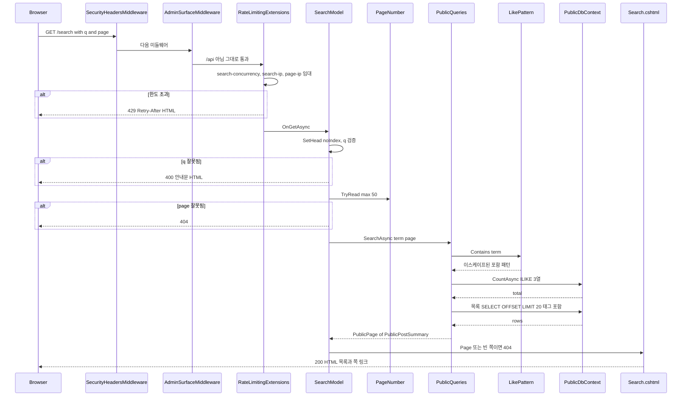
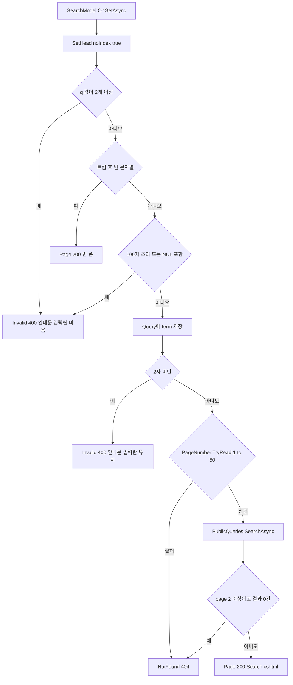
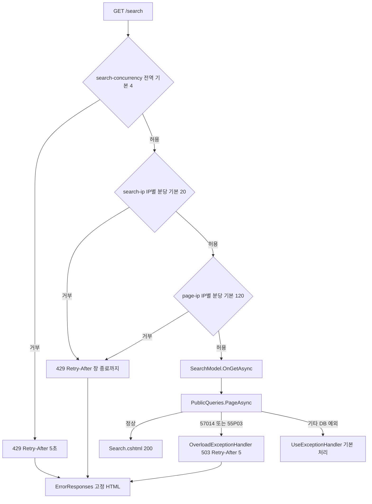

# F014 공개 글 검색

<!-- doc-harness:section id="summary" hash="7cdc3ddf2d1bde5b87601e65db719a0b37c03a7199e0fdbb8fb4c96d65db8df9" -->
## 한 줄 요약

결론: 공개 검색은 Razor 페이지 한 개(SearchModel)와 정적 쿼리 한 개(PublicQueries.SearchAsync)로 이뤄진 읽기 전용 기능이다. 비용 상한은 네 겹이다.
1. 엔드포인트 메타데이터 기반 속도 제한: 전역 동시 실행 4, IP별 분당 검색 20회, IP별 분당 페이지 120회(모두 기본값).
2. 입력 검증: 트림 후 2~100자, NUL 금지, q는 하나만 허용.
3. 쪽 번호 상한: 50쪽.
4. 공개 연결의 statement_timeout(기본 3000ms, 문장 단위).

AdminSurfaceMiddleware는 /api로 시작하지 않는 경로를 아무 검사 없이 다음 단계로 넘기므로 /search는 관리 표면 검사를 받지 않는다(코드로 확인).

검색은 LikePattern.Contains로 \ % _ 를 이스케이프한 뒤, Post의 Title·Summary·ContentMarkdown에 ILIKE OR 조건을 건다. PageAsync가 COUNT 1회와 목록 SELECT 1회(태그 서브쿼리 포함)를 순차 실행하고, 최신순 20건을 PublicPostSummary로 투영한다. 호출 1회의 실질 시간 상한은 statement_timeout의 최대 2배다.

오류 경로:
- 잘못된 q: 안내문이 든 400 HTML.
- 잘못된 page, 또는 결과 없는 2쪽 이상: 404(고정 HTML).
- 속도 제한 거부: 429 + Retry-After(고정 HTML).
- DB 시간 초과(57014·55P03): OverloadExceptionHandler가 503 + Retry-After 5로 바꾼다.
- 그 밖의 DB 예외: 전용 처리가 없어 프레임워크 기본 예외 처리(500)로 전파된다.

기능 코드에는 명시적 로깅이 없다. 알려진 설계상 한계는 두 가지다.
- 1,000건을 넘는 결과는 50쪽 상한 때문에 볼 수 없다.
- 세 열 ILIKE를 받칠 트라이그램 인덱스를 저장소에서 찾지 못해 전체 스캔으로 추정된다(코드 주석도 '전체 스캔'이라 적음).

| 항목 | 값 |
|---|---|
| 중요도 | SUPPORTING |
| 상태 | ACTIVE |
| 진입점 | `Razor /search (GET/HEAD, SearchModel.OnGetAsync)` |
| 의존 기능 | [F019](../09_FEATURES.md#f019), [F020](../09_FEATURES.md#f020), [F021](../09_FEATURES.md#f021) |

### 진입점 근거

| 내용 | 상태 | 근거 |
|---|---|---|
| Razor 페이지 `@page "/search"`(Search.cshtml)의 GET 핸들러 `SearchModel.OnGetAsync`. 검색 폼은 method=get, action=/search이며 antiforgery 숨은 필드가 없다. | CONFIRMED | `PortfolioBlog.Api/Pages/Search.cshtml` (1-7), `PortfolioBlog.Api/Pages/Search.cshtml.cs` SearchModel.OnGetAsync (65-79), `PortfolioBlog.Api.Tests/Features/SearchPageTests.cs` SearchPageTests.Empty_ShowsTheFormOnly (26-37) |
| PublicPageConvention이 모든 Razor 페이지 선택자에 세 가지 메타데이터를 단다: HttpMethodMetadata(GET, HEAD), HostAttribute(공개 호스트), RateLimitMetadata. ViewEnginePath가 "/Search"인 페이지에만 RateLimitPolicy.Search가 붙는다. 그래서 공개 호스트의 GET/HEAD만 이 엔드포인트에 매칭된다. 이 규약은 Program.cs에서 RazorPagesOptions 지연 구성으로 등록된다. | CONFIRMED | `PortfolioBlog.Api/Pages/PublicPageConvention.cs` PublicPageConvention.Apply (32-41), `PortfolioBlog.Api/Program.cs` (68-71), `PortfolioBlog.Api.Tests/Features/SearchPageTests.cs` SearchPageTests.Search_HasItsOwnRateLimit (104-110) |
<!-- /doc-harness:section -->

<!-- doc-harness:section id="flow" hash="1a252754e4b6523f53329697bca3136a31fab16e9ecb3e0fc99616228cfd3609" -->
## 처리 흐름

| 단계 | 컴포넌트 | 코드 | 설명 |
|---|---|---|---|
| 1 | SecurityHeadersMiddleware / UseTrustedForwardedHeaders / UseExceptionHandler / UseStatusCodePages / UseStaticFiles | `PortfolioBlog.Api/Program.cs` app.UseMiddleware<SecurityHeadersMiddleware>, UseTrustedForwardedHeaders, UseExceptionHandler, UseStatusCodePages, UseStaticFiles | WebApplication이 라우팅을 사용자 미들웨어보다 앞에 두므로 엔드포인트는 이미 선택된 상태다. 요청은 보안 헤더 미들웨어, 신뢰 프록시 헤더 처리, 예외 처리기(OverloadExceptionHandler 등록됨), 상태 코드 페이지(ErrorResponses.HandleStatusCodeAsync), 정적 파일 순으로 지난다. 정적 파일 미들웨어는 엔드포인트가 매칭된 요청을 건드리지 않는다. |
| 2 | PublicPageConvention (라우팅 메타데이터) | `PortfolioBlog.Api/Pages/PublicPageConvention.cs` PublicPageConvention.Apply | 라우팅이 /search 엔드포인트를 선택한다. 공개 호스트가 아니면 매칭되지 않고(404), GET/HEAD가 아닌 메서드는 405다(클래스 remarks의 실측 기록 기준). 선택된 엔드포인트에는 RateLimitMetadata(Search)가 달려 있다. |
| 3 | AdminSurfaceMiddleware | `PortfolioBlog.Api/Infrastructure/Access/AdminSurfaceMiddleware.cs` AdminSurfaceMiddleware.InvokeAsync | 요청 경로가 /api 세그먼트로 시작하지 않으면(StartsWithSegments, 대소문자 무시) 호스트·IP·CSRF 헤더·Origin 검사를 하지 않고 곧바로 _next로 넘긴다. /search는 이 조건에 해당하므로 아무 검사 없이 통과한다. |
| 4 | RateLimitingExtensions.BuildChain | `PortfolioBlog.Api/Infrastructure/Web/RateLimitingExtensions.cs` RateLimitingExtensions.BuildChain / Concurrency / Window / Matches | UseRateLimiter의 GlobalLimiter 체인이 엔드포인트 메타데이터(Matches)를 보고 임대를 순서대로 빌린다. search-concurrency(전역 상수 키, 기본 4) → search-ip:{IP}(분당 기본 20) → page-ip:{IP}(분당 기본 120) 순이다. 하나라도 거부되면 429와 Retry-After를 낸다. 동시 실행 거부는 5초, 창 거부는 창 종료까지 1~60초다. |
| 5 | SearchModel | `PortfolioBlog.Api/Pages/Search.cshtml.cs` SearchModel.OnGetAsync | SetHead("검색", null, "/search", noIndex: true)로 머리 정보를 채운다. 이 쪽은 noindex다. |
| 6 | SearchModel | `PortfolioBlog.Api/Pages/Search.cshtml.cs` SearchModel.OnGetAsync | Request.Query["q"]를 읽어 다음 순서로 판정한다. - 값이 2개 이상이면 400(Invalid). - 트림 후 비었거나 없으면 빈 폼 200. - 100자 초과이거나 NUL을 포함하면 400이고, Query는 빈 문자열로 둔다(입력란에 되돌리지 않음). - 그 밖에는 Query=term으로 두고, 2자 미만이면 400(입력란에 되돌림). |
| 7 | PageNumber | `PortfolioBlog.Api/Pages/PageNumber.cs` PageNumber.TryRead | ?page=를 직접 읽는다. 없으면 1쪽이다. 값이 하나이고 ASCII 숫자 1~4자리이면서 1..MaxPage(50)일 때만 통과하고, 실패하면 NotFound()로 404다. 여기까지 DB에 접근하지 않는다. |
| 8 | PublicQueries | `PortfolioBlog.Api/Infrastructure/Data/PublicQueries.cs` PublicQueries.SearchAsync | LikePattern.Contains(term)로 패턴을 만든다. 그다음 db.Posts에 EF.Functions.ILike(Title/Summary/ContentMarkdown, pattern, LikePattern.Escape)를 OR로 묶은 Where를 걸어 PageAsync에 넘긴다. |
| 9 | LikePattern | `PortfolioBlog.Api/Infrastructure/Data/LikePattern.cs` LikePattern.Contains | \ 를 먼저 \\ 로, 이어서 % 를 \% 로, _ 를 \_ 로 치환하고 앞뒤에 % 를 붙여 포함 패턴을 만든다. 값은 매개변수로 전달된다. |
| 10 | PublicQueries | `PortfolioBlog.Api/Infrastructure/Data/PublicQueries.cs` PublicQueries.PageAsync | page가 1 이상이고 int.MaxValue/PageSize 이하인지 확인한다(심층 방어). 그다음 두 문장을 순차 await한다. - CountAsync: 필터에 맞는 전체 건수. - 목록 SELECT: CreatedAt DESC, Id 순으로 Skip((page-1)*20).Take(20) 하고, Slug·Title·Summary·CreatedAt과 태그(NormalizedName 순 서브쿼리)를 익명 형식으로 투영한다. 결과는 메모리에서 PublicPostSummary와 PublicPage로 바꾼다. |
| 11 | PublicDbContext | `PortfolioBlog.Api/Infrastructure/Data/PublicDbContext.cs` PublicDbContext.BuildConnectionString | 조회는 공개 전용 연결로 실행된다. 연결 설정은 다음과 같다. - 시작 옵션: -c statement_timeout={StatementTimeoutMs} -c default_transaction_read_only=on - ApplicationName=PortfolioBlog.Public - 추적 방식: NoTracking(DataServiceCollectionExtensions.AddBlogData) |
| 12 | SearchModel | `PortfolioBlog.Api/Pages/Search.cshtml.cs` SearchModel.OnGetAsync | page > 1이고 Items가 0건이면 NotFound()로 404를 낸다. 그렇지 않으면 Page()로 200을 낸다. 1쪽 0건은 200이다. |
| 13 | Search.cshtml / _PostList / _Pager | `PortfolioBlog.Api/Pages/Search.cshtml` | 뷰는 폼을 그리고 입력란 value에 Model.Query를 HTML 인코딩해 넣는다. 그다음 상태에 따라 나눈다. - Error가 있으면 p.notice로 안내문을 보여 준다. - Posts가 있으면 'N건', _PostList(목록 또는 '글이 없습니다.'), _Pager를 그린다. _Pager에 넘기는 PagerModel은 LastPage를 min(Posts.LastPage, 50)으로 자르고, 링크는 q를 Uri.EscapeDataString으로 인코딩한다. |
| 14 | RateLimitingExtensions (임대 반납) | `PortfolioBlog.Api/Infrastructure/Web/RateLimitingExtensions.cs` RateLimitingExtensions.Concurrency | 요청 파이프라인이 끝나면 rate limiter 미들웨어가 search-concurrency 임대를 반납한다. 렌더링 시간까지 동시 실행 슬롯을 점유한다. 고정 창 허용량은 반납되지 않는다. |
<!-- /doc-harness:section -->

<!-- doc-harness:section id="F014_SEQUENCE" hash="df47e0dbbc72944bb3e7c67023b30438b4bf22565953bc3d84016f52a47e6bad" -->
## 공개 검색 요청 처리 순서 (Sequence Diagram)

요청은 미들웨어(보안 헤더 → AdminSurfaceMiddleware 통과 → 속도 제한)를 지나 SearchModel에서 검증된 뒤, PublicQueries가 PublicDbContext로 COUNT와 목록 SELECT 두 문장을 순차 실행하고 Search.cshtml이 HTML을 렌더링한다.

1. SecurityHeadersMiddleware 뒤에 신뢰 프록시 헤더, 예외 처리기, 상태 코드 페이지, 정적 파일 미들웨어가 있다(Program.cs 98-103). 다이어그램에서는 생략했다.
2. AdminSurfaceMiddleware는 경로가 /api 세그먼트로 시작하지 않으면 검사 없이 _next를 호출한다(AdminSurfaceMiddleware.cs 70-73). /search는 여기서 막히지 않는다.
3. RateLimitingExtensions의 체인이 search-concurrency → search-ip → page-ip 순으로 임대를 빌린다. 거부 시 429 + Retry-After이고 본문은 ErrorResponses가 쓴다.
4. SearchModel.OnGetAsync는 q를 먼저, page를 나중에 검증한다. 두 검증 모두 DB 접근 전에 끝난다.
5. PublicQueries.SearchAsync는 LikePattern.Contains로 패턴을 만들고 PageAsync에서 COUNT와 목록 SELECT를 순차 await한다. 연결은 statement_timeout과 read-only 시작 옵션을 가진 PublicDbContext다.
6. page>1이고 결과가 비면 404, 그 밖에는 Search.cshtml이 200으로 렌더링된다.

### 코드 근거

| 구성 요소 | 코드 |
|---|---|
| SecurityHeadersMiddleware | `PortfolioBlog.Api/Program.cs` (app.UseMiddleware<SecurityHeadersMiddleware>) |
| AdminSurfaceMiddleware | `PortfolioBlog.Api/Infrastructure/Access/AdminSurfaceMiddleware.cs` (AdminSurfaceMiddleware.InvokeAsync) |
| RateLimitingExtensions | `PortfolioBlog.Api/Infrastructure/Web/RateLimitingExtensions.cs` (RateLimitingExtensions.BuildChain) |
| SearchModel | `PortfolioBlog.Api/Pages/Search.cshtml.cs` (SearchModel.OnGetAsync) |
| PageNumber | `PortfolioBlog.Api/Pages/PageNumber.cs` (PageNumber.TryRead) |
| PublicQueries | `PortfolioBlog.Api/Infrastructure/Data/PublicQueries.cs` (PublicQueries.SearchAsync / PageAsync) |
| LikePattern | `PortfolioBlog.Api/Infrastructure/Data/LikePattern.cs` (LikePattern.Contains) |
| PublicDbContext | `PortfolioBlog.Api/Infrastructure/Data/PublicDbContext.cs` (PublicDbContext) |
| Search.cshtml | `PortfolioBlog.Api/Pages/Search.cshtml` |
<!-- /doc-harness:section -->

<!-- doc-harness:section id="F014_FLOW" hash="ce2b670b6c58329ef3e2e3d722c48e97ccf43ef2c59725e358be9d4b24b6a5ed" -->
## SearchModel.OnGetAsync 입력 검증·응답 분기 (Flowchart)

q 검증(반복·빈 값·길이·NUL·최소 길이)이 page 검증보다 먼저이고, 둘 다 통과해야만 DB를 조회한다. 2쪽 이상의 빈 결과는 404다.

Search.cshtml.cs 65-79의 분기를 그대로 옮겼다.
- 반복 q, 100자 초과, NUL은 Query를 설정하기 전에 Invalid를 호출하므로 입력란이 비어 있다.
- 1자 입력은 Query=term 뒤에 Invalid를 호출하므로 입력란에 되돌아간다.
- Invalid는 StatusCode 400을 둔 채 Page()를 렌더링해 안내문을 보여 준다.
- PageNumber.TryRead 실패와 2쪽 이상 빈 결과는 NotFound()이고 본문은 ErrorResponses 고정 HTML이다.

### 코드 근거

| 구성 요소 | 코드 |
|---|---|
| SearchModel.OnGetAsync | `PortfolioBlog.Api/Pages/Search.cshtml.cs` (SearchModel.OnGetAsync) |
| Invalid 400 안내문 입력란 비움 | `PortfolioBlog.Api/Pages/Search.cshtml.cs` (SearchModel.Invalid) |
| PageNumber.TryRead 1 to 50 | `PortfolioBlog.Api/Pages/PageNumber.cs` (PageNumber.TryRead) |
| PublicQueries.SearchAsync | `PortfolioBlog.Api/Infrastructure/Data/PublicQueries.cs` (PublicQueries.SearchAsync) |
| Page 200 Search.cshtml | `PortfolioBlog.Api/Pages/Search.cshtml` |
<!-- /doc-harness:section -->

<!-- doc-harness:section id="F014_FLOW_ERROR" hash="461ce54fb838ec95963ebb153102b3a9a93fa798a0486836728587cda9f60fe2" -->
## 속도 제한·DB 과부하 오류 경로 (Flowchart)

속도 제한 거부는 429, DB 시간 초과·잠금 대기 초과는 OverloadExceptionHandler의 503으로 바뀌며 둘 다 ErrorResponses 고정 HTML을 쓴다. 그 밖의 DB 예외는 전용 처리 없이 기본 예외 처리로 간다.

- 동시 실행 제한기는 고정 창보다 앞에 있다. 뒤의 창이 거부하면 동시성 임대는 Dispose로 반납되지만 고정 창 허용량은 돌아오지 않는다(RateLimitingExtensions.cs 85-86).
- 동시성 거부의 Retry-After는 메타데이터가 없어 상수 5초, 창 거부는 창 종료까지 1~60초다(69-72).
- 429 본문은 UseStatusCodePages(ErrorResponses.HandleStatusCodeAsync)가 공개 경로이므로 text/html 고정 문구로 쓴다.
- OverloadExceptionHandler.IsOverload는 InnerException 체인에서 57014·55P03 PostgresException을 찾아 503 + Retry-After 5를 쓴다.
- 그 밖의 예외는 핸들러가 false를 반환해 프레임워크 기본 처리로 넘어간다. 본문 형식은 UNKNOWN이다.

### 코드 근거

| 구성 요소 | 코드 |
|---|---|
| search-concurrency 전역 기본 4 | `PortfolioBlog.Api/Infrastructure/Web/RateLimitingExtensions.cs` (RateLimitingExtensions.Concurrency) |
| search-ip IP별 분당 기본 20 | `PortfolioBlog.Api/Infrastructure/Web/RateLimitingExtensions.cs` (RateLimitingExtensions.Window) |
| SearchModel.OnGetAsync | `PortfolioBlog.Api/Pages/Search.cshtml.cs` (SearchModel.OnGetAsync) |
| PublicQueries.PageAsync | `PortfolioBlog.Api/Infrastructure/Data/PublicQueries.cs` (PublicQueries.PageAsync) |
| OverloadExceptionHandler 503 Retry-After 5 | `PortfolioBlog.Api/Infrastructure/Web/OverloadExceptionHandler.cs` (OverloadExceptionHandler.TryHandleAsync) |
| UseExceptionHandler 기본 처리 | `PortfolioBlog.Api/Program.cs` (app.UseExceptionHandler) |
| ErrorResponses 고정 HTML | `PortfolioBlog.Api/Infrastructure/Web/ErrorResponses.cs` (ErrorResponses.WriteAsync) |
<!-- /doc-harness:section -->

<!-- doc-harness:section id="data" hash="b6d5d43c563336e0646d94ecff6596c21764e1ca7866384e22ed7518631937bb" -->
## 데이터

### 데이터 흐름

| 내용 | 상태 | 근거 |
|---|---|---|
| 입력은 쿼리 문자열 q와 page뿐이다. q는 모델 바인딩 없이 Request.Query["q"]로 직접 읽고 Trim한다. page는 Razor Pages의 예약 라우트 키라서 PageNumber.TryRead가 IQueryCollection에서 직접 읽는다. | CONFIRMED | `PortfolioBlog.Api/Pages/Search.cshtml.cs` SearchModel.OnGetAsync (68-75), `PortfolioBlog.Api/Pages/PageNumber.cs` PageNumber.TryRead (30-43) |
| 트림된 term은 두 곳으로 흐른다. 하나는 SearchModel.Query로 가서 입력란 value와 쪽 링크의 q가 된다. 다른 하나는 LikePattern.Contains를 거쳐 '%'+이스케이프된 term+'%' 패턴이 된다. 이 패턴은 EF.Functions.ILike의 매개변수로 SQL에 들어간다. 문자열 조립 SQL은 없다. | CONFIRMED | `PortfolioBlog.Api/Pages/Search.cshtml.cs` (73-77), `PortfolioBlog.Api/Infrastructure/Data/LikePattern.cs` LikePattern.Contains (30-33), `PortfolioBlog.Api/Infrastructure/Data/PublicQueries.cs` PublicQueries.SearchAsync (87-93) |
| DB 결과(익명 형식 {Slug, Title, Summary, CreatedAt, Tags[{Name, NormalizedName}]})는 메모리에서 PublicPostSummary(Slug, Title, Summary, CreatedAt, PublicTag[])의 리스트로 바뀐다. 이 리스트가 PublicPage<PublicPostSummary>(Items, Page, Total)에 담긴다. 본문(ContentMarkdown)은 WHERE 조건에만 쓰고 투영하지 않는다. LastPage는 max(1, ceil(Total/20))로 계산된다. | CONFIRMED | `PortfolioBlog.Api/Infrastructure/Data/PublicQueries.cs` PublicQueries.PageAsync (250-261), `PortfolioBlog.Api/Infrastructure/Data/PublicModels.cs` (14-24) |
| 출력은 HTML이다. 검색어는 input value 속성으로만 HTML 인코딩되어 반사된다. 목록은 _PostList가 그린다. 쪽 링크는 PagerModel.Href가 q를 Uri.EscapeDataString으로 인코딩해 '/search?q=…&page=N' 형태로 만든다. 테스트가 XSS 문자열의 비반사와 쪽 링크 인코딩을 검증한다. | CONFIRMED | `PortfolioBlog.Api/Pages/Search.cshtml` (5-17), `PortfolioBlog.Api/Pages/PagerModel.cs` PagerModel.Href (21-25), `PortfolioBlog.Api.Tests/Features/SearchPageTests.cs` Query_IsReflectedOnlyAsAnEncodedInputValue / PagerLinks_EncodeTheQueryString_AndReflectNoElements (61-73, 141-159) |
| 속도 제한 파티션 키는 ClientIp.PartitionKey(ctx.Connection.RemoteIpAddress)로 만든다. UseTrustedForwardedHeaders가 UseRateLimiter보다 앞에 등록되어 있다. 운영에서 이 RemoteIpAddress가 실제 방문자 IP가 되는지와 IPv6 /64 묶음은 주석과 호출 순서로만 확인했다. | INFERRED | `PortfolioBlog.Api/Infrastructure/Web/RateLimitingExtensions.cs` RateLimitingExtensions.Ip (14-17, 114), `PortfolioBlog.Api/Program.cs` (98-105) |
| 캐시는 없다. 검색 결과는 매 요청 DB에서 새로 읽는다. 파일, 외부 네트워크, 이벤트 발행도 없다. 스레드 모델은 요청당 SearchModel 인스턴스 1개와 async/await 순차 DB 호출 2회다. | CONFIRMED | `PortfolioBlog.Api/Pages/Search.cshtml.cs` (10-21, 77), `PortfolioBlog.Api/Infrastructure/Data/PublicQueries.cs` (239-262) |

### DB 접근

| 엔티티 | 작업 | 코드 |
|---|---|---|
| Post (db.Posts, PublicDbContext) | SELECT | `PortfolioBlog.Api/Infrastructure/Data/PublicQueries.cs` PublicQueries.PageAsync (CountAsync) — SearchAsync의 ILIKE(Title\|Summary\|ContentMarkdown) 필터 |
| Post (db.Posts, PublicDbContext) | SELECT | `PortfolioBlog.Api/Infrastructure/Data/PublicQueries.cs` PublicQueries.PageAsync (ORDER BY CreatedAt DESC, Id / OFFSET / LIMIT 20, Slug·Title·Summary·CreatedAt 투영) |
| PostTag / Tag (p.PostTags → pt.Tag) | SELECT | `PortfolioBlog.Api/Infrastructure/Data/PublicQueries.cs` PublicQueries.PageAsync (행별 태그 서브쿼리, NormalizedName 순) |

### 상태 전이

| 이전 | 다음 | 트리거 | 근거 |
|---|---|---|---|
| 요청 수신(SearchModel 초기: Query="", Error=null, Posts=null) | 빈 폼(200) | q가 없거나 트림 후 빈 문자열 | `PortfolioBlog.Api/Pages/Search.cshtml.cs` (70-71) |
| 요청 수신 | 오류 표시(400, Error 설정, Query="") | q가 2개 이상이거나, 트림 후 100자 초과이거나, NUL 포함 | `PortfolioBlog.Api/Pages/Search.cshtml.cs` (69, 72, 83-88) |
| 요청 수신 | 오류 표시(400, Error 설정, Query=term) | 트림 후 1자(MinLength 2 미만) | `PortfolioBlog.Api/Pages/Search.cshtml.cs` (73-74) |
| 검증 통과 | 404 | page가 형식 밖이거나 1..50 밖(DB 조회 전) | `PortfolioBlog.Api/Pages/Search.cshtml.cs` (75), `PortfolioBlog.Api/Pages/PageNumber.cs` (30-43) |
| 검색 실행(Posts 설정) | 404 | page > 1이고 결과 쪽이 비어 있음 | `PortfolioBlog.Api/Pages/Search.cshtml.cs` (77-78) |
| 검색 실행(Posts 설정) | 결과 표시(200) | page == 1(0건 포함) 또는 해당 쪽에 항목 존재 | `PortfolioBlog.Api/Pages/Search.cshtml.cs` (78), `PortfolioBlog.Api/Pages/Search.cshtml` (12-17) |
| search-concurrency 임대 보유 | 임대 반납 | 요청 파이프라인 종료(렌더링 포함) | `PortfolioBlog.Api/Infrastructure/Web/RateLimitingExtensions.cs` RateLimitingExtensions.Concurrency (164, 167-170) |

### 외부 의존

| 내용 | 상태 | 근거 |
|---|---|---|
| PostgreSQL을 쓴다. 공개 조회 연결은 ConnectionStrings:Public(없으면 Default로 폴백)에 시작 옵션 statement_timeout과 default_transaction_read_only=on을 붙인다. ILIKE는 Npgsql EF Core 공급자의 EF.Functions.ILike로 번역된다. | CONFIRMED | `PortfolioBlog.Api/Infrastructure/Data/PublicDbContext.cs` PublicDbContext.BuildConnectionString (46-62), `PortfolioBlog.Api/Infrastructure/Data/DataServiceCollectionExtensions.cs` AddBlogData / PublicOrDefaultConnectionString (33-36, 45-49), `PortfolioBlog.Api/Infrastructure/Data/PublicQueries.cs` (90-92) |
| ASP.NET Core 내장 Rate Limiting(System.Threading.RateLimiting의 PartitionedRateLimiter.CreateChained, ConcurrencyLimiter, FixedWindowLimiter)을 쓴다. 대기열은 0이다. | CONFIRMED | `PortfolioBlog.Api/Infrastructure/Web/RateLimitingExtensions.cs` (42-56, 88-101, 144-150, 167-170) |
| 설정 키는 Public:SearchPerIpPerMinute(기본 20), Public:SearchConcurrency(기본 4), Public:PagePerIpPerMinute(기본 120), Public:StatementTimeoutMs(기본 3000)다. 앞의 셋은 1 이상, StatementTimeoutMs는 100~60000이어야 하며 StartupValidation이 시작 시 강제한다. 연결 문자열의 Command Timeout(초)×1000은 statement_timeout보다 커야 한다(0=무한은 허용). | CONFIRMED | `PortfolioBlog.Api/Infrastructure/Web/PublicOptions.cs` (17-30), `PortfolioBlog.Api/Infrastructure/Access/StartupValidation.cs` (75-82, 161-168) |
<!-- /doc-harness:section -->

<!-- doc-harness:section id="failures" hash="555b0e9038cd0b50fe06cb2917833416978d89a1d1a09882120f1328c1eb220a" -->
## 실패 지점

| 위치 | 조건 | 처리 | 상태 | 근거 |
|---|---|---|---|---|
| RateLimitingExtensions.BuildChain (search-concurrency) | 전역 동시 검색이 SearchConcurrency(기본 4)에 도달 | 대기 없이 즉시 429를 낸다. OnRejected가 Retry-After를 붙이는데, 동시성 임대에는 RetryAfter 메타데이터가 없어 5초다. 본문은 UseStatusCodePages → ErrorResponses가 고정 HTML로 쓴다. | CONFIRMED | `PortfolioBlog.Api/Infrastructure/Web/RateLimitingExtensions.cs` AddAppRateLimiting / RetryAfterSeconds / Concurrency (47-52, 69-72, 167-170), `PortfolioBlog.Api/Infrastructure/Web/ErrorResponses.cs` ErrorResponses.WriteAsync (45-56) |
| RateLimitingExtensions.BuildChain (search-ip / page-ip 고정 창) | 같은 IP에서 분당 검색 20회 또는 분당 페이지(검색 포함) 120회 초과 | 429와 Retry-After(창 종료까지 1~60초)를 낸다. 공개 경로라 HTML 본문이 붙는다. 테스트가 429, Retry-After, text/html을 확인한다. | CONFIRMED | `PortfolioBlog.Api/Infrastructure/Web/RateLimitingExtensions.cs` (69-72, 99-100), `PortfolioBlog.Api.Tests/Features/SearchPageTests.cs` Search_HasItsOwnRateLimit (104-119) |
| SearchModel.OnGetAsync (q 검증) | q가 여러 개이거나, 트림 후 길이가 1 또는 101 이상이거나, NUL 포함 | Invalid()가 Error를 설정하고 StatusCode를 400으로 둔 채 Page()를 렌더링한다. 본문이 이미 쓰이므로 StatusCodePages가 덮어쓰지 않는다(코드 주석의 실측 기록). DB에는 닿지 않는다. | CONFIRMED | `PortfolioBlog.Api/Pages/Search.cshtml.cs` (69-74, 81-88), `PortfolioBlog.Api.Tests/Features/SearchPageTests.cs` InvalidInput / LengthBoundary (75-101) |
| PageNumber.TryRead | page가 여러 개이거나, 비어 있거나, 5자리 이상이거나, ASCII 숫자가 아니거나, 0이거나, 50 초과 | NotFound()를 반환한다. 404 본문은 StatusCodePages가 고정 HTML로 쓴다. DB 조회 전에 끝난다. | CONFIRMED | `PortfolioBlog.Api/Pages/PageNumber.cs` (30-43), `PortfolioBlog.Api/Pages/Search.cshtml.cs` (75), `PortfolioBlog.Api.Tests/Features/SearchPageTests.cs` Page51_IsRejectedByTheCap_NotByEmptyFallback (124-137) |
| SearchModel.OnGetAsync (빈 쪽) | page > 1인데 결과 항목 0건 | NotFound()를 반환해 404를 낸다. 이때 DB 조회 2회는 이미 수행된 뒤다. | CONFIRMED | `PortfolioBlog.Api/Pages/Search.cshtml.cs` (77-78) |
| PublicQueries.PageAsync (COUNT / 목록 SELECT) | 문장 실행이 statement_timeout을 넘어 PostgresException SqlState 57014가 나거나, 잠금 대기 초과로 55P03이 남 | 예외가 전파되어 UseExceptionHandler에 닿는다. OverloadExceptionHandler.IsOverload가 InnerException 체인에서 이를 찾으면 503, Retry-After: 5, 고정 HTML 본문을 낸다. 재시도나 폴백은 없다. | CONFIRMED | `PortfolioBlog.Api/Infrastructure/Web/OverloadExceptionHandler.cs` OverloadExceptionHandler.TryHandleAsync / IsOverload (35-42, 63-70), `PortfolioBlog.Api/Program.cs` (43, 100) |
| PublicQueries.SearchAsync 전체 | COUNT와 목록이 각각 statement_timeout 직전까지 걸림 | 문장 단위 상한이라 호출 1회의 실질 상한은 statement_timeout의 약 2배다. 별도 처리는 없다. | CONFIRMED | `PortfolioBlog.Api/Infrastructure/Data/PublicQueries.cs` PublicQueries.SearchAsync (81-84) |
| PublicQueries.PageAsync / PublicDbContext | 57014·55P03이 아닌 DB 예외(연결 실패, 인증 실패, 풀 고갈 등) | 처리 없음(예외 전파). OverloadExceptionHandler는 false를 반환하므로 프레임워크 기본 예외 처리(500)로 넘어간다. 응답 본문 형식은 코드로 확정하지 못했다. | POTENTIAL_ISSUE | `PortfolioBlog.Api/Infrastructure/Web/OverloadExceptionHandler.cs` (26, 37), `PortfolioBlog.Api/Program.cs` (100-101) |
| SearchModel.OnGetAsync → PublicQueries (CancellationToken ct) | 클라이언트가 연결을 끊거나 요청이 취소됨 | ct가 CountAsync와 ToListAsync에 전달되어 취소 예외가 날 것으로 보인다. 이 앱에는 취소 전용 처리 코드가 없다. OverloadExceptionHandler 주석도 취소와 57014가 겹치는 경합을 '미검증'으로 남겼다. | UNKNOWN | `PortfolioBlog.Api/Pages/Search.cshtml.cs` (65, 77), `PortfolioBlog.Api/Infrastructure/Web/OverloadExceptionHandler.cs` (44-45) |
| PublicQueries.PageAsync 심층 방어 | page < 1 또는 page > int.MaxValue / PageSize | ArgumentOutOfRangeException을 던진다. 이 진입점에서는 PageNumber가 1..50으로 제한하므로 도달하지 않는다. | CONFIRMED | `PortfolioBlog.Api/Infrastructure/Data/PublicQueries.cs` (241, 249), `PortfolioBlog.Api/Pages/PageNumber.cs` (36-42) |
| PublicDbContext.SaveChanges / SaveChangesAsync | 공개 컨텍스트로 쓰기 시도(검색 경로에는 없음) | InvalidOperationException을 던진다. DB 쪽에서도 default_transaction_read_only가 쓰기를 25006으로 거부한다. | CONFIRMED | `PortfolioBlog.Api/Infrastructure/Data/PublicDbContext.cs` (14-15, 76-95) |

### 엣지 케이스

| 내용 | 상태 | 근거 |
|---|---|---|
| 검색어 안의 % 와 _ 는 와일드카드가 아니라 글자 그대로 매칭된다. 단위 테스트와 통합 테스트가 모두 이를 검증한다. | CONFIRMED | `PortfolioBlog.Api/Infrastructure/Data/LikePattern.cs` (30-33), `PortfolioBlog.Api.Tests/Features/SearchPageTests.cs` Finds_InTitleSummaryAndBody_WithLiteralWildcards (40-58), `PortfolioBlog.Api.Tests/Infrastructure/PublicQueriesTests.cs` (82-84), `PortfolioBlog.Api.Tests/Infrastructure/LikePatternTests.cs` (21-25) |
| q가 page보다 먼저 검증된다. '?q=a&page=x'는 404가 아니라 400이다. q 없이 '?page=x'만 주면 page를 검사하지 않고 빈 폼 200을 낸다. | CONFIRMED | `PortfolioBlog.Api/Pages/Search.cshtml.cs` (68-75) |
| NUL 포함 입력과 101자 이상 입력은 같은 조건으로 묶여 있다. 그래서 NUL 입력에도 실제 원인과 다른 '검색어는 2~100자여야 합니다.' 안내가 나간다. 입력란에는 되돌리지 않는다. | CONFIRMED | `PortfolioBlog.Api/Pages/Search.cshtml.cs` (72) |
| 공백뿐인 q는 트림 후 빈 문자열이라 오류가 아니라 빈 폼 200이다. ' a '는 트림 후 'a'라서 400이고 입력란에 'a'가 되돌아간다. | CONFIRMED | `PortfolioBlog.Api/Pages/Search.cshtml.cs` (70-74), `PortfolioBlog.Api.Tests/Features/SearchPageTests.cs` (76-77) |
| 길이는 UTF-16 코드 단위로 잰다. 서로게이트 쌍 문자(이모지 등) 한 글자는 길이 2라서 MinLength 검사를 통과한다. 반대로 100자 제한은 보이는 글자 수보다 빨리 걸릴 수 있다. | CONFIRMED | `PortfolioBlog.Api/Pages/Search.cshtml.cs` (23-27, 72-74) |
| 결과가 1,000건(50쪽×20)을 넘으면 'N건'은 전체 건수를 보여 준다. 하지만 PagerModel의 LastPage가 50으로 잘리고 51쪽 요청은 404라서 1,001번째 이후 결과에는 도달할 수 없다. | CONFIRMED | `PortfolioBlog.Api/Pages/Search.cshtml.cs` SearchModel.Pager (50, 75), `PortfolioBlog.Api/Pages/Search.cshtml` (14), `PortfolioBlog.Api.Tests/Features/SearchPageTests.cs` (124-137) |
| 결과 0건은 쪽에 따라 다르다. 1쪽이면 200과 함께 '0건'과 빈 목록 안내를 보여 주고, 2쪽 이상이면 404다. | CONFIRMED | `PortfolioBlog.Api/Pages/Search.cshtml.cs` (78), `PortfolioBlog.Api/Pages/Shared/_PostList.cshtml` |
| 속도 제한은 핸들러가 아니라 엔드포인트 단위로 적용된다. 빈 폼 조회, 400이 되는 잘못된 입력, HEAD 요청도 search-ip와 page-ip 허용량 및 동시 실행 슬롯을 소비한다. 'DB에 닿지 않는다'는 보장은 DB 비용에만 해당한다. | CONFIRMED | `PortfolioBlog.Api/Pages/PublicPageConvention.cs` (34-39), `PortfolioBlog.Api/Infrastructure/Web/RateLimitingExtensions.cs` Matches (128-129) |
| search-ip 창을 통과한 뒤 page-ip 창에서 거부되는 경우가 있다. 체인 주석에 따르면 고정 창 임대는 Dispose로 반환되지 않으므로, 이때 이미 소비된 검색 허용량 1이 돌아오지 않을 것으로 보인다. | INFERRED | `PortfolioBlog.Api/Infrastructure/Web/RateLimitingExtensions.cs` (85-86, 98-100) |
| search-concurrency는 상수 키 하나를 쓰는 전역 제한이다. 한 IP가 4개 슬롯을 모두 점유하면 다른 방문자의 검색도 429를 받는다. IP별 창(분당 20)이 이 점유를 부분적으로 제한한다. | CONFIRMED | `PortfolioBlog.Api/Infrastructure/Web/RateLimitingExtensions.cs` (93, 163, 167-170), `PortfolioBlog.Api/Infrastructure/Web/PublicOptions.cs` (26-27) |
| COUNT와 목록 SELECT는 별도 문장으로 순차 실행된다. 같은 스냅숏을 보장하는 트랜잭션 코드가 없어, 그 사이 글이 수정되거나 삭제되면 Total과 Items가 어긋날 수 있다. | INFERRED | `PortfolioBlog.Api/Infrastructure/Data/PublicQueries.cs` (250-258) |
| 세 열(Title, Summary, 최대 200KB인 ContentMarkdown) ILIKE를 받칠 트라이그램이나 GIN 인덱스를 저장소 코드에서 찾지 못했다. SearchAsync 주석도 'ILIKE 3열 전체 스캔'이라고 적는다. 테이블 크기에 비례하는 스캔으로 추정된다. | INFERRED | `PortfolioBlog.Api/Infrastructure/Data/PublicQueries.cs` (81) |
| /search는 /api로 시작하지 않으므로 AdminSurfaceMiddleware의 호스트·IP·CSRF·Origin 검사를 전혀 받지 않는다. 공개 호스트 제한은 라우팅의 HostAttribute 메타데이터가 담당한다. | CONFIRMED | `PortfolioBlog.Api/Infrastructure/Access/AdminSurfaceMiddleware.cs` AdminSurfaceMiddleware.InvokeAsync (67-73), `PortfolioBlog.Api/Pages/PublicPageConvention.cs` (38) |
| HEAD 요청도 허용된다. 오류 응답일 때 ErrorResponses는 HEAD에 본문을 쓰지 않는다. | CONFIRMED | `PortfolioBlog.Api/Pages/PublicPageConvention.cs` (37), `PortfolioBlog.Api/Infrastructure/Web/ErrorResponses.cs` (53-54) |

### 로깅

| 내용 | 상태 | 근거 |
|---|---|---|
| 검색 기능 코드(SearchModel, PublicQueries, LikePattern, PageNumber)에는 ILogger 사용이나 명시적 로그가 없다. 속도 제한 거부(OnRejected)와 OverloadExceptionHandler도 로그를 남기지 않고 헤더와 본문만 쓴다. | CONFIRMED | `PortfolioBlog.Api/Pages/Search.cshtml.cs` (65-88), `PortfolioBlog.Api/Infrastructure/Web/RateLimitingExtensions.cs` (48-52), `PortfolioBlog.Api/Infrastructure/Web/OverloadExceptionHandler.cs` (35-42) |
| DB 쪽 식별 수단은 공개 연결의 ApplicationName="PortfolioBlog.Public" 하나다. pg_stat_activity 등에서 검색 쿼리를 관리 연결과 구분하는 데 쓸 수 있다. | CONFIRMED | `PortfolioBlog.Api/Infrastructure/Data/PublicDbContext.cs` (60) |
| 처리되지 않은 예외(57014·55P03 외)는 프레임워크 UseExceptionHandler의 기본 로깅에 맡기는 것으로 보인다. 앱 코드에서 확인한 로깅 설정은 없다. | INFERRED | `PortfolioBlog.Api/Program.cs` (100) |
<!-- /doc-harness:section -->

<!-- doc-harness:section id="code" hash="1a6e7c78e7d496a62b2e4c0fe1bdc5d4984116c8bc879f5842ffb9c4fbbb07b1" -->
## 관련 코드

| 파일 | 심볼 | 역할 |
|---|---|---|
| `PortfolioBlog.Api/Pages/Search.cshtml.cs` | SearchModel.OnGetAsync | entry |
| `PortfolioBlog.Api/Pages/Search.cshtml.cs` | SearchModel.Invalid | validation |
| `PortfolioBlog.Api/Pages/Search.cshtml.cs` | SearchModel.MinLength/MaxLength/MaxPage | validation |
| `PortfolioBlog.Api/Pages/Search.cshtml` | - | render |
| `PortfolioBlog.Api/Pages/Shared/_PostList.cshtml` | - | render |
| `PortfolioBlog.Api/Pages/Shared/_Pager.cshtml` | - | render |
| `PortfolioBlog.Api/Pages/PagerModel.cs` | PagerModel.Href | render |
| `PortfolioBlog.Api/Pages/PublicPageModel.cs` | PublicPageModel.SetHead | render |
| `PortfolioBlog.Api/Pages/PageNumber.cs` | PageNumber.TryRead | validation |
| `PortfolioBlog.Api/Contracts/TextRules.cs` | TextRules.ContainsNul | validation |
| `PortfolioBlog.Api/Infrastructure/Data/PublicQueries.cs` | PublicQueries.SearchAsync | service |
| `PortfolioBlog.Api/Infrastructure/Data/PublicQueries.cs` | PublicQueries.PageAsync | data |
| `PortfolioBlog.Api/Infrastructure/Data/LikePattern.cs` | LikePattern.Contains | service |
| `PortfolioBlog.Api/Infrastructure/Data/PublicDbContext.cs` | PublicDbContext | data |
| `PortfolioBlog.Api/Infrastructure/Data/DataServiceCollectionExtensions.cs` | DataServiceCollectionExtensions.AddBlogData | config |
| `PortfolioBlog.Api/Infrastructure/Data/PublicModels.cs` | PublicPostSummary / PublicPage<T> / PublicTag | dto |
| `PortfolioBlog.Api/Pages/PublicPageConvention.cs` | PublicPageConvention.Apply | config |
| `PortfolioBlog.Api/Infrastructure/Access/AdminSurfaceMiddleware.cs` | AdminSurfaceMiddleware.InvokeAsync | config |
| `PortfolioBlog.Api/Infrastructure/Web/RateLimitingExtensions.cs` | RateLimitingExtensions.BuildChain | config |
| `PortfolioBlog.Api/Infrastructure/Web/RateLimitPolicy.cs` | RateLimitPolicy.Search / RateLimitMetadata | config |
| `PortfolioBlog.Api/Infrastructure/Web/PublicOptions.cs` | PublicOptions | config |
| `PortfolioBlog.Api/Infrastructure/Access/StartupValidation.cs` | StartupValidation.Validate / CheckConnectionString | validation |
| `PortfolioBlog.Api/Infrastructure/Web/OverloadExceptionHandler.cs` | OverloadExceptionHandler.TryHandleAsync | service |
| `PortfolioBlog.Api/Infrastructure/Web/ErrorResponses.cs` | ErrorResponses.WriteAsync | render |
| `PortfolioBlog.Api/Program.cs` | - | config |
| `PortfolioBlog.Api.Tests/Features/SearchPageTests.cs` | SearchPageTests | test |
| `PortfolioBlog.Api.Tests/Infrastructure/PublicQueriesTests.cs` | - | test |
| `PortfolioBlog.Api.Tests/Infrastructure/LikePatternTests.cs` | LikePatternTests | test |

근거: `PortfolioBlog.Api/Pages/Search.cshtml.cs` SearchModel (21-89), `PortfolioBlog.Api/Pages/Search.cshtml` (1-17), `PortfolioBlog.Api/Infrastructure/Data/LikePattern.cs` LikePattern.Contains (30-33), `PortfolioBlog.Api/Infrastructure/Data/PublicQueries.cs` PublicQueries.SearchAsync (70-93), `PortfolioBlog.Api/Infrastructure/Data/PublicQueries.cs` PublicQueries.PageAsync (239-262), `PortfolioBlog.Api/Pages/PageNumber.cs` PageNumber.TryRead (30-43), `PortfolioBlog.Api/Pages/PublicPageConvention.cs` PublicPageConvention.Apply (32-41), `PortfolioBlog.Api/Infrastructure/Access/AdminSurfaceMiddleware.cs` AdminSurfaceMiddleware.InvokeAsync (67-96), `PortfolioBlog.Api/Infrastructure/Web/RateLimitingExtensions.cs` RateLimitingExtensions.BuildChain (88-101), `PortfolioBlog.Api/Infrastructure/Web/PublicOptions.cs` (17-30), `PortfolioBlog.Api/Infrastructure/Web/OverloadExceptionHandler.cs` OverloadExceptionHandler (35-70), `PortfolioBlog.Api/Infrastructure/Web/ErrorResponses.cs` ErrorResponses.WriteAsync (45-76), `PortfolioBlog.Api/Infrastructure/Data/PublicDbContext.cs` PublicDbContext.BuildConnectionString (46-62), `PortfolioBlog.Api/Infrastructure/Data/DataServiceCollectionExtensions.cs` AddBlogData (33-36), `PortfolioBlog.Api/Program.cs` (43-56, 68-71, 98-108, 123), `PortfolioBlog.Api/Infrastructure/Access/StartupValidation.cs` (75-82, 161-168), `PortfolioBlog.Api/Pages/PagerModel.cs` PagerModel.Href (21-25), `PortfolioBlog.Api/Infrastructure/Data/PublicModels.cs` (14-24), `PortfolioBlog.Api.Tests/Features/SearchPageTests.cs` SearchPageTests (26-159)
<!-- /doc-harness:section -->

<!-- doc-harness:section id="unknowns" hash="2be70e088033b20c5f57fa4c8f9b65a4458b28174c847e75bb005b49790e1f5c" -->
## 확인하지 못한 것

- 클라이언트 연결 끊김이나 요청 취소로 CountAsync·ToListAsync가 취소될 때의 최종 상태 코드와 로깅은 확인하지 못했다. 앱에는 취소 전용 처리가 없고, OverloadExceptionHandler 주석도 취소와 57014의 경합을 미검증으로 남겼다.
- 57014·55P03이 아닌 DB 예외(연결 실패, 인증 실패, 풀 고갈)의 응답 본문 형식은 확인하지 못했다. UseExceptionHandler가 UseStatusCodePages 바깥에 있어서 고정 HTML 오류 페이지가 붙는지 코드만으로 확정할 수 없다.
- 운영 DB에 Posts의 Title·Summary·ContentMarkdown ILIKE용 인덱스(pg_trgm 등)가 있는지는 확인하지 못했다. 저장소 코드와 마이그레이션 검색에서는 발견하지 못했다.
- 운영 환경의 Public:SearchPerIpPerMinute·SearchConcurrency·PagePerIpPerMinute·StatementTimeoutMs 실제 값은 확인하지 않았다. 코드 기본값만 기록했다.
- 운영에서 속도 제한 파티션 IP가 실제 방문자 IP인지(UseTrustedForwardedHeaders 동작)와 ClientIp.PartitionKey의 IPv6 /64 묶음은 주석으로만 확인했다.
<!-- /doc-harness:section -->

<!-- doc-harness:section id="related" hash="e6b04ee08cc1bd1a2625cbb81ca24992b9da0467258ba6539a8ab5b4aeff04d8" -->
## 관련 문서

- [../09_FEATURES](../09_FEATURES.md)
- [../08_API](../08_API.md)
- [../07_DATA_MODEL](../07_DATA_MODEL.md)
- [../11_FAILURE_HISTORY](../11_FAILURE_HISTORY.md)
<!-- /doc-harness:section -->
