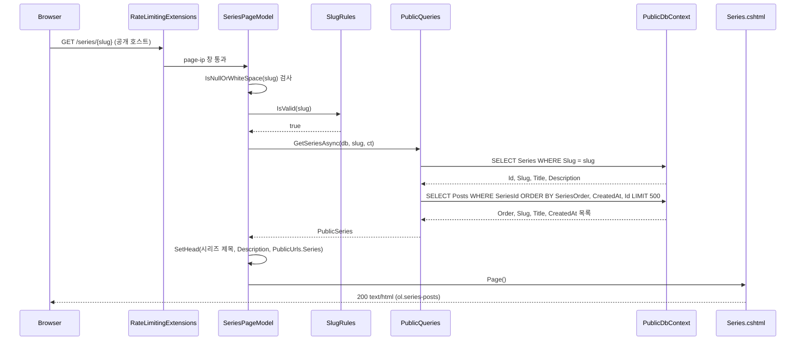
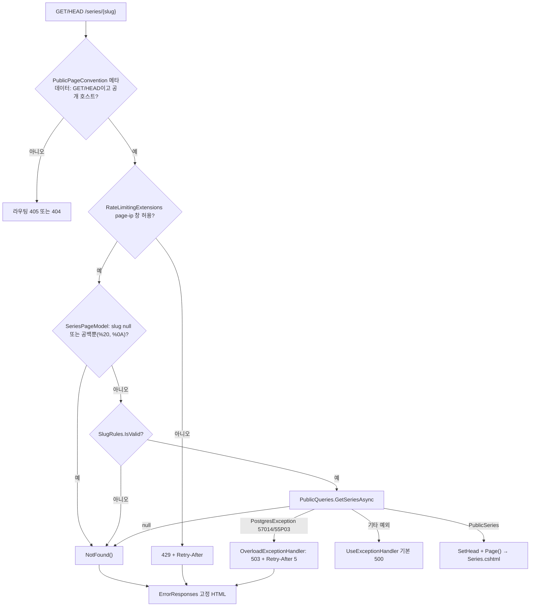

# F015 공개 시리즈별 글 목록

<!-- doc-harness:section id="summary" hash="51f9292acf21c586d35372b003477b991c874d52908d3a16ced944a3fb39ff33" -->
## 한 줄 요약

결론: F015는 읽기 전용 기능이다. Razor 페이지 SeriesPageModel(/series/{slug}) 하나와 정적 조회 PublicQueries.GetSeriesAsync 하나로 이뤄진다. PublicPageConvention이 붙인 메타데이터가 GET/HEAD 전용, 공개 호스트 전용, PublicPage 속도 제한을 강제한다. 속도 제한은 IP별 page-ip 고정 창이고 기본 분당 120회다. 핸들러는 다음 순서로 판정한다. (1) slug가 null이거나 공백뿐이면 404다. 모델 바인딩이 %20·%0A 같은 공백뿐인 값을 null로 바꾸고, IsNullOrWhiteSpace가 이를 잡는다. (2) SlugRules.IsValid에 실패하면 404다(대문자·밑줄·100자 초과 등). (3) 시리즈가 없으면 404다. (4) 정상이면 SetHead 후 Series.cshtml을 렌더링한다. DB 접근은 PublicDbContext를 통한 SELECT 2회뿐이다: Series 1건, 소속 Posts 최대 SeriesMax=500건. 이 컨텍스트에는 statement_timeout, default_transaction_read_only=on, NoTracking이 걸려 있다. 57014(문장 시간 초과)와 55P03(잠금 대기 초과)은 OverloadExceptionHandler가 503 + Retry-After 5로 바꾼다. 본문 없는 404/429는 ErrorResponses가 고정 HTML로 채운다. 글에는 공개/비공개 상태 필드가 없다. 그래서 '공개 글'은 시리즈에 속한 모든 글이다. 500건을 넘는 글은 안내 없이 잘리고 페이지네이션도 없다. 이 기능에는 명시적 로깅·재시도·폴백 코드가 없다.

| 항목 | 값 |
|---|---|
| 중요도 | SUPPORTING |
| 상태 | ACTIVE |
| 진입점 | `Razor /series/{slug} (GET/HEAD, 공개 호스트 전용) — SeriesPageModel.OnGetAsync` |
| 의존 기능 | [F019](../09_FEATURES.md#f019), [F020](../09_FEATURES.md#f020) |

### 진입점 근거

| 내용 | 상태 | 근거 |
|---|---|---|
| Razor 페이지 라우트는 `@page "/series/{slug}"`, 모델은 `SeriesPageModel`이다. 핸들러는 `OnGetAsync(string? slug, CancellationToken ct)` 하나뿐이다. | CONFIRMED | `PortfolioBlog.Api/Pages/Series.cshtml` (1-2), `PortfolioBlog.Api/Pages/Series.cshtml.cs` SeriesPageModel.OnGetAsync (37-46) |
| `PublicPageConvention`은 모든 Razor 페이지에 메타데이터 세 가지를 붙인다: GET/HEAD 전용(HttpMethodMetadata), 공개 호스트 전용(HostAttribute), 속도 제한 정책 `RateLimitPolicy.PublicPage`(/Search만 Search). Program.cs가 RazorPagesOptions 지연 구성으로 이 규약을 등록하고, `app.MapRazorPages()`로 매핑한다. | CONFIRMED | `PortfolioBlog.Api/Pages/PublicPageConvention.cs` PublicPageConvention.Apply (32-41), `PortfolioBlog.Api/Program.cs` (68-71), `PortfolioBlog.Api/Program.cs` (123) |
| 이 페이지로 오는 내부 링크는 PublicUrls.Series(slug) = "/series/" + slug로 만든다. 글 상세의 시리즈 박스 등에서 쓴다. 테스트는 /posts/gc-1의 p.series-box 링크가 /series/gc-series인지 확인한다. | CONFIRMED | `PortfolioBlog.Api/Infrastructure/Web/PublicUrls.cs` PublicUrls.Series (39), `PortfolioBlog.Api.Tests/Features/PublicPagesTests.cs` Tag_And_Series_Pages (190-191) |
<!-- /doc-harness:section -->

<!-- doc-harness:section id="flow" hash="2f3a5b6dce314aceafbe4d22b0c0ed2b634c40b9a972b98b2f921a1b285a379c" -->
## 처리 흐름

| 단계 | 컴포넌트 | 코드 | 설명 |
|---|---|---|---|
| 1 | SecurityHeadersMiddleware | `PortfolioBlog.Api/Program.cs` app.UseMiddleware<SecurityHeadersMiddleware> | 앱 미들웨어 맨 앞에 등록되어, 응답 시작 직전에 보안 헤더를 붙인다. 요청은 이어서 UseTrustedForwardedHeaders → UseExceptionHandler → UseStatusCodePages(ErrorResponses.HandleStatusCodeAsync) → UseStaticFiles → AdminSurfaceMiddleware 순으로 지난다. |
| 2 | PublicPageConvention | `PortfolioBlog.Api/Pages/PublicPageConvention.cs` PublicPageConvention.Apply | 라우팅이 엔드포인트 메타데이터(HttpMethodMetadata GET/HEAD, HostAttribute 공개 호스트)를 집행한다. 다른 메서드는 405, 다른 호스트는 404다. |
| 3 | RateLimitingExtensions | `PortfolioBlog.Api/Infrastructure/Web/RateLimitingExtensions.cs` RateLimitingExtensions.BuildChain | UseRateLimiter가 엔드포인트의 RateLimitMetadata(PublicPage)를 읽어 IP별 고정 창 "page-ip:"+IP를 적용한다. 한도는 PublicOptions.PagePerIpPerMinute이고 기본값은 120이다. 거부되면 429 + Retry-After다. |
| 4 | SeriesPageModel | `PortfolioBlog.Api/Pages/Series.cshtml.cs` SeriesPageModel.OnGetAsync | string.IsNullOrWhiteSpace(slug)이면 NotFound()다. 모델 바인딩은 공백뿐인 경로 값(스페이스 %20, 개행 %0A 등)을 null로 바꾼다. 그래서 널 방어가 필요하다. |
| 5 | SlugRules | `PortfolioBlog.Api/Infrastructure/Data/SlugRules.cs` SlugRules.IsValid | 길이가 AppDbContext.SlugMax(100) 이하인지, 정규식 \A[a-z0-9]+(-[a-z0-9]+)*\z에 맞는지 검사한다. 실패하면 DB 조회 없이 NotFound()다. |
| 6 | PublicQueries | `PortfolioBlog.Api/Infrastructure/Data/PublicQueries.cs` PublicQueries.GetSeriesAsync | PublicDbContext.Series에서 Slug가 일치하는 행을 {Id, Slug, Title, Description}으로 SingleOrDefaultAsync 조회한다. 없으면 null을 반환한다. |
| 7 | PublicQueries | `PortfolioBlog.Api/Infrastructure/Data/PublicQueries.cs` PublicQueries.GetSeriesAsync | PublicDbContext.Posts에서 SeriesId == series.Id인 글을 SeriesOrder, CreatedAt, Id 오름차순으로 정렬하고 Take(SeriesMax=500)로 자른다. {Order = SeriesOrder ?? 0, Slug, Title, CreatedAt}으로 프로젝션해 ToListAsync로 읽는다. 결과는 PublicSeries/PublicSeriesEntry record로 변환한다. |
| 8 | SeriesPageModel | `PortfolioBlog.Api/Pages/Series.cshtml.cs` SeriesPageModel.OnGetAsync | 결과가 null이면 NotFound()다. 아니면 Series 속성에 저장한다. 이어 SetHead("시리즈: {Title}", Description, PublicUrls.Series(Slug))로 ViewData["Head"]를 채우고 Page()를 반환한다. |
| 9 | PublicPageModel | `PortfolioBlog.Api/Pages/PublicPageModel.cs` PublicPageModel.SetHead | PageHead를 만들어 ViewData에 넣는다. 제목은 "{title} · {Site.Title}"이고, 공백뿐인 description은 null이 된다. canonical은 Site.PublicOrigin + path다. |
| 10 | Series.cshtml | `PortfolioBlog.Api/Pages/Series.cshtml` | h1 "시리즈: {Title}"을 출력한다. Description이 비어 있지 않으면 p.series-description을 출력한다. ol.series-posts에는 글마다 PublicUrls.Post(slug) 링크와 PublicFormat.Rfc3339/DisplayDate 시각을 넣는다. 출력은 모두 Razor 자동 HTML 인코딩을 거친다. |
| 11 | _Layout.cshtml | `PortfolioBlog.Api/Pages/Shared/_Layout.cshtml` | ViewData["Head"]의 PageHead로 title, meta description, canonical, og:* 태그를 렌더링하고 본문을 감싼다. |
<!-- /doc-harness:section -->

<!-- doc-harness:section id="F015_SEQUENCE" hash="5310f122b8e6c94da63749d899ac79e2890a157238647c9c4afe9571e62b47d5" -->
## /series/{slug} 정상 경로 호출 순서 (Sequence Diagram)

정상 요청은 속도 제한 통과 → slug 공백/형식 검사 → PublicQueries의 SELECT 2회 → SetHead → Series.cshtml 렌더링 순으로 처리된다.

RateLimitingExtensions는 UseRateLimiter에 등록된 체인(BuildChain)을 대표하는 참여자이고, page-ip 창의 기본 한도는 분당 120회다. SeriesPageModel은 공백/null slug를 먼저 거르고, 그다음 SlugRules.IsValid로 형식을 검사한다. PublicQueries.GetSeriesAsync는 PublicDbContext(읽기 전용 트랜잭션, statement_timeout)로 시리즈 1건과 소속 글 최대 500건을 순차 조회한다. 결과는 PublicSeries record로 변환된다. 마지막으로 PublicPageModel.SetHead가 ViewData에 머리 정보를 넣고, Series.cshtml과 _Layout.cshtml이 HTML을 만든다.

### 코드 근거

| 구성 요소 | 코드 |
|---|---|
| RateLimitingExtensions | `PortfolioBlog.Api/Infrastructure/Web/RateLimitingExtensions.cs` (BuildChain) |
| SeriesPageModel | `PortfolioBlog.Api/Pages/Series.cshtml.cs` (SeriesPageModel.OnGetAsync) |
| SlugRules | `PortfolioBlog.Api/Infrastructure/Data/SlugRules.cs` (SlugRules.IsValid) |
| PublicQueries | `PortfolioBlog.Api/Infrastructure/Data/PublicQueries.cs` (PublicQueries.GetSeriesAsync) |
| PublicDbContext | `PortfolioBlog.Api/Infrastructure/Data/PublicDbContext.cs` (PublicDbContext) |
| Series.cshtml | `PortfolioBlog.Api/Pages/Series.cshtml` |
<!-- /doc-harness:section -->

<!-- doc-harness:section id="F015_FLOW" hash="8ec35000993285505c78c0a10cd598d0efbb04f75b3cdefd2dbe6d8652e69702" -->
## /series/{slug} 분기와 실패 경로 (Flowchart)

라우팅·속도 제한·공백/null·형식·존재 여부 순으로 거르고, 실패는 모두 ErrorResponses의 고정 HTML(404/429/503)로 끝난다. 예외는 하나다: 과부하가 아닌 DB 예외는 기본 500이 된다.

공백뿐인 slug(스페이스·개행 등)는 모델 바인딩이 null로 바꾼다. 그래서 SlugRules가 아니라 IsNullOrWhiteSpace 분기에서 404가 된다(Series.cshtml.cs 39행). SlugRules.IsValid 분기는 공백이 아닌 값 중 길이·문자 집합 위반만 거른다. DB 예외 가운데 57014·55P03만 OverloadExceptionHandler가 503으로 바꾸고, 나머지는 UseExceptionHandler 기본 처리로 간다. 404·429·503의 본문은 ErrorResponses.WriteAsync가 쓰는 고정 HTML이다. HEAD 요청이면 본문 없이 헤더만 나간다.

### 코드 근거

| 구성 요소 | 코드 |
|---|---|
| RouteCheck | `PortfolioBlog.Api/Pages/PublicPageConvention.cs` (PublicPageConvention.Apply) |
| RateCheck | `PortfolioBlog.Api/Infrastructure/Web/RateLimitingExtensions.cs` (BuildChain) |
| BlankCheck | `PortfolioBlog.Api/Pages/Series.cshtml.cs` (SeriesPageModel.OnGetAsync) |
| FormatCheck | `PortfolioBlog.Api/Infrastructure/Data/SlugRules.cs` (SlugRules.IsValid) |
| Query | `PortfolioBlog.Api/Infrastructure/Data/PublicQueries.cs` (PublicQueries.GetSeriesAsync) |
| Overload | `PortfolioBlog.Api/Infrastructure/Web/OverloadExceptionHandler.cs` (OverloadExceptionHandler.TryHandleAsync) |
| Render | `PortfolioBlog.Api/Pages/Series.cshtml` |
| ErrorHtml | `PortfolioBlog.Api/Infrastructure/Web/ErrorResponses.cs` (ErrorResponses.WriteAsync) |
<!-- /doc-harness:section -->

<!-- doc-harness:section id="data" hash="866b04857d83ebce8b21d4207423f4143eced7a1dc7af95d4b492a1699835bb5" -->
## 데이터

### 데이터 흐름

| 내용 | 상태 | 근거 |
|---|---|---|
| 입력은 경로 세그먼트 slug(string?) 하나다. 모델 바인딩이 공백뿐인 값을 null로 바꾸므로 핸들러는 널 허용으로 받는다. 쿼리 문자열·본문 입력은 없다. | CONFIRMED | `PortfolioBlog.Api/Pages/Series.cshtml.cs` SeriesPageModel.OnGetAsync (26,37-40) |
| DB → DTO: Series 행은 익명 형식 {Id, Slug, Title, Description}으로, Posts 행은 {Order = SeriesOrder ?? 0, Slug, Title, CreatedAt}으로 프로젝션된다. 메모리에서 PublicSeries(Slug, Title, Description, IReadOnlyList<PublicSeriesEntry>)로 변환된다. 본문(ContentMarkdown)·태그는 읽지 않는다. | CONFIRMED | `PortfolioBlog.Api/Infrastructure/Data/PublicQueries.cs` PublicQueries.GetSeriesAsync (168-177), `PortfolioBlog.Api/Infrastructure/Data/PublicModels.cs` PublicSeries / PublicSeriesEntry (51-63) |
| DTO → 뷰: SeriesPageModel.Series 속성이 Series.cshtml로 전달된다. 시리즈 제목·설명·글 제목은 Razor 기본 인코딩으로 출력된다. 테스트는 설명 "설명 <u>x</u>"가 u 요소로 해석되지 않음을 확인한다. | CONFIRMED | `PortfolioBlog.Api/Pages/Series.cshtml` (3-16), `PortfolioBlog.Api.Tests/Features/PublicPagesTests.cs` Tag_And_Series_Pages (173,186-188) |
| 머리 정보: SetHead가 ViewData["Head"]에 PageHead를 넣는다. 내용은 제목 "시리즈: {Title} · {Site.Title}", description(공백뿐이면 null), canonical = Site.PublicOrigin + "/series/" + slug, og:type website다. _Layout.cshtml이 이를 읽어 meta/link 태그로 출력한다. | CONFIRMED | `PortfolioBlog.Api/Pages/PublicPageModel.cs` PublicPageModel.SetHead (39-43), `PortfolioBlog.Api/Pages/Shared/_Layout.cshtml` |
| 출력은 200 text/html 페이지다. 글 항목의 날짜는 Rfc3339(datetime 속성)와 DisplayDate(표시용) 두 형식으로 포맷된다. PublicSeriesEntry.Order는 조회·전달되지만 Series.cshtml에서 출력되지 않는다. | CONFIRMED | `PortfolioBlog.Api/Pages/Series.cshtml` (9-15), `PortfolioBlog.Api/Infrastructure/Web/PublicFormat.cs` PublicFormat.Rfc3339 / PublicFormat.DisplayDate |
| 캐시: 이 기능은 응답 캐시·RenderedPostCache 등 어떤 캐시도 쓰지 않고, 매 요청 DB를 조회한다. 파일·외부 네트워크 접근도 없다. | CONFIRMED | `PortfolioBlog.Api/Pages/Series.cshtml.cs` SeriesPageModel (20-47), `PortfolioBlog.Api/Infrastructure/Data/PublicQueries.cs` PublicQueries.GetSeriesAsync (168-177) |

### DB 접근

| 엔티티 | 작업 | 코드 |
|---|---|---|
| Series | SELECT | `PortfolioBlog.Api/Infrastructure/Data/PublicQueries.cs` PublicQueries.GetSeriesAsync (Where Slug == slug, SingleOrDefaultAsync; Slug 고유 인덱스) |
| Posts | SELECT | `PortfolioBlog.Api/Infrastructure/Data/PublicQueries.cs` PublicQueries.GetSeriesAsync (Where SeriesId == id, OrderBy SeriesOrder/CreatedAt/Id, Take 500; 인덱스 (SeriesId, SeriesOrder, CreatedAt, Id)) |

### 상태 전이

_(상태 없음)_

### 외부 의존

| 내용 | 상태 | 근거 |
|---|---|---|
| PostgreSQL(Npgsql/EF Core): PublicDbContext는 ConnectionStrings:Public(없으면 Default)로 별도 풀에 접속한다. 연결에는 시작 옵션 `-c statement_timeout={Public:StatementTimeoutMs} -c default_transaction_read_only=on`과 ApplicationName PortfolioBlog.Public가 붙는다. NoTracking으로 등록된다. | CONFIRMED | `PortfolioBlog.Api/Infrastructure/Data/PublicDbContext.cs` PublicDbContext.BuildConnectionString (46-62), `PortfolioBlog.Api/Infrastructure/Data/DataServiceCollectionExtensions.cs` AddBlogData (30-38) |
| Public:StatementTimeoutMs 기본값은 3000이고, StartupValidation이 100~60000 범위를 강제한다. Public:PagePerIpPerMinute 기본값은 120이고, StartupValidation이 1 이상을 강제한다. | CONFIRMED | `PortfolioBlog.Api/Infrastructure/Web/PublicOptions.cs` PublicOptions (18,30), `PortfolioBlog.Api/Infrastructure/Access/StartupValidation.cs` (75-81) |
| ASP.NET Core Razor Pages, 라우팅(HostAttribute, HttpMethodMetadata), RateLimiter 미들웨어에 의존한다. | CONFIRMED | `PortfolioBlog.Api/Pages/PublicPageConvention.cs` (32-41), `PortfolioBlog.Api/Program.cs` (98-108,123) |
<!-- /doc-harness:section -->

<!-- doc-harness:section id="failures" hash="b8b2d24ac47fcdd3b5a0c9c08ae5bbda4f43c0dd6896d9aa41d9eb93740aa424" -->
## 실패 지점

| 위치 | 조건 | 처리 | 상태 | 근거 |
|---|---|---|---|---|
| SeriesPageModel.OnGetAsync (IsNullOrWhiteSpace 검사) | slug가 null이거나 공백뿐이다(예: /series/%20 스페이스, /series/%0A 개행). 모델 바인딩이 이런 값을 null로 바꾼다. | SlugRules까지 가지 않고 39행에서 NotFound()를 반환한다. 이어 UseStatusCodePages가 ErrorResponses.WriteAsync로 고정 HTML 404("페이지를 찾을 수 없습니다.")를 쓴다. 요청 값은 반사하지 않는다. | CONFIRMED | `PortfolioBlog.Api/Pages/Series.cshtml.cs` SeriesPageModel.OnGetAsync (26,39), `PortfolioBlog.Api/Infrastructure/Web/ErrorResponses.cs` ErrorResponses.WriteAsync (45-77), `PortfolioBlog.Api.Tests/Features/PublicPagesTests.cs` Missing_Is404Html_WithoutReflection (102-104,112-113,118-125) |
| SeriesPageModel.OnGetAsync / SlugRules.IsValid | 공백뿐이 아닌 slug가 100자를 넘거나 \A[a-z0-9]+(-[a-z0-9]+)*\z 형식이 아니다(예: 대문자, 밑줄, 허용 밖 문자). | 40행에서 DB 조회 없이 NotFound()를 반환한다. 결과는 고정 HTML 404다. | CONFIRMED | `PortfolioBlog.Api/Pages/Series.cshtml.cs` SeriesPageModel.OnGetAsync (40), `PortfolioBlog.Api/Infrastructure/Data/SlugRules.cs` SlugRules.IsValid (24,38) |
| PublicQueries.GetSeriesAsync | 일치하는 시리즈가 없다. | null 반환 → NotFound() → 고정 HTML 404 | CONFIRMED | `PortfolioBlog.Api/Infrastructure/Data/PublicQueries.cs` (170-171), `PortfolioBlog.Api/Pages/Series.cshtml.cs` (42), `PortfolioBlog.Api.Tests/Features/PublicPagesTests.cs` (110) |
| PublicQueries.GetSeriesAsync (DB 문장 실행) | statement_timeout 초과(PostgresException SqlState 57014) 또는 잠금 대기 초과(55P03) | 예외가 UseExceptionHandler까지 전파된다. OverloadExceptionHandler.IsOverload가 InnerException 체인에서 이를 감지한다. 응답은 503 + Retry-After: 5 + ErrorResponses 고정 HTML("서버가 바쁩니다")이다. 서버는 재시도하지 않고 클라이언트에 맡긴다. | CONFIRMED | `PortfolioBlog.Api/Infrastructure/Web/OverloadExceptionHandler.cs` OverloadExceptionHandler.TryHandleAsync / IsOverload (35-70), `PortfolioBlog.Api/Program.cs` (43,100) |
| PublicQueries.GetSeriesAsync (DB 연결) | DB 연결 실패 또는 기타 Npgsql/EF 예외 | 처리 없음(예외 전파). OverloadExceptionHandler가 false를 반환하므로 UseExceptionHandler 기본 처리(500)로 넘어간다. 기능 수준의 폴백·재시도는 없다. | POTENTIAL_ISSUE | `PortfolioBlog.Api/Pages/Series.cshtml.cs` (41), `PortfolioBlog.Api/Infrastructure/Web/OverloadExceptionHandler.cs` (37) |
| RateLimiter(UseRateLimiter) — RateLimitingExtensions.BuildChain | 같은 IP의 page-ip 고정 창(Public:PagePerIpPerMinute, 기본 120/분) 소진 | 429 + Retry-After를 반환한다. Retry-After는 창 종료까지 남은 1~60초다. 본문 없는 429는 UseStatusCodePages가 ErrorResponses 고정 HTML("요청이 너무 많습니다")로 채운다. | CONFIRMED | `PortfolioBlog.Api/Infrastructure/Web/RateLimitingExtensions.cs` AddAppRateLimiting / BuildChain (42-56,100), `PortfolioBlog.Api/Infrastructure/Web/PublicOptions.cs` (18), `PortfolioBlog.Api/Program.cs` (101,105) |
| 라우팅(PublicPageConvention 메타데이터) | GET/HEAD가 아닌 메서드, 또는 관리 호스트처럼 공개 호스트가 아닌 Host | 405(Allow 헤더 포함) 또는 404를 반환하고 핸들러는 실행되지 않는다. 테스트는 같은 규약을 / 경로로 검증한다. | CONFIRMED | `PortfolioBlog.Api/Pages/PublicPageConvention.cs` (16-18,32-41), `PortfolioBlog.Api.Tests/Features/PublicPagesTests.cs` Pages_AreReadOnly_AndBoundToThePublicHost (127-140) |
| PublicQueries.GetSeriesAsync (CancellationToken) | 클라이언트가 요청을 끊음(RequestAborted) | 처리 없음. OperationCanceledException이 전파되고 프레임워크 기본 처리에 맡긴다. | INFERRED | `PortfolioBlog.Api/Pages/Series.cshtml.cs` (37,41) |

### 엣지 케이스

| 내용 | 상태 | 근거 |
|---|---|---|
| 시리즈 소속 글이 SeriesMax(500)건을 넘으면 Take(500)로 조용히 잘린다. 페이지네이션도 '더 있음' 안내도 없어서, 501번째 이후 글은 이 페이지에 나오지 않는다. | POTENTIAL_ISSUE | `PortfolioBlog.Api/Infrastructure/Data/PublicQueries.cs` SeriesMax / GetSeriesAsync (23,172-174) |
| 소속 글이 0건인 시리즈는 404가 아니라 200과 빈 ol.series-posts로 렌더링된다. 빈 목록을 따로 처리하는 분기가 없다. | CONFIRMED | `PortfolioBlog.Api/Pages/Series.cshtml` (8-16), `PortfolioBlog.Api/Pages/Series.cshtml.cs` (42-45) |
| SeriesOrder는 중복 값을 허용한다. 순서 값이 같으면 CreatedAt, Id 순으로 결정적으로 정렬된다. 이 정렬에 맞는 복합 인덱스 (SeriesId, SeriesOrder, CreatedAt, Id)가 있다. | CONFIRMED | `PortfolioBlog.Api/Infrastructure/Data/PublicQueries.cs` (173), `PortfolioBlog.Api/Infrastructure/Data/AppDbContext.cs` (97-120) |
| Description이 빈 문자열이면 p.series-description을 출력하지 않는다. SetHead도 description을 null로 만들어 meta description을 생략한다. 공백만 있는 Description은 다르게 처리된다: 템플릿은 Length > 0이라 출력하지만, meta description은 생략된다(IsNullOrWhiteSpace). | CONFIRMED | `PortfolioBlog.Api/Pages/Series.cshtml` (4-7), `PortfolioBlog.Api/Pages/PublicPageModel.cs` (42) |
| 개행이 slug 앞뒤에 붙은 값의 처리 경로는 두 가지다. 개행만 있는 값(/series/%0A)은 모델 바인딩이 null로 바꿔 IsNullOrWhiteSpace에서 404가 된다. 개행이 다른 문자와 함께 있는 값(예: 'abc\n')은 SlugRules의 \A…\z 앵커가 거부한다. 앵커를 쓰는 이유는 .NET $의 끝 개행 예외를 피하기 위해서다. | CONFIRMED | `PortfolioBlog.Api/Pages/Series.cshtml.cs` (39-40), `PortfolioBlog.Api/Infrastructure/Data/SlugRules.cs` (21-24), `PortfolioBlog.Api.Tests/Features/PublicPagesTests.cs` (102-104,113) |
| 글 엔티티에 공개/비공개(초안) 상태 필드가 없어서, 시리즈에 연결된 글은 모두 이 목록에 노출된다. | CONFIRMED | `PortfolioBlog.Api/Domain/Post.cs` |
| 시리즈 조회와 소속 글 조회는 별도 SELECT 2회다. 같은 스냅숏에서 실행된다는 보장이 없다. 두 쿼리 사이에 시리즈가 삭제되거나 글 소속이 바뀌면, 이전 시리즈 메타와 바뀐 글 목록이 한 응답에 섞일 수 있다. 영향은 그 응답 한 번에 그친다. | INFERRED | `PortfolioBlog.Api/Infrastructure/Data/PublicQueries.cs` (170-176) |
| PublicSeriesEntry.Order는 SeriesOrder ?? 0으로 채워지지만 Series.cshtml에서 쓰이지 않는다. 순서는 ol 번호로만 드러난다. | CONFIRMED | `PortfolioBlog.Api/Infrastructure/Data/PublicQueries.cs` (174), `PortfolioBlog.Api/Pages/Series.cshtml` (9-15) |
| HEAD 요청도 같은 핸들러(OnGetAsync)를 실행해 DB를 조회한다. 404일 때 ErrorResponses는 HEAD 요청에 본문을 쓰지 않는다. | INFERRED | `PortfolioBlog.Api/Pages/PublicPageConvention.cs` (37), `PortfolioBlog.Api/Infrastructure/Web/ErrorResponses.cs` (54) |

### 로깅

| 내용 | 상태 | 근거 |
|---|---|---|
| SeriesPageModel과 PublicQueries.GetSeriesAsync에는 ILogger 주입도 명시적 로그 호출도 없다. 로그는 ASP.NET Core·EF Core 프레임워크의 기본 로깅(예외 처리 미들웨어, EF 명령 로그)에만 의존한다. | CONFIRMED | `PortfolioBlog.Api/Pages/Series.cshtml.cs` (20-47), `PortfolioBlog.Api/Infrastructure/Data/PublicQueries.cs` (168-177) |
| DB 쪽에서는 공개 연결의 ApplicationName이 PortfolioBlog.Public로 설정된다. 그래서 pg_stat_activity 등에서 관리 연결과 구분된다. | CONFIRMED | `PortfolioBlog.Api/Infrastructure/Data/PublicDbContext.cs` (60) |
<!-- /doc-harness:section -->

<!-- doc-harness:section id="code" hash="173115484726a58dc978dfe9ed1d80107a9a3a5233aafeed7bbfa8804015fd0a" -->
## 관련 코드

| 파일 | 심볼 | 역할 |
|---|---|---|
| `PortfolioBlog.Api/Pages/Series.cshtml` | @page "/series/{slug}" | render |
| `PortfolioBlog.Api/Pages/Series.cshtml.cs` | SeriesPageModel.OnGetAsync | entry |
| `PortfolioBlog.Api/Pages/PublicPageModel.cs` | PublicPageModel.SetHead | render |
| `PortfolioBlog.Api/Pages/PublicPageConvention.cs` | PublicPageConvention.Apply | config |
| `PortfolioBlog.Api/Pages/Shared/_Layout.cshtml` | - | render |
| `PortfolioBlog.Api/Infrastructure/Data/PublicQueries.cs` | PublicQueries.GetSeriesAsync | data |
| `PortfolioBlog.Api/Infrastructure/Data/PublicModels.cs` | PublicSeries | dto |
| `PortfolioBlog.Api/Infrastructure/Data/PublicModels.cs` | PublicSeriesEntry | dto |
| `PortfolioBlog.Api/Infrastructure/Data/PublicDbContext.cs` | PublicDbContext.BuildConnectionString | data |
| `PortfolioBlog.Api/Infrastructure/Data/DataServiceCollectionExtensions.cs` | DataServiceCollectionExtensions.AddBlogData | config |
| `PortfolioBlog.Api/Infrastructure/Data/SlugRules.cs` | SlugRules.IsValid | validation |
| `PortfolioBlog.Api/Infrastructure/Data/AppDbContext.cs` | AppDbContext.OnModelCreating | data |
| `PortfolioBlog.Api/Domain/Series.cs` | Series | data |
| `PortfolioBlog.Api/Domain/Post.cs` | Post.SeriesId / Post.SeriesOrder | data |
| `PortfolioBlog.Api/Infrastructure/Web/PublicUrls.cs` | PublicUrls.Series / PublicUrls.Post | render |
| `PortfolioBlog.Api/Infrastructure/Web/PublicFormat.cs` | PublicFormat.Rfc3339 / PublicFormat.DisplayDate | render |
| `PortfolioBlog.Api/Infrastructure/Web/PublicOptions.cs` | PublicOptions.PagePerIpPerMinute / StatementTimeoutMs | config |
| `PortfolioBlog.Api/Infrastructure/Web/ErrorResponses.cs` | ErrorResponses.WriteAsync | render |
| `PortfolioBlog.Api/Infrastructure/Web/OverloadExceptionHandler.cs` | OverloadExceptionHandler.TryHandleAsync | service |
| `PortfolioBlog.Api/Infrastructure/Web/RateLimitingExtensions.cs` | RateLimitingExtensions.BuildChain | config |
| `PortfolioBlog.Api/Program.cs` | - | config |
| `PortfolioBlog.Api.Tests/Features/PublicPagesTests.cs` | Tag_And_Series_Pages / Missing_Is404Html_WithoutReflection | test |

근거: `PortfolioBlog.Api/Pages/Series.cshtml.cs` SeriesPageModel.OnGetAsync (20-47), `PortfolioBlog.Api/Pages/Series.cshtml` (1-16), `PortfolioBlog.Api/Infrastructure/Data/PublicQueries.cs` PublicQueries.GetSeriesAsync (23,168-177), `PortfolioBlog.Api/Infrastructure/Data/PublicModels.cs` PublicSeries / PublicSeriesEntry (51-63), `PortfolioBlog.Api/Infrastructure/Data/PublicDbContext.cs` PublicDbContext, `PortfolioBlog.Api/Infrastructure/Data/DataServiceCollectionExtensions.cs` AddBlogData (30-38), `PortfolioBlog.Api/Infrastructure/Data/SlugRules.cs` SlugRules.IsValid (21-38), `PortfolioBlog.Api/Pages/PublicPageConvention.cs` PublicPageConvention.Apply (32-41), `PortfolioBlog.Api/Pages/PublicPageModel.cs` PublicPageModel.SetHead (39-43), `PortfolioBlog.Api/Program.cs` (43,68-71,98-108,123), `PortfolioBlog.Api/Infrastructure/Web/ErrorResponses.cs` ErrorResponses.WriteAsync (45-77), `PortfolioBlog.Api/Infrastructure/Web/OverloadExceptionHandler.cs` OverloadExceptionHandler (35-70), `PortfolioBlog.Api/Infrastructure/Web/RateLimitingExtensions.cs` BuildChain (88-101), `PortfolioBlog.Api/Infrastructure/Web/PublicOptions.cs` PublicOptions.PagePerIpPerMinute / StatementTimeoutMs (18,30), `PortfolioBlog.Api/Infrastructure/Data/AppDbContext.cs` (97-120), `PortfolioBlog.Api.Tests/Features/PublicPagesTests.cs` Tag_And_Series_Pages / Missing_Is404Html_WithoutReflection (102-125,170-194)
<!-- /doc-harness:section -->

<!-- doc-harness:section id="unknowns" hash="0d567e55a81ca810c4a60ba51a71ef6d8c232a4b7a7dec9ecf12a60d9aae5134" -->
## 확인하지 못한 것

- OverloadExceptionHandler가 처리하지 않는 일반 예외(DB 연결 실패 등)가 공개 HTML 경로에서 어떤 본문 형식으로 나가는지 알 수 없다. 후보는 ProblemDetails JSON 또는 빈 본문이다. UseExceptionHandler()가 경로/핸들러 없이 AddProblemDetails와 함께 등록되어 있어 코드만으로 최종 본문을 확정할 수 없다.
- Public:PagePerIpPerMinute의 운영 환경 실제 값은 확인하지 않았다(appsettings 값은 옮기지 않음). 코드 기본값은 120(PublicOptions.cs 18행)이다.
- 클라이언트 취소(OperationCanceledException) 시 응답 상태 코드·로그 형태는 프레임워크 기본 동작을 따르며, 이 저장소에서 확인하지 않았다.
- 시리즈 소속 글이 500건을 넘는 상황에 대한 테스트나 운영 요구가 있는지 코드·테스트에서 확인되지 않았다.
<!-- /doc-harness:section -->

<!-- doc-harness:section id="related" hash="e6b04ee08cc1bd1a2625cbb81ca24992b9da0467258ba6539a8ab5b4aeff04d8" -->
## 관련 문서

- [../09_FEATURES](../09_FEATURES.md)
- [../08_API](../08_API.md)
- [../07_DATA_MODEL](../07_DATA_MODEL.md)
- [../11_FAILURE_HISTORY](../11_FAILURE_HISTORY.md)
<!-- /doc-harness:section -->
