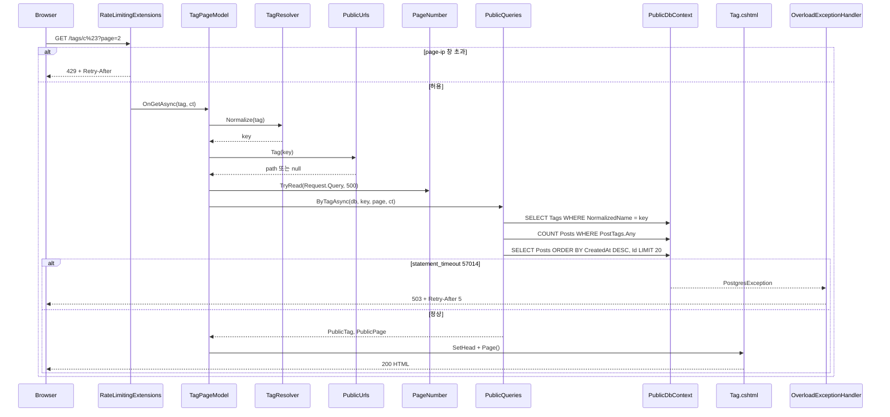
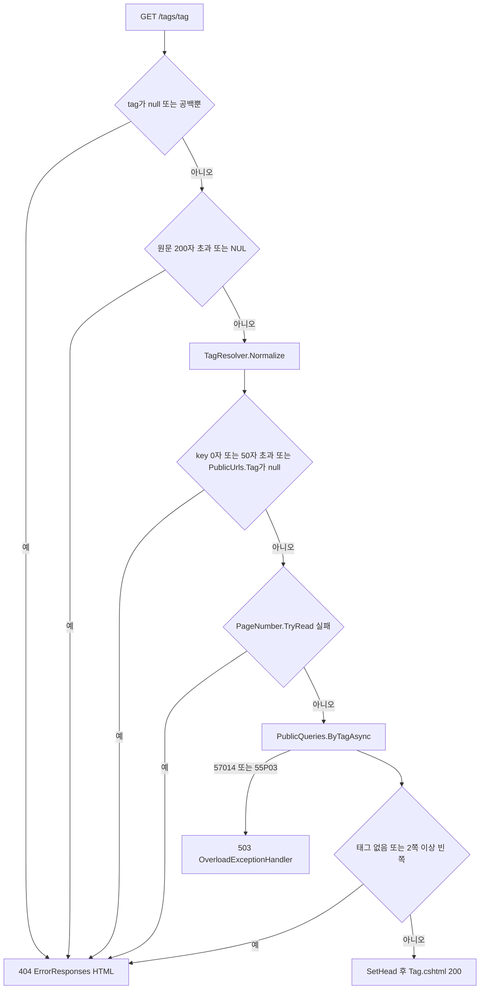

# F016 공개 태그별 글 목록

<!-- doc-harness:section id="summary" hash="77c3afc4eeeb238c0f5c4bf44fa05c622d96602417c49eed6376f776707d0da7" -->
## 한 줄 요약

결론: F016은 읽기 전용 Razor 페이지 하나(TagPageModel)와 정적 조회 헬퍼(PublicQueries.ByTagAsync → PageAsync)로 구현된 동작 중인 기능이다. 요청 1건마다 순차 DB 문장 3개를 실행한다: 태그 SELECT, COUNT, 목록 SELECT(태그 배열은 서브쿼리로 포함). 입력 검증은 모두 404로 끝난다. 404가 나는 경우는 공백뿐·null, 원문 200자 초과·NUL, 정규화 후 0자·50자 초과, '.'·'..', ?page 형식 오류·범위 밖, 없는 태그, 2쪽 이상의 빈 쪽이다. 과부하(statement_timeout 57014)는 OverloadExceptionHandler가 503 + Retry-After 5로 바꾼다. 속도 제한은 PublicPageConvention이 붙인 RateLimitPolicy.PublicPage(IP당 분당 기본 120)로 걸리고 초과하면 429다. 초안·비공개 개념이 없어 태그가 붙은 Post 행은 전부 보인다. 기능 코드 안에는 명시적 로깅·재시도·폴백·트랜잭션이 없다.

| 항목 | 값 |
|---|---|
| 중요도 | SUPPORTING |
| 상태 | ACTIVE |
| 진입점 | `Razor GET/HEAD /tags/{tag}?page=N (TagPageModel.OnGetAsync)` |
| 의존 기능 | [F019](../09_FEATURES.md#f019), [F020](../09_FEATURES.md#f020) |

### 진입점 근거

| 내용 | 상태 | 근거 |
|---|---|---|
| Razor 페이지 라우트 @page "/tags/{tag}"이며 모델은 TagPageModel이다. 핸들러는 OnGetAsync(string? tag, CancellationToken ct)다. | CONFIRMED | `PortfolioBlog.Api/Pages/Tag.cshtml` (1-2), `PortfolioBlog.Api/Pages/Tag.cshtml.cs` TagPageModel.OnGetAsync (57-72) |
| 모든 Razor 페이지에 GET/HEAD 전용 메타데이터, 공개 호스트(HostAttribute) 메타데이터, RateLimitPolicy.PublicPage 메타데이터가 규약으로 붙는다. /Search만 Search 정책이다. 페이지는 app.MapRazorPages()로 매핑된다. | CONFIRMED | `PortfolioBlog.Api/Pages/PublicPageConvention.cs` PublicPageConvention.Apply (32-41), `PortfolioBlog.Api/Program.cs` (68-71), `PortfolioBlog.Api/Program.cs` (123) |
| 들어오는 링크: 목록·상세의 _TagList 부분 뷰가 PublicUrls.Tag(tag.NormalizedName)로 /tags/{인코딩된 정규화명} 링크를 만든다. sitemap은 글이 1건 이상 달린 태그만 싣는다. | CONFIRMED | `PortfolioBlog.Api/Pages/Shared/_TagList.cshtml` (5-17), `PortfolioBlog.Api/Infrastructure/Data/PublicQueries.cs` PublicQueries.SitemapAsync (214-215) |
<!-- /doc-harness:section -->

<!-- doc-harness:section id="flow" hash="7ef0b21c582c258c3eaba3d5aa4fb3e95ad5edae2f7ca67cd504cd8142afbbc4" -->
## 처리 흐름

| 단계 | 컴포넌트 | 코드 | 설명 |
|---|---|---|---|
| 1 | Program | `PortfolioBlog.Api/Program.cs` 미들웨어 파이프라인 | 요청은 다음 순서로 통과한다: SecurityHeadersMiddleware, UseTrustedForwardedHeaders, UseExceptionHandler, UseStatusCodePages(ErrorResponses.HandleStatusCodeAsync), UseStaticFiles, AdminSurfaceMiddleware, UseRateLimiter, 인증·인가, ApiBodyLimitMiddleware, MapRazorPages. |
| 2 | PublicPageConvention | `PortfolioBlog.Api/Pages/PublicPageConvention.cs` PublicPageConvention.Apply | 앱 시작 때 /tags/{tag} 선택자에 HttpMethodMetadata(GET, HEAD), HostAttribute(publicHost), RateLimitMetadata(PublicPage)를 추가한다. 라우팅은 다른 메서드를 405로, 다른 호스트를 404로 처리한다. |
| 3 | RateLimitingExtensions | `PortfolioBlog.Api/Infrastructure/Web/RateLimitingExtensions.cs` RateLimitingExtensions.BuildChain | 엔드포인트 메타데이터가 PublicPage이면 'page-ip:{IP}' 파티션의 1분 고정 창(PublicOptions.PagePerIpPerMinute, 기본 120, QueueLimit 0)이 적용된다. 한도를 넘으면 429와 Retry-After를 돌려준다. |
| 4 | TagPageModel | `PortfolioBlog.Api/Pages/Tag.cshtml.cs` TagPageModel.OnGetAsync | tag가 null이거나 공백뿐이면 NotFound()를 돌려준다. 모델 바인딩이 공백뿐인 경로 값을 null로 바꾸므로 null을 허용한다. |
| 5 | TagPageModel | `PortfolioBlog.Api/Pages/Tag.cshtml.cs` TagPageModel.OnGetAsync | 정규화 전에 원문 길이가 AppDbContext.TagMax*4(200)를 넘거나 TextRules.ContainsNul이 참이면 404를 돌려준다. |
| 6 | TagResolver | `PortfolioBlog.Api/Infrastructure/Data/TagResolver.cs` TagResolver.Normalize | 트림과 연속 공백 1개 축소(Split(null)+Join)를 거쳐 NFC로 정규화하고 ToLowerInvariant를 적용한다. 저장할 때 쓰는 규칙과 같은 유일성 키다. |
| 7 | PublicUrls | `PortfolioBlog.Api/Infrastructure/Web/PublicUrls.cs` PublicUrls.Tag | 키 길이가 0이거나 TagMax(50)를 넘으면 404다. 키가 '.' 또는 '..'이면 PublicUrls.Tag가 null을 돌려주고 역시 404다. 그 밖에는 "/tags/" + Uri.EscapeDataString(key)를 정식 경로(path)로 계산한다. |
| 8 | PageNumber | `PortfolioBlog.Api/Pages/PageNumber.cs` PageNumber.TryRead | ?page를 직접 읽는다. 없으면 1쪽이다. 값이 하나이고 ASCII 숫자 1~4자리이며 1..IndexModel.MaxPage(500) 범위일 때만 통과하고, 실패하면 404다. |
| 9 | PublicQueries | `PortfolioBlog.Api/Infrastructure/Data/PublicQueries.cs` PublicQueries.ByTagAsync | db.Tags에서 NormalizedName == key인 행을 SingleOrDefaultAsync로 (Name, NormalizedName)으로 투영한다. 없으면 null을 돌려준다. |
| 10 | PublicQueries | `PortfolioBlog.Api/Infrastructure/Data/PublicQueries.cs` PublicQueries.PageAsync | 필터 db.Posts.Where(p => p.PostTags.Any(pt => pt.Tag.NormalizedName == key))를 받는다. page < 1이거나 page > int.MaxValue/20이면 ArgumentOutOfRangeException으로 방어한다. 이어서 CountAsync를 실행하고, CreatedAt DESC, Id 순으로 Skip((page-1)*20).Take(20)을 적용해 Slug·Title·Summary·CreatedAt·Tags 배열을 투영한 뒤 PublicPage<PublicPostSummary>를 만든다. |
| 11 | TagPageModel | `PortfolioBlog.Api/Pages/Tag.cshtml.cs` TagPageModel.OnGetAsync | 결과가 null이면 404다. page > 1인데 항목이 0건이어도 404다. 그 밖에는 Tag·Posts·_path를 채우고 SetHead("태그: {Name}", null, 1쪽이면 path, 아니면 path?page=N)로 canonical을 설정한 뒤 Page()를 돌려준다. |
| 12 | PublicPageModel | `PortfolioBlog.Api/Pages/PublicPageModel.cs` PublicPageModel.SetHead | ViewData["Head"]에 PageHead를 채운다. 제목은 '태그: X · 사이트제목'이고, canonical은 Site.PublicOrigin + path다. |
| 13 | Tag.cshtml | `PortfolioBlog.Api/Pages/Tag.cshtml` | h1 '태그: {Name}'을 출력한다. _PostList(Posts.Items)가 글 목록과 각 글의 _TagList를 그리고, _Pager(Pager)가 이전/다음 링크를 그린다. _Layout이 head(canonical, og)를 그린다. |
| 14 | TagPageModel | `PortfolioBlog.Api/Pages/Tag.cshtml.cs` TagPageModel.Pager | new PagerModel(_path, null, Posts.Page, Math.Min(Posts.LastPage, 500))을 만든다. _Pager는 LastPage > 1일 때만 nav를 출력하고, 1쪽 링크는 BasePath 그대로 쓴다. |
| 15 | ErrorResponses | `PortfolioBlog.Api/Infrastructure/Web/ErrorResponses.cs` ErrorResponses.WriteAsync | 실패 경로다. NotFound() 같은 본문 없는 상태 코드는 UseStatusCodePages가 고정 HTML(요청 값을 반사하지 않음, HEAD면 본문 생략)로 채운다. PostgresException 57014/55P03은 OverloadExceptionHandler가 503과 Retry-After: 5로 바꾼다. |
<!-- /doc-harness:section -->

<!-- doc-harness:section id="F016_SEQUENCE" hash="bd612c6c829ee66e3b198372af81f952cd112ce2dc924f81c2750fb13cfc68ae" -->
## 태그 페이지 요청 처리 순서 (Sequence Diagram)

정상 경로에서 요청은 속도 제한을 통과한 뒤 TagPageModel이 정규화와 검증을 하고, PublicQueries가 PublicDbContext에 문장 3개를 순차 실행한 다음 Tag.cshtml이 렌더링한다. 과부하 예외는 OverloadExceptionHandler가 503으로 바꾼다.

1) UseRateLimiter가 PublicPageConvention이 붙인 RateLimitPolicy.PublicPage 메타데이터를 보고 'page-ip:{IP}' 고정 창을 적용한다. 2) TagPageModel.OnGetAsync가 null·공백, 길이·NUL, 정규화 key 길이, '.'·'..', ?page를 차례로 검사한다. 실패하면 NotFound()이고 이 그림에서는 생략했다(F016_FLOW 참고). 3) PublicQueries.ByTagAsync가 태그 1건을 찾고, PageAsync가 COUNT와 목록 SELECT를 순차 await한다. 목록의 각 행은 태그 배열을 서브쿼리로 포함한다. 4) DB 문장이 statement_timeout을 넘으면 PostgresException(57014)이 올라오고, UseExceptionHandler에 등록된 OverloadExceptionHandler가 503과 Retry-After: 5를 쓴다. 5) 정상이면 SetHead로 canonical을 설정하고 Tag.cshtml이 _PostList, _TagList, _Pager, _Layout으로 HTML을 만든다.

### 코드 근거

| 구성 요소 | 코드 |
|---|---|
| RateLimitingExtensions | `PortfolioBlog.Api/Infrastructure/Web/RateLimitingExtensions.cs` (RateLimitingExtensions.BuildChain) |
| TagPageModel | `PortfolioBlog.Api/Pages/Tag.cshtml.cs` (TagPageModel.OnGetAsync) |
| TagResolver | `PortfolioBlog.Api/Infrastructure/Data/TagResolver.cs` (TagResolver.Normalize) |
| PublicUrls | `PortfolioBlog.Api/Infrastructure/Web/PublicUrls.cs` (PublicUrls.Tag) |
| PageNumber | `PortfolioBlog.Api/Pages/PageNumber.cs` (PageNumber.TryRead) |
| PublicQueries | `PortfolioBlog.Api/Infrastructure/Data/PublicQueries.cs` (PublicQueries.ByTagAsync) |
| PublicDbContext | `PortfolioBlog.Api/Infrastructure/Data/PublicDbContext.cs` (PublicDbContext) |
| Tag.cshtml | `PortfolioBlog.Api/Pages/Tag.cshtml` |
| OverloadExceptionHandler | `PortfolioBlog.Api/Infrastructure/Web/OverloadExceptionHandler.cs` (OverloadExceptionHandler.TryHandleAsync) |
<!-- /doc-harness:section -->

<!-- doc-harness:section id="F016_FLOW" hash="2c26306b186963a75331685edc4f039ada12e3c3bbdf2535527f53ce99c9736d" -->
## 태그 페이지 검증·분기 흐름 (Flowchart)

입력 검증 실패, 없는 태그, 범위 밖 쪽은 모두 같은 404 고정 HTML로 모인다. DB 과부하만 503으로 갈라진다.

TagPageModel.OnGetAsync(Tag.cshtml.cs 57-72)의 분기를 그대로 옮겼다. 검사 순서: (1) null·공백 (2) 원문 길이 200(TagMax*4)·NUL을 정규화 전에 검사해 비용 상한을 둔다 (3) TagResolver.Normalize 후 key 길이 1~50, PublicUrls.Tag가 '.'·'..'를 거부 (4) PageNumber.TryRead로 1..500 범위 확인 (5) PublicQueries.ByTagAsync가 null이거나 page > 1이면서 항목 0건이면 404. 404는 모두 NotFound()로 본문 없이 반환된다. UseStatusCodePages가 ErrorResponses.WriteAsync로 고정 HTML(noindex, 요청 값 반사 없음)을 쓴다. DB 예외 가운데 57014·55P03만 OverloadExceptionHandler가 503으로 바꾸고, 그 밖의 예외는 처리 없이 전파된다. 재시도·폴백은 없다.

### 코드 근거

| 구성 요소 | 코드 |
|---|---|
| TagResolver.Normalize | `PortfolioBlog.Api/Infrastructure/Data/TagResolver.cs` (TagResolver.Normalize) |
| PublicUrls.Tag | `PortfolioBlog.Api/Infrastructure/Web/PublicUrls.cs` (PublicUrls.Tag) |
| PageNumber.TryRead | `PortfolioBlog.Api/Pages/PageNumber.cs` (PageNumber.TryRead) |
| PublicQueries.ByTagAsync | `PortfolioBlog.Api/Infrastructure/Data/PublicQueries.cs` (PublicQueries.ByTagAsync) |
| ErrorResponses | `PortfolioBlog.Api/Infrastructure/Web/ErrorResponses.cs` (ErrorResponses.WriteAsync) |
| OverloadExceptionHandler | `PortfolioBlog.Api/Infrastructure/Web/OverloadExceptionHandler.cs` (OverloadExceptionHandler.IsOverload) |
| Tag.cshtml | `PortfolioBlog.Api/Pages/Tag.cshtml` |
<!-- /doc-harness:section -->

<!-- doc-harness:section id="data" hash="2bf091cfd5ca1e2c64f16d8b86feee6073301f0268e71c0d300d251451335968" -->
## 데이터

### 데이터 흐름

| 내용 | 상태 | 근거 |
|---|---|---|
| 입력: 경로 값 tag(라우팅이 URL 디코딩한 원문, 공백뿐이면 null)와 쿼리 ?page(PageNumber가 Request.Query에서 직접 읽음). page는 Razor Pages 예약 키라 모델 바인딩으로 읽지 않는다. | CONFIRMED | `PortfolioBlog.Api/Pages/Tag.cshtml.cs` TagPageModel.OnGetAsync (45-64), `PortfolioBlog.Api/Pages/PageNumber.cs` PageNumber.TryRead (5-43) |
| 변환: 원문 tag에 TagResolver.Normalize(트림, 공백 축소, NFC, 소문자)를 적용해 key를 만들고, PublicUrls.Tag(key)로 정식 경로 path를 만든다. 대소문자·공백이 다른 URL도 같은 key로 조회되고 canonical은 정규화 경로로 통일된다. | CONFIRMED | `PortfolioBlog.Api/Infrastructure/Data/TagResolver.cs` TagResolver.Normalize (34-48), `PortfolioBlog.Api/Infrastructure/Web/PublicUrls.cs` PublicUrls.Tag (52-53), `PortfolioBlog.Api.Tests/Features/PublicPagesTests.cs` PublicPagesTests.Tag_And_Series_Pages (179-184) |
| DB → DTO: Tags 행을 익명 형식 (Name, NormalizedName)으로 받아 PublicTag로 바꾼다. Posts 행은 익명 형식(Slug, Title, Summary, CreatedAt, Tags[])으로 받아 메모리에서 PublicPostSummary와 PublicTag[]로 바꾼다. 본문(ContentMarkdown)은 읽지 않는다. 결과는 PublicPage<PublicPostSummary>(Items, Page, Total)이고, LastPage는 max(1, ceil(Total/20))이다. | CONFIRMED | `PortfolioBlog.Api/Infrastructure/Data/PublicQueries.cs` PublicQueries.ByTagAsync (61-68), `PortfolioBlog.Api/Infrastructure/Data/PublicQueries.cs` PublicQueries.PageAsync (250-261), `PortfolioBlog.Api/Infrastructure/Data/PublicModels.cs` (6-24) |
| 출력: Tag.cshtml이 HTML을 출력한다. 제목은 Tag.Name(표시명)이고, 목록 각 줄에는 PublicUrls.Post(slug) 링크, time, 요약, 태그 링크가 있으며, 하단에 pager가 붙는다. head에는 title '태그: {Name} · {Site.Title}', canonical/og:url(Site.PublicOrigin + path[?page=N]), feed 링크가 들어간다. Razor의 @ 출력은 HTML 인코딩된다. | CONFIRMED | `PortfolioBlog.Api/Pages/Tag.cshtml` (1-5), `PortfolioBlog.Api/Pages/Shared/_PostList.cshtml` (1-22), `PortfolioBlog.Api/Pages/PublicPageModel.cs` PublicPageModel.SetHead (39-43), `PortfolioBlog.Api/Pages/Shared/_Layout.cshtml` (1-42) |
| 캐시: 태그 페이지에는 응답 캐시·메모리 캐시가 없다. 요청마다 DB를 3회 조회한다(RenderedPostCache는 글 상세 전용이라 이 경로와 무관). | CONFIRMED | `PortfolioBlog.Api/Pages/Tag.cshtml.cs` TagPageModel.OnGetAsync (54-72) |

### DB 접근

| 엔티티 | 작업 | 코드 |
|---|---|---|
| Tag (Tags) | SELECT | `PortfolioBlog.Api/Infrastructure/Data/PublicQueries.cs` PublicQueries.ByTagAsync |
| Post (Posts) + PostTag (PostTags) + Tag (Tags) — COUNT | SELECT | `PortfolioBlog.Api/Infrastructure/Data/PublicQueries.cs` PublicQueries.PageAsync |
| Post (Posts) + PostTag (PostTags) + Tag (Tags) — 목록·태그 서브쿼리 | SELECT | `PortfolioBlog.Api/Infrastructure/Data/PublicQueries.cs` PublicQueries.PageAsync |

### 상태 전이

_(상태 없음)_

### 외부 의존

| 내용 | 상태 | 근거 |
|---|---|---|
| PostgreSQL(EF Core + Npgsql)을 PublicDbContext로 조회한다. 연결 문자열 Options에 '-c statement_timeout={Public:StatementTimeoutMs} -c default_transaction_read_only=on'을 붙이고 ApplicationName을 PortfolioBlog.Public으로 둔다. ConnectionStrings:Public이 없으면 Default를 바탕으로 쓴다(PublicOrDefaultConnectionString). | CONFIRMED | `PortfolioBlog.Api/Infrastructure/Data/PublicDbContext.cs` PublicDbContext.BuildConnectionString (46-62), `PortfolioBlog.Api/Infrastructure/Data/DataServiceCollectionExtensions.cs` DataServiceCollectionExtensions.AddBlogData (33-34), `PortfolioBlog.Api/Infrastructure/Web/PublicOptions.cs` PublicOptions.StatementTimeoutMs (30) |
| ASP.NET Core Razor Pages, 라우팅, RateLimiter 미들웨어(PartitionedRateLimiter 체인)에 의존한다. | CONFIRMED | `PortfolioBlog.Api/Program.cs` (68-71), `PortfolioBlog.Api/Program.cs` (98-123), `PortfolioBlog.Api/Infrastructure/Web/RateLimitingExtensions.cs` RateLimitingExtensions.BuildChain (88-101) |
| 외부 HTTP API 호출, 파일 I/O, 이벤트 발행, 백그라운드 작업은 이 기능 경로에 없다. | CONFIRMED | `PortfolioBlog.Api/Pages/Tag.cshtml.cs` TagPageModel, `PortfolioBlog.Api/Infrastructure/Data/PublicQueries.cs` PublicQueries.ByTagAsync |
<!-- /doc-harness:section -->

<!-- doc-harness:section id="failures" hash="6868859d94485b0614c9be5318515965b63b7f7fbde2eb0b494d658b13406db9" -->
## 실패 지점

| 위치 | 조건 | 처리 | 상태 | 근거 |
|---|---|---|---|---|
| TagPageModel.OnGetAsync (Tag.cshtml.cs:59) | 경로 값이 null이거나 공백뿐인 경우(/tags/%20, %09, %C2%A0, %E3%80%80 → 모델 바인딩이 null로 변환) | NotFound()를 돌려주고, UseStatusCodePages → ErrorResponses가 고정 404 HTML(noindex, 요청 값 반사 없음)을 쓴다. | CONFIRMED | `PortfolioBlog.Api/Pages/Tag.cshtml.cs` TagPageModel.OnGetAsync (59), `PortfolioBlog.Api.Tests/Features/PublicPagesTests.cs` PublicPagesTests.Missing_Is404Html_WithoutReflection (105-125) |
| TagPageModel.OnGetAsync (Tag.cshtml.cs:61) | 원문 길이가 200(TagMax*4)을 넘거나 NUL 문자를 포함하는 경우 | 정규화 비용과 DB 오류(NUL은 PostgreSQL text에 저장 불가)를 피하려고 404를 먼저 돌려준다. | CONFIRMED | `PortfolioBlog.Api/Pages/Tag.cshtml.cs` TagPageModel.OnGetAsync (60-61) |
| TagPageModel.OnGetAsync (Tag.cshtml.cs:63) | 정규화 key가 0자이거나 50자를 넘는 경우, 또는 key가 '.'·'..'라서 PublicUrls.Tag가 null인 경우 | 404를 돌려준다. | CONFIRMED | `PortfolioBlog.Api/Pages/Tag.cshtml.cs` TagPageModel.OnGetAsync (62-63), `PortfolioBlog.Api/Infrastructure/Web/PublicUrls.cs` PublicUrls.Tag (41-53) |
| PageNumber.TryRead (Tag.cshtml.cs:64) | ?page가 비었거나, 여러 개이거나, 숫자가 아니거나, 5자리 이상이거나, 0이거나, 500을 넘는 경우 | false를 반환하고 호출부가 404를 돌려준다. | CONFIRMED | `PortfolioBlog.Api/Pages/PageNumber.cs` PageNumber.TryRead (30-43), `PortfolioBlog.Api/Pages/Tag.cshtml.cs` TagPageModel.OnGetAsync (64) |
| PublicQueries.ByTagAsync → TagPageModel.OnGetAsync (Tag.cshtml.cs:67) | 정규화 key와 일치하는 태그가 없는 경우 | ByTagAsync가 null을 반환하고 404가 된다. | CONFIRMED | `PortfolioBlog.Api/Infrastructure/Data/PublicQueries.cs` PublicQueries.ByTagAsync (63-65), `PortfolioBlog.Api/Pages/Tag.cshtml.cs` TagPageModel.OnGetAsync (67) |
| TagPageModel.OnGetAsync (Tag.cshtml.cs:67) | page > 1인데 해당 쪽에 항목이 0건인 경우(LastPage를 넘는 쪽) | 404를 돌려준다. 1쪽은 0건이어도 200이다. | CONFIRMED | `PortfolioBlog.Api/Pages/Tag.cshtml.cs` TagPageModel.OnGetAsync (67) |
| PublicQueries.PageAsync (PublicQueries.cs:241,249) | page < 1이거나 page > int.MaxValue/20인 경우(호출부 가드가 뚫렸을 때만) | ArgumentOutOfRangeException을 던진다. 호출부는 이미 1..500으로 제한하므로 정상 경로에서는 도달하지 않는다. 도달하면 예외 처리 파이프라인의 기본 500이다(OverloadExceptionHandler 대상 아님). | CONFIRMED | `PortfolioBlog.Api/Infrastructure/Data/PublicQueries.cs` PublicQueries.PageAsync (239-249) |
| PublicDbContext 조회 3회(ByTagAsync/PageAsync) | 문장 하나가 statement_timeout(기본 3000ms)을 넘어 PostgresException 57014가 나거나 잠금 대기 초과 55P03이 나는 경우 | OverloadExceptionHandler.IsOverload가 InnerException 체인을 훑어 잡는다. 응답은 503, Retry-After: 5, ErrorResponses의 고정 HTML(503 문구)이다. 재시도·폴백은 없다. | CONFIRMED | `PortfolioBlog.Api/Infrastructure/Web/OverloadExceptionHandler.cs` OverloadExceptionHandler.TryHandleAsync (35-70), `PortfolioBlog.Api/Program.cs` (43), `PortfolioBlog.Api/Program.cs` (100-101) |
| PublicDbContext 조회(연결 실패, 권한 오류 등 57014/55P03 외의 DB 예외) | DB 연결 불가, 공개 롤 권한 누락 등 | 처리 없음(예외 전파). UseExceptionHandler의 기본 처리로 500이 된다고 보지만, 이 경로의 응답 본문 형식(ProblemDetails인지 HTML인지)은 확인하지 못했다. | POTENTIAL_ISSUE | `PortfolioBlog.Api/Program.cs` (43-47), `PortfolioBlog.Api/Program.cs` (100), `PortfolioBlog.Api/Infrastructure/Web/OverloadExceptionHandler.cs` OverloadExceptionHandler.IsOverload (63-70) |
| UseRateLimiter (RateLimitPolicy.PublicPage) | 같은 IP 파티션이 1분 창에 PagePerIpPerMinute(기본 120)를 넘은 경우 | 429와 Retry-After(lease 메타데이터 기반)를 돌려준다. 본문은 ErrorResponses의 429 HTML이다. 대기열은 0이라 즉시 거부된다. | CONFIRMED | `PortfolioBlog.Api/Infrastructure/Web/RateLimitingExtensions.cs` RateLimitingExtensions (47-50), `PortfolioBlog.Api/Infrastructure/Web/RateLimitingExtensions.cs` RateLimitingExtensions.BuildChain (100), `PortfolioBlog.Api/Infrastructure/Web/PublicOptions.cs` PublicOptions.PagePerIpPerMinute (18), `PortfolioBlog.Api/Infrastructure/Web/ErrorResponses.cs` ErrorResponses.Html (59-77) |
| 라우팅(PublicPageConvention 메타데이터) | GET/HEAD가 아닌 메서드이거나 관리 호스트 등 공개 호스트가 아닌 Host인 경우 | 405(Allow 포함) 또는 404다. 테스트는 '/'로 검증했고, 같은 규약이 모든 페이지에 걸린다. | CONFIRMED | `PortfolioBlog.Api/Pages/PublicPageConvention.cs` PublicPageConvention.Apply (16-41), `PortfolioBlog.Api.Tests/Features/PublicPagesTests.cs` PublicPagesTests.Pages_AreReadOnly_AndBoundToThePublicHost (127-140) |
| PublicQueries.ByTagAsync / PageAsync의 CancellationToken | 클라이언트가 요청 도중 연결을 끊어 ct가 취소된 경우 | OperationCanceledException을 전파하며, 이 기능 코드에는 별도 처리가 없다. 최종 응답·로깅 동작은 확인하지 못했다. | UNKNOWN | `PortfolioBlog.Api/Infrastructure/Data/PublicQueries.cs` PublicQueries.ByTagAsync (61-68) |

### 엣지 케이스

| 내용 | 상태 | 근거 |
|---|---|---|
| 태그는 있지만 글이 0건인 경우(예: 글 삭제로 고아가 된 태그), 1쪽은 200과 '글이 없습니다.' 빈 목록이다. 이런 태그는 sitemap에서는 빠진다. | CONFIRMED | `PortfolioBlog.Api/Pages/Tag.cshtml.cs` TagPageModel.OnGetAsync (67), `PortfolioBlog.Api/Pages/Shared/_PostList.cshtml` (2-5), `PortfolioBlog.Api/Infrastructure/Data/PublicQueries.cs` PublicQueries.SitemapAsync (214-215) |
| 대소문자·연속 공백 변형(/tags/Tag%20Page%20C%23, /tags/TAG%20%20PAGE%20C%23)은 같은 태그로 200이 된다. canonical은 정규화 경로(/tags/tag%20page%20c%23)로 통일된다. 변형 URL을 정식 경로로 리다이렉트하지는 않는다. | CONFIRMED | `PortfolioBlog.Api.Tests/Features/PublicPagesTests.cs` PublicPagesTests.Tag_And_Series_Pages (169-184), `PortfolioBlog.Api/Pages/Tag.cshtml.cs` TagPageModel.OnGetAsync (70) |
| 정규화명이 정확히 '.' 또는 '..'인 태그는 DB에 있어도 태그 페이지로 도달할 수 없다(404). _TagList는 이런 태그를 링크 없이 span으로 표시한다. | CONFIRMED | `PortfolioBlog.Api/Infrastructure/Web/PublicUrls.cs` PublicUrls.Tag (43-53), `PortfolioBlog.Api/Pages/Shared/_TagList.cshtml` (7-16) |
| '#', '?', '%', 공백, 역슬래시, 한글이 들어간 정규화명은 Uri.EscapeDataString으로 경로 세그먼트 하나로 인코딩된다(c# → /tags/c%23). | CONFIRMED | `PortfolioBlog.Api.Tests/Infrastructure/PublicUrlsTests.cs` (20-26) |
| 페이지 상한은 IndexModel.MaxPage(500)이고 쪽당 20건이다. 한 태그의 글이 10,000건을 넘으면 그 뒤의 글은 태그 페이지 페이지네이션으로 도달할 수 없다. Pager의 LastPage도 500으로 잘린다. | POTENTIAL_ISSUE | `PortfolioBlog.Api/Pages/Tag.cshtml.cs` TagPageModel.Pager (42), `PortfolioBlog.Api/Pages/Tag.cshtml.cs` TagPageModel.OnGetAsync (64), `PortfolioBlog.Api/Infrastructure/Data/PublicQueries.cs` PublicQueries.PageSize (20) |
| 태그 조회, COUNT, 목록 SELECT는 명시적 트랜잭션 없이 문장 3개로 따로 실행된다. 그 사이에 관리자가 태그를 지우거나 글을 수정하면 태그가 찾아진 뒤 목록이 비거나(1쪽이면 200 빈 목록) Total과 Items가 어긋날 수 있다. | INFERRED | `PortfolioBlog.Api/Infrastructure/Data/PublicQueries.cs` PublicQueries.ByTagAsync (63-66), `PortfolioBlog.Api/Infrastructure/Data/PublicQueries.cs` PublicQueries.PageAsync (250-258) |
| 도메인(Post/Tag/PostTag)에 초안·공개 여부 필드(Publish/Draft/IsPublic/Visible)가 없다. 그래서 태그가 붙은 Post 행은 모두 공개 목록에 나온다. | CONFIRMED | `PortfolioBlog.Api/Domain/Post.cs` Post, `PortfolioBlog.Api/Infrastructure/Data/PublicQueries.cs` PublicQueries.ByTagAsync (66) |
| 정렬은 CreatedAt DESC, Id ASC이며 같은 시각의 글도 결정적으로 정렬된다. 목록 필터는 태그 Id가 아니라 pt.Tag.NormalizedName == key로 다시 조인한다(첫 조회의 태그 Id를 재사용하지 않음). | CONFIRMED | `PortfolioBlog.Api/Infrastructure/Data/PublicQueries.cs` PublicQueries.ByTagAsync (66), `PortfolioBlog.Api/Infrastructure/Data/PublicQueries.cs` PublicQueries.PageAsync (251-252) |
| HEAD 요청도 허용된다. 오류 응답에서 ErrorResponses는 HEAD면 본문을 쓰지 않는다. | CONFIRMED | `PortfolioBlog.Api/Pages/PublicPageConvention.cs` PublicPageConvention.Apply (37), `PortfolioBlog.Api/Infrastructure/Web/ErrorResponses.cs` ErrorResponses.WriteAsync (53-54) |
| 2쪽 이상에서는 canonical이 path?page=N이고, 1쪽 링크는 ?page 없이 BasePath다. Pager는 OnGetAsync가 계산한 _path를 재사용해 '.'·'..' 가드와 어긋나지 않게 한다. | CONFIRMED | `PortfolioBlog.Api/Pages/Tag.cshtml.cs` TagPageModel._path (29-42), `PortfolioBlog.Api/Pages/PagerModel.cs` PagerModel.Href (21-25) |
| 성능 상한: statement_timeout은 문장 하나에만 적용된다. 요청 1건이 문장 3개를 순차 실행하므로 요청 전체의 DB 시간은 최대 약 3배(기본 3000ms 기준 약 9초)까지 늘 수 있다. 관련 인덱스는 Tags.NormalizedName UNIQUE, PostTags(TagId, PostId), Posts(CreatedAt DESC, Id)다. | INFERRED | `PortfolioBlog.Api/Infrastructure/Data/AppDbContext.cs` AppDbContext.OnModelCreating (98-137), `PortfolioBlog.Api/Pages/Tag.cshtml.cs` TagPageModel.OnGetAsync (54) |

### 로깅

| 내용 | 상태 | 근거 |
|---|---|---|
| TagPageModel·PublicQueries에는 ILogger 사용이 없다. 404·빈 결과는 기록하지 않는다. | CONFIRMED | `PortfolioBlog.Api/Pages/Tag.cshtml.cs` TagPageModel, `PortfolioBlog.Api/Infrastructure/Data/PublicQueries.cs` PublicQueries |
| 처리되지 않은 예외(503으로 바뀐 과부하 포함)는 ASP.NET Core ExceptionHandlerMiddleware의 기본 로깅에 맡겨진 것으로 보인다. 앱 차원의 명시적 로그 코드는 없다. | INFERRED | `PortfolioBlog.Api/Program.cs` (100), `PortfolioBlog.Api/Infrastructure/Web/OverloadExceptionHandler.cs` OverloadExceptionHandler.TryHandleAsync (35-42) |
| 공개 DB 연결은 ApplicationName=PortfolioBlog.Public이라 PostgreSQL 쪽(pg_stat_activity, 로그)에서 관리 연결과 구분된다. | CONFIRMED | `PortfolioBlog.Api/Infrastructure/Data/PublicDbContext.cs` PublicDbContext.BuildConnectionString (59-60) |
<!-- /doc-harness:section -->

<!-- doc-harness:section id="code" hash="035994b5edfe00cd7ce8dc2e43f24833ce0a99dc1e892bccdf8dbcda678f1254" -->
## 관련 코드

| 파일 | 심볼 | 역할 |
|---|---|---|
| `PortfolioBlog.Api/Pages/Tag.cshtml` | - | render |
| `PortfolioBlog.Api/Pages/Tag.cshtml.cs` | TagPageModel | entry |
| `PortfolioBlog.Api/Pages/Tag.cshtml.cs` | TagPageModel.OnGetAsync | validation |
| `PortfolioBlog.Api/Infrastructure/Data/PublicQueries.cs` | PublicQueries.ByTagAsync | data |
| `PortfolioBlog.Api/Infrastructure/Data/PublicQueries.cs` | PublicQueries.PageAsync | data |
| `PortfolioBlog.Api/Infrastructure/Data/PublicDbContext.cs` | PublicDbContext | data |
| `PortfolioBlog.Api/Infrastructure/Data/DataServiceCollectionExtensions.cs` | DataServiceCollectionExtensions.AddBlogData | config |
| `PortfolioBlog.Api/Infrastructure/Data/AppDbContext.cs` | AppDbContext.OnModelCreating | data |
| `PortfolioBlog.Api/Infrastructure/Data/PublicModels.cs` | PublicTag / PublicPostSummary / PublicPage<T> | dto |
| `PortfolioBlog.Api/Infrastructure/Data/TagResolver.cs` | TagResolver.Normalize | validation |
| `PortfolioBlog.Api/Infrastructure/Web/PublicUrls.cs` | PublicUrls.Tag | validation |
| `PortfolioBlog.Api/Pages/PageNumber.cs` | PageNumber.TryRead | validation |
| `PortfolioBlog.Api/Contracts/TextRules.cs` | TextRules.ContainsNul | validation |
| `PortfolioBlog.Api/Pages/PagerModel.cs` | PagerModel.Href | dto |
| `PortfolioBlog.Api/Pages/PublicPageModel.cs` | PublicPageModel.SetHead | render |
| `PortfolioBlog.Api/Pages/Shared/_PostList.cshtml` | - | render |
| `PortfolioBlog.Api/Pages/Shared/_TagList.cshtml` | - | render |
| `PortfolioBlog.Api/Pages/Shared/_Pager.cshtml` | - | render |
| `PortfolioBlog.Api/Pages/Shared/_Layout.cshtml` | - | render |
| `PortfolioBlog.Api/Pages/PublicPageConvention.cs` | PublicPageConvention.Apply | config |
| `PortfolioBlog.Api/Pages/Index.cshtml.cs` | IndexModel.MaxPage | config |
| `PortfolioBlog.Api/Infrastructure/Web/RateLimitingExtensions.cs` | RateLimitingExtensions.BuildChain | config |
| `PortfolioBlog.Api/Infrastructure/Web/PublicOptions.cs` | PublicOptions | config |
| `PortfolioBlog.Api/Infrastructure/Web/ErrorResponses.cs` | ErrorResponses.WriteAsync | render |
| `PortfolioBlog.Api/Infrastructure/Web/OverloadExceptionHandler.cs` | OverloadExceptionHandler.TryHandleAsync | service |
| `PortfolioBlog.Api.Tests/Features/PublicPagesTests.cs` | PublicPagesTests.Tag_And_Series_Pages | test |
| `PortfolioBlog.Api.Tests/Features/PublicPagesTests.cs` | PublicPagesTests.Missing_Is404Html_WithoutReflection | test |
| `PortfolioBlog.Api.Tests/Infrastructure/PublicUrlsTests.cs` | - | test |

근거: `PortfolioBlog.Api/Pages/Tag.cshtml` (1-5), `PortfolioBlog.Api/Pages/Tag.cshtml.cs` TagPageModel.OnGetAsync (21-73), `PortfolioBlog.Api/Infrastructure/Data/PublicQueries.cs` PublicQueries.ByTagAsync (61-68), `PortfolioBlog.Api/Infrastructure/Data/PublicQueries.cs` PublicQueries.PageAsync (239-262), `PortfolioBlog.Api/Infrastructure/Data/PublicDbContext.cs` PublicDbContext.BuildConnectionString (46-62), `PortfolioBlog.Api/Infrastructure/Data/TagResolver.cs` TagResolver.Normalize (34-48), `PortfolioBlog.Api/Infrastructure/Web/PublicUrls.cs` PublicUrls.Tag (52-53), `PortfolioBlog.Api/Pages/PageNumber.cs` PageNumber.TryRead (30-43), `PortfolioBlog.Api/Pages/PublicPageConvention.cs` PublicPageConvention.Apply (32-41), `PortfolioBlog.Api/Infrastructure/Web/OverloadExceptionHandler.cs` OverloadExceptionHandler (35-70), `PortfolioBlog.Api/Infrastructure/Web/ErrorResponses.cs` ErrorResponses.WriteAsync (45-77), `PortfolioBlog.Api/Infrastructure/Web/RateLimitingExtensions.cs` RateLimitingExtensions.BuildChain (88-101), `PortfolioBlog.Api/Program.cs` (98-123), `PortfolioBlog.Api.Tests/Features/PublicPagesTests.cs` PublicPagesTests.Tag_And_Series_Pages (169-194), `PortfolioBlog.Api.Tests/Features/PublicPagesTests.cs` PublicPagesTests.Missing_Is404Html_WithoutReflection (102-125)
<!-- /doc-harness:section -->

<!-- doc-harness:section id="unknowns" hash="55183b27c5107742f030bf74f0d1672e688001fb295216d9d1742617a7958e69" -->
## 확인하지 못한 것

- 클라이언트 연결 종료로 CancellationToken이 취소될 때(OperationCanceledException) 최종 응답 상태와 로깅 동작은 코드에서 확인하지 못했다.
- 57014·55P03이 아닌 DB 예외(연결 실패, 공개 롤 권한 누락 등)가 공개 경로에서 날 때 응답 본문 형식(AddProblemDetails + UseExceptionHandler 조합의 ProblemDetails인지, ErrorResponses의 HTML인지)을 확인하지 못했다.
- 경로 세그먼트 안의 인코딩된 슬래시(%2F)가 {tag} 라우트 값으로 어떻게 디코딩·매칭되는지 확인하지 못했다. 태그 이름에는 CK_Tags_Name_NoSlash 제약으로 '/'가 없다.
- 공개 전용 DB 롤(ConnectionStrings:Public, PublicRoleGrants)을 설정했을 때 Tags/Posts/PostTags SELECT 권한이 이 조회를 모두 덮는지는 이 세션에서 PublicRoleGrants를 읽지 않아 확인하지 못했다.
<!-- /doc-harness:section -->

<!-- doc-harness:section id="related" hash="e6b04ee08cc1bd1a2625cbb81ca24992b9da0467258ba6539a8ab5b4aeff04d8" -->
## 관련 문서

- [../09_FEATURES](../09_FEATURES.md)
- [../08_API](../08_API.md)
- [../07_DATA_MODEL](../07_DATA_MODEL.md)
- [../11_FAILURE_HISTORY](../11_FAILURE_HISTORY.md)
<!-- /doc-harness:section -->
