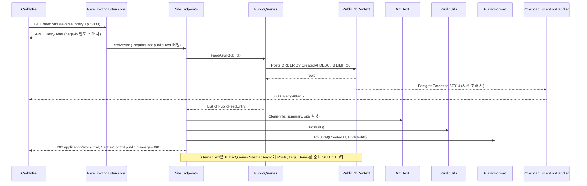
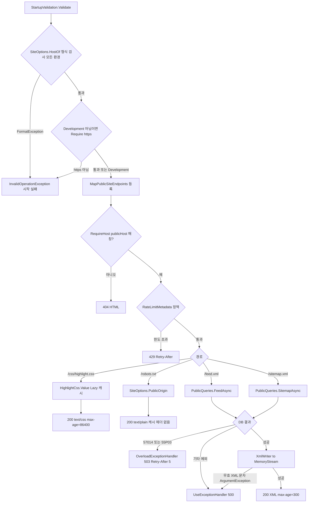
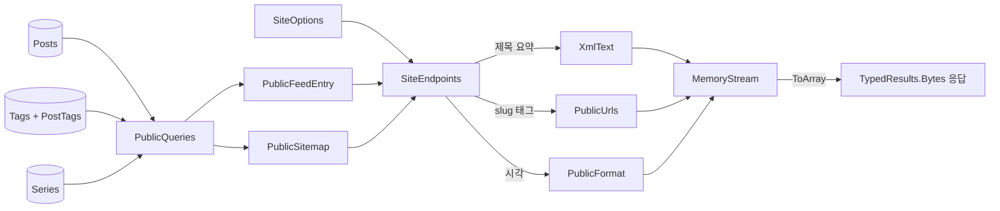

# F017 피드·사이트맵·robots·코드 강조 CSS 제공

<!-- doc-harness:section id="summary" hash="2900e29f3ed25b3a03d5b192e90c172db9a434c631cdd9c567c7de98eb0fba75" -->
## 한 줄 요약

결론: F017은 정적 클래스 SiteEndpoints 하나에 모인 GET/HEAD 엔드포인트 4개이며, 모두 공개 호스트에서만 받는다. 피드(/feed.xml)와 sitemap(/sitemap.xml)은 요청마다 PublicDbContext로 DB를 조회한다. PublicDbContext는 AppDbContext를 상속하므로 "Posts"·"Tags"·"PostTags"·"Series" 테이블을 그대로 쓴다. 연결은 읽기 전용이고 statement_timeout 기본값은 3000ms다. 조회는 PublicQueries.FeedAsync(SELECT 1회)와 PublicQueries.SitemapAsync(SELECT 3회, 순차)가 맡는다. 결과는 BOM 없는 UTF-8 XmlWriter로 MemoryStream에 직렬화한 뒤 TypedResults.Bytes로 반환한다. 서버 측 응답 캐시는 없고 Cache-Control: public, max-age=300만 붙인다. robots.txt는 Site:PublicOrigin을 끼운 고정 문자열이며 Cache-Control을 설정하지 않는다. highlight.css는 ColorCode HtmlClassFormatter 출력을 걸러 Lazy<string>으로 한 번만 만들고 max-age=86400을 붙인다. 사용자 문자열(사이트 제목·설명·작성자, 글 제목·요약)은 XmlText.Clean이 XML 1.0 무효 문자를 제거한다. URL 구성 요소는 Clean을 거치지 않는다. 대신 slug는 SlugRules와 DB CHECK 제약이 문자 집합을 제한한다. PublicOrigin은 앱 시작 시 두 검사를 따로 거친다. 첫째, StartupValidation.Validate가 모든 환경에서 SiteOptions.HostOf로 형식을 검사한다. 스킴은 http 또는 https여야 하고, 경로·사용자 정보·끝 슬래시가 없으며, GetLeftPart(Authority)와 같은 정규 형식이어야 한다. 둘째, Development가 아닌 환경에서만 Require가 https 스킴을 강제한다. 실패 경로는 다음과 같다. statement_timeout(57014)과 잠금 대기 초과(55P03)는 OverloadExceptionHandler가 503과 Retry-After: 5로 바꾸고, 그 밖의 예외는 UseExceptionHandler 기본 경로(500)로 간다. 한도를 넘으면 429와 Retry-After를, 관리 호스트로 오면 404를 준다. 이 상태 코드 응답의 본문은 ErrorResponses가 HTML로 쓴다. 기능 코드에는 명시적 로깅이 없다.

| 항목 | 값 |
|---|---|
| 중요도 | SUPPORTING |
| 상태 | ACTIVE |
| 진입점 | `GET|HEAD /feed.xml`, `GET|HEAD /sitemap.xml`, `GET|HEAD /robots.txt`, `GET|HEAD /css/highlight.css` |
| 의존 기능 | [F019](../09_FEATURES.md#f019), [F020](../09_FEATURES.md#f020), [F021](../09_FEATURES.md#f021) |

### 진입점 근거

| 내용 | 상태 | 근거 |
|---|---|---|
| GET\|HEAD /css/highlight.css: 정적 람다가 Cache-Control: public, max-age=86400을 설정하고 HighlightCss.Value를 text/css(UTF-8)로 반환한다. RequireHost(publicHost), AllowAnonymous, RateLimitPolicy.PublicAsset이 붙고 이름은 GetHighlightCss다. | CONFIRMED | `PortfolioBlog.Api/Pages/SiteEndpoints.cs` SiteEndpoints.MapPublicSiteEndpoints (66-72) |
| GET\|HEAD /feed.xml: SiteEndpoints.FeedAsync가 처리한다. RequireHost(publicHost), AllowAnonymous, RateLimitPolicy.PublicPage가 붙고 이름은 GetFeed다. | CONFIRMED | `PortfolioBlog.Api/Pages/SiteEndpoints.cs` SiteEndpoints.MapPublicSiteEndpoints (74-75) |
| GET\|HEAD /sitemap.xml: SiteEndpoints.SitemapAsync가 처리한다. RequireHost(publicHost), AllowAnonymous, RateLimitPolicy.PublicPage가 붙고 이름은 GetSitemap이다. | CONFIRMED | `PortfolioBlog.Api/Pages/SiteEndpoints.cs` SiteEndpoints.MapPublicSiteEndpoints (76-77) |
| GET\|HEAD /robots.txt: 정적 람다가 "User-agent: *\nAllow: /\nSitemap: {PublicOrigin}/sitemap.xml\n"을 text/plain으로 반환한다. RequireHost(publicHost), AllowAnonymous, RateLimitPolicy.PublicAsset이 붙고 이름은 GetRobots다. | CONFIRMED | `PortfolioBlog.Api/Pages/SiteEndpoints.cs` SiteEndpoints.MapPublicSiteEndpoints (78-81) |
| 등록 지점: Program.cs는 먼저 StartupValidation.Validate(76행)를 실행하고, MapRazorPages() 다음에 app.MapPublicSiteEndpoints()(124행)를 호출한다. | CONFIRMED | `PortfolioBlog.Api/Program.cs` (76,123-124) |
| 공개 레이아웃은 이 엔드포인트들을 세 곳에서 참조한다: <link rel="alternate" type="application/atom+xml" href="/feed.xml">, <link rel="stylesheet" href="/css/highlight.css">, 내비게이션의 피드 링크. 그래서 공개 Razor 페이지(F012~F016)를 연 브라우저가 이 CSS를 요청한다. | CONFIRMED | `PortfolioBlog.Api/Pages/Shared/_Layout.cshtml` (20,30,35) |
<!-- /doc-harness:section -->

<!-- doc-harness:section id="flow" hash="6fc2d718db1bb56bc206423636f2065d65c979a94824f90ba50e2bc75231baee" -->
## 처리 흐름

| 단계 | 컴포넌트 | 코드 | 설명 |
|---|---|---|---|
| 1 | Caddyfile | `deploy/Caddyfile` | 운영 배포 경로: 공개 도메인 블록은 에지에서 /api/* 요청에 404, GET·HEAD 외 메서드에 405로 응답한다. 나머지 요청은 encode zstd gzip을 거쳐 reverse_proxy api:8080으로 넘긴다. |
| 2 | StartupValidation | `PortfolioBlog.Api/Infrastructure/Access/StartupValidation.cs` StartupValidation.Validate | [앱 시작 시 1회] PublicOrigin 검사는 두 단계다. 첫째, 모든 환경에서 Check("Site:PublicOrigin", () => SiteOptions.HostOf(...))(48행)가 형식을 검사한다. http/https 절대 URI여야 하고, 경로·사용자 정보·끝 슬래시가 없는 정규 origin이어야 한다. 둘째, Development가 아닌 환경에서만 Require(Scheme == https)(126행)가 https 스킴을 강제한다. 이 검증은 MapPublicSiteEndpoints보다 먼저 실행된다. |
| 3 | Program | `PortfolioBlog.Api/Program.cs` HostFilteringOptions / 미들웨어 파이프라인 | 호스트 필터는 PublicOrigin·AdminOrigin의 호스트만 받는다. 그 밖의 호스트에는 본문 없는 400을 준다. 통과한 요청은 SecurityHeadersMiddleware → UseTrustedForwardedHeaders → UseExceptionHandler → UseStatusCodePages → UseStaticFiles → AdminSurfaceMiddleware → UseRateLimiter → UseAuthentication/UseAuthorization → ApiBodyLimitMiddleware 순으로 지난다. |
| 4 | AdminSurfaceMiddleware | `PortfolioBlog.Api/Infrastructure/Access/AdminSurfaceMiddleware.cs` AdminSurfaceMiddleware.InvokeAsync | 경로가 /api로 시작하지 않으면 검사 없이 다음 미들웨어로 넘긴다. 그래서 F017의 네 경로는 이 미들웨어의 영향을 받지 않는다. |
| 5 | RateLimitingExtensions | `PortfolioBlog.Api/Infrastructure/Web/RateLimitingExtensions.cs` RateLimitingExtensions.BuildChain | 엔드포인트의 RateLimitMetadata를 보고 정책을 고른다. feed·sitemap(PublicPage)은 'page-ip:{IP}' 고정 창(기본 분당 120)을 쓴다. CSS·robots(PublicAsset)는 'asset-ip:{IP}' 고정 창(기본 분당 600)을 쓴다. 한도를 넘으면 429와 Retry-After를 준다. |
| 6 | SiteEndpoints | `PortfolioBlog.Api/Pages/SiteEndpoints.cs` SiteEndpoints.MapPublicSiteEndpoints | 라우팅이 RequireHost(publicHost) 조건과 GET/HEAD 메서드로 핸들러를 고른다. publicHost는 앱 시작 시 SiteOptions.HostOf(PublicOrigin)로 한 번만 계산한다. |
| 7 | PublicQueries | `PortfolioBlog.Api/Infrastructure/Data/PublicQueries.cs` PublicQueries.FeedAsync | [feed] db.Posts를 CreatedAt DESC, Id 순으로 정렬해 20건을 가져온다(Take(20)). Id·Slug·Title·Summary·CreatedAt·UpdatedAt만 투영하는 SELECT 1회이며, 결과는 List<PublicFeedEntry>다. |
| 8 | SiteEndpoints | `PortfolioBlog.Api/Pages/SiteEndpoints.cs` SiteEndpoints.FeedAsync | MemoryStream 위의 동기 XmlWriter로 Atom을 쓴다. feed에는 title·subtitle·id·link(self, alternate)·updated·author를 쓴다. entry마다 id(urn:uuid)·title·link·published·updated를 쓰고, 요약이 있으면 summary도 쓴다. 이어서 Cache-Control: public, max-age=300을 설정하고 application/atom+xml 바이트를 반환한다. |
| 9 | PublicQueries | `PortfolioBlog.Api/Infrastructure/Data/PublicQueries.cs` PublicQueries.SitemapAsync | [sitemap] 세 번 순차로 조회해 PublicSitemap을 만든다. 글은 Slug와 UpdatedAt을 CreatedAt DESC 순으로 최대 10000건, 태그는 글이 연결된 것만 NormalizedName 순으로 최대 10000건, 시리즈는 Slug 순으로 최대 10000건을 가져온다. |
| 10 | SiteEndpoints | `PortfolioBlog.Api/Pages/SiteEndpoints.cs` SiteEndpoints.SitemapAsync | urlset에 url을 '/' → 글(lastmod 포함) → 태그 → 시리즈 순으로 쓴다. 태그는 PublicUrls.Tag가 null을 반환하면 건너뛴다. 이어서 Cache-Control: public, max-age=300을 설정하고 application/xml 바이트를 반환한다. |
| 11 | HighlightCss | `PortfolioBlog.Api/Infrastructure/Markdown/HighlightCss.cs` HighlightCss.Build / ClassRules | [CSS] 처음 접근할 때 Lazy가 Build를 한 번 실행한다. 결과는 DefaultLight 클래스 규칙 뒤에 @media (prefers-color-scheme: dark){DefaultDark 규칙}을 붙인 것이다. '.'로 시작하는 규칙만 남기고 '.plainText{' 규칙은 버린다. |
| 12 | SiteEndpoints | `PortfolioBlog.Api/Pages/SiteEndpoints.cs` SiteEndpoints.MapPublicSiteEndpoints (robots 람다) | [robots] IOptions<SiteOptions>에서 PublicOrigin을 읽어 고정 텍스트를 만든다. DB나 파일 I/O는 없다. |
<!-- /doc-harness:section -->

<!-- doc-harness:section id="F017_SEQUENCE" hash="0993aae8c47a2f715c61554f099d779ea1d734b19d42faf520217f1a5ae8286e" -->
## /feed.xml·/sitemap.xml 요청 처리 순서 (Sequence Diagram)

피드 요청은 Caddy와 속도 제한을 거쳐 SiteEndpoints.FeedAsync에 도착한다. FeedAsync는 PublicQueries로 DB를 한 번 조회한 뒤 XML을 메모리에 직렬화해 반환한다. DB가 시간 초과를 내면 OverloadExceptionHandler가 503으로 바꾼다.

운영 경로에서 요청은 Caddyfile의 reverse_proxy를 거쳐 앱에 들어온다. RateLimitingExtensions가 구성한 page-ip 창을 넘으면 429로 끝난다. 통과하면 RequireHost(publicHost)에 매칭된 SiteEndpoints.FeedAsync가 PublicQueries.FeedAsync로 Posts를 최대 20건 조회한다. PublicDbContext 연결에는 statement_timeout이 걸려 있다. 57014/55P03이 발생하면 예외가 UseExceptionHandler로 전파되고, OverloadExceptionHandler가 503과 Retry-After 5를 쓴다. 정상 결과는 XmlText.Clean(텍스트), PublicUrls.Post(링크), PublicFormat.Rfc3339(시각)를 거쳐 Atom으로 직렬화되고, Cache-Control max-age=300과 함께 응답된다. sitemap도 같은 구조이며, 다만 PublicQueries.SitemapAsync가 SELECT 3회를 순차로 실행한다.

### 코드 근거

| 구성 요소 | 코드 |
|---|---|
| Caddyfile | `deploy/Caddyfile` |
| RateLimitingExtensions | `PortfolioBlog.Api/Infrastructure/Web/RateLimitingExtensions.cs` (RateLimitingExtensions.BuildChain) |
| SiteEndpoints | `PortfolioBlog.Api/Pages/SiteEndpoints.cs` (SiteEndpoints.FeedAsync) |
| PublicQueries | `PortfolioBlog.Api/Infrastructure/Data/PublicQueries.cs` (PublicQueries.FeedAsync) |
| PublicDbContext | `PortfolioBlog.Api/Infrastructure/Data/PublicDbContext.cs` (PublicDbContext) |
| XmlText | `PortfolioBlog.Api/Infrastructure/Web/XmlText.cs` (XmlText.Clean) |
| PublicUrls | `PortfolioBlog.Api/Infrastructure/Web/PublicUrls.cs` (PublicUrls.Post) |
| PublicFormat | `PortfolioBlog.Api/Infrastructure/Web/PublicFormat.cs` (PublicFormat.Rfc3339) |
| OverloadExceptionHandler | `PortfolioBlog.Api/Infrastructure/Web/OverloadExceptionHandler.cs` (OverloadExceptionHandler.TryHandleAsync) |
<!-- /doc-harness:section -->

<!-- doc-harness:section id="F017_FLOW" hash="b3389c76ef6912f2c96ab163c9c358429828e0737a1b9776764b116a2c67d1d0" -->
## SiteEndpoints 4개 엔드포인트의 분기와 응답 (Flowchart)

시작 시에는 PublicOrigin 검사 두 가지(HostOf 형식 검사, 비Development 환경의 https 강제)를 통과해야 등록된다. 요청 시에는 호스트 → 속도 제한 → 경로 순으로 분기하며, DB를 쓰는 피드·sitemap만 503/500 실패 경로를 가진다.

StartupValidation.Validate는 모든 환경에서 Check와 SiteOptions.HostOf로 형식을 검사한다. 형식을 어기면 FormatException이 InvalidOperationException으로 바뀌어 시작이 실패한다. 이어서 Development가 아닌 환경에서만 Require가 https 스킴을 요구한다. https가 아니면 InvalidOperationException으로 시작이 실패한다. 등록 뒤 요청 단계에서는 RequireHost가 맞지 않으면 404 HTML을, 속도 제한을 넘으면 429를 준다. highlight.css는 Lazy 캐시된 CSS를 86400초 캐시 헤더와 함께 반환한다. robots는 PublicOrigin을 끼운 고정 텍스트이며 캐시 헤더가 없다. 피드와 sitemap은 PublicQueries 결과에 따라 갈린다. 57014/55P03이면 503, 그 밖의 예외면 500, 성공하면 XmlWriter 직렬화 후 300초 캐시 헤더로 응답한다. 직렬화 중 무효 XML 문자가 있으면 ArgumentException이 나 500이 된다.

### 코드 근거

| 구성 요소 | 코드 |
|---|---|
| StartupValidation | `PortfolioBlog.Api/Infrastructure/Access/StartupValidation.cs` (StartupValidation.Validate) |
| HostOfCheck | `PortfolioBlog.Api/Infrastructure/Access/SiteOptions.cs` (SiteOptions.HostOf) |
| HttpsRequire | `PortfolioBlog.Api/Infrastructure/Access/StartupValidation.cs` (StartupValidation.Require) |
| MapPublicSiteEndpoints | `PortfolioBlog.Api/Pages/SiteEndpoints.cs` (SiteEndpoints.MapPublicSiteEndpoints) |
| NotFound404 | `PortfolioBlog.Api/Infrastructure/Web/ErrorResponses.cs` (ErrorResponses.HandleStatusCodeAsync) |
| PolicyCheck | `PortfolioBlog.Api/Infrastructure/Web/RateLimitingExtensions.cs` (RateLimitingExtensions.BuildChain) |
| HighlightCss | `PortfolioBlog.Api/Infrastructure/Markdown/HighlightCss.cs` (HighlightCss.Value) |
| SiteOptions | `PortfolioBlog.Api/Infrastructure/Access/SiteOptions.cs` (SiteOptions.PublicOrigin) |
| FeedAsync | `PortfolioBlog.Api/Infrastructure/Data/PublicQueries.cs` (PublicQueries.FeedAsync) |
| SitemapAsync | `PortfolioBlog.Api/Infrastructure/Data/PublicQueries.cs` (PublicQueries.SitemapAsync) |
| OverloadExceptionHandler | `PortfolioBlog.Api/Infrastructure/Web/OverloadExceptionHandler.cs` (OverloadExceptionHandler.TryHandleAsync) |
| Error500 | `PortfolioBlog.Api/Program.cs` (app.UseExceptionHandler) |
| XmlWriter | `PortfolioBlog.Api/Pages/SiteEndpoints.cs` (SiteEndpoints.XmlSettings) |
<!-- /doc-harness:section -->

<!-- doc-harness:section id="F017_DATAFLOW" hash="9deba8c152c9c40a4afd8abe7dd28b213c8621522292eb54fff2f01f8f17b088" -->
## DB 행에서 Atom·sitemap XML까지의 데이터 변환 (Data Flow Diagram)

Posts·Tags·Series 행은 PublicQueries에서 PublicFeedEntry·PublicSitemap DTO가 된다. SiteEndpoints가 이를 텍스트 정리·URL·시각 서식을 거쳐 MemoryStream XML로 만들고 바이트로 응답한다.

PublicQueries는 필요한 열만 투영해 PublicFeedEntry(피드)와 PublicSitemap(sitemap)을 만든다. SiteEndpoints는 SiteOptions의 제목·설명·작성자·PublicOrigin을 함께 쓴다. 텍스트는 XmlText.Clean, 경로는 PublicUrls, 시각은 PublicFormat을 거쳐 XmlWriter로 MemoryStream에 기록된다. 마지막에 ToArray()로 복사한 byte[]를 TypedResults.Bytes로 응답한다. sitemap 경로와 PublicOrigin은 Clean을 거치지 않는다.

### 코드 근거

| 구성 요소 | 코드 |
|---|---|
| Posts | `PortfolioBlog.Api/Infrastructure/Data/AppDbContext.cs` (AppDbContext.Posts) |
| TagsPostTags | `PortfolioBlog.Api/Infrastructure/Data/AppDbContext.cs` (AppDbContext.Tags / PostTags) |
| Series | `PortfolioBlog.Api/Infrastructure/Data/AppDbContext.cs` (AppDbContext.Series) |
| PublicQueries | `PortfolioBlog.Api/Infrastructure/Data/PublicQueries.cs` (PublicQueries.FeedAsync / SitemapAsync) |
| PublicFeedEntry | `PortfolioBlog.Api/Infrastructure/Data/PublicModels.cs` (PublicFeedEntry) |
| PublicSitemap | `PortfolioBlog.Api/Infrastructure/Data/PublicModels.cs` (PublicSitemap) |
| SiteOptions | `PortfolioBlog.Api/Infrastructure/Access/SiteOptions.cs` (SiteOptions) |
| SiteEndpoints | `PortfolioBlog.Api/Pages/SiteEndpoints.cs` (SiteEndpoints.FeedAsync / SitemapAsync) |
| XmlText | `PortfolioBlog.Api/Infrastructure/Web/XmlText.cs` (XmlText.Clean) |
| PublicUrls | `PortfolioBlog.Api/Infrastructure/Web/PublicUrls.cs` (PublicUrls) |
| PublicFormat | `PortfolioBlog.Api/Infrastructure/Web/PublicFormat.cs` (PublicFormat.Rfc3339) |
| MemoryStream | `PortfolioBlog.Api/Pages/SiteEndpoints.cs` (SiteEndpoints.FeedAsync buffer) |
<!-- /doc-harness:section -->

<!-- doc-harness:section id="data" hash="9d3b16908d0c16575bcfd7b7f07553814687879a56e9a89ed80ff4d86338b1cd" -->
## 데이터

### 데이터 흐름

| 내용 | 상태 | 근거 |
|---|---|---|
| 피드 흐름: PublicQueries.FeedAsync가 "Posts" 행을 익명 객체로 투영해 PublicFeedEntry로 바꾼다(최대 20건). SiteEndpoints.FeedAsync가 이를 Atom 요소로 쓴다. 제목·요약·사이트 설정 문자열은 XmlText.Clean을 거치고, 시각은 PublicFormat.Rfc3339로 UTC 'Z' 형식이 되며, 링크는 PublicOrigin 뒤에 PublicUrls.Post(slug)를 붙여 만든다. 완성된 문서는 MemoryStream에서 byte[]로 복사되어 응답 본문이 된다. | CONFIRMED | `PortfolioBlog.Api/Infrastructure/Data/PublicQueries.cs` PublicQueries.FeedAsync (191-196), `PortfolioBlog.Api/Pages/SiteEndpoints.cs` SiteEndpoints.FeedAsync (99-143), `PortfolioBlog.Api/Infrastructure/Web/PublicFormat.cs` PublicFormat.Rfc3339 (27) |
| sitemap 흐름: "Posts"(Slug, UpdatedAt), "Tags"(NormalizedName, 연결된 글이 있는 태그만), "Series"(Slug)를 읽어 PublicSitemap을 만들고 url/loc XML로 쓴다. lastmod는 글에만 붙는다. 태그 경로는 Uri.EscapeDataString으로 인코딩한다(예: C# → /tags/c%23). | CONFIRMED | `PortfolioBlog.Api/Infrastructure/Data/PublicQueries.cs` PublicQueries.SitemapAsync (210-218), `PortfolioBlog.Api/Pages/SiteEndpoints.cs` SiteEndpoints.SitemapAsync (160-181), `PortfolioBlog.Api/Infrastructure/Web/PublicUrls.cs` PublicUrls.Tag (52-53), `PortfolioBlog.Api.Tests/Features/FeedAndSitemapTests.cs` Sitemap_ListsEverything_WithEncodedAbsoluteUrls (103-133) |
| 절대 URL은 요청의 Host 헤더가 아니라 설정값 Site:PublicOrigin으로 만든다. 테스트는 Host: blog.test:8443으로 요청해도 응답에 ':8443'이 들어가지 않음을 확인한다. | CONFIRMED | `PortfolioBlog.Api/Pages/SiteEndpoints.cs` (113-115,127,162-176), `PortfolioBlog.Api.Tests/Features/FeedAndSitemapTests.cs` (56-80,118-125) |
| highlight.css 흐름: HtmlClassFormatter.GetCSSString()이 ColorCode StyleDictionary.DefaultLight/DefaultDark를 CSS 문자열로 만든다. 이 문자열을 '}' 기준으로 나눠 클래스 규칙만 남기고 다시 잇는다. 결과는 Lazy<string>에 캐시해 text/css로 응답한다. 파일 시스템은 쓰지 않는다. | CONFIRMED | `PortfolioBlog.Api/Infrastructure/Markdown/HighlightCss.cs` HighlightCss.Build / ClassRules (23-45) |
| 관리 SPA 미리보기가 쓰는 PortfolioBlog.Web/public/preview/highlight.css는 HighlightCss.Value의 사본이다. PreviewCssSnapshotTests가 두 내용이 같은지 검증한다. | CONFIRMED | `PortfolioBlog.Api.Tests/Infrastructure/PreviewCssSnapshotTests.cs` (15,32-35), `PortfolioBlog.Web/public/preview/highlight.css` |
| 피드·sitemap 조회에는 공개 여부 필터가 없다. 저장된 글은 모두 피드와 sitemap에 실린다. | CONFIRMED | `PortfolioBlog.Api/Domain/Post.cs` Post (12-45), `PortfolioBlog.Api/Infrastructure/Data/PublicQueries.cs` (193,212) |

### DB 접근

| 엔티티 | 작업 | 코드 |
|---|---|---|
| Post ("Posts") | SELECT | `PortfolioBlog.Api/Infrastructure/Data/PublicQueries.cs` PublicQueries.FeedAsync |
| Post ("Posts") | SELECT | `PortfolioBlog.Api/Infrastructure/Data/PublicQueries.cs` PublicQueries.SitemapAsync |
| Tag + PostTag ("Tags", "PostTags": EXISTS 하위 질의) | SELECT | `PortfolioBlog.Api/Infrastructure/Data/PublicQueries.cs` PublicQueries.SitemapAsync |
| Series ("Series") | SELECT | `PortfolioBlog.Api/Infrastructure/Data/PublicQueries.cs` PublicQueries.SitemapAsync |

### 상태 전이

| 이전 | 다음 | 트리거 | 근거 |
|---|---|---|---|
| HighlightCss.Cached 미계산 | 계산 완료(문자열 캐시) | 프로세스에서 HighlightCss.Value를 처음 읽을 때(예: 첫 /css/highlight.css 요청) Build가 실행된다. Lazy 기본 모드(ExecutionAndPublication)라 동시 요청이 있어도 Build는 한 번만 실행된다. | `PortfolioBlog.Api/Infrastructure/Markdown/HighlightCss.cs` HighlightCss.Cached (21-34) |
| HighlightCss.Cached 미계산 | 예외가 캐시된 상태(faulted), 추론 | 첫 Build()가 예외를 던진 경우다. 팩토리를 받은 Lazy<T>는 이 모드에서 예외를 캐시한다(.NET 동작이며 이 저장소에서 측정하지 않았다). 시작 워밍업은 MarkdownRenderer.Render만 부르고 HighlightCss.Value는 부르지 않는다. | `PortfolioBlog.Api/Infrastructure/Markdown/HighlightCss.cs` (23), `PortfolioBlog.Api/Program.cs` (90-91) |

### 외부 의존

| 내용 | 상태 | 근거 |
|---|---|---|
| PostgreSQL: PublicDbContext는 연결 옵션 '-c statement_timeout={StatementTimeoutMs} -c default_transaction_read_only=on'과 ApplicationName=PortfolioBlog.Public으로 접속한다. StatementTimeoutMs 기본값은 3000이다. ConnectionStrings:Public이 있으면 그 롤로 접속하고, 없으면 관리 연결을 쓴다. Development가 아닌 환경에서는 StartupValidation이 ConnectionStrings:Public을 필수로 요구한다. | CONFIRMED | `PortfolioBlog.Api/Infrastructure/Data/PublicDbContext.cs` PublicDbContext.BuildConnectionString (46-62), `PortfolioBlog.Api/Infrastructure/Data/DataServiceCollectionExtensions.cs` (33-36,45-47), `PortfolioBlog.Api/Infrastructure/Web/PublicOptions.cs` (30), `PortfolioBlog.Api/Infrastructure/Access/StartupValidation.cs` StartupValidation.Validate (132) |
| ColorCode 라이브러리(StyleDictionary, HtmlClassFormatter)가 강조 CSS의 원천이다. CSS를 런타임에 만들기 때문에 클래스 이름이 라이브러리 버전과 항상 맞는다. | CONFIRMED | `PortfolioBlog.Api/Infrastructure/Markdown/HighlightCss.cs` (1-2,6,36-45) |
| System.Xml: XmlWriter로 XML을 직렬화한다. CheckCharacters는 기본값 true이고 Async는 꺼져 있다. 문자 유효성은 XmlConvert.IsXmlChar로 판정한다. | CONFIRMED | `PortfolioBlog.Api/Pages/SiteEndpoints.cs` (47-50), `PortfolioBlog.Api/Infrastructure/Web/XmlText.cs` XmlText.IndexOfInvalid (48-62) |
| Caddy 에지(운영): 공개 도메인에서 GET/HEAD 외 메서드에는 405, /api에는 404로 응답한다. 나머지 요청은 압축해 api:8080으로 프록시한다. | CONFIRMED | `deploy/Caddyfile` (20-48) |
<!-- /doc-harness:section -->

<!-- doc-harness:section id="failures" hash="43d99c6792b972ef12184fc44ef7dca9258291cf4770beebb6350c70cbf10a87" -->
## 실패 지점

| 위치 | 조건 | 처리 | 상태 | 근거 |
|---|---|---|---|---|
| PublicQueries.FeedAsync / SitemapAsync (PublicDbContext) | statement_timeout 초과(PostgresException SqlState 57014) 또는 잠금 대기 초과(55P03) | OverloadExceptionHandler.IsOverload가 InnerException 체인을 훑어 이 예외를 찾는다. 찾으면 503과 Retry-After: 5를 설정하고 ErrorResponses.WriteAsync로 본문을 쓴다. 이 경로들은 MachinePrefixes(/api·/attachments·/health·/openapi)에 속하지 않으므로 본문은 text/html이다. | CONFIRMED | `PortfolioBlog.Api/Infrastructure/Web/OverloadExceptionHandler.cs` OverloadExceptionHandler.TryHandleAsync / IsOverload (35-70), `PortfolioBlog.Api/Infrastructure/Web/ErrorResponses.cs` ErrorResponses.WriteAsync (17,45-56), `PortfolioBlog.Api/Program.cs` (43,100) |
| SiteEndpoints.FeedAsync / SitemapAsync | DB 연결 실패처럼 과부하로 분류되지 않는 DB 예외 | 처리 없음(예외 전파). 핸들러에 try/catch가 없어 UseExceptionHandler 기본 처리(500)로 넘어간다. 재시도나 폴백은 없다. | POTENTIAL_ISSUE | `PortfolioBlog.Api/Pages/SiteEndpoints.cs` (99-181), `PortfolioBlog.Api/Program.cs` (47,100) |
| SiteEndpoints.SitemapAsync / FeedAsync (XmlWriter, CheckCharacters=true) | Clean을 거치지 않는 값(PublicOrigin, slug)에 XML 무효 문자가 들어간 경우 | 처리 없음(예외 전파). XmlWriter가 ArgumentException을 던져 문서 전체가 500이 된다. 다만 입력은 세 겹으로 제한된다. 첫째, API 저장 경로가 SlugRules로 slug를 검증한다. 둘째, DB CHECK 제약 CK_Posts_Slug_Format·CK_Series_Slug_Format이 있다. 셋째, PublicOrigin은 시작 시 SiteOptions.HostOf로 정규 origin 형식이 강제된다. 태그는 Uri.EscapeDataString으로 인코딩된다. 따라서 정상 데이터에서는 사실상 발생하지 않는다. 남는 위험은 .NET과 DB의 slug 패턴이 서로 어긋나게 수정되는 경우다. | POTENTIAL_ISSUE | `PortfolioBlog.Api/Pages/SiteEndpoints.cs` (47-50,145-146,194-199), `PortfolioBlog.Api/Infrastructure/Data/AppDbContext.cs` AppDbContext.SlugPattern / OnModelCreating (48,102-104,117-119), `PortfolioBlog.Api/Infrastructure/Data/Migrations/20260920142630_InitialCreate.cs` (39,79), `PortfolioBlog.Api/Infrastructure/Data/SlugRules.cs` (5-17), `PortfolioBlog.Api/Infrastructure/Access/SiteOptions.cs` SiteOptions.HostOf (44-48) |
| SiteEndpoints.FeedAsync (제목·요약·사이트 설정 텍스트) | C0 제어 문자, U+FFFE, 짝 없는 서로게이트가 포함된 경우 | XmlText.Clean이 해당 문자를 제거해 XmlWriter 예외를 막는다. 테스트 Feed_IsValidAtom_EvenWithHostileTitles_AndUsesPublicOrigin이 이를 검증한다. | CONFIRMED | `PortfolioBlog.Api/Infrastructure/Web/XmlText.cs` XmlText.Clean (17-45), `PortfolioBlog.Api.Tests/Features/FeedAndSitemapTests.cs` (44-81) |
| 전역 속도 제한기(UseRateLimiter) | IP별 분당 한도 초과. page-ip(기본 120)는 피드·sitemap·Razor 페이지·검색이 함께 쓰고, asset-ip(기본 600)는 CSS·robots·첨부·/health가 함께 쓴다. | 429와 Retry-After(1~60초)를 반환한다. QueueLimit이 0이라 대기 없이 즉시 거부한다. 본문은 ErrorResponses가 HTML로 쓴다. | CONFIRMED | `PortfolioBlog.Api/Infrastructure/Web/RateLimitingExtensions.cs` (45-54,69-72,100-101,144-150), `PortfolioBlog.Api/Infrastructure/Web/PublicOptions.cs` (18-21) |
| 라우팅(RequireHost) | 관리 호스트(AdminOrigin)로 요청한 경우 | 엔드포인트가 매칭되지 않아 404가 되고, UseStatusCodePages가 HTML 본문을 쓴다. feed·sitemap·robots는 테스트로 검증했다. highlight.css는 코드로만 확인했다. | CONFIRMED | `PortfolioBlog.Api/Pages/SiteEndpoints.cs` (71,74,76,80), `PortfolioBlog.Api.Tests/Features/FeedAndSitemapTests.cs` (136-151), `PortfolioBlog.Api/Infrastructure/Web/ErrorResponses.cs` (30-56) |
| HostFiltering(Program.cs) | Host 헤더가 PublicOrigin·AdminOrigin 어느 호스트와도 맞지 않는 경우 | 프레임워크 호스트 필터가 본문 없는 400을 반환한다(IncludeFailureMessage=false). | CONFIRMED | `PortfolioBlog.Api/Program.cs` (34-42) |
| StartupValidation.Validate → Check("Site:PublicOrigin", SiteOptions.HostOf) (StartupValidation.cs 48행, 모든 환경, 앱 시작 시) | Site:PublicOrigin이 HostOf의 형식 조건을 어기는 경우다. HostOf는 다음을 모두 요구한다: 절대 URI로 파싱될 것, 스킴이 http 또는 https일 것, AbsolutePath가 '/'일 것, 사용자 정보가 없을 것, 원문이 uri.GetLeftPart(UriPartial.Authority)와 정확히 같을 것. 마지막 조건 때문에 끝 슬래시·경로·쿼리가 붙은 값이나 정규화 결과와 다른 표기는 거부된다. 이 검사는 https를 강제하지 않는다. 'http://host'는 HostOf를 통과한다. | HostOf가 FormatException을 던진다. Check 헬퍼가 이를 잡아 설정 키 'Site:PublicOrigin'이 든 InvalidOperationException으로 다시 던지고(내부 예외는 FormatException), 앱 시작이 실패한다. Validate(Program.cs 76행)가 MapPublicSiteEndpoints(124행)보다 먼저 실행되므로 엔드포인트 등록까지 가지 않는다. | CONFIRMED | `PortfolioBlog.Api/Infrastructure/Access/SiteOptions.cs` SiteOptions.HostOf (44-48), `PortfolioBlog.Api/Infrastructure/Access/StartupValidation.cs` StartupValidation.Validate / Check (48,185-189), `PortfolioBlog.Api/Program.cs` (76,124) |
| StartupValidation.Validate → Require(Scheme == https, "Site:PublicOrigin") (StartupValidation.cs 126행, Development가 아닌 환경에서만, 앱 시작 시) | HostOf 형식 검사는 통과했지만 PublicOrigin의 스킴이 https가 아닌 경우(예: 'http://blog.example.com'). 이 검사는 environment.IsDevelopment()가 false일 때만 실행된다. | Require가 'Development가 아닌 환경에서는 설정 Site:PublicOrigin 이(가) 올바르지 않습니다' 메시지로 InvalidOperationException을 던지고 앱 시작이 실패한다. Development 환경에서는 이 검사를 건너뛰므로 http origin으로도 기동한다. 이때 피드·sitemap·robots의 절대 URL은 http로 나간다. | CONFIRMED | `PortfolioBlog.Api/Infrastructure/Access/StartupValidation.cs` StartupValidation.Validate / Require (116,125-126,203-206) |
| HighlightCss.Value (Lazy<string>) | 첫 Build()가 예외를 던지는 경우(ColorCode 출력 이상 등) | 처리 없음(예외 전파). Lazy 기본 모드는 예외를 캐시하므로, 프로세스를 재시작할 때까지 /css/highlight.css 요청이 계속 500이 될 수 있다. .NET 동작에서 추론했고 측정하지 않았다. | POTENTIAL_ISSUE | `PortfolioBlog.Api/Infrastructure/Markdown/HighlightCss.cs` (23,34-37) |
| Caddy 공개 도메인 route | GET/HEAD 외 메서드, /api 경로 | 에지에서 405 또는 404로 응답하고 백엔드로 전달하지 않는다. | CONFIRMED | `deploy/Caddyfile` (36-40) |

### 엣지 케이스

| 내용 | 상태 | 근거 |
|---|---|---|
| 글이 하나도 없으면 피드의 updated에 고정값 DateTimeOffset.UnixEpoch를 쓴다. 현재 시각을 쓰면 요청마다 값이 바뀌기 때문이다. entry가 없어도 유효한 Atom이며 테스트로 검증된다. | CONFIRMED | `PortfolioBlog.Api/Pages/SiteEndpoints.cs` (116-118), `PortfolioBlog.Api.Tests/Features/FeedAndSitemapTests.cs` (84-99) |
| 피드 전체의 updated는 CreatedAt 기준 최신 20건의 UpdatedAt 중 최댓값이다. 상위 20건 밖의 글을 수정해도 이 값은 바뀌지 않는다. | CONFIRMED | `PortfolioBlog.Api/Infrastructure/Data/PublicQueries.cs` (193), `PortfolioBlog.Api/Pages/SiteEndpoints.cs` (118) |
| 피드 항목 id는 글 Id 기반 URN(urn:uuid:{Id:D})이다. slug나 도메인이 바뀌어도 구독기가 같은 항목으로 인식하게 하려는 설계다. 구독기별 실제 동작은 검증하지 않았다고 주석에 적혀 있다. | CONFIRMED | `PortfolioBlog.Api/Pages/SiteEndpoints.cs` (84-85,125) |
| Site:Author가 비어 있으면 author/name에 Site:Title을 쓴다. Description이 비어 있으면 subtitle을, Summary가 빈 문자열이면 summary를 생략한다. | CONFIRMED | `PortfolioBlog.Api/Pages/SiteEndpoints.cs` (112,120,130-136) |
| sitemap에는 종류별로 최대 10,000건만 실린다. 초과분은 sitemap index나 경고 없이 잘리며, 글은 가장 오래된 것부터 빠진다. | CONFIRMED | `PortfolioBlog.Api/Infrastructure/Data/PublicQueries.cs` (29,212-216) |
| 태그가 sitemap에서 빠지는 경우는 두 가지다. 정규화명이 '.' 또는 '..'이면 PublicUrls.Tag가 null을 반환해 빠지고, 연결된 글이 없는 태그도 빠진다. 두 경우 모두 테스트로 검증된다. | CONFIRMED | `PortfolioBlog.Api/Infrastructure/Web/PublicUrls.cs` (52-53), `PortfolioBlog.Api/Infrastructure/Data/PublicQueries.cs` (215), `PortfolioBlog.Api.Tests/Features/FeedAndSitemapTests.cs` (103-133) |
| 시리즈에는 '글이 있는 것만' 조건이 없어 빈 시리즈도 sitemap에 실린다. | CONFIRMED | `PortfolioBlog.Api/Infrastructure/Data/PublicQueries.cs` (216) |
| lastmod는 글 URL에만 붙고 '/', 태그, 시리즈 URL에는 붙지 않는다. | CONFIRMED | `PortfolioBlog.Api/Pages/SiteEndpoints.cs` (170-176,194-199) |
| HEAD 요청도 GET과 같은 델리게이트로 처리되므로 DB 조회와 직렬화를 GET과 똑같이 수행한다. 본문 생략은 프레임워크가 맡으며 측정하지 않았다. 반면 상태 코드 오류 응답에서는 ErrorResponses.WriteAsync가 HEAD일 때 본문을 쓰지 않는다. | CONFIRMED | `PortfolioBlog.Api/Pages/SiteEndpoints.cs` (45,157), `PortfolioBlog.Api/Infrastructure/Web/ErrorResponses.cs` (54) |
| 캐시 헤더가 엔드포인트마다 다르다. CSS는 86400, 피드와 sitemap은 300이고, robots에는 없다. 피드와 sitemap의 헤더는 직렬화가 끝난 뒤 설정되므로 예외 응답에는 붙지 않는다. 서버 측 출력 캐시는 없다. | CONFIRMED | `PortfolioBlog.Api/Pages/SiteEndpoints.cs` (68,78-79,141,179) |
| highlight.css URL에는 버전이나 지문이 없다. 그래서 ColorCode를 업그레이드한 뒤에도 최대 하루 동안 이전 CSS가 캐시에 남을 수 있다고 추론한다. | INFERRED | `PortfolioBlog.Api/Pages/SiteEndpoints.cs` (26,68), `PortfolioBlog.Api/Pages/Shared/_Layout.cshtml` (30) |
| HighlightCss는 ColorCode가 내는 body{...} 규칙과 .plainText{...} 규칙을 의도적으로 버린다. .plainText 규칙에는 밝은 테마에서 글자가 흰색이 되는 버그가 있다(실측). | CONFIRMED | `PortfolioBlog.Api/Infrastructure/Markdown/HighlightCss.cs` (39-45) |
| RequireHost는 포트가 붙은 Host(blog.test:8443)도 매칭한다. 이때도 절대 URL은 설정값으로 만든다. | CONFIRMED | `PortfolioBlog.Api.Tests/Features/FeedAndSitemapTests.cs` (56-59,80) |
| Development 환경에서는 PublicOrigin과 AdminOrigin이 같아도 되고(Require 검사 제외), http 스킴도 허용된다. 두 origin이 같으면 publicHost가 관리 호스트와 같아지므로, 관리 호스트 요청도 RequireHost(publicHost)에 매칭되어 이 엔드포인트들이 응답할 것으로 추론한다. 운영에서는 124행의 Require가 두 origin이 같은 설정을 막는다. | INFERRED | `PortfolioBlog.Api/Infrastructure/Access/StartupValidation.cs` (116,122-127), `PortfolioBlog.Api/Pages/SiteEndpoints.cs` (64) |

### 로깅

| 내용 | 상태 | 근거 |
|---|---|---|
| SiteEndpoints, HighlightCss, XmlText, PublicQueries에는 ILogger 호출 같은 명시적 로깅이 없다. 요청 로그와 예외 로그는 ASP.NET Core 프레임워크와 UseExceptionHandler의 기본 로깅이 남긴다고 추론한다. | INFERRED | `PortfolioBlog.Api/Pages/SiteEndpoints.cs`, `PortfolioBlog.Api/Infrastructure/Data/PublicQueries.cs` |
| 운영에서는 Caddy 공개 도메인 블록의 'log' 지시어가 접근 로그를 남긴다. | CONFIRMED | `deploy/Caddyfile` (20-21) |
<!-- /doc-harness:section -->

<!-- doc-harness:section id="code" hash="de698cf7db022f7a37a1e2453d48792d94d1ac766e7b1749974788ea8fc071ce" -->
## 관련 코드

| 파일 | 심볼 | 역할 |
|---|---|---|
| `PortfolioBlog.Api/Pages/SiteEndpoints.cs` | SiteEndpoints.MapPublicSiteEndpoints | entry |
| `PortfolioBlog.Api/Pages/SiteEndpoints.cs` | SiteEndpoints.FeedAsync | render |
| `PortfolioBlog.Api/Pages/SiteEndpoints.cs` | SiteEndpoints.SitemapAsync | render |
| `PortfolioBlog.Api/Pages/SiteEndpoints.cs` | SiteEndpoints.WriteLink / WriteUrl | render |
| `PortfolioBlog.Api/Infrastructure/Markdown/HighlightCss.cs` | HighlightCss.Value | render |
| `PortfolioBlog.Api/Infrastructure/Web/XmlText.cs` | XmlText.Clean | validation |
| `PortfolioBlog.Api/Infrastructure/Web/PublicUrls.cs` | PublicUrls.Post / Tag / Series | render |
| `PortfolioBlog.Api/Infrastructure/Web/PublicFormat.cs` | PublicFormat.Rfc3339 | render |
| `PortfolioBlog.Api/Infrastructure/Data/PublicQueries.cs` | PublicQueries.FeedAsync / SitemapAsync / FeedSize / SitemapMax | data |
| `PortfolioBlog.Api/Infrastructure/Data/PublicModels.cs` | PublicFeedEntry / PublicSitemap | dto |
| `PortfolioBlog.Api/Infrastructure/Data/PublicDbContext.cs` | PublicDbContext | data |
| `PortfolioBlog.Api/Infrastructure/Data/AppDbContext.cs` | AppDbContext.SlugPattern / CK_Posts_Slug_Format / CK_Series_Slug_Format | validation |
| `PortfolioBlog.Api/Infrastructure/Data/SlugRules.cs` | SlugRules | validation |
| `PortfolioBlog.Api/Infrastructure/Access/SiteOptions.cs` | SiteOptions (PublicOrigin, Title, Description, Author, HostOf) | config |
| `PortfolioBlog.Api/Infrastructure/Access/StartupValidation.cs` | StartupValidation.Validate / Check / Require | validation |
| `PortfolioBlog.Api/Infrastructure/Access/AdminSurfaceMiddleware.cs` | AdminSurfaceMiddleware.InvokeAsync | config |
| `PortfolioBlog.Api/Infrastructure/Web/ErrorResponses.cs` | ErrorResponses.HandleStatusCodeAsync / WriteAsync | render |
| `PortfolioBlog.Api/Infrastructure/Web/PublicOptions.cs` | PublicOptions.PagePerIpPerMinute / AssetPerIpPerMinute / StatementTimeoutMs | config |
| `PortfolioBlog.Api/Infrastructure/Web/RateLimitingExtensions.cs` | RateLimitingExtensions.BuildChain | config |
| `PortfolioBlog.Api/Infrastructure/Web/OverloadExceptionHandler.cs` | OverloadExceptionHandler.TryHandleAsync | service |
| `PortfolioBlog.Api/Program.cs` | app.MapPublicSiteEndpoints() | config |
| `PortfolioBlog.Api/Pages/Shared/_Layout.cshtml` | - | render |
| `deploy/Caddyfile` | - | config |
| `PortfolioBlog.Api.Tests/Features/FeedAndSitemapTests.cs` | FeedAndSitemapTests | test |
| `PortfolioBlog.Api.Tests/Features/AccessMatrixTests.cs` | AccessMatrixTests.PublicAllowlist | test |
| `PortfolioBlog.Api.Tests/Infrastructure/PreviewCssSnapshotTests.cs` | - | test |
| `PortfolioBlog.Web/public/preview/highlight.css` | - | render |

근거: `PortfolioBlog.Api/Pages/SiteEndpoints.cs` SiteEndpoints (1-201), `PortfolioBlog.Api/Infrastructure/Markdown/HighlightCss.cs` HighlightCss (19-46), `PortfolioBlog.Api/Infrastructure/Web/XmlText.cs` XmlText.Clean (30-62), `PortfolioBlog.Api/Infrastructure/Web/PublicUrls.cs` PublicUrls (12-54), `PortfolioBlog.Api/Infrastructure/Web/PublicFormat.cs` PublicFormat.Rfc3339 (27), `PortfolioBlog.Api/Infrastructure/Data/PublicQueries.cs` PublicQueries.FeedAsync / SitemapAsync (26-29,191-218), `PortfolioBlog.Api/Infrastructure/Data/PublicDbContext.cs` PublicDbContext.BuildConnectionString (29,46-62), `PortfolioBlog.Api/Infrastructure/Access/StartupValidation.cs` StartupValidation.Validate / Check / Require (41-49,116-135,185-189,203-206), `PortfolioBlog.Api/Infrastructure/Access/SiteOptions.cs` SiteOptions.HostOf (44-48), `PortfolioBlog.Api/Infrastructure/Access/AdminSurfaceMiddleware.cs` AdminSurfaceMiddleware.InvokeAsync (67-96), `PortfolioBlog.Api/Infrastructure/Web/ErrorResponses.cs` ErrorResponses.WriteAsync (17,30-56), `PortfolioBlog.Api/Infrastructure/Web/OverloadExceptionHandler.cs` OverloadExceptionHandler.TryHandleAsync / IsOverload (35-70), `PortfolioBlog.Api/Infrastructure/Web/RateLimitingExtensions.cs` RateLimitingExtensions.BuildChain (45-54,69-72,100-101,144-150), `PortfolioBlog.Api/Program.cs` (34-42,76,98-108,123-124), `PortfolioBlog.Api.Tests/Features/FeedAndSitemapTests.cs` FeedAndSitemapTests (44-151), `deploy/Caddyfile` (20-48)
<!-- /doc-harness:section -->

<!-- doc-harness:section id="unknowns" hash="87312309ac1f6f4b6610874f7ae7041391a60901e4e00e1808e913f2693055c9" -->
## 확인하지 못한 것

- 클라이언트가 요청을 취소해 ct가 취소될 때 발생하는 OperationCanceledException이 어떤 상태 코드와 로그로 처리되는지 확인하지 못했다. 이 기능 코드에는 해당 처리가 없다.
- HighlightCss.Build가 실제로 예외를 던질 수 있는 조건과, 예외가 캐시되는 상태(faulted Lazy)가 이 앱에서 재현되는지는 측정되지 않았다.
- 최대 규모(URL 30,001개)에서 sitemap 문서의 실제 크기, 메모리 사용량, 직렬화 시간은 측정되지 않았다. 코드 주석도 '수 MB 추정'이라고만 적고 있다.
- UseExceptionHandler 기본 경로가 내는 500 응답의 본문 형식은 확인하지 않았다. Program.cs가 AddProblemDetails를 등록하므로 ProblemDetails일 가능성이 있지만 실측하지 않았다.
- HEAD 요청에서 프레임워크가 본문 전송을 실제로 생략하는지는 측정되지 않았다. 코드 주석에도 미측정이라고 적혀 있다.
- 검증 지적 반영: 이전 분석은 StartupValidation 실패 조건을 하나로 묶어 적었다. 코드로 확인해 두 실패 지점으로 나눴다. SiteOptions.HostOf(SiteOptions.cs 44-48)는 http와 https를 모두 허용하고, https 강제는 StartupValidation.cs 126행의 Require가 Development가 아닌 환경에서만 한다.
<!-- /doc-harness:section -->

<!-- doc-harness:section id="related" hash="e6b04ee08cc1bd1a2625cbb81ca24992b9da0467258ba6539a8ab5b4aeff04d8" -->
## 관련 문서

- [../09_FEATURES](../09_FEATURES.md)
- [../08_API](../08_API.md)
- [../07_DATA_MODEL](../07_DATA_MODEL.md)
- [../11_FAILURE_HISTORY](../11_FAILURE_HISTORY.md)
<!-- /doc-harness:section -->
