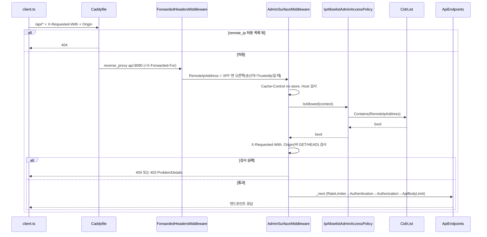
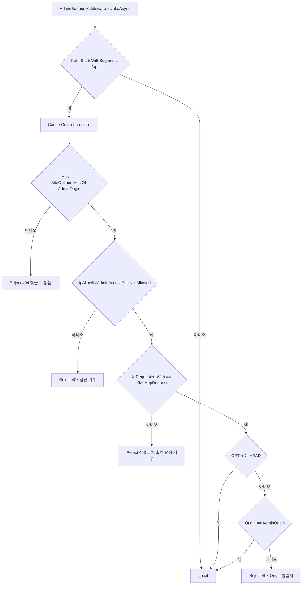
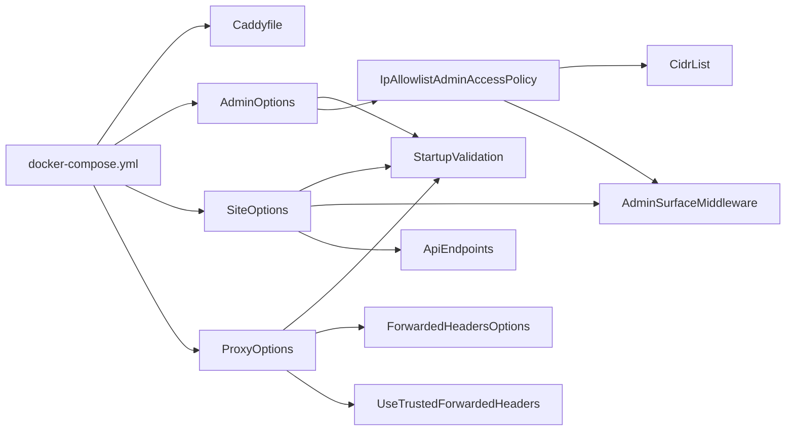

# F018 관리 표면 접근 통제(호스트·IP 허용 목록·CSRF 헤더·Origin)

<!-- doc-harness:section id="summary" hash="d0f18113ac6019e676bd937c4a608e1afce544f2eb3200be882e70b4c375ef26" -->
## 한 줄 요약

결론: 관리 표면(/api)은 두 계층으로 막는다. (1) 에지: Caddy가 관리 도메인 전체(HTTPS·평문 HTTP)에 remote_ip 허용 목록을 걸어, 목록 밖이면 404를 낸다. 공개 도메인의 /api는 무조건 404로 끊는다. (2) 앱: AdminSurfaceMiddleware가 UseStaticFiles 뒤, UseRateLimiter·UseAuthentication 앞에서 /api 요청만 골라 검사한다. 순서는 호스트(404) → IP(403) → X-Requested-With(403) → Origin(GET·HEAD 외, 403)이다. 하나라도 실패하면 ProblemDetails로 즉시 응답하고 본문을 읽지 않는다. /api 그룹의 모든 관리 기능(로그인·세션, 글 목록·삭제·저장, 미리보기, 시리즈, 태그, 첨부 관리)이 이 관문을 공통으로 거친다. 원본 IP는 Proxy:TrustedIp가 비어 있지 않을 때만 ForwardedHeadersMiddleware로 보정한다. 이때 ForwardLimit=1이고, KnownProxies에는 그 IP 하나만 두며, 기본 루프백 신뢰는 지운다. TrustedIp가 비어 있으면 미들웨어를 아예 등록하지 않는다. 신뢰 목록이 빈 채로 등록하면 프레임워크가 모든 XFF를 믿기 때문이다. CIDR 목록은 공백으로 구분하며, Caddy와 같은 환경변수 ADMIN_ALLOWED_CIDRS를 쓴다. 형식 오류는 StartupValidation이 시작 시 예외로 막는다. 라우팅 계층에서도 /api 그룹에 RequireHost(adminHost)를 걸어 호스트 검사를 이중으로 한다. 상태 저장과 DB 접근은 없다. 이번 재검증에서 이전 분석의 코드 사실은 현재 코드와 모두 일치했다. 바뀐 것은 줄 번호 몇 곳(client.ts request, StartupValidationTests)이고, 운영 환경의 https 스킴 검사가 PublicOrigin에도 걸린다는 세부를 보강했다.

| 항목 | 값 |
|---|---|
| 중요도 | INFRA |
| 상태 | ACTIVE |
| 진입점 | `/api/* (AdminSurfaceMiddleware, Program.cs 파이프라인)`, `Caddy {$ADMIN_DOMAIN} · http://{$ADMIN_DOMAIN} (remote_ip 게이트)`, `Caddy {$DOMAIN} @api → 404` |
| 의존 기능 | [F025](../09_FEATURES.md#f025), [F021](../09_FEATURES.md#f021) |

### 진입점 근거

| 내용 | 상태 | 근거 |
|---|---|---|
| 앱 파이프라인: app.UseMiddleware<AdminSurfaceMiddleware>()는 UseStaticFiles 뒤에 등록된다. UseRateLimiter·UseAuthentication·UseAuthorization·ApiBodyLimitMiddleware보다는 앞이다. 그 앞에는 SecurityHeadersMiddleware → UseTrustedForwardedHeaders → UseExceptionHandler → UseStatusCodePages가 있다. | CONFIRMED | `PortfolioBlog.Api/Program.cs` (98-108) |
| /api 경로 판정은 PathString.StartsWithSegments("/api")로 한다. 비교는 OrdinalIgnoreCase이고 세그먼트 경계를 지킨다. 해당하지 않는 요청은 검사 없이 다음 미들웨어로 넘어간다. | CONFIRMED | `PortfolioBlog.Api/Infrastructure/Access/AdminSurfaceMiddleware.cs` AdminSurfaceMiddleware.InvokeAsync (67-73) |
| /api 그룹에는 Auth·Post·Series·Tag·Preview·Attachment 엔드포인트가 모두 들어 있다. 따라서 F001~F009의 모든 관리 API 호출이 이 기능의 검사를 거친다. AccessMatrixTests는 모든 엔드포인트에 대해 네 가지를 확인한다. 외부 IP는 403, CSRF 헤더가 없으면 403, 안전하지 않은 메서드에 Origin이 없으면 403, 공개 호스트는 404다. | CONFIRMED | `PortfolioBlog.Api/Features/ApiEndpoints.cs` MapApiEndpoints (39-45), `PortfolioBlog.Api.Tests/Features/AccessMatrixTests.cs` OutsiderIp_Gets403_OnEveryEndpoint_BeforeBinding (160-198) |
| 에지 진입점: Caddyfile의 {$ADMIN_DOMAIN} 블록과 http://{$ADMIN_DOMAIN} 블록이 모든 경로를 게이트한다. 방식은 @denied not remote_ip {$ADMIN_ALLOWED_CIDRS} → respond 404다. | CONFIRMED | `deploy/Caddyfile` (79-88), `deploy/Caddyfile` (163-173) |
| 에지 진입점: 공개 도메인 {$DOMAIN}에서는 @api path /api /api/* → respond 404로 요청을 백엔드에 닿기 전에 끊는다. | CONFIRMED | `deploy/Caddyfile` (36-37) |
<!-- /doc-harness:section -->

<!-- doc-harness:section id="flow" hash="946f78e96b8fc5b00e26c9050e6fd548e7a2923441468ffa442623b47173ae66" -->
## 처리 흐름

| 단계 | 컴포넌트 | 코드 | 설명 |
|---|---|---|---|
| 1 | AccessServiceCollectionExtensions | `PortfolioBlog.Api/Infrastructure/Access/AccessServiceCollectionExtensions.cs` AddAdminAccess | 시작 시 Site·Admin·Proxy 옵션을 지연 바인딩하고, IAdminAccessPolicy를 IpAllowlistAdminAccessPolicy 싱글턴으로 등록한다. ForwardedHeadersOptions는 XForwardedFor\|XForwardedProto, ForwardLimit=1로 두고 KnownIPNetworks·KnownProxies를 비운다. 그다음 Proxy:TrustedIp가 IP로 파싱되면 KnownProxies에 그 IP 하나만 추가한다. |
| 2 | StartupValidation | `PortfolioBlog.Api/Infrastructure/Access/StartupValidation.cs` Validate | Build 직후, 마이그레이션 전에 형식을 검증한다. 대상은 Site:PublicOrigin·AdminOrigin(HostOf), Admin:AllowedCidrs(CidrList.Parse), Proxy:TrustedIp(단일 IP, 비어 있지 않을 때)다. Development가 아닌 환경에서는 다음 경우 시작을 실패시킨다: TrustedIp가 비어 있음, AllowedCidrs가 비어 있음, PublicOrigin==AdminOrigin, 두 origin 중 하나가 https가 아님. |
| 3 | AccessServiceCollectionExtensions | `PortfolioBlog.Api/Infrastructure/Access/AccessServiceCollectionExtensions.cs` UseTrustedForwardedHeaders | ProxyOptions.TrustedIp가 비어 있지 않을 때만 app.UseForwardedHeaders()를 등록한다. 위치는 SecurityHeadersMiddleware 바로 뒤다. |
| 4 | Caddyfile | `deploy/Caddyfile` {$ADMIN_DOMAIN} route | 관리 도메인에 요청이 오면 remote_ip 허용 목록 밖은 404로 끊는다. 통과한 요청 중 /api/*·/attachments/*만 request_body 11MiB 상한을 걸고 reverse_proxy api:8080으로 전달한다. |
| 5 | ForwardedHeadersMiddleware | `PortfolioBlog.Api/Infrastructure/Access/AccessServiceCollectionExtensions.cs` UseTrustedForwardedHeaders | 직전 송신자가 KnownProxies(compose상 Caddy 고정 IP)에 있으면, X-Forwarded-For 맨 오른쪽 항목 하나로 Connection.RemoteIpAddress를 교체한다. 다른 송신자가 보낸 XFF는 무시한다. 이는 프레임워크 동작이며 ForwardedHeadersTests로 확인된다. |
| 6 | AdminSurfaceMiddleware | `PortfolioBlog.Api/Infrastructure/Access/AdminSurfaceMiddleware.cs` InvokeAsync | /api 요청이면 먼저 Response Cache-Control을 no-store로 설정한다. |
| 7 | AdminSurfaceMiddleware | `PortfolioBlog.Api/Infrastructure/Access/AdminSurfaceMiddleware.cs` InvokeAsync | _adminHost는 생성자에서 SiteOptions.HostOf(AdminOrigin)로 미리 계산한 값이다. Request.Host.Host가 이 값과 OrdinalIgnoreCase로 다르면 404 "찾을 수 없음"을 낸다. |
| 8 | IpAllowlistAdminAccessPolicy | `PortfolioBlog.Api/Infrastructure/Access/IpAllowlistAdminAccessPolicy.cs` IsAllowed | CidrList.Contains(Connection.RemoteIpAddress)가 false면 403 "접근 거부"를 낸다. IP가 null이면 false다. IPv4-mapped IPv6는 MapToIPv4로 정규화한 뒤 IPNetwork.Contains로 비교한다. |
| 9 | AdminSurfaceMiddleware | `PortfolioBlog.Api/Infrastructure/Access/AdminSurfaceMiddleware.cs` InvokeAsync | X-Requested-With 헤더가 정확히 "XMLHttpRequest"(Ordinal)가 아니면, GET을 포함한 모든 메서드를 403 "교차 출처 요청 거부"로 막는다. |
| 10 | AdminSurfaceMiddleware | `PortfolioBlog.Api/Infrastructure/Access/AdminSurfaceMiddleware.cs` InvokeAsync | 메서드가 GET·HEAD가 아닌데 Origin 헤더가 Site:AdminOrigin 문자열과 Ordinal로 다르면 403이다. 헤더가 없는 경우도 포함한다. |
| 11 | AdminSurfaceMiddleware | `PortfolioBlog.Api/Infrastructure/Access/AdminSurfaceMiddleware.cs` Reject | 거부할 때는 Results.Problem(statusCode,title,detail).ExecuteAsync로 application/problem+json 응답을 쓰고 _next를 호출하지 않는다. 본문은 소비하지 않는다. |
| 12 | ApiEndpoints | `PortfolioBlog.Api/Features/ApiEndpoints.cs` MapApiEndpoints | 통과한 요청은 UseRateLimiter → UseAuthentication → UseAuthorization → ApiBodyLimitMiddleware를 차례로 거친다. 그다음 RequireHost(adminHost)·RequireAuthorization이 걸린 /api 그룹 엔드포인트(Auth·Posts·Series·Tags·Preview·Attachments)로 라우팅된다. |
<!-- /doc-harness:section -->

<!-- doc-harness:section id="F018_SEQUENCE" hash="656feee89660fa2a012c29a25871287a7c8736b7084322ab9484f7408cdb4b3c" -->
## 관리 API 요청의 에지·앱 접근 통제 순서 (Sequence Diagram)

관리 API 요청은 Caddy remote_ip 게이트를 먼저 통과한 뒤, 앱에서 AdminSurfaceMiddleware의 호스트·IP·CSRF 헤더·Origin 검사를 차례로 통과해야 엔드포인트에 닿는다.

client.ts의 request()는 모든 호출에 X-Requested-With: XMLHttpRequest를 붙인다. Origin은 브라우저가 붙인다. Caddy는 관리 도메인 전체에서 remote_ip 허용 목록 밖을 404로 끊고, /api/*와 /attachments/*만 api:8080으로 보낸다. 앱에서는 Proxy:TrustedIp가 설정됐을 때만 ForwardedHeadersMiddleware가 등록된다. 이 미들웨어는 KnownProxies에 든 송신자의 XFF 맨 오른쪽 값으로 RemoteIpAddress를 교체한다. AdminSurfaceMiddleware는 no-store 설정 → 호스트(404) → IpAllowlistAdminAccessPolicy/CidrList(403) → CSRF 헤더(403) → Origin(403) 순서로 검사한다. 실패하면 Results.Problem으로 즉시 응답하고 본문을 읽지 않는다. 통과한 요청은 속도 제한·인증·인가·본문 제한을 거쳐 ApiEndpoints의 /api 그룹 엔드포인트에 닿는다.

### 코드 근거

| 구성 요소 | 코드 |
|---|---|
| client.ts | `PortfolioBlog.Web/src/api/client.ts` (request) |
| Caddyfile | `deploy/Caddyfile` ({$ADMIN_DOMAIN}) |
| ForwardedHeadersMiddleware | `PortfolioBlog.Api/Infrastructure/Access/AccessServiceCollectionExtensions.cs` (UseTrustedForwardedHeaders) |
| AdminSurfaceMiddleware | `PortfolioBlog.Api/Infrastructure/Access/AdminSurfaceMiddleware.cs` (InvokeAsync) |
| IpAllowlistAdminAccessPolicy | `PortfolioBlog.Api/Infrastructure/Access/IpAllowlistAdminAccessPolicy.cs` (IsAllowed) |
| CidrList | `PortfolioBlog.Api/Infrastructure/Access/CidrList.cs` (Contains) |
| ApiEndpoints | `PortfolioBlog.Api/Features/ApiEndpoints.cs` (MapApiEndpoints) |
<!-- /doc-harness:section -->

<!-- doc-harness:section id="F018_FLOW" hash="eb09f9d8c280f408c2b13bc9ef638f72094fe5cd4080326817f5cca984b12cef" -->
## AdminSurfaceMiddleware.InvokeAsync 판정 분기 (Flowchart)

/api 요청은 호스트 → IP → CSRF 헤더 → (GET·HEAD가 아니면) Origin 순서로 판정된다. 첫 실패에서 404 또는 403으로 끝난다.

경로 판정은 StartsWithSegments(OrdinalIgnoreCase, 세그먼트 경계)로 한다. 호스트 비교는 OrdinalIgnoreCase다. CSRF 헤더와 Origin 비교는 Ordinal 정확 일치다. Origin 검사는 GET·HEAD만 면제한다. 모든 Reject는 Results.Problem(...).ExecuteAsync로 ProblemDetails를 쓰고 _next를 부르지 않는다. no-store는 판정보다 먼저 설정되므로 거부 응답에도 붙는다.

### 코드 근거

| 구성 요소 | 코드 |
|---|---|
| AdminSurfaceMiddleware.InvokeAsync | `PortfolioBlog.Api/Infrastructure/Access/AdminSurfaceMiddleware.cs` (InvokeAsync) |
| SiteOptions.HostOf AdminOrigin | `PortfolioBlog.Api/Infrastructure/Access/SiteOptions.cs` (HostOf) |
| IpAllowlistAdminAccessPolicy.IsAllowed | `PortfolioBlog.Api/Infrastructure/Access/IpAllowlistAdminAccessPolicy.cs` (IsAllowed) |
| Reject 404 찾을 수 없음 | `PortfolioBlog.Api/Infrastructure/Access/AdminSurfaceMiddleware.cs` (Reject) |
<!-- /doc-harness:section -->

<!-- doc-harness:section id="F018_DATAFLOW" hash="37f9c82d2d79fbb80875d17c4893d37997f61bea73994c20eaf8907523c9e540" -->
## 허용 목록·신뢰 프록시 설정의 흐름과 시작 검증 (Data Flow Diagram)

compose 환경변수 하나(ADMIN_ALLOWED_CIDRS)가 Caddy와 앱 양쪽 허용 목록으로 흘러간다. 앱 쪽 설정은 StartupValidation이 시작 시 한 번 검증한 뒤 정책·미들웨어·라우팅에 쓰인다.

docker-compose.yml은 caddy에 DOMAIN·ADMIN_DOMAIN·ADMIN_ALLOWED_CIDRS를 넘긴다. api에는 Site__PublicOrigin·Site__AdminOrigin·Admin__AllowedCidrs·Proxy__TrustedIp(172.30.0.2 리터럴)를 넘긴다. AccessServiceCollectionExtensions.AddAdminAccess가 옵션을 지연 바인딩하고, ProxyOptions로 ForwardedHeadersOptions.KnownProxies를 구성한다. StartupValidation은 마이그레이션 전에 세 옵션의 형식과 운영 필수 조건을 검증한다. SiteOptions.AdminOrigin은 AdminSurfaceMiddleware(호스트·Origin 비교)와 ApiEndpoints(RequireHost)에서 같은 기준으로 쓰인다.

### 코드 근거

| 구성 요소 | 코드 |
|---|---|
| Compose | `deploy/docker-compose.yml` |
| Caddyfile | `deploy/Caddyfile` |
| AdminOptions | `PortfolioBlog.Api/Infrastructure/Access/AdminOptions.cs` |
| SiteOptions | `PortfolioBlog.Api/Infrastructure/Access/SiteOptions.cs` |
| ProxyOptions | `PortfolioBlog.Api/Infrastructure/Access/ProxyOptions.cs` |
| StartupValidation | `PortfolioBlog.Api/Infrastructure/Access/StartupValidation.cs` (Validate) |
| IpAllowlistAdminAccessPolicy | `PortfolioBlog.Api/Infrastructure/Access/IpAllowlistAdminAccessPolicy.cs` |
| CidrList | `PortfolioBlog.Api/Infrastructure/Access/CidrList.cs` |
| ForwardedHeadersOptions | `PortfolioBlog.Api/Infrastructure/Access/AccessServiceCollectionExtensions.cs` (AddAdminAccess) |
| UseTrustedForwardedHeaders | `PortfolioBlog.Api/Infrastructure/Access/AccessServiceCollectionExtensions.cs` (UseTrustedForwardedHeaders) |
| AdminSurfaceMiddleware | `PortfolioBlog.Api/Infrastructure/Access/AdminSurfaceMiddleware.cs` |
| ApiEndpoints | `PortfolioBlog.Api/Features/ApiEndpoints.cs` (MapApiEndpoints) |
<!-- /doc-harness:section -->

<!-- doc-harness:section id="data" hash="83d901932129584a273b4a5736f546d521c8f8d85876495cbfb051a2c6f6eca8" -->
## 데이터

### 데이터 흐름

| 내용 | 상태 | 근거 |
|---|---|---|
| 입력은 요청의 Host 헤더, Connection.RemoteIpAddress(또는 신뢰 프록시가 보낸 X-Forwarded-For의 맨 오른쪽 값), X-Requested-With 헤더, Origin 헤더, HTTP 메서드, 경로다. 출력은 통과(_next) 또는 404/403 ProblemDetails다. 모든 /api 응답에는 Cache-Control: no-store가 붙는다. | CONFIRMED | `PortfolioBlog.Api/Infrastructure/Access/AdminSurfaceMiddleware.cs` InvokeAsync (67-96) |
| 이 관문을 통과한 요청만 /api 그룹(Auth·Posts·Series·Tags·Preview·Attachments)에 도달한다. 그래서 관리 로그인(F001), 글 목록·삭제(F002), 저장(F003), 미리보기, 시리즈, 태그, 첨부 관리가 모두 이 기능에 의존한다. | CONFIRMED | `PortfolioBlog.Api/Features/ApiEndpoints.cs` (39-45), `PortfolioBlog.Api/Program.cs` (104), `PortfolioBlog.Api.Tests/Features/AccessMatrixTests.cs` MissingOrigin_Gets403_OnEveryUnsafeEndpoint_EvenWithSession (179-186) |
| 설정 흐름: .env의 ADMIN_ALLOWED_CIDRS 하나가 두 컨테이너에 함께 주입된다. caddy에는 ADMIN_ALLOWED_CIDRS로 들어가 Caddyfile remote_ip에 쓰인다. api에는 Admin__AllowedCidrs로 들어가 AdminOptions.AllowedCidrs → CidrList로 이어진다. CidrList는 Caddy remote_ip와 같은 공백 구분 문법을 쓴다. | CONFIRMED | `deploy/docker-compose.yml` (31-35), `deploy/docker-compose.yml` (60-70), `PortfolioBlog.Api/Infrastructure/Access/CidrList.cs` (5-13) |
| Site:AdminOrigin은 생성자에서 한 번 읽혀 두 값으로 캐시된다. _adminOrigin은 Origin 비교용 원문이고, _adminHost는 HostOf로 뽑은 호스트다. 같은 값이 ApiEndpoints의 RequireHost와 Program.cs의 HostFilteringOptions.AllowedHosts에도 쓰인다. | CONFIRMED | `PortfolioBlog.Api/Infrastructure/Access/AdminSurfaceMiddleware.cs` (48-54), `PortfolioBlog.Api/Features/ApiEndpoints.cs` (36-39), `PortfolioBlog.Api/Program.cs` (34-42) |
| 원본 IP 보정: api 컨테이너는 edge 네트워크 고정 IP(172.30.0.2)의 Caddy만 Proxy__TrustedIp로 신뢰한다(compose 리터럴). ForwardLimit=1이라 XFF의 맨 오른쪽 항목만 RemoteIpAddress에 반영된다. | CONFIRMED | `PortfolioBlog.Api/Infrastructure/Access/AccessServiceCollectionExtensions.cs` (37-51), `deploy/docker-compose.yml` (42-45), `deploy/docker-compose.yml` (70) |
| 클라이언트 측: 관리 SPA의 request()는 모든 호출에 X-Requested-With: XMLHttpRequest를 붙이고, credentials 'same-origin'으로 같은 출처에만 보낸다. Origin 헤더는 코드가 직접 넣지 않고 브라우저가 붙인다. buildUrl은 '/api/'로 시작하는 같은 출처 경로만 허용한다. | CONFIRMED | `PortfolioBlog.Web/src/api/client.ts` CSRF_HEADER / CSRF_VALUE (16-18), `PortfolioBlog.Web/src/api/client.ts` buildUrl (20-38), `PortfolioBlog.Web/src/api/client.ts` request (46-68) |
| ClientIp.PartitionKey는 이 기능의 판정에 쓰이지 않는다. 속도 제한 파티션 키 전용이다. 주석에는 접근 판정(IAdminAccessPolicy)과 로그에 원래 주소를 그대로 쓴다고 명시돼 있다. | CONFIRMED | `PortfolioBlog.Api/Infrastructure/Web/ClientIp.cs` (6-15) |
| 거부 응답은 Program.cs 98행 SecurityHeadersMiddleware(F020) 안쪽에서 만들어진다. 그래서 404/403 ProblemDetails에도 앱 보안 헤더가 붙는 위치에 있다고 추론한다. SecurityHeadersMiddleware 내부 동작은 이번에 직접 읽지 않았다. | INFERRED | `PortfolioBlog.Api/Program.cs` (93-104) |

### DB 접근

_(없음)_

### 상태 전이

_(상태 없음)_

### 외부 의존

| 내용 | 상태 | 근거 |
|---|---|---|
| Caddy(에지 프록시)는 이 기능의 1차 방어선이다. 관리 도메인에 remote_ip 게이트를 걸고, 공개 도메인의 /api를 404로 끊고, 나머지를 reverse_proxy api:8080으로 전달한다. | CONFIRMED | `deploy/Caddyfile` (36-37), `deploy/Caddyfile` (79-99), `deploy/Caddyfile` (163-173) |
| ASP.NET Core ForwardedHeadersMiddleware(Microsoft.AspNetCore.HttpOverrides)는 KnownProxies·KnownIPNetworks가 둘 다 비어 있으면 송신자 검사를 생략한다. 이 기능은 그 프레임워크 동작을 전제로 미들웨어를 조건부로 등록한다. | CONFIRMED | `PortfolioBlog.Api/Infrastructure/Access/AccessServiceCollectionExtensions.cs` UseTrustedForwardedHeaders (55-75) |
| System.Net.IPNetwork(.NET 내장)는 CIDR 파싱(TryParse)과 포함 판정(Contains)에 쓰인다. | CONFIRMED | `PortfolioBlog.Api/Infrastructure/Access/CidrList.cs` (17-18), `PortfolioBlog.Api/Infrastructure/Access/CidrList.cs` (45-93) |
| Docker Compose 네트워크: caddy의 edge 고정 IP와 api의 Proxy__TrustedIp 리터럴이 같아야 한다. compose에는 둘 다 172.30.0.2로 적혀 있다. | CONFIRMED | `deploy/docker-compose.yml` (42-45), `deploy/docker-compose.yml` (70) |
| Caddy reverse_proxy가 클라이언트가 보낸 X-Forwarded-For를 덮어쓰는지 덧붙이는지는 Caddyfile에 명시가 없다(trusted_proxies 등도 없음). 그래서 코드로 확인할 수 없다. 다만 앱은 ForwardLimit=1로 맨 오른쪽 값만 보므로, 어느 경우든 Caddy가 붙인 값이 쓰인다. | INFERRED | `deploy/Caddyfile` (92-99), `PortfolioBlog.Api/Infrastructure/Access/AccessServiceCollectionExtensions.cs` (40-41) |
<!-- /doc-harness:section -->

<!-- doc-harness:section id="failures" hash="0ec4e89be543718038ba0dac630f732b763194a2dd4c385165b6a2b04a64787d" -->
## 실패 지점

| 위치 | 조건 | 처리 | 상태 | 근거 |
|---|---|---|---|---|
| AdminSurfaceMiddleware.InvokeAsync (호스트 검사) | Request.Host.Host가 관리 호스트가 아님(예: 공개 호스트로 /api 요청) | 404 ProblemDetails(title "찾을 수 없음", detail 없음)로 응답하고 본문을 읽지 않는다. 두 origin 밖의 호스트는 그보다 앞선 HostFiltering이 본문 없는 400으로 거부한다. | CONFIRMED | `PortfolioBlog.Api/Infrastructure/Access/AdminSurfaceMiddleware.cs` (77-80), `PortfolioBlog.Api/Program.cs` (34-42), `PortfolioBlog.Api.Tests/Features/AdminSurfaceTests.cs` PublicHost_ApiPaths_Return404_EvenFromAllowedIp (139-152) |
| IpAllowlistAdminAccessPolicy.IsAllowed / CidrList.Contains | 원본 IP가 허용 CIDR 밖이거나, RemoteIpAddress가 null이거나, 허용 목록이 비어 있음 | 403 ProblemDetails("접근 거부", "이 네트워크에서는 관리 기능을 쓸 수 없습니다."). 목록이 비어 있으면 모두 거부한다(안전 기본값). | CONFIRMED | `PortfolioBlog.Api/Infrastructure/Access/AdminSurfaceMiddleware.cs` (81-84), `PortfolioBlog.Api/Infrastructure/Access/CidrList.cs` (47-50), `PortfolioBlog.Api/Infrastructure/Access/CidrList.cs` (75-93), `PortfolioBlog.Api.Tests/Features/AdminSurfaceTests.cs` NoRemoteIp_Returns403 (79-86) |
| AdminSurfaceMiddleware.InvokeAsync (CSRF 헤더) | X-Requested-With가 없거나 값이 XMLHttpRequest와 정확히 같지 않음(GET 포함) | 403 ProblemDetails("교차 출처 요청 거부") | CONFIRMED | `PortfolioBlog.Api/Infrastructure/Access/AdminSurfaceMiddleware.cs` (85-88), `PortfolioBlog.Api.Tests/Features/AdminSurfaceTests.cs` MissingCsrfHeader_Returns403_EvenOnGet (97-104) |
| AdminSurfaceMiddleware.InvokeAsync (Origin) | GET·HEAD 외 메서드인데 Origin이 없거나, 다른 origin이거나, 스킴만 다름 | 403 ProblemDetails("Origin 헤더가 관리 origin과 일치해야 합니다.") | CONFIRMED | `PortfolioBlog.Api/Infrastructure/Access/AdminSurfaceMiddleware.cs` (89-94), `PortfolioBlog.Api.Tests/Features/AdminSurfaceTests.cs` UnsafeMethod_WithWrongOrigin_Returns403 (164-176) |
| AdminSurfaceMiddleware (게이트 순서 대 바인딩) | 외부 IP가 잘못된 Content-Type이나 본문을 보냄 | 엔드포인트 바인딩 전에 게이트가 거부하므로 핸들러에 닿지 않는다. 테스트로 확인했다. | CONFIRMED | `PortfolioBlog.Api.Tests/Features/AccessMatrixTests.cs` WrongContentType_FromOutside_IsStillRejectedByTheGate_AndNeverReachesTheHandler (244), `PortfolioBlog.Api/Infrastructure/Access/AdminSurfaceMiddleware.cs` (10-11) |
| StartupValidation.Validate | Admin:AllowedCidrs 형식 오류(쉼표 구분 등), Proxy:TrustedIp가 단일 IP가 아님, Site:AdminOrigin·PublicOrigin이 origin 형식이 아님(경로·끝 슬래시·userinfo 포함) | FormatException/ArgumentException을 설정 키가 담긴 InvalidOperationException으로 바꿔 프로세스 시작을 막는다. 환경과 무관하다. | CONFIRMED | `PortfolioBlog.Api/Infrastructure/Access/StartupValidation.cs` (48-57), `PortfolioBlog.Api/Infrastructure/Access/StartupValidation.cs` (185-189), `PortfolioBlog.Api/Infrastructure/Access/CidrList.cs` (54-60), `PortfolioBlog.Api/Infrastructure/Access/SiteOptions.cs` (44-48), `PortfolioBlog.Api.Tests/Features/StartupValidationTests.cs` AnyEnvironment_InvalidCidr_Fails (88-92), `PortfolioBlog.Api.Tests/Features/StartupValidationTests.cs` AnyEnvironment_InvalidTrustedProxy_Fails (93-97) |
| StartupValidation.Validate (Development 외 환경) | Proxy:TrustedIp 비어 있음, Admin:AllowedCidrs 비어 있음, PublicOrigin==AdminOrigin(대소문자 무시), PublicOrigin 또는 AdminOrigin 스킴이 https가 아님 | InvalidOperationException으로 시작 실패 | CONFIRMED | `PortfolioBlog.Api/Infrastructure/Access/StartupValidation.cs` (116-127), `PortfolioBlog.Api/Infrastructure/Access/StartupValidation.cs` (203-206), `PortfolioBlog.Api.Tests/Features/StartupValidationTests.cs` Production_EmptyAllowedCidrs_Fails (78-82) |
| AccessServiceCollectionExtensions.AddAdminAccess (ForwardedHeadersOptions 구성) | Proxy:TrustedIp가 IP로 파싱되지 않음 | 예외 없이 KnownProxies에 추가하지 않는다. 형식 검증은 StartupValidation 몫이며, 이 경우 StartupValidation이 먼저 시작을 막는다. | CONFIRMED | `PortfolioBlog.Api/Infrastructure/Access/AccessServiceCollectionExtensions.cs` (45-50), `PortfolioBlog.Api/Infrastructure/Access/StartupValidation.cs` (52-57) |
| AccessServiceCollectionExtensions.UseTrustedForwardedHeaders | Proxy:TrustedIp가 비어 있음(Development 등) | ForwardedHeaders 미들웨어를 등록하지 않는다. X-Forwarded-For는 완전히 무시되고 직접 연결 IP로 판정한다. | CONFIRMED | `PortfolioBlog.Api/Infrastructure/Access/AccessServiceCollectionExtensions.cs` (68-75), `PortfolioBlog.Api.Tests/Features/ForwardedHeadersTests.cs` NoTrustedProxy_MiddlewareNotRegistered_ForwardedForIgnored (128-135) |
| deploy/Caddyfile {$ADMIN_DOMAIN}·http://{$ADMIN_DOMAIN} | 클라이언트 IP가 ADMIN_ALLOWED_CIDRS 밖 | 경로와 무관하게 404. 평문 HTTP도 리다이렉트 전에 404다. | CONFIRMED | `deploy/Caddyfile` (87-88), `deploy/Caddyfile` (169-170) |
| IpAllowlistAdminAccessPolicy 생성자 | CidrList.Parse가 FormatException을 던짐 | 처리 없음(예외 전파). 다만 StartupValidation이 같은 값을 먼저 파싱해 막으므로 운영 경로에서는 여기까지 오지 않는다. 필드 주석은 'DI 등록 시점에 예외'라고 쓴다. 실제로는 싱글턴이 처음 해석될 때 파싱되며, 클래스 요약 주석의 '첫 해석 시점'이 맞다. | INFERRED | `PortfolioBlog.Api/Infrastructure/Access/IpAllowlistAdminAccessPolicy.cs` (6), `PortfolioBlog.Api/Infrastructure/Access/IpAllowlistAdminAccessPolicy.cs` (17-18), `PortfolioBlog.Api/Program.cs` (73-76) |
| 타임아웃·재시도·롤백 | 해당 없음 | 이 기능은 메모리 안에서 비교만 한다. 그래서 I/O·타임아웃·재시도·롤백 경로가 없다. | CONFIRMED | `PortfolioBlog.Api/Infrastructure/Access/IAdminAccessPolicy.cs`, `PortfolioBlog.Api/Infrastructure/Access/AdminSurfaceMiddleware.cs` (7-14) |

### 엣지 케이스

| 내용 | 상태 | 근거 |
|---|---|---|
| 경로의 대소문자만 바꾼 요청(/API/AUTH/ME, /Api/Posts)도 StartsWithSegments(OrdinalIgnoreCase)로 미들웨어가 잡는다. "/apix"는 세그먼트 경계가 맞지 않아 검사 대상이 아니다. | CONFIRMED | `PortfolioBlog.Api/Infrastructure/Access/AdminSurfaceMiddleware.cs` (27-29), `PortfolioBlog.Api/Infrastructure/Access/AdminSurfaceMiddleware.cs` (69-73), `PortfolioBlog.Api.Tests/Features/AdminSurfaceTests.cs` AdminHost_CaseVariantPaths_Returns403_WithoutCsrfHeader (118-127) |
| IPv4-mapped IPv6(::ffff:a.b.c.d)는 두 곳 모두에서 IPv4로 정규화된 뒤 판정된다. 한 곳은 프록시 매칭에 쓰는 연결 IP이고, 다른 한 곳은 XFF 안의 클라이언트 IP다. | CONFIRMED | `PortfolioBlog.Api/Infrastructure/Access/CidrList.cs` (81-84), `PortfolioBlog.Api.Tests/Features/ForwardedHeadersTests.cs` TrustedProxy_Ipv4MappedAddresses_AreNormalized (73-82), `PortfolioBlog.Api.Tests/Infrastructure/CidrListTests.cs` Contains_Ipv4MappedIpv6_MatchesIpv4Cidr (79) |
| XFF 맨 왼쪽에 허용 IP를 위조해 넣어도 403이다. ForwardLimit=1이라 맨 오른쪽 값(Caddy가 붙인 값)만 쓰이기 때문이다. 같은 compose 대역의 다른 컨테이너가 보낸 XFF도 무시된다. | CONFIRMED | `PortfolioBlog.Api.Tests/Features/ForwardedHeadersTests.cs` TrustedProxy_SpoofedLeftmostEntry_IsIgnored (93-100), `PortfolioBlog.Api.Tests/Features/ForwardedHeadersTests.cs` UntrustedSender_EvenInSameNetwork_ForwardedForIsIgnored (111-117) |
| Origin 비교는 Ordinal 정확 일치다. 스킴만 다른 origin도, 같은 사이트의 공개 origin도 거부된다. HostOf는 origin == uri.GetLeftPart(Authority)를 요구한다. 그래서 설정값에 대문자 호스트, 기본 포트(:443) 명시, 끝 슬래시가 있으면 시작 단계에서 FormatException이 난다. 정규화 불일치로 Origin이 조용히 어긋나는 일을 미리 막는 효과가 있다. | INFERRED | `PortfolioBlog.Api/Infrastructure/Access/SiteOptions.cs` (44-48), `PortfolioBlog.Api/Infrastructure/Access/AdminSurfaceMiddleware.cs` (89-94), `PortfolioBlog.Api.Tests/Features/StartupValidationTests.cs` AnyEnvironment_OriginWithPath_Fails (98-102) |
| Origin 검사는 GET·HEAD만 면제한다. OPTIONS 같은 다른 메서드도 Origin이 일치해야 한다. CORS를 등록하지 않았으므로 프리플라이트 OPTIONS는 X-Requested-With 검사 단계에서 이미 403이 된다. | INFERRED | `PortfolioBlog.Api/Infrastructure/Access/AdminSurfaceMiddleware.cs` (85-94), `PortfolioBlog.Api/Infrastructure/Access/AdminSurfaceMiddleware.cs` (15-17) |
| X-Requested-With나 Origin 헤더가 여러 번 오면 StringValues가 값을 쉼표로 합친 문자열로 비교한다. 그래서 불일치(403)가 된다. | INFERRED | `PortfolioBlog.Api/Infrastructure/Access/AdminSurfaceMiddleware.cs` (85-91) |
| Development에서는 appsettings.Development.json의 Site:PublicOrigin과 Site:AdminOrigin이 같은 값이다. 그래서 한 호스트에서 공개 페이지와 /api가 함께 열린다. StartupValidation은 두 origin이 같은 것을 Development에서만 허용한다. 같은 파일의 Admin:AllowedCidrs는 루프백 주소만 허용한다. | CONFIRMED | `PortfolioBlog.Api/appsettings.Development.json` (4-5), `PortfolioBlog.Api/Infrastructure/Access/StartupValidation.cs` (116-124) |
| /health는 /api 밖에 있어 이 기능의 통제를 받지 않는다. 어느 호스트·IP에서 요청해도 200이다. | CONFIRMED | `PortfolioBlog.Api.Tests/Features/AdminSurfaceTests.cs` Health_IsPublic_OnAnyHost_FromAnyIp (204-210) |
| Caddy는 관리 도메인의 /attachments/*도 백엔드로 넘긴다. 그런데 AdminSurfaceMiddleware는 /api만 검사한다. 따라서 관리 도메인 /attachments/*의 IP 통제는 Caddy remote_ip 게이트에만 의존한다. | INFERRED | `deploy/Caddyfile` (90-99), `PortfolioBlog.Api/Infrastructure/Access/AdminSurfaceMiddleware.cs` (70-73) |
| 관리 도메인의 @backend 매처는 path /api/* /attachments/*라서, 슬래시 없는 /api 자체와는 일치하지 않는다. 그래서 허용 IP가 관리 도메인에 /api만 요청하면 백엔드(AdminSurfaceMiddleware)로 가지 않는다. 대신 SPA 폴백(try_files → index.html)으로 처리되는 것으로 보인다. | INFERRED | `deploy/Caddyfile` (92), `deploy/Caddyfile` (139-142) |
| 두 도메인 밖의 Host로 에지에 오는 요청은 Caddy의 :80·:443 폴백 블록이 본문 없는 404로 끊는다. 그래서 앱의 HostFiltering 400까지 가지 않는다. 이 블록은 F025(에지) 소관이지만, 에지에서 관리 표면의 호스트 통제를 한 번 더 받쳐 준다. | CONFIRMED | `deploy/Caddyfile` (175-195) |
| Proxy:TrustedIp 형식 검증은 IPAddress.TryParse만 쓴다. .NET의 TryParse는 "1" 같은 짧은 숫자 문자열도 IPv4 주소로 받아들인다. 그래서 오타가 난 값이 시작 검증을 통과해, 의도하지 않은 주소가 KnownProxies에 들어갈 수 있다. 결과는 XFF가 무시되는 쪽(원본 IP가 Caddy IP로 보여 403)이라 우회로 이어지지는 않는다고 추론한다. | POTENTIAL_ISSUE | `PortfolioBlog.Api/Infrastructure/Access/StartupValidation.cs` (52-57), `PortfolioBlog.Api/Infrastructure/Access/AccessServiceCollectionExtensions.cs` (47-50) |
| IP 검사가 속도 제한보다 앞에 있다. 그래서 허용 목록 밖의 요청은 로그인 한도를 소진하지 못하고, 거부된 요청은 속도 제한 카운트에 잡히지 않는다. | CONFIRMED | `PortfolioBlog.Api/Program.cs` (104-105) |
| 라우팅 이중화: /api 그룹에 RequireHost(adminHost)가 걸려 있다. 그래서 미들웨어 순서가 바뀌어도 공개 호스트에서는 엔드포인트가 매칭되지 않는다. | CONFIRMED | `PortfolioBlog.Api/Features/ApiEndpoints.cs` (37-39) |

### 로깅

| 내용 | 상태 | 근거 |
|---|---|---|
| AdminSurfaceMiddleware·IpAllowlistAdminAccessPolicy·CidrList는 ILogger를 쓰지 않는다. 거부(404/403) 사실은 앱 로그에 남지 않고 응답으로만 드러난다. | CONFIRMED | `PortfolioBlog.Api/Infrastructure/Access/AdminSurfaceMiddleware.cs` (19-114), `PortfolioBlog.Api/Infrastructure/Access/IpAllowlistAdminAccessPolicy.cs` (15-32) |
| 에지 쪽에서는 Caddy 관리 도메인 블록에 log 지시어가 있어, 404 게이트를 포함한 접근 로그가 Caddy에 남는다. 평문 http://{$ADMIN_DOMAIN} 블록에는 log 지시어가 없다. | CONFIRMED | `deploy/Caddyfile` (79-80), `deploy/Caddyfile` (163-173) |
| 설정 오류는 StartupValidation 예외 메시지에 설정 키(예: Admin:AllowedCidrs)가 담겨 시작 실패 로그로 드러난다. | CONFIRMED | `PortfolioBlog.Api/Infrastructure/Access/StartupValidation.cs` (185-189) |
<!-- /doc-harness:section -->

<!-- doc-harness:section id="code" hash="ee80a377562d1a16c5217253605fc5accb2f99c5cd65f37d3e65b15e8bf27a51" -->
## 관련 코드

| 파일 | 심볼 | 역할 |
|---|---|---|
| `PortfolioBlog.Api/Infrastructure/Access/AdminSurfaceMiddleware.cs` | AdminSurfaceMiddleware | entry |
| `PortfolioBlog.Api/Infrastructure/Access/IAdminAccessPolicy.cs` | IAdminAccessPolicy | service |
| `PortfolioBlog.Api/Infrastructure/Access/IpAllowlistAdminAccessPolicy.cs` | IpAllowlistAdminAccessPolicy | validation |
| `PortfolioBlog.Api/Infrastructure/Access/CidrList.cs` | CidrList | validation |
| `PortfolioBlog.Api/Infrastructure/Access/AccessServiceCollectionExtensions.cs` | AddAdminAccess / UseTrustedForwardedHeaders | config |
| `PortfolioBlog.Api/Infrastructure/Access/SiteOptions.cs` | SiteOptions.AdminOrigin / HostOf | config |
| `PortfolioBlog.Api/Infrastructure/Access/AdminOptions.cs` | AdminOptions.AllowedCidrs | config |
| `PortfolioBlog.Api/Infrastructure/Access/ProxyOptions.cs` | ProxyOptions.TrustedIp | config |
| `PortfolioBlog.Api/Infrastructure/Access/StartupValidation.cs` | StartupValidation.Validate | validation |
| `PortfolioBlog.Api/Program.cs` | 미들웨어 파이프라인 / HostFilteringOptions | config |
| `PortfolioBlog.Api/Features/ApiEndpoints.cs` | MapApiEndpoints (RequireHost) | entry |
| `PortfolioBlog.Api/Infrastructure/Web/ClientIp.cs` | ClientIp.PartitionKey | service |
| `PortfolioBlog.Web/src/api/client.ts` | request / CSRF_HEADER | service |
| `deploy/Caddyfile` | {$ADMIN_DOMAIN} @denied / {$DOMAIN} @api | config |
| `deploy/docker-compose.yml` | caddy·api environment, edge ipv4_address | config |
| `PortfolioBlog.Api/appsettings.Development.json` | Site / Admin:AllowedCidrs | config |
| `PortfolioBlog.Api.Tests/Features/AdminSurfaceTests.cs` | AdminSurfaceTests | test |
| `PortfolioBlog.Api.Tests/Features/AccessMatrixTests.cs` | AccessMatrixTests | test |
| `PortfolioBlog.Api.Tests/Features/ForwardedHeadersTests.cs` | ForwardedHeadersTests | test |
| `PortfolioBlog.Api.Tests/Features/StartupValidationTests.cs` | StartupValidationTests | test |
| `PortfolioBlog.Api.Tests/Infrastructure/CidrListTests.cs` | CidrListTests | test |
| `PortfolioBlog.Api.Tests/Infrastructure/RemoteIpStartupFilter.cs` | RemoteIpStartupFilter | test |

근거: `PortfolioBlog.Api/Infrastructure/Access/AdminSurfaceMiddleware.cs` AdminSurfaceMiddleware.InvokeAsync (67-113), `PortfolioBlog.Api/Infrastructure/Access/IpAllowlistAdminAccessPolicy.cs` IpAllowlistAdminAccessPolicy.IsAllowed (15-31), `PortfolioBlog.Api/Infrastructure/Access/CidrList.cs` CidrList.Parse/Contains (45-93), `PortfolioBlog.Api/Infrastructure/Access/AccessServiceCollectionExtensions.cs` AddAdminAccess/UseTrustedForwardedHeaders (30-75), `PortfolioBlog.Api/Infrastructure/Access/SiteOptions.cs` SiteOptions.HostOf (44-48), `PortfolioBlog.Api/Infrastructure/Access/ProxyOptions.cs` ProxyOptions.TrustedIp (17-26), `PortfolioBlog.Api/Infrastructure/Access/StartupValidation.cs` StartupValidation.Validate (41-136), `PortfolioBlog.Api/Program.cs` (98-108), `PortfolioBlog.Api/Features/ApiEndpoints.cs` MapApiEndpoints (34-47), `deploy/Caddyfile` (36-37), `deploy/Caddyfile` (79-99), `deploy/Caddyfile` (163-195), `deploy/docker-compose.yml` (31-70), `PortfolioBlog.Web/src/api/client.ts` request (16-68), `PortfolioBlog.Api.Tests/Features/AdminSurfaceTests.cs`, `PortfolioBlog.Api.Tests/Features/AccessMatrixTests.cs` (160-198), `PortfolioBlog.Api.Tests/Features/ForwardedHeadersTests.cs`
<!-- /doc-harness:section -->

<!-- doc-harness:section id="unknowns" hash="2398c385022947407b53151ef36fe5b9a27a9872f217dcb232c818c14de44fbf" -->
## 확인하지 못한 것

- Caddy reverse_proxy가 외부 클라이언트가 보낸 X-Forwarded-For를 덮어쓰는지 덧붙이는지는 Caddyfile만으로 확인할 수 없다(기본 동작에 의존). 앱이 ForwardLimit=1로 맨 오른쪽 값만 보므로 판정 결과에는 영향이 없을 것으로 추론한다.
- Caddy의 ADMIN_DOMAIN과 api의 Site__AdminOrigin(ADMIN_ORIGIN)이 서로 일치하는지는 코드 어디에서도 검사하지 않는다. 운영 .env에서 두 값이 어긋나도 잡아낼 장치가 없다.
- 거부 이벤트를 앱 로그에 남기지 않는 것이 의도인지(Caddy 접근 로그로 충분하다고 본 것인지)는 코드 주석에 근거가 없다.
- 관리 도메인의 bare /api 요청이 SPA 폴백(index.html 200)으로 처리된다는 것은 Caddy 매처 규칙으로 추론한 것이다. 실측 테스트는 찾지 못했다.
- 검증 지적은 색인 문서 '기능 간 의존' 표의 F001·F002·F003 행을 고치라는 것이다(F001→F020·F021, F002→F018·F020, F003→F007·F008·F018·F020 추가). 이는 색인 문서 쪽 수정 사항이라 F018 산출물의 범위 밖이다. F018 쪽에서 코드로 다시 확인한 사실은 다음과 같다. 모든 /api 요청이 Program.cs 104행 UseMiddleware<AdminSurfaceMiddleware>와 100행 UseExceptionHandler를 거친다. /api 그룹(ApiEndpoints.cs 39-45)에는 F001·F002·F003 엔드포인트가 모두 들어 있다. 따라서 F002·F003이 F018에 의존한다는 지적은 코드와 맞다. F018 자신의 의존은 F025(Caddy 에지)와 F021(StartupValidation 설정 검증)로 유지했다. F020(SecurityHeadersMiddleware 등)은 F018 거부 응답을 감싸는 바깥 미들웨어일 뿐이고, F018 코드가 호출하지 않으므로 의존에 넣지 않았다.
<!-- /doc-harness:section -->

<!-- doc-harness:section id="related" hash="e6b04ee08cc1bd1a2625cbb81ca24992b9da0467258ba6539a8ab5b4aeff04d8" -->
## 관련 문서

- [../09_FEATURES](../09_FEATURES.md)
- [../08_API](../08_API.md)
- [../07_DATA_MODEL](../07_DATA_MODEL.md)
- [../11_FAILURE_HISTORY](../11_FAILURE_HISTORY.md)
<!-- /doc-harness:section -->
