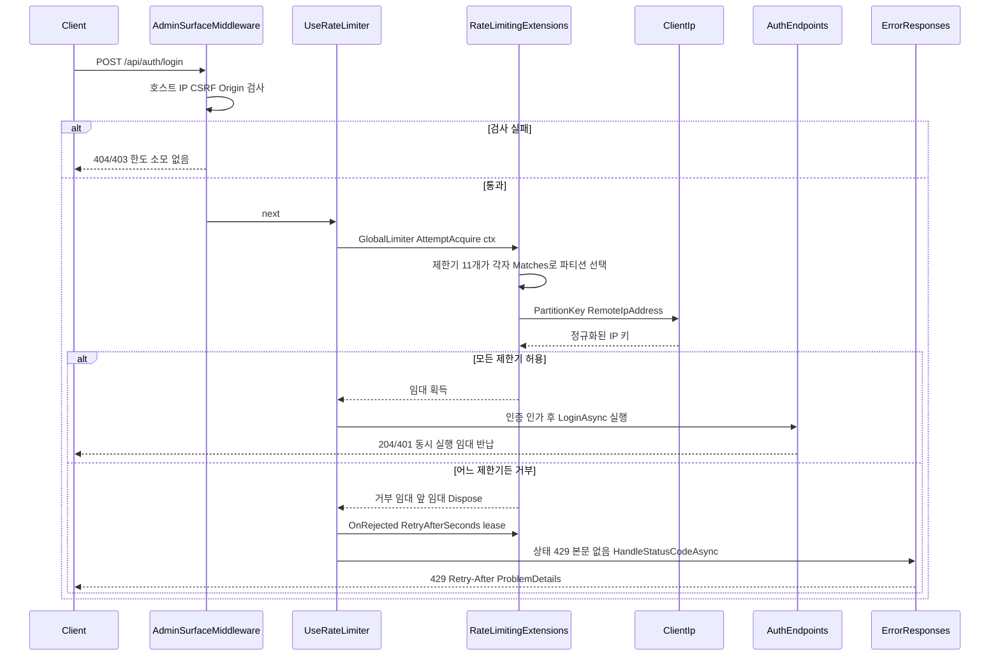
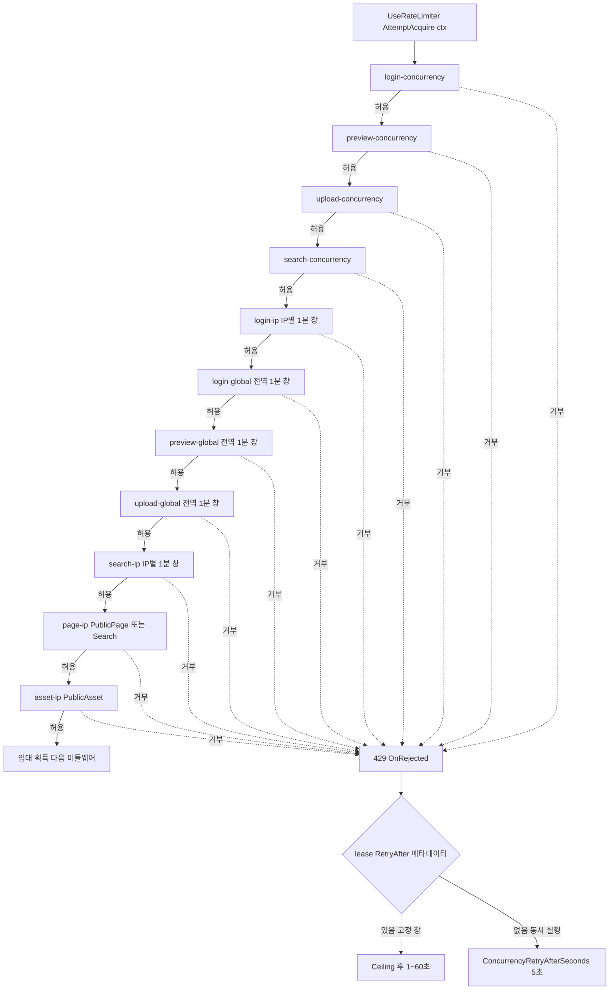
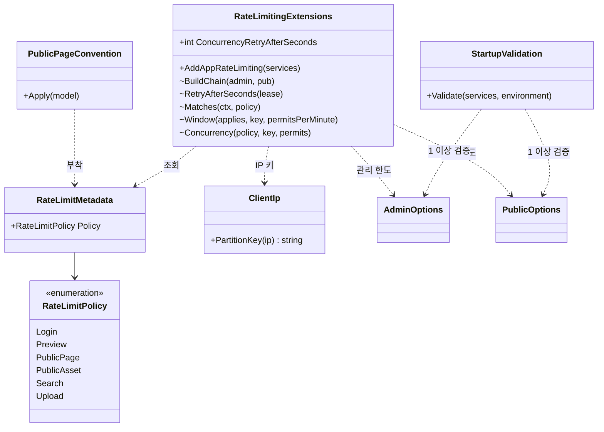
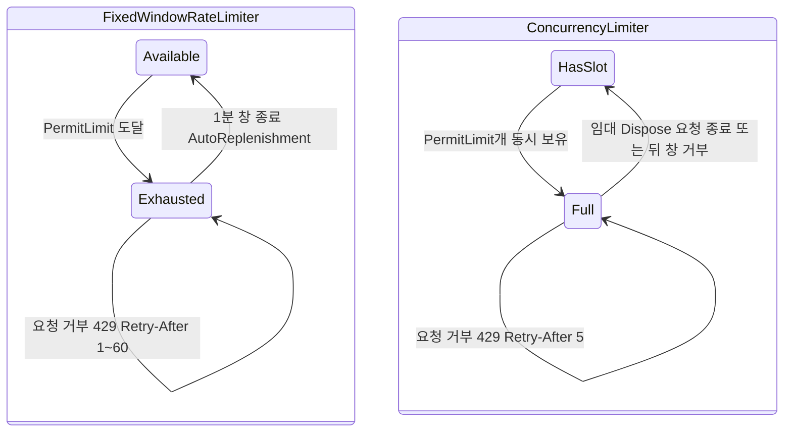

# F019 요청 속도 제한

<!-- doc-harness:section id="summary" hash="20b513f1c04455a6ae458139d5a7a190c0bed8d6e71f1165b0db7f8de5fabdd2" -->
## 한 줄 요약

결론: 속도 제한은 ASP.NET Core 기본 RateLimiter 미들웨어의 GlobalLimiter 하나로 구현된다. RateLimitingExtensions.BuildChain이 PartitionedRateLimiter.CreateChained로 제한기 11개를 묶고, 모든 요청이 11개를 순서대로 지난다. 앞의 4개는 동시 실행 제한기다(login·preview·upload·search, 정책별 상수 키 파티션, QueueLimit 0). 뒤의 7개는 1분 고정 창이다(login IP별·login 전역·preview 전역·upload 전역·search IP별·page IP별(Search 포함)·asset IP별). 제한기마다 파티션 선택 람다 안에서 Matches(ctx, policy)로 ctx.GetEndpoint()의 RateLimitMetadata.Policy를 따로 확인한다. 자기 정책이면 실제 제한기 파티션을, 아니면 GetNoLimiter("none")를 고른다. IP 파티션 키는 ClientIp.PartitionKey가 만든다(IPv4-mapped는 IPv4로 접고, IPv6는 /64로 자른다). 거부 상태는 429다. OnRejected는 lease의 RetryAfter 메타데이터를 올림해 1~60초로 자르고, 메타데이터가 없으면(동시 실행 거부) 5초를 Retry-After에 쓴다. 본문은 바깥의 UseStatusCodePages → ErrorResponses가 쓰는 것으로 보인다. 미들웨어는 AdminSurfaceMiddleware 뒤, UseAuthentication 앞에 있다. 한도 값은 AdminOptions·PublicOptions에서 오고, 기동 시 StartupValidation이 모두 1 이상인지 검증한다. IP 파티션이 의미를 가지려면 Proxy:TrustedIp가 필요하다. Development가 아닌 환경에서는 이 값이 비면 기동이 실패한다. DB 접근·외부 API·앱 수준 로깅은 없다. 이번 재검증에서 이전 분석과 현재 코드의 차이는 발견되지 않았다.

| 항목 | 값 |
|---|---|
| 중요도 | INFRA |
| 상태 | ACTIVE |
| 진입점 | `전역 미들웨어 app.UseRateLimiter() (PortfolioBlog.Api/Program.cs:105)`, `서비스 등록 builder.Services.AddAppRateLimiting() (PortfolioBlog.Api/Program.cs:56)`, `메타데이터 부착: PublicPageConvention.Apply, AuthEndpoints(/api/auth/login), PreviewEndpoints, AttachmentEndpoints(업로드), PublicAttachmentEndpoints, SiteEndpoints, /health` |
| 의존 기능 | [F018](../09_FEATURES.md#f018), [F020](../09_FEATURES.md#f020), [F021](../09_FEATURES.md#f021) |

### 진입점 근거

| 내용 | 상태 | 근거 |
|---|---|---|
| Program.cs가 AddAppRateLimiting()으로 RateLimiterOptions를 등록한다. UseRateLimiter()는 AdminSurfaceMiddleware 뒤, UseAuthentication 앞에 둔다. | CONFIRMED | `PortfolioBlog.Api/Program.cs` AddAppRateLimiting (56), `PortfolioBlog.Api/Program.cs` UseRateLimiter (104-106) |
| PublicPageConvention.Apply가 모든 Razor 페이지 선택자에 RateLimitMetadata를 단다. ViewEnginePath가 "/Search"이면 Search 정책이고, 아니면 PublicPage 정책이다. 규약은 RazorPagesOptions 지연 구성으로 등록된다. | CONFIRMED | `PortfolioBlog.Api/Pages/PublicPageConvention.cs` PublicPageConvention.Apply (32-41), `PortfolioBlog.Api/Program.cs` (70-71) |
| 최소 API 엔드포인트는 WithMetadata로 정책을 지정한다. /api/auth/login은 Login, 미리보기는 Preview, 첨부 업로드는 Upload다. 공개 첨부 GET·/health·highlight.css·robots.txt는 PublicAsset, feed.xml·sitemap.xml은 PublicPage다. | CONFIRMED | `PortfolioBlog.Api/Features/Auth/AuthEndpoints.cs` (48), `PortfolioBlog.Api/Features/Preview/PreviewEndpoints.cs` (39), `PortfolioBlog.Api/Features/Attachments/AttachmentEndpoints.cs` (48), `PortfolioBlog.Api/Features/Attachments/PublicAttachmentEndpoints.cs` (53), `PortfolioBlog.Api/Pages/SiteEndpoints.cs` (72-81), `PortfolioBlog.Api/Program.cs` (115-120) |
<!-- /doc-harness:section -->

<!-- doc-harness:section id="flow" hash="496d5dd53765620119e2814a4813070771f6a4087d27b9ba43ce63b6e01ec805" -->
## 처리 흐름

| 단계 | 컴포넌트 | 코드 | 설명 |
|---|---|---|---|
| 1 | RateLimitingExtensions | `PortfolioBlog.Api/Infrastructure/Web/RateLimitingExtensions.cs` AddAppRateLimiting | 기동 시 AddRateLimiter를 호출한다. RateLimiterOptions는 IOptions<AdminOptions>·IOptions<PublicOptions>에 의존하는 지연 구성으로 등록한다. 내용은 RejectionStatusCode=429, OnRejected, GlobalLimiter=BuildChain(...)이다. |
| 2 | PublicPageConvention | `PortfolioBlog.Api/Pages/PublicPageConvention.cs` PublicPageConvention.Apply | 라우트 모델을 구성할 때 Razor 페이지 선택자마다 HttpMethodMetadata(GET/HEAD)·HostAttribute·RateLimitMetadata(Search 또는 PublicPage)를 추가한다. |
| 3 | StartupValidation | `PortfolioBlog.Api/Infrastructure/Access/StartupValidation.cs` StartupValidation.Validate | app.Build() 직후 로그인·미리보기·업로드·공개 페이지·자산·검색의 한도와 동시성 값이 모두 1 이상인지 확인한다(62-78행). Development가 아니면 Proxy:TrustedIp도 필수로 요구한다(116-119행). 조건을 어기면 InvalidOperationException이 나고 기동이 실패한다. |
| 4 | AdminSurfaceMiddleware | `PortfolioBlog.Api/Program.cs` app.UseMiddleware<AdminSurfaceMiddleware> | 요청이 들어오면 제한기보다 먼저 실행된다(104행). /api 요청이 호스트·허용 IP·CSRF 헤더·Origin 검사에 실패하면 404/403으로 끝나므로 제한기 허용량을 쓰지 않는다. |
| 5 | UseRateLimiter | `PortfolioBlog.Api/Program.cs` app.UseRateLimiter | 프레임워크 RateLimiter 미들웨어가 현재 HttpContext로 GlobalLimiter(체인)에서 임대를 얻으려 한다. 대기열이 0이라 기다리지 않는다. |
| 6 | RateLimitingExtensions | `PortfolioBlog.Api/Infrastructure/Web/RateLimitingExtensions.cs` BuildChain / Concurrency / Matches | 체인 앞쪽의 동시 실행 제한기 4개(login·preview·upload·search)를 차례로 평가한다. 각 제한기는 Matches(ctx, policy)가 참이면 상수 키 파티션의 ConcurrencyLimiter(QueueLimit 0)를, 거짓이면 GetNoLimiter("none")를 골라 임대를 얻는다. |
| 7 | RateLimitingExtensions | `PortfolioBlog.Api/Infrastructure/Web/RateLimitingExtensions.cs` BuildChain / Window / Ip | 이어서 고정 창 7개(1분, AutoReplenishment)를 평가한다. 순서는 login-ip, login-global, preview-global, upload-global, search-ip, page-ip(PublicPage 또는 Search), asset-ip다. 각 창은 applies 람다로 적용 여부를 따로 판정하고, 해당하지 않으면 NoLimiter 파티션을 받는다. |
| 8 | ClientIp | `PortfolioBlog.Api/Infrastructure/Web/ClientIp.cs` ClientIp.PartitionKey | IP별 창의 키를 만든다. null이면 빈 문자열을 반환한다. IPv4-mapped IPv6는 IPv4로 바꾼다. IPv6는 하위 64비트를 0으로 지우고 "/64"를 붙인다. |
| 9 | UseRateLimiter | `PortfolioBlog.Api/Program.cs` app.UseRateLimiter | 11개가 모두 허용하면 다음 미들웨어로 진행한다(UseAuthentication → UseAuthorization → ApiBodyLimitMiddleware → 엔드포인트). 동시 실행 임대는 요청 파이프라인이 끝날 때 반납된다. |
| 10 | RateLimitingExtensions | `PortfolioBlog.Api/Infrastructure/Web/RateLimitingExtensions.cs` AddAppRateLimiting.OnRejected / RetryAfterSeconds | 어느 제한기든 거부하면 앞에서 빌린 임대가 Dispose되고 응답 상태가 429가 된다. OnRejected는 lease의 MetadataName.RetryAfter를 올림해 1~60으로 자른 값을 Retry-After 헤더에 쓴다. 메타데이터가 없으면 ConcurrencyRetryAfterSeconds(5)를 쓴다. |
| 11 | ErrorResponses | `PortfolioBlog.Api/Infrastructure/Web/ErrorResponses.cs` ErrorResponses.HandleStatusCodeAsync / WriteAsync | 본문 없는 429 응답에 UseStatusCodePages가 본문을 쓴다. /api·/attachments·/health·/openapi 경로는 ProblemDetails를 받는다. 그 밖의 공개 페이지는 '요청이 너무 많습니다…' 고정 HTML을 받고, HEAD 요청이면 본문을 쓰지 않는다. |
<!-- /doc-harness:section -->

<!-- doc-harness:section id="F019_SEQUENCE" hash="05be274dd7050b83ff7061e3c99a4318c8f14f9a4a0e0a529fa2133863c0ace6" -->
## 요청 파이프라인에서의 속도 제한 순서(로그인 요청 예) (Sequence Diagram)

로그인 요청은 AdminSurfaceMiddleware를 통과해야 제한기 체인에 들어가고, 체인이 거부하면 OnRejected가 Retry-After를 붙이고 ErrorResponses가 429 본문을 쓴다.

Program.cs의 미들웨어 순서(104-108행)를 따른다. AdminSurfaceMiddleware가 먼저 거부하면 제한기는 실행되지 않는다. UseRateLimiter는 AddAppRateLimiting이 등록한 GlobalLimiter(BuildChain 결과)에서 임대를 얻는다. 체인의 각 제한기는 Matches로 엔드포인트 메타데이터를 보고, IP별 창은 ClientIp.PartitionKey로 키를 만든다. 거부 시 OnRejected가 RetryAfterSeconds로 헤더를 쓰고, 본문은 UseStatusCodePages(101행)에 연결된 ErrorResponses.HandleStatusCodeAsync가 쓰는 것으로 보인다(본문 형식을 단언하는 테스트는 없음). 로그인 이외의 정책도 흐름은 같다.

### 코드 근거

| 구성 요소 | 코드 |
|---|---|
| AdminSurfaceMiddleware | `PortfolioBlog.Api/Program.cs` (app.UseMiddleware<AdminSurfaceMiddleware>) |
| UseRateLimiter | `PortfolioBlog.Api/Program.cs` (app.UseRateLimiter) |
| RateLimitingExtensions | `PortfolioBlog.Api/Infrastructure/Web/RateLimitingExtensions.cs` (BuildChain / OnRejected) |
| ClientIp | `PortfolioBlog.Api/Infrastructure/Web/ClientIp.cs` (ClientIp.PartitionKey) |
| AuthEndpoints | `PortfolioBlog.Api/Features/Auth/AuthEndpoints.cs` (LoginAsync) |
| ErrorResponses | `PortfolioBlog.Api/Infrastructure/Web/ErrorResponses.cs` (HandleStatusCodeAsync) |
<!-- /doc-harness:section -->

<!-- doc-harness:section id="F019_FLOW" hash="38cabdf4a2a867f4895344dda713bffe7effbf523208b7c1ede51752e5ff5304" -->
## BuildChain 제한기 체인 평가 순서와 Retry-After 분기 (Flowchart)

동시 실행 제한기 4개 다음에 고정 창 7개가 순서대로 평가되고, 어느 하나라도 거부하면 429가 된다. Retry-After는 lease 메타데이터 유무로 1~60초 또는 5초로 갈린다.

BuildChain(88-101행)의 인자 순서 그대로다. 각 노드는 자기 정책(Matches)이 아니면 NoLimiter("none") 파티션을 받아 항상 허용한다. 따라서 메타데이터 없는 요청은 끝까지 통과한다. 동시 실행 제한기를 앞에 둔 이유는 코드 주석(85-86행)에 있다. 뒤의 창이 거부하면 앞의 동시 실행 임대는 Dispose로 반납되지만, 고정 창 허용량은 반납되지 않는다. RetryAfterSeconds(69-72행)는 lease에 RetryAfter 메타데이터가 있으면 올림 후 1~60으로 자르고, 없으면 5를 쓴다.

### 코드 근거

| 구성 요소 | 코드 |
|---|---|
| Start | `PortfolioBlog.Api/Program.cs` (app.UseRateLimiter) |
| LoginConc | `PortfolioBlog.Api/Infrastructure/Web/RateLimitingExtensions.cs` (Concurrency) |
| LoginIp | `PortfolioBlog.Api/Infrastructure/Web/RateLimitingExtensions.cs` (Window) |
| PageIp | `PortfolioBlog.Api/Infrastructure/Web/RateLimitingExtensions.cs` (BuildChain) |
| Rejected | `PortfolioBlog.Api/Infrastructure/Web/RateLimitingExtensions.cs` (AddAppRateLimiting.OnRejected) |
| RetryAfterSeconds | `PortfolioBlog.Api/Infrastructure/Web/RateLimitingExtensions.cs` (RetryAfterSeconds) |
<!-- /doc-harness:section -->

<!-- doc-harness:section id="F019_CLASS" hash="ab31dff446180f0b4d2bf4aaf649ed36d4f736f11b3dda19a4d4e729325b5e3e" -->
## 정책 메타데이터 부착과 체인 구성 관계 (Class Diagram)

RateLimitMetadata는 엔드포인트 쪽(PublicPageConvention 등)이 달고 RateLimitingExtensions가 읽는다. 한도는 AdminOptions·PublicOptions에서 오고 StartupValidation이 검증한다.

RateLimitPolicy enum 6개 값과 불변 record RateLimitMetadata(RateLimitPolicy.cs)가 정책을 표시하는 유일한 수단이다. PublicPageConvention 외에도 AuthEndpoints·PreviewEndpoints·AttachmentEndpoints·PublicAttachmentEndpoints·SiteEndpoints·Program.cs(/health)가 WithMetadata로 붙인다(그림에서는 생략). RateLimitingExtensions의 internal 멤버는 RateLimitChainTests가 직접 호출한다.

### 코드 근거

| 구성 요소 | 코드 |
|---|---|
| RateLimitPolicy | `PortfolioBlog.Api/Infrastructure/Web/RateLimitPolicy.cs` |
| RateLimitMetadata | `PortfolioBlog.Api/Infrastructure/Web/RateLimitPolicy.cs` |
| RateLimitingExtensions | `PortfolioBlog.Api/Infrastructure/Web/RateLimitingExtensions.cs` |
| ClientIp | `PortfolioBlog.Api/Infrastructure/Web/ClientIp.cs` |
| AdminOptions | `PortfolioBlog.Api/Infrastructure/Access/AdminOptions.cs` |
| PublicOptions | `PortfolioBlog.Api/Infrastructure/Web/PublicOptions.cs` |
| PublicPageConvention | `PortfolioBlog.Api/Pages/PublicPageConvention.cs` |
| StartupValidation | `PortfolioBlog.Api/Infrastructure/Access/StartupValidation.cs` |
<!-- /doc-harness:section -->

<!-- doc-harness:section id="F019_STATE" hash="8373986850cc090cbc8089ab846ad86aec19c1294f6e16f8da6cba6a3beadf0a" -->
## 고정 창 파티션과 동시 실행 임대의 상태 (State Diagram)

고정 창 파티션은 허용량 소진 후 1분 창이 끝나면 자동 보충되고, 동시 실행 파티션은 임대가 Dispose될 때 슬롯이 돌아온다.

Window는 FixedWindowRateLimiterOptions(PermitLimit, Window=1분, QueueLimit=0, AutoReplenishment=true)로 파티션을 만든다(144-150행). Concurrency는 ConcurrencyLimiterOptions(PermitLimit, QueueLimit=0)를 쓴다(167-170행). 동시 실행 임대가 뒤 창의 거부로 반납되는 동작은 WindowRejection_ReturnsTheConcurrencyPermit 테스트로 확인된다. 상태는 프로세스 메모리에만 있어 재시작하면 초기화된다(추론).

### 코드 근거

| 구성 요소 | 코드 |
|---|---|
| FixedWindowRateLimiter | `PortfolioBlog.Api/Infrastructure/Web/RateLimitingExtensions.cs` (Window) |
| ConcurrencyLimiter | `PortfolioBlog.Api/Infrastructure/Web/RateLimitingExtensions.cs` (Concurrency) |
<!-- /doc-harness:section -->

<!-- doc-harness:section id="data" hash="1381e962509d18bfa6e6d09ef8182f9bbfd518c8661ac77ffff247bfb814056e" -->
## 데이터

### 데이터 흐름

| 내용 | 상태 | 근거 |
|---|---|---|
| 입력은 HttpContext다. 제한기마다 ctx.GetEndpoint().Metadata의 RateLimitMetadata.Policy로 적용 여부를 판정한다. IP별 창은 ctx.Connection.RemoteIpAddress를 ClientIp.PartitionKey로 정규화하고 접두사(login-ip:, search-ip:, page-ip:, asset-ip:)를 붙여 키로 쓴다. 전역 파티션 키는 상수 문자열이다(login-global, preview-global, upload-global, *-concurrency). 해당하지 않는 요청은 상수 키 "none"의 NoLimiter 파티션으로 간다. | CONFIRMED | `PortfolioBlog.Api/Infrastructure/Web/RateLimitingExtensions.cs` (88-129, 144-170), `PortfolioBlog.Api/Infrastructure/Web/ClientIp.cs` (33-44) |
| 한도 값은 설정 섹션 Admin과 Public에서 온다. Admin 기본값은 LoginPerIpPerMinute 5, LoginGlobalPerMinute 20, LoginConcurrency 2, PreviewPerMinute 60, PreviewConcurrency 2, UploadPerMinute 30, UploadConcurrency 2다. Public 기본값은 PagePerIpPerMinute 120, AssetPerIpPerMinute 600, SearchPerIpPerMinute 20, SearchConcurrency 4다. 숫자는 코드 기본값이다. | CONFIRMED | `PortfolioBlog.Api/Infrastructure/Access/AdminOptions.cs` (24-45), `PortfolioBlog.Api/Infrastructure/Web/PublicOptions.cs` (18-27) |
| 스모크 배포 오버레이는 환경 변수 Admin__LoginPerIpPerMinute·Admin__LoginGlobalPerMinute로 로그인 한도를 덮어쓴다. 운영 compose는 주석에서 UploadConcurrency를 메모리 한도 산정 근거로 든다. | INFERRED | `deploy/docker-compose.smoke.yml` (6-7), `deploy/docker-compose.yml` (56) |
| 거부 출력은 상태 코드 429와 Retry-After 헤더(정수 초)다. 고정 창 거부는 lease의 RetryAfter 메타데이터를 올림해 1~60으로 자른다. 동시 실행 거부는 메타데이터가 없어 5가 된다. | CONFIRMED | `PortfolioBlog.Api/Infrastructure/Web/RateLimitingExtensions.cs` (47-52, 69-72), `PortfolioBlog.Api.Tests/Infrastructure/RateLimitChainTests.cs` (37-52), `PortfolioBlog.Api.Tests/Features/RateLimitHeaderTests.cs` (21-33), `PortfolioBlog.Api.Tests/Features/PublicRateLimitTests.cs` (19-35) |
| 429 본문은 UseStatusCodePages가 ErrorResponses.WriteAsync로 채운다. /api 같은 기계용 경로는 ProblemDetails를, 공개 페이지는 429 문구가 든 고정 HTML을 받는다. 본문 형식을 단언하는 테스트는 찾지 못했다(테스트는 상태 코드와 Retry-After만 확인한다). | INFERRED | `PortfolioBlog.Api/Program.cs` (101), `PortfolioBlog.Api/Infrastructure/Web/ErrorResponses.cs` (45-56, 66) |
| 관리 SPA는 Retry-After를 정수 초로 해석해 1~3600으로 제한한다. 미리보기 창은 그 시간 동안 요청을 보내지 않는다. 로그인·일반 오류 안내는 대기 시간을 문구로 보여 준다(이번 세션에서 재확인하지 않은 이전 분석 내용). | INFERRED | `PortfolioBlog.Web/src/api/errors.ts` parseRetryAfter / describeError (29-80), `PortfolioBlog.Web/src/components/PreviewPane.tsx` (43-70) |

### DB 접근

_(없음)_

### 상태 전이

| 이전 | 다음 | 트리거 | 근거 |
|---|---|---|---|
| 고정 창 파티션: 허용량 남음 | 고정 창 파티션: 소진(거부) | 1분 창 안에서 PermitLimit만큼 임대를 획득한다. 요청이 뒤 제한기에 거부돼도 이미 빌린 창 허용량은 돌아오지 않는다. | `PortfolioBlog.Api/Infrastructure/Web/RateLimitingExtensions.cs` (85-86, 144-150), `PortfolioBlog.Api.Tests/Infrastructure/RateLimitChainTests.cs` (50-52) |
| 고정 창 파티션: 소진(거부) | 고정 창 파티션: 허용량 남음 | 1분 창이 끝나면 AutoReplenishment = true에 따라 자동 보충된다 | `PortfolioBlog.Api/Infrastructure/Web/RateLimitingExtensions.cs` (146-149) |
| 동시 실행 파티션: 여유 있음 | 동시 실행 파티션: 가득 참(거부) | 같은 정책의 요청 PermitLimit개가 동시에 처리 중이다. QueueLimit이 0이라 즉시 거부한다. | `PortfolioBlog.Api/Infrastructure/Web/RateLimitingExtensions.cs` (167-170), `PortfolioBlog.Api.Tests/Infrastructure/RateLimitChainTests.cs` (35-42) |
| 동시 실행 임대: 보유 | 동시 실행 임대: 반납 | 요청 파이프라인이 끝나거나, 체인 뒤쪽 고정 창이 거부해 앞의 임대가 Dispose된다 | `PortfolioBlog.Api.Tests/Infrastructure/RateLimitChainTests.cs` WindowRejection_ReturnsTheConcurrencyPermit (55-68), `PortfolioBlog.Api/Infrastructure/Web/RateLimitingExtensions.cs` (85-86) |
| IP 파티션: 존재 | IP 파티션: 제거 | 10초 이상 쓰이지 않은 파티션을 프레임워크 내부 타이머가 정리한다. 근거는 코드 주석의 실측 기록뿐이고 저장소 코드로는 확인할 수 없다. | `PortfolioBlog.Api/Infrastructure/Web/RateLimitingExtensions.cs` (14-17) |

### 외부 의존

| 내용 | 상태 | 근거 |
|---|---|---|
| 프레임워크의 System.Threading.RateLimiting(PartitionedRateLimiter.CreateChained·Create, RateLimitPartition.GetFixedWindowLimiter/GetConcurrencyLimiter/GetNoLimiter)과 Microsoft.AspNetCore.RateLimiting(AddRateLimiter, UseRateLimiter, RateLimiterOptions)을 쓴다. 외부 서비스·저장소는 쓰지 않고, 상태는 프로세스 메모리에만 있다. | CONFIRMED | `PortfolioBlog.Api/Infrastructure/Web/RateLimitingExtensions.cs` (1-4, 44-54, 88-170) |
| IP별 파티션이 제대로 동작하려면 ForwardedHeaders가 RemoteIpAddress를 실제 클라이언트 IP로 바꿔야 한다. UseTrustedForwardedHeaders는 Proxy:TrustedIp가 있을 때만 UseForwardedHeaders를 등록하고, KnownProxies에는 그 IP 하나만 넣는다(ForwardLimit=1). 운영 compose는 Proxy__TrustedIp에 Caddy 고정 IP를 설정한다. Development가 아닌 환경에서 값이 비면 StartupValidation이 기동을 막는다. | CONFIRMED | `PortfolioBlog.Api/Infrastructure/Access/AccessServiceCollectionExtensions.cs` (37-51, 68-75), `deploy/docker-compose.yml` (43, 70), `PortfolioBlog.Api/Program.cs` (99), `PortfolioBlog.Api/Infrastructure/Access/StartupValidation.cs` (116-119) |
<!-- /doc-harness:section -->

<!-- doc-harness:section id="failures" hash="6dcf2833c1c6dd65de9aff692f62001f99b810561d6a7617214cbd10cfee4755" -->
## 실패 지점

| 위치 | 조건 | 처리 | 상태 | 근거 |
|---|---|---|---|---|
| StartupValidation.Validate | Admin 또는 Public의 속도 제한 관련 값(PerMinute·Concurrency)이 1 미만이다 | InvalidOperationException을 던져 앱 기동이 실패한다. 테스트 ZeroLimit_FailsStartup이 이를 확인한다. | CONFIRMED | `PortfolioBlog.Api/Infrastructure/Access/StartupValidation.cs` (62-78), `PortfolioBlog.Api.Tests/Features/PublicRateLimitTests.cs` ZeroLimit_FailsStartup (60-66) |
| RateLimitingExtensions.Concurrency (UseRateLimiter) | 정책별 동시 실행 수가 PermitLimit에 도달했다 | QueueLimit이 0이라 기다리지 않고 즉시 거부한다. 429와 Retry-After 5초를 낸다. | CONFIRMED | `PortfolioBlog.Api/Infrastructure/Web/RateLimitingExtensions.cs` (26, 69-72, 167-170), `PortfolioBlog.Api.Tests/Infrastructure/RateLimitChainTests.cs` (29-53) |
| RateLimitingExtensions.Window (UseRateLimiter) | 1분 고정 창의 허용량이 소진됐다 | 즉시 거부한다. 429와 창 종료까지 남은 초(1~60)를 Retry-After로 낸다. 앞에서 빌린 동시 실행 임대는 반납된다. | CONFIRMED | `PortfolioBlog.Api/Infrastructure/Web/RateLimitingExtensions.cs` (69-72, 144-150), `PortfolioBlog.Api.Tests/Infrastructure/RateLimitChainTests.cs` (55-68), `PortfolioBlog.Api.Tests/Features/RateLimitHeaderTests.cs` (21-33) |
| AddAppRateLimiting.OnRejected | 거부 응답을 만든다 | Retry-After 헤더만 설정하고 본문은 쓰지 않는다. 본문은 UseStatusCodePages → ErrorResponses가 채우는 것으로 보이지만, 이를 단언하는 테스트는 없다. | INFERRED | `PortfolioBlog.Api/Infrastructure/Web/RateLimitingExtensions.cs` (48-52), `PortfolioBlog.Api/Program.cs` (101) |
| StartupValidation.Validate / UseTrustedForwardedHeaders / ClientIp.PartitionKey | Proxy:TrustedIp가 비어 있다 | Development가 아닌 모든 환경에서는 Require(proxy.TrustedIp.Length > 0, "Proxy:TrustedIp")가 기동을 막는다. 따라서 값이 빈 상태는 Development에서만 생긴다. 그때는 UseForwardedHeaders가 등록되지 않아 RemoteIpAddress가 직접 연결한 상대의 IP가 된다. Development를 프록시 뒤에서 돌리면 모든 방문자가 IP 파티션 하나를 공유하며, 이를 막는 별도 처리는 없다. | POTENTIAL_ISSUE | `PortfolioBlog.Api/Infrastructure/Access/StartupValidation.cs` (116-119), `PortfolioBlog.Api/Infrastructure/Access/AccessServiceCollectionExtensions.cs` (68-75) |
| ClientIp.PartitionKey | RemoteIpAddress가 null이다 | 빈 문자열 키를 반환한다. 그래서 IP를 모르는 요청은 모두 같은 파티션(예: "login-ip:")을 공유한다. | CONFIRMED | `PortfolioBlog.Api/Infrastructure/Web/ClientIp.cs` (35), `PortfolioBlog.Api.Tests/Infrastructure/ClientIpTests.cs` (36) |

### 엣지 케이스

| 내용 | 상태 | 근거 |
|---|---|---|
| RateLimitMetadata가 없는 엔드포인트도 제한기 11개를 모두 지나지만, 모든 제한기에서 NoLimiter 파티션을 받아 제한되지 않는다. 메타데이터는 로그인·미리보기·업로드·공개 첨부·SiteEndpoints·/health·Razor 페이지에만 붙는다. 그래서 관리 글/시리즈/태그/첨부 목록·삭제 API는 속도 제한이 없다. | CONFIRMED | `PortfolioBlog.Api.Tests/Infrastructure/RateLimitChainTests.cs` RequestWithoutPolicy_IsNeverLimited (95-105), `PortfolioBlog.Api/Infrastructure/Web/RateLimitingExtensions.cs` (128-129, 144-150, 167-170) |
| UseStaticFiles가 UseRateLimiter보다 앞이라 /css/site.css 같은 정적 파일은 제한되지 않는다. Development의 /openapi(MapOpenApi)도 메타데이터가 없어 제한되지 않는다. | CONFIRMED | `PortfolioBlog.Api/Program.cs` (103-105, 110-113) |
| 라우팅이 만드는 405(Razor 페이지에 POST)나 호스트 불일치 404 같은 합성 엔드포인트, 매칭에 실패한 요청에는 RateLimitMetadata가 없다. 그래서 제한되지 않을 것으로 보인다. | INFERRED | `PortfolioBlog.Api/Pages/PublicPageConvention.cs` (16-18, 37-39), `PortfolioBlog.Api/Infrastructure/Web/RateLimitingExtensions.cs` (128-129) |
| 공개 첨부 GET은 없는 id라서 404를 내도 asset 창에 계산된다. | CONFIRMED | `PortfolioBlog.Api.Tests/Features/PublicRateLimitTests.cs` AttachmentGet_CountsTowardTheAssetLimit_EvenWhen404 (38-46) |
| 검색 요청은 search-ip 창과 page-ip 창 양쪽에 계산된다. search-ip가 page-ip보다 앞이라, 검색 창이 거부한 요청은 페이지 허용량을 쓰지 않는다. | CONFIRMED | `PortfolioBlog.Api/Infrastructure/Web/RateLimitingExtensions.cs` (98-100), `PortfolioBlog.Api.Tests/Infrastructure/RateLimitChainTests.cs` (70-93) |
| 반대 방향은 보호되지 않는다. page-ip 창이 검색을 거부해도 이미 빌린 search-ip 허용량은 소모된다. login-global 창이 거부해도 이미 빌린 login-ip 허용량은 소모된다. 고정 창 임대는 Dispose해도 허용량이 돌아오지 않기 때문이다(코드 주석). 이를 검증하는 테스트는 없다. | POTENTIAL_ISSUE | `PortfolioBlog.Api/Infrastructure/Web/RateLimitingExtensions.cs` (85-86, 94-100) |
| 동시 실행 제한기가 고정 창보다 앞이라 동시 실행 거부는 분당 허용량을 쓰지 않는다. 창이 거부하면 동시 실행 임대는 반납된다. | CONFIRMED | `PortfolioBlog.Api.Tests/Infrastructure/RateLimitChainTests.cs` (28-68), `PortfolioBlog.Api/Infrastructure/Web/RateLimitingExtensions.cs` (85-93) |
| IPv4-mapped IPv6(::ffff:a.b.c.d)는 IPv4와 같은 키로 접힌다. 로그인 한도 통합 테스트도 이를 확인한다. IPv6는 같은 /64 안이면 같은 파티션이다. | CONFIRMED | `PortfolioBlog.Api/Infrastructure/Web/ClientIp.cs` (33-44), `PortfolioBlog.Api.Tests/Infrastructure/ClientIpTests.cs` (20-41), `PortfolioBlog.Api.Tests/Features/AuthEndpointsTests.cs` (275-287) |
| 파티션 판정은 원시 경로가 아니라 선택된 엔드포인트의 메타데이터로 한다. 그래서 /api/auth/login/ 이나 /API/Auth/LOGIN 같은 변형으로도 우회할 수 없다. | CONFIRMED | `PortfolioBlog.Api/Infrastructure/Web/RateLimitPolicy.cs` (25-39), `PortfolioBlog.Api.Tests/Features/AuthEndpointsTests.cs` Login_RateLimit_CannotBeBypassedWithPathVariants (350-368) |
| 제한기가 AdminSurfaceMiddleware 뒤라서 허용 IP 밖의 /api 요청은 403으로 끝나고 로그인 한도를 소진하지 못한다(테스트로 확인). 반면 인증보다 앞이라 허용 IP 안의 세션 없는 요청도 preview·upload 전역 창을 소모할 수 있다. 이 뒷부분은 코드 순서에서 추론한 것이다. | INFERRED | `PortfolioBlog.Api/Program.cs` (104-108), `PortfolioBlog.Api.Tests/Features/AuthEndpointsTests.cs` Login_FromOutsiderIp_Returns403_AndDoesNotConsumeRateLimit (322-337) |
| Razor 페이지에 RateLimitMetadata가 빠지면 AccessMatrixTests의 닫힌 세계 검사가 잡는다. SearchPageTests는 /search 엔드포인트에 Search 정책이 붙었는지 확인한다. | CONFIRMED | `PortfolioBlog.Api/Pages/PublicPageConvention.cs` (16-18), `PortfolioBlog.Api.Tests/Features/AccessMatrixTests.cs` (324-344), `PortfolioBlog.Api.Tests/Features/SearchPageTests.cs` (105-110) |
| 제한기가 실행될 때 GetEndpoint()가 이미 채워져 있다는 전제가 있다(WebApplication이 라우팅을 사용자 미들웨어보다 앞에 둔다). 근거는 코드 주석이고, 로그인·/health·업로드 429 통합 테스트가 실제로 성립함을 보여 준다. | CONFIRMED | `PortfolioBlog.Api/Infrastructure/Web/RateLimitingExtensions.cs` (20-21), `PortfolioBlog.Api.Tests/Features/RateLimitHeaderTests.cs` (21-33), `PortfolioBlog.Api.Tests/Features/PublicRateLimitTests.cs` (19-57) |

### 로깅

| 내용 | 상태 | 근거 |
|---|---|---|
| OnRejected는 Retry-After 헤더만 설정하고 로그를 남기지 않는다. 속도 제한 거부에 대한 앱 수준 로깅 코드는 없다. | CONFIRMED | `PortfolioBlog.Api/Infrastructure/Web/RateLimitingExtensions.cs` (48-52) |
| 프레임워크 RateLimiter 미들웨어가 자체 로그를 내는지, 낸다면 어떤 레벨인지는 저장소 코드로 확인할 수 없다. | UNKNOWN | `PortfolioBlog.Api/Program.cs` (105) |
<!-- /doc-harness:section -->

<!-- doc-harness:section id="code" hash="222a93a04a00ee445822603027426bc56ab8367b9861af930cc9e8394ee78338" -->
## 관련 코드

| 파일 | 심볼 | 역할 |
|---|---|---|
| `PortfolioBlog.Api/Program.cs` | AddAppRateLimiting / UseRateLimiter | entry |
| `PortfolioBlog.Api/Infrastructure/Web/RateLimitingExtensions.cs` | RateLimitingExtensions.AddAppRateLimiting | config |
| `PortfolioBlog.Api/Infrastructure/Web/RateLimitingExtensions.cs` | RateLimitingExtensions.BuildChain | service |
| `PortfolioBlog.Api/Infrastructure/Web/RateLimitingExtensions.cs` | RateLimitingExtensions.Window | service |
| `PortfolioBlog.Api/Infrastructure/Web/RateLimitingExtensions.cs` | RateLimitingExtensions.Concurrency | service |
| `PortfolioBlog.Api/Infrastructure/Web/RateLimitingExtensions.cs` | RateLimitingExtensions.Matches | service |
| `PortfolioBlog.Api/Infrastructure/Web/RateLimitingExtensions.cs` | RateLimitingExtensions.RetryAfterSeconds | render |
| `PortfolioBlog.Api/Infrastructure/Web/RateLimitPolicy.cs` | RateLimitPolicy | dto |
| `PortfolioBlog.Api/Infrastructure/Web/RateLimitPolicy.cs` | RateLimitMetadata | dto |
| `PortfolioBlog.Api/Infrastructure/Web/ClientIp.cs` | ClientIp.PartitionKey | service |
| `PortfolioBlog.Api/Infrastructure/Access/AdminOptions.cs` | AdminOptions | config |
| `PortfolioBlog.Api/Infrastructure/Web/PublicOptions.cs` | PublicOptions | config |
| `PortfolioBlog.Api/Infrastructure/Access/StartupValidation.cs` | StartupValidation.Validate | validation |
| `PortfolioBlog.Api/Pages/PublicPageConvention.cs` | PublicPageConvention.Apply | config |
| `PortfolioBlog.Api/Features/Auth/AuthEndpoints.cs` | auth.MapPost("/login") | entry |
| `PortfolioBlog.Api/Features/Preview/PreviewEndpoints.cs` | - | entry |
| `PortfolioBlog.Api/Features/Attachments/AttachmentEndpoints.cs` | - | entry |
| `PortfolioBlog.Api/Features/Attachments/PublicAttachmentEndpoints.cs` | - | entry |
| `PortfolioBlog.Api/Pages/SiteEndpoints.cs` | - | entry |
| `PortfolioBlog.Api/Infrastructure/Web/ErrorResponses.cs` | ErrorResponses.WriteAsync | render |
| `PortfolioBlog.Api/Infrastructure/Access/AccessServiceCollectionExtensions.cs` | UseTrustedForwardedHeaders | config |
| `PortfolioBlog.Api.Tests/Infrastructure/RateLimitChainTests.cs` | RateLimitChainTests | test |
| `PortfolioBlog.Api.Tests/Features/RateLimitHeaderTests.cs` | LoginOverLimit_Returns429_WithRetryAfterSeconds | test |
| `PortfolioBlog.Api.Tests/Features/PublicRateLimitTests.cs` | PublicRateLimitTests | test |
| `PortfolioBlog.Api.Tests/Features/AuthEndpointsTests.cs` | Login_IsRateLimitedPerIp / Login_GlobalLimit_AppliesAcrossIps / Login_FromOutsiderIp_Returns403_AndDoesNotConsumeRateLimit / Login_RateLimit_CannotBeBypassedWithPathVariants | test |
| `PortfolioBlog.Api.Tests/Features/PreviewEndpointsTests.cs` | Preview_IsRateLimited_AndPathVariantsShareTheBudget | test |
| `PortfolioBlog.Api.Tests/Infrastructure/ClientIpTests.cs` | - | test |
| `PortfolioBlog.Api.Tests/Features/AccessMatrixTests.cs` | - | test |
| `PortfolioBlog.Api.Tests/Features/SearchPageTests.cs` | Search_HasItsOwnRateLimit | test |
| `PortfolioBlog.Web/src/api/errors.ts` | parseRetryAfter | render |
| `PortfolioBlog.Web/src/components/PreviewPane.tsx` | - | render |

근거: `PortfolioBlog.Api/Infrastructure/Web/RateLimitingExtensions.cs` RateLimitingExtensions (42-170), `PortfolioBlog.Api/Infrastructure/Web/RateLimitPolicy.cs` RateLimitPolicy / RateLimitMetadata (4-39), `PortfolioBlog.Api/Pages/PublicPageConvention.cs` PublicPageConvention.Apply (32-41), `PortfolioBlog.Api/Infrastructure/Web/ClientIp.cs` ClientIp.PartitionKey (33-44), `PortfolioBlog.Api/Program.cs` (56, 98-108, 115-120), `PortfolioBlog.Api/Infrastructure/Access/StartupValidation.cs` (62-78, 116-119), `PortfolioBlog.Api/Infrastructure/Access/AccessServiceCollectionExtensions.cs` (37-51, 68-75), `PortfolioBlog.Api/Infrastructure/Access/AdminOptions.cs` (24-45), `PortfolioBlog.Api/Infrastructure/Web/PublicOptions.cs` (18-27), `PortfolioBlog.Api/Infrastructure/Web/ErrorResponses.cs` (45-77), `PortfolioBlog.Api.Tests/Infrastructure/RateLimitChainTests.cs` (28-105), `PortfolioBlog.Api.Tests/Features/RateLimitHeaderTests.cs` (19-33), `PortfolioBlog.Api.Tests/Features/PublicRateLimitTests.cs` (19-66), `PortfolioBlog.Api.Tests/Features/AuthEndpointsTests.cs` (245-368), `deploy/docker-compose.yml` (70)
<!-- /doc-harness:section -->

<!-- doc-harness:section id="unknowns" hash="78fcf4ef2e1b423faabd0f926db7a9ed04dff2212d4fa448dc8a5950d2b42159" -->
## 확인하지 못한 것

- 프레임워크 RateLimiter 미들웨어가 거부 시 남기는 로그가 있는지, 있다면 어떤 레벨인지(앱 코드에는 거부 로깅이 없다)
- IP 파티션 10초 유휴 정리, ConcurrencyLimiter 내부 락 같은 프레임워크 내부 동작은 코드 주석의 실측 기록에만 근거한다. 저장소 안에서 재현 코드를 확인할 수 없다.
- 429 응답 본문(ProblemDetails/HTML)이 실제로 UseStatusCodePages로 채워지는지 단언하는 테스트를 찾지 못했다(테스트는 상태 코드와 Retry-After만 확인한다)
- 운영 환경(appsettings·.env)이 기본값과 다른 한도를 쓰는지 여부. 스모크 오버레이의 로그인 한도 외에는 확인하지 않았다.
- 앞쪽 고정 창 허용량이 뒤쪽 고정 창 거부로 소모되는 방향(login-global 거부 → login-ip 소모, page-ip 거부 → search-ip 소모)의 실제 영향은 테스트로 검증되지 않았다
- 검증 지적(F001·F002·F003의 의존 목록과 기능 간 의존 표 불일치)은 다른 기능의 문서와 색인 표에 관한 것이라, 이 F019 분석 출력에서 고칠 대상이 없다. F019의 dependencies(F018·F020·F021)는 코드로 다시 확인했다. F018 근거는 AdminSurfaceMiddleware 순서(Program.cs 104-105)와 UseTrustedForwardedHeaders다. F020 근거는 UseStatusCodePages → ErrorResponses(Program.cs 101)다. F021 근거는 StartupValidation 한도 검증(62-78)이다.
<!-- /doc-harness:section -->

<!-- doc-harness:section id="related" hash="e6b04ee08cc1bd1a2625cbb81ca24992b9da0467258ba6539a8ab5b4aeff04d8" -->
## 관련 문서

- [../09_FEATURES](../09_FEATURES.md)
- [../08_API](../08_API.md)
- [../07_DATA_MODEL](../07_DATA_MODEL.md)
- [../11_FAILURE_HISTORY](../11_FAILURE_HISTORY.md)
<!-- /doc-harness:section -->
