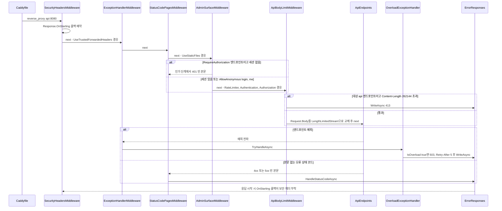
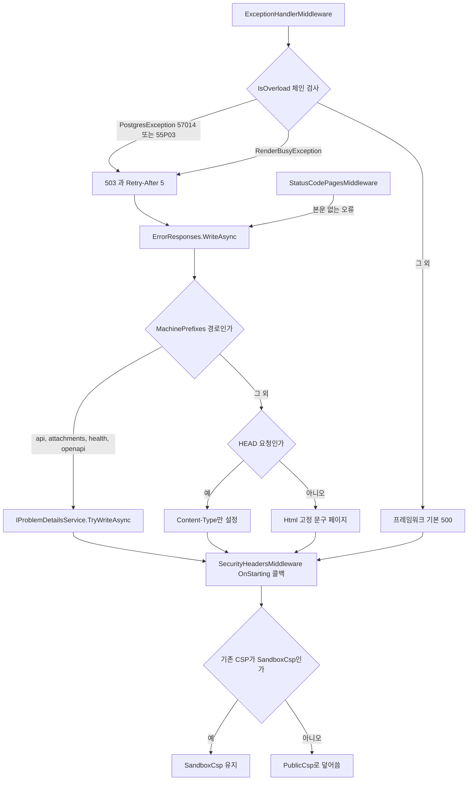
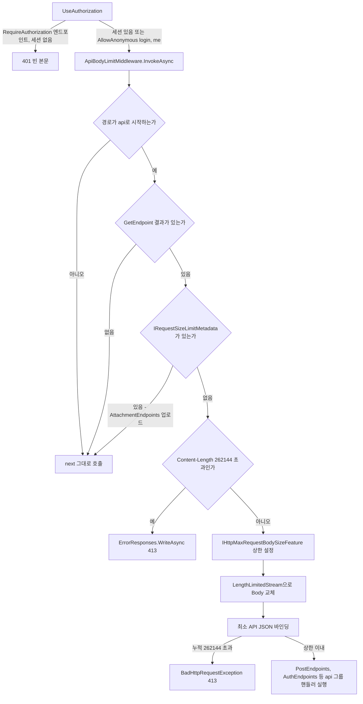

# F020 보안 헤더·오류 응답·과부하 처리·API 본문 제한

<!-- doc-harness:section id="summary" hash="6d1b1d9ed69024e29d20297243a4b252c56f42df812a27622079936e470bc24a" -->
## 한 줄 요약

결론: F020은 Program.cs 파이프라인에 걸린 방어 요소 네 개다. 이번 재검증에서도 현재 코드 동작은 이전 분석과 같았다. 이번에는 검증에서 지적된 과잉 일반화 두 건과 사실 오류 한 건을 고쳤다. (1) SecurityHeadersMiddleware는 앱 미들웨어 맨 앞(Program.cs 98)에 있다. Response.OnStarting 콜백으로 보안 헤더를 붙이므로, 예외 처리기가 헤더를 비운 500에도 헤더가 남는다. 기존 CSP가 SandboxCsp일 때만 그 값을 유지하고, 다른 값은 모두 PublicCsp로 덮어쓴다. (2) ErrorResponses.WriteAsync는 /api·/attachments·/health·/openapi 경로에 IProblemDetailsService로 ProblemDetails를 쓴다. 그 밖의 경로에는 요청 값을 반사하지 않는 고정 한국어 HTML을 쓰고, HEAD 요청이면 본문을 생략한다. 본문 없이 끝나는 429(RateLimiter OnRejected)·401·404 등도 UseStatusCodePages를 거쳐 여기서 본문을 받는다. (3) OverloadExceptionHandler.IsOverload는 InnerException 체인을 끝까지 훑어 PostgresException(57014·55P03)이나 RenderBusyException을 찾는다. 찾으면 503 + Retry-After: 5를 쓰고, 못 찾으면 false를 돌려줘 프레임워크 기본 500으로 넘긴다. (4) ApiBodyLimitMiddleware는 AdminSurfaceMiddleware(F018)·RateLimiter·Authentication·Authorization 뒤에 있다. 대상은 /api 경로이면서 매칭된 엔드포인트가 있고 IRequestSizeLimitMetadata가 없는 요청이다. 선언된 Content-Length가 262,144를 넘으면 곧바로 413을 쓴다. 넘지 않으면 Kestrel 상한을 설정하고 Request.Body를 LengthLimitedStream으로 감싸, 청크 본문도 읽는 도중에 413으로 끊는다. 세션 없는 요청이 413 검사 전에 401로 끝나는 것은 /api 그룹 기본값인 RequireAuthorization이 적용되는 엔드포인트뿐이다. AllowAnonymous인 /api/auth/login·/api/auth/me는 세션이 없어도 인가를 통과해 413 검사까지 간다(login은 POST라 큰 본문이면 413). 알려진 틈: HostFiltering 400과 Kestrel이 앱 도달 전에 거부한 응답에는 보안 헤더가 없다. 에지 Caddy의 접근 로그(log 지시어)는 {$DOMAIN}·{$ADMIN_DOMAIN}·:80·:443 블록에만 있고, 평문 리다이렉트 블록 http://{$DOMAIN}·http://{$ADMIN_DOMAIN}에는 없다. F020은 DB에 직접 접근하지 않는다. 다만 57014·55P03이 제대로 나오려면 다른 기능이 먼저 설정해 둔 값이 필요하다: PublicDbContext의 statement_timeout, AttachmentLock의 lock_timeout, StartupValidation의 Command Timeout 검사.

| 항목 | 값 |
|---|---|
| 중요도 | INFRA |
| 상태 | ACTIVE |
| 진입점 | `전역 미들웨어 SecurityHeadersMiddleware (Program.cs app.UseMiddleware, 앱 미들웨어 맨 앞)`, `UseExceptionHandler + OverloadExceptionHandler (AddExceptionHandler로 IExceptionHandler 등록)`, `UseStatusCodePages(ErrorResponses.HandleStatusCodeAsync)`, `ApiBodyLimitMiddleware (UseAuthorization 뒤)` |
| 의존 기능 | [F001](../09_FEATURES.md#f001), [F009](../09_FEATURES.md#f009), [F010](../09_FEATURES.md#f010), [F011](../09_FEATURES.md#f011), [F018](../09_FEATURES.md#f018), [F021](../09_FEATURES.md#f021) |

### 진입점 근거

| 내용 | 상태 | 근거 |
|---|---|---|
| SecurityHeadersMiddleware는 app.UseMiddleware로 앱 미들웨어 맨 앞에 등록된다. 이보다 바깥에서 도는 것은 프레임워크 HostFiltering 시작 필터뿐이다. | CONFIRMED | `PortfolioBlog.Api/Program.cs` (93-98) |
| OverloadExceptionHandler는 AddExceptionHandler로 DI에 등록된다. app.UseExceptionHandler()가 처리되지 않은 예외를 받으면 이 핸들러를 호출한다. | CONFIRMED | `PortfolioBlog.Api/Program.cs` (43), `PortfolioBlog.Api/Program.cs` (100) |
| ErrorResponses.HandleStatusCodeAsync는 UseStatusCodePages의 콜백이다. 상태 코드만 있고 본문이 없는 응답에 본문을 채운다. | CONFIRMED | `PortfolioBlog.Api/Program.cs` (101), `PortfolioBlog.Api/Infrastructure/Web/ErrorResponses.cs` ErrorResponses.HandleStatusCodeAsync (30-31) |
| ApiBodyLimitMiddleware는 UseAuthorization 바로 뒤, 엔드포인트 실행 직전에 등록된다. 그 앞에 AdminSurfaceMiddleware(F018)·UseRateLimiter(F019)·UseAuthentication이 차례로 있다. | CONFIRMED | `PortfolioBlog.Api/Program.cs` (104-108) |
| ErrorResponses.WriteAsync는 파이프라인 콜백 외에도 호출된다. OverloadExceptionHandler(503)와 ApiBodyLimitMiddleware(413)가 직접 부른다. | CONFIRMED | `PortfolioBlog.Api/Infrastructure/Web/OverloadExceptionHandler.cs` OverloadExceptionHandler.TryHandleAsync (40), `PortfolioBlog.Api/Infrastructure/Web/ApiBodyLimitMiddleware.cs` ApiBodyLimitMiddleware.InvokeAsync (47-51) |
<!-- /doc-harness:section -->

<!-- doc-harness:section id="flow" hash="b4e6f49841593b7c174247690136bfe58d5ac8a783ff0ce6eebbee10c9030e92" -->
## 처리 흐름

| 단계 | 컴포넌트 | 코드 | 설명 |
|---|---|---|---|
| 1 | Program | `PortfolioBlog.Api/Program.cs` (top-level) builder 구성 | 서비스 등록 단계에서 다음을 설정한다. Kestrel AddServerHeader=false. HostFilteringOptions.IncludeFailureMessage=false(헤더 없는 400에 본문도 없게 함). AddExceptionHandler<OverloadExceptionHandler>. AddProblemDetails. RouteHandlerOptions.ThrowOnBadRequest=false(바인딩 실패와 BadHttpRequestException을 예외 대신 상태 코드 응답으로 처리). |
| 2 | SecurityHeadersMiddleware | `PortfolioBlog.Api/Infrastructure/Web/SecurityHeadersMiddleware.cs` SecurityHeadersMiddleware.InvokeAsync | 요청마다 Response.OnStarting에 static 콜백을 예약하고(state=(Response.Headers, _hsts)) next(context)를 그대로 반환한다. 헤더는 이 시점이 아니라 응답 전송 직전에 쓴다. |
| 3 | Program | `PortfolioBlog.Api/Program.cs` UseTrustedForwardedHeaders | 프록시 헤더를 처리한다(F018 영역). 주석에 따르면 자체적으로 400을 내지 않는다. |
| 4 | ExceptionHandlerMiddleware | `PortfolioBlog.Api/Program.cs` app.UseExceptionHandler() | 하위 파이프라인 전체를 감싼다. 예외가 나면 등록된 IExceptionHandler(OverloadExceptionHandler)를 호출한다. |
| 5 | StatusCodePagesMiddleware | `PortfolioBlog.Api/Program.cs` app.UseStatusCodePages(ErrorResponses.HandleStatusCodeAsync) | 하위 파이프라인이 본문 없는 오류 상태 코드로 끝나면 ErrorResponses.HandleStatusCodeAsync를 호출한다. |
| 6 | AdminSurfaceMiddleware | `PortfolioBlog.Api/Infrastructure/Access/AdminSurfaceMiddleware.cs` AdminSurfaceMiddleware (Reject) | UseStaticFiles 다음 단계다. F018 관문에서 호스트·IP·CSRF 헤더·Origin을 검사하고, 통과하지 못하면 Reject로 404/403을 직접 쓴다. 이어서 UseRateLimiter(F019)를 지난다. 한도를 넘으면 OnRejected가 Retry-After만 붙인 본문 없는 429를 낸다. 그다음 UseAuthentication·UseAuthorization(F001)을 지난다. /api 그룹은 RequireHost(adminHost)와 RequireAuthorization을 기본으로 요구한다. 그래서 RequireAuthorization이 적용되는 /api 엔드포인트는 세션이 없으면 여기서 401로 끝나고 본문 크기 검사까지 가지 않는다. 반대로 AuthEndpoints가 AllowAnonymous()로 선언한 /api/auth/login(POST)·/api/auth/me(GET)는 세션이 없어도 인가를 통과해 다음 단계 ApiBodyLimitMiddleware(413 검사)까지 간다. |
| 7 | ApiBodyLimitMiddleware | `PortfolioBlog.Api/Infrastructure/Web/ApiBodyLimitMiddleware.cs` ApiBodyLimitMiddleware.InvokeAsync | 다음 경우에는 그대로 통과시킨다: /api 경로가 아니거나, 매칭된 엔드포인트가 없거나(GetEndpoint()==null), IRequestSizeLimitMetadata가 있을 때(업로드). Content-Length가 262,144를 넘으면 StatusCode=413으로 두고 ErrorResponses.WriteAsync(413)를 쓴다. 나머지 경우에는 쓰기 가능한 IHttpMaxRequestBodySizeFeature가 있으면 MaxRequestBodySize를 설정한다. 그다음 Request.Body를 LengthLimitedStream으로 바꾸고 next를 호출한다. 인증 여부는 보지 않으므로 익명 login 요청에도 같은 판정이 적용된다. |
| 8 | LengthLimitedStream | `PortfolioBlog.Api/Infrastructure/Web/ApiBodyLimitMiddleware.cs` LengthLimitedStream.Count | PostEndpoints 등 /api 핸들러의 JSON 바인딩이 본문을 읽을 때마다 누적 바이트를 더한다. 누적이 262,144를 넘는 순간 BadHttpRequestException(413)을 던진다. 최소 API가 이 예외의 상태 코드를 그대로 응답으로 쓴다는 근거는 주석의 실측 기록과 테스트 UndeclaredLength_OverLimit_Is413이다. |
| 9 | OverloadExceptionHandler | `PortfolioBlog.Api/Infrastructure/Web/OverloadExceptionHandler.cs` OverloadExceptionHandler.TryHandleAsync / IsOverload | 예외가 전파되면 IsOverload로 InnerException 체인을 검사한다. PostgresException{SqlState 57014\|55P03}이나 RenderBusyException을 찾으면 StatusCode=503, Retry-After="5"로 두고 ErrorResponses.WriteAsync(503)를 쓴 뒤 true를 반환한다. 찾지 못하면 false를 반환해 프레임워크 기본 500 처리로 넘긴다. |
| 10 | ErrorResponses | `PortfolioBlog.Api/Infrastructure/Web/ErrorResponses.cs` ErrorResponses.WriteAsync | 경로가 MachinePrefixes(/api, /attachments, /health, /openapi)로 시작하면 IProblemDetailsService.TryWriteAsync로 Status만 담은 ProblemDetails를 쓴다. 그 밖의 경로는 Content-Type을 text/html로 설정하고, HEAD 요청이면 거기서 끝낸다. 아니면 Html(status)의 고정 문구 페이지를 쓴다(400·404·405·429·503 전용 문구, 그 밖에는 공통 문구). |
| 11 | SecurityHeadersMiddleware | `PortfolioBlog.Api/Infrastructure/Web/SecurityHeadersMiddleware.cs` OnStarting 콜백 | 응답 헤더를 보내기 직전에 실행된다. X-Content-Type-Options=nosniff를 쓴다. CSP가 SandboxCsp가 아니면 PublicCsp로 덮어쓴다. Referrer-Policy, Permissions-Policy, X-Frame-Options=DENY를 쓰고, Development가 아니면 HSTS(max-age=31536000; includeSubDomains)도 쓴다. |
<!-- /doc-harness:section -->

<!-- doc-harness:section id="F020_SEQUENCE" hash="834b15acc78712a78328f3b5f1e014c01b9d2470a992512ac24f9dd83d536025" -->
## F020 요청 파이프라인과 오류·과부하·본문 제한 호출 순서 (Sequence Diagram)

요청은 SecurityHeadersMiddleware → ExceptionHandlerMiddleware → StatusCodePagesMiddleware → AdminSurfaceMiddleware(이후 RateLimiter·인증·인가) → ApiBodyLimitMiddleware → 엔드포인트 순으로 흐른다. 오류 본문은 모두 ErrorResponses가 쓰고, 보안 헤더는 응답 시작 시 OnStarting 콜백이 붙인다.

Program.cs 98-108의 등록 순서를 그대로 옮겼다. AdminSurfaceMiddleware 뒤의 UseRateLimiter·UseAuthentication·UseAuthorization은 참여자 수를 줄이려고 한 화살표로 묶었다. 첫 번째 alt는 이번 재검증에서 고친 부분이다. /api 그룹 기본값인 RequireAuthorization이 걸린 엔드포인트만 세션이 없을 때 인가 단계에서 401로 끝난다. AuthEndpoints의 AllowAnonymous 엔드포인트(/api/auth/login·/api/auth/me)는 세션 없이도 ApiBodyLimitMiddleware까지 간다. 401 빈 본문은 StatusCodePagesMiddleware를 거쳐 ErrorResponses가 ProblemDetails로 채운다. 예외 경로에서 IsOverload가 false이면 OverloadExceptionHandler는 false를 반환하고 프레임워크 기본 500이 나간다(다이어그램에서는 생략). 어느 경로든 보안 헤더는 SecurityHeadersMiddleware가 예약한 OnStarting 콜백이 붙인다.

### 코드 근거

| 구성 요소 | 코드 |
|---|---|
| Caddyfile | `deploy/Caddyfile` |
| SecurityHeadersMiddleware | `PortfolioBlog.Api/Infrastructure/Web/SecurityHeadersMiddleware.cs` (SecurityHeadersMiddleware.InvokeAsync) |
| ExceptionHandlerMiddleware | `PortfolioBlog.Api/Program.cs` (app.UseExceptionHandler()) |
| StatusCodePagesMiddleware | `PortfolioBlog.Api/Program.cs` (app.UseStatusCodePages) |
| AdminSurfaceMiddleware | `PortfolioBlog.Api/Infrastructure/Access/AdminSurfaceMiddleware.cs` |
| ApiBodyLimitMiddleware | `PortfolioBlog.Api/Infrastructure/Web/ApiBodyLimitMiddleware.cs` (ApiBodyLimitMiddleware.InvokeAsync) |
| ApiEndpoints | `PortfolioBlog.Api/Features/ApiEndpoints.cs` (ApiEndpoints.MapApiEndpoints) |
| OverloadExceptionHandler | `PortfolioBlog.Api/Infrastructure/Web/OverloadExceptionHandler.cs` (OverloadExceptionHandler.TryHandleAsync) |
| ErrorResponses | `PortfolioBlog.Api/Infrastructure/Web/ErrorResponses.cs` (ErrorResponses.WriteAsync) |
<!-- /doc-harness:section -->

<!-- doc-harness:section id="F020_FLOW" hash="f6263cefc92d4118442505732e66b4bbd7f1b6617a949ed1204067a6eb5d9917" -->
## F020 예외·오류 본문·보안 헤더 분기 (Flowchart)

예외는 IsOverload 판정으로 503 또는 기본 500으로 갈리고, 본문 없는 오류는 ErrorResponses가 경로에 따라 ProblemDetails나 고정 HTML로 채운다. 마지막으로 OnStarting 콜백이 CSP를 SandboxCsp 유지 또는 PublicCsp로 정한다.

OverloadExceptionHandler.IsOverload(63-70행)는 InnerException 체인을 따라가며 PostgresException{SqlState 57014|55P03}이나 RenderBusyException을 찾는다. 찾으면 TryHandleAsync(35-42행)가 503과 Retry-After 5를 쓰고 ErrorResponses.WriteAsync를 부른다. ErrorResponses.WriteAsync(45-56행)는 MachinePrefixes(17행)로 경로를 나눈다. 기계용 경로에는 ProblemDetails를 쓰되 TryWriteAsync 반환값은 확인하지 않는다. 사람용 경로에는 HEAD면 헤더만, 그 밖에는 Html(status)을 쓴다. SecurityHeadersMiddleware의 OnStarting 콜백(42-54행)은 모든 분기 끝에서 실행되고, 기존 CSP가 SandboxCsp일 때만 유지한다.

### 코드 근거

| 구성 요소 | 코드 |
|---|---|
| ExceptionHandlerMiddleware | `PortfolioBlog.Api/Program.cs` (app.UseExceptionHandler()) |
| IsOverload | `PortfolioBlog.Api/Infrastructure/Web/OverloadExceptionHandler.cs` (OverloadExceptionHandler.IsOverload) |
| Overload503 | `PortfolioBlog.Api/Infrastructure/Web/OverloadExceptionHandler.cs` (OverloadExceptionHandler.TryHandleAsync) |
| StatusCodePagesMiddleware | `PortfolioBlog.Api/Program.cs` (app.UseStatusCodePages) |
| ErrorResponses | `PortfolioBlog.Api/Infrastructure/Web/ErrorResponses.cs` (ErrorResponses.WriteAsync) |
| MachinePrefixes | `PortfolioBlog.Api/Infrastructure/Web/ErrorResponses.cs` (ErrorResponses.MachinePrefixes) |
| HtmlBody | `PortfolioBlog.Api/Infrastructure/Web/ErrorResponses.cs` (ErrorResponses.Html) |
| OnStarting | `PortfolioBlog.Api/Infrastructure/Web/SecurityHeadersMiddleware.cs` (SecurityHeadersMiddleware.InvokeAsync) |
| CspCheck | `PortfolioBlog.Api/Infrastructure/Web/SecurityHeadersMiddleware.cs` (SecurityHeadersMiddleware.SandboxCsp) |
<!-- /doc-harness:section -->

<!-- doc-harness:section id="F020_FLOW_BODYLIMIT" hash="98c9315af772a0c4ffc20e29ece4151552761b673e5e0b09ddbc20b148dc8bcc" -->
## F020 ApiBodyLimitMiddleware 판정 흐름 (Flowchart)

인가를 통과한 /api 요청 중 매칭된 엔드포인트가 있고 자체 크기 상한이 없는 것만 256KB 제한을 받는다. 선언 길이는 즉시 413, 미선언 길이는 읽는 도중 BadHttpRequestException(413)으로 끊는다.

Program.cs 107-108에서 ApiBodyLimitMiddleware는 UseAuthorization 바로 뒤에 있다. /api 그룹은 ApiEndpoints.cs 39행에서 RequireAuthorization을 기본으로 걸지만, AuthEndpoints.cs 46·48행의 /me·/login은 AllowAnonymous()로 이를 풀어 세션 없이도 이 판정에 들어온다. InvokeAsync(36-57행)는 경로·엔드포인트·IRequestSizeLimitMetadata를 차례로 보고, Content-Length가 JsonLimitBytes(262,144)를 넘으면 본문을 읽기 전에 413을 쓴다. 통과하면 쓰기 가능한 IHttpMaxRequestBodySizeFeature에 상한을 설정하고(TestServer에서는 null이라 건너뜀) Request.Body를 LengthLimitedStream으로 감싼다. LengthLimitedStream.Count(80-86행)는 누적이 상한을 넘으면 BadHttpRequestException(413)을 던지고, ThrowOnBadRequest=false(Program.cs 49) 아래에서 최소 API 바인딩이 이를 413 응답으로 바꾼다.

### 코드 근거

| 구성 요소 | 코드 |
|---|---|
| UseAuthorization | `PortfolioBlog.Api/Program.cs` (app.UseAuthorization()) |
| ApiBodyLimitMiddleware | `PortfolioBlog.Api/Infrastructure/Web/ApiBodyLimitMiddleware.cs` (ApiBodyLimitMiddleware.InvokeAsync) |
| SizeMetaCheck | `PortfolioBlog.Api/Features/Attachments/AttachmentEndpoints.cs` (RequestSizeLimitAttribute) |
| Reject413 | `PortfolioBlog.Api/Infrastructure/Web/ErrorResponses.cs` (ErrorResponses.WriteAsync) |
| LengthLimitedStream | `PortfolioBlog.Api/Infrastructure/Web/ApiBodyLimitMiddleware.cs` (ApiBodyLimitMiddleware.LengthLimitedStream) |
| BadHttpRequestException | `PortfolioBlog.Api/Infrastructure/Web/ApiBodyLimitMiddleware.cs` (LengthLimitedStream.Count) |
| PostEndpoints | `PortfolioBlog.Api/Features/Posts/PostEndpoints.cs` |
<!-- /doc-harness:section -->

<!-- doc-harness:section id="data" hash="c06cbb1a24310c4ca2d759449b58975d4ec329536f17828f48660cc5aa063206" -->
## 데이터

### 데이터 흐름

| 내용 | 상태 | 근거 |
|---|---|---|
| 입력은 HttpContext와 파이프라인에서 전파된 Exception이다. HttpContext에서는 요청 경로, 메서드, Content-Length, 본문 스트림, 매칭된 Endpoint 메타데이터를 쓴다. 출력은 응답 상태 코드, 보안 헤더, Retry-After, 그리고 ProblemDetails(JSON)나 고정 HTML 본문이다. | CONFIRMED | `PortfolioBlog.Api/Infrastructure/Web/ErrorResponses.cs` ErrorResponses.WriteAsync (45-56), `PortfolioBlog.Api/Infrastructure/Web/OverloadExceptionHandler.cs` OverloadExceptionHandler.TryHandleAsync (35-42) |
| 오류 본문에는 요청 값이 들어가지 않는다. ProblemDetails에는 Status만 넣고, HTML에는 정수 status와 switch의 상수 문구만 쓴다(HtmlEncode로 이중 방어). 테스트는 두 가지를 확인한다: 스크립트 경로를 넣어도 본문에 반사되지 않고, 500 본문에 예외 메시지가 없다. | CONFIRMED | `PortfolioBlog.Api/Infrastructure/Web/ErrorResponses.cs` ErrorResponses.Html (50, 59-77), `PortfolioBlog.Api.Tests/Features/ErrorPipelineTests.cs` EmptyStatus_GetsBodyByPath_WithoutReflectingInput, `PortfolioBlog.Api.Tests/Features/ErrorPipelineTests.cs` UnhandledException_500_StillCarriesSecurityHeaders |
| 요청 본문 흐름: LengthLimitedStream이 원본 Request.Body를 복사 없이 감싸 누적 바이트만 센다. 본문은 그대로 최소 API JSON 바인딩(PostEndpoints, AuthEndpoints.LoginAsync 등)에 전달된다. | CONFIRMED | `PortfolioBlog.Api/Infrastructure/Web/ApiBodyLimitMiddleware.cs` LengthLimitedStream (55, 62-87) |
| CSP 값의 흐름: PublicAttachmentEndpoints.GetAsync가 먼저 SecurityHeadersMiddleware.SandboxCsp를 넣으면 OnStarting 콜백이 그 값을 유지한다. 그 밖의 값이나 빈 값은 PublicCsp로 바뀐다. | CONFIRMED | `PortfolioBlog.Api/Features/Attachments/PublicAttachmentEndpoints.cs` PublicAttachmentEndpoints.GetAsync (86), `PortfolioBlog.Api/Infrastructure/Web/SecurityHeadersMiddleware.cs` (46-48), `PortfolioBlog.Api.Tests/Features/ErrorPipelineTests.cs` ExistingCsp_OnlySandboxCspSurvives_OthersAreOverwritten |
| 과부하 신호는 다른 기능에서 온다. 57014는 PublicDbContext 연결 시작 옵션의 statement_timeout(기본 PublicOptions.StatementTimeoutMs=3000)에서 나온다. 55P03은 AttachmentLock의 lock_timeout='10s'에서 나온다. RenderBusyException은 RenderGate.RenderAsync의 슬롯 대기 초과(기본 QueueTimeoutMs=5000)에서 나온다. | CONFIRMED | `PortfolioBlog.Api/Infrastructure/Data/PublicDbContext.cs` PublicDbContext.BuildConnectionString (59), `PortfolioBlog.Api/Infrastructure/Web/PublicOptions.cs` (30), `PortfolioBlog.Api/Infrastructure/Storage/AttachmentLock.cs` (55), `PortfolioBlog.Api/Infrastructure/Markdown/RenderGate.cs` RenderGate.RenderAsync (14, 88), `PortfolioBlog.Api/Infrastructure/Markdown/RenderingOptions.cs` (21) |
| 속도 제한 거부 응답도 이 경로를 탄다. RateLimiter OnRejected는 Retry-After 헤더만 붙이고 본문은 쓰지 않는다. 그래서 429 본문은 UseStatusCodePages → ErrorResponses가 채운다(HTML이면 429 전용 문구). | CONFIRMED | `PortfolioBlog.Api/Infrastructure/Web/RateLimitingExtensions.cs` AddAppRateLimiting (47-52), `PortfolioBlog.Api/Infrastructure/Web/ErrorResponses.cs` ErrorResponses.Html (66) |

### DB 접근

_(없음)_

### 상태 전이

| 이전 | 다음 | 트리거 | 근거 |
|---|---|---|---|
| 처리되지 않은 예외(체인에 57014/55P03/RenderBusyException 있음) | 503 + Retry-After: 5 + 경로별 오류 본문 | OverloadExceptionHandler.TryHandleAsync에서 IsOverload가 true | `PortfolioBlog.Api/Infrastructure/Web/OverloadExceptionHandler.cs` (35-42, 63-70) |
| 처리되지 않은 예외(그 밖의 예외) | 500 (프레임워크 기본 처리) | IsOverload가 false라 TryHandleAsync가 false 반환 | `PortfolioBlog.Api/Infrastructure/Web/OverloadExceptionHandler.cs` (37), `PortfolioBlog.Api.Tests/Features/ErrorPipelineTests.cs` PostgresOverload_MapsTo503 |
| 상태 코드만 설정된 빈 오류 응답 | ProblemDetails 또는 고정 HTML 본문이 있는 응답 | StatusCodePagesMiddleware가 ErrorResponses.HandleStatusCodeAsync 호출 | `PortfolioBlog.Api/Program.cs` (101), `PortfolioBlog.Api/Infrastructure/Web/ErrorResponses.cs` (30-56) |
| /api 요청 수신(F018 관문·인가 통과. 익명 허용 login·me는 세션 없이도 통과) | 413 Payload Too Large | Content-Length가 262,144를 넘거나, 읽는 도중 누적 바이트가 262,144를 넘음 | `PortfolioBlog.Api/Infrastructure/Web/ApiBodyLimitMiddleware.cs` (47-51, 80-86), `PortfolioBlog.Api/Features/Auth/AuthEndpoints.cs` (46, 48) |
| Request.Body(원본 스트림) | Request.Body(LengthLimitedStream 래퍼) | ApiBodyLimitMiddleware의 통과 경로(대상 /api 엔드포인트) | `PortfolioBlog.Api/Infrastructure/Web/ApiBodyLimitMiddleware.cs` (55) |
| 응답 헤더 미전송 | 보안 헤더가 붙은 응답 전송 시작 | Response.OnStarting 콜백 실행 | `PortfolioBlog.Api/Infrastructure/Web/SecurityHeadersMiddleware.cs` (42-54) |

### 외부 의존

| 내용 | 상태 | 근거 |
|---|---|---|
| ASP.NET Core의 다음 구성에 의존한다: IExceptionHandler·UseExceptionHandler, UseStatusCodePages(StatusCodeContext), IProblemDetailsService(AddProblemDetails). | CONFIRMED | `PortfolioBlog.Api/Program.cs` (43, 47, 100-101), `PortfolioBlog.Api/Infrastructure/Web/ErrorResponses.cs` (49-50) |
| Npgsql PostgresException의 SqlState(57014, 55P03)에 의존한다. EF Core가 공급자 예외를 DbUpdateException으로 감싸는 구조에도 의존한다. | CONFIRMED | `PortfolioBlog.Api/Infrastructure/Web/OverloadExceptionHandler.cs` (56-58, 63-70), `PortfolioBlog.Api.Tests/Features/ErrorPipelineTests.cs` WrappedPostgresOverload_MapsTo503_ButNotOverWidened |
| Kestrel의 IHttpMaxRequestBodySizeFeature를 쓴다. TestServer에는 이 기능이 없어(null) 앱 쪽 LengthLimitedStream만으로 제한한다. | CONFIRMED | `PortfolioBlog.Api/Infrastructure/Web/ApiBodyLimitMiddleware.cs` (52-53) |
| 에지 Caddy(deploy/Caddyfile)가 앞단 방어를 겹쳐 둔다. 공개 사이트는 /api를 404로, GET/HEAD 외 메서드를 405로 막고 request_body를 64KB로 제한한다. header 블록과 handle_errors로 HSTS·nosniff·XFO·Referrer-Policy를 붙인다. 관리 사이트의 /api/*·/attachments/*는 보안 헤더를 백엔드에 맡기고(첨부 sandbox CSP 보존) request_body를 11MiB로 제한한다. | CONFIRMED | `deploy/Caddyfile` (20-61), `deploy/Caddyfile` (90-99) |
<!-- /doc-harness:section -->

<!-- doc-harness:section id="failures" hash="0cde1ca9544c8235bc2a778264383bf9a6d24572f75299cde3ac9e9ba7db1354" -->
## 실패 지점

| 위치 | 조건 | 처리 | 상태 | 근거 |
|---|---|---|---|---|
| Program.cs HostFiltering (앱 미들웨어 바깥) | 허용되지 않은 Host 헤더 | 프레임워크가 400을 낸다. SecurityHeadersMiddleware보다 바깥이라 보안 헤더가 붙지 않는다. 대신 IncludeFailureMessage=false로 본문을 없애 '헤더 없는 응답에는 본문도 없음'을 지킨다(테스트 HostFilteringTests.RejectedHost_400_HasNoBody_AndNoSecurityHeaders). | CONFIRMED | `PortfolioBlog.Api/Program.cs` (34-42, 93-97), `PortfolioBlog.Api.Tests/Features/HostFilteringTests.cs` RejectedHost_400_HasNoBody_AndNoSecurityHeaders |
| Kestrel (앱 도달 전) | 요청 줄 길이 초과 등 서버가 직접 거부하는 요청 | 보안 헤더가 붙지 않는다. 주석에 '이 저장소에서 측정하지는 않았다'고 적혀 있다. | POTENTIAL_ISSUE | `PortfolioBlog.Api/Program.cs` (95-96) |
| OverloadExceptionHandler.TryHandleAsync | 예외 체인에 PostgresException 57014/55P03이나 RenderBusyException이 있음 | 503 + Retry-After: 5를 설정하고 ErrorResponses.WriteAsync(503)로 본문을 쓴다. | CONFIRMED | `PortfolioBlog.Api/Infrastructure/Web/OverloadExceptionHandler.cs` (35-42), `PortfolioBlog.Api.Tests/Features/ErrorPipelineTests.cs` RenderBusy_MapsTo503 |
| OverloadExceptionHandler.TryHandleAsync | 과부하가 아닌 예외(예: 23505, InvalidOperationException) | false를 반환해 프레임워크 기본 500 처리에 맡긴다. 보안 헤더는 OnStarting 덕분에 남고, 본문에 예외 메시지는 없다(테스트). | CONFIRMED | `PortfolioBlog.Api/Infrastructure/Web/OverloadExceptionHandler.cs` (37), `PortfolioBlog.Api.Tests/Features/ErrorPipelineTests.cs` UnhandledException_500_StillCarriesSecurityHeaders |
| OverloadExceptionHandler.IsOverload | AggregateException이 내부 예외를 여러 개 가짐 | InnerException 체인만 훑으므로 InnerExceptions의 첫 요소만 본다. 주석은 AggregateException을 만드는 코드 경로가 현재 없다고 판단하지만, 실측하지는 않았다고 적는다. | POTENTIAL_ISSUE | `PortfolioBlog.Api/Infrastructure/Web/OverloadExceptionHandler.cs` (59-61) |
| OverloadExceptionHandler.IsOverload | 클라이언트 취소와 겹친 경합에서 57014가 statement_timeout 이외 원인으로 발생 | 과부하로 분류해 503을 낸다. 주석은 이 경우를 미검증으로 표시하고 '500보다 안전한 쪽의 오답'이라고 설명한다. | INFERRED | `PortfolioBlog.Api/Infrastructure/Web/OverloadExceptionHandler.cs` (44-45) |
| StartupValidation.CheckConnectionString (F021) | 연결 문자열의 Command Timeout(초)×1000이 Public:StatementTimeoutMs 이하(0=무한은 제외) | 기동 시 InvalidOperationException을 던진다. 클라이언트 취소가 57014보다 먼저 나서 503 매핑이 깨지는 구성을 미리 막는다. Default와 Public 연결 문자열 모두 검사한다. | CONFIRMED | `PortfolioBlog.Api/Infrastructure/Access/StartupValidation.cs` StartupValidation.CheckConnectionString (90, 94, 161-168) |
| ApiBodyLimitMiddleware.InvokeAsync | 대상 /api 엔드포인트에서 Content-Length > 262,144 | 본문을 읽지 않고 StatusCode=413을 설정한 뒤 ErrorResponses.WriteAsync(413)로 ProblemDetails를 쓴다(테스트 DeclaredLength_OverLimit_Is413). 대상에는 익명 허용 엔드포인트(POST /api/auth/login)도 포함된다. | CONFIRMED | `PortfolioBlog.Api/Infrastructure/Web/ApiBodyLimitMiddleware.cs` (40-51), `PortfolioBlog.Api.Tests/Features/ApiBodyLimitTests.cs` DeclaredLength_OverLimit_Is413 (24) |
| ApiBodyLimitMiddleware.LengthLimitedStream.Count | 길이를 선언하지 않은(chunked) 본문의 누적 바이트가 262,144 초과 | BadHttpRequestException(413)을 던진다. ThrowOnBadRequest=false 설정 아래에서 최소 API 바인딩이 413으로 응답한다(주석 실측, 테스트 UndeclaredLength_OverLimit_Is413). | CONFIRMED | `PortfolioBlog.Api/Infrastructure/Web/ApiBodyLimitMiddleware.cs` (54-55, 80-86), `PortfolioBlog.Api/Program.cs` (49), `PortfolioBlog.Api.Tests/Features/ApiBodyLimitTests.cs` UndeclaredLength_OverLimit_Is413 (34) |
| ApiBodyLimitMiddleware.LengthLimitedStream | 최소 API 바인딩 밖에서 본문을 직접 읽는 /api 핸들러가 상한을 넘음 | 처리 없음(예외 전파). BadHttpRequestException이 UseExceptionHandler까지 올라갔을 때 413이 되는지 500이 되는지 코드로 확인하지 못했다. | POTENTIAL_ISSUE | `PortfolioBlog.Api/Infrastructure/Web/ApiBodyLimitMiddleware.cs` (83-85) |
| ApiBodyLimitMiddleware.InvokeAsync | IHttpMaxRequestBodySizeFeature가 없거나 IsReadOnly임(이미 본문 읽기가 시작됨) | Kestrel 상한 설정을 건너뛰고 LengthLimitedStream 계수에만 의존한다. | CONFIRMED | `PortfolioBlog.Api/Infrastructure/Web/ApiBodyLimitMiddleware.cs` (53) |
| ErrorResponses.WriteAsync | IProblemDetailsService.TryWriteAsync가 false를 반환함(예: 요청 Accept가 JSON을 허용하지 않아 기록기가 쓰지 못함) | 반환값을 확인하지 않아 오류 응답 본문이 빈 채로 나간다. 기록기를 고르는 조건은 프레임워크 동작이라 코드로 확인하지 못했다. | POTENTIAL_ISSUE | `PortfolioBlog.Api/Infrastructure/Web/ErrorResponses.cs` (49-51) |

### 엣지 케이스

| 내용 | 상태 | 근거 |
|---|---|---|
| 첨부 GET 핸들러가 넣은 SandboxCsp만 유지된다. 다른 코드가 느슨한 CSP를 먼저 넣어도 PublicCsp로 덮어쓴다. TryAdd를 쓰지 않아 fail-open을 막는다. | CONFIRMED | `PortfolioBlog.Api/Infrastructure/Web/SecurityHeadersMiddleware.cs` (46-48), `PortfolioBlog.Api.Tests/Features/SecurityHeadersTests.cs` AttachmentResponses_KeepTheirOwnSandboxCsp |
| HSTS는 Development가 아닐 때만 붙는다(_hsts = !IsDevelopment()). | CONFIRMED | `PortfolioBlog.Api/Infrastructure/Web/SecurityHeadersMiddleware.cs` (25-26, 52), `PortfolioBlog.Api.Tests/Features/SecurityHeadersTests.cs` Hsts_OnlyOutsideDevelopment |
| HTML 오류 경로에서 HEAD 요청이면 Content-Type만 설정하고 본문을 쓰지 않는다. ProblemDetails 경로(MachinePrefixes)에는 HEAD 분기가 없다. | CONFIRMED | `PortfolioBlog.Api/Infrastructure/Web/ErrorResponses.cs` (47-55) |
| /feed.xml·/sitemap.xml 같은 비 HTML 공개 경로도 MachinePrefixes에 없다. 그래서 본문 없는 오류가 나면 HTML 오류 페이지를 받는다. | CONFIRMED | `PortfolioBlog.Api/Infrastructure/Web/ErrorResponses.cs` (17, 53-55) |
| Search 페이지의 400처럼 이미 본문을 쓴 오류 응답은 StatusCodePages가 덮어쓰지 않는다. | CONFIRMED | `PortfolioBlog.Api/Pages/Search.cshtml.cs` SearchModel.Invalid |
| RateLimiter가 거부한 429는 본문 없이 Retry-After만 가진다. 그래서 StatusCodePages가 경로별 본문을 채운다. 이 429는 OverloadExceptionHandler의 고정 5초가 아니라 RateLimitingExtensions.RetryAfterSeconds가 계산한 값(고정 창은 1~60초, 동시 실행 제한은 5초)을 쓴다. | CONFIRMED | `PortfolioBlog.Api/Infrastructure/Web/RateLimitingExtensions.cs` (47-52, 69-72), `PortfolioBlog.Api/Infrastructure/Web/ErrorResponses.cs` (66) |
| AdminSurfaceMiddleware(F018)가 거부한 404/403은 자체 Reject로 본문을 쓴다. 이 거부는 ApiBodyLimitMiddleware보다 앞에서 일어나므로, 관리 표면 밖의 요청은 본문이 커도 413이 아니라 F018의 응답을 받는다. | CONFIRMED | `PortfolioBlog.Api/Infrastructure/Access/AdminSurfaceMiddleware.cs` AdminSurfaceMiddleware.Reject (79-93, 112), `PortfolioBlog.Api/Program.cs` (104-108) |
| 매칭되는 엔드포인트가 없는 /api 경로는 본문이 커도 413이 아니라 404다. | CONFIRMED | `PortfolioBlog.Api/Infrastructure/Web/ApiBodyLimitMiddleware.cs` (38-46), `PortfolioBlog.Api.Tests/Features/ApiBodyLimitTests.cs` NoMatchingEndpoint_Gets404_NotA413 (66) |
| 세션이 없으면 본문 크기와 무관하게 401이 먼저 나는 것은 RequireAuthorization이 적용되는 /api 엔드포인트(글·시리즈·태그·첨부·미리보기·logout 등 /api 그룹 기본값)에 한정된다. ApiBodyLimitMiddleware가 UseAuthorization 뒤에 있기 때문이다. | CONFIRMED | `PortfolioBlog.Api/Program.cs` (108), `PortfolioBlog.Api/Features/ApiEndpoints.cs` ApiEndpoints.MapApiEndpoints (37-39), `PortfolioBlog.Api.Tests/Features/ApiBodyLimitTests.cs` NoSession_Gets401_NotA413 (57) |
| 익명 허용 엔드포인트(/api/auth/login POST, /api/auth/me GET)는 AllowAnonymous()라 세션이 없어도 401이 나지 않고 ApiBodyLimitMiddleware 검사까지 간다. 그래서 세션 없는 POST /api/auth/login이라도 F018 관문(CSRF 헤더·Origin)과 로그인 속도 제한을 통과한 뒤 Content-Length가 262,144를 넘으면 413을 받는다. 코드 순서로 확인했으며, 이 경우를 직접 검사하는 테스트는 ApiBodyLimitTests에 없다. | CONFIRMED | `PortfolioBlog.Api/Features/Auth/AuthEndpoints.cs` AuthEndpoints.MapAuthEndpoints (40-48), `PortfolioBlog.Api/Features/ApiEndpoints.cs` (38), `PortfolioBlog.Api/Infrastructure/Web/ApiBodyLimitMiddleware.cs` (40-51), `PortfolioBlog.Api/Program.cs` (104-108) |
| 정확히 262,144바이트인 본문은 통과한다(> 비교). 테스트에서는 그 뒤 200KB 마크다운 검증에 걸려 400이 된다. | CONFIRMED | `PortfolioBlog.Api/Infrastructure/Web/ApiBodyLimitMiddleware.cs` (47, 83), `PortfolioBlog.Api.Tests/Features/ApiBodyLimitTests.cs` ExactlyAtLimit_IsNot413 (75) |
| 업로드처럼 RequestSizeLimitAttribute(IRequestSizeLimitMetadata)를 선언한 엔드포인트는 256KB 제한에서 빠진다. | CONFIRMED | `PortfolioBlog.Api/Infrastructure/Web/ApiBodyLimitMiddleware.cs` (43), `PortfolioBlog.Api/Features/Attachments/AttachmentEndpoints.cs` (47) |
| 비 ASCII를 \uXXXX로 이스케이프하는 클라이언트(.NET 기본 인코더)는 같은 내용이라도 본문이 최대 6배 커져 413을 받을 수 있다. 주석에 따르면 브라우저의 JSON.stringify는 해당하지 않는다. | CONFIRMED | `PortfolioBlog.Api/Infrastructure/Web/ApiBodyLimitMiddleware.cs` (14-16) |
| 관리 풀(AppDbContext)에는 statement_timeout이 없다. 그래서 관리 경로의 잠금 대기는 57014가 되지 않는다. 관리 쪽에서 55P03으로 503에 매핑되는 경로는 lock_timeout을 거는 AttachmentLock뿐이다. | CONFIRMED | `PortfolioBlog.Api/Features/Attachments/PublicAttachmentEndpoints.cs` (71-75), `PortfolioBlog.Api/Infrastructure/Storage/AttachmentLock.cs` (13-14, 55) |
| AttachmentJanitor는 백그라운드 경로라 OverloadExceptionHandler.IsOverload를 재사용하지 않는다. 55P03만 좁게 판정하는 자체 헬퍼를 쓴다. | CONFIRMED | `PortfolioBlog.Api/Infrastructure/Storage/AttachmentJanitor.cs` (126-134) |
| 응답이 이미 시작된 뒤(예: 첨부 스트리밍 중) 예외가 나면 ExceptionHandlerMiddleware가 상태 코드를 바꿀 수 없다. 이 경우 503 매핑이 적용되지 않을 것으로 보인다(프레임워크 동작이라 코드로 직접 확인하지 않음). | INFERRED | `PortfolioBlog.Api/Program.cs` (100) |

### 로깅

| 내용 | 상태 | 근거 |
|---|---|---|
| F020의 네 파일(SecurityHeadersMiddleware, ErrorResponses, OverloadExceptionHandler, ApiBodyLimitMiddleware)에는 ILogger 주입도 로그 호출도 없다. 503 매핑과 413 거부는 앱 로그를 남기지 않는다. | CONFIRMED | `PortfolioBlog.Api/Infrastructure/Web/OverloadExceptionHandler.cs` (17-71), `PortfolioBlog.Api/Infrastructure/Web/ApiBodyLimitMiddleware.cs` (18-88), `PortfolioBlog.Api/Infrastructure/Web/SecurityHeadersMiddleware.cs` (12-57), `PortfolioBlog.Api/Infrastructure/Web/ErrorResponses.cs` (15-78) |
| 처리되지 않은 예외는 프레임워크 ExceptionHandlerMiddleware가 기록할 것으로 보인다. IExceptionHandler가 처리한 경우(503)에도 기록되는지는 프레임워크 기본값에 달려 있어 확인하지 못했다. | UNKNOWN | `PortfolioBlog.Api/Program.cs` (100) |
| 에지 Caddy의 접근 로그(log 지시어)는 {$DOMAIN}(21행)·{$ADMIN_DOMAIN}(80행)·:80(182행)·:443(190행) 블록에만 있다. 평문 리다이렉트 블록 http://{$DOMAIN}(68-76행)과 http://{$ADMIN_DOMAIN}(163-173행)에는 log 지시어가 없어서, 이 두 블록이 처리한 308 리다이렉트와 평문 관리 요청의 IP 거부 404는 Caddy 접근 로그에 남지 않는다. | CONFIRMED | `deploy/Caddyfile` (20-21), `deploy/Caddyfile` (68-76), `deploy/Caddyfile` (79-80), `deploy/Caddyfile` (163-173), `deploy/Caddyfile` (181-195) |
<!-- /doc-harness:section -->

<!-- doc-harness:section id="code" hash="0c154c4bc83697e852107e4f247f97d0a8d64d138809aa7c546d501b1017b7e3" -->
## 관련 코드

| 파일 | 심볼 | 역할 |
|---|---|---|
| `PortfolioBlog.Api/Program.cs` | (top-level) 미들웨어 파이프라인 | config |
| `PortfolioBlog.Api/Infrastructure/Web/SecurityHeadersMiddleware.cs` | SecurityHeadersMiddleware.InvokeAsync | entry |
| `PortfolioBlog.Api/Infrastructure/Web/SecurityHeadersMiddleware.cs` | SecurityHeadersMiddleware.PublicCsp / SandboxCsp / PermissionsPolicy | config |
| `PortfolioBlog.Api/Infrastructure/Web/ErrorResponses.cs` | ErrorResponses.WriteAsync / Html | render |
| `PortfolioBlog.Api/Infrastructure/Web/OverloadExceptionHandler.cs` | OverloadExceptionHandler.TryHandleAsync / IsOverload | service |
| `PortfolioBlog.Api/Infrastructure/Web/ApiBodyLimitMiddleware.cs` | ApiBodyLimitMiddleware.InvokeAsync | validation |
| `PortfolioBlog.Api/Infrastructure/Web/ApiBodyLimitMiddleware.cs` | ApiBodyLimitMiddleware.LengthLimitedStream | validation |
| `PortfolioBlog.Api/Features/ApiEndpoints.cs` | ApiEndpoints.MapApiEndpoints (MapGroup("/api").RequireHost.RequireAuthorization) | entry |
| `PortfolioBlog.Api/Features/Auth/AuthEndpoints.cs` | AuthEndpoints.MapAuthEndpoints (/me·/login AllowAnonymous) | entry |
| `PortfolioBlog.Api/Features/Posts/PostEndpoints.cs` | PostEndpoints (JSON 본문 바인딩, RenderBusyException 전파) | entry |
| `PortfolioBlog.Api/Infrastructure/Access/AdminSurfaceMiddleware.cs` | AdminSurfaceMiddleware.Reject | validation |
| `PortfolioBlog.Api/Infrastructure/Web/RateLimitingExtensions.cs` | AddAppRateLimiting (OnRejected: 본문 없는 429 + Retry-After) | config |
| `PortfolioBlog.Api/Infrastructure/Markdown/RenderGate.cs` | RenderBusyException / RenderGate.RenderAsync | service |
| `PortfolioBlog.Api/Infrastructure/Markdown/RenderingOptions.cs` | RenderingOptions.QueueTimeoutMs | config |
| `PortfolioBlog.Api/Features/Attachments/PublicAttachmentEndpoints.cs` | PublicAttachmentEndpoints.GetAsync (SandboxCsp 설정) | entry |
| `PortfolioBlog.Api/Features/Attachments/AttachmentEndpoints.cs` | RequestSizeLimitAttribute 메타데이터(업로드) | config |
| `PortfolioBlog.Api/Infrastructure/Access/StartupValidation.cs` | StartupValidation.CheckConnectionString | validation |
| `PortfolioBlog.Api/Infrastructure/Web/PublicOptions.cs` | PublicOptions.StatementTimeoutMs | config |
| `PortfolioBlog.Api/Infrastructure/Data/PublicDbContext.cs` | PublicDbContext.BuildConnectionString | config |
| `PortfolioBlog.Api/Infrastructure/Storage/AttachmentLock.cs` | AttachmentLock (SET lock_timeout = '10s') | data |
| `PortfolioBlog.Api/Infrastructure/Storage/AttachmentJanitor.cs` | AttachmentJanitor (55P03 전용 판정 헬퍼) | service |
| `PortfolioBlog.Api/Pages/Search.cshtml.cs` | SearchModel.Invalid | render |
| `PortfolioBlog.Api.Tests/Features/ErrorPipelineTests.cs` | ErrorPipelineTests | test |
| `PortfolioBlog.Api.Tests/Features/SecurityHeadersTests.cs` | SecurityHeadersTests | test |
| `PortfolioBlog.Api.Tests/Features/ApiBodyLimitTests.cs` | ApiBodyLimitTests | test |
| `PortfolioBlog.Api.Tests/Features/HostFilteringTests.cs` | HostFilteringTests | test |
| `deploy/Caddyfile` | 공개/관리 사이트 header·request_body·handle_errors·log 블록 | config |

근거: `PortfolioBlog.Api/Infrastructure/Web/SecurityHeadersMiddleware.cs` SecurityHeadersMiddleware.InvokeAsync (39-56), `PortfolioBlog.Api/Infrastructure/Web/ErrorResponses.cs` ErrorResponses.WriteAsync (45-77), `PortfolioBlog.Api/Infrastructure/Web/OverloadExceptionHandler.cs` OverloadExceptionHandler.TryHandleAsync / IsOverload (35-70), `PortfolioBlog.Api/Infrastructure/Web/ApiBodyLimitMiddleware.cs` ApiBodyLimitMiddleware.InvokeAsync / LengthLimitedStream (36-87), `PortfolioBlog.Api/Program.cs` (31-49, 93-108), `PortfolioBlog.Api/Features/ApiEndpoints.cs` ApiEndpoints.MapApiEndpoints (37-39), `PortfolioBlog.Api/Features/Auth/AuthEndpoints.cs` AuthEndpoints.MapAuthEndpoints (37-50), `PortfolioBlog.Api/Infrastructure/Access/AdminSurfaceMiddleware.cs` (79-93), `PortfolioBlog.Api/Infrastructure/Web/RateLimitingExtensions.cs` AddAppRateLimiting (47-52), `PortfolioBlog.Api/Infrastructure/Markdown/RenderGate.cs` RenderBusyException (14, 88), `PortfolioBlog.Api/Features/Attachments/PublicAttachmentEndpoints.cs` PublicAttachmentEndpoints.GetAsync (86), `PortfolioBlog.Api/Infrastructure/Access/StartupValidation.cs` StartupValidation.CheckConnectionString (161-168), `PortfolioBlog.Api.Tests/Features/ErrorPipelineTests.cs`, `PortfolioBlog.Api.Tests/Features/SecurityHeadersTests.cs`, `PortfolioBlog.Api.Tests/Features/ApiBodyLimitTests.cs`, `PortfolioBlog.Api.Tests/Features/HostFilteringTests.cs`, `deploy/Caddyfile` (20-61, 68-99, 163-195)
<!-- /doc-harness:section -->

<!-- doc-harness:section id="unknowns" hash="9ea959d6bdc169d3af0e954b2c51900ce10e9e88757b55dec36cf476636b0e93" -->
## 확인하지 못한 것

- 과부하가 아닌 예외로 생긴 500의 본문 형식을 확인하지 못했다. 공개 HTML 경로에서도 ProblemDetails가 되는지는 UseExceptionHandler()와 AddProblemDetails 조합의 프레임워크 기본 동작에 달려 있다. 테스트는 /api/x 경로만 본다.
- ExceptionHandlerMiddleware가 IExceptionHandler가 처리한 예외(503)도 로그로 남기는지 확인하지 못했다.
- IProblemDetailsService.TryWriteAsync가 false를 반환하는 조건(Accept 헤더 협상)에서 오류 응답 본문이 비는지 실측 근거가 없다.
- Kestrel이 앱 도달 전에 거부한 응답에서 보안 헤더가 빠지는 범위는 코드 주석상 측정하지 않았다.
- 최소 API 바인딩 밖에서 LengthLimitedStream의 BadHttpRequestException이 전파될 때 최종 상태 코드가 413인지 500인지 확인하지 못했다.
- 57014가 statement_timeout 이외 원인(클라이언트 취소 경합)으로 나올 수 있는지는 주석에 '미검증'으로 남아 있다.
- MachinePrefixes 경로의 HEAD 요청에서 ProblemDetails 본문이 어떻게 처리되는지는 프레임워크에 맡겨져 있어 확인하지 못했다.
- 익명 POST /api/auth/login의 256KB 초과 본문이 413을 받는다는 점은 코드 순서(AuthEndpoints.cs 48행 AllowAnonymous, Program.cs 104-108, ApiBodyLimitMiddleware.cs 40-51)로 확인했다. 다만 이 경우를 직접 검사하는 테스트는 ApiBodyLimitTests에 없다.
- 검증 지적(기능 간 의존 표에서 F001에 F020·F021, F002에 F018·F020, F003에 F007·F008·F018·F020이 빠졌다는 불일치)은 색인 문서와 F001·F002·F003 문서의 문제라, 이 세션(F020) 출력으로는 고칠 수 없다. 코드로 보면 지적 내용은 맞다. Program.cs 104-108에서 모든 /api 요청이 AdminSurfaceMiddleware(F018)를 먼저 지나고, 처리되지 않은 예외는 Program.cs 100의 UseExceptionHandler와 OverloadExceptionHandler(F020)가 받는다. F020의 의존 목록에는 코드로 다시 확인한 관계만 둔다: F001(인가 뒤 순서, /api RequireAuthorization·AllowAnonymous), F009(업로드 RequestSizeLimit 예외, AttachmentLock 55P03), F010(SandboxCsp 유지), F011(RenderBusyException), F018(파이프라인 선행 관문), F021(Command Timeout 검사). F019(RateLimiter)는 F020 쪽에서 보면 본문 없는 429를 ErrorResponses에 맡기는 사용 관계(F019→F020)여서 F020의 의존에 넣지 않았다.
<!-- /doc-harness:section -->

<!-- doc-harness:section id="related" hash="e6b04ee08cc1bd1a2625cbb81ca24992b9da0467258ba6539a8ab5b4aeff04d8" -->
## 관련 문서

- [../09_FEATURES](../09_FEATURES.md)
- [../08_API](../08_API.md)
- [../07_DATA_MODEL](../07_DATA_MODEL.md)
- [../11_FAILURE_HISTORY](../11_FAILURE_HISTORY.md)
<!-- /doc-harness:section -->
