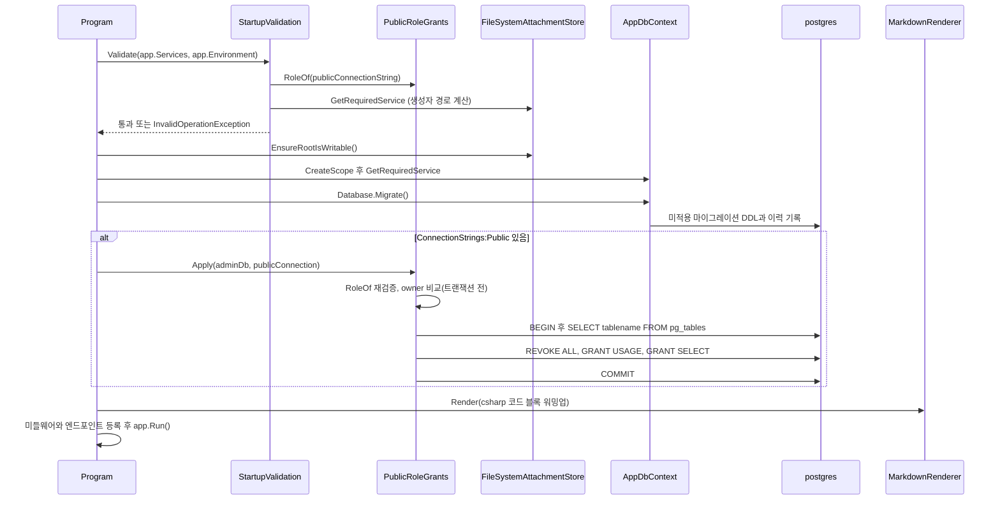
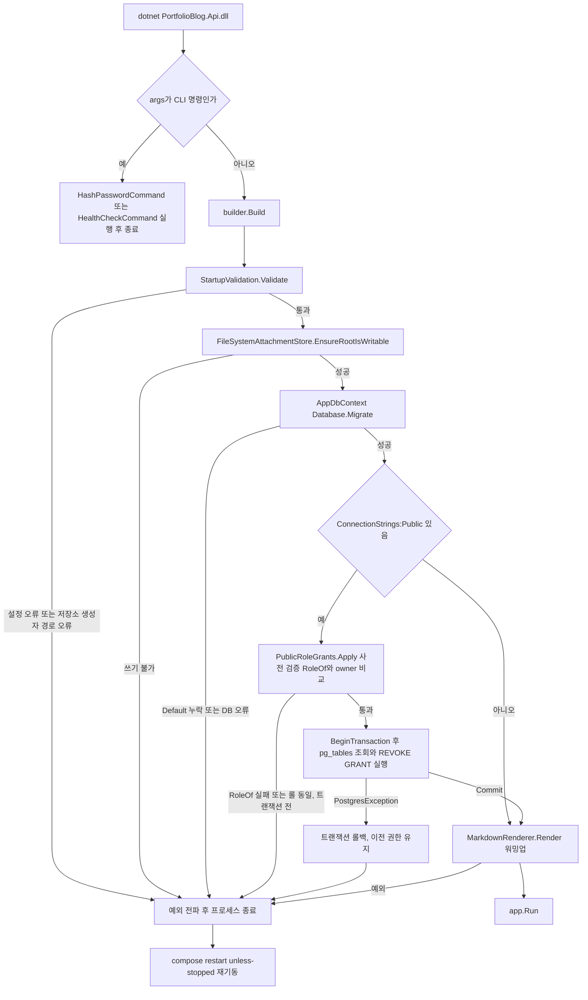
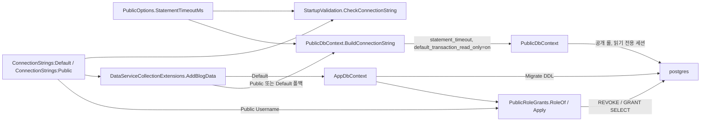

# F021 앱 기동 부트스트랩(설정 검증·마이그레이션·공개 DB 롤 권한)

<!-- doc-harness:section id="summary" hash="a44df715914dd8d7d3ad7f7342715b83cd5ffef666e1af3b9630cfad7f831d17" -->
## 한 줄 요약

결론: 기동 부트스트랩은 fail-fast로 설계됐다. Program.cs는 builder.Build()(73행) 뒤, app.Run()(126행) 전에 다섯 단계를 동기로 실행한다.
① StartupValidation.Validate(76행)가 설정을 I/O 없이 검증한다. 순서는 Site·Admin·Proxy 형식 → Admin·Public 한도 → StatementTimeoutMs → 연결 문자열(Default·Public, RoleOf, 동일 사용자 금지) → Rendering → Attachments:RootPath 공백 여부·FileSystemAttachmentStore 해석 → 비 Development 필수값이다.
② FileSystemAttachmentStore.EnsureRootIsWritable(79행)이 probe 파일을 써서 쓰기 가능 여부를 확인한다.
③ AppDbContext.Database.Migrate()(85행)가 마이그레이션 2개(InitialCreate, AddAttachments)를 적용한다.
④ ConnectionStrings:Public이 있을 때만 PublicRoleGrants.Apply(87행)를 실행한다. 트랜잭션 밖에서 RoleOf를 재검증하고 두 롤이 같은지 비교한다. 그다음 한 트랜잭션 안에서 관리 롤(current_user)이 소유한 public 테이블마다 PUBLIC과 공개 롤의 권한을 회수한다. 이어 스키마 USAGE를 주고 Posts·Series·Tags·PostTags·Attachments에만 SELECT를 준다.
⑤ MarkdownRenderer.Render(91행)로 코드 강조 초기화를 미리 치른다(워밍업).
어느 단계에서 예외가 나도 잡지 않으므로 프로세스가 종료된다. 운영에서는 compose의 restart: unless-stopped가 컨테이너를 다시 띄우는 것으로 보인다(INFERRED).
실패 처리 세부:
- 롤 검증 실패와 롤 동일은 BeginTransaction 전에 던져지므로 롤백할 것이 없다. 트랜잭션 롤백은 문장 실행 중 PostgresException이 날 때만 일어난다.
- FileSystemAttachmentStore 생성자의 실패는 두 갈래다. RootPath가 공백이면 InnerException 없이 바로 던진다. Path.GetFullPath가 실패하면 InnerException을 남긴 채 감싸서 던진다. 공백 경로는 StartupValidation 109행이 먼저 거른다.
공개 조회 전용 PublicDbContext는 기동 중에 만들어지지 않는다. 처음 해석될 때 연결 문자열이 조립된다(statement_timeout, default_transaction_read_only=on, ApplicationName).
관찰된 한계:
- 마이그레이션과 권한 적용은 트랜잭션이 따로라서 부분 적용 상태가 남을 수 있다.
- 관리 롤이 소유하지 않은 테이블은 권한 회수에서 빠진다(fail-open).
- pg_tables만 조회하므로 뷰·시퀀스·함수는 대상이 아니다.
- 부트스트랩 코드가 직접 남기는 로그는 probe 정리 실패 경고 1건뿐이다.
재검증 결과: 이전 분석의 코드 근거(줄 범위·심볼·테스트 이름)는 현재 코드와 일치한다. 동작 변경은 없다. 검증에서 지적된 의존 표 불일치(F001·F002·F003 행)는 다른 기능 쪽 문제라서 F021의 dependencies는 바꾸지 않았다.

| 항목 | 값 |
|---|---|
| 중요도 | INFRA |
| 상태 | ACTIVE |
| 진입점 | `CLI dotnet PortfolioBlog.Api.dll (인자 없음, 또는 hash-password/healthcheck 단일 인자가 아닌 경우)` |
| 의존 기능 | [F009](../09_FEATURES.md#f009), [F011](../09_FEATURES.md#f011), [F018](../09_FEATURES.md#f018), [F026](../09_FEATURES.md#f026) |

### 진입점 근거

| 내용 | 상태 | 근거 |
|---|---|---|
| 프로세스 진입점은 Program.cs 최상위 문장이다. args가 정확히 [HashPasswordCommand.Name]이나 [HealthCheckCommand.Name]이면 웹 호스트를 만들지 않고 해당 CLI를 실행한 뒤 종료하므로 부트스트랩을 거치지 않는다. 그 밖의 경우에는 WebApplication.CreateBuilder → builder.Build()를 거쳐 부트스트랩 시퀀스(75-91행)를 실행한다. | CONFIRMED | `PortfolioBlog.Api/Program.cs` (15-28), `PortfolioBlog.Api/Program.cs` (73-91) |
| 운영 컨테이너는 ENTRYPOINT ["dotnet", "PortfolioBlog.Api.dll"]로 기동한다. Dockerfile의 ENV가 ASPNETCORE_ENVIRONMENT=Production, Attachments__RootPath=/data/attachments, DataProtection__KeysPath=/data/dpkeys를 지정한다. compose의 api 서비스는 postgres가 service_healthy 상태가 된 뒤에 기동한다. | CONFIRMED | `PortfolioBlog.Api/Dockerfile` (27-33), `deploy/docker-compose.yml` (84-86) |
| 통합 테스트는 WebApplicationFactory<Program>으로 같은 시작 시퀀스를 실행하는 것으로 보인다. 이를 위해 public partial class Program을 공개해 두었다. | INFERRED | `PortfolioBlog.Api/Program.cs` (143-144) |
<!-- /doc-harness:section -->

<!-- doc-harness:section id="flow" hash="ad4f24b8115dec7bcf7d7f4b9802a247107a597099cd3a3a647df5620db0ec63" -->
## 처리 흐름

| 단계 | 컴포넌트 | 코드 | 설명 |
|---|---|---|---|
| 1 | Program | `PortfolioBlog.Api/Program.cs` top-level statements | CLI 인자를 분기한다. hash-password 또는 healthcheck 단일 인자이면 웹 호스트 없이 실행하고 종료 코드를 반환한다(부트스트랩 생략). |
| 2 | Program | `PortfolioBlog.Api/Program.cs` builder.Services.* | 서비스를 등록한다. HostFilteringOptions와 RazorPagesOptions는 IOptions<SiteOptions>로 지연 구성한다. PublicOptions·RenderingOptions·AttachmentOptions를 바인딩한다. AddBlogData가 두 DbContext를 지연 람다로 등록한다. FileSystemAttachmentStore·MarkdownRenderer 싱글턴과 AttachmentJanitor(hosted service)도 등록한다. |
| 3 | DataServiceCollectionExtensions | `PortfolioBlog.Api/Infrastructure/Data/DataServiceCollectionExtensions.cs` AddBlogData | AppDbContext는 UseNpgsql(RequireConnectionString)로 등록한다. PublicDbContext는 UseNpgsql(PublicDbContext.BuildConnectionString(PublicOrDefaultConnectionString, StatementTimeoutMs))에 NoTracking을 붙여 등록한다. 두 람다는 각 컨텍스트가 처음 해석될 때 실행된다. |
| 4 | Program | `PortfolioBlog.Api/Program.cs` builder.Build | WebApplication을 만든다. 이 시점에는 아직 DB에 연결하지 않는다. |
| 5 | StartupValidation | `PortfolioBlog.Api/Infrastructure/Access/StartupValidation.cs` StartupValidation.Validate | 모든 환경에서 형식을 검증한다. 대상은 두 origin(SiteOptions.HostOf), Site:Title 공백 여부, Admin:AllowedCidrs(CidrList.Parse), Proxy:TrustedIp(단일 IP), Admin:PasswordHash(Base64)다. |
| 6 | StartupValidation | `PortfolioBlog.Api/Infrastructure/Access/StartupValidation.cs` StartupValidation.Validate | 모든 환경에서 한도를 검증한다. Admin의 Login/Session/Preview/Upload 값과 Public의 Page/Asset/Search 한도는 1 이상이어야 한다. Public:StatementTimeoutMs는 100~60000이어야 한다. |
| 7 | StartupValidation | `PortfolioBlog.Api/Infrastructure/Access/StartupValidation.cs` StartupValidation.CheckConnectionString | Default와 Public 연결 문자열 가운데 값이 있는 것마다 NpgsqlConnectionStringBuilder로 파싱한다. Options가 있으면 거부한다. Command Timeout(초)×1000이 StatementTimeoutMs 이하여도 거부한다(0은 무제한이라 통과). |
| 8 | PublicRoleGrants | `PortfolioBlog.Api/Infrastructure/Data/PublicRoleGrants.cs` PublicRoleGrants.RoleOf | StartupValidation이 호출한다. Public 연결의 Username이 ^[a-z_][a-z0-9_]{0,62}\z에 맞는지 검증한다. 이어서 StartupValidation이 이 값을 Default의 Username과 비교하고, 같으면 거부한다. |
| 9 | StartupValidation | `PortfolioBlog.Api/Infrastructure/Access/StartupValidation.cs` StartupValidation.Validate | Rendering 범위를 검증한다. Concurrency는 1~64, QueueTimeoutMs는 1~60000, CacheMegabytes는 1~1024여야 한다. |
| 10 | StartupValidation | `PortfolioBlog.Api/Infrastructure/Access/StartupValidation.cs` StartupValidation.Validate | Attachments:RootPath가 비어 있지 않은지 확인한다(109-112행). 이어서 FileSystemAttachmentStore 싱글턴을 해석해, 생성자가 경로를 계산할 때 나는 오류(GetFullPath 실패)를 이 시점에 드러낸다(114행). |
| 11 | StartupValidation | `PortfolioBlog.Api/Infrastructure/Access/StartupValidation.cs` StartupValidation.Require | Development가 아닌 환경에서만 검사한다. Proxy:TrustedIp·Admin:AllowedCidrs·Admin:PasswordHash가 있어야 한다. 두 origin이 서로 달라야 하고 둘 다 https여야 한다. Attachments:RootPath는 절대 경로여야 한다. ConnectionStrings:Public이 있어야 한다. DataProtection:KeysPath는 절대 경로여야 한다. |
| 12 | FileSystemAttachmentStore | `PortfolioBlog.Api/Infrastructure/Storage/FileSystemAttachmentStore.cs` FileSystemAttachmentStore.EnsureRootIsWritable | Directory.CreateDirectory(_root)로 디렉터리를 만들고 .startup-probe-{guid} 0바이트 파일을 쓴다. 이어 PhysicalPath("00/startup-probe")로 경로 계산이 되는지 확인한다. finally에서 probe를 삭제하며, 삭제에 실패하면 경고 로그만 남긴다. |
| 13 | AppDbContext | `PortfolioBlog.Api/Program.cs` adminDb.Database.Migrate | 새 스코프에서 AppDbContext를 해석한다. 이때 RequireConnectionString이 실행된다. 이어 동기 Migrate()로 아직 적용되지 않은 마이그레이션(InitialCreate, AddAttachments)을 적용한다. |
| 14 | PublicRoleGrants | `PortfolioBlog.Api/Infrastructure/Data/PublicRoleGrants.cs` PublicRoleGrants.Apply | ConnectionStrings:Public이 비어 있지 않을 때만 실행한다. 트랜잭션을 열기 전(119-124행)에 RoleOf로 롤 이름을 다시 검증하고, 관리 연결의 Username(owner)과 같으면 InvalidOperationException을 던진다. 그다음 BeginTransaction → pg_tables에서 소유 테이블 조회 → BuildStatements가 만든 REVOKE/GRANT를 ExecuteSqlRaw로 순서대로 실행 → Commit한다. |
| 15 | PublicRoleGrants | `PortfolioBlog.Api/Infrastructure/Data/PublicRoleGrants.cs` PublicRoleGrants.BuildStatements | 소유 테이블마다 REVOKE ALL ... FROM PUBLIC과 REVOKE ALL ... FROM {role}을 만들고, GRANT USAGE ON SCHEMA public을 추가한다. ReadableTables 가운데 소유 목록에 있는 테이블에만 GRANT SELECT를 만든다. |
| 16 | MarkdownRenderer | `PortfolioBlog.Api/Program.cs` MarkdownRenderer.Render | csharp 코드 블록 하나를 렌더해, ColorCode 등의 정적 초기화 비용을 첫 방문자 대신 시작 시점에 치른다. RenderGate와 RenderedPostCache를 거치지 않고 직접 호출한다. |
| 17 | Program | `PortfolioBlog.Api/Program.cs` app.Run | 미들웨어 파이프라인과 엔드포인트를 등록한 뒤 app.Run()을 호출한다. 이때 호스트가 시작되고, hosted service(AttachmentJanitor)도 함께 시작되는 것으로 보인다(프레임워크 동작, INFERRED). |
<!-- /doc-harness:section -->

<!-- doc-harness:section id="F021_SEQUENCE" hash="71cf2f996270e4957c3380c6572a9234c57b22f91cd6d2b2c5ec494c08bace0f" -->
## 기동 부트스트랩 호출 순서 (Sequence Diagram)

Program이 StartupValidation → FileSystemAttachmentStore → AppDbContext.Migrate → (조건부) PublicRoleGrants.Apply → MarkdownRenderer 워밍업 순으로 동기 호출한 뒤 app.Run()을 부른다.

Program.cs 73-126행의 실제 호출 순서다. StartupValidation은 I/O 없이 옵션과 연결 문자열을 검사한다. 그 과정에서 PublicRoleGrants.RoleOf와 FileSystemAttachmentStore 생성자(DI 해석)를 호출한다. EnsureRootIsWritable은 파일 시스템 I/O를 하는 별도 단계다. 마이그레이션과 권한 적용은 같은 스코프의 AppDbContext(관리 연결)를 쓴다. 권한 적용은 ConnectionStrings:Public이 비어 있지 않을 때만 실행되며, 사전 검증(RoleOf, owner 비교)은 트랜잭션 밖에서 한다. 워밍업은 RenderGate·RenderedPostCache를 거치지 않고 MarkdownRenderer.Render를 직접 호출한다.

### 코드 근거

| 구성 요소 | 코드 |
|---|---|
| Program | `PortfolioBlog.Api/Program.cs` (top-level statements) |
| StartupValidation | `PortfolioBlog.Api/Infrastructure/Access/StartupValidation.cs` (StartupValidation.Validate) |
| PublicRoleGrants | `PortfolioBlog.Api/Infrastructure/Data/PublicRoleGrants.cs` (PublicRoleGrants.RoleOf / Apply) |
| FileSystemAttachmentStore | `PortfolioBlog.Api/Infrastructure/Storage/FileSystemAttachmentStore.cs` (EnsureRootIsWritable) |
| AppDbContext | `PortfolioBlog.Api/Infrastructure/Data/AppDbContext.cs` (AppDbContext) |
| postgres | `deploy/docker-compose.yml` (services.postgres) |
| MarkdownRenderer | `PortfolioBlog.Api/Infrastructure/Markdown/MarkdownRenderer.cs` (MarkdownRenderer.Render) |
<!-- /doc-harness:section -->

<!-- doc-harness:section id="F021_FLOW" hash="ce21099acfcd847c842ea54aafb4e22d7f0aadf9b1191ea43e3678980f05e6b9" -->
## 기동 분기와 실패 경로 (Flowchart)

모든 부트스트랩 단계의 실패는 예외 전파로 프로세스를 끝낸다. 롤백은 PublicRoleGrants 트랜잭션 안에서 난 오류에만 적용된다.

CLI 인자 분기 → 검증 → 첨부 루트 확인 → 마이그레이션 → 조건부 권한 적용 → 워밍업 → app.Run 순서다. 어느 단계에도 try/catch·재시도·폴백이 없다. Apply의 사전 검증 실패는 트랜잭션 전에 일어나므로 DB 상태를 건드리지 않는다. 트랜잭션 안의 PostgresException은 Commit 없이 Dispose되어 롤백된다. 이미 커밋된 마이그레이션은 되돌리지 않는다. 재기동은 코드가 아니라 compose의 restart: unless-stopped(INFERRED)에 맡겨져 있다.

### 코드 근거

| 구성 요소 | 코드 |
|---|---|
| CliCheck | `PortfolioBlog.Api/Program.cs` (args is [HashPasswordCommand.Name] / [HealthCheckCommand.Name]) |
| StartupValidation | `PortfolioBlog.Api/Infrastructure/Access/StartupValidation.cs` (StartupValidation.Validate) |
| EnsureRootIsWritable | `PortfolioBlog.Api/Infrastructure/Storage/FileSystemAttachmentStore.cs` (EnsureRootIsWritable) |
| Migrate | `PortfolioBlog.Api/Program.cs` (adminDb.Database.Migrate) |
| ApplyPrecheck | `PortfolioBlog.Api/Infrastructure/Data/PublicRoleGrants.cs` (PublicRoleGrants.Apply) |
| ApplyTransaction | `PortfolioBlog.Api/Infrastructure/Data/PublicRoleGrants.cs` (PublicRoleGrants.Apply / BuildStatements) |
| Warmup | `PortfolioBlog.Api/Program.cs` (MarkdownRenderer.Render) |
| Restart | `deploy/docker-compose.yml` (x-hardening restart) |
<!-- /doc-harness:section -->

<!-- doc-harness:section id="F021_DATAFLOW" hash="7a86f3929037f185b41e9413de6bdc834909234ee8e7d60fb5bacc4780467dcc" -->
## 연결 문자열과 공개 롤 권한의 흐름 (Data Flow Diagram)

Default 연결은 AppDbContext(마이그레이션·권한 적용)로 흐르고, Public 연결(없으면 Default)은 BuildConnectionString이 읽기 전용·시간 제한 옵션을 붙여 PublicDbContext로 흐른다.

같은 설정 값을 StartupValidation이 먼저 검사하고(Options 금지, Command Timeout 규칙, 롤 이름·동일 사용자), DataServiceCollectionExtensions가 DI 해석 시점에 실제로 조립한다. Public 연결의 Username은 PublicRoleGrants가 REVOKE/GRANT 문장의 식별자로 쓴다. 권한 변경 자체는 관리 연결(AppDbContext)로 postgres에 적용된다.

### 코드 근거

| 구성 요소 | 코드 |
|---|---|
| StartupValidation | `PortfolioBlog.Api/Infrastructure/Access/StartupValidation.cs` (CheckConnectionString) |
| PublicOptions | `PortfolioBlog.Api/Infrastructure/Web/PublicOptions.cs` (StatementTimeoutMs) |
| DataServiceCollectionExtensions | `PortfolioBlog.Api/Infrastructure/Data/DataServiceCollectionExtensions.cs` (AddBlogData) |
| AppDbContext | `PortfolioBlog.Api/Infrastructure/Data/AppDbContext.cs` (AppDbContext) |
| BuildConnectionString | `PortfolioBlog.Api/Infrastructure/Data/PublicDbContext.cs` (PublicDbContext.BuildConnectionString) |
| PublicDbContext | `PortfolioBlog.Api/Infrastructure/Data/PublicDbContext.cs` (PublicDbContext) |
| PublicRoleGrants | `PortfolioBlog.Api/Infrastructure/Data/PublicRoleGrants.cs` (RoleOf / Apply) |
| postgres | `deploy/docker-compose.yml` (services.postgres) |
<!-- /doc-harness:section -->

<!-- doc-harness:section id="data" hash="ace3f7973995d210d2ec84956ff52fde8f05fc20cef9df013fd6605219dea93c" -->
## 데이터

### 데이터 흐름

| 내용 | 상태 | 근거 |
|---|---|---|
| 설정은 IOptions와 IConfiguration으로 들어온다. 원천은 appsettings.json, appsettings.{Environment}.json, 환경 변수다. 환경 변수로는 ConnectionStrings__Default, ConnectionStrings__Public, Site__*, Admin__*, Proxy__TrustedIp, Attachments__RootPath, DataProtection__KeysPath가 쓰인다. 이 값들은 IOptions<SiteOptions/AdminOptions/ProxyOptions/AttachmentOptions/PublicOptions/RenderingOptions>와 IConfiguration에 바인딩된다. StartupValidation은 이 값을 읽기만 하고 바꾸지 않는다. | CONFIRMED | `PortfolioBlog.Api/Infrastructure/Access/StartupValidation.cs` (43-47), `PortfolioBlog.Api/Infrastructure/Access/StartupValidation.cs` (85-87), `deploy/docker-compose.yml` (60-70), `PortfolioBlog.Api/Dockerfile` (27-30) |
| 공개 연결은 이렇게 조립된다. PublicOrDefaultConnectionString이 ConnectionStrings:Public을 고르고, 없으면 Default로 폴백한다. PublicDbContext.BuildConnectionString은 기반 문자열에 Options가 이미 있으면 거부한다. 없으면 Options="-c statement_timeout={StatementTimeoutMs} -c default_transaction_read_only=on"과 ApplicationName="PortfolioBlog.Public"을 붙여 새 연결 문자열을 만든다. 연결 문자열이 다르므로 Npgsql 풀도 따로 생긴다. | CONFIRMED | `PortfolioBlog.Api/Infrastructure/Data/DataServiceCollectionExtensions.cs` (33-36), `PortfolioBlog.Api/Infrastructure/Data/DataServiceCollectionExtensions.cs` (45-49), `PortfolioBlog.Api/Infrastructure/Data/PublicDbContext.cs` (46-62) |
| 공개 롤 이름은 이렇게 흐른다. RoleOf가 ConnectionStrings:Public의 Username을 정규식으로 검증한다. 롤 이름은 SQL 매개변수로 넘길 수 없으므로 BuildStatements가 REVOKE/GRANT 문장에 식별자로 직접 넣는다. BuildStatements는 정규식을 한 번 더 검사하며, 테이블 이름은 QuoteIdentifier로 큰따옴표 인용한다. | CONFIRMED | `PortfolioBlog.Api/Infrastructure/Data/PublicRoleGrants.cs` (23-25), `PortfolioBlog.Api/Infrastructure/Data/PublicRoleGrants.cs` (39-54), `PortfolioBlog.Api/Infrastructure/Data/PublicRoleGrants.cs` (76-101) |
| DB 권한 적용: pg_tables(schemaname='public', tableowner=current_user)에서 소유 테이블 목록을 읽어 SQL 문장 목록으로 바꾸고, 같은 트랜잭션에서 실행한다. 허용 목록 ReadableTables는 코드 상수 [Posts, Series, Tags, PostTags, Attachments]다. AdminState와 __EFMigrationsHistory는 회수 대상에는 들어가지만 GRANT 대상에는 없다. | CONFIRMED | `PortfolioBlog.Api/Infrastructure/Data/PublicRoleGrants.cs` (21), `PortfolioBlog.Api/Infrastructure/Data/PublicRoleGrants.cs` (125-137) |
| 마이그레이션이 만드는 것: InitialCreate는 AdminState·Series·Tags·Posts·PostTags 테이블과 CHECK 제약·인덱스를 만들고, AdminState(Id=1, SessionEpoch=1)를 시드한다. AddAttachments는 Attachments 테이블과 IX_Attachments_Sha256(unique)·IX_Attachments_CreatedAt_Id 인덱스를 만든다. | CONFIRMED | `PortfolioBlog.Api/Infrastructure/Data/Migrations/20260920142630_InitialCreate.cs` (12-152), `PortfolioBlog.Api/Infrastructure/Data/Migrations/20260920233704_AddAttachments.cs` (12-47) |
| 첨부 루트 경로: Attachments:RootPath가 절대 경로면 그대로 쓰고, 상대 경로면 ContentRootPath와 결합한다. 결과는 GetFullPath → TrimEndingDirectorySeparator로 정규화해 _root에 둔다. 원래 설정값은 _configuredRootPath에 따로 보관해 오류 메시지에 쓴다. 기동할 때 _root에 probe 파일을 썼다가 지운다. | CONFIRMED | `PortfolioBlog.Api/Infrastructure/Storage/FileSystemAttachmentStore.cs` (55-78), `PortfolioBlog.Api/Infrastructure/Storage/FileSystemAttachmentStore.cs` (93-122) |

### DB 접근

| 엔티티 | 작업 | 코드 |
|---|---|---|
| __EFMigrationsHistory | SELECT | `PortfolioBlog.Api/Program.cs` adminDb.Database.Migrate (EF Core가 적용 이력 조회) |
| __EFMigrationsHistory | INSERT | `PortfolioBlog.Api/Program.cs` adminDb.Database.Migrate (EF Core가 적용 이력 기록) |
| AdminState | DDL | `PortfolioBlog.Api/Infrastructure/Data/Migrations/20260920142630_InitialCreate.cs` InitialCreate.Up CreateTable |
| AdminState | INSERT | `PortfolioBlog.Api/Infrastructure/Data/Migrations/20260920142630_InitialCreate.cs` InitialCreate.Up InsertData (Id=1, SessionEpoch=1) |
| Series | DDL | `PortfolioBlog.Api/Infrastructure/Data/Migrations/20260920142630_InitialCreate.cs` InitialCreate.Up CreateTable |
| Tags | DDL | `PortfolioBlog.Api/Infrastructure/Data/Migrations/20260920142630_InitialCreate.cs` InitialCreate.Up CreateTable |
| Posts | DDL | `PortfolioBlog.Api/Infrastructure/Data/Migrations/20260920142630_InitialCreate.cs` InitialCreate.Up CreateTable |
| PostTags | DDL | `PortfolioBlog.Api/Infrastructure/Data/Migrations/20260920142630_InitialCreate.cs` InitialCreate.Up CreateTable |
| Attachments | DDL | `PortfolioBlog.Api/Infrastructure/Data/Migrations/20260920233704_AddAttachments.cs` AddAttachments.Up CreateTable |
| pg_tables | SELECT | `PortfolioBlog.Api/Infrastructure/Data/PublicRoleGrants.cs` PublicRoleGrants.Apply (SqlQueryRaw) |
| 관리 롤 소유 public 테이블 전체(REVOKE ALL FROM PUBLIC / FROM {role}) | DDL | `PortfolioBlog.Api/Infrastructure/Data/PublicRoleGrants.cs` PublicRoleGrants.Apply / BuildStatements |
| SCHEMA public (GRANT USAGE TO {role}) | DDL | `PortfolioBlog.Api/Infrastructure/Data/PublicRoleGrants.cs` PublicRoleGrants.BuildStatements |
| Posts, Series, Tags, PostTags, Attachments (GRANT SELECT TO {role}) | DDL | `PortfolioBlog.Api/Infrastructure/Data/PublicRoleGrants.cs` PublicRoleGrants.BuildStatements |

### 상태 전이

| 이전 | 다음 | 트리거 | 근거 |
|---|---|---|---|
| Built(builder.Build 완료) | Validated | StartupValidation.Validate가 예외 없이 반환 | `PortfolioBlog.Api/Program.cs` (73-76) |
| Validated | AttachmentRootReady | FileSystemAttachmentStore.EnsureRootIsWritable 성공(디렉터리 생성과 probe 쓰기 성공) | `PortfolioBlog.Api/Program.cs` (77-79), `PortfolioBlog.Api/Infrastructure/Storage/FileSystemAttachmentStore.cs` (93-104) |
| AttachmentRootReady | Migrated(스키마 최신) | adminDb.Database.Migrate() 완료 | `PortfolioBlog.Api/Program.cs` (82-85) |
| Migrated | GrantsApplied(공개 롤 권한이 허용 테이블 SELECT로 재정렬) | ConnectionStrings:Public이 있고 PublicRoleGrants.Apply의 transaction.Commit() 성공 | `PortfolioBlog.Api/Program.cs` (86-87), `PortfolioBlog.Api/Infrastructure/Data/PublicRoleGrants.cs` (125-137) |
| Migrated | WarmedUp(권한 적용 생략) | ConnectionStrings:Public이 비어 있음(Development·테스트) | `PortfolioBlog.Api/Program.cs` (86-91) |
| GrantsApplied | WarmedUp | MarkdownRenderer.Render 워밍업 반환 | `PortfolioBlog.Api/Program.cs` (90-91) |
| WarmedUp | Running | app.Run() | `PortfolioBlog.Api/Program.cs` (126) |
| 임의의 부트스트랩 단계 | 프로세스 종료(기동 실패) | 처리되지 않은 InvalidOperationException, PostgresException 등 | `PortfolioBlog.Api/Program.cs` (75-91) |
| Migrated(Apply 진입, 트랜잭션 시작 전) | 프로세스 종료(롤백 없음) | RoleOf 검증 실패 또는 공개 롤 == 관리 롤 → BeginTransaction 전에 InvalidOperationException | `PortfolioBlog.Api/Infrastructure/Data/PublicRoleGrants.cs` (119-124) |
| 공개 롤 권한 트랜잭션 진행 중 | 이전 권한 상태 유지(롤백) 후 프로세스 종료 | SqlQueryRaw/ExecuteSqlRaw의 PostgresException → Commit 전에 using var transaction이 Dispose됨 | `PortfolioBlog.Api/Infrastructure/Data/PublicRoleGrants.cs` (125-137) |

### 외부 의존

| 내용 | 상태 | 근거 |
|---|---|---|
| PostgreSQL(compose의 postgres 서비스, postgres:17.11-alpine)에 Npgsql/EF Core(UseNpgsql)로 접속한다. 마이그레이션과 권한 적용은 관리 연결(ConnectionStrings:Default, 롤 blog_app)로 한다. | CONFIRMED | `PortfolioBlog.Api/Infrastructure/Data/DataServiceCollectionExtensions.cs` (32), `deploy/docker-compose.yml` (61-62), `deploy/docker-compose.yml` (88-90) |
| blog_app·blog_public 롤, blog DB, public 스키마 소유권은 앱이 아니라 deploy/postgres-init/10-roles.sh가 만든다. 이 스크립트는 빈 pgdata로 처음 기동할 때 한 번만 실행된다. blog_public에는 DB CONNECT만 준다. 테이블 SELECT는 앱의 PublicRoleGrants가 기동할 때마다 다시 맞춘다. | CONFIRMED | `deploy/postgres-init/10-roles.sh` (1-30) |
| compose 기동 순서: api는 postgres가 service_healthy(pg_isready -U blog_app -d blog)여야 뜬다. 다만 10-roles.sh 주석에 따르면 initdb 임시 서버가 도는 동안에도 pg_isready가 통과한다. 그래서 이 조건만으로는 init 완료가 엄밀히 보장되지 않는다. | CONFIRMED | `deploy/docker-compose.yml` (84-86), `deploy/docker-compose.yml` (106-110), `deploy/postgres-init/10-roles.sh` (13-16) |
| 로컬 파일 시스템: 첨부 저장 루트(운영에서는 /data/attachments 볼륨)에 디렉터리를 만들고 probe 파일을 썼다가 지운다. api 컨테이너는 read_only: true라서 볼륨 경로에만 쓸 수 있다. | CONFIRMED | `PortfolioBlog.Api/Infrastructure/Storage/FileSystemAttachmentStore.cs` (93-122), `deploy/docker-compose.yml` (55), `deploy/docker-compose.yml` (71-73) |
<!-- /doc-harness:section -->

<!-- doc-harness:section id="failures" hash="0266a75e12e33167ef1ba65168e2f2ce86e1ecf5a29524e27844fd7ea021ecfe" -->
## 실패 지점

| 위치 | 조건 | 처리 | 상태 | 근거 |
|---|---|---|---|---|
| StartupValidation.Validate / Check / Require / CheckConnectionString | 다음 중 하나라도 해당하면 실패한다. - 형식 오류: origin, CIDR, TrustedIp, PasswordHash, 연결 문자열 파싱 - 값 오류: Site:Title 공백, RootPath 공백, 한도 값 <1 - 범위 오류: StatementTimeoutMs 범위 밖, Rendering 범위 밖 - 연결 문자열 규칙 위반: Options가 있음, Command Timeout ≤ StatementTimeoutMs, 공개 Username이 관리 Username과 같음 - 비 Development 환경에서 필수값 누락이나 조건 위반 | 의도된 fail-fast다. FormatException·ArgumentException은 Check가 설정 키를 담은 InvalidOperationException으로 감싸서 던진다. 나머지는 InvalidOperationException을 직접 던진다. Program.cs가 잡지 않으므로 기동이 실패한다. 연결 문자열 관련 메시지에는 설정 키만 넣고 값은 넣지 않는다. | CONFIRMED | `PortfolioBlog.Api/Infrastructure/Access/StartupValidation.cs` (48-135), `PortfolioBlog.Api/Infrastructure/Access/StartupValidation.cs` (151-206), `PortfolioBlog.Api.Tests/Features/StartupValidationTests.cs` PublicConnectionString_WithUnknownKeyword_FailsWithoutLeakingTheValue (252) |
| PublicRoleGrants.RoleOf | 공개 연결 문자열 파싱 실패, 또는 Username이 비었거나 ^[a-z_][a-z0-9_]{0,62}\z에 맞지 않음(대문자, 특수문자, 끝 개행 등) | InvalidOperationException을 던진다. StartupValidation이 먼저 이 메서드를 호출하므로 DB에 접속하기 전에 기동이 막힌다. | CONFIRMED | `PortfolioBlog.Api/Infrastructure/Data/PublicRoleGrants.cs` (39-54), `PortfolioBlog.Api/Infrastructure/Access/StartupValidation.cs` (95-96), `PortfolioBlog.Api.Tests/Infrastructure/PublicRoleGrantsTests.cs` RoleOf_RejectsNamesThatAreNotPlainLowercaseIdentifiers (220) |
| FileSystemAttachmentStore 생성자 58행 (RootPath 공백) | Attachments:RootPath가 null, 빈 문자열, 공백뿐인 값 | 감싸지 않고 InvalidOperationException('Attachments:RootPath 설정이 없습니다.')을 바로 던진다(InnerException 없음). 실제 기동 경로에서는 StartupValidation 109-112행이 같은 조건을 먼저 걸러 다른 메시지('설정 Attachments:RootPath 이(가) 필수입니다...')로 실패시킨다. 그래서 이 58행 분기는 드러나지 않는 이중 방어다. | CONFIRMED | `PortfolioBlog.Api/Infrastructure/Storage/FileSystemAttachmentStore.cs` (57-58), `PortfolioBlog.Api/Infrastructure/Access/StartupValidation.cs` (109-114), `PortfolioBlog.Api.Tests/Features/StartupValidationTests.cs` AnyEnvironment_MissingAttachmentsRoot_Fails (134-135) |
| FileSystemAttachmentStore 생성자 60-75행 (Path.GetFullPath 실패, StartupValidation 114행에서 해석) | Path.GetFullPath/Path.Combine이 거부하는 경로(NUL 문자 등). catch (Exception)이라 예외 종류를 가리지 않는다. | InvalidOperationException('설정 Attachments:RootPath이(가) 유효한 경로가 아닙니다.')으로 감싸 던지고, 원인 예외는 InnerException에 남긴다. 설정값 원문은 메시지에 넣지 않는다. 기동이 실패한다. | CONFIRMED | `PortfolioBlog.Api/Infrastructure/Storage/FileSystemAttachmentStore.cs` (60-75), `PortfolioBlog.Api/Infrastructure/Access/StartupValidation.cs` (113-114), `PortfolioBlog.Api.Tests/Features/StartupValidationTests.cs` AnyEnvironment_AttachmentsRootHasNulCharacter_Fails (164-165) |
| FileSystemAttachmentStore.EnsureRootIsWritable | 디렉터리 생성 실패, probe 쓰기 실패, PhysicalPath 예외. 예외 종류는 가리지 않는다(IOException, UnauthorizedAccessException, ArgumentException, NotSupportedException 등). | 모든 예외를 InvalidOperationException("설정 Attachments:RootPath('설정값')이 가리키는 디렉터리를 만들거나 쓸 수 없습니다.")으로 감싸 던지고, 원인은 InnerException에 남긴다. 기동이 실패한다. probe 삭제 실패는 LogWarning만 남기고 계속 진행한다. | CONFIRMED | `PortfolioBlog.Api/Infrastructure/Storage/FileSystemAttachmentStore.cs` (93-122), `PortfolioBlog.Api.Tests/Features/StartupValidationTests.cs` AnyEnvironment_AttachmentsRootIsAnExistingFile_Fails (147) |
| DataServiceCollectionExtensions.RequireConnectionString (Migrate 스코프에서 AppDbContext를 해석할 때) | ConnectionStrings:Default가 없거나 공백이다. StartupValidation은 값이 있을 때만 검사하므로 이 경우를 거르지 않는다. | InvalidOperationException('ConnectionStrings:Default 설정이 없습니다.')을 던지고 기동이 실패한다. | CONFIRMED | `PortfolioBlog.Api/Infrastructure/Data/DataServiceCollectionExtensions.cs` (56-62), `PortfolioBlog.Api/Infrastructure/Access/StartupValidation.cs` (83-91) |
| Program.cs adminDb.Database.Migrate() | DB에 접속할 수 없거나(postgres 미기동, 인증 실패, 네트워크 오류) 마이그레이션 DDL이 실패함 | 처리 없음(예외 전파). 코드에 재시도나 대기가 없어 프로세스가 종료된다. 운영에서는 compose의 restart: unless-stopped와 depends_on service_healthy에 기대는 것으로 보인다. | POTENTIAL_ISSUE | `PortfolioBlog.Api/Program.cs` (82-85), `deploy/docker-compose.yml` (4), `deploy/docker-compose.yml` (84-86) |
| PublicRoleGrants.Apply (BeginTransaction 전, 119-124행) | RoleOf 재검증 실패, 또는 공개 롤 Username이 관리 연결 Username과 같음 | 트랜잭션을 시작하기 전에 InvalidOperationException을 던지므로 롤백할 트랜잭션이 없고, 기동이 실패한다. StartupValidation이 같은 검사를 먼저 하므로 이중 방어다. | CONFIRMED | `PortfolioBlog.Api/Infrastructure/Data/PublicRoleGrants.cs` (119-125), `PortfolioBlog.Api/Infrastructure/Access/StartupValidation.cs` (96-101) |
| PublicRoleGrants.Apply 트랜잭션 안(SqlQueryRaw / ExecuteSqlRaw 루프) | PostgresException이 난다. 예: 공개 롤이 DB에 없어 REVOKE ... FROM role이 실패, 권한 부족(42501) 등 | 처리 없음(예외 전파). using var transaction이 Commit 없이 Dispose되어 권한 변경은 롤백되고, 기동이 실패한다. 이미 커밋된 마이그레이션은 되돌리지 않는다. 롤이 없을 때의 구체적 오류 코드는 코드로 확인하지 못했다(PostgreSQL 동작에서 추론). | POTENTIAL_ISSUE | `PortfolioBlog.Api/Infrastructure/Data/PublicRoleGrants.cs` (125-137), `PortfolioBlog.Api/Program.cs` (85-87) |
| Program.cs MarkdownRenderer.Render 워밍업 | 렌더러 정적 초기화나 렌더 중 예외. Render는 입력이 크기를 넘으면 ArgumentException, 중첩 한도를 넘으면 MarkdownTooComplexException을 던질 수 있다. 다만 워밍업 입력은 짧은 상수다. | 처리 없음(예외 전파). 입력이 상수 코드 블록이라 실패할 가능성은 낮지만 try/catch가 없다. | POTENTIAL_ISSUE | `PortfolioBlog.Api/Program.cs` (90-91), `PortfolioBlog.Api/Infrastructure/Markdown/MarkdownRenderer.cs` (96-142) |
| PublicDbContext.BuildConnectionString (첫 공개 요청 때 지연 실행) | 기반 연결 문자열(Public, 또는 폴백된 Default)에 Options가 있음 | InvalidOperationException을 던진다. 그런데 메시지는 항상 'ConnectionStrings:Default'를 가리키므로, 기반이 Public일 때는 틀린 키가 표시된다. StartupValidation이 같은 조건을 올바른 키로 먼저 거르므로 정상 기동 경로에서는 드러나지 않는다. | POTENTIAL_ISSUE | `PortfolioBlog.Api/Infrastructure/Data/PublicDbContext.cs` (48-55), `PortfolioBlog.Api/Infrastructure/Data/DataServiceCollectionExtensions.cs` (45-49), `PortfolioBlog.Api/Infrastructure/Access/StartupValidation.cs` (157-160) |
| PublicRoleGrants.Apply 소유 테이블 필터(tableowner = current_user) | public 스키마에 관리 롤이 아닌 롤이 소유한 테이블이 있고, 그 테이블에 blog_public 권한이 붙어 있음 | 그 테이블은 회수 대상에서 빠져 권한이 그대로 남는다(fail-open). 기동은 성공한다. 10-roles.sh는 'public 스키마의 객체는 전부 blog_app 소유'라는 불변식을 운영 규칙으로 문서화하고 있다. | POTENTIAL_ISSUE | `PortfolioBlog.Api/Infrastructure/Data/PublicRoleGrants.cs` (126-129), `deploy/postgres-init/10-roles.sh` (8-12), `PortfolioBlog.Api.Tests/Infrastructure/PublicRoleGrantsTests.cs` Apply_SucceedsWithAllowedTableSelect_WhenAdminRoleIsNotSuperuser_AndAForeignOwnedTableExists (118) |
| PublicRoleGrants.Apply 대상 범위(pg_tables) | public 스키마의 뷰·머티리얼라이즈드 뷰·시퀀스·함수에 대한 권한 | pg_tables만 조회하므로 이 객체들은 회수·부여 대상이 아니다. 현재 마이그레이션에는 뷰가 없다. | POTENTIAL_ISSUE | `PortfolioBlog.Api/Infrastructure/Data/PublicRoleGrants.cs` (128-129), `PortfolioBlog.Api/Infrastructure/Data/Migrations/20260920142630_InitialCreate.cs` (12-152) |

### 엣지 케이스

| 내용 | 상태 | 근거 |
|---|---|---|
| ConnectionStrings:Public이 비어 있으면(Development·테스트) PublicRoleGrants.Apply를 건너뛴다. 이때 PublicDbContext는 관리 연결(테이블 소유 롤)로 폴백한다. 그러면 남는 방어는 default_transaction_read_only와 SaveChanges 차단뿐인데, default_transaction_read_only는 세션이 스스로 끌 수 있다. 비 Development 환경에서는 StartupValidation이 Public 연결을 필수로 요구한다. | CONFIRMED | `PortfolioBlog.Api/Program.cs` (86-87), `PortfolioBlog.Api/Infrastructure/Data/DataServiceCollectionExtensions.cs` (44-49), `PortfolioBlog.Api/Infrastructure/Access/StartupValidation.cs` (131-132), `PortfolioBlog.Api/Infrastructure/Data/PublicDbContext.cs` (14-27) |
| Command Timeout=0(무제한)이면 'Command Timeout > StatementTimeoutMs' 규칙을 건너뛴다. compose 운영 값은 두 연결 모두 30초다. | CONFIRMED | `PortfolioBlog.Api/Infrastructure/Access/StartupValidation.cs` (163), `deploy/docker-compose.yml` (61-62) |
| Options 금지 규칙은 Default 연결에도 적용된다. Public이 없으면 Default가 공개 연결의 기반이 되기 때문이다. | CONFIRMED | `PortfolioBlog.Api/Infrastructure/Access/StartupValidation.cs` (88-91), `PortfolioBlog.Api/Infrastructure/Data/DataServiceCollectionExtensions.cs` (45-49) |
| Development에서는 다음을 모두 허용한다. 두 origin이 같아도 되고, http 스킴과 상대 RootPath도 된다. TrustedIp·CIDR·PasswordHash·Public 연결·DataProtection 키 경로가 없어도 된다. Staging이나 오타 난 환경 이름은 Development가 아니므로 운영 규칙이 적용된다. | CONFIRMED | `PortfolioBlog.Api/Infrastructure/Access/StartupValidation.cs` (116-135), `PortfolioBlog.Api.Tests/Features/StartupValidationTests.cs` Staging_MissingTrustedProxy_Fails (111) |
| RootPath 공백은 두 곳에서 막는다. StartupValidation 109행이 먼저 걸러 실제 기동 실패 메시지는 StartupValidation 쪽 문구가 된다. FileSystemAttachmentStore 생성자 58행의 공백 검사는 StartupValidation을 거치지 않고 싱글턴을 해석하는 경로(예: 테스트)에서만 드러난다. | CONFIRMED | `PortfolioBlog.Api/Infrastructure/Access/StartupValidation.cs` (109-114), `PortfolioBlog.Api/Infrastructure/Storage/FileSystemAttachmentStore.cs` (57-58) |
| 허용 테이블이 아직 소유 목록에 없으면(마이그레이션 전) 그 테이블의 GRANT SELECT를 건너뛴다. 존재하지 않는 테이블에 GRANT하면 42P01로 기동이 막히기 때문이다. 정상 흐름에서는 Migrate() 직후에 호출되므로 이런 일이 생기지 않는다. | CONFIRMED | `PortfolioBlog.Api/Infrastructure/Data/PublicRoleGrants.cs` (87-94), `PortfolioBlog.Api.Tests/Infrastructure/PublicRoleGrantsTests.cs` BuildStatements_SkipsGrantForAllowedTableNotYetOwned (205) |
| 권한 재정렬은 기동할 때마다 멱등으로 다시 실행된다. 누군가 수동으로 준 추가 권한(공개 롤에 직접 부여했거나 PUBLIC에 부여한 것)은 다음 기동 때 회수된다. | CONFIRMED | `PortfolioBlog.Api/Infrastructure/Data/PublicRoleGrants.cs` (69-72), `PortfolioBlog.Api.Tests/Infrastructure/PublicRoleGrantsTests.cs` Apply_RevokesGrantsOutsideTheAllowlist (89) |
| AdminState(세션 폐기 카운터)와 __EFMigrationsHistory는 관리 롤 소유라 회수 대상에 들어가지만 허용 목록에는 없다. 그래서 공개 롤은 이 둘을 읽을 수 없다. | CONFIRMED | `PortfolioBlog.Api/Infrastructure/Data/PublicRoleGrants.cs` (15-21), `PortfolioBlog.Api.Tests/Infrastructure/PublicRoleGrantsTests.cs` PublicRole_CannotReadTablesOutsideTheAllowlist (76) |
| 마이그레이션과 권한 적용은 트랜잭션이 따로다. Migrate가 커밋된 뒤 Apply가 실패하면 새 스키마와 이전 권한 상태가 공존한다. 새 테이블이 추가된 경우라면 그 테이블에는 아직 공개 SELECT가 없다. | CONFIRMED | `PortfolioBlog.Api/Program.cs` (82-88), `PortfolioBlog.Api/Infrastructure/Data/PublicRoleGrants.cs` (114) |
| Apply의 검증 실패(RoleOf 실패, 롤 동일)는 BeginTransaction 전에 던져지므로 DB 권한 상태를 전혀 건드리지 않는다. 트랜잭션 롤백은 트랜잭션 안에서 PostgresException이 났을 때만 일어난다. | CONFIRMED | `PortfolioBlog.Api/Infrastructure/Data/PublicRoleGrants.cs` (119-137) |
| CLI 인자(hash-password/healthcheck)는 builder를 만들기 전에 분기하므로 부트스트랩(검증·마이그레이션)을 전혀 실행하지 않는다. compose healthcheck가 부르는 'dotnet PortfolioBlog.Api.dll healthcheck'도 이 경로를 탄다. | CONFIRMED | `PortfolioBlog.Api/Program.cs` (15-26), `deploy/docker-compose.yml` (77-78) |
| HostedService(AttachmentJanitor)는 app.Run()으로 호스트가 시작될 때 함께 시작된다. 따라서 마이그레이션과 권한 적용이 끝난 뒤에 돈다(ASP.NET Core 호스트 동작에 근거한 추론). | INFERRED | `PortfolioBlog.Api/Program.cs` (66-67), `PortfolioBlog.Api/Program.cs` (126) |
| 시작 시 마이그레이션 적용은 단일 인스턴스 배포를 전제로 한다. 여러 인스턴스가 동시에 기동할 때 Migrate와 권한 적용이 경합하는 상황은 코드에서 다루지 않는다. | INFERRED | `PortfolioBlog.Api/Program.cs` (81), `PortfolioBlog.Api/Infrastructure/Data/PublicRoleGrants.cs` (11) |

### 로깅

| 내용 | 상태 | 근거 |
|---|---|---|
| 부트스트랩 코드가 직접 남기는 로그는 FileSystemAttachmentStore.EnsureRootIsWritable의 probe 파일 삭제 실패 경고(LogWarning, Probe 파일 이름만) 하나뿐이다. 검증·마이그레이션·권한 적용의 성공과 실패는 앱 코드가 따로 기록하지 않는다. | CONFIRMED | `PortfolioBlog.Api/Infrastructure/Storage/FileSystemAttachmentStore.cs` (115-120), `PortfolioBlog.Api/Infrastructure/Data/PublicRoleGrants.cs` (117-138) |
| 기동 실패 예외는 처리되지 않은 예외로 프로세스 stderr나 호스트 로그에 남는 것으로 보인다. EF Core의 마이그레이션 실행 로그도 프레임워크 기본 로깅을 따를 것으로 보인다. compose는 json-file 드라이버(max-size 10m, max-file 5)로 컨테이너 로그를 보관한다. | INFERRED | `deploy/docker-compose.yml` (9-13), `PortfolioBlog.Api/Program.cs` (75-91) |
| 예외 메시지에 무엇이 들어가는지: - 설정 키만: StartupValidation.CheckConnectionString과 PublicRoleGrants.RoleOf는 연결 문자열 값(비밀번호 포함 가능) 대신 설정 키만 넣는다. FileSystemAttachmentStore 생성자의 GetFullPath 실패 메시지도 설정값 원문을 넣지 않는다. - 설정값 원문 포함: EnsureRootIsWritable 메시지는 RootPath 설정값 원문을 넣는다(서버가 계산한 절대 경로는 넣지 않음). Proxy:TrustedIp 형식 오류 메시지는 설정값을 넣는다. | CONFIRMED | `PortfolioBlog.Api/Infrastructure/Access/StartupValidation.cs` (138-140), `PortfolioBlog.Api/Infrastructure/Access/StartupValidation.cs` (54-56), `PortfolioBlog.Api/Infrastructure/Data/PublicRoleGrants.cs` (46-53), `PortfolioBlog.Api/Infrastructure/Storage/FileSystemAttachmentStore.cs` (69-75), `PortfolioBlog.Api/Infrastructure/Storage/FileSystemAttachmentStore.cs` (110-111) |
<!-- /doc-harness:section -->

<!-- doc-harness:section id="code" hash="084f68a99872b117af7d9879a8441375a0948ebd36797478d61a26f36bd1404e" -->
## 관련 코드

| 파일 | 심볼 | 역할 |
|---|---|---|
| `PortfolioBlog.Api/Program.cs` | top-level statements | entry |
| `PortfolioBlog.Api/Infrastructure/Access/StartupValidation.cs` | StartupValidation.Validate | validation |
| `PortfolioBlog.Api/Infrastructure/Access/StartupValidation.cs` | StartupValidation.CheckConnectionString | validation |
| `PortfolioBlog.Api/Infrastructure/Access/StartupValidation.cs` | StartupValidation.Check / Require | validation |
| `PortfolioBlog.Api/Infrastructure/Data/PublicRoleGrants.cs` | PublicRoleGrants.RoleOf | validation |
| `PortfolioBlog.Api/Infrastructure/Data/PublicRoleGrants.cs` | PublicRoleGrants.BuildStatements | service |
| `PortfolioBlog.Api/Infrastructure/Data/PublicRoleGrants.cs` | PublicRoleGrants.Apply | data |
| `PortfolioBlog.Api/Infrastructure/Data/DataServiceCollectionExtensions.cs` | AddBlogData / RequireConnectionString / PublicOrDefaultConnectionString | config |
| `PortfolioBlog.Api/Infrastructure/Data/AppDbContext.cs` | AppDbContext | data |
| `PortfolioBlog.Api/Infrastructure/Data/PublicDbContext.cs` | PublicDbContext.BuildConnectionString | config |
| `PortfolioBlog.Api/Infrastructure/Data/PublicDbContext.cs` | PublicDbContext.SaveChanges / SaveChangesAsync | data |
| `PortfolioBlog.Api/Infrastructure/Data/Migrations/20260920142630_InitialCreate.cs` | InitialCreate.Up | data |
| `PortfolioBlog.Api/Infrastructure/Data/Migrations/20260920233704_AddAttachments.cs` | AddAttachments.Up | data |
| `PortfolioBlog.Api/Infrastructure/Storage/FileSystemAttachmentStore.cs` | FileSystemAttachmentStore..ctor / EnsureRootIsWritable | service |
| `PortfolioBlog.Api/Infrastructure/Access/SiteOptions.cs` | SiteOptions.HostOf | validation |
| `PortfolioBlog.Api/Infrastructure/Access/CidrList.cs` | CidrList.Parse | validation |
| `PortfolioBlog.Api/Infrastructure/Access/AuthServiceCollectionExtensions.cs` | AuthServiceCollectionExtensions.DataProtectionKeysPathKey | config |
| `PortfolioBlog.Api/Infrastructure/Web/PublicOptions.cs` | PublicOptions.StatementTimeoutMs | config |
| `PortfolioBlog.Api/Infrastructure/Markdown/MarkdownRenderer.cs` | MarkdownRenderer.Render | render |
| `PortfolioBlog.Api/Dockerfile` | - | config |
| `deploy/docker-compose.yml` | services.api / services.postgres | config |
| `deploy/postgres-init/10-roles.sh` | - | config |
| `PortfolioBlog.Api.Tests/Features/StartupValidationTests.cs` | - | test |
| `PortfolioBlog.Api.Tests/Infrastructure/PublicRoleGrantsTests.cs` | - | test |

근거: `PortfolioBlog.Api/Program.cs` top-level statements (15-126), `PortfolioBlog.Api/Infrastructure/Access/StartupValidation.cs` StartupValidation.Validate (41-136), `PortfolioBlog.Api/Infrastructure/Access/StartupValidation.cs` StartupValidation.CheckConnectionString (151-169), `PortfolioBlog.Api/Infrastructure/Data/PublicRoleGrants.cs` PublicRoleGrants.Apply (117-138), `PortfolioBlog.Api/Infrastructure/Data/PublicRoleGrants.cs` PublicRoleGrants.BuildStatements (76-96), `PortfolioBlog.Api/Infrastructure/Data/DataServiceCollectionExtensions.cs` AddBlogData (30-62), `PortfolioBlog.Api/Infrastructure/Data/PublicDbContext.cs` PublicDbContext.BuildConnectionString (46-62), `PortfolioBlog.Api/Infrastructure/Storage/FileSystemAttachmentStore.cs` FileSystemAttachmentStore..ctor (55-78), `PortfolioBlog.Api/Infrastructure/Storage/FileSystemAttachmentStore.cs` FileSystemAttachmentStore.EnsureRootIsWritable (93-122), `PortfolioBlog.Api/Infrastructure/Data/Migrations/20260920142630_InitialCreate.cs` InitialCreate.Up (12-152), `PortfolioBlog.Api/Infrastructure/Data/Migrations/20260920233704_AddAttachments.cs` AddAttachments.Up (12-47), `deploy/postgres-init/10-roles.sh` (1-30), `deploy/docker-compose.yml` (50-110), `PortfolioBlog.Api/Dockerfile` (27-33), `PortfolioBlog.Api.Tests/Features/StartupValidationTests.cs`, `PortfolioBlog.Api.Tests/Infrastructure/PublicRoleGrantsTests.cs`
<!-- /doc-harness:section -->

<!-- doc-harness:section id="unknowns" hash="a658262a358577ae08a39d6169ee3e1d086d41a9f87d3b81d8e4772f2cc86aa4" -->
## 확인하지 못한 것

- Migrate()와 PublicRoleGrants.Apply가 관리 연결의 Command Timeout(compose 30초)을 그대로 따르는지, 긴 마이그레이션이 이 시간을 넘으면 어떻게 되는지 확인하지 못했다.
- DB에 공개 롤(blog_public)이 없을 때 Apply의 REVOKE가 내는 구체적 SqlState(예: 42704)를 코드나 테스트로 확인하지 못했다(PostgreSQL 동작에서 추론).
- 기동 실패 시 처리되지 않은 예외가 어떤 형식으로 로그에 남는지 확인하지 못했다(appsettings의 Logging 설정, EF Core 마이그레이션 로그 수준).
- 설정 오류로 기동 실패가 반복될 때 compose restart: unless-stopped가 백오프 말고 어떻게 동작하는지, 운영 절차가 이 상황을 어떻게 다루는지 이 세션에서 확인하지 않았다.
- 여러 인스턴스가 동시에 기동할 때의 EF 마이그레이션 잠금과 권한 적용 경합은 코드가 다루지 않으며, 실제 동작도 확인하지 못했다(단일 인스턴스 전제).
- 검증 지적(의존 표의 F001에 F020·F021, F002에 F018·F020, F003에 F007·F008·F018·F020 누락)은 색인 표와 F001·F002·F003 문서 사이의 불일치다. F021 자신의 dependencies를 바꿀 근거가 아니므로 F021 쪽에서는 고치지 않았다. 해당 행 보정은 그 기능들의 분석이나 의존 표 생성 단계에서 반영할 사항이다. F021의 dependencies에는 코드로 실제 호출·사용이 확인된 기능만 남겼다: F009(FileSystemAttachmentStore 생성자·EnsureRootIsWritable, Program.cs 79·StartupValidation.cs 114), F011(MarkdownRenderer.Render 워밍업, Program.cs 91), F018(SiteOptions.HostOf·CidrList.Parse·Admin/Proxy 옵션, StartupValidation.cs 48-61), F026(compose 환경 변수와 10-roles.sh가 롤·연결 문자열을 제공). 반대 방향 의존인 F001→F021은 F001 쪽 행에 반영할 사항이다. F021은 F001의 설정(DataProtection 키 경로 상수, PasswordHash)과 F019의 한도 값도 검증하지만, 해당 기능 코드를 호출하지 않으므로 의존으로 넣지 않았다(AuthServiceCollectionExtensions.DataProtectionKeysPathKey는 상수 참조뿐이다).
<!-- /doc-harness:section -->

<!-- doc-harness:section id="related" hash="e6b04ee08cc1bd1a2625cbb81ca24992b9da0467258ba6539a8ab5b4aeff04d8" -->
## 관련 문서

- [../09_FEATURES](../09_FEATURES.md)
- [../08_API](../08_API.md)
- [../07_DATA_MODEL](../07_DATA_MODEL.md)
- [../11_FAILURE_HISTORY](../11_FAILURE_HISTORY.md)
<!-- /doc-harness:section -->
