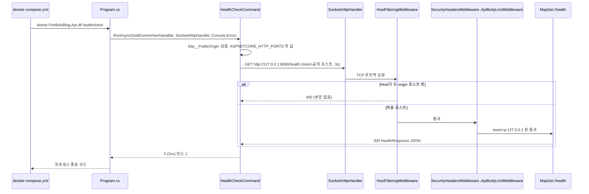
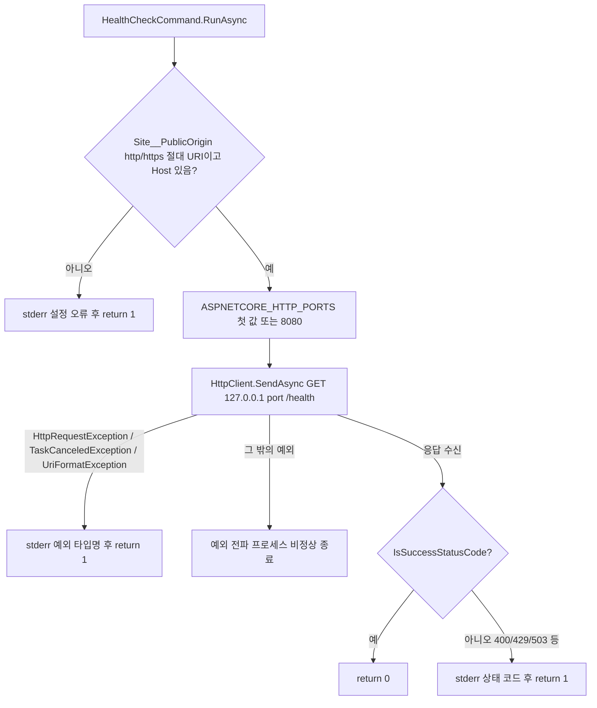
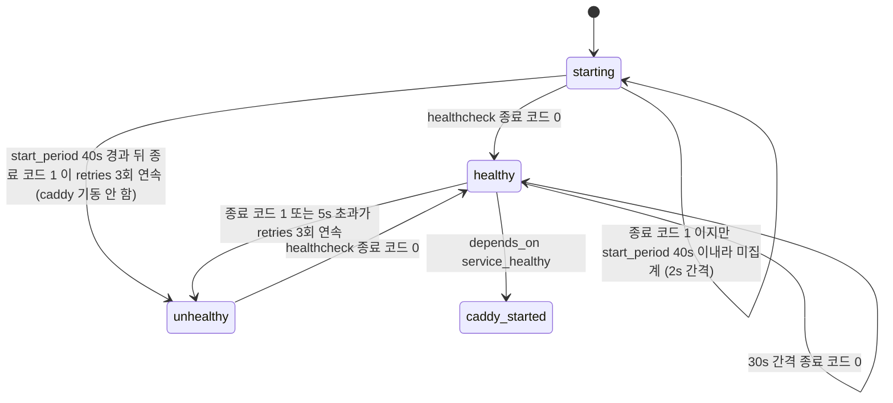

# F022 헬스체크

<!-- doc-harness:section id="summary" hash="3e3e869f044d18c3ec8b7f836263bd5ca8810e7326729df36827b44e1d6f3ddd" -->
## 한 줄 요약

결론: 헬스체크는 액티브 프로브가 아니라 생존(liveness) 확인이다. /health는 DB 같은 의존성을 보지 않고 항상 상수 "Healthy"를 돌려준다. 그래도 이 응답이 나온다는 것은 기동 부트스트랩(설정 검증·첨부 루트 쓰기 가능 확인·마이그레이션·공개 롤 권한·렌더 워밍업)이 끝나고 app.Run()에 들어갔다는 뜻이다.

컨테이너 헬스체크는 같은 바이너리를 `healthcheck` 인자로 다시 실행한다. HealthCheckCommand는 웹 호스트를 만들지 않고, 호스트 필터(설정된 두 호스트만 허용)를 통과하려고 Site__PublicOrigin의 호스트를 Host 헤더로 싣는다. 루프백의 앱 포트로 GET /health를 3초 타임아웃으로 한 번 보내고, 결과는 종료 코드 0/1로만 알린다. 설정 오류·연결 거부·타임아웃·비 2xx는 stderr에 한 줄을 남기고 1을 돌려준다.

compose는 이 명령을 interval 30s·timeout 5s·retries 3·start_period 40s·start_interval 2s로 돌린다. caddy는 api의 service_healthy를 기다린다. 컨테이너 헬스 상태는 세 갈래로 바뀐다.
- starting→healthy: 종료 코드 0이 한 번 나오면 된다.
- starting→unhealthy: start_period 40s가 지난 뒤에도 부트스트랩이 끝나지 않거나 실패가 이어져 30s 간격 검사가 3회 연속 실패하면 곧바로 이 상태가 된다. 이때 caddy의 service_healthy 조건이 충족되지 않아 caddy가 기동하지 않는다.
- healthy→unhealthy: 운영 중 3회 연속 실패하면 이 상태가 된다.

restart: unless-stopped는 unhealthy를 이유로 재시작하지 않는다.

/health는 공개 자산 속도 제한(IP별 분당 600)과 ProblemDetails 오류 형식의 적용을 받는다. /api 밖이라 관리 표면 통제는 받지 않는다.

확인한 한계:
- catch가 세 예외 타입만 잡는다.
- PublicOrigin을 환경변수에서만 읽는다(appsettings 무시).
- CLI의 origin 검증이 SiteOptions.HostOf보다 느슨하다.
- 관리 도메인의 /health는 Caddy가 백엔드로 보내지 않는다.

| 항목 | 값 |
|---|---|
| 중요도 | INFRA |
| 상태 | ACTIVE |
| 진입점 | `GET /health (Program.cs MapGet, 이름 GetHealth)`, `CLI dotnet PortfolioBlog.Api.dll healthcheck (Program.cs args 분기 → HealthCheckCommand.RunAsync)`, `deploy/docker-compose.yml services.api.healthcheck.test` |
| 의존 기능 | [F019](../09_FEATURES.md#f019), [F020](../09_FEATURES.md#f020), [F021](../09_FEATURES.md#f021), [F025](../09_FEATURES.md#f025), [F026](../09_FEATURES.md#f026) |

### 진입점 근거

| 내용 | 상태 | 근거 |
|---|---|---|
| GET /health: Program.cs의 최소 API다. 이름은 GetHealth이고 RateLimitMetadata(RateLimitPolicy.PublicAsset)가 붙는다. 인증·인가 정책은 없다. | CONFIRMED | `PortfolioBlog.Api/Program.cs` app.MapGet("/health") (115-120) |
| CLI `dotnet PortfolioBlog.Api.dll healthcheck`: 인수가 정확히 ["healthcheck"] 하나일 때만 웹 호스트를 만들기 전에 분기한다. RunAsync의 반환값을 프로세스 종료 코드로 쓴다. | CONFIRMED | `PortfolioBlog.Api/Program.cs` (21-26), `PortfolioBlog.Api/Infrastructure/Web/HealthCheckCommand.cs` HealthCheckCommand.Name (17) |
| Docker 헬스체크가 CLI 진입점을 호출한다. 설정은 test ["CMD","dotnet","PortfolioBlog.Api.dll","healthcheck"], interval 30s, timeout 5s, retries 3, start_period 40s, start_interval 2s다. | CONFIRMED | `deploy/docker-compose.yml` services.api.healthcheck (77-83) |
| 외부에서는 공개 도메인을 거쳐 /health에 닿는다. Caddy 공개 사이트 블록이 /api 외의 GET·HEAD를 api:8080으로 역프록시하고, 스모크 테스트가 공개 /health 200을 확인한다. | CONFIRMED | `deploy/Caddyfile` (20-48), `deploy/smoke/smoke.test.mjs` (79-81, 299-302) |
| Playwright webServer의 준비 확인 URL로도 /health를 쓴다(`${API_ORIGIN}/health`, timeout 180_000). | CONFIRMED | `PortfolioBlog.Web/playwright.config.ts` (37) |
<!-- /doc-harness:section -->

<!-- doc-harness:section id="flow" hash="e110626d3caf037b0359fe258162354b63a29fe0a93ce6374e5c58414796b7fd" -->
## 처리 흐름

| 단계 | 컴포넌트 | 코드 | 설명 |
|---|---|---|---|
| 1 | docker-compose.yml (api.healthcheck) | `deploy/docker-compose.yml` services.api.healthcheck | Docker 엔진이 api 컨테이너 안에서 `dotnet PortfolioBlog.Api.dll healthcheck`를 실행한다(CMD exec 형식이라 셸 불필요). start_period 40s 동안은 2초 간격(start_interval), 그 뒤에는 30초 간격이다. 5초 안에 끝나지 않으면 Docker가 실패로 본다. |
| 2 | Program (top-level statements) | `PortfolioBlog.Api/Program.cs` args is [HealthCheckCommand.Name] | HashPasswordCommand 분기 다음에 healthcheck 분기를 검사한다. 일치하면 WebApplication.CreateBuilder를 호출하지 않는다. Environment.GetEnvironmentVariable, 새 SocketsHttpHandler, Console.Error를 넘겨 RunAsync를 await하고, 그 결과를 종료 코드로 return한다. |
| 3 | HealthCheckCommand | `PortfolioBlog.Api/Infrastructure/Web/HealthCheckCommand.cs` HealthCheckCommand.RunAsync | HttpClient(handler, disposeHandler:true)를 Timeout 3초(TimeoutSeconds)로 만든다. using으로 해제한다. |
| 4 | HealthCheckCommand | `PortfolioBlog.Api/Infrastructure/Web/HealthCheckCommand.cs` HealthCheckCommand.RunAsync (origin 검증) | env("Site__PublicOrigin")를 Uri.TryCreate(Absolute)로 해석한다. 스킴이 http/https이고 Host가 비어 있지 않은지 확인한다. 실패하면 stderr에 한 줄을 쓰고 요청 없이 1을 반환한다. |
| 5 | HealthCheckCommand | `PortfolioBlog.Api/Infrastructure/Web/HealthCheckCommand.cs` HealthCheckCommand.RunAsync (포트 결정) | env("ASPNETCORE_HTTP_PORTS")(없으면 "8080")를 ';'로 나눠(빈 항목 제거·trim) 첫 값을 쓴다. 운영 이미지에서는 Dockerfile이 ASPNETCORE_HTTP_PORTS=8080을 설정한다. |
| 6 | HealthCheckCommand | `PortfolioBlog.Api/Infrastructure/Web/HealthCheckCommand.cs` HealthCheckCommand.RunAsync (요청 전송) | GET http://127.0.0.1:{port}/health 요청을 만들고 Host 헤더를 origin.Host로 바꾼 뒤 SendAsync로 보낸다. |
| 7 | HostFilteringMiddleware (프레임워크) + HostFilteringOptions 구성 | `PortfolioBlog.Api/Program.cs` AddOptions<HostFilteringOptions> | 같은 컨테이너에서 실행 중인 웹 앱 프로세스가 요청을 받는다. 호스트 필터는 SiteOptions.HostOf(PublicOrigin)와 HostOf(AdminOrigin), 즉 포트 없는 호스트 이름만 허용한다. Host가 공개 호스트이면 통과하고, 일치하지 않으면 본문 없는 400이 된다. |
| 8 | SecurityHeadersMiddleware → UseTrustedForwardedHeaders → UseExceptionHandler → UseStatusCodePages → UseStaticFiles → AdminSurfaceMiddleware → UseRateLimiter → UseAuthentication/UseAuthorization → ApiBodyLimitMiddleware | `PortfolioBlog.Api/Program.cs` 미들웨어 파이프라인 (98-108) | 먼저 보안 헤더를 붙인다. AdminSurfaceMiddleware는 /api 접두사가 아니면 그대로 통과시킨다. 속도 제한기는 PublicAsset 메타데이터에 따라 "asset-ip:<RemoteIp>" 파티션에 분당 고정 창을 적용한다. 신뢰 프록시는 Caddy 고정 IP 하나뿐이고 루프백 기본값은 지워져 있으므로, 루프백 발신 요청의 RemoteIp는 127.0.0.1이다. |
| 9 | /health 최소 API 핸들러 | `PortfolioBlog.Api/Program.cs` HealthResponse | new HealthResponse("Healthy", DateTimeOffset.UtcNow)를 JSON 200으로 직렬화한다. I/O나 의존성 점검은 없다. |
| 10 | HealthCheckCommand | `PortfolioBlog.Api/Infrastructure/Web/HealthCheckCommand.cs` HealthCheckCommand.RunAsync (판정) | response.IsSuccessStatusCode면 0을 반환한다. 아니면 stderr에 "healthcheck: /health 가 {code} 을(를) 돌려줬습니다."를 쓰고 1을 반환한다. HttpRequestException·TaskCanceledException·UriFormatException이 나면 예외 타입 이름만 stderr에 쓰고 1을 반환한다. |
| 11 | docker-compose.yml (caddy.depends_on) | `deploy/docker-compose.yml` services.caddy.depends_on.api.condition | 종료 코드 0이 나와 api가 healthy가 되면 caddy가 기동한다(condition: service_healthy). start_period가 지난 뒤 3회 연속 실패로 api가 unhealthy가 되면 이 조건이 충족되지 않아 caddy는 기동하지 않는다(Compose 동작, INFERRED). |
<!-- /doc-harness:section -->

<!-- doc-harness:section id="F022_SEQUENCE" hash="d0975ca7cb38ebac1f165c3e5a6865dd15f527b61ffe694aea5aaf7c6b192742" -->
## 컨테이너 헬스체크 호출 순서 (Sequence Diagram)

Docker가 같은 바이너리를 healthcheck 인자로 실행하면 HealthCheckCommand가 공개 호스트를 Host 헤더에 싣고 루프백 /health를 호출한다. 그 결과를 종료 코드 0/1로 돌려준다.

docker-compose.yml의 api.healthcheck가 CMD exec 형식으로 `dotnet PortfolioBlog.Api.dll healthcheck`를 실행한다. Program.cs는 인수가 정확히 ["healthcheck"]이면 웹 호스트를 만들지 않고 HealthCheckCommand.RunAsync로 넘어간다. RunAsync는 환경변수에서 공개 origin과 포트를 읽고 SocketsHttpHandler로 127.0.0.1:{port}/health를 호출한다. 같은 컨테이너의 웹 앱 프로세스에서는 프레임워크 HostFilteringMiddleware가 먼저 Host를 검사한다. 통과하면 앱 미들웨어 파이프라인(보안 헤더·오류 처리·관리 표면·속도 제한·인증)을 지나 /health 핸들러가 HealthResponse를 반환한다. 명령은 상태 코드만 보고 0 또는 1을 반환한다. 연결 실패·타임아웃은 F022_FLOW에 있다.

### 코드 근거

| 구성 요소 | 코드 |
|---|---|
| docker-compose.yml | `deploy/docker-compose.yml` (services.api.healthcheck) |
| Program.cs | `PortfolioBlog.Api/Program.cs` (args is [HealthCheckCommand.Name]) |
| HealthCheckCommand | `PortfolioBlog.Api/Infrastructure/Web/HealthCheckCommand.cs` (HealthCheckCommand.RunAsync) |
| HostFilteringMiddleware | `PortfolioBlog.Api/Program.cs` (AddOptions<HostFilteringOptions>) |
| MapGet /health | `PortfolioBlog.Api/Program.cs` (app.MapGet("/health")) |
<!-- /doc-harness:section -->

<!-- doc-harness:section id="F022_FLOW" hash="712038b6def2c6fce42e0440ca2dfb79031a107c188c563d00f0b6a0a800f2c0" -->
## HealthCheckCommand.RunAsync 분기와 종료 코드 (Flowchart)

설정 오류·연결 실패·타임아웃·비 2xx는 모두 1이고 2xx만 0이다. catch 필터가 잡지 않는 예외는 전파된다.

HealthCheckCommand.cs 42-62를 그대로 옮긴 분기다. origin 검증에 실패하면 요청을 보내지 않고 1이다. 포트는 ';'로 나눈 첫 값이고 없으면 8080이다. SendAsync에서 난 HttpRequestException(연결 거부), TaskCanceledException(3초 타임아웃), UriFormatException은 catch 필터가 잡아 예외 타입 이름만 stderr에 쓰고 1을 반환한다. 이 세 타입 밖의 예외는 잡지 않으므로 프로세스가 비정상 종료된다(POTENTIAL_ISSUE). 응답을 받으면 IsSuccessStatusCode로 판정한다.

### 코드 근거

| 구성 요소 | 코드 |
|---|---|
| RunAsync | `PortfolioBlog.Api/Infrastructure/Web/HealthCheckCommand.cs` (HealthCheckCommand.RunAsync) |
| ReadOrigin | `PortfolioBlog.Api/Infrastructure/Web/HealthCheckCommand.cs` (Uri.TryCreate(env("Site__PublicOrigin"))) |
| ResolvePort | `PortfolioBlog.Api/Infrastructure/Web/HealthCheckCommand.cs` (ASPNETCORE_HTTP_PORTS split) |
| SendAsync | `PortfolioBlog.Api/Infrastructure/Web/HealthCheckCommand.cs` (http.SendAsync) |
| CatchFilter | `PortfolioBlog.Api/Infrastructure/Web/HealthCheckCommand.cs` (catch (Exception ex) when) |
| IsSuccess | `PortfolioBlog.Api/Infrastructure/Web/HealthCheckCommand.cs` (response.IsSuccessStatusCode) |
<!-- /doc-harness:section -->

<!-- doc-harness:section id="F022_STATE" hash="1be7f6035478ea3cfbbcac3c8b6416f0d51e96da90f2c32b4d0bf47ec300fda2" -->
## api 컨테이너 헬스 상태와 caddy 기동 (State Diagram)

api는 헬스체크 종료 코드로 starting·healthy·unhealthy 사이를 오간다. start_period 40s가 지난 뒤 3회 연속 실패하면 starting에서 곧바로 unhealthy가 되고, 이때 caddy는 기동하지 않는다.

compose의 api.healthcheck(interval 30s, timeout 5s, retries 3, start_period 40s, start_interval 2s)와 caddy.depends_on.api.condition: service_healthy를 바탕으로 그렸다. starting 상태에서는 2s 간격으로 검사하고, 이 구간의 실패는 재시도 횟수에 세지 않는다. 종료 코드 0이 한 번 나오면 healthy가 되고, caddy가 기동한다(caddy_started). start_period가 지난 뒤에도 부트스트랩(Program.cs 75-91)이 끝나지 않았거나 실패가 이어지면, 30s 간격 검사가 3회 연속 실패해 starting에서 곧바로 unhealthy가 된다(기동 후 대략 40s + 최대 90s). 이 경로에서는 service_healthy 조건이 충족되지 않아 caddy가 기동하지 않는다. healthy에서도 3회 연속 실패하면 unhealthy가 되지만, 이미 기동한 caddy는 계속 실행된다(depends_on은 기동 시점에만 쓰인다). restart: unless-stopped는 unhealthy를 이유로 재시작하지 않는다. start_period·retries 계산 규칙과 depends_on 판정은 저장소 밖 Docker 엔진·Compose의 동작이라 INFERRED로 둔다.

### 코드 근거

| 구성 요소 | 코드 |
|---|---|
| starting | `deploy/docker-compose.yml` (services.api.healthcheck.start_period) |
| healthy | `PortfolioBlog.Api/Infrastructure/Web/HealthCheckCommand.cs` (HealthCheckCommand.RunAsync (return 0)) |
| unhealthy | `deploy/docker-compose.yml` (services.api.healthcheck.retries) |
| caddy_started | `deploy/docker-compose.yml` (services.caddy.depends_on.api.condition) |

> 상태: INFERRED
<!-- /doc-harness:section -->

<!-- doc-harness:section id="data" hash="0d2a5daf1a1553b7ff18bfd3688818cd8a518a7d11f47d0addda0b7d38399764" -->
## 데이터

### 데이터 흐름

| 내용 | 상태 | 근거 |
|---|---|---|
| 입력(CLI): 환경변수 Site__PublicOrigin(필수)과 ASPNETCORE_HTTP_PORTS(선택, 기본 8080)만 읽는다. IConfiguration을 쓰지 않으므로 appsettings 등 다른 설정 소스의 값은 반영되지 않는다. | CONFIRMED | `PortfolioBlog.Api/Infrastructure/Web/HealthCheckCommand.cs` (23, 42-50), `PortfolioBlog.Api/Program.cs` (25) |
| 운영 환경의 값 출처: compose가 Site__PublicOrigin에 ${PUBLIC_ORIGIN}을 주입하고, Dockerfile이 ASPNETCORE_HTTP_PORTS=8080을 고정한다. 헬스체크 프로세스는 같은 컨테이너에서 exec로 실행되므로 이 컨테이너 환경변수를 그대로 받는다. | CONFIRMED | `deploy/docker-compose.yml` (63), `PortfolioBlog.Api/Dockerfile` (27-30) |
| 변환: PublicOrigin URI에서 Host만 뽑아 HTTP Host 헤더로 쓴다. 요청 URI는 항상 루프백 IPv4 127.0.0.1의 평문 http다. 앱 쪽 호스트 필터도 SiteOptions.HostOf가 돌려주는 uri.Host(포트 제외)로 허용 목록을 만든다. | CONFIRMED | `PortfolioBlog.Api/Infrastructure/Web/HealthCheckCommand.cs` (51-52), `PortfolioBlog.Api/Infrastructure/Access/SiteOptions.cs` SiteOptions.HostOf (44-48) |
| 엔드포인트 출력: HealthResponse(Status=상수 "Healthy", GeneratedAt=DateTimeOffset.UtcNow)를 JSON {"status":"Healthy","generatedAt":...}으로 직렬화한다. 테스트가 필드 구성을 검증한다. | CONFIRMED | `PortfolioBlog.Api/Program.cs` (115-118, 141), `PortfolioBlog.Api.Tests/HealthEndpointTests.cs` (51-107) |
| CLI 출력: 프로세스 종료 코드 0/1과 stderr 한 줄이다. 이 한 줄은 docker inspect 헬스 로그에 남는다. 응답 본문은 읽지 않고 상태 코드만 본다. | CONFIRMED | `PortfolioBlog.Api/Infrastructure/Web/HealthCheckCommand.cs` (53-61) |
| /health에서 본문 없는 오류 상태 코드(429·503 등)가 나오면, ErrorResponses가 이를 기계용 접두사(/health)로 분류해 ProblemDetails JSON으로 쓴다. | CONFIRMED | `PortfolioBlog.Api/Infrastructure/Web/ErrorResponses.cs` (17), `PortfolioBlog.Api/Program.cs` (101) |

### DB 접근

_(없음)_

### 상태 전이

| 이전 | 다음 | 트리거 | 근거 |
|---|---|---|---|
| starting (start_period 40s 이내, 2s 간격 검사) | healthy | healthcheck 명령이 종료 코드 0을 반환한다(/health 2xx). 기동 부트스트랩이 끝나 app.Run()이 수신을 시작한 뒤에야 가능하다. | `deploy/docker-compose.yml` (77-83), `PortfolioBlog.Api/Program.cs` (75-126) |
| starting | unhealthy | start_period 40s 동안의 실패는 재시도 횟수에 세지 않는다. 40s가 지난 뒤에도 부트스트랩(Program.cs 75-91)이 끝나지 않았거나 실패가 이어지면, 30s 간격 검사에서 종료 코드 1(또는 5s 초과)이 retries 3회 연속 나온다. 그러면 healthy를 한 번도 거치지 않고 곧바로 unhealthy가 된다. 기동부터 대략 40s에 최대 90s를 더한 시점이다. 이때 caddy의 depends_on.api.condition: service_healthy가 충족되지 않아 caddy는 기동하지 않는다(docker compose up이 의존성 실패로 끝나는 것으로 보인다). 이 계산 규칙은 저장소 밖 Docker 엔진·Compose의 동작이므로 INFERRED다. | `deploy/docker-compose.yml` (46-48, 77-83), `PortfolioBlog.Api/Program.cs` (75-91) |
| healthy | unhealthy | 30s 간격 검사에서 종료 코드 1(연결 실패·3초 타임아웃·비 2xx·설정 오류) 또는 Docker 5s 타임아웃이 retries 3회 연속 발생한다. 이미 기동한 caddy는 계속 실행된다. depends_on 조건은 기동 시점에만 쓰인다(INFERRED). | `deploy/docker-compose.yml` (46-48, 77-82), `PortfolioBlog.Api/Infrastructure/Web/HealthCheckCommand.cs` (42-62) |
| unhealthy | healthy | healthcheck가 다시 종료 코드 0을 반환한다(Docker 엔진 규칙, INFERRED). restart: unless-stopped는 프로세스 종료에만 반응하고 unhealthy 상태로는 재시작하지 않는다(INFERRED). | `deploy/docker-compose.yml` (3-4, 77-83) |
| caddy 대기 | caddy 기동 | api 서비스가 service_healthy가 된다(depends_on.condition). | `deploy/docker-compose.yml` (46-48) |

### 외부 의존

| 내용 | 상태 | 근거 |
|---|---|---|
| Docker Engine·Docker Compose의 헬스체크 메커니즘. 종료 코드만 보고 판정하며, CMD exec 형식이라 셸이 필요 없다. start_period·retries 계산 규칙은 엔진의 동작이다. | CONFIRMED | `deploy/docker-compose.yml` (77-83) |
| 운영 이미지는 mcr.microsoft.com/dotnet/aspnet:10.0.12-noble-chiseled-extra다. 셸도 curl도 없어서 앱 자신이 HTTP 클라이언트 역할을 한다. | CONFIRMED | `PortfolioBlog.Api/Dockerfile` (22-33), `PortfolioBlog.Api/Infrastructure/Web/HealthCheckCommand.cs` (11-12) |
| System.Net.Http의 SocketsHttpHandler·HttpClient(BCL)가 루프백 TCP 연결을 맺는다. | CONFIRMED | `PortfolioBlog.Api/Program.cs` (24-25), `PortfolioBlog.Api/Infrastructure/Web/HealthCheckCommand.cs` (37) |
| ASP.NET Core HostFiltering(프레임워크 시작 필터)이 Host 헤더를 검사한다. 이 때문에 Host: localhost로는 통과할 수 없다. | CONFIRMED | `PortfolioBlog.Api/Program.cs` (32-42), `PortfolioBlog.Api.Tests/Features/HostFilteringTests.cs` (23-54) |
| Caddy 공개 도메인 사이트 블록이 외부 /health 요청을 api:8080으로 프록시한다. api가 멈추면 Caddy가 본문 없는 502를 낸다(스모크 테스트가 확인한다). | CONFIRMED | `deploy/Caddyfile` (20-61), `deploy/smoke/smoke.test.mjs` (323-332) |
<!-- /doc-harness:section -->

<!-- doc-harness:section id="failures" hash="08b90f7d1cfc9ce858f0d01fdd2ed90b1fdfb947d75c7a69a68e39f5be938133" -->
## 실패 지점

| 위치 | 조건 | 처리 | 상태 | 근거 |
|---|---|---|---|---|
| HealthCheckCommand.RunAsync (origin 검증) | Site__PublicOrigin이 없거나 빈 값·상대 URI인 경우, 스킴이 http/https가 아닌 경우(예: urn:example:blog), Host가 빈 경우 | 요청을 보내지 않는다. stderr에 "healthcheck: Site__PublicOrigin 이 없거나 http(s) 절대 URI가 아닙니다."를 쓰고 1을 반환한다. | CONFIRMED | `PortfolioBlog.Api/Infrastructure/Web/HealthCheckCommand.cs` (42-48), `PortfolioBlog.Api.Tests/Infrastructure/HealthCheckCommandTests.cs` (93-106) |
| HealthCheckCommand.RunAsync (SendAsync) | 앱이 아직 수신 전이거나 죽은 경우(연결 거부 → HttpRequestException) | catch 필터에서 잡아 stderr에 예외 타입 이름만 쓰고 1을 반환한다. | CONFIRMED | `PortfolioBlog.Api/Infrastructure/Web/HealthCheckCommand.cs` (58-62), `PortfolioBlog.Api.Tests/Infrastructure/HealthCheckCommandTests.cs` (74-80) |
| HealthCheckCommand.RunAsync (HttpClient.Timeout) | 3초 안에 응답이 없는 경우(TaskCanceledException) | 잡아서 1을 반환한다. 3초는 compose timeout 5초보다 짧아서, Docker 타임아웃보다 먼저 이 명령이 실패를 보고한다. | CONFIRMED | `PortfolioBlog.Api/Infrastructure/Web/HealthCheckCommand.cs` (19-20, 37, 58), `PortfolioBlog.Api.Tests/Infrastructure/HealthCheckCommandTests.cs` (82-91) |
| HealthCheckCommand.RunAsync (응답 판정) | 비 2xx 응답(Host 불일치 400, 과부하 503, 속도 제한 429, 404 등) | stderr에 상태 코드를 쓰고 1을 반환한다. | CONFIRMED | `PortfolioBlog.Api/Infrastructure/Web/HealthCheckCommand.cs` (54-56), `PortfolioBlog.Api.Tests/Infrastructure/HealthCheckCommandTests.cs` (61-72) |
| HealthCheckCommand.RunAsync (catch 필터) | HttpRequestException·TaskCanceledException·UriFormatException 이외의 예외(예: 비정상 포트 문자열로 요청 생성·전송 단계에서 다른 예외가 나는 경우) | 처리 없음(예외 전파). 미처리 예외로 프로세스가 비정상 종료된다. 종료 코드가 0이 아니므로 Docker는 여전히 실패로 판정하는 것으로 보인다. 다만 XML 주석의 '예외를 밖으로 던지지 않는다' 계약과 어긋나고, stderr에는 한 줄 요약 대신 스택 트레이스가 남는다. | POTENTIAL_ISSUE | `PortfolioBlog.Api/Infrastructure/Web/HealthCheckCommand.cs` (32, 50-53, 58) |
| Program.cs 기동 부트스트랩(StartupValidation·EnsureRootIsWritable·Migrate·PublicRoleGrants·렌더 워밍업) | 기동 중이거나, 기동이 실패해 app.Run()에 도달하지 못한 경우 | /health가 응답하지 않으므로 헬스체크는 연결 실패로 1이 된다. start_period 40s 동안의 실패는 재시도 횟수에 들어가지 않는다. 40s가 지난 뒤에도 부트스트랩이 끝나지 않거나 실패가 이어지면, 30s 간격 검사가 3회 연속 실패하는 시점에 starting에서 곧바로 unhealthy가 된다. 그러면 caddy의 service_healthy 조건이 충족되지 않아 caddy가 기동하지 않는다(Docker·Compose 동작, INFERRED). 부트스트랩이 예외로 프로세스를 끝내면 restart: unless-stopped가 컨테이너를 다시 띄운다. 운영 문서는 이 경우를 'unhealthy/재시작 반복' 증상으로 다룬다. | CONFIRMED | `PortfolioBlog.Api/Program.cs` (75-91, 126), `deploy/docker-compose.yml` (4, 46-48, 77-83), `deploy/OPERATIONS.md` (153) |
| GET /health (UseRateLimiter) | 같은 IP 파티션(asset-ip:<ip>)의 분당 요청이 Public:AssetPerIpPerMinute(기본 600)를 넘는 경우 | 429를 ProblemDetails 형식으로 반환한다. 헬스체크 프로세스의 파티션은 127.0.0.1이다. | CONFIRMED | `PortfolioBlog.Api/Infrastructure/Web/RateLimitingExtensions.cs` (101), `PortfolioBlog.Api/Infrastructure/Web/PublicOptions.cs` (20-21), `PortfolioBlog.Api.Tests/Features/PublicRateLimitTests.cs` (19-35) |
| GET /health (HostFiltering) | Host 헤더가 PublicOrigin·AdminOrigin의 호스트가 아닌 경우(localhost 포함) | 앱 미들웨어 바깥의 프레임워크 필터가 본문 없는 400을 반환한다(IncludeFailureMessage=false, 보안 헤더 없음). | CONFIRMED | `PortfolioBlog.Api/Program.cs` (34-42), `PortfolioBlog.Api.Tests/Features/HostFilteringTests.cs` (23-54) |

### 엣지 케이스

| 내용 | 상태 | 근거 |
|---|---|---|
| /health는 의존성(DB·첨부 저장소)을 점검하지 않는다. 기동 뒤 PostgreSQL이 끊겨도 계속 200 Healthy이므로 컨테이너는 healthy로 남는다. 응답 모델 주석도 '현 단계에서는 외부 의존성 점검 없이'라고 밝힌다. | POTENTIAL_ISSUE | `PortfolioBlog.Api/Program.cs` (115-118, 130) |
| CLI는 Site__PublicOrigin을 환경변수에서만 읽는다. 반면 웹 앱은 IConfiguration(appsettings 포함)으로 호스트 필터를 구성한다. 따라서 PublicOrigin을 appsettings 등 다른 소스로만 설정하면, 앱이 정상이어도 헬스체크는 설정 오류로 1을 낸다. 운영 compose는 환경변수로 주입하므로 이 경우에 해당하지 않는다. | POTENTIAL_ISSUE | `PortfolioBlog.Api/Infrastructure/Web/HealthCheckCommand.cs` (42), `PortfolioBlog.Api/Program.cs` (34-37), `deploy/docker-compose.yml` (63) |
| CLI의 origin 검증(절대 URI + http/https + Host 비어 있지 않음)은 SiteOptions.HostOf보다 느슨하다. HostOf는 경로·끝 슬래시·사용자 정보가 있으면 FormatException을 던진다. 그래서 PublicOrigin이 'https://blog.example/'처럼 끝 슬래시를 가지면 앱은 StartupValidation에서 기동에 실패하는데, CLI는 자체 검증을 통과해 요청을 보낸다. 이 경우 stderr에는 설정 오류 문구가 아니라 연결 실패(HttpRequestException)가 남는다. | CONFIRMED | `PortfolioBlog.Api/Infrastructure/Web/HealthCheckCommand.cs` (42-48), `PortfolioBlog.Api/Infrastructure/Access/SiteOptions.cs` (44-48), `PortfolioBlog.Api/Infrastructure/Access/StartupValidation.cs` (48-49) |
| 포트는 ASPNETCORE_HTTP_PORTS의 첫 값만 쓴다. ASPNETCORE_URLS나 Kestrel 엔드포인트 설정으로 수신 포트를 바꾸면 헬스체크 대상과 어긋날 수 있다. 테스트는 여러 포트 중 첫 값을 쓰는 것만 확인한다. | INFERRED | `PortfolioBlog.Api/Infrastructure/Web/HealthCheckCommand.cs` (49-51), `PortfolioBlog.Api.Tests/Infrastructure/HealthCheckCommandTests.cs` (52-59) |
| PublicOrigin에 포트가 있어도(예: https://blog.example:8443) Host 헤더에는 호스트만 들어간다. 호스트 필터의 허용 목록도 SiteOptions.HostOf가 돌려주는 uri.Host(포트 제외)로 만들어지므로 둘이 일치한다. | CONFIRMED | `PortfolioBlog.Api/Infrastructure/Web/HealthCheckCommand.cs` (52), `PortfolioBlog.Api/Infrastructure/Access/SiteOptions.cs` (44-47), `PortfolioBlog.Api/Program.cs` (36) |
| 관리 도메인(ADMIN_DOMAIN)의 /health는 Caddy가 백엔드로 보내지 않는다. 허용 IP 밖에서는 본문 없는 404다(스모크 테스트가 확인한다). 허용 IP 안에서는 @backend(/api/*·/attachments/*)에 해당하지 않아 SPA 폴백(try_files → /index.html)으로 처리되므로, API의 헬스 JSON이 아니라 index.html이 나올 것으로 보인다. 앱 자체는 두 호스트 모두에서 /health를 허용한다(AccessMatrixTests SharedBetweenHosts). | INFERRED | `deploy/Caddyfile` (79-143), `deploy/smoke/smoke.test.mjs` (275-280), `PortfolioBlog.Api.Tests/Features/AccessMatrixTests.cs` (321) |
| /health는 /api 접두사 밖이라 AdminSurfaceMiddleware의 호스트·IP·CSRF·Origin 검사를 받지 않는다. 허용된 어느 호스트, 어느 IP에서든 200이다. | CONFIRMED | `PortfolioBlog.Api/Infrastructure/Access/AdminSurfaceMiddleware.cs` (29, 70), `PortfolioBlog.Api.Tests/Features/AdminSurfaceTests.cs` (195-210) |
| 헬스체크 요청은 루프백에서 오고, 신뢰 프록시 목록은 Caddy 고정 IP 하나로 좁혀져 있다(루프백 기본값 제거). 따라서 속도 제한 파티션은 127.0.0.1로 잡히고 외부 방문자 예산과 섞이지 않는다. start_interval 2s 기준으로 최대 분당 30회라 기본 한도 600에 여유가 크다. 다만 Public:AssetPerIpPerMinute를 30 미만으로 설정하면(StartupValidation은 1 이상만 요구) 기동 구간에 429로 실패할 수 있다. | INFERRED | `PortfolioBlog.Api/Infrastructure/Access/AccessServiceCollectionExtensions.cs` (42-49), `PortfolioBlog.Api/Infrastructure/Web/RateLimitingExtensions.cs` (101), `PortfolioBlog.Api/Infrastructure/Access/StartupValidation.cs` (75-77), `deploy/docker-compose.yml` (79-83) |
| start_period 40s 안에 부트스트랩(마이그레이션 포함)이 끝나지 않으면 이후 30s 간격 검사가 3회 연속 실패해 api가 한 번도 healthy를 거치지 않고 unhealthy가 된다. 그러면 caddy는 기동하지 않는다. 마이그레이션이 오래 걸리는 배포에서 이 경계에 걸릴 수 있다. | INFERRED | `deploy/docker-compose.yml` (46-48, 77-83), `PortfolioBlog.Api/Program.cs` (81-91) |
| restart: unless-stopped는 프로세스가 종료될 때만 재시작한다. unhealthy가 된 api 컨테이너(프로세스는 살아 있음)는 자동으로 재시작되지 않고 그대로 남는다. 저장소에서 autoheal 같은 별도 장치는 찾지 못했다. | INFERRED | `deploy/docker-compose.yml` (3-4, 50-51) |
| CLI 인수가 정확히 한 개("healthcheck")일 때만 분기한다. 인수가 더 붙으면 리스트 패턴 [x]에 맞지 않아 웹 호스트가 그대로 기동된다. | CONFIRMED | `PortfolioBlog.Api/Program.cs` (22) |
| 쿠키가 실린 요청이면 인가 정책이 없는 /health에서도 쿠키 인증 핸들러가 호출된다(주석에 적힌 실측 내용). 헬스체크 CLI는 쿠키를 보내지 않는다. | CONFIRMED | `PortfolioBlog.Api/Infrastructure/Access/AuthServiceCollectionExtensions.cs` (49-51) |

### 로깅

| 내용 | 상태 | 근거 |
|---|---|---|
| HealthCheckCommand는 실패 이유를 stderr(Console.Error)에 한 줄로만 쓴다. 설정 오류 문구, '/health 가 {code} 을(를) 돌려줬습니다', 예외 타입 이름(메시지 제외) 셋 중 하나이며 비밀값은 쓰지 않는다. 성공하면 출력이 없다. 이 줄은 docker inspect 헬스 로그에서 볼 수 있다. | CONFIRMED | `PortfolioBlog.Api/Infrastructure/Web/HealthCheckCommand.cs` (25, 46, 55, 60), `PortfolioBlog.Api.Tests/Infrastructure/HealthCheckCommandTests.cs` (49, 71) |
| 운영 문서는 api가 unhealthy이거나 재시작을 반복할 때 `docker compose logs --tail 100 api`와 `docker inspect --format '{{json .State.Health}}' portfolioblog-api-1`로 확인하라고 안내한다(문서 근거). | INFERRED | `deploy/OPERATIONS.md` (53, 153) |
| /health 엔드포인트 자체에는 전용 로깅이 없다(ILogger 사용 없음). 외부를 거쳐 들어온 요청은 Caddy 공개 사이트 블록의 `log` 지시어가 액세스 로그로 남긴다. | CONFIRMED | `PortfolioBlog.Api/Program.cs` (115-120), `deploy/Caddyfile` (20-21) |
| 컨테이너 로그는 json-file 드라이버로 남고 max-size 10m, max-file 5로 순환된다(x-hardening 공통 설정). | CONFIRMED | `deploy/docker-compose.yml` (9-13) |
<!-- /doc-harness:section -->

<!-- doc-harness:section id="code" hash="0d24dde3953291c9865cb11a070453fd7a58fc1949853523bfb8b6dc5d5e237b" -->
## 관련 코드

| 파일 | 심볼 | 역할 |
|---|---|---|
| `PortfolioBlog.Api/Program.cs` | args is [HealthCheckCommand.Name] | entry |
| `PortfolioBlog.Api/Program.cs` | app.MapGet("/health") | entry |
| `PortfolioBlog.Api/Program.cs` | HealthResponse | dto |
| `PortfolioBlog.Api/Infrastructure/Web/HealthCheckCommand.cs` | HealthCheckCommand.RunAsync | service |
| `PortfolioBlog.Api/Infrastructure/Web/HealthCheckCommand.cs` | HealthCheckCommand.TimeoutSeconds | config |
| `PortfolioBlog.Api/Program.cs` | AddOptions<HostFilteringOptions> | validation |
| `PortfolioBlog.Api/Infrastructure/Access/SiteOptions.cs` | SiteOptions.HostOf | validation |
| `deploy/docker-compose.yml` | services.api.healthcheck | config |
| `deploy/docker-compose.yml` | services.caddy.depends_on.api | config |
| `PortfolioBlog.Api/Dockerfile` | ENV ASPNETCORE_HTTP_PORTS / chiseled final stage | config |
| `deploy/Caddyfile` | {$DOMAIN} reverse_proxy api:8080 | config |
| `PortfolioBlog.Api/Infrastructure/Web/RateLimitingExtensions.cs` | asset-ip window | validation |
| `PortfolioBlog.Api/Infrastructure/Web/RateLimitPolicy.cs` | RateLimitPolicy.PublicAsset | config |
| `PortfolioBlog.Api/Infrastructure/Web/PublicOptions.cs` | PublicOptions.AssetPerIpPerMinute | config |
| `PortfolioBlog.Api/Infrastructure/Web/ErrorResponses.cs` | ErrorResponses.MachinePrefixes | render |
| `PortfolioBlog.Api/Infrastructure/Access/AdminSurfaceMiddleware.cs` | AdminSurfaceMiddleware (ApiPrefix 검사) | validation |
| `PortfolioBlog.Api/Infrastructure/Access/AccessServiceCollectionExtensions.cs` | ForwardedHeadersOptions KnownProxies | config |
| `PortfolioBlog.Api.Tests/Infrastructure/HealthCheckCommandTests.cs` | HealthCheckCommandTests | test |
| `PortfolioBlog.Api.Tests/HealthEndpointTests.cs` | HealthEndpointTests | test |
| `PortfolioBlog.Api.Tests/Features/HostFilteringTests.cs` | HostFilteringTests | test |
| `PortfolioBlog.Api.Tests/Features/AdminSurfaceTests.cs` | AdminSurfaceTests.Health_IsPublic_OnAnyHost_FromAnyIp | test |
| `PortfolioBlog.Api.Tests/Features/PublicRateLimitTests.cs` | PublicRateLimitTests.PublicAsset_IsLimitedPerIp | test |
| `deploy/smoke/smoke.test.mjs` | - | test |

근거: `PortfolioBlog.Api/Infrastructure/Web/HealthCheckCommand.cs` HealthCheckCommand (1-64), `PortfolioBlog.Api/Program.cs` healthcheck 분기 (21-26), `PortfolioBlog.Api/Program.cs` MapGet("/health") / HealthResponse (115-120, 141), `PortfolioBlog.Api/Program.cs` HostFilteringOptions (32-42), `PortfolioBlog.Api/Program.cs` 기동 부트스트랩 (75-91), `PortfolioBlog.Api/Infrastructure/Access/SiteOptions.cs` SiteOptions.HostOf (44-48), `deploy/docker-compose.yml` (3-4, 46-48, 63, 77-83), `PortfolioBlog.Api/Dockerfile` (22-33), `deploy/Caddyfile` (20-48, 79-143), `PortfolioBlog.Api/Infrastructure/Web/RateLimitingExtensions.cs` (101), `PortfolioBlog.Api/Infrastructure/Web/ErrorResponses.cs` (17), `PortfolioBlog.Api.Tests/Infrastructure/HealthCheckCommandTests.cs` (37-106), `PortfolioBlog.Api.Tests/HealthEndpointTests.cs` (51-131), `PortfolioBlog.Api.Tests/Features/HostFilteringTests.cs` (23-54), `PortfolioBlog.Api.Tests/Features/AdminSurfaceTests.cs` (195-210), `PortfolioBlog.Api.Tests/Features/PublicRateLimitTests.cs` (19-35), `deploy/smoke/smoke.test.mjs` (79-81, 275-302, 323-332), `deploy/OPERATIONS.md` (153)
<!-- /doc-harness:section -->

<!-- doc-harness:section id="unknowns" hash="bf45a4dd91b333453a92ee1f73f446d26556eac3d886a5ebeee511bf866d7755" -->
## 확인하지 못한 것

- 포트 문자열이 비정상일 때(예: ASPNETCORE_HTTP_PORTS=abc) new HttpRequestMessage·SendAsync가 실제로 어떤 예외를 던지는지, 그 예외가 catch 필터에 잡히는지는 실행해서 확인하지 않았다.
- unhealthy가 된 api 컨테이너를 재시작하는 별도 장치(autoheal 등)는 저장소에서 찾지 못했다. deploy/OPERATIONS.md 153행은 unhealthy/재시작 반복 증상의 확인 명령(logs, docker inspect .State.Health)만 안내한다. unhealthy일 때 자동 조치가 있는지는 확인하지 못했다.
- starting→unhealthy 전이 시각(start_period 이후 30s 간격 검사 3회)과 caddy가 depends_on 실패로 기동하지 않는 동작은 Docker 엔진·Compose의 규칙에서 추론했다. 저장소 안의 테스트나 스모크로는 검증하지 않는다.
- 관리 도메인에서 허용 IP로 /health를 요청했을 때 실제로 SPA index.html(200)이 나오는지는 Caddyfile 구조로 추론했을 뿐이고, 스모크 테스트는 이를 검증하지 않는다.
- HostFiltering 구성을 기능 색인의 F018과 F020 중 어느 기능이 소유하는지는 코드만으로 판단할 수 없어 dependencies에 F018을 넣지 않았다.
- HEAD /health 요청의 처리는 확인하지 않았다. MapGet은 GET만 매칭하고, Caddy 공개 블록은 HEAD도 통과시킨다.
<!-- /doc-harness:section -->

<!-- doc-harness:section id="related" hash="e6b04ee08cc1bd1a2625cbb81ca24992b9da0467258ba6539a8ab5b4aeff04d8" -->
## 관련 문서

- [../09_FEATURES](../09_FEATURES.md)
- [../08_API](../08_API.md)
- [../07_DATA_MODEL](../07_DATA_MODEL.md)
- [../11_FAILURE_HISTORY](../11_FAILURE_HISTORY.md)
<!-- /doc-harness:section -->
