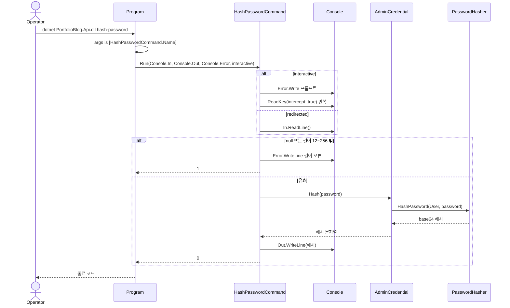
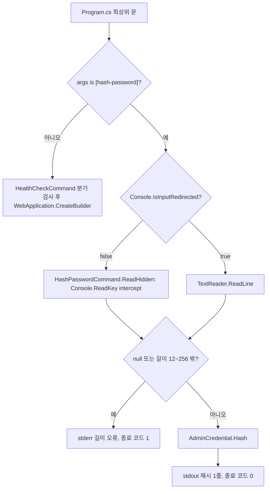
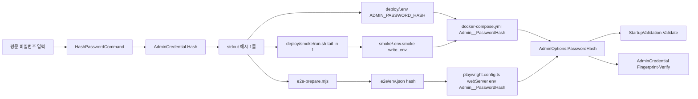

# F023 관리자 비밀번호 해시 생성 CLI

<!-- doc-harness:section id="summary" hash="7f326df51486c57859116765761bc6584b8cab59222cfd239ad666623c659ecb" -->
## 한 줄 요약

결론: F023은 웹 호스트·DI·DB·네트워크를 쓰지 않는 단일 스레드 동기 CLI 경로이며 실제로 동작한다. Program.cs 맨 위의 `args is [HashPasswordCommand.Name]` 분기가 `HashPasswordCommand.Run(Console.In, Console.Out, Console.Error, interactive: !Console.IsInputRedirected)`를 부르고, 그 반환값(0 또는 1)이 곧 프로세스 종료 코드다. 대화형이면 `Console.ReadKey(intercept: true)`로 에코 없이 읽는다(백스페이스 지원, 제어 문자 무시). 비대화형이면 `TextReader.ReadLine()`으로 한 줄만 읽는다. 비밀번호가 null이거나 12자 미만 또는 256자 초과이면 stderr에 오류를 쓰고 1을 반환한다. 통과하면 `AdminCredential.Hash`(정적 `PasswordHasher<object>.HashPassword`) 결과를 stdout에 한 줄 쓰고 0을 반환한다. 프롬프트와 오류는 stderr, 해시는 stdout으로 나뉘므로 소비자는 stdout 마지막 줄만 취하면 된다. 해시가 설정이 되는 경로는 세 가지다. (1) 운영: 운영자가 `deploy/.env`의 `ADMIN_PASSWORD_HASH`에 넣고, docker-compose가 `Admin__PasswordHash: ${ADMIN_PASSWORD_HASH:?}`로 주입한다. (2) 스모크: `deploy/smoke/run.sh`가 `| tail -n 1`로 해시를 뽑아 `write_env`로 운영 `.env`와 별개인 `deploy/smoke/.env.smoke`에 쓴다. 이 파일은 `COMPOSE_ENV_FILES`로 compose에 전달되고 cleanup에서 삭제된다. (3) E2E: `e2e-prepare.mjs`가 해시를 `.e2e/env.json`에 저장하고, `playwright.config.ts`의 webServer env가 `Admin__PasswordHash: prepared.hash`로 `dotnet run` API 프로세스에 compose 없이 직접 주입한다. 세 경로 모두 결국 `AdminOptions.PasswordHash`로 바인딩된다. 앱 기동 시 `StartupValidation`이 base64 형식과 비Development 필수 여부를 검사하고, `AdminCredential`이 로그인 검증과 세션 지문에 쓴다. CLI에는 예외 처리 코드가 없다. 콘솔이 없을 때의 ReadKey 실패나 출력 파이프 끊김은 그대로 전파된다. ILogger 로깅도 없다.

| 항목 | 값 |
|---|---|
| 중요도 | INFRA |
| 상태 | ACTIVE |
| 진입점 | `CLI dotnet PortfolioBlog.Api.dll hash-password (Dockerfile ENTRYPOINT 경유: docker run --rm -it portfolioblog-api hash-password)`, `CLI dotnet run --project PortfolioBlog.Api -- hash-password (개발·E2E 준비)` |
| 의존 기능 | [F001](../09_FEATURES.md#f001) |

### 진입점 근거

| 내용 | 상태 | 근거 |
|---|---|---|
| Program.cs 최상위 문에서 `args is [HashPasswordCommand.Name]`(정확히 인수 하나, 값 "hash-password")이면 `HashPasswordCommand.Run`을 호출하고 반환값을 종료 코드로 돌려준다. `WebApplication.CreateBuilder`보다 앞이라 웹 호스트를 만들지 않는다. | CONFIRMED | `PortfolioBlog.Api/Program.cs` (15-19), `PortfolioBlog.Api/Infrastructure/Access/HashPasswordCommand.cs` HashPasswordCommand.Name (16-17) |
| 컨테이너 이미지의 ENTRYPOINT가 `dotnet PortfolioBlog.Api.dll`이라 `docker run --rm -it portfolioblog-api hash-password`의 마지막 인수가 그대로 args로 전달된다. 운영 문서는 최초 배포와 비밀번호 변경 절차에서 이 명령을 쓴다. | CONFIRMED | `PortfolioBlog.Api/Dockerfile` (31-33), `deploy/OPERATIONS.md` (34, 92-100), `deploy/.env.example` (29-30) |
| 자동화 호출자는 두 곳이다. 배포 스모크 스크립트는 `printf ... \| docker run --rm -i pb-smoke-api hash-password \| tail -n 1`로 해시를 만든다. E2E 준비 스크립트는 `dotnet run --project <api> -c Release -- hash-password`에 표준 입력으로 무작위 비밀번호를 넣고 출력의 마지막 줄을 해시로 쓴다. | CONFIRMED | `deploy/smoke/run.sh` (72-75), `PortfolioBlog.Web/scripts/e2e-prepare.mjs` (41-47) |
<!-- /doc-harness:section -->

<!-- doc-harness:section id="flow" hash="53f4e924bef8c480a19eb6bf676393e2e37659119f8419e441bf60c6dd707ce6" -->
## 처리 흐름

| 단계 | 컴포넌트 | 코드 | 설명 |
|---|---|---|---|
| 1 | Program | `PortfolioBlog.Api/Program.cs` <top-level statements> | 프로세스 인수를 리스트 패턴 `[HashPasswordCommand.Name]`과 비교한다. 정확히 하나의 인수 "hash-password"일 때만 CLI 분기로 들어가고, 그 외에는 healthcheck 분기와 웹 호스트 구성으로 넘어간다. |
| 2 | Program | `PortfolioBlog.Api/Program.cs` <top-level statements> | `Console.IsInputRedirected`로 대화형 여부를 정한다(리디렉션이 아니면 interactive=true). 이어서 `Console.In`/`Console.Out`/`Console.Error`를 넘겨 `HashPasswordCommand.Run`을 호출한다. |
| 3 | HashPasswordCommand | `PortfolioBlog.Api/Infrastructure/Access/HashPasswordCommand.cs` HashPasswordCommand.Run | 대화형이면 stderr에 프롬프트 "새 관리자 비밀번호: "를 쓴다. |
| 4 | HashPasswordCommand | `PortfolioBlog.Api/Infrastructure/Access/HashPasswordCommand.cs` HashPasswordCommand.ReadHidden | 대화형이면 `Console.ReadKey(intercept: true)`를 반복해 StringBuilder에 문자를 모은다. Enter에서 끝나고, Backspace는 한 글자를 지우며, `char.IsControl` 문자는 무시한다. 비대화형이면 `input.ReadLine()`으로 한 줄을 읽는다(EOF면 null). |
| 5 | HashPasswordCommand | `PortfolioBlog.Api/Infrastructure/Access/HashPasswordCommand.cs` HashPasswordCommand.Run | 대화형이면 stderr에 줄바꿈을 쓴다. 그다음 password가 null이거나 길이가 MinLength(12) 미만 또는 256 초과인지 검사한다. 위반하면 stderr에 "비밀번호는 12~256자여야 합니다."를 쓰고 1을 반환한다. |
| 6 | AdminCredential | `PortfolioBlog.Api/Infrastructure/Access/AdminCredential.cs` AdminCredential.Hash | 정적 `PasswordHasher<object>` 인스턴스의 `HashPassword(User, password)`를 호출해 솔트·반복 횟수·알고리즘 버전이 포함된 base64 해시 문자열을 만든다. CPU 바운드 동기 연산이다. |
| 7 | HashPasswordCommand | `PortfolioBlog.Api/Infrastructure/Access/HashPasswordCommand.cs` HashPasswordCommand.Run | 해시를 stdout(`output.WriteLine`)에 한 줄 쓰고 0을 반환한다. |
| 8 | Program | `PortfolioBlog.Api/Program.cs` <top-level statements> | Run의 반환값을 최상위 `return`으로 돌려준다. 이 값이 프로세스 종료 코드가 되고, 웹 호스트는 만들어지지 않은 채 프로세스가 끝난다. |
| 9 | docker-compose.yml / run.sh / playwright.config.ts | `deploy/docker-compose.yml` Admin__PasswordHash | (프로세스 밖) 출력된 해시가 설정으로 주입된다. 운영에서는 운영자가 `deploy/.env`의 ADMIN_PASSWORD_HASH에 넣고, compose가 `Admin__PasswordHash: ${ADMIN_PASSWORD_HASH:?}`로 api 컨테이너 환경 변수에 주입한다. 스모크에서는 `write_env`가 `deploy/smoke/.env.smoke`에 쓰고, 이 파일이 `COMPOSE_ENV_FILES`로 같은 compose 매핑에 쓰인다. E2E에서는 `playwright.config.ts`의 webServer env가 `Admin__PasswordHash: prepared.hash`를 `dotnet run` 프로세스에 직접 넣는다. 세 경로 모두 `AdminOptions.PasswordHash`로 바인딩된다. |
| 10 | StartupValidation / AdminCredential | `PortfolioBlog.Api/Infrastructure/Access/StartupValidation.cs` StartupValidation.Validate | (다음 앱 기동 시, 이 CLI 밖) 값이 있으면 `Convert.FromBase64String`으로 형식을 검사하고, 비Development에서 값이 비어 있으면 시작을 실패시킨다. 이후 `AdminCredential` 생성자가 지문(Fingerprint)을 계산하고, 로그인 때 `Verify`가 이 해시를 쓴다. |
<!-- /doc-harness:section -->

<!-- doc-harness:section id="F023_SEQUENCE" hash="354f0e7beb172454dcaffa90abab42fc0ffd9c6f5a5578ec86d0ab92d503884d" -->
## hash-password CLI 호출 순서 (Sequence Diagram)

Program이 인수 패턴으로 분기해 HashPasswordCommand.Run을 부르고, Run이 콘솔에서 비밀번호를 읽어 AdminCredential.Hash로 해싱한 뒤 종료 코드 0/1을 돌려준다.

interactive 여부는 Program.cs가 `!Console.IsInputRedirected`로 정한다. 대화형이면 프롬프트를 stderr에 쓰고 ReadKey(intercept: true)를 반복하고, 리디렉션이면 In.ReadLine() 한 번으로 읽는다. 길이 검증에 실패하면 stderr에 오류를 쓰고 1을 반환한다. 성공하면 PasswordHasher가 만든 base64 해시를 stdout에 한 줄 쓰고 0을 반환한다. 반환값이 Program의 최상위 return을 거쳐 프로세스 종료 코드가 된다.

### 코드 근거

| 구성 요소 | 코드 |
|---|---|
| Program | `PortfolioBlog.Api/Program.cs` (<top-level statements>) |
| HashPasswordCommand | `PortfolioBlog.Api/Infrastructure/Access/HashPasswordCommand.cs` (HashPasswordCommand.Run) |
| AdminCredential | `PortfolioBlog.Api/Infrastructure/Access/AdminCredential.cs` (AdminCredential.Hash) |
| PasswordHasher | `PortfolioBlog.Api/Infrastructure/Access/AdminCredential.cs` (AdminCredential.Hasher) |
<!-- /doc-harness:section -->

<!-- doc-harness:section id="F023_FLOW" hash="8028d562e6aeb16a8d789e728aae7c413814ebffff261fb47f2e6ba9561a9224" -->
## hash-password 분기·검증 흐름 (Flowchart)

인수가 정확히 hash-password 하나일 때만 CLI로 가고, 입력 방식 두 갈래가 하나의 길이 검증으로 모여 종료 코드 0 또는 1로 끝난다.

인수 패턴이 맞지 않으면 HealthCheckCommand 분기 검사를 거쳐 웹 호스트 구성으로 넘어간다. 입력 리디렉션 여부에 따라 ReadHidden(ReadKey, 제어 문자 무시)과 TextReader.ReadLine(원문 그대로) 중 하나로 읽는다. 길이 검증은 null, 12 미만, 256 초과를 거부한다. 재시도·폴백 분기는 없다.

### 코드 근거

| 구성 요소 | 코드 |
|---|---|
| ProgramCs | `PortfolioBlog.Api/Program.cs` (<top-level statements>) |
| WebHostPath | `PortfolioBlog.Api/Program.cs` (WebApplication.CreateBuilder) |
| ReadHidden | `PortfolioBlog.Api/Infrastructure/Access/HashPasswordCommand.cs` (HashPasswordCommand.ReadHidden) |
| ReadLine | `PortfolioBlog.Api/Infrastructure/Access/HashPasswordCommand.cs` (HashPasswordCommand.Run) |
| LengthCheck | `PortfolioBlog.Api/Infrastructure/Access/HashPasswordCommand.cs` (HashPasswordCommand.Run) |
| AdminCredentialHash | `PortfolioBlog.Api/Infrastructure/Access/AdminCredential.cs` (AdminCredential.Hash) |
<!-- /doc-harness:section -->

<!-- doc-harness:section id="F023_DATAFLOW" hash="57cc5eb679349d7dcb33732ae3b8a7926ecf4ce5767ba9c962c24a64a32994e2" -->
## 비밀번호 → 해시 → Admin:PasswordHash 설정 흐름(운영·스모크·E2E) (Data Flow Diagram)

stdout 해시는 운영(deploy/.env), 스모크(deploy/smoke/.env.smoke), E2E(.e2e/env.json → playwright.config.ts) 세 경로로 흘러 모두 AdminOptions.PasswordHash로 바인딩된다.

운영에서는 운영자가 해시를 deploy/.env의 ADMIN_PASSWORD_HASH에 붙여 넣고, docker-compose.yml이 Admin__PasswordHash로 매핑한다. 스모크에서는 run.sh의 write_env가 운영 .env와 별개인 smoke/.env.smoke에 쓴다. 이 파일은 COMPOSE_ENV_FILES로 같은 compose 매핑에 들어가고 cleanup에서 삭제된다. E2E에서는 e2e-prepare.mjs가 .e2e/env.json에 저장하고, playwright.config.ts의 webServer env가 Admin__PasswordHash를 dotnet run 프로세스에 compose 없이 직접 넣는다(Development 환경). 바인딩된 값은 StartupValidation의 형식·필수 검사를 거쳐 AdminCredential의 Fingerprint·Verify에 쓰인다.

### 코드 근거

| 구성 요소 | 코드 |
|---|---|
| HashPasswordCommand | `PortfolioBlog.Api/Infrastructure/Access/HashPasswordCommand.cs` (HashPasswordCommand.Run) |
| AdminCredentialHash | `PortfolioBlog.Api/Infrastructure/Access/AdminCredential.cs` (AdminCredential.Hash) |
| Stdout | `PortfolioBlog.Api/Infrastructure/Access/HashPasswordCommand.cs` (HashPasswordCommand.Run) |
| EnvFile | `deploy/.env.example` (ADMIN_PASSWORD_HASH) |
| SmokeRunSh | `deploy/smoke/run.sh` |
| SmokeEnv | `deploy/smoke/run.sh` (write_env) |
| E2ePrepare | `PortfolioBlog.Web/scripts/e2e-prepare.mjs` |
| E2eEnvJson | `PortfolioBlog.Web/scripts/e2e-prepare.mjs` (writeFileSync(.e2e/env.json)) |
| PlaywrightConfig | `PortfolioBlog.Web/playwright.config.ts` (webServer[0].env) |
| DockerCompose | `deploy/docker-compose.yml` (Admin__PasswordHash) |
| AdminOptions | `PortfolioBlog.Api/Infrastructure/Access/AdminOptions.cs` (AdminOptions.PasswordHash) |
| StartupValidation | `PortfolioBlog.Api/Infrastructure/Access/StartupValidation.cs` (StartupValidation.Validate) |
| AdminCredential | `PortfolioBlog.Api/Infrastructure/Access/AdminCredential.cs` (AdminCredential) |
<!-- /doc-harness:section -->

<!-- doc-harness:section id="data" hash="06b250d9d7dcef0c53d88e555aa61024cce96e9b5f563286702a4b98505aa0c6" -->
## 데이터

### 데이터 흐름

| 내용 | 상태 | 근거 |
|---|---|---|
| 입력은 평문 비밀번호다. 대화형이면 콘솔 키 입력(ReadKey), 비대화형이면 표준 입력 첫 줄에서 받는다. 명령줄 인수로는 받지 않으며, 셸 기록·프로세스 목록 노출을 막기 위해서라고 주석에 적혀 있다. | CONFIRMED | `PortfolioBlog.Api/Infrastructure/Access/HashPasswordCommand.cs` (10, 36-40, 60-70) |
| 변환은 평문 → `PasswordHasher<object>.HashPassword` → 솔트·반복 횟수·알고리즘 버전이 포함된 base64 문자열이다. 호출마다 새 무작위 솔트를 쓰므로 같은 비밀번호도 매번 다른 해시가 나온다(테스트로 확인). | CONFIRMED | `PortfolioBlog.Api/Infrastructure/Access/AdminCredential.cs` AdminCredential.Hash (22-24, 78), `PortfolioBlog.Api.Tests/Infrastructure/AdminCredentialTests.cs` (72-73) |
| 알고리즘이 PBKDF2-HMAC-SHA512 10만 회라는 설명의 근거는 코드 주석뿐이다. 코드는 반복 횟수나 알고리즘을 명시적으로 설정하지 않고 프레임워크 `PasswordHasher` 기본값에 의존한다. | INFERRED | `PortfolioBlog.Api/Infrastructure/Access/AdminCredential.cs` (14, 20-22, 75) |
| 출력 채널이 분리돼 있다. 해시는 stdout 한 줄뿐이고 프롬프트·줄바꿈·오류 메시지는 stderr로 간다. 그래서 파이프 소비자는 stdout 마지막 줄만 취하면 된다(smoke `tail -n 1`, e2e `split(...).at(-1)`). | CONFIRMED | `PortfolioBlog.Api/Infrastructure/Access/HashPasswordCommand.cs` (38-46), `deploy/smoke/run.sh` (73), `PortfolioBlog.Web/scripts/e2e-prepare.mjs` (43-45) |
| 운영 하류 흐름: stdout 해시 → 운영자가 `deploy/.env`의 ADMIN_PASSWORD_HASH에 붙여 넣음 → docker-compose `Admin__PasswordHash: ${ADMIN_PASSWORD_HASH:?}` → `AdminOptions.PasswordHash` → `StartupValidation`(base64·필수 검사)과 `AdminCredential`(Fingerprint·Verify). | CONFIRMED | `deploy/OPERATIONS.md` (34, 95-96), `deploy/docker-compose.yml` (69), `PortfolioBlog.Api/Infrastructure/Access/AdminOptions.cs` (20-21), `PortfolioBlog.Api/Infrastructure/Access/StartupValidation.cs` (58-61, 121), `PortfolioBlog.Api/Infrastructure/Access/AdminCredential.cs` (37-42) |
| 스모크 하류 흐름: `run.sh`가 `\| tail -n 1`로 해시를 받아 `write_env "$hash"`로 `deploy/smoke/.env.smoke`(umask 077)에 `ADMIN_PASSWORD_HASH=${1}`을 쓴다. 운영 `deploy/.env`와는 별개 파일이다. 스크립트가 `COMPOSE_ENV_FILES=smoke/.env.smoke`를 export하므로 같은 docker-compose.yml의 `Admin__PasswordHash` 매핑이 이 파일의 값을 쓴다. 파일은 cleanup에서 `rm -rf smoke/.env.smoke`로 삭제된다(SMOKE_KEEP=1이면 남음). | CONFIRMED | `deploy/smoke/run.sh` write_env (14, 21-44), `deploy/smoke/run.sh` cleanup (47-58), `deploy/smoke/run.sh` (72-75), `deploy/docker-compose.yml` (69) |
| E2E 하류 흐름: `e2e-prepare.mjs`가 해시를 `.e2e/env.json`(mode 0o600)의 hash 필드로 저장한다. `playwright.config.ts`가 이 파일을 읽어 webServer[0].env에 `Admin__PasswordHash: prepared.hash`를 넣고 `dotnet run --project <api> -c Release --no-launch-profile` 프로세스의 환경 변수로 직접 주입한다. 이 경로는 docker-compose를 거치지 않는다. 같은 env가 `ASPNETCORE_ENVIRONMENT: 'Development'`와 `Site__PublicOrigin: API_ORIGIN`도 준다. 따라서 StartupValidation의 비Development 필수 검사는 적용되지 않고 base64 검사만 적용된다. | CONFIRMED | `PortfolioBlog.Web/scripts/e2e-prepare.mjs` (43-47), `PortfolioBlog.Web/playwright.config.ts` (11-13, 34-44), `PortfolioBlog.Api/Infrastructure/Access/StartupValidation.cs` (58-61, 116-121) |
| 이 경로에는 DTO·엔티티·DB·캐시·네트워크·이벤트가 없다. CLI 자체는 파일도 쓰지 않는다. 파일 저장은 호출자 스크립트나 운영자가 한다. | CONFIRMED | `PortfolioBlog.Api/Infrastructure/Access/HashPasswordCommand.cs` (36-48), `PortfolioBlog.Api/Program.cs` (15-19) |

### DB 접근

_(없음)_

### 상태 전이

| 이전 | 다음 | 트리거 | 근거 |
|---|---|---|---|
| 프로세스 시작(인수 검사) | 비밀번호 입력 대기 | args가 정확히 ["hash-password"] | `PortfolioBlog.Api/Program.cs` (16-18) |
| 비밀번호 입력 대기 | 길이 검증 | 대화형 Enter 키 또는 비대화형 ReadLine 반환(EOF면 null) | `PortfolioBlog.Api/Infrastructure/Access/HashPasswordCommand.cs` (39-41, 63-69) |
| 길이 검증 | 종료(코드 1) | password가 null이거나 길이 < 12 또는 > 256 | `PortfolioBlog.Api/Infrastructure/Access/HashPasswordCommand.cs` (41-45) |
| 길이 검증 | 종료(코드 0, stdout에 해시) | 길이 12~256 | `PortfolioBlog.Api/Infrastructure/Access/HashPasswordCommand.cs` (46-47) |
| 기존 Admin:PasswordHash로 발급된 세션 유효 | 기존 세션 무효 | (CLI 밖) 새 해시로 설정을 교체하고 api를 재시작하면 AdminCredential.Fingerprint가 바뀜 | `PortfolioBlog.Api/Infrastructure/Access/AdminCredential.cs` (40-45), `deploy/OPERATIONS.md` (92-100) |

### 외부 의존

| 내용 | 상태 | 근거 |
|---|---|---|
| 해시 형식·솔트·반복 횟수는 ASP.NET Core Identity의 `Microsoft.AspNetCore.Identity.PasswordHasher<TUser>`에 전적으로 맡긴다. 추가 패키지 없이 프레임워크 내장 해셔를 쓴 이유는 주석에 적혀 있다. | CONFIRMED | `PortfolioBlog.Api/Infrastructure/Access/AdminCredential.cs` (3, 16, 22) |
| `System.Console`(IsInputRedirected, ReadKey, In/Out/Error)에 의존한다. 대화형 에코 억제는 `Console.ReadKey(intercept: true)`가 실제 콘솔(TTY)에 붙어 있어야 동작한다. | CONFIRMED | `PortfolioBlog.Api/Program.cs` (18), `PortfolioBlog.Api/Infrastructure/Access/HashPasswordCommand.cs` (65) |
| 운영 실행은 Docker 이미지(ENTRYPOINT `dotnet PortfolioBlog.Api.dll`, USER 1654)에 의존한다. 스모크가 이미지에 셸이 없음을 검사하므로, CLI는 셸을 거치지 않고 이미지 명령 인수로 직접 부른다. | CONFIRMED | `PortfolioBlog.Api/Dockerfile` (31-33), `deploy/smoke/run.sh` (68-73) |
<!-- /doc-harness:section -->

<!-- doc-harness:section id="failures" hash="a20c72cada0bb5d203d0d508fc4cfe0f854cc84b2db730b6683eb7904e64d805" -->
## 실패 지점

| 위치 | 조건 | 처리 | 상태 | 근거 |
|---|---|---|---|---|
| HashPasswordCommand.Run | 입력이 null(비대화형 EOF·빈 표준 입력)이거나 길이가 12자 미만 또는 256자 초과 | stderr에 "비밀번호는 12~256자여야 합니다."를 쓰고 종료 코드 1을 반환한다 | CONFIRMED | `PortfolioBlog.Api/Infrastructure/Access/HashPasswordCommand.cs` (41-45), `PortfolioBlog.Api.Tests/Infrastructure/AdminCredentialTests.cs` (112) |
| HashPasswordCommand.ReadHidden | `Console.IsInputRedirected`가 false인데 실제 콘솔이 없는 환경(TTY 없는 컨테이너 등)에서 `Console.ReadKey` 호출 | 처리 없음(예외 전파). .NET은 이 경우 InvalidOperationException을 던지는 것으로 알려져 있으나 이 저장소에서 측정한 근거는 없다 | POTENTIAL_ISSUE | `PortfolioBlog.Api/Infrastructure/Access/HashPasswordCommand.cs` HashPasswordCommand.ReadHidden (60-70), `PortfolioBlog.Api/Program.cs` (18) |
| HashPasswordCommand.Run (output.WriteLine / error.Write) | stdout·stderr 쓰기 실패(파이프 소비자 조기 종료 등 IOException) | 처리 없음(예외 전파) | POTENTIAL_ISSUE | `PortfolioBlog.Api/Infrastructure/Access/HashPasswordCommand.cs` (38-46) |
| HashPasswordCommand.ReadHidden (대화형 입력 중) | 사용자가 Ctrl+C 등으로 중단 | 코드에 취소 처리기가 없어 런타임 기본 동작(프로세스 종료)에 맡긴다 | INFERRED | `PortfolioBlog.Api/Infrastructure/Access/HashPasswordCommand.cs` (60-70) |
| deploy/smoke/run.sh (해시 생성 단계) | hash-password가 종료 코드 1을 반환하거나 출력이 비어 있음 | `set -euo pipefail`이라 파이프라인 실패가 대입문의 실패로 이어져 스크립트가 중단되고, 출력이 비면 `test -n "$hash"`가 실패한다. 이때 trap cleanup이 스택과 smoke/.env.smoke를 정리한다(bash 의미론에 따른 추론) | INFERRED | `deploy/smoke/run.sh` (5, 47-59, 72-75) |
| PortfolioBlog.Web/scripts/e2e-prepare.mjs | hash-password가 0이 아닌 코드로 종료하거나 마지막 줄이 40자 미만 | execFileSync가 비정상 종료 시 예외를 던지고, 해석 실패 시 Error('hash-password의 출력을 해석하지 못했습니다.')를 던진다 | CONFIRMED | `PortfolioBlog.Web/scripts/e2e-prepare.mjs` (43-45) |
| StartupValidation.Validate (CLI 밖, 다음 앱 기동) | 붙여 넣은 Admin:PasswordHash가 base64가 아님(복사 실수, .env.example의 플레이스홀더를 그대로 둠 등) | `Check`가 FormatException을 InvalidOperationException("설정 Admin:PasswordHash 이(가) 잘못되었습니다")으로 바꿔 던지고, 앱이 시작에 실패한다 | CONFIRMED | `PortfolioBlog.Api/Infrastructure/Access/StartupValidation.cs` (58-61, 185-189), `deploy/.env.example` (30) |
| StartupValidation.Validate / docker-compose (CLI 밖) | 해시를 설정하지 않음 | compose는 `${ADMIN_PASSWORD_HASH:?}`로 변수가 없으면 거부한다. 앱은 비Development에서 `Require`로 시작에 실패한다. Development에서는 빈 값을 허용하지만 이때 `AdminCredential.Verify`가 항상 false를 반환한다(fail closed) | CONFIRMED | `deploy/docker-compose.yml` (69), `PortfolioBlog.Api/Infrastructure/Access/StartupValidation.cs` (116-121, 203-206), `PortfolioBlog.Api/Infrastructure/Access/AdminCredential.cs` (58-65) |
| StartupValidation.Validate (CLI 밖) | base64로는 유효하지만 PasswordHasher 형식이 아닌 값 | 시작 검증은 base64 디코딩만 확인하므로 통과한다. 이후 로그인은 Verify가 Failed를 반환해 불가능할 것으로 보인다(프레임워크 동작, 미측정) | POTENTIAL_ISSUE | `PortfolioBlog.Api/Infrastructure/Access/StartupValidation.cs` (58-61), `PortfolioBlog.Api/Infrastructure/Access/AdminCredential.cs` (58-65) |

### 엣지 케이스

| 내용 | 상태 | 근거 |
|---|---|---|
| 인수 매칭은 리스트 패턴 `[HashPasswordCommand.Name]`이라 정확히 인수 하나일 때만 CLI로 간다. `hash-password extra`처럼 인수가 더 있거나 대소문자가 다르면 healthcheck 분기 검사를 거쳐 `WebApplication.CreateBuilder(args)` 웹 호스트 경로로 진행한다. | CONFIRMED | `PortfolioBlog.Api/Program.cs` (16-28) |
| 비대화형 경로는 ReadLine 결과를 그대로 쓴다. 앞뒤 공백을 자르지 않고, 탭 같은 제어 문자도 비밀번호에 포함되며, 첫 줄만 읽는다. 대화형 경로는 반대로 `char.IsControl` 문자(탭 포함)를 버린다. 그래서 같은 문자열도 입력 방식에 따라 해시 대상이 달라질 수 있다. | CONFIRMED | `PortfolioBlog.Api/Infrastructure/Access/HashPasswordCommand.cs` (39, 66-68) |
| 대화형에서 Backspace는 버퍼가 비어 있지 않을 때만 한 글자를 지운다. 방향키·Delete처럼 KeyChar가 제어 문자인 키는 무시된다. Enter만 누르면 빈 문자열이 되어 길이 검증에서 종료 코드 1로 끝난다. | CONFIRMED | `PortfolioBlog.Api/Infrastructure/Access/HashPasswordCommand.cs` (41-45, 63-69) |
| 길이 검사는 `string.Length`(UTF-16 코드 유닛 수) 기준이라 서로게이트 쌍 문자(이모지 등)는 2로 센다. 상한 256은 명명 상수가 아닌 리터럴이다. | CONFIRMED | `PortfolioBlog.Api/Infrastructure/Access/HashPasswordCommand.cs` (20, 41-43) |
| `docker run -it`(TTY)이면 대화형, `docker run -i` + 파이프이면 비대화형이다. 스모크 스크립트는 후자를 쓴다. `dotnet run`으로 실행하면 빌드 출력이 stdout에 섞일 수 있어서 E2E 스크립트는 출력 마지막 줄만 해시로 취하고, 40자 미만이면 오류로 본다. | CONFIRMED | `deploy/OPERATIONS.md` (34), `deploy/smoke/run.sh` (73-74), `PortfolioBlog.Web/scripts/e2e-prepare.mjs` (42-45) |
| 스모크는 이미지 빌드 전에 compose 변수 존재 요건만 채우려고 `write_env "pending-dummy"`로 `smoke/.env.smoke`를 먼저 만든다. 실제 해시는 hash-password 실행 뒤 같은 파일을 다시 써서 넣는다. api는 두 번째 write_env 이후에 기동되므로, 더미 값이 base64 검사에 걸리는 일은 없다. | CONFIRMED | `deploy/smoke/run.sh` (63-78) |
| 같은 비밀번호를 두 번 해싱해도 결과가 다르지만(무작위 솔트) 둘 다 Verify를 통과한다. 해시를 교체하면 Fingerprint가 바뀌어 기존 세션이 무효가 되므로, 같은 비밀번호로 해시만 다시 만들어 넣어도 세션은 끊긴다. | INFERRED | `PortfolioBlog.Api.Tests/Infrastructure/AdminCredentialTests.cs` (72-73, 85-94), `PortfolioBlog.Api/Infrastructure/Access/AdminCredential.cs` (40-41) |

### 로깅

| 내용 | 상태 | 근거 |
|---|---|---|
| CLI 경로는 웹 호스트를 만들지 않으므로 ILogger나 로깅 인프라를 쓰지 않는다. 사람이 읽는 출력은 stderr의 프롬프트와 길이 오류 메시지 하나뿐이다. 비밀번호와 해시는 로그에 남지 않고, 해시는 stdout에만 쓴다. | CONFIRMED | `PortfolioBlog.Api/Infrastructure/Access/HashPasswordCommand.cs` (38-46), `PortfolioBlog.Api/Program.cs` (15-19) |
<!-- /doc-harness:section -->

<!-- doc-harness:section id="code" hash="630112b405df912c6ec76bc6323f118e52935b059ebaa80704374c20f155b8f2" -->
## 관련 코드

| 파일 | 심볼 | 역할 |
|---|---|---|
| `PortfolioBlog.Api/Program.cs` | <top-level statements> (hash-password 분기) | entry |
| `PortfolioBlog.Api/Infrastructure/Access/HashPasswordCommand.cs` | HashPasswordCommand.Run | service |
| `PortfolioBlog.Api/Infrastructure/Access/HashPasswordCommand.cs` | HashPasswordCommand.ReadHidden | service |
| `PortfolioBlog.Api/Infrastructure/Access/HashPasswordCommand.cs` | HashPasswordCommand.MinLength | validation |
| `PortfolioBlog.Api/Infrastructure/Access/AdminCredential.cs` | AdminCredential.Hash | service |
| `PortfolioBlog.Api/Infrastructure/Access/AdminCredential.cs` | AdminCredential.Verify / Fingerprint | service |
| `PortfolioBlog.Api/Infrastructure/Access/AdminOptions.cs` | AdminOptions.PasswordHash | config |
| `PortfolioBlog.Api/Infrastructure/Access/StartupValidation.cs` | StartupValidation.Validate (Admin:PasswordHash 검사) | validation |
| `PortfolioBlog.Api/Dockerfile` | ENTRYPOINT | config |
| `deploy/docker-compose.yml` | Admin__PasswordHash | config |
| `deploy/.env.example` | ADMIN_PASSWORD_HASH | config |
| `PortfolioBlog.Web/playwright.config.ts` | webServer[0].env.Admin__PasswordHash | config |
| `PortfolioBlog.Api.Tests/Infrastructure/AdminCredentialTests.cs` | HashPasswordCommand_PipedInput_PrintsVerifiableHash_AndRejectsShortPassword | test |
| `PortfolioBlog.Api.Tests/Infrastructure/AdminCredentialTests.cs` | Hash_IsSalted_SamePasswordGivesDifferentHashes | test |
| `deploy/smoke/run.sh` | step "관리자 비밀번호 해시 생성" / write_env | test |
| `PortfolioBlog.Web/scripts/e2e-prepare.mjs` | hash-password 호출 | test |

근거: `PortfolioBlog.Api/Program.cs` <top-level statements> (15-19), `PortfolioBlog.Api/Infrastructure/Access/HashPasswordCommand.cs` HashPasswordCommand.Run (36-48), `PortfolioBlog.Api/Infrastructure/Access/HashPasswordCommand.cs` HashPasswordCommand.ReadHidden (60-70), `PortfolioBlog.Api/Infrastructure/Access/AdminCredential.cs` AdminCredential.Hash (22-24, 78), `PortfolioBlog.Api/Infrastructure/Access/AdminCredential.cs` AdminCredential..ctor / Verify (37-65), `PortfolioBlog.Api/Infrastructure/Access/AdminOptions.cs` AdminOptions.PasswordHash (20-21), `PortfolioBlog.Api/Infrastructure/Access/StartupValidation.cs` StartupValidation.Validate (58-61, 116-121, 185-206), `PortfolioBlog.Api/Dockerfile` (31-33), `deploy/docker-compose.yml` (69), `deploy/smoke/run.sh` write_env / cleanup (14, 21-59, 72-75), `PortfolioBlog.Web/scripts/e2e-prepare.mjs` (41-47), `PortfolioBlog.Web/playwright.config.ts` webServer[0].env (11-13, 34-44), `PortfolioBlog.Api.Tests/Infrastructure/AdminCredentialTests.cs` HashPasswordCommand_PipedInput_PrintsVerifiableHash_AndRejectsShortPassword (105-113), `deploy/OPERATIONS.md` (29-37, 92-100)
<!-- /doc-harness:section -->

<!-- doc-harness:section id="unknowns" hash="1af016e81d654bcc10a3a96e71cd9f604917a7b766a17df72370c71d1f2d2257" -->
## 확인하지 못한 것

- `docker run`을 -i 없이 실행해 표준 입력이 연결되지 않았을 때 `Console.IsInputRedirected` 값과 이후 동작(ReadLine null로 종료 코드 1인지, ReadKey 예외인지)은 코드만으로 확정할 수 없다.
- TTY가 없는데 `IsInputRedirected`가 false로 판정되는 환경에서 `Console.ReadKey`가 던지는 예외의 정확한 종류와 종료 코드는 이 저장소에서 측정 근거를 찾지 못했다.
- 해시 알고리즘(PBKDF2-HMAC-SHA512, 10만 회)과 출력 길이의 근거는 코드 주석과 프레임워크 기본값뿐이다. 코드가 `PasswordHasherOptions`를 명시적으로 설정하지 않으므로 실제 값은 대상 .NET 버전의 기본값을 따른다.
- 대화형 CLI 경로를 직접 검증하는 자동 테스트는 없다. 테스트는 interactive: false인 파이프 경로만 다룬다.
<!-- /doc-harness:section -->

<!-- doc-harness:section id="related" hash="e6b04ee08cc1bd1a2625cbb81ca24992b9da0467258ba6539a8ab5b4aeff04d8" -->
## 관련 문서

- [../09_FEATURES](../09_FEATURES.md)
- [../08_API](../08_API.md)
- [../07_DATA_MODEL](../07_DATA_MODEL.md)
- [../11_FAILURE_HISTORY](../11_FAILURE_HISTORY.md)
<!-- /doc-harness:section -->
