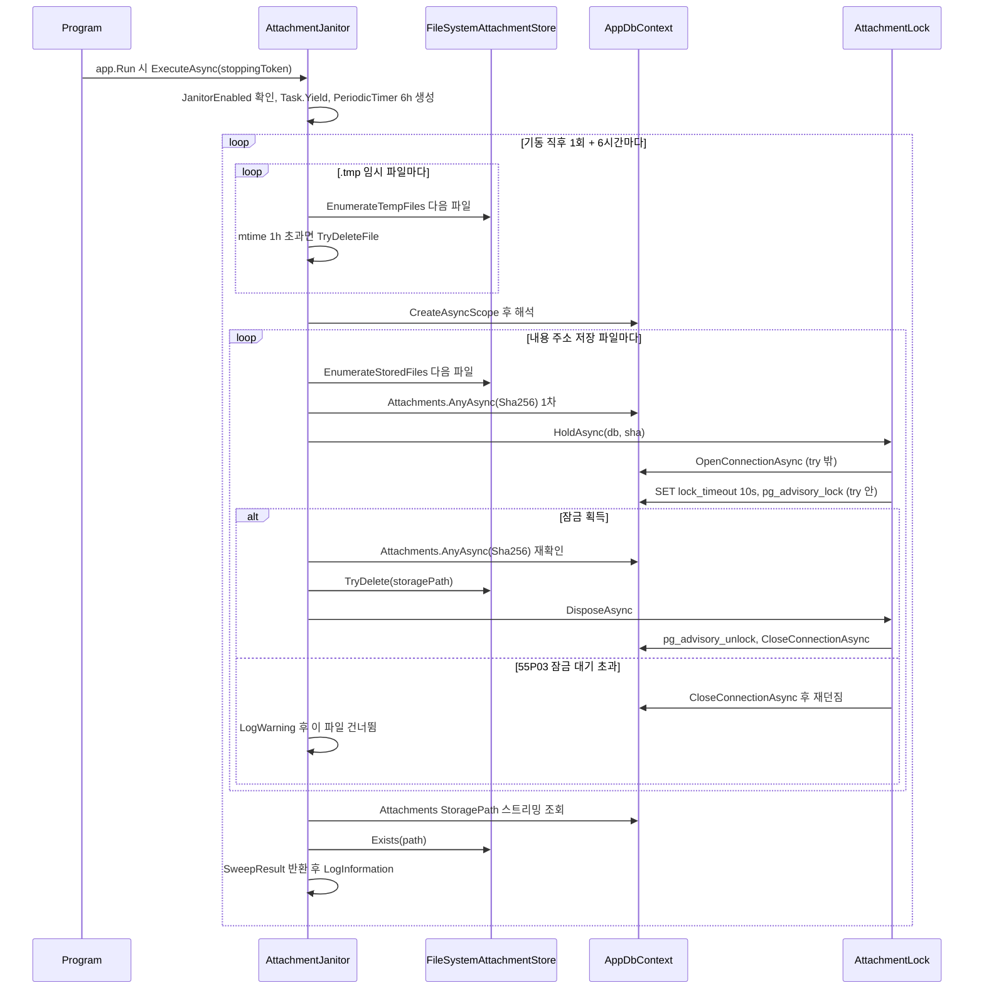
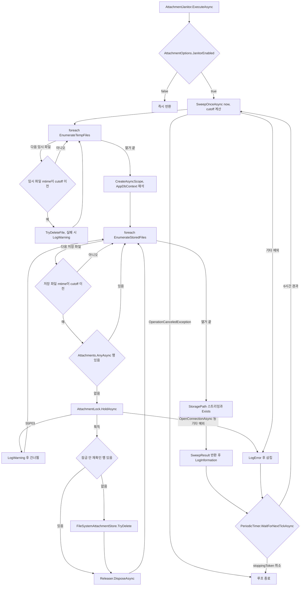

# F024 고아 첨부 파일 정리(백그라운드)

<!-- doc-harness:section id="summary" hash="7bc4b650f610e9552db1b09dd61b5fbaaddb5a8e35db7f776dfe0df9e4157705" -->
## 한 줄 요약

결론: F024의 AttachmentJanitor는 싱글턴이면서 호스티드 서비스로 등록되어 있고, 앱 기동 직후와 6시간마다 SweepOnceAsync를 실행한다. 코드상 실제로 동작하는 기능이다(ACTIVE). 스윕 한 번은 세 단계로 이루어진다. (1) 저장 루트의 .tmp 밑 모든 파일을 foreach로 돈다. 마지막 쓰기가 1시간보다 오래된 파일만 TryDeleteFile로 지우고, 열거가 끝난 뒤에야 다음 단계로 넘어간다. (2) 스윕 전용 스코프의 AppDbContext를 연 뒤 내용 주소 모양의 저장 파일을 돈다. 1시간보다 오래됐고 Attachments.Sha256 행이 없는 파일이면 AttachmentLock.HoldAsync로 sha256 세션 advisory lock을 잡는다(lock_timeout 10s). 잠금 안에서 행이 없음을 다시 확인한 뒤 FileSystemAttachmentStore.TryDelete로 지운다. (3) Attachments.StoragePath를 스트리밍으로 읽으며 파일이 없는 행을 센다. 결과 SweepResult(Temp/Orphans/Missing)는 LogInformation으로 남긴다. 파일 없는 행이 1건 이상이면 LogWarning도 하나 남긴다. 실패 처리: 55P03 잠금 대기 초과는 해당 파일만 건너뛴다. 임시 파일 삭제가 IO·권한 오류로 실패하면 경고를 남기고 계속한다. 그 밖의 예외(DB 연결 실패, try 밖 OpenConnectionAsync 실패, 손상된 StoragePath로 인한 PhysicalPath의 InvalidOperationException)는 스윕 전체를 중단시킨다. ExecuteAsync가 LogError로 남기고 다음 6시간 주기를 기다린다. 업로드·삭제(F009)도 같은 잠금 키로 직렬화된다. 삭제 엔드포인트는 파일 삭제에 실패하면 남은 고아 파일 처리를 이 청소 잡에 맡긴다. 이번 재검증에서는 F024_FLOW 다이어그램의 임시 파일 단계를 .tmp 전체를 도는 루프로 고쳤다. 코드 동작 자체는 이전 분석과 같다.

| 항목 | 값 |
|---|---|
| 중요도 | SUPPORTING |
| 상태 | ACTIVE |
| 진입점 | `BackgroundService AttachmentJanitor.ExecuteAsync (Program.cs AddHostedService 등록)`, `AttachmentJanitor.SweepOnceAsync (public, 테스트에서 직접 호출)` |
| 의존 기능 | [F009](../09_FEATURES.md#f009) |

### 진입점 근거

| 내용 | 상태 | 근거 |
|---|---|---|
| Program.cs는 AttachmentJanitor를 싱글턴으로 등록하고, 같은 인스턴스를 AddHostedService(sp => sp.GetRequiredService<AttachmentJanitor>())로 호스티드 서비스에 올린다. 테스트는 이 싱글턴을 꺼내 SweepOnceAsync를 직접 호출할 수 있다. | CONFIRMED | `PortfolioBlog.Api/Program.cs` (66-67) |
| 호스티드 서비스는 app.Run()에서 시작된다. EnsureRootIsWritable(79행)과 Database.Migrate(85행)가 app.Run()(126행)보다 먼저 실행되므로, 첫 스윕 시점에는 저장 루트 검증과 마이그레이션이 끝나 있다. | CONFIRMED | `PortfolioBlog.Api/Program.cs` (79-85), `PortfolioBlog.Api/Program.cs` (126) |
| BackgroundService 진입점은 AttachmentJanitor.ExecuteAsync(stoppingToken)이다. do-while 구조라서 기동 직후 1회 실행하고, 이후 PeriodicTimer(Interval=6시간)의 틱마다 반복한다. | CONFIRMED | `PortfolioBlog.Api/Infrastructure/Storage/AttachmentJanitor.cs` AttachmentJanitor.ExecuteAsync (48-67) |
| public 메서드 SweepOnceAsync(DateTimeOffset now, CancellationToken ct)는 테스트 진입점 역할도 한다. 테스트는 ApiFactory에서 Attachments:JanitorEnabled=false로 백그라운드 루프를 끄고 이 메서드를 직접 호출한다. | CONFIRMED | `PortfolioBlog.Api/Infrastructure/Storage/AttachmentJanitor.cs` AttachmentJanitor.SweepOnceAsync (83-124), `PortfolioBlog.Api.Tests/Infrastructure/ApiFactory.cs` (118), `PortfolioBlog.Api.Tests/Infrastructure/AttachmentJanitorTests.cs` (73, 112) |
<!-- /doc-harness:section -->

<!-- doc-harness:section id="flow" hash="c946d9fab3dd5bb842f99b336d25d7f14cd9a3b2dfce86cbf911f8bb9b5f7605" -->
## 처리 흐름

| 단계 | 컴포넌트 | 코드 | 설명 |
|---|---|---|---|
| 1 | Program | `PortfolioBlog.Api/Program.cs` top-level statements | AttachmentOptions를 설정 섹션 Attachments에 바인딩한다. FileSystemAttachmentStore와 AttachmentJanitor를 싱글턴으로 등록하고, AttachmentJanitor를 호스티드 서비스로 올린다(62-67). TimeProvider는 AuthServiceCollectionExtensions가 TryAddSingleton(TimeProvider.System)으로 제공한다. |
| 2 | Program | `PortfolioBlog.Api/Program.cs` app.Run | EnsureRootIsWritable과 마이그레이션이 끝나면 app.Run()이 호스트를 시작한다. 이때 BackgroundService.StartAsync가 ExecuteAsync를 호출한다. |
| 3 | AttachmentJanitor | `PortfolioBlog.Api/Infrastructure/Storage/AttachmentJanitor.cs` AttachmentJanitor.ExecuteAsync | JanitorEnabled가 false면 즉시 return한다. true면 Task.Yield로 비동기 전환해 호스트 시작을 막지 않는다. 그다음 PeriodicTimer(6시간)를 만들고 do-while 루프에 들어간다. |
| 4 | AttachmentJanitor | `PortfolioBlog.Api/Infrastructure/Storage/AttachmentJanitor.cs` AttachmentJanitor.SweepOnceAsync | clock.GetUtcNow()를 now로 받아 cutoff = now.UtcDateTime - MinimumAge(1시간)를 계산한다. |
| 5 | FileSystemAttachmentStore | `PortfolioBlog.Api/Infrastructure/Storage/FileSystemAttachmentStore.cs` FileSystemAttachmentStore.EnumerateTempFiles | {root}/.tmp 디렉터리가 있으면 파일을 스트리밍으로 열거한다(지연 평가 iterator). LinkTarget이 null이 아닌 심볼릭 링크는 건너뛴다. |
| 6 | AttachmentJanitor | `PortfolioBlog.Api/Infrastructure/Storage/AttachmentJanitor.cs` AttachmentJanitor.SweepOnceAsync / TryDeleteFile | foreach로 .tmp의 모든 파일을 돈다(87-90). 파일마다 File.GetLastWriteTimeUtc가 cutoff 이전인지 보고, 오래된 파일만 TryDeleteFile(File.Delete)로 지운다. 성공하면 temp를 증가시킨다. IOException·UnauthorizedAccessException이 나면 LogWarning을 남기고 false를 돌려준다. 열거가 끝난 뒤에야 다음 단계로 넘어간다. |
| 7 | AttachmentJanitor | `PortfolioBlog.Api/Infrastructure/Storage/AttachmentJanitor.cs` AttachmentJanitor.SweepOnceAsync | IServiceScopeFactory.CreateAsyncScope로 스윕 전용 스코프를 열고 AppDbContext를 해석한다(92-93). 싱글턴은 스코프 DbContext를 직접 주입받을 수 없기 때문이다. |
| 8 | FileSystemAttachmentStore | `PortfolioBlog.Api/Infrastructure/Storage/FileSystemAttachmentStore.cs` FileSystemAttachmentStore.EnumerateStoredFiles | 저장 루트에서 이름이 2자 소문자 hex이고 링크가 아닌 버킷 디렉터리만 연다. 그 안의 파일은 다음 조건을 모두 만족할 때만 (StoragePath, Sha256)으로 내보낸다: 이름 길이 66~70자, name[64]=='.', 소문자 hex sha, 버킷 접두사 일치, 영숫자 확장자, 링크가 아님. |
| 9 | AttachmentJanitor | `PortfolioBlog.Api/Infrastructure/Storage/AttachmentJanitor.cs` AttachmentJanitor.SweepOnceAsync | 파일마다 ct.ThrowIfCancellationRequested를 확인한다. PhysicalPath 기준 mtime이 cutoff 이후면 건너뛴다. 다음으로 db.Attachments.AnyAsync(a => a.Sha256 == sha)로 잠금 없이 1차 확인하고, 행이 있으면 건너뛴다(Sha256 UNIQUE 인덱스를 탄다). |
| 10 | AttachmentLock | `PortfolioBlog.Api/Infrastructure/Storage/AttachmentLock.cs` AttachmentLock.HoldAsync | try 블록 밖(52행)에서 OpenConnectionAsync로 연결을 고정한다. 그다음 try 블록(53-62행) 안에서 SET lock_timeout = '10s'와 SELECT pg_advisory_lock(hashtextextended('attachment:'+sha, 0))을 실행한다. catch에서 CloseConnectionAsync를 호출하고 다시 던지는 처리는 이 두 문장이 실패할 때만 적용된다. |
| 11 | AttachmentJanitor | `PortfolioBlog.Api/Infrastructure/Storage/AttachmentJanitor.cs` AttachmentJanitor.SweepOnceAsync | 잠금 안에서 AnyAsync로 다시 확인한다. 여전히 행이 없고 store.TryDelete(storagePath)가 true면 orphans를 증가시킨다(106). |
| 12 | FileSystemAttachmentStore | `PortfolioBlog.Api/Infrastructure/Storage/FileSystemAttachmentStore.cs` FileSystemAttachmentStore.TryDelete | PhysicalPath로 경로가 루트 안에 있는지 검사한 뒤 File.Delete를 호출한다. 파일이 없어도 true를 돌려준다. IOException·UnauthorizedAccessException이면 false를 돌려준다. |
| 13 | AttachmentLock | `PortfolioBlog.Api/Infrastructure/Storage/AttachmentLock.cs` Releaser.DisposeAsync | await using 블록이 끝나면 CancellationToken.None으로 pg_advisory_unlock을 실행한다. 실패는 삼키고, finally에서 CloseConnectionAsync로 연결을 반환한다. |
| 14 | AttachmentJanitor | `PortfolioBlog.Api/Infrastructure/Storage/AttachmentJanitor.cs` AttachmentJanitor.IsLockTimeout | HoldAsync나 잠금 블록이 PostgresException SqlState 55P03을 던지면(InnerException 체인까지 확인) StoragePath를 담은 LogWarning을 남기고 그 파일만 건너뛴 채 스윕을 계속한다. 55P03이 아닌 예외는 이 catch 필터를 통과하지 못해 SweepOnceAsync 밖으로 전파된다. |
| 15 | AttachmentJanitor | `PortfolioBlog.Api/Infrastructure/Storage/AttachmentJanitor.cs` AttachmentJanitor.SweepOnceAsync | 저장 파일 열거가 끝나면 db.Attachments.AsNoTracking().OrderBy(Id).Select(StoragePath)를 AsAsyncEnumerable로 스트리밍하며 store.Exists(path)가 false인 행을 센다. missing이 0보다 크면 LogWarning을 남기고 SweepResult(temp, orphans, missing)를 반환한다. |
| 16 | AttachmentJanitor | `PortfolioBlog.Api/Infrastructure/Storage/AttachmentJanitor.cs` AttachmentJanitor.ExecuteAsync | 성공하면 LogInformation(Temp/Orphans/MissingFiles)을 남긴다. OperationCanceledException이 아닌 예외는 LogError를 남기고 삼킨다. 이어서 timer.WaitForNextTickAsync(stoppingToken)로 다음 6시간 틱을 기다리며, 호스트가 종료되면 루프를 빠져나간다. |
<!-- /doc-harness:section -->

<!-- doc-harness:section id="F024_SEQUENCE" hash="8df0483097026e819d03c0f9057341971707daaf718b1926d0ba0fe74b1dda15" -->
## AttachmentJanitor 스윕 1회 호출 순서 (Sequence Diagram)

ExecuteAsync가 기동 직후와 6시간마다 SweepOnceAsync를 부른다. SweepOnceAsync는 임시 파일 루프, 저장 파일(고아) 루프, 누락 진단 스트리밍을 차례로 수행하고, 고아 삭제는 AttachmentLock 세션 잠금 안에서만 일어난다.

Program.cs가 AttachmentJanitor를 싱글턴과 호스티드 서비스로 등록하고, app.Run() 때 ExecuteAsync가 시작된다. 스윕은 세 단계로 순서대로 진행된다. (1) 임시 파일 루프는 EnumerateTempFiles가 내놓는 .tmp 파일을 전부 돌며, mtime이 cutoff 이전인 파일만 TryDeleteFile로 지운다. (2) 저장 파일 루프는 스윕 전용 스코프의 AppDbContext로 동작한다. 오래된 저장 파일마다 AnyAsync로 1차 확인하고, 행이 없을 때만 HoldAsync로 sha 잠금을 잡은 뒤 재확인하고 TryDelete를 호출한다. 편의상 1차 확인 뒤 HoldAsync를 그렸지만, 실제로는 mtime이 새 파일이거나 1차 확인에서 행이 있으면 잠금 없이 다음 파일로 넘어간다. OpenConnectionAsync는 HoldAsync의 try 밖에 있어, 실패하면 CloseConnectionAsync 없이 예외가 그대로 전파된다. (3) 누락 진단은 StoragePath를 스트리밍하며 Exists로 확인한다.

### 코드 근거

| 구성 요소 | 코드 |
|---|---|
| Program | `PortfolioBlog.Api/Program.cs` (AddSingleton/AddHostedService, app.Run) |
| AttachmentJanitor | `PortfolioBlog.Api/Infrastructure/Storage/AttachmentJanitor.cs` (ExecuteAsync / SweepOnceAsync / TryDeleteFile) |
| FileSystemAttachmentStore | `PortfolioBlog.Api/Infrastructure/Storage/FileSystemAttachmentStore.cs` (EnumerateTempFiles / EnumerateStoredFiles / TryDelete / Exists) |
| AppDbContext | `PortfolioBlog.Api/Infrastructure/Data/AppDbContext.cs` (Attachments) |
| AttachmentLock | `PortfolioBlog.Api/Infrastructure/Storage/AttachmentLock.cs` (HoldAsync / Releaser.DisposeAsync) |
<!-- /doc-harness:section -->

<!-- doc-harness:section id="F024_FLOW" hash="9fa4d33783365595ea0ed15e5166b0dcdc9b5413189ec261901948e7f4c59d4d" -->
## AttachmentJanitor 루프와 고아 판정·실패 분기 (Flowchart)

임시 파일 단계와 저장 파일 단계는 각각 열거가 끝날 때까지 도는 루프다. 임시 파일 열거가 끝나야 스코프 생성과 저장 파일 열거로 넘어간다. 55P03만 파일 단위로 건너뛰고, 그 밖의 예외는 스윕 전체를 LogError로 끝낸 뒤 다음 6시간 틱을 기다린다.

수정 사항: 이전 다이어그램은 임시 파일 하나를 판정한 뒤 곧바로 EnumerateStoredFiles로 넘어가는 것처럼 그려져 있었다. 실제 코드(SweepOnceAsync 87-90행)는 foreach (var file in store.EnumerateTempFiles())로 .tmp의 모든 파일을 돈다. 그래서 TempAge '아니오'와 TryDeleteFile 뒤에는 EnumerateTempFiles로 돌아가는 루프 간선을 두었다. 열거가 끝났을 때만 92행의 CreateAsyncScope를 거쳐 95행의 EnumerateStoredFiles로 넘어간다. 저장 파일 루프도 같은 방식으로 표현했다. mtime이 새 파일, 1차 확인에서 행이 있는 파일, 55P03으로 건너뛴 파일, 잠금 해제를 마친 파일은 모두 다음 저장 파일로 돌아간다. 열거가 끝나면 누락 진단(118-121행)으로 넘어간다. TryDeleteFile의 IO·권한 실패는 LogWarning만 남기고 루프를 계속한다. HoldAsync의 비-55P03 예외(try 밖 OpenConnectionAsync 실패 포함)와 SweepOnceAsync의 기타 예외는 ExecuteAsync의 catch에서 LogError로 끝난다. OperationCanceledException은 catch 필터에서 제외되어 루프를 종료시킨다. 다이어그램의 'SweepOnceAsync -->|기타 예외| LogError' 간선은 스윕 안 어느 단계에서 나든 같은 catch로 모인다는 뜻이다.

### 코드 근거

| 구성 요소 | 코드 |
|---|---|
| ExecuteAsync | `PortfolioBlog.Api/Infrastructure/Storage/AttachmentJanitor.cs` (AttachmentJanitor.ExecuteAsync) |
| JanitorEnabled | `PortfolioBlog.Api/Infrastructure/Storage/AttachmentOptions.cs` (AttachmentOptions.JanitorEnabled) |
| SweepOnceAsync | `PortfolioBlog.Api/Infrastructure/Storage/AttachmentJanitor.cs` (AttachmentJanitor.SweepOnceAsync) |
| EnumerateTempFiles | `PortfolioBlog.Api/Infrastructure/Storage/FileSystemAttachmentStore.cs` (FileSystemAttachmentStore.EnumerateTempFiles) |
| TryDeleteFile | `PortfolioBlog.Api/Infrastructure/Storage/AttachmentJanitor.cs` (AttachmentJanitor.TryDeleteFile) |
| CreateAsyncScope | `PortfolioBlog.Api/Infrastructure/Storage/AttachmentJanitor.cs` (SweepOnceAsync 92-93행) |
| EnumerateStoredFiles | `PortfolioBlog.Api/Infrastructure/Storage/FileSystemAttachmentStore.cs` (FileSystemAttachmentStore.EnumerateStoredFiles) |
| FirstAnyAsync | `PortfolioBlog.Api/Infrastructure/Storage/AttachmentJanitor.cs` (SweepOnceAsync 100행) |
| HoldAsync | `PortfolioBlog.Api/Infrastructure/Storage/AttachmentLock.cs` (AttachmentLock.HoldAsync) |
| LockTimeoutWarning | `PortfolioBlog.Api/Infrastructure/Storage/AttachmentJanitor.cs` (IsLockTimeout / 109-114행) |
| SecondAnyAsync | `PortfolioBlog.Api/Infrastructure/Storage/AttachmentJanitor.cs` (SweepOnceAsync 106행) |
| TryDelete | `PortfolioBlog.Api/Infrastructure/Storage/FileSystemAttachmentStore.cs` (FileSystemAttachmentStore.TryDelete) |
| ReleaserDispose | `PortfolioBlog.Api/Infrastructure/Storage/AttachmentLock.cs` (Releaser.DisposeAsync) |
| MissingScan | `PortfolioBlog.Api/Infrastructure/Storage/AttachmentJanitor.cs` (SweepOnceAsync 117-122행) |
| LogInformation | `PortfolioBlog.Api/Infrastructure/Storage/AttachmentJanitor.cs` (ExecuteAsync 59행) |
| LogError | `PortfolioBlog.Api/Infrastructure/Storage/AttachmentJanitor.cs` (ExecuteAsync 61-64행) |
| WaitForNextTickAsync | `PortfolioBlog.Api/Infrastructure/Storage/AttachmentJanitor.cs` (ExecuteAsync 66행) |
<!-- /doc-harness:section -->

<!-- doc-harness:section id="data" hash="9203be053c17d91ce56fc20fd68f6f90d3121538abb4065fce8648be9ed4abde" -->
## 데이터

### 데이터 흐름

| 내용 | 상태 | 근거 |
|---|---|---|
| 입력은 두 가지다. 첫째는 시각이다. 배경 루프는 TimeProvider.GetUtcNow()를 넘기고, 테스트는 임의의 now를 넘긴다. 둘째는 파일 시스템 상태다. 판정 기준값은 cutoff = now - 1시간이다. | CONFIRMED | `PortfolioBlog.Api/Infrastructure/Storage/AttachmentJanitor.cs` (58, 85) |
| 임시 파일 흐름: {root}/.tmp의 파일 전체 경로를 모두 열거하는 foreach 루프다. 파일마다 File.GetLastWriteTimeUtc가 cutoff 이전이면 File.Delete하고 temp 카운트를 올린다. 이 단계는 DB에 접근하지 않고, 열거가 끝난 뒤에야 DB 스코프를 연다. | CONFIRMED | `PortfolioBlog.Api/Infrastructure/Storage/AttachmentJanitor.cs` (86-93), `PortfolioBlog.Api/Infrastructure/Storage/FileSystemAttachmentStore.cs` EnumerateTempFiles (284-294) |
| 고아 파일 흐름: EnumerateStoredFiles가 파일 이름에서 (StoragePath 'ab/abcd….ext', Sha256)을 뽑는다. Attachments.Sha256으로 1차 조회한 뒤, sha로 advisory lock 키 'attachment:'+sha를 만들어 잠금을 잡고 2차 조회한다. 여전히 행이 없으면 파일을 지우고 orphans 카운트를 올린다. 행 존재 여부는 Sha256만으로 판정하며 StoragePath나 확장자는 비교하지 않는다. | CONFIRMED | `PortfolioBlog.Api/Infrastructure/Storage/AttachmentJanitor.cs` (95-115), `PortfolioBlog.Api/Infrastructure/Storage/AttachmentLock.cs` KeyFor (30) |
| 누락 진단 흐름: DB의 Attachments.StoragePath를 Id 순서로 스트리밍하면서 store.Exists(PhysicalPath)가 false인 행을 센다. 행을 수정하거나 삭제하지는 않는다. | CONFIRMED | `PortfolioBlog.Api/Infrastructure/Storage/AttachmentJanitor.cs` (117-122) |
| 출력은 SweepResult(TempFilesDeleted, OrphanFilesDeleted, RowsMissingFiles)다. 배경 루프는 이 값을 로그로만 남기고 버리며, 따로 저장하거나 외부로 노출하지 않는다. | CONFIRMED | `PortfolioBlog.Api/Infrastructure/Storage/AttachmentJanitor.cs` (12, 58-59, 123) |
| 업로드(F009)는 잠금 안에서 행을 넣는다. 삭제(F009)는 잠금 안에서 행을 지운 뒤 store.TryDelete를 호출하고, 실패하면 '첨부 파일 삭제 실패(고아 파일)' LogWarning을 남긴 채 그 파일을 고아로 남겨 청소 잡에 맡긴다. 따라서 청소 잡과 업로드·삭제는 같은 sha 잠금 키로 직렬화된다. | CONFIRMED | `PortfolioBlog.Api/Features/Attachments/AttachmentEndpoints.cs` (142), `PortfolioBlog.Api/Features/Attachments/AttachmentEndpoints.cs` (204-209) |

### DB 접근

| 엔티티 | 작업 | 코드 |
|---|---|---|
| Attachments | SELECT | `PortfolioBlog.Api/Infrastructure/Storage/AttachmentJanitor.cs` SweepOnceAsync — db.Attachments.AnyAsync(a => a.Sha256 == sha) 잠금 전 1차 확인 |
| Attachments | SELECT | `PortfolioBlog.Api/Infrastructure/Storage/AttachmentJanitor.cs` SweepOnceAsync — 잠금 안 AnyAsync 재확인 |
| Attachments | SELECT | `PortfolioBlog.Api/Infrastructure/Storage/AttachmentJanitor.cs` SweepOnceAsync — AsNoTracking().OrderBy(Id).Select(StoragePath).AsAsyncEnumerable() 누락 진단 |
| pg_advisory_lock(hashtextextended('attachment:'+sha, 0)) 세션 잠금 | SELECT | `PortfolioBlog.Api/Infrastructure/Storage/AttachmentLock.cs` AttachmentLock.HoldAsync |
| pg_advisory_unlock(hashtextextended('attachment:'+sha, 0)) | SELECT | `PortfolioBlog.Api/Infrastructure/Storage/AttachmentLock.cs` Releaser.DisposeAsync |

### 상태 전이

| 이전 | 다음 | 트리거 | 근거 |
|---|---|---|---|
| 호스트 시작(ExecuteAsync 진입) | 종료(비활성) | AttachmentOptions.JanitorEnabled == false | `PortfolioBlog.Api/Infrastructure/Storage/AttachmentJanitor.cs` (50) |
| 호스트 시작(ExecuteAsync 진입) | 스윕 실행 중 | JanitorEnabled == true이고 Task.Yield 이후 첫 do 반복(기동 직후) | `PortfolioBlog.Api/Infrastructure/Storage/AttachmentJanitor.cs` (51-58) |
| 스윕 실행 중 | 다음 틱 대기 | SweepOnceAsync 성공(LogInformation) 또는 취소가 아닌 예외(LogError 후 삼킴) | `PortfolioBlog.Api/Infrastructure/Storage/AttachmentJanitor.cs` (56-66) |
| 다음 틱 대기 | 스윕 실행 중 | PeriodicTimer.WaitForNextTickAsync가 true를 반환(6시간 경과) | `PortfolioBlog.Api/Infrastructure/Storage/AttachmentJanitor.cs` (53, 66) |
| 다음 틱 대기 / 스윕 실행 중 | 종료 | stoppingToken 취소로 OperationCanceledException 발생(catch 필터가 제외하므로 전파됨) | `PortfolioBlog.Api/Infrastructure/Storage/AttachmentJanitor.cs` (61, 66, 97) |
| 고아 후보 파일(존재, 참조 행 없음, 1시간 초과) | 삭제됨 | 잠금 안 재조회에서도 행이 없고 TryDelete가 true를 반환 | `PortfolioBlog.Api/Infrastructure/Storage/AttachmentJanitor.cs` (103-107) |
| 고아 후보 파일 | 유지(다음 스윕에 다시 후보) | 잠금 대기 55P03, 잠금 안에서 행 발견, 또는 TryDelete가 false | `PortfolioBlog.Api/Infrastructure/Storage/AttachmentJanitor.cs` (106-114) |
| sha256 advisory lock 미보유 | 보유 | AttachmentLock.HoldAsync에서 OpenConnectionAsync(try 밖) 후 try 안의 SET lock_timeout·pg_advisory_lock 성공 | `PortfolioBlog.Api/Infrastructure/Storage/AttachmentLock.cs` (48-64) |
| sha256 advisory lock 보유 | 해제 | Releaser.DisposeAsync의 pg_advisory_unlock. UNLOCK이 실패하면 연결이 폐기될 때, 또는 그 물리 연결이 다음에 재사용될 때 늦게 풀린다(주석에 적힌 측정과 추론) | `PortfolioBlog.Api/Infrastructure/Storage/AttachmentLock.cs` Releaser.DisposeAsync (69-100) |
| 오래된 .tmp 임시 파일 | 삭제됨 | mtime < cutoff이고 File.Delete 성공 | `PortfolioBlog.Api/Infrastructure/Storage/AttachmentJanitor.cs` (87-90, 140-152) |

### 외부 의존

| 내용 | 상태 | 근거 |
|---|---|---|
| PostgreSQL 세션 advisory lock(pg_advisory_lock/pg_advisory_unlock, hashtextextended)과 세션 설정 SET lock_timeout = '10s'에 의존한다. 잠금 대기가 한도를 넘으면 Npgsql PostgresException SqlState 55P03이 발생한다. | CONFIRMED | `PortfolioBlog.Api/Infrastructure/Storage/AttachmentLock.cs` (55-56, 76), `PortfolioBlog.Api/Infrastructure/Storage/AttachmentJanitor.cs` IsLockTimeout (130-137) |
| 로컬 파일 시스템(Attachments:RootPath가 가리키는 볼륨)에 의존한다. Directory.EnumerateDirectories/EnumerateFiles, File.GetLastWriteTimeUtc, File.Delete, File.Exists를 동기 I/O로 호출하고, FileInfo/DirectoryInfo.LinkTarget으로 링크 여부를 판정한다. | CONFIRMED | `PortfolioBlog.Api/Infrastructure/Storage/FileSystemAttachmentStore.cs` (284-332), `PortfolioBlog.Api/Infrastructure/Storage/AttachmentJanitor.cs` (89, 98, 144) |
| .NET 제네릭 호스트의 BackgroundService, PeriodicTimer, IServiceScopeFactory, TimeProvider를 쓴다. TimeProvider는 AddAdminAuth 안에서 TryAddSingleton(TimeProvider.System)으로 등록된다. | CONFIRMED | `PortfolioBlog.Api/Infrastructure/Storage/AttachmentJanitor.cs` (28-29, 53), `PortfolioBlog.Api/Infrastructure/Access/AuthServiceCollectionExtensions.cs` (44) |
| DB 접근은 EF Core(AppDbContext)와 Npgsql을 거친다. 스윕마다 새 스코프의 AppDbContext를 쓴다. | CONFIRMED | `PortfolioBlog.Api/Infrastructure/Storage/AttachmentJanitor.cs` (92-93) |
<!-- /doc-harness:section -->

<!-- doc-harness:section id="failures" hash="4adfa8db818f0a3ebc9306f5726ad5c0969879e7c024c16b929e10b8f04cc10f" -->
## 실패 지점

| 위치 | 조건 | 처리 | 상태 | 근거 |
|---|---|---|---|---|
| AttachmentJanitor.ExecuteAsync | SweepOnceAsync가 OperationCanceledException이 아닌 예외를 던짐(DB 연결 실패, 손상된 경로 등) | catch (Exception ex) when (ex is not OperationCanceledException)에서 LogError를 남기고 삼킨다. 짧은 간격의 재시도는 없고, 다음 PeriodicTimer 틱(6시간 뒤)에 다시 시도한다. 이미 지운 파일은 되돌리지 않으며, 그 스윕의 카운트 로그는 남지 않는다. | CONFIRMED | `PortfolioBlog.Api/Infrastructure/Storage/AttachmentJanitor.cs` (56-66) |
| AttachmentJanitor.SweepOnceAsync → AttachmentLock.HoldAsync | 다른 요청이 같은 sha를 잠그고 있어 lock_timeout 10초를 넘김(SqlState 55P03) | pg_advisory_lock은 HoldAsync의 try 안에 있으므로 CloseConnectionAsync를 먼저 호출한 뒤 예외를 다시 던진다. Janitor의 IsLockTimeout은 InnerException 체인까지 확인한다. 55P03이면 StoragePath를 담은 LogWarning을 남기고 그 파일만 건너뛰며 스윕을 계속한다. 코드 주석에 따르면 이 분기는 테스트하지 않았다. | CONFIRMED | `PortfolioBlog.Api/Infrastructure/Storage/AttachmentJanitor.cs` (101-114, 130-137), `PortfolioBlog.Api/Infrastructure/Storage/AttachmentJanitor.cs` (79-80), `PortfolioBlog.Api/Infrastructure/Storage/AttachmentLock.cs` (53-62) |
| AttachmentLock.HoldAsync (try 블록 53-62행) | SET lock_timeout 또는 pg_advisory_lock이 55P03이 아닌 예외로 실패(연결 끊김, 취소 등) | catch에서 CloseConnectionAsync를 호출한 뒤 예외를 다시 던진다. Janitor는 55P03만 잡으므로 스윕 전체가 중단되고, ExecuteAsync가 LogError를 남긴다. 뒤따르는 누락 진단도 그 주기에는 실행되지 않는다. | CONFIRMED | `PortfolioBlog.Api/Infrastructure/Storage/AttachmentLock.cs` (53-62), `PortfolioBlog.Api/Infrastructure/Storage/AttachmentJanitor.cs` (109) |
| AttachmentLock.HoldAsync (52행, try 블록 밖) | db.Database.OpenConnectionAsync(ct)가 실패(DB 연결 불가, 풀 고갈, 취소 등) | 처리 없음(예외 전파). OpenConnectionAsync는 try 앞에 있어서 HoldAsync의 catch와 CloseConnectionAsync를 거치지 않고 예외가 호출부로 그대로 전파된다. 55P03이 아니므로 IsLockTimeout 필터도 통과하지 못한다. 스윕 전체가 중단되고 ExecuteAsync가 LogError를 남긴다. 취소로 인한 OperationCanceledException이면 루프가 종료된다. | POTENTIAL_ISSUE | `PortfolioBlog.Api/Infrastructure/Storage/AttachmentLock.cs` (52-53), `PortfolioBlog.Api/Infrastructure/Storage/AttachmentJanitor.cs` (61, 109) |
| AttachmentLock.Releaser.DisposeAsync | pg_advisory_unlock 실행 실패 | 빈 catch로 삼키며 로그도 남기지 않는다. finally에서 CloseConnectionAsync를 호출한다. 주석에 따르면 잠금은 연결이 폐기될 때, 또는 그 물리 연결이 재사용될 때 늦게 풀린다(Npgsql 내부 동작은 추론). | CONFIRMED | `PortfolioBlog.Api/Infrastructure/Storage/AttachmentLock.cs` (71-99) |
| AttachmentJanitor.TryDeleteFile | 오래된 임시 파일의 File.Delete가 IOException 또는 UnauthorizedAccessException으로 실패 | 파일 이름만 담은 LogWarning을 남기고 false를 돌려주며 카운트하지 않는다. 임시 파일 루프는 다음 파일로 계속 진행하고, 이 파일은 다음 스윕에서 다시 시도한다. 그 밖의 예외 타입은 스윕 전체로 전파된다. | CONFIRMED | `PortfolioBlog.Api/Infrastructure/Storage/AttachmentJanitor.cs` (87-90, 140-152) |
| AttachmentJanitor.SweepOnceAsync → FileSystemAttachmentStore.TryDelete | 고아 파일 삭제가 IO 또는 권한 오류로 실패해 false 반환 | orphans를 증가시키지 않을 뿐, Janitor 쪽에는 로그가 없다. 삭제 실패가 반복돼도 LogInformation의 Orphans 수치가 기대보다 작게 나오는 것 말고는 드러나지 않는다. | POTENTIAL_ISSUE | `PortfolioBlog.Api/Infrastructure/Storage/AttachmentJanitor.cs` (106), `PortfolioBlog.Api/Infrastructure/Storage/FileSystemAttachmentStore.cs` TryDelete (166-175) |
| AttachmentJanitor.SweepOnceAsync 누락 진단 루프 → FileSystemAttachmentStore.Exists → PhysicalPath | DB의 StoragePath 값이 손상돼 저장 루트 밖을 가리킴. StoragePath에는 HasMaxLength(80) 외에 CHECK 제약이 없다(CHECK는 Size·Sha256·ContentType·FileName에만 있다). | 처리 없음(예외 전파). PhysicalPath가 InvalidOperationException을 던져 SweepOnceAsync 전체가 실패하고, ExecuteAsync가 LogError를 남긴다. 그런 행이 남아 있는 한 매 주기 같은 실패가 반복되어 누락 경고와 결과 로그가 계속 사라진다. 앞 단계의 파일 삭제는 이미 수행된 상태다. | POTENTIAL_ISSUE | `PortfolioBlog.Api/Infrastructure/Storage/AttachmentJanitor.cs` (118-121), `PortfolioBlog.Api/Infrastructure/Storage/FileSystemAttachmentStore.cs` PhysicalPath (136-147), `PortfolioBlog.Api/Infrastructure/Data/AppDbContext.cs` (151, 155-161) |
| AttachmentJanitor.SweepOnceAsync — db.Attachments.AnyAsync 및 스트리밍 조회 | DB 연결 불가 또는 쿼리 실패 | 처리 없음(예외 전파). ExecuteAsync가 LogError를 남기고 6시간 뒤에 다시 시도한다. | CONFIRMED | `PortfolioBlog.Api/Infrastructure/Storage/AttachmentJanitor.cs` (100, 118) |
| FileSystemAttachmentStore.EnumerateStoredFiles / EnumerateTempFiles | 열거 도중 버킷 디렉터리나 .tmp가 사라짐(DirectoryNotFoundException), 또는 열거 권한 오류 | 처리 없음(예외 전파). 스윕이 실패하고 LogError가 남는다. 주석에 따르면 이 코드베이스에는 버킷이나 루트를 지우는 경로가 없다. | INFERRED | `PortfolioBlog.Api/Infrastructure/Storage/FileSystemAttachmentStore.cs` (302, 311-332) |
| AttachmentJanitor.SweepOnceAsync | 호스트 종료로 stoppingToken 취소 | 저장 파일 반복마다 ct.ThrowIfCancellationRequested를 확인하고, EF 호출에도 ct를 넘긴다. OperationCanceledException은 catch 필터에서 제외되므로 ExecuteAsync 밖으로 전파되어 루프가 끝난다. 임시 파일 삭제 루프는 ct를 확인하지 않는다. | CONFIRMED | `PortfolioBlog.Api/Infrastructure/Storage/AttachmentJanitor.cs` (61, 87-90, 97) |

### 엣지 케이스

| 내용 | 상태 | 근거 |
|---|---|---|
| 마지막 쓰기가 1시간(MinimumAge) 이내인 임시 파일과 저장 파일은 건드리지 않는다. 진행 중인 업로드이거나 방금 옮겨진 파일일 수 있기 때문이다. 테스트는 새 고아 파일과 새 임시 파일이 남는 것을 확인한다. | CONFIRMED | `PortfolioBlog.Api/Infrastructure/Storage/AttachmentJanitor.cs` (32, 89, 98), `PortfolioBlog.Api.Tests/Infrastructure/AttachmentJanitorTests.cs` (73-81) |
| 내용 주소 규칙에 맞지 않는 파일은 오래됐어도 지우지 않는다. 사람이 둔 파일, 대문자 hex 이름, 버킷 접두사가 맞지 않는 파일, 시작 확인 파일 등이 여기에 해당한다. 심볼릭 링크나 정션인 버킷과 파일은 따라가지 않는다. 테스트는 정션 버킷이 가리키는 루트 밖 파일이 보존되는지 확인한다. | CONFIRMED | `PortfolioBlog.Api/Infrastructure/Storage/FileSystemAttachmentStore.cs` EnumerateStoredFiles (311-332), `PortfolioBlog.Api.Tests/Infrastructure/AttachmentJanitorTests.cs` Sweep_DoesNotFollowASymbolicLinkBucket_ToDeleteFilesOutsideTheRoot (89-114) |
| 열거한 뒤 잠금을 잡기 전에 같은 내용의 업로드가 행을 넣었다면, 잠금 안 재조회에서 행이 발견되어 파일을 지우지 않는다. | CONFIRMED | `PortfolioBlog.Api/Infrastructure/Storage/AttachmentJanitor.cs` (103-107), `PortfolioBlog.Api/Features/Attachments/AttachmentEndpoints.cs` (142) |
| 고아 판정은 Sha256만 비교한다. 행은 sha.png를 가리키는데 sha가 같고 확장자만 다른 오래된 파일 sha.jpg가 있으면, 행이 존재하므로 그 파일은 아무도 참조하지 않아도 계속 남는다. | CONFIRMED | `PortfolioBlog.Api/Infrastructure/Storage/AttachmentJanitor.cs` (100, 106) |
| TryDelete는 이미 없는 파일에도 true를 돌려준다. 그래서 열거와 삭제 사이에 다른 요청이 같은 파일을 지웠다면 OrphanFilesDeleted가 중복 집계될 수 있다. 코드 주석은 이것이 안전 문제는 아니라고 설명하며, 재현 테스트는 없다고 적고 있다. | CONFIRMED | `PortfolioBlog.Api/Infrastructure/Storage/AttachmentJanitor.cs` (78), `PortfolioBlog.Api/Infrastructure/Storage/FileSystemAttachmentStore.cs` (151, 166-175) |
| 열거한 뒤 GetLastWriteTimeUtc를 호출하기 전에 파일이 사라지면, .NET은 없는 파일에 대해 1601-01-01 UTC를 돌려주는 것으로 알려져 있다. 그러면 '오래됨'으로 판정돼 삭제 경로로 들어간다. File.Delete는 아무 일도 하지 않지만 카운트는 올라갈 수 있다(.NET 동작에 근거한 추론). | INFERRED | `PortfolioBlog.Api/Infrastructure/Storage/AttachmentJanitor.cs` (89, 98) |
| 행은 있는데 파일이 없는 불일치는 고치지 않고 개수만 경고한다. 테스트는 RowsMissingFiles=1을 확인한다. | CONFIRMED | `PortfolioBlog.Api/Infrastructure/Storage/AttachmentJanitor.cs` (11, 117-122), `PortfolioBlog.Api.Tests/Infrastructure/AttachmentJanitorTests.cs` (75) |
| PeriodicTimer는 스윕이 Interval보다 오래 걸려도 틱을 겹쳐 실행하지 않는다. 다만 잠긴 후보가 많으면 후보마다 최대 10초씩 대기가 쌓여 스윕이 길어질 수 있다. | CONFIRMED | `PortfolioBlog.Api/Infrastructure/Storage/AttachmentJanitor.cs` (25, 52-53) |
| JanitorEnabled=false이면 배경 루프는 아무 일도 하지 않는다. 그래도 싱글턴은 등록돼 있어 SweepOnceAsync를 직접 호출할 수 있다. 운영 기본값은 true이고, 테스트(ApiFactory)는 false로 둔다. | CONFIRMED | `PortfolioBlog.Api/Infrastructure/Storage/AttachmentJanitor.cs` (50), `PortfolioBlog.Api/Infrastructure/Storage/AttachmentOptions.cs` (13), `PortfolioBlog.Api.Tests/Infrastructure/ApiFactory.cs` (118) |
| .tmp 디렉터리나 저장 루트가 없으면 열거가 빈 시퀀스를 돌려주므로, 해당 단계는 0건으로 조용히 끝난다. | CONFIRMED | `PortfolioBlog.Api/Infrastructure/Storage/FileSystemAttachmentStore.cs` (286, 313) |

### 로깅

| 내용 | 상태 | 근거 |
|---|---|---|
| 스윕이 성공할 때마다 LogInformation "첨부 청소. Temp={Temp} Orphans={Orphans} MissingFiles={Missing}"을 남긴다. | CONFIRMED | `PortfolioBlog.Api/Infrastructure/Storage/AttachmentJanitor.cs` (59) |
| 스윕이 실패하면 LogError(ex, "첨부 청소 실패. 다음 주기에 다시 시도한다.")를 남긴다. | CONFIRMED | `PortfolioBlog.Api/Infrastructure/Storage/AttachmentJanitor.cs` (63) |
| 잠금 대기가 초과되면 LogWarning(ex, "고아 파일 후보의 잠금 대기 시간 초과…", StoragePath)를 남긴다. | CONFIRMED | `PortfolioBlog.Api/Infrastructure/Storage/AttachmentJanitor.cs` (113) |
| 파일이 없는 행이 1건 이상이면 LogWarning("파일이 없는 첨부 행 {Count}건…")을 남긴다. | CONFIRMED | `PortfolioBlog.Api/Infrastructure/Storage/AttachmentJanitor.cs` (122) |
| 임시 파일 삭제에 실패하면 LogWarning("임시 파일 정리 실패. TempFile={TempFile}")을 남긴다. 파일 이름만 기록하고 예외 객체는 넘기지 않는다. | CONFIRMED | `PortfolioBlog.Api/Infrastructure/Storage/AttachmentJanitor.cs` (149) |
| 고아 파일 삭제 실패(TryDelete false)와 advisory UNLOCK 실패는 둘 다 로그를 남기지 않는다. | POTENTIAL_ISSUE | `PortfolioBlog.Api/Infrastructure/Storage/AttachmentJanitor.cs` (106), `PortfolioBlog.Api/Infrastructure/Storage/AttachmentLock.cs` (78-94) |
<!-- /doc-harness:section -->

<!-- doc-harness:section id="code" hash="38e303ad944b07cace25462c80842768effc1d48d68939821a7ff0fb7c5142a9" -->
## 관련 코드

| 파일 | 심볼 | 역할 |
|---|---|---|
| `PortfolioBlog.Api/Infrastructure/Storage/AttachmentJanitor.cs` | AttachmentJanitor.ExecuteAsync | entry |
| `PortfolioBlog.Api/Infrastructure/Storage/AttachmentJanitor.cs` | AttachmentJanitor.SweepOnceAsync | service |
| `PortfolioBlog.Api/Infrastructure/Storage/AttachmentJanitor.cs` | SweepResult | dto |
| `PortfolioBlog.Api/Infrastructure/Storage/AttachmentJanitor.cs` | AttachmentJanitor.IsLockTimeout | validation |
| `PortfolioBlog.Api/Infrastructure/Storage/AttachmentJanitor.cs` | AttachmentJanitor.TryDeleteFile | service |
| `PortfolioBlog.Api/Infrastructure/Storage/AttachmentLock.cs` | AttachmentLock.HoldAsync | service |
| `PortfolioBlog.Api/Infrastructure/Storage/AttachmentLock.cs` | AttachmentLock.Releaser.DisposeAsync | service |
| `PortfolioBlog.Api/Infrastructure/Storage/FileSystemAttachmentStore.cs` | FileSystemAttachmentStore.EnumerateTempFiles | data |
| `PortfolioBlog.Api/Infrastructure/Storage/FileSystemAttachmentStore.cs` | FileSystemAttachmentStore.EnumerateStoredFiles | validation |
| `PortfolioBlog.Api/Infrastructure/Storage/FileSystemAttachmentStore.cs` | FileSystemAttachmentStore.TryDelete | data |
| `PortfolioBlog.Api/Infrastructure/Storage/FileSystemAttachmentStore.cs` | FileSystemAttachmentStore.Exists | data |
| `PortfolioBlog.Api/Infrastructure/Storage/FileSystemAttachmentStore.cs` | FileSystemAttachmentStore.PhysicalPath | validation |
| `PortfolioBlog.Api/Infrastructure/Storage/AttachmentOptions.cs` | AttachmentOptions.JanitorEnabled | config |
| `PortfolioBlog.Api/Program.cs` | AddHostedService<AttachmentJanitor> | config |
| `PortfolioBlog.Api/Infrastructure/Access/AuthServiceCollectionExtensions.cs` | TryAddSingleton(TimeProvider.System) | config |
| `PortfolioBlog.Api/Infrastructure/Data/AppDbContext.cs` | AppDbContext.OnModelCreating (Attachment: Sha256 UNIQUE) | data |
| `PortfolioBlog.Api/Features/Attachments/AttachmentEndpoints.cs` | UploadAsync / DeleteAsync (같은 AttachmentLock 사용) | service |
| `PortfolioBlog.Api.Tests/Infrastructure/AttachmentJanitorTests.cs` | AttachmentJanitorTests | test |
| `PortfolioBlog.Api.Tests/Infrastructure/ApiFactory.cs` | ApiFactory.ConfigureWebHost (JanitorEnabled=false) | test |

근거: `PortfolioBlog.Api/Infrastructure/Storage/AttachmentJanitor.cs` AttachmentJanitor (28-153), `PortfolioBlog.Api/Infrastructure/Storage/AttachmentLock.cs` AttachmentLock.HoldAsync (48-101), `PortfolioBlog.Api/Infrastructure/Storage/FileSystemAttachmentStore.cs` EnumerateTempFiles / EnumerateStoredFiles / TryDelete / Exists / PhysicalPath (136-175, 272-335), `PortfolioBlog.Api/Infrastructure/Storage/AttachmentOptions.cs` AttachmentOptions.JanitorEnabled (13), `PortfolioBlog.Api/Program.cs` (62-67, 79-85, 126), `PortfolioBlog.Api/Infrastructure/Data/AppDbContext.cs` Attachment 매핑 (147-162), `PortfolioBlog.Api/Features/Attachments/AttachmentEndpoints.cs` (142, 204-209), `PortfolioBlog.Api/Infrastructure/Access/AuthServiceCollectionExtensions.cs` (44), `PortfolioBlog.Api.Tests/Infrastructure/AttachmentJanitorTests.cs` (33-114), `PortfolioBlog.Api.Tests/Infrastructure/ApiFactory.cs` (118)
<!-- /doc-harness:section -->

<!-- doc-harness:section id="unknowns" hash="42997675d8257656de279d0867c9038dcc5d2a3590aa10051f0fd3a805d13c76" -->
## 확인하지 못한 것

- 55P03 잠금 대기 초과 분기가 실제로 어떻게 동작하는지는 테스트로 확인되지 않았다(코드 주석이 미검증이라고 밝힌다).
- UNLOCK 실패 시 advisory lock이 늦게 풀린다는 설명은 개발 PC에서의 측정과 Npgsql 내부에 대한 추론에 근거한다. 운영 Linux 컨테이너에서의 동작은 확인하지 못했다.
- OpenConnectionAsync가 실패할 때 EF Core·Npgsql이 부분적으로 열린 연결을 내부에서 정리하는지는 라이브러리 내부 동작이라 코드로 확인할 수 없다. HoldAsync 자체는 이 경우 CloseConnectionAsync를 호출하지 않는다.
- 운영 환경에서 '파일이 없는 첨부 행' 경고나 '첨부 청소 실패' LogError를 모니터링하거나 알림으로 보내는지는 코드에서 확인할 수 없다.
- 운영 볼륨의 파일 수와 스윕 1회 소요 시간(파일마다 동기 I/O와 DB 조회 1회)에 대한 측정 근거가 없다.
- Host의 BackgroundServiceExceptionBehavior 설정은 코드에서 찾지 못했다(기본값으로 추정). 취소가 원인이 아닌 OperationCanceledException이 ExecuteAsync 밖으로 나갈 때 호스트가 어떻게 반응하는지는 확인하지 못했다.
- 운영 컨테이너에서 파일 mtime을 기록하는 시계와 TimeProvider.System 사이에 차이가 있는지(볼륨 마운트 등)는 확인할 수 없다.
<!-- /doc-harness:section -->

<!-- doc-harness:section id="related" hash="e6b04ee08cc1bd1a2625cbb81ca24992b9da0467258ba6539a8ab5b4aeff04d8" -->
## 관련 문서

- [../09_FEATURES](../09_FEATURES.md)
- [../08_API](../08_API.md)
- [../07_DATA_MODEL](../07_DATA_MODEL.md)
- [../11_FAILURE_HISTORY](../11_FAILURE_HISTORY.md)
<!-- /doc-harness:section -->
