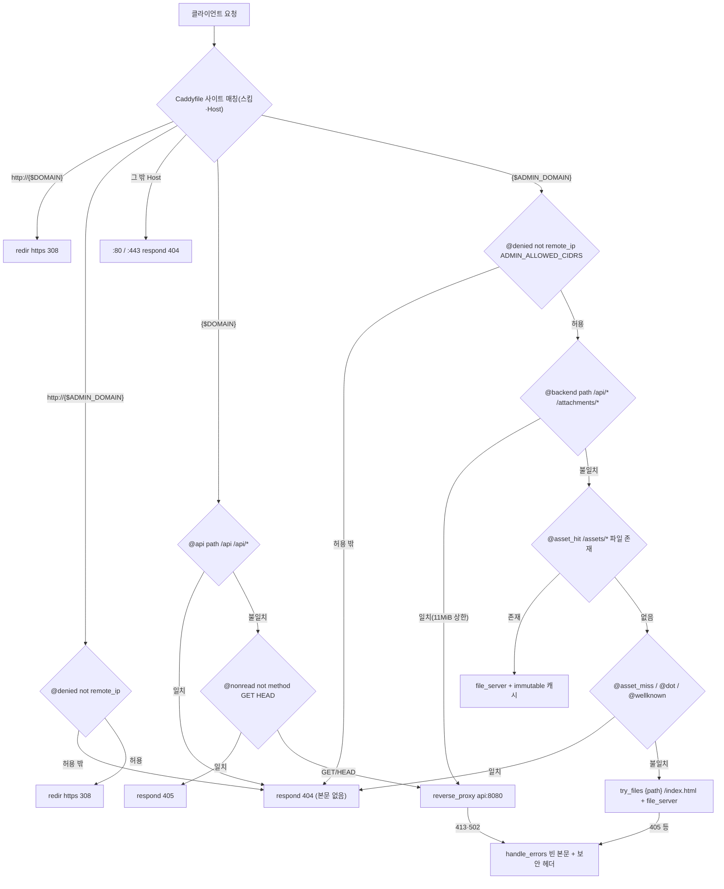
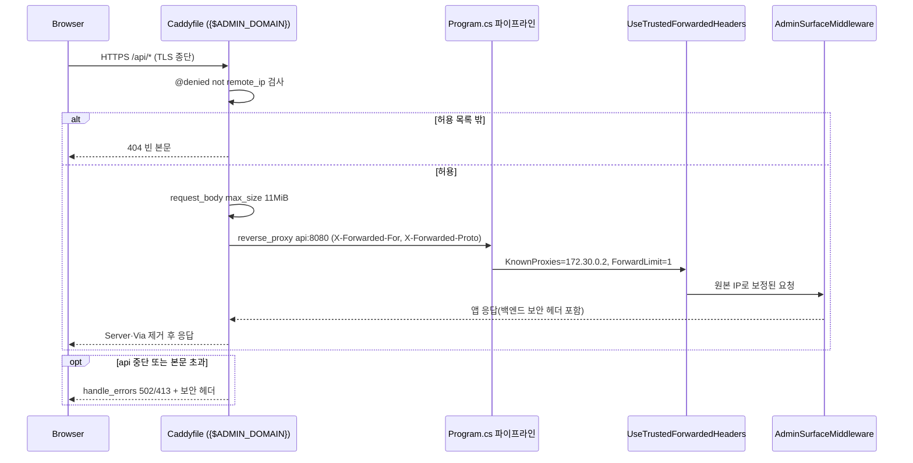
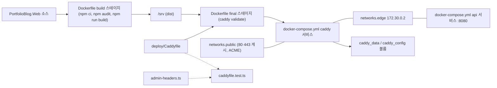

# F025 에지 프록시·TLS·관리 SPA 정적 서빙

<!-- doc-harness:section id="summary" hash="7c6b3efe74a69d484e53f27b50f2460b8894d6bdf56fba7903f6d2824db9af52" -->
## 한 줄 요약

결론: 이 기능은 애플리케이션 코드가 아니라 선언형 Caddy 설정(deploy/Caddyfile)과 그것을 관리 SPA 빌드 산출물과 함께 굽는 멀티스테이지 이미지(PortfolioBlog.Web/Dockerfile)로 구현된다. Caddy는 사이트 블록 5종({$DOMAIN}, http://{$DOMAIN}, {$ADMIN_DOMAIN}, http://{$ADMIN_DOMAIN}, :80/:443 캐치올)으로 Host별 라우팅을 하고, 전역 옵션으로 관리 API 비활성(admin off)·h1/h2만·read_header 10s/read_body 120s/idle 2m 타임아웃을 건다. 공개 도메인: /api·/api/*는 404, GET·HEAD 외 405, 64KB request_body 상한 후 zstd/gzip 인코딩과 reverse_proxy api:8080. 관리 도메인: remote_ip 허용 목록 게이트(평문 포함) → /api/*·/attachments/*만 11MiB 상한으로 api:8080 → 그 외는 /srv 정적 SPA(CSP 등 7개 보안 헤더, /assets/* 존재 시 immutable 캐시·부재 시 404, 점 경로·/.well-known/* 404, try_files {path} /index.html 폴백과 Cache-Control no-cache). 모든 사이트는 Server·Via를 제거하며, route가 아닌 오류 경로(413·502·file_server 405)는 handle_errors가 같은 보안 헤더와 빈 본문으로 응답한다. 백엔드는 Proxy__TrustedIp=172.30.0.2(caddy 고정 IP)만 X-Forwarded-For 송신자로 신뢰해(ForwardLimit=1) 원본 IP를 복원한다. 관리 SPA 헤더 값은 admin-headers.ts가 정본이고 caddyfile.test.ts가 글자 단위로 비교하며, 실제 응답은 deploy/smoke가 컨테이너 스택에서 검증한다. 이미지 빌드 시 npm audit(high 이상)과 caddy validate가 실패하면 이미지가 만들어지지 않는다.

| 항목 | 값 |
|---|---|
| 중요도 | INFRA |
| 상태 | ACTIVE |
| 진입점 | `Caddy {$DOMAIN} (TLS 443)`, `Caddy http://{$DOMAIN} (80)`, `Caddy {$ADMIN_DOMAIN} (TLS 443)`, `Caddy http://{$ADMIN_DOMAIN} (80)`, `Caddy :80 / :443 캐치올` |
| 의존 기능 | [F018](../09_FEATURES.md#f018), [F020](../09_FEATURES.md#f020), [F026](../09_FEATURES.md#f026), [F029](../09_FEATURES.md#f029), [F009](../09_FEATURES.md#f009), [F010](../09_FEATURES.md#f010) |

### 진입점 근거

| 내용 | 상태 | 근거 |
|---|---|---|
| 공개 HTTPS 사이트 블록 {$DOMAIN}: 누구나 접근 가능한 읽기 전용 표면. /api는 존재하지 않는다(404). | CONFIRMED | `deploy/Caddyfile` {$DOMAIN} (19-62) |
| 공개 평문 사이트 블록 http://{$DOMAIN}: Server 헤더를 지운 뒤 https://{host}{uri}로 308 리다이렉트. | CONFIRMED | `deploy/Caddyfile` http://{$DOMAIN} (64-76) |
| 관리 HTTPS 사이트 블록 {$ADMIN_DOMAIN}: IP 허용 목록 게이트 후 백엔드 프록시 또는 정적 SPA 서빙. | CONFIRMED | `deploy/Caddyfile` {$ADMIN_DOMAIN} (78-160) |
| 관리 평문 사이트 블록 http://{$ADMIN_DOMAIN}: 허용 IP 밖이면 404, 허용 IP면 308 리다이렉트. | CONFIRMED | `deploy/Caddyfile` http://{$ADMIN_DOMAIN} (162-173) |
| 알 수 없는 Host 폴백 :80·:443 블록: Server 제거 후 본문 없는 404. | CONFIRMED | `deploy/Caddyfile` :80 / :443 (175-195) |
| 이미지 빌드 진입점: docker build -f PortfolioBlog.Web/Dockerfile . (compose의 caddy 서비스 build 설정이 같은 Dockerfile·컨텍스트를 쓴다). | CONFIRMED | `PortfolioBlog.Web/Dockerfile` (1-21), `deploy/docker-compose.yml` services.caddy.build (16-20) |
<!-- /doc-harness:section -->

<!-- doc-harness:section id="flow" hash="694b791cb3c8c141f4794c43d3be404e93909b4bf0708275c570f2e9dfb4b0c0" -->
## 처리 흐름

| 단계 | 컴포넌트 | 코드 | 설명 |
|---|---|---|---|
| 1 | PortfolioBlog.Web/Dockerfile (build 스테이지) | `PortfolioBlog.Web/Dockerfile` FROM node:24.21.0-alpine AS build | package.json·package-lock.json 복사 후 npm ci, 소스 복사, NPM_AUDIT=on이면 npm audit --omit=dev --audit-level=high, npm run build로 dist 생성. |
| 2 | PortfolioBlog.Web/Dockerfile (final 스테이지) | `PortfolioBlog.Web/Dockerfile` FROM caddy:2.11.4-alpine AS final | deploy/Caddyfile을 /etc/caddy/Caddyfile로, /web/dist를 /srv로 복사하고 검사용 환경변수 값으로 caddy validate를 실행해 문법 오류를 빌드 시점에 잡는다. |
| 3 | docker-compose.yml caddy 서비스 | `deploy/docker-compose.yml` services.caddy | api가 service_healthy가 된 뒤 비루트(1654:1654)·read_only·cap_drop ALL+NET_BIND_SERVICE로 기동. DOMAIN·ADMIN_DOMAIN·ADMIN_ALLOWED_CIDRS·ACME_EMAIL을 필수 환경변수로 주입, 80·443 게시, public·edge(고정 IP 172.30.0.2) 두 네트워크에 연결, caddy_data·caddy_config 볼륨에 인증서·설정 저장. |
| 4 | Caddyfile 전역 옵션 | `deploy/Caddyfile` global options | admin off, ACME email 설정, 프로토콜 h1·h2, read_header 10s·read_body 120s·idle 2m 타임아웃. |
| 5 | Caddyfile 사이트 매칭 | `deploy/Caddyfile` site blocks | 요청의 스킴·Host로 {$DOMAIN}/http://{$DOMAIN}/{$ADMIN_DOMAIN}/http://{$ADMIN_DOMAIN}/:80·:443 캐치올 중 하나를 선택. |
| 6 | {$DOMAIN} route | `deploy/Caddyfile` {$DOMAIN} route | defer header로 Server·Via 제거와 HSTS·nosniff·XFO·Referrer-Policy 부착 예약 → @api(path /api /api/*) 404 → @nonread(GET·HEAD 아님) 405 → request_body 64KB → encode zstd gzip → reverse_proxy api:8080. |
| 7 | {$ADMIN_DOMAIN} route (게이트·백엔드) | `deploy/Caddyfile` {$ADMIN_DOMAIN} route | defer header로 Server·Via 제거 → @denied(not remote_ip {$ADMIN_ALLOWED_CIDRS}) 404 → @backend(path /api/* /attachments/*)면 request_body 11MiB 후 reverse_proxy api:8080(보안 헤더는 백엔드 것 유지). |
| 8 | {$ADMIN_DOMAIN} route (정적 SPA) | `deploy/Caddyfile` {$ADMIN_DOMAIN} route | CSP·nosniff·XFO·Referrer-Policy·Permissions-Policy·HSTS·COOP 부착, root * /srv, encode → @asset_hit면 immutable 캐시로 file_server, @asset_miss 404 → @dot 404 → @wellknown 404 → Cache-Control no-cache, try_files {path} /index.html, file_server. |
| 9 | handle_errors | `deploy/Caddyfile` handle_errors | route 밖 오류(413·502·file_server 405 등)에서 Server·Via 제거, 사이트별 보안 헤더를 route와 같은 값으로 붙이고 빈 본문으로 {err.status_code} 응답. |
| 10 | AccessServiceCollectionExtensions | `PortfolioBlog.Api/Infrastructure/Access/AccessServiceCollectionExtensions.cs` UseTrustedForwardedHeaders / AddAdminAccess | api 측: Proxy:TrustedIp(compose에서 172.30.0.2)가 설정되면 UseForwardedHeaders를 등록해 caddy가 붙인 X-Forwarded-For·X-Forwarded-Proto의 맨 오른쪽 한 항목(ForwardLimit=1)만 반영, KnownProxies는 그 IP 하나. |
| 11 | Program | `PortfolioBlog.Api/Program.cs` 미들웨어 파이프라인 | SecurityHeadersMiddleware 다음에 UseTrustedForwardedHeaders가 실행되고, 이후 AdminSurfaceMiddleware 등이 복원된 원본 IP로 판정한다. |
<!-- /doc-harness:section -->

<!-- doc-harness:section id="F025_FLOW" hash="2c6a54ab83bb07a4cc3d906f55a09aeb7598fb90e8423fbe0298e7b093075e86" -->
## Caddyfile 요청 라우팅 분기 (Flowchart)

Host로 사이트 블록을 고른 뒤, 공개는 /api 404·비읽기 405·프록시, 관리는 IP 게이트→백엔드 경로 또는 정적 SPA로 나뉜다. 두 도메인 밖 Host는 캐치올 404다.

deploy/Caddyfile의 route 블록 순서를 그대로 옮겼다. 공개 사이트: header(defer) → @api 404 → @nonread 405 → request_body 64KB → encode → reverse_proxy. 관리 사이트: header(defer, Server·Via 제거) → @denied 404 → handle @backend(request_body 11MiB, reverse_proxy) → 정적 SPA 보안 헤더 → root * /srv → @asset_hit(immutable) / @asset_miss 404 → @dot 404(/.well-known 제외) → @wellknown 404 → Cache-Control no-cache + try_files → file_server. route 밖에서 발생한 오류(request_body 초과 413, 업스트림 다운 502, file_server 405)는 사이트별 handle_errors가 빈 본문과 route와 같은 보안 헤더로 응답한다. 평문 관리 블록도 IP 게이트를 먼저 태워 허용 밖 요청이 308로 새지 않게 한다. DotCheck 노드는 @asset_miss(/assets/* 부재)·@dot·@wellknown 세 매처를 묶어 표현했다.

### 코드 근거

| 구성 요소 | 코드 |
|---|---|
| SiteMatch | `deploy/Caddyfile` (사이트 블록 5종) |
| PublicRedir | `deploy/Caddyfile` (http://{$DOMAIN}) |
| AdminHttpGate | `deploy/Caddyfile` (http://{$ADMIN_DOMAIN} @denied) |
| CatchAll | `deploy/Caddyfile` (:80 / :443) |
| PublicApi | `deploy/Caddyfile` (@api) |
| PublicMethod | `deploy/Caddyfile` (@nonread) |
| ReverseProxy | `deploy/Caddyfile` (reverse_proxy api:8080) |
| AdminGate | `deploy/Caddyfile` (@denied) |
| AdminBackend | `deploy/Caddyfile` (@backend) |
| AssetHit | `deploy/Caddyfile` (@asset_hit) |
| DotCheck | `deploy/Caddyfile` (@asset_miss / @dot / @wellknown) |
| SpaFallback | `deploy/Caddyfile` (try_files {path} /index.html) |
| HandleErrors | `deploy/Caddyfile` (handle_errors) |
<!-- /doc-harness:section -->

<!-- doc-harness:section id="F025_SEQUENCE" hash="a4b562a9ae876805e0ac085e04d6f43f63f6d491982ab13e29a1e56e66fb643c" -->
## 관리 API 요청이 Caddy를 거쳐 api에 닿는 순서 (Sequence Diagram)

허용 IP의 관리 API 요청은 Caddy의 remote_ip 게이트와 본문 상한을 지나 api:8080으로 프록시되고, api는 caddy 고정 IP만 신뢰해 X-Forwarded-For로 원본 IP를 복원한 뒤 자체 접근 통제를 다시 한다.

Caddy는 관리 도메인에서 TCP 피어 주소(remote_ip)로 1차 게이트를 한다. 통과한 /api/*·/attachments/* 요청은 11MiB 본문 상한을 거쳐 edge 내부망의 api:8080으로 간다. api 쪽 Program.cs는 SecurityHeadersMiddleware 다음에 UseTrustedForwardedHeaders를 두고, Proxy:TrustedIp가 설정됐을 때만 ForwardedHeadersMiddleware를 등록한다(KnownProxies는 caddy 고정 IP 172.30.0.2 하나, ForwardLimit=1). 이후 AdminSurfaceMiddleware가 복원된 원본 IP로 2차 판정한다(F018). 백엔드 응답의 보안 헤더는 Caddy 관리 SPA 헤더 블록보다 앞에서 처리되므로 덮어쓰이지 않고, defer된 header 블록이 Server·Via만 지운다.

### 코드 근거

| 구성 요소 | 코드 |
|---|---|
| Caddyfile | `deploy/Caddyfile` ({$ADMIN_DOMAIN}) |
| Program | `PortfolioBlog.Api/Program.cs` (app.UseTrustedForwardedHeaders()) |
| UseTrustedForwardedHeaders | `PortfolioBlog.Api/Infrastructure/Access/AccessServiceCollectionExtensions.cs` (UseTrustedForwardedHeaders) |
| AdminSurfaceMiddleware | `PortfolioBlog.Api/Infrastructure/Access/AdminSurfaceMiddleware.cs` (AdminSurfaceMiddleware) |
<!-- /doc-harness:section -->

<!-- doc-harness:section id="F025_ARCHITECTURE" hash="6b4b5615e3adcfb1cbada73b14db263a3a24bb2744bdf98142da5f8d52dde8ca" -->
## caddy 이미지 빌드와 네트워크 배치 (Architecture)

PortfolioBlog.Web/Dockerfile이 SPA 빌드 결과와 Caddyfile을 caddy 이미지에 굽고, compose가 그 컨테이너를 public·edge 두 네트워크에 붙여 edge의 고정 IP로 api와 통신하게 한다.

빌드 컨텍스트는 저장소 루트다. node 스테이지에서 SPA를 빌드하고(high 이상 취약점이면 실패), caddy 스테이지에서 Caddyfile과 dist를 복사한 뒤 caddy validate로 문법을 검사한다. compose는 caddy를 비루트·읽기 전용 루트 FS·NET_BIND_SERVICE만으로 띄우고, public 네트워크(포트 게시·ACME 아웃바운드)와 internal인 edge 네트워크(고정 IP 172.30.0.2)에 동시에 붙인다. api는 edge·db에만 붙어 외부로 직접 노출되지 않는다. 관리 SPA 헤더 값은 admin-headers.ts가 정본이며 caddyfile.test.ts가 Caddyfile 사본과 글자 단위로 비교한다(점선).

### 코드 근거

| 구성 요소 | 코드 |
|---|---|
| NodeBuild | `PortfolioBlog.Web/Dockerfile` (build) |
| CaddyImage | `PortfolioBlog.Web/Dockerfile` (final) |
| CaddyfileSrc | `deploy/Caddyfile` |
| CaddyService | `deploy/docker-compose.yml` (services.caddy) |
| EdgeNet | `deploy/docker-compose.yml` (networks.edge) |
| ApiService | `deploy/docker-compose.yml` (services.api) |
| CaddyData | `deploy/docker-compose.yml` (volumes.caddy_data) |
| AdminHeaders | `PortfolioBlog.Web/admin-headers.ts` (ADMIN_SECURITY_HEADERS) |
| CaddyfileTest | `PortfolioBlog.Web/src/test/caddyfile.test.ts` |
<!-- /doc-harness:section -->

<!-- doc-harness:section id="data" hash="cd52e3945dce6789138c98ff2bd91b71c728a733ae3370d8a1970b15258153a6" -->
## 데이터

### 데이터 흐름

| 내용 | 상태 | 근거 |
|---|---|---|
| 빌드 데이터 흐름: PortfolioBlog.Web 소스 → npm run build → /web/dist → caddy 이미지의 /srv. deploy/Caddyfile → /etc/caddy/Caddyfile. 즉 Caddyfile·SPA를 바꾸면 이미지 재빌드가 필요하다. | CONFIRMED | `PortfolioBlog.Web/Dockerfile` (6-18), `deploy/Caddyfile` (2) |
| 설정 값 흐름: deploy/.env → compose 환경변수(DOMAIN·ADMIN_DOMAIN·ADMIN_ALLOWED_CIDRS·ACME_EMAIL, 모두 :? 필수) → Caddyfile의 {$VAR} 치환. ADMIN_ALLOWED_CIDRS는 api의 Admin__AllowedCidrs에도 같은 값으로 들어간다(두 계층 공유, 공백 구분 CIDR 문법 동일). | CONFIRMED | `deploy/docker-compose.yml` (31-35,68), `PortfolioBlog.Api/Infrastructure/Access/CidrList.cs` (5) |
| 원본 IP 흐름: 클라이언트 TCP 피어 주소 → Caddy remote_ip 매처(관리 게이트) → reverse_proxy가 X-Forwarded-For/Proto를 붙여 api:8080으로 전달 → api의 ForwardedHeadersMiddleware가 KnownProxies=172.30.0.2, ForwardLimit=1로 복원. 클라이언트가 보낸 X-Forwarded-For는 Caddy가 버린다(스모크 테스트 주석·단언). | CONFIRMED | `PortfolioBlog.Api/Infrastructure/Access/AccessServiceCollectionExtensions.cs` (37-51), `deploy/docker-compose.yml` (44-45,70), `deploy/smoke/smoke.test.mjs` (214) |
| 응답 헤더 흐름: 공개 사이트는 Caddy가 defer로 HSTS·nosniff·XFO·Referrer-Policy를 덮어 쓰고 Server·Via를 지운다. 관리 사이트의 백엔드 응답은 보안 헤더 블록보다 앞에서 처리돼 백엔드 헤더(첨부의 sandbox CSP 등)를 그대로 두고 Server·Via만 지운다. 관리 정적 응답에는 admin-headers.ts 사본 5개 + HSTS + COOP이 붙는다. | CONFIRMED | `deploy/Caddyfile` (26-35,82-111), `PortfolioBlog.Web/src/test/caddyfile.test.ts` (70-82) |
| 인증서·ACME 상태는 caddy_data(/data)·caddy_config(/config) 볼륨에 저장된다. 백업 대상이 아니며 복원 시 재발급된다. | CONFIRMED | `deploy/docker-compose.yml` (36-38), `deploy/backup.sh` (7) |

### DB 접근

_(없음)_

### 상태 전이

_(상태 없음)_

### 외부 의존

| 내용 | 상태 | 근거 |
|---|---|---|
| Caddy 2.11.4(caddy:2.11.4-alpine 이미지): TLS 종단·자동 HTTPS·ACME 인증서 발급/갱신·리버스 프록시·정적 파일 서버. | CONFIRMED | `PortfolioBlog.Web/Dockerfile` (16) |
| ACME CA(Let's Encrypt 등 Caddy 기본 발급자): ACME_EMAIL로 계정 등록, HTTP-01 챌린지는 포트 80에서 Caddy가 사이트 블록 앞단에서 처리한다고 주석에 적혀 있다. 실제 발급자 종류는 Caddyfile에 명시돼 있지 않아 Caddy 기본값에 의존한다. | INFERRED | `deploy/Caddyfile` (6,66-67), `deploy/.env.example` (4) |
| Node 24.21.0(node:24.21.0-alpine)과 npm 레지스트리: 이미지 빌드 시 npm ci·npm audit 수행. | CONFIRMED | `PortfolioBlog.Web/Dockerfile` (4-14) |
| 업스트림 api:8080(PortfolioBlog.Api 컨테이너, edge 내부망). | CONFIRMED | `deploy/Caddyfile` (47,98), `deploy/docker-compose.yml` (74-76) |
| DNS: 공개·관리 도메인이 서버 IP를 가리켜야 인증서가 발급된다. | INFERRED | `deploy/.env.example` (4), `deploy/OPERATIONS.md` (27) |
<!-- /doc-harness:section -->

<!-- doc-harness:section id="failures" hash="40b7f66f7c3bc1044d2987aa9c07129c5c53ce080c1f8544d75c608671f2a7a1" -->
## 실패 지점

| 위치 | 조건 | 처리 | 상태 | 근거 |
|---|---|---|---|---|
| PortfolioBlog.Web/Dockerfile RUN npm audit | 배포 의존성에 high 이상 취약점 권고가 있음 | 빌드 실패로 이미지를 만들지 않는다. --build-arg NPM_AUDIT=off로만 우회 가능. | CONFIRMED | `PortfolioBlog.Web/Dockerfile` (10-13) |
| PortfolioBlog.Web/Dockerfile RUN caddy validate | Caddyfile 문법·어댑트 오류 | 빌드 실패. 검사용 더미 환경변수(blog.example.test 등)로 치환해 검증한다. 실제 운영 값(예: 잘못된 CIDR)에 따른 오류는 이 단계에서 잡히지 않는다. | CONFIRMED | `PortfolioBlog.Web/Dockerfile` (19-21) |
| deploy/docker-compose.yml services.caddy.environment | DOMAIN·ADMIN_DOMAIN·ADMIN_ALLOWED_CIDRS·ACME_EMAIL 중 하나라도 비어 있음 | ${VAR:?} 구문으로 compose가 기동을 거부한다. | CONFIRMED | `deploy/docker-compose.yml` (31-35) |
| deploy/docker-compose.yml services.caddy.depends_on | api 헬스체크가 healthy가 되지 않음 | caddy가 기동되지 않는다(condition: service_healthy). | CONFIRMED | `deploy/docker-compose.yml` (46-48) |
| {$DOMAIN}·{$ADMIN_DOMAIN} reverse_proxy api:8080 | api 컨테이너 중단·연결 실패 | Caddy가 502를 내고 handle_errors가 빈 본문 + 사이트별 보안 헤더(Server·Via 제거)로 응답. 재시도·폴백 업스트림 설정은 없다. | CONFIRMED | `deploy/Caddyfile` (49-61,144-159), `deploy/smoke/smoke.test.mjs` (321-343) |
| {$ADMIN_DOMAIN} handle @backend request_body 11MiB | 업로드 본문이 11MiB 초과(Content-Length 있거나 chunked) | 413을 handle_errors 경로로 반환(빈 본문 + 관리 SPA 보안 헤더 7종). | CONFIRMED | `deploy/Caddyfile` (93-99), `deploy/smoke/smoke.test.mjs` (249-268) |
| {$DOMAIN} @nonread | GET·HEAD 외 메서드(본문 크기 무관) | respond 405(route 내 응답이라 defer 헤더 적용). | CONFIRMED | `deploy/Caddyfile` (38-40), `deploy/smoke/smoke.test.mjs` (133-139) |
| {$ADMIN_DOMAIN} file_server | 정적 경로에 OPTIONS 등 file_server가 거부하는 메서드 | 405를 handle_errors가 처리(Server 제거, 보안 헤더 부착). | CONFIRMED | `deploy/Caddyfile` (144-159), `deploy/smoke/smoke.test.mjs` (158-161) |
| {$ADMIN_DOMAIN} @asset_miss | 배포 후 옛 해시 청크 등 /srv/assets에 없는 파일 요청 | index.html로 폴백하지 않고 404(Cache-Control 없음). | CONFIRMED | `deploy/Caddyfile` (115-125), `deploy/smoke/smoke.test.mjs` (179-182) |
| Caddy 자동 HTTPS(ACME) | DNS 미설정·80/443 미개방 등으로 인증서 발급 실패 | Caddyfile에 명시적 처리 없음. Caddy 내장 재시도 동작에 의존하며 운영 문서는 로그 확인(grep acme)만 안내한다. | INFERRED | `deploy/OPERATIONS.md` (154) |
| {$ADMIN_DOMAIN} @denied remote_ip | Docker 사용자 공간 프록시 등으로 remote_ip가 게이트웨이(172.30.0.1)로 보임 | Caddyfile 안에서의 처리는 없다. 허용 목록이 무의미해지거나 작성자가 잠길 수 있어 운영 문서가 사전 확인 절차를 둔다. | POTENTIAL_ISSUE | `deploy/OPERATIONS.md` (50,57), `deploy/Caddyfile` (87-88) |
| PortfolioBlog.Api StartupValidation Proxy:TrustedIp | TrustedIp가 IP 형식이 아니거나 운영에서 비어 있음 | api가 기동을 거부한다 → caddy도 depends_on으로 기동 안 됨. | CONFIRMED | `PortfolioBlog.Api/Infrastructure/Access/StartupValidation.cs` (52-56,118-119) |

### 엣지 케이스

| 내용 | 상태 | 근거 |
|---|---|---|
| 공개 사이트 /api 차단은 대소문자 표기를 가리지 않는다(/API/posts도 Caddy가 본문 없는 404로 끊는 것을 스모크가 단언). | CONFIRMED | `deploy/smoke/smoke.test.mjs` (96-109) |
| 공개 사이트의 request_body 64KB 상한은 핸들러가 본문을 실제로 읽을 때만 걸리므로 GET 경로에서는 사실상 작동하지 않고, 상태 변경 메서드는 앞의 @nonread가 먼저 405로 막는다(100KB POST도 413이 아니라 405). | CONFIRMED | `deploy/Caddyfile` (41-45), `deploy/smoke/smoke.test.mjs` (133-135) |
| 관리 사이트 백엔드 매처가 접두사(/attachments*)가 아니라 /attachments/*라서 SPA 화면 주소 /attachments는 정적 SPA(index.html)로 간다. 개발 Vite 프록시도 같은 경계(^/api/, ^/attachments/)를 쓴다. | CONFIRMED | `deploy/Caddyfile` (90-92), `PortfolioBlog.Web/vite.config.ts` (15-21), `PortfolioBlog.Web/src/test/caddyfile.test.ts` (96-99) |
| /.well-known/*는 @dot 차단에서 제외되지만 바로 다음 @wellknown이 무조건 404로 끊는다(준비만 된 상태). 제외가 없으면 SPA 폴백으로 200이 샌다고 주석에 적혀 있다. | CONFIRMED | `deploy/Caddyfile` (127-137) |
| 허용 IP 밖의 관리 도메인 요청은 X-Forwarded-For를 위조해도, 평문 HTTP여도 모든 경로가 본문 없는 404다(308로 새지 않음). | CONFIRMED | `deploy/Caddyfile` (87-88,169-170), `deploy/smoke/smoke.test.mjs` (276-291) |
| 공개 도메인 SNI로 TLS를 맺고 Host만 관리 도메인으로 바꾸면 404(본문 없음)가 된다. | CONFIRMED | `deploy/smoke/smoke.test.mjs` (293-297) |
| Caddy를 건너뛰고 api:8080에 직접 붙어 X-Forwarded-For를 위조해도 송신자가 신뢰 프록시가 아니므로 무시되어 403이 된다. | CONFIRMED | `deploy/smoke/smoke.test.mjs` (304-308), `PortfolioBlog.Api/Infrastructure/Access/AccessServiceCollectionExtensions.cs` (37-51) |
| :80·:443 캐치올 블록은 새 인증서 발급을 일으키지 않지만, TLS 자동화 정책의 subjects 제한을 지워 캐치올 정책으로 만든다. 나중에 on_demand_tls·와일드카드를 추가하면 임의 이름에 걸릴 수 있다고 주석이 경고한다. | POTENTIAL_ISSUE | `deploy/Caddyfile` (175-180) |
| Caddy의 자동 HTTPS 리다이렉트는 사이트 블록 밖에서 만들어져 Server를 지울 수 없어서, http:// 블록을 명시해 308 리다이렉트를 직접 만든다. 평문 블록(http://)에는 log 지시어가 없어 리다이렉트 요청은 접근 로그에 남지 않는 것으로 보인다. | INFERRED | `deploy/Caddyfile` (64-76,162-173) |
| 공개 사이트에서 Caddy가 직접 만드는 404·405·오류 응답에는 CSP·Permissions-Policy가 붙지 않는다(Caddy는 HSTS·nosniff·XFO·Referrer-Policy 4개만 붙임). 본문이 없는 응답이라 영향은 제한적으로 보인다. | INFERRED | `deploy/Caddyfile` (26-35,51-61) |
| admin off로 런타임 설정 변경이 불가하며, 설정 변경은 이미지 재빌드와 컨테이너 재시작으로만 가능하다. | CONFIRMED | `deploy/Caddyfile` (2,4-5) |

### 로깅

| 내용 | 상태 | 근거 |
|---|---|---|
| {$DOMAIN}·{$ADMIN_DOMAIN}·:80·:443 블록에 log 지시어가 있어 접근 로그를 남긴다. http://{$DOMAIN}·http://{$ADMIN_DOMAIN} 블록에는 log가 없다. | CONFIRMED | `deploy/Caddyfile` (21,80,182,190) |
| 컨테이너 로그는 json-file 드라이버로 10m × 5개 순환된다(x-hardening 공통). | CONFIRMED | `deploy/docker-compose.yml` (9-13) |
| 스모크 실행 실패 시 run.sh가 docker compose logs caddy를 smoke/caddy.log로 남기고 CI가 아티팩트로 올린다. 성공하면 지운다. | CONFIRMED | `deploy/smoke/run.sh` (49-55), `.github/workflows/ci.yml` (123-131) |
| Caddy 접근 로그는 Cookie·Set-Cookie·Authorization 값을 REDACTED로 남긴다고 운영 문서가 적고 있다(Caddy 기본 동작, 저장소 코드로는 확인 불가). | INFERRED | `deploy/OPERATIONS.md` (146) |
<!-- /doc-harness:section -->

<!-- doc-harness:section id="code" hash="6678ed265eb2399c1eafd08dc79eb5477f6ed3b5037dc1effad6dac7611199a0" -->
## 관련 코드

| 파일 | 심볼 | 역할 |
|---|---|---|
| `deploy/Caddyfile` | 사이트 블록 5종·전역 옵션 | entry |
| `PortfolioBlog.Web/Dockerfile` | build / final 스테이지 | config |
| `deploy/docker-compose.yml` | services.caddy, networks.edge | config |
| `PortfolioBlog.Web/admin-headers.ts` | ADMIN_SECURITY_HEADERS / ADMIN_CSP | config |
| `PortfolioBlog.Web/vite.config.ts` | proxy('^/api/', '^/attachments/') | config |
| `PortfolioBlog.Api/Infrastructure/Access/AccessServiceCollectionExtensions.cs` | AddAdminAccess / UseTrustedForwardedHeaders | service |
| `PortfolioBlog.Api/Infrastructure/Access/ProxyOptions.cs` | ProxyOptions.TrustedIp | config |
| `PortfolioBlog.Api/Infrastructure/Access/StartupValidation.cs` | Proxy:TrustedIp 검사 | validation |
| `PortfolioBlog.Api/Program.cs` | app.UseTrustedForwardedHeaders() | service |
| `PortfolioBlog.Web/src/test/caddyfile.test.ts` | deploy/Caddyfile의 관리 사이트 헤더 | test |
| `deploy/smoke/smoke.test.mjs` | - | test |
| `deploy/smoke/run.sh` | - | test |
| `deploy/docker-compose.smoke.yml` | - | test |

근거: `deploy/Caddyfile` (1-195), `PortfolioBlog.Web/Dockerfile` (1-21), `deploy/docker-compose.yml` (16-48,127-147), `PortfolioBlog.Web/admin-headers.ts` (9-33), `PortfolioBlog.Web/src/test/caddyfile.test.ts` (1-100), `PortfolioBlog.Api/Infrastructure/Access/AccessServiceCollectionExtensions.cs` (30-75), `PortfolioBlog.Api/Program.cs` (93-108), `deploy/smoke/smoke.test.mjs` (67-343), `PortfolioBlog.Web/vite.config.ts` (12-21)
<!-- /doc-harness:section -->

<!-- doc-harness:section id="unknowns" hash="9741b249303291193b6325365a904fdeb0deff7d1773275347df3a88e3fb0d65" -->
## 확인하지 못한 것

- Caddy가 ACME 발급 실패 시 재시도하는 간격·횟수와 사용하는 발급자(Let's Encrypt/ZeroSSL 등)는 Caddyfile에 명시되지 않아 Caddy 기본값에 의존하며, 저장소 코드로 확인할 수 없다.
- 관리 도메인의 ACME HTTP-01 챌린지가 @denied IP 게이트보다 앞에서 처리되는지는 Caddyfile 주석과 운영 문서의 확인 절차로만 뒷받침되며 스모크(내부 CA 사용)로는 검증되지 않는다.
- reverse_proxy에 헬스체크·재시도(lb_try_duration 등)·타임아웃 옵션이 없어 업스트림 응답 지연 시 동작은 Caddy 기본값에 따른다(구체 값 미확인).
- IPv6 클라이언트에 대한 remote_ip 판정과 ADMIN_ALLOWED_CIDRS 조합 동작은 확인되지 않았다.
- encode zstd gzip이 공개 첨부 이미지 등 어떤 Content-Type까지 압축하는지는 Caddy 기본 매처에 의존해 확인하지 못했다.
<!-- /doc-harness:section -->

<!-- doc-harness:section id="related" hash="e6b04ee08cc1bd1a2625cbb81ca24992b9da0467258ba6539a8ab5b4aeff04d8" -->
## 관련 문서

- [../09_FEATURES](../09_FEATURES.md)
- [../08_API](../08_API.md)
- [../07_DATA_MODEL](../07_DATA_MODEL.md)
- [../11_FAILURE_HISTORY](../11_FAILURE_HISTORY.md)
<!-- /doc-harness:section -->
