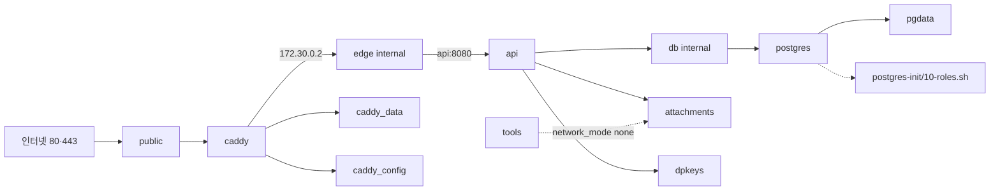
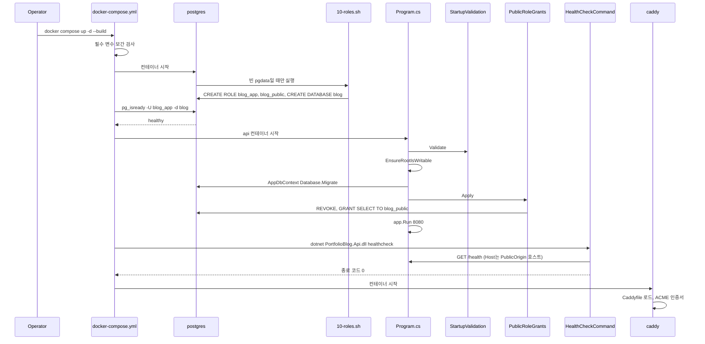
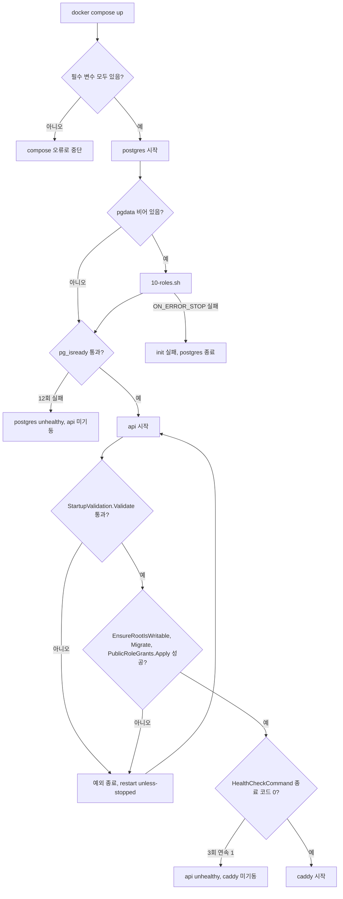
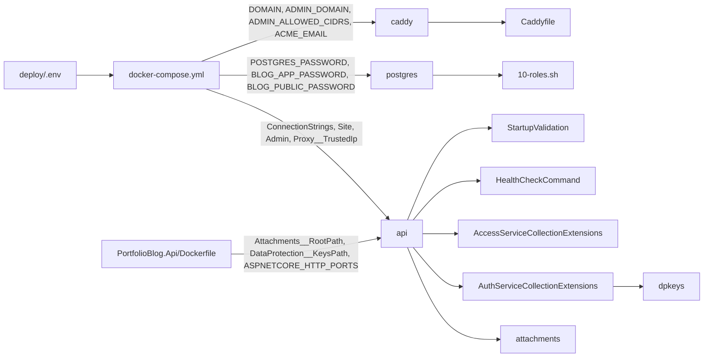

# F026 Docker Compose 운영 배포 구성

<!-- doc-harness:section id="summary" hash="bd966e2964325123c49c5185df1ae47420bd521ceda0d9597cacb2dc13a7f99a" -->
## 한 줄 요약

결론: F026은 실행 코드가 아니라 선언형 배포 구성이다. docker-compose.yml, Dockerfile 2개, postgres 초기화 스크립트로 이뤄진다. 이 구성이 넣어 주는 환경변수는 앱 코드가 소비한다(StartupValidation, HealthCheckCommand, ForwardedHeaders 설정, DataProtection 키 경로). 기동은 세 단계로 진행된다. 먼저 postgres가 pg_isready로 healthy가 된다. 다음으로 api가 설정 검증·첨부 루트 쓰기 확인·마이그레이션·공개 롤 권한 재부여를 마치고 dotnet healthcheck를 통과한다. 마지막으로 caddy가 80·443을 게시하고 ACME를 처리한다. 비밀값과 도메인은 모두 deploy/.env에서 `${VAR:?}` 필수 보간으로 들어온다. 하나라도 빠지면 compose가 컨테이너를 만들기 전에 중단한다(Compose 의미론이라 INFERRED). 보안 설정은 서비스마다 다르다. caddy는 user 1654:1654와 read_only를 쓰고, x-hardening(cap_drop ALL)에 NET_BIND_SERVICE만 더한다. api는 compose에 user가 없고 이미지의 USER 1654로 비루트 실행하며, read_only·/tmp tmpfs·x-hardening을 쓴다. api 이미지에서 /data만 1654 소유로 복사되고 /app은 --chown 없이 복사된다. postgres는 user도 read_only도 없이 이미지 기본 사용자로 뜬다. cap_drop ALL 위에 CHOWN·DAC_OVERRIDE·FOWNER·SETGID·SETUID를 다시 더한다. tools는 앵커를 병합하지 않고 보안 옵션을 개별로 선언한다. api·postgres는 internal 네트워크에만 붙어 포트를 게시하지 않는다. api는 고정 프록시 IP(172.30.0.2)만 Proxy__TrustedIp로 신뢰한다. 실패 대부분은 Docker의 재시작이나 unhealthy 판정에 맡긴다. 앱 기동 예외를 잡는 try/catch가 없어 프로세스가 종료되고, restart: unless-stopped 때문에 재시작 루프가 될 수 있다. 확인된 위험은 다섯이다. (1) 10-roles.sh와 healthcheck의 순서가 우연한 시간 차에 기댄다. (2) 172.30.0.2 상수를 여러 곳에서 수작업으로 맞춘다. (3) tmpfs 64m 크기가 UploadConcurrency 기본값 2에 묶여 있다. (4) DB 비밀번호는 최초 init에서만 반영된다. (5) /health가 DB를 점검하지 않는다.

| 항목 | 값 |
|---|---|
| 중요도 | INFRA |
| 상태 | ACTIVE |
| 진입점 | `CLI docker compose up -d --build (deploy/ 디렉터리에서 실행, deploy/docker-compose.yml)`, `CLI docker compose --profile tools run --rm -T --no-deps tools '<sh 명령>' (deploy/backup.sh·deploy/restore.sh가 호출)`, `postgres 컨테이너 최초 기동 시 /docker-entrypoint-initdb.d/10-roles.sh`, `api 컨테이너 healthcheck: dotnet PortfolioBlog.Api.dll healthcheck` |
| 의존 기능 | [F021](../09_FEATURES.md#f021), [F022](../09_FEATURES.md#f022), [F025](../09_FEATURES.md#f025) |

### 진입점 근거

| 내용 | 상태 | 근거 |
|---|---|---|
| 운영자는 deploy/ 디렉터리에서 `docker compose up -d --build`로 전체 스택을 올린다. 최초 배포 전에 .env를 준비하고 `docker compose build api`를 실행한 뒤, hash-password로 ADMIN_PASSWORD_HASH를 만든다. | INFERRED | `deploy/OPERATIONS.md` (3,25-37) |
| compose 파일의 최상위 name이 portfolioblog라 프로젝트 이름이 고정된다. OPERATIONS.md가 쓰는 이미지 이름 portfolioblog-api와 컨테이너 이름 portfolioblog-api-1은 이 이름에서 파생된다. 파생 규칙은 Compose 기본 동작이라 INFERRED다. | INFERRED | `deploy/docker-compose.yml` (1), `deploy/OPERATIONS.md` (34,53) |
| tools 서비스는 profiles: ["tools"]라 평소 up으로는 뜨지 않는다. backup.sh·restore.sh가 `docker compose --profile tools run --rm -T --no-deps tools '<명령>'`으로만 띄운다. | CONFIRMED | `deploy/docker-compose.yml` (112-125), `deploy/backup.sh` (25), `deploy/restore.sh` (40) |
| postgres 컨테이너는 ./postgres-init을 /docker-entrypoint-initdb.d에 읽기 전용으로 마운트한다. 공식 이미지 규약상 10-roles.sh는 데이터 디렉터리가 비어 있을 때만 실행된다. 이 규약은 이미지 동작이라 INFERRED이고, 스크립트 주석이 이를 명시한다. | INFERRED | `deploy/docker-compose.yml` (101-103), `deploy/postgres-init/10-roles.sh` (2) |
| api 컨테이너의 healthcheck는 `dotnet PortfolioBlog.Api.dll healthcheck`를 실행한다. Program.cs는 인수가 정확히 ["healthcheck"]이면 웹 호스트를 만들지 않고 HealthCheckCommand.RunAsync로 분기한다. | CONFIRMED | `deploy/docker-compose.yml` (77-83), `PortfolioBlog.Api/Program.cs` (21-26), `PortfolioBlog.Api/Infrastructure/Web/HealthCheckCommand.cs` HealthCheckCommand.RunAsync (35-63) |
| CI의 deploy-smoke 잡과 deploy/smoke/run.sh는 같은 compose에 docker-compose.smoke.yml을 덮어써서(COMPOSE_FILE=docker-compose.yml:docker-compose.smoke.yml) 전체 스택을 검증용으로 띄운다. | CONFIRMED | `.github/workflows/ci.yml` (102-121), `deploy/smoke/run.sh` (13,78) |
<!-- /doc-harness:section -->

<!-- doc-harness:section id="flow" hash="834f6ea28b13ecacb27c12e8165abe0191eb6e5bb5ab11209a9aff6d21d14342" -->
## 처리 흐름

| 단계 | 컴포넌트 | 코드 | 설명 |
|---|---|---|---|
| 1 | docker-compose.yml | `deploy/docker-compose.yml` services.*.environment | compose가 deploy/.env의 변수를 보간한다. `${VAR:?}`로 표시된 필수 변수는 DOMAIN, ADMIN_DOMAIN, ADMIN_ALLOWED_CIDRS, ACME_EMAIL, BLOG_APP_PASSWORD, BLOG_PUBLIC_PASSWORD, PUBLIC_ORIGIN, ADMIN_ORIGIN, ADMIN_PASSWORD_HASH, POSTGRES_PASSWORD다. 하나라도 없으면 컨테이너를 만들기 전에 오류로 끝난다(Compose 의미론). |
| 2 | PortfolioBlog.Api/Dockerfile | `PortfolioBlog.Api/Dockerfile` build/final stage | `--build`이면 api 이미지를 만든다. (1) sdk:10.0.401에서 restore·publish(UseAppHost=false)를 하고 web.config·appsettings.Development.json·pdb를 지운다. (2) RUN test로 wwwroot가 css/site.css 하나뿐인지, EF Design·CodeAnalysis·*.Development.json·pdb가 없는지 확인한다. (3) /data/attachments·/data/dpkeys를 700 권한으로 만든다. (4) aspnet:10.0.12-noble-chiseled-extra로 옮긴다. 게시 결과는 `COPY --from=build /app ./`로 --chown 없이 복사하므로 1654 소유가 아니다(기본은 root 소유, Docker 의미론). /data만 `COPY --from=build --chown=1654:1654 /data /data`로 1654 소유로 복사한다. ENV는 ASPNETCORE_ENVIRONMENT=Production, ASPNETCORE_HTTP_PORTS=8080, Attachments__RootPath=/data/attachments, DataProtection__KeysPath=/data/dpkeys이고, USER 1654로 실행한다. |
| 3 | PortfolioBlog.Web/Dockerfile | `PortfolioBlog.Web/Dockerfile` build/final stage | caddy 이미지를 만든다. node:24.21.0-alpine에서 npm ci를 실행한다. NPM_AUDIT=on(기본값)이면 `npm audit --omit=dev --audit-level=high`로 게이트한 뒤 npm run build를 한다. caddy:2.11.4-alpine에 deploy/Caddyfile(/etc/caddy/Caddyfile)과 dist(/srv)를 굽고, 검사용 환경값으로 `caddy validate`를 실행한다. |
| 4 | postgres | `deploy/docker-compose.yml` services.postgres | postgres:17.11-alpine이 db 네트워크(internal)에서 pgdata 볼륨으로 뜬다. 포트는 게시하지 않는다. user·read_only가 없어 이미지 기본 사용자로 시작한다. x-hardening의 cap_drop ALL 위에 CHOWN·DAC_OVERRIDE·FOWNER·SETGID·SETUID를 다시 추가한다. |
| 5 | 10-roles.sh | `deploy/postgres-init/10-roles.sh` psql heredoc (19-30행) | 빈 pgdata일 때만 실행된다. `set -eu`와 psql `ON_ERROR_STOP=1` 아래에서 다음을 차례로 실행한다. (1) blog_app·blog_public 롤을 NOSUPERUSER NOCREATEDB NOCREATEROLE로 만든다. (2) blog DB를 OWNER blog_app으로 만든다. (3) DB의 PUBLIC 권한을 회수한다. (4) blog_public에 CONNECT를 준다. (5) blog DB에 \connect한 뒤 public 스키마의 PUBLIC 권한을 회수한다. (6) 스키마 소유자를 blog_app으로 바꾼다. 비밀번호는 psql 변수(:'app_pw', :'public_pw')로 인용한다. |
| 6 | postgres | `deploy/docker-compose.yml` services.postgres.healthcheck | `pg_isready -U blog_app -d blog`를 10초 간격, 5초 타임아웃, 12회 재시도로 실행한다. healthy가 되면 api의 depends_on(condition: service_healthy)이 풀린다. |
| 7 | api | `deploy/docker-compose.yml` services.api | api가 edge·db 네트워크에 붙어 뜬다. read_only 루트 FS와 /tmp tmpfs(64m, 1777)를 쓰고 attachments·dpkeys 볼륨을 마운트한다. compose에 user가 없어 이미지의 USER 1654로 실행된다. 환경변수로 받는 값은 ConnectionStrings__Default(blog_app), ConnectionStrings__Public(blog_public), Site__*, Admin__AllowedCidrs, Admin__PasswordHash, Proxy__TrustedIp=172.30.0.2다. 두 연결 문자열에는 모두 Command Timeout=30이 붙는다. |
| 8 | StartupValidation | `PortfolioBlog.Api/Infrastructure/Access/StartupValidation.cs` StartupValidation.Validate | 검사는 두 묶음이다. (a) 환경과 무관하게 항상 검사한다(48-114행). 대상은 두 origin·Admin:AllowedCidrs·Proxy:TrustedIp·Admin:PasswordHash(값이 있을 때)의 형식, 각종 한도 범위, Public:StatementTimeoutMs 100~60000, Attachments:RootPath 존재다. 연결 문자열 규칙(88-102행)도 여기에 속한다. 값이 있으면 CheckConnectionString으로 Options 금지와 Command Timeout×1000 > StatementTimeoutMs를 확인하고, Public과 Default의 Username이 같으면 거부한다. (b) Development가 아닐 때만 검사한다(116-135행). Require로 Proxy:TrustedIp·Admin:AllowedCidrs·Admin:PasswordHash가 있는지, 두 origin이 서로 다르고 https인지, Attachments:RootPath와 DataProtection:KeysPath가 절대 경로인지, ConnectionStrings:Public이 있는지 확인한다. 이미지 ENV가 Production이므로 운영에서는 두 묶음이 모두 적용된다. 하나라도 어기면 InvalidOperationException이 나고 프로세스가 종료된다. |
| 9 | Program | `PortfolioBlog.Api/Program.cs` top-level statements (76-91행) | 다음 순서로 진행한다. FileSystemAttachmentStore.EnsureRootIsWritable로 /data/attachments에 쓸 수 있는지 확인한다. AppDbContext.Database.Migrate()를 blog_app 연결로 실행한다. PublicRoleGrants.Apply로 blog_public에 허용 테이블의 SELECT를 다시 부여한다. MarkdownRenderer를 워밍업한다. 끝으로 app.Run()이 8080을 연다. |
| 10 | HealthCheckCommand | `PortfolioBlog.Api/Infrastructure/Web/HealthCheckCommand.cs` HealthCheckCommand.RunAsync | Docker가 30초 간격으로 호출한다(start_period 40s, start_interval 2s, timeout 5s, retries 3). Site__PublicOrigin의 호스트를 Host 헤더에 싣고 http://127.0.0.1:{ASPNETCORE_HTTP_PORTS 첫 값}/health를 3초 타임아웃으로 부른다. 2xx면 0, 그 밖이면 1을 돌려준다. |
| 11 | caddy | `deploy/docker-compose.yml` services.caddy | api가 healthy가 되면 caddy가 뜬다. user 1654:1654, cap_add NET_BIND_SERVICE, read_only로 실행된다. 포트는 HTTP_BIND/HTTPS_BIND(기본 0.0.0.0:80/443)로 게시한다. public 네트워크와 edge 네트워크(고정 IP 172.30.0.2)에 동시에 붙는다. DOMAIN·ADMIN_DOMAIN·ADMIN_ALLOWED_CIDRS·ACME_EMAIL을 Caddyfile에 넘기고 caddy_data·caddy_config 볼륨을 쓴다. |
| 12 | AccessServiceCollectionExtensions | `PortfolioBlog.Api/Infrastructure/Access/AccessServiceCollectionExtensions.cs` UseTrustedForwardedHeaders | 운영 중에는 Proxy:TrustedIp(caddy 고정 IP)만 KnownProxies에 넣고 ForwardedHeaders 미들웨어를 켠다. 그래서 caddy가 보낸 X-Forwarded-For만 원본 IP로 받아들인다. |
<!-- /doc-harness:section -->

<!-- doc-harness:section id="F026_ARCHITECTURE" hash="f8ab85cfae326cf164d945555ca0f2c82d0cd66a385b035a8fffc18a92566168" -->
## compose 서비스·네트워크·볼륨 구성 (Architecture)

caddy만 public 네트워크에 붙어 포트를 게시한다. api와 postgres는 internal 네트워크(edge, db)에만 연결된다.

caddy는 public과 edge 두 네트워크에 동시에 붙는다(멀티홈). edge에서는 고정 IP 172.30.0.2를 쓴다. edge 네트워크의 설정은 internal, 서브넷 172.30.0.0/24, 동적 할당 범위 172.30.0.128/25다. api는 edge·db에만 붙고 postgres는 db에만 붙는다. named volume은 다섯 개다. tools는 profile 전용이고 네트워크 없이 attachments 볼륨만 마운트한다.

### 코드 근거

| 구성 요소 | 코드 |
|---|---|
| caddy | `deploy/docker-compose.yml` (services.caddy) |
| api | `deploy/docker-compose.yml` (services.api) |
| postgres | `deploy/docker-compose.yml` (services.postgres) |
| tools | `deploy/docker-compose.yml` (services.tools) |
| postgres-init/10-roles.sh | `deploy/postgres-init/10-roles.sh` |
<!-- /doc-harness:section -->

<!-- doc-harness:section id="F026_SEQUENCE" hash="f339efd1fd645185136573a79424ad68b29fe62014623f15aa5cf65b00e58333" -->
## docker compose up 기동 순서 (Sequence Diagram)

postgres healthy가 api 기동을 게이트하고, api healthy가 caddy 기동을 게이트한다. api는 설정 검증→첨부 루트 쓰기 확인→마이그레이션→권한 재부여를 마친 뒤 8080을 연다.

depends_on condition: service_healthy가 두 단계의 게이트 역할을 한다. 10-roles.sh는 pgdata가 비어 있을 때만 실행된다. pg_isready가 init 완료를 보장하지는 않는다는 한계가 있다(엣지 케이스 참조). StartupValidation은 연결 문자열 규칙을 항상 검사하고, 필수값 Require는 Development가 아닐 때만 검사한다.

### 코드 근거

| 구성 요소 | 코드 |
|---|---|
| docker-compose.yml | `deploy/docker-compose.yml` |
| 10-roles.sh | `deploy/postgres-init/10-roles.sh` |
| Program.cs | `PortfolioBlog.Api/Program.cs` |
| StartupValidation | `PortfolioBlog.Api/Infrastructure/Access/StartupValidation.cs` (StartupValidation.Validate) |
| PublicRoleGrants | `PortfolioBlog.Api/Infrastructure/Data/PublicRoleGrants.cs` (PublicRoleGrants.Apply) |
| HealthCheckCommand | `PortfolioBlog.Api/Infrastructure/Web/HealthCheckCommand.cs` (HealthCheckCommand.RunAsync) |
<!-- /doc-harness:section -->

<!-- doc-harness:section id="F026_FLOW" hash="a5f6b30458cd5dcec0562aa6187c0286341ded7db5b8d70f85b44cd845b95023" -->
## 기동 분기와 실패 경로 (Flowchart)

실패 처리는 compose 오류 중단, postgres/api unhealthy에 따른 후속 서비스 미기동, api 예외 종료 후 재시작 루프로 나뉜다. 앱 쪽에 별도 복구 코드는 없다.

필수 변수 누락은 compose 단계에서 중단된다. 10-roles.sh 실패 후의 동작은 공식 이미지에 달려 있다(INFERRED). api 기동 예외는 try/catch 없이 프로세스를 종료시키고, restart: unless-stopped 때문에 재시작 루프가 될 수 있다. 기동 후 unhealthy가 되어도 caddy는 이미 떠 있으면 계속 프록시한다.

### 코드 근거

| 구성 요소 | 코드 |
|---|---|
| 10-roles.sh | `deploy/postgres-init/10-roles.sh` |
| StartupValidation.Validate | `PortfolioBlog.Api/Infrastructure/Access/StartupValidation.cs` |
| PublicRoleGrants.Apply | `PortfolioBlog.Api/Infrastructure/Data/PublicRoleGrants.cs` |
| HealthCheckCommand | `PortfolioBlog.Api/Infrastructure/Web/HealthCheckCommand.cs` |
| restart unless-stopped | `deploy/docker-compose.yml` |
<!-- /doc-harness:section -->

<!-- doc-harness:section id="F026_DATAFLOW" hash="be083bcd640b0a4763d30de7d95fd9e26d14d510cd42b3448ec2276f4998a8b1" -->
## .env와 이미지 ENV에서 앱 설정까지의 흐름 (Data Flow Diagram)

.env 값은 compose 보간으로 서비스별 environment가 되고, 경로·포트는 api 이미지 ENV에서 온다. 이 두 원천을 앱의 옵션·검증 코드가 소비한다.

ADMIN_ALLOWED_CIDRS는 caddy와 api가 공유한다. BLOG_APP_PASSWORD·BLOG_PUBLIC_PASSWORD는 postgres(롤 생성)와 api(연결 문자열)가 공유한다. Proxy__TrustedIp는 compose에 172.30.0.2 상수로 박혀 있다. dpkeys·attachments 볼륨은 이미지가 --chown=1654:1654로 만든 /data 하위 디렉터리에 마운트된다.

### 코드 근거

| 구성 요소 | 코드 |
|---|---|
| deploy/.env | `deploy/.env.example` |
| docker-compose.yml | `deploy/docker-compose.yml` |
| Caddyfile | `deploy/Caddyfile` |
| 10-roles.sh | `deploy/postgres-init/10-roles.sh` |
| PortfolioBlog.Api/Dockerfile | `PortfolioBlog.Api/Dockerfile` |
| StartupValidation | `PortfolioBlog.Api/Infrastructure/Access/StartupValidation.cs` |
| HealthCheckCommand | `PortfolioBlog.Api/Infrastructure/Web/HealthCheckCommand.cs` |
| AccessServiceCollectionExtensions | `PortfolioBlog.Api/Infrastructure/Access/AccessServiceCollectionExtensions.cs` |
| AuthServiceCollectionExtensions | `PortfolioBlog.Api/Infrastructure/Access/AuthServiceCollectionExtensions.cs` |
<!-- /doc-harness:section -->

<!-- doc-harness:section id="data" hash="5abb382bfa2c064f1b394c9fbb5351f2cb34295b61a10bd25bee95657e977c0c" -->
## 데이터

### 데이터 흐름

| 내용 | 상태 | 근거 |
|---|---|---|
| 비밀값·도메인은 deploy/.env에서 compose 보간을 거쳐 각 서비스의 environment로 들어간다. caddy는 DOMAIN·ADMIN_DOMAIN·ADMIN_ALLOWED_CIDRS·ACME_EMAIL을 받는다. api는 ConnectionStrings__Default/Public(BLOG_APP_PASSWORD·BLOG_PUBLIC_PASSWORD 포함), Site__*, Admin__AllowedCidrs, Admin__PasswordHash를 받는다. postgres는 POSTGRES_PASSWORD·BLOG_APP_PASSWORD·BLOG_PUBLIC_PASSWORD를 받는다. | CONFIRMED | `deploy/docker-compose.yml` (31-35,60-70,97-100) |
| ADMIN_ALLOWED_CIDRS 값 하나를 caddy(Caddyfile의 remote_ip 매처)와 api(Admin__AllowedCidrs)가 함께 읽는다. 그래서 허용 IP를 바꾸면 두 컨테이너를 모두 다시 올려야 한다. | CONFIRMED | `deploy/docker-compose.yml` (34,68), `deploy/OPERATIONS.md` (112) |
| 운영 경로는 이미지 ENV가 정한다: Attachments__RootPath=/data/attachments, DataProtection__KeysPath=/data/dpkeys, ASPNETCORE_HTTP_PORTS=8080. compose는 두 경로에 attachments·dpkeys named volume을 마운트해 영속화한다. AuthServiceCollectionExtensions는 KeysPath가 있으면 FileSystemXmlRepository로 키를 파일에 저장한다. | CONFIRMED | `PortfolioBlog.Api/Dockerfile` (27-30), `deploy/docker-compose.yml` (71-73), `PortfolioBlog.Api/Infrastructure/Access/AuthServiceCollectionExtensions.cs` (78-84) |
| 원본 IP는 다음 경로로 전달된다. 클라이언트 요청이 public 네트워크로 caddy에 들어오면 caddy가 remote_ip를 판정한다. caddy는 edge 네트워크의 172.30.0.2에서 api:8080으로 X-Forwarded-For를 넘긴다. api는 송신자가 KnownProxies={Proxy:TrustedIp}일 때만 XFF를 채택한다. | CONFIRMED | `deploy/docker-compose.yml` (39-45,70), `PortfolioBlog.Api/Infrastructure/Access/AccessServiceCollectionExtensions.cs` (44-50,68-72) |
| DB 권한은 두 단계로 정해진다. 10-roles.sh는 blog_public에 CONNECT만 준다. 테이블별 SELECT는 앱이 기동할 때마다 PublicRoleGrants.Apply가 blog_app 세션으로 다시 맞추며, 대상은 blog_app 소유 테이블뿐이다. | CONFIRMED | `deploy/postgres-init/10-roles.sh` (5-6,26), `PortfolioBlog.Api/Program.cs` (82-88), `PortfolioBlog.Api/Infrastructure/Data/PublicRoleGrants.cs` (126-129) |
| 관리 SPA 정적 파일과 Caddyfile은 빌드 때 caddy 이미지에 구워진다(/srv, /etc/caddy/Caddyfile). 런타임 볼륨으로 주입하지 않으므로 둘 중 하나를 바꾸면 이미지를 다시 빌드해야 한다. | CONFIRMED | `PortfolioBlog.Web/Dockerfile` (16-18), `deploy/OPERATIONS.md` (73) |
| api 이미지 안의 소유권은 둘로 나뉜다. 볼륨 마운트 지점 /data만 --chown=1654:1654로 복사되어 1654 소유(700)다. 게시 결과인 /app은 --chown 없이 복사된다. 따라서 앱 바이너리는 실행 사용자 1654의 소유가 아니다. 소유자가 root라는 점은 Docker COPY 기본 동작에서 나온 추론이다. | CONFIRMED | `PortfolioBlog.Api/Dockerfile` (19-20,24-26,31) |
| 업로드 임시 데이터는 api의 /tmp tmpfs(64m, mode 1777)에 쓰인다. compose 주석에 따르면 이 크기는 11MiB × 업로드 동시성 2의 약 3배다. | CONFIRMED | `deploy/docker-compose.yml` (56-59), `PortfolioBlog.Api/Infrastructure/Access/AdminOptions.cs` (45) |

### DB 접근

| 엔티티 | 작업 | 코드 |
|---|---|---|
| ROLE blog_app | DDL | `deploy/postgres-init/10-roles.sh` CREATE ROLE blog_app LOGIN PASSWORD (psql 변수 :'app_pw') NOSUPERUSER NOCREATEDB NOCREATEROLE |
| ROLE blog_public | DDL | `deploy/postgres-init/10-roles.sh` CREATE ROLE blog_public LOGIN PASSWORD (psql 변수 :'public_pw') NOSUPERUSER NOCREATEDB NOCREATEROLE |
| DATABASE blog | DDL | `deploy/postgres-init/10-roles.sh` CREATE DATABASE blog OWNER blog_app |
| DATABASE blog (PUBLIC 권한) | DDL | `deploy/postgres-init/10-roles.sh` REVOKE ALL ON DATABASE blog FROM PUBLIC |
| DATABASE blog (blog_public CONNECT) | DDL | `deploy/postgres-init/10-roles.sh` GRANT CONNECT ON DATABASE blog TO blog_public |
| SCHEMA public (PUBLIC 권한) | DDL | `deploy/postgres-init/10-roles.sh` REVOKE ALL ON SCHEMA public FROM PUBLIC |
| SCHEMA public (소유자) | DDL | `deploy/postgres-init/10-roles.sh` ALTER SCHEMA public OWNER TO blog_app |
| (교차 참조) 마이그레이션 대상 테이블 전체 — F021 소관 | DDL | `PortfolioBlog.Api/Program.cs` AppDbContext.Database.Migrate() |
| (교차 참조) pg_tables / blog_public 테이블 권한 — F021 소관 | DDL | `PortfolioBlog.Api/Infrastructure/Data/PublicRoleGrants.cs` PublicRoleGrants.Apply |

### 상태 전이

| 이전 | 다음 | 트리거 | 근거 |
|---|---|---|---|
| pgdata 볼륨 비어 있음 | blog_app·blog_public 롤과 blog DB 초기화됨 | postgres 컨테이너 최초 기동 → /docker-entrypoint-initdb.d/10-roles.sh 실행 | `deploy/postgres-init/10-roles.sh` (2,19-30), `deploy/docker-compose.yml` (101-103) |
| postgres starting | postgres healthy | pg_isready -U blog_app -d blog 성공(10s 간격, 최대 12회 재시도) | `deploy/docker-compose.yml` (106-110) |
| api 대기(생성 전) | api starting | depends_on postgres condition: service_healthy 충족 | `deploy/docker-compose.yml` (84-86) |
| api starting | api healthy | HealthCheckCommand가 /health에서 2xx를 받아 종료 코드 0(start_period 40s 동안은 start_interval 2s로 검사) | `deploy/docker-compose.yml` (77-83), `PortfolioBlog.Api/Infrastructure/Web/HealthCheckCommand.cs` (53-54) |
| api healthy | api unhealthy | healthcheck 3회 연속 실패(종료 코드 1 또는 5초 타임아웃) | `deploy/docker-compose.yml` (79-81), `PortfolioBlog.Api/Infrastructure/Web/HealthCheckCommand.cs` (55-62) |
| api starting | api exited → 재시작 | StartupValidation/EnsureRootIsWritable/Migrate/PublicRoleGrants.Apply 중 예외로 프로세스 종료 → restart: unless-stopped | `PortfolioBlog.Api/Program.cs` (76-88), `deploy/docker-compose.yml` (3-4) |
| caddy 대기(생성 전) | caddy running | depends_on api condition: service_healthy 충족 | `deploy/docker-compose.yml` (46-48) |
| tools 미기동(profile 비활성) | tools 1회 실행 후 제거 | docker compose --profile tools run --rm tools '<명령>' (backup.sh/restore.sh) | `deploy/docker-compose.yml` (112-125), `deploy/backup.sh` (25), `deploy/restore.sh` (40) |

### 외부 의존

| 내용 | 상태 | 근거 |
|---|---|---|
| 컨테이너 이미지 태그는 모두 정확한 버전으로 고정돼 있다: mcr.microsoft.com/dotnet/sdk:10.0.401, mcr.microsoft.com/dotnet/aspnet:10.0.12-noble-chiseled-extra, node:24.21.0-alpine, caddy:2.11.4-alpine, postgres:17.11-alpine(postgres·tools 두 곳). | CONFIRMED | `PortfolioBlog.Api/Dockerfile` (4,23), `PortfolioBlog.Web/Dockerfile` (4,16), `deploy/docker-compose.yml` (90,115) |
| caddy는 ACME_EMAIL로 Let's Encrypt(ACME) 인증서를 받아 caddy_data에 저장한다. ACME 아웃바운드가 나가는 통로는 public 네트워크 하나뿐이다. 관리 도메인도 HTTP-01 챌린지를 통과해야 한다. | INFERRED | `deploy/docker-compose.yml` (35,37,40-41), `deploy/OPERATIONS.md` (51) |
| Docker Engine과 compose 플러그인, DNS A/AAAA 레코드가 필요하다. 원본 IP를 보존하려면 Docker 데몬이 iptables를 관리해야 한다(사용자 공간 프록시로 중계하면 안 된다). | INFERRED | `deploy/OPERATIONS.md` (27,55-62) |
| npm 레지스트리 감사(npm audit)가 caddy 이미지 빌드를 막을 수 있다. 우회 방법은 --build-arg NPM_AUDIT=off다. | CONFIRMED | `PortfolioBlog.Web/Dockerfile` (10-13) |
<!-- /doc-harness:section -->

<!-- doc-harness:section id="failures" hash="ba2a6ebc477210d2066c2185b6edc6545238666f350a0a55cab6809628384522" -->
## 실패 지점

| 위치 | 조건 | 처리 | 상태 | 근거 |
|---|---|---|---|---|
| deploy/docker-compose.yml 변수 보간 | `${VAR:?}` 필수 변수가 .env에도 셸 환경에도 없음 | compose가 컨테이너를 만들기 전에 오류로 중단한다(Compose 의미론). | INFERRED | `deploy/docker-compose.yml` (32-35,61-69,98-100) |
| PortfolioBlog.Web/Dockerfile 빌드 | 배포 의존성에 high 이상 취약점이 있거나 Caddyfile에 문법 오류가 있음 | npm audit나 caddy validate가 실패해 이미지 빌드가 중단된다. 우회는 NPM_AUDIT=off 빌드 인자로만 가능하다. | CONFIRMED | `PortfolioBlog.Web/Dockerfile` (12-13,20-21) |
| PortfolioBlog.Api/Dockerfile 빌드 | wwwroot에 site.css 외 파일(.gz/.br 등)이 있거나, 게시 결과에 EF Design·CodeAnalysis·*.Development.json·pdb가 섞임 | RUN test가 실패해 빌드가 중단된다. | CONFIRMED | `PortfolioBlog.Api/Dockerfile` (17-18) |
| deploy/postgres-init/10-roles.sh | SQL 문 실패(롤 중복 등) 또는 변수 미정의 | `set -eu`와 psql `ON_ERROR_STOP=1` 때문에 즉시 비정상 종료한다. 그 이후 처리는 공식 이미지의 초기화 실패 처리(컨테이너 종료)에 맡기며, 이 부분은 INFERRED다. | INFERRED | `deploy/postgres-init/10-roles.sh` (19-21) |
| postgres healthcheck | pg_isready가 12회(약 2분) 연속 실패 | postgres가 unhealthy가 되고, depends_on service_healthy 때문에 api와 caddy가 시작되지 않는다. | INFERRED | `deploy/docker-compose.yml` (84-86,106-110) |
| PortfolioBlog.Api/Program.cs 시작 시퀀스 | StartupValidation 위반, 첨부 루트 쓰기 불가, Migrate/PublicRoleGrants.Apply 실패(DB 접속·권한 오류) | try/catch가 없어 예외가 전파되고 프로세스가 종료된다. restart: unless-stopped가 컨테이너를 재시작하므로 원인이 남아 있으면 재시작 루프가 된다. 운영자는 docker compose logs api로 첫 예외 메시지의 설정 키를 확인한다. | POTENTIAL_ISSUE | `PortfolioBlog.Api/Program.cs` (76-88), `deploy/docker-compose.yml` (3-4), `deploy/OPERATIONS.md` (153) |
| StartupValidation.Validate (연결 문자열 규칙) | 두 연결 문자열 중 하나에 Options가 있거나, Command Timeout×1000이 Public:StatementTimeoutMs 이하이거나, Public과 Default의 Username이 같음 | 환경과 무관하게 항상 InvalidOperationException으로 기동을 막는다. 이 검사는 `if (!environment.IsDevelopment())` 블록 밖(88-102행)에 있다. 연결 문자열이 비어 있으면 이 단계는 건너뛰고, 컨텍스트를 처음 해석할 때의 가드가 처리한다. | CONFIRMED | `PortfolioBlog.Api/Infrastructure/Access/StartupValidation.cs` StartupValidation.Validate / CheckConnectionString (26,83-102,151-169) |
| StartupValidation.Validate (Admin:PasswordHash) | .env.example의 ADMIN_PASSWORD_HASH 자리표시자를 그대로 둠(유효한 Base64가 아님) | Convert.FromBase64String의 FormatException이 설정 키를 담은 InvalidOperationException으로 바뀌어 api 기동이 실패한다(fail-fast). | CONFIRMED | `PortfolioBlog.Api/Infrastructure/Access/StartupValidation.cs` (58-61,185-189), `deploy/.env.example` (28-30) |
| HealthCheckCommand.RunAsync | Site__PublicOrigin 누락·형식 오류, 연결 실패, 3초 타임아웃, 비 2xx 응답 | stderr에 한 줄을 쓰고 종료 코드 1을 돌려준다. 예외는 던지지 않는다. 3회 연속 실패하면 Docker가 unhealthy로 표시한다. 명령의 타임아웃(3초)이 compose timeout(5초)보다 짧아서 명령이 먼저 실패를 보고한다. | CONFIRMED | `PortfolioBlog.Api/Infrastructure/Web/HealthCheckCommand.cs` (19-20,42-62), `deploy/docker-compose.yml` (79-81) |
| api 컨테이너 런타임 | 기동 후 api가 unhealthy가 됐지만 프로세스는 살아 있음 | restart 정책은 종료된 컨테이너만 재시작하고, depends_on은 기동 시점만 게이트한다. 그래서 caddy는 계속 api로 프록시한다. 자동 복구 처리는 없다. | POTENTIAL_ISSUE | `deploy/docker-compose.yml` (3-4,46-48,77-83) |
| caddy 서비스 | caddy 자체가 비정상(인증서 발급 실패 등) | caddy에는 healthcheck가 없다. OPERATIONS.md는 running 상태와 로그(grep acme/certificate)로 확인하라고 안내한다. | POTENTIAL_ISSUE | `deploy/docker-compose.yml` (16-48), `deploy/OPERATIONS.md` (36,51,154) |
| api /tmp tmpfs | Admin__UploadConcurrency를 기본값 2보다 올렸는데 tmpfs size=64m은 그대로 둠 | compose 주석에 따르면 셋째 업로드부터 tmpfs가 고갈돼 400이 난다. 두 값을 맞추는지 자동으로 검증하지 않는다. | POTENTIAL_ISSUE | `deploy/docker-compose.yml` (56-59), `PortfolioBlog.Api/Infrastructure/Access/AdminOptions.cs` (45) |
| caddy edge 고정 IP | 컨테이너 재생성 시 다른 컨테이너가 172.30.0.2를 이미 점유 | Address already in use로 caddy 생성이 실패한다. 동적 할당을 ip_range 172.30.0.128/25로 한정해 충돌 가능성을 줄였다. 복구는 수동이다(docker compose down && up -d). | INFERRED | `deploy/docker-compose.yml` (44-45,132-138), `deploy/OPERATIONS.md` (158) |
| 업데이트(재배포) 중 마이그레이션 | 새 버전이 적용한 마이그레이션을 코드 롤백과 함께 되돌려야 함 | 자동 롤백은 없다. 사전에 backup.sh로 백업하고 restore.sh로 수동 복원하는 절차만 있다. | INFERRED | `deploy/OPERATIONS.md` (66-75), `PortfolioBlog.Api/Program.cs` (81-85) |

### 엣지 케이스

| 내용 | 상태 | 근거 |
|---|---|---|
| 보안 설정은 서비스마다 다르다. caddy는 compose에서 user "1654:1654"와 read_only: true를 선언하고, x-hardening(cap_drop ALL)에 NET_BIND_SERVICE만 더한다. api는 compose에 user가 없어 이미지의 USER 1654로 비루트 실행하고, read_only와 x-hardening을 쓰며 cap_add는 없다. postgres는 user도 read_only도 없이 이미지 기본 사용자로 시작한다. cap_drop ALL 위에 CHOWN·DAC_OVERRIDE·FOWNER·SETGID·SETUID를 다시 추가한다. tools는 앵커를 병합하지 않고 user 1654:1654, read_only, network_mode none, no-new-privileges, cap_drop ALL을 개별로 선언한다. | CONFIRMED | `deploy/docker-compose.yml` (3-13,24-27,55,88-96,113-122), `PortfolioBlog.Api/Dockerfile` (31) |
| init 순서에 경쟁 가능성이 있다. 공식 이미지의 initdb.d 스크립트는 임시 서버에서 도는데, 그동안에도 pg_isready가 통과할 수 있다. 그래서 depends_on service_healthy는 10-roles.sh의 완료를 보장하지 않는다. 스크립트 주석이 적듯이, 지금은 스크립트가 1초 안에 끝나고 첫 healthcheck가 10초 뒤라 어긋나지 않을 뿐이다. | POTENTIAL_ISSUE | `deploy/postgres-init/10-roles.sh` (13-16), `deploy/docker-compose.yml` (106-110) |
| pg_isready -U blog_app -d blog는 서버가 연결을 받는지만 보고 인증은 하지 않는다. 그래서 롤·DB가 있는지, 비밀번호가 맞는지는 증명하지 못한다. 이런 문제는 api의 Migrate 단계에서야 드러난다. | INFERRED | `deploy/docker-compose.yml` (107), `PortfolioBlog.Api/Program.cs` (82-85) |
| /health는 외부 의존성을 점검하지 않고 상수 "Healthy"를 돌려준다. 그래서 기동 뒤 DB 연결이 끊겨도 api healthcheck는 계속 healthy다. | CONFIRMED | `PortfolioBlog.Api/Program.cs` (115-120,130), `deploy/docker-compose.yml` (77-78) |
| DB 비밀번호는 빈 pgdata에서 처음 init할 때만 반영된다. 나중에 .env만 바꾸면 api가 DB에 접속하지 못한다. 바꾸려면 psql \password로 DB 안의 값을 먼저 바꾸고 그다음 .env를 고친다. | INFERRED | `deploy/.env.example` (21-23), `deploy/OPERATIONS.md` (114-128), `deploy/postgres-init/10-roles.sh` (2) |
| DB 비밀번호는 연결 문자열의 Password 항목에 BLOG_APP_PASSWORD 환경 변수 값이 그대로 끼워진다. 그래서 ';'·'=' 같은 문자가 들어가면 해석이 바뀐다. .env.example은 영문·숫자만 쓰라고 안내할 뿐이고, compose 단계에서는 검증하지 않는다. 형식 오류와 Options 주입은 StartupValidation.CheckConnectionString이 일부 잡는다. | POTENTIAL_ISSUE | `deploy/docker-compose.yml` (61-62), `deploy/.env.example` (21-22), `PortfolioBlog.Api/Infrastructure/Access/StartupValidation.cs` (151-169) |
| 172.30.0.2는 caddy ipv4_address, api Proxy__TrustedIp, 스모크 extra_hosts에서 수작업으로 맞춰야 하는 상수다. 하나만 바뀌면 운영에서 XFF가 신뢰되지 않는다. 그러면 원본 IP가 caddy 주소로 보이고 IP 허용 목록 판정이 틀어진다. | POTENTIAL_ISSUE | `deploy/docker-compose.yml` (45,70), `deploy/docker-compose.smoke.yml` (33-34), `PortfolioBlog.Api/Infrastructure/Access/AccessServiceCollectionExtensions.cs` (44-50) |
| compose의 Command Timeout=30(초)은 StartupValidation의 'Command Timeout×1000 > StatementTimeoutMs' 규칙을 만족한다(기본 3000ms). 이 규칙은 환경과 무관하게 적용된다. 따라서 Public:StatementTimeoutMs를 30000 이상으로 올리면(허용 상한은 60000) api 기동이 실패한다. | CONFIRMED | `deploy/docker-compose.yml` (61-62), `PortfolioBlog.Api/Infrastructure/Access/StartupValidation.cs` (79-82,88-94,163-168), `PortfolioBlog.Api/Infrastructure/Web/PublicOptions.cs` (30) |
| public 스키마에 blog_app이 아닌 소유자의 객체가 생기면 PublicRoleGrants가 그 테이블의 blog_public 권한을 회수하지 않는다. 그래도 앱은 정상 기동한다(fail-open). 이 불변식은 10-roles.sh가 스키마 소유자를 blog_app으로 바꾸는 데 기댄다. | POTENTIAL_ISSUE | `deploy/postgres-init/10-roles.sh` (8-12,29), `PortfolioBlog.Api/Infrastructure/Data/PublicRoleGrants.cs` (126-129) |
| tools 서비스는 x-hardening 앵커를 병합하지 않아 json-file 로그 회전과 restart 정책이 없다. 보안 옵션은 서비스 안에서 따로 반복 선언한다. postgres 이미지 태그도 postgres·tools 두 곳에 중복돼 있어 버전을 올릴 때 어긋날 수 있다. | POTENTIAL_ISSUE | `deploy/docker-compose.yml` (90,113-125), `deploy/OPERATIONS.md` (138) |
| 빈 named volume은 처음 마운트될 때 이미지 디렉터리(/data/attachments·/data/dpkeys)의 소유자·권한으로 초기화된다. 이 디렉터리는 --chown=1654:1654로 복사된 700 권한이다. 그래서 restore.sh는 tools(1654)가 쓰기 전에 `docker compose up --no-start api`로 볼륨부터 초기화한다. | INFERRED | `PortfolioBlog.Api/Dockerfile` (19-20,26), `deploy/restore.sh` (39-40) |
| public 네트워크에는 ipam 설정이 없어 서브넷이 데몬의 기본 주소 풀에 따라 달라진다. 스모크는 이 때문에 docker-compose.smoke.yml에서 public을 172.30.1.0/24로 고정한다. | CONFIRMED | `deploy/docker-compose.yml` (128-129), `deploy/docker-compose.smoke.yml` (57-66) |
| PostgreSQL 주 버전을 올리면(17→18) 데이터 디렉터리 형식이 달라져 태그만 바꿔서는 뜨지 않는다. 백업한 뒤 빈 볼륨에 복원해야 한다. | INFERRED | `deploy/OPERATIONS.md` (141) |
| 백업 대상은 pgdata·attachments뿐이다. dpkeys(세션 키)·caddy_data(인증서)·.env는 백업하지 않는다. 그래서 복원 뒤에는 다시 로그인하고 인증서를 재발급받아야 한다. .env를 잃으면 DB에 접속할 수 없다. | INFERRED | `deploy/OPERATIONS.md` (85), `deploy/docker-compose.yml` (142-147) |

### 로깅

| 내용 | 상태 | 근거 |
|---|---|---|
| caddy·api·postgres는 x-hardening 앵커의 json-file 드라이버를 쓴다. 컨테이너마다 max-size 10m, max-file 5로 회전하며, 그보다 오래된 로그는 사라진다. | CONFIRMED | `deploy/docker-compose.yml` (9-13), `deploy/OPERATIONS.md` (145) |
| tools 서비스는 x-hardening을 병합하지 않아 로그 설정이 없고 데몬 기본값을 쓴다. 일회성 run --rm이라 영향은 작다. | INFERRED | `deploy/docker-compose.yml` (113-125) |
| HealthCheckCommand는 실패 사유를 stderr에 한 줄로 남긴다. 예외는 타입 이름만 쓰고 비밀값은 쓰지 않는다. 이 출력은 docker inspect의 Health 로그에서 볼 수 있다. | CONFIRMED | `PortfolioBlog.Api/Infrastructure/Web/HealthCheckCommand.cs` (46,55,60), `deploy/OPERATIONS.md` (153) |
| StartupValidation 예외 메시지에는 설정 키가 들어가며, 설정 값이 함께 들어가는지는 경로마다 다르다. (1) Require와 CheckConnectionString이 직접 던지는 메시지에는 설정 키만 있다. (2) Check<T>는 FormatException/ArgumentException의 ex.Message를 그대로 붙인다(188행). 그래서 파서 메시지에 값이 있으면 값도 로그에 남는다. Proxy:TrustedIp 형식 오류는 '{proxy.TrustedIp}' 값을 담는다(56행). Admin:AllowedCidrs 형식 오류도 CidrList.Parse가 잘못된 토큰 '{parts[i]}'를 담은 FormatException을 던지므로 값이 들어간다. (3) 연결 문자열 파싱 실패는 Npgsql ArgumentException 문구가 그대로 붙는다. 그 문구에 값이 들어가는지는 코드로 확인하지 못했다. | CONFIRMED | `PortfolioBlog.Api/Infrastructure/Access/StartupValidation.cs` Check / Require / CheckConnectionString (51,54-56,139,154,159,185-189,205), `PortfolioBlog.Api/Infrastructure/Access/CidrList.cs` CidrList.Parse (58) |
| 10-roles.sh는 비밀번호를 psql 변수로 넘겨 인용하므로 SQL 문자열에 평문을 직접 조립하지 않는다. OPERATIONS.md는 인라인 ALTER ROLE ... PASSWORD가 실패하면 postgres 로그에 평문이 남는다고 경고한다. | CONFIRMED | `deploy/postgres-init/10-roles.sh` (17-23), `deploy/OPERATIONS.md` (128) |
<!-- /doc-harness:section -->

<!-- doc-harness:section id="code" hash="d9b6f8a23244db272d108c2888c5303bcb15bf976d6d3a04028d51d00d04f718" -->
## 관련 코드

| 파일 | 심볼 | 역할 |
|---|---|---|
| `deploy/docker-compose.yml` | x-hardening, services caddy/api/postgres/tools, networks public/edge/db, volumes | config |
| `deploy/postgres-init/10-roles.sh` | blog_app·blog_public 롤, blog DB 생성 | data |
| `deploy/.env.example` | 필수·선택 환경변수 키 목록(값은 자리표시자) | config |
| `PortfolioBlog.Api/Dockerfile` | build/final stage, COPY --chown=1654:1654 /data, USER 1654 | config |
| `PortfolioBlog.Web/Dockerfile` | build/final stage (caddy + SPA) | config |
| `deploy/Caddyfile` | {$DOMAIN}/{$ADMIN_DOMAIN} 사이트, reverse_proxy api:8080 | config |
| `PortfolioBlog.Api/Program.cs` | CLI 분기(healthcheck/hash-password), 시작 시퀀스 | entry |
| `PortfolioBlog.Api/Infrastructure/Access/StartupValidation.cs` | StartupValidation.Validate / CheckConnectionString / Check / Require | validation |
| `PortfolioBlog.Api/Infrastructure/Access/CidrList.cs` | CidrList.Parse (잘못된 토큰 값을 담은 FormatException) | validation |
| `PortfolioBlog.Api/Infrastructure/Web/HealthCheckCommand.cs` | HealthCheckCommand.RunAsync | service |
| `PortfolioBlog.Api/Infrastructure/Access/AccessServiceCollectionExtensions.cs` | ForwardedHeadersOptions KnownProxies / UseTrustedForwardedHeaders | config |
| `PortfolioBlog.Api/Infrastructure/Access/AuthServiceCollectionExtensions.cs` | DataProtection KeysPath → FileSystemXmlRepository | config |
| `PortfolioBlog.Api/Infrastructure/Data/PublicRoleGrants.cs` | PublicRoleGrants.Apply (tableowner = current_user) | data |
| `PortfolioBlog.Api/Infrastructure/Access/AdminOptions.cs` | AdminOptions.UploadConcurrency (기본 2, tmpfs 크기와 결합) | config |
| `PortfolioBlog.Api/Infrastructure/Web/PublicOptions.cs` | PublicOptions.StatementTimeoutMs (기본 3000) | config |
| `deploy/docker-compose.smoke.yml` | smoke-allowed/smoke-denied, public ipam 고정 | test |
| `deploy/smoke/run.sh` | 배포 스택 스모크 | test |
| `.github/workflows/ci.yml` | deploy-smoke job | test |
| `deploy/backup.sh` | tools 서비스 사용 | service |
| `deploy/restore.sh` | tools 서비스 사용, 볼륨 초기화 | service |
| `deploy/OPERATIONS.md` | 운영 절차 문서 | config |

근거: `deploy/docker-compose.yml` (1-147), `deploy/postgres-init/10-roles.sh` (1-30), `PortfolioBlog.Api/Dockerfile` (1-33), `PortfolioBlog.Web/Dockerfile` (1-21), `PortfolioBlog.Api/Program.cs` (15-127), `PortfolioBlog.Api/Infrastructure/Access/StartupValidation.cs` StartupValidation.Validate (41-206), `PortfolioBlog.Api/Infrastructure/Access/CidrList.cs` CidrList.Parse (58), `PortfolioBlog.Api/Infrastructure/Web/HealthCheckCommand.cs` HealthCheckCommand.RunAsync (14-63), `PortfolioBlog.Api/Infrastructure/Access/AccessServiceCollectionExtensions.cs` (44-72), `PortfolioBlog.Api/Infrastructure/Access/AuthServiceCollectionExtensions.cs` (78-84), `PortfolioBlog.Api/Infrastructure/Data/PublicRoleGrants.cs` (126-129), `deploy/.env.example` (1-34), `deploy/docker-compose.smoke.yml` (1-66), `deploy/OPERATIONS.md` (1-160), `.github/workflows/ci.yml` (102-128)
<!-- /doc-harness:section -->

<!-- doc-harness:section id="unknowns" hash="4de71cb22a0d24ef0623b228d13d4e3f7f0a482646bc78b3f7b788f031c011a1" -->
## 확인하지 못한 것

- 필요한 Docker Engine/Compose 최소 버전이 저장소에 명시돼 있지 않다. healthcheck start_interval 같은 신규 옵션을 지원하는지도 확인할 수 없다.
- 입력 진입점처럼 `-f deploy/docker-compose.yml`로 다른 작업 디렉터리에서 실행할 때 compose가 .env를 어디서 찾는지 확인하지 못했다. OPERATIONS.md는 deploy/ 안에서 실행하라고만 한다.
- 10-roles.sh가 실패했을 때 postgres 공식 이미지가 컨테이너를 어떻게 종료·재시도하는지, 부분 초기화된 pgdata가 남는지는 이미지 동작이라 코드로 확인할 수 없다.
- postgres 서비스의 cap_add(CHOWN·DAC_OVERRIDE·FOWNER·SETGID·SETUID)가 이미지 엔트리포인트의 어떤 동작에 필요한지 저장소 안에 근거가 없다.
- 운영 환경의 Docker 데몬이 원본 IP를 보존하는지(userland-proxy 사용 여부)는 호스트 설정 문제라 확인할 수 없다.
- 연결 문자열 파싱이 실패할 때 Npgsql ArgumentException 메시지에 연결 문자열 값(비밀번호 포함 가능)이 들어가는지 저장소 코드로 확인할 수 없다.
- api 이미지의 /app이 --chown 없이 복사되어 root 소유가 되는 것은 Docker COPY 기본 동작에 근거한 추론이다. 실제 이미지의 소유권은 확인하지 못했다.
<!-- /doc-harness:section -->

<!-- doc-harness:section id="related" hash="e6b04ee08cc1bd1a2625cbb81ca24992b9da0467258ba6539a8ab5b4aeff04d8" -->
## 관련 문서

- [../09_FEATURES](../09_FEATURES.md)
- [../08_API](../08_API.md)
- [../07_DATA_MODEL](../07_DATA_MODEL.md)
- [../11_FAILURE_HISTORY](../11_FAILURE_HISTORY.md)
<!-- /doc-harness:section -->
