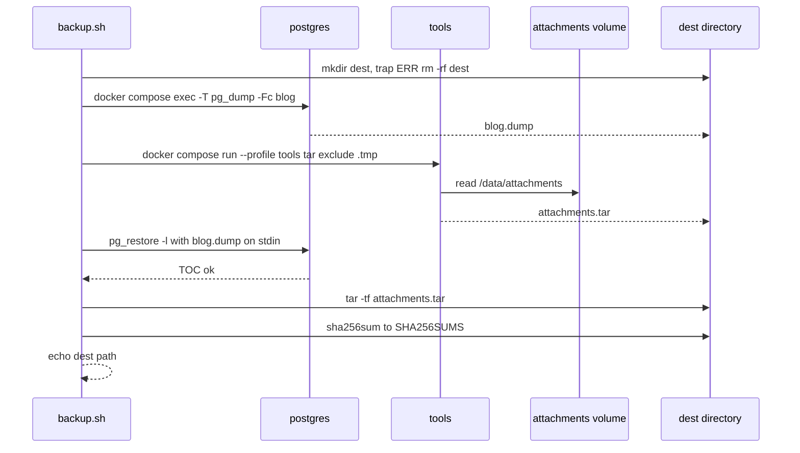
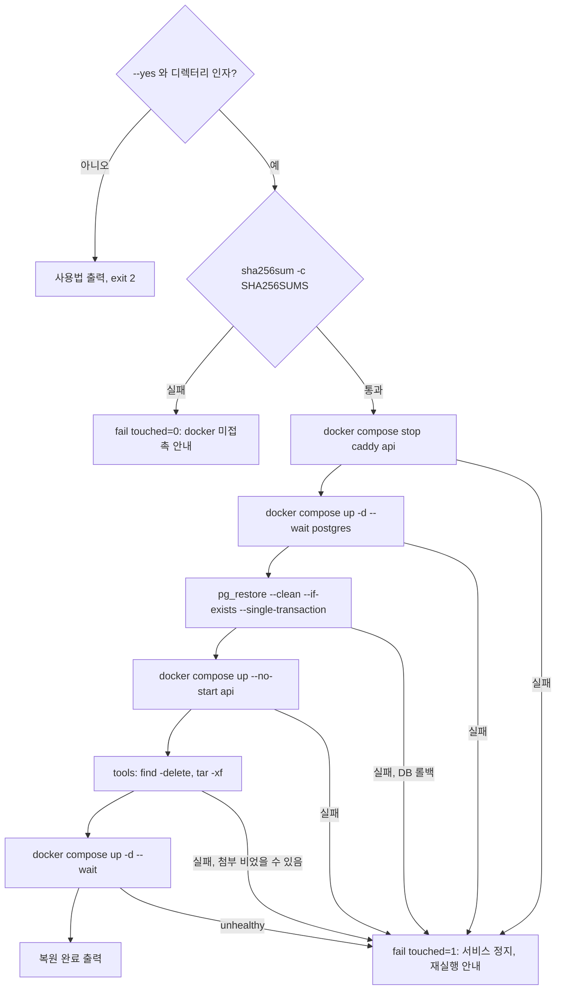
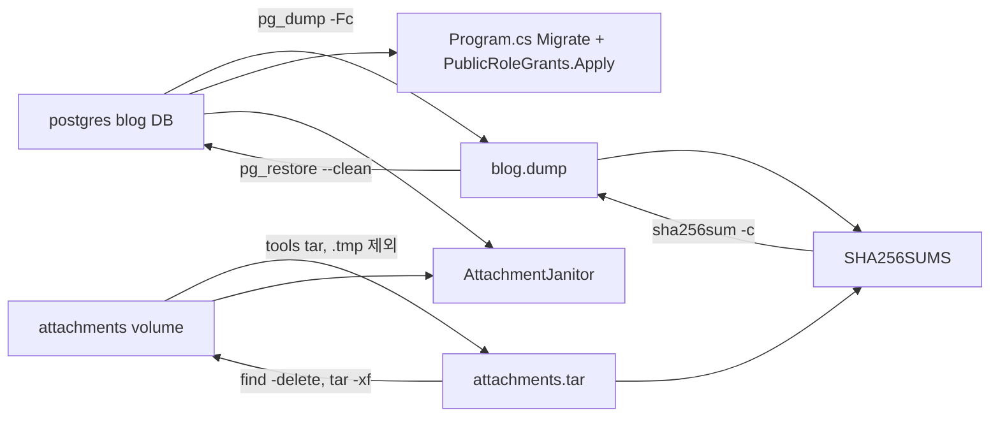

# F027 DB·첨부 백업과 복원

<!-- doc-harness:section id="summary" hash="9237d1fcf08bf5df79188550565691e4caddeef7fbb5903568d39ded781d055d" -->
## 한 줄 요약

결론: F027은 애플리케이션 코드가 아니다. deploy/ 아래 두 bash 스크립트가 docker compose 서비스(postgres·tools·api·caddy)를 조작해 수행하는 운영 절차다. backup.sh는 무중단으로 동작한다. DB 덤프 → 첨부 tar 순서로 일관성을 잡고(행 없는 파일은 허용하고 AttachmentJanitor가 치운다), 읽기 검증과 SHA256SUMS를 남긴다. 어느 단계든 실패하면 ERR trap이 부분 백업 디렉터리를 지운다. restore.sh는 --yes와 체크섬 검증을 통과해야 쓰기 쪽(caddy·api)을 멈춘다. 그 뒤 postgres만 올려 단일 트랜잭션 pg_restore를 하고, api 컨테이너 생성으로 빈 볼륨 소유권(1654, 0700)을 맞춘 다음 tools로 첨부를 교체하고 전체를 기동한다. 기동 시 Program.cs가 Migrate()와 PublicRoleGrants.Apply를 다시 돌려 복원된 ACL을 코드 기준으로 되맞춘다. 실패 처리는 안내 메시지뿐이며 자동 롤백은 없다. 원자적인 구간은 pg_restore 한 단계뿐이다. 그래서 중간 실패 시 서비스 정지나 첨부 비어 있음 상태가 남을 수 있다. 검증은 deploy/smoke/run.sh의 복원 리허설이 맡는데, 빈 볼륨에 복원하는 경우만 다룬다.

| 항목 | 값 |
|---|---|
| 중요도 | INFRA |
| 상태 | ACTIVE |
| 진입점 | `CLI deploy/backup.sh [백업 루트]`, `CLI deploy/restore.sh --yes <백업 디렉터리>` |
| 의존 기능 | [F026](../09_FEATURES.md#f026), [F021](../09_FEATURES.md#f021), [F024](../09_FEATURES.md#f024) |

### 진입점 근거

| 내용 | 상태 | 근거 |
|---|---|---|
| deploy/backup.sh [백업 루트(기본 backups)]: 운영자나 cron이 직접 실행한다. 만든 디렉터리 경로를 마지막 줄에 출력한다. | CONFIRMED | `deploy/backup.sh` (1-3), `deploy/backup.sh` (32), `deploy/OPERATIONS.md` (80-87) |
| deploy/restore.sh --yes <백업 디렉터리>: --yes가 없거나 디렉터리 인자가 비면 사용법을 출력하고 exit 2로 끝난다. | CONFIRMED | `deploy/restore.sh` (3-13) |
| deploy/smoke/run.sh가 복원 리허설 단계에서 두 스크립트를 호출한다(seed → backup.sh smoke/backups → down -v → restore.sh --yes → verify-restore). | CONFIRMED | `deploy/smoke/run.sh` (92-98) |
| 운영 문서가 재배포 전 백업과 cron 일일 백업 예시를 권장한다. 스크립트 자체에는 스케줄러가 없다. | INFERRED | `deploy/OPERATIONS.md` (67), `deploy/OPERATIONS.md` (87) |
<!-- /doc-harness:section -->

<!-- doc-harness:section id="flow" hash="5c0158003f6565ac4c52674370c3f2d18c4afa5b6220c46ce434662d3d9e43bb" -->
## 처리 흐름

| 단계 | 컴포넌트 | 코드 | 설명 |
|---|---|---|---|
| 1 | backup.sh | `deploy/backup.sh` (스크립트 본문) 초기화 | set -euo pipefail과 MSYS_NO_PATHCONV=1을 설정한다. cd 전에 호출자 cwd를 caller_pwd에 저장하고 deploy/로 이동한 뒤 umask 077을 적용한다(백업 파일이 700/600으로 생긴다). |
| 2 | backup.sh | `deploy/backup.sh` root/dest 계산 | 인자(기본 backups)가 상대경로이면 caller_pwd 기준으로 푼다. mkdir -p root를 한 뒤 dest=root/<UTC yyyymmddTHHMMSSZ>를 -p 없이 mkdir한다. 같은 초에 두 번 실행되면 여기서 실패한다. |
| 3 | backup.sh | `deploy/backup.sh` trap ERR | 이후 어느 단계에서든 명령이 실패하면 rm -rf "$dest"로 부분 백업을 지우도록 ERR trap을 건다. |
| 4 | postgres (compose 서비스) | `deploy/backup.sh` docker compose exec -T postgres pg_dump | 실행 중인 postgres 컨테이너에서 pg_dump -U postgres -Fc blog를 실행하고, 표준출력을 호스트의 $dest/blog.dump로 리다이렉트한다. |
| 5 | tools (compose 서비스) | `deploy/backup.sh` docker compose --profile tools run --rm -T --no-deps tools | tools 컨테이너(postgres 이미지, uid 1654, network_mode none, read_only)에서 tar -C /data/attachments --exclude=./.tmp -cf - .를 실행하고 $dest/attachments.tar로 받는다. DB 덤프 뒤에 파일을 묶는 순서 자체가 일관성 전략이다. |
| 6 | postgres (compose 서비스) | `deploy/backup.sh` pg_restore -l | blog.dump를 stdin으로 넘겨 pg_restore -l(목차 나열)을 실행한다. 읽을 수 있는 덤프인지만 확인한다. |
| 7 | backup.sh (호스트 tar·sha256sum) | `deploy/backup.sh` tar -tf / sha256sum | 호스트에서 tar -tf로 attachments.tar 구조를 확인한다. 이어 dest 안에서 sha256sum blog.dump attachments.tar > SHA256SUMS를 기록하고 dest 경로를 echo한다. |
| 8 | restore.sh | `deploy/restore.sh` 인자 검사 | $1 == --yes이고 $2가 비어 있지 않은지 확인한다. 아니면 stderr에 사용법을 출력하고 exit 2로 끝난다. |
| 9 | restore.sh | `deploy/restore.sh` fail() / trap ERR | touched=0에서 시작한다. fail()은 docker를 건드렸는지(touched)에 따라 다른 안내 문구를 stderr로 출력하며, ERR trap에 연결된다. |
| 10 | restore.sh | `deploy/restore.sh` src 해석 + sha256sum -c | 백업 디렉터리를 절대경로로 해석한다(상대경로는 caller_pwd 기준). 그 디렉터리에서 sha256sum -c SHA256SUMS로 무결성을 확인한다. 여기까지는 docker를 건드리지 않는다. |
| 11 | caddy·api (compose 서비스) | `deploy/restore.sh` docker compose stop caddy api | touched=1로 바꾸고 쓰는 쪽 서비스(caddy·api)를 멈춘다. 없는 서비스를 멈추는 것은 오류가 아니다. |
| 12 | postgres (compose 서비스) | `deploy/restore.sh` docker compose up -d --wait postgres | postgres만 올리고 healthcheck(pg_isready -U blog_app -d blog)가 통과할 때까지 기다린다. 빈 pgdata이면 postgres-init/10-roles.sh가 blog_app·blog_public 롤과 빈 blog DB를 만든다. |
| 13 | postgres (compose 서비스) | `deploy/restore.sh` pg_restore --clean --if-exists --single-transaction | blog.dump를 stdin으로 넘겨 postgres 슈퍼유저로 blog DB에 복원한다. 덤프에 들어 있는 객체를 드롭한 뒤 다시 만들고 데이터를 적재하며, 전체가 한 트랜잭션이다. |
| 14 | api (compose 서비스) | `deploy/restore.sh` docker compose up --no-start api | api 컨테이너를 생성만 한다. 빈 attachments 볼륨은 이때 이미지의 /data/attachments(1654 소유, 0700)로 초기화된다. 이 단계를 건너뛰면 tools(1654)가 root 소유의 새 볼륨에 쓸 수 없다. |
| 15 | tools (compose 서비스) | `deploy/restore.sh` find -delete && tar -xf - | tools 컨테이너에서 /data/attachments 아래를 전부 지운 뒤(.tmp 포함) attachments.tar를 stdin으로 받아 푼다. |
| 16 | docker compose (전체 스택) | `deploy/restore.sh` docker compose up -d --wait | 전체 서비스를 올리고 healthy가 될 때까지 기다린 뒤 '복원 완료: <src>'를 출력한다. |
| 17 | Program (PortfolioBlog.Api) | `PortfolioBlog.Api/Program.cs` Database.Migrate / PublicRoleGrants.Apply | api가 기동할 때 마이그레이션을 적용하고 blog_public 권한을 코드 기준으로 다시 맞춘다. pg_restore --clean이 덤프의 ACL로 되돌린 권한을 다시 정렬하는 단계다. |
| 18 | AttachmentJanitor | `PortfolioBlog.Api/Infrastructure/Storage/AttachmentJanitor.cs` SweepOnceAsync | 기동 직후와 6시간마다 돈다. 백업 시점 차이로 생긴 '행 없는 파일'(1시간 이상 된 참조 없는 파일)은 지우고, '파일 없는 행'은 경고 로그로 개수만 보고한다. |
<!-- /doc-harness:section -->

<!-- doc-harness:section id="F027_SEQUENCE" hash="4872c9b00a176d130fd1d8215af5a5f0c5595eeeff2d08f069aac69a829888c7" -->
## backup.sh 무중단 백업 순서 (Sequence Diagram)

backup.sh는 서비스를 멈추지 않는다. postgres에서 덤프를 먼저 받고 tools로 첨부를 묶은 뒤, 읽기 검증을 거쳐 SHA256SUMS를 남긴다.

컨테이너 서비스 이름은 deploy/docker-compose.yml의 postgres와 tools다. tools는 profile tools로만 뜨며 uid 1654, network_mode none, read_only이고 attachments 볼륨만 마운트한다. DB를 먼저 덤프하고 파일을 나중에 묶는 순서가 일관성 전략이다. 이 순서에서는 그 사이에 올라온 파일이 '행 없는 파일'이 될 뿐이다. 이 경로의 어느 명령이 실패해도 ERR trap이 dest를 지운다. 단, trap 설정 전의 mkdir 실패(같은 초 중복 실행)는 예외다. pg_restore -l은 DB에 접속하지 않고 목차만 확인한다.

### 코드 근거

| 구성 요소 | 코드 |
|---|---|
| backup.sh | `deploy/backup.sh` |
| postgres | `deploy/docker-compose.yml` (services.postgres) |
| tools | `deploy/docker-compose.yml` (services.tools) |
| attachments volume | `deploy/docker-compose.yml` (volumes.attachments) |
<!-- /doc-harness:section -->

<!-- doc-harness:section id="F027_FLOW" hash="7873fd0739d7dedad792db0801708642fc9ba458d72b026d007c424a33f80736" -->
## restore.sh 복원 분기와 실패 처리 (Flowchart)

restore.sh는 --yes와 체크섬을 통과해야 docker를 건드린다. 그 뒤 실패하면 touched=1 안내만 남기고 자동 롤백은 하지 않는다. DB 원자성은 pg_restore 단계에만 있다.

모든 노드는 deploy/restore.sh의 한 줄에 대응한다. touched 플래그는 서비스 정지 직전에 1이 되고, fail()이 두 가지 안내 문구 중 하나를 고른다. pg_restore는 단일 트랜잭션이라 실패 시 DB가 이전 상태로 남는다. 그러나 ToolsTar와 UpAll 실패 시점에는 DB가 이미 백업 내용이다. 이때 첨부는 비어 있을 수 있어, 안내 문구의 'up -d로 이전 상태 복귀'가 성립하지 않는다. 최종 UpAll에서 api 기동 시 Program.cs가 Migrate()와 PublicRoleGrants.Apply를 실행한다.

### 코드 근거

| 구성 요소 | 코드 |
|---|---|
| ArgCheck | `deploy/restore.sh` (인자 검사(10-13)) |
| ShaCheck | `deploy/restore.sh` (sha256sum -c(29)) |
| FailBefore | `deploy/restore.sh` (fail()) |
| FailAfter | `deploy/restore.sh` (fail()) |
| StopWriters | `deploy/restore.sh` |
| UpPostgres | `deploy/restore.sh` |
| PgRestore | `deploy/restore.sh` |
| CreateApi | `deploy/restore.sh` |
| ToolsTar | `deploy/restore.sh` |
| UpAll | `deploy/restore.sh` |
<!-- /doc-harness:section -->

<!-- doc-harness:section id="F027_DATAFLOW" hash="ac82409a5a6a30924ce37851e5f6d09559ddcdcf0e9a563bef10de578c036260" -->
## 백업 산출물과 복원 대상의 이동 (Data Flow Diagram)

blog DB와 attachments 볼륨이 각각 blog.dump와 attachments.tar로 나가고, SHA256SUMS가 둘을 묶는다. 복원은 같은 경로를 거꾸로 따른다. 이후 api 기동과 AttachmentJanitor가 권한과 불일치를 정리한다.

blog.dump·attachments.tar·SHA256SUMS는 backup.sh가 $dest(umask 077)에 만드는 실제 파일 이름이다. dpkeys·caddy_data·.env는 이 흐름에 없다. 복원 뒤 api가 기동하면 Program.cs가 마이그레이션과 공개 롤 권한 재부여를 수행한다. AttachmentJanitor는 DB 행과 파일을 대조해 참조 없는 파일을 지우고, 파일 없는 행은 경고만 한다.

### 코드 근거

| 구성 요소 | 코드 |
|---|---|
| BlogDb | `deploy/docker-compose.yml` (services.postgres) |
| AttachmentsVolume | `deploy/docker-compose.yml` (volumes.attachments) |
| BlogDump | `deploy/backup.sh` |
| AttachmentsTar | `deploy/backup.sh` |
| Sha256Sums | `deploy/backup.sh` |
| ProgramCs | `PortfolioBlog.Api/Program.cs` |
| AttachmentJanitor | `PortfolioBlog.Api/Infrastructure/Storage/AttachmentJanitor.cs` |
<!-- /doc-harness:section -->

<!-- doc-harness:section id="data" hash="e9b57cd2831235b54d812e3f86fb522f0fb4a66c404dbda4beeb0ec6f468b6b6" -->
## 데이터

### 데이터 흐름

| 내용 | 상태 | 근거 |
|---|---|---|
| 백업 DB 경로: postgres 컨테이너의 blog DB → pg_dump -Fc(표준출력) → docker compose exec -T 파이프 → 호스트 $dest/blog.dump(umask 077, 600). | CONFIRMED | `deploy/backup.sh` (12), `deploy/backup.sh` (24) |
| 백업 첨부 경로: attachments 볼륨(/data/attachments) → tools 컨테이너 tar -cf -(.tmp 제외) → 호스트 $dest/attachments.tar. | CONFIRMED | `deploy/backup.sh` (25), `deploy/docker-compose.yml` (113-125) |
| 무결성 기록: blog.dump와 attachments.tar의 sha256을 $dest/SHA256SUMS에 쓴다. restore.sh가 sha256sum -c로 이 파일을 대조한다. | CONFIRMED | `deploy/backup.sh` (30), `deploy/restore.sh` (29) |
| 복원 DB 경로: 호스트 $src/blog.dump → stdin → postgres 컨테이너 pg_restore -U postgres -d blog --clean --if-exists --single-transaction. | CONFIRMED | `deploy/restore.sh` (35) |
| 복원 첨부 경로: 호스트 $src/attachments.tar → stdin → tools 컨테이너 find -delete 후 tar -xf - → attachments 볼륨. | CONFIRMED | `deploy/restore.sh` (40) |
| 백업하지 않는 것: dpkeys 볼륨(세션 암호화 키), caddy_data(인증서), .env(비밀값). 복원 뒤에는 관리자 재로그인과 인증서 재발급이 필요하고, .env는 따로 보관해야 한다. | CONFIRMED | `deploy/backup.sh` (7), `deploy/OPERATIONS.md` (85) |
| 업로드는 .tmp 아래 임시 파일에 먼저 쓴 뒤 File.Move(overwrite:false)로 최종 내용 주소 경로에 옮긴다. .tmp를 제외한 tar에는 쓰는 중인 파일이 들어가지 않는다. | CONFIRMED | `PortfolioBlog.Api/Infrastructure/Storage/FileSystemAttachmentStore.cs` FileSystemAttachmentStore.SaveAsync (193-230), `deploy/backup.sh` (25) |

### DB 접근

| 엔티티 | 작업 | 코드 |
|---|---|---|
| blog 데이터베이스 전체(스키마·데이터·ACL) | SELECT | `deploy/backup.sh` pg_dump -U postgres -Fc blog |
| blog 데이터베이스 전체(덤프에 포함된 객체 DROP/CREATE, ACL 포함) | DDL | `deploy/restore.sh` pg_restore --clean --if-exists --single-transaction |
| blog 데이터베이스 전체 테이블 데이터 | INSERT | `deploy/restore.sh` pg_restore(데이터 적재) |
| blog_app·blog_public 롤, blog DB(빈 pgdata에서만) | DDL | `deploy/postgres-init/10-roles.sh` CREATE ROLE / CREATE DATABASE |
| __EFMigrationsHistory 및 스키마(복원 뒤 api 기동 시) | DDL | `PortfolioBlog.Api/Program.cs` adminDb.Database.Migrate |
| blog_public 테이블 권한(GRANT/REVOKE, 복원 뒤 api 기동 시) | DDL | `PortfolioBlog.Api/Program.cs` PublicRoleGrants.Apply |

### 상태 전이

| 이전 | 다음 | 트리거 | 근거 |
|---|---|---|---|
| 백업 디렉터리 없음 | $dest 생성됨(빈 디렉터리) | mkdir "$dest"(-p 없음) | `deploy/backup.sh` (20-21) |
| $dest 작성 중 | $dest 삭제됨 | trap ERR 이후 명령 실패 | `deploy/backup.sh` (22) |
| $dest 작성 중 | 완성 백업(blog.dump·attachments.tar·SHA256SUMS) | pg_restore -l·tar -tf 검증 통과 후 sha256sum 기록 | `deploy/backup.sh` (28-32) |
| restore touched=0(docker 미접촉) | touched=1 | sha256sum -c 통과 후 서비스 정지 직전 | `deploy/restore.sh` (15), `deploy/restore.sh` (32) |
| 스택 실행 중(caddy·api·postgres) | caddy·api 정지, postgres만 healthy | docker compose stop caddy api → up -d --wait postgres | `deploy/restore.sh` (33-34) |
| blog DB 현재 내용 | blog DB = 백업 내용 | pg_restore --single-transaction 커밋 | `deploy/restore.sh` (35) |
| attachments 볼륨 현재 내용(또는 빈 볼륨) | 백업 tar 내용 | up --no-start api → tools find -delete && tar -xf | `deploy/restore.sh` (37-40) |
| caddy·api 정지 | 전체 스택 healthy | docker compose up -d --wait | `deploy/restore.sh` (42-43) |

### 외부 의존

| 내용 | 상태 | 근거 |
|---|---|---|
| Docker와 docker compose CLI(exec·run --profile·stop·up --wait·up --no-start)가 필요하다. 두 스크립트 모두 cd deploy/ 후 기본 compose 파일을 쓴다. | CONFIRMED | `deploy/backup.sh` (11), `deploy/restore.sh` (8) |
| postgres:17.11-alpine 이미지의 pg_dump·pg_restore를 쓴다. tools 서비스도 같은 이미지이며, 여기서는 sh·tar·find만 쓴다. | CONFIRMED | `deploy/docker-compose.yml` (90), `deploy/docker-compose.yml` (113-125) |
| 호스트에 bash, tar, sha256sum, date가 있어야 한다(backup.sh의 tar -tf와 sha256sum, restore.sh의 sha256sum -c). | CONFIRMED | `deploy/backup.sh` (29-30), `deploy/restore.sh` (29) |
| compose 파일 보간에 ${DOMAIN:?} 같은 필수 변수가 있다. deploy/.env가 없거나 불완전하면 exec를 포함한 모든 compose 호출이 실패한다고 추정한다. | INFERRED | `deploy/docker-compose.yml` (32-35), `deploy/docker-compose.yml` (61-69), `deploy/docker-compose.yml` (98-100) |
| Windows Git Bash 경로 변환 방지를 위해 MSYS_NO_PATHCONV=1을 설정한다(Linux에서는 영향 없음). | CONFIRMED | `deploy/backup.sh` (9), `deploy/restore.sh` (6) |
<!-- /doc-harness:section -->

<!-- doc-harness:section id="failures" hash="6edb971f7e2dc860ff4c3cb0cfabb3e61843751ce67f6fda863ecf733ecc9d04" -->
## 실패 지점

| 위치 | 조건 | 처리 | 상태 | 근거 |
|---|---|---|---|---|
| deploy/backup.sh mkdir "$dest" | 같은 UTC 초에 백업이 두 번 실행되어 디렉터리가 이미 있음 | mkdir 실패, set -e로 종료. trap ERR 설정 전이라 다른 실행의 디렉터리를 지우지 않는다. | CONFIRMED | `deploy/backup.sh` (21-22) |
| deploy/backup.sh pg_dump / tools tar / pg_restore -l / tar -tf / sha256sum | 어느 명령이든 0이 아닌 종료 코드(postgres 미기동, 볼륨 권한, 디스크 부족, 덤프 손상 등) | trap ERR이 rm -rf "$dest"로 부분 백업을 지우고 set -e로 종료한다. 재시도는 없다. | CONFIRMED | `deploy/backup.sh` (8), `deploy/backup.sh` (22-30) |
| deploy/backup.sh docker compose exec -T postgres | postgres 서비스가 실행 중이 아님(exec는 컨테이너를 올리지 않음) | exec 실패 → ERR trap으로 부분 디렉터리 삭제 후 종료. | INFERRED | `deploy/backup.sh` (24) |
| deploy/backup.sh 실행 중 신호 | SIGINT·SIGTERM(Ctrl-C, cron 강제 종료)으로 중단 | ERR trap은 신호에 반응하지 않아 평문 덤프가 든 부분 디렉터리가 남을 수 있다. 다만 SHA256SUMS가 없으므로 restore.sh의 sha256sum -c가 이 디렉터리를 거부한다. | POTENTIAL_ISSUE | `deploy/backup.sh` (22), `deploy/restore.sh` (29) |
| deploy/restore.sh 인자 검사 | --yes 누락 또는 디렉터리 인자 없음 | 사용법을 stderr에 출력하고 exit 2. 아무것도 건드리지 않는다. | CONFIRMED | `deploy/restore.sh` (10-13) |
| deploy/restore.sh src 해석 / sha256sum -c | 디렉터리가 없음, SHA256SUMS 없음, 체크섬 불일치 | ERR trap의 fail()이 touched=0 안내(docker 미접촉, 서비스 그대로)를 출력하고 종료한다. | CONFIRMED | `deploy/restore.sh` (16-29) |
| deploy/restore.sh pg_restore | 덤프 적용 중 오류(스키마 충돌, 손상 등) | --single-transaction이라 DB는 복원 전 내용으로 롤백된다. fail()이 touched=1 안내를 출력하지만 caddy·api는 멈춘 채로 남는다. | CONFIRMED | `deploy/restore.sh` (17-18), `deploy/restore.sh` (33-35) |
| deploy/restore.sh tools find -delete && tar -xf | pg_restore 커밋 후 첨부 교체 중 실패 | 안내 메시지만 출력하고 롤백하지 않는다. DB는 이미 백업 내용이고 첨부는 비어 있거나 일부만 풀린 상태다. fail()이 권하는 'docker compose up -d로 이전 상태로 돌아간다'는 이 시점 이후에는 성립하지 않는다(이전 DB와 첨부가 이미 사라짐). 같은 백업으로 재실행해야 한다. | POTENTIAL_ISSUE | `deploy/restore.sh` (18), `deploy/restore.sh` (35-40) |
| deploy/restore.sh 최종 docker compose up -d --wait | api가 healthy가 되지 못함(예: 기동 시 Migrate() 실패, 비밀번호 불일치) | compose가 오류를 반환하고 fail()이 재실행을 안내한다. 원인이 설정이나 스키마라면 재실행으로는 해결되지 않는다. 대기 시간은 compose healthcheck(api: interval 30s·retries 3·start_period 40s, postgres: interval 10s·retries 12)에 묶인다. | POTENTIAL_ISSUE | `deploy/restore.sh` (42), `deploy/docker-compose.yml` (77-83), `deploy/docker-compose.yml` (106-110), `PortfolioBlog.Api/Program.cs` (85-87) |
| deploy/restore.sh up --no-start api 생략 시 | 빈 attachments 볼륨이 root 소유로 생성됨 | tools(1654)의 tar 풀기가 권한 오류로 실패한다. 이 단계가 바로 그 상황을 막는다. | CONFIRMED | `deploy/restore.sh` (37-39), `PortfolioBlog.Api/Dockerfile` (20-31) |

### 엣지 케이스

| 내용 | 상태 | 근거 |
|---|---|---|
| 백업 사이 시점 불일치: DB 덤프 후 tar 전에 올라온 파일은 '행 없는 파일'이 된다. 복원 뒤 AttachmentJanitor가 1시간 경과·참조 없음을 확인하고 지운다. 반대로 그 사이에 첨부를 지우면 '파일 없는 행'이 생긴다. 청소 잡은 이를 고치지 않고 경고로 개수만 보고하므로, 해당 이미지는 다시 올릴 때까지 404다. | CONFIRMED | `deploy/backup.sh` (5-6), `PortfolioBlog.Api/Infrastructure/Storage/AttachmentJanitor.cs` MinimumAge (32), `PortfolioBlog.Api/Infrastructure/Storage/AttachmentJanitor.cs` SweepOnceAsync (106), `PortfolioBlog.Api/Infrastructure/Storage/AttachmentJanitor.cs` SweepOnceAsync (117-122) |
| 복원 시 find -delete가 .tmp까지 지운다. SaveAsync가 매 호출 Directory.CreateDirectory(.tmp)로 다시 만들므로 업로드는 영향을 받지 않는다. | CONFIRMED | `deploy/restore.sh` (40), `PortfolioBlog.Api/Infrastructure/Storage/FileSystemAttachmentStore.cs` FileSystemAttachmentStore.SaveAsync (193) |
| 새 서버(빈 볼륨)에 복원: postgres 초기화 스크립트가 롤과 빈 DB를 만들고 restore.sh가 내용을 채운다. .env의 DB 비밀번호가 원래 서버와 같아야 앱이 접속할 수 있다. | CONFIRMED | `deploy/restore.sh` (4), `deploy/postgres-init/10-roles.sh` (20-30), `deploy/OPERATIONS.md` (85), `deploy/OPERATIONS.md` (88) |
| 더 새로운 스키마 위로 복원(마이그레이션 적용 후 되돌리기, OPERATIONS.md 4절 권장): pg_restore --clean은 덤프에 있는 객체만 드롭한다. 나중에 추가된 테이블이나 FK가 트랜잭션을 실패시키거나 남은 채로 있을 수 있다. 그러면 이전 __EFMigrationsHistory 기준으로 Migrate()가 같은 객체를 다시 만들려다 실패할 수 있다. | POTENTIAL_ISSUE | `deploy/restore.sh` (35), `deploy/OPERATIONS.md` (75), `PortfolioBlog.Api/Program.cs` (85) |
| pg_restore --clean은 ACL을 덤프 시점 것으로 되돌린다. api 기동 시 PublicRoleGrants.Apply가 권한을 다시 맞추며, 스모크는 이 경계를 복원 직후에 검사한다. | CONFIRMED | `deploy/smoke/run.sh` (100-116), `PortfolioBlog.Api/Program.cs` (87) |
| 상대경로 인자는 deploy/가 아니라 호출자 cwd 기준으로 푼다(backup root, restore src 모두). | CONFIRMED | `deploy/backup.sh` (10-18), `deploy/restore.sh` (7), `deploy/restore.sh` (25-28) |
| 백업 검증의 깊이: pg_restore -l은 목차만 읽고, tar -tf는 구조만 본다. SHA256SUMS는 기록된 바이트의 전송 무결성만 보장한다. 빈 tar가 백업 단계 검증을 통과할 수 있다는 것은 계획 문서에서 인정한 내용이다. | INFERRED | `deploy/backup.sh` (27-30), `docs/superpowers/plans/2026-09-22-tech-blog-deploy.md` (1974) |
| 백업과 복원, 또는 두 복원이 동시에 실행되는 것을 막는 잠금이 없다. | POTENTIAL_ISSUE | `deploy/backup.sh`, `deploy/restore.sh` |
| 스모크 리허설은 docker compose down -v 뒤 빈 볼륨에 복원하는 경로만 검증한다. 실행 중인 DB와 채워진 첨부 볼륨 위로 덮어쓰는 복원은 자동 검증되지 않는다. | CONFIRMED | `deploy/smoke/run.sh` (94-98) |
| 백업 디렉터리에는 글 전체와 첨부가 평문으로 들어 있다(암호화 없음). 보관 기간 정리나 오프사이트 복사는 스크립트 밖(운영 문서의 cron·find 예시)에 맡긴다. | CONFIRMED | `deploy/backup.sh` (12), `deploy/OPERATIONS.md` (86-87) |

### 로깅

| 내용 | 상태 | 근거 |
|---|---|---|
| backup.sh는 성공하면 표준출력 마지막 줄에 백업 디렉터리 경로만 출력한다. 호출자(smoke/run.sh)는 tail -n 1로 그 경로를 받는다. 전용 로그 파일은 없고, 운영 문서의 cron 예시가 출력을 /var/log/blog-backup.log로 리다이렉트한다. | CONFIRMED | `deploy/backup.sh` (32), `deploy/smoke/run.sh` (94), `deploy/OPERATIONS.md` (87) |
| restore.sh는 실패 시 fail()이 touched 상태에 따라 두 가지 안내 중 하나를 stderr에 쓰고, 성공 시 '복원 완료: <src>'를 출력한다. | CONFIRMED | `deploy/restore.sh` (16-22), `deploy/restore.sh` (43) |
| 복원 뒤 AttachmentJanitor가 청소 결과를 Information으로, 파일 없는 행 수를 Warning으로 남긴다. | CONFIRMED | `PortfolioBlog.Api/Infrastructure/Storage/AttachmentJanitor.cs` (59), `PortfolioBlog.Api/Infrastructure/Storage/AttachmentJanitor.cs` (122) |
<!-- /doc-harness:section -->

<!-- doc-harness:section id="code" hash="e6e8c80bdc167bc322a7846309ffd1436a5802de996c5779be9d61bf044cd623" -->
## 관련 코드

| 파일 | 심볼 | 역할 |
|---|---|---|
| `deploy/backup.sh` | backup.sh | entry |
| `deploy/restore.sh` | restore.sh / fail() | entry |
| `deploy/docker-compose.yml` | services.tools / services.postgres / services.api / volumes.attachments | config |
| `deploy/postgres-init/10-roles.sh` | blog_app·blog_public 롤, blog DB 생성 | config |
| `PortfolioBlog.Api/Dockerfile` | /data/attachments 0700, chown 1654, USER 1654 | config |
| `PortfolioBlog.Api/Program.cs` | adminDb.Database.Migrate / PublicRoleGrants.Apply | service |
| `PortfolioBlog.Api/Infrastructure/Storage/FileSystemAttachmentStore.cs` | SaveAsync(.tmp 쓰기 → File.Move) | data |
| `PortfolioBlog.Api/Infrastructure/Storage/AttachmentJanitor.cs` | SweepOnceAsync | service |
| `deploy/smoke/run.sh` | 복원 리허설 단계 | test |
| `deploy/smoke/smoke.test.mjs` | ROLE seed / verify-restore | test |
| `deploy/OPERATIONS.md` | 5. 백업과 복원(운영 문서) | config |

근거: `deploy/backup.sh` (1-33), `deploy/restore.sh` (1-44), `deploy/docker-compose.yml` (50-125), `deploy/postgres-init/10-roles.sh` (1-30), `PortfolioBlog.Api/Dockerfile` (20-31), `PortfolioBlog.Api/Program.cs` (85-87), `PortfolioBlog.Api/Infrastructure/Storage/FileSystemAttachmentStore.cs` FileSystemAttachmentStore.SaveAsync (193-230), `PortfolioBlog.Api/Infrastructure/Storage/AttachmentJanitor.cs` AttachmentJanitor.SweepOnceAsync (32-123), `deploy/smoke/run.sh` (92-116), `deploy/smoke/smoke.test.mjs` (346-381), `deploy/OPERATIONS.md` (64-90)
<!-- /doc-harness:section -->

<!-- doc-harness:section id="unknowns" hash="361165f4be7241e45492c143c2a4b08c662b443e42a6b91504d5f4008ab4057e" -->
## 확인하지 못한 것

- pg_dump·pg_restore가 postgres 컨테이너 안에서 비밀번호 없이 -U postgres로 접속되는 근거(로컬 소켓 trust 등 공식 이미지 기본 pg_hba 설정)는 저장소 코드로 직접 확인하지 못했다.
- pg_restore -l만으로 데이터 영역이 잘린 덤프를 검출할 수 있는지는 확인하지 못했다.
- 실행 중인 DB와 채워진 볼륨 위로 덮어쓰는 복원(특히 더 새로운 마이그레이션이 적용된 DB로 복원)의 실제 결과는 자동 검증이 없어 확인하지 못했다.
- docker compose up --wait에 --wait-timeout이 없을 때 compose 버전별 최대 대기 동작은 확인하지 못했다(healthcheck 설정에 묶인다고만 판단).
- 백업 파일의 오프사이트 복사·보관 기간 정리는 스크립트 밖이라 실제 운영에서 수행되는지 알 수 없다.
<!-- /doc-harness:section -->

<!-- doc-harness:section id="related" hash="e6b04ee08cc1bd1a2625cbb81ca24992b9da0467258ba6539a8ab5b4aeff04d8" -->
## 관련 문서

- [../09_FEATURES](../09_FEATURES.md)
- [../08_API](../08_API.md)
- [../07_DATA_MODEL](../07_DATA_MODEL.md)
- [../11_FAILURE_HISTORY](../11_FAILURE_HISTORY.md)
<!-- /doc-harness:section -->
