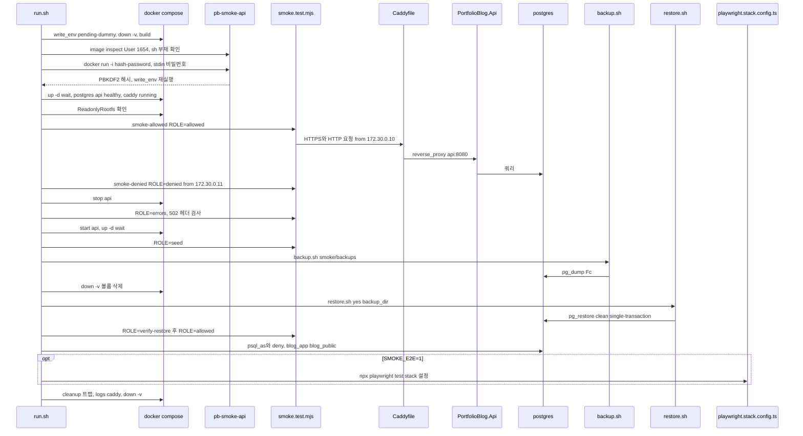
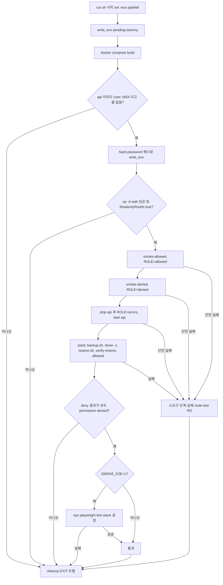
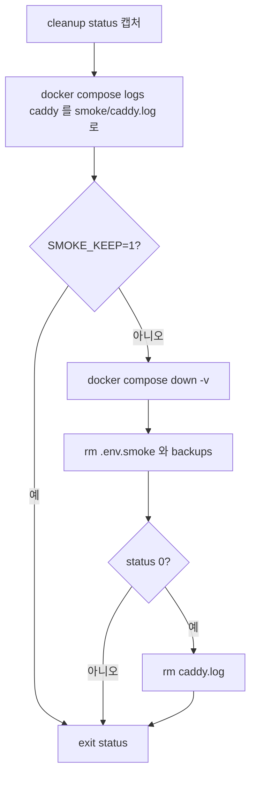
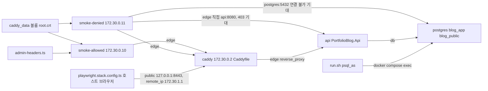
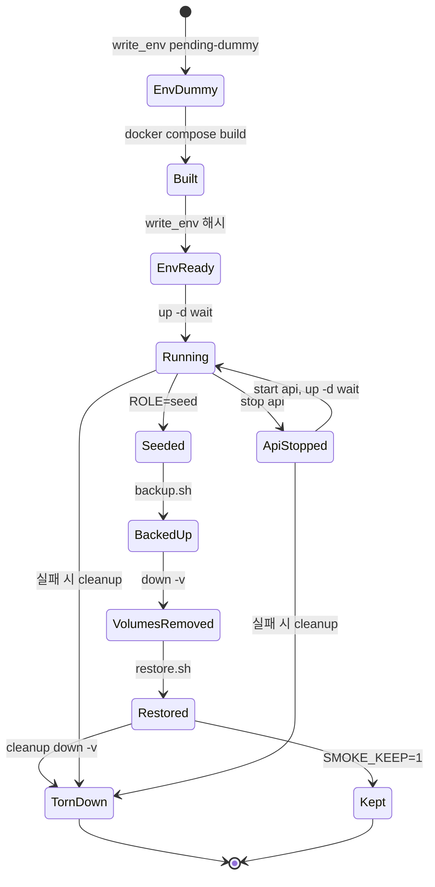

# F028 배포 스모크 검증

<!-- doc-harness:section id="summary" hash="172811616a0d95b31f6dc4dc98fa44e65936c9275d26096699d6f9ad9a00aef3" -->
## 한 줄 요약

결론: F028은 deploy/smoke/run.sh가 이끄는 순차 bash 파이프라인이다.

- **스택 기동**: 운영 compose에 스모크 오버레이를 얹어 COMPOSE_PROJECT_NAME=pb-smoke 스택을 빌드하고 `up -d --wait`로 기동한다. healthcheck가 있는 postgres·api는 healthy까지, healthcheck가 없는 caddy는 running까지 기다린다. caddy는 depends_on api service_healthy라서 api가 healthy가 된 뒤에야 시작된다.
- **검사 방식**: compose 네트워크 안의 Node 테스트 컨테이너 둘(smoke-allowed 172.30.0.10, smoke-denied 172.30.0.11)이 smoke.test.mjs를 ROLE별(allowed/denied/errors/seed/verify-restore)로 실행한다. Caddy·api·postgres는 블랙박스로 검증한다.
- **실패 처리**: 모든 단계가 순차로 돌고 재시도는 없다. set -euo pipefail이라 어느 명령이 실패해도 곧바로 cleanup EXIT 트랩으로 넘어간다. 트랩은 caddy 로그를 smoke/caddy.log에 남기고, SMOKE_KEEP이 1이 아니면 down -v로 볼륨까지 지운 뒤 `exit $status`로 원래 종료 코드를 돌려준다.
- **비밀값**: 실행마다 /dev/urandom으로 새로 만들어 smoke/.env.smoke(umask 077, .gitignore의 `.env.*`로 제외)에 둔다. 관리자 비밀번호 해시는 빌드된 api 이미지의 hash-password CLI가 stdin으로 받아 만든다.
- **복원 리허설**: 실제 backup.sh→down -v→restore.sh 순서를 그대로 쓴다.
- **DB 롤 검사**: 일부러 복원 직후에 psql -h postgres로 한다. pg_restore --clean이 ACL을 되돌리는 지점이 바로 그때이기 때문이다.

이번 재검증에서 고친 것:
- 6단계: caddy에는 healthcheck가 없어 running까지만 기다린다고 바로잡았다.
- F028_FLOW_CLEANUP: exitStatus 노드의 근거를 run.sh cleanup의 `exit $status`(57행)로 바로잡았다.
- backup.sh 실패 지점: 같은 초 mkdir 실패(21행)는 ERR 트랩(22행) 등록 전이라 아무것도 지우지 않는다는 점을 나눠 적었다.
- 모든 다이어그램에 summary·details·nodes를 채웠다.

| 항목 | 값 |
|---|---|
| 중요도 | INFRA |
| 상태 | ACTIVE |
| 진입점 | `CLI deploy/smoke/run.sh (환경변수 SMOKE_E2E, SMOKE_KEEP, SMOKE_HTTP_BIND)`, `CI .github/workflows/ci.yml job deploy-smoke: SMOKE_E2E=1 bash deploy/smoke/run.sh` |
| 의존 기능 | [F026](../09_FEATURES.md#f026), [F027](../09_FEATURES.md#f027), [F018](../09_FEATURES.md#f018), [F025](../09_FEATURES.md#f025), [F023](../09_FEATURES.md#f023), [F022](../09_FEATURES.md#f022), [F020](../09_FEATURES.md#f020), [F021](../09_FEATURES.md#f021), [F019](../09_FEATURES.md#f019), [F001](../09_FEATURES.md#f001), [F002](../09_FEATURES.md#f002), [F003](../09_FEATURES.md#f003), [F009](../09_FEATURES.md#f009), [F010](../09_FEATURES.md#f010), [F012](../09_FEATURES.md#f012), [F013](../09_FEATURES.md#f013), [F016](../09_FEATURES.md#f016), [F017](../09_FEATURES.md#f017) |

### 진입점 근거

| 내용 | 상태 | 근거 |
|---|---|---|
| 운영자가 로컬에서 deploy/smoke/run.sh를 직접 실행한다. SMOKE_E2E=1이면 Playwright까지 돌리고, SMOKE_KEEP=1이면 끝난 뒤에도 스택을 남긴다. SMOKE_HTTP_BIND로 HTTP 게시 포트를 덮어쓸 수 있다. | CONFIRMED | `deploy/smoke/run.sh` (1-14), `deploy/smoke/run.sh` (34-36) |
| CI의 deploy-smoke 잡은 test·web 잡 뒤에 돌고 timeout-minutes는 30이다. npm ci와 npx playwright install --with-deps chromium firefox를 마친 뒤 SMOKE_E2E=1 bash deploy/smoke/run.sh를 실행한다. 실패하면 PortfolioBlog.Web/test-results와 deploy/smoke/caddy.log를 아티팩트로 올린다. | CONFIRMED | `.github/workflows/ci.yml` deploy-smoke (102-132) |
| smoke.test.mjs는 직접 호출하지 않는다. run.sh가 docker compose run smoke-allowed/smoke-denied로 node --test 컨테이너를 띄우고, 그 안에서 ROLE 환경변수에 맞는 테스트 블록만 실행된다. smoke-denied는 ROLE: denied가 고정이고, smoke-allowed는 SMOKE_ROLE(기본값 allowed)을 받는다. | CONFIRMED | `deploy/docker-compose.smoke.yml` (10-55), `deploy/smoke/smoke.test.mjs` (78,275,323,351,370) |
<!-- /doc-harness:section -->

<!-- doc-harness:section id="flow" hash="865703bf7a19c201ee2c664277c8330388967e453cda321f94fc037b3c8c06c5" -->
## 처리 흐름

| 단계 | 컴포넌트 | 코드 | 설명 |
|---|---|---|---|
| 1 | run.sh | `deploy/smoke/run.sh` top-level | set -euo pipefail과 MSYS_NO_PATHCONV=1로 시작하고 deploy/로 cd한다. COMPOSE_PROJECT_NAME=pb-smoke, COMPOSE_FILE=docker-compose.yml:docker-compose.smoke.yml, COMPOSE_ENV_FILES=smoke/.env.smoke를 export한다. random()으로 admin(smoke- 접두)·postgres·blog_app·blog_public 비밀번호를 만든다. |
| 2 | run.sh | `deploy/smoke/run.sh` cleanup / trap cleanup EXIT | EXIT 트랩을 등록한다. 성공이든 실패든 종료할 때 caddy 로그를 저장한다. SMOKE_KEEP이 1이 아니면 스택과 볼륨을 내리고 .env.smoke와 backups를 지운다. 마지막에 exit $status로 끝낸다. |
| 3 | run.sh | `deploy/smoke/run.sh` write_env pending-dummy + docker compose build | compose가 변수 존재를 요구하므로 해시 자리에 pending-dummy를 넣어 .env.smoke를 쓴다. 이전 실행이 남긴 스택을 down -v --remove-orphans로 지운 뒤(\|\| true) caddy·api 이미지를 빌드한다. |
| 4 | run.sh | `deploy/smoke/run.sh` 이미지 검사 | docker image inspect로 pb-smoke-api의 Config.User가 1654인지 확인한다. docker run --entrypoint /bin/sh가 성공하면, 즉 셸이 있으면 exit 1로 끝낸다. |
| 5 | HashPasswordCommand | `PortfolioBlog.Api/Infrastructure/Access/HashPasswordCommand.cs` HashPasswordCommand.Run | run.sh가 관리자 비밀번호를 stdin으로 docker run --rm -i pb-smoke-api hash-password에 넘긴다. Program.cs는 args가 [hash-password]이면 웹 호스트 없이 Run을 부른다. -t가 없어 Console.IsInputRedirected가 true이므로 interactive:false가 되고 input.ReadLine()으로 읽는다. 12~256자를 벗어나면 1을 반환한다. run.sh는 출력의 마지막 줄(PBKDF2 해시)을 받아 test -n으로 확인하고 write_env를 다시 실행한다. |
| 6 | docker-compose.yml | `deploy/docker-compose.yml` services caddy/api/postgres | docker compose up -d --wait로 기동한다. healthcheck가 있는 것은 postgres(pg_isready)와 api(dotnet PortfolioBlog.Api.dll healthcheck)뿐이라 이 둘만 healthy가 될 때까지 기다린다. caddy는 compose healthcheck가 없고 PortfolioBlog.Web/Dockerfile에도 HEALTHCHECK가 없어 running까지만 기다린다. 기동 순서는 depends_on으로 정해진다. api는 postgres가 service_healthy가 된 뒤, caddy는 api가 service_healthy가 된 뒤 시작한다. 이어서 pb-smoke-api-1의 HostConfig.ReadonlyRootfs가 true인지 확인한다. |
| 7 | smoke.test.mjs (ROLE=allowed) | `deploy/smoke/smoke.test.mjs` ROLE === 'allowed' | 172.30.0.10에서 다음을 검사한다. - 공개 페이지·헬스와 보안 헤더 - 모든 표기의 /api 경로가 Caddy에서 404로 끊기는지 - 모르는 Host가 폴백 404로 끊기는지 - HTTP→HTTPS 308 - 공개 사이트의 405, 414/431 - 관리 SPA 헤더(admin-headers.ts 값+HSTS), SPA 폴백, /assets 캐시 - CSRF 헤더(403/200/401)  이어서 로그인→첨부 업로드→글 작성→공개 페이지·첨부·피드 확인→정리→업로드 경계(10MiB 근처 통과, 초과 413, chunked 12MiB 413)→로그아웃까지 진행한다. |
| 8 | smoke.test.mjs (ROLE=denied) | `deploy/smoke/smoke.test.mjs` ROLE === 'denied' | 172.30.0.11에서 다음을 검사한다. - X-Forwarded-For·X-Real-IP·Forwarded를 위조해도 관리 사이트 전 경로가 본문 없는 404인지 - 평문 HTTP도 404인지(308로 새지 않는지) - SNI는 공개 도메인, Host는 관리 도메인으로 바꾼 요청이 404인지 - 공개 사이트는 200인지 - api:8080에 직접 붙으면 403인지 - postgres:5432에 연결되지 않는지 |
| 9 | smoke.test.mjs (ROLE=errors) | `deploy/smoke/smoke.test.mjs` ROLE === 'errors' | run.sh가 docker compose stop api로 api를 멈추고 --no-deps로 smoke-allowed를 실행한다. 공개 /health와 관리 /api/auth/me가 본문 없는 502인지, 해당 사이트의 보안 헤더는 붙되 Server·Via는 없는지 본다. 끝나면 api를 start하고 up -d --wait로 되돌린다. |
| 10 | smoke.test.mjs (ROLE=seed) | `deploy/smoke/smoke.test.mjs` ROLE === 'seed' | 로그인한 뒤 결정적 PNG(makePng(200_000, 7))를 업로드하고, 응답의 sha256이 원본 바이트의 sha256과 같은지 확인한다. 그다음 slug restore-rehearsal에 태그 '복원'을 단 글을 만든다. |
| 11 | backup.sh | `deploy/backup.sh` top-level | run.sh가 ./backup.sh smoke/backups를 실행하고, 출력의 마지막 줄(백업 디렉터리)을 backup_dir로 받는다. backup.sh의 순서는 다음과 같다. 1. pg_dump -Fc로 DB를 덤프한다. 2. tools 서비스의 tar로 첨부를 묶는다. 3. pg_restore -l과 tar -tf로 읽을 수 있는 백업인지 확인한다. 4. SHA256SUMS를 만든다. |
| 12 | restore.sh | `deploy/restore.sh` top-level | run.sh가 docker compose down -v --remove-orphans로 볼륨을 모두 지운 뒤 ./restore.sh --yes backup_dir를 실행한다. restore.sh의 순서는 다음과 같다. 1. sha256sum -c로 백업을 확인한다. 2. caddy·api를 멈춘다. 3. postgres를 기동한다(init 스크립트가 롤과 DB를 만든다). 4. pg_restore --clean --if-exists --single-transaction을 실행한다. 5. api를 up --no-start로 만들어 attachments 볼륨을 초기화한다. 6. tools로 첨부를 되돌린다. 7. up -d --wait로 스택을 올린다. |
| 13 | smoke.test.mjs (ROLE=verify-restore, allowed) | `deploy/smoke/smoke.test.mjs` ROLE === 'verify-restore' | 공개 /posts/restore-rehearsal에서 img src를 뽑아 첨부 바이트의 sha256이 seed PNG와 같은지 보고, /tags/복원이 200인지 확인한다. 이어서 run.sh가 복원된 스택에서 ROLE=allowed 전 과정을 다시 돌린다(새 dpkeys, 권한 재부여). |
| 14 | run.sh | `deploy/smoke/run.sh` psql_as / deny | docker compose exec postgres psql -h postgres로 DB 롤을 검사한다. -h postgres로 붙어야 scram 인증이 강제된다.  통과해야 하는 검사: - blog_app·blog_public 두 롤이 superuser·createrole·createdb가 아닌지(count=2) - blog_public이 Posts를 SELECT할 수 있는지  반드시 'permission denied' 메시지로 실패해야 하는 문장: - blog_public의 DELETE, read_only 우회 뒤 DELETE, CREATE TABLE - blog_public의 AdminState·__EFMigrationsHistory 조회 - blog_app의 COPY TO PROGRAM |
| 15 | playwright.stack.config.ts | `PortfolioBlog.Web/playwright.stack.config.ts` defineConfig | SMOKE_E2E=1일 때만 실행한다. PortfolioBlog.Web 서브셸에서 E2E_SPA_ORIGIN=https://admin.blog.localhost:8443과 E2E_ADMIN_PASSWORD를 넣고 npx playwright test -c playwright.stack.config.ts를 실행한다. e2e 디렉터리 테스트를 chromium·firefox에서 workers 1, retries 0으로 돈다. |
| 16 | run.sh | `deploy/smoke/run.sh` cleanup | '통과' 단계를 출력하고 종료하면 EXIT 트랩이 실행된다. caddy 로그를 저장하고, SMOKE_KEEP이 1이 아니면 down -v를 하고 .env.smoke·backups를 지운다. 성공했으면 caddy.log도 지운다. 마지막에 exit $status로 원래 종료 코드를 돌려준다. |
<!-- /doc-harness:section -->

<!-- doc-harness:section id="F028_SEQUENCE" hash="3b779f03233067f058741b82b16dae7d8a37e46248f8ef820517c29e07b4e0dc" -->
## run.sh 스모크 실행 순서 (Sequence Diagram)

run.sh가 빌드·이미지 검사·해시 생성·기동·ROLE별 스모크·복원 리허설·DB 롤 검사·(옵션) E2E를 순서대로 호출하고, 마지막에 cleanup 트랩이 스택을 내린다.

- pb-smoke-api(apiImage)는 빌드된 이미지를 일회성 docker run으로 부르는 참가자다. 이미지 사용자·셸 부재를 검사하고, HashPasswordCommand로 해시를 만든다.
- PortfolioBlog.Api(apiService)는 compose가 띄운 실행 중인 api 서비스다.
- smoke.test.mjs는 smoke-allowed·smoke-denied 컨테이너 안에서 돌며, Caddy를 거쳐 api에 닿는다.
- up -d wait는 postgres·api는 healthy까지, healthcheck가 없는 caddy는 running까지만 기다린다.
- 복원 리허설은 backup.sh의 pg_dump와 restore.sh의 pg_restore를 거친다.
- DB 롤 검사는 run.sh가 docker compose exec로 postgres에서 psql을 직접 실행한다.

### 코드 근거

| 구성 요소 | 코드 |
|---|---|
| runSh | `deploy/smoke/run.sh` (run.sh top-level) |
| compose | `deploy/docker-compose.smoke.yml` (COMPOSE_FILE 오버레이) |
| apiImage | `PortfolioBlog.Api/Infrastructure/Access/HashPasswordCommand.cs` (HashPasswordCommand.Run (이미지: PortfolioBlog.Api/Dockerfile)) |
| smokeTest | `deploy/smoke/smoke.test.mjs` (ROLE 블록) |
| caddy | `deploy/Caddyfile` (사이트 블록·@denied·handle_errors) |
| apiService | `deploy/docker-compose.yml` (services.api) |
| postgres | `deploy/docker-compose.yml` (services.postgres) |
| backupSh | `deploy/backup.sh` (backup.sh) |
| restoreSh | `deploy/restore.sh` (restore.sh) |
| playwright | `PortfolioBlog.Web/playwright.stack.config.ts` (defineConfig) |
<!-- /doc-harness:section -->

<!-- doc-harness:section id="F028_FLOW" hash="312400fc42834dc4bf31a37dce74178a10ff6991dc153f653bb8cd8501166460" -->
## run.sh 본 흐름과 실패 분기 (Level 1) (Flowchart)

본 흐름은 분기 없는 순차 실행이다. 어떤 검사든 실패하면 재시도 없이 곧바로 cleanup EXIT 트랩으로 빠진다.

- set -euo pipefail 때문에 test 실패, node --test 비0, backup·restore 실패, deny의 exit 1, Playwright 실패가 모두 스크립트를 끝낸다. 그러면 트랩이 실행된다.
- composeUp 판단은 postgres·api healthy와 caddy running(healthcheck 없음)이 기준이다. 이어서 api 컨테이너의 ReadonlyRootfs를 확인한다.
- 성공 경로도 '통과'를 출력한 뒤 같은 트랩을 거쳐 종료한다. 트랩의 세부 동작은 F028_FLOW_CLEANUP에서 다룬다.

### 코드 근거

| 구성 요소 | 코드 |
|---|---|
| runStart | `deploy/smoke/run.sh` (set -euo pipefail (5행)) |
| writeEnvDummy | `deploy/smoke/run.sh` (write_env pending-dummy (64행)) |
| composeBuild | `deploy/smoke/run.sh` (docker compose build (66행)) |
| imageCheck | `deploy/smoke/run.sh` (이미지 검사 (69-70행)) |
| hashPassword | `PortfolioBlog.Api/Infrastructure/Access/HashPasswordCommand.cs` (HashPasswordCommand.Run (run.sh 73-75행에서 호출)) |
| composeUp | `deploy/docker-compose.yml` (healthcheck postgres/api, caddy depends_on (run.sh 78-79행)) |
| roleAllowed | `deploy/smoke/smoke.test.mjs` (ROLE === 'allowed') |
| roleDenied | `deploy/smoke/smoke.test.mjs` (ROLE === 'denied') |
| roleErrors | `deploy/smoke/smoke.test.mjs` (ROLE === 'errors' (run.sh 86-90행)) |
| rehearsal | `deploy/smoke/run.sh` (복원 리허설 (92-98행)) |
| dbRoles | `deploy/smoke/run.sh` (psql_as / deny (105-116행)) |
| playwrightStack | `PortfolioBlog.Web/playwright.stack.config.ts` (defineConfig (run.sh 118-121행)) |
| cleanupTrap | `deploy/smoke/run.sh` (cleanup / trap cleanup EXIT (47-59행)) |
<!-- /doc-harness:section -->

<!-- doc-harness:section id="F028_FLOW_CLEANUP" hash="566dcc05e80f4648e4460126f5c8acc547eaac9fdff4a0c486d8bb7545595ea4" -->
## cleanup EXIT 트랩 (Level 2) (Flowchart)

cleanup은 종료 코드를 먼저 잡아 두고, caddy 로그를 남긴 뒤 SMOKE_KEEP에 따라 정리한다. 마지막에 exit $status로 원래 종료 코드를 그대로 돌려준다.

- 모든 노드가 deploy/smoke/run.sh의 cleanup 함수(47-58행) 안에 있다.
- logs와 down은 || true라서 정리 실패가 종료 코드를 바꾸지 않는다.
- caddy.log는 성공했을 때만 지운다. 따라서 실패 시에만 남는다.
- CI의 upload-artifact는 이 트랩의 일부가 아니다. run.sh가 끝난 뒤 도는 별도 워크플로 단계라서 이 다이어그램에 넣지 않았다.

### 코드 근거

| 구성 요소 | 코드 |
|---|---|
| cleanupTrap | `deploy/smoke/run.sh` (cleanup — status=$? (47-48행)) |
| caddyLog | `deploy/smoke/run.sh` (cleanup — docker compose logs caddy (51행)) |
| keepCheck | `deploy/smoke/run.sh` (cleanup — SMOKE_KEEP 검사 (52행)) |
| composeDown | `deploy/smoke/run.sh` (cleanup — docker compose down -v --remove-orphans (53행)) |
| removeSecrets | `deploy/smoke/run.sh` (cleanup — rm -rf smoke/.env.smoke smoke/backups (54행)) |
| statusCheck | `deploy/smoke/run.sh` (cleanup — [ "$status" -eq 0 ] (55행)) |
| removeLog | `deploy/smoke/run.sh` (cleanup — rm -f smoke/caddy.log (55행)) |
| exitStatus | `deploy/smoke/run.sh` (cleanup — exit $status (57행)) |
<!-- /doc-harness:section -->

<!-- doc-harness:section id="F028_ARCHITECTURE" hash="6a85f95ced005394e041dcbbdd5ab8c35d8fb1191ec47efb7aebbdb72c646287" -->
## 스모크 클라이언트와 네트워크 토폴로지 (Architecture)

스모크 클라이언트는 edge 망의 고정 IP 두 개(허용·거부)로 caddy에 붙는다. 호스트 브라우저는 public 망 게이트웨이 주소로 도착한다. 이 주소 차이로 IP 허용 목록을 검증한다.

- smoke-allowed(172.30.0.10)·smoke-denied(172.30.0.11)는 edge 망에서 caddy 172.30.0.2에 붙는다.
- smoke-denied는 api:8080 직접 접속(403 기대)과 postgres:5432 도달 불가도 확인한다. postgres는 db 망에만 있다.
- 호스트의 Playwright는 127.0.0.1:8443 게시 포트를 거치므로, remote_ip가 public 게이트웨이 172.30.1.1이 된다.
- caddy_data 볼륨의 root.crt가 두 스모크 컨테이너의 TLS 신뢰 근거다.
- admin-headers.ts가 기대 헤더 값의 정본이다.
- run.sh는 docker compose exec로 postgres에 psql을 직접 실행한다.

### 코드 근거

| 구성 요소 | 코드 |
|---|---|
| smokeAllowed | `deploy/docker-compose.smoke.yml` (services.smoke-allowed) |
| smokeDenied | `deploy/docker-compose.smoke.yml` (services.smoke-denied) |
| caddy | `deploy/Caddyfile` (@denied not remote_ip) |
| api | `deploy/docker-compose.yml` (services.api) |
| postgres | `deploy/docker-compose.yml` (services.postgres) |
| hostPlaywright | `PortfolioBlog.Web/playwright.stack.config.ts` (defineConfig) |
| caddyData | `deploy/docker-compose.smoke.yml` (volumes caddy_data:/caddy-data:ro) |
| adminHeaders | `PortfolioBlog.Web/admin-headers.ts` (ADMIN_SECURITY_HEADERS) |
| runSh | `deploy/smoke/run.sh` (psql_as) |
<!-- /doc-harness:section -->

<!-- doc-harness:section id="F028_STATE" hash="0eb8328eff7b6cba13a28921376cf5afee98f50e7929e9e2f906485610a5d38e" -->
## 스모크 스택 수명 주기 (State Diagram)

스택은 가짜 env → 빌드 → 실제 env → 기동을 거친 뒤, api 정지·복귀와 시드·백업·볼륨 삭제·복원을 차례로 지난다. 끝나면 cleanup에서 TornDown 또는 Kept로 끝난다.

- 상태 이름은 분석을 위해 붙인 이름이다. 코드에 상태 변수는 없고, run.sh의 명령 순서가 곧 상태 전이다.
- 어느 상태에서든 실패하면 EXIT 트랩이 실행된다. 다이어그램에는 대표로 Running·ApiStopped에서의 실패 전이만 그렸다.
- ApiStopped에서 실패하고 SMOKE_KEEP=1이면 api가 멈춘 채로 남는다.

### 코드 근거

| 구성 요소 | 코드 |
|---|---|
| EnvDummy | `deploy/smoke/run.sh` (write_env pending-dummy (64행)) |
| Built | `deploy/smoke/run.sh` (docker compose build (66행)) |
| EnvReady | `deploy/smoke/run.sh` (write_env "$hash" (75행)) |
| Running | `deploy/smoke/run.sh` (docker compose up -d --wait (78행)) |
| ApiStopped | `deploy/smoke/run.sh` (docker compose stop api (87행)) |
| Seeded | `deploy/smoke/smoke.test.mjs` (ROLE === 'seed') |
| BackedUp | `deploy/backup.sh` (backup.sh) |
| VolumesRemoved | `deploy/smoke/run.sh` (docker compose down -v --remove-orphans (95행)) |
| Restored | `deploy/restore.sh` (restore.sh) |
| TornDown | `deploy/smoke/run.sh` (cleanup down -v (53행)) |
| Kept | `deploy/smoke/run.sh` (cleanup SMOKE_KEEP 검사 (52행)) |
<!-- /doc-harness:section -->

<!-- doc-harness:section id="data" hash="5ba361b4c485dd93cc072b9f93f2fa7c0283e52eb8cfdc15c12a7a340b6eb969" -->
## 데이터

### 데이터 흐름

| 내용 | 상태 | 근거 |
|---|---|---|
| 비밀값 흐름: random()은 /dev/urandom 18바이트를 base64로 바꾼 뒤 영숫자만 남겨 20자로 자른다. 이 값이 pg/app/public 비밀번호와 admin_password(smoke- 접두)가 되고, write_env가 smoke/.env.smoke에 쓴다. COMPOSE_ENV_FILES가 이 파일을 compose 보간에 넣어 다음 환경변수로 퍼뜨린다: postgres의 POSTGRES_PASSWORD 등, api의 ConnectionStrings·Admin__PasswordHash, smoke 컨테이너의 SMOKE_ADMIN_PASSWORD. | CONFIRMED | `deploy/smoke/run.sh` (14-45), `deploy/docker-compose.yml` (31-35,60-70,97-100), `deploy/docker-compose.smoke.yml` (23-31) |
| 관리자 비밀번호는 명령줄 인수가 아니라 stdin으로 hash-password에 들어간다. docker run -i에 -t가 없으므로 Program.cs의 !Console.IsInputRedirected가 false가 되어 비대화형 경로(input.ReadLine())를 탄다. 출력의 마지막 줄(PBKDF2 해시)은 ADMIN_PASSWORD_HASH로 .env.smoke에 쓰이고, compose가 이를 api의 Admin__PasswordHash로 넘긴다. | CONFIRMED | `deploy/smoke/run.sh` (72-75), `PortfolioBlog.Api/Program.cs` (16-19), `PortfolioBlog.Api/Infrastructure/Access/HashPasswordCommand.cs` HashPasswordCommand.Run (36-48), `deploy/docker-compose.yml` (69) |
| admin_origin(https://admin.blog.localhost:8443) 한 값을 .env.smoke의 ADMIN_ORIGIN과 Playwright의 E2E_SPA_ORIGIN 양쪽에 쓴다. | CONFIRMED | `deploy/smoke/run.sh` (18-19,27,120) |
| 기대 헤더 값: PortfolioBlog.Web/admin-headers.ts를 /web/admin-headers.ts로 읽기 전용 마운트하고, smoke.test.mjs가 ADMIN_SECURITY_HEADERS를 import한다. 그래서 SPA 헤더의 정본이 하나로 유지된다. .ts 파일을 import할 수 있는 이유는 node:24 이미지의 타입 제거 기능으로 보인다. | INFERRED | `deploy/docker-compose.smoke.yml` (12,37), `deploy/smoke/smoke.test.mjs` (11), `PortfolioBlog.Web/admin-headers.ts` ADMIN_SECURITY_HEADERS (26) |
| TLS 신뢰: caddy_data 볼륨을 smoke 컨테이너에 읽기 전용으로 마운트하고, Caddy 내부 CA의 root.crt를 NODE_EXTRA_CA_CERTS로 지정해 인증서를 실제로 검증한다. extra_hosts는 DOMAIN·ADMIN_DOMAIN을 caddy 고정 IP 172.30.0.2로 매핑한다. 반면 Playwright stack 설정은 ignoreHTTPSErrors: true다. | CONFIRMED | `deploy/docker-compose.smoke.yml` (30-38), `deploy/docker-compose.yml` (44-45), `PortfolioBlog.Web/playwright.stack.config.ts` (13) |
| 복원 리허설 데이터의 흐름은 다음과 같다. - seed가 makePng(200_000, 7)로 결정적 PNG를 올리고 slug restore-rehearsal 글을 만든다. - backup.sh의 마지막 줄(백업 디렉터리 경로)이 run.sh의 backup_dir로 들어가 restore.sh 인자로 넘어간다. - verify-restore가 같은 PNG를 다시 만들어 sha256을 비교한다. | CONFIRMED | `deploy/smoke/smoke.test.mjs` (347-381), `deploy/smoke/run.sh` (93-97), `deploy/backup.sh` (32) |
| 클라이언트 IP 식별: smoke-allowed(172.30.0.10)·smoke-denied(172.30.0.11)는 edge 망의 고정 IP를 쓰고, 호스트 브라우저는 public 망 게이트웨이 172.30.1.1로 caddy에 도착한다. ADMIN_ALLOWED_CIDRS(172.30.0.10/32 172.30.1.1/32)는 이 가운데 허용 주소 둘(smoke-allowed, 호스트 브라우저)을 담는다. 이 값은 Caddyfile의 remote_ip 매처와 api의 Admin__AllowedCidrs 양쪽에 들어간다. | CONFIRMED | `deploy/smoke/run.sh` (28-32), `deploy/docker-compose.smoke.yml` (39-41,53-55,61-66), `deploy/docker-compose.yml` (34,68), `deploy/Caddyfile` (87,169) |

### DB 접근

| 엔티티 | 작업 | 코드 |
|---|---|---|
| pg_roles | SELECT | `deploy/smoke/run.sh` psql_as postgres (rolsuper/rolcreaterole/rolcreatedb 검사) |
| Posts | SELECT | `deploy/smoke/run.sh` psql_as blog_public (허용돼야 하는 조회) |
| Posts | DELETE | `deploy/smoke/run.sh` deny blog_public (permission denied 기대, read_only 우회 시도 포함) |
| smoke_t | DDL | `deploy/smoke/run.sh` deny blog_public create table (permission denied 기대) |
| AdminState | SELECT | `deploy/smoke/run.sh` deny blog_public (permission denied 기대) |
| __EFMigrationsHistory | SELECT | `deploy/smoke/run.sh` deny blog_public (permission denied 기대) |
| blog DB 전체 | SELECT | `deploy/backup.sh` pg_dump -U postgres -Fc blog |
| blog DB 전체 | DDL | `deploy/restore.sh` pg_restore --clean --if-exists --single-transaction (드롭·재생성 후 데이터 적재) |
| Posts | INSERT | `deploy/smoke/smoke.test.mjs` POST /api/posts (allowed·seed, API 경유) |
| Posts | DELETE | `deploy/smoke/smoke.test.mjs` DELETE /api/posts/{id}?version= (allowed, API 경유) |
| Attachments | INSERT | `deploy/smoke/smoke.test.mjs` POST /api/attachments (API 경유) |
| Attachments | DELETE | `deploy/smoke/smoke.test.mjs` DELETE /api/attachments/{id} (API 경유) |

### 상태 전이

| 이전 | 다음 | 트리거 | 근거 |
|---|---|---|---|
| 없음 | EnvDummy | write_env pending-dummy (빌드용 가짜 해시) | `deploy/smoke/run.sh` (64) |
| EnvDummy | Built | docker compose down -v 후 docker compose build | `deploy/smoke/run.sh` (65-66) |
| Built | EnvReady | hash-password 결과로 write_env 재실행 | `deploy/smoke/run.sh` (73-75) |
| EnvReady | Running | docker compose up -d --wait (postgres·api healthy, caddy running) | `deploy/smoke/run.sh` (78), `deploy/docker-compose.yml` (46-48,77-86,106-110) |
| Running | ApiStopped | docker compose stop api (errors 검사용) | `deploy/smoke/run.sh` (87) |
| ApiStopped | Running | docker compose start api 후 up -d --wait | `deploy/smoke/run.sh` (89-90) |
| Running | Seeded | SMOKE_ROLE=seed 실행 | `deploy/smoke/run.sh` (93) |
| Seeded | BackedUp | ./backup.sh smoke/backups | `deploy/smoke/run.sh` (94) |
| BackedUp | VolumesRemoved | docker compose down -v --remove-orphans | `deploy/smoke/run.sh` (95) |
| VolumesRemoved | Restored | ./restore.sh --yes backup_dir (마지막에 up -d --wait) | `deploy/smoke/run.sh` (96), `deploy/restore.sh` (31-43) |
| Restored 또는 실패 시점의 모든 상태 | TornDown | EXIT 트랩 cleanup (SMOKE_KEEP이 1이 아닐 때 down -v) | `deploy/smoke/run.sh` (47-59) |
| Restored 또는 실패 시점의 모든 상태 | Kept | EXIT 트랩 cleanup에서 SMOKE_KEEP=1 | `deploy/smoke/run.sh` (52) |

### 외부 의존

| 내용 | 상태 | 근거 |
|---|---|---|
| Docker 엔진과 docker compose가 필요하다. compose는 COMPOSE_FILE·COMPOSE_ENV_FILES·profiles·up --wait를 지원해야 한다. 컨테이너 이름 pb-smoke-api-1과 이미지 이름 pb-smoke-api는 compose의 기본 명명 규칙(프로젝트-서비스)에 기대고 있다. | INFERRED | `deploy/smoke/run.sh` (11-14,69-79) |
| 사용하는 이미지는 다음과 같다. - node:24.21.0-alpine: smoke 클라이언트 - postgres:17.11-alpine: postgres·tools - 빌드되는 caddy: PortfolioBlog.Web/Dockerfile(HEALTHCHECK 없음) - 빌드되는 api: PortfolioBlog.Api/Dockerfile, aspnet 10.0.12-noble-chiseled-extra, USER 1654  셸 없음 검사는 chiseled 이미지에 /bin/sh가 없다는 전제에 선다. | CONFIRMED | `deploy/docker-compose.smoke.yml` (12), `deploy/docker-compose.yml` (18-20,52-54,90,115), `PortfolioBlog.Api/Dockerfile` (22-23,31,33), `PortfolioBlog.Web/Dockerfile` |
| 호스트 도구로 bash, head, base64, tr, dirname, tail이 필요하고, backup.sh·restore.sh가 쓰는 sha256sum·tar·date도 필요하다. Windows Git Bash에서도 돌도록 MSYS_NO_PATHCONV=1을 설정한다. | CONFIRMED | `deploy/smoke/run.sh` (6,16), `deploy/backup.sh` (9,20,29-30), `deploy/restore.sh` (29) |
| SMOKE_E2E=1이면 호스트에 Node/npx와 @playwright/test, 설치된 chromium·firefox 브라우저가 있어야 한다. CI는 npx playwright install --with-deps로 설치한다. | CONFIRMED | `deploy/smoke/run.sh` (118-121), `.github/workflows/ci.yml` (113-118) |
| *.localhost 도메인의 인증서는 Caddy 내부 CA가 발급한다. 외부 ACME 서버에는 의존하지 않는 것으로 보인다(ACME_EMAIL은 더미 값). | INFERRED | `deploy/smoke/run.sh` (3,33), `deploy/docker-compose.smoke.yml` (30-31) |
<!-- /doc-harness:section -->

<!-- doc-harness:section id="failures" hash="b65c7ba493d2f4ec42d83d0aa15314f8959c65d7b02118195f3786b251288012" -->
## 실패 지점

| 위치 | 조건 | 처리 | 상태 | 근거 |
|---|---|---|---|---|
| run.sh 전체 | 어떤 명령이든 0이 아닌 종료 코드를 냄(파이프 중간 실패 포함) | set -euo pipefail로 곧바로 종료하고 EXIT 트랩 cleanup이 실행된다. caddy 로그를 저장한 뒤, SMOKE_KEEP이 1이 아니면 down -v와 비밀·백업 삭제를 하고 exit $status로 원래 종료 코드를 돌려준다. | CONFIRMED | `deploy/smoke/run.sh` cleanup (5,47-59) |
| run.sh cleanup | docker compose logs 또는 down이 실패 | \|\| true로 무시한다. 정리 실패가 원래 종료 코드를 가리지 않는다. | CONFIRMED | `deploy/smoke/run.sh` (51,53) |
| run.sh 이미지 검사 | api 이미지의 User가 1654가 아님 | test가 실패해 종료하고 트랩이 실행된다. | CONFIRMED | `deploy/smoke/run.sh` (69) |
| run.sh 이미지 검사(셸 없음) | docker run --entrypoint /bin/sh가 셸이 없어서가 아닌 다른 이유(데몬 오류, 이미지 없음 등)로 실패 | 실패 이유를 가리지 않고 '셸 없음'으로 통과시킨다. 같은 파일의 deny()는 종료 코드가 아니라 메시지로 판정해 거짓 통과를 막는데, 이 검사는 그러지 않는다. | POTENTIAL_ISSUE | `deploy/smoke/run.sh` (70,106-110) |
| HashPasswordCommand.Run | 비밀번호가 없거나 12~256자를 벗어남 | stderr에 메시지를 쓰고 1을 반환한다. pipefail 때문에 hash 대입이 실패하고 run.sh가 종료된다. 빈 해시는 test -n으로도 걸러진다. | CONFIRMED | `PortfolioBlog.Api/Infrastructure/Access/HashPasswordCommand.cs` (41-45), `PortfolioBlog.Api/Program.cs` (16-19), `deploy/smoke/run.sh` (73-74) |
| docker compose up -d --wait | postgres·api healthcheck가 healthy가 되지 않음(api는 start_period 40s·retries 3, postgres는 retries 12). 또는 caddy 컨테이너가 running 상태에 이르지 못함(caddy는 healthcheck가 없어 running까지만 기다린다) | compose가 0이 아닌 코드로 끝나고 run.sh가 종료된다. 별도 재시도는 없다. caddy에 healthcheck가 없으므로 caddy가 뜨긴 했지만 요청을 못 받는 상태는 이 단계가 아니라 뒤이은 smoke.test.mjs 요청 실패로 드러난다. | CONFIRMED | `deploy/smoke/run.sh` (78,90), `deploy/docker-compose.yml` (16-48,77-83,106-110) |
| smoke.test.mjs send() | 요청이 60초 안에 끝나지 않음 | request.destroy(new Error('시간 초과 ...'))로 reject된다. 해당 test가 실패하고, node --test가 0이 아닌 코드를 내면서 run.sh가 종료된다. | CONFIRMED | `deploy/smoke/smoke.test.mjs` send (23-37) |
| smoke.test.mjs 환경변수 검사 | ROLE, DOMAIN, ADMIN_DOMAIN, PUBLIC_ORIGIN, ADMIN_ORIGIN, SMOKE_ADMIN_PASSWORD 중 하나라도 비어 있음 | 모듈을 로드할 때 assert.ok로 실패한다. compose 쪽에서도 ${VAR:?}로 먼저 막는다. | CONFIRMED | `deploy/smoke/smoke.test.mjs` (13-16), `deploy/docker-compose.smoke.yml` (25-29) |
| smoke.test.mjs 글쓰기 전 과정 | 글 생성 뒤 공개 페이지·첨부·피드 검증이 실패 | finally에서 글과 첨부를 DELETE한다(204 단언). 단, 뒤쪽 업로드 경계 검사의 nearLimit 첨부 삭제는 finally 밖이라 실패하면 남는다. 남은 것은 스택 teardown(down -v)이 지운다. | CONFIRMED | `deploy/smoke/smoke.test.mjs` (230-254) |
| smoke.test.mjs ROLE=denied DB 도달 검사 | postgres:5432 연결 시도 | 3초 setTimeout이 지나면 'timeout'을, 오류가 나면 error.code를 결과로 받는다. 'connected'만 실패로 판정한다. | CONFIRMED | `deploy/smoke/smoke.test.mjs` (310-318) |
| run.sh errors 단계 | api를 멈춘 상태에서 ROLE=errors 검사가 실패 | set -e로 곧바로 종료되고, api start는 실행되지 않는다. 기본 동작에서는 cleanup이 스택을 내린다. SMOKE_KEEP=1이면 api가 멈춘 채로 스택이 남는다. | CONFIRMED | `deploy/smoke/run.sh` (5,52,86-90) |
| backup.sh mkdir | 같은 UTC 초에 만든 백업 디렉터리가 이미 있음 | mkdir(-p 없음, 21행)가 실패해 set -e로 곧바로 종료한다. ERR 트랩은 22행에서야 등록되므로 이 경우에는 아무것도 지우지 않고, 기존 디렉터리는 그대로 남는다. pipefail 때문에 run.sh의 backup_dir 대입도 실패로 끝난다. | CONFIRMED | `deploy/backup.sh` (20-22), `deploy/smoke/run.sh` (94) |
| backup.sh 덤프·묶기·검증 | pg_dump, tools tar, pg_restore -l, tar -tf, sha256sum 중 하나가 실패 | ERR 트랩(rm -rf "$dest")이 부분 백업 디렉터리를 지우고 0이 아닌 코드로 끝난다. pipefail 때문에 run.sh의 backup_dir 대입도 실패로 끝난다. | CONFIRMED | `deploy/backup.sh` (22-30), `deploy/smoke/run.sh` (94) |
| restore.sh | SHA256SUMS 불일치, pg_restore 실패, 첨부 되돌리기 실패 | ERR 트랩 fail()이 touched 여부에 따라 안내 메시지를 출력한다. pg_restore는 --single-transaction이라 DB 쪽은 전부 적용되거나 전혀 적용되지 않는다. 이어서 run.sh가 종료되고 cleanup이 실행된다. | CONFIRMED | `deploy/restore.sh` (15-23,29,35) |
| run.sh deny() | 허용돼서는 안 되는 SQL이 성공하거나, 거부됐지만 메시지에 'permission denied'가 없음(연결 실패·SQL 오타 등) | stderr에 원인을 출력하고 exit 1로 끝낸다. 거짓 통과를 막기 위해서다. | CONFIRMED | `deploy/smoke/run.sh` deny (106-116) |
| Playwright(playwright.stack.config.ts) | E2E 실패 또는 E2E_SPA_ORIGIN·E2E_ADMIN_PASSWORD 누락 | 값이 빠져 있으면 설정을 로드할 때 throw한다. retries 0이라 재시도 없이 실패하고, trace는 retain-on-failure로 남는다. run.sh는 서브셸 실패로 종료된다. | CONFIRMED | `PortfolioBlog.Web/playwright.stack.config.ts` (3-4,11,13), `deploy/smoke/run.sh` (120) |
| CI deploy-smoke 잡 | 30분 초과 또는 run.sh 실패 | timeout-minutes: 30으로 잡을 끊는다. 실패하면 run.sh가 끝난 뒤 별도 워크플로 단계 upload-artifact(if: failure())가 test-results와 caddy.log를 7일간 보관한다. | CONFIRMED | `.github/workflows/ci.yml` (105,125-132) |
| 호스트 포트 바인드 | 이 PC에서 8081이 Hyper-V 배타 예약 범위(8073-8272)에 들어가 바인드가 거부됨 | 자동 처리는 없다. 운영자가 SMOKE_HTTP_BIND로 직접 덮어써야 한다. | CONFIRMED | `deploy/smoke/run.sh` (34-36) |

### 엣지 케이스

| 내용 | 상태 | 근거 |
|---|---|---|
| DB 롤 검사는 일부러 복원 리허설 뒤에 돈다. pg_restore --clean은 테이블을 재생성하면서 ACL을 덤프 시점의 것으로 되돌린다. 그래서 권한 경계가 조용히 열릴 수 있는 지점이 바로 복원 직후다. | CONFIRMED | `deploy/smoke/run.sh` (100-102) |
| psql은 -h 127.0.0.1이 아니라 -h postgres로 접속한다. 컨테이너 안의 127.0.0.1은 pg_hba trust 규칙을 타서 비밀번호를 검증하지 않기 때문이다. | CONFIRMED | `deploy/smoke/run.sh` (103-105) |
| up -d --wait는 healthcheck가 없는 caddy를 running 상태까지만 기다린다. 대신 caddy는 depends_on api service_healthy라서, api가 healthy가 되기 전에는 시작되지 않는다. caddy 자체가 요청을 받을 준비가 됐는지는 뒤이은 smoke 요청으로만 확인된다. | CONFIRMED | `deploy/docker-compose.yml` (16-48), `deploy/smoke/run.sh` (78) |
| 첨부는 sha256으로 중복을 제거한다. 이전 실행이 삭제 전에 죽었다면 같은 바이트를 올릴 때 200(기존 것 반환)이 나올 수 있다. 그래서 업로드 단언은 200과 201을 모두 허용한다. | CONFIRMED | `deploy/smoke/smoke.test.mjs` (219,252-253,359) |
| 공개 사이트에 100KB POST를 보내면 request_body 상한(64KB)의 413이 아니라 메서드 매처의 405가 먼저 난다. 요청 줄이 9000자를 넘는 경우는 414와 431을 모두 허용한다. | CONFIRMED | `deploy/smoke/smoke.test.mjs` (132-143), `deploy/Caddyfile` (39,43-44) |
| 업로드 크기 경계는 세 가지를 본다. - 10MiB에서 64KiB 모자란 파일은 통과한다. - 10MiB+256KiB는 앱의 413이다(title '첨부가 너무 큽니다'). - 길이를 알리지 않은 chunked 12MiB는 Caddy request_body 상한(11MiB)의 413이다. 이 경우는 handle_errors 경로라서 관리 보안 헤더가 붙는지 따로 본다. | CONFIRMED | `deploy/smoke/smoke.test.mjs` (249-268), `deploy/Caddyfile` (95-96,146) |
| X-Forwarded-For·X-Real-IP·Forwarded 위조를 세 방향에서 본다. - 허용 IP에서 허용 목록 밖 주소를 적어 보내도 200이다(Caddy가 헤더를 버린다). - 거부 IP에서 허용 주소를 적어도 404다. - Caddy를 건너뛰고 api:8080에 직접 붙으면 403이다(신뢰 프록시가 아니므로). | CONFIRMED | `deploy/smoke/smoke.test.mjs` (214-215,276-283,304-308), `deploy/docker-compose.yml` (70) |
| SNI는 공개 도메인이고 Host 헤더만 관리 도메인인 요청(도메인 프런팅)도, 설정에 없는 Host(평문·TLS 모두)도 본문 없는 404로 끊겨야 한다. | CONFIRMED | `deploy/smoke/smoke.test.mjs` (112-121,293-297) |
| /api 우회 표기(대소문자, %61, %2f, //, ../, ./)가 공개 도메인에서 모두 404인지 GET·POST 양쪽으로 본다. fetch 대신 node:http를 쓰는 것도 경로를 정규화하지 않고 그대로 보내기 위해서다. | CONFIRMED | `deploy/smoke/smoke.test.mjs` (3,96-110) |
| public 네트워크 ipam은 스모크 오버레이에서만 172.30.1.0/24로 고정한다. 운영 compose에는 ipam이 없어서, 호스트 브라우저의 remote_ip가 데몬 상태에 따라 바뀌면 관리 사이트가 모두 404가 되기 때문이다. | CONFIRMED | `deploy/docker-compose.smoke.yml` (57-66), `deploy/docker-compose.yml` (128-129) |
| smoke 컨테이너는 caddy와 같은 uid(1654:1654)로 돈다. cap_drop: ALL 아래에서는 root도 DAC_OVERRIDE가 없어 caddy_data 안의 0600 CA 파일을 읽지 못하기 때문이다. | CONFIRMED | `deploy/docker-compose.smoke.yml` (13-18), `deploy/docker-compose.yml` (24) |
| 복원 뒤에도 ROLE=allowed 전 과정을 한 번 더 돌린다. dpkeys는 백업 대상이 아니므로, 새 키로 세션이 동작하는지와 앱 기동 시 공개 롤 권한 재부여가 되는지를 함께 확인하는 셈이다. | CONFIRMED | `deploy/smoke/run.sh` (98), `deploy/backup.sh` (7), `deploy/postgres-init/10-roles.sh` (5-6) |
| SMOKE_KEEP=1이면 cleanup이 .env.smoke(평문 비밀값)와 backups를 지우지 않고 남긴다. write_env 안의 umask 077은 함수가 서브셸이 아니므로 스크립트 셸 전체에 적용된다. 그래서 파일 권한은 소유자 전용으로 보인다. .env.smoke는 .gitignore의 `.env.*` 패턴에, backups와 caddy.log는 전용 항목에 걸려 있다. | INFERRED | `deploy/smoke/run.sh` (21-22,52-56), `.gitignore` (502,514-515) |
| Node 스모크는 Caddy 내부 CA로 인증서를 실제로 검증한다. 반면 Playwright stack 설정은 ignoreHTTPSErrors: true라서 브라우저 E2E는 인증서를 검증하지 않는다. | CONFIRMED | `deploy/docker-compose.smoke.yml` (30-31), `PortfolioBlog.Web/playwright.stack.config.ts` (13) |
| 스모크 오버레이는 로그인 속도 제한을 IP당 40회/분, 전역 80회/분으로 올린다. 운영 기본값은 그대로 둔다. 브라우저 E2E가 같은 IP에서 여러 번 로그인하기 때문이다. | CONFIRMED | `deploy/docker-compose.smoke.yml` (3-7) |

### 로깅

| 내용 | 상태 | 근거 |
|---|---|---|
| run.sh는 step() 함수로 '=== 단계명'을 stdout에 찍어 진행 구간을 표시한다. 실패 원인(셸 존재, 권한 외 거부 등)은 stderr에 쓴다. | CONFIRMED | `deploy/smoke/run.sh` step (61,70,108-109) |
| EXIT 트랩이 docker compose logs caddy를 deploy/smoke/caddy.log에 저장한다. 성공하면 지우고 실패했을 때만 남긴다. 주석에 따르면 액세스 로그에는 remote_ip·상태 코드·경로만 있고 비밀값은 없다. CI는 실패할 때 이 파일을 아티팩트로 올린다. | CONFIRMED | `deploy/smoke/run.sh` (49-55), `.github/workflows/ci.yml` (122-132) |
| smoke 컨테이너는 node --test --test-reporter=spec으로 테스트별 결과를 출력한다. 단언 메시지에 경로·메서드·기대 이유를 넣어 실패 지점을 알 수 있게 한다. | CONFIRMED | `deploy/docker-compose.smoke.yml` (22), `deploy/smoke/smoke.test.mjs` (67-76) |
| Playwright는 CI에서 github·list 리포터를 쓰고, 실패하면 trace를 남긴다(retain-on-failure). PortfolioBlog.Web/test-results가 실패 아티팩트에 들어간다. | CONFIRMED | `PortfolioBlog.Web/playwright.stack.config.ts` (12-13), `.github/workflows/ci.yml` (129-130) |
<!-- /doc-harness:section -->

<!-- doc-harness:section id="code" hash="1ec655a542555de3ab93663192666f86f39717dfd0f59a565866834d352f744f" -->
## 관련 코드

| 파일 | 심볼 | 역할 |
|---|---|---|
| `deploy/smoke/run.sh` | run.sh | entry |
| `deploy/smoke/run.sh` | write_env | config |
| `deploy/smoke/run.sh` | cleanup | service |
| `deploy/smoke/run.sh` | psql_as / deny | validation |
| `deploy/smoke/smoke.test.mjs` | send / assertEmpty404 / assertNoProductHeaders | test |
| `deploy/smoke/smoke.test.mjs` | makePng / multipart | test |
| `deploy/docker-compose.smoke.yml` | smoke-allowed / smoke-denied / networks.public.ipam | config |
| `deploy/docker-compose.yml` | services caddy/api/postgres/tools, networks edge/db | config |
| `deploy/Caddyfile` | @denied not remote_ip / handle_errors / request_body | service |
| `deploy/backup.sh` | backup.sh | service |
| `deploy/restore.sh` | restore.sh / fail | service |
| `deploy/postgres-init/10-roles.sh` | blog_app / blog_public 롤 생성 | data |
| `PortfolioBlog.Web/admin-headers.ts` | ADMIN_SECURITY_HEADERS | validation |
| `PortfolioBlog.Web/playwright.stack.config.ts` | defineConfig | test |
| `PortfolioBlog.Web/e2e/admin.spec.ts` | E2E_SPA_ORIGIN / E2E_ADMIN_PASSWORD | test |
| `PortfolioBlog.Api/Program.cs` | args is [HashPasswordCommand.Name] | entry |
| `PortfolioBlog.Api/Infrastructure/Access/HashPasswordCommand.cs` | HashPasswordCommand.Run | service |
| `PortfolioBlog.Api/Dockerfile` | USER 1654 / aspnet noble-chiseled-extra final | config |
| `.github/workflows/ci.yml` | deploy-smoke | entry |

근거: `deploy/smoke/run.sh` (1-123), `deploy/smoke/smoke.test.mjs` (1-381), `deploy/docker-compose.smoke.yml` (1-66), `deploy/docker-compose.yml` (1-147), `deploy/backup.sh` (1-32), `deploy/restore.sh` (1-43), `deploy/postgres-init/10-roles.sh` (1-30), `.github/workflows/ci.yml` deploy-smoke (102-132), `PortfolioBlog.Web/playwright.stack.config.ts` (1-18), `PortfolioBlog.Web/Dockerfile` HEALTHCHECK 없음(grep 결과 0건), `PortfolioBlog.Api/Program.cs` (16-19), `PortfolioBlog.Api/Infrastructure/Access/HashPasswordCommand.cs` HashPasswordCommand.Run (36-48), `PortfolioBlog.Api/Dockerfile` (22-23,31,33), `deploy/Caddyfile` (39,43-44,51,87,95-96,146,169), `.gitignore` (502,514-515)
<!-- /doc-harness:section -->

<!-- doc-harness:section id="unknowns" hash="45bb2d0c62caefd3b96cbe5796d7c928d1a0a8a9fe78b0113299c333021512de" -->
## 확인하지 못한 것

- SMOKE_E2E=1일 때 실제 브라우저 요청의 remote_ip가 모든 호스트 환경(Linux 러너, Windows의 Docker Desktop)에서 172.30.1.1인지는 코드로 확인할 수 없다. ci.yml 주석도 러너에서 허용 IP가 다르게 나올 수 있는 '첫 Linux 실행' 실패 모드를 언급한다.
- smoke.test.mjs가 /web/admin-headers.ts(.ts)를 import할 수 있는 근거가 node:24 이미지의 기본 타입 제거 기능인지는 저장소 코드만으로 확정할 수 없다.
- e2e/admin.spec.ts는 파일이 있는 것만 확인했다. 본문 시나리오의 세부 단언은 이번 세션에서 읽지 않았다.
- Caddyfile의 각 route·handle_errors 블록이 스모크 단언과 줄 단위로 일치하는지는 F025 범위라 전부 대조하지 않았다(remote_ip·request_body·handle_errors·@nonread 위치만 확인).
<!-- /doc-harness:section -->

<!-- doc-harness:section id="related" hash="e6b04ee08cc1bd1a2625cbb81ca24992b9da0467258ba6539a8ab5b4aeff04d8" -->
## 관련 문서

- [../09_FEATURES](../09_FEATURES.md)
- [../08_API](../08_API.md)
- [../07_DATA_MODEL](../07_DATA_MODEL.md)
- [../11_FAILURE_HISTORY](../11_FAILURE_HISTORY.md)
<!-- /doc-harness:section -->
