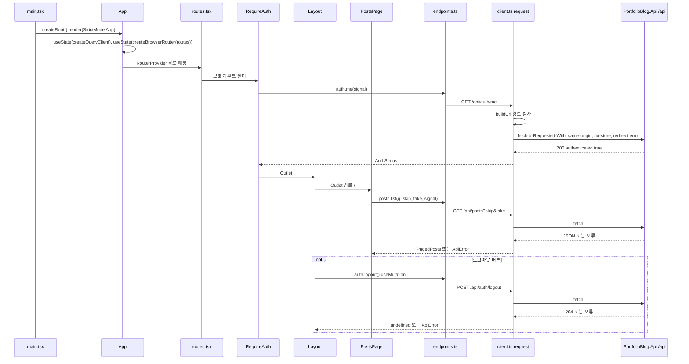
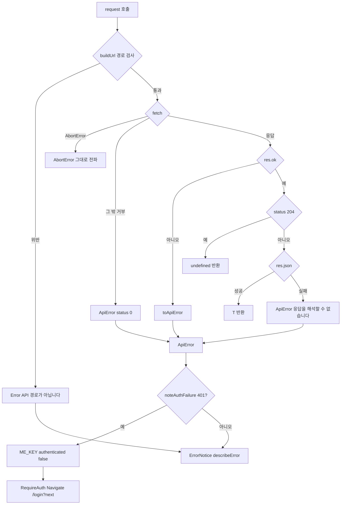
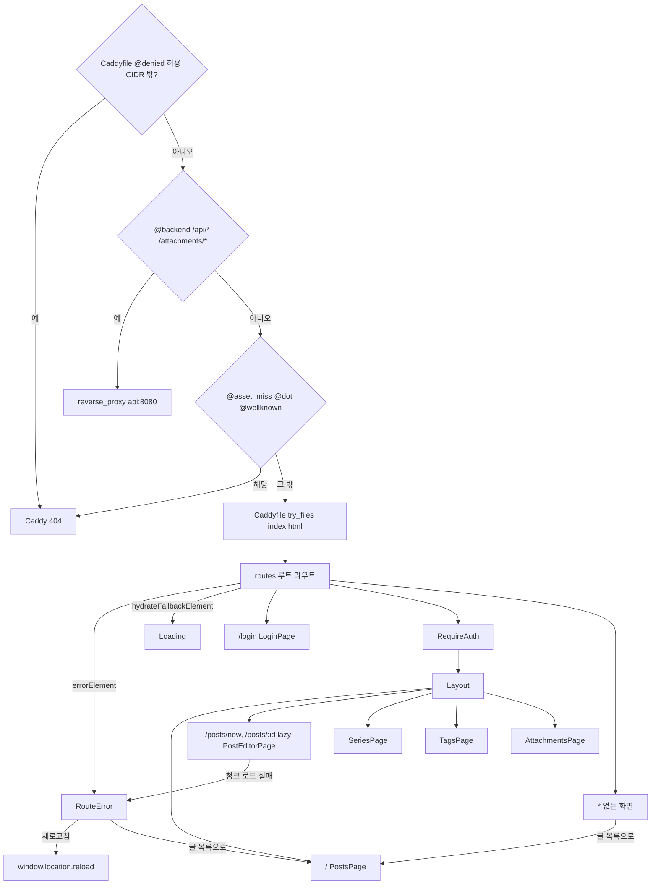
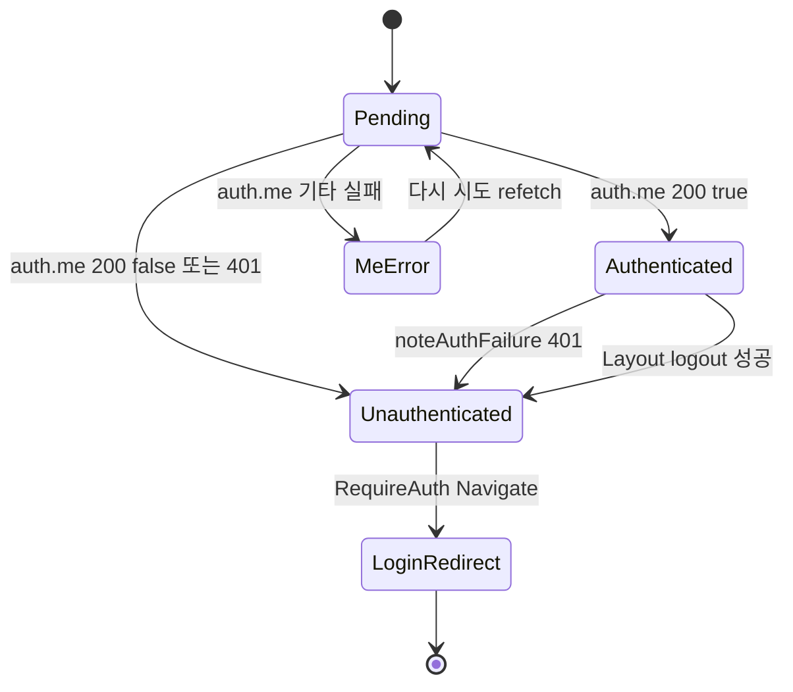

# F029 관리 SPA 셸(라우팅·API 클라이언트·오류/없는 화면)

<!-- doc-harness:section id="summary" hash="8f41d2be3d9251f991cda59d10790cc194b5dbe291a20014247095014f176bb4" -->
## 한 줄 요약

결론: F029는 관리 SPA의 공통 셸이다. 현재 코드로 다시 확인한 결과 이전 분석과 동작 차이는 없다. 검증에서 지적된 두 가지는 고쳤다. 하나는 StrictMode에서 인스턴스가 생성되는 횟수에 관한 표현이고, 다른 하나는 Caddy 관리 도메인의 분기 목록에서 빠졌던 @denied·/.well-known 404다.

1. main.tsx→App이 QueryClient와 브라우저 라우터를 useState 지연 초기화로 만들고, 인스턴스를 하나만 유지해 제공한다. 개발 모드 StrictMode에서는 초기화 함수가 두 번 호출될 수 있다.
2. routes.tsx가 경로 없는 루트 라우트로 모든 화면을 감싼다. 그래서 어떤 라우트 오류든 RouteError가 받고, 알 수 없는 경로는 '*' 폴백('없는 화면입니다')이 받는다.
3. 운영에서 이 셸까지 오는 것은 허용 CIDR 안의 IP에서 온 요청뿐이다. Caddy가 그 밖의 IP는 경로와 무관하게 404로 끊는다. 허용 IP라도 /api/*·/attachments/*는 백엔드로 가고, /assets/* 누락·점 파일·/.well-known/*은 404가 된다. 나머지 경로만 index.html로 폴백된다.
4. 모든 네트워크 호출은 api/client.ts의 request 하나를 거친다. source-guards 테스트가 fetch 호출처를 client.ts 하나로 강제한다.

request의 동작:
- 호출 전에 buildUrl이 '/api/' 접두사를 요구하고 //·역슬래시·..·%2e·제어 문자를 막는다.
- X-Requested-With: XMLHttpRequest 헤더를 붙인다. 이 값은 서버 AdminSurfaceMiddleware의 CSRF 헤더 값과 같다. credentials same-origin, cache no-store, redirect error도 함께 설정한다.
- 실패 응답은 toApiError가 ApiError(status, title, detail, fieldErrors, retryAfterSeconds)로 바꾼다. 본문이 ProblemDetails가 아니어도 마찬가지다.
- 네트워크 실패는 ApiError(0)이 된다. AbortError는 그대로 다시 던진다. 2xx인데 본문이 JSON이 아니면 그 status로 ApiError를 만든다.

인증 상태 처리: 쿼리·뮤테이션 캐시의 onError가 401을 보면 ME_KEY=['auth','me']를 {authenticated:false}로 기록한다. RequireAuth는 이 값을 보고 /login?next=로 보낸다. 자동 재시도는 없다(retry:false). 재시도는 ErrorNotice의 '다시 시도' 버튼으로만 한다.

화면 구성과 호출 주체:
- Layout은 내비게이션(NavLink 4개)과 로그아웃을 맡는다. 로그아웃에 성공하면 ME_KEY를 false로 기록하고, auth 외 쿼리를 제거하고, mutation 캐시를 비운다.
- 데이터 호출은 Outlet 안의 페이지가 한다(예: PostsPage의 posts.list).

그 밖: DB 접근은 없다. RouteError는 오류 내용을 화면·콘솔에 남기지 않도록 설계돼 있어, 클라이언트 측 오류 로깅이 없다.

| 항목 | 값 |
|---|---|
| 중요도 | SUPPORTING |
| 상태 | ACTIVE |
| 진입점 | `PortfolioBlog.Web/index.html → /src/main.tsx`, `PortfolioBlog.Web/src/main.tsx (createRoot().render(<App/>))`, `SPA 라우트 * (없는 화면 폴백)`, `SPA 루트 라우트 errorElement (RouteError)`, `api/endpoints.ts auth/posts/series/tags/attachments/preview → api/client.ts request` |
| 의존 기능 | [F001](../09_FEATURES.md#f001), [F018](../09_FEATURES.md#f018), [F025](../09_FEATURES.md#f025) |

### 진입점 근거

| 내용 | 상태 | 근거 |
|---|---|---|
| 브라우저가 index.html을 받으면 <script type="module" src="/src/main.tsx">가 실행되어 #root에 앱을 마운트한다. | CONFIRMED | `PortfolioBlog.Web/index.html` (11-12), `PortfolioBlog.Web/src/main.tsx` (6-10) |
| 운영에서 관리 도메인 요청은 Caddy route가 다음 순서로 나눈다. (1) 허용 CIDR 밖 IP(@denied not remote_ip {$ADMIN_ALLOWED_CIDRS})는 경로와 무관하게 404다. 평문 HTTP 블록도 같다. (2) /api/*·/attachments/*는 api:8080으로 보낸다. (3) /assets/* 중 파일이 있으면 영구 캐시로 서빙하고, 없으면 404다. (4) 점 파일(/.well-known 제외)은 404다. (5) /.well-known/*도 무조건 404다. (6) 나머지는 try_files {path} /index.html로 SPA에 넘긴다. 따라서 정의되지 않은 경로를 포함한 화면 주소가 이 셸의 진입점이 되는 것은 허용 IP에서 온 요청일 때뿐이다. | CONFIRMED | `deploy/Caddyfile` {$ADMIN_DOMAIN} route (78-99,115-142), `deploy/Caddyfile` http://{$ADMIN_DOMAIN} (163-173) |
| 정의되지 않은 경로는 routes의 { path: '*' } 요소가 받아 '없는 화면입니다. 글 목록으로' 화면을 그린다. 이 라우트는 RequireAuth 바깥에 있어 로그인 여부와 무관하게 표시된다. | CONFIRMED | `PortfolioBlog.Web/src/app/routes.tsx` (37) |
| 루트 라우트의 errorElement=<RouteError/>는 하위 어디서 던져진 라우트 오류든 받는 곳이다(지연 청크 로드 실패, 렌더 예외). | CONFIRMED | `PortfolioBlog.Web/src/app/routes.tsx` (15-21), `PortfolioBlog.Web/src/components/RouteError.tsx` RouteError (9-20) |
| 화면 코드는 api/endpoints.ts의 auth·posts·series·tags·attachments·preview 객체를 통해 request를 호출한다. fetch를 직접 부르는 곳은 api/client.ts 하나뿐이며, source-guards 테스트가 이를 강제한다. | CONFIRMED | `PortfolioBlog.Web/src/api/endpoints.ts` (10-52), `PortfolioBlog.Web/src/test/source-guards.test.ts` (101-103) |
<!-- /doc-harness:section -->

<!-- doc-harness:section id="flow" hash="3f5917c32d144b7365ee6f4bf30049d1c1b19d9423147456aadd1fac4fcdb863" -->
## 처리 흐름

| 단계 | 컴포넌트 | 코드 | 설명 |
|---|---|---|---|
| 1 | main.tsx | `PortfolioBlog.Web/src/main.tsx` createRoot(...).render | index.css를 import하고, document.getElementById('root')!에 StrictMode로 감싼 App을 렌더한다. |
| 2 | App | `PortfolioBlog.Web/src/App.tsx` App | useState 지연 초기화로 createQueryClient()와 createBrowserRouter(routes)를 만든다. 컴포넌트 수명 동안 각각 인스턴스 하나만 유지된다. 개발 모드 StrictMode에서는 초기화 함수가 두 번 호출될 수 있고, 한쪽 결과는 버려진다. QueryClientProvider 안에 RouterProvider를 둔다. |
| 3 | createQueryClient | `PortfolioBlog.Web/src/app/queryClient.ts` createQueryClient | QueryCache와 MutationCache의 onError에 noteAuthFailure를 연결한다. 기본값은 queries {retry:false, refetchOnWindowFocus:false, staleTime:0}, mutations {retry:false}다. |
| 4 | routes | `PortfolioBlog.Web/src/app/routes.tsx` routes | 경로 없는 루트 라우트(errorElement=RouteError, hydrateFallbackElement=Loading) 아래에서 URL을 매칭한다. - /login: LoginPage - RequireAuth→Layout 아래: /(PostsPage), /posts/new·/posts/:id(lazy PostEditorPage), /series, /tags, /attachments - 나머지 경로: '*' 없는 화면 |
| 5 | RequireAuth | `PortfolioBlog.Web/src/auth/RequireAuth.tsx` RequireAuth | useQuery(ME_KEY, auth.me)로 세션을 확인하고 결과별로 다르게 그린다. - pending: '세션 확인 중…' - 오류: ErrorNotice와 다시 시도 버튼 - authenticated=false: /login?next=<현재 경로>로 replace 이동 - authenticated=true: Outlet(Layout) |
| 6 | Layout | `PortfolioBlog.Web/src/components/Layout.tsx` Layout | 헤더('블로그 관리', NavLink 4개: 글·시리즈·태그·첨부)와 로그아웃 버튼을 그리고, Outlet에 하위 페이지를 렌더한다. Layout 자체가 부르는 API는 로그아웃 useMutation(auth.logout) 하나다. |
| 7 | PostsPage | `PortfolioBlog.Web/src/pages/PostsPage.tsx` PostsPage (useQuery posts.list) | 데이터 호출은 Outlet 안의 페이지 컴포넌트가 한다. 예를 들어 PostsPage는 useQuery의 queryFn에서 posts.list(q, skip, take, signal)를 부른다. |
| 8 | endpoints | `PortfolioBlog.Web/src/api/endpoints.ts` auth/posts/series/tags/attachments/preview | 페이지가 부르는 API 함수들이다. 경로의 id는 encodeURIComponent로 인코딩해 조립하고, 쿼리는 query 옵션으로 넘긴다. |
| 9 | request | `PortfolioBlog.Web/src/api/client.ts` request / buildUrl | 먼저 헤더(X-Requested-With: XMLHttpRequest, Accept: application/json)와 본문을 준비한다. json이면 Content-Type application/json을 붙이고 JSON.stringify한다. form이면 FormData를 그대로 넘긴다. 그다음 try 블록 밖에서 buildUrl이 경로를 검사하고 쿼리 문자열을 조립한다. 값이 null·undefined·''인 쿼리는 생략한다. |
| 10 | request | `PortfolioBlog.Web/src/api/client.ts` request | fetch(url, {method, headers, body, signal, credentials:'same-origin', cache:'no-store', redirect:'error'})를 호출한다. 예외가 나면 AbortError는 그대로 다시 던지고, 나머지는 ApiError(0,'네트워크 오류')로 바꾼다. |
| 11 | toApiError | `PortfolioBlog.Web/src/api/errors.ts` toApiError | res.ok가 아니면 먼저 Retry-After를 1~3600초 범위로 파싱한다. 본문은 텍스트로 읽어 길이가 65,536자 이하일 때만 JSON 파싱을 시도한다. 결과가 레코드면 title·detail·errors(위험 키 제외)로 ApiError를 만들고, 아니면 statusText(없으면 '요청 실패')로 만든다. |
| 12 | request | `PortfolioBlog.Web/src/api/client.ts` request | 성공 응답이면 204는 undefined를, 그 밖은 res.json()을 반환한다. JSON 파싱에 실패하면 ApiError(res.status,'응답을 해석할 수 없습니다')를 던진다. |
| 13 | noteAuthFailure | `PortfolioBlog.Web/src/app/queryClient.ts` noteAuthFailure | 쿼리·뮤테이션 오류가 ApiError 401이면 ME_KEY를 {authenticated:false}로 설정한다. 이 값이 바뀌면 RequireAuth가 로그인 화면으로 보낸다(5단계). |
| 14 | ErrorNotice | `PortfolioBlog.Web/src/components/notices.tsx` ErrorNotice / describeError | 화면은 오류를 ErrorNotice(role=alert)로 보여 준다. 문구는 describeError가 status별로 정한다(0·400·401·403·404·409·413·415·429·503·기타). 429·503에는 Retry-After 초를 덧붙인다. onRetry가 있으면 '다시 시도' 버튼도 그린다. |
| 15 | RouteError | `PortfolioBlog.Web/src/components/RouteError.tsx` RouteError | 라우트 렌더나 lazy import 중 예외가 나면 '화면을 불러오지 못했습니다. 새 버전이 배포됐을 수 있습니다.' 문구, 새로고침(window.location.reload) 버튼, '글 목록으로' 링크를 그린다. 오류 값은 읽지 않는다. |
| 16 | Layout | `PortfolioBlog.Web/src/components/Layout.tsx` Layout.logout | 로그아웃 버튼을 누르면 auth.logout()(POST /api/auth/logout)을 부른다. 성공하면 ME_KEY를 {authenticated:false}로 설정하고, 'auth' 외 쿼리를 제거하고, mutation 캐시를 비운다. 실패하면 ErrorNotice로 오류를 표시한다. |
<!-- /doc-harness:section -->

<!-- doc-harness:section id="F029_SEQUENCE" hash="ec31e992c2d5475de2035e771ee161892e81c68588426afdb6d9ee4b318615f9" -->
## 관리 SPA 부팅과 보호 화면의 API 호출 (Sequence Diagram)

main.tsx에서 App, 라우터, RequireAuth, Layout, 페이지 순으로 렌더되고, 모든 API 호출은 endpoints.ts와 client.ts request를 거쳐 fetch로 나간다.

App은 useState 지연 초기화로 QueryClient와 라우터를 만들고 인스턴스 하나를 유지한다. 개발 StrictMode에서는 초기화 함수가 두 번 호출될 수 있다. 보호 라우트에서는 RequireAuth가 먼저 auth.me로 세션을 확인한다. 인증되면 Layout과 하위 페이지(PostsPage 등)가 Outlet으로 렌더된다. 페이지와 Layout(로그아웃)의 모든 API 호출은 endpoints.ts 함수를 거쳐 request에서 buildUrl 검사와 공통 fetch 옵션을 적용받는다. 운영에서 이 흐름은 Caddy가 허용한 IP에서만 시작된다.

### 코드 근거

| 구성 요소 | 코드 |
|---|---|
| main.tsx | `PortfolioBlog.Web/src/main.tsx` |
| App | `PortfolioBlog.Web/src/App.tsx` (App) |
| routes.tsx | `PortfolioBlog.Web/src/app/routes.tsx` (routes) |
| RequireAuth | `PortfolioBlog.Web/src/auth/RequireAuth.tsx` (RequireAuth) |
| Layout | `PortfolioBlog.Web/src/components/Layout.tsx` (Layout) |
| PostsPage | `PortfolioBlog.Web/src/pages/PostsPage.tsx` (PostsPage) |
| endpoints.ts | `PortfolioBlog.Web/src/api/endpoints.ts` |
| client.ts request | `PortfolioBlog.Web/src/api/client.ts` (request) |
| PortfolioBlog.Api /api | `PortfolioBlog.Api/Infrastructure/Access/AdminSurfaceMiddleware.cs` |
<!-- /doc-harness:section -->

<!-- doc-harness:section id="F029_FLOW_ERROR" hash="cec4a9541b37ca84246e07492b4b2c9fdcd62921a569bd8fde529daaf41b8bec" -->
## request 실패 분기와 ApiError 처리 (Flowchart)

request의 실패는 경로 검사 Error, 네트워크 ApiError(0), 비2xx ApiError, JSON 파싱 ApiError, 그대로 전파되는 AbortError로 나뉜다. 그중 401만 ME_KEY를 거쳐 로그인 화면으로 이어진다.

buildUrl은 try 블록 밖에서 실행되므로 경로 위반은 ApiError가 아닌 일반 Error가 된다. 그래서 describeError는 '알 수 없는 오류' 문구를 보여 준다. fetch 예외 중 AbortError만 그대로 다시 던지고, 나머지(redirect:'error' 거부 포함)는 ApiError(0)이 된다. 비2xx 응답은 toApiError가 본문 형태와 무관하게 ApiError로 만든다. 모든 ApiError는 QueryCache/MutationCache onError의 noteAuthFailure를 거친다. 401이면 ME_KEY가 false가 되어 RequireAuth가 로그인 화면으로 보내고, 그 밖의 오류는 화면의 ErrorNotice가 표시한다.

### 코드 근거

| 구성 요소 | 코드 |
|---|---|
| buildUrl | `PortfolioBlog.Web/src/api/client.ts` (buildUrl) |
| fetch_call | `PortfolioBlog.Web/src/api/client.ts` (request) |
| toApiError | `PortfolioBlog.Web/src/api/errors.ts` (toApiError) |
| ApiError | `PortfolioBlog.Web/src/api/errors.ts` (ApiError) |
| noteAuthFailure | `PortfolioBlog.Web/src/app/queryClient.ts` (noteAuthFailure) |
| ME_KEY | `PortfolioBlog.Web/src/app/queryClient.ts` (ME_KEY) |
| RequireAuth | `PortfolioBlog.Web/src/auth/RequireAuth.tsx` (RequireAuth) |
| ErrorNotice | `PortfolioBlog.Web/src/components/notices.tsx` (ErrorNotice) |
<!-- /doc-harness:section -->

<!-- doc-harness:section id="F029_FLOW" hash="ba5b24df0b9bb32661e2a36a18a5d414fbe384cc093803b0587e43a30ea7de52" -->
## Caddy 분기, 라우트 표와 오류·없는 화면 폴백 (Flowchart)

운영에서는 Caddy가 허용 IP이면서 백엔드·자산·점 파일·/.well-known이 아닌 요청만 index.html로 넘긴다. 그 뒤 경로 없는 루트 라우트가 모든 화면을 감싸 오류는 RouteError가, 알 수 없는 경로는 '*' 폴백이 받는다.

Caddy 관리 도메인 route는 @denied(허용 CIDR 밖 IP)를 맨 먼저 처리해 모든 경로에 404를 준다. 허용 IP라면 다음 순서로 나눈다.
- /api/*·/attachments/*: 백엔드로 보낸다.
- /assets/* 누락, 점 파일, /.well-known/*: 404.
- 나머지: try_files로 index.html을 준다.
SPA 안에서는 경로 없는 루트 라우트가 errorElement와 hydrateFallbackElement를 가진다. /login은 인증 없이 열린다. 관리 화면은 RequireAuth→Layout 아래에 있다. '*' 폴백은 RequireAuth 바깥에 있다. 지연 로딩되는 것은 PostEditorPage뿐이며, 이 청크를 받지 못하면 RouteError가 새로고침과 목록 링크를 제공한다.

### 코드 근거

| 구성 요소 | 코드 |
|---|---|
| Caddy_denied | `deploy/Caddyfile` (@denied) |
| Caddy_backend | `deploy/Caddyfile` (@backend) |
| Caddy_static | `deploy/Caddyfile` (@asset_miss / @dot / @wellknown) |
| Caddy_try_files | `deploy/Caddyfile` (try_files) |
| RootRoute | `PortfolioBlog.Web/src/app/routes.tsx` (routes) |
| RouteError | `PortfolioBlog.Web/src/components/RouteError.tsx` (RouteError) |
| Loading | `PortfolioBlog.Web/src/components/notices.tsx` (Loading) |
| LoginPage | `PortfolioBlog.Web/src/auth/LoginPage.tsx` (LoginPage) |
| RequireAuth | `PortfolioBlog.Web/src/auth/RequireAuth.tsx` (RequireAuth) |
| Layout | `PortfolioBlog.Web/src/components/Layout.tsx` (Layout) |
| PostsPage | `PortfolioBlog.Web/src/pages/PostsPage.tsx` (PostsPage) |
| PostEditorPage | `PortfolioBlog.Web/src/pages/PostEditorPage.tsx` |
| SeriesPage | `PortfolioBlog.Web/src/pages/SeriesPage.tsx` |
| TagsPage | `PortfolioBlog.Web/src/pages/TagsPage.tsx` |
| AttachmentsPage | `PortfolioBlog.Web/src/pages/AttachmentsPage.tsx` |
| NotFound | `PortfolioBlog.Web/src/app/routes.tsx` (path '*') |
<!-- /doc-harness:section -->

<!-- doc-harness:section id="F029_STATE" hash="71681612ee734c385b3da5b897f3ce60a08abfd860a80c765f120ce96f26f1a0" -->
## ME_KEY 인증 상태 캐시 (State Diagram)

ME_KEY 캐시가 인증 화면 전환의 유일한 기준이다. 401과 로그아웃 성공이 모두 이 값을 Unauthenticated로 바꾼다.

상태별 동작은 다음과 같다.
- Pending: RequireAuth가 '세션 확인 중…'을 그린다.
- Authenticated: Outlet(Layout)을 렌더한다.
- MeError: ErrorNotice와 다시 시도 버튼을 보여 준다.
- Unauthenticated: /login?next=로 replace 이동한다.
auth.me 자체가 401일 때 오류 상태를 거치지 않고 바로 Unauthenticated가 되는지는 TanStack Query 내부 순서에 달려 있어 확인하지 못했다(unknowns 참고).

### 코드 근거

| 구성 요소 | 코드 |
|---|---|
| Pending | `PortfolioBlog.Web/src/auth/RequireAuth.tsx` (me.isPending) |
| Authenticated | `PortfolioBlog.Web/src/auth/RequireAuth.tsx` |
| MeError | `PortfolioBlog.Web/src/auth/RequireAuth.tsx` (me.isError) |
| Unauthenticated | `PortfolioBlog.Web/src/app/queryClient.ts` (noteAuthFailure) |
| LoginRedirect | `PortfolioBlog.Web/src/auth/RequireAuth.tsx` (Navigate) |
<!-- /doc-harness:section -->

<!-- doc-harness:section id="data" hash="b3d377d270f3b64e4a9815e3e2fcbded5a9f978d75adb4a8d80b94d748263e66" -->
## 데이터

### 데이터 흐름

| 내용 | 상태 | 근거 |
|---|---|---|
| 요청 방향: 페이지 컴포넌트(예: PostsPage) → endpoints.ts 함수 → request(method, path, {json\|form\|query\|signal}) → buildUrl → fetch. - endpoints.ts 함수는 id를 encodeURIComponent로 인코딩하고 쿼리를 query 옵션으로 넘긴다. - buildUrl은 경로를 검사한 뒤, URLSearchParams로 빈 값을 뺀 쿼리 문자열을 만든다. - JSON 본문은 JSON.stringify로 만든다. 비ASCII 문자는 이스케이프하지 않는다. - multipart는 FormData를 그대로 넘기고, Content-Type(boundary)은 브라우저가 붙인다. | CONFIRMED | `PortfolioBlog.Web/src/pages/PostsPage.tsx` (18-20), `PortfolioBlog.Web/src/api/endpoints.ts` (7-52), `PortfolioBlog.Web/src/api/client.ts` request / buildUrl (20-62), `PortfolioBlog.Web/src/api/client.test.ts` (37-51,81-87) |
| 성공 응답: 204는 undefined를 반환한다. 그 밖의 2xx는 res.json() 결과를 types.ts의 인터페이스로 타입 단언(as T)만 한다. 런타임 스키마 검증은 없다. | CONFIRMED | `PortfolioBlog.Web/src/api/client.ts` (69-75), `PortfolioBlog.Web/src/api/types.ts` (4-32) |
| 실패 응답: Response → toApiError → ApiError{status, title, detail, fieldErrors, retryAfterSeconds} → TanStack Query의 error → ErrorNotice(describeError 문구) 또는 FieldError(필드별 목록). 서버가 준 문자열은 JSX 텍스트 노드로만 들어간다. | CONFIRMED | `PortfolioBlog.Web/src/api/errors.ts` toApiError / describeError (54-84), `PortfolioBlog.Web/src/components/notices.tsx` (3-22) |
| 인증 상태: 어떤 호출이든 401을 받으면 QueryCache/MutationCache onError → noteAuthFailure → ME_KEY 캐시 값 {authenticated:false} 순으로 이어지고, RequireAuth가 이 값을 읽어 /login?next=로 이동한다. 로그아웃에 성공해도 같은 키에 같은 값을 쓴다. | CONFIRMED | `PortfolioBlog.Web/src/app/queryClient.ts` (5-18), `PortfolioBlog.Web/src/auth/RequireAuth.tsx` (13-19), `PortfolioBlog.Web/src/components/Layout.tsx` (12-22) |
| 세션 쿠키(__Host-AdminSession)는 credentials 'same-origin' 설정 때문에 관리 출처로 가는 요청에만 붙는다. 브라우저 저장소에 접근하는 곳은 lib/drafts.ts 하나뿐이고, 이 셸은 세션을 저장소에 두지 않는다. | CONFIRMED | `PortfolioBlog.Web/src/api/client.ts` (40-62), `PortfolioBlog.Web/src/test/source-guards.test.ts` (113-115) |
| 개발·미리보기 환경에서는 Vite 프록시가 정규식 키 ^/api/와 ^/attachments/만 백엔드로 넘긴다. 운영 Caddy의 경계(path /api/* /attachments/*)와 맞춘 것이다. 단, 운영 Caddy의 IP 허용 목록(@denied)과 /.well-known 404에 해당하는 설정은 Vite 쪽에 없다. | CONFIRMED | `PortfolioBlog.Web/vite.config.ts` (15-21), `deploy/Caddyfile` (87-99,136-137) |

### DB 접근

_(없음)_

### 상태 전이

| 이전 | 다음 | 트리거 | 근거 |
|---|---|---|---|
| ME_KEY 없음(RequireAuth pending, '세션 확인 중…') | ME_KEY {authenticated:true} (Outlet → Layout 렌더) | GET /api/auth/me 200 {authenticated:true} | `PortfolioBlog.Web/src/auth/RequireAuth.tsx` (13-20) |
| ME_KEY 없음(pending) | RequireAuth 오류 화면(ErrorNotice + 다시 시도) | auth.me가 401이 아닌 ApiError로 실패한다. retry:false라 곧바로 오류 상태가 된다. | `PortfolioBlog.Web/src/auth/RequireAuth.tsx` (15), `PortfolioBlog.Web/src/app/queryClient.ts` (22) |
| ME_KEY {authenticated:true} | ME_KEY {authenticated:false} → /login?next=<경로> (replace) | 임의의 쿼리·뮤테이션이 ApiError 401로 실패(noteAuthFailure) | `PortfolioBlog.Web/src/app/queryClient.ts` noteAuthFailure (11-18), `PortfolioBlog.Web/src/auth/RequireAuth.tsx` (16-19) |
| ME_KEY {authenticated:true}, 목록 쿼리·mutation 캐시 보유 | ME_KEY {authenticated:false}, auth 외 쿼리 제거, mutation 캐시 비움 → 로그인 화면 | Layout 로그아웃 버튼 → POST /api/auth/logout 성공 | `PortfolioBlog.Web/src/components/Layout.tsx` Layout.logout (12-23) |
| 라우트 매칭(lazy 편집 화면 로딩 중) | RouteError 화면 | lazy import(PostEditorPage) 실패 또는 하위 렌더 예외 | `PortfolioBlog.Web/src/app/routes.tsx` (13,18-30), `PortfolioBlog.Web/src/test/routeError.test.tsx` (7-20) |
| RouteError 화면 | 페이지 전체 재적재 또는 / 라우트 | '새로고침' 클릭(window.location.reload) 또는 '글 목록으로' 링크 | `PortfolioBlog.Web/src/components/RouteError.tsx` (14-17) |

### 외부 의존

| 내용 | 상태 | 근거 |
|---|---|---|
| 사용 라이브러리: - react 19.2.8 / react-dom 19.2.8: createRoot, StrictMode - react-router 8.4.0: createBrowserRouter, RouterProvider, RouteObject, lazy, errorElement, hydrateFallbackElement, NavLink, Outlet, Link, Navigate - @tanstack/react-query 5.103.2: QueryClient, QueryCache, MutationCache, useQuery, useMutation | CONFIRMED | `PortfolioBlog.Web/package.json` (21-25), `PortfolioBlog.Web/src/App.tsx` (1-10), `PortfolioBlog.Web/src/app/queryClient.ts` (1) |
| 브라우저 fetch API로 같은 출처의 관리 API(PortfolioBlog.Api /api/*)를 호출한다. 서버 AdminSurfaceMiddleware는 X-Requested-With: XMLHttpRequest 헤더를 요구하며, 이 값은 클라이언트 상수와 일치한다. 헤더가 없으면 서버는 403으로 거부한다. | CONFIRMED | `PortfolioBlog.Web/src/api/client.ts` (16-18,60-62), `PortfolioBlog.Api/Infrastructure/Access/AdminSurfaceMiddleware.cs` CsrfHeaderName / CsrfHeaderValue (22-25,85-87) |
| 운영의 정적 서빙과 SPA 폴백은 Caddy의 관리 도메인 블록이 맡는다. route 안에서 적용되는 순서는 다음과 같다. (1) 허용 CIDR 밖 IP(@denied): 모든 경로가 404. 평문 HTTP 블록에서도 같다. (2) /api/*·/attachments/*: api:8080으로 프록시. request_body 상한은 11MiB다. (3) /assets/*: 파일이 있으면 immutable 캐시로 서빙하고, 없으면 404(index.html로 돌리지 않음). (4) 점 파일(/.well-known 제외): 404. (5) /.well-known/*: 무조건 404. (6) 나머지: Cache-Control no-cache와 함께 try_files {path} /index.html. | CONFIRMED | `deploy/Caddyfile` (78-142), `deploy/Caddyfile` http://{$ADMIN_DOMAIN} (163-173) |
| 개발·미리보기 서버는 Vite다. HTTPS로 뜨고 포트는 5173/4173이며, BLOG_API_ORIGIN(기본 https://localhost:7198)으로 프록시한다. | CONFIRMED | `PortfolioBlog.Web/vite.config.ts` (7-35) |
<!-- /doc-harness:section -->

<!-- doc-harness:section id="failures" hash="2176b9f5b148e133eb31fbd6cceb5d549464419607954faeffcb631ffa1444f8" -->
## 실패 지점

| 위치 | 조건 | 처리 | 상태 | 근거 |
|---|---|---|---|---|
| deploy/Caddyfile {$ADMIN_DOMAIN} @denied | 요청 IP가 ADMIN_ALLOWED_CIDRS 밖이다 | 경로와 무관하게 Caddy가 404로 응답하므로 index.html·SPA 셸 자체가 전달되지 않는다. 평문 HTTP 블록도 리다이렉트 전에 같은 방식으로 404를 준다. | CONFIRMED | `deploy/Caddyfile` (78,87-88,169-170) |
| PortfolioBlog.Web/src/api/client.ts buildUrl | path가 '/api/'로 시작하지 않거나, //·\·..·%2e(대소문자 무관)·제어 문자를 포함한다 | fetch 전에 Error('API 경로가 아닙니다: …')를 던진다. 이 예외는 ApiError가 아니고, try 블록 밖에서 나므로 네트워크 오류로 바뀌지도 않는다. 화면에서는 describeError가 '알 수 없는 오류가 발생했습니다.'로 표시한다. | CONFIRMED | `PortfolioBlog.Web/src/api/client.ts` (26-30,56-57), `PortfolioBlog.Web/src/api/client.test.ts` (53-61,75-79), `PortfolioBlog.Web/src/api/errors.ts` (69) |
| PortfolioBlog.Web/src/api/client.ts request (fetch) | 네트워크 실패·DNS·TLS 오류 등으로 fetch가 거부된다 | ApiError(0,'네트워크 오류')로 바꾼다. 화면에는 '서버에 연결할 수 없습니다. 네트워크를 확인하세요.'를 보여 준다. | CONFIRMED | `PortfolioBlog.Web/src/api/client.ts` (63-67), `PortfolioBlog.Web/src/api/errors.ts` (72), `PortfolioBlog.Web/src/api/client.test.ts` (127-134) |
| PortfolioBlog.Web/src/api/client.ts request (fetch) | signal로 요청이 취소된다(AbortError) | 오류로 바꾸지 않고 원래 예외를 그대로 다시 던진다. TanStack Query의 취소 흐름에 맡기는 것이다. | CONFIRMED | `PortfolioBlog.Web/src/api/client.ts` (64-65), `PortfolioBlog.Web/src/api/client.test.ts` (131-133) |
| PortfolioBlog.Web/src/api/client.ts request (fetch, redirect:'error') | 서버나 중간자가 3xx 리다이렉트로 응답한다 | fetch가 거부되고, AbortError가 아니므로 ApiError(0,'네트워크 오류')로 바뀐다. 사용자에게는 리다이렉트가 아니라 네트워크 오류로 보인다. | INFERRED | `PortfolioBlog.Web/src/api/client.ts` (43,60-67) |
| PortfolioBlog.Web/src/api/errors.ts toApiError | 비2xx 응답의 본문이 ProblemDetails가 아니다(HTML, 빈 본문, 64KB 초과, JSON 파싱 실패. 예: Caddy가 직접 낸 본문 없는 404) | 예외 없이 statusText(없으면 '요청 실패')로 ApiError를 만들고, fieldErrors는 빈 객체로 둔다. | CONFIRMED | `PortfolioBlog.Web/src/api/errors.ts` (50-61), `PortfolioBlog.Web/src/api/client.test.ts` (118-125) |
| PortfolioBlog.Web/src/api/client.ts request (res.json) | 2xx(204 제외)인데 본문이 JSON이 아니다(예: dev 서버가 index.html을 200으로 반환, 빈 200 본문) | ApiError(res.status,'응답을 해석할 수 없습니다')를 던진다. describeError의 default 분기로 처리되어 '요청이 실패했습니다(200).'처럼 보인다. | CONFIRMED | `PortfolioBlog.Web/src/api/client.ts` (70-75), `PortfolioBlog.Web/src/api/client.test.ts` (102-107), `PortfolioBlog.Web/src/api/errors.ts` (82) |
| PortfolioBlog.Web/src/app/queryClient.ts noteAuthFailure | 쿼리나 useMutation의 오류가 ApiError 401이다 | ME_KEY를 {authenticated:false}로 설정해 RequireAuth가 /login?next=로 보내게 한다. useMutation을 거치지 않고 직접 await하는 호출(PreviewPane·PostEditorPage·SeriesPage)은 각자 noteAuthFailure를 불러야 하며, 현재 코드는 그렇게 하고 있다. | CONFIRMED | `PortfolioBlog.Web/src/app/queryClient.ts` (7-18), `PortfolioBlog.Web/src/components/PreviewPane.tsx` (53), `PortfolioBlog.Web/src/pages/PostEditorPage.tsx` (224,261), `PortfolioBlog.Web/src/pages/SeriesPage.tsx` (33) |
| PortfolioBlog.Web/src/app/queryClient.ts defaultOptions | 429·503 또는 기타 실패 | 자동 재시도는 없다(retry:false). ErrorNotice가 Retry-After 초를 안내하고, 재시도는 사용자가 onRetry 버튼(refetch)으로 한다. | CONFIRMED | `PortfolioBlog.Web/src/app/queryClient.ts` (20-24), `PortfolioBlog.Web/src/api/errors.ts` (70,80-81), `PortfolioBlog.Web/src/components/notices.tsx` (9) |
| PortfolioBlog.Web/src/app/routes.tsx lazy editor / 하위 렌더 | 배포로 청크 해시가 바뀌어 PostEditorPage 청크 로드가 실패한다(Caddy가 누락된 /assets/*를 404로 응답). 또는 렌더 중 예외가 난다. | 루트 errorElement인 RouteError가 안내 문구, 새로고침 버튼, 목록 링크를 그린다. 오류 내용은 화면·콘솔에 남기지 않는다. | CONFIRMED | `PortfolioBlog.Web/src/app/routes.tsx` (12-21), `PortfolioBlog.Web/src/components/RouteError.tsx` (3-20), `deploy/Caddyfile` (115-125), `PortfolioBlog.Web/src/test/routeError.test.tsx` (11-20) |
| PortfolioBlog.Web/src/components/RouteError.tsx | 청크 로드 실패가 아닌 일반 렌더 버그로 오류 경계에 도달한다 | 청크 실패 때와 같은 '새 버전이 배포됐을 수 있습니다' 문구를 보여 준다. 원인을 구분하거나 기록하지 않으므로, 같은 버그라면 새로고침해도 반복된다. | POTENTIAL_ISSUE | `PortfolioBlog.Web/src/components/RouteError.tsx` (6-13) |
| PortfolioBlog.Web/src/components/Layout.tsx logout | POST /api/auth/logout이 실패한다 | logout.isError면 ErrorNotice로 오류를 표시한다. 다시 시도 버튼은 없지만 로그아웃 버튼을 다시 누를 수 있다. 401이면 MutationCache onError가 ME_KEY를 false로 설정해 로그인 화면으로 간다. | CONFIRMED | `PortfolioBlog.Web/src/components/Layout.tsx` (12-13,35-39), `PortfolioBlog.Web/src/app/queryClient.ts` (18) |
| PortfolioBlog.Web/src/main.tsx | index.html에 #root가 없다 | 처리 없음(예외 전파). 비null 단언(!) 때문에 createRoot(null)이 호출되어 예외가 난다. 현재 index.html에는 #root가 있다. | POTENTIAL_ISSUE | `PortfolioBlog.Web/src/main.tsx` (6), `PortfolioBlog.Web/index.html` (11) |

### 엣지 케이스

| 내용 | 상태 | 근거 |
|---|---|---|
| '*' 없는 화면 라우트는 RequireAuth 바깥에 있다. 그래서 비로그인 상태에서도 세션 확인 없이 표시되고, '글 목록으로' 링크를 누른 뒤에야 RequireAuth가 로그인 화면으로 보낸다. PortfolioBlog.Web 전체에서 '없는 화면' 문자열은 routes.tsx에만 있다. 이 폴백 화면을 검증하는 테스트는 찾지 못했다. | CONFIRMED | `PortfolioBlog.Web/src/app/routes.tsx` (22-37) |
| '*' 폴백이 받지 못하는 경로가 있다. 운영에서 /assets/* 누락, 점 파일, /.well-known/*은 Caddy가 SPA 폴백 전에 404로 끊는다. 그래서 이 경로들은 SPA의 '없는 화면'이 아니라 본문 없는 Caddy 404가 된다. | CONFIRMED | `deploy/Caddyfile` (124-141) |
| 인코딩된 id에 ..이 남으면(예: '../x' → '..%2Fx') buildUrl이 막는다. 서버 id는 Guid라서 정상 흐름에는 영향이 없다. | CONFIRMED | `PortfolioBlog.Web/src/api/client.test.ts` (75-79) |
| 쿼리 값이 null·undefined·빈 문자열이면 쿼리 문자열에서 빠진다. 예를 들어 posts.list('',0,50)는 /api/posts?skip=0&take=50이 된다. 모든 값이 비면 ?도 붙지 않는다. | CONFIRMED | `PortfolioBlog.Web/src/api/client.ts` (31-37), `PortfolioBlog.Web/src/api/client.test.ts` (81-87) |
| fieldErrors를 만들 때 '__proto__'·'constructor'·'prototype' 키는 건너뛴다. 배열이 아닌 값과 문자열이 아닌 메시지도 버린다(프로토타입 오염 방지). | CONFIRMED | `PortfolioBlog.Web/src/api/errors.ts` (35-48), `PortfolioBlog.Web/src/api/client.test.ts` (94-116) |
| Retry-After는 1~9자리 정수만 인정하고 값을 1~3600초로 제한한다. HTTP-date, 음수, 소수, 지수 표기는 null이 된다. | CONFIRMED | `PortfolioBlog.Web/src/api/errors.ts` parseRetryAfter (29-33), `PortfolioBlog.Web/src/api/client.test.ts` (138-143) |
| QueryClient와 라우터는 useState 지연 초기화로 만들어져 컴포넌트 수명 동안 인스턴스가 하나만 유지된다. 개발 모드 StrictMode에서는 초기화 함수(createQueryClient, createBrowserRouter(routes))가 두 번 호출될 수 있고, 한쪽 결과는 버려진다. 운영 빌드에서는 한 번만 호출된다. 이중 호출 동작의 근거는 저장소 밖의 React 문서이며, 저장소 코드로는 main.tsx의 StrictMode 사용과 App.tsx의 useState 초기화만 확인된다. | INFERRED | `PortfolioBlog.Web/src/App.tsx` (8-9), `PortfolioBlog.Web/src/main.tsx` (7) |
| 로그아웃 시 client.clear()를 쓰지 않는다. 주석에 따르면 쿼리 객체를 통째로 지웠을 때 RequireAuth 관찰자가 옛 객체에 남아 화면이 전환되지 않는 문제가 실측으로 확인됐다. 그래서 ME_KEY를 먼저 설정한 뒤 auth 외 쿼리만 제거한다. | CONFIRMED | `PortfolioBlog.Web/src/components/Layout.tsx` (15-21) |
| refetchOnWindowFocus:false, staleTime:0이다. 창 포커스로 편집 중인 데이터를 덮어쓰지 않는 대신, 마운트할 때마다 다시 조회한다. | CONFIRMED | `PortfolioBlog.Web/src/app/queryClient.ts` (21-22) |
| hydrateFallbackElement(Loading)는 루트 라우트에만 둔다. 첫 진입 경로가 lazy 편집 화면이면 청크를 받는 동안 이 폴백이 보이는 것으로 추론된다. | INFERRED | `PortfolioBlog.Web/src/app/routes.tsx` (17-20) |
| lazy로 분리한 화면은 편집 화면(PostEditorPage)뿐이다. 주석에 따르면 전부 한 번들일 때 953KB였고 대부분이 CodeMirror다. build.chunkSizeWarningLimit는 700이다. | CONFIRMED | `PortfolioBlog.Web/src/app/routes.tsx` (12-13), `PortfolioBlog.Web/vite.config.ts` (31) |
| 테스트 하네스 renderApp은 실제 routes 표와 createQueryClient를 쓰지만, 라우터는 createMemoryRouter로 만든다. 그래서 App.tsx가 createBrowserRouter로 조립하는 부분은 이 단위 테스트로 검증되지 않는다. 또 stubApi는 표에 없는 호출에서 예외를 던지는데, request가 이를 ApiError(0)으로 바꿔 삼킨다. 그래서 noteUnexpectedCall로 따로 기록한다. | CONFIRMED | `PortfolioBlog.Web/src/test/harness.tsx` renderApp / stubApi (16-49), `PortfolioBlog.Web/src/App.tsx` (9) |

### 로깅

| 내용 | 상태 | 근거 |
|---|---|---|
| 셸 코드에는 console 출력도 원격 오류 수집도 없다. RouteError는 useRouteError 값을 의도적으로 읽지 않는다(번들·서버 내부 사정 노출 방지 목적). 그래서 라우트 오류가 화면·콘솔 어디에도 남지 않고, 운영에서 클라이언트 오류를 관측할 수단이 없다. | POTENTIAL_ISSUE | `PortfolioBlog.Web/src/components/RouteError.tsx` (3-8), `PortfolioBlog.Web/src/test/routeError.test.tsx` (18-19) |
| ApiError의 Error.message는 '<status> <title>' 형태지만, 화면에는 describeError 문구만 표시한다. 서버 측 요청 로그는 Caddy 관리 도메인 블록의 log 지시자가 남긴다. @denied 404도 이 로그에 포함된다. | CONFIRMED | `PortfolioBlog.Web/src/api/errors.ts` (16-17,68-84), `deploy/Caddyfile` (79-80) |
<!-- /doc-harness:section -->

<!-- doc-harness:section id="code" hash="989b1359d59edf4a930341515b0fc74d0f8a00604cc8f84b1a89942091b4314e" -->
## 관련 코드

| 파일 | 심볼 | 역할 |
|---|---|---|
| `PortfolioBlog.Web/index.html` | #root / script /src/main.tsx | entry |
| `PortfolioBlog.Web/src/main.tsx` | createRoot().render | entry |
| `PortfolioBlog.Web/src/App.tsx` | App | entry |
| `PortfolioBlog.Web/src/app/routes.tsx` | routes | config |
| `PortfolioBlog.Web/src/app/queryClient.ts` | createQueryClient / noteAuthFailure / ME_KEY | config |
| `PortfolioBlog.Web/src/components/Layout.tsx` | Layout | render |
| `PortfolioBlog.Web/src/components/RouteError.tsx` | RouteError | render |
| `PortfolioBlog.Web/src/components/notices.tsx` | ErrorNotice / FieldError / Loading | render |
| `PortfolioBlog.Web/src/pages/PostsPage.tsx` | PostsPage (Outlet 안 페이지, posts.list 호출 예) | render |
| `PortfolioBlog.Web/src/api/client.ts` | request / buildUrl / CSRF_HEADER / CSRF_VALUE | service |
| `PortfolioBlog.Web/src/api/errors.ts` | ApiError / toApiError / parseRetryAfter / parseFieldErrors / describeError | validation |
| `PortfolioBlog.Web/src/api/types.ts` | AuthStatus / PostSummary / PostDetail / PagedPosts / UpsertPostRequest / Series / SeriesDetail / Tag / Attachment / PagedAttachments / PreviewResponse | dto |
| `PortfolioBlog.Web/src/api/endpoints.ts` | auth / posts / series / tags / attachments / preview | service |
| `PortfolioBlog.Web/src/lib/safeNext.ts` | hasControlChar | validation |
| `PortfolioBlog.Web/src/auth/RequireAuth.tsx` | RequireAuth | validation |
| `PortfolioBlog.Web/vite.config.ts` | proxy ^/api/ · ^/attachments/ | config |
| `deploy/Caddyfile` | {$ADMIN_DOMAIN} @denied / @backend / @asset_miss / @dot / @wellknown / try_files | config |
| `PortfolioBlog.Api/Infrastructure/Access/AdminSurfaceMiddleware.cs` | CsrfHeaderName / CsrfHeaderValue | validation |
| `PortfolioBlog.Web/src/api/client.test.ts` | request / errors | test |
| `PortfolioBlog.Web/src/test/routeError.test.tsx` | 라우트 오류 경계 | test |
| `PortfolioBlog.Web/src/test/harness.tsx` | stubApi / renderApp / LOGGED_IN | test |
| `PortfolioBlog.Web/src/test/source-guards.test.ts` | fetch는 API 클라이언트 한 곳에서만 | test |

근거: `PortfolioBlog.Web/src/main.tsx` (1-10), `PortfolioBlog.Web/src/App.tsx` App (7-11), `PortfolioBlog.Web/src/app/routes.tsx` routes (12-39), `PortfolioBlog.Web/src/app/queryClient.ts` createQueryClient / noteAuthFailure (5-27), `PortfolioBlog.Web/src/components/Layout.tsx` Layout (10-43), `PortfolioBlog.Web/src/pages/PostsPage.tsx` PostsPage (18-20), `PortfolioBlog.Web/src/components/RouteError.tsx` RouteError (3-20), `PortfolioBlog.Web/src/components/notices.tsx` ErrorNotice / FieldError / Loading (3-26), `PortfolioBlog.Web/src/api/client.ts` request / buildUrl (16-76), `PortfolioBlog.Web/src/api/errors.ts` ApiError / toApiError / describeError (8-84), `PortfolioBlog.Web/src/api/endpoints.ts` (7-52), `PortfolioBlog.Web/src/api/types.ts` (4-32), `PortfolioBlog.Web/src/auth/RequireAuth.tsx` RequireAuth (11-21), `PortfolioBlog.Web/vite.config.ts` (7-35), `PortfolioBlog.Web/src/api/client.test.ts` (26-150), `PortfolioBlog.Web/src/test/routeError.test.tsx` (5-21), `PortfolioBlog.Web/src/test/harness.tsx` renderApp / stubApi (16-51), `PortfolioBlog.Web/src/test/source-guards.test.ts` (101-115), `deploy/Caddyfile` (78-173), `PortfolioBlog.Api/Infrastructure/Access/AdminSurfaceMiddleware.cs` (22-25,85-87)
<!-- /doc-harness:section -->

<!-- doc-harness:section id="unknowns" hash="5f498abe441ed0f6f9c6e62f87efd892d87e1058801de41879dde09829862cab" -->
## 확인하지 못한 것

- redirect:'error'로 fetch가 거부될 때 브라우저가 던지는 예외 이름은 코드로 확인할 수 없다(TypeError로 추정). AbortError가 아니면 ApiError(0)로 바뀐다는 것만 확인했다.
- hydrateFallbackElement(Loading)가 비SSR createBrowserRouter에서 첫 진입 lazy 라우트를 로딩하는 동안 실제로 표시되는지는 확인하지 못했다. react-router 8.4.0 내부 동작에 달려 있다.
- auth.me 자체가 401로 실패할 때, QueryCache onError의 setQueryData가 오류 상태를 성공 상태({authenticated:false})로 덮어써 곧바로 로그인으로 이동하는지는 코드로 직접 확인하지 못했다. TanStack Query 내부 실행 순서에 달려 있다.
- RouteError가 lazy 청크 실패 말고 어떤 오류까지 받는지는 확인하지 못했다. 테스트는 lazy 실패 한 가지만 다룬다.
- StrictMode 개발 모드에서 useState 초기화 함수가 두 번 호출된다는 근거는 저장소 밖의 React 문서다. 그래서 해당 엣지 케이스는 INFERRED로 두었다.
- 검증 지적 중 기능 간 의존 표(F001·F002·F003 행에 F018·F020·F021·F007·F008 추가)는 색인 표와 다른 기능 문서에 관한 것이라, 이 F029 분석 세션에서는 고칠 대상이 아니다. F029의 의존 F001·F018·F025는 코드로 다시 확인해 유지했다.
- F001: RequireAuth와 auth 엔드포인트
- F018: CSRF 헤더 상수 일치
- F025: Caddy SPA 폴백
F019(429)·F020(413·503) 응답은 describeError가 문구로 처리하지만, 서버 응답 형태를 소비할 뿐 코드 호출 의존은 아니라서 dependencies에 넣지 않았다.
<!-- /doc-harness:section -->

<!-- doc-harness:section id="related" hash="e6b04ee08cc1bd1a2625cbb81ca24992b9da0467258ba6539a8ab5b4aeff04d8" -->
## 관련 문서

- [../09_FEATURES](../09_FEATURES.md)
- [../08_API](../08_API.md)
- [../07_DATA_MODEL](../07_DATA_MODEL.md)
- [../11_FAILURE_HISTORY](../11_FAILURE_HISTORY.md)
<!-- /doc-harness:section -->
