# 📝 PortfolioBlog(보안 최우선 기술 블로그) 작업일지

- 작성일자: 2026-09-23
- 상태: **In Progress** — 설계·0~3단계 완료(master 병합), 4단계(배포)는 브랜치 `feature/blog-deploy`에서 진행 중
- 기간: 2026-09-11 ~ 2026-09-23 (커밋 151개, PR 4개)
- 출처: `git log`, [설계 스펙](../plan/tech_blog_0920.md), 단계별 보고서([2A](../plan/tech_blog_2a_report_0921.md)·[2B](../plan/tech_blog_2b_report_0921.md)·[3](../plan/tech_blog_3_report_0922.md)), 구현 계획서 끝의 정오표(`docs/superpowers/plans/`), [재개 가이드](../plan/resume_guide_0921.md), [하네스 감사](../plan/harness_audit_0911.md)·[교차 점검](../plan/harness_cross_check_0913.md)

이 문서는 **무엇을 만들었는가**보다 **어느 갈림길에서 무엇을 두고 고민했고, 왜 그쪽을 골랐으며, 나중에 무엇이 틀렸다고 드러났는가**를 단계별로 남긴다. 각 단계는 사용자 흐름도·시퀀스 다이어그램·처리 흐름도를 포함한다. 코드 지도와 설정 키 같은 현재 상태는 [아키텍처](architecture.md)·[보안 설계](security.md)·[설정 키](configuration.md)를 본다.

## 📌 전체 흐름

| Step | 기간 | 내용 | 결과 |
|---|---|---|---|
| 0 | 09-11 ~ 09-14 | 개발 하네스 이식·전수조사·Claude↔Codex 교차 점검·토큰 다이어트 | 감사 8/8 PASS, 하네스 7종 교정 |
| 1 | 09-17 ~ 09-20 | 제품 설계: PARA 노트앱 → 보안 최우선 기술 블로그로 전환, Codex 교차 검토 23건 반영, 솔루션 정리(0단계) | `plan/tech_blog_0920.md` |
| 2 | 09-20 ~ 09-21 | 1단계: 도메인·DB 제약, 접근 제어(호스트·IP·CSRF), 비밀번호 로그인·세션, 관리 API | PR #1 → `5604f2d`, 테스트 166 |
| 3 | 09-21 | 2A단계: 마크다운 정제 파이프라인, 미리보기, 이미지 판정·메타데이터 제거·첨부 | PR #2 → `898b839`, 테스트 412 |
| 4 | 09-21 | 2B단계: 공개 Razor 페이지·검색·Atom·sitemap, 보안 헤더, 속도 제한, 읽기 전용 DB 연결, 렌더 게이트·캐시 | PR #3 → `80c8dc4`, 테스트 589 |
| 5 | 09-21 ~ 09-22 | 3단계: 관리 에디터 SPA(React 19 + Vite + CodeMirror 6), sandbox 미리보기, 임시본, 실제 백엔드 E2E | PR #4 → `16a3d25`, .NET 591 · Vitest 188 · E2E 8 |
| 6 | 09-22 ~ 09-23 | 4단계: Docker Compose·Caddy·DB 롤 분리·백업/복원·스택 스모크·스택 E2E·CI `deploy-smoke`(Task 1~6), 문서 재구성(README 랜딩 + `docs/`) | PR #5 → `531f207`. .NET 625 · Vitest 194 · 스모크 exit 0 · 스택 E2E 8 |

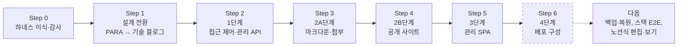
```mermaid
flowchart LR
    S0["Step 0<br/>하네스 이식·감사"] --> S1["Step 1<br/>설계 전환<br/>PARA → 기술 블로그"]
    S1 --> S2["Step 2<br/>1단계<br/>접근 제어·관리 API"]
    S2 --> S3["Step 3<br/>2A단계<br/>마크다운·첨부"]
    S3 --> S4["Step 4<br/>2B단계<br/>공개 사이트"]
    S4 --> S5["Step 5<br/>3단계<br/>관리 SPA"]
    S5 --> S6["Step 6<br/>4단계<br/>배포 구성"]
    S6 -.-> NEXT["다음<br/>백업·복원, 스택 E2E,<br/>노션식 편집·보기"]
    style S6 stroke-dasharray: 5 5
```

---

## 🛠 단계별 작업일지

### Step 0: 개발 하네스 이식과 전수조사 (2026-09-11 ~ 09-14)

**배경.** 이 저장소는 `ClaudeCodeStudy`의 AI 협업 하네스(에이전트 25종·스킬 26종·Stop 훅 자동 커밋·CI·Codex 미러)를 복사해 시작했다. 이식 직후 `settings.json`이 JSON 이스케이프 오류로 로드되지 않았고, 사용자 요청으로 **모든 에이전트와 스킬이 실제로 동작하는지 전수조사**했다.

**한 일.**
1. Explore 에이전트 3개의 정적 감사 → 결함 F1~F15 확정 → 일괄 수정 → 재감사 스크립트(`scripts/harness-audit.ps1`) → 오케스트레이터 5종 실제 실행으로 동적 검증(09-11).
2. 종합 코드 리뷰 하네스를 Claude↔Codex 교차 검토(16건)로 교정하고, 그 과정에서 드러난 "전 하네스가 `_workspace/` 루트를 공유해 산출물이 서로를 파괴하는" 문제를 전 하네스 격리로 해결(09-12).
3. GC 가드(20건), 나머지 5종(동시성·파이프라인·TDD·Git·cross-verify, 합집합 96건)을 교차 점검하고 교정. 감사·리뷰 전용 에이전트 24종의 **쓰기 범위 훅** 도입(09-13). `/health` 엔드포인트를 cross-verify 파이프라인으로 실제 구현해 파이프라인 완주를 확인.
4. 매 세션 고정 로드 토큰(약 47KB)을 절반 이하로 줄이는 하네스 다이어트: 변경 이력을 `plan/harness_changelog.md`로 분리, description 축약, 서브에이전트 모델 지정(09-14).

#### 🤔 고민과 판정

| 갈림길 | 후보 | 선택 | 이유 |
|---|---|---|---|
| 팀 도구(TeamCreate 등)가 이 빌드에 없다 | 생길 때까지 대기 / Agent 팬아웃으로 재작성 | **Agent 팬아웃**(단일 메시지 다중 호출 + 완료 알림) | ToolSearch로 부재 확인. 같은 세션에서 18개 에이전트 실행으로 검증됨 |
| 커밋 주체가 둘(`commitandpush` 스킬, Stop 훅) | 한쪽 폐기 / 공존 | **공존**, 스킬은 능동 경로·훅은 안전망 | 스킬이 먼저 커밋하면 훅은 "변경 없음"으로 끝나 충돌하지 않는다 |
| 파이프라인 중간의 사용자 확인(y/n)이 턴을 끝내 Stop 훅이 **감사 없이 폴백 메시지로 먼저 커밋·푸시**했다(이력에 증거 `8b00b44`, `7f1535d`) | 확인 제거 / 훅 잠금 | **센티널 파일**(`.git/harness_commit_in_progress`, 6시간)로 훅 잠금 | 확인이 꼭 필요한 경우(보안 WARN)는 남기되, 그 사이 훅이 중간 상태를 커밋하지 못하게 |
| Stop 훅의 민감 파일 필터가 `.example` 문자열만 있으면 검사 전체를 해제했고 내용 스캔이 없었다(실측) | 필터 보강 / 내용 스캔 추가 | **둘 다**: 파일별 필터 + 스테이지 diff 내용 스캔(개인키·클라우드 키·비밀번호 리터럴·연결 문자열) | JSON `"Password": "…"` 꼴이 기존 패턴에 안 걸리는 것도 실측으로 확인 |
| 감사·리뷰 에이전트가 소스를 고칠 수 있다 | `tools:`에서 Edit 제외 / 훅으로 경로 차단 | **둘 다**(1차: 프론트매터 `hooks:`, 2차: `settings.json` 프로젝트 훅) | 리뷰어는 자기 `_workspace/<하네스>/`에 JSON을 써야 하므로 Write 자체는 유지 |
| `cross`는 git 추적 대상이라 보관 이동하면 추적 기록이 삭제로 커밋된다 | 일괄 규칙 / 예외 | **예외**: `cross`만 run_id 하위 누적 | `.gitignore`의 `_workspace/cross/` 재포함 규칙과 정합 |

#### ❌ 틀렸던 것(교차 점검이 잡은 대표 결함)

- 오케스트레이터 5종이 존재하지 않는 팀 도구에 의존 → 실행 불가(F1, 치명).
- TDD 템플릿 csproj가 `03_qa/Src`에 파일 하나만 있어도 앞 단계 소스 전체를 제외 → 부분 리팩토링에서 컴파일 깨짐. 파일 단위 우선순위(qa > builder > analyst)로 재설계하고 msbuild 평가로 실측 검증.
- 파이프라인 템플릿의 .NET 기술 오답 다수(`BoundedChannelFullMode.Drop` 미존재, `PauseWriterThreshold < 최대 프레임`이면 파이프 교착, `WhenAll`에 상호 취소 없음 등) → 템플릿 3종을 net10.0으로 실제 빌드해 교정.
- `invoke-codex.ps1`의 `Write-Error`가 `$ErrorActionPreference='Stop'` 아래에서 예외로 승격돼 timeout·empty-output 상태가 **절대 기록되지 않았다**(pwsh 7 재현) → meta 상태 1회 확정으로 재작성.

#### 1. 유저 흐름도

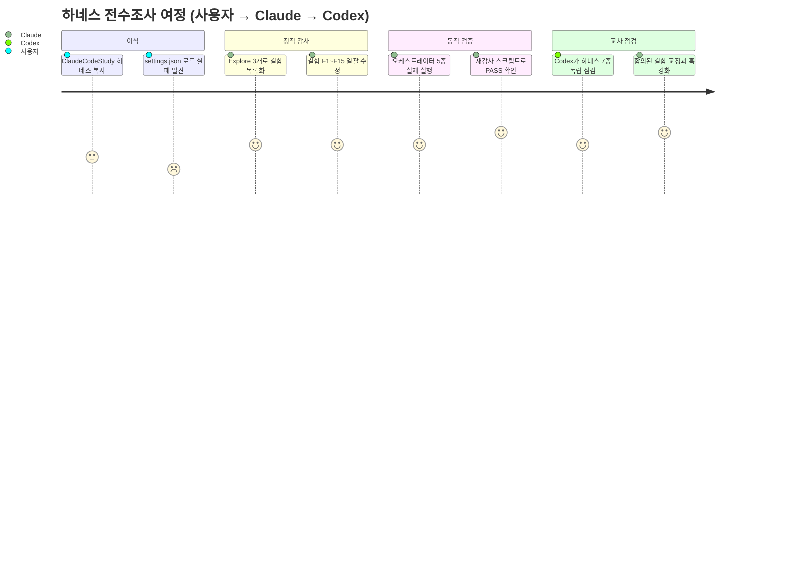
```mermaid
journey
    title 하네스 전수조사 여정 (사용자 → Claude → Codex)
    section 이식
      ClaudeCodeStudy 하네스 복사: 3: 사용자
      settings.json 로드 실패 발견: 2: 사용자
    section 정적 감사
      Explore 3개로 결함 목록화: 4: Claude
      결함 F1~F15 일괄 수정: 4: Claude
    section 동적 검증
      오케스트레이터 5종 실제 실행: 4: Claude
      재감사 스크립트로 PASS 확인: 5: Claude
    section 교차 점검
      Codex가 하네스 7종 독립 점검: 4: Codex
      합의된 결함 교정과 훅 강화: 5: Claude
```

#### 2. 시퀀스 다이어그램 — Stop 훅 자동 커밋과 센티널

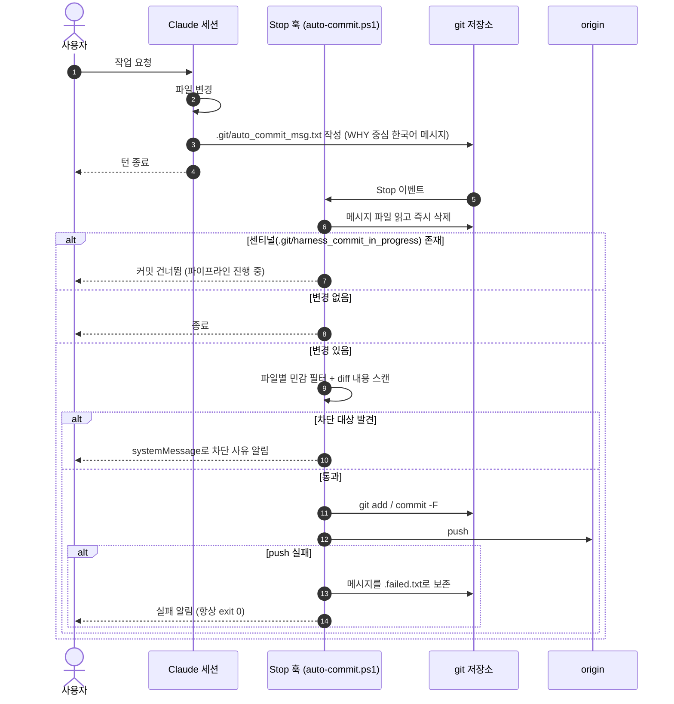
```mermaid
sequenceDiagram
    autonumber
    actor U as 사용자
    participant C as Claude 세션
    participant H as Stop 훅 (auto-commit.ps1)
    participant G as git 저장소
    participant R as origin

    U->>C: 작업 요청
    C->>C: 파일 변경
    C->>G: .git/auto_commit_msg.txt 작성 (WHY 중심 한국어 메시지)
    C-->>U: 턴 종료
    G->>H: Stop 이벤트
    H->>G: 메시지 파일 읽고 즉시 삭제
    alt 센티널(.git/harness_commit_in_progress) 존재
        H-->>U: 커밋 건너뜀 (파이프라인 진행 중)
    else 변경 없음
        H-->>U: 종료
    else 변경 있음
        H->>H: 파일별 민감 필터 + diff 내용 스캔
        alt 차단 대상 발견
            H-->>U: systemMessage로 차단 사유 알림
        else 통과
            H->>G: git add / commit -F
            H->>R: push
            alt push 실패
                H->>G: 메시지를 .failed.txt로 보존
                H-->>U: 실패 알림 (항상 exit 0)
            end
        end
    end
```

#### 3. 처리 흐름도 — 자동 커밋 스크립트의 판정 순서

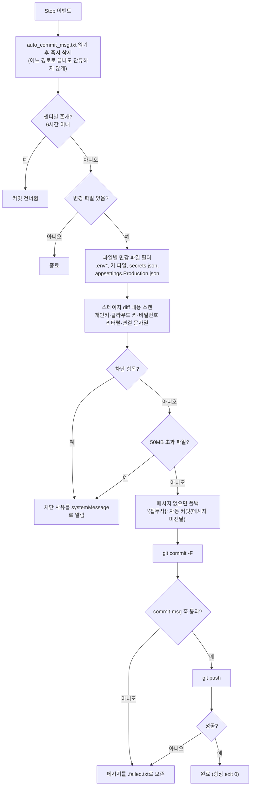
```mermaid
flowchart TD
    A["Stop 이벤트"] --> B["auto_commit_msg.txt 읽기 후 즉시 삭제<br/>(어느 경로로 끝나도 잔류하지 않게)"]
    B --> C{"센티널 존재?<br/>6시간 이내"}
    C -- "예" --> X1["커밋 건너뜀"]
    C -- "아니오" --> D{"변경 파일 있음?"}
    D -- "아니오" --> X2["종료"]
    D -- "예" --> E["파일별 민감 파일 필터<br/>.env*, 키 파일, secrets.json,<br/>appsettings.Production.json"]
    E --> F["스테이지 diff 내용 스캔<br/>개인키·클라우드 키·비밀번호 리터럴·연결 문자열"]
    F --> G{"차단 항목?"}
    G -- "예" --> X3["차단 사유를 systemMessage로 알림"]
    G -- "아니오" --> H{"50MB 초과 파일?"}
    H -- "예" --> X3
    H -- "아니오" --> I["메시지 없으면 폴백<br/>'{접두사}: 자동 커밋(메시지 미전달)'"]
    I --> J["git commit -F"]
    J --> K{"commit-msg 훅 통과?"}
    K -- "아니오" --> L["메시지를 .failed.txt로 보존"]
    K -- "예" --> M["git push"]
    M --> N{"성공?"}
    N -- "아니오" --> L
    N -- "예" --> X4["완료 (항상 exit 0)"]
```

#### 4. 구현 및 검증

- 수정 파일: `.claude/agents/*.md`(25종), `.claude/skills/*/SKILL.md`(26종) + `.agents/skills/` 미러, `.codex/agents/*.toml`, `scripts/auto-commit.ps1`, `scripts/hooks/guard-write-scope.ps1`, `scripts/harness-audit.ps1`, `scripts/invoke-codex.ps1`, `.claude/settings.json`, `.gitignore`, `CLAUDE.md`·`AGENTS.md`, `plan/harness_*.md`
- 주요 변경사항: 팀 도구 의존 제거, 전 하네스 `_workspace/<하네스명>/` 격리, Stop 훅 재작성(메시지 선소비·센티널·민감 필터·내용 스캔·항상 exit 0), 쓰기 범위 훅, Codex 어댑터 meta 증빙(sha256·thread_id), 토큰 다이어트
- 검증 결과: `pwsh scripts/harness-audit.ps1` **8/8 PASS**, 오케스트레이터 5종 완주(코드 리뷰 89점·동시성 100점·GC 91점·TDD 16/16·파이프라인 APPROVE), 쓰기 범위 훅은 세션 재시작 후 프로브로 차단 확인

---

### Step 1: 제품 설계 — PARA 노트앱에서 보안 최우선 기술 블로그로 (2026-09-17 ~ 09-20)

**배경.** 09-17에 PARA(Projects/Areas/Resources/Archive) 노트앱 설계를 쓰고 Codex 교차 검증을 두 차례 반영했다. 그런데 항목·할 일·보관·영역 불변식·노션 zip 라운드트립 때문에 설계와 구현량이 컸고, 실제로 필요한 것은 "글을 쓰고 공개하는 곳"이었다. 09-20에 **PARA를 완전 폐기**하고 기술 블로그로 방향을 바꿨다(구현 전이라 버려진 코드는 없다). 이어서 솔루션을 `WebProject` → `PortfolioBlog`로 개명하고 `.slnx`로 전환, 템플릿 잔재(`/weatherforecast`, 샘플 프로젝트)를 정리했다(0단계).

**사용자가 확정한 것(다시 묻지 않는다).** 보안이 최우선(선택이 갈리면 더 엄격한 쪽) · 글은 상태 없음(**저장 = 즉시 공개**) · 공개 페이지는 서버 렌더링, React는 관리 에디터에만 · 쓰기 = 허용 IP **AND** 비밀번호 세션(아이디 없음) · 관리 화면은 `admin.<도메인>` 서브도메인.

#### 🤔 고민과 판정

| 갈림길 | 후보 | 선택 | 이유 |
|---|---|---|---|
| 렌더링 구조 | A. SPA + 서버 메타 주입 / B. 서버 렌더링 + 관리 에디터 / C. SSR 프레임워크(Next·Astro) | **B** | 방문자에게 실행되는 JS가 0이라 CSP를 `default-src 'none'`까지 조일 수 있고, npm 공급망 사고가 관리자 브라우저에만 닿는다. 비용은 뷰 계층 둘(Razor + React)과 미리보기 API |
| 쓰기 인증 | IP 화이트리스트만(PARA 설계) / IP AND 비밀번호 / + TOTP | **IP AND 비밀번호 세션** | 네트워크 위치 단일 요소는 같은 NAT의 다른 기기·프록시 설정 실수가 곧 공개 사이트 변조로 이어진다(저장 즉시 공개). 단일 작성자라 아이디는 식별 가치가 없다. TOTP는 시크릿 보관·복구 비용 때문에 확장 포인트로 |
| 관리 표면 위치 | 경로 분리 `/admin` / 서브도메인 | **서브도메인** | 경로 분리는 브라우저 관점의 origin 격리가 아니다. 공개 페이지에 XSS가 하나라도 생기면 작성자 쿠키로 관리 API가 호출된다(Codex 지적 ⑪). `__Host-` 쿠키는 관리 호스트에만 간다 |
| 쓰기 검사 위치 | 엔드포인트 필터 / 미들웨어 | **미들웨어** | 최소 API의 필터는 **본문 바인딩 이후** 실행된다. 미인증 요청이 10MB 업로드 본문을 버퍼링시키지 못하게 하려면 바인딩 전에 거부해야 한다 |
| 비밀번호 해시 | Argon2id(Codex 권고) / 프레임워크 내장 PBKDF2 | **내장 `PasswordHasher`**(이견) | Argon2id는 서드파티 패키지가 필요해 공급망 표면만 늘어난다. 속도 제한 3종·입력 길이 제한·로그 제외는 수용 |
| 이미지 픽셀·프레임 상한(디코딩 검증, Codex 권고) | 디코더 추가 / 디코딩 안 함 | **디코딩 안 함**(이견) | 서버가 디코딩하지 않으면 압축 폭탄이 서버에 피해를 못 주고 업로더는 인증된 작성자뿐. 디코더가 오히려 새 표면. **메타데이터 제거는 수용** |
| 런타임 DB 최소 권한 계정(Codex 권고) | 지금 분리 / 확장 포인트 | 확장 포인트로 보류(이견) → **4단계에서 결국 분리** | 당시엔 앱이 시작 시 마이그레이션을 실행해 DDL 권한이 필요했다. 2B의 잔여 위험("읽기 전용 설정은 세션이 스스로 끌 수 있다")이 이 결정을 뒤집었다 |
| 발행 상태 | 초안/발행 / 상태 없음 | **상태 없음** | 사용자 결정. 자동 저장은 서버에 두지 않고(자동 저장 = 공개가 되므로) 브라우저 localStorage 임시본만 |
| Slug | 자동 생성 / 작성자 직접 입력·불변 | **직접 입력, 생성 후 불변** | 한글 제목 자동 변환은 품질이 나쁘고, 변경을 허용하면 외부 링크와 Atom ID가 깨진다 |

Codex 교차 검토(read-only, status=success)는 "설계 골격 유지 가능. Critical 없음, High 11 / Medium 11 / Low 1. 방향 오류가 아니라 보안 계약의 세부가 비어 있음"이었다. 수용 19건(신뢰 프록시 = Caddy 고정 IP 하나, `__Host-` 쿠키·절대 12시간·sliding 없음, 변경 요청의 `Origin` 검사, 피드는 `XmlWriter`·절대 URL은 `PUBLIC_ORIGIN` 고정, `xmin` 동시성 토큰, 태그 `ON CONFLICT DO NOTHING` 등)과 이견 4건의 근거를 스펙 2.6절에 남겼다.

#### 1. 유저 흐름도 — 설계가 목표로 한 두 사용자의 여정

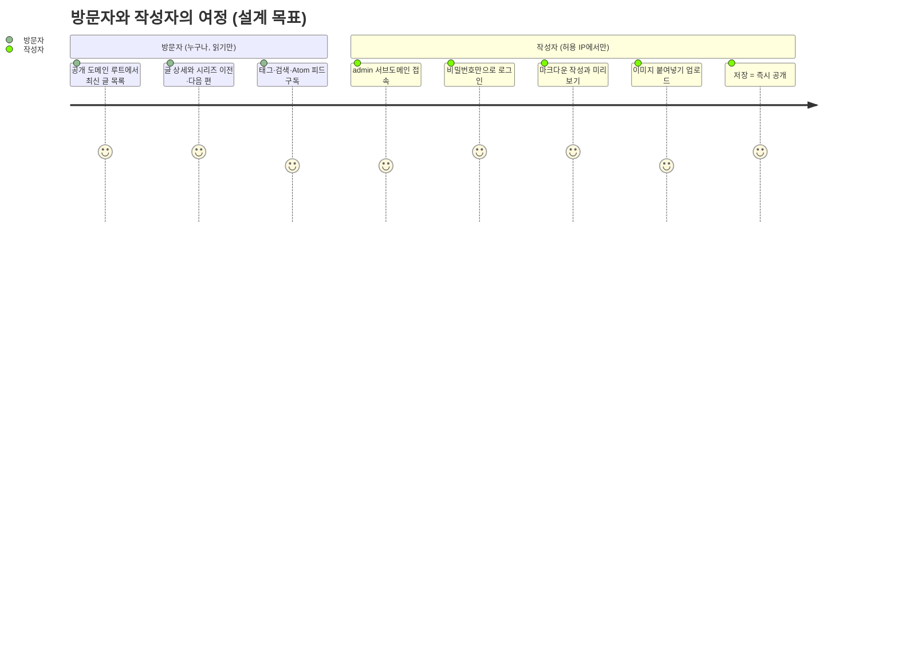
```mermaid
journey
    title 방문자와 작성자의 여정 (설계 목표)
    section 방문자 (누구나, 읽기만)
      공개 도메인 루트에서 최신 글 목록: 5: 방문자
      글 상세와 시리즈 이전·다음 편: 5: 방문자
      태그·검색·Atom 피드 구독: 4: 방문자
    section 작성자 (허용 IP에서만)
      admin 서브도메인 접속: 4: 작성자
      비밀번호만으로 로그인: 5: 작성자
      마크다운 작성과 미리보기: 5: 작성자
      이미지 붙여넣기 업로드: 4: 작성자
      저장 = 즉시 공개: 5: 작성자
```

#### 2. 시퀀스 다이어그램 — Codex 교차 검토 루프

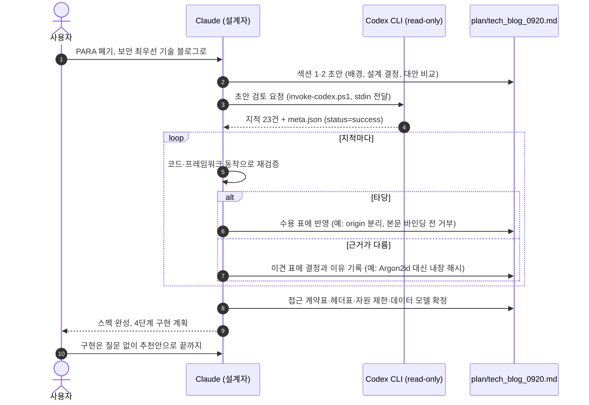
```mermaid
sequenceDiagram
    autonumber
    actor U as 사용자
    participant C as Claude (설계자)
    participant X as Codex CLI (read-only)
    participant S as plan/tech_blog_0920.md

    U->>C: PARA 폐기, 보안 최우선 기술 블로그로
    C->>S: 섹션 1·2 초안 (배경, 설계 결정, 대안 비교)
    C->>X: 초안 검토 요청 (invoke-codex.ps1, stdin 전달)
    X-->>C: 지적 23건 + meta.json (status=success)
    loop 지적마다
        C->>C: 코드·프레임워크 동작으로 재검증
        alt 타당
            C->>S: 수용 표에 반영 (예: origin 분리, 본문 바인딩 전 거부)
        else 근거가 다름
            C->>S: 이견 표에 결정과 이유 기록 (예: Argon2id 대신 내장 해시)
        end
    end
    C->>S: 접근 계약표·헤더표·자원 제한·데이터 모델 확정
    C-->>U: 스펙 완성, 4단계 구현 계획
    U->>C: 구현은 질문 없이 추천안으로 끝까지
```

#### 3. 처리 흐름도 — "보안 최우선" 기준으로 갈림길을 고른 순서

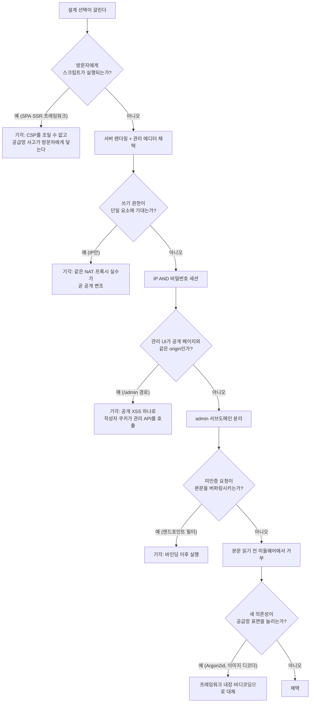
```mermaid
flowchart TD
    A["설계 선택이 갈린다"] --> B{"방문자에게<br/>스크립트가 실행되는가?"}
    B -- "예 (SPA·SSR 프레임워크)" --> B1["기각: CSP를 조일 수 없고<br/>공급망 사고가 방문자에게 닿는다"]
    B -- "아니오" --> C["서버 렌더링 + 관리 에디터 채택"]
    C --> D{"쓰기 권한이<br/>단일 요소에 기대는가?"}
    D -- "예 (IP만)" --> D1["기각: 같은 NAT·프록시 실수가<br/>곧 공개 변조"]
    D -- "아니오" --> E["IP AND 비밀번호 세션"]
    E --> F{"관리 UI가 공개 페이지와<br/>같은 origin인가?"}
    F -- "예 (/admin 경로)" --> F1["기각: 공개 XSS 하나로<br/>작성자 쿠키가 관리 API를 호출"]
    F -- "아니오" --> G["admin 서브도메인 분리"]
    G --> H{"미인증 요청이<br/>본문을 버퍼링시키는가?"}
    H -- "예 (엔드포인트 필터)" --> H1["기각: 바인딩 이후 실행"]
    H -- "아니오" --> I["본문 읽기 전 미들웨어에서 거부"]
    I --> J{"새 의존성이<br/>공급망 표면을 늘리는가?"}
    J -- "예 (Argon2id, 이미지 디코더)" --> J1["프레임워크 내장·비디코딩으로 대체"]
    J -- "아니오" --> K["채택"]
```

#### 4. 구현 및 검증

- 수정 파일: `plan/tech_blog_0920.md`(신규, 설계 스펙), `plan/para_notes_0917.md`(폐기 배너), `README.md`, `CLAUDE.md`·`AGENTS.md`(구성 절·플랜 표), `PortfolioBlog.slnx`·`PortfolioBlog.Api/*`·`PortfolioBlog.Api.Tests/*`(개명·`.slnx` 전환·샘플 삭제), `docs/superpowers/plans/2026-09-17-para-notes-backend.md`(삭제)
- 주요 변경사항: 렌더링·인증·origin·바인딩 시점의 설계 결정과 대안 비교표, 데이터 모델(테이블 5개 + `AdminState`) ERD와 제약, 접근 계약표, 헤더·CSP표, 자원 제한표, 배포 토폴로지, 필수 통과 테스트, Codex 반영표, 4단계 구현 계획
- 검증 결과: Codex 교차 검토 `*.meta.json` status=success(Critical 0), 0단계 후 `dotnet build -c Release` 경고 0 / 오류 0, `/health` 통합 테스트 통과

---

### Step 2: 1단계 — 도메인·접근 제어·로그인·관리 API (2026-09-20 ~ 09-21, PR #1)

**만든 것.** 엔티티(`Post`·`Series`·`Tag`·`PostTag`·`AdminState`)와 DB 제약(slug 형식·유일·불변, `SeriesOrder` CHECK), 초기 마이그레이션, Testcontainers PostgreSQL 픽스처 → 공백 구분 CIDR 파서와 IP 허용 정책 → 본문을 읽기 전에 호스트·IP·CSRF 헤더·Origin을 거르는 `AdminSurfaceMiddleware` → 아이디 없는 비밀번호 로그인, 서버 측 세션 폐기(절대 12시간·비밀번호 해시 지문·`SessionEpoch`) → 글 관리 API(`xmin` 낙관적 동시성) → 시리즈 API → 태그 API와 **전 엔드포인트 접근 매트릭스 닫힌 세계 테스트**.

**진행 방식.** 브레인스토밍으로 확정한 스펙 → 스파이크로 측정한 계획서(`2026-09-20-tech-blog-backend-core.md`) → 작업마다 구현자 에이전트 → 리뷰어가 **직접 공격·측정** → 수정 라운드 → 최종 브랜치 리뷰 → PR → CI → squash 병합. 이 구조는 이후 모든 단계에서 유지됐다.

#### 🤔 고민과 판정

| 갈림길 | 고민 | 결정 |
|---|---|---|
| IP 검사와 속도 제한의 순서 | 계획은 속도 제한이 앞이었다. 그러면 허용 IP **밖**의 요청이 로그인 전역 한도(20회/분)를 소진해 작성자를 잠글 수 있다 | **IP 검사를 속도 제한보다 앞으로**. 미들웨어 순서를 스펙 3.3절에 고정 |
| 속도 제한 파티션을 무엇으로 고르나 | 계획은 요청 경로 문자열 비교. 라우팅은 끝 슬래시를 무시하므로 슬래시를 하나 붙인 로그인 경로가 핸들러에는 도달하면서 제한 3종을 전부 우회했다 | **엔드포인트 메타데이터**로 판정. 이후 모든 제한기(공개·검색·미리보기·업로드)가 같은 방식 |
| 앱 검증과 DB CHECK가 같은 정규식을 공유해도 되나 | .NET의 `$`는 끝의 개행 앞에서도 매칭되지만 PostgreSQL은 아니다. 개행으로 끝나는 slug가 앱 검증을 통과한 뒤 CHECK에 걸려 400이 아닌 **500** | .NET 쪽만 `\A…\z`로 앵커. "같은 입력 집합을 허용한다"를 테스트로 고정 |
| 로그인 실패 시 영구 잠금을 둘까 | 잠금은 작성자 서비스 거부가 된다 | 영구 잠금 없음. IP별 5회/분 + 전역 20회/분 + 해시 검증 동시 실행 2 |
| 세션 폐기를 어떻게 | 기기별 세션 관리 / 전역 epoch | **epoch**: 로그아웃은 epoch를 올려 모든 세션 폐기, 비밀번호 교체(해시 지문 변경)도 자동 폐기. 단일 작성자라 기기별 관리는 YAGNI |
| 새 태그를 동시에 만드는 두 저장 | 경쟁을 409로 돌려줄까 | `ON CONFLICT DO NOTHING` 후 재조회. 단, 요청 순서대로 INSERT하면 반대 순서 나열 시 교착(40P01) → **정규화명 서수 순으로 INSERT**해 잠금 순서를 전역 통일 |
| 시리즈 삭제·수정의 동시 변경 | 글 API는 409/404인데 시리즈 API는 500이었다(삭제 중 끼어든 글 저장의 FK 위반 등) | 삭제 트랜잭션 첫 문장에 `SELECT … FOR UPDATE`, FK 위반은 409, 삭제된 시리즈 수정은 404, 병렬 스트레스 테스트 |
| XML 주석 규칙이 너무 무겁다 | 자동 속성과 `[Fact]`마다 붙는 내용 없는 상용구가 파일의 상당 부분을 차지하고 실제 제약을 가렸다(최종 리뷰 권고) | **적용 범위 표** 도입: 3항목 `<remarks>`는 동작이 있는 곳에만, DTO·옵션·테스트 메서드는 `
`만 |

#### ❌ 틀렸던 것(계획 정오표 6건)

| 계획 | 결함 | 교정 |
|---|---|---|
| `GetConnectionString("Default") ?? throw` | `appsettings.json`의 빈 문자열이 `??`를 통과해 설정 누락이 소켓 오류로 나타남 | `IsNullOrWhiteSpace` 검사 |
| 경로 문자열로 로그인 판정 | 끝 슬래시로 속도 제한 우회 | 엔드포인트 메타데이터 |
| DB와 같은 정규식 문자열 | 개행 끝 slug → 500 | `\A…\z` 앵커 |
| NUL 검사 없음 | PostgreSQL `text`는 U+0000을 저장 못 해 500 | 필드별 400 |
| 태그 요청 순서 INSERT | 교착 가능 | 서수 순 INSERT |
| 시리즈 동시 변경 미처리 | 500 | `FOR UPDATE` + 409/404 |

후속 계획이 지킬 규칙 1~4: 파티션은 메타데이터로 / 정규식은 엔진별로 따로 / `ExecuteUpdate`의 오류는 `PostgresException` 그대로 / NUL은 C# 이스케이프로만 표기하고 커밋 전 0x00 바이트 검사(도구 체인이 6글자 유니코드 이스케이프를 실제 NUL 바이트로 바꿔 넣은 전례가 있다).

#### 1. 유저 흐름도

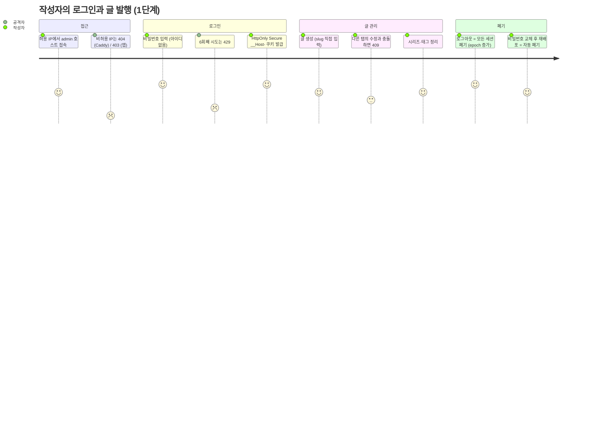
```mermaid
journey
    title 작성자의 로그인과 글 발행 (1단계)
    section 접근
      허용 IP에서 admin 호스트 접속: 4: 작성자
      비허용 IP는 404 (Caddy) / 403 (앱): 1: 공격자
    section 로그인
      비밀번호 입력 (아이디 없음): 5: 작성자
      6회째 시도는 429: 2: 공격자
      HttpOnly Secure __Host- 쿠키 발급: 5: 작성자
    section 글 관리
      글 생성 (slug 직접 입력): 4: 작성자
      다른 탭의 수정과 충돌하면 409: 3: 작성자
      시리즈·태그 정리: 4: 작성자
    section 폐기
      로그아웃 = 모든 세션 폐기 (epoch 증가): 5: 작성자
      비밀번호 교체 후 재배포 = 자동 폐기: 4: 작성자
```

#### 2. 시퀀스 다이어그램 — 로그인과 세션 검증

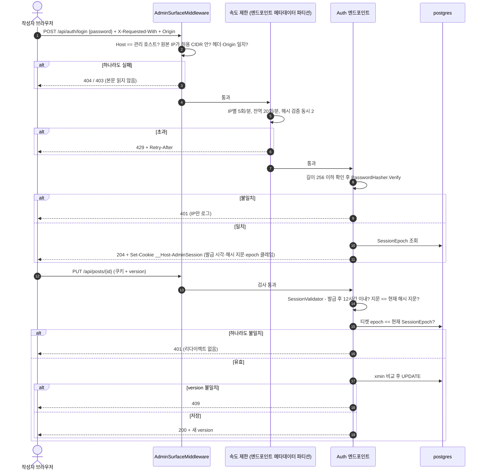
```mermaid
sequenceDiagram
    autonumber
    actor W as 작성자 브라우저
    participant M as AdminSurfaceMiddleware
    participant RL as 속도 제한 (엔드포인트 메타데이터 파티션)
    participant A as Auth 엔드포인트
    participant D as postgres

    W->>M: POST /api/auth/login {password} + X-Requested-With + Origin
    M->>M: Host == 관리 호스트? 원본 IP가 허용 CIDR 안? 헤더·Origin 일치?
    alt 하나라도 실패
        M-->>W: 404 / 403 (본문 읽지 않음)
    end
    M->>RL: 통과
    RL->>RL: IP별 5회/분, 전역 20회/분, 해시 검증 동시 2
    alt 초과
        RL-->>W: 429 + Retry-After
    end
    RL->>A: 통과
    A->>A: 길이 256 이하 확인 후 PasswordHasher.Verify
    alt 불일치
        A-->>W: 401 (IP만 로그)
    else 일치
        A->>D: SessionEpoch 조회
        A-->>W: 204 + Set-Cookie __Host-AdminSession (발급 시각·해시 지문·epoch 클레임)
    end

    W->>M: PUT /api/posts/{id} (쿠키 + version)
    M->>A: 검사 통과
    A->>A: SessionValidator - 발급 후 12시간 이내? 지문 == 현재 해시 지문?
    A->>D: 티켓 epoch == 현재 SessionEpoch?
    alt 하나라도 불일치
        A-->>W: 401 (리다이렉트 없음)
    else 유효
        A->>D: xmin 비교 후 UPDATE
        alt version 불일치
            A-->>W: 409
        else 저장
            A-->>W: 200 + 새 version
        end
    end
```

#### 3. 처리 흐름도 — `/api` 요청의 접근 판정(전부 본문을 읽기 전에 끝난다)

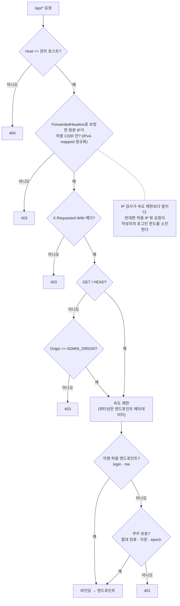
```mermaid
flowchart TD
    S["/api/* 요청"] --> H{"Host == 관리 호스트?"}
    H -- "아니오" --> R404["404"]
    H -- "예" --> IP{"ForwardedHeaders로 보정한 원본 IP가<br/>허용 CIDR 안? (IPv4-mapped 정규화)"}
    IP -- "아니오" --> R403a["403"]
    IP -- "예" --> XH{"X-Requested-With 헤더?"}
    XH -- "아니오" --> R403b["403"]
    XH -- "예" --> M{"GET / HEAD?"}
    M -- "아니오" --> O{"Origin == ADMIN_ORIGIN?"}
    O -- "아니오" --> R403c["403"]
    O -- "예" --> RL
    M -- "예" --> RL["속도 제한<br/>(파티션은 엔드포인트 메타데이터)"]
    RL --> L{"익명 허용 엔드포인트?<br/>login · me"}
    L -- "예" --> E["바인딩 → 엔드포인트"]
    L -- "아니오" --> C{"쿠키 유효?<br/>절대 만료 · 지문 · epoch"}
    C -- "아니오" --> R401["401"]
    C -- "예" --> E
    note1["IP 검사가 속도 제한보다 앞이다.<br/>반대면 허용 IP 밖 요청이<br/>작성자의 로그인 한도를 소진한다"]
    IP -.- note1
```

#### 4. 구현 및 검증

- 수정 파일: `PortfolioBlog.Api/Domain/*`, `Contracts/*`(DTO·`ValidationErrors`·`SlugRules`), `Infrastructure/Data/{AppDbContext,DbClock}.cs` + 마이그레이션, `Infrastructure/Access/{CidrList,AdminAccessPolicy,AdminSurfaceMiddleware,AdminCredential,SessionRules,SessionValidator,HashPasswordCommand,StartupValidation}.cs`, `Features/{ApiEndpoints,Auth,Posts,Series,Tags}/*`, `Program.cs`; 테스트 `PostgresContainerFixture`·`ApiFactory`·`AccessMatrixTests`·`SessionTests`·`CidrListTests`·`Posts*`·`Series*`·`Tags*`
- 주요 변경사항: 접근 제어 3겹(호스트·IP·CSRF)을 본문 바인딩 전 미들웨어로, 비밀번호 해시는 환경변수로만 주입(`hash-password` CLI), 쿠키 티켓에 발급 시각·해시 지문·epoch, `xmin` 동시성 토큰, Production에서 설정 누락은 **시작 실패**
- 검증 결과: PR #1 → `5604f2d`, 테스트 **166개** 통과, 접근 매트릭스 {허용 IP, 비허용} × {로그인, 미로그인} × {헤더 유무} × {호스트}를 전 `/api` 엔드포인트에 닫힌 세계로 적용, 해시 회전·매핑 IP·대소문자·운영 기본값 회귀 테스트

---

### Step 3: 2A단계 — 마크다운 파이프라인·미리보기·이미지 첨부 (2026-09-21, PR #2)

**만든 것.** Task 1 공용 기반(중앙 패키지 버전 관리로 전이 의존성까지 고정, `TextRules`, 속도 제한을 `Infrastructure/Web`으로 이전) → Task 2 마크다운 3단 정제 파이프라인(Markdig `DisableHtml` → URL 정책 → ColorCode 서버 측 강조(클래스만) → HtmlSanitizer 허용 목록) → Task 3 `POST /api/preview`(공개 페이지와 같은 렌더러) → Task 4 시그니처만으로 형식 판정 + **디코딩 없는** 스트림 기반 메타데이터 제거기(JPEG·PNG·WebP·GIF) → Task 5 `Attachment` 엔티티, 내용 주소(SHA-256) 저장, 관리 업로드·목록·삭제, 공개 `GET/HEAD /attachments/{id}/{fileName}`.

**가장 큰 교훈.** 계획을 그대로 옮긴 코드는 매번 테스트를 통과했지만, **계획 자체가 틀려 있었다**(계획 결함 16건). 측정하지 않고 쓴 문장이 결함의 원천이었다.

#### 🤔 고민과 판정

| 갈림길 | 고민 | 결정 | 틀렸을 때의 비용 |
|---|---|---|---|
| 렌더 비용 상한을 무엇으로 | 계획은 "렌더링 약 200ms", 200KB 길이 제한이 상한이라고 썼다. 실측: 닫히지 않은 블록 주석 뒤 C 계열 코드에서 강조기가 **지수** 백트래킹 — 1,320바이트에 7초, 약 1,600바이트에 60초 초과. 저장된 글 하나로 공개 페이지가 영구 마비될 수 있었다 | 길이가 아니라 **시간**으로: 정규식 매치 250ms + 렌더당 강조 누적 2,000ms, 초과한 블록만 평문 | 같은 글이 부하에 따라 강조되기도 안 되기도 한다 → 2B의 렌더 캐시가 덮는다 |
| 블록당 강조 예산 20,000자 | 근거 측정이 "8KB 한 줄"뿐이었고 285줄 넘는 평범한 파일의 강조가 꺼졌다 | 제거(시간 예산만 유지) | 긴 정상 블록에서 CPU 약간 증가 |
| 이미지 메타데이터 제거를 어디까지 | 계획은 "GIF는 주석만 제거", "JPEG APP0은 남긴다". 실측: 라벨 1바이트만 바꾸면 큰 페이로드가 정상 재생되는 GIF 안에 그대로 남았고, APP0에는 자르기 전 원본 썸네일이 남았다 | 네 형식 모두 **기본 거부** + 남기는 블록의 **모양**까지 검사. JPEG는 식별자를 확인한 `JFIF`·`ICC_PROFILE`·`Adobe`만 유지 | 드문 정상 파일(계층형 JPEG, 규격 밖 인코더 출력)이 400 |
| 디코딩하지 않아 못 막는 잔여 표면 5종(ICC 본문, WebP 프레임 페이로드, JPEG 테이블, PNG CRC, GIF LZW 체인) | 디코더를 넣을까 | **검사하지 않고 문서화**. 10MB 상한 + 시그니처 기반 Content-Type + `nosniff` + sandbox CSP라 브라우저에서 실행 불가 | 인증된 관리자가 올린 파일에 한해 최대 약 10MB의 비활성 바이트 |
| 기본 인증 스킴 | 계획은 "스킴 제거로 비용 0". 실측: 스킴이 하나면 프레임워크가 자동으로 기본 스킴으로 삼는다 | 명시적으로 복원 | 관리자 쿠키가 실린 수제 요청은 공개 경로에서도 세션 DB 조회 1회 |
| 공개 첨부 GET의 파일 열기 | 존재 확인 후 열기 → 그 사이 삭제되면 500 | 직접 연 스트림(`FileShare.Read\|Delete`) + 강한 ETag(sha256) + HEAD | 커널 sendfile 경로를 안 쓴다(immutable 캐시라 영향 작음) |
| 저장 루트 검증 | 계획은 "비어 있지 않은지만". 실측: 루트가 구분자로 끝나면 시작은 통과하고 **모든 업로드·다운로드가 500**(최종 리뷰가 실제 호스트에서 발견) | 루트 정규화 + 시작 시 자체 점검(운영은 절대 경로, 생성 + 쓰기 확인) | 볼륨이 앱보다 늦게 마운트되면 시작 실패 → Plan 4에서 순서 보장 |
| 파일 이름 자르기 | `stem[..max]`가 이모지를 쪼개면 INSERT에서 500 + 고아 파일 | 코드 포인트 경계에서 자르고, 자른 뒤 `..`·끝 점이 되살아나지 않게 재정리 | — |
| CI 첫 Linux 실행의 실패 2건 | 절대 시간 상한 테스트(로컬 0.8초 → CI 7.2초)와 삭제 뒤 저장의 400 | **테스트 전제의 오류**로 판정: 비율 단언으로 교체, 400은 정답 | GC 잡음이 큰 러너에서 비율 상한 초과 가능 |

**구현자 보고도 검증 대상이었다.** "CRLF 유지"(실제 LF), "주석 갱신 완료"(하지 않음), 커밋 트레일러 오기(2회) — 컨트롤러 검사와 재리뷰가 각각 잡았다. 이후 매 커밋마다 Release 빌드·전체 테스트·트레일러·NUL 바이트·줄 끝을 컨트롤러가 직접 확인한다.

#### 1. 유저 흐름도

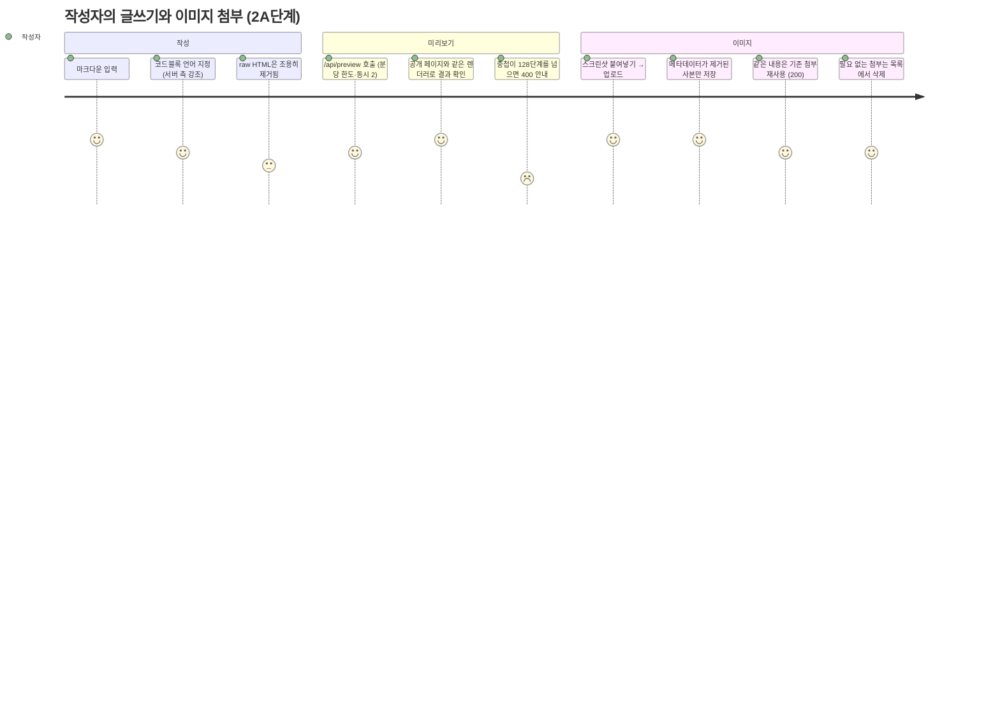
```mermaid
journey
    title 작성자의 글쓰기와 이미지 첨부 (2A단계)
    section 작성
      마크다운 입력: 5: 작성자
      코드블록 언어 지정 (서버 측 강조): 4: 작성자
      raw HTML은 조용히 제거됨: 3: 작성자
    section 미리보기
      /api/preview 호출 (분당 한도·동시 2): 4: 작성자
      공개 페이지와 같은 렌더러로 결과 확인: 5: 작성자
      중첩이 128단계를 넘으면 400 안내: 2: 작성자
    section 이미지
      스크린샷 붙여넣기 → 업로드: 5: 작성자
      메타데이터가 제거된 사본만 저장: 5: 작성자
      같은 내용은 기존 첨부 재사용 (200): 4: 작성자
      필요 없는 첨부는 목록에서 삭제: 4: 작성자
```

#### 2. 시퀀스 다이어그램 — 이미지 업로드와 공개 조회

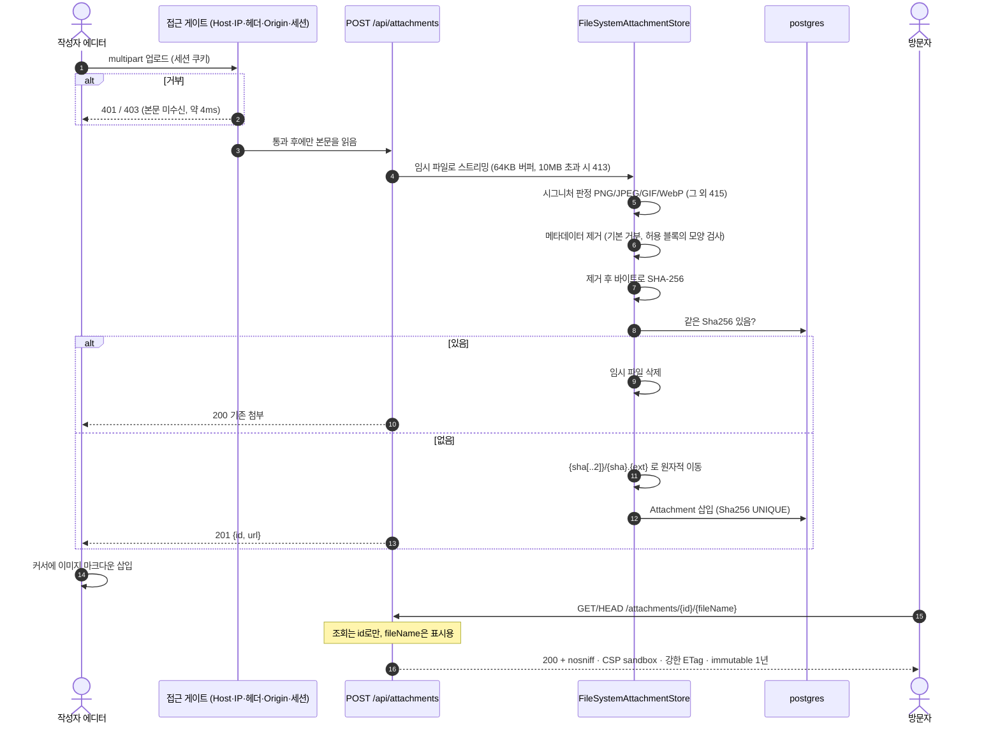
```mermaid
sequenceDiagram
    autonumber
    actor W as 작성자 에디터
    participant M as 접근 게이트 (Host·IP·헤더·Origin·세션)
    participant E as POST /api/attachments
    participant S as FileSystemAttachmentStore
    participant D as postgres
    actor V as 방문자

    W->>M: multipart 업로드 (세션 쿠키)
    alt 거부
        M-->>W: 401 / 403 (본문 미수신, 약 4ms)
    end
    M->>E: 통과 후에만 본문을 읽음
    E->>S: 임시 파일로 스트리밍 (64KB 버퍼, 10MB 초과 시 413)
    S->>S: 시그니처 판정 PNG/JPEG/GIF/WebP (그 외 415)
    S->>S: 메타데이터 제거 (기본 거부, 허용 블록의 모양 검사)
    S->>S: 제거 후 바이트로 SHA-256
    S->>D: 같은 Sha256 있음?
    alt 있음
        S->>S: 임시 파일 삭제
        E-->>W: 200 기존 첨부
    else 없음
        S->>S: {sha[..2]}/{sha}.{ext} 로 원자적 이동
        S->>D: Attachment 삽입 (Sha256 UNIQUE)
        E-->>W: 201 {id, url}
    end
    W->>W: 커서에 이미지 마크다운 삽입

    V->>E: GET/HEAD /attachments/{id}/{fileName}
    Note over E: 조회는 id로만, fileName은 표시용
    E-->>V: 200 + nosniff · CSP sandbox · 강한 ETag · immutable 1년
```

#### 3. 처리 흐름도 — 마크다운 → 안전한 HTML(시간 예산 분기 포함)

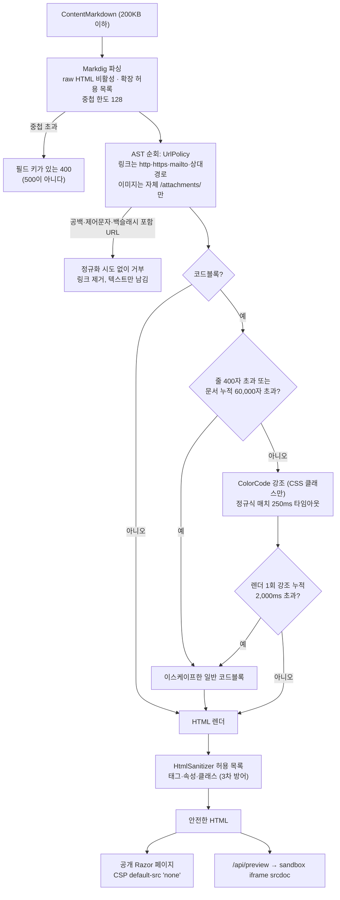
```mermaid
flowchart TD
    MD["ContentMarkdown (200KB 이하)"] --> P["Markdig 파싱<br/>raw HTML 비활성 · 확장 허용 목록<br/>중첩 한도 128"]
    P -- "중첩 초과" --> E400["필드 키가 있는 400<br/>(500이 아니다)"]
    P --> U["AST 순회: UrlPolicy<br/>링크는 http·https·mailto·상대경로<br/>이미지는 자체 /attachments/ 만"]
    U -- "공백·제어문자·백슬래시 포함 URL" --> DROP["정규화 시도 없이 거부<br/>링크 제거, 텍스트만 남김"]
    U --> HL{"코드블록?"}
    HL -- "아니오" --> R
    HL -- "예" --> B{"줄 400자 초과 또는<br/>문서 누적 60,000자 초과?"}
    B -- "예" --> PLAIN["이스케이프한 일반 코드블록"]
    B -- "아니오" --> T["ColorCode 강조 (CSS 클래스만)<br/>정규식 매치 250ms 타임아웃"]
    T --> TB{"렌더 1회 강조 누적<br/>2,000ms 초과?"}
    TB -- "예" --> PLAIN
    TB -- "아니오" --> R["HTML 렌더"]
    PLAIN --> R
    R --> SAN["HtmlSanitizer 허용 목록<br/>태그·속성·클래스 (3차 방어)"]
    SAN --> OUT["안전한 HTML"]
    OUT --> PAGE["공개 Razor 페이지<br/>CSP default-src 'none'"]
    OUT --> PRE["/api/preview → sandbox iframe srcdoc"]
```

#### 4. 구현 및 검증

- 수정 파일: `Directory.Packages.props`(신규), `Contracts/TextRules.cs`, `Infrastructure/Web/{RateLimitPolicy,RateLimitingExtensions,ClientIp}.cs`, `Infrastructure/Markdown/{MarkdownRenderer,UrlPolicy,HighlightingCodeBlockRenderer,TimeBoundedLanguageCompiler,HeadingIds,HtmlAllowlist,HighlightCss}.cs`, `Features/Preview/PreviewEndpoints.cs`, `Infrastructure/Storage/{ImageSignature,MetadataStripper,FileSystemAttachmentStore}.cs`, `Features/Attachments/*`, `Domain/Attachment.cs` + 마이그레이션
- 주요 변경사항: 3단 정제 파이프라인, 시간 기반 렌더 상한, 기본 거부 메타데이터 제거기, 내용 주소 저장, 접근 검사 후에만 본문 읽기
- 검증 결과: PR #2 → `898b839`, 22커밋 → squash 1개, 테스트 **412개**(166 → 412), Release 경고 0. 리뷰: 적대적 마크다운 약 250종 + 시간 상한 재공격 40여 종(XSS 우회 없음, 최악 렌더 2,266ms), 조작 이미지 123종 + GIF 라벨 256·JPEG 마커 256·WebP FourCC 275 전수(멈춤·길이 필드 기반 할당 없음), 실제 Production 호스트에 조작 multipart 17종·JSON 18종(게이트 우회 없음, 인증 없는 디스크 쓰기 없음, 500 없음). CI ubuntu 2회 통과

---

### Step 4: 2B단계 — 공개 사이트·보안 헤더·자원 제한 (2026-09-21, PR #3)

**만든 것.** 속도 제한 정책 4종과 체인 재정렬 → 보안 헤더(`OnStarting`)·호스트 필터·`Server` 헤더 제거·과부하 503·관리 JSON 본문 256KB → 렌더 게이트(전역 동시 2, 대기 5초 → 503)·렌더 결과 캐시(`(PostId, xmin)`, 64MB, 단일 비행)·`TimeProvider` 주입 → 공개 조회 전용 `PublicDbContext`(별도 풀, `statement_timeout` 3초, `default_transaction_read_only`) → 스크립트 없는 Razor 공개 페이지(목록·글·태그·시리즈)와 사이트 CSS → 검색(`q` 2~100자, 쪽 상한 50, `noindex`) → Atom·sitemap·robots(`XmlWriter`, `PUBLIC_ORIGIN` 고정) → 첨부 정합성(sha256 단위 advisory lock, 고아 파일 청소 잡) → 앱 검증 ⊆ DB 제약 경계값 테스트와 CHECK 제약 14개 닫힌 세계 검사.

**계획 전 스파이크 S1~S12**로 속도 제한 체인 순서, `OnStarting`과 `Response.Clear()`, Razor의 `page` 예약 키, `statement_timeout`의 문장당 적용, advisory lock 동작을 버려질 프로젝트에서 먼저 쟀다. 그런데도 실행 중 계획 결함 23건이 나왔고, 최종 리뷰가 **실제 Production 호스트를 HTTPS로 찔러** 인메모리 TestServer 579개가 놓친 결함 3건을 더 찾았다.

#### 🤔 고민과 판정

| 갈림길 | 고민 | 결정 | 틀렸을 때의 비용 |
|---|---|---|---|
| 속도 제한 체인 순서 | 2A까지는 고정 창이 동시 실행 제한기보다 앞이라, 동시 실행 거부가 분당 허용량을 깎고 `Retry-After: 60`을 돌려줬다 | **동시 실행 제한기 → 고정 창** 순서. 동시 실행 거부는 `Retry-After: 5` | — |
| Markdig 파서 자체의 초선형 비용(적대적 200KB 입력에서 인라인 약 8.5초, 동기·취소 불가) | 강조기에만 시간 예산이 있었다 | 프로세스 전역 **렌더 게이트**(동시 2, 대기 5초 → 503) + 공개 글은 `(PostId, xmin)` 캐시 + 단일 비행. 글 저장 경로도 같은 게이트 안에 | 재배포 직후 크롤러가 전 글을 훑는 동안 저장·미리보기가 최대 5초 대기 후 503 → 작성자가 실제로 보면 관리 전용 슬롯 분리 |
| 캐시 선채움 | 저장 직후 재조회 본문이 요청 본문과 다를 수 있다(남의 버전 키에 들어감) | 재조회 본문이 요청 본문과 같을 때만 선채움 | 저장 직후 첫 방문이 렌더 1회 추가 |
| `MemoryCache` 상한 초과 | 계획은 "LRU로 밀어낸다". 실측: 상한 초과 `Set`은 **조용히 거부** | 설계 유지 — 대가는 렌더 1회, 잘못된 내용은 나가지 않는다. 64MB는 글 수천 편 분량 | 캐시가 늘 가득 차면 요청마다 렌더(게이트가 상한) |
| 과부하 판정 `IsOverload` | 최상위 예외만 봤다. EF는 `DbUpdateException`으로 감싼다 | InnerException 체인을 훑는다 | 일부 DB 오류가 503으로 보임(안전한 쪽) |
| 기반 연결 문자열에 `Options`가 있으면 | 조용히 대체 / 시작 실패 | **시작 실패**. `Command Timeout`×1000 ≤ statement timeout이어도 시작 실패(클라이언트 취소가 57014보다 먼저면 503 매핑 불성립) | 운영 설정이 시작 실패(메시지가 원인을 말함) |
| 읽기 전용 봉쇄의 근거 | `default_transaction_read_only`는 세션이 스스로 끌 수 있다(실측). Npgsql 풀 리셋은 "반납 시"가 아니라 **"다음 사용 시"**(측정이 자기 결론을 뒤집었다) | 심층 방어로만 두고 진짜 경계는 쓰기 권한 없는 DB 롤(→ 4단계) | — |
| advisory lock의 UNLOCK만 실패한 경우 | `ClearPool`로 회복 / 유지 | 유지. 다음 사용 시 자가 회복, 상호 배제는 깨지지 않음. `ClearPool`은 앱 전체 풀을 날린다 | 특정 sha의 업로드가 그 연결 재사용까지 10초 뒤 503(가용성, 정합성 아님) |
| 호스트 필터 400의 HTML 본문 | 코드 주석은 "본문 없음"이었는데 실측은 334바이트 HTML을 보안 헤더 없이 보냈다(`IncludeFailureMessage` 기본 true) | 본문 끄기 + 테스트 고정 | 잘못된 Host로 접속한 운영자가 빈 400만 봄 |
| publish 출력의 `site.css.gz`·`.br` | 닫힌 세계 테스트가 "다른 파일을 막는다"는 전제는 publish 산출물에 성립하지 않았다 | csproj `CompressionEnabled=false`(publish 출력으로 검증) | 그 줄이 지워지는 것을 잡는 회귀 테스트는 없다 |
| 공백뿐인 경로 값 | MVC 바인딩이 공백뿐인 문자열을 **null**로 바꿔 NRE → 500. 계획·리뷰 모두 몰랐던 프레임워크 동작 | `string?` + 첫 줄 404 | — |
| 로컬 프로브가 평문 HTTP에서 변조된 응답을 보였다 | 이 기계의 광고 차단기가 HTML에 스크립트를 주입하고 **CSP 헤더까지 다시 쓴다** | 실제 호스트 프로브는 **개발 인증서 HTTPS로 직결**만. 평문에서 본 헤더는 믿지 않는다 | — |

#### ❌ 틀렸던 것 — 계획 결함 23건의 유형

| 유형 | 건수 | 예 |
|---|---|---|
| 실패할 수 없는 테스트 | 6 | 단일 비행 테스트(호출이 직렬이라 늘 통과), XSS 인코딩 단언(씨앗에 위험 문자가 없음), `page=51` 상한(결과가 없어 상한과 무관하게 404), 앱이 읽지 않는 헤더 검사 |
| 측정하지 않은 주석 | 6 | "프레임워크가 유휴 파티션을 걷어 낸다", "MemoryCache가 LRU", "Kestrel이 동기 I/O를 거부", "풀 리셋이 잠금을 푼다"(실제는 지연된 리셋) |
| 설계 구멍 | 8 | `IsOverload` 최상위만, CSP `TryAdd`가 fail-open, 캐시 선채움 경쟁, `Options` 조용한 대체, 공개 첨부 GET이 관리 연결 사용(계획이 "기존 소비자 목록"을 안 적음) |
| 컴파일·런타임 | 3 | Razor가 `@Model.Total건`의 한글을 식별자로 읽음, EF Core 10 런타임 모델의 `GetCheckConstraints()` 예외, `System.Xml.XmlText` 이름 충돌 |

이때부터 "테스트 스위트가 통과했다"와 "실제 호스트가 그렇게 응답한다"를 **다른 명제**로 취급한다.

#### 1. 유저 흐름도

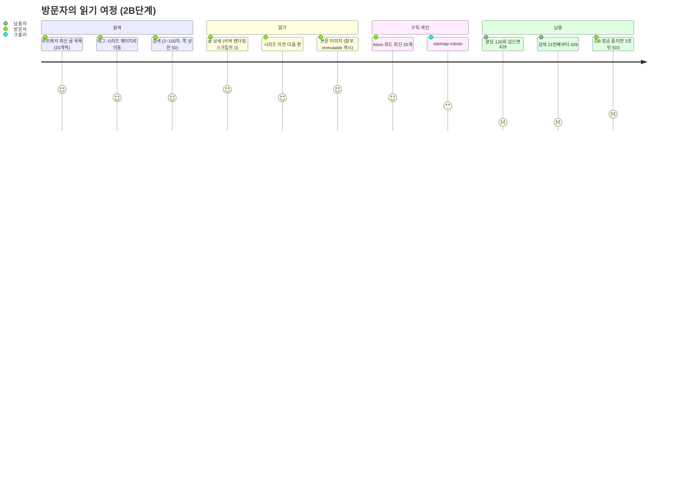
```mermaid
journey
    title 방문자의 읽기 여정 (2B단계)
    section 탐색
      루트에서 최신 글 목록 (20개씩): 5: 방문자
      태그·시리즈 페이지로 이동: 4: 방문자
      검색 (2~100자, 쪽 상한 50): 4: 방문자
    section 읽기
      글 상세 (서버 렌더링, 스크립트 0): 5: 방문자
      시리즈 이전·다음 편: 4: 방문자
      본문 이미지 (첨부, immutable 캐시): 5: 방문자
    section 구독·색인
      Atom 피드 최신 20개: 4: 방문자
      sitemap·robots: 3: 크롤러
    section 남용
      분당 120회 넘으면 429: 1: 남용자
      검색 21번째부터 429: 1: 남용자
      DB 잠금 중이면 3초 뒤 503: 2: 방문자
```

#### 2. 시퀀스 다이어그램 — 글 상세 요청(캐시·게이트·읽기 전용 연결)

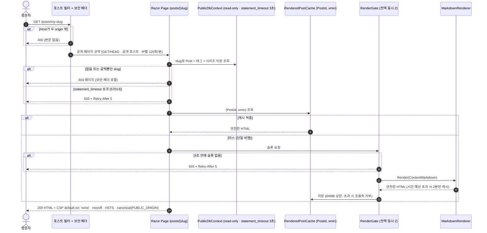
```mermaid
sequenceDiagram
    autonumber
    actor V as 방문자
    participant HF as 호스트 필터 + 보안 헤더
    participant R as Razor Page /posts/{slug}
    participant PD as PublicDbContext (read-only · statement_timeout 3초)
    participant CA as RenderedPostCache (PostId, xmin)
    participant G as RenderGate (전역 동시 2)
    participant K as MarkdownRenderer

    V->>HF: GET /posts/my-slug
    alt Host가 두 origin 밖
        HF-->>V: 400 (본문 없음)
    end
    HF->>R: 공개 페이지 규약 (GET/HEAD · 공개 호스트 · IP별 120회/분)
    R->>PD: slug로 Post + 태그 + 시리즈 이웃 조회
    alt 없음 또는 공백뿐인 slug
        R-->>V: 404 페이지 (보안 헤더 포함)
    else statement_timeout 초과 (57014)
        R-->>V: 503 + Retry-After 5
    end
    R->>CA: (PostId, xmin) 조회
    alt 캐시 적중
        CA-->>R: 안전한 HTML
    else 미스 (단일 비행)
        R->>G: 슬롯 요청
        alt 5초 안에 슬롯 없음
            G-->>V: 503 + Retry-After 5
        end
        G->>K: Render(ContentMarkdown)
        K-->>G: 안전한 HTML (시간 예산 초과 시 2분만 캐시)
        G->>CA: 저장 (64MB 상한, 초과 시 조용히 거부)
    end
    R-->>V: 200 HTML + CSP default-src 'none' · nosniff · HSTS · canonical(PUBLIC_ORIGIN)
```

#### 3. 처리 흐름도 — 미들웨어 파이프라인과 과부하 처리(Program.cs 실측 순서)

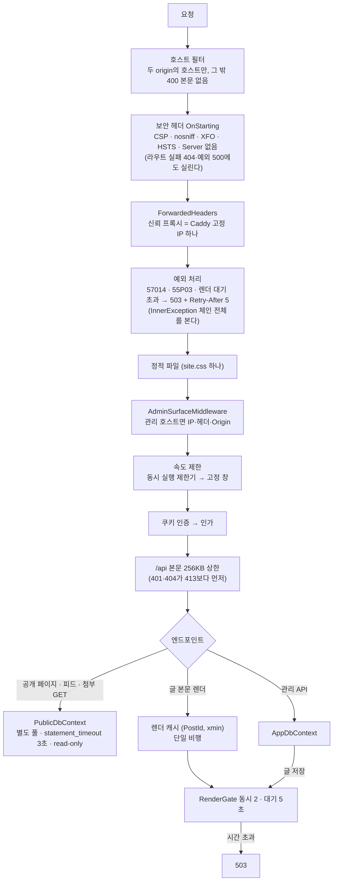
```mermaid
flowchart TD
    REQ["요청"] --> HF["호스트 필터<br/>두 origin의 호스트만, 그 밖 400 본문 없음"]
    HF --> SH["보안 헤더 OnStarting<br/>CSP · nosniff · XFO · HSTS · Server 없음<br/>(라우트 실패 404·예외 500에도 실린다)"]
    SH --> FH["ForwardedHeaders<br/>신뢰 프록시 = Caddy 고정 IP 하나"]
    FH --> EX["예외 처리<br/>57014 · 55P03 · 렌더 대기 초과 → 503 + Retry-After 5<br/>(InnerException 체인 전체를 본다)"]
    EX --> ST["정적 파일 (site.css 하나)"]
    ST --> GATE["AdminSurfaceMiddleware<br/>관리 호스트면 IP·헤더·Origin"]
    GATE --> RL["속도 제한<br/>동시 실행 제한기 → 고정 창"]
    RL --> AUTH["쿠키 인증 → 인가"]
    AUTH --> BL["/api 본문 256KB 상한<br/>(401·404가 413보다 먼저)"]
    BL --> EP{"엔드포인트"}
    EP -- "공개 페이지 · 피드 · 첨부 GET" --> PUB["PublicDbContext<br/>별도 풀 · statement_timeout 3초 · read-only"]
    EP -- "글 본문 렌더" --> CACHE["렌더 캐시 (PostId, xmin)<br/>단일 비행"]
    CACHE --> RG["RenderGate 동시 2 · 대기 5초"]
    EP -- "관리 API" --> ADM["AppDbContext"]
    ADM -- "글 저장" --> RG
    RG -- "시간 초과" --> S503["503"]
```

#### 4. 구현 및 검증

- 수정 파일: `Infrastructure/Web/{PublicOptions,SecurityHeadersMiddleware,ErrorResponses,OverloadExceptionHandler,ApiBodyLimitMiddleware,XmlText,PublicUrls}.cs`, `Infrastructure/Markdown/{RenderGate,RenderedPostCache,RenderingOptions}.cs`, `Infrastructure/Data/{PublicDbContext,PublicQueries,PublicModels}.cs`, `Infrastructure/Storage/{AttachmentLock,AttachmentJanitor}.cs`, `Pages/*`(페이지 5종 + 부분 뷰 3종 + `PublicPageConvention`·`PageNumber`·`SiteEndpoints`), `wwwroot/css/site.css`, `Program.cs`, `StartupValidation`, `PostEndpoints`·`PreviewEndpoints`, `PublicAttachmentEndpoints`
- 주요 변경사항: 공개 표면 전체, 헤더·호스트·과부하·본문 상한, 렌더 게이트·캐시, 읽기 전용 연결, 첨부 정합성. 신규 테스트 클래스 약 25개
- 검증 결과: PR #3 → `80c8dc4`, 26커밋 → squash 1개, 테스트 **589개**(412 → 589), 경고 0. 작업별 리뷰 9회 + 재리뷰 9회(Important 18건 전부 수정). 최종 리뷰: Release publish → 실제 Kestrel Production + `postgres:17`을 개발 인증서 HTTPS로 공격 — 헤더 전 경로, 본문 상한(`Expect: 100-continue`에서 업로드 0바이트로 413), 194KB 글 cold cache 동시 50회(0.76초, 본문 해시 1종), 검색 남용, XFF 위조, 테이블 잠금 중 503(3.0초), 퍼징 34종 → Critical 0 / Important 6 / Minor 8, 수정 묶음 후 범위 재리뷰 **clean**. 새·고친 테스트마다 제품 코드를 되돌려 실패를 확인(사보타주 5회). CI 2회 첫 시도 통과

---

### Step 5: 3단계 — 관리 에디터 SPA (2026-09-21 ~ 09-22, PR #4)

**만든 것.** `PortfolioBlog.Web`(React 19 + TypeScript + Vite + Tailwind v4 + CodeMirror 6 + TanStack Query 5 + react-router 8). Task 1 골격(전부 고정 버전 의존성, HTTPS 개발·미리보기 서버, 보안 헤더 정본 `admin-headers.ts`, CI `web` 잡) → Task 2 관리 API 호출의 단일 통로(CSRF 헤더·`same-origin`·`redirect: 'error'`·경로 검사·ProblemDetails·`Retry-After`) → Task 3 순수 함수(`safeNext`, 서버 규칙을 비춘 클라이언트 검증, localStorage 임시본, 미리보기 문서) → Task 4 셸·인증 흐름(401 전역 처리 → 로그인 → 원래 경로)과 글·시리즈·태그 목록 → Task 5 sandbox iframe 미리보기 + 공개 사이트 CSS 스냅숏 드리프트 테스트 + **소스 가드** → Task 6 글 편집("저장하면 즉시 공개됩니다", 저장 중 입력 보존, 409 나란히 비교, 임시본 복원 확인, 이미지 붙여넣기·드롭) → Task 7 첨부 화면 → Task 8 실제 백엔드 Playwright E2E(Chromium·Firefox, CSP 위반 0건, 배포 헤더 == 정본)와 CI `web-e2e` 잡.

**계획 전 스파이크 S1~S13**으로 스펙의 가정 2건이 틀린 것을 찾았다: 미리보기 iframe CSP의 `'self'`는 **Firefox에서 CSS·이미지를 전부 차단**한다(`about:srcdoc` 문서의 `'self'`를 부모 출처로 보지 않음 → 출처 명시로 해결), 관리 SPA CSP는 스펙보다 좁혀도 위반 0건. 계획에 실을 코드를 저장소 밖에서 실제로 조립해 타입 검사·Vitest 110·E2E 6×2회를 돌리고 실었는데도, 작업별 리뷰가 계획 코드의 결함 약 20건을 더 찾았다(전부 "테스트는 전부 통과"인 상태였다).

#### 🤔 고민과 판정

| 갈림길 | 고민 | 결정 | 틀렸을 때의 비용 |
|---|---|---|---|
| 개발 서버를 HTTP로 둘까 | 세션 쿠키가 `Secure`라 평문 HTTP로는 세션이 유지되지 않는다 | **HTTPS 개발 서버**(.NET 개발 인증서를 내보낸 사본), 프록시 대상도 HTTPS 7198 | Linux CI에서 인증서 PEM 내보내기가 되는지가 최대 불확실성이었다 → 첫 CI에서 그대로 성립 |
| 서버 HTML을 어디에 넣나 | React DOM에 직접 / sandbox iframe | **`sandbox=""` iframe `srcdoc`에만**. React DOM에 서버 HTML을 넣지 않는다 | 미리보기 안의 링크를 누르면 iframe이 오류 페이지가 된다(보안 문제 아님) |
| 관리 SPA CSP의 `style-src` | CodeMirror가 `<style>` 요소 1개를 주입한다(실측). nonce는 정적 서빙(Caddy)에서 불가 | `style-src-elem 'self' 'unsafe-inline'` + **`style-src-attr 'none'`**(속성 스타일은 막는다) | 잔여 위험으로 기록. CodeMirror가 constructable stylesheet로 바뀌면 되돌린다 |
| 오픈 리다이렉트 방어 `safeNext` | 입력의 앞부분만 검사하고 URL 정규화 **뒤의** 경로를 반환해, 정규화 뒤 교차 출처가 되는 입력이 있었다(리뷰어가 `new URL`로 직접 평가) | 반환 직전 재검사 + 불변식 테스트. 고친 뒤 434,255건 퍼징에서 위반 0 | 정상 경로를 `/`로 돌려보내는 오탐 |
| 소스 가드(금지 패턴 검사)의 주석 제거 | 정규식 기반 제거가 **실제 코드를 삼켜** 그 구간의 위반을 놓쳤다. 3라운드: 블록 먼저 → 줄 먼저(**내 판정 R5가 만든 결함**: 한 줄 JSDoc 안의 `//`가 닫는 `*/`를 지워 코드 3줄을 삼킴) → AST 위치 → 리프 토큰 앞 트리비아만 | **TypeScript 파서** 기반 + "지운 위치가 어떤 토큰 안에도 없다"를 독립 파싱으로 교차 검증. "현재 소스에 0건"으로 닫지 않는다 | 테스트가 시끄럽게 실패 |
| 저장 중 입력 | `onSuccess`의 무조건 대입으로 저장 요청 중에 친 내용이 사라졌다 | 제출 시점 입력을 스냅숏으로 보내고, 응답 시점에 입력이 그사이 안 바뀌었을 때만 서버 값으로 | 저장 뒤 입력란이 서버 정규화 값과 다르게 보이는 표시 차이 |
| 저장 직후 임시본 | 자동 저장 effect가 기준선 변경으로 재실행되며 **저장 전 내용을 새 version과 함께** 임시본에 써, 돌아와 복원하면 방금 공개한 내용이 되돌아갔다 | 저장 성공 시 임시본 삭제, 그사이 바뀐 것만 새 version으로 저장. 범위 밖 선재 결함이지만 데이터 손실형이라 그 Task의 라운드 2로 닫음 | 임시본이 덜 지워지거나 덜 저장되는 쪽 |
| 테스트 하네스 `stubApi`의 "표에 없는 호출은 실패" | 거짓이었다 — API 클라이언트가 그 예외를 네트워크 오류로 바꿔 삼켰다 | 표 밖 호출을 테스트 종료 시 실패로 | 테스트 재작업 |
| 로그인 후 `queryClient.clear()` | 로그인 화면으로 가지 않는다(관찰자가 없어진 쿼리 객체에 매달림) | `setQueryData(ME_KEY, {authenticated:false})` + `removeQueries`(ME_KEY 제외) | — |
| 새 글 저장 뒤 임시본 저장 실패 안내 | "새로고침하세요"라는 거짓 안내가 **중복 발행**으로 이어졌다(실측) | 사실대로("글은 이미 만들어졌다" + 링크), `new` 임시본 삭제·자동 저장 중단 | 저장소가 꽉 찬 드문 경우의 안내 품질 |
| 미리보기 429 | 620ms 간격 40타·25초 만에 전역 60회/분에 닿았다(실제 호스트) | 요청 최소 간격 1.5초 + 짧은 `Retry-After`가 최소 간격을 앞당기지 않게 | 미리보기가 1.5초 굼떠짐 |
| 비밀번호 잔류 | 로그인 비밀번호가 TanStack MutationCache의 `variables`에 5분 남았다 | mutation 캐시 시간 0, 변수 미보관 | — |
| Vite 프록시 경계 | 접두사 `/attachments`로 가르면 SPA 라우트 `/attachments`(첨부 화면)가 새로고침 시 백엔드로 끌려간다 | `^/api/`·`^/attachments/`로 운영 Caddyfile과 같은 경계 | — |

#### ❌ 틀렸던 것 — 최종 리뷰의 실제 호스트 공격에서만 드러난 5건

디바운스(1초) 창 안의 입력이 미리보기(0.5초)의 401 언마운트로 사라짐 / 비밀번호가 mutation 캐시에 잔류 / SPA 라우트와 프록시 접두사 충돌 / 보통 속도의 글쓰기로 미리보기 429 / 청크 로드 실패 시 영어 기본 오류 화면 + 스택. jsdom·표 스텁 스위트가 **구조적으로 볼 수 없는 것**이었다.

**사보타주가 통과해 버린 테스트가 세 번** 나왔다(지울 임시본이 애초에 없었음 ×2, 가짜 범위가 현재 소스에 없는 구문). "제품 코드를 되돌려 실패를 본다"는 규칙은 테스트의 전제 조건이 실제로 성립했는지까지 확인해야 의미가 있다.

#### 1. 유저 흐름도

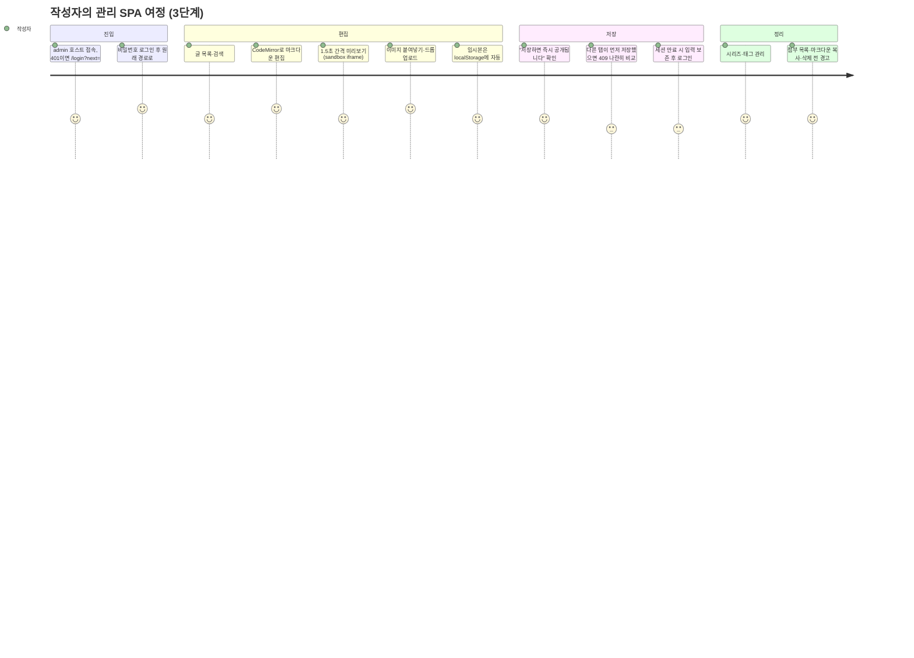
```mermaid
journey
    title 작성자의 관리 SPA 여정 (3단계)
    section 진입
      admin 호스트 접속, 401이면 /login?next=: 4: 작성자
      비밀번호 로그인 후 원래 경로로: 5: 작성자
    section 편집
      글 목록·검색: 4: 작성자
      CodeMirror로 마크다운 편집: 5: 작성자
      1.5초 간격 미리보기 (sandbox iframe): 4: 작성자
      이미지 붙여넣기·드롭 업로드: 5: 작성자
      임시본은 localStorage에 자동 저장: 4: 작성자
    section 저장
      "저장하면 즉시 공개됩니다" 확인: 4: 작성자
      다른 탭이 먼저 저장했으면 409 나란히 비교: 3: 작성자
      세션 만료 시 입력 보존 후 로그인: 3: 작성자
    section 정리
      시리즈·태그 관리: 4: 작성자
      첨부 목록·마크다운 복사·삭제 전 경고: 4: 작성자
```

#### 2. 시퀀스 다이어그램 — 저장과 409 충돌 처리(상태 전이)

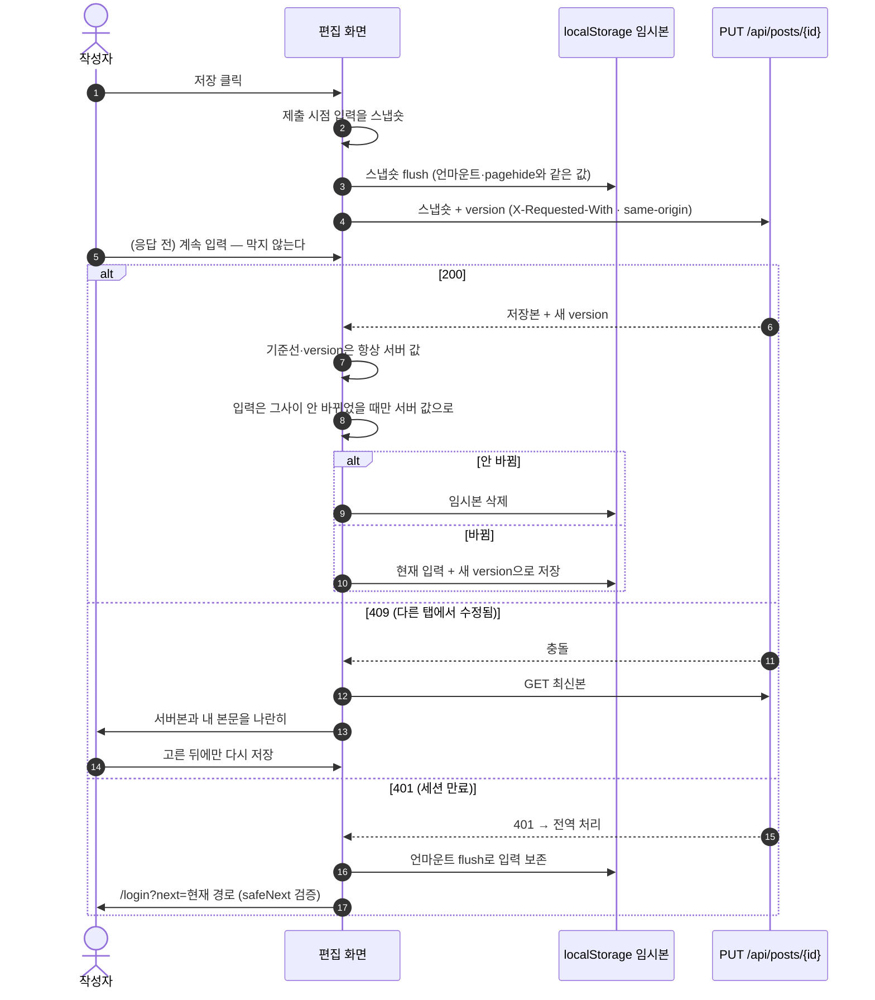
```mermaid
sequenceDiagram
    autonumber
    actor W as 작성자
    participant E as 편집 화면
    participant LS as localStorage 임시본
    participant A as PUT /api/posts/{id}

    W->>E: 저장 클릭
    E->>E: 제출 시점 입력을 스냅숏
    E->>LS: 스냅숏 flush (언마운트·pagehide와 같은 값)
    E->>A: 스냅숏 + version (X-Requested-With · same-origin)
    W->>E: (응답 전) 계속 입력 — 막지 않는다
    alt 200
        A-->>E: 저장본 + 새 version
        E->>E: 기준선·version은 항상 서버 값
        E->>E: 입력은 그사이 안 바뀌었을 때만 서버 값으로
        alt 안 바뀜
            E->>LS: 임시본 삭제
        else 바뀜
            E->>LS: 현재 입력 + 새 version으로 저장
        end
    else 409 (다른 탭에서 수정됨)
        A-->>E: 충돌
        E->>A: GET 최신본
        E->>W: 서버본과 내 본문을 나란히
        W->>E: 고른 뒤에만 다시 저장
    else 401 (세션 만료)
        A-->>E: 401 → 전역 처리
        E->>LS: 언마운트 flush로 입력 보존
        E->>W: /login?next=현재 경로 (safeNext 검증)
    end
```

#### 3. 처리 흐름도 — 미리보기 요청 로직

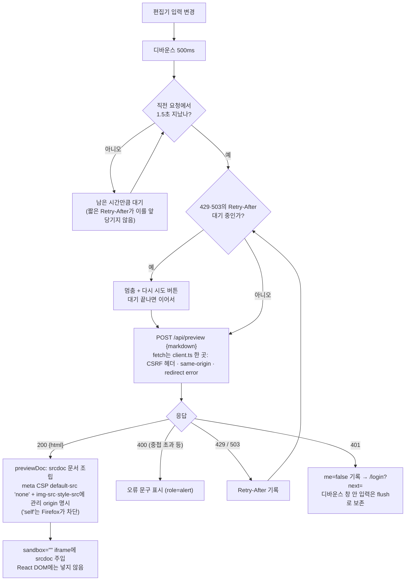
```mermaid
flowchart TD
    IN["편집기 입력 변경"] --> DB["디바운스 500ms"]
    DB --> MIN{"직전 요청에서<br/>1.5초 지났나?"}
    MIN -- "아니오" --> WAIT["남은 시간만큼 대기<br/>(짧은 Retry-After가 이를 앞당기지 않음)"]
    WAIT --> MIN
    MIN -- "예" --> HOLD{"429·503의 Retry-After<br/>대기 중인가?"}
    HOLD -- "예" --> PAUSE["멈춤 + 다시 시도 버튼<br/>대기 끝나면 이어서"]
    PAUSE --> REQ
    HOLD -- "아니오" --> REQ["POST /api/preview {markdown}<br/>fetch는 client.ts 한 곳: CSRF 헤더 · same-origin · redirect error"]
    REQ --> RES{"응답"}
    RES -- "200 {html}" --> DOC["previewDoc: srcdoc 문서 조립<br/>meta CSP default-src 'none' + img-src·style-src에 관리 origin 명시<br/>('self'는 Firefox가 차단)"]
    DOC --> IF["sandbox=&quot;&quot; iframe에 srcdoc 주입<br/>React DOM에는 넣지 않음"]
    RES -- "400 (중첩 초과 등)" --> ERR["오류 문구 표시 (role=alert)"]
    RES -- "429 / 503" --> RA["Retry-After 기록"] --> HOLD
    RES -- "401" --> AUTH["me=false 기록 → /login?next=<br/>디바운스 창 안 입력은 flush로 보존"]
```

#### 3-1. 처리 흐름도(보조) — 소스 가드가 세 라운드를 거쳐 도달한 형태

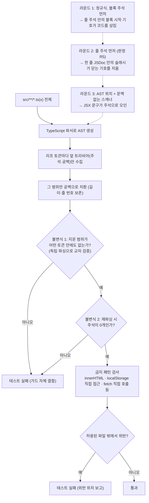
```mermaid
flowchart TD
    SRC["src/**/*.ts(x) 전체"] --> PARSE["TypeScript 파서로 AST 생성"]
    PARSE --> LEAF["리프 토큰마다 앞 트리비아(주석·공백)만 수집"]
    LEAF --> STRIP["그 범위만 공백으로 치환 (길이·줄 번호 보존)"]
    STRIP --> INV1{"불변식 1: 지운 범위가<br/>어떤 토큰 안에도 없는가?<br/>(독립 파싱으로 교차 검증)"}
    INV1 -- "아니오" --> FAIL["테스트 실패 (가드 자체 결함)"]
    INV1 -- "예" --> INV2{"불변식 2: 재파싱 시<br/>주석이 0개인가?"}
    INV2 -- "아니오" --> FAIL
    INV2 -- "예" --> SCAN["금지 패턴 검사<br/>innerHTML · localStorage 직접 접근 · fetch 직접 호출 등"]
    SCAN --> V{"허용된 파일 밖에서 위반?"}
    V -- "예" --> FAIL2["테스트 실패 (위반 위치 보고)"]
    V -- "아니오" --> OK["통과"]
    R1["라운드 1: 정규식, 블록 주석 먼저<br/>→ 줄 주석 안의 블록 시작 기호가 코드를 삼킴"] -.-> R2["라운드 2: 줄 주석 먼저 (판정 R5)<br/>→ 한 줄 JSDoc 안의 슬래시가 닫는 기호를 지움"]
    R2 -.-> R3["라운드 3: AST 위치 + 문맥 없는 스캐너<br/>→ JSX 문구가 주석으로 오인"]
    R3 -.-> PARSE
```

#### 4. 구현 및 검증

- 수정 파일: `PortfolioBlog.Web/`(설정 11개, `src/` 제품 코드 27개, 테스트 12개, `e2e/admin.spec.ts`, `scripts/e2e-prepare.mjs`, 미리보기 CSS 스냅숏 2개), `admin-headers.ts`(보안 헤더 정본), `vite.config.ts`, `PortfolioBlog.Api.Tests/Infrastructure/PreviewCssSnapshotTests.cs`, `.github/workflows/ci.yml`(`web`·`web-e2e`)
- 주요 변경사항: 관리 화면 전체, fetch·localStorage·서버 HTML의 자리가 각각 한 곳뿐(소스 가드가 강제), HSTS는 이 파일에 의도적으로 없음(루프백 미리보기 서버에서도 쓰이기 때문 — Caddy가 더한다)
- 검증 결과: PR #4 → `16a3d25`, 31커밋 → squash 1개. 웹 타입 오류 0·린트 경고 0·Vitest **188개**·Playwright E2E **8개**(Chromium+Firefox, 실제 백엔드 + PostgreSQL + production 빌드 + 배포용 CSP), .NET **591개**. 작업별 리뷰 8회 + 재리뷰 11회(Critical 3·Important 17 전부 수정, T5·T6는 각 3라운드). 최종 리뷰: 저장소 밖 임시 Playwright 스펙 7개로 공격 — 8개 화면의 적대적 문자열 전부 텍스트로만, `?next=` 22종 × 2브라우저에서 교차 출처 이동 0, sandbox를 지워도 스크립트 미실행, `npm audit` 0건·lock 219개 전부 공식 레지스트리 → Critical 0 / Important 5 / Minor 10, 수정 묶음(사보타주 15종) 후 범위 재리뷰 **clean**. CI 세 잡 첫 실행 통과(`web-e2e` 약 2분 30초)

---

### Step 6: 4단계 — 배포 구성 (2026-09-22 ~ 09-23, 병합 완료 — PR #5 → `531f207`)

**만든 것(Task 1~6).** 공개 조회 전용 DB 롤(`PublicRoleGrants`)·시작 검증 강화·헬스체크 CLI → `.gitattributes`·`.dockerignore`·`deploy/Caddyfile`·이미지 둘(비루트·무셸 API, SPA를 품은 Caddy)·`caddyfile.test.ts` → `deploy/docker-compose.yml`·DB 롤 init·`.env.example`·스택 스모크(`smoke.test.mjs`·`run.sh`, 허용 IP 컨테이너와 비허용 IP 컨테이너 둘에서 찌른다). Task 1은 수정 2라운드 뒤 재리뷰 APPROVE. 사용자 요청으로 09-22에 정지했고, 그 뒤 README를 랜딩으로 바꾸고 `docs/` 서브페이지로 나누는 문서 재구성을 병행했다(09-22 ~ 23). 09-23에 실행을 재개해 master의 문서 재구성을 병합(`17063f3`)하고 Task 2 수정 r2(`1452204`)·Task 3 수정 r1을 커밋한 뒤, Task 4(백업/복원·`OPERATIONS.md`·복원 리허설)·Task 5(스택 대상 Playwright E2E·CI `deploy-smoke`)·Task 6(스펙·문서 as-built)까지 마치고 최종 리뷰 뒤 **PR #5로 master(`531f207`)에 병합됐다**.

**계획 전 스파이크 S1~S16**은 저장소 밖 복사본에서 이미지·compose·Caddyfile·백업 복원·스택 E2E를 **실제로 띄워** 쟀다(기준 이미지 버전, publish 출력 모양, chiseled + `read_only` + `tmpfs`에서 10MiB 업로드, Caddy 고정 IP 경쟁, `*.localhost` 내부 CA, 공개 `/api` 차단의 표기 변형 우회, `Server` 헤더 제거 위치, 업로드 경계, 액세스 로그의 `REDACTED`, DB 롤, 백업→`down -v`→복원, 전체 완주). 그럼에도 리뷰가 그 위에서 더 찾아냈다.

#### 🤔 고민과 판정(설계 결정 D1~D15 중 핵심)

| 갈림길 | 후보 | 선택 | 이유 |
|---|---|---|---|
| 런타임 이미지 | 일반 `aspnet`(셸·apt) / chiseled(ICU 없음) / **chiseled-extra** | **chiseled-extra** | 셸이 없으면 RCE 뒤의 발판이 준다. `extra`는 ICU를 넣어 한글 비교·정규화가 개발·테스트와 같게 |
| 헬스체크 | 이미지에 curl 추가 / bash `/dev/tcp` / **앱 CLI** | **앱의 `healthcheck` CLI** | chiseled에는 셸이 없다. `Host: <공개 호스트>` 요구사항(호스트 필터)을 C# 테스트로 고정할 수 있다 |
| 공개 롤 권한 부여 | init 스크립트의 `ALTER DEFAULT PRIVILEGES` / **앱 시작마다 명시 부여** | **앱이 시작할 때마다** 허용 테이블 5개만 `SELECT` | 일괄 부여하면 공개 롤이 `AdminState`(세션 폐기 카운터)와 마이그레이션 이력까지 읽는다(실측). 허용 목록이 코드와 함께 버전 관리·테스트된다 |
| 네트워크 | 단일 / 둘(`edge`·`db`) / **셋** | 계획은 둘 → 리뷰 후 **셋**(`public` caddy만, `edge` internal, `db` internal) | `edge`가 internal이 아니라 **api가 인터넷으로 나갈 수 있었다**(실측) |
| Caddyfile·SPA 배포 방식 | 바인드 마운트 + `caddy reload` / **이미지에 굽기** | **굽기**, `admin off` | 서버에 고칠 수 있는 설정 파일을 두지 않는다. 빌드에서 `caddy validate` |
| 이미지 고정 | `@sha256` 다이제스트 / **정확한 버전 태그** | **태그** | 다이제스트는 기준 OS의 보안 패치 재빌드까지 막는데 자동 갱신 도구가 아직 없다 → 잔여 위험으로 기록 |
| 백업 | api 정지 후 / **무중단, DB 먼저 → 첨부 나중** | **무중단** | 내용 주소 파일은 덮어써지지 않는다. 어긋남은 "행 없는 파일"(청소 잡이 지움) 쪽으로만 |
| 스모크 러너 | curl + bash / fetch / **`node --test` + `node:http(s)`** | **Node** | 경로를 정규화하지 않고 보내야 한다(표기 변형 우회 검사). Node 24는 `admin-headers.ts`를 그대로 import |
| 실제 서버 배포 | 이 단계에서 / **범위 밖** | **범위 밖** | 대외 작업. 절차는 `OPERATIONS.md`, 검증은 스모크가 대신 |

#### ❌ 틀렸던 것(Task 1~3 리뷰가 잡은 것)

| 결함 | 어떻게 드러났나 | 조치 |
|---|---|---|
| `REVOKE … FROM {role}`은 **`PUBLIC` 의사 롤에 준 권한을 회수하지 못한다** — 그 경로로 공개 롤이 `AdminState`를 읽고 썼다 | 실측 | `FROM PUBLIC`도 회수(반영 완료) |
| 스키마 전체를 회수하면 **관리 롤이 비 슈퍼유저인 운영 형태에서 남의 소유 테이블 하나 때문에 기동이 막힌다**(42501). 테스트 하네스가 슈퍼유저로 접속해 초록불로 지나갔다 | 실측 | 회수 대상을 `pg_tables`의 **자기 소유 테이블**로 한정 + 비 슈퍼유저 소유자 롤로 도는 회귀 테스트(반영 완료) |
| Caddy 오류 응답 경로는 라우트의 지연 응답 래퍼를 거치지 않아 `Server` 헤더 삭제가 무효(405·413·502에서 노출) | 실측 | `handle_errors`로 처리(반영 완료) |
| `caddyfile.test.ts`의 가드가 **위치 단언**이라, 헤더 블록을 관리 `route` 끝으로 옮기면 5/5 통과하면서 실제 응답의 보안 헤더 7개가 전부 사라진다 | 리뷰어 실측 | Task 2 수정 r2 `1452204`(09-23)에서 가드 강화 |
| 두 도메인 밖 Host에 `Server: Caddy`가 남는다 / `handle_errors`의 502·413에 보안 헤더 없음 / 점 파일 차단이 `/.well-known/`까지 막음 | 실측 | 같은 커밋에서 폴백 사이트 블록 + 오류 응답 헤더 |
| `edge` 네트워크가 internal이 아니라 **api가 인터넷으로 나갈 수 있다** | 실측 | Task 3 수정 r1(09-23 진행 중): `public`(caddy만)·`edge`(internal)·`db`(internal) 3망 |
| 스모크의 DB 롤 검사가 `127.0.0.1`로 붙어 pg_hba의 `trust` 줄을 타 **비밀번호를 전혀 검증하지 않았다**(틀린 비밀번호로 슈퍼유저 접속 성공). 부정 검사도 "0 아닌 종료 코드 = 통과" | 실측 | Task 3 수정 r1: 컨테이너 네트워크 주소로 접속(scram 강제) + 메시지 판정 |
| caddy 컨테이너가 root / 첨부 재업로드는 내용 주소라 200인데 스모크가 201만 단언 / tmpfs 64m이 동시 업로드 상한과 맞물림 | 리뷰·실측 | Task 3 수정 r1: 비루트 + `NET_BIND_SERVICE`, `[200, 201]` 허용, tmpfs 근거 주석 |

**계획이 맞았던 것(되돌리지 말 것).** `ip_range: 172.30.0.128/25`가 caddy의 고정 IP를 지킨다(없으면 동적 컨테이너가 가져간다 — 대조 실측). **ACME HTTP-01은 명시 `http://` 사이트 블록·IP 허용 목록과 공존한다** — 리뷰어가 로컬 ACME CA를 허용 목록 밖에 두고 실제 발급으로 증명했다. 비 슈퍼유저 `blog_app`으로 마이그레이션과 권한 재조정이 된다.

#### 1. 유저 흐름도

```mermaid
journey
    title 운영자의 배포 여정 (4단계 목표)
    section 준비
      .env 작성 (도메인·허용 CIDR·비밀번호 셋·관리자 해시): 3: 운영자
      해시는 hash-password CLI로 생성: 4: 운영자
    section 기동
      docker compose up --build: 4: 운영자
      빈 볼륨 최초 기동에 DB 롤 셋 생성: 4: 운영자
      api 시작 시 마이그레이션 + 공개 롤 권한 재조정: 5: 운영자
      Caddy가 ACME로 인증서 발급: 5: 운영자
    section 배포 직후 확인
      허용 목록 밖 회선에서 admin 전 경로 404: 5: 운영자
      액세스 로그의 remote_ip가 실제 클라이언트 IP: 4: 운영자
      관리 응답 헤더 == 정본 + HSTS: 5: 운영자
    section 운영
      백업 (DB 먼저 → 첨부): 4: 운영자
      비밀번호 변경 = 해시 교체 후 재배포: 3: 운영자
      세션 긴급 폐기 = 로그아웃 (epoch): 4: 운영자
```

#### 2. 시퀀스 다이어그램 — 스택 안의 요청 경로(공개·관리 두 사이트)

```mermaid
sequenceDiagram
    autonumber
    actor V as 방문자 (임의 IP)
    actor W as 작성자 (허용 IP)
    participant C as caddy (80·443, 고정 IP, 비루트)
    participant API as api (포트 미공개, read_only FS, 비루트 1654)
    participant PG as postgres (db 네트워크 internal)

    V->>C: GET https://blog.example/posts/x
    C->>API: reverse_proxy (edge 네트워크, XFF 추가)
    API->>PG: blog_public 롤 (SELECT 5개 테이블만)
    API-->>C: HTML + 보안 헤더
    C-->>V: 200 (Server 헤더 없음)

    V->>C: GET https://blog.example/api/posts (표기 변형 포함)
    C-->>V: 404 본문 없음 (공개 사이트에 /api는 존재하지 않음)

    V->>C: GET https://admin.blog.example/
    C->>C: remote_ip가 ADMIN_ALLOWED_CIDRS 밖
    C-->>V: 404 본문 없음 (전 경로)

    W->>C: GET https://admin.blog.example/
    C->>C: remote_ip 허용
    C-->>W: SPA 정적 파일 (/srv) + admin-headers.ts 다섯 헤더 + HSTS + COOP
    W->>C: PUT https://admin.blog.example/api/posts/{id}
    C->>API: /api/* · /attachments/* 만 백엔드로
    API->>API: 호스트 · 신뢰 프록시(caddy 고정 IP)로 보정한 원본 IP · CSRF · 세션
    API->>PG: blog_app 롤 (소유자, 관리 API·마이그레이션)
    API-->>W: 200

    Note over C,API: 헬스체크는 앱 CLI가 Host 헤더를 붙여 /health 호출 (chiseled에 curl 없음)
```

#### 3. 처리 흐름도 — 앱 시작 시 검증과 공개 롤 권한 재조정

```mermaid
flowchart TD
    START["api 컨테이너 시작"] --> ARG{"인자?"}
    ARG -- "hash-password" --> HP["표준 입력에서 비밀번호 → 해시 출력, 종료"]
    ARG -- "healthcheck" --> HC["Host 헤더 붙여 /health 호출<br/>200이면 exit 0"]
    ARG -- "없음 (서버)" --> SV["StartupValidation (fail-fast)"]
    SV --> V1{"Production인데 TRUSTED_PROXY_IP,<br/>ConnectionStrings:Public,<br/>DataProtection:KeysPath(절대 경로) 누락?"}
    V1 -- "예" --> FAIL["시작 실패 (원인 메시지, 비밀번호 비노출)"]
    V1 -- "아니오" --> V2{"CIDR 빈 값·파싱 불가?<br/>연결 문자열에 Options?<br/>Command Timeout ≤ statement timeout?"}
    V2 -- "예" --> FAIL
    V2 -- "아니오" --> V3{"첨부 루트 생성·쓰기 확인 실패?"}
    V3 -- "예" --> FAIL
    V3 -- "아니오" --> MIG["Database.Migrate() (blog_app, 비 슈퍼유저)"]
    MIG --> OWN["pg_tables에서 자기 소유 테이블 목록"]
    OWN --> REV["REVOKE ALL ON 소유 테이블<br/>FROM PUBLIC 과 blog_public 양쪽"]
    REV --> GR["GRANT SELECT ON Posts · Series · Tags · PostTags · Attachments<br/>TO blog_public"]
    GR --> CHK{"AdminState · 마이그레이션 이력이<br/>공개 롤에 보이지 않는가?"}
    CHK -- "아니오" --> FAIL
    CHK -- "예" --> RUN["Kestrel 8080 리슨 (외부 포트 없음)"]
    note1["스키마 전체를 회수하면 남의 소유 테이블 하나에<br/>42501로 기동이 막힌다 → 소유 테이블로 한정"]
    REV -.- note1
```

#### 4. 구현 및 검증

- 수정 파일(브랜치): `PortfolioBlog.Api/Infrastructure/Data/PublicRoleGrants.cs`, `StartupValidation`, `HealthcheckCommand`, `PortfolioBlog.Api/Dockerfile`, `PortfolioBlog.Web/Dockerfile`, `deploy/{Caddyfile,docker-compose.yml,.env.example}`, `deploy/postgres-init/10-roles.sh`, `deploy/smoke/{run.sh,smoke.test.mjs}`, `PortfolioBlog.Web/src/test/caddyfile.test.ts`, `.gitattributes`, `.dockerignore`; 문서 `README.md`(랜딩), `docs/*.md` 8개, `plan/resume_guide_0921.md`
- 주요 변경사항: DB 롤 셋 분리(2B 잔여 위험 해소), 비루트·무셸·`read_only`·`cap_drop: ALL` 컨테이너, 관리 사이트 IP 게이트가 모든 처리보다 앞인 `route`, 운영과 같은 이미지로 띄우는 스모크
- 검증 결과: .NET **625개** 통과·경고 0, Vitest **193개**, `bash deploy/smoke/run.sh` **exit 0**(허용 IP 10·비허용 IP 6·오류 응답 1·복원 리허설 포함), `SMOKE_E2E=1`의 스택 E2E **8개**(Chromium·Firefox). 남은 것: 최종 리뷰(실제 스택 공격) → PR → CI → squash 병합 → 보고서 `plan/tech_blog_4_report_<MMDD>.md`

---

## 🔁 단계를 관통한 작업 방식과 교훈

작업은 **브레인스토밍 → 계획(스파이크로 먼저 측정) → 실행(작업마다 구현자 → 리뷰어 공격·측정 → 수정 → 재리뷰) → 최종 브랜치 리뷰(실제 호스트·실제 스택) → PR → CI → squash 병합 → 보고서** 순서로 돌고, 각 단계가 파일로 남는다. 실행 단계에서는 사용자에게 묻지 않고 추천안으로 끝까지 가되, 내린 결정은 전부 보고서의 **"내린 판정" 표(결정 / 이유 / 틀렸을 때의 비용)**에 남긴다.

```mermaid
flowchart TD
    BS["브레인스토밍<br/>(제품 방향은 사용자에게 묻는다)"] --> SPK["스파이크<br/>버려질 프로젝트에서 실제로 측정"]
    SPK --> PLAN["계획서<br/>실제로 돌려 본 코드를 통째로<br/>자리표시자 금지"]
    PLAN --> IMPL["구현자 에이전트 (작업 1개)"]
    IMPL --> CTRL["컨트롤러 검증<br/>Release 빌드 · 전체 테스트 · 트레일러 · NUL · 줄 끝"]
    CTRL --> REV["리뷰어 (저장소 밖 복사본)<br/>'계획 코드 자체가 틀렸을 수 있다 — 직접 공격하고 측정하라'"]
    REV --> Q{"Critical·Important?"}
    Q -- "예 (최대 5라운드)" --> FIX["수정 라운드<br/>새·고친 테스트마다 사보타주로 실패 확인"]
    FIX --> REV
    Q -- "아니오" --> NEXT{"남은 작업?"}
    NEXT -- "예" --> IMPL
    NEXT -- "아니오" --> FINAL["최종 브랜치 리뷰<br/>실제 Production 호스트를 HTTPS로 공격"]
    FINAL --> BUNDLE["수정 묶음 1회 → 범위 재리뷰"]
    BUNDLE --> PR["PR → CI (ubuntu) → squash 병합"]
    PR --> REPORT["보고서: 검증 근거 · 계획 결함과 교훈 ·<br/>내린 판정 표 · 잔여 위험 · 다음 단계 인계"]
    REPORT --> RESUME["재개 가이드 갱신"]
```

**단계마다 되풀이 확인된 것.**

1. **계획을 그대로 옮긴 코드는 통과했지만 계획이 틀려 있었다.** 원천은 늘 "측정하지 않고 쓴 문장"이었다(2A 16건, 2B 23건, 3단계 약 20건, 4단계 Task 1~3에서 다수). 비용 상한은 시간으로, 파서는 기본 거부 + 모양 검사, 성능·보안 주장은 측정한 것만, 문자열은 코드 포인트 경계에서.
2. **프레임워크 기본값은 실제 호스트에서만 드러난다.** 호스트 필터 400의 HTML 본문, publish의 `.gz` 사본, 공백 경로 값의 null 바인딩, Kestrel의 414는 TestServer 스위트가 전부 통과하는 동안 남아 있었다. 최종 리뷰의 실제 호스트 공격은 생략할 수 없는 단계다.
3. **테스트가 실패할 수 있는지 확인한다(사보타주).** 실패할 수 없는 단언이 2B에서만 6건. 사보타주가 통과해 버리면 테스트의 전제 조건이 성립했는지까지 본다(3단계에서 세 번).
4. **보안 통제와 테스트 하네스도 제품 코드만큼 의심한다.** 소스 가드가 코드를 삼켰고, "표에 없는 호출은 실패"는 거짓이었고, 4단계 스모크의 롤 검사는 비밀번호를 검증하지 않았고, `caddyfile.test.ts`는 헤더가 사라지는 변경을 통과시켰다.
5. **내 판정도 틀린다.** R5(주석 제거 순서)는 좁은 맹점을 넓은 맹점으로 바꿨고, 재리뷰의 측정이 뒤집었다. 판정에는 "틀렸을 때의 비용"을 적고, 측정이 반증하면 바로 뒤집는다.
6. **기반을 바꾸는 작업에는 "기존 소비자 목록"을 넣는다.** 2B에서 새 공개 DB 연결을 만든 작업이 2A의 공개 첨부 핸들러를 옮기지 않아 최종 리뷰에서야 발견됐다.
7. **구현자 보고는 검증 대상이다.** 거짓 보고(줄 끝, 주석 갱신, 트레일러)가 매 단계 있었다. 서브에이전트의 완료 보고가 오지 않을 때는 결과를 가정하지 말고 저장소를 직접 본다.
8. **리뷰어는 저장소 밖 복사본에서만 측정한다.** 3단계에서 리뷰어 1명이 작업 트리에 임시 파일을 만들었다 지웠다.
9. **이 기계의 광고 차단기가 평문 HTTP 응답을 다시 쓴다.** 실제 호스트 프로브는 HTTPS로만.
10. **화면 상태 기계는 라운드가 많이 든다.** 다음 계획에서는 상태 전이 표(저장 중 입력, 저장 직후, 언마운트, 세션 만료, 저장소 실패)를 계획에 먼저 그린다.

---

## ⏭ 남은 일

| 순서 | 내용 | 근거 |
|---|---|---|
| 1 | 4단계 Task 3 수정 r1 마무리(3망 구성, 스모크 롤 검사, 비루트 caddy)와 Task 2·3 범위 재리뷰 | 재개 가이드 3.3절, 09-23 진행 중 |
| 2 | Task 4 백업·복원 스크립트와 `OPERATIONS.md`, 복원 리허설을 스모크에 | 계획 Task 4 |
| 3 | Task 5 스택 대상 Playwright E2E + CI `deploy-smoke` 잡 | 계획 Task 5 |
| 4 | Task 6 스펙·README·`docs/deployment.md` as-built, 최종 리뷰(실제 스택 공격) → PR → 보고서 `plan/tech_blog_4_report_<MMDD>.md` | 계획 Task 6 |
| 5 | **글쓰기와 보기를 노션처럼**(사용자 요청 2026-09-22). 설계 전 — 브레인스토밍으로 편집기 방식(블록 WYSIWYG vs 마크다운 + 미리보기)·저장 형식(마크다운 유지 권장)·공개 페이지는 스크립트 없는 서버 렌더링 유지를 먼저 정한다 | 스펙 7절 TODO |
| 6 | 스펙 7절의 확장 포인트: TOTP, 초안/예약 발행, slug 변경 + 리다이렉트, 전문 검색, 다중 인스턴스 렌더 캐시, 앞단 CDN(`trusted_proxies` 재설계) | 스펙 7절 |

**수용한 채로 남은 잔여 위험(요약).** 이미지의 비검사 표면 5종(디코딩하지 않으므로) · 렌더 게이트를 공개·관리가 공유 · Kestrel이 직접 거부하는 응답에는 보안 헤더가 없다(본문도 없다) · 관리 SPA CSP의 `style-src-elem 'unsafe-inline'`(CodeMirror) · 소스 가드는 의도적 우회를 막지 못한다(목적은 실수 방지) · 이미지 태그 고정은 다이제스트가 아니다 · WebKit 미검증 · 로컬 Windows Docker Desktop의 간헐 15초 연결 타임아웃(재실행으로 통과, CI에서는 미발생). 각 항목의 근거와 되돌릴 조건은 단계별 보고서 6절.
