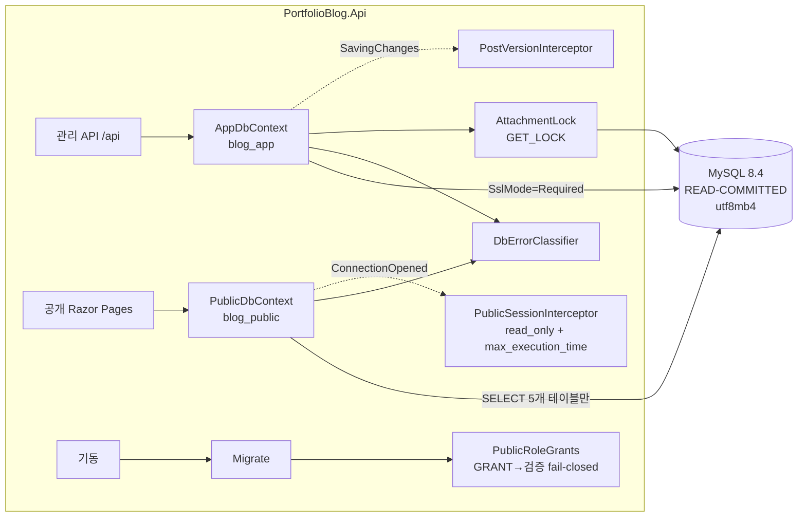

# MySQL 전환 설계 (PostgreSQL 완전 교체)

- 날짜: 2026-09-26
- 상태: **설계 승인(2026-09-26)** → 구현 계획 `plan/mysql_migration_impl_0926.md`
- 개정(구현 계획 작성 중 코드 정독 결과): D3 검증 수단을 `SHOW GRANTS`로, D7에 트랜잭션 인터셉터 추가, D13을 `CHAR(36)`으로 확정, D19 서버 설정을 compose 인자로, R6 추가
- 개정(2026-09-26, 스파이크 결과로 프로바이더를 Pomelo로 변경): Oracle `MySql.EntityFrameworkCore` 10.0.9가 Phase 0에서 no-go(S1·S9)라 **Pomelo.EntityFrameworkCore.MySql 9.0.0 + EF Core 9.0.20(커넥터 MySqlConnector 2.4.0)**으로 바꿨다. 2.1절·D1·D2·D5·D7·D14·D16·2.4절(실측 번호)·R4·5~7절을 함께 고쳤다. 근거: `.superpowers/sdd/mysql_migration_impl_0926/task-0-report.md`(Oracle), `task-0b-report.md`(Pomelo)
- 근거 조사: PG 의존 전수 조사(패키지·컨텍스트·마이그레이션·원시 SQL·SqlState·테스트·deploy·docs), nuget 프로바이더 버전 실측(2026-09-25)

---

## 1. 배경 및 목적

사용자 요청: "모든 데이터를 MySQL로 저장한다." 질의로 확정한 결정은 다음과 같다.

| 질문 | 결정 |
|---|---|
| "모든 데이터"의 범위 | **DB 테이블만** MySQL로 옮긴다: Posts·Series·Tags·PostTags·Attachments(메타데이터)·AdminState. 첨부 이미지 바이트(`/data/attachments`)와 DataProtection 키(`/data/dpkeys`)는 지금처럼 볼륨에 둔다 |
| PostgreSQL 처리 | **완전 교체**. 둘 다 지원하는 구성은 만들지 않는다(마이그레이션·테스트·스모크가 두 벌이 된다) |
| 기존 데이터 | 없다. MySQL용 `InitialCreate`를 새로 만들고 이관 도구는 만들지 않는다 |
| EF 프로바이더 | **Pomelo `Pomelo.EntityFrameworkCore.MySql` 9.0.0 + EF Core 9.0.20**(커넥터 MySqlConnector 2.4.0). 처음 고른 Oracle `MySql.EntityFrameworkCore` 10.0.9는 Phase 0 스파이크에서 no-go라 기각했다(2.1절) |
| 서버 | **MySQL 8.4 LTS** |

PostgreSQL은 연결 문자열 수준을 넘어 **보안 통제의 구현 수단**으로 쓰이고 있다. 읽기 전용 공개 롤, 세션 시작 매개변수, 권고 잠금, `xmin`, 정규식 CHECK가 그렇다. 그래서 이 전환은 "드라이버 교체"가 아니라 **보안 통제를 하나씩 대체하고 다시 증명하는 작업**이다. 이 문서의 목표는 `plan/tech_blog_0920.md`의 보안 최우선 원칙을 한 줄도 약화하지 않고 저장소만 바꾸는 것이다. 약화가 불가피한 곳은 7절 잔여 위험에 명시한다.

## 2. 설계 결정

### 2.1 프로바이더

| 후보 | EF 10 지원 | 커넥터 | 판정 |
|---|---|---|---|
| Oracle `MySql.EntityFrameworkCore` 10.0.9 | ○ (net10.0 그룹이 EF ≥ 10.0.9를 요구하므로 당시 고정값 10.0.12와 호환) | `MySql.Data` 26.7.0 | **기각(Phase 0 no-go)**. S1: `UseCollation`과 `IsDescending`이 DDL에서 빠진다(EnsureCreated·GenerateCreateScript 둘 다). S9: `EF.Functions.Like(..., "\\")`가 잘못된 SQL `ESCAPE '\'`를 만든다. 첫 스파이크에서 `ConnectionReset=true` 풀의 첫 재대여 실패가 두 번 보였으나 이후 재현되지 않았다(미해결, Oracle 드라이버 한정) |
| **Pomelo `Pomelo.EntityFrameworkCore.MySql` 9.0.0** | × (EF Relational `[9.0.0, 9.0.999]`에 묶임) | MySqlConnector 2.4.0 | **채택(Phase 0 go)**. EF 전체를 9.0.20으로 내린다. go 조건 전부 PASS: 실제 마이그레이션 SQL에도 콜레이션과 `DESC`가 반영되고, Like 이스케이프는 데이터로 동작이 증명됐고(이스케이프 없는 `_` 2건 / 이스케이프된 `_` 0건), 워밍업 없는 동시 재대여 실패 0/60 |
| 둘 다 쓰는 추상화 | — | — | 기각(YAGNI) |

EF 하향의 비용: 코드베이스는 EF 10 전용 API(문 람다 ExecuteUpdate, LeftJoin/RightJoin, 명명된 쿼리 필터, 복합 타입 JSON)를 쓰지 않는다(스파이크 S16). `Microsoft.AspNetCore.Mvc.Testing` 10.0.12·`Microsoft.AspNetCore.OpenApi` 10.0.11은 EF를 전이 의존하지 않아 그대로 둔다. `Directory.Packages.props`에서 바뀌는 EF 항목은 Npgsql EF 제거, Pomelo 9.0.0 추가, `Microsoft.EntityFrameworkCore.Design`/`.Relational` 10.0.12 → 9.0.20 셋이다. **Pomelo가 EF 10 지원판을 내면 재평가한다**(7절).

**Phase 0 go/no-go 기준**(Oracle은 2번에서 실패, Pomelo는 전부 통과 — 결과는 위 표):
1. 커넥터의 비동기 I/O가 스레드 풀을 막지 않을 것. 느린 쿼리(`SELECT SLEEP(2)`) 200건을 동시에 보내는 동안 스레드 풀 스레드 수와 대기 큐를 측정한다. sync-over-async면 스레드 수가 요청 수만큼 늘어난다.
2. `ExecuteUpdateAsync`/`ExecuteDeleteAsync`, `IsDescending` 인덱스, `HasCheckConstraint`(REGEXP_LIKE), `EF.Functions.Like(…, escape)`, Guid 매핑, 모델의 `UseCollation` 열 지정이 마이그레이션과 쿼리에 올바르게 반영될 것.
3. 실제 서버의 오류 번호(2.4절 표)가 문서와 일치할 것.

### 2.2 PG 통제 → MySQL 대체표

| # | PG 통제 (현재 위치) | MySQL 대체 | 근거와 주의점 |
|---|---|---|---|
| D1 | `UseNpgsql` ×2 (`Infrastructure/Data/DataServiceCollectionExtensions.cs:32-49`) | `UseMySql(cs, ServerVersion)` ×2. `ServerVersion`은 고정값 `ServerVersion.Create(new Version(8, 4, 11), ServerType.MySql)`이다. `NpgsqlConnectionStringBuilder` 사용처(`PublicDbContext`·`PublicRoleGrants`·`StartupValidation`)는 `MySqlConnector.MySqlConnectionStringBuilder`로 바꾼다 | **`ServerVersion.AutoDetect`는 쓰지 않는다**: 옵션을 만들 때 연결을 열어 서버에 묻기 때문이다(기동이 DB 가용성에 묶이고, 테스트 팩토리가 DB 생성 전에 옵션을 만들면 실패한다). 서버를 올리면 이 값과 이미지 태그를 함께 바꾼다. 공개 연결 문자열을 따로 두는 구조와, 없으면 Default로 되돌아가는 동작(Development 전용)은 유지한다 |
| D2 | 공개 연결의 시작 매개변수 `Options=-c statement_timeout -c default_transaction_read_only=on` (`PublicDbContext.BuildConnectionString`) | `PublicSessionInterceptor : DbConnectionInterceptor`. `ConnectionOpenedAsync`에서 `SET SESSION transaction_read_only = ON, max_execution_time = <ms>`를 보낸다 | MySqlConnector에는 PG의 시작 매개변수(`Options=-c …`)에 해당하는 것이 없어 **연결을 열 때마다 1회 왕복**이 든다(풀에서 꺼낼 때도 매번 실행하므로 풀 리셋 여부와 무관하게 값이 보장된다). `max_execution_time`은 읽기 전용 SELECT에만 적용되는데 공개 컨텍스트는 SELECT만 쓰므로 충분하다. 연결 문자열에 `ApplicationName` 같은 식별자가 없으므로 공개 연결 식별은 롤 이름으로 한다 |
| D3 | 앱이 시작할 때 5개 테이블에 GRANT를 재부여 (`PublicRoleGrants`, `pg_tables` 소유자 조회) | **앱이 GRANT를 적용하고 곧바로 검증한다.** `blog_app`에는 `blog.*` 한정 `WITH GRANT OPTION`을 준다. 적용(`GRANT SELECT` ×5, 멱등)한 뒤 **공개 연결 자신이 `SHOW GRANTS`로 자기 권한을 보고**하게 하고, 그 집합이 정확히 {`USAGE ON *.*`} ∪ {현재 DB 5개 테이블 SELECT}가 아니면 기동을 실패시킨다(fail-closed). 초과 권한을 **자동 회수하지는 않는다**(운영자가 원인을 보고 회수) | 2.3절 결정 R1·R6 참조. `SHOW GRANTS`(인자 없음)는 권한 없이 자기 자신에 대해 항상 허용되므로 `blog_app`에 `mysql.*` 조회 권한을 줄 필요가 없다(information_schema의 권한 뷰는 남의 권한을 보이지 않을 수 있다). 테이블 이름 목록(Posts·Series·Tags·PostTags·Attachments)과 제외 대상(AdminState·`__EFMigrationsHistory`)은 그대로 둔다. 테스트는 팩토리마다 공개 사용자를 따로 만든다(한 사용자가 여러 DB 권한을 가지면 엄격 검증이 깨진다) |
| D4 | `xmin` 행 버전 (`AppDbContext.cs:96` `IsRowVersion`, `PostEndpoints.cs:210,273`, `RenderedPostCache` 키) | 앱이 관리하는 `Version INT UNSIGNED NOT NULL DEFAULT 1` + `IsConcurrencyToken()`. **Posts 행이 바뀌는 모든 경로에서 +1**: SaveChanges 인터셉터(수정 상태의 Post) 그리고 `SeriesEndpoints.cs:206`의 `ExecuteUpdateAsync`(SeriesId를 비우는 경로)가 `SetProperty(p => p.Version, p => p.Version + 1)`을 함께 보낸다 | 타입이 `uint`로 유지되므로 SPA와 API 계약은 바뀌지 않는다. 시리즈를 풀었는데 버전이 그대로면 `RenderedPostCache`가 시리즈 내비게이션이 남은 오래된 HTML을 낸다(xmin은 자동으로 바뀌었다). 누락을 막기 위해 "Posts를 UPDATE하는 모든 코드가 Version을 올린다"를 아키텍처 테스트로 강제한다(`ExecuteUpdate` 사용처 소스 스캔 + 동작 테스트) |
| D5 | 권고 잠금 `pg_advisory_lock(hashtextextended('attachment:'+sha,0))` + `SET lock_timeout='10s'` (`Infrastructure/Storage/AttachmentLock.cs:48-80`) | `SELECT GET_LOCK(@name, 10)` / `SELECT RELEASE_LOCK(@name)`. 이름은 `att:` + `hex(SHA-256(DB이름))[..8]` + `:` + `sha[..48]`로 **최대 61자**(한도 64자) | ① MySQL 잠금 이름은 **서버 전역**이라 DB 이름으로 네임스페이스를 나눈다(테스트가 한 컨테이너에 DB를 여러 개 만든다). ② sha 앞 48자(192비트)로 자르면 충돌이 현실적으로 불가능하다. 설령 충돌해도 결과는 불필요한 직렬화뿐이라 안전하다. ③ 타임아웃이면 예외 대신 `0`을 반환하므로 `DbLockTimeoutException`을 직접 던져 503으로 매핑한다. `NULL`(오류)도 같은 경로로 보낸다. ④ 세션 잠금이라 연결을 명시적으로 여는 기존 구조를 유지한다. ⑤ 해제하지 않은 잠금은 **풀 반납만으로는 풀리지 않고**, `ConnectionReset=true`에서 같은 물리 연결이 다시 대여될 때 풀린다(스파이크 S6b 실측: 반납 후 `IS_FREE_LOCK` 0, 재대여 후 1). 앱은 두 연결 모두에 `ConnectionReset=true`를 강제한다 |
| D6 | `SELECT … FOR UPDATE` (`SeriesEndpoints.cs:194-213`) | 그대로 쓴다 | D7의 격리 수준 고정이 전제다 |
| D7 | 기본 격리 수준 READ COMMITTED(PG 기본값) | **앱: `ReadCommittedTransactionInterceptor`**(`DbTransactionInterceptor.TransactionStarting`에서 격리 수준이 지정되지 않은 트랜잭션을 `BeginTransaction(IsolationLevel.ReadCommitted)`로 대체) + 서버 플래그 `--transaction-isolation=READ-COMMITTED`(compose·Testcontainers, 이중 방어) | InnoDB 기본값 REPEATABLE READ는 갭 락과 넥스트 키 락 때문에 교착 양상과 `FOR UPDATE` 의미가 달라진다. 기존 동시성 추론은 모두 READ COMMITTED 기준이다. **인터셉터는 필수다(이중 방어가 아니다)**: MySqlConnector의 인자 없는 `BeginTransaction()`은 서버·세션 기본값과 무관하게 매번 `SET SESSION TRANSACTION ISOLATION LEVEL REPEATABLE READ`를 보낸다(스파이크 S14, general_log 실측 — 세션을 READ-COMMITTED로 맞춰도 트랜잭션 안에서 REPEATABLE-READ). 서버 플래그만 있으면 EF 트랜잭션이 전부 REPEATABLE READ로 돈다. 서버 플래그는 EF를 거치지 않는 경로(mysql 클라이언트, 스모크)를 위한 것이다. GitHub Actions 서비스 컨테이너는 명령 인자를 줄 수 없다는 점도 앱 쪽 보장이 필요한 이유다 |
| D8 | `INSERT … ON CONFLICT ("NormalizedName") DO NOTHING` + 서수 순서 삽입 (`TagResolver.cs:112`) | `INSERT … ON DUPLICATE KEY UPDATE Id = Id` + 서수 순서 유지 | `INSERT IGNORE`는 **금지**한다. 중복 키뿐 아니라 잘림·CHECK 위반까지 경고로 바꿔 삼키기 때문이다. InnoDB는 중복 검사에서 공유 넥스트 키 락을 잡아 1213 교착이 PG보다 잦을 수 있다. 재시도(최대 3회, 트랜잭션 전체) 여부는 스파이크의 동시 태그 생성 부하 테스트로 판정한다 |
| D9 | `EF.Functions.ILike` + `\` 이스케이프 (`PublicQueries.cs:89-92`, `PostEndpoints.cs:78-81`, `LikePattern.cs`) | `EF.Functions.Like(col, pattern, "\\")`. 검색 대상 열(Title·Summary·ContentMarkdown)은 대소문자 무시 콜레이션(D10) | `LikePattern`의 이스케이프 규칙(`\`·`%`·`_`)은 그대로 재사용한다. MySQL의 기본 LIKE 이스케이프도 `\`지만 명시한다(`NO_BACKSLASH_ESCAPES` 모드 대비) |
| D10 | PG 기본 콜레이션(대소문자 구분) | 서버 `character_set_server=utf8mb4`, 기본 콜레이션 `utf8mb4_0900_ai_ci`. **식별자 열은 `utf8mb4_bin`**: Posts.Slug·Series.Slug·Tags.NormalizedName·Attachments.Sha256·Attachments.ContentType·Attachments.StoragePath | `ai_ci`(악센트·대소문자 무시)를 유니크 인덱스에 쓰면 PG에서 서로 달랐던 값이 충돌해 409가 된다(예: `cafe`/`café`). 태그의 대소문자 무시는 앱의 `NormalizedName`이 이미 담당하므로 DB는 이진 비교가 맞다. 검색은 `ai_ci`라 PG의 ILIKE(악센트 구분)보다 넓게 맞는다. 이 차이는 수용한다(7절) |
| D11 | CHECK 제약 `~`·`btrim`·`octet_length`·`position` (`AppDbContext.cs:104-160`) | `REGEXP_LIKE(col, '<pat>', 'c')`·`CHAR_LENGTH(TRIM(col)) > 0`·`LENGTH(col) <= 204800`(바이트)·`LOCATE('/', col) = 0`. 식별자는 백틱 인용 | ① `LENGTH`는 바이트, `CHAR_LENGTH`는 문자다. 본문 한도는 바이트이므로 `LENGTH`가 맞다. ② 정규식에 `'c'`(대소문자 구분) 플래그를 명시한다. 붙이지 않으면 열 콜레이션을 따라가 ai_ci 열에서 `[a-z]`가 대문자도 받는다. ③ `TRIM`은 공백만 지우고 PG의 `btrim` 기본값과 같다. ④ CHECK는 MySQL 8.0.16+부터 실제로 강제된다(8.4 해당) |
| D12 | `timestamptz` + 마이크로초 절삭 (`DbClock.cs`) | `DATETIME(6)` + `DateTimeOffset`↔UTC `DateTime` ValueConverter(오프셋이 0이 아니면 저장 시 예외) | MySQL에는 오프셋 저장 타입이 없다(`TIMESTAMP`는 2038년 한계와 세션 시간대 변환이 있어 기각). 앱은 이미 UTC만 쓰므로 불변식을 테스트로 고정한다. `DbClock`의 마이크로초 절삭은 `DATETIME(6)` 정밀도와 같아 그대로 둔다 |
| D13 | `uuid` 기본 키 (앱에서 `Guid.CreateVersion7()`) | **`CHAR(36)`**(프로바이더 기본 매핑) | v7 Guid의 문자열 표현은 앞 12자리가 밀리초 타임스탬프라 소문자 16진 문자열 정렬이 시간 순과 같다. `(CreatedAt DESC, Id)` 동률 정렬도 PG uuid(바이트 비교)와 같은 순서가 된다. `BINARY(16)`은 .NET Guid 바이트 순서(앞 세 필드 리틀엔디언) 때문에 정렬이 깨질 수 있어 기각한다. 공간(36B vs 16B)은 블로그 규모에서 무의미하다. 스파이크 S5는 매핑이 실제로 `char(36)`인지만 확인한다 |
| D14 | 내림차순 인덱스 `IsDescending(true,false)` | MySQL 8 내림차순 인덱스 | Pomelo가 EnsureCreated와 실제 마이그레이션 SQL 모두에서 `` KEY (`CreatedAt` DESC,`Id`) ``를 내보냄을 확인했다(스파이크 S1). 수동 SQL은 필요 없다(Oracle 프로바이더는 `DESC`를 빠뜨렸다) |
| D15 | NUL 거부 (`TextRules.cs`, PG 22021 대비) | 입력 검증 **유지** | MySQL은 NUL을 저장하지만 검색·로그·렌더 경로의 이상 입력을 막는 정책으로 남긴다. 22021을 단언하던 테스트는 "400으로 거부"를 단언하도록 바꾼다 |
| D16 | SqlState 하드코딩: `DbConflict.cs:20-37`(23505·23503), `OverloadExceptionHandler.cs:67`(57014·55P03), `AttachmentEndpoints.cs:168`(23505), `AttachmentJanitor.cs:134`(55P03), `SeriesEndpoints`(23503) | **단일 분류기 `DbErrorClassifier`** (`Infrastructure/Data/`). `DbErrorKind { UniqueViolation, ForeignKeyViolation, CheckViolation, QueryTimeout, LockTimeout, Deadlock, PermissionDenied, ReadOnly, Other }`를 반환한다. 호출부는 번호가 아니라 종류로 판정한다 | 번호를 한곳에 모아 스파이크 실측으로 확정한다(2.4절). 분류기는 `MySqlConnector.MySqlException.Number`(int)를 읽는다(같은 예외의 `ErrorCode`는 `MySqlErrorCode` 열거형이다). 커넥터를 다시 바꾸게 되면 이 파일만 바뀐다. 분류기 자체는 표 기반 단위 테스트로 보호한다. 테스트용 예외는 public 생성자가 없어 non-public `(MySqlErrorCode, string, string, Exception)` 생성자를 리플렉션으로 만든다(스파이크 S15a) |
| D17 | 인증 scram-sha-256 | 8.4 기본 `caching_sha2_password` + **`SslMode=Required`**(서버가 자동 생성한 인증서, 신뢰 검증 없음) | `AllowPublicKeyRetrieval=true`는 공격자가 공개키를 바꿔치기해 비밀번호를 빼낼 수 있어 **금지**한다. TLS는 비밀번호 전송과 트래픽을 암호화하지만 서버 인증서를 검증하지 않는다. `db` 망이 internal이므로 수용한다(7절). `mysql_native_password`는 8.4에서 기본 비활성이고 약해서 쓰지 않는다 |
| D18 | 마이그레이션(PG는 DDL도 트랜잭션) | MySQL DDL은 암묵 커밋 | 이번 `InitialCreate`는 빈 DB 대상이라 영향이 없다. **향후 마이그레이션이 중간에 실패하면 스키마가 부분 적용된 채 남는다.** 운영 절차로 "마이그레이션 전 백업"을 `OPERATIONS.md`에 명시한다 |
| D19 | 서버 측 파일·프로그램 실행 차단(스모크: `COPY … TO PROGRAM` 거부) | 서버 명령 인자 `--local-infile=0`, `--secure-file-priv=NULL`(파일 입출력 원천 차단), `--require-secure-transport=ON`(D17을 서버에서도 강제). 사용자는 `REQUIRE SSL`. `blog_app`·`blog_public`에는 `FILE`·`SUPER`·`PROCESS`·`CREATE USER` 없음 | 설정 파일(my.cnf)을 마운트하지 않고 compose `command`로 준다: MySQL은 world-writable 설정 파일을 조용히 무시하는데 Windows 체크아웃의 바인드 마운트 권한이 그렇게 보일 수 있다. 스모크는 `SELECT … INTO OUTFILE` 거부, `@@local_infile=0`, `@@secure_file_priv IS NULL`, 비TLS 접속 거부를 확인한다 |

### 2.3 질문 없이 내린 판정

| # | 판정 | 이유 |
|---|---|---|
| R1 | GRANT는 **앱이 적용하고 검증도 한다**(`blog_app`에 `blog.*` 한정 GRANT OPTION). 계획 단계에서 검토한 "운영자가 부여하고 앱은 검증만" 안은 기각했다 | ① MySQL은 존재하지 않는 테이블에 테이블 단위 GRANT를 거부한다(1146, 스파이크로 재확인). 그런데 테이블은 앱이 기동하며 migrate할 때 생긴다. 운영자 부여 방식이면 첫 배포가 반드시 실패하고, 마이그레이션으로 테이블이 추가될 때마다 수동 단계가 필요하다. ② 권한 상승 분석: GRANT OPTION은 **자기가 가진 권한을 기존 사용자에게 넘기는 것**만 허용한다. 사용자 생성(`CREATE USER`)이나 다른 DB에 대한 권한은 없다. `blog_app` 자격을 탈취한 공격자는 이미 `blog.*` 전체를 읽고 쓸 수 있으므로 `blog_public`에 권한을 넘겨 얻는 것은 없다(`blog_public` 비밀번호도 같은 api 컨테이너 환경에 있다). 순증 위험은 사실상 0이다. ③ 적용 뒤 공개 연결의 `SHOW GRANTS`로 **정확한 권한 집합을 검증**하고 초과가 있으면 기동을 실패시키므로, 누군가 수동으로 넓혀 둔 권한도 잡힌다 |
| R6 | 초과 권한은 자동 회수하지 않고 기동 실패로 알린다(PG 판은 자동 회수했다) | 회수하려면 `SHOW GRANTS` 출력 문자열을 SQL로 되돌려 실행해야 한다(서버 출력이라도 문자열→SQL 조립은 피한다). 또 MySQL은 PG와 달리 복원(`restore.sh`)이 권한을 덤프에서 되살리지 않으므로 초과 권한이 생기는 경로는 사람의 수동 GRANT뿐이다. 그 경우 조용히 고치기보다 드러내는 편이 맞다 |
| R2 | 연결마다 세션 설정 1회 왕복(D2)을 수용한다 | 공개 페이지는 렌더 캐시 뒤에 있고, 쿼리가 대부분 단일 왕복이라 1회 추가는 측정 대상이지 차단 사유가 아니다. `ConnectionOpened`는 풀에서 꺼낼 때도 불리므로 풀 리셋 동작에 기대지 않아도 된다 |
| R3 | 잠금 이름에 DB 이름 해시를 넣는다(D5) | 운영에서는 DB가 하나지만 테스트는 컨테이너 하나에 `blog_test_<guid>` DB를 여러 개 만든다. 이름을 나누지 않으면 서로 다른 테스트의 같은 SHA가 서로를 기다린다(PG 권고 잠금도 DB 단위였다) |
| R4 | Testcontainers 이미지는 `mysql:8.4`(부 버전 고정 태그), compose와 CI는 패치까지 고정(`mysql:8.4.11`, Phase 0에서 확인한 최신 8.4 패치) | 기존 PG 관례(`postgres:17-alpine` 테스트 / `17.11-alpine` 운영)와 같다. 8.4는 alpine 공식 이미지가 없어 oracle 기반 이미지를 쓴다(이미지가 커지는 것은 수용) |
| R5 | `blog_public`이 `mysql`·`information_schema` 외의 DB에 접근하지 못함을 스모크로 확인한다 | PG에서는 `postgres`·`template1` CONNECT가 알려진 공백이었다(`docs/deployment.md:126`). MySQL은 DB 단위 권한이라 이 공백이 자연히 사라진다. 사라졌음을 증명으로 남긴다 |

### 2.4 오류 번호 대응(Phase 0 스파이크 실측, MySQL 8.4.11 + MySqlConnector 2.4.0)

"실측"은 스파이크가 실제 서버에서 그 번호를 받아 낸 것이고, "예상"은 스파이크가 만들지 않아 문서 값으로 둔 것이다(구현 테스트가 관측하면 갱신한다). `DbErrorClassifier`는 `MySqlConnector.MySqlException.Number`를 읽는다.

| 종류 (`DbErrorKind`) | PG SqlState (현재) | MySQL 오류 번호 | HTTP |
|---|---|---|---|
| UniqueViolation | 23505 | 1062 `ER_DUP_ENTRY` (**실측** S2c) | 409 |
| ForeignKeyViolation | 23503 | 1451 부모 삭제 (**실측** S5b), 1452 자식 삽입 (**실측** S5c) | 409 |
| CheckViolation | 23514 | 3819 `ER_CHECK_CONSTRAINT_VIOLATED` (**실측** S2a·S2d) | 500 (앱 검증 누락 = 버그) |
| QueryTimeout | 57014 | 3024 `ER_QUERY_TIMEOUT` (**실측**: 교차 조인 S3b, 공개 세션의 메타데이터 잠금(MDL) 대기도 **3024** S3c — 1205가 아니다. `SELECT SLEEP(2)`는 오류 없이 0을 반환한다) | 503 |
| LockTimeout | 55P03 | 1205 `ER_LOCK_WAIT_TIMEOUT` (예상 — 관리 연결의 InnoDB 행 잠금 대기, 예: `FOR UPDATE`) + `GET_LOCK` 반환 0 (**실측** S6a, D5) | 503 |
| Deadlock | 40P01 | 1213 `ER_LOCK_DEADLOCK` (예상) | 503 (또는 D8 재시도) |
| PermissionDenied | 42501 | 1142 `ER_TABLEACCESS_DENIED_ERROR` (**실측** S4d), 1227 FILE 권한 없는 `SELECT … INTO OUTFILE` (**실측** S4e), 1044 (예상). 참고: 없는 테이블 GRANT는 1146 (**실측** S4a, 분류 대상 아님) | 500 |
| ReadOnly | 25006 | 1792 `ER_CANT_EXECUTE_IN_READ_ONLY_TRANSACTION` (**실측** S3a) | 500 |

행 잠금 대기 상한은 `innodb_lock_wait_timeout=10`(초)으로 서버에서 설정한다. 기존 `lock_timeout 10s`와 같은 값이다.

## 3. 컴포넌트 구조

```
PortfolioBlog.Api/
├─ Infrastructure/Data/
│  ├─ AppDbContext.cs                ← 매핑 교체(D4 Version, D10 콜레이션, D11 CHECK, D12 변환기, D13 Guid)
│  ├─ PublicDbContext.cs             ← BuildConnectionString 제거 → PublicSessionInterceptor 등록
│  ├─ PublicSessionInterceptor.cs    ★ 신규(D2)
│  ├─ PostVersionInterceptor.cs      ★ 신규(D4, SaveChanges 시 수정된 Post의 Version+1)
│  ├─ ReadCommittedTransactionInterceptor.cs ★ 신규(D7)
│  ├─ PublicRoleGrants.cs            ← MySQL GRANT + 공개 연결 SHOW GRANTS 검증(D3, R1, R6)
│  ├─ DbErrorClassifier.cs           ★ 신규(D16) — DbConflict가 이것을 쓴다
│  ├─ DbConflict.cs                  ← 번호 대신 DbErrorKind
│  ├─ TagResolver.cs                 ← ON DUPLICATE KEY UPDATE(D8)
│  ├─ PublicQueries.cs / LikePattern.cs ← Like + escape(D9)
│  ├─ DataServiceCollectionExtensions.cs ← UseMySql + 고정 ServerVersion(D1)
│  └─ Migrations/                    ← 전부 삭제 후 InitialCreate 재생성
├─ Infrastructure/Storage/AttachmentLock.cs     ← GET_LOCK(D5)
├─ Infrastructure/Storage/AttachmentJanitor.cs  ← DbErrorKind.LockTimeout
├─ Infrastructure/Web/OverloadExceptionHandler.cs ← DbErrorKind.QueryTimeout/LockTimeout
├─ Infrastructure/Access/StartupValidation.cs   ← MySqlConnectionStringBuilder, SslMode 검사
├─ Features/Series/SeriesEndpoints.cs           ← Version+1 동반(D4), FK 분류
└─ Features/Posts/PostEndpoints.cs, Attachments/AttachmentEndpoints.cs ← Like·분류기

PortfolioBlog.Api.Tests/Infrastructure/
├─ MySqlContainerFixture.cs  ★ (PostgresContainerFixture 대체: READ-COMMITTED·utf8mb4·max_connections·테스트 롤)
└─ ApiFactory.cs             ← DB 생성 방식·풀 정리(MySqlConnection.ClearPool, 연결 문자열별)

deploy/
├─ docker-compose.yml        ← mysql 서비스, 헬스체크는 blog_app으로 `SELECT 1`
├─ mysql-init/10-users.sh    ★ (postgres-init 대체: DB·blog_app·blog_public, 서버 설정은 compose command)
├─ backup.sh / restore.sh    ← mysqldump --single-transaction / mysql 복원
└─ smoke/run.sh, smoke.test.mjs ← 권한·파일 I/O·3306 도달 불가 검사
```



## 4. 핵심 API

```csharp
// D2 — 공개 연결: 열릴 때마다 세션을 읽기 전용 + 실행 시간 상한으로 고정
public sealed class PublicSessionInterceptor(int maxExecutionMs) : DbConnectionInterceptor
{
    public override async Task ConnectionOpenedAsync(DbConnection c, ConnectionEndEventData e, CancellationToken ct = default)
    {
        await using var cmd = c.CreateCommand();
        cmd.CommandText = $"SET SESSION transaction_read_only = ON, max_execution_time = {maxExecutionMs}"; // 정수만(StartupValidation이 100~60000 검증)
        await cmd.ExecuteNonQueryAsync(ct);
    }
}

// D5 — 권고 잠금
var name = $"att:{dbTag}:{sha256[..48]}";                     // ≤ 61자
var got = await db.Database.SqlQuery<long?>($"SELECT GET_LOCK({name}, 10) AS Value").SingleAsync(ct);
if (got != 1) throw new DbLockTimeoutException();            // 0 = 타임아웃, NULL = 오류 → 503

// D8 — 태그 upsert
await db.Database.ExecuteSqlInterpolatedAsync(
    $"INSERT INTO `Tags` (`Id`,`Name`,`NormalizedName`) VALUES ({id},{name},{norm}) ON DUPLICATE KEY UPDATE `Id` = `Id`", ct);

// D16 — 호출부는 번호를 모른다
catch (DbUpdateException ex) when (DbErrorClassifier.Classify(ex) == DbErrorKind.UniqueViolation) { return Conflict(); }

// D4 — 시리즈 해제도 버전을 올린다
await db.Posts.Where(p => p.SeriesId == id).ExecuteUpdateAsync(u => u
    .SetProperty(p => p.SeriesId, (Guid?)null)
    .SetProperty(p => p.SeriesOrder, (int?)null)
    .SetProperty(p => p.Version, p => p.Version + 1), ct);
```

## 5. 변경 파일 목록

| 구분 | 파일 | 내용 |
|---|---|---|
| 패키지 | `Directory.Packages.props`, `PortfolioBlog.Api.csproj`, `PortfolioBlog.Api.Tests.csproj` | Npgsql EF → `Pomelo.EntityFrameworkCore.MySql` 9.0.0, `Microsoft.EntityFrameworkCore.Design`/`.Relational` 10.0.12 → 9.0.20, `MySqlConnector` 2.4.0 명시 고정, `Testcontainers.PostgreSql` → `Testcontainers.MySql` 4.15.0. 전이 의존 고정 갱신 |
| 스키마 | `AppDbContext.cs`, `Migrations/*`(재생성) | D4·D10~D14 |
| 데이터 | `DataServiceCollectionExtensions.cs`, `PublicDbContext.cs`, `PublicRoleGrants.cs`, `DbConflict.cs`, `TagResolver.cs`, `PublicQueries.cs`, `LikePattern.cs`, 신규 3개(인터셉터 2·분류기) | D1~D3·D8·D9·D16 |
| 기능 | `SeriesEndpoints.cs`, `PostEndpoints.cs`, `AttachmentEndpoints.cs`, `AuthEndpoints.cs`(변경 없음 확인) | D4·D9·D16 |
| 인프라 | `AttachmentLock.cs`, `AttachmentJanitor.cs`, `OverloadExceptionHandler.cs`, `StartupValidation.cs`, `TextRules.cs`(주석만) | D5·D15·D16·D17 |
| 설정 | `appsettings.Development.json` | `Server=localhost;Port=3306;Database=blog_dev;User ID=root;Password=changeme;SslMode=Required` |
| 테스트 | `PostgresContainerFixture.cs` → `MySqlContainerFixture.cs`, `ApiFactory.cs` | 픽스처 교체 |
| 테스트(**재작성**) | `AttachmentIntegrityTests`, `PublicDbContextTests`, `PublicRoleGrantsTests`, `ErrorPipelineTests`, `CheckConstraintCoverageTests`, `DatabaseSchemaTests`, `AttachmentEndpointsTests`(LOCK TABLE 케이스) | PG 고유 동작을 단언하던 테스트. 이식이 아니라 MySQL 동작 기준으로 새로 증명한다 |
| 테스트(신규) | `DbErrorClassifierTests`, `PostVersionTests`(모든 Posts UPDATE 경로가 Version을 올리는지), `IsolationLevelTests`, `CollationTests`(슬러그 `cafe`/`café`, 대소문자 유니크) | |
| 테스트(이식) | `SeriesEndpointsTests`, `PostEndpointsTests`, `PostEndpointsCacheGuardTests`, `StartupValidationTests` 등 나머지 | 연결 문자열·오류 번호 표기만 수정 |
| E2E | `PortfolioBlog.Web/scripts/e2e-prepare.mjs`, `playwright.config.ts` | `mysql:8.4` 컨테이너, 포트 3307, 준비 확인은 `mysql -e 'SELECT 1'` |
| CI | `.github/workflows/ci.yml` | web-e2e 서비스 컨테이너 교체(+ isolation 명령 인자), 헬스체크 |
| 배포 | `deploy/docker-compose.yml`, `deploy/mysql-init/10-users.sh`(신규, `postgres-init/` 삭제), `backup.sh`, `restore.sh`, `.env.example`(`MYSQL_ROOT_PASSWORD`), `smoke/run.sh`, `smoke/smoke.test.mjs`, `OPERATIONS.md` | D7·D17·D19·R5 |
| 문서 | `README.md`, `docs/architecture.md`·`security.md`·`development.md`(로컬 MySQL 절차로 교체)·`testing.md`·`configuration.md`·`deployment.md`·`history.md`·`worklog.md`, `CLAUDE.md`·`AGENTS.md` 구성 절 | 이후 `문서화`(doc-harness 증분)로 `docs/generated/` 갱신. ADR-003은 8절 ADR-011로 대체, ADR-008(DB 세션 잠금)은 GET_LOCK으로 개정 |

## 6. 빌드 검증

```powershell
# Phase 0 스파이크(go/no-go) — 완료. 재실행이 필요할 때만(버리는 코드, git 비추적)
dotnet run --project _workspace/mysql-spike-pomelo/Spike.csproj   # 결과: _workspace/mysql-spike-pomelo/report.md

# 구현 완료 기준 — 전부 통과해야 병합
dotnet build PortfolioBlog.slnx -warnaserror
dotnet test PortfolioBlog.slnx                                # Testcontainers MySQL, Docker 필요
cd PortfolioBlog.Web; npm run lint; npm run typecheck; npm test; npm run build
npm run e2e:prepare; npm run e2e                              # 실제 백엔드 + MySQL
bash deploy/smoke/run.sh                                      # 운영 이미지 스모크(권한·파일 I/O·망 격리)
rg -n "Npgsql|Postgres|pg_|xmin|ILike|SqlState" PortfolioBlog.Api PortfolioBlog.Api.Tests deploy   # 잔존 0건(주석의 이력 언급 제외)
```

CI 네 잡(test·web·web-e2e·deploy-smoke)이 모두 green이어야 한다.

## 7. 향후 확장 포인트 · 잔여 위험

**수용한 잔여 위험**
- **TLS 인증서 미검증**(D17): `SslMode=Required`는 암호화만 보장한다. `db` 망이 internal이라 수용한다. 확장 과제는 자체 CA 발급 + `SslMode=VerifyCA`.
- **검색 범위 확대**(D10): `ai_ci` 때문에 악센트를 무시하고 매칭한다(`cafe` 검색이 `café`에 맞는다). 공개 블로그 검색에서는 오히려 이득이라 수용한다.
- **세션 설정 우회**: 공개 세션이 `SET SESSION transaction_read_only=OFF`를 보낼 수 있는 것은 PG와 같다. 1차 방어선은 테이블 단위 SELECT 권한(D3)이라 쓰기는 여전히 거부된다.
- **DDL 부분 적용**(D18): 마이그레이션 전 백업을 운영 절차로 둔다.
- **EF Core 10 → 9 하향**: Pomelo 9.0.0이 EF 9에 묶여 있어 EF를 9.0.20으로 내렸다. 현재 코드가 쓰는 기능 중 잃는 것은 없다(스파이크 S16: EF 10 전용 API 미사용). 대가는 EF 10의 새 기능을 당분간 못 쓰는 것과, EF 9의 지원 종료가 EF 10보다 이르다는 점이다. Pomelo가 EF 10 지원판을 내면 올린다(D16 분류기와 고정 `ServerVersion` 덕에 영향 범위가 작다).
- **Oracle 드라이버의 `ConnectionReset=true` 재대여 실패**: 첫 스파이크에서 두 번 재현됐다가 이후 재현되지 않아 원인이 미해결이다. MySqlConnector에서는 워밍업 없는 순차 0/30·동시 0/60으로 나타나지 않았다. Oracle 드라이버로 돌아갈 일이 생기면 먼저 다시 확인한다.

**확장**
- Pomelo가 EF 10 지원판을 내면 EF를 10으로 되올린다(패키지 3개와 `dotnet ef` 도구 버전만 바뀐다). Oracle 프로바이더는 S1·S9 결함이 고쳐졌을 때만 다시 본다.
- 검색이 LIKE 풀스캔 한계에 닿으면 `FULLTEXT` 인덱스 + ngram 파서(한국어)를 검토한다.
- 첨부 바이트와 DataProtection 키도 DB로 옮길지는 백업 크기와 서빙 부하를 측정한 뒤 다시 판단한다(이번 결정으로 보류).

## 8. ADR 초안 — ADR-011: MySQL 8.4로 저장소 교체와 공개 조회 롤 재구현 (ADR-003 대체, ADR-008 개정)

- **상태**: 제안(구현 병합 시 채택). `docs/generated/adr/`는 doc-harness 관리 영역이라, 채택 후 `문서화` 증분 실행으로 반영한다.
- **맥락**: 저장소를 MySQL로 통일하기로 했다. ADR-003은 PG 전용 수단(시작 매개변수 `default_transaction_read_only`·`statement_timeout`, 소유자 GRANT)에 기대고 있었다.
- **결정**: 두 겹 방어를 유지하고 수단만 바꾼다.
  - ① DB 권한: `blog_public`의 권한 집합은 정확히 5개 테이블 SELECT다. 앱이 기동할 때 적용하고 공개 연결의 `SHOW GRANTS`로 검증하며, 불일치하면 기동하지 않는다.
  - ② 세션: 연결을 열 때마다 `transaction_read_only=ON`, `max_execution_time`을 설정한다.
  - ③ 앱: `PublicDbContext.SaveChanges*`는 예외를 던진다.
  - `blog_app`은 `blog.*`에 한해 GRANT OPTION을 가진다. 근거는 R1의 권한 상승 분석(순증 위험 0)이다.
- **ADR-008 개정**: 첨부 직렬화의 DB 세션 잠금은 `pg_advisory_lock` 대신 `GET_LOCK`(D5)을 쓴다. 이름은 서버 전역이므로 DB 이름 해시로 네임스페이스를 나누고, 타임아웃(반환 0)은 앱이 503으로 매핑한다.
- **결과**: 공개 경로의 쓰기와 AdminState 읽기는 DB가 거부한다(1142). 연결마다 1회 왕복이 추가된다. 운영자가 수동으로 권한을 넓히면 다음 기동이 실패하며 드러난다.
