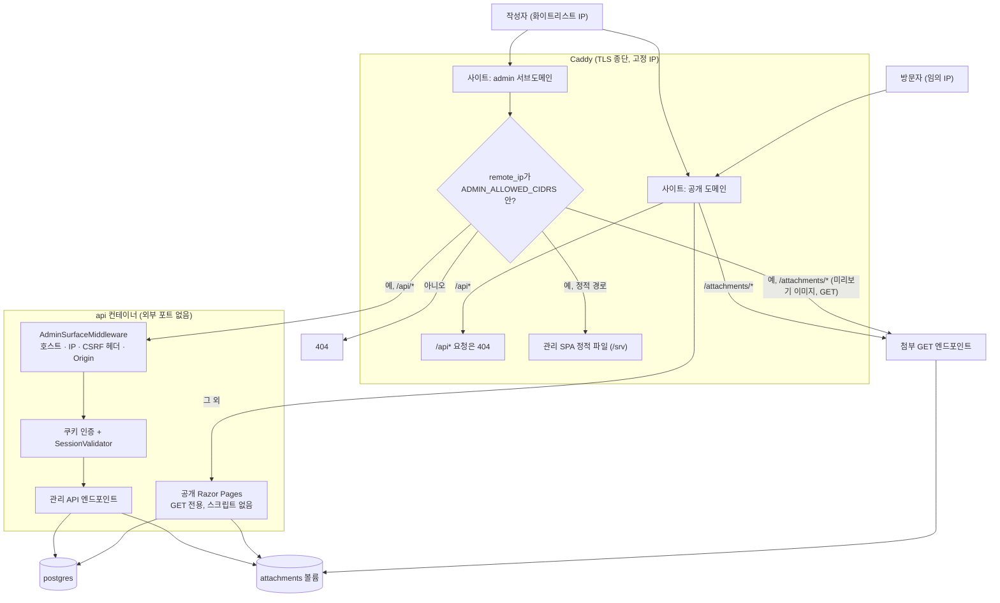
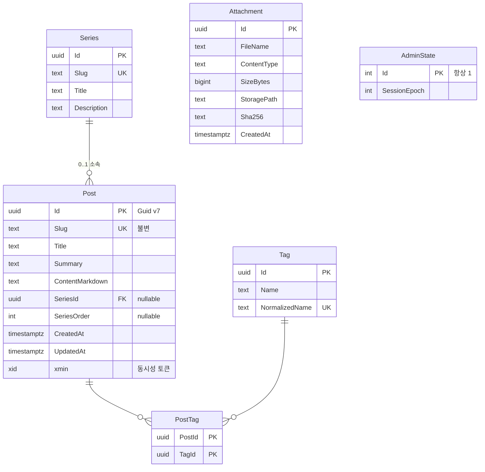
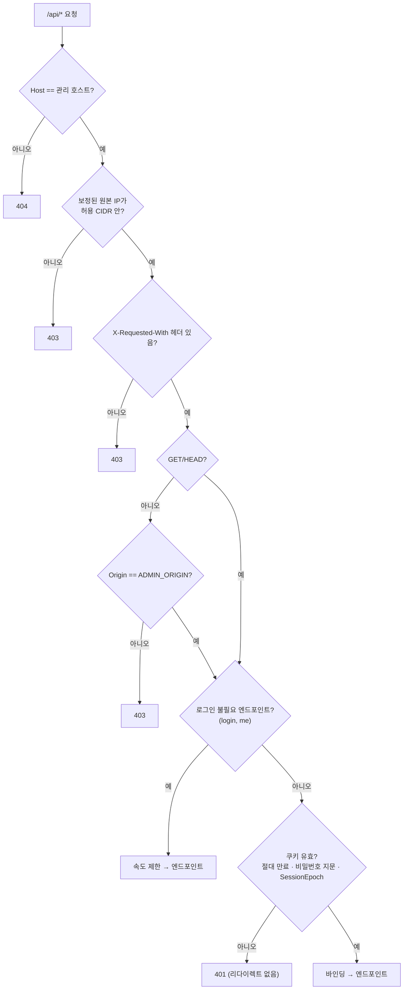
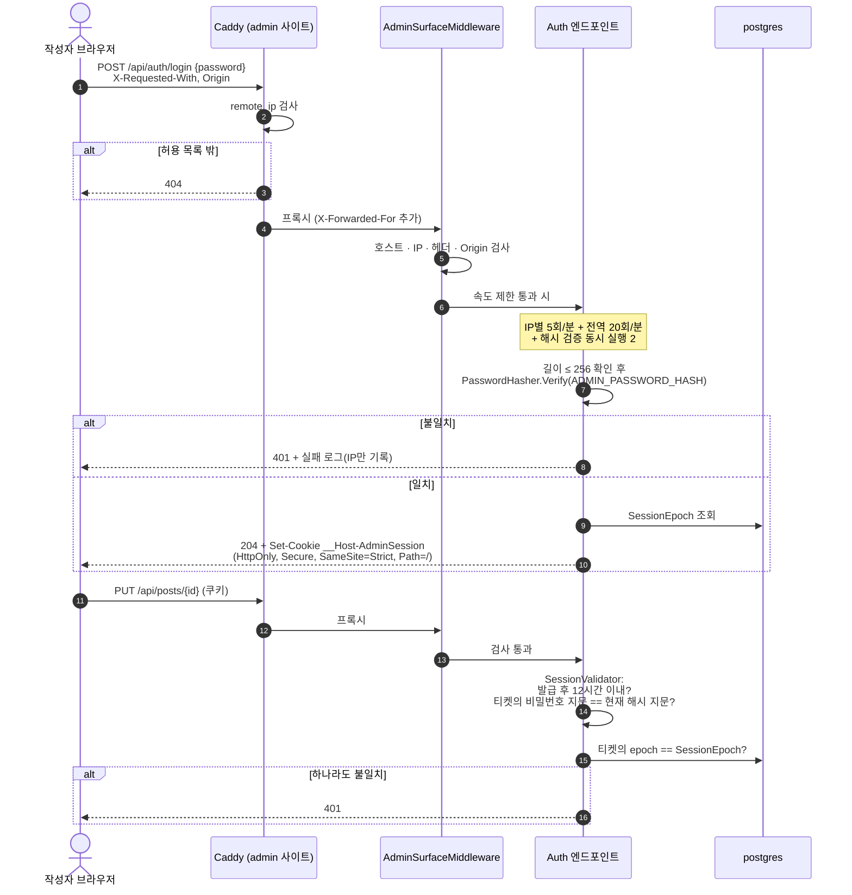
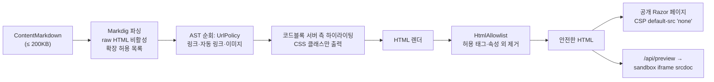
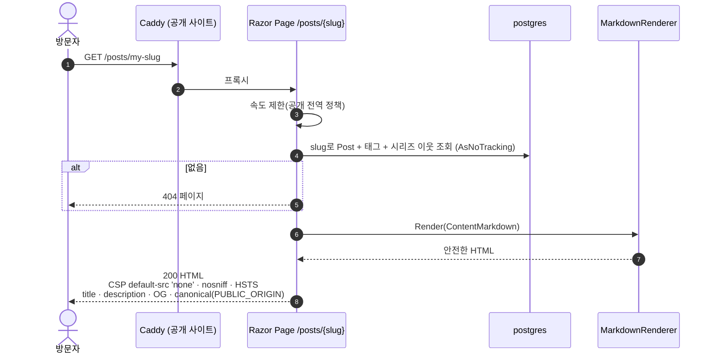
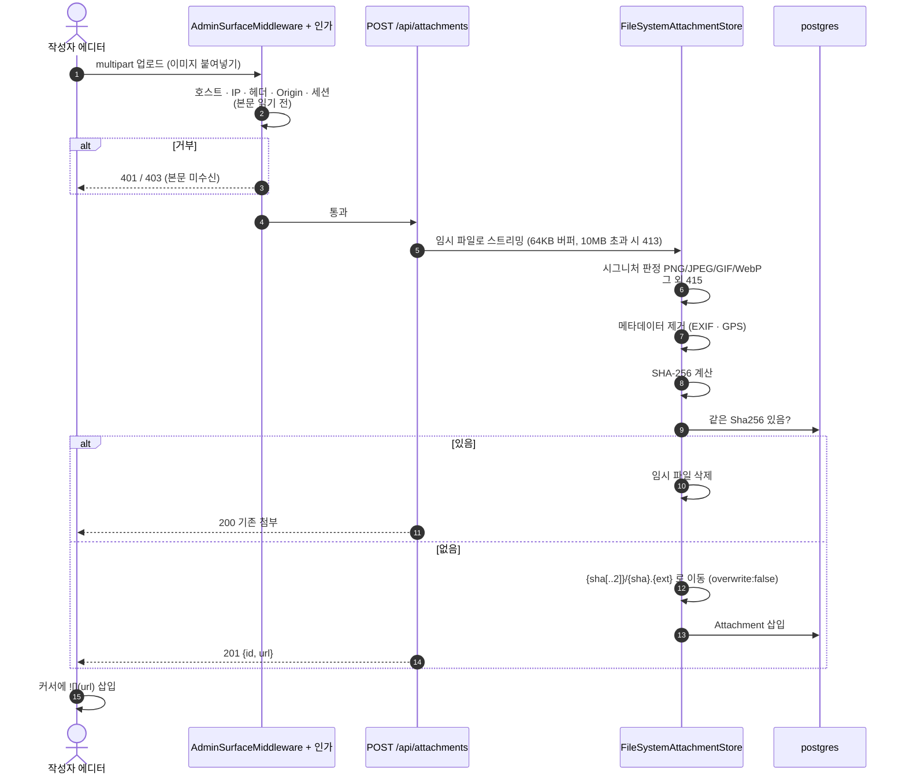

# 기술 블로그 설계 (2026-09-20)

> `plan/para_notes_0917.md`(PARA 노트앱)를 **완전 대체**한다. PARA 개념과 노션 연동은 전부 폐기했고, 구현은 아직 시작 전이라 버려지는 코드는 없다.

## 1. 배경 및 목적

- **무엇:** 단일 작성자 기술 블로그. 공개 도메인 루트가 최신 글 목록이다.
- **왜 바꿨나:** PARA 노트앱은 항목·할 일·보관·영역 불변식·노션 zip 라운드트립 때문에 설계와 구현량이 컸다. 실제로 필요한 것은 "글을 쓰고 공개하는 곳"이다. PARA 모델과 노션 연동을 버리면 데이터 모델이 테이블 5개로 줄어든다.
- **최우선 기준은 보안이다.** 설계 선택이 갈릴 때마다 편의보다 공격 표면 축소를 택했다(서버 렌더링, 관리 origin 분리, IP AND 비밀번호).
- **누가:** 작성자 1명. 방문자는 읽기만 한다. 회원·댓글 없음.
- **출발점:** 저장소는 `/health` 엔드포인트와 그 통합 테스트만 있는 빈 API다(템플릿 잔재·무관한 샘플 프로젝트는 2026-09-20에 정리). DB·프론트·Docker·인증이 없다.

### 1.1 사용자 확정 결정

| 주제 | 결정 |
|---|---|
| PARA 구조 | 완전 폐기(Item·TaskItem·Inbox·대시보드·보관/복원·영역 불변식) |
| 노션 가져오기/내보내기 | 전부 제거 |
| 발행 모델 | 초안/발행 상태 없음. **명시적 저장 = 즉시 공개** |
| 1차 기능 | 글 CRUD, 태그, 이미지 첨부, 마크다운 에디터, 코드 하이라이팅, Atom 피드, 시리즈, 검색, SEO(OG·sitemap) |
| 렌더링 | 공개 페이지는 서버 렌더링(Razor Pages + Markdig), React는 관리 에디터 전용 |
| 쓰기 권한 | 화이트리스트 IP **AND** 로그인 세션. 로그인은 **아이디 없이 비밀번호만** |
| 관리 origin | `admin.<도메인>` 서브도메인으로 분리 |

## 2. 설계 결정

### 2.1 렌더링 구조 (보안 기준 비교)

| 기준 | A. SPA + 서버 메타 주입 | **B. 서버 렌더링 + 관리 에디터 (채택)** | C. SSR 프레임워크(Next/Astro) |
|---|---|---|---|
| 방문자에게 실행되는 JS | React 번들 전체 | 없음 | 번들 전체 + 서버 Node 런타임 |
| 공개 페이지 CSP | `script-src 'self'`가 한계 | `default-src 'none'`, 스크립트 전면 금지 | 인라인 스크립트 예외 필요 |
| 관리 UI 노출 | 에디터 코드가 모든 방문자에게 배포 | 관리 호스트 전체를 Caddy가 IP로 차단 | A와 동일 |
| npm 공급망 사고 시 피해 | 모든 방문자 | 관리자 브라우저만 | 방문자 + 서버 |
| 비용 | 최소 | 뷰 계층 둘(Razor + React), 미리보기 API 필요 | 컨테이너·스택 추가 |

### 2.2 쓰기 인증

| 후보 | 판단 |
|---|---|
| IP 화이트리스트만(기존 PARA 설계) | 기각. 네트워크 위치 단일 요소. 같은 NAT의 다른 기기, 프록시 설정 실수가 곧 공개 사이트 변조로 이어진다(저장 즉시 공개) |
| **IP AND 비밀번호 세션 (채택)** | 단일 작성자라 아이디는 식별 가치가 없다. 로그인 엔드포인트 자체가 허용 IP에서만 열리므로 대입 표면이 없다 |
| IP + 비밀번호 + TOTP | 보류. 시크릿 보관·복구 절차 비용. 확장 포인트 |

### 2.3 관리 origin 분리

경로 분리(`/admin`)는 브라우저 관점에서 origin 격리가 아니다. 공개 페이지에 XSS가 하나라도 생기면, 허용 IP에서 글을 읽던 작성자의 쿠키로 관리 API가 호출된다(Codex ⑪). `admin.<도메인>`으로 분리하면 `__Host-` 쿠키는 관리 호스트에만 전송되고, 공개 origin의 스크립트는 CORS 미개방 + 커스텀 헤더 프리플라이트 때문에 관리 API를 호출하지도 응답을 읽지도 못한다. 비용은 DNS A 레코드 1개와 Caddy 사이트 블록 1개다.

### 2.4 그대로 가져오는 PARA 설계 결정

단일 API 프로젝트 + 기능 폴더(Vertical Slice), PostgreSQL + EF Core 10(Npgsql), Caddy(자동 HTTPS), 컨테이너 3개, Guid v7 PK, 태그의 `Name`/`NormalizedName` 분리, 첨부의 내용 주소 저장·시그니처 판정·10MB·64KB 버퍼, `DbClock.UtcNow()` 단일 시각 출처(Npgsql 마이크로초 절삭), enum은 JSON 문자열만 허용, 오류는 `ProblemDetails`, ForwardedHeaders 신뢰 목록이 비면 헤더를 믿지 않음, Testcontainers 실제 Postgres 통합 테스트.

### 2.5 뒤집는 PARA 설계 결정

| 기존 | 변경 | 이유 |
|---|---|---|
| ASP.NET 인증 미들웨어 미등록, 엔드포인트 필터로 쓰기 검사 | 쿠키 인증 + 인가 정책 + `/api` 전용 미들웨어 | 최소 API의 엔드포인트 필터는 **본문 바인딩 이후** 실행된다. 미인증 요청이 10MB 업로드 본문을 버퍼링시키지 못하게 하려면 바인딩 전에 거부해야 한다 |
| 쓰기만 보호, 읽기 API는 공개 | `/api` 전체(GET 포함)를 보호 | 공개 페이지가 서버 렌더링이라 공개 JSON API가 필요 없다 |
| 신뢰 프록시 = compose 네트워크 대역 | 신뢰 프록시 = Caddy 고정 IP 하나 | 같은 네트워크의 다른 컨테이너가 XFF를 주장할 수 없게 |
| ForwardedHeaders 설정이 비면 미들웨어 미등록 | 동일 + **Production에서 비어 있으면 시작 실패** | 설정 누락을 조용히 넘기지 않는다 |

### 2.6 Codex 교차 검토 반영 (2026-09-20, read-only, status=success)

섹션 1·2 초안을 Codex CLI로 검토했다. 판정: "설계 골격 유지 가능. Critical 없음, High 11 / Medium 11 / Low 1. 방향 오류가 아니라 보안 계약의 세부가 비어 있음."

**수용**

| # | 지적 | 반영 |
|---|---|---|
| ①④ | Caddy `remote_ip`는 직접 연결 상대의 IP. `/admin/*`는 `/admin` 자체를 포함하지 않음 | 1차 배포를 "인터넷 → Caddy → API, CDN 없음"으로 고정. 관리 표면을 호스트 단위로 막아 경로 매처 누락 문제를 없앰. 배포 검증에 "Caddy가 실제 원본 IP를 보는지" 확인 추가 |
| ②③ | 신뢰 프록시 범위가 넓음, 환경변수 공유 시 파싱 불일치 | `KnownProxies` = Caddy 고정 IP. CIDR은 공백 구분으로 통일, 빈 값·잘못된 항목은 시작 실패, IPv4-mapped 주소 정규화 |
| ⑤ | "관리 표면 전체 로그인 필수"는 로그인 자체와 충돌 | 3.3절 접근 계약표 |
| ⑦⑩ | 절대 만료·세션 폐기 없음, 쿠키 범위 미정 | `__Host-` 쿠키, 절대 12시간, sliding 없음, 비밀번호 지문 + `SessionEpoch` 검증 |
| ⑨ | `X-Requested-With` 방어는 CORS 비활성이 전제 | CORS 미개방 명시, 변경 요청은 `Origin == ADMIN_ORIGIN` 검사, 로그인·로그아웃·업로드도 예외 없음 |
| ⑪ | 공개·관리가 같은 origin | 서브도메인 분리(2.3절), 미리보기 iframe `sandbox=""` + `srcdoc` 내부 `<meta>` CSP |
| ⑫⑬ | Markdig는 sanitizer가 아님, CSP 지시문 불완전 | 3.5절 파이프라인, 3.6절 헤더표 |
| ⑭㉑ | 필터가 바인딩 이후 실행, `IFormFile`과 antiforgery | 2.5절. 업로드 엔드포인트만 antiforgery를 명시적으로 대체(자체 방어: 커스텀 헤더 + Origin + SameSite=Strict) |
| ⑮ | 공개 검색·렌더링에 자원 예산 없음 | 3.7절 |
| ⑯ | 피드 XML 주입, Host 헤더 오염 | `XmlWriter`, 절대 URL은 `PUBLIC_ORIGIN` 고정값, `AllowedHosts`, Atom ID는 Post `Id` 기반. 명칭을 "Atom 피드"로 정정 |
| ⑰⑱ | `SeriesOrder` 불변식, 제약·인덱스 누락 | 3.2절 |
| ⑲⑳ | 자동 저장 = 공개, 동시 수정 덮어쓰기, 태그 생성 경쟁, 첨부 수명주기 | 서버 자동 저장 없음(임시본은 브라우저 localStorage), `xmin` 동시성 토큰, 태그 `ON CONFLICT DO NOTHING` 후 재조회, 첨부 목록·삭제 API |
| ㉒ 일부 | 감사 로그, 백업 | 로그인 실패·관리 변경 구조화 로그(비밀번호·쿠키·본문 제외), DB+첨부 일관 백업·복원 절차를 배포 문서에 |

**이견 (Claude 재검증 결과 다르게 결정)**

| # | Codex 권고 | 결정과 이유 |
|---|---|---|
| ⑥ | Argon2id 또는 PBKDF2 | 프레임워크 내장 `PasswordHasher`(PBKDF2-HMAC-SHA512, 반복 10만 회). Argon2id는 서드파티 패키지가 필요해 공급망 표면만 늘어난다. 속도 제한 3종·입력 길이 제한·로그 제외는 수용 |
| ⑧ | Data Protection 키 저장 시 암호화 | 단일 호스트에서는 암호화용 인증서도 같은 디스크에 놓여 실익이 작다. 대신 볼륨 권한 API 비루트 전용 `0700`, 애플리케이션 이름 고정, **백업에서 제외**(잃으면 재로그인, 유출되면 세션 위조) |
| ⑭ | 이미지 픽셀·프레임 상한(디코딩 검증) | 서버는 이미지를 디코딩하지 않으므로 압축 폭탄이 서버에 피해를 주지 않고, 업로더는 인증된 작성자뿐이다. 디코더 추가가 오히려 새 표면이다. **EXIF 제거는 수용** |
| ㉒ | 런타임 DB 최소 권한 계정 | 앱이 시작 시 마이그레이션을 실행해 DDL 권한이 필요하다. 마이그레이션 전용 역할 분리는 확장 포인트 |

## 3. 컴포넌트 구조

```
PortfolioBlog.slnx
├─ PortfolioBlog.Api/                    # ASP.NET Core 10 (최소 API + Razor Pages)
│  ├─ Program.cs                      # 서비스 등록 + 미들웨어 순서 + Map* 호출만
│  ├─ Domain/                         # Post, Series, Tag, PostTag, Attachment, AdminState
│  ├─ Contracts/                      # DTO(record)·검증 오류 빌더
│  ├─ Infrastructure/
│  │  ├─ Data/AppDbContext.cs, DbClock.cs, Migrations/
│  │  ├─ Access/                      # CidrList, IAdminAccessPolicy, AdminSurfaceMiddleware, SessionValidator
│  │  ├─ Markdown/                    # MarkdownRenderer, UrlPolicy, HtmlAllowlist (순수 함수, DB 의존 없음)
│  │  ├─ Storage/                     # IAttachmentStore, FileSystemAttachmentStore, ImageSignature, MetadataStripper
│  │  └─ Web/                         # SecurityHeaders, RateLimitPolicies, SiteOptions
│  ├─ Features/                       # 관리 API 수직 슬라이스
│  │  └─ Auth/  Posts/  Series/  Tags/  Attachments/  Preview/
│  └─ Pages/                          # 공개 Razor Pages (GET 전용)
│     └─ Index, Post, Tag, Series, Search + Feed/Sitemap/Robots 엔드포인트
├─ PortfolioBlog.Api.Tests/              # xUnit + WebApplicationFactory + Testcontainers.PostgreSql
├─ PortfolioBlog.Web/                    # 관리 SPA: React 19 + TS + Vite + Tailwind v4 + CodeMirror 6
├─ deploy/                            # docker-compose.yml, Caddyfile, .env.example, OPERATIONS.md
└─ plan/tech_blog_0920.md             # 이 문서
```

의존 방향: `Features`·`Pages` → `Infrastructure` → `Contracts` → `Domain`. `Features` 간, `Features`↔`Pages` 간 직접 참조 없음. 공개 페이지와 미리보기 API는 같은 `MarkdownRenderer`를 쓴다.

### 3.1 신뢰 경계와 요청 라우팅



표면 요약:

| | 공개 표면 (`<도메인>`) | 관리 표면 (`admin.<도메인>`) |
|---|---|---|
| 경로 | `/`, `/posts/{slug}`, `/tags/{tag}`, `/series/{slug}`, `/search?q=`, `/feed.xml`, `/sitemap.xml`, `/robots.txt`, `/attachments/{id}/{fileName}`, `/health` | `/`(SPA), `/api/*`, `/attachments/*`(미리보기용) |
| 누가 | 누구나, GET·HEAD만 | 화이트리스트 IP AND 로그인 세션 |
| JS | 없음 | `script-src 'self'` |
| 상태 변경 | 불가능(엔드포인트 자체가 이 호스트에 없음) | 전부 여기에만 |

### 3.2 데이터 모델



| 테이블 | 제약·인덱스 |
|---|---|
| `Post` | `Slug`: NOT NULL, UNIQUE, ≤100자, CHECK `^[a-z0-9]+(-[a-z0-9]+)*$`. `Title` 1~200자. `Summary` ≤300자. `ContentMarkdown` ≤200KB(UTF-8 바이트). CHECK `(SeriesId IS NULL) = (SeriesOrder IS NULL)`, `SeriesOrder > 0`. 인덱스 `(CreatedAt DESC, Id)`, `(SeriesId, SeriesOrder, CreatedAt, Id)` |
| `Series` | `Slug`: `Post`와 같은 규칙. `Title` 1~200자. `Description` ≤1000자 |
| `Tag` | `Name` 1~50자, `/` 금지(`C#`·`.NET`은 허용). `NormalizedName` = 트림 + 연속 공백 1개 + 소문자(불변 문화권) + NFC, UNIQUE |
| `PostTag` | 복합 PK `(PostId, TagId)`, 역방향 인덱스 `(TagId, PostId)`, 양쪽 FK cascade |
| `Attachment` | `SizeBytes` 1~10,485,760. `Sha256` 64hex, UNIQUE(같은 내용 재사용). `ContentType` ∈ {png, jpeg, gif, webp} |
| `AdminState` | 단일 행. `SessionEpoch`는 로그아웃 때 증가 |

규칙:

- **Slug는 작성자가 직접 입력하고 생성 후 불변**이다. 한글 제목 자동 변환은 품질이 나쁘고, 변경을 허용하면 외부 링크와 Atom ID가 깨진다. 하드 삭제 후 slug 재사용은 허용한다(작성자 판단).
- **발행 상태가 없다.** `CreatedAt`이 발행일이자 정렬 기준이다. 서버 자동 저장은 없고, 에디터 임시본은 브라우저 localStorage에만 둔다.
- **HTML은 저장하지 않고 요청마다 렌더링한다.** 렌더러 보안 수정이 과거 글 전체에 즉시 적용된다.
- **시리즈:** 글은 0~1개 소속. 순서 중복 허용, `(SeriesOrder, CreatedAt, Id)`로 안정 정렬. 시리즈 삭제는 한 트랜잭션에서 소속 글의 `SeriesId`·`SeriesOrder`를 함께 비운 뒤 삭제한다(FK `SET NULL`만 쓰면 CHECK 위반).
- **삭제는 하드 삭제.** 글 삭제는 첨부를 지우지 않는다(첨부는 여러 글이 공유할 수 있다). 태그 삭제는 `PostTag` 링크만 함께 지운다.
- **동시 수정:** `xmin` 동시성 토큰. `PUT`·`DELETE` 요청은 `version`을 포함하고 불일치는 409.
- **태그 자동 생성:** `INSERT … ON CONFLICT (NormalizedName) DO NOTHING` 후 재조회. 경쟁을 작성자에게 409로 돌려주지 않는다.
- 글·태그·시리즈 변경은 한 트랜잭션으로 공개된다.

### 3.3 접근 제어

**접근 계약**

| 대상 | 호스트 | IP | CSRF 헤더 + Origin | 세션 |
|---|---|---|---|---|
| 관리 SPA 정적 파일 | admin | 필수(Caddy) | – | 불필요 |
| `POST /api/auth/login` | admin | 필수 | 필수 | 불필요, 속도 제한 |
| `GET /api/auth/me` | admin | 필수 | 헤더 필수 | 불필요(미로그인이면 `{authenticated:false}`) |
| 나머지 `/api/*` (GET 포함) | admin | 필수 | 헤더 필수, 변경 요청은 Origin도 | 필수 |
| 공개 페이지·첨부 GET | 공개(첨부는 양쪽) | – | – | – |

**판정 흐름** (전부 본문을 읽기 전에 끝난다)



미들웨어 순서(2B 구현 확정, Program.cs 실측): 호스트 필터(설정된 두 호스트) → 보안 헤더 → ForwardedHeaders → 예외 처리 → 상태 코드 본문 → 정적 파일 → `AdminSurfaceMiddleware` → 속도 제한 → 쿠키 인증 → 인가 → 관리 JSON 본문 상한 → 엔드포인트. **IP 검사가 속도 제한보다 앞이다**(Plan 1 작성 중 수정): 속도 제한이 앞이면 허용 IP 밖의 요청이 로그인 전역 한도를 소진해 작성자의 로그인을 막을 수 있다.

**IP 판정**
- 관리자 허용 목록(`ADMIN_ALLOWED_CIDRS`, 공백 구분)과 신뢰 프록시(`TRUSTED_PROXY_IP`)는 별도 설정이다. Caddy 주소를 허용 목록에 넣는 우회 운영은 금지한다.
- Caddy와 앱이 같은 `ADMIN_ALLOWED_CIDRS` 문자열을 읽는다. 앱은 빈 값·파싱 불가 항목·예상 밖 구분자를 만나면 **시작을 실패**시킨다.
- IPv4-mapped IPv6(`::ffff:a.b.c.d`)는 IPv4로 정규화한 뒤 비교한다.
- Production에서 `TRUSTED_PROXY_IP`가 비어 있으면 시작 실패. Development·테스트에서는 비어 있으면 ForwardedHeaders 미들웨어를 등록하지 않는다(빈 신뢰 목록은 모든 헤더를 믿는 ASP.NET 동작 회피).

**로그인과 세션**



- 비밀번호는 환경변수 `ADMIN_PASSWORD_HASH`로 **해시만** 주입한다. 해시 생성은 `dotnet run --project PortfolioBlog.Api -- hash-password`(표준 입력으로 받고 에코 없음).
- 쿠키 티켓 클레임: 발급 시각, 비밀번호 해시 지문(SHA-256 앞 16바이트), `SessionEpoch`. **비밀번호를 바꾸면(해시 교체 후 재배포) 기존 세션이 자동 폐기**되고, **로그아웃은 epoch를 올려 모든 세션을 폐기**한다. 기기별 세션 관리는 하지 않는다.
- 절대 수명 12시간, sliding expiration 없음.
- `POST /api/auth/logout`만 허용(GET 없음), CSRF 검사 동일.
- Data Protection 키는 `dpkeys` 볼륨에 영속화, `SetApplicationName("PortfolioBlog.Api")`, 디렉터리 `0700`·API 비루트 사용자 소유, 백업 대상에서 제외.
- 비밀번호·쿠키·요청 본문은 로그에 남기지 않는다.
- CORS는 등록하지 않는다. `/api` 응답은 `Cache-Control: no-store`.
- 로그인 속도 제한기는 파티션을 원시 요청 경로 문자열이 아니라 엔드포인트 메타데이터(`RateLimitMetadata(RateLimitPolicy.Login)`)로 고른다. 경로 문자열 비교는 끝 슬래시(`/api/auth/login/`)로 우회됐다(Plan 1 구현 중 발견).

### 3.4 API 표면

**공개 (Razor Pages, GET 전용)**

| 경로 | 내용 |
|---|---|
| `/` | 최신 글 목록, `?page=`(20개, 상한 500). 잘못된 `page`(숫자 아님·0·상한 초과·결과 없는 쪽)는 404 |
| `/posts/{slug}` | 글 상세: 렌더링된 본문, 태그, 시리즈 이전/다음 편, `<title>`·description·OG·canonical |
| `/tags/{tag}` | 정규화명으로 조회(경로 값은 URL 인코딩, `C#` → `C%23`) |
| `/series/{slug}` | 시리즈 설명 + 순서대로 글 목록 |
| `/search?q=` | 제목·요약·본문 `ILIKE`. `q` 2~100자, `%_\` 이스케이프, 매개변수화. 경계 밖 `q`는 400(안내문), 결과 쪽은 `noindex`. 원시 `q`가 약 8KB를 넘으면 Kestrel이 414로 먼저 끊는다(실측: 8,100자까지 앱 400, 9,000자부터 414) |
| `/feed.xml` | Atom 1.0 최신 20개. `id`는 Post `Id` 기반 URN, `published=CreatedAt`, `updated=UpdatedAt`, 내용은 `Summary`(text) |
| `/sitemap.xml`, `/robots.txt` | 전체 글·태그·시리즈. `robots.txt`는 sitemap 위치만 |
| `/attachments/{id}/{fileName}` | 조회는 `id`로만. `fileName`은 표시용이며 파일 경로에 결합하지 않는다 |

공개 페이지·피드·sitemap·robots·`/css/highlight.css`는 공개 호스트에만 매칭된다(관리 호스트에서는 404). `/attachments`·`/health`만 양쪽.

절대 URL은 요청 Host가 아니라 설정값 `PUBLIC_ORIGIN`으로 만든다. OG 이미지는 렌더러의 URL 정책을 통과한 본문 첫 이미지, 없으면 생략.

**관리 (`admin.<도메인>/api`, JSON `record` DTO)**

| 영역 | 엔드포인트 |
|---|---|
| 인증 | `POST /api/auth/login`, `POST /api/auth/logout`, `GET /api/auth/me` |
| 글 | `GET /api/posts?q=&skip=&take=` → `{items,total}`(take 기본 50·최대 200), `GET /api/posts/{id}`, `POST`(201 + Location), `PUT /api/posts/{id}`(`tagNames`·`seriesId`·`seriesOrder` 통째 교체, `version` 필수, `slug` 변경 시 400), `DELETE /api/posts/{id}?version=` |
| 시리즈 | `GET /api/series`, `GET /api/series/{id}`, `POST`, `PUT /api/series/{id}`, `DELETE /api/series/{id}` |
| 태그 | `GET /api/tags`, `DELETE /api/tags/{id}` |
| 첨부 | `GET /api/attachments?skip=&take=`, `POST /api/attachments`(multipart), `DELETE /api/attachments/{id}` |
| 미리보기 | `POST /api/preview` `{markdown}` → `{html}` |

응답 코드: 400 검증 / 401 미로그인·세션 폐기 / 403 IP·CSRF 헤더·Origin 거부 / 404 / 405 / 409 slug 유일 충돌·`version` 불일치 / 413 / 415 / 429. Caddy 계층의 비허용 IP 404는 앱 계약 밖이며 `ProblemDetails`가 아니다. API는 로그인 HTML로 리다이렉트하지 않는다. 운영 환경에서 OpenAPI·개발자 예외 페이지는 끈다.

### 3.5 마크다운 파이프라인



- **확장 허용 목록:** 파이프 테이블, 자동 식별자(제목 앵커), 작업 목록, 각주, 취소선, 자동 링크. 임의 속성(`{#id .class}`)·미디어 임베드·raw HTML은 제외.
- **UrlPolicy:** 링크는 `http`·`https`·`mailto`·같은 사이트 상대경로만. 이미지는 **자체 `/attachments/` 경로만**(외부 핫링크 금지, CSP `img-src 'self'`와 이중). 위반 URL은 링크를 제거하고 텍스트만 남긴다. URL에 공백·제어문자·백슬래시가 하나라도 있으면 제거·정규화를 시도하지 않고 그 자리에서 거부한다(`UrlPolicy.IsClean`) — 통과한 뒤에야 스킴을 본다(엔티티로 난독화한 스킴도 Markdig가 파싱 단계에서 이미 복원하므로 이 시점엔 원래 문자로 보인다).
- **하이라이팅:** 서버 측에서 CSS 클래스 방식으로 출력(인라인 `style` 금지 — `style-src 'self'`와 충돌). 라이브러리는 `ColorCode.HTML`(`HtmlClassFormatter.GetHtmlString`)로 확정했다 — `<div class="csharp"><pre><span class="keyword">…` 형태로 클래스만 낸다. 지원하지 않는 언어(bash·yaml·go·rust 등)는 일반 `<pre><code>` 코드블록으로 떨어진다. 렌더 비용은 입력 크기에 상관없이 상한을 둔다: 코드 라인은 400자, 문서 전체 강조 대상은 60,000자를 넘으면 그 이후는 하이라이팅 없이 일반 코드블록으로 처리하고, 정규식 매칭 자체에 250ms 타임아웃을 걸며, 렌더 1회의 강조 누적 시간이 2,000ms를 넘으면 남은 블록은 강조를 포기한다(TimeBoundedLanguageCompiler). Markdig 자체의 중첩 한도(대괄호·인용·강조 등 128단계)를 넘는 입력은 `MarkdownTooComplexException`으로 필드 키가 있는 400이 된다(500이 아니다).
- **HtmlAllowlist:** 최종 HTML을 허용 목록으로 한 번 더 정제한다. 하이라이터나 확장의 버그에 대한 3차 방어다.
- 제목·요약·태그는 Razor 자동 인코딩을 그대로 쓰고 `Html.Raw`는 위 파이프라인 출력에만 쓴다.
- 전체가 DB 의존 없는 순수 함수라 공격 코퍼스를 단위 테스트로 돌린다.

**글 상세 요청**



### 3.6 응답 헤더

| 대상 | CSP | 그 외 |
|---|---|---|
| 공개 HTML | `default-src 'none'; img-src 'self'; style-src 'self'; font-src 'self'; form-action 'self'; base-uri 'none'; frame-ancestors 'none'` | HSTS, `X-Content-Type-Options: nosniff`, `Referrer-Policy: strict-origin-when-cross-origin`, `Permissions-Policy`(전부 비활성) |
| 관리 SPA (Caddy) | `default-src 'self'; script-src 'self'; style-src 'self' 'unsafe-inline'; img-src 'self' blob:; frame-src 'self'; base-uri 'none'; frame-ancestors 'none'` | 위와 동일. `'unsafe-inline'` 스타일은 CodeMirror 동적 스타일 때문이며 관리 origin에만 적용. production 빌드로 검증 |
| 관리 API | 공개 HTML과 같은 값(2B 구현: `SecurityHeadersMiddleware`가 첨부 응답의 sandbox CSP만 예외로 유지하고 그 밖은 전부 이 값으로 덮어쓴다 — 관리 API도 예외가 아니다) | 위 + `Cache-Control: no-store` |
| 첨부 | `default-src 'none'; sandbox` | `nosniff`, Content-Type은 시그니처 판정값, `Cache-Control: public, max-age=31536000, immutable`(내용 주소) |
| 미리보기 iframe | `sandbox=""`(토큰 없음) + `srcdoc` 안 `<meta http-equiv="Content-Security-Policy" content="default-src 'none'; img-src 'self'; style-src 'self'">` | |

모든 행 공통으로 `X-Frame-Options: DENY`, HSTS(Development 제외), `Server` 헤더 없음(Kestrel `AddServerHeader = false`)이 붙는다. 헤더는 전송 직전(`OnStarting`)에 붙는다 — 라우트 제약 실패 404와 예외 500에도 실린다. 호스트 필터의 400(본문 없음)과 Kestrel이 직접 거부하는 요청(요청 줄 8KB 초과 414, 경로의 NUL·잘못된 Host 400 — 모두 본문 없음)에는 헤더가 없다(실측 — 2B 최종 리뷰가 실제 Kestrel Production 호스트에 HTTPS로 직접 요청해 관측했다. 스위트의 TestServer로는 재현되지 않는다). `Cross-Origin-Resource-Policy`는 붙이지 않는다(미리보기 iframe의 이미지가 관리 오리진에서 읽힌다).

### 3.7 자원 제한

| 대상 | 제한 |
|---|---|
| 공개 페이지 전역 | IP별 120회/분(Atom·sitemap도 이 창을 쓴다) |
| 첨부 GET·`/health`·`robots.txt`·`highlight.css` | IP별 600회/분 |
| `/search` | IP별 20회/분, 동시 실행 4, `q` 2~100자, `page` 상한 50(페이지 전역 창에도 함께 계산된다) |
| `/api/preview` | 전역 60회/분, 동시 실행 2, 본문 200KB |
| 로그인 | IP별 5회/분 + 전역 20회/분 + 해시 검증 동시 실행 2. 영구 잠금 없음(작성자 서비스 거부 방지) |
| 업로드 | 속도: 전역 30회/분 + 동시 실행 2. 크기: 앱 10MB(`AttachmentOptions.MaxBytes`, 넘으면 앱의 413 ProblemDetails) · 프레임워크 11MB(`RequestSizeLimit` 메타데이터 + `FormOptions.MultipartBodyLengthLimit`, 넘으면 프레임워크 413) — 1MB 여유는 multipart 프레이밍(경계·헤더) 몫이다(실측, Kestrel). Caddy `request_body`는 Plan 4에서 앱 값이 아니라 이 프레임워크 값(11MB)에 맞춘다 — 그보다 작으면 Caddy가 정상 업로드를 앱보다 먼저 끊는다. 접근 검사는 본문을 읽기 전에 끝난다 |
| 렌더링 | 프로세스 전역 동시 2, 슬롯 대기 5초 초과 시 503. 공개 글은 `(PostId, xmin)` 메모리 캐시(64MB, 정상 24시간·시간 예산 초과 렌더 2분) + 단일 비행 |
| DB | 공개 조회는 별도 연결(`statement_timeout` 3초 + `default_transaction_read_only=on`). read-only는 세션에서 끌 수 있는(`SET default_transaction_read_only = off`) 심층 방어일 뿐이다 — 진짜 경계는 쓰기 권한이 없는 DB 롤(7절)이다 |
| JSON 본문 | 관리 API 256KB. 직렬화 후 바이트 기준. 이스케이프가 많은 본문은 200KB 미만에서도 413이 될 수 있다 |
| 과부하 응답 | `statement_timeout`·잠금 대기·렌더 슬롯 대기 초과는 503 + `Retry-After: 5` |

속도 제한기 체인은 동시 실행 제한기가 고정 창보다 앞이다: 동시 실행 거부가 분당 허용량을 쓰지 않고 `Retry-After`는 5초다(고정 창 거부는 창 종료까지 1~60초).

### 3.8 첨부



- 확장자·Content-Type은 업로드된 파일명이 아니라 시그니처에서 유도한다. SVG는 허용하지 않는다.
- 메타데이터 제거는 서버가 이미지를 **디코딩하지 않는다**: 스트림을 처음부터 끝까지 한 번만 읽으며 컨테이너 구조(세그먼트·청크)만 따라가는 허용 목록 기반(allow-by-default-DENY) 파서로 확정했다. 형식마다: JPEG는 구조 마커(SOFn·DQT·DHT·DRI·SOS)를 그대로 두고 APPn·COM은 원칙적으로 전부 버리되 APP0(`JFIF`)·APP2(`ICC_PROFILE`)·APP14(`Adobe`)만 식별자 확인 뒤 남기며, 엔트로피 부호화 구간은 마커 단위로 따라가 EOI 뒤의 바이트를 버린다. PNG는 청크 허용 목록 + 고정/상한 크기표로 규격 밖 길이를 거부하고 IHDR이 처음이자 한 번뿐이며 IDAT이 최소 1개 있어야 통과한다(IEND 뒤는 버림). WebP는 청크 허용 목록에 더해 VP8X를 정확히 10바이트일 때만 받아 EXIF·XMP 플래그를 지우고, ANIM은 정확히 6바이트만 받으며, RIFF 크기 필드를 다시 쓴다. GIF는 그래픽 제어 확장(모양을 검증한 뒤 재구성)과 NETSCAPE2.0/ANIMEXTS1.0의 반복 횟수 서브블록(맨 처음 것 하나)만 남기고 나머지 확장·트레일러 뒤 바이트는 버린다. 이 파서가 디코딩하지 않아서 못 막는 잔여 표면(ICC 프로파일 바이트, WebP ANMF 프레임 페이로드, JPEG DQT/DHT/SOF 페이로드, PNG CRC 미검증, GIF LZW 서브블록 체인)은 업로드 크기 상한·시그니처 기반 Content-Type·`X-Content-Type-Options: nosniff`로 막는다(브라우저에서 실행될 수 없다). SHA-256은 **제거 후** 바이트 기준이다.
- 저장 루트는 정적 파일 루트 밖(`/data/attachments`)이며, 경로는 서버 생성 값만 쓴다.
- 업로드된 첨부는 글에 연결되지 않아도 URL을 알면 읽힌다(Guid v7의 무작위 74비트에 의존). 필요 없는 첨부는 목록·삭제 API로 지운다. DB 삭제 후 파일 삭제가 실패하면 로그에 남긴다. 청소 잡이 1시간 넘은 임시 파일과 참조 없는 내용 주소 파일을 6시간마다 지운다. 업로드의 행 삽입·삭제·청소는 sha256 단위 세션 advisory lock으로 직렬화한다.
- 공개 GET 응답은 `max-age=31536000, immutable`이라, 첨부를 삭제해도 이미 그 응답을 받은 브라우저 캐시나(Plan 4에서 앞단에 놓일) Caddy 등 공유 캐시·CDN이 들고 있는 사본까지 회수하지는 못한다. 삭제가 보장하는 것은 오리진이 더 이상 그 파일을 내주지 않는다는 것뿐이다.

### 3.9 관리 SPA

- 라우트: `/login`, `/`(글 목록·검색), `/posts/new`, `/posts/:id`, `/series`, `/attachments`. Vite `base: '/'`(관리 호스트 루트).
- 라이브러리: react-router 7, TanStack Query 5, Tailwind v4, CodeMirror 6(마크다운).
- fetch 래퍼가 모든 요청에 `X-Requested-With: XMLHttpRequest`와 `credentials: 'same-origin'`을 붙이고, 401이면 `/login`으로 보낸다.
- 미리보기: 입력 500ms 디바운스 → `/api/preview` → `sandbox=""` iframe `srcdoc`. React DOM에 서버 HTML을 직접 넣지 않는다.
- 임시본: 글별로 localStorage에 저장, 저장 성공 시 삭제. **"저장" 버튼에 "저장하면 즉시 공개됩니다"를 표시한다.**
- 409(`version` 불일치)면 "다른 탭에서 수정됨" 안내 후 서버본과 임시본을 나란히 보여 준다.
- 개발 시 Vite 프록시 `/api`·`/attachments` → `http://localhost:5055`.

### 3.10 배포

```
deploy/docker-compose.yml   # caddy(고정 IP) · api(포트 미공개) · postgres(포트 미공개)
                            # volumes: pgdata, attachments, caddy_data, dpkeys
deploy/Caddyfile            # 사이트 2개
deploy/.env.example         # DOMAIN, ADMIN_DOMAIN, POSTGRES_PASSWORD, ADMIN_ALLOWED_CIDRS, ADMIN_PASSWORD_HASH
deploy/OPERATIONS.md        # 백업·복원, 비밀번호 변경, 세션 긴급 폐기, 원본 IP 확인 절차
PortfolioBlog.Api/Dockerfile   # sdk:10.0 → aspnet:10.0, 비루트, /data/attachments, /data/dpkeys
PortfolioBlog.Web/Dockerfile   # node:22 빌드 → caddy:2 이미지에 dist 복사(/srv)
```

```
{$DOMAIN} {
    route {
        @api path /api /api/*
        respond @api 404
        reverse_proxy api:8080
    }
}
{$ADMIN_DOMAIN} {
    route {
        @denied not remote_ip {$ADMIN_ALLOWED_CIDRS}
        respond @denied 404
        @backend path /api/* /attachments/*
        reverse_proxy @backend api:8080
        root * /srv
        try_files {path} /index.html
        file_server
    }
}
```

- **`route` 블록은 필수다.** Caddy는 지시문을 자체 우선순위로 재정렬하므로, `route` 없이 `handle`과 `respond`를 섞으면 IP 거부(`respond @denied`)보다 `handle`이 먼저 평가될 수 있다. `route` 안에서는 적힌 순서대로 실행된다. 4단계에서 비허용 IP로 관리 호스트의 모든 경로가 404인지 실제 요청으로 검증한다.
- 3.6절의 관리 SPA 보안 헤더는 관리 사이트 블록의 `header` 지시문으로 붙인다.

- 1차 배포 토폴로지는 **인터넷 → Caddy → api**로 고정한다. 앞단에 CDN·로드밸런서를 두면 `remote_ip`가 프록시 주소를 보게 되므로, 그때는 `trusted_proxies` + `client_ip`로 재설계한다.
- 배포 직후 검증: 허용 IP 밖에서 `admin.<도메인>` 전 경로 404, Caddy 액세스 로그의 원본 IP가 실제 클라이언트 IP인지 확인(Docker 네트워크 모드에 따라 게이트웨이 주소로 보일 수 있음).
- API 시작 시 `Database.Migrate()`(단일 인스턴스). 설정은 환경변수(`ConnectionStrings__Default`, `Site__PublicOrigin`, `Site__AdminOrigin`, `Admin__AllowedCidrs`, `Admin__PasswordHash`, `Proxy__TrustedIp`, `Attachments__RootPath`, `DataProtection__KeysPath`).
- 헬스체크: postgres `pg_isready`, api `/health`, `depends_on: condition: service_healthy`. **api 헬스체크 요청에는 `Host: <공개 호스트>` 헤더가 필요하다** — 호스트 필터가 설정된 두 origin의 호스트만 받으므로 컨테이너 이름·`localhost`로 부르면 본문 없는 400이 온다(Plan 4에서 compose의 healthcheck 명령에 반영).
- 백업 = `pgdata` 덤프 + `attachments`를 같은 시점에. `dpkeys`·`caddy_data`는 제외. 복원 리허설 절차를 `OPERATIONS.md`에 둔다.

## 4. 핵심 API

```csharp
// Infrastructure/Access/IAdminAccessPolicy.cs
/// <summary>현재 요청의 원본 IP가 관리 표면에 접근할 수 있는지 판정한다.</summary>
/// <param name="context">ForwardedHeaders 미들웨어가 원본 IP를 보정한 뒤의 요청 컨텍스트</param>
/// <returns>허용 CIDR 안이면 <c>true</c></returns>
/// <remarks>
/// <b>[성능 및 동시성 제약 조건]</b>
/// <list type="bullet">
/// <item><description><b>Thread Context:</b> 요청 파이프라인 스레드에서 미들웨어가 호출한다. 요청 본문을 읽기 전에 실행된다.</description></item>
/// <item><description><b>Memory Policy:</b> Zero-allocation. CIDR 목록은 시작 시 1회 파싱한 불변 배열이며 IPv4-mapped 정규화는 스택 버퍼로 처리한다.</description></item>
/// <item><description><b>Concurrency:</b> Thread-safe(불변 상태). 즉시 반환(Non-blocking).</description></item>
/// </list>
/// </remarks>
public interface IAdminAccessPolicy { bool IsAllowed(HttpContext context); }

// Infrastructure/Markdown/MarkdownRenderer.cs
/// <summary>마크다운을 URL 정책·허용 목록 정제를 거친 안전한 HTML로 변환한다.</summary>
/// <param name="markdown">작성자가 입력한 원문(200KB 이하로 검증된 값)</param>
/// <returns>공개 페이지와 미리보기에 그대로 넣을 수 있는 HTML 문자열</returns>
/// <remarks>
/// <b>[성능 및 동시성 제약 조건]</b>
/// <list type="bullet">
/// <item><description><b>Thread Context:</b> 호출 스레드에서 동기 실행된다. CPU 바운드이며 취소 토큰으로 중단되지 않으므로 호출부가 입력 크기와 동시 실행 수를 제한한다.</description></item>
/// <item><description><b>Memory Policy:</b> 입력 크기에 비례해 힙 할당이 발생한다(AST + 출력 문자열). 반환 문자열의 소유권은 호출자에게 있다.</description></item>
/// <item><description><b>Concurrency:</b> Thread-safe. 파이프라인 인스턴스는 불변이며 공유 상태가 없다. 순수 함수(DB·시계·설정 의존 없음).</description></item>
/// </list>
/// </remarks>
public string Render(string markdown);

// Program.cs — 관리 API는 호스트 고정 + 인가 필수, 로그인만 익명 허용
var api = app.MapGroup("/api").RequireHost(site.AdminHost).RequireAuthorization("Admin");
api.MapAuthEndpoints();      // login·me 만 .AllowAnonymous() — IP·CSRF 검사는 미들웨어가 이미 수행
api.MapPostEndpoints();
api.MapAttachmentEndpoints(); // 업로드 엔드포인트만 .DisableAntiforgery() (자체 방어 근거는 3.3절)

// Features/Posts — 연결 통째 교체 + 동시성 토큰
// 필수 필드도 nullable로 받는다: 누락을 바인딩 예외가 아니라 필드별 400으로 돌려주기 위해서다.
public sealed record UpsertPostRequest(
    string? Slug, string? Title, string? Summary, string? ContentMarkdown,
    string[]? TagNames, Guid? SeriesId, int? SeriesOrder, uint? Version);
```

```ts
// PortfolioBlog.Web/src/api/client.ts — CSRF 계약
export async function api<T>(path: string, init: RequestInit = {}): Promise<T> {
  const res = await fetch(path, {
    ...init,
    credentials: 'same-origin',
    headers: { 'X-Requested-With': 'XMLHttpRequest', 'Content-Type': 'application/json', ...init.headers },
  });
  if (res.status === 401) { location.assign('/login'); throw new Error('unauthenticated'); }
  if (!res.ok) throw await res.json(); // ProblemDetails
  return res.status === 204 ? (undefined as T) : res.json();
}
```

## 5. 변경 파일 목록

| 단계 | 신규/수정 | 내용 |
|---|---|---|
| 0 | `plan/tech_blog_0920.md`, `plan/para_notes_0917.md`, `CLAUDE.md`, `AGENTS.md`, `.gitignore` 주석 | 이 문서, PARA 문서 폐기 배너, 구성 절·플랜 표 갱신 |
| 0 | `docs/superpowers/plans/2026-09-17-para-notes-backend.md` 삭제 | 폐기된 구현 계획(내용은 git 이력에 보존) |
| 0 (완료) | `PortfolioBlog.slnx`, `PortfolioBlog.Api/*`, `PortfolioBlog.Api.Tests/*` | 솔루션·프로젝트를 `WebProject` → `PortfolioBlog`로 개명, `.sln` → `.slnx` 전환, `/weatherforecast`와 테스트 3파일·무관한 `WebProject.Sample` 프로젝트 삭제, `/health` 유지 |
| 1 | `Domain/*`, `Contracts/*`, `Infrastructure/Data/*`, `Infrastructure/Access/*`, `Infrastructure/Web/*`, `Features/{Auth,Posts,Series,Tags}/*`, csproj(EF Core·Npgsql) | 엔티티·제약·마이그레이션, 접근 제어, 비밀번호 로그인·세션 폐기, 관리 API |
| 1 | `PortfolioBlog.Api.Tests/PostgresFixture.cs`, `AccessMatrixTests.cs`, `SessionTests.cs`, `CidrListTests.cs`, `Posts*Tests.cs`, `Series*Tests.cs`, csproj(Testcontainers) | 실제 Postgres 통합 테스트 |
| 2 | `Infrastructure/Markdown/*`, `Infrastructure/Storage/*`, `Features/{Attachments,Preview}/*`, `Pages/*`, 피드·sitemap, 보안 헤더·속도 제한 + 테스트 | 공개 표면 전체 |
| 3 | `PortfolioBlog.Web/**` | 관리 SPA |
| 4 | `deploy/*`, `PortfolioBlog.Api/Dockerfile`, `PortfolioBlog.Web/Dockerfile`, `.github/workflows/ci.yml`, `README.md` | 배포·CI(`ubuntu-latest` + web 잡)·운영 절차 |

## 6. 빌드 검증

```powershell
dotnet build PortfolioBlog.slnx -c Release
dotnet test  PortfolioBlog.slnx -c Release            # Docker Desktop 필요(Testcontainers)
cd PortfolioBlog.Web; npm ci; npx tsc --noEmit; npm run build
cd deploy; docker compose up --build -d; curl -f -H "Host: <공개 호스트>" http://localhost/health   # 호스트 필터 때문에 Host 헤더가 필요하다
```

필수 통과 테스트:

- **마크다운 공격 코퍼스:** raw HTML, `javascript:`·`data:`·`vbscript:`와 대소문자·공백·제어문자 난독화, 자동 링크, 외부 이미지, 이미지 `onerror`, 코드블록 안 HTML, 임의 속성 문법 → 출력에 실행 가능한 요소·속성 0개.
- **접근 매트릭스:** {허용 IP, 비허용 IP} × {로그인, 미로그인} × {헤더 있음, 없음} × {관리 호스트, 공개 호스트}를 모든 `/api` 엔드포인트에 적용. XFF 위조 3종(신뢰 프록시 경유, 비신뢰 출발지, Production 빈 설정 = 시작 실패), IPv4-mapped 주소, 잘못된 CIDR 설정 = 시작 실패.
- **세션:** 12시간 경과 후 401, 로그아웃 뒤 복사해 둔 쿠키 재사용 401, 비밀번호 해시 교체 후 401, 로그인 6회째 429, 변경 요청의 `Origin` 누락·불일치 403.
- **자원:** 비허용 업로드의 본문이 읽히지 않음, 10MB 초과 413, 본문 200KB 초과 400, 검색어 경계·LIKE 와일드카드, `page` 상한.
- **출력:** 제목에 `<&"`를 넣은 글의 Atom·sitemap이 유효한 XML, 절대 URL이 위조된 Host가 아닌 `PUBLIC_ORIGIN`, 공개·첨부 응답의 CSP·`nosniff` 헤더, EXIF GPS가 든 JPEG 업로드 후 메타데이터 없음, 첨부 `fileName`에 `../`를 넣어도 같은 파일.
- **모델:** slug 형식·유일·불변, `SeriesOrder` CHECK, 시리즈 삭제 트랜잭션, `version` 불일치 409, 같은 새 태그로 동시 저장 2건 모두 성공.

## 7. 향후 확장 포인트

- **TOTP 2단계**, 기기별 세션 관리, 비밀번호 변경 UI(현재는 해시 교체 후 재배포).
- **초안/예약 발행** 상태(현재는 저장 즉시 공개).
- **slug 변경 + 리다이렉트 테이블**, 하드 삭제된 slug의 410 응답.
- **전문 검색:** `tsvector` 생성 컬럼 + GIN, 또는 `pg_trgm`.
- **표 정렬**(지금은 sanitizer가 `style`을 지운다 — 허용 클래스로 바꾸는 렌더러 수정 필요).
- **렌더 캐시의 다중 인스턴스 공유**(지금은 프로세스 메모리).
- 글↔첨부 참조 추적.
- **마이그레이션 전용 DB 역할 분리**, **공개 연결 전용 쓰기 권한 없는 DB 역할**(지금은 `default_transaction_read_only`가 최종 방어선이며, 세션이 스스로 켤 수 있는 이스케이프가 있다 — `PublicDbContext` 참조), DB readiness 헬스체크 분리.
- **앞단 CDN:** `trusted_proxies` + `client_ip` 재설계와 함께.
- 댓글(외부 서비스 임베드는 공개 CSP를 깨므로 별도 설계), 다크 모드 토글(현재는 `prefers-color-scheme` CSS만), 마크다운 파일 가져오기.

## 8. 구현 계획 문서

| 계획 | 파일 | 범위 |
|---|---|---|
| Plan 1 | `docs/superpowers/plans/2026-09-20-tech-blog-backend-core.md` · 완료 | 1단계: 도메인·DB 제약, 접근 제어(호스트·IP·CSRF), 비밀번호 로그인·세션 폐기, 글·시리즈·태그 관리 API. 0단계(정리·개명)는 완료. `Attachment` 테이블은 Plan 2의 마이그레이션으로 미룸 |
| Plan 2A | `docs/superpowers/plans/2026-09-21-tech-blog-content-pipeline.md` · 완료 | 마크다운 파이프라인(Markdig·UrlPolicy·서버 측 하이라이팅·HtmlAllowlist)·`/api/preview`·이미지 첨부(시그니처 판정·메타데이터 제거·내용 주소 저장·관리 API·공개 GET) |
| Plan 2B | `docs/superpowers/plans/2026-09-21-tech-blog-public-site.md` · 완료(PR #3, 보고서 `plan/tech_blog_2b_report_0921.md`) | 공개 Razor 페이지·검색·Atom·sitemap·보안 헤더·호스트 제한·공개/업로드 속도 제한과 체인 순서·`statement_timeout`(읽기 전용 연결)·렌더 게이트/캐시·관리 JSON 256KB·첨부 정합성(잠금·고아 청소)·앱 검증⊆DB 제약 테스트 |
| Plan 3 | `docs/superpowers/plans/2026-09-21-tech-blog-admin-spa.md` · 계획 작성됨(승인·실행 대기) | 3단계: 관리 SPA(React 19 + Vite) — API 클라이언트·인증 흐름·글 편집(CodeMirror·409 비교·임시본)·sandbox 미리보기·첨부·Playwright E2E(실제 백엔드 + 배포용 CSP). 계획 작성 중 실측으로 이 문서의 3.6(미리보기 CSP의 `'self'`는 Firefox에서 동작하지 않음, 관리 SPA CSP를 더 좁힘)·3.9(react-router 8, HTTPS 개발 서버)와 달라지는 점을 확정했다 — 본문 반영은 Plan 3의 Task 8 |
| Plan 4 | (Plan 3 완료 후) | 4단계: Docker·Caddy·CI·운영 절차 |
