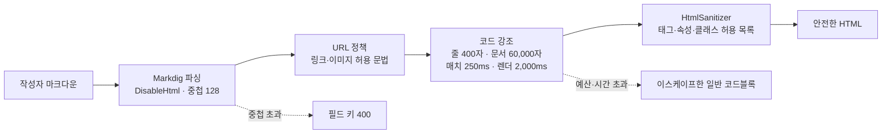
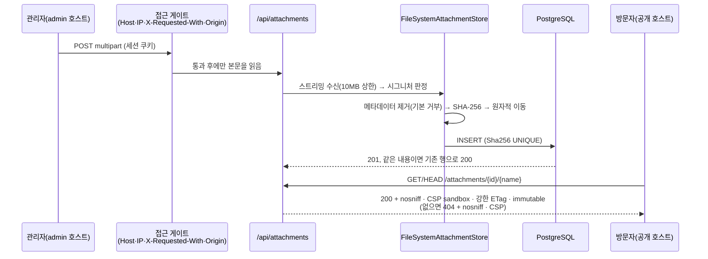

# 기술 블로그 2A단계 실행 보고서 (2026-09-21)

스펙 `plan/tech_blog_0920.md` · 계획 `docs/superpowers/plans/2026-09-21-tech-blog-content-pipeline.md` · PR [#2](https://github.com/BerryBless/WebProject/pull/2)

## 1. 한눈에

| 항목 | 결과 |
|---|---|
| 범위 | Plan 2A — 공용 기반, 마크다운 → 안전한 HTML, `/api/preview`, 이미지 판정·메타데이터 제거, 이미지 첨부 |
| 방식 | Subagent-Driven Development: 작업마다 구현자 1명 → 리뷰어가 **직접 공격·측정** → 수정 라운드 → 범위 재리뷰. 끝에 브랜치 전체 리뷰 1회 + 수정 묶음 1회 |
| 커밋 | 22개(`0132e20` 이후, 이 보고서 커밋 포함) → master에는 squash 1개로 병합. 보고서 전까지 67개 파일, +5,300 / −275 |
| 빌드·테스트 | Release 경고 0 / 오류 0, 테스트 **412개 통과**(1단계 병합 시 166개) |
| CI | ubuntu-latest 2개 실행 모두 통과(첫 Linux 실행에서 테스트 2건 실패 → 테스트 전제 수정 후 통과, 7절) |
| 보안 결론 | 최종 리뷰가 실제 Production 호스트를 HTTP로 공격: **게이트 우회 없음, 인증 없는 디스크 쓰기 없음, 조작된 입력으로 500 없음, 민감 로그 없음.** Critical 0건 |
| 사용자 지시 | "모든 선택지는 추천안으로, 작업을 끝내고 보고서" — 질문 없이 진행했고, 내린 판정은 5절에 전부 적었다 |

## 2. 만든 것

| Task | 내용 | 핵심 파일 |
|---|---|---|
| 1 | 중앙 패키지 버전 관리(전이 의존성 고정), `TextRules`(NUL 거부), 속도 제한을 `Infrastructure/Web`으로 이전(엔드포인트 메타데이터로 파티션 선택·`Retry-After`), 접근 매트릭스 닫힌 세계 테스트 | `Directory.Packages.props`, `Contracts/TextRules.cs`, `Infrastructure/Web/*` |
| 2 | Markdig(`DisableHtml`) → URL 정책 → ColorCode 서버 측 강조(클래스만) → HtmlSanitizer 허용 목록. 렌더 비용 **시간 상한**, 선형 제목 id, 중첩 한도 → 400, 저장 전 렌더 검사 | `Infrastructure/Markdown/*` |
| 3 | `POST /api/preview` — 공개 페이지와 같은 렌더러, 분당 한도 + 동시 실행 제한 | `Features/Preview/PreviewEndpoints.cs` |
| 4 | 시그니처만으로 형식 판정, 디코딩 없는 스트림 기반 메타데이터 제거기(JPEG·PNG·WebP·GIF **기본 거부**) | `Infrastructure/Storage/{ImageSignature,MetadataStripper}.cs` |
| 5 | `Attachment` 엔티티·마이그레이션, 내용 주소 저장(SHA-256), 관리 업로드·목록·삭제, 공개 `GET/HEAD /attachments/{id}/{fileName}` | `Features/Attachments/*`, `Infrastructure/Storage/FileSystemAttachmentStore.cs` |





## 3. 검증 — 무엇에 근거한 결론인가

| 단계 | 한 일 | 결과 |
|---|---|---|
| Task 2 리뷰 | 적대적 마크다운 약 250종 실행, 이후 시간 상한 재공격 40여 종 | XSS 우회 없음. 최악 렌더 2,266ms(문서화한 상한 2,250ms) |
| Task 4 리뷰 | 조작된 이미지 123종 + GIF 라벨 256 · JPEG 마커 256 · WebP FourCC 275 전수, Pillow로 만든 정상 파일 43종 | 멈춤·예상 밖 예외·길이 필드 기반 할당 없음. 정상 파일은 픽셀·프레임·반복 설정 동일. 청크 수와 무관하게 할당 0바이트 |
| Task 5 리뷰 | 경로 입력·동시 업로드·삭제 경쟁·CSRF 대체 수단 점검 | 물리 경로는 서버 생성 값만 사용. API가 돌려주는 URL은 전부 URL 정책 통과 |
| 최종 리뷰 | 실제 Production Kestrel + PostgreSQL에 조작된 multipart 17종 · JSON 18종 | 세션 없는 12MB 업로드 401 · 외부 IP 403 · 공개 호스트 404, 모두 본문을 읽지 않고 약 4ms. 임시 폴더 비어 있음 |
| 컨트롤러 | 매 커밋마다 Release 빌드·전체 테스트 재실행, 트레일러·NUL 바이트·줄 끝 검사 | 구현자 보고를 그대로 믿지 않았다(4절의 "거짓 보고" 참조) |

## 4. 가장 중요한 교훈 — 계획을 그대로 옮긴 코드가 매번 통과했지만, 계획이 틀려 있었다

리뷰가 찾아 같은 브랜치에서 고친 **계획 자체의 결함 16건**(계획 문서 끝 정오표에 표로 정리). 대표적인 것:

| 계획에 적힌 것 | 실제 | 고친 것 |
|---|---|---|
| "렌더링 약 200ms", 200KB 제한이 비용 상한 | 닫히지 않은 `/*` 뒤 C 계열 코드에서 ColorCode가 **지수** 백트래킹 — 1,320바이트에 7초, 약 1,600바이트에 60초 초과. 저장된 글 하나로 공개 페이지가 영구 마비될 수 있었다 | 길이가 아니라 **시간**으로 상한: 정규식 매치 타임아웃 250ms + 렌더당 2,000ms, 초과하면 그 블록만 평문 |
| GIF는 주석만 제거 | 라벨 1바이트만 바꾸면 5MB 페이로드가 정상 재생되는 GIF 안에 그대로 남았다 | 네 형식 모두 기본 거부 + 남기는 블록의 **모양**까지 검사 |
| JPEG APP0은 남긴다 | `JFXX` 썸네일(자르기 전 원본 사진)이 남았다 | 식별자를 확인한 `JFIF`·`ICC_PROFILE`·`Adobe`만 유지 |
| `stem[..max]`로 파일 이름 자르기 | 이모지를 쪼개면 INSERT에서 500 + 고아 파일 | 코드 포인트 경계에서 자르고, 자른 뒤 `..`·끝 점이 되살아나지 않게 재정리 |
| 저장 루트는 비어 있지 않은지만 검사 | `RootPath`가 `/`로 끝나면 시작은 통과하고 모든 업로드·다운로드가 500(최종 리뷰가 실제 호스트에서 발견) | 루트 정규화 + 시작 시 자체 점검 |
| 주석 "인증 비용 0", "최대 수백 ms", "파일 크기와 무관", "Interlocked 기반", "캐시 히트는 할당 없음" | 전부 거짓 또는 과장 | 측정한 사실로 교체(코드를 고쳐 문장을 참으로 만든 것 포함) |
| 테스트 4건 | 실패할 수 없는 단언(픽스처에 없는 문자열의 부재, 허용 목록이라면서 거부 목록, 어느 구현이든 통과하는 8초 상한, 핸들이 새도 성공하는 `File.Delete`) | 실패할 수 있는 단언으로 교체하고 실패하는 것을 확인 |

**구현자 보고도 검증 대상이었다.** "CRLF 유지"(실제 LF), "`TryDelete` 주석 갱신 완료"(하지 않음), 커밋 트레일러 오기(2회) — 컨트롤러 검사와 재리뷰가 각각 잡았다.

다음 계획이 지킬 규칙 5~9(계획 정오표): 비용 상한은 시간으로 / 파서는 기본 거부 + 모양 검사 / 주석의 성능·보안 주장은 측정한 것만 / 테스트가 실패할 수 있는지 확인 / 문자열은 코드 포인트 경계에서 자르고 앞 단계 불변식을 다시 확인.

## 5. 내가 내린 판정 (질문 없이 추천안으로 결정한 것)

| # | 판정 | 이유 | 틀렸을 때의 대가 |
|---|---|---|---|
| 1 | 기본 인증 스킴을 명시적으로 복원(계획의 "스킴 제거로 비용 0" 목표 폐기) | 스킴이 하나면 프레임워크가 자동으로 기본 스킴으로 삼는다(실측) | 관리자 쿠키가 실린 수제 요청은 공개 경로에서도 세션 DB 조회 1회 → 2B의 공개 속도 제한이 상한 |
| 2 | 코드 강조를 **시간**으로 제한(250ms / 2,000ms), 시간을 넘긴 블록만 평문 | 지수 정규식은 길이 예산으로 못 막는다. ColorCode의 확장 지점이 공개돼 있다 | 같은 글이 부하에 따라 강조되기도, 안 되기도 한다(2B에서 HTML 캐시) |
| 3 | 블록당 강조 예산 20,000자 제거 | 근거 측정이 "8KB 한 줄"이었고 285줄 넘는 평범한 파일의 강조가 꺼졌다 | 긴 정상 블록에서 CPU 약간 증가(시간 예산 안) |
| 4 | 네 이미지 형식 모두 기본 거부 + 모양 검사 | 계획의 목표가 "숨긴 데이터 차단"이고 보안 최우선 | 드문 정상 파일(계층형 JPEG, 규격 밖 인코더 출력)이 400 |
| 5 | ICC 본문·WebP `ANMF` 내부·JPEG 테이블·PNG CRC·GIF LZW 체인은 **검사하지 않고 문서화** | 실제 디코더가 필요하다. 10MB 상한 + 시그니처 기반 content-type + `nosniff` + CSP sandbox라 브라우저에서 실행 불가 | 인증된 관리자가 올린 파일에 한해 파일당 최대 약 10MB의 비활성 바이트가 실릴 수 있다 |
| 6 | 공개 첨부 GET을 직접 연 스트림(`FileShare.Read\|Delete`)으로, 강한 ETag(sha256)·HEAD 지원 | 존재 확인과 열기 사이 삭제 → 500 제거, 서빙 중 삭제 가능 | 커널 sendfile 경로를 쓰지 않는다(immutable 캐시라 영향 작음) |
| 7 | 시작 시 저장 루트 검증(운영은 절대 경로, 생성 + 쓰기 확인) | 잘못 준비된 볼륨이 첫 업로드가 아니라 시작에서 드러난다 | 볼륨이 앱보다 늦게 마운트되면 시작 실패 → Plan 4 compose에서 순서 보장 |
| 8 | Task 5의 마지막 재리뷰를 최종 리뷰와 **병렬**로 실행 | 224줄짜리 소규모 수정이고 같은 파일을 최종 리뷰가 다시 본다 | 없었다(둘 다 깨끗) |
| 9 | 최종 수정 묶음의 범위: Important 4건 + 값싼 Minor. 속도 제한 체인 순서·`AllowedHosts`·`Server` 헤더·EF 디자인 타임 어셈블리는 2B/4로 | 공유 경로를 재구성하거나 배포 단계의 일 | `AllowedHosts=*`가 한 계획 더 남는다(관리 게이트는 Host를 직접 검사, 공개 경로는 읽기 전용) |
| 10 | 구현자의 잘못된 트레일러를 푸시 전 **메시지만** 재작성(트리 해시 동일 확인) | 저장소 규칙(커밋 훅·서명) | 없음(미푸시 커밋) |
| 11 | 최종 재리뷰의 Minor 3건과 테스트 인프라 2건은 에이전트 없이 직접 수정 | 주석 4줄, 테스트 코드 수십 줄 | 리뷰를 한 번 덜 거쳤다 → CI와 반복 실행으로 대신 확인 |
| 12 | CI 실패 2건은 **테스트 전제의 오류**로 판정하고 테스트를 고침 | (a) 동일 제목 18,600개 렌더링은 선형이어도 CI에서 7.2초 → 절대 시간 대신 제목당 비용 비율(옛 방식 약 13배, 지금 1.6배, 상한 4배). (b) 삭제가 먼저 커밋된 뒤의 글 저장이 받는 `seriesId` 400은 정답 | (a) GC 잡음으로 비율이 4배를 넘는 러너가 있으면 반복 횟수를 늘린다 |

## 6. 수용한 잔여 위험

1. **Markdig 파서 자체의 초선형 비용** — 적대적 200KB 입력에서 인라인 약 8.5초, 블록 약 6.6초(동기·취소 불가). 지금은 인증된 관리자만 렌더를 일으킨다. **Plan 2B에서 공개 페이지는 반드시 렌더 결과를 캐시하거나 동시성을 제한해야 하며, 글 저장 경로도 같은 게이트 안에 넣어야 한다.**
2. **이미지의 비검사 표면 5종**(5절 #5).
3. **관리 JSON 본문 상한 없음** — Kestrel 기본 30MB 뒤에 200KB 검증(인증된 요청만 본문을 읽는다). 2B.
4. **속도 제한 체인** — 동시 실행 거부가 분당 허용량을 소모하고 `Retry-After: 60`을 돌려준다. 2B.
5. **`AllowedHosts=*`**, `Server: Kestrel` 헤더, 라우트 제약 실패 404의 보안 헤더 부재 — 2B의 보안 헤더 작업.
6. **첨부 삭제는 캐시 사본을 회수하지 못한다**(`immutable` 1년) — 스펙 3.8에 명시.

## 7. 알려진 문제

- **로컬 전용 간헐 테스트 실패**: 412개 중 1개가 가끔 실패한다(이번 실행 기간의 수십 회 가운데 5회 관찰 — 컨트롤러 3회, 구현자 2회. 그때 실행 시간이 19초 → 33초로 늘어난다). 잡아낸 원인은 팩토리 시작 시 `Database.Migrate()`의 새 DB 연결이 **15초 연결 타임아웃**에 걸리는 것이고, 빌드 직후처럼 기계가 바쁠 때 나타난다. Windows Docker Desktop의 포트 프록시가 새 TCP 연결을 가끔 멈추는 환경 문제로 판단한다 — 운영 코드나 테스트 로직의 결함이 아니며 Linux CI에서는 나오지 않았다. 조사 중에 찾은 실제 문제(팩토리별 DB 풀이 유휴 연결을 남겨 동시 연결이 61개까지 쌓임)는 고쳤다(풀 즉시 정리, 최대 7개). 다시 보이면 재실행하면 된다. 근본 대책 후보: 테스트 클래스 간 DB 공유를 늘려 새 연결 수 자체를 줄이기.
- **CI의 첫 Linux 실행에서 드러난 것**(5절 #12): 절대 시간 상한을 둔 테스트는 느린 러너에서 깨진다. `Render_ManyFastBlocks…`도 약 6배 **빠른** 기계에서는 거짓 실패한다 → 2B에서 주입 가능한 시계로 교체.

## 8. 다음 단계

1. **Plan 2B 작성**(2A가 끝났으므로 이제 가능): 공개 Razor 페이지(목록·글·태그·시리즈·검색), Atom·sitemap·robots, 보안 헤더(CSP), 공개·검색 속도 제한, `statement_timeout`, 읽기 전용 DbContext, **렌더 캐시/동시성 게이트**, 앱 검증 ⊆ DB 제약 테스트. 계획 정오표의 "Plan 2B로 넘기는 항목"과 규칙 1~9를 입력으로 쓴다.
2. Plan 3(관리 에디터 SPA): 미리보기 iframe의 이미지는 **관리 오리진**에서 읽힌다 — 첨부 응답에 `Cross-Origin-Resource-Policy: same-origin`을 붙이면 미리보기가 깨진다. 실제 브라우저에서 확인할 것.
3. Plan 4(배포): Caddy `request_body`는 앱 상한(10MB)이 아니라 프레임워크 상한(**11MB**)에 맞춘다. 저장 볼륨은 앱 시작 전에 마운트. multipart 버퍼링이 프로세스 임시 폴더에 쓰므로 읽기 전용 루트 FS면 업로드가 실패한다. Release 출력의 EF 디자인 타임 어셈블리 제거.

## 9. 빌드 검증

```bash
dotnet build PortfolioBlog.slnx -c Release   # 경고 0 / 오류 0
dotnet test  PortfolioBlog.slnx -c Release   # 412개 통과 (Docker 필요: Testcontainers PostgreSQL 17)
pwsh scripts/harness-audit.ps1               # 8/8 PASS
```
