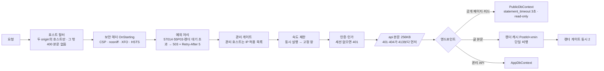
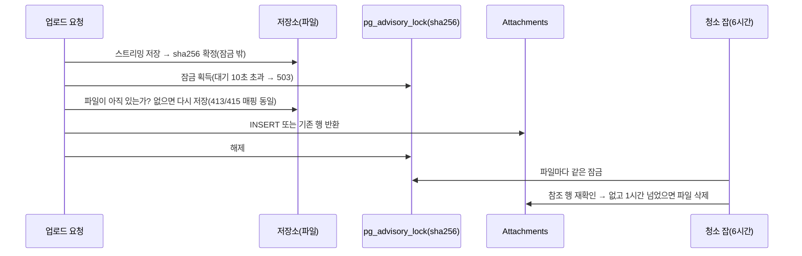

# 기술 블로그 2B단계 실행 보고서 (2026-09-21)

스펙 `plan/tech_blog_0920.md` · 계획 `docs/superpowers/plans/2026-09-21-tech-blog-public-site.md` · PR [#3](https://github.com/BerryBless/WebProject/pull/3)

## 1. 한눈에

| 항목 | 결과 |
|---|---|
| 범위 | Plan 2B — 공개 Razor 페이지(목록·글·태그·시리즈·검색), Atom·sitemap·robots, 보안 헤더(CSP)·호스트 필터·오류 응답, 공개·검색·업로드 속도 제한, 공개 읽기 전용 DB 연결(statement_timeout), 렌더 게이트·결과 캐시, 첨부 정합성(advisory lock·청소 잡), 앱 검증 ⊆ DB 제약 테스트 |
| 방식 | Subagent-Driven Development: 작업마다 구현자 1명 → 리뷰어가 **직접 공격·측정** → 수정 라운드 → 범위 재리뷰. 끝에 최상위 모델의 브랜치 전체 리뷰 1회(실제 Production 호스트 공격) + 수정 묶음 1회 + 범위 재리뷰 1회 |
| 커밋 | 26개(`e6bde9d` 이후) → master에는 squash 1개로 병합. 보고서 전까지 99개 파일, +6,023 / −241 |
| 빌드·테스트 | Release 경고 0 / 오류 0, 테스트 **589개 통과**(2A 병합 시 412개) |
| CI | ubuntu-latest 2회 실행(코드 커밋 뒤, 보고서 커밋 뒤 — 각각 push·PR 2건) 모두 첫 시도에 통과, 각 약 2분. master에는 `80c8dc4`로 squash 병합. 로컬의 15초 간헐 실패(7절)는 CI에서 나오지 않았다 |
| 보안 결론 | 최종 리뷰가 실제 Kestrel Production + PostgreSQL 17을 HTTPS로 공격: **Critical 0건.** 접근 계약·보안 헤더·비용 상한·출력 인코딩이 설계대로 성립. 실측된 결함 3건(공백 경로 값 500, 공개 첨부 GET의 관리 연결 사용, 호스트 필터 400의 HTML 본문)은 수정 묶음에서 닫았다(3절) |
| 사용자 지시 | "1번(서브에이전트 방식)으로, 추천안으로 끝까지" — 질문 없이 진행했고, 내린 판정 28건은 5절에 전부 적었다 |

## 2. 만든 것

| Task | 내용 | 핵심 파일 |
|---|---|---|
| 1 | 속도 제한 정책 4종 추가(`PublicPage` IP별 120/분, `PublicAsset` IP별 600/분, `Search` IP별 20/분 + 전역 동시 4, `Upload` 전역 30/분 + 동시 2). 체인은 **동시 실행 제한기 → 고정 창** 순서, 동시 실행 거부의 `Retry-After`는 5초 | `Infrastructure/Web/{PublicOptions,RateLimitPolicy,RateLimitingExtensions}.cs` |
| 2 | 보안 헤더(`OnStarting`, CSP는 첨부용 sandbox 값일 때만 유지), 호스트 필터(두 origin의 호스트만), `Server` 헤더 제거, 과부하 → 503 + `Retry-After: 5`(57014·55P03을 InnerException 체인 어디서든), 관리 JSON 본문 256KB 상한(chunked 포함) | `Infrastructure/Web/{SecurityHeadersMiddleware,ErrorResponses,OverloadExceptionHandler,ApiBodyLimitMiddleware}.cs` |
| 3 | 렌더 게이트(전역 동시 2, 대기 5초 → 503), 렌더 결과 캐시(키 `(PostId, xmin)`, 64MB, 단일 비행), `TimeProvider` 주입, 저장 경로의 선채움 가드 | `Infrastructure/Markdown/{RenderGate,RenderedPostCache}.cs`, `Features/Posts/PostEndpoints.cs` |
| 4 | `PublicDbContext` — 별도 풀, `statement_timeout`(3초) + `default_transaction_read_only=on`, 공개 프로젝션·쿼리. 잘못된 연결 문자열은 시작 실패 | `Data/{PublicDbContext,PublicQueries,PublicModels}.cs` |
| 5 | Razor 공개 페이지(목록·글·태그·시리즈), 규약 하나로 GET/HEAD·공개 호스트·속도 제한 강제, `/css/highlight.css` 엔드포인트, 스크립트 없는 레이아웃 | `Pages/*`, `wwwroot/css/site.css` |
| 6 | 검색(`q` 2~100자, 쪽 상한 50, `noindex`, 경계 밖 입력은 반사 없이 400) | `Pages/Search.cshtml(.cs)` |
| 7 | Atom·sitemap·robots — `XmlWriter` + XML 1.0 무효 문자 제거, 절대 URL은 `Site:PublicOrigin`만 | `Infrastructure/Web/XmlText.cs`, `Pages/SiteEndpoints.cs` |
| 8 | 첨부 정합성 — sha256 단위 세션 advisory lock으로 삽입·삭제·청소 직렬화, 잠금 안 파일 재확인, 고아 파일 청소 잡(1시간·6시간, 링크 미추적) | `Infrastructure/Storage/{AttachmentLock,AttachmentJanitor}.cs` |
| 9 | 앱 검증 ⊆ DB 제약 경계값 테스트, CHECK 제약 14개 닫힌 세계 검사, 스펙·README as-built 갱신 | `ValidationWithinDbConstraintsTests`, `CheckConstraintCoverageTests` |





## 3. 검증 — 무엇에 근거한 결론인가

| 단계 | 한 일 | 결과 |
|---|---|---|
| 계획 전 스파이크 | 버려질 프로젝트로 S1~S12 측정(속도 제한 체인 순서, `OnStarting`과 `Response.Clear()`, Razor `page` 예약 키, `statement_timeout`의 문장당 적용, advisory lock 등) | 계획의 설계 결정 D1~D12의 근거. AdGuard의 평문 HTTP 스크립트 주입 함정 발견 |
| 작업별 리뷰(9회 + 재리뷰 9회) | 보안·동시성 작업은 opus, 나머지는 sonnet. 리뷰어가 프로브를 직접 실행 | Important 합계 18건 → 전부 수정·재확인. 5회 한도에 걸린 작업 없음(T4만 2라운드) |
| 최종 브랜치 리뷰 | Release publish → 실제 Kestrel Production + `postgres:17`, 개발 인증서 HTTPS 직결(AdGuard 우회). 헤더 전 경로, 호스트 필터, 본문 상한(`Expect: 100-continue`에서 업로드 0바이트로 413), 적대 메타데이터, 피드 well-formed, 194KB 글 cold cache 동시 50회(0.76초, 본문 해시 1종), 검색 남용(21번째부터 429), XFF 위조, 테이블 잠금 중 503(3.0초), 퍼징 34종, 정적 파일 탈출, 시작 실패 메시지의 비밀번호 비노출 | Critical 0 / Important 6 / Minor 8. 판정 R1~R23에 이견 없음 |
| 최종 수정 묶음 | 단일 구현자(opus)가 통합 수정 목록 9항목을 처리(`541f77d..245ce97`, 6커밋, 31파일). 새·고친 테스트마다 제품 코드를 되돌려 실패를 확인(사보타주 5회) | 9항목 전부 수행. 579 → 589개, 경고 0 |
| 범위 재리뷰 | opus가 수정 diff만 검토. 공개 첨부 핸들러 전체를 읽어 쓰기가 없음(read-only 연결에서 25006 위험 없음)을 확인, `CompressionEnabled`가 SDK 타깃 파일의 공식 스위치임을 확인 | **clean** — 9항목 FIXED, 새 Critical·Important 0, Minor 6(비차단). 한 줄짜리 4건은 컨트롤러가 직접 정리(`880eae5`, R28) |

최종 리뷰가 **실측으로 찾은 결함**(작업별 리뷰가 놓친 것):

| # | 결함 | 원인 | 조치 |
|---|---|---|---|
| I1 | `/posts/%20`·`/tags/%20`·`/series/%20` 등 공백뿐인 경로 값이 500 | MVC 모델 바인딩이 공백뿐인 문자열을 null로 바꾼다 — 계획·리뷰 모두 몰랐던 프레임워크 동작 | `string?` + 첫 줄 404, 회귀 테스트 |
| I2 | 공개 첨부 GET만 관리 연결을 써서 `statement_timeout`이 걸리지 않음(잠금 중 6.6초 대기) | **계획의 누락** — 2A 핸들러의 컨텍스트 교체를 Task 4가 지시하지 않았다 | `PublicDbContext`로 교체, 잠금 중 503 테스트 |
| I3 | 호스트 필터 400이 334바이트 HTML을 보안 헤더 없이 보냄 — 코드 주석은 "본문 없음" | `IncludeFailureMessage` 기본값 true를 측정하지 않고 주석을 씀 | 옵션을 끄고 테스트로 고정 |

## 4. 가장 중요한 교훈 — 2A의 교훈이 되풀이됐다: 계획이 틀린 곳은 "측정하지 않고 쓴 문장"이었다

계획은 스파이크 12건으로 검증하고 썼는데도 실행 중 결함 23건이 나왔다. 유형은 셋이다.

| 유형 | 건수 | 예 |
|---|---|---|
| **실패할 수 없는 테스트**(규칙 8) | 6 | 단일 비행 테스트(호출이 직렬이라 늘 통과), XSS head 인코딩 단언(씨앗에 위험 문자가 없음), `page=51` 상한(결과가 없어 상한과 무관하게 404), `X-Forwarded-Host`(앱이 읽지 않는 헤더), 스트레스 테스트의 공집합 통과, 800ms 게이트 |
| **측정하지 않은 주석**(규칙 7) | 6 | "프레임워크가 유휴 파티션을 걷어 낸다", "57014는 statement_timeout뿐", "MemoryCache가 LRU로 밀어낸다"(실측: 상한 초과 `Set`은 조용히 거부), "Kestrel이 동기 I/O를 거부", "세션 종료·풀 리셋이 남은 잠금을 푼다"(실측: **지연된** 리셋 — 다음 대여자의 첫 명령 직전), "호스트 필터 400은 본문 없음" |
| **설계 구멍** | 8 | `IsOverload`가 최상위 예외만 봄(EF는 `DbUpdateException`으로 감쌈), CSP `TryAdd`가 fail-open, 캐시 선채움이 남의 버전 키에 들어갈 수 있음, `BuildConnectionString`이 기존 `Options`를 조용히 대체, `Command Timeout` ≤ statement timeout이면 503 매핑 불성립, 잠금 안 재저장의 500 누출, 공개 첨부 GET의 컨텍스트, 공백 경로 값 |
| 컴파일·런타임 | 3 | `@Model.Posts.Total건`(Razor가 한글을 식별자로 읽음), EF Core 10 런타임 모델의 `GetCheckConstraints()` 예외 → `IDesignTimeModel`, `System.Xml.XmlText` 이름 충돌 |

교훈:
1. **프레임워크 기본값은 실제 호스트에서만 드러난다.** I1·I3과 Kestrel의 414는 TestServer 기반 스위트 579개가 전부 통과하는 동안 남아 있었다. 최종 리뷰의 실제 호스트 공격은 생략할 수 없는 단계다.
2. **"이전 단계의 코드를 새 기반으로 옮기는 일"은 계획에 명시적으로 적어야 한다.** I2는 새 연결을 만든 작업(Task 4)이 "기존 공개 핸들러를 전부 옮긴다"를 산출물로 갖지 않아 생겼다. 다음 계획부터 기반을 바꾸는 작업에는 "기존 소비자 목록"을 넣는다.
3. **측정이 자기 결론을 뒤집을 때가 가장 값지다.** 풀 리셋은 "반납 시"가 아니라 "다음 사용 시"였고, 그래서 R22(세션 잠금 유지)의 근거가 "즉시 회복"에서 "재진입해도 상호 배제는 깨지지 않는다"로 바뀌었다.
4. 이 PC의 AdGuard는 평문 HTTP의 **CSP 헤더까지 다시 쓴다.** 로컬 HTTP 프로브의 헤더 관측은 믿을 수 없다 — HTTPS로 직결한다.

## 5. 내가 내린 판정 (질문 없이 추천안으로 결정한 것)

| # | 판정 | 이유 | 틀렸을 때의 비용 |
|---|---|---|---|
| R1 | "예외가 안 나면 통과"인 테스트 2건에 `Record.Exception` 단언 명시 | 단언 없는 테스트는 의도가 코드에 없다 | 없음(동작 동일) |
| R2 | "유휴 파티션을 걷어 낸다" 주석은 측정하거나 미검증 표기 | 규칙 7 | 주석 한 줄 |
| R3 | `IsOverload`가 InnerException 체인을 훑는다 | 과부하와 500을 구분한다는 의도가 계획 코드보다 우선 | 일부 DB 오류가 503으로 보임(안전한 쪽) |
| R4 | Task 2의 값싼 보안 보강을 같은 수정에 포함(CSP는 sandbox 상수일 때만 유지, 미매칭 `/api`는 404, 262,144바이트 경계 테스트) | 보안 최우선·최종 수정 물결 축소 | 없음 |
| R5 | 단일 비행 테스트 재설계(`Task.Run` 발행 + 호출 수 유계 대기) | 규칙 8 | 테스트 1개 재작업 |
| R6 | 캐시 선채움은 재조회 본문이 요청 본문과 같을 때만(Create에도) | 잘못된 본문을 24시간 서빙하느니 캐시 미스 | 저장 직후 첫 방문이 렌더 1회 추가 |
| R7 | MemoryCache 동작은 실제 비율로 측정한 것만 주석에 | 리뷰 프로브의 비율이 비현실적 | — |
| R8 | Task 3 값싼 Minor 포함(version 검사를 렌더 앞으로 등) | 비용 없음 | — |
| R9 | 캐시 설계 유지 — 상한 초과 `Set`은 조용히 거부되지만 대가는 렌더 1회, 잘못된 내용은 나가지 않음 | 64MB는 글 수천 편 분량, YAGNI | 캐시가 늘 가득 차면 요청마다 렌더(렌더 게이트가 상한) |
| R10 | "오래된 version + 중첩 과다 본문"이 400 → 409로 바뀌는 것 수용 | 어차피 저장 불가, 렌더 비용을 치르지 않는 쪽 | SPA가 409 안내를 먼저 보임 |
| R11 | 기반 연결 문자열에 `Options`가 있으면 **시작 실패**(조용한 대체 금지) | 더 엄격한 쪽, 원인 추적 가능 | `Options`를 쓰던 운영 설정이 시작 실패(메시지가 원인을 말함) |
| R12 | `Command Timeout`×1000 ≤ `StatementTimeoutMs`면 시작 실패 | 클라이언트 취소가 57014보다 먼저면 503 매핑 불성립 | 시작 시 명확한 메시지 |
| R13 | Npgsql 풀 리셋을 이 저장소의 테스트로 측정 | 읽기 전용 봉쇄의 근거가 미측정이었다 | — |
| R14 | Task 4 값싼 Minor 포함(`PageAsync` 범위 가드 등) | 비용 없음 | — |
| R15 | XSS 테스트 씨앗에 `"`와 `</title><script>` 추가 + 인코딩 끄는 사보타주 | 인증 없는 HTML 표면 전체의 증명이 증명력 0일 수 없다 | 테스트 재작업 |
| R16 | `site.css`가 정적 파일 미들웨어라 관리 호스트에서도 나가고 속도 제한 밖인 것 수용 | 공개 CSS 1개, 엔드포인트화는 YAGNI | 관리 origin에서 공개 CSS가 읽힘. **단서(최종 리뷰):** "닫힌 세계 테스트가 다른 파일을 막는다"는 전제는 publish 산출물에는 성립하지 않는다(수정 묶음에서 csproj의 `CompressionEnabled=false`로 닫았다 — 다만 그 줄이 지워지는 것을 잡는 회귀 테스트는 없다) |
| R17 | Task 5 값싼 Minor 포함(`@media` 안 id 선택자 맹점 등) | 비용 없음 | — |
| R18 | 검색 쪽 상한은 1,001건 시드로 증명. Index 상한 500은 같은 방식(10,001건)을 하지 않음 | 규칙 8 대 시드 비용 | Index 상한의 배선은 단위 테스트 + 코드 리뷰로만 증명됨 |
| R19 | 페이저 href 인코딩 실증 테스트 추가 | 반사 테스트는 결과가 없어 페이저가 렌더되지 않았다 | — |
| R20 | `X-Forwarded-Host` 검사를 `Host: blog.test:8443`으로 교체 | 앱이 읽지 않는 헤더는 판별력 0 | 테스트 재작업 |
| R21 | Task 7 값싼 Minor 포함(Cache-Control·BOM 단언 등) | 비용 없음 | — |
| R22 | 세션 advisory lock 유지, `ClearPool` 완화책은 넣지 않음 | UNLOCK만 실패하는 경우는 드물고 다음 사용 시 자가 회복, 상호 배제는 깨지지 않음. `ClearPool`은 앱 전체 풀을 날림 | 특정 sha의 업로드·삭제가 그 연결이 재사용될 때까지 10초 뒤 503(가용성, 정합성 아님) |
| R23 | Task 8 값싼 보강 포함(재저장의 413/415 매핑, 청소 잡의 파일 단위 55P03 건너뛰기, 링크 미추적) | 비용 없음 | — |
| R24 | 공개 첨부 GET을 `PublicDbContext`로(최종 리뷰 I2) | 스펙 3.7, 계획의 누락 | DB 지연 시 첨부가 3초에 503(이전: 30초까지 대기 후 200) |
| R25 | 호스트 필터 400은 본문 없이(`IncludeFailureMessage=false`) | 헤더 없는 HTML 응답을 없앤다 | 잘못된 Host로 접속한 운영자가 빈 400만 봄(README에 기재) |
| R26 | publish 산출물의 `site.css.gz`는 검증되면 끄고 아니면 Plan 4 인계 → **publish 출력으로 검증돼 적용**(`.gz`·`.br` 모두 사라짐) | 내용이 공개 CSS라 무해 | `.gz` 하나가 더 서빙됨 |
| R27 | 요약의 C0 제어 문자(`&#xB;`), 503 로그량, unobserved task exception은 고치지 않음 | 무해 | 로그량은 Plan 4 운영 메모로 |
| R28 | 범위 재리뷰의 Minor 중 한 줄짜리 4건(잠금 해제 순서를 "측정"이라 단정한 주석, 테스트 정리 코드의 예외 경로, 테스트 주석의 프로세스 표현 2건, 스펙 실측의 출처 표기)은 내가 직접 고침. 나머지 2건(첨부 GET이 공개 풀을 공유, 잠금 테스트의 5초 예산에 첫 연결 포함)은 Plan 4·CI 관찰 항목으로 | 두 번째 구현자 물결을 돌릴 크기가 아니고 규칙 7 위반을 남기지 않는 쪽 | 주석·테스트 정리 코드뿐 |

## 6. 수용한 잔여 위험

| 위험 | 근거 | 되돌릴 조건 |
|---|---|---|
| `default_transaction_read_only`는 세션이 스스로 끌 수 있다(실측) | 앱은 SQL을 입력으로 조립하지 않고(전부 매개변수화 LINQ), 앱 계층에서 `SaveChanges` 4종이 예외. 심층 방어일 뿐 | Plan 4에서 쓰기 권한 없는 DB 롤을 만들면 진짜 경계가 된다(스펙 7절) |
| 렌더 게이트를 공개·관리가 공유 — 재배포 직후 크롤러가 전 글을 훑는 동안 저장·미리보기가 최대 5초 대기 후 503 | 공개 렌더는 (글 수 × 버전)으로 유계, 단일 비행 + 24시간 캐시 | 작성자가 실제로 503을 보면 관리 전용 슬롯 분리 |
| Kestrel이 직접 거부하는 응답(414, 경로 NUL 400)과 호스트 필터 400에는 보안 헤더가 없다 | 본문이 없어 해석될 내용이 없다(실측) | — |
| `site.css`는 호스트 제한·속도 제한 밖(R16) | 공개 CSS | wwwroot에 두 번째 파일이 필요해질 때 |
| UNLOCK 실패 시 잠금이 다음 사용까지 남는다(R22) | 가용성 문제일 뿐, 정합성은 유지 | 운영에서 같은 sha의 503이 관측되면 |
| 직접 테스트가 없는 것: 청소 잡 배경 루프의 주기·예외 생존, 64KB 초과 `IFormFile` 재오픈, Index 쪽 상한 500의 배선, 공개 렌더와 관리 저장의 게이트 경쟁(통합 수준) | 최종 리뷰의 테스트 공백 순위 7~9 | Plan 4 스모크 테스트 |

## 7. 알려진 문제

- **로컬 간헐 실패(기존):** 전체 테스트에서 드물게 1건이 정확히 15초 만에 실패한다(Docker Desktop의 연결 타임아웃, 2A에서 보고된 것과 같은 현상). 이번 실행 중 1회 관측(`ApiBodyLimitTests.UndeclaredLength_OverLimit_Is413`), 즉시 재실행 2회와 이후 전부 통과. 리뷰어가 연결 열기·닫기 균형을 추적해 누수가 아님을 확인했다. CI에서는 나오지 않았다(2A와 같다).
- 503 1건당 스택 포함 약 50줄이 로그에 남는다(검색어·본문은 기록되지 않음 — 매개변수는 전부 `?`). 운영 로그 용량은 Plan 4에서 본다.
- 제품 코드에 프로세스 표현이 남은 곳: `MetadataStripper.cs` 13건(`fix round`·`Task 5` 등), `AppDbContext.cs`의 "리뷰에서 이런 시그니처를 보면…" 1건. 둘 다 2A 코드라 이번 범위 밖으로 두었다 — 그 파일을 다음에 고칠 때 함께 정리한다.
- 최종 리뷰의 실측값 "공개 첨부 GET이 관리 연결을 쓸 때 테이블 잠금 중 6.6초 대기 후 200"은 코드 주석에서 뺐다(이 저장소의 테스트가 측정한 값이 아니다). 기록은 이 보고서 3절에만 있다.

## 8. 다음 단계

- **Plan 3(관리 SPA)로 넘기는 것:** 본문은 `JSON.stringify`(비 ASCII 비이스케이프)로 보내야 200KB 한글 본문이 256KB 상한 안에 든다. 글 수정의 409는 본문 검증(400)보다 먼저 올 수 있다. 업로드는 전역 30/분·동시 2.
- **Plan 4(배포)로 넘기는 것:** 컨테이너 헬스체크·`curl`은 `Host: <공개 호스트>` 헤더 필요(`localhost`는 400). `ConnectionStrings:Default`에 `Options` 금지, `Command Timeout` > statement timeout. Caddy `request_body` 11MB. 이미지의 `wwwroot` 목록 검증(수정 묶음에서 csproj의 `CompressionEnabled=false`로 닫았다 — 다만 그 줄이 지워지는 것을 잡는 회귀 테스트는 없다). 쓰기 권한 없는 DB 롤. 과부하 로그량. 실제 Kestrel 고유 동작(414, `Expect: 100-continue` 413)의 스모크 테스트. **로컬 프로브는 HTTPS로**(AdGuard).
- 재개 절차는 `plan/resume_guide_0921.md`.

## 9. 빌드 검증

```powershell
dotnet build PortfolioBlog.slnx -c Release      # 경고 0 / 오류 0
dotnet test  PortfolioBlog.slnx -c Release      # 589개 통과 (Docker 필요 — Testcontainers postgres:17)
pwsh scripts/harness-audit.ps1                  # PASS 8/8
```

## 10. 변경 파일 요약

신규 제품 코드: `Infrastructure/Web/{PublicOptions,SecurityHeadersMiddleware,ErrorResponses,OverloadExceptionHandler,ApiBodyLimitMiddleware,XmlText,PublicUrls}.cs`, `Infrastructure/Markdown/{RenderGate,RenderedPostCache,RenderingOptions}.cs`, `Data/{PublicDbContext,PublicQueries,PublicModels}.cs`, `Infrastructure/Storage/{AttachmentLock,AttachmentJanitor}.cs`, `Pages/*`(페이지 5종 + 부분 뷰 3종 + 규약·모델·`SiteEndpoints`), `wwwroot/css/site.css`.
수정: `Program.cs`(파이프라인·호스트 필터·DI), `RateLimitingExtensions`, `StartupValidation`, `MarkdownRenderer`·`HighlightingCodeBlockRenderer`(`TimeProvider`), `PostEndpoints`·`PreviewEndpoints`(게이트·캐시), `AttachmentEndpoints`·`PublicAttachmentEndpoints`·`FileSystemAttachmentStore`, `AppDbContext`(봉인 해제).
테스트: 신규 테스트 클래스 약 25개(412 → 589). 문서: 스펙 3.3~3.8·7·8절, README, `PortfolioBlog.Api.http`.
