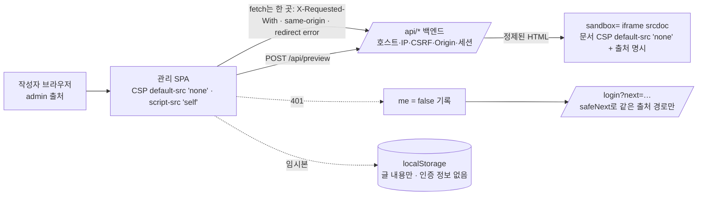
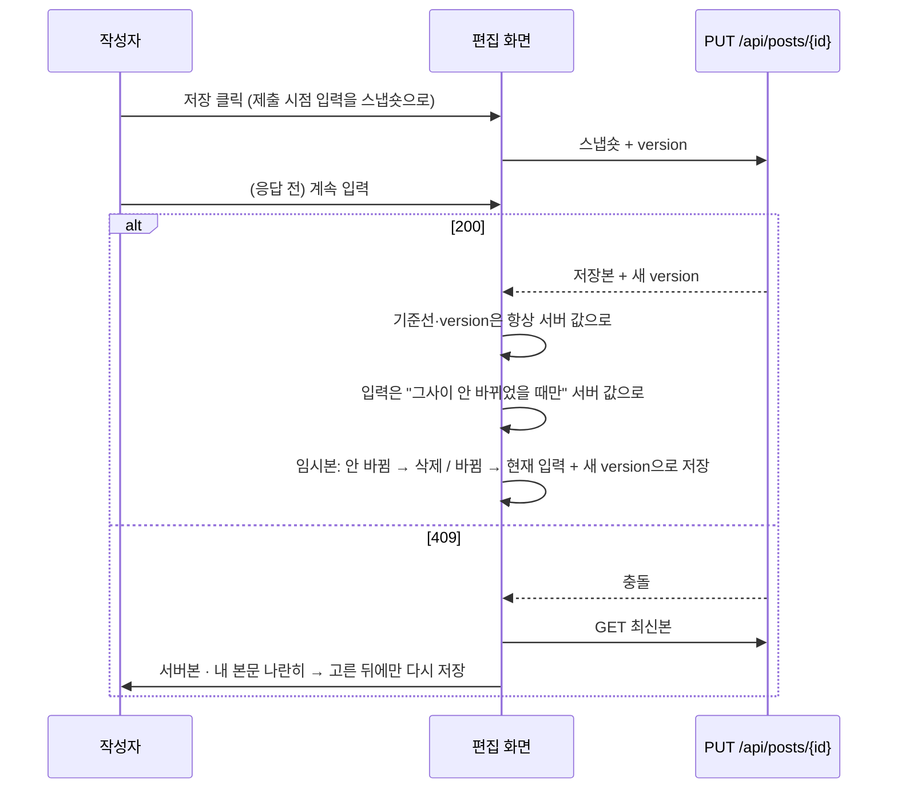

# 기술 블로그 3단계 실행 보고서 — 관리 에디터 SPA (2026-09-22)

스펙 `plan/tech_blog_0920.md` · 계획 `docs/superpowers/plans/2026-09-21-tech-blog-admin-spa.md` · PR [#4](https://github.com/BerryBless/WebProject/pull/4)

## 1. 한눈에

| 항목 | 결과 |
|---|---|
| 범위 | Plan 3 — 관리 에디터 SPA(`PortfolioBlog.Web`): API 클라이언트·오류 모델, 로그인·세션 만료 처리, 글 목록·편집(CodeMirror, 409 나란히 비교, 임시본), sandbox iframe 미리보기, 시리즈·태그·첨부 화면, 소스 가드, 실제 백엔드 Playwright E2E, CI `web`·`web-e2e` 잡. 백엔드 변경은 테스트 1개(미리보기 CSS 스냅숏) |
| 방식 | 계획 작성 때 코드를 저장소 밖에서 실제로 조립해 검증(타입 0·Vitest 110·E2E 6×2회) → Subagent-Driven Development: 작업마다 구현자(sonnet) → 컨트롤러 검증 스크립트 → 리뷰어(보안 작업은 opus)가 **직접 공격·측정** → 수정 라운드 → 범위 재리뷰. 끝에 최상위 모델의 브랜치 전체 리뷰(실제 호스트 공격) + 수정 묶음 1회 + 범위 재리뷰 |
| 커밋 | 31(이 보고서 커밋 포함)개(`eb746bf` 이후) → master에는 squash 1개. 보고서 전까지 67개 파일, +7,571 / −20 |
| 빌드·테스트 | 웹: 타입 오류 0·린트 경고 0·Vitest **188개**·Playwright E2E **8개**(Chromium+Firefox, 실제 백엔드 + PostgreSQL + production 빌드 + 배포용 CSP). .NET: Release 경고 0, **591개**(2B 병합 시 589개) |
| CI | ubuntu-latest 첫 실행(push·PR 2건)에서 세 잡 모두 통과: `test` 약 2분 · `web` 약 45초 · **`web-e2e` 약 2분 30초** — Linux에서의 개발 인증서 PEM 내보내기(로컬에서 측정하지 못한 가장 큰 불확실성)가 그대로 성립했다. 보고서 커밋 뒤 2회차 결과는 PR #4에 있다 |
| 보안 결론 | 최종 리뷰가 실제 API + PostgreSQL + production 빌드를 HTTPS로 띄워 Chromium·Firefox로 공격: **Critical 0건.** 8개 화면의 적대적 문자열은 전부 텍스트로만 표시, 미리보기 iframe 안에는 H1·P·A만, `?next=` 22종 × 2브라우저에서 교차 출처 이동 0, sandbox를 지워도 스크립트 미실행, `dist` 깨끗, `npm audit` 0건·lock 219개 전부 공식 레지스트리. 실측된 결함 5건(디바운스 창 안 입력의 소실, 비밀번호가 mutation 캐시에 잔류, 프록시 접두사 충돌, 보통 속도의 글쓰기로 미리보기 429 도달, 오류 경계 없음)은 수정 묶음에서 닫았다(3절) |
| 사용자 지시 | "1번(서브에이전트 방식)으로, 추천안으로 끝까지" — 질문 없이 진행했고, 내린 판정 16건은 5절에 전부 적었다 |

## 2. 만든 것

| Task | 내용 | 핵심 파일 |
|---|---|---|
| 1 | 골격: 전부 고정 버전 의존성, HTTPS 개발·미리보기 서버(.NET 개발 인증서), 프록시, 관리 SPA 보안 헤더의 정본, CI `web` 잡 | `package.json`, `vite.config.ts`, `admin-headers.ts`, `scripts/e2e-prepare.mjs` |
| 2 | 관리 API 호출의 단일 통로 — CSRF 헤더·`same-origin`·`redirect: 'error'`·`no-store`, 경로 검사(`/api/` 밖·`..`·`%2e`·제어 문자 거부), ProblemDetails 파싱, `Retry-After` | `src/api/{client,errors,endpoints,types}.ts` |
| 3 | 순수 함수: 로그인 후 이동 경로 검증(`safeNext`), 서버 규칙을 비춘 클라이언트 검증, 임시본(localStorage, 모양 검사), 미리보기 문서(CSP에 출처 명시) | `src/lib/*` |
| 4 | 셸·인증 흐름(401 전역 처리 → 로그인 → 원래 경로), 글·시리즈·태그 목록 | `src/app/*`, `src/auth/*`, `src/pages/{Posts,Series,Tags}Page.tsx` |
| 5 | 미리보기: 서버 HTML은 `sandbox=""` iframe `srcdoc`에만, 429·503의 `Retry-After` 동안 멈춤. 공개 사이트 CSS 스냅숏 + .NET 드리프트 테스트. **소스 가드**(TypeScript 파서로 주석을 제거하고 금지 패턴을 전체 소스에서 검사) | `src/components/PreviewPane.tsx`, `src/test/{stripComments,source-guards.test}.ts`, `PreviewCssSnapshotTests.cs` |
| 6 | 글 편집: "저장하면 즉시 공개됩니다", 저장 중 입력 보존, 409 나란히 비교, 임시본 복원 확인, 이미지 업로드(붙여넣기·드롭) | `src/pages/PostEditorPage.tsx`, `src/components/{MarkdownEditor,TagInput,ConflictPanel}.tsx` |
| 7 | 첨부 화면: 목록·마크다운 복사·삭제 전 경고 | `src/pages/AttachmentsPage.tsx` |
| 8 | 실제 백엔드 E2E(두 브라우저, CSP 위반 0건·배포 헤더 == 정본), CI `web-e2e`, 스펙·README·프로젝트 규칙 갱신 | `e2e/admin.spec.ts`, `playwright.config.ts`, `.github/workflows/ci.yml` |





## 3. 검증 — 무엇에 근거한 결론인가

| 단계 | 한 일 | 결과 |
|---|---|---|
| 계획 전 스파이크 | 버려질 Vite 프로젝트 + 실제 백엔드로 S1~S13 측정 | 스펙의 가정 2건이 틀림: 미리보기 iframe CSP의 `'self'`는 **Firefox에서 CSS·이미지를 전부 차단**(출처 명시로 해결), 관리 SPA CSP는 스펙보다 좁혀도 위반 0건 |
| 계획 코드의 사전 검증 | 계획에 실을 코드를 저장소 밖에서 조립해 타입 검사·Vitest·E2E 실행 | 초안 결함 6건을 작성 중에 잡음(계획 문서 끝) |
| 작업별 리뷰(8회) + 재리뷰(11회) | 리뷰어가 저장소 밖 복사본에서 직접 실행: 퍼징, 독립 정본과의 전수 비교, 사보타주 재현 | Critical 3(전부 계획 코드의 결함 — 4절) · Important 17 → 전부 수정·재확인. 수정 라운드: T2·T3·T4·T7·T8 각 1회, **T5·T6 각 3회** |
| 최종 브랜치 리뷰 | 최상위 모델이 `e2e:prepare` 환경에서 API와 `vite preview`를 직접 띄우고 저장소 밖 임시 Playwright 스펙 7개로 공격: 적대적 제목·태그·파일 이름·본문, `?next=` 22종, sandbox 제거 시 남는 방어, 로그아웃 뒤 뒤로 가기, 편집 중 세션 만료, 저장 지연 중 입력, 미리보기 429 도달 가능성, 200KB 한글 본문의 입력 지연, 업로드 중 로그아웃, 청크 로드 실패, SPA 라우트 새로고침, `dist` 산출물, 공급망, 키보드만으로 저장, 응답 헤더 | Critical 0 / Important 5 / Minor 10. 판정 R1~R14에 이견 없음. 이월 항목 중 1건은 "지적 자체가 틀림"(서버가 범위 밖 `skip`에 빈 목록 + `total`을 돌려준다는 테스트 주석은 실측으로 사실) |
| 최종 수정 묶음 · 범위 재리뷰 | 단일 구현자(opus)가 통합 수정 목록 10항목을 처리(`f758652..2a95839`, 6커밋·23파일). 사보타주 15종. 범위 재리뷰(opus)는 저장소 밖 복사본에서 회귀 4종을 새 테스트로 측정 | 10항목 전부 FIXED, **clean**. Vitest 179 → 188, E2E에 첨부 화면 새로고침·세션 만료 뒤 임시본 복원 단계 추가. 재리뷰의 새 Minor 3건 중 한 줄짜리 2건은 컨트롤러가 직접 정리(`fe1124e`, R16) |

## 4. 가장 중요한 교훈 — 검증하고 쓴 계획에서도 결함은 "테스트가 보지 않는 자리"에 남아 있었다

계획의 코드는 실제로 돌려 보고 실었는데도, 작업별 리뷰가 계획 코드의 결함을 약 20건 찾았다. 전부 "테스트는 전부 통과"인 상태였다.

| # | 결함 | 어떻게 드러났나 | 유형 |
|---|---|---|---|
| 1 | `safeNext`가 입력의 앞부분만 검사하고 URL 정규화 **뒤의** 경로를 반환 → `/.//evil.test`가 `//evil.test`(교차 출처)로 | 리뷰어가 `new URL`로 직접 평가. 고친 뒤 434,255건 퍼징에서 위반 0 | 보안 — 정규화 뒤 재검사 누락 |
| 2 | 소스 가드의 정규식 주석 제거가 **실제 코드를 지움** → 그 구간의 `innerHTML`·`localStorage` 위반을 가드 전부가 놓침. 고치는 데 3라운드: 블록 먼저(줄 주석 안의 `/*`) → 줄 먼저(한 줄 JSDoc 안의 `//` — **내 판정 R5가 만든 결함**) → AST 위치 + 문맥 없는 스캐너(`/*`로 시작하는 JSX 문구) → 리프 토큰 앞 트리비아만 스캔 | 리뷰어가 TypeScript AST로 독립 정본을 만들어 전 파일과 비교, 위반을 심어 은폐를 실증 | 보안 통제 자체의 결함 |
| 3 | 저장 요청 중에 친 내용이 `onSuccess`의 무조건 대입으로 **사라짐** | 상태 전이 추적 | 데이터 손실 |
| 4 | 저장 직후 자동 저장 effect가 기준선 변경으로 재실행되며 **저장 전 내용을 새 version과 함께** 임시본에 씀 → 떠났다 돌아와 복원하면 방금 공개한 내용이 되돌아감 | 리뷰어의 프로브 테스트(이전 커밋에서도 동일 재현) | 데이터 손실 |
| 5 | id 인코딩(`encodeURIComponent`)을 지워도 테스트 전부 통과 / `buildUrl`이 `/api/../x`·`%2e%2e`·탭을 통과시킴 | 사보타주, 직접 평가 | 실패할 수 없는 테스트 · 주석이 거짓 |
| 6 | 시리즈 폼이 `useMutation` 없이 직접 `await` → 401이 전역 처리를 거치지 않아 세션 만료 시 화면에 머묾 | 코드 추적 | 일관성 |
| 7 | 테스트 도구 `stubApi`의 "표에 없는 호출은 실패"가 거짓 — API 클라이언트가 그 예외를 네트워크 오류로 바꿔 삼킴 | 코드 추적 | 테스트 하네스의 거짓 보장 |
| 8 | 목록 마지막 쪽에서 삭제 후 쪽 번호 미보정, 업로드 재진입, 409 뒤 재조회 실패 은폐, 새 글 저장 직후 `new` 임시본 부활 등 | 리뷰 | 상태 조합 |
| 9 | **최종 리뷰의 실제 호스트 공격에서만 드러난 5건**: 디바운스(1초) 창 안의 입력이 미리보기(0.5초)의 401 언마운트로 사라짐 / 로그인 비밀번호가 TanStack MutationCache의 `variables`에 5분 남음 / SPA 라우트 `/attachments`가 Vite 프록시 접두사와 겹쳐 새로고침 시 백엔드 404 JSON / 620ms 간격 40타·25초 만에 미리보기 429 / 청크 로드 실패 시 영어 기본 오류 화면 + 스택 | 실제 브라우저·실제 헤더·실제 속도 제한 | jsdom·표 스텁 스위트가 구조적으로 볼 수 없는 것 |

교훈:
1. **"직접 공격하고 측정하라"는 리뷰 지시가 계속 값을 했다.** 계획의 코드가 110개 테스트와 E2E를 통과한 상태였으므로, 읽기만 하는 리뷰였다면 1~4번은 전부 병합됐을 것이다. 리뷰어가 저장소 밖 복사본에서 퍼징·독립 정본·사보타주를 돌린 것이 찾았다.
2. **보안 통제(가드·테스트 하네스)도 제품 코드만큼 의심한다.** 2번과 7번은 "지키는 장치"가 조용히 고장 난 경우다. 정규식으로 소스를 다루는 가드는 세 번 연속 다른 입력에서 코드를 삼켰다 — 파서 기반 + "지운 위치가 토큰을 침범하지 않는다"는 독립 불변식으로 바꾼 뒤에야 닫혔다.
3. **내 판정도 틀린다.** R5(주석 제거 순서 교체)는 좁은 맹점을 넓은 맹점으로 바꿨고, 재리뷰의 측정이 그것을 뒤집었다(R7·R11). 판정에는 "틀렸을 때의 비용"을 적고, 재리뷰가 측정으로 반증하면 바로 뒤집는다.
4. **사보타주가 통과해 버리는 테스트가 세 번 나왔다**(1초 자동 저장 전에 저장을 눌러 지울 임시본이 없었음 / 저장소 쓰기를 전부 막아 지울 임시본이 없었음 / 가짜 범위가 현재 소스에 없는 구문이라 적용조차 안 됨). 규칙 8("제품 코드를 되돌려 실패를 본다")은 테스트의 전제 조건이 실제로 성립했는지까지 확인해야 의미가 있다.
5. **화면 상태 기계는 리뷰 라운드가 많이 든다.** 글 편집 화면은 수정 3라운드가 필요했고, 매 라운드의 수정이 새 상태 조합을 만들었다(가드 제거 → 안내 문구 → 새로고침 경로). 다음 계획에서는 상태 전이 표를 계획에 먼저 그린다.

## 5. 내가 내린 판정 (질문 없이 추천안으로 결정한 것)

계획 단계의 설계 결정 D1~D16은 계획 문서에 있다(react-router 8, HTTPS 개발 서버, 스펙보다 좁힌 CSP, `/tags` 화면, E2E를 CI에 등). 아래는 실행 중의 판정이다.

| # | 판정 | 이유 | 틀렸을 때의 비용 |
|---|---|---|---|
| R1 | 리뷰 N과 구현 N+1을 겹쳐 돌린다(서로 다른 폴더일 때만, 구현자끼리는 절대 겹치지 않음) | 벽시계 절약 | 리뷰어가 작업 중 상태를 보고 거짓 지적(내가 거른다). 실제로 리뷰어 1명이 작업 트리에 임시 파일을 만들었다 지움 → 이후 "저장소 밖 복사본에서만" 지시 |
| R2 | API 클라이언트: id 인코딩 테스트 추가 + `buildUrl`이 `..`·`%2e`·제어 문자 거부(주석만 고치지 않고 **엄격한 쪽**) + `__proto__` 키 건너뜀·비 JSON 200을 `ApiError`로 | 쿠키가 붙는 호출의 유일한 통로 | 정상 경로 오탐(테스트가 잡는다) |
| R3 | `safeNext` 반환 직전 재검사 + 불변식 테스트, `/login` 변형·IPv6 출처·서로게이트 절단 함께 | 오픈 리다이렉트 방어의 증명 지점을 라우터의 내부 검사에 기대지 않는다 | 정상 경로를 `/`로 돌려보내는 오탐 |
| R4 | 시리즈 폼의 401 전파, **테스트 하네스가 표 밖 호출을 테스트 종료 시 실패로**, 쪽 번호 보정 | 뒤 Task 3개가 기대는 기반 | 테스트 재작업 |
| R5 | ~~소스 가드의 주석 제거를 "줄 주석 먼저" 순서로~~ | — | **틀렸다**: 한 줄 JSDoc 안의 `//`가 닫는 `*/`를 지워 코드 3줄을 삼킴. R7로 뒤집음 |
| R6 | 글 편집: 제출 스냅숏 + 조건부 입력 대입, 새 글은 새 id 키 임시본, 재조회 실패 표시. 태그 입력의 blur 커밋은 **유지**(없애면 입력하던 태그가 말없이 버려진다) | 데이터 손실이 이 화면의 최대 위험 | 저장 뒤 입력란이 서버 정규화 값과 다르게 보이는 표시 차이 |
| R7 | 정규식 주석 제거를 버리고 TypeScript 파서 기반 + 구조적 불변식으로 | 가드가 코드를 지우는 한 자동 집행은 허상 | 테스트가 시끄럽게 실패 |
| R8·R9 | 재리뷰가 범위 밖에서 찾은 선재 결함(저장 직후 낡은 임시본)을 최종 물결로 미루지 않고 그 Task의 라운드 2로 닫음 | 데이터 손실형 | 임시본이 덜 지워지거나 덜 저장되는 쪽 |
| R10 | 첨부: 업로드 중 입력 비활성, 복사 실패 안내, `url` 접두사 확인(서버가 뚫린 경우의 심층 방어) | 엄격한 쪽, 한 줄 | 없음 |
| R11 | 주석 범위를 "리프 토큰 앞 트리비아"에서만 읽고, 불변식에 "지운 위치가 토큰을 침범하지 않는다" + 재파싱 시 주석 0 추가. "현재 소스에 0건"으로 닫지 않음 | 같은 결함 클래스가 세 번째 — UI 문구 한 줄로 그 파일의 가드가 꺼진다 | 테스트가 시끄럽게 실패 |
| R12 | 새 글 생성 후 임시본 저장 실패 상태의 안내를 사실로(글은 이미 만들어졌다 + 그 글로 가는 링크), `new` 임시본 삭제·자동 저장 중단 | 거짓 안내("새로고침")가 중복 발행으로 이어짐(실측) | 저장소가 꽉 찬 드문 경우의 안내 품질 |
| R13 | Task 8 구현을 두 재리뷰와 겹쳐 돌림 | 벽시계 | E2E 재실행(어차피 컨트롤러가 돌린다) |
| R14 | HSTS 문구를 사실로(`admin-headers.ts`에는 의도적으로 없다 — Caddy가 더한다), E2E가 배포 CSP를 정본과 **정확히 일치**로 비교, 콘솔 필터 좁힘, README 정정 | 문서가 결함을 승인하는 형태를 없앤다 | 없음 |
| R15 | 최종 리뷰의 Important 5 + 값싼 Minor(검증 오류 `role="alert"`, 파일 입력의 키보드 접근, 쓰지 않는 `blob:` 제거, 주석의 프로세스 표현) + 이월한 "병합 전 수정"을 단일 수정 물결로. 미리보기 링크 클릭 시 iframe 오류 페이지·의존 방향의 폴더 단위 어긋남·Plan 4 메모는 고치지 않음 | 수정 물결은 한 번 | 임시본 flush가 새 글의 `new` 임시본을 되살리는 회귀(→ 플래그 + 테스트로 막음), 미리보기가 1.5초 굼떠짐 |
| R16 | 최종 재리뷰의 Minor 중 한 줄짜리 2건(짧은 `Retry-After`가 최소 간격을 앞당김, README 로드맵)은 내가 직접 고침. E2E 세션 만료 단계의 타이밍 위험은 수용 | 두 번째 구현자 물결을 돌릴 크기가 아님. 재리뷰 평가: 최소 간격 도입으로 위험 창이 더 좁아졌고 깨지는 것은 테스트뿐(데이터는 언마운트 flush가 지킨다) | 느린 러너에서 그 E2E 단계가 드물게 흔들릴 수 있음 |

## 6. 수용한 잔여 위험

| 위험 | 근거 | 되돌릴 조건 |
|---|---|---|
| 관리 SPA CSP의 `style-src-elem 'unsafe-inline'` | CodeMirror가 `<style>` 요소 1개를 주입한다(실측). nonce는 정적 서빙(Caddy)에서 불가. `style-src-attr 'none'`·`script-src 'self'`는 유지 | CodeMirror가 constructable stylesheet로 바뀌거나 SPA를 서버가 서빙하게 될 때 |
| 소스 가드는 정규식 패턴 검사다 — 문자열 조립·별칭 같은 의도적 우회는 막지 못한다 | 목적은 실수 방지. 2차 방어는 CSP와 코드 리뷰 | — |
| 문법 오류가 있는 파일에서 주석 제거가 파일 나머지를 삼킬 수 있다 | 유효한 TSX가 아니므로 타입 검사·빌드가 먼저 막는다(`parseDiagnostics` 위생 검사는 넣지 않았다 — CI에서 타입 검사가 가드보다 먼저 돈다) | — |
| 클라이언트 검증과 서버 검증의 미세 차이(유니코드 공백 집합, 터키어 İ 소문자화, BOM 제목) | 전부 무해한 방향이거나 무의미한 입력. 서버의 400이 그대로 화면에 표시된다 | 서버 규칙이 바뀔 때 `LIMITS`를 함께 본다(자동 동기화 없음) |
| "내 내용 유지" 뒤 임시본의 `baseVersion`이 다음 입력 전까지 옛 값 → 불필요한 "서버본이 바뀌었습니다" 경고 가능 | 안전한 방향의 오차(데이터는 보존) | — |
| WebKit(Safari) 미검증, IPv6 리터럴 출처가 CSP 소스 식으로 파싱되는지 미검증 | 작성자 1명의 브라우저에 달림 | Plan 4 전에 Playwright 프로젝트 추가 |
| 미리보기 요청 최소 간격 1.5초 | 전역 한도 60회/분을 다른 탭과 나눠 쓴다. 보통 속도의 글쓰기로 429에 닿던 것을 막는다(실측) | 체감이 굼뜨면 백엔드 한도와 함께 조정 |
| `submit()` 직전의 임시본 flush는 지금은 순수 중복(언마운트·`pagehide` flush가 같은 값을 쓴다) — 단독 제거를 잡는 테스트가 없다 | 401 처리가 언마운트를 일으키지 않게 바뀌면 유일한 방어가 된다 | — |
| 파일 입력의 `sr-only`가 실제 브라우저에서 포커스 가능한지 미검증(jsdom 불가) | Tailwind 4의 정의에 기댄다 | Plan 4 전 수동 확인 |
| 미리보기 안의 링크를 누르면 iframe이 오류 페이지가 되고 다음 입력까지 복구되지 않는다(Chromium) | 보안 문제 아님(top 이동·팝업 없음 — 부모 `frame-src 'self'`가 막는다) | 불편하면 링크를 비활성으로 렌더 |

## 7. 알려진 문제

- 로컬 .NET 간헐 실패(15초 연결 타임아웃)는 이번 실행 중 관측되지 않았다(591개 × 4회).
- E2E의 세션 만료 단계는 미리보기의 401이 저장 클릭보다 먼저 오면 클릭 대상이 사라져 시간 초과로 깨질 수 있다(추론 — 로컬 5회·CI에서 미발생). 데이터는 언마운트 flush가 지키므로 깨지는 것은 테스트뿐이다.
- 테스트마다 새 메모리 라우터를 만들어 react-router의 `pagehide` 리스너가 jsdom window에 누적된다(결과에 영향 없음).
- 실행 중 리뷰어 1명이 읽기 전용 계약을 어기고 작업 트리에 임시 파일을 만들었다 지웠다(흔적 없음 확인). 이후 모든 리뷰 지시에 "측정은 저장소 밖 `git archive` 복사본에서만"을 넣었다.
- 세션 사용량 한도로 재리뷰 1건이 시작 직후 끊겼다 — 결과를 가정하지 않고 같은 지시로 다시 보냈다.

## 8. 다음 단계

- **Plan 4(배포)로 넘기는 것:** Caddyfile의 관리 사이트 헤더는 `PortfolioBlog.Web/admin-headers.ts`의 다섯 헤더를 옮기고 **HSTS를 따로 더한다** — 둘 다 검사한다. SPA는 `admin.<도메인>`에서 정적 서빙, `/api/*`·`/attachments/*`만 백엔드로. `PortfolioBlog.Web/Dockerfile`(node 빌드 → caddy 이미지). 공개 origin을 SPA에 알려 주는 방법(지금은 목록에 경로만 보인다). WebKit 검증. 2B에서 넘어온 항목(헬스체크 `Host` 헤더, 연결 문자열 제약, `request_body` 11MB, 쓰기 권한 없는 DB 롤 등)은 재개 가이드 3절.
- 재개 절차는 `plan/resume_guide_0921.md`.

## 9. 빌드 검증

```powershell
dotnet build PortfolioBlog.slnx -c Release      # 경고 0 / 오류 0
dotnet test  PortfolioBlog.slnx -c Release      # 591개 통과 (Docker 필요)
cd PortfolioBlog.Web
npm ci; npm run lint; npm run typecheck; npm test; npm run build   # Vitest 188개
npm run e2e:prepare; npm run e2e                 # E2E 8개 (Docker 필요, 끝나면 docker rm -f pb-e2e-pg)
pwsh scripts/harness-audit.ps1                  # PASS 8/8
```

## 10. 변경 파일 요약

신규 프로젝트 `PortfolioBlog.Web/`(설정 11개, `src/` 제품 코드 27개 파일, 테스트 12개 파일, E2E 1개, 스크립트 1개, 미리보기 CSS 스냅숏 2개). 백엔드: `PortfolioBlog.Api.Tests/Infrastructure/PreviewCssSnapshotTests.cs`. CI: `.github/workflows/ci.yml`(`web`·`web-e2e`). 문서: 스펙 3.6·3.9·3.10·5·6·8절, README(관리 SPA 절·설정 키), CLAUDE.md·AGENTS.md(구성 절), 재개 가이드.
